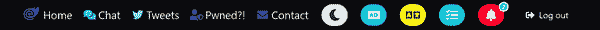

# 第二章。执行应用程序

在本章中，你将学习 Blazor WebAssembly 应用程序的启动执行过程——从静态 HTML 的渲染到调用引导 Blazor 的 JavaScript，你将探索应用程序的解剖结构。这包括 `Program` 入口点和启动约定。你将了解路由器、客户端导航、共享组件和布局。你还将学习应用程序中的顶级导航和自定义组件。所有这些都将通过 Learning Blazor 示例应用程序的源代码进行讲解。

尝试拥抱作为新开发者加入现有应用程序的心态——就像在现实世界中一样。设想你正在开始一个新的旅程，在这个旅程中，你将迅速了解现有代码库。我的角色是你的导师；我将仔细地遍历代码，向你展示并解释它正在做什么及如何做到这一点。你将了解到为什么做出了某些决策以及应该考虑哪些替代方法。你应该掌握这个模型应用程序的工作原理，并准备在未来的章节中使用它。

在上一章中，你学到了一些关于 Web 应用开发平台 ASP.NET Core 的知识，作为一个框架、开源开发、Web 的编程语言以及开发环境。现在让我们来谈谈代码。正如 Linux 的创建者 Linus Torvalds 所说，“谈话很廉价。给我看代码。”这个模型应用程序是整本书的基础，你将学习 Blazor 的所有主要功能以及如何使用其他令人惊叹的特性。我们将一起查看代码，你将阅读代码并让它告诉你它自己的故事。在接下来的几节中，你将学习 Blazor 框架如何初始化应用程序以及应用程序如何开始执行。建议你访问 [*https://webassemblyof.net*](https://webassemblyof.net) 查看最终的 Web 应用程序是什么样子。随意点击并尝试各种功能，以熟悉应用程序。

# 请求初始页面

让我们从评估客户端浏览器访问我们应用程序时发生的情况开始。它请求初始页面（根据其 URL），服务器返回 HTML。在 HTML 中，有 `<link>` 和 `<script>` 元素。这些定义了我们的 Blazor 应用程序启动时需要的额外资源的引用。这些资源包括但不限于 CSS、JavaScript、图像、Wasm 文件和 .NET 动态链接库（.dll 文件）。这些额外的资源会作为初始页面加载的一部分被请求，这时无法与应用程序进行交互。根据外围资源的大小和客户端的连接速度，应用程序变得交互的时间会有所不同。

交互时间（TTI）是网站准备接受用户输入之前所需的时间的测量。使用 Blazor WebAssembly 的一个权衡是应用程序的初始加载时间比 Blazor Server 的要长一些。应用程序必须在运行之前下载到浏览器中，而在 Blazor Server 中，应用程序是动态呈现在 Web 主机上的。这需要 .NET 运行时和配置的 Web 服务器。

###### 提示

使用 Blazor WebAssembly 的一个优势是应用可以作为静态 Web 应用程序托管。提供静态文件比提供动态内容要快得多，也更不容易出错。但这是有代价的。应用将被下载到客户端浏览器，并且客户端浏览器将不得不下载整个应用。这可能是一个很大的下载量，并且可能比在服务器上运行的应用慢一些。

Blazor WebAssembly 的 TTI 可能比 Blazor Server 的要长一些。假设，如果 TTI 超过几秒钟，用户会期望某种视觉指示，比如一个动画旋转的齿轮来显示应用正在加载。

使用 Blazor WebAssembly，您可以*延迟加载*完整的 .NET 程序集。这很像在 JavaScript 中做等效的事情——各种组件由 JavaScript 表示——但我们可以使用 C#。这个功能可以通过仅在需要时按需获取依赖程序集来使您的应用程序更有效。然而，在向您展示如何延迟加载程序集之前，您将学习 Blazor WebAssembly 应用程序启动如何加载程序集。

让我们从检查初始页面的 HTML 内容的部分开始。

# 应用程序启动和引导

以下 HTML 被提供给客户端，了解客户端浏览器在呈现时会做什么很重要。让我们跳进来看看 Web.Client 项目中的 *wwwroot/index.html* 文件。我知道这很多，但先阅读一遍，然后我们会逐步解释它：

```cs
<!DOCTYPE html>
<html class="has-navbar-fixed-top">

<head>
    <meta charset="utf-8" />
    <meta name="viewport"
        content="
 width=device-width, initial-scale=1.0,
 maximum-scale=1.0, user-scalable=no" />

    <title>Learning Blazor</title>

    <link href="https://cdn.jsdelivr.net/npm/bulma@0.9.3/css/bulma.min.css"
          rel="stylesheet">

    <!-- Bulma: micro extensions -->
    <link href="https://cdn.jsdelivr.net/npm/
 bulma-slider@2.0.4/dist/css/bulma-slider.min.css"
          rel="preload" as="style" onload="this.rel='stylesheet'">
    <link href="https://cdn.jsdelivr.net/npm/
 bulma-quickview@2.0.0/dist/css/bulma-quickview.min.css"
          rel="preload" as="style" onload="this.rel='stylesheet'">
    <link href="https://cdn.jsdelivr.net/npm/
 @creativebulma/bulma-tooltip@1.2.0/dist/bulma-tooltip.min.css"
          rel="preload" as="style" onload="this.rel='stylesheet'">
    <link href="https://cdn.jsdelivr.net/npm/
 bulma-badge@3.0.1/dist/css/bulma-badge.min.css"
          rel="preload" as="style" onload="this.rel='stylesheet'">
    <link href="https://cdn.jsdelivr.net/npm/
 @creativebulma/bulma-badge@1.0.1/dist/bulma-badge.min.css"
          rel="preload" as="style" onload="this.rel='stylesheet'">
    <link type="text/css" href="https://unpkg.com/bulma-prefers-dark"
          rel="preload" as="style" onload="this.rel='stylesheet'">

    <link href="/css/app.css" rel="stylesheet" />
    <link href="Web.Client.styles.css" rel="stylesheet" />
    <link href="/_content/Web.TwitterComponents/twitter-component.css"
          rel="stylesheet" />

    <link rel="manifest" href="/manifest.json" />
    <link rel="apple-touch-icon" sizes="512x512" href="/icon-512.png" />
    <link rel="apple-touch-icon" sizes="192x192" href="/icon-192.png" />
    <link rel="icon" type="image/png" sizes="32x32" href="/icon-32.png">
    <link rel="icon" type="image/png" sizes="16x16" href="/icon-16.png">

    <base href="/" />

    <script src="https://kit.fontawesome.com/b5bcf1e25a.js"
            crossorigin="anonymous"></script>
    <script src="/js/app.js"></script>
</head>

<body>
    <div id="app">
        <section id="splash" class="hero is-fullheight-with-navbar">
            <div class="hero-body">
                <div class="container has-text-centered">
                    
                    <div class="fa-3x is-family-code">
                        <span class="has-text-weight-bold">
                        Blazor WebAssembly:</span> Loading...
                        <i class="fas fa-sync fa-spin"></i>
                    </div>
                </div>
            </div>
        </section>
    </div>

    <div id="blazor-error-ui">
        <div class="modal is-active">
            <div class="modal-background"></div>
            <div class="modal-content">
                <article class="message is-warning is-medium">
                    <div class="message-header">
                        <p>
                            <span class="icon">
                                <i class="fas fa-exclamation-circle"></i>
                            </span>
                            <span>Error</span>
                        </p>
                    </div>
                    <div class="message-body">
                        An unhandled error has occurred.
                        <button class="button is-danger is-pulled-right"
                                onClick="
 window.location.assign(window.location.origin)">
                            <span class="icon">
                                <i class="fas fa-redo"></i>
                            </span>
                            <span>Reload</span>
                        </button>
                    </div>
                </article>
            </div>
            <button class="modal-close is-large" aria-label="close"></button>
        </div>
    </div>

    <script src="/_content/Microsoft.Authentication.WebAssembly.Msal/
 AuthenticationService.js"></script>
    <script src="/_framework/blazor.webassembly.js"></script>
    <script>navigator.serviceWorker.register('service-worker.js');</script>
</body>

</html>
```

让我们逐个解释每个主要部分。我们将从阅读`<head>`标签的子元素开始：

```cs
<head>
    <meta charset="utf-8" />
    <meta name="viewport"
        content="
 width=device-width, initial-scale=1.0,
 maximum-scale=1.0, user-scalable=no" />

    <title>Learning Blazor</title>

    <link href="https://cdn.jsdelivr.net/npm/bulma@0.9.3/css/bulma.min.css"
          rel="stylesheet">

    <!-- Bulma: micro extensions -->
    <link href="https://cdn.jsdelivr.net/npm/
 bulma-slider@2.0.4/dist/css/bulma-slider.min.css"
          rel="preload" as="style" onload="this.rel='stylesheet'">
    <link href="https://cdn.jsdelivr.net/npm/
 bulma-quickview@2.0.0/dist/css/bulma-quickview.min.css"
          rel="preload" as="style" onload="this.rel='stylesheet'">
    <link href="https://cdn.jsdelivr.net/npm/
 @creativebulma/bulma-tooltip@1.2.0/dist/bulma-tooltip.min.css"
          rel="preload" as="style" onload="this.rel='stylesheet'">
    <link href="https://cdn.jsdelivr.net/npm/
 bulma-badge@3.0.1/dist/css/bulma-badge.min.css"
          rel="preload" as="style" onload="this.rel='stylesheet'">
    <link href="https://cdn.jsdelivr.net/npm/
 @creativebulma/bulma-badge@1.0.1/dist/bulma-badge.min.css"
          rel="preload" as="style" onload="this.rel='stylesheet'">
    <link type="text/css" href="https://unpkg.com/bulma-prefers-dark"
          rel="preload" as="style" onload="this.rel='stylesheet'">

    <link href="/css/app.css" rel="stylesheet" />
    <link href="Web.Client.styles.css" rel="stylesheet" />
    <link href="/_content/Web.TwitterComponents/twitter-component.css"
          rel="stylesheet" />

    <link rel="manifest" href="/manifest.json" />
    <link rel="apple-touch-icon" sizes="512x512" href="/icon-512.png" />
    <link rel="apple-touch-icon" sizes="192x192" href="/icon-192.png" />
    <link rel="icon" type="image/png" sizes="32x32" href="/icon-32.png">
    <link rel="icon" type="image/png" sizes="16x16" href="/icon-16.png">

    <base href="/" />

    <script src="https://kit.fontawesome.com/b5bcf1e25a.js"
            crossorigin="anonymous"></script>
    <script src="/js/app.js"></script>
</head>
```

应用程序使用 Web 标准 UTF-8 字符集，并且还有一个`viewport`规范，这两者都是 HTML 中非常常见的`<meta>`标签。我们将页面的初始`<title>`设置为`"学习 Blazor"`。标题后是一组`<link>`元素。如果您花时间评估模板中默认的 Bootstrap CSS 的替代选项，您可能会考虑一个不依赖 JavaScript 的 CSS 框架。

在这种情况下，选择了 Bulma 作为 CSS 框架，因为它非常简单且干净。这与 Blazor 完美匹配，因为我们可以使用 C# 而不是 JavaScript 随意更改样式。正如 [Bulma 文档](https://oreil.ly/kstH3) 中所述，“Bulma 是一个 CSS 库。这意味着它提供了 CSS 类来帮助您样式化 HTML 代码。要使用 Bulma，您可以使用预编译的 *.css* 文件或安装 *.sass* 文件，以便根据需要自定义。” Bulma 提供了所有需要的内容来样式化网站；考虑到可扩展性，它具有现代实用程序、助手、元素、组件、表单和布局样式。Bulma 还拥有庞大的开发者社区追随者，分享扩展内容。这些额外的 CSS 包依赖于 Bulma 本身；它们只是覆盖或扩展现有的类定义。这与任何 Web 应用开发中的方法相同，不仅适用于 Blazor。

当我们看到 `<link>` 元素的 `rel` 属性设置为 `"preload"` 时，表示这些请求将异步进行。这是通过添加 `as="style" onload="this.rel='stylesheet'"` 属性实现的。这让浏览器知道 `<link>` 是用于样式表的。它最终会加载资源，并在加载时将 `rel` 设置为 `"stylesheet"`。我们可以将其视为 *加载时热替换策略*。我们将引入一些额外的 CSS 引用，用于滑块、快速视图、工具提示以及媒体查询中心的 `@media (prefers-color-scheme: dark) { /* styles */ }` 功能。这暴露了检测客户端首选颜色方案并应用适当样式的能力。例如，与默认的 `white` 相比，另一种颜色方案是 `dark`。这两种颜色方案涵盖了大多数 Web 用户体验。

然后，我们定义另一个 `<link>`，其 `href` 是到 Web 服务器上 */css/app.css* 路径的。

Bulma 中的重要样式没有使用 *加载时热替换策略*。在应用程序加载时，它会适当地进行样式设置，以传达应用程序正在工作的信息（见 图 2-1） 。应用程序还预先声明了 `<link rel="manifest" href="/​man⁠ifest.json" />`，并附带相应的 `<link>` 图标。这是为了显露图标和 PWA 的能力。根据 MDN 的 [HTML 参考指南](https://oreil.ly/X62KY)，“HTML `<base>` 元素指定文档中所有相对 URL 使用的基础 URL。文档中只能有一个 `<base>` 元素。”

在可能的情况下，所有应用程序都应考虑使用图标来提供更易访问的网络体验。正确使用图标可以立即传达信息和意图，通常只需很少的文本。我自豪地使用 Font Awesome；它们提供免费的服务，并可以在 Blazor 标记中无缝集成。一个`<script>`指向我 Font Awesome 的套件已经注册到我的应用。紧随 Font Awesome 源之后的下一行是应用程序的 JavaScript 部分。Web 应用程序开发的三个主要关注点分别位于 */js*、*/css* 和 */_content* 目录中。在熟悉了 `<head>` 节点的子元素之后，我们可以继续。接下来，我们将查看 `<body>` 节点的内容：

```cs
<body>
    <div id="app">
        <section id="splash" class="hero is-fullheight-with-navbar">
            <div class="hero-body">
                <div class="container has-text-centered">
                    
                    <div class="fa-3x is-family-code">
                        <span class="has-text-weight-bold">
                        Blazor WebAssembly:</span> Loading...
                        <i class="fas fa-sync fa-spin"></i>
                    </div>
                </div>
            </div>
        </section>
    </div>

    <div id="blazor-error-ui">
        <div class="modal is-active">
            <div class="modal-background"></div>
            <div class="modal-content">
                <article class="message is-warning is-medium">
                    <div class="message-header">
                        <p>
                            <span class="icon">
                                <i class="fas fa-exclamation-circle"></i>
                            </span>
                            <span>Error</span>
                        </p>
                    </div>
                    <div class="message-body">
                        An unhandled error has occurred.
                        <button class="button is-danger is-pulled-right"
                                onClick="
 window.location.assign(window.location.origin)">
                            <span class="icon">
                                <i class="fas fa-redo"></i>
                            </span>
                            <span>Reload</span>
                        </button>
                    </div>
                </article>
            </div>
            <button class="modal-close is-large" aria-label="close"></button>
        </div>
    </div>

    <script src="/_content/Microsoft.Authentication.WebAssembly.Msal/
 AuthenticationService.js"></script>
    <script src="/_framework/blazor.webassembly.js"></script>
    <script>navigator.serviceWorker.register('service-worker.js');</script>
</body>
```

`<body>` 元素中的第一个标签是 `<div id="app">...</div>`。这是 Blazor 应用程序的根，真正的单页应用程序。非常重要的一点是理解，此目标元素的内容将自动和动态地更改以表示 Wasm 应用程序对 DOM 的操作。大多数单页应用程序开发者会让用户体验成为一个巨大的白色墙壁，使用默认字体大小为`10pt`，黑色文本显示“加载中……”。这种用户体验是不可接受的。理想情况下，我们希望向用户提供视觉提示，表明应用程序正在响应和加载中。一种方法是让一个 `<div>` 最初代表一个基本的闪屏屏幕。在这种情况下，模型应用程序将包括 Blazor 标志图像和一个消息，显示为`"Blazor WebAssembly: Loading..."`，还会显示一个动画加载旋转图标。

`<section id="splash">...</section>` 作为加载标记的功能。当 Blazor 准备就绪时，它将被替换。这个标记不是 Blazor，而是 HTML 和 CSS。这个标记将类似于图 2-1 中显示的内容。如果没有这个标记，默认的加载体验将会是黑色文本并显示“加载中”。这使您能够自定义闪屏（或加载）屏幕的用户体验。

###### 小贴士

在编写 Blazor 应用程序时，您应考虑向应用程序添加加载指示器。这是一种很好的方法，可以让用户感知到进度，并在应用程序首次加载时避免“白屏死机”的现象。


###### 图 2-1\. 指示器让用户知道应用程序正在加载中

在 *index.html* 文件中，跟随 *app* 节点之后，有一个“blazor-error-ui” `<div>` 元素。这与模板不同，适合我们应用程序的样式。当 Blazor 自己启动时，此特定元素标识符将被使用。如果有任何无法恢复的错误，它将显示此元素。如果一切顺利，您不应该看到此元素。

在错误元素之后是几个剩余的 `<script>` 标签。这些是我们引用的组件（如身份验证和 Twitter 组件库）的 JavaScript 引用。最后两个 `<script>` 标签非常重要：

```cs
<script src="/_framework/blazor.webassembly.js"></script>
<script>navigator.serviceWorker.register('service-worker.js');</script>
```

第一个 `<script>` 标签引用的 JavaScript（*blazor.webassembly.js* 文件）是启动 Blazor WebAssembly 执行的来源。没有这一行，此应用程序除了一个永远加载的页面外将不会渲染任何内容。这个 JavaScript 文件启动了 Blazor 的启动子例程，在这里 WebAssembly 生效，JavaScript 交互开始，乐趣开始！各种 .NET 可执行文件，即 *.dll 文件，被获取，并准备好 Mono 运行时。作为 Blazor 启动子例程的一部分，文档中的 *app* 元素被发现。应用程序的入口点被调用。这是 .NET 应用程序在 WebAssembly 上下文中开始执行的地方。

第二个 `<script>` 标签注册了应用程序的服务工作线程 JavaScript 代码。这使得我们的应用程序成为 PWA，这是一个很好的功能。这是一种使您的应用程序离线可用和服务工作线程功能的方式。有关 PWA 的更多信息，请参阅 Microsoft 的 [“渐进式 Web 应用程序 (PWAs) 概述” 文档](https://oreil.ly/5Ji8p)。

# Blazor WebAssembly 应用程序内部

每个应用程序都有一个必需的入口点。在 Web 客户端应用程序中，这是对托管应用程序的 Web 服务器的初始请求。当运行 *_frame⁠work/​blazor.webassembly.js* 文件时，它开始请求 .dll 文件，运行时启动 Blazor 应用程序的可执行文件。与大多数其他 .NET 应用程序一样，在 Blazor WebAssembly 中，*Program.cs* 是入口点。示例 2-1 是模型应用程序的 Web.Client 项目的 *Program.cs* C# 文件。

##### 示例 2-1\. Web.Client/Program.cs

```cs
var builder = WebAssemblyHostBuilder.CreateDefault(args);
builder.RootComponents.Add<App>("#app");
builder.RootComponents.Add<HeadOutlet>("head::after");

if (builder.HostEnvironment.IsDevelopment())
{
    builder.Logging.SetMinimumLevel(LogLevel.Debug);
}

builder.ConfigureServices();

await using var host = builder.Build();

host.TrySetDefaultCulture();
await host.RunAsync();
```

Blazor 依赖于依赖注入作为其核心架构的一部分。

###### 注意

*依赖注入*（DI）被定义为一个对象声明其他对象作为依赖项，并且一种机制将这些依赖项注入到依赖对象中。一个基本的例子是 `ServiceOne` 需要 `ServiceTwo`，并且服务提供者在给定 `ServiceTwo` 依赖项时实例化 `ServiceOne`。在这个构造的示例中，`ServiceOne` 和 `ServiceTwo` 都必须在服务提供者中注册。每当使用 `ServiceOne` 时，服务提供者会实例化 `ServiceTwo` 并将其作为依赖项传递给 `ServiceOne`。

入口点简洁，并利用了 C# 的顶级程序语法，这需要更少的样板，如省略了 `class Program` 对象。我们从应用程序的 `args` 创建了一个默认的 `WebAssemblyHostBuilder`。`builder` 实例添加了两个根组件：首先是 `App` 组件，配对了 `#app` 选择器，它将解析我们在之前讨论的 *index.html* 文件中的 `<div id="app"></div>` 元素。其次，我们在 `<head>` 内容之后添加了一个 `HeadOutlet` 组件。这个 `Head​Out⁠let` 是由 Blazor 提供的，它使得能够动态附加或更新 HTML 文档的 `<meta>` 标签或相关的 `<head>` 内容。

当应用程序在开发环境中运行时，最小的日志记录级别会适当地设置为调试。`builder`调用了`ConfigureServices`，这是一个封装了客户端应用程序所需的各种服务注册的扩展方法。已注册的服务包括以下内容：

`ApiAccessAuthorizationMessageHandler`

用于使用访问令牌授权出站 HTTP 请求的自定义处理程序

`CultureService`

一个中间的自定义服务，专门用于封装与客户端`CultureInfo`相关的常见逻辑

`HttpClient`

一个由框架提供的 HTTP 客户端，配置了两字母 ISO 语言名称作为默认请求头的文化服务

`MsalAuthentication`

框架提供的 Azure 企业对消费者 (B2C) 和 Microsoft 身份验证库 (MSAL)，这些都是绑定并为应用程序的租户配置的

`SharedHubConnection`

一个自定义服务，将单个 SignalR `HubConnection` 与多个组件共享

`AppInMemoryState`

用于公开内存中应用程序状态的自定义服务

`CoalescingStringLocalizer<T>`

一个通用的自定义服务，利用了首先组件的本地化尝试，然后回退到共享的方法

`GeoLocationService`

用于查询给定经度和纬度的地理信息的自定义客户端服务

在所有服务注册之后，我们调用`builder.Build()`，这会返回一个`WebAssemblyHost`对象，这个类型实现了`IAsyncDisposable`接口。因此，我们要谨慎地使用`await using`这个`host`实例。这样异步使用`host`，并在不再需要时隐式地释放它。

## 在启动时检测客户端文化

你可能已经注意到`host`还使用了另一个扩展方法。`host.TrySetDefaultCulture`方法会尝试设置默认文化。在这个上下文中，`culture`由[`CultureInfo`](https://oreil.ly/PrM7u) .NET 对象表示，并且充当浏览器的区域设置，例如 `en-US`。该扩展方法在 Web.Client 项目的 *WebAssemblyHostExtensions.cs* C# 文件中定义：

```cs
namespace Learning.Blazor.Extensions;

internal static class WebAssemblyHostExtensions
{
    internal static void TrySetDefaultCulture(this WebAssemblyHost host)
    {
        try
        {
            var localStorage =
                host.Services.GetRequiredService<ILocalStorageService>();
            var clientCulture =
                localStorage.GetItem<string>(StorageKeys.ClientCulture);
            clientCulture ??= "en-US";

            CultureInfo culture = new(clientCulture);
            CultureInfo.DefaultThreadCurrentCulture = culture;
            CultureInfo.DefaultThreadCurrentUICulture = culture;
        }
        catch (Exception ex) when (Debugger.IsAttached)
        {
            _ = ex;
            Debugger.Break();
        }
    }
}
```

从`host`实例中，它的`Services`属性以`IServiceProvider`类型可用。这被暴露为`host.Services`，我们使用它来从 DI 容器中解析服务。这被称为*服务定位器模式*，因为服务是从提供程序手动定位的。

###### 提示

你不需要在其他地方使用这种模式，因为 .NET 会处理这些事情。在“最佳实践”的精神下，你应该始终优先选择框架提供的 DI（或第三方）容器实现。我们只是在这里使用它，因为我们想要以特定文化加载应用程序，这需要早期开始。

我们在应用程序的其他地方不需要使用这种模式，因为框架将通过构造函数或属性注入自动解析我们需要的服务。我们首先调用 `ILocalStorageService`，这在 第七章 中有描述。然后，我们要求它检索与 `StorageKeys.ClientCulture` 键对应的 `string` 值。`StorageKeys` 是一个静态类，用于保持应用程序一致性的各种字面值、常量和逐字值。如果 `clientCulture` 值为 `null`，我们将分配一个合理的默认值 `"en-US"`。

由于这些 `culture` 值来自客户端，我们不能信任它们 —— 这就是为什么我们用 `try`/`catch` 块来尝试创建 `CultureInfo`。最后，我们运行与上下文 `host` 实例相关联的应用程序。从这个入口点开始，`App` 组件是第一个启动的 Blazor 组件。

## 布局、共享组件和导航

*App.razor* 文件是所有 Blazor 组件中的第一个，它包含 `<Router>`，用于提供与导航状态对应的数据。考虑 Web.Client 项目中 *App.razor* 文件标记的以下内容：

```cs
<CascadingAuthenticationState>
    <Error>
        <Router AppAssembly="@typeof(App).Assembly" Context="routeData">
            <Found>
                <AuthorizeRouteView RouteData="@routeData"
                                    DefaultLayout="@typeof(MainLayout)">
                    <NotAuthorized>
                        @if (context.User?.Identity?.IsAuthenticated ?? false)
                        {
                            <p>
                            You are not authorized to access this resource.
                            </p>
                        }
                        else
                        {
                            <RedirectToLogin />
                        }
                    </NotAuthorized>
                </AuthorizeRouteView>
            </Found>
            <NotFound>
                <LayoutView Layout="@typeof(MainLayout)">
                    <NotFoundPage />
                </LayoutView>
            </NotFound>
        </Router>
    </Error>
</CascadingAuthenticationState>
```

这是应用程序本身的顶层 Blazor 组件，恰当地命名为 `App`。`App` 组件是第一个被渲染的组件。它是应用程序的根组件，所有应用程序的子组件都在这个组件内部渲染。

### Blazor 导航要点

让我们深入评估 `App` 组件的标记，并理解其各个部分。

`<CascadingAuthenticationState>` 组件是我们应用程序中最外层的组件。顾名思义，它将认证状态级联到感兴趣的子组件。

###### 注意

通过组件层次结构传播状态的方法由于易用性和与相关模式（如 CSS 类似）的相似性而变得非常常见。同样的概念在操作系统层面也适用，比如轻量级目录访问协议（LDAP）权限系统。尝试在图形中考虑这个思路，因为这是软件中有图形/树状结构需要级联的常见模式。这就是级联状态背后的理念。

以一个祖先组件为例，可以定义一个 `<CascadingValue>` 组件，并赋予任意值。这个值可以沿着组件层次结构流向任意数量的后代组件。消费组件使用 `CascadingParameter` 属性从父组件接收这个值。随着我们继续探索应用程序，这个概念将会被更详细地覆盖。让我们继续下降到组件层次结构中。

第一个嵌套子组件是 `Error` 组件。它是一个自定义组件，定义在 *Error.razor* 文件中：

```cs
@inject ILogger<Error> Logger 

<CascadingValue Value=this>  @ChildContent </CascadingValue> @code {  [Parameter]
    public RenderFragment? ChildContent { get; set; } = null!;  public void ProcessError(Exception ex)  {
        Logger.LogError("Error:ProcessError - Type: {Type} Message: {Message}",
            ex.GetType(), ex.Message);
    }
}
```


`@inject` 语法是 Razor 指令。


`Error` 组件使用了 *cascades*。


`@code` 指令是向组件添加 C# 类范围成员的一种方式。


`ChildContent` 属性是一个参数。


`ProcessError` 方法对所有消费组件都是可访问的。

作为 Blazor 开发的一部分，有几个常见的指令。这个特定的指令指示 Razor 视图引擎从服务提供程序 *注入* `ILogger<Error>` 服务。这是 Blazor 组件使用 DI 的方式，通过属性注入而不是构造函数注入。

`<CascadingValue>` 标记包括 `@Child​Con⁠tent` 的模板渲染。`ChildContent` 同时是 `[Parameter]` 和 `RenderFragment`。这允许 `Error` 组件呈现任何子内容，包括 Blazor 组件。在模板化组件的单个 `RenderFragment` 定义时，其子内容可以表示为纯 Razor 标记。

`RenderFragment` 是一个返回 `void` 的 `delegate` 类型，接受 `RenderTreeBuilder`。它表示 UI 内容的一个片段。`RenderTreeBuilder` 类型是一个低级 Blazor 类，公开了用于构建 DOM 的 C# 表示的方法。

`<CascadingValue>` 是一个 Blazor（或框架提供的）组件，为所有后代组件提供级联值。`CascadingValue.Value` 被分配为 `this`，即 `Error` 组件实例本身。这意味着所有后代组件如果选择消耗它，将能够访问 `ProcessError` 方法。后代组件需要定义一个 `[CascadingParameter]` 属性，类型为 `Error`，才能使其流入其中。

`Parameter` 属性由 Blazor 提供，用于表示组件的属性是参数。这些作为绑定目标从消费组件作为 Razor 标记中的属性分配可用。

`ProcessError` 方法期望一个 `Exception` 实例，用于记录为错误。`Error` 组件的子内容是 `Router`。`Router` 组件是我们 SPA 的客户端路由的实现，这意味着路由发生在客户端，页面不需要刷新。

### 路由器

`Router`是框架提供的组件，用于*src/Web.Client/App.razor*文件。它指定了一个`AppAssembly`参数，按照惯例将其赋给`typeof(App).Assembly`。此外，`Context`参数允许我们指定参数的名称。我们分配了`routeData`的名称，覆盖了默认名称`context`。`Router`还定义了多个命名的`RenderFragment`组件；因为有多个，我们必须明确指定子内容。这就是对应的`RenderFragment`名称的用处。例如，当路由器无法找到匹配的路由时，我们定义页面应该渲染`NotFound`内容。考虑以下`Router`标记中的`NotFound`内容部分：

```cs
<NotFound>
    <LayoutView Layout="@typeof(MainLayout)">
        <NotFoundPage />
    </LayoutView>
</NotFound>
```

此布局基于`MainLayout`组件，并将其子项设置为`NotFoundPage`组件。假设用户导航到不存在的路由，他们将会进入我们自定义的 HTTP 404 页面，该页面与我们的应用程序一致地本地化和样式化。我们将在下一节处理 HTTP 状态码 401。但是，当路由器确实匹配预期的路由时，将渲染`Found`内容。考虑以下`Router`标记中的`Found`内容部分：

```cs
<Found>
    <AuthorizeRouteView RouteData="@routeData"
        DefaultLayout="@typeof(MainLayout)">
        <NotAuthorized>
            @if (context.User?.Identity?.IsAuthenticated ?? false)
            {
                <p>HTTP 401</p>
            }
            else
            {
                <RedirectToLogin />
            }
        </NotAuthorized>
    </AuthorizeRouteView>
</Found>
```

### 未经授权时重定向到登录页

如果您还记得之前的内容，`Found`内容只是一个`RenderFragment`。在这种情况下，子内容是`AuthorizeRouteView`组件。此路由视图仅在用户被授权查看时显示。它遵循`MainLayout`作为其默认值。`RouteData`从上下文的`routeData`分配。路由数据本身定义了路由器将渲染的组件以及来自路由的相应参数。

当用户未经授权时，我们使用`RedirectToLogin`组件将其重定向到登录屏幕：

```cs
@inject NavigationManager Navigation 

@code {
    protected override void OnInitialized() 
    {
        string returnUrl = Uri.EscapeDataString(Navigation.Uri);
        Navigation.NavigateTo(
            $"authentication/login?returnUrl={returnUrl}");
    }
}
```


`RedirectToLogin`组件需要`NavigationManager`。


`OnInitialized`方法导航到身份验证登录页面。

`RedirectToLogin`组件注入了`NavigationManager`，并且在初始化时导航到`authentication/login`路由，带有转义的`returnUrl`查询字符串。当用户被授权时，路由视图将渲染`MainLayout`，它是 Blazor 的`LayoutComponentBase`的子类。虽然标记定义了应用程序的所有布局，但它也在适当的位置打散`@Body`。这是另一个从`LayoutComponentBase`继承的`RenderFragment`。正如用户在站点上导航时，路由器动态更新 DOM，渲染 Blazor 组件在`@Body`段内。

我们 `override` 了 `OnInitialized` 方法。这是我们首次查看重写 `ComponentBase` 类功能，但在 Blazor 中非常常见。`ComponentBase` 类中有几个 `virtual` 方法（可以重写的方法），大多数代表组件生命周期的不同阶段。

### Blazor 组件生命周期

继续从上述 *RedirectToLogin.razor.* 文件开始，存在一个名为 `OnInitialized` 的 `override` 方法。这个方法是组件生命周期中特定点之一的几个生命周期方法之一。Blazor 组件继承了 `Microsoft.AspNetCore.Components.ComponentBase` 类。请参考 Table 2-1 以供参考。

表 2-1\. `ComponentBase` 生命周期方法

| 顺序 | 方法名 | 描述 |
| --- | --- | --- |
| 1 | `SetParametersAsync` | 设置组件在渲染树中由其父组件提供的参数 |
| 2 | `OnInitialized` `OnInitializedAsync` | 当组件准备就绪时调用的方法，从其父组件在渲染树中接收到其初始参数 |
| 3 | `OnParametersSet` `OnParametersSetAsync` | 当组件从其父组件接收到渲染树中的参数并且传入值已分配给属性时调用的方法 |
| 4 | `OnAfterRender` `OnAfterRenderAsync` | 在每次组件渲染后调用的方法 |

### MainLayout 组件

*MainLayout.razor* 文件，顾名思义，表示主要布局。在此标记中，导航栏（navbar）、头部、底部和内容区域都被组织和结构化了：

```cs
@inherits LayoutComponentBase  @inject IStringLocalizer<MainLayout> Localizer <section class="hero is-fullheight-with-navbar"> 
    <div class="hero-head">
        <header class="navbar is-size-5 is-fixed-top">
            <div class="container">
                <div class="navbar-brand">
                    <NavLink class="navbar-item" href="" 
                             Match="NavLinkMatch.All">
                        <span class="pr-2">
                            
                        </span>
                        <span>@Localizer["Home"]</span>
                    </NavLink>

                    <a role="button" class="navbar-burger" aria-label="menu"
                       aria-expanded="false" data-target="navbar">
                        <span aria-hidden="true"></span>
                        <span aria-hidden="true"></span>
                        <span aria-hidden="true"></span>
                    </a>
                </div>
                <div id="navbar" class="navbar-menu"> 
                    <div class="navbar-start">
                        <AuthorizeView>
                            <Authorized>
                                <NavBar />
                            </Authorized>
                        </AuthorizeView>
                    </div>
                    <div class="navbar-end">
                        <AuthorizeView>
                            <Authorized>
                                <ThemeIndicatorComponent />
                                <AudioDescriptionComponent />
                                <LanguageSelectionComponent />
                                <NotificationComponent />
                            </Authorized>
                        </AuthorizeView>
                        <LoginDisplay />
                    </div>
                </div>
            </div>
        </header>
    </div>

    <div class="hero-body">
        <div class="container has-text-centered is-fluid mx-5"> @Body 
        </div>
    </div>

    <footer class="footer" style="padding-bottom: 4rem;"> 
        <PageFooter />
    </footer>
</section>
```


此布局 Razor 文件的前两行是两个 C# 表达式，由其前导 `@` 符号指示。


`<section>` 是一个原生 HTML 元素，它在 Razor 语法中是完全有效的。


在 `<section>` 元素的语义头部和导航栏中，引用了 `<NavLink>`。


下一个导航栏部分是由自定义 `NavBar` 组件构建而成。


在 DOM 的中心定义了 `@Body` 渲染片段。


原生 HTML `footer` 元素是自定义 `PageFooter` 组件的父元素，负责渲染页面底部。

这两个指令代表了此组件内部所需的各种行为。两者中的第一个是`@inherits`指令，它指示组件从`LayoutComponentBase`类继承。这意味着它是框架的`LayoutComponentBase`类的子类。此布局基类实现了`IComponent`并公开了一个`Body`渲染片段。这使得我们可以将内容设置为应用程序的`Router`输出的任何内容。主要布局组件使用`@inject`指令请求服务提供者来解析`IString​Lo⁠calizer<MainLayout>`，并将其分配给一个名为`Localizer`的组件可访问成员。我们将在第五章中详细讨论本地化。

`<section>`是一个原生 HTML 元素，它是完全有效的 Razor 语法。注意我们如何可以无缝地在 C#和 HTML 之间进行过渡。我们定义了一些标准的 HTML，带有一些语义化的标记。你对 HTML 和 CSS 有所熟悉，我们不会过多强调这一点。因为这是一个如此大的项目，我们很可能会由我们想象中的 UX 部门提供这些 HTML 和 CSS。

在`<section>`元素的语义化标题和导航栏中，引用了`<NavLink>`。这是一个由框架提供的组件。`NavLink`组件用于暴露组件逻辑的用户交互部分。它处理 Blazor 应用程序的路由，并依赖于浏览器 URL 栏中的值。这代表了应用程序的“主页”导航路由，并带有 Blazor 标志。

导航栏的下一个部分是使用自定义的`NavBar`组件构建的。这里有一些熟悉的保护性标记，当`AuthorizerView`有授权内容在浏览器中渲染时，应用程序才会显示它。前面提到的组件要么左对齐要么居中，而下一个组件则分组并推到导航栏的末尾或最右侧。这组件组合的右侧是一个`LoginDisplay`。让我们深入了解`LoginDisplay`组件（另请参见“理解 LoginDisplay 组件”）。这些元素组是主题感知的，这意味着它将以两种方式之一进行渲染，即`dark`主题或`light`主题（请参见“头部和尾部组件”的视觉示例）。

`@Body`渲染片段被定义在 DOM 的中心位置。`@Body`是 Blazor 导航的主要组成部分，也是路由器的输出目标。换句话说，当用户导航时，客户端路由将 HTML 渲染在`@Body`占位符内。

### 自定义的 NavBar 组件

诚然，从该布局组件标记中吸取的信息很多，但当您花时间逐个理解每个部分时，它将会变得清晰明了。其中有几个自定义组件，其中之一是`<NavBar />`。它引用了*NavBar.razor*文件：

```cs
@inherits LocalizableComponentBase<NavBar> 

<NavLink class="navbar-item" href="/chat" Match="NavLinkMatch.Prefix"> 
    <span class="icon pr-2">
        <i class="chat fas fa-comments"></i>
    </span>
    <span>@Localizer["Chat"]</span>
</NavLink>
<NavLink class="navbar-item" href="/tweets" Match="NavLinkMatch.Prefix"> 
    <span class="icon pr-2">
        <i class="twitter fab fa-twitter"></i>
    </span>
    <span>@Localizer["Tweets"]</span>
</NavLink>
<NavLink class="navbar-item" href="/pwned" Match="NavLinkMatch.Prefix"> 
    <span class="icon pr-2">
        <i class="pwned fas fa-user-shield"></i>
    </span>
    <span translate="no">Pwned?</span>
</NavLink>
```


继承自 `LocalizableComponentBase` 以利用基本功能。


`<NavLink>` 组件由框架提供，并与路由器一起使用。


第二个路由是用于推文，对应 `/tweets` 路由。


第三个路由是用于 Pwned？对应 `/pwned` 路由。

像大多数自定义组件一样，这个组件也继承自 `LocalizableComponentBase` 以利用基本功能。基本功能在 第五章 中有详细描述。框架提供的 `<NavLink>` 组件与路由器一起工作。第一个路由是聊天室，对应 `/chat` 路由。虽然之前的每个路由名称都是使用 `@Localizer` 索引器检索的，但“Pwned？”路由不是，因为它是一个品牌名。

### 标题和页脚组件

应用程序的标题包含指向主页、聊天、推文、Pwned 和联系页面的链接。这些都是 `Router` 将识别的可导航路由。右侧的图标用于主题、音频描述、语言选择、任务列表、通知和登出。登出功能依赖于应用程序的导航以导航到路由，但其他按钮可以视为实用按钮。它们打开用于全局功能的模态框并公开用户首选项。标题本身支持 `dark` 和 `light` 主题，如图 2-2 和 2-3 所示。



###### 图 2-2\. 具有 `dark` 主题的示例导航标题


###### 图 2-3\. 具有 `light` 主题的示例导航标题

让我们首先看看定义在 *PageFooter.razor* 文件中的 `PageFooter` 组件：

```cs
@inherits LocalizableComponentBase<PageFooter> 

<div class="columns has-text-centered">
    <p class="column"> 
        <strong translate="no"> Learning Blazor </strong> by <a href="@DavidPineUrl" target="_blank"> David Pine. </a>
    </p>
    <p class="column">  The <a href="@CodeUrl" target="_blank">
            <i class="fab fa-github"></i> source code </a> is licensed <a href="@LicenseUrl"> MIT. </a>
    </p>
    <p class="column"> 
        <a href="/privacy">@Localizer["Privacy"]</a> &bull;
        <a href="/termsandconditions">@Localizer["Terms"]</a>
    </p>
    <p class="column">  @_frameworkDescription </p>
</div>
```


组件继承自 `LocalizableComponentBase` 类。


第一列读取 `"Learning Blazor by David Pine"`。


在第二列，有两个链接：一个是源代码的 MIT 许可证，另一个是 GitHub 源代码链接。


第三列包含 *隐私* 和 *条款和条件* 页面的链接。


最后一列包含客户端浏览器正在运行的 .NET 运行时版本。

我们正在建立一种模式，通过使自定义组件从`LocalizableComponentBase`通用基类继承。自定义的`PageFooter`组件通过定义一个四列布局并居中文本来编写。从左到右从第一列开始，显示应用程序名称和一个标题为`"Learning Blazor by David Pine"`的非可翻译粗体短语。第二列链接到源代码的 MIT 许可证和 GitHub 源代码链接。第三列包含*隐私*和*条款与条件*页面的链接，并进行了本地化处理。Blazor 应用程序的本地化在第五章中有详细介绍。.NET 运行时版本非常有用，因为它立即告诉开发人员正在使用的框架版本。

多数情况下，我更喜欢我的 Razor 标记文件配有代码后端文件。这样，分离的文件有助于在 Razor 中存在标记和在 C#中存在逻辑的问题。对于简单组件、具有少量参数和标记元素的组件，仅在 Razor 文件中使用`@code`指令也是可以的。但是在使用代码后端方法时，您可以将其视为*组件阴影*，因为组件的标记被 Visual Studio 编辑器中的 C#文件所遮蔽，如图 2-4 所示。

###### 注

组件阴影是指创建一个与现有 Razor 文件同名但附加*.cs*文件扩展名的 C#文件。例如，*PageFooter.razor*和*PageFooter.razor.cs*文件就展示了组件阴影，因为它们在 Visual Studio 编辑器中嵌套，并且共同代表`public partial PageFooter class`。


###### 图 2-4\. Visual Studio 解决方案资源管理器中的组件阴影

考虑*PageFooter.razor.cs*组件阴影文件：

```cs
namespace Learning.Blazor.Shared
{
    public partial class PageFooter
    {
        const string CodeUrl = 
            "https://github.com/IEvangelist/learning-blazor";
        const string LicenseUrl =
            "https://github.com/IEvangelist/learning-blazor/blob/main/LICENSE";
        const string DavidPineUrl =
            "https://davidpine.net";

        private string? _frameworkDescription;

        protected override void OnInitialized() => 
            _frameworkDescription = AppState.FrameworkDescription;
    }
}
```


定义了几个常量。


`OnInitialized`生命周期方法分配框架描述。

定义了几个包含 URL 文本的`const string`字段。这些字段用于与 Razor 标记绑定。我们`override`了`OnInitialized`生命周期方法，并从继承的`LocalizableComponentBase.AppState`变量分配了`_frameDescription`值。

组件还能够根据客户端浏览器偏好的`light`或`dark`主题进行自动适配。例如，请参见 2-5 和 2-6 图。


###### 图 2-5\. 具有`dark`主题的示例页脚


###### 图 2-6\. 具有`light`主题的示例页脚

页脚并不追求过多，而是故意保持简单，仅提供一些应用程序相关信息的链接。

`MainLayout`组件不仅仅是 Razor 标记；它还具有一个带有阴影的组件。考虑*MainLayout.razor.cs*文件：

```cs
using System.Runtime.InteropServices;
using Learning.Blazor.Services;
using Microsoft.AspNetCore.Components;

namespace Learning.Blazor.Shared
{
    public sealed partial class MainLayout : IDisposable 
    {
 [Inject]
        public AppInMemoryState? AppState { get; set; } 

        protected override void OnInitialized() 
        {
            if (AppState is not null)
            {
                AppState.StateChanged += StateHasChanged;
                AppState.FrameworkDescription =
                    RuntimeInformation.FrameworkDescription;
            }

            base.OnInitialized();
        }

        void IDisposable.Dispose() 
        {
            if (AppState is not null)
            {
                AppState.StateChanged -= StateHasChanged;
            }
        }
    }
}
```


`MainLayout` 是一个 `sealed partial class`。


`AppInMemoryState` 实例被注入到组件中。


`OnInitialized` 方法被重写，以允许订阅 `AppInMemoryState.StateChanged` 事件。


`Dispose` 方法取消订阅 `AppInMemoryState.StateChanged` 事件。

您会注意到 `MainLayout` 是一个 `sealed partial class`；它是 `partial` 的，以便作为 Razor 标记的代码后台，它是 `sealed` 的，因此不能被其他组件继承。它实现了 `IDisposable` 接口以执行必要的清理工作。让我们确保我们遵循 *组件阴影* 和 *组件继承* 的概念。

`AppInMemoryState` 实例被注入到组件中。此应用状态对象仅存在于内存中；如果用户刷新页面，则状态将丢失。

`OnInitialized` 方法从基类重写，并用于订阅 `AppInMemoryState.StateChanged` 事件。事件处理程序是框架提供的 `ComponentBase.StateHasChanged` 方法。事件处理是 C# 的常见习语，非常有用。`StateHasChanged` 方法通知组件其状态已更改。在适用的情况下，这将导致组件重新渲染。`AppState.FrameworkDescription` 是从 `Runtime​Informa⁠tion.FrameworkDescription` 赋值的。这是在页脚右侧列显示的值，例如 “.NET 6”。

###### 提示

只有在必要时调用 `StateHasChanged` 方法，以避免可能不必要地强制组件重新渲染。在异步上下文中调用此方法时，请将其包装在 `await` 语句中，并将其传递给 `InvokeAsync` 方法。这将在关联的渲染器同步上下文中执行提供的工作项，确保它在适当的线程上执行。

在以下情况下，您可能需要显式调用 `StateHasChanged`：

+   异步处理程序涉及多个异步阶段。

+   Blazor 渲染和事件处理系统接收来自外部的调用。

+   您需要在不重新渲染特定事件的子树之外呈现组件。

有关触发渲染的更多信息，请参阅 Microsoft 的 [“ASP.NET Core Razor 组件渲染”文档](https://oreil.ly/Kt3cm)。

`Dispose` 方法确保如果 `AppState` 实例 `不为 null`，它将取消订阅 `AppInMemoryState.StateChanged` 事件。这种显式清理有助于确保组件不会因未取消订阅事件处理程序而导致内存泄漏。

### 一个内存中的应用状态模型

Blazor 应用程序可以使用内存方法存储其状态。在此方法中，您将注册您的应用状态容器作为单例服务，这意味着应用程序共享的只有一个实例。服务本身公开了一个事件，订阅`StateHasChanged`方法，并且在状态对象的属性更新时触发该事件。考虑*C#文件 AppInMemoryState.cs*：

```cs
using Learning.Blazor.BrowserModels;

namespace Learning.Blazor.Services;

public sealed class AppInMemoryState
{
    private readonly ILocalStorageService _localStorage; 
    private string? _frameworkDescription;
    private ClientVoicePreference? _clientVoicePreference;
    private bool? _isDarkTheme;

    public AppInMemoryState(ILocalStorageService localStorage) =>
        _localStorage = localStorage;

    public string? FrameworkDescription 
    {
        get => _frameworkDescription;
        set
        {
            _frameworkDescription = value;
            AppStateChanged(); 
        }
    }

    public ClientVoicePreference ClientVoicePreference
    {
        get => _clientVoicePreference ??=
            _localStorage.GetItem<ClientVoicePreference>(
                StorageKeys.ClientVoice)
            ?? new("Auto", 1);
        set
        {
            _localStorage.SetItem(
                StorageKeys.ClientVoice,
                _clientVoicePreference = value ?? new("Auto", 1));

            AppStateChanged();
        }
    }

    public bool IsDarkTheme
    {
        get => _isDarkTheme ??=
            _localStorage.GetItem<bool>(StorageKeys.PrefersDarkTheme);
        set
        {
            _localStorage.SetItem(
                StorageKeys.PrefersDarkTheme,
                _isDarkTheme = value);

            AppStateChanged();
        }
    }

    public Action<IList<Alert>>? WeatherAlertReceived { get; set; }
    public Action<ContactComponentModel>? ContactPageSubmitted { get; set; }

    public event Action? StateChanged; 

    private void AppStateChanged() => StateChanged?.Invoke(); 
}
```


这些字段和属性表示了各种应用程序状态。


我们将呈现`FrameworkDescription`属性。


调用了`AppStateChanged`方法。


有一个名为`StateChanged`的`Action`字段。


`AppStateChanged`方法调用了`StateChanged`事件。

声明了几个备份字段，用于存储表示各种应用程序状态的各个公共可访问属性的值。

以通信应用程序状态更改模式为例，考虑`FrameworkDescription`属性。其`get`访问器访问备份字段，而`set`访问器则将其分配给备份字段。

在将`value`分配给备份字段之后，将调用`AppStateChanged`方法。所有属性及其对应的备份字段都遵循此模式。

该类公开了一个名为`StateChanged`的可空`Action`作为事件。感兴趣的方可以订阅此事件以获取更改通知。

`AppStateChanged`方法表示为调用`StateChanged`事件。当事件为`null`时，它条件上是 NOOP（或“无操作”）。

此内存状态管理机制用于公开客户端语音偏好，客户端是否偏爱暗黑主题以及框架描述的值。要使应用程序状态在浏览器会话之间持久化，您可以使用另一种方法，如本地存储。每种方法都有权衡；使用内存中的应用程序状态少了工作量，但不会在浏览器会话之间持久存在。要持久存在浏览器会话之间，您依赖 JavaScript 交互操作来使用本地存储机制。

###### 注意

如果您是 JavaScript SPA 开发人员，则可能熟悉*Flux 模式*。它由 Facebook 引入，以提供明确的关注点分离。该模式随着 React Redux 项目的流行而增长，后者是在 React 中使用的 Flux 模式的 JavaScript 实现。在 Blazor 中有一个名为[Fluxor](https://oreil.ly/nI5v3)的实现，由 Peter Morris 开发。虽然超出本书的范围，但作为潜在的内存状态管理选项值得探讨。

### 理解`LoginDisplay`组件

`LoginDisplay`组件仅向 HTML 渲染少量内容，但需要理解一些代码：

```cs
@inherits LocalizableComponentBase<LoginDisplay>  @inject SignOutSessionStateManager SignOutManager <span class="navbar-item">
    <AuthorizeView> 
        <Authorizing>
            <button class="button is-rounded is-loading level-item" disabled> @Localizer["LoggingIn"] </button>
        </Authorizing>
        <Authorized> @{
                var user = context.User!;
                var userIdentity = user.Identity!;
                var userToolTip =
                    $"{userIdentity.Name} ({user.GetFirstEmailAddress()})";
            } <button class="
		button is-rounded level-item has-tooltip-right has-tooltip-info"
                data-tooltip=@(userToolTip) @onclick="OnLogOut">
                <span class="icon">
                    <i class="fas fa-sign-out-alt"></i>
                </span>
                <span>@Localizer["LogOut"]</span>
            </button>
        </Authorized>
        <NotAuthorized>
            <button class="button is-rounded level-item" @onclick="OnLogIn">
                <span class="icon">
                    <i class="fas fa-sign-in-alt"></i>
                </span>
                <span>@Localizer["LogIn"]</span>
            </button>
        </NotAuthorized>
    </AuthorizeView>
</span>
```


该组件定义了两个指令。


该组件的标记使用了框架提供的`AuthorizeView`组件。

该组件定义了两个指令：一个指定它从`LocalizableComponentBase`继承，另一个*注入*`SignOutSessionStateManager`服务。`LocalizableComponentBase`是一个自定义的基础组件，在第五章中有详细介绍。

该组件的标记使用`AuthorizeView`组件及其各种依赖于授权状态的模板来呈现内容，当用户正在授权、已经授权或未经授权时。每个状态都有独立的标记。

在进行授权时，“正在登录”消息被本地化并呈现到屏幕上。当用户经过授权时，`context`暴露了分配给`user`变量的`ClaimsPrincipal`对象。考虑前面标记中的`Localizer`对象。这种特定类型来自于自定义`LocalizableComponentBase<LoginDisplay>`类的继承。这个`Localizer`提供了基于 Microsoft 资源驱动的键/值对（KVPs）和框架的`IStringLocalizer<T>`类型的本地化功能。自定义的*LocalizableComponentBase.cs*类位于*Components*目录中。

代码创建了一个工具提示，它将呈现用户姓名和电子邮件地址的字符串连接。工具提示绑定到按钮元素的`data-tooltip`属性。这是 Bulma CSS 框架中工具提示的一部分。当悬停在注销按钮上时，将呈现消息。当用户未经授权时，我们会呈现一个带有本地化登录消息的按钮。

接下来，让我们来看一下它的阴影组件，*LoginDisplay.cs*文件：

```cs
using Microsoft.AspNetCore.Components.Web;

namespace Learning.Blazor.Shared
{
    public partial class LoginDisplay
    {
 [Inject]
        public NavigationManager Navigation { get; set; } = null!;

        void OnLogIn(MouseEventArgs args) =>
            Navigation.NavigateTo("authentication/login", true);

        async Task OnLogOut(MouseEventArgs args)
        {
            await SignOutManager.SetSignOutState();
            Navigation.NavigateTo("authentication/logout");
        }
    }
}
```

该组件提供了两个使用注入的`Navigation`服务的函数。`Navigation`属性由 DI 框架分配，并且在功能上等同于组件的`@inject`指令语法。每个方法导航到所需的认证路由。当调用`OnLogOut`时，在导航之前，`SignOutManager`将其登出状态设置。每个路由由应用程序相应的认证逻辑处理。用户在经过身份验证后将在注销按钮旁看到其姓名，但如果未经身份验证，则仅会看到登录按钮。用户可以通过提供和验证其电子邮件与应用程序注册。这由 Azure Active Directory（Azure AD）业务对消费者（B2C）管理。作为与应用程序注册的替代方案，您可以使用可用的第三方身份验证提供程序，如 Google、Twitter 和 GitHub。

### 原生主题感知

对于所有现代 Web 应用程序，强烈建议应用程序具备色彩方案感知能力。从 CSS 中，很容易指定针对媒体相关查询值的样式规则。考虑以下 CSS：

```cs
@media (prefers-color-scheme: dark) {
    /*
 Styles here are only applied when the browser
 has a specified color scheme of "dark".
 */
}
```

此媒体查询中的规则仅在浏览器设置为偏好 `dark` 主题时应用。这些媒体查询也可以通过 JavaScript 从程序中访问。使用 [`window.matchMedia` 方法](https://oreil.ly/uFPAD) 检测客户端浏览器偏好的更改。首先让我们看一下 *ThemeIndicator​Com⁠ponent.razor* 文件：

```cs
@inherits LocalizableComponentBase<ThemeIndicatorComponent> 

<span class="navbar-item"> 
    <button class="button is-@(_buttonClass)
		has-tooltip-left has-tooltip-info is-rounded level-item"
        data-tooltip=@Localizer
            [AppState.IsDarkTheme ? "DarkTheme" : "LightTheme"]>
        <span class="icon">
            <i class="fas fa-@(_iconClass)"></i>
        </span>
    </button>
</span>

<HeadContent> 
    <meta name="twitter:widgets:theme"
          content='@(AppState.IsDarkTheme ? "dark" : "light")'>
</HeadContent>
```


继承自通用的 `LocalizableComponentBase` 类。


`ThemeIndicatorComponent` 的主要标记是按钮。


`ThemeIndicatorComponent` 使用 `<HeadContent>`。

希望您已经注意到，许多组件都是从通用的 `LocalizableComponentBase` 类继承而来。我们将在 第五章 再次讨论这一点。只需知道它公开了一个 `Localizer` 成员，通过自由索引器可以让我们根据字符串键获取本地化字符串值。

`ThemeIndicatorComponent` 的主要标记是按钮。按钮的 `class` 属性混合了直接的类名和在运行时求值的 Razor 表达式。`_buttonClass` 成员是一个 C# 字符串字段，绑定到 `"is-"` 前缀。此按钮还有一个工具提示，其消息根据 `_isDarkTheme` 布尔值的三元表达式有条件地赋值。Font Awesome 类也绑定到 `_iconClass` 字段成员。

`ThemeIndicatorComponent` 使用 `<HeadContent>`。这是一个由框架提供的组件，允许我们动态更新 HTML 的 `<head>` 内容。它非常强大，用于在运行时更新 `<meta>` 元素非常有用。当主题为 `dark` 时，应用程序指定 Twitter 小部件也应相应地进行主题设置。

###### 注意

虽然 `HeadContent` 组件可以更新 `meta` 标签，但在使用 Blazor WebAssembly 时，这对于搜索引擎优化（SEO）来说仍然不是理想的。这是因为 `meta` 标签是动态更新的。要实现静态的 `meta` 标签值，您必须使用 Blazor WebAssembly 预渲染。有关组件集成方案的更多信息，请参阅微软的 [“预渲染和集成 ASP.NET Core Razor 组件” 文档](https://oreil.ly/NmB4A)。

接下来，让我们看一下其对应的组件阴影，即 C# 文件 *ThemeIndicator​Component.razor.cs*：

```cs
using Learning.Blazor.Extensions;
using Microsoft.JSInterop;

namespace Learning.Blazor.Components
{
    public partial class ThemeIndicatorComponent 
    {
        private string _buttonClass => 
            AppState.IsDarkTheme ? "light" : "dark";
        private string _iconClass =>
            AppState.IsDarkTheme ? "moon" : "sun";

        protected override async Task OnInitializedAsync() => 
            AppState.IsDarkTheme =
                await JavaScript.GetCurrentDarkThemePreferenceAsync(
                    this, nameof(UpdateDarkThemePreference));
 [JSInvokable] 
        public Task UpdateDarkThemePreference(bool isDarkTheme) =>
            InvokeAsync(() =>
            {
                AppState.IsDarkTheme = isDarkTheme;

                StateHasChanged();
            });
    }
}
```


定义了 `ThemeIndicatorComponent` 组件的阴影。


有几个条件性的 CSS 类绑定到字段值。


组件重写了 `OnInitializedAsync` 方法，在此方法中执行一些应用程序状态主题逻辑。


名为 `UpdateDarkThemePreference` 的回调方法。

`ThemeIndicatorComponent` 是当前检测到的主题的只读指示器。应用程序仅支持两种类型：Light 和 Dark。有几个私有字段，但您会记得这些字段在需要时可以通过标记访问和绑定。这两个 `string` 字段是基于 `AppState.IsDarkTheme` 值的简单三元表达式。组件重写了 `OnInitializedAsync` 方法，在其中分配了 `AppState.IsDarkTheme` 变量的当前状态，并调用 `Get​Cur⁠rentDarkThemePreference` 方法，这是一个 `IJSRuntime` 扩展方法。该方法要求 `ThemeIndicatorComponent` 引用自身和回调方法的名称。C# 的 `nameof` 表达式生成其参数的名称，本例中为回调函数的名称。这意味着我们正在注册我们的 .NET 组件，以便在给定 .NET 对象引用时从 JavaScript 端接收回调。

名为 `UpdateDarkThemePreference` 的回调方法预期 `isDarkTheme` 值。必须使用 `JSInvokable` 属性装饰该方法，以便从 JavaScript 中调用。由于此回调可以在组件初始化后的任何时候调用，因此必须使用 `InvokeAsync` 和 `StateHasChanged` 的组合：

`InvokeAsync`

在关联的渲染器同步上下文中执行提供的工作项。

`StateHasChanged`

通知组件其状态已更改。在适用的情况下，这将导致组件重新渲染。

现在让我们考虑下面的 *JSRuntimeExtensions.cs* C# 文件，用于 `GetCurrentDarkThemePreferenceAsync` 扩展方法：

```cs
using Microsoft.JSInterop;

namespace Learning.Blazor.Extensions;

internal static class JSRuntimeExtensions
{
    internal static async ValueTask<bool> GetCurrentDarkThemePreferenceAsync<T>(
        this IJSRuntime javaScript,
        T dotnetObj, 
        string callbackMethodName) where T : class =>
        await javaScript.InvokeAsync<bool>( 
            "app.getClientPrefersColorScheme", 
            "dark", 
            DotNetObjectReference.Create(dotnetObj), 
            callbackMethodName); 
}
```


`dotnetObj` 参数是泛型参数，被限制为 `class`。


`javaScript` 运行时实例调用互操作方法。


调用 `"app.getClientPrefersColorScheme"` 方法。


将值为 `"dark"` 的参数传递给 `"app.getClientPrefers​Co⁠lorScheme"` 方法。


`DotNetObjectReference.Create(dotnetObj)` 创建一个 `DotNet​Ob⁠jectReference<ThemeIndicatorComponent>` 实例。


`callbackMethodName` 是调用方法的名称。

扩展方法定义了一个泛型类型参数 `T`，该参数被限制为 `class`。在本例中，对象实例是 `ThemeIndicatorComponent`，但它可以是任何 `class`。

使用 `javaScript` 运行时实例调用返回 `ValueTask<bool>` 的互操作函数。`"app.getClientPrefersColorScheme"` 方法是一个可以在 `window` 范围内访问的 JavaScript 方法。

"dark"的硬编码值作为第一个参数传递给`app.getClientPrefersColorScheme`函数。它是硬编码的，因为我们知道我们正在尝试评估当前客户端浏览器是否喜欢暗主题。当他们喜欢时，这将返回`true`。

`DotNetObjectReference.Create(dotnetObj)` 创建一个`DotNetObject​Re⁠ference<ThemeIndicatorComponent>`的实例，并将其作为第二个参数传递给相应的 JavaScript 函数。这被用作一个引用，以便 JavaScript 可以回调到 .NET 组件。

`callbackMethodName` 是调用的`ThemeIndicatorComponent`实例中的方法名，该方法装饰有`JSInvokable`属性。当需要时，此方法可以从 JavaScript 中调用。

考虑到这是你第一次接触 JavaScript 互操作，让我预见并回答你可能有的一些问题：

问题

这个 JavaScript 是从哪里来的，它是什么样子？

答案

这个 JavaScript 是*index.html*中引用的*app.js*文件的一部分。它位于*wwwroot*文件夹下。我们将在下一节中查看源代码。

问题

它具有哪些功能？

答案

这取决于你想要实现什么，但实际上，任何你可能想象到的东西。对于这个特定的用例，JavaScript 将公开一个实用的辅助函数，名为`getClientPrefersColorScheme`。在内部，JavaScript 依赖于`window.matchMedia` API。.NET 代码通过 JavaScript 进行交互调用，并传递一个组件引用。JavaScript 代码注册了一个事件处理程序，以监视用户是否更改了他们的颜色方案首选项。当前的首选项立即从 JavaScript 返回到 .NET，但事件处理程序仍然注册。如果用户偏好更改，JavaScript 代码将使用给定的组件引用向 .NET 发出交互调用，传递新的颜色方案首选项。这展示了双向互操作性。

问题

我什么时候需要编写 JavaScript 互操作代码？

答案

每当您需要对一系列 JavaScript API 进行有限控制时。一个很好的例子是当您需要与第三方库交互或调用原生 JavaScript API 时。在本书中，您将看到一些适合编写 JavaScript 互操作代码的良好示例。

###### 警告

Blazor 负责操作 DOM。如果 Blazor 不支持您的应用程序所需的 DOM 操作，您可能需要编写 JavaScript 互操作代码来实现所需的行为。但这应该是少数情况。理想情况下，您应该避免在解决同一问题时使用两种不同的方法。

这个特定的 JavaScript API 使用了媒体查询 API，这些 API 是 JavaScript 的本机支持。考虑*app.js* JavaScript 文件：

```cs
const getClientPrefersColorScheme = 
    (color, dotnetObj, callbackMethodName) => {
    let media = window.matchMedia(`(prefers-color-scheme: ${color})`); 
    if (media) {
        media.onchange = args => { 
            dotnetObj.invokeMethodAsync( 
                callbackMethodName,
                args.matches);
        };
    }

    return media.matches; 
}

// omitted for brevity... 
window.app = Object.assign({}, window.app, {
    getClientPrefersColorScheme, 
    // omitted for brevity... });
```


考虑`getClientPrefersColorScheme`函数。


从调用`window.matchMedia`分配一个`media`实例。


将`media.onchange`事件处理程序属性分配给一个内联函数。


当`media`实例发生变化时，.NET 对象会调用其回调函数。


返回`media.matches`值。


`getClientPrefersColorScheme`被添加到`window.app`对象。

`getClientPrefersColorScheme`函数被定义为一个带有`color`、`dotnetObj`和`callbackMethodName`参数的`const`函数。从调用`window.matchMedia`分配一个`media`实例，给定媒体查询字符串。将`media.onchange`事件处理程序属性分配给一个内联函数。

事件处理程序内联函数依赖于`dotnetObj`实例，该实例是对调用的 Blazor 组件的引用。这是 JavaScript 与.NET 的交互，换句话说，如果用户更改其偏好设置，则触发`onchange`事件，并调用 Blazor 组件的`callbackMethodName`。

返回`media.matches`值，向调用方指示媒体查询字符串当前匹配的值。`getClientPrefersColorScheme`被添加到`window.app`对象。

将所有这些内容结合起来，您可以在任何 Blazor 组件中引用`<ThemeIndicatorComponent />`，并拥有一个自包含的、颜色方案感知的组件。随着客户端偏好的变化，组件会动态更新其当前呈现的 HTML 表示的颜色方案。该组件依赖于 JavaScript 互操作，并且从 C#无缝集成。

# 总结

在本章中，我指导您了解了 Blazor WebAssembly 启动的内部工作原理。从静态 HTML 的服务和处理到调用 JavaScript 引导 Blazor 的过程，您探索了应用程序的解剖学。这包括`Program`入口点和启动约定。您了解了路由器、客户端导航、共享组件和布局。您还了解了应用程序中顶级导航组件以及如何通过`RenderFragment`占位符渲染内容。示范应用程序展示了一个原生的颜色方案感知组件和一个 JavaScript 互操作的示例。在下一章中，您将看到如何编写自定义 Blazor 组件以及如何使用 JavaScript 互操作。您将进一步了解 Blazor 如何使用身份验证来验证用户的身份以及如何有条件地渲染标记。最后，您将看到如何使用各种数据绑定技术并依赖来自 HTTP 服务的数据。
