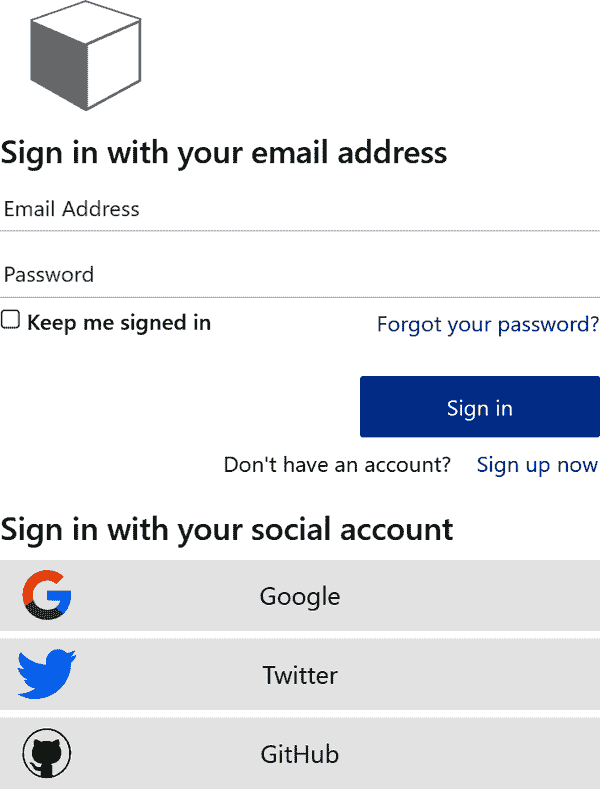
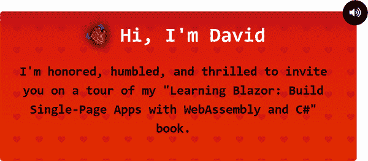
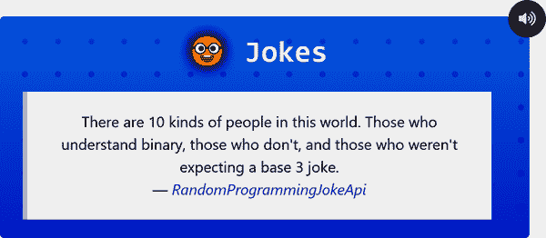
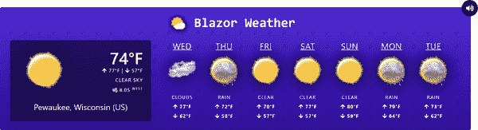

# 第三章：组件化

我们的应用程序已经起飞并展开——太棒了！我们将继续通过审视代码来学习 Blazor。在本章中，您将学习如何编写 Blazor 组件以及各种数据绑定方法。现在您已经熟悉了应用程序的启动方式，我们将评估应用程序的默认路由。这恰好是为*Index.razor*文件提供服务，该文件是应用程序的主屏幕。您将学习如何通过声明性属性和安全语义层次保护组件，以限制用户访问的内容。您将看到本地 JavaScript `geolocation` 服务与 JavaScript 互操作一起使用。作为本章的一部分，您还将了解 Blazor 应用程序依赖的一些外围服务和支持架构，例如“我被泄露了”服务和 Open Weather Map APIs。

# 注重用户体验设计

所有基于图形的应用程序都有用户，但并非所有应用程序都将用户需求置于优先位置。往往，应用程序使用您的信息来驱动广告或将您的信息出售给其他公司。这些应用程序将*您*（用户）视为销售机会或数据点。

学习 Blazor 应用程序是根据其用户需求设计的。因此，它会验证用户的身份以确定应用程序采取的操作（更多信息，请参阅“身份和认证”）。

当用户登录应用程序时，也就是说，一旦 Web 服务器使用 Azure AD B2C 租户对用户进行了身份验证，将返回 JSON Web Token（JWT；或仅持有者令牌）。该应用程序将重定向到第三方站点并提示输入凭据。模型应用的 UX 显示如图 3-1 所示。



###### 图 3-1 Azure AD B2C 登录屏幕

身份验证令牌根据需要通过外围服务和资源流动。例如，当与 Web.Client 项目一起使用时，此令牌可以表示为客户端浏览器的 cookie。无论此令牌位于服务器还是客户端应用程序上，经过身份验证的用户信息都表示为一组键/值对（KVPs），称为*声明*。用户表示为`Claim⁠s​Principal`对象。 `ClaimsPrincipal`具有`Identity`属性，在运行时可使用`ClaimsIdentity`实例。当服务需要身份验证并且请求提供有效的身份验证令牌时，会提供请求的声明。此时，我们可以要求用户同意与我们的应用程序共享的各种属性（或声明）。从 Blazor 应用程序的登录 UX 可自定义，详细内容请参见第四章。

我们的应用程序使用这些声明来唯一标识已验证用户。这些声明是承载令牌的一部分，并传递给应用程序依赖的各种服务。这些声明流入“Pwned”服务，从而使用户能够自动检测其电子邮件的数据泄露。

## 利用“Pwned”功能

Learning Blazor 应用程序的功能之一是“Pwned”功能，它可以告诉用户他们的电子邮件是否已被泄露。此功能源自[Troy Hunt 的“Have I Been Pwned” API](https://oreil.ly/Lzlvw)。他是世界上最著名的安全专家之一，多年来一直在收集数据泄露。他花费时间整合、规范化和持久化所有这些数据到一个名为“Have I Been Pwned”（简称 HIBP）的服务中。该服务提供检查特定电子邮件地址是否曾在数据泄露中出现的功能——截至撰写本文时，该服务已记录了近 115 亿条记录。这个数字肯定会继续增长。该 API 的消费组件和客户端服务在第五章中有详细描述。

HIBP API 公开了三个主要类别：

泄露

用于安全受损账户的聚合数据泄露信息

密码

大规模集合的已哈希密码，这些密码已在数据泄露中出现，意味着它们已被泄露

粘贴

已发布到公开面向网站以共享内容设计的信息

Learning Blazor 应用程序还依赖于[GitHub 上的 pwned-client 开源项目](https://oreil.ly/KHvnn)，这是一个 .NET HTTP 客户端库，用于以编程方式使用 C# 访问 HIBP API。

此库已准备好使用 DI；消费者只需一个 API 密钥和[NuGet 包](https://oreil.ly/X48Vq)。

pwned-client 库使消费者能够通过众所周知的配置方式配置其 API 密钥。例如，如果要使用环境变量，可以将其命名为 `HibpOptions__ApiKey`。双下划线 (`__`) 用作跨平台替代符号，用于分隔名称段，Linux 中无法使用冒号 (`:`)。`HibpOptions__ApiKey` 环境变量将映射到库的强类型 `HibpOptions.ApiKey` 属性值。

要将所有服务添加到 DI 容器（`IServiceCollection`），请调用 `AddPwnedServices` 扩展方法之一的重载：

```cs
// Pass an IConfiguration section that maps
// to an object that has configured an ApiKey.
services.AddPwnedServices(
    _configuration.GetSection(nameof(HibpOptions))
);
```

第一个 `AddPwnedServices` 重载使用 `IConfiguration _configuration`，并请求 `"HibpOptions"` 部分。ASP.NET Core 具有多种配置提供程序，包括 JSON、XML、环境变量、Azure Key Vault 等等。`IConfiguration` 对象可以代表所有这些提供程序。例如，如果使用环境变量，它将把该配置部分映射到库的依赖 `HibpOptions`。同样，JSON 提供程序能够从 JSON 文件（例如 *appsettings.json*）中获取配置：

```cs
{
  "Logging": {
    "LogLevel": {
      "Default": "Information",
      "Microsoft": "Warning",
      "Microsoft.Hosting.Lifetime": "Information"
    }
  },
  "AllowedHosts": "*",
  "HibpOptions": { 
    "ApiKey": "<YourApiKey>",
    "UserAgent": "<YourUserAgent>"
  }
}
```


在这个示例文件中，`"HibpOptions"`对象将映射到库中的`HibpOptions`类型。

或者，您可以使用 lambda 表达式直接分配选项：

```cs
// Provide a lambda expression that assigns the ApiKey directly.
services.AddPwnedServices(options =>
{
    options.ApiKey =
        Environment.GetEnvironmentVariable(
            "HAVE_I_BEEN_PWNED_API_KEY");
});
```

此`AddPwnedServices`重载允许您内联指定 API 密钥和其他选项。注册服务并设置适当的配置后，代码可以使用 DI 来使用任何可用的抽象。有几个可以使用的客户端，每个都具有特定的上下文：

`IPwnedBreachesClient`

一个客户端，用于访问 Breaches API

`IPwnedPasswordsClient`

访问密码 API 的客户端

`IPwnedPastesClient`

一个客户端，用于访问 Pastes API

`IPwnedClient`

一个客户端，用于访问所有 API，并将所有其他客户端聚合到一个方便的单个客户端中

如果你想在本地运行示例应用程序，可以选择为各种服务提供几个 API 密钥。例如，要获取“Have I Been Pwned” API 密钥，您可以[在他们的网站上注册](https://oreil.ly/XOKoX)。这特定的 API 密钥是收费的；如果您*不*想注册 API，可以使用以下 API 密钥启用演示模式：

```cs
"HibpOptions": {
    "ApiKey": "demo"
}
```

这可以在 Web.Client 项目的*appsettings.json*文件中配置。

使用.NET 6，强调以极简为先是非常普遍的，并且有其道理。其核心理念是从小开始，随着需求的增长逐步扩展代码。极简 API 侧重于简洁性、易用性、可扩展性，并且可以说是极简主义。

## “Have I Been Pwned”客户端服务

让我们来看看.NET 6 Minimal API 项目，这是 Learning Blazor 应用程序的 Web.PwnedApi，即*Web.PwnedApi.csproj*文件：

```cs
<Project Sdk="Microsoft.NET.Sdk.Web">
  <PropertyGroup>
    <RootNamespace>Learning.Blazor.PwnedApi</RootNamespace>
    <TargetFramework>net6.0</TargetFramework> 
    <Nullable>enable</Nullable>
    <ImplicitUsings>enable</ImplicitUsings>
  </PropertyGroup>

  <ItemGroup> 
    <PackageReference Version="2.0.0"
        Include="HaveIBeenPwned.Client" />
    <PackageReference Version="2.0.0"
        Include="HaveIBeenPwned.Client.PollyExtensions" />
    <PackageReference Version="6.0.0"
        Include="Microsoft.AspNetCore.Authentication.JwtBearer"/>
    <PackageReference Version="6.0.0"
        Include="Microsoft.AspNetCore.Authentication.OpenIdConnect" />
    <PackageReference Version="1.21.0"
        Include="Microsoft.Identity.Web" />
  </ItemGroup>

  <ItemGroup> 
    <ProjectReference
        Include="..\Web.Extensions\Web.Extensions.csproj" />
    <ProjectReference
        Include="..\Web.Http.Extensions\Web.Http.Extensions.csproj" />
  </ItemGroup>

</Project>
```


项目的目标框架标识（TFM）是`net.6.0`。


有几个框架提供和第三方库的包引用。


有几个项目引用用于本地依赖。

项目的根命名空间定义为`Learning.Blazor.PwnedApi`，并且它针对`net6.0` TFM。由于我们的目标是.NET 6，我们可以启用`ImplicitUsings`特性；这意味着默认情况下在项目的所有 C#文件中隐式添加了一组`usings`，这是一种方便，因为这些隐式添加的命名空间是常见的。该项目还定义了启用的`Nullable`。这意味着我们可以定义可空引用类型，并且 C#编译器平台（Roslyn）将提供警告，指出存在`null`值的潜在问题，通过确定赋值流分析。

项目添加了许多包引用。特别感兴趣的一个包是`HaveIBeenPwned.Client`。这是一个暴露“Have I Been Pwned” HTTP 客户端功能的包。该项目还定义了认证和身份包，用于帮助保护暴露的 API。

该项目定义了两个项目引用，Web.Extensions 和 Web.Http.Extensions。这些项目提供了共享的实用功能。扩展项目基于公共语言运行时（CLR）类型，而 HTTP 扩展项目则专门提供了共享的瞬态故障处理策略。

*Program.cs*是一个 C#顶级程序，看起来像这样：

```cs
var builder = WebApplication.CreateBuilder(args).AddPwnedEndpoints(); 
await using var app = builder.Build().MapPwnedEndpoints(); 
await app.RunAsync(); 
```


创建了`builder`并添加了端点。


`builder`被构建，并映射其端点，生成一个`app`对象。


运行`app`对象。

代码首先创建了一个`WebApplicationBuilder`类型的`builder`实例，它为我们的 Web 应用程序公开了*builder pattern*（如“Builder Pattern”中描述的）。从调用`CreateBuilder`开始，代码调用`AddPwnedEndpoints`。这是`WebApplicationBuilder`类型的一个扩展方法，用于添加所有所需的端点。用于调用`CreateBuilder`的`args`隐式可用，并表示用于启动应用程序的命令行参数。这些对于所有 C#顶级程序都是可用的。有了`builder`，我们可以访问几个关键成员：

+   `Services`属性是我们的`IServiceCollection`；我们可以使用它注册依赖注入的服务。

+   `Configuration`属性是一个`ConfigurationManager`，它是`IConfiguration`的实现。

+   `Environment`属性提供了关于托管环境本身的信息。

接下来调用了`builder.Build()`。这将返回一个`WebApplication`类型，并从返回的对象调用了另一个方法`MapPwnedEndpoints`。这又是一个扩展方法，它封装了将添加的端点映射到扩展的`WebApplication`的逻辑。`WebApplication`类型是`IAsyncDisposable`接口的实现。因此，代码可以异步地`await using` `app`实例。这是确保在运行完成后正确处理`app`的方法。

最后，代码调用了`await app.RunAsync();`。这运行应用程序并返回一个`Task`，当应用程序关闭时完成。

尽管这个**Minimal API**项目有一个只有三行代码的`Program`文件，但实际上它包含了相当多的内容。这个 API 暴露了一个非常重要的应用功能：评估用户的电子邮件是否曾经参与过数据泄露。这些信息对用户非常有帮助，并且需要得到适当的保护。API 本身要求经过身份验证的用户具有特定的 Azure AD B2C 范围。考虑一下*C#*文件*WebApplicationBuilderExtensions.cs*：

```cs
namespace Learning.Blazor.PwnedApi;

static class WebApplicationBuilderExtensions
{
    internal static WebApplicationBuilder AddPwnedEndpoints(
       this WebApplicationBuilder builder)
    {
        ArgumentNullException.ThrowIfNull(builder); 

        var webClientOrigin = builder.Configuration["WebClientOrigin"]; 
        builder.Services.AddCors(
            options =>
                options.AddDefaultPolicy(
                    policy =>
                        policy.WithOrigins(
                                webClientOrigin, "https://localhost:5001")
                            .AllowAnyHeader()
                            .AllowAnyMethod()
                            .AllowCredentials()));

        builder.Services.AddAuthentication( 
            JwtBearerDefaults.AuthenticationScheme)
            .AddMicrosoftIdentityWebApi(
                builder.Configuration.GetSection("AzureAdB2C"));

        builder.Services.Configure<JwtBearerOptions>( 
            JwtBearerDefaults.AuthenticationScheme,
            options =>
                options.TokenValidationParameters.NameClaimType = "name");

        builder.Services.AddPwnedServices( 
            builder.Configuration.GetSection(nameof(HibpOptions)),
            HttpClientBuilderRetryPolicyExtensions.GetDefaultRetryPolicy);

        builder.Services.AddSingleton<PwnedServices>();

        return builder;
    }
}
```


扩展方法防御性地检查`builder`不为空。


提取了`WebClientOrigin`配置值。


配置了`builder`以使用 JWT 承载身份验证。


JWT 承载的名称声明类型设置为`name`。


调用了`AddPwnedServices`，它添加了所需的服务。

.NET 6 引入了一个新的 API，该 API 在给定参数为 null 时将`throw`异常。此 API 返回`void`，因此不是流畅的，但仍然可以节省几行代码。

给定`builder.Configuration`实例，代码期望为`"WebClientOrigin"`键提供一个值。这是客户端 Blazor 应用程序的来源，用于配置跨源资源共享，简称 CORS。CORS 是一种策略，允许不同来源共享资源，即一个来源可以请求另一个来源的资源。默认情况下，浏览器执行“同源策略”作为标准，以确保浏览器可以向不同来源发出 API 调用。由于 Pwned API 托管在与 Blazor 客户端应用程序不同的来源上，因此必须配置 CORS 并指定可接受的客户端来源。

配置了 Azure AD B2C 租户。从*app​settings.json*文件中绑定了`"AzureAdB2C"`部分，设置了实例、客户端标识符、域、范围和策略 ID。

配置了`JwtBearerOptions`，指定了`"name"`声明作为令牌验证的名称声明类型。这控制了承载身份验证处理程序的行为。选项名称中的*JwtBearer*表示这些选项用于 JWT 承载设置。JWT 代表 JSON Web Token，这些令牌代表了身份验证的互联网标准。ASP.NET Core 使用这些令牌来实例化每个经过身份验证的请求的`ClaimsPrincipal`实例。

调用了`AddPwnedServices`扩展方法，给定配置的`"Hib⁠p​Options"`部分和默认的 HTTP 重试策略。此项目依赖于 Web.Http.Extensions 项目。这些扩展暴露了一组通用的基于 HTTP 的重试逻辑，依赖于 Polly 库。按照此模式，整个应用程序共享一个常见的瞬态故障处理策略，有助于保持一切运行顺利。另外，`PwnedServices`作为单例添加到了 DI 中。

在`AddPwnedEndpoints`之后评估的下一个扩展方法是`MapPwned​End⁠points`。这发生在 WebApplicationExtensions.cs 的 Web​.Pwne⁠dApi 项目中。

```cs
namespace Learning.Blazor.PwnedApi;

static class WebApplicationExtensions
{
    /// <summary>
    /// Maps "pwned breach data" endpoints and "pwned passwords"
    /// endpoints, with Minimal APIs.
    /// </summary>
    /// <param name="app">The current <see cref="WebApplication"/>
    /// instance to map on.</param>
    /// <returns>The given <paramref name="app"/> as a fluent API.</returns>
    /// <exception cref="ArgumentNullException">When <paramref name="app"/>
    /// is <c>null</c>.</exception>
    internal static WebApplication MapPwnedEndpoints(this WebApplication app)
    {
        ArgumentNullException.ThrowIfNull(app);

        app.UseHttpsRedirection(); 
        app.UseCors();
        app.UseAuthentication();
        app.UseAuthorization();

        app.MapBreachEndpoints(); 
        app.MapPwnedPasswordsEndpoints();

        return app;
    }

    internal static WebApplication MapBreachEndpoints( 
        this WebApplication app)
    {
        // Map "have i been pwned" breaches.
        app.MapGet("api/pwned/breaches/{email}",
            GetBreachHeadersForAccountAsync);
        app.MapGet("api/pwned/breach/{name}",
            GetBreachAsync);

        return app;
    }

    internal static WebApplication MapPwnedPasswordsEndpoints( 
        this WebApplication app)
    {
        // Map "have i been pwned" passwords.
        app.MapGet("api/pwned/passwords/{password}",
            GetPwnedPasswordAsync);

        return app;
    }
 [Authorize, RequiredScope("User.ApiAccess"), EnableCors] 
    internal static async Task<IResult> GetBreachHeadersForAccountAsync(
 [FromRoute] string email,
        PwnedServices pwnedServices)
    {
        var breaches = await pwnedServices.GetBreachHeadersAsync(email);
        return Results.Json(breaches, DefaultJsonSerialization.Options);
    }
 [Authorize, RequiredScope("User.ApiAccess"), EnableCors]
    internal static async Task<IResult> GetBreachAsync(
 [FromRoute] string name,
        PwnedServices pwnedServices)
    {
        var breach = await pwnedServices.GetBreachDetailsAsync(name);
        return Results.Json(breach, DefaultJsonSerialization.Options);
    }
 [Authorize, RequiredScope("User.ApiAccess"), EnableCors] 
    internal static async Task<IResult> GetPwnedPasswordAsync(
 [FromRoute] string password,
        IPwnedPasswordsClient pwnedPasswordsClient)
    {
        var pwnedPassword =
            await pwnedPasswordsClient.GetPwnedPasswordAsync(password);
        return Results.Json(pwnedPassword, DefaultJsonSerialization.Options);
    }
}
```


确保`app`不为 null 后，添加了一些常见的中间件。


`Breach`和`PwnedPasswords`端点都已映射。


依赖于框架提供的`MapGet`，将两个端点映射到两个处理程序。


同样地，端点被映射到处理程序，这次是针对 `PwnedPasswords`。


处理程序方法可以使用框架提供的属性和 DI。


每个处理程序都是隔离的和声明式的。

代码使用了 HTTPS 重定向、CORS、身份验证和授权中间件。这些中间件在 ASP.NET Core web 应用程序开发中很常见，是框架的一部分。

`app` 映射了 breach 端点和 Pwned `passwords` 端点。这些完全是自定义的端点，定义在扩展方法中。这些方法调用后，返回了 `app`，实现了流畅的 API。这使得在 `builder.Build()` 后能够链式调用 `Program`。

`MapBreachEndpoints` 方法映射了两个模式及其对应的 `Delegate handler`，然后返回。每个端点都有一个路由模式，以 `"api/pwned"` 开头。这些端点在框架确定请求具有匹配路由模式时才执行；例如，经过身份验证的用户可以执行以下操作：

+   请求 `https://example-domain.com/api/pwned/breaches/test@email.org` 并运行 `GetBreachHeadersForAccountAsync` 委托

+   请求 `https://example-domain.com/api/pwned/breach/linkedin` 并运行 `GetBreachAsync` 委托

`MapPwnedPasswordsEndpoints` 方法将密码端点映射到 `GetPwnedPasswordAsync` 处理程序。

`GetBreachHeadersForAccountAsync` 方法是一个 `async Task<IResult>` 返回的方法。它声明了一个 `Authorize` 属性，用于保护该处理程序免受未经授权的请求。此外，它声明了一个 `"User.ApiAccess"` 的 `RequiredScope`，这是在 Azure AD B2C 租户中定义的作用域。换句话说，这个处理程序（或者说 API）只能被我们 Azure AD B2C 租户中经过身份验证且具有特定作用域的用户访问。Learning Blazor 应用程序的用户将拥有此作用域，因此他们可以访问此 API。该方法声明了 `EnableCors` 属性，以确保该处理程序使用配置的 CORS 策略。除此之外，这个方法就像任何其他 C# 方法一样。它需要几个参数：

`[FromRoute] string email`

参数上的 `FromRoute` 属性告诉框架该参数将从路由模式中的 `{email}` 占位符提供。

`PwnedServices pwnedServices`

服务实例从 DI 中注入，异步请求给定 `email` 的违规头。`breaches` 以 JSON 形式返回。

`GetPwnedPasswordAsync` 方法与之前类似，除了它从路由中期望一个 `password`，并且从 DI 容器中获取 `IPwnedPasswordsClient` 实例。

通过我们应用程序的视角，让用户方便地获取这些信息是很有帮助的。当用户进行登录时，我们将检查 HIBP API 并进行反馈。作为用户，我可以信任应用程序会按预期工作，而无需手动检查或等待邮件。当我使用应用程序时，它通过立即提供信息来帮助我，否则这将是不方便的。Learning Blazor 应用程序依赖于 `HaveIBeenPwned.Client` NuGet 包，并通过其 Web Pwned API 项目公开它。

## 限制对资源的访问

如果您还记得，到目前为止我们的标记利用了 `Authorize` 框架提供的组件来保护各种客户端渲染的自定义组件。我们可以继续有选择地使用这种方法来限制应用程序中功能的访问。这被称为 *授权*。

在示例应用程序的 *Index.razor* 标记文件中，使用授权来在应用程序没有经过身份验证的用户时隐藏路由：

```cs
@page "/"  @inherits LocalizableComponentBase<Index>

<PageTitle>  @Localizer["Home"] </PageTitle>

<AuthorizeView> 
    <NotAuthorized>
        <RedirectToLogin /> 
    </NotAuthorized>
    <Authorized> 
        <div id="index" class="tile is-ancestor">
            <div class="tile is-vertical is-centered is-7">
                <div class="tile">
                    <div class="tile is-parent">
                        <IntroductionComponent />
                    </div>
                    <div class="tile is-parent">
                        <JokeComponent />
                    </div>
                </div>
                <div class="tile is-parent">
                    <WeatherComponent />
                </div>
            </div>
        </div>
    </Authorized>
</AuthorizeView>
```


默认页面是应用程序根目录下的 `Index` 页面。


`PageTitle` 组件用于显示页面标题。


`AuthorizeView` 组件用于有条件地显示页面内容。


`NotAuthorized` 将重定向到登录页面。


`Authorized` 将显示 `IntroductionComponent`、`JokeComponent` 和 `WeatherComponent`。

这是第一次看到 `@page` 指令。这是您模板化应用程序导航和客户端路由的方式。在 Blazor 应用程序中定义页面的每个组件都将作为用户可导航的路由。路由被定义为 C# 字符串。这个字面量是用来定义路由模板、路由参数和路由约束的值。

`PageTitle` 是一个框架提供的组件，允许动态更新页面的 `head > title`，即 HTML DOM 的 `<title>` 元素。这个值将显示在浏览器选项卡的 UI 中。

`AuthorizeView` 模板组件公开了 `NotAuthorized` 和 `Authorized` 渲染片段。这些是特定于当前用户状态的模板。

当用户未经授权时，我们将重定向用户。我们已经讨论过如何使用 `RedirectToLogin` 组件重定向未经身份验证的用户。参见 “未经授权时重定向到登录”。

当有认证用户时，他们会看到三个磁贴。第一个磁贴是向您这个应用程序用户和我的书籍消费者说的简单“谢谢”消息！它渲染了自定义的 `IntroductionComponent`。第二个磁贴是笑话组件。它由一个聚合笑话服务支持，随机尝试从多个来源提供开发者幽默。最后一个磁贴跨越整个行，位于介绍和笑话组件下方，显示 `WeatherComponent`。我们将讨论每个这些不同的自定义 Blazor 组件实现及其不同程度的数据绑定和事件处理。

# 介绍组件说“嗨”

Learning Blazor 应用程序的下一个组件是 `IntroductionComponent`，它向访问应用程序的人说“嗨”，如 图 3-2 所示。



###### 图 3-2\. `IntroductionComponent` 的示例渲染

看看 Web.Client 项目中 *Components/IntroductionComponent.razor.cs* 的 C# 文件：

```cs
using Microsoft.Extensions.Localization; 

namespace Learning.Blazor.Components
{
    public partial class IntroductionComponent
    {
        private LocalizedString _intro => Localizer["ThankYou"]; 
    }
}
```


该组件使用了 `Microsoft.Extensions.Localization`。


它定义了一个属性。

`class` 使用了 `LocalizedString` 类型，这是一个特定于区域的 `string`。它来自 `Microsoft.Extensions.Localization` 命名空间。

`class` 定义了一个名为 `_intro` 的单一字段，它表示为调用 `Localizer` 给定 `"ThankYou"` 键。此键标识要从本地化器实例解析的资源。在 Blazor WebAssembly 中，诸如 *.resx* 文件中找到的本地化资源可使用提供的 `IStringLocalizer` 框架类型。然而，`Localizer` 类型是一个名为 `CoalescingString​Local⁠izer` 的自定义类型，将在第五章详细讨论。

`Localizer` 成员来自于 `LocalizableComponentBase` 类型。这是我们许多组件的子类。现在，让我们看看 *Introduction​Compo⁠nent.razor* 标记文件：

```cs
@inherits LocalizableComponentBase<IntroductionComponent>

<article class="blazor-tile-container"> 
    <div class="gradient-bg welcome-gradient"></div>
    <div class="icon-overlay heart-svg"></div>
    <div class="blaze-content">
        <p class="title is-family-monospace">
            <span class="wave">&#x1F44B;&#x1F3FD;</span>
            <span class="has-text-light"> @Localizer["Hi"] 
            </span>
        </p>
        <AdditiveSpeechComponent Message=@_intro.Value /> 
        <p class="has-text-black is-family-monospace welcome-text is-size-5"> @_intro 
        </p>
    </div>
</article>
```


该组件是一个样式精美的 `<article>` 元素。


有一个本地化的问候消息。


`_intro` 的值与 `AdditiveSpeech​Compo⁠nent` 的 `Message` 属性绑定。


`_intro` 值也会作为 `<p>` 元素内的文本渲染。

大部分 HTML 标记是纯 HTML。如果您仔细查看，应该只能注意到一些 Blazor 细节。

Razor 代码上下文从原始 HTML 切换到访问 `class` 中的 `Localizer` 实例。我想展示你可以在 `class` 中使用字段，或者访问其他成员来实现单向数据绑定。与 `"Hi"` 键对应的本地化消息在挥手表情后绑定。问候消息是：“嗨，我是大卫。”

有一个自定义的 `AdditiveSpeechComponent`，其 `Message` 参数绑定到 `_intro.Value`。该组件将在图块的右上角渲染一个按钮。当点击该按钮时，将向用户朗读给定的 `Message` 值。 `AdditiveSpeechComponent` 组件将在下一章节详细介绍。

`_intro` 本地化资源值被插入到 `<p>` 元素中。

按照惯例，本地化资源文件的命名与它们本地化的文件相对应。例如，*Introduction​Component.razor.cs* 文件有一个 *Introduction​Component.razor.en.resx* 的 XML 文件。以下是它的内容的简化示例：

```cs
<?xml version="1.0" encoding="utf-8"?>
<root>
  <data name="Hi" xml:space="preserve">
    <value>Hi, I'm David</value>
  </data>
  <data name="ThankYou" xml:space="preserve">
    <value>
        I'm honored, humbled, and thrilled to invite you
        on a tour of my "Learning Blazor: Build Single-Page Apps
        with WebAssembly and C#" book.
    </value>
  </data>
</root>
```

在顶级 `root` 节点内，有 `data` 节点。每个 `data` 节点都有一个 `name` 属性，而这个名称是用于检索资源 `value` 的键。可以有任意数量的 `data` 节点。这个示例文件是英文的，而其他语言将在文件名中使用它们特定的区域标识符。例如，法语资源文件将命名为 *IntroductionComponent.razor.fr.resx*，它将包含相同的 `root > data [name]` 结构，但其 `value` 节点将包含法语翻译。对于应用程序打算提供资源的任何区域设置都是如此。

介绍组件展示了单向数据绑定和本地化内容。让我们进一步扩展这两个概念，探索 `JokeComponent`。

# 笑话组件和服务

学习 Blazor 应用程序的笑话组件显示一个随机笑话。当笑话组件忙于从端点获取随机笑话时，它将呈现一个旋转的加载动画。成功获取笑话后，它将以类似 Figure 3-3 所示的随机笑话呈现。

###### 小贴士

我喜欢互联网查克·诺里斯数据库（icndb）。我在编程演示中经常使用它。它不仅提供了书呆子般的幽默，而且我喜欢它的简单性。它讲述了一个引人入胜的故事。同样，笑话经常会进入我的家庭生活。作为三个儿子的父亲，我知道我的孩子们喜欢听“爸爸的笑话”，而能让他们开心也让我感到快乐。



###### Figure 3-3\. `JokeComponent`的示例渲染

该组件向 `api/jokes` Web API 端点发出 HTTP 请求。笑话对象本身与 Web API 端点和客户端代码共享。这有助于确保数据结构没有错位，从而避免序列化错误或数据丢失。考虑 *Joke​Compo⁠nent.razor* 标记文件：

```cs
@inject IJokeFactory JokeFactory  @inject ILogger<JokeComponent> Logger
@inject IStringLocalizer<JokeComponent> Localizer <article class="blazor-tile-container"> 
    <div class="gradient-bg jokes-gradient"></div>
    <div class="icon-overlay circle-svg"></div>
    <div class="blaze-content">
        <p class="title">
            <span class="is-emoji">&#x1F913;</span>
            <span class="has-text-light">@Localizer["Jokes"]</span>
        </p>
        <AdditiveSpeechComponent Message=@_jokeText />
        <div class="content"> @if (_isLoadingJoke)  { <SpinnerComponent /> }
            else if (_jokeText is not null)
            { <blockquote class="has-text-black">
                    <span class="pb-4">@_jokeText</span>
                    <br> @if (_sourceDetails is { Site: not null })
                    { <cite>
                            &mdash; @{
                                var (site, source) = _sourceDetails.Value;
                            } <a href="@(site.ToString())" target="_blank"> @(source.ToString()) </a>
                        </cite> } </blockquote> } </div>
    </div>
</article> @code {  private string? _jokeText = null;
    private JokeSourceDetails? _sourceDetails;
    private bool _isLoadingJoke = false;

    protected override Task OnInitializedAsync() =>
        RefreshJokeAsync();

    private async Task RefreshJokeAsync()  {
        _isLoadingJoke = true;

        try
        {
            (_jokeText, _sourceDetails) =
                await JokeFactory.GetRandomJokeAsync();
        }
        catch (Exception ex)
        {
            Logger.LogError(ex, ex.Message);
        }
        finally
        {
            _isLoadingJoke = false;
        }
    }
}
```


`IJokeFactory` 被注入到组件中。


就像 `Index` 页面上的其它组件一样，`JokeComponent` 渲染为一个样式化的 `article` 元素。


加载时会显示一个加载动画。


使用 `@code` 指令来指定代码块。


`RefreshJokeAsync` 方法被调用以获取新笑话。

`JokeComponent` 的标记与大多数其他组件类似，通过声明各种指令开始。`JokeComponent` 使框架注入了 `IJokeFactory`、`ILogger<JokeComponent>` 和 `IStringLocalizer<JokeComponent>`。任何在 DI 容器中注册的服务都是有效的 `@inject` 指令目标类型。此组件利用了这些特定服务。

HTML 标记比介绍组件更冗长。组件复杂性是您应该评估和注意的事项。一个好的经验法则是将组件限制为单一职责。笑话组件的责任是以 HTML 形式呈现笑话。标记类似于介绍组件，提供了一个表情符号和本地化标题，以及绑定到 `_jokeText` 变量的 `AdditiveSpeech​Com⁠ponent`。

此笑话组件的内容标记是有条件的，并支持使用 `@if, else if, else, and @switch` 表达式作为控制结构。这从 Razor 语法一开始就存在。当 `_isLoadingJoke` 的值评估为 `true` 时，将呈现样式化的 `SpinnerComponent` 标记。`Spinner​Compo⁠nent` 也是自定义的，并且是一小部分常见的 HTML。否则，当 `_joke​Text` 不为 null 时，将随机笑话文本呈现为 `blockquote`。

笑话组件使用 `@code { ... }` 指令而不是阴影组件方法。作为开发者，理解作为一种选择很重要。大多数情况下，我更倾向于不使用 `@code` 指令。对我来说，将它们保持在单独的文件中更清晰。我喜欢看到一个 C#类，这样对我来说感觉更自然一些。但是，如果你是从 JavaScript SPA 世界过来的开发者，也许将文件放在一起会感觉更自然。关键在于确定最佳方法的唯一方式是从团队中获得共识，这和其他风格上的开发者决策类似。

`RefreshJokeAsync` 方法由 `OnInitializedAsync` 生命周期方法调用。这意味着作为组件初始化的一部分，将异步获取笑话。方法从设置 `_isLoadingJoke` 位为 `true` 开始；这将导致渲染旋转器标记，但仅是临时的。方法体尝试请求 `IJokeFactory` 实例以获取 `JokeResponse` 对象。当有有效的 `response` 时，将其解构为元组赋值，并设置 `_jokeText` 和 `_sourceDetails` 字段。然后，这些将作为笑话内容呈现。

支持这些笑话的端点聚合了几个第三方 API。各种笑话端点具有不同的数据结构，并且已经有服务将它们汇聚成我们 Blazor 客户端代码所消耗的单个端点。

## 聚合笑话服务——欢笑不断

没有有意义的数据，任何应用都没有用处。我们的应用将包括客户特定的天气信息、随机的极客笑话、实时的网络功能、聊天、通知、实时的 Twitter 信息流、按需的 HIBP 安全功能等等。这将会很有趣！但是对于 Blazor 来说意味着什么？在深入进行 Blazor 前端开发之前，我们应该对驱动该应用程序的服务和数据设置更多的期望——我们的后端开发。

Blazor 应用程序可以自由地从任意数量的其他平台、服务或 Web 应用程序中检索和使用数据。存在许多良好的架构，为任何给定的问题领域提供许多可能的解决方案。毕竟，知道何时使用哪种模式或实践是成功的一部分。您应该尝试识别数据的流动和基本要求，数据来源以及如何访问这些数据。这些更好的问题应该是你自己在问的问题。答案几乎总是“这取决于情况”。

让我们看看笑话服务库如何提供随机笑话：

```cs
namespace Learning.Blazor.JokeServices;

internal interface IJokeService
{
    JokeSourceDetails SourceDetails { get; }

    Task<string?> GetJokeAsync();
}
```

在 C# 10 之前，`namespace`声明将其包含类型包裹在花括号中。在 C# 10 中，您可以使用文件范围的命名空间，这通过删除代码中的一级缩进增强了可读性。我喜欢这个特性；即使它有点微妙，但在阅读代码时确实减少了噪音。

`IJokeService`是一个`internal interface`类型，它公开了一个只读的`JokeSour⁠ce​Details`属性和异步请求笑话的能力。`internal`访问修饰符意味着笑话服务不会暴露给声明外部的程序集。

`GetJokeAsync`方法是无参数的，返回一个`Task<string?>`。在`string`类型声明的`?`标识表明返回的`string`可能为`null`（C#引用类型`string`的默认值）。

我们有三种不同的第三方笑话 Web 服务，全部都是免费的。笑话响应的形状因提供者而异，URL 也不同。我们有三个单独的配置、端点和笑话模型需要表示。

第一个`IJokeService`的实现是`ProgrammingJokeService`：

```cs
namespace Learning.Blazor.JokeServices;

internal class ProgrammingJokeService : IJokeService 
{
    private readonly HttpClient _httpClient;
    private readonly ILogger<ProgrammingJokeService> _logger;

    public ProgrammingJokeService( 
        HttpClient httpClient,
        ILogger<ProgrammingJokeService> logger) =>
        (_httpClient, _logger) = (httpClient, logger);

    JokeSourceDetails IJokeService.SourceDetails => 
        new(JokeSource.RandomProgrammingJokeApi,
            new Uri("https://karljoke.herokuapp.com/"));

    async Task<string?> IJokeService.GetJokeAsync() 
    {
        try
        {
            // An array with a single joke is returned
            var jokes = await _httpClient.GetFromJsonAsync<ProgrammingJoke[]>(
                "https://karljoke.herokuapp.com/jokes/programming/random",
                DefaultJsonSerialization.Options);

            return jokes?[0].Text;
        }
        catch (Exception ex)
        {
            _logger.LogError("Error getting something fun to say: {Error}", ex);
        }

        return null;
    }
}
```


`ProgrammingJokeService`类实现了`IJokeService`接口。


`HttpClient`和`ILogger<T>`实例被注入到构造函数中。


`SourceDetails`属性提供有关笑话来源的信息。


`GetJokeAsync`方法返回一个`Task<string?>`，解析为一个笑话或者如果无法检索到笑话则为`null`。

这个服务以其命名空间声明开始，后跟`internal class`实现的`IJokeService`。

这个类需要两个参数，一个`HttpClient`和一个`ILogger<ProgrammingJokeService>`的日志记录器实例。这两个参数使用元组字面量和其立即解构来分配到字段赋值中。这允许单行和表达式体构造函数。这只是一个样板 DI 方法。这些字段被安全地声明为`private readonly`，以防止类中的使用者误将其值错误赋值。这是 DI 容器的职责。

编程笑话服务通过一个隐式目标类型`new`表达式表达了`SourceDetails`成员的表示。我们根据底层 API 类型`JokeSource.RandomProgrammingJokeApi`的枚举值和.NET 中笑话 URL 的`Uri`对象来实例化`JokeSourceDetails`的一个实例。

`GetJokeAsync`的实际实现从`try`和`catch`块开始。使用`_httpClient`进行 HTTP GET 请求，请求 URI 和默认的 JSON 序列化选项。在出现错误时，记录`Exception`详情并返回`null`。当没有错误时，也就是“正常路径”，从请求的响应中反序列化为一个`ProgrammingJoke`数组对象。当存在笑话时，返回第一个笑话的文本。如果这是`null`，那也没关系，因为我们将让使用者处理它。我们需要向他们指出这一点——再次强调，它是一个`string?`。我称可空类型为“有疑问的”。例如，给定一个`string?`，你应该问自己这是否为`null`，并适当地防范。我经常将这种模式称为*有疑问的字符串*。

其他两个服务实现遵循相同的模式，很明显我们需要一种方法来聚合它们，因为它们代表了同一个接口的多个实现。当.NET 遇到为同一类型注册的多个服务时，它们会包装在`IEnumerable<TService>`中，其中`TService`是给定的实现之一。

让我们继续看另外两个`IJokeService`的实现。考虑以下`DadJokeService`的实现：

```cs
namespace Learning.Blazor.JokeServices;

internal class DadJokeService : IJokeService
{
    private readonly HttpClient _httpClient;
    private readonly ILogger<DadJokeService> _logger;

    public DadJokeService(
        IHttpClient httpClient,
        ILogger<DadJokeService> logger) =>
        (_httpClient, _logger) = (httpClient, logger);

    JokeSourceDetails IJokeService.SourceDetails =>
        new(JokeSource.ICanHazDadJoke,
            new Uri("https://icanhazdadjoke.com/"));

    async Task<string?> IJokeService.GetJokeAsync()
    {
        try
        {
            return await _httpClient.GetStringAsync(
                "https://icanhazdadjoke.com/");
        }
        catch (Exception ex)
        {
            _logger.LogError(
                "Error getting something fun to say: {Error}", ex);
        }

        return null;
    }
}
```

`ChuckNorrisJokeService`的实现：

```cs
namespace Learning.Blazor.JokeServices;

internal class ChuckNorrisJokeService : IJokeService
{
    private readonly ILogger<ChuckNorrisJokeService> _logger;
    private static readonly AsyncLazy<ChuckNorrisJoke[]?> s_embeddedJokes =
        new(async () =>
        {
            var @namespace = typeof(ChuckNorrisJokeService).Namespace;
            var resource = $"{@namespace}.Data.icndb-nerdy-jokes.json";

            var json = await ReadResourceFileAsync(resource);
            var jokes = json.FromJson<ChuckNorrisJoke[]>();

            return jokes;
        });

    public ChuckNorrisJokeService(
        ILogger<ChuckNorrisJokeService> logger) => _logger = logger;

    JokeSourceDetails IJokeService.SourceDetails =>
        new(JokeSource.InternetChuckNorrisDatabase,
            new Uri("https://www.icndb.com/"));

    async Task<string?> IJokeService.GetJokeAsync()
    {
        try
        {
            var jokes = await s_embeddedJokes;
            if (jokes is { Length: > 0 })
            {
                var randomIndex = Random.Shared.Next(jokes.Length);
                var random = jokes[randomIndex];

                return random.Joke;
            }

            return null;
        }
        catch (Exception ex)
        {
            _logger.LogError(
                "Error getting something fun to say: {Error}", ex);
        }

        return null;
    }

    private static async Task<string> ReadResourceFileAsync(string fileName)
    {
        using var stream =
            Assembly.GetExecutingAssembly()
                .GetManifestResourceStream(fileName);
        using var reader = new StreamReader(stream!);
        return await reader.ReadToEndAsync();
    }
}
```

为处理多个`IJokeService`实现，我们将创建一个工厂，它将聚合笑话——返回第一个成功的随机实现的笑话：

```cs
namespace Learning.Blazor.JokeServices;

public interface IJokeFactory
{
    Task<(string, JokeSourceDetails)> GetRandomJokeAsync();
}
```

这个接口定义了一个基于任务的异步方法，方法名表明它获取一个随机笑话。返回类型是一个`Task<(string, JokeSourceDetails)>`，其中`Task`的泛型约束是一个`string`和`JokeSourceDetails`的元组。`JokeSourceDetails`的形式如下：

```cs
using System;

namespace Learning.Blazor.Models;

public record JokeSourceDetails(
    JokeSource Source,
    Uri Site);
```

在 C# 中，位置记录是一种令人惊叹的类型。首先，它们是不可变的。可以使用 `with` 语法克隆实例，其中属性值被覆盖到复制的对象中。您还将获得自动相等性和基于值的比较语义。它们是声明性和简洁的编写方式。让我们接下来看看笑话工厂：

```cs
namespace Learning.Blazor.JokeServices;

internal class AggregateJokeFactory : IJokeFactory
{
    const string NotFunny = @"Did you hear the one about a joke service that " +
        @"failed to get jokes?" +
        "It's not very funny...";

    private readonly IList<IJokeService> _jokeServices;

    public AggregateJokeFactory( 
        IEnumerable<IJokeService> jokeServices) =>
        _jokeServices = jokeServices;

    async Task<(string, JokeSourceDetails)> IJokeFactory.GetRandomJokeAsync() 
    {
        string? joke = null;
        JokeSourceDetails sourceDetails = default;

        foreach (var service in _jokeServices.RandomOrder())
        {
            joke = await service.GetJokeAsync();
            sourceDetails = service.SourceDetails;

            if (joke is not null && sourceDetails != default)
            {
                break;
            }
        }

        return (
            joke ?? NotFunny,
            sourceDetails);
    }
}
```


构造函数接受一个 `IJokeService` 实现的集合。


`GetRandomJokeAsync` 方法体使用了 `RandomOrder` 函数。

`IJokeFactory` 实现的适当命名为 `AggregateJoke​Fac⁠tory`，其构造函数（`.ctor`）接受 `IEnumerable<IJokeService>`。这些是笑话服务：*爸爸笑话服务*、*随机编程笑话 API 服务* 和 *互联网查克·诺里斯数据库服务*。这些值由 .NET DI 容器提供。

`GetRandomJokeAsync` 方法体正在利用名为 `RandomOrder` 的扩展方法，它在 `IEnumerable<T>` 类型上。此模式依赖于回退模式，其中服务尝试提供笑话，直到有一个能够提供笑话。如果没有实现能够提供笑话，则方法默认返回 `null`。随机的扩展方法在 `Learning.Blazor.Extensions` 命名空间的 *Enumerable​Exten⁠sions.cs* C# 文件中定义：

```cs
namespace Learning.Blazor.Extensions;

public static class EnumerableExtensions
{
    static readonly Random s_random = Random.Shared; 

    public static IEnumerable<T> RandomOrder<T>(this IList<T> incoming) 
    {
        var used = new HashSet<int>();
        var count = incoming.Count;

        while (used.Count != count)
        {
            var index = s_random.Next(incoming.Count);
            if (!used.Add(index))
            {
                continue;
            }

            yield return incoming[index];
        }

        yield break;
    }
}
```


框架提供的 `Random` 类型。


随机化顺序的算法是 O(1) 时间，这意味着其计算时间是常数，无论集合大小如何。

框架提供的 [`Random.Shared` 实例](https://oreil.ly/sYped) 表示一个伪随机数生成器，它是一个生成满足基本统计要求的随机数序列的算法。

随机元素函数作用于 `incoming` 集合实例。从 `AggregateJokeFactory` 实例中我们伪随机地确定，我们将等待其调用 `GetJokeAsync` 方法。如果返回的笑话是 `null`，我们将合并到 `"There is nothing funny about this."` 然后返回一个包含 `string` 笑话和相应服务来源详细信息的元组。

## 图书馆作者的 DI

笑话服务库的最后一部分涉及到我们所有笑话服务都是 DI 友好的事实，我们可以在 `IServiceCollection` 上添加一个扩展方法，将它们注册到 DI 容器中。这是我将为所有旨在消费的库遵循的常见策略。消费者将调用 `AddJokeServices` 来注册所有抽象到 DI 中。他们可以在类的构造函数中或通过 Blazor 组件的属性注入开始要求这些服务。`InjectAttribute` 和 `@inject` 指令允许通过它们的 C# 属性将服务注入组件。

```cs
namespace Learning.Blazor.Extensions; 

public static class ServiceCollectionExtensions
{
    public static IServiceCollection AddJokeServices(
        this IServiceCollection services)
    {
        ArgumentNullException.ThrowIfNull(nameof(services));

        services.AddScoped<IJokeService, ProgrammingJokeService>(); 
        services.AddScoped<IJokeService, DadJokeService>();
        services.AddScoped<IJokeService, ChuckNorrisJokeService>();

        services.AddHttpClient<ProgrammingJokeService>() 
            .AddDefaultTransientHttpErrorPolicy();
        services.AddHttpClient<DadJokeService>()
            .AddDefaultTransientHttpErrorPolicy();

        services.AddScoped<IJokeFactory, AggregateJokeFactory>(); 

        return services;
    }
}
```


类使用了`Learning.Blazor.Http.Extensions`命名空间。


所有三个服务实现都添加到了`services`集合中。


每个实现都有其对应的`HttpClient`。


总体而言，每个实现都通过`AggregateJokeFactory`暴露出来。

`Learning.Blazor.Http.Extensions`命名空间代表一个共享库，其中包含默认的瞬态故障处理策略。这些默认值在解决方案中所有使用`HttpClient`的项目中共享。这些共享的故障处理策略施加了指数退避模式，帮助自动重试间歇性 HTTP 请求失败。它们生成的睡眠持续时间以指数退避的抖动方式进行，以确保减少任何相关性。例如 850ms、1455ms 和 3060ms。这是通过`Polly.Contrib.WaitAndRetry`库及其`Backoff.Decorrelated​Jit⁠terBack⁠offV2`实现可能的。

调用`AddJokesServices`会将所有相应的笑话服务注册到 DI 容器中。一旦注册到 DI 容器中，消费者可以请求`IJokeFactory`服务，并提供实现。所有这些功能对 Web.Client 都是可见的。`JokeComponent`使用`IJokeFactory.GetRandomJokeAsync`方法。客户端代码将在客户端浏览器上执行，使用每个服务根据需要向一些外部端点发起 HTTP 调用。

我们已经介绍了`IntroductionComponent`和`JokeComponent`。在下一节中，我们将看一个逐渐复杂的示例。我将向您展示如何调用与 Azure 静态 Web 应用共同托管的 Azure 函数。这个 Azure 函数在 Web.Functions 项目中实现。

###### 提示

Azure 函数是一个无服务器解决方案（类似于 AWS Lambda）。它们是使用 Azure PaaS（平台即服务）构建可扩展、可靠和安全应用程序的好方法。有关更多信息，请参阅微软的[“Azure 函数简介”文档](https://oreil.ly/bJr70)。

# 预测本地天气

到目前为止，我们所涵盖的自定义组件都比较基础。`IntroductionComponent`有一个单一的本地化文本字段进行渲染。然后`Joke​Compo⁠nent`演示了如何通过条件控制结构和加载指示器从 HTTP 端点获取数据。`WeatherComponent`是`WeatherCurrentComponent`和`WeatherDailyComponent`的父组件。这些组件共同显示用户本地当前天气和本周的即时预报，如图 3-4 所示。



###### 图 3-4\. `WeatherComponent`的示例渲染

所有天气数据都可以免费从 [Open Weather Map API](https://oreil.ly/lg5RK) 获取。`WeatherComponent` 依赖于一个 `HttpClient` 实例来获取天气数据。在这个组件中，我们还将讨论如何使用双向 JavaScript 互操作。让我们来看一下 *WeatherComponent.razor* 的标记：

```cs
@inherits LocalizableComponentBase<WeatherComponent>

<article class="blazor-tile-container"> 
    <div class="gradient-bg weather-gradient"></div>
    <div class="icon-overlay zap-svg"></div>
    <div class="blaze-content">
        <p class="title" translate="no">
            <span class="is-emoji">&#x1F525;</span>
            <span class="has-text-light"> Blazor @Localizer["Weather"]</span>
        </p>
        <AdditiveSpeechComponent Message=@_model?.Message /> 
        <div class="columns has-text-centered"> @switch (_state)  {
            case ComponentState.Loaded:  var weather = _model!; <div class="column is-one-third">
                <WeatherCurrentComponent Weather=weather
                    Localizer=Localizer />
            </div>
            <div class="column">
                <div class="level"> @foreach (DailyWeather daily in weather.DailyWeather)
                { <WeatherDailyComponent Daily="daily"
                        GetDailyImagePath=weather.GetDailyImagePath
                        GetDailyHigh=weather.GetDailyHigh
                        GetDailyLow=weather.GetDailyLow /> } </div>
            </div> break;
            case ComponentState.Loading: <div class="column is-full"> 
                <SpinnerComponent />
            </div> break;
            default: <div class="column is-full">  @Localizer["WeatherUnavailable"] </div> break;
        } </div>
    </div>
</article>
```


最外层的 `article` 元素被设计为一个瓷砖。


与其他两个瓷砖一样，天气瓷砖也使用了 `AdditiveSpeech​Compo⁠nent`。


除了简单的 `@if` 控制结构外，还可以使用 `@switch` 控制结构。


加载完成后，天气瓷砖显示当前天气和本周的天气预报。


当组件正在加载时，会显示 `SpinnerComponent`。


`default` 情况下会呈现本地化消息，告知用户天气不可用。

这个组件的标记与另外两个瓷砖（`IntroductionComponent` 和 `JokeComponent`）类似。`WeatherComponent` 是另外两个组件 `WeatherCurrentComponent` 和 `WeatherDailyComponent` 的父组件。它的标题是“Blazor 天气”，其中的 *weather* 一词是本地化的。

与其他两个瓷砖一样，天气瓷砖也使用了 `AdditiveSpeech​Compo⁠nent`。渲染时，在其父元素的右上角可见一个语音按钮。关于 `AdditiveSpeechComponent` 的详细信息可在 “本地语音合成” 中找到。

在标记中，`@switch` 控制结构相当不错。天气组件使用自定义组件 `_state` 变量来帮助跟踪组件的状态。可能的状态包括未知、加载中、已加载或错误。

当组件加载时，会渲染当前天气（`WeatherCurrentComponent`）和每日天气预报（`WeatherDailyComponent`）。父组件依赖于可空的 `_model` 类型；当处于加载状态时，`_model` 不为 `null`，我们可以使用非空断言操作符 `!` 来告诉编译器我们对此很有把握。类作用域下的 `_model` 变量被赋给本地作用域下的 `weather` 变量。这个变量通过帮助方法委托或参数赋值，被分配给其子组件 `WeatherCurrentComponent` 和 `WeatherDailyComponent`。

当组件正在加载时，会显示 `SpinnerComponent`。`default` 情况下会呈现本地化消息，告知用户天气不可用。这应该只在出现错误时发生。

天气组件标记引用了当前天气 (`WeatherCurrentComponent`) 和每日天气预报 (`WeatherDailyComponent`) 组件。这两个组件不使用组件阴影，仅用于模板。每个组件都定义了一个 `@code { ... }` 指令和几个 `Parameter` 属性。它们不需要逻辑或功能；因此，它们只是绑定到指定值的标记。这是 *WeatherCurrentComponent.razor* 标记文件：

```cs
@using Learning.Blazor.Localization;

<div class="box dotnet-box-border is-alpha-bg-50">
    <article class="media">
        <div class="media-left">
            <figure class="image is-128x128">
                
            </figure>
        </div>
        <div class="media-content">
            <div class="content has-text-right has-text-light">
                <div>
                    <span class="title has-text-light">
                        @Weather.Temperature
                    </span>
                    <span class="heading">
                        <i class="fas fa-arrow-up"></i>
                        @(Weather.HighTemp) |
                        <i class="fas fa-arrow-down"></i>
                        @(Weather.LowTemp)
                    </span>
                    <span class="heading">
                        @Weather.Description
                    </span>
                    <span class="heading">
                        <i class="fas fa-wind"></i>
                        @Weather.WindSpeed
                        <sup>
                        @(Localizer[Weather.WindDegree.PositionalCardinal])
                        </sup>
                    </span>
                </div>
            </div>
        </div>
    </article>
    <div class="has-text-centered has-text-light">
        @($"{Weather.City}, {Weather.State} ({Weather.Country})")
    </div>
</div>

@code {
    [Parameter]
    public WeatherComponentModel Weather
    {
        get;
        set;
    } = null!;

    [Parameter]
    public CoalescingStringLocalizer<WeatherComponent> Localizer
    {
        get;
        set;
    } = null!;
}
```

`WeatherCurrentComponent` 渲染了与当前天气对应的图像，例如云、雨云，或者甚至是代表美好天气的太阳图像。它还显示温度、高温和低温、天气描述、风速和风向，以及城市和州。例如，让我们看一下 *WeatherDailyComponent.razor* 标记文件：

```cs
<div class="level-item has-text-centered has-text-light">
    <div>
        <p class="heading is-size-6 is-underlined">
            @Daily.DateTime.ToString("ddd")
        </p>
        <p class="title">
            <figure class="image is-64x64">
                
            </figure>
        </p>
        <p class="heading">@Daily.Weather[0].Main</p>
        <p class="heading has-text-weight-bold">
            <i class="fas fa-arrow-up"></i>
            @GetDailyHigh?.Invoke(Daily)
        </p>
        <p class="heading has-text-weight-bold">
            <i class="fas fa-arrow-down"></i>
            @GetDailyLow?.Invoke(Daily)
        </p>
    </div>
</div>

@code {
    [Parameter]
    public DailyWeather Daily { get; set; } = null!;

    [Parameter]
    public Func<DailyWeather, string>? GetDailyImagePath { get; set; }

    [Parameter]
    public Func<DailyWeather, string>? GetDailyHigh { get; set; }

    [Parameter]
    public Func<DailyWeather, string>? GetDailyLow { get; set; }
}
```

`WeatherDailyComponent` 使用委托作为部分数据绑定的参数。它渲染了预报的日期和天气图标，以及天气描述、高温和低温。

`WeatherComponent` 依赖于几个服务，并使用定时器自动刷新天气，我们接下来会详细查看。这个组件展示了许多强大的功能。现在您已经探索了标记，请考虑阴影组件的 C# 文件 *WeatherComponent.razor.cs*（示例 3-1）。

##### 示例 3-1\. Web.Client/Components/WeatherComponent.razor.cs

```cs
namespace Learning.Blazor.Components
{
    public sealed partial class WeatherComponent : IDisposable
    {
        private Coordinates _coordinates = null!; 
        private GeoCode? _geoCode = null!;
        private WeatherComponentModel<WeatherComponent>? _model = null!;
        private ComponentState _state = ComponentState.Loading;
        private bool _isActive = false;

        private readonly CancellationTokenSource _cancellation = new();
        private readonly PeriodicTimer _timer = new(TimeSpan.FromMinutes(10));
 [Inject]
        public IWeatherStringFormatterService<WeatherComponent> Formatter
        {
            get;
            set;
        } = null!;
 [Inject]
        public HttpClient Http { get; set; } = null!;
 [Inject]
        public GeoLocationService GeoLocationService { get; set; } = null!;

        protected override Task OnInitializedAsync() =>
            TryGetClientCoordinatesAsync();

        private async Task TryGetClientCoordinatesAsync() => 
            await JavaScript.GetCoordinatesAsync(
                this,
                nameof(OnCoordinatesPermittedAsync),
                nameof(OnErrorRequestingCoordinatesAsync));
 [JSInvokable] 
        public async Task OnCoordinatesPermittedAsync(
            decimal longitude, decimal latitude)
        {
            _isGeoLocationPermissionGranted = true;
            _coordinates = new(latitude, longitude);
            if (_isActive) return;

            do
            {
                _isActive = true;

                try
                {
                    var lang = Culture.CurrentCulture.TwoLetterISOLanguageName;
                    var unit = Culture.MeasurementSystem;

                    var weatherLanguages =
                        await Http.GetFromJsonAsync<WeatherLanguage[]>(
                            "api/weather/languages",
                            WeatherLanguagesJsonSerializerContext
                                .DefaultTypeInfo);

                    var requestLanguage =
                        weatherLanguages
                            ?.FirstOrDefault(
                                language => language.AzureCultureId == lang)
                            ?.WeatherLanguageId
                        ?? "en";

                    WeatherRequest weatherRequest = new()
                    {
                        Language = requestLanguage,
                        Latitude = latitude,
                        Longitude = longitude,
                        Units = (int)unit
                    };

                    using var response =
                        await Http.PostAsJsonAsync("api/weather/latest",
                            weatherRequest,
                            DefaultJsonSerialization.Options);

                    var weatherDetails =
                        await response.Content.ReadFromJsonAsync<WeatherDetails>(
                            DefaultJsonSerialization.Options);

                    await GetGeoCodeAsync(
                        longitude, latitude, requestLanguage);

                    if (weatherDetails is not null && _geoCode is not null)
                    {
                        _model = new WeatherComponentModel(
                            weatherDetails, _geoCode, Formatter);
                        _state = ComponentState.Loaded;
                    }
                    else
                    {
                        _state = ComponentState.Error;
                    }
                }
                catch (Exception ex)
                {
                    Logger.LogError(ex, ex.Message);
                    _state = ComponentState.Error;
                }
                finally
                {
                    await InvokeAsync(StateHasChanged);
                }
            }
            while (await _timer.WaitForNextTickAsync(_cancellation.Token));
        }

        private async Task GetGeoCodeAsync(
            decimal longitude, decimal latitude, string requestLanguage)
        {
            if (_geoCode is null)
            {
                GeoCodeRequest geoCodeRequest = new()
                {
                    Language = requestLanguage,
                    Latitude = latitude,
                    Longitude = longitude,
                };

                _geoCode =
                    await GeoLocationService.GetGeoCodeAsync(geoCodeRequest);
            }
        }
 [JSInvokable] 
        public async Task OnErrorRequestingCoordinatesAsync(
            int code, string message)
        {
            Logger.LogWarning(
                "The user did not grant permission to geolocation:" +
                "({Code}) {Msg}",
                code, message);

            // 1 is PERMISSION_DENIED, error codes greater than 1
            // are unrelated errors.
            if (code > 1)
            {
                _isGeoLocationPermissionGranted = false;
            }
            _state = ComponentState.Error;

            await InvokeAsync(StateHasChanged);
        }

        void IDisposable.Dispose() 
        {
            _cancellation.Cancel();
            _cancellation.Dispose();
            _timer.Dispose();
        }
    }
}
```


`WeatherComponent` 管理了几个字段和属性。


当组件初始化时，会调用 `TryGetClientCoordinatesAsync`。


当用户授予地理位置权限时，会调用 `OnCoordinatesPermittedAsync` 方法。


当用户不授予地理位置权限时，会调用 `OnErrorRequestingCoordinatesAsync` 方法。


`Dispose` 方法执行对 `CancellationTokenSource` 和 `PeriodicTimer` 对象的清理。

天气组件依赖于浏览器的地理位置，这是原生保护的，并且需要用户授权。如果用户允许，组件有几个字段变量用于保存这些信息。`Coordinates`对象是一个 C#位置记录类型，具有纬度和经度属性。`GeoCode`对象包含城市、国家和其他类似信息。它是从 HTTP 调用实例化的[Big Data Cloud API](https://oreil.ly/9AtzC)。此调用是有条件的，仅当用户授予浏览器地理位置服务访问权限时发生。除了这些变量之外，还有组件模型和状态。还有`PeriodicTimer`。`Period⁠ic​Timer`是在.NET 6 中引入的，它提供了一个轻量级的异步定时器。它配置为每 10 分钟进行一次滴答。组件请求 DI 容器注入格式化程序、HTTP 客户端和地理位置服务。

初始化组件时，会等待调用`TryGetClientCoordinatesAsync`方法。该方法作为调用`JavaScript.GetCoordinatesAsync`给定`this`和两个方法名称的表达。这是.NET 中的 JavaScript 互操作调用，并且相应的扩展方法将在下一节中详细解释。只需知道调用`TryGetClientCoordinatesAsync`将导致调用两种方法之一，要么是`OnCoordinatesPermittedAsync`方法，要么是`OnErrorRequestingCoordinatesAsync`方法。

当用户授予应用程序权限（或者他们在某个时间点已经授予权限）时，将调用`OnCoordinatesPermittedAsync`方法，并给出表示为*纬度*和*经度*对的地理位置。此方法从 JavaScript 调用，因此需要用`JSInvokable`属性装饰。调用时，将提供有效值的`longitude`和`latitude`。然后使用这些值来实例化组件的`_coordinates`对象。在此时，方法试图进行一系列 HTTP 调用，顺序依赖于先前的请求。天气服务 API 允许一组支持的语言。我们需要使用当前浏览器的语言，其由其首选的 ISO 639-1 两字母语言代码表示。通过语言代码，我们现在也可以推断出温度的默认测量单位，要么是`Metric` °C（摄氏度）或`Imperial` °F（华氏度）。我们需要了解天气 API 支持的语言，因此调用`api/weather/languages` HTTP 端点。这会返回一组`WeatherLanguage`对象。`api/weather/latest` HTTP 端点返回一个`WeatherDetails`对象，然后用于实例化天气组件的`_model`。在此同时，`_geoCode`对象正在从`GeoLocationService.GetGeoCodeAsync`获取。

当出现错误时，它们将被记录到浏览器的控制台，并将 `_state` 设置为 `Error`，导致标记为天气服务不可用的渲染。所有这些更改都通过调用 `StateHasChanged` 方法传递回组件。UI 在适用时将重新渲染。所有这些代码都包裹在 `do`/`while` 结构中。`while` 条件依赖于 `_timer` 和 `_cancella⁠tion​.Token`。这是在需要定期更新值时使用的模式。它仅从回调函数中发生一次；之后每次调用都由 `PeriodicTimer` 控制和保护，该计时器将多个时钟周期合并为单个时钟周期，直到调用其 `WaitForNextTickAsync` 方法。

`OnErrorRequestingCoordinatesAsync` 方法仅在用户禁用或稍后通过更改浏览器设置为阻止位置权限时调用。当用户进行这些更改时，浏览器将提示用户刷新 Web 应用程序。本地浏览器权限 API 将更改应用程序渲染天气的能力。此回调方法和 `OnCoordinatesPermittedAsync` 方法是互斥的，并且将仅从客户端触发一次。但是，刷新将触发位置权限 API 的重新评估。

天气组件演示了如何使用 Blazor 数据绑定条件渲染各种 UI 元素，从显示用户的加载指示器 `Spinner​Compo⁠nent`，到鼓励用户启用位置权限的错误消息，再到为您的共享位置定制的天气。所有这些都是异步进行的，使用 DI 和强大的 C# 10 特性在一个周期性计时器上自动完成。周期性计时器通过天气组件实现其 `IDisposable.Dispose` 功能，因此在清理组件时，计时器的资源也会被清理。

从 C# 代码中，您会注意到 `JavaScript.GetCoordinatesAsync` 方法。这些坐标的到达是启动整个流程的原因。您会看到我试图传达的趋势；具体来说，我希望将所有 JavaScript 互操作函数封装为扩展方法。这将使单元测试和集成测试更加容易。有关测试的更多信息，请参见 第九章。考虑 *JSRuntimeExtensions.cs* C# 文件：

```cs
using Microsoft.JSInterop; 

namespace Learning.Blazor.Extensions;

internal static class JSRuntimeExtensions
{
    internal static ValueTask GetCoordinatesAsync<T>( 
        this IJSRuntime jsRuntime,
        T dotnetObj,
        string successMethodName,
        string errorMethodName) where T : class => 
        jsRuntime.InvokeVoidAsync(
            "app.getClientCoordinates",
            DotNetObjectReference.Create(dotnetObj), 
            successMethodName,
            errorMethodName);

    // Additional methods omitted for brevity. }
```


`JSRuntimeExtensions` 类依赖于 `Microsoft.JSInterop.IJSRuntime` 类型。


`GetCoordinatesAsync` 扩展了 `IJSRuntime` 接口。


任何组件都可以调用此扩展方法，并将自身作为泛型类型参数传递。


`DotNetObjectReference` 是从给定的 `dotnetObj` 创建的，并传递给互操作调用。

`Microsoft.JSInterop` 是一个由框架提供的命名空间。有许多有用的类型，你应该熟悉它们：

`DotNetObjectReference<TValue>`

封装了一个 JS 互操作参数，指示值不应作为 JSON 序列化，而应作为引用传递。然后 JavaScript 使用此引用调用封装的 .NET 对象的方法。

`IJSRuntime`

代表一个可以分派调用的 JavaScript 运行时实例。这对于 Blazor Server 和 Blazor WebAssembly 都是通用的，只公开异步 API。

`IJSInProcessRuntime`

代表一个可以分派调用的 JavaScript 运行时实例。这对于 Blazor WebAssembly 是特定的，因为该进程是共享的，与 Blazor Server 不同。此接口继承了 `IJSRuntime` 并添加了一个同步的 `TResult Invoke<TResult>` 方法。

`IJSUnmarshalledRuntime`

代表一个可以分派调用的 JavaScript 运行时实例，无需进行 JSON 编组。目前仅在 WebAssembly 上受支持，并且出于安全原因，永远不会支持在运行在服务器上的 .NET 代码。这是一种高级机制，仅在性能关键的场景中使用。

此类扩展了 `IJSRuntime` 类型，`GetCoordinatesAsync` 方法返回 `ValueTask` 并接受单个泛型类型参数 `T`。该方法需要 `T` 实例和两个方法名，用于成功和错误回调。这些方法名从 JavaScript 使用，用于知道要调用哪些方法。

泛型类型参数 `T` 受限于 `class`；任何组件实例都可以。方法体是表达式体定义，不包含 `async` 和 `await` 关键字。这里不需要它们，因为这个扩展方法仅描述了预期的异步操作。使用此方法扩展的给定 `jsRuntime` 实例，调用 `InvokeVoidAsync`。这不应与 "async void" 混淆；虽然名称有点混乱，但它试图传达的是这个 JavaScript 互操作方法不希望返回结果。被调用的对应 JavaScript 函数是 `app.getClientCoordinates`。

`DotNetObjectReference.Create(dotnetObj)` 封装了 `dotnetObj`，这是作为引用传递给 JavaScript 调用的内容。Blazor 的 JavaScript 双向互操作支持依赖于 `DotNetObjectReference`，并对这些类型有特殊理解。`successMethodName` 和 `errorMethodName` 是 `dotnetObj` 实例上具有 `JSInvokable` 属性的实际方法名称。

在查看 Razor 标记、阴影组件 C# 和扩展方法功能后，让我们跟随调用到 JavaScript。考虑 *app.js* JavaScript 文件：

```cs
const getClientCoordinates = 
    (dotnetObj, successMethodName, errorMethodName) => {
        if (navigator && navigator.geolocation) { 
            navigator.geolocation.getCurrentPosition(
                (position) => { 
                    const { longitude, latitude } = position.coords;
                    dotnetObj.invokeMethodAsync(
                        successMethodName, longitude, latitude);
                },
                (error) => { 
                    const { code, message } = error;
                    dotnetObj.invokeMethodAsync(
                        errorMethodName, code, message);
                });
        }
    };

window.app = Object.assign({}, window.app, { 
    getClientCoordinates,
    // omitted for brevity... });
```


`getClientCoordinates` 函数接受几个参数。


如果浏览器支持`geolocation` API，则调用`getCurrentPosition`方法。


一旦获取到`position`，对象引用会调用其成功方法。


当发生错误时，对象引用会调用其错误方法。


创建（或更新）`window.app`对象以包括`getClient​Coordi⁠nates`。

JavaScript 文件定义了一个名为`getClientCoordinates`的`const`函数，它声明了一个方法签名，期望一个`dotnetObj`、`successMethodName`和`errorMethodName`。

函数首先询问浏览器的`navigator`和`navigator​.geo⁠loca⁠tion`是否为真。如果是，将调用`getCurrentPosition`。此函数受浏览器位置权限保护。如果用户未提供权限，将会提示他们。如果他们拒绝此权限，API 将永远不会调用成功的回调。

当用户已允许访问位置服务时，此方法将立即调用第一个回调，并提供有效的`position`。`position`对象具有`latitude`和`longitude`坐标。通过这些坐标，并引用`dotnetObj`与给定的`successMethodName`，它从 JavaScript 回调到.NET 代码。这将调用`WeatherComponent.OnCoordinatesPermitte⁠d​Async`方法，传递坐标。

如果出现任何原因导致错误，将调用第二个注册的回调，给定`error`对象。`error`对象有一个错误`code`值和一个`message`。可能的错误`code`值如下：

`1`: `PERMISSION_DENIED`

当页面无权限获取`geolocation`信息时

`2`: `POSITION_UNAVAILABLE`

当尝试获取`geolocation`信息时发生内部错误

`3`: `TIMEOUT`

当在获取`geolocation`信息之前到达允许的时间限制时

现在`getClientCoordinates`函数已完全定义，它将`app`对象添加到`window`作用域上。如果在您的应用程序中定义了多个 JavaScript 文件，并且这些文件使用相同的对象名称在`window`上，您可以使用 JavaScript 展开运算符将新函数附加到现有对象中，而不会完全覆盖它。

假设在提示时向应用程序授予权限，标记将在用户屏幕上呈现组件。

# 摘要

在本章中，应用程序开始起飞，您学会了如何通过使用经过身份验证的用户信息来更好地个性化我们应用程序的用户体验。在呈现以用户为中心的内容时，用户被提示允许使用其坐标的浏览器本地`geolocation`服务。利用这些个人信息，显示用户的本地当前天气和天气预报。您学会了如何通过各种控制结构（如`@if`和`@switch`组件表达式）渲染组件变量。我们看到了如何在组件内使用服务，例如服务库，并使用`HttpClient`类型进行 HTTP 调用。您学会了一种模式，使用`.NET`中的`PeriodicTimer`定期自动更新值。除此之外，您还学会了如何通过两向 JavaScript 交互从 Blazor 使用浏览器的本地`geolocation`服务。应用程序通过消息向用户致以问候，一点笑声（或者如果笑话够糟糕的话就是翻白眼），以及个性化的天气预报。

在接下来的章节中，您将学习如何为 DI 注册客户端服务。您将了解如何通过组件定制和 Blazor 渲染分段来自定义各种授权状态。我将带您了解另一个 JavaScript 交互场景，在这里您将学习如何说服浏览器使用本地语音合成来发出自定义消息。在下一章中，您还将学习组件如何通过事件进行通信。
