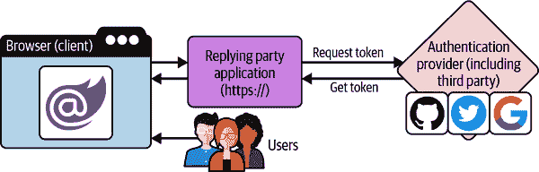
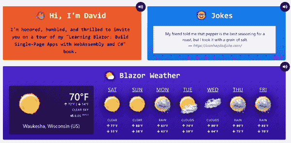
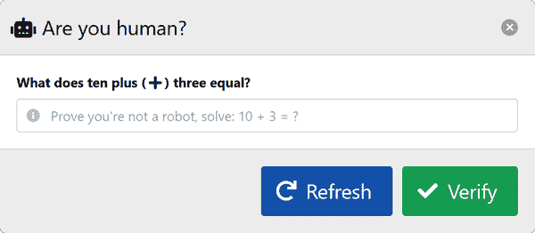

# 第四章 定制用户登录体验

在本章中，你将继续加深对如何在 Blazor WebAssembly 应用程序的上下文中认证用户以及定制认证体验的理解。你将看到一个熟悉的 Web 客户端启动配置模式，并继续探索应用程序的其他几个领域，如客户端服务的注册。从那里开始，我将进一步通过一个引人入胜的例子扩展你对 JavaScript 互操作性的知识，使用浏览器本地语音合成。你将了解应用程序头部功能，并看到在小型基础组件层次结构中实现模态对话框作为共享基础设施的模式。作为其中的一部分，你将学习如何编写和处理自定义事件。

# 关于 Blazor 认证的更多内容

使用应用程序时，你的身份用于唯一标识你作为应用程序用户。在大多数应用程序场景中都是如此，包括 Blazor 托管模型的默认配置。单个用户可以从多个客户端登录以使用 Learning Blazor 应用程序。然后用户经过身份验证，这意味着用户已经输入其凭据或通过身份验证工作流程被重定向。这些工作流程定义了必须准确和成功遵循的一系列顺序步骤，以生成经过身份验证的用户。以下是基本步骤：

1.  *获取授权码：* 运行 `/authorize` 端点，提供请求的 `scope`，用户与框架提供的 UI 交互。

1.  *获取访问令牌：* 成功后，从 `/token` 端点获取授权码令牌。

1.  *使用令牌：* 使用访问令牌向各种 HTTP Web API 发送请求。

1.  *刷新令牌：* 令牌通常会过期，过期时会自动刷新，并且已经通过身份验证的用户可以继续工作，而无需不断提示进行登录。

认证用户流程在图 4-1 中可视化。



###### 图 4-1\. 认证用户流程

我不会分享如何创建 Azure AD B2C 租户，因为这超出了本书的范围。此外，有很多关于这类事情的好资源。有关更多信息，请参阅微软的[“创建 Azure Active Directory B2C 租户”教程](https://oreil.ly/C2FgB)。只需知道租户存在，并且包含两个应用程序注册。有一个配置为单页应用的 WebAssembly 客户端应用程序和一个配置为服务器的 API 应用程序。它非常功能丰富，可以定制客户端的 HTML 工作流程。作为管理员，我配置了存在的用户范围以及返回/请求的声明。

在认证过程中，可能的状态列在“定制客户端授权体验”章节中。

用户由一系列键/值对（KVP）表示，称为 *claims*。键是命名并且相当标准化。值存储在受信任的第三方实体中，并从其检索，也称为 *authentication providers* ——比如 Google、GitHub、Facebook、Microsoft 和 Twitter。

## 客户端自定义授权消息处理程序实现

Learning Blazor 应用程序定义了 `Authorization​Mes⁠sageHandler` 的自定义实现。在 Blazor WebAssembly 应用程序中，您可以使用框架提供的 `AuthorizationMessageHandler` 类型为传出的请求附加令牌。让我们看看 *ApiAccessAuthorizationMessageHandler.cs* 的 C# 文件以了解其实现：

```cs
namespace Learning.Blazor.Handlers;

public sealed class ApiAccessAuthorizationMessageHandler 
    : AuthorizationMessageHandler
{
    public ApiAccessAuthorizationMessageHandler( 
        IAccessTokenProvider provider,
        NavigationManager navigation,      
        IOptions<WebApiOptions> options) : base(provider, navigation) =>
        ConfigureHandler(
            authorizedUrls: new[]
            {
                options.Value.WebApiServerUrl,
                options.Value.PwnedWebApiServerUrl,
                "https://learningblazor.b2clogin.com"
            },
            scopes: new[] { AzureAuthenticationTenant.ScopeUrl }); 
}
```


`ApiAccessAuthorizationMessageHandler` 是一个密封类。


其构造函数采用 `IAccessTokenProvider`、`NavigationManager` 和 `IOp⁠tions​<WebApiOptions>` 参数。


`base` 构造函数采用 `IAccessTokenProvider` 和 `NavigationManager`。


构造函数调用 `ConfigureHandler` 方法，设置 `authorizedUrls` 和 `scopes` 属性。

框架公开了 `AuthorizationMessageHandler`。它可以注册为 `HttpClient` 实例的 HTTP 消息处理程序，确保访问令牌附加到传出的 HTTP 请求中。

实现将需要配置的 `IOptions<WebApiOptions>` 抽象。此代码请求 DI 服务提供程序解析强类型配置对象。

子类应使用基类的 `ConfigureHandler` 方法配置自身。给定 Web API 和 Pwned Web API 服务器的 URL，分配了 `authorizedUrls` 数组。该实现基本上将一些配置的 URL 设置为允许列表的 URL。它还配置了一个特定于应用程序的 `scope` URL，该 URL 设置为处理程序的 `scopes` 参数传递给 `ConfigureHandler` 函数。然后可以使用 `AddHttpMessageHandler<ApiAccessAuthorizationMessageHandler>` 流畅 API 调用将此处理程序添加到 `IHttpClientBuilder` 实例中，在此处映射和配置 `HttpClient` 用于 DI。稍后在 “Web.Client ConfigureServices 功能” 中展示了这一点。所有从配置的 `HttpClient` 实例发出的 HTTP 请求都将附加适当的 `Authorization` 标头与短期访问令牌。

使用 C# 10 的常量插值字符串，租户主机和公共应用标识符与请求 `scope` 的 API 格式化。这是一个在名为 *Azure​Authen⁠ticationTenant.cs* 的 C# 文件中定义的 `const` 值，位于 `AzureAuthenticationTenant` 类中：

```cs
namespace Learning.Blazor;

static class AzureAuthenticationTenant
{
    const string TenantHost =
        "https://learningblazor.onmicrosoft.com";

    const string TenantPublicAppId =
        "ee8868e7-73ad-41f1-88b4-dc698429c8d4";

    /// <summary>
    /// Gets a formatted string value
    /// that represents the scope URL:
    /// <c>{tenant-host}/{app-id}/User.ApiAccess</c>.
    /// </summary>
    internal const string ScopeUrl =
        $"{TenantHost}/{TenantPublicAppId}/User.ApiAccess";
}
```

该类被定义为`static`，因为我不打算让开发者创建对象实例。该对象公开一个名为`ScopeUrl`的`const string`值。第一个`const string`是`TenantHost`。第二个`const string`是公共应用程序标识符（App Id），或`TenantPublicAppId`。`ScopeUrl`值格式为主机和 App Id，并以表示范围标识符`"User.ApiAccess"`的结尾段结束。

这只是一个实用的`static class`，是在源代码中硬编码 URL 的一个受欢迎的替代方案。这种方法更可取，因为完全限定的 URL 的每个部分都被指定为名称标识符。这些命名值用于表示 Learning Blazor Azure B2C 用户范围。此配置在部分 “Web.Client ConfigureServices 功能” 中处理。接下来，我们将介绍客户端授权 UX 的自定义。

### 自定义客户端的授权体验

客户端配置将处理设置客户端前端 Blazor 代码依赖于特定服务、客户端和经过身份验证的端点。用户体验了一个身份验证流程，而该流程的部分可从 Azure AD B2C 进行配置，我们也能够管理用户体验的各个方面，包括身份验证流程的各种状态前后的返回。这是通过 `"/authentication/{action}"` 页面路由模板实现的，属于 *Authentication.razor* 标记：

```cs
@page "/authentication/{action}"
@inherits LocalizableComponentBase<Authentication>

<div class="is-size-3">
    <RemoteAuthenticatorView 
        Action=@Action
        LogOut=@LocalizedLogOutFragment
        LogOutSucceeded=@LocalizedLoggedOutFragment
        LogOutFailed=@LocalizedLogOutFailedFragment
        LogInFailed=@LocalizedLogInFailedFragment>

        <LoggingIn> 
            <LoadingIndicator Message=@Localizer["CheckingLoginState"]
                              HideLogo="true" />
        </LoggingIn>
        <CompletingLogOut>
            <LoadingIndicator Message=@Localizer["ProcessingLogoutCallback"]
                              HideLogo="true" />
        </CompletingLogOut>
        <CompletingLoggingIn>
            <LoadingIndicator Message=@Localizer["CompletingLogin"]
                              HideLogo="true" />
        </CompletingLoggingIn>

    </RemoteAuthenticatorView>
</div>
```


`Authentication`页面呈现一个`RemoteAuthenticatorView`组件。


存在几个组件模板，用于渲染身份验证流程的不同片段。

就像应用程序的大多数组件一样，`Authentication`页面是一个组件，也是 `@inherits LocalizableComponentBase`。它被认为是一个页面，因为它定义了一个 `@page "/authentication/{action}"` 指令。当客户端路由处理导航事件以响应浏览器 URL 请求 `/authentication/{action}` 路由时，该组件被渲染，其中 `{action}` 对应远程身份验证流程的状态。

组件标记将框架提供的`RemoteAuthenticatorView`组件与一个`div`和`class`属性包装在一起，以控制整体布局。

`RemoteAuthenticatorView`组件本身提供了自定义体验的能力。该组件公开了模板化的渲染片段参数。通过这种能力，您可以为以下身份验证流程状态提供自定义体验：

`LogOut`

在处理*注销*事件时显示的用户界面

`LogOutSucceeded`

在处理*注销成功*事件时显示的用户界面

`LogOutFailed`

在处理*注销失败*事件时显示的用户界面

`LogInFailed`

在处理*登录失败*事件时显示的用户界面

`LoggingIn`

在处理*登录*事件时显示的用户界面

`CompletingLogOut`

在处理*完成登出*事件时显示的用户界面

`CompletingLoggingIn`

在处理*完成登录*事件时显示的用户界面

由于这些都是框架提供的`RenderFragment`类型，我们可以自定义渲染内容。我们可以直接或使用多个模板化参数语法分配给`RemoteAuthenticatorView`组件的参数属性。`LoggingIn`、`CompletingLogOut`和`CompletingLoggingIn`参数使用标记语法分配。

这三个参数使用自定义的`LoadingIndicator`组件分配。`LoadingIndicator`组件有条件地渲染 Blazor 标志以及加载指示器消息和动画/样式旋转图标。身份验证流的所有状态都隐藏了 Blazor 标志，但可以通过将`LoadingIndicator.HideLogo`参数设置为`false`来选择渲染它。每个状态都传递了本地化文本消息给加载指示器消息。这三个状态是过渡性的，因此在设计此方法时，我确定最好使用符合该期望的消息。

这并不意味着你不能使用幽默的胡说八道。认证流状态在你第一次学习时才会变得有趣——超过那个阶段，我们现在都是技术宅了，所以让我们有创意点吧！我们可以用随机的事实替换这些状态——谁不喜欢听一些有趣的事情呢？我留给你处理；给我发送一个拉取请求，也许我会创建一个社区支持的消息列表。关键是它是完全可定制的。以下列表包含我为应用程序配置的初始状态：

`LoggingIn`

依赖于带有以下值的`"CheckingLoginState"`本地化消息："阅读关于了不起的阿达·洛夫莱斯（世界上第一个计算机程序员）的信息。"

`CompletingLogOut`

依赖于`"ProcessingLogoutCallback"`本地化消息："事情并不总是表面看起来的。"

`CompletingLogin`

依赖于`"CompletingLogin"`本地化消息："插入周围随机散落的电线。"

`Authentication`页面组件的阴影使用了略微不同的技术来满足`RenderFragment`委托。请记住，框架提供的`RenderFragment`是一个返回`void`的`delegate`类型，并且它定义了一个`RenderTreeBuilder`参数。考虑到这一点，看看*C#文件 Authentication.razor.cs*：

```cs
using Microsoft.AspNetCore.Components.Rendering; 

namespace Learning.Blazor.Pages
{
    public sealed partial class Authentication 
    {
 [Parameter] public string? Action { get; set; } = null!;

        private void LocalizedLogOutFragment( 
            RenderTreeBuilder builder) =>
            ParagraphElementWithLocalizedContent(
                builder, Localizer, "ProcessingLogout");

        private void LocalizedLoggedOutFragment(
            RenderTreeBuilder builder) =>
            ParagraphElementWithLocalizedContent(
                builder, Localizer, "YouAreLoggedOut");

        private RenderFragment LocalizedLogInFailedFragment( 
            string errorMessage) =>
            ParagraphElementWithLocalizedErrorContent(
                errorMessage, Localizer, "ErrorLoggingInFormat");

        private RenderFragment LocalizedLogOutFailedFragment(
            string errorMessage) =>
            ParagraphElementWithLocalizedErrorContent(
                errorMessage, Localizer, "ErrorLoggingOutFormat");

        private static void ParagraphElementWithLocalizedContent( 
            RenderTreeBuilder builder,
            CoalescingStringLocalizer<Authentication> localizer,
            string resourceKey)
        {
            builder.OpenElement(0, "p");
            builder.AddContent(1, localizer[resourceKey]);
            builder.CloseElement();
        }

        private static RenderFragment ParagraphElementWithLocalizedErrorContent(
            string errorMessage, 
            CoalescingStringLocalizer<Authentication> localizer,
            string resourceKey) =>
            builder =>
            {
                builder.OpenElement(0, "p");
                builder.AddContent(1, localizer[resourceKey, errorMessage]);
                builder.CloseElement();
            };
    }
```


组件使用`Rendering`命名空间来消耗`RenderTreeBuilder`和`RenderFragment`类型。


`Authentication`页面有几种状态。


每个方法要么满足 `RenderFragment` 委托签名，要么返回 `RenderFragment` 类型。


当认证流程状态未能成功登录时，会呈现本地化消息。


`ParagraphElementWithLocalizedContent` 方法创建一个带有本地化消息的 `p` 元素。


`ParagraphElementWithLocalizedErrorContent` 方法通过接受可格式化的错误消息而不同。

`RenderFragment`，`RenderFragment<T>` 和 `RenderTreeBuilder` 类型首次讨论在“Blazor 导航基础”，并且属于 `Micro⁠soft​.AspNetCore.Components.Rendering` 命名空间，而 `Authentication` 页面组件在 `Learning.Blazor.Pages` 中。

`Authentication` 页面组件是不透明的，因为它定义了一个名为 `Action` 的 `string` 属性，并将其绑定到同名的框架提供的 `RemoteAuthenticatorView.Action` 属性。此组件还是一个部分类，作为带有代码后端的标记的影子。

`LocalizedLogOutFragment` 方法是 `private` 的；然而，部分类标记组件可以访问它。此方法在客户端浏览器完成 *登出* 认证流程处理后，被指定为渲染责任。它的参数是 `RenderTreeBuilder builder` 实例。该构建器立即与 `Localizer` 及常量字符串值 `"ProcessingLogout"` 一起传递给 `ParagraphElementWithLocalizedContent` 方法。该模式对于委托到相同辅助函数的 `LocalizedLoggedOutFragment` 方法重复，仅第三个参数变为 `"YouAreLoggedOut"`。这两种方法是 `void` 返回并接受 `RenderTreeBuilder` 参数的。这意味着它们匹配预期的 `RenderFragment` 委托签名。

出于教育目的，我将展示一些稍微不同的定制方法。注意 `LocalizedLogInFailedFragment` 不是 `void` 返回，也不接受 `RenderTreeBuilder` 参数。相反，该方法返回一个 `RenderFragment` 并接受一个 `string`。这是可能的，因为有两个 `RenderFragment` 委托： 

+   `delegate void RenderFragment(RenderTreeBuilder builder);`

+   `delegate RenderFragment RenderFragment<TValue>(TValue value);`

`ParagraphElementWithLocalizedContent` 方法使用了 `RenderTreeBuilder builder`、`CoalescingStringLocalizer<Authentication> localizer` 和 `string resourceKey` 参数。利用 `builder`，构建了一个开放的 `<p>` HTML 元素。根据 `localizer[resourceKey]` 的值添加了内容。最后，构建了闭合的 `</p>` HTML 元素。此方法被 *log out* 和 *logged out* 认证流程事件使用：

+   `"ProcessingLogout"` 渲染了“如果你没有改变世界，你就在原地踏步”的消息。

+   `"YouAreLoggedOut"` 渲染了“现在先告辞！”的消息。

`ParagraphElementWithLocalizedErrorContent` 方法与 `ParagraphElementWithLocalizedContent` 方法类似，定义了相同的参数，但返回的内容不同。在这种情况下，推断出了通用的 `Render​Frag⁠ment<string>` 委托类型，即使显式返回了 `RenderFragment` 委托类型。此方法被 *log in failed* 和 *log out failed* 认证流程事件使用：

+   登录失败时，显示格式化消息 `"There was an error trying to log you in: '{0}'"`。

+   当登出失败时，显示格式化消息 `"There was an error trying to log you out: '{0}'"`。

消息格式中的 `{0}` 值被用作未经处理的错误消息的占位符。

## Web.Client ConfigureServices 功能

你应该回忆起 WebAssembly 应用的顶层命名约定，一个 C# 的顶层程序。这最初展示在 示例 2-1 中，并涵盖了 `ConfigureServices` 扩展方法。我们没有讨论客户端服务注册的具体细节。大部分工作都发生在 *WebAssembly​HostBuilderExtensions.cs* 的 C# 文件中：

```cs
namespace Learning.Blazor.Extensions;

internal static class WebAssemblyHostBuilderExtensions
{
    internal static WebAssemblyHostBuilder ConfigureServices(
        this WebAssemblyHostBuilder builder)
    {
        var (services, configuration) = 
            (builder.Services, builder.Configuration);

        services.AddMemoryCache();
        services.AddScoped<ApiAccessAuthorizationMessageHandler>();
        services.Configure<WebApiOptions>(
            configuration.GetSection(nameof(WebApiOptions)));

        static WebApiOptions? GetWebApiOptions(
            IServiceProvider serviceProvider) =>
            serviceProvider.GetService<IOptions<WebApiOptions>>()
                ?.Value;

        var addHttpClient = 
            static IHttpClientBuilder (
                IServiceCollection services, string httpClientName,
                Func<WebApiOptions?, string?> webApiOptionsUrlFactory) =>
                services.AddHttpClient(
                    httpClientName, (serviceProvider, client) =>
            {
                var options = GetWebApiOptions(serviceProvider);
                var apiUrl = webApiOptionsUrlFactory(options);
                if (apiUrl is { Length: > 0 })
                    client.BaseAddress = new Uri(apiUrl);

                var cultureService =
                    serviceProvider.GetRequiredService<CultureService>();

                client.DefaultRequestHeaders.AcceptLanguage.ParseAdd(
                    cultureService.CurrentCulture.TwoLetterISOLanguageName);
            })
            .AddHttpMessageHandler<ApiAccessAuthorizationMessageHandler>();

        _ = addHttpClient(
            services, HttpClientNames.ServerApi,
            options => options?.WebApiServerUrl);
        _ = addHttpClient(
            services, HttpClientNames.PwnedServerApi,
            options => options?.PwnedWebApiServerUrl);
        _ = addHttpClient(
            services, HttpClientNames.WebFunctionsApi,
            options => options?.WebFunctionsUrl ??
                builder.HostEnvironment.BaseAddress);

        services.AddScoped<WeatherFunctionsClientService>();
        services.AddScoped( 
            sp => sp.GetRequiredService<IHttpClientFactory>()
                .CreateClient(HttpClientNames.ServerApi));
        services.AddLocalization();
        services.AddMsalAuthentication(
            options =>
            {
                configuration.Bind(
                    "AzureAdB2C", options.ProviderOptions.Authentication);
                options.ProviderOptions.LoginMode = "redirect";
                var add = options.ProviderOptions.DefaultAccessTokenScopes.Add;

                add("openid");
                add("offline_access");
                add(AzureAuthenticationTenant.ScopeUrl);
            });
        services.AddOptions();
        services.AddAuthorizationCore();
        services.AddSingleton<SharedHubConnection>();
        services.AddSingleton<AppInMemoryState>();
        services.AddSingleton<CultureService>();
        services.AddSingleton(typeof(CoalescingStringLocalizer<>));
        services.AddScoped
            <IWeatherStringFormatterService, WeatherStringFormatterService>();
        services.AddScoped<GeoLocationService>();
        services.AddHttpClient<GeoLocationService>(client =>
        {
            var apiHost = "https://api.bigdatacloud.net"; 
            var reverseGeocodeClientRoute = "data/reverse-geocode-client";
            client.BaseAddress =
                new Uri($"{apiHost}/{reverseGeocodeClientRoute}");
            client.DefaultRequestHeaders.AcceptEncoding.ParseAdd("gzip");
        });
        services.AddJokeServices();
        services.AddLocalStorageServices();
        services.AddSpeechRecognitionServices();

        return builder;
    }
}
```


`(IServiceCollection services, IConfiguration configuration)` 元组被用来捕获 `services` 和 `configuration` 作为局部变量。


定义了一个静态的局部函数 `addHttpClient`。


`IHttpClientFactory` 被添加为单例。


地理位置 API 已经配置了它的 `HttpClient`。

文件作用域的命名空间是 `Learning.Blazor.Extensions`，它为客户端代码共享所有扩展功能。扩展类是 `internal` 的，并且像所有扩展类一样，必须是 `static` 的。`ConfigureServices` 方法以这种方式命名是因为它可能对习惯于启动约定的 ASP.NET Core 开发者来说很熟悉，但不必非得这样命名。为了允许方法链式调用，这个扩展方法返回它扩展的 `WebAssemblyHostBuilder` 对象。

从 `builder` 中声明并分配了 `services` 和 `configuration` 对象。然后我们将上述的 `ApiAccessAuthorizationMessageHandler` 添加为作用域服务。配置了 `WebApiOptions` 实例，从解析的 `configuration` 实例的 `WebApiOptions` 对象中实现绑定。有一个名为 `GetWebApiOptions` 的静态本地函数，它返回一个有问题的 `WebApiOptions` 对象，给定一个 `IServiceProvider` 实例。

为了避免重复代码，`addHttpClient` 是一个静态的本地函数，封装了添加和配置 HTTP 客户端的过程。它接收 `services`、一个 `httpClientName` 和一个充当工厂的函数，并返回一个 `IHttpClientBuilder` 实例。该函数名为 `webApiOptionsUrlFactory`，它根据配置的选项对象返回一个可空的字符串。Lambda 表达式委托给 `IServiceCollection` 类型上的 `AddHttpClient` 扩展方法。这样配置 HTTP 客户端的基地址就是配置的 URL。还将 `"Accept-Language"` 默认请求头设置为当前配置的 `Culture​Ser⁠vice` 实例的 ISO 639-1 两字母代码。有两次调用这个 `addHttp​Client` 表达式：设置 Web API 服务器端点和 "Have I Been Pwned" 服务器端点。

添加了一些额外的服务，并配置了 Microsoft Authentication Library (MSAL) 服务，并绑定到 `configuration` 实例的 `"AzureAdB2C"` 部分。将 `LoginMode` 分配为 `"redirect"`，导致应用程序重定向用户到 Azure AD B2C 完成登录。Lambda 表达式改进的另一个示例是声明并分配一个名为 `add` 的变量，它委托给集合方法上的 `DefaultAccessTokenScopes.Add` 功能。它期望一个字符串并返回 `void`。然后，`add` 变量被调用三次，添加 `"openid"`、`"offline_access"` 和 `ScopeUrl` 范围。然后注册了剩余的许多服务。

添加并配置了 `HttpClient`，当 DI 解析 `Geo​Lo⁠cationService` 时将使用它。大数据云、API 主机和路由被用作客户端的基地址。然后注册了额外的依赖项，包括 Joke Services 和 Local Storage 包。`IJSInProcessRuntime` 被注册为单一实例，通过从 `IJSRuntime` 进行转换来解析。这只有在 Blazor WebAssembly 中才可能。这在 第七章 中有更详细的讨论。最后，返回了 `builder`，完成了流畅的 `ConfigureServices` API。

此单个扩展方法是负责配置客户端应用程序的 DI 的代码。您会注意到，已为将代表客户端转发令牌的 `HttpClient` 实例配置了 HTTP 消息处理程序，该处理程序来自 `ApiAccessAuthorizationMessageHandler`。这很重要，因为并非所有 API 端点都需要经过身份验证的用户，但只有在正确配置的情况下，这些端点才能访问。

# 本机语音合成

您已经看到如何为 DI 注册所有客户端服务，并在组件中消费注册的服务。在前一章中，您看到了主页如何呈现其磁贴内容。如果您还记得，每个磁贴都包含一些包括 `Additive​S⁠peechComponent` 的标记。虽然我向您展示了如何消费此组件，但我还没有展开其工作原理。任何连接到 `Additive​S⁠peechComponent` 的组件都将能够使用本机语音合成服务。点击在 图 4-2 中显示的音频按钮将触发语音合成服务来朗读磁贴的文本。



###### 图 4-2\. 主页磁贴

`AdditiveSpeechComponent` 公开一个 `Message` 参数。消费组件引用此组件并分配消息。考虑 *Additive​S⁠peechComponent.razor* 标记文件：

```cs
@inherits LocalizableComponentBase<AdditiveSpeechComponent>

<div class="is-top-right-overlay">
    <button class="button is-rounded is-theme-aware-button p-4 @_dynamicCSS"
        disabled=@_isSpeaking @onclick=OnSpeakButtonClickAsync>
        <span class="icon is-small">
            <i class="fas fa-volume-up"></i>
        </span>
    </button>
</div>
```

`AdditiveSpeechComponent` 继承了 `LocalizableComponentBase` 以使用注入到基类的三个常见服务。`AppInMemoryState`、`CultureService` 和 `IJSRuntime` 服务足以保证此继承。

标记是一个带有描述性 `class` 属性的 `div` 元素，它覆盖了消费组件的右上角。`div` 元素是一个圆角和主题感知的 `button` 的父元素，带有一些动态 CSS。当 `_isSpeaking` 位评估为 `true` 时，按钮本身是 `disabled` 的。这是我们涵盖的第一个显示 Blazor 事件处理的组件标记。当用户点击按钮时，将调用 `OnSpeakButtonClickAsync` 事件处理程序。

您可以为所有有效的 DOM 事件指定事件处理程序。语法遵循一个非常具体的模式：`@on{EventName}={EventHandler}`。此语法作为元素属性应用，其中：

+   `{EventName}` 是 [DOM 事件名称](https://oreil.ly/ToPqA)。

+   `{EventHandler}` 是将处理事件的方法的名称。

例如，`@onclick=OnSpeakButtonClickAsync` 将 `OnSpeakButtonClickAsync` 事件处理程序分配给元素的 `click` 事件；换句话说，当点击时，它调用 `OnSpeakButtonClickAsync`。

`OnSpeakButtonClickAsync` 方法定义在组件的阴影中，并返回 `Task`。这意味着除了同步事件处理程序外，还完全支持异步事件处理程序。在 Blazor 事件处理程序中，UI 的更改会自动触发，因此您无需手动调用 `StateHasChanged` 以触发重新渲染。*AdditiveSpeechComponent.razor.cs* C# 文件如下所示：

```cs
namespace Learning.Blazor.Components
{
    public partial class AdditiveSpeechComponent 
    {
        private bool _isSpeaking = false;
        private string _dynamicCSS
        {
            get
            {
                return string.Join(" ", GetStyles()).Trim();

                IEnumerable<string> GetStyles()
                {
                    if (string.IsNullOrWhiteSpace(Message))
                        yield return "is-hidden";

                    if (_isSpeaking)
                        yield return "is-flashing";
                };
            }
        }
 [Parameter]
        public string? Message { get; set; } = null!;

        async Task OnSpeakButtonClickAsync() 
        {
            if (Message is null or { Length: 0 })
            {
                return;
            }

            var (voice, voiceSpeed) = AppState.ClientVoicePreference;
            var bcp47Tag = Culture.CurrentCulture.Name;

            _isSpeaking = true;

            await JavaScript.SpeakMessageAsync(
                this,
                nameof(OnSpokenAsync),
                Message,
                voice,
                voiceSpeed,
                bcp47Tag);
        }
 [JSInvokable]
        public Task OnSpokenAsync(double elapsedTimeInMilliseconds) => 
            InvokeAsync(() =>
            {
                _isSpeaking = false;

                Logger.LogInformation(
                    "Spoke utterance in {ElapsedTime} milliseconds",
                    elapsedTimeInMilliseconds);

                StateHasChanged();
            });
    }
}
```


`AdditiveSpeechComponent` 维护几个组件状态位。


`OnSpeakButtonClickAsync` 方法有条件地发言消息。


`OnSpokenAsync` 方法在消息发言后被调用。

类中有一个 `_isSpeaking` 字段，默认为 `false`。此值用于确定如何渲染 `<button>`。 `_dynamicCSS` 属性仅具有 `get` 访问器，这使它成为只读。它确定应用于 `<button>` 的样式。`Message` 属性是一个 `Parameter`，允许从消费组件中进行赋值。

分配给按钮 `click` 事件处理程序的事件处理程序是 `OnSpeakButtonClickAsync` 方法。当从 `Message` 获得有意义的值时，此处理程序从内存中的应用程序状态服务获取 `voice` 和 `voiceSpeed`，以及当前文化的 [最佳当前实践 (BCP 47) 语言标签](https://oreil.ly/cZ57I) 值。`_isSpeaking` 位设置为 `true`，并且等待调用 `JavaScript.SpeakMessageAsync`，给定 `this` 组件，`OnSpokenAsync` 回调的名称，`Message`，`voice`，`voiceSpeed` 和 `bcp47Tag`。这种模式可能看起来有些熟悉；无论您的应用程序需要多少依赖于浏览器的本机功能，都可以使用 JavaScript 互操作。

`OnSpokenAsync` 方法声明为 `JSInvokable`。由于此回调是异步且在不确定的时间发生，组件无法知道何时重新渲染，因此必须使用 `StateHasChanged` 明确告知它。

###### 提示

每当定义 `JSInvokable` 方法改变组件状态时，必须调用 `StateHasChanged` 以信号重新渲染。

`OnSpokenAsync` 处理程序表达为 `InvokeAsync`，在呈现同步上下文中执行给定的工作项。它将 `_isSpeaking` 设置为 `false`，记录消息发言的总时间，然后通知组件其状态已更改。

标记是最小化的，代码背后简洁而强大。让我们深入了解 *JSRuntimeExtensions.cs* C# 文件，看看 `SpeakMessageAsync` 是什么样子的：

```cs
namespace Learning.Blazor.Extensions;

internal static partial class JSRuntimeExtensions
{
    internal static ValueTask SpeakMessageAsync<T>(
        this IJSRuntime jsRuntime,
        T dotnetObj,
        string callbackMethodName,
        string message,
        string defaultVoice,
        double voiceSpeed,
        string lang) where T : class =>
        jsRuntime.InvokeVoidAsync(
            "app.speak",
            DotNetObjectReference.Create(dotnetObj),
            callbackMethodName, message, defaultVoice, voiceSpeed, lang);
}
```

使用有意义的名称扩展 `IJSRuntime` 功能让我感到满足。我在这些小胜利中找到了快乐，但在阅读代码时也带来了更愉快的体验。将其读作 `JavaScript.SpeakMessageAsync` 是自我描述的。此扩展方法委托给 `IJSRuntime.InvokeVoidAsync` 方法，调用 `"app.speak"` 给定 `DotNetObjectReference`、回调方法名、`message`、`voice`、语速和语言。我本可以直接从组件调用 `InvokeVoidAsync`，但我更喜欢扩展方法的描述性方法名。这是我推荐的模式，因为它有助于封装逻辑，并且更容易从多个调用点消费。此扩展方法依赖的 JavaScript 代码位于 *wwwroot/js/app.js* 文件中：

```cs
const cancelPendingSpeech = () => { 
    if (window.speechSynthesis
    && window.speechSynthesis.pending === true) {
        window.speechSynthesis.cancel();
    }
};

const speak = (dotnetObj, callbackMethodName, message, 
               defaultVoice, voiceSpeed, lang) => {
    const utterance = new SpeechSynthesisUtterance(message);
    utterance.onend = e => {
        if (dotnetObj) {
            dotnetObj.invokeMethodAsync(callbackMethodName, e.elapsedTime)
        }
    };

    const voices = window.speechSynthesis.getVoices(); 
    try {
        utterance.voice =
            !!defaultVoice && defaultVoice !== 'Auto'
                ? voices.find(v => v.name === defaultVoice)
                : voices.find(v => !!lang &&
                    v.lang.startsWith(lang)) || voices[0];
    } catch { }
    utterance.volume = 1;
    utterance.rate = voiceSpeed || 1;

    window.speechSynthesis.speak(utterance); 
};

window.app = Object.assign({}, window.app, {
    speak,
    // omitted for brevity... });

// Prevent the client from speaking when the user closes the tab or window. window.addEventListener('beforeunload', _ => { 
    cancelPendingSpeech();
});
```


作为一种安全措施，防止用户关闭标签页或窗口时浏览器发声，定义了 `cancelPendingSpeech` 方法。


`speak` 函数创建并准备一个 `utterance` 实例以便使用。


`utterance.voice` 属性设置为根据 `defaultVoice` 和 `lang` 参数过滤的 `voices` 数组。


`utterance` 被传递给 `speechSynthesis.speak` 方法。


`beforeunload` 事件处理程序被定义为取消任何待定的语音。

`cancelPendingSpeech` 函数检查 `window.speechSynthesis` 对象是否为真值（在此情况下，表示不为 `null` 或 `undefined`）。如果队列中有任何待定的话语，将调用 `window.speechSynthesis.cancel()` 方法，从队列中移除所有话语。

`"app.speak"` 方法被定义为名为 `speak` 的函数。它有六个参数，感觉有点多。如果你愿意，可以将其参数化为单个顶层对象，但这将需要一个新的模型和额外的序列化。我可能会限制参数列表不超过六个，但编程中一切都是权衡取舍。`speak` 方法的主体通过给定的 `message` 实例化 `SpeechSynthesisUtterance`。此对象公开了在话语结束时触发的 `end/onend` 事件。分配了内联事件处理程序，依赖于给定的 `dotnetObj` 实例和 `callbackMethodName`。话语结束时，事件触发并回调到调用组件的给定方法。

尝试为 utterance 分配所需的语音。这可能会存在问题且容易出错，因此它的尝试是脆弱的，并用`try`/`catch`保护起来。如果成功，那很好，如果不成功，因为浏览器将选择默认语音，所以这并不是什么大问题。音量设置为`1`，并设置 utterance 的朗读速度。

准备好`utterance`实例后，调用`window.speechSynthe⁠sis​.speak(utterance)`。这将把 utterance 加入本地语音合成队列。当`utterance`到达队列末尾时，它会被朗读出来。`"app.speak"`名称来自于`speak`函数`const`添加到一个新实例或现有实例中的方式。

如果正在朗读长文本，并且用户关闭了应用程序的浏览器选项卡或窗口，但保持浏览器开启，则 utterance 将继续朗读。为避免此行为，我们将在窗口*卸载*时调用`cancelPendingSpeech`。

`AdditiveSpeechComponent`可以捆绑到一个单独的 Razor 组件项目中，并分发给消费应用程序。这种方法非常有益，因为它暴露功能并与消费者共享。此组件的所有功能都封装在一起，并且可以通过 NuGet 分享。在撰写本文时，该组件仍作为 Web.Client 项目的一部分，但这并不意味着它不能轻松地在复杂性上发展或添加新功能。一旦在 NuGet 上，它可以被其他.NET 开发人员用于消费开源项目。

“学习 Blazor”示例应用程序演示了如何创建 Razor 项目并从 Blazor Web 客户端消费它们。Web.Client 项目依赖于 Web.TwitterComponents Razor 类库。Web.TwitterComponents 项目封装了一些特定于 Twitter 的组件。Web.Client 消费这些组件并向 Blazor Web 客户端公开它们。

# 分享和消费自定义组件

要使用组件，您需要在消费组件的标记中引用它。Blazor 提供了许多开箱即用的组件，从布局到导航，从标准表单控件到错误边界，从页面标题到头部输出等等。参见微软的[“ASP.NET Core 内置 Razor 组件”文档](https://oreil.ly/2RhYY)以获取可用组件的列表。

当内置组件不足够时，您可以转向自定义组件。还有许多其他供应商提供的组件。此外，还有一个庞大的开源社区构建组件库。作为开发人员，在构建 Blazor 应用程序时，很有可能会从所有供应商提供的组件库中找到所需的内容。请考虑以下供应商资源列表：

+   [Telerik：UI for Blazor](https://oreil.ly/yvL4B)

+   [DevExpress：Blazor UI 组件](https://oreil.ly/QeFJA)

+   [Syncfusion：Blazor 组件库](https://oreil.ly/YLO7B)

+   [Radzen：Blazor 组件](https://oreil.ly/hf29O)

+   [Infragistics：Blazor UI 组件](https://oreil.ly/IyJ0D)

+   [GrapeCity：用于 Web 应用程序的 Blazor UI 控件](https://oreil.ly/6ysQy)

+   [jQWidgets：Smart.Blazor UI 组件库](https://oreil.ly/SX6nA)

+   [MudBlazor：基于 Material Design 的 Blazor 组件库](https://oreil.ly/BBGUy)

GitHub 上有一个社区策划的列表，称为[Blazor 精选](https://oreil.ly/sTodG)，这是另一个很好的资源。有时，您可能需要框架、供应商甚至整个社区中不可用的功能。发生这种情况时，您可以编写自己的组件库。

由于 Blazor 建立在 Razor 之上，所有组件都是 Razor 组件。它们可以通过它们的*.razor*文件扩展名轻松识别。

# Chrome：重载的术语

对于 GUI 应用程序，有一个经过多年重载的老术语。术语*chrome*指的是 UI 的一个元素，用于显示用户可用的各种命令或功能。例如，Learning Blazor 示例应用程序的*chrome*是顶部栏。其中包括应用程序的顶级导航、主题显示图标以及各种弹出模态组件的按钮，例如通知切换、任务列表切换和登录/登出按钮。这在第二章的图 2-2 和 2-3 中有展示。当我提到 chrome 时，我不是在说网络浏览器。我们已经稍微讨论了导航和路由，所以让我们专注于模态模块化。

## 模态模块化与 Blazor 组件层次结构

大多数应用程序需要与用户进行交互并提示他们输入。应用程序的导航是一种用户体验，用户输入的一个例子是用户点击链接以访问他们想要访问的路由，然后应用程序执行一个操作。有时，我们需要提示用户使用键盘而不是鼠标。我们询问用户的问题主要根据领域而异，例如，“您的电子邮件地址是什么？”或“您要发送的消息是什么？”答案根据控件类型而异，意味着自由形式文本行或文本区域，或复选框、选择列表或按钮。Blazor 完全支持所有这些。您可以订阅本机 HTML 元素事件并在 Razor C#组件逻辑中处理它们。还有本机集成和模态/输入绑定验证、模板化和组件层次结构。

其中一个控件是名为`ModalComponent`的自定义控件。该组件将用于应用程序的各种用例中。它将具有一个继承的组件来示例化组件子类模式，这在 C#中很常见，但作为 JavaScript SPAs 的编程模式却不常用。考虑*ModalComponent.razor*的标记文件：

```cs
<div class="modal has-text-left @_isActiveClass"> 
    <div class="modal-background" @onclick=@CancelAsync></div>
    <div class="modal-card">
        <header class="modal-card-head">
            <p class="modal-card-title"> @TitleContent 
            </p>
            <button class="delete" aria-label="close" @onclick=@CancelAsync>
            </button>
        </header>

        <section class="modal-card-body"> @BodyContent 
        </section>

        <footer class="modal-card-foot is-justify-content-flex-end">
            <div> @ButtonContent 
            </div>
        </footer>
    </div>
</div>
```


最外层元素是带有`modal`类的`div`。


标题被表示为带有`modal-card-title`类的`header`元素。


主体是一个带有`modal-card-body`类的`section`。


`footer`使用`modal-card-foot`类进行样式设置。

HTML 是一个模态框样式的`div`，其`class`属性绑定到`_isActiveClass`值，这意味着模态框的状态，无论是激活（显示）还是不激活，都依赖于组件变量。它具有应用覆盖层的背景样式，使得这个元素作为模态对话框弹出显示给用户。背景`div`元素本身通过调用`CancelAsync`来处理用户点击，并覆盖整个页面。

HTML 语义准确，代表着行业标准化的三部分头部/主体/页脚布局。第一个模板占位符是`@TitleContent`。这是一个必需的`RenderFragment`，允许消费组件提供自定义的标题标记。`header`还包含一个`button`，当点击时将调用`CancelAsync`。

`BodyContent`适当地样式化为模态框的主体，它是一个`section`HTML 元素，在`header`之下和`footer`之上语义化地定位。

模态框的`footer`包含必需的`ButtonContent`标记。总体来说，这个模态框表示一个常见的对话框组件，消费者可以插入他们定制的标记和相应的提示。

组件阴影定义了组件的参数属性、事件、组件状态和功能。考虑*C#文件* `ModalComponent.razor.cs`：

```cs
namespace Learning.Blazor.Components; 

public partial class ModalComponent
{
    private string _isActiveClass => IsActive ? "is-active" : "";
 [Parameter]
    public EventCallback<DismissalReason> Dismissed { get; set; } 
 [Parameter]
    public bool IsActive { get; set; }
 [Parameter, EditorRequired]
    public RenderFragment TitleContent { get; set; } = null!;
 [Parameter, EditorRequired]
    public RenderFragment BodyContent { get; set; } = null!;
 [Parameter, EditorRequired]
    public RenderFragment ButtonContent { get; set; } = null!;

    /// <summary>
    /// Gets the reason that the <see cref="ModalComponent"/> was dismissed.
    /// </summary>
    public DismissalReason Reason { get; private set; }

    /// <summary>
    /// Sets the <see cref="ModalComponent"/> instance's
    /// <see cref="IsActive"/> value to <c>true</c> and
    /// <see cref="Reason"/> value as <c>default</c>.
    /// It then signals for a change of state; this rerender will
    /// show the modal.
    /// </summary>
    public Task ShowAsync() => 
        InvokeAsync(() => (IsActive, Reason) = (true, default));

    /// <summary>
    /// Sets the <see cref="ModalComponent"/> instance's
    /// <see cref="IsActive"/> value to <c>false</c> and
    /// <see cref="Reason"/> value as given <paramref name="reason"/>
    /// value. It then signals for a change of state;
    /// this rerender will cause the modal to be dismissed.
    /// </summary>
    public Task DismissAsync(DismissalReason reason) =>
        InvokeAsync(async () =>
        {
            (IsActive, Reason) = (false, reason);
            if (Dismissed.HasDelegate)
            {
                await Dismissed.InvokeAsync(Reason);
            }
        });

    /// <summary>
    /// Dismisses the shown modal; the <see cref="Reason"/>
    /// will be set to <see cref="DismissalReason.Confirmed"/>.
    /// </summary>
    public Task ConfirmAsync() => DismissAsync(DismissalReason.Confirmed);

    /// <summary>
    /// Dismisses the shown modal; the <see cref="Reason"/>
    /// will be set to <see cref="DismissalReason.Cancelled"/>.
    /// </summary>
    public Task CancelAsync() => DismissAsync(DismissalReason.Cancelled);

    /// <summary>
    /// Dismisses the shown modal; the <see cref="Reason"/>
    /// will be set to <see cref="DismissalReason.Verified"/>.
    /// </summary>
    public Task VerifyAsync() => DismissAsync(DismissalReason.Verified);
}

public enum DismissalReason 
{
    Unknown, Confirmed, Cancelled, Verified
};
```


`ModalComponent`类属于`Learning.Blazor.Components`命名空间。


几个属性共同代表了必需的组件参数、事件、模板和组件状态值的示例。


至于功能性和模块化，模态框组件可以显示和同样容易地解除显示。


`enum DismissalReason`类型在相同的文件范围命名空间内定义。

###### 提示

在 Blazor 中，当您定义一个作为`Parameter`使用的属性，并且希望该参数是必需的时，可以使用框架提供的`EditorRequired`属性。这指定了组件参数在编辑器中必须由用户提供。如果未提供此参数的值，编辑器或构建工具可能会提供警告，提示用户指定一个值。

`ModalComponent`类定义了几个属性：

`_isActiveClass`

作为计算属性的私有字符串，评估 `IsActive` 属性并在 `true` 时返回 `"is-active"`。这与模态框的标记绑定，`div` 的 `class` 属性包含一些静态类和动态绑定的值。

`Dismissed`

一个组件参数，类型为`EventCallback<DismissalReason>`。事件回调接受消费者的委托分配，其中事件从此组件流向感兴趣的接收者。

`IsActive`

一个 `bool` 值，表示模态框当前是否正在向用户显示。此参数通常通过调用 `DismissAsync` 隐式设置，*不* 是必需的。

`TitleContent`

表示标题头部模板占位符的命名 `RenderFragment` 类型。

`BodyContent`

表示正文内容的命名 `RenderFragment` 类型。

`ButtonContent`

表示页脚控件模板占位符的命名 `RenderFragment` 类型。

`Reason`

模态解雇的原因是“未知”，“确认”，“取消”或“验证”。

`ModalComponent` 通过模板化功能暴露了模块化，消费者可以钩入组件。消费者可以调用这些返回 `public Task` 的异步操作方法中的任何一个：

`ShowAsync`

立即向用户显示模态框。此方法通过调用 `InvokeAsync` 表达，给定一个 Lambda 表达式，将 `IsActive` 的值设置为 `true`，并将 `Reason` 分配为 `default`（或 `DismissalReason.Unknown`）。此时不需要调用 `State​Ha⁠sChanged`。异步操作支持将根据需要自动重新渲染 UI 组件。

`DismissAsync`

给定解雇原因，立即解雇模态框。`IsActive` 状态设置为 `false`，这将有效隐藏组件。

`ConfirmAsync`

将解雇原因设置为`Confirmed`，并委托给`DismissAsync`。

`CancelAsync`

将解雇原因设置为`Cancelled`，并委托给`DismissAsync`。

`VerifyAsync`

将解雇原因设置为`Verified`，并委托给`DismissAsync`。

`enum DismissalReason` 类型定义了四种状态：`Unknown`（默认），`Confirmed`，`Cancelled`（可以由用户在模态框外点击隐式发生），以及`Verified`。

## 探索 Blazor 事件绑定

`ModalComponent` 被 `VerificationModalComponent` 消费。让我们看看在 *VerificationModalComponent.razor* 标记文件中如何实现这一点：

```cs
@inherits LocalizableComponentBase<VerificationModalComponent>

<ModalComponent @ref="_modal" Dismissed=@OnDismissed> 
    <TitleContent> 
        <span class="icon pr-2">
            <i class="fas fa-robot"></i>
        </span>
        <span>@Localizer["AreYouHuman"]</span>
    </TitleContent>
    <BodyContent> 
        <form>
            <div class="field">
                <label class="label">@_math.HumanizeQuestion()</label>
                <div class="field-body">
                    <div class="field">
                        <p class="control is-expanded has-icons-left"> @{
                                var inputValidityClass =
                                    _answeredCorrectly is false
                                        ? " invalid"
                                        : "";

                                var inputClasses = $"input{inputValidityClass}";
                            } <input @bind="_attemptedAnswer" 
                                class=@inputClasses
                                type="text"
                                placeholder="@Localizer["AnswerFormat",
                                    _math.GetQuestion()]" />
                            <span class="icon is-small is-left">
                                <i class="fas fa-info-circle"></i>
                            </span>
                        </p>
                    </div>
                </div>
            </div>
        </form>
    </BodyContent>
    <ButtonContent> 
        <button class="button is-info is-large is-pulled-left" @onclick=Refresh>
            <span class="icon">
                <i class="fas fa-redo"></i>
            </span>
            <span>@Localizer["Refresh"]</span>
        </button>
        <button class="button is-success is-large" @onclick=AttemptToVerify>
            <span class="icon">
                <i class="fas fa-check"></i>
            </span>
            <span>@Localizer["Verify"]</span>
        </button>
    </ButtonContent>
</ModalComponent>
```


`_modal` 引用连接了 `OnDismissed` 事件处理程序。


`TitleContent` 渲染了本地化的提示消息和机器人图标。


`BodyContent`呈现一个带有单个输入字段的表单。


`_attemptedAnswer`属性绑定到输入字段的`value`属性。


按钮在`ButtonContent`模板中呈现。

`VerificationModalComponent`标记依赖于`ModalComponent`，并使用`@ref="_modal"`语法捕获模态的引用。Blazor 将自动从引用组件标记的实例值中分配`_modal`字段。在`VerificationModalComponent`内部，依赖的`ModalComponent.Dismissed`事件由`OnDismissed`处理程序处理。换句话说，`ModalComponent.Dismissed`是一个必需的参数，它是组件将触发的事件。`VerificationModalComponent.OnDismissed`事件处理程序被分配用来处理它。这是自定义事件绑定，其中消费组件处理依赖组件的暴露参数化事件。

验证模态框的标题内容（`TitleContent`）提示用户“您是人类吗？”。

`BodyContent`标记包含一个本地 HTML `form`元素。在这个标记中有一个简单的`label`和相应的文本`input`元素。`label`从评估的`_math.GetQuestion()`调用中将问题插入标记中（稍后会详细介绍`_math`对象）。尝试的答案`input`元素根据是否正确回答问题动态绑定了 CSS 类。

`input`元素的`value`绑定到`_attemptedAnswer`变量。它还具有从本地化的答案格式中绑定的`placeholder`，这将为用户提供关于预期输入的线索。

`ButtonContent`标记具有两个按钮，一个用于通过`Refresh`方法刷新问题，另一个用于尝试验证答案（通过`AttemptToVerify`方法）。这是本地事件绑定的示例，其中`button`元素将它们的`click`事件绑定到相应的事件处理程序。

`ModalComponent`本身是一个基本模态，而`VerificationModalComponent`使用基本模态并使用非常特定的验证提示。`VerificationModalComponent`将如图 4-3 所示呈现。



###### 图 4-3\. `VerificationModalComponent`的示例渲染

`VerificationModalComponent`的组件影子位于*VerificationModalComponent.cs*文件中：

```cs
namespace Learning.Blazor.Components
{
    public sealed partial class VerificationModalComponent 
    {
        private AreYouHumanMath _math = AreYouHumanMath.CreateNew();
        private ModalComponent _modal = null!;
        private bool? _answeredCorrectly = null!;
        private string? _attemptedAnswer = null!;
        private object? _state = null;
 [Parameter, EditorRequired] 
        public EventCallback<(bool IsVerified, object? State)>
            OnVerificationAttempted
            {
                get;
                set;
            }

        public Task PromptAsync(object? state = null) 
        {
            _state = state;
            return _modal.ShowAsync();
        }

        private void Refresh() => 
            (_math, _attemptedAnswer) = (AreYouHumanMath.CreateNew(), null);

        private async Task OnDismissed(DismissalReason reason) 
        {
            if (OnVerificationAttempted.HasDelegate)
            {
                await OnVerificationAttempted.InvokeAsync(
                    (reason is DismissalReason.Verified, _state));
            }
        }

        private async Task AttemptToVerify() 
        {
            if (int.TryParse(_attemptedAnswer, out var attemptedAnswer))
            {
                _answeredCorrectly = _math.IsCorrect(attemptedAnswer);
                if (_answeredCorrectly is true)
                {
                    await _modal.DismissAsync(DismissalReason.Verified);
                }
            }
            else
            {
                _answeredCorrectly = false;
            }
        }
    }
}
```


`VerificationModalComponent`包装了`ModalComponent`以添加验证层。


事件回调显示验证尝试是否成功。


`Prompt` 方法委托给 `ModalComponent.ShowAsync` 方法。


`Refresh` 方法重置 `_math` 和 `_attemptedAnswer` 字段。


当模态框被解除时，`OnDismissed` 事件处理程序被调用。


`AttemptToVerify` 方法如果答案正确则解除模态框。

`VerificationModalComponent` 类定义以下字段：

`_math`

数学对象是 `AreYouHumanMath` 类型，并从 `AreYouHumanMath.CreateNew()` 工厂方法分配。这是一种自定义类型，用于表示一个人类可能能在脑海中解决的简单数学问题。

`_modal`

代表相应标记的 `ModalComponent` 实例字段。将在此实例上调用方法，例如 `ShowAsync` 以向用户显示模态。

`_answeredCorrectly`

三态 `bool` 用于确定用户是否正确回答了问题。

`_attemptedAnswer`

可空的 `string` 绑定到 `input` 元素，用于存储用户输入的值。

`_state`

一个表示不透明值的状态对象，代表消费者的身份。当消费组件调用 `PromptAsync` 时，如果他们传递 `state`，它将分配给 `_state` 变量，然后在调用 `OnVerificationAttempted` 事件回调时返回给调用者。

`OnVerificationAttempted` 是一个必需的参数。回调签名传递一个元组对象，其第一个值表示验证尝试是否成功。当用户正确输入正确答案时为 `true`；否则为 `false`。第二个值是一个可选的状态对象。

`PromptAsync` 方法用于显示模态对话框，并接受一个可选的状态对象。

`Refresh` 方法绑定到刷新按钮，并用于重新随机化正在提问的问题。`AreYouHumanMath.CreateNew()` 工厂方法被重新分配给 `_math` 字段，并将 `_attemptedAnswer` 设置为 `null`。

`OnDismissed` 方法是 `ModalComponent.Dismissed` 事件回调的处理程序。当基础模态框被解除时，它将具有 `DismissalReason`。与 `reason` 一起，并且当 `OnVerificationAttempted` 有委托时，传递它以传递是否验证通过以及在提示时保存的任何状态。

`AttemptToVerify` 方法绑定到验证按钮。调用时，它将尝试将 `_attemptedAnswer` 解析为 `int`，并询问 `_math` 对象答案是否正确。如果为真，`_modal` 将被解除为 `Verified`。这将间接调用 `Dismissed`。

我打赌你一定想知道 `AreYouHumanMath` 对象是什么样子的——编写这个可爱小对象确实很有趣。看看 *AreYouHumanMath.cs* C# 文件吧：

```cs
namespace Learning.Blazor.Models;

public readonly record struct AreYouHumanMath( 
    byte LeftOperand,
    byte RightOperand,
    MathOperator Operator = MathOperator.Addition)
{
    private static readonly Random s_random = Random.Shared;

    /// <summary>
    /// Determines if the given <paramref name="guess"/> value is correct.
    /// </summary>
    /// <param name="guess">The value being evaluated for correctness.</param>
    /// <returns>
    /// <c>true</c> when the given <paramref name="guess"/> is correct,
    /// otherwise <c>false</c>.
    /// </returns>
    /// <exception cref="ArgumentException">
    /// An <see cref="ArgumentException"/> is thrown when
    /// the current <see cref="Operator"/> value is not defined.
    /// </exception>
    public bool IsCorrect(int guess) => guess == Operator switch 
    {
        MathOperator.Addition => LeftOperand + RightOperand,
        MathOperator.Subtraction => LeftOperand - RightOperand,
        MathOperator.Multiplication => LeftOperand * RightOperand,

        _ => throw new ArgumentException(
            $"The operator is not supported: {Operator}")
    };

    /// <summary>
    /// The string representation of the <see cref="AreYouHumanMath"/> instance.
    /// <code language="cs">
    /// <![CDATA[
    /// var math = new AreYouHumanMath(7, 3);
    /// math.ToString(); // "7 + 3 ="
    /// ]]>
    /// </code>
    /// </summary>
    /// <exception cref="ArgumentException">
    /// An <see cref="ArgumentException"/> is thrown when
    /// the current <see cref="Operator"/> value is not defined.
    /// </exception>
    public override string ToString() 
    {
        var operatorStr = Operator switch
        {
            MathOperator.Addition => "+",
            MathOperator.Subtraction => "-",
            MathOperator.Multiplication => "*",

            _ => throw new ArgumentException(
                $"The operator is not supported: {Operator}")
        };

        return $"{LeftOperand} {operatorStr} {RightOperand} =";
    }

    public string GetQuestion() => $"{this} ?";

    public static AreYouHumanMath CreateNew( 
        MathOperator? mathOperator = null)
    {
        var mathOp =
            mathOperator.GetValueOrDefault(RandomOperator());

        var (left, right) = mathOp switch
        {
            MathOperator.Addition => (Next(), Next()),
            MathOperator.Subtraction => (Next(120), Next(120)),
            _ => (Next(30), Next(30)),
        };

        (left, right) = (Math.Max(left, right), Math.Min(left, right));

        return new AreYouHumanMath(
            (byte)left,
            (byte)right,
            mathOp);

        static MathOperator RandomOperator()
        {
            var values = Enum.GetValues<MathOperator>();
            return values[s_random.Next(values.Length)];
        };

        static int Next(byte? maxValue = null) =>
            s_random.Next(1, maxValue ?? byte.MaxValue);
    }
}

public enum MathOperator { Addition, Subtraction, Multiplication }; 
```


`AreYouHumanMath`是一个位置记录，定义了一个简单的数学问题。


通过`IsCorrect`方法来测试`guess`是否是正确答案。


`ToString`方法用于显示数学问题。


`CreateNew`方法用于创建一个新的随机数学问题。


`MathOperator`枚举定义了问题是加法、减法还是乘法。

`AreYouHumanMath`对象是一个`readonly record struct`。因此，它是不可变的，但允许使用`with`表达式来创建一个克隆。它是一个位置记录，意味着只能使用所需参数构造函数实例化。需要`left`和`right`操作数的值，但数学运算符是可选的，默认为加法。

`Random.Shared`是在.NET 6 中引入的，用于分配`static readonly Random`实例。

`IsCorrect`方法接受一个`guess`。仅当给定的`guess`等于左右操作数的数学运算结果时，该方法才会返回`true`。例如，`new AreYouHumanMath(7, 3).IsCorrect(10)`会评估为`true`，因为七加三等于十。该方法使用`Operator`上的 switch 表达式表示。每个操作符的情况都表达为相应的数学运算。

`ToString`和`GetQuestion`方法返回应用操作符和两个操作数的数学表示。例如，`new AreYouHumanMath(7, 3).ToString()`将评估为`"7 + 3 ="`，而`new AreYouHumanMath(7, 3).GetQuestion()`将是`"7 + 3 = ?"`。

`CreateNew`方法大量依赖于`Random`类，以确保每次调用时都会提出一个新问题。当提供可选的`mathOperator`时，将使用它；否则，会确定一个随机的运算符。有了运算符，操作数是随机确定的；左操作数是最大值，右操作数是最小值。

对于`enum MathOperator`，我特意决定避免除法。使用随机数会更加复杂，涉及到除以`0`和精度的问题。相反，我希望进行的数学运算更多是你能够在脑海中完成的。

`VerificationModalComponent`用作*Contact.razor*页面上的垃圾邮件阻止器，我们将在第 8 章中详细讨论。`ModalComponent`还被`Audio​De⁠scriptionComponent`和`LanguageSelectionComponent`使用。这两个组件紧挨着讨论的`ThemeIndicatorComponent`，在“本地主题感知”中讨论。

# 概要

你已经学到了关于 Blazor 应用程序开发的广泛和可配置性的很多知识。在 Blazor WebAssembly 应用程序的背景下，你对如何认证用户有了更好的理解。我展示了一个熟悉的 web 客户端启动配置模式，其中注册了所有客户端服务。我们定制了授权用户体验。我们探讨了浏览器本地语音合成的实现。最后，我们阅读了应用程序头部和模态对话框层次能力内的所有标记和 C# 代码。现在我们对 Blazor 事件管理、触发和消费有了更好的理解。

在下一章中，我将向你展示一个将应用程序本地化为 40 种不同语言的模式。我将展示如何使用完全免费的 GitHub Action 结合 Azure Cognitive Services 来机器翻译资源文件。你将学到如何使用框架提供的 `IStrin⁠g​Localizer<T>` 类型以及静态资源文件来实现本地化。你还将学习各种格式化细节。
