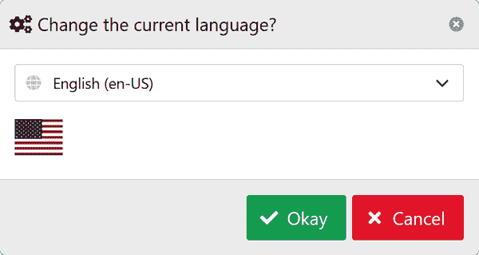
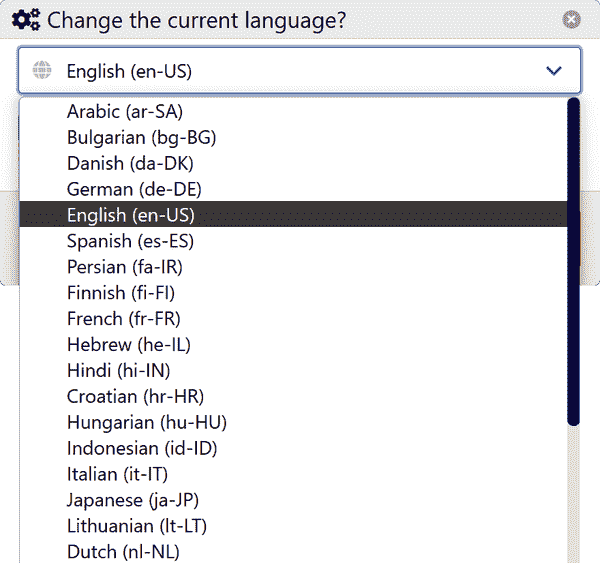
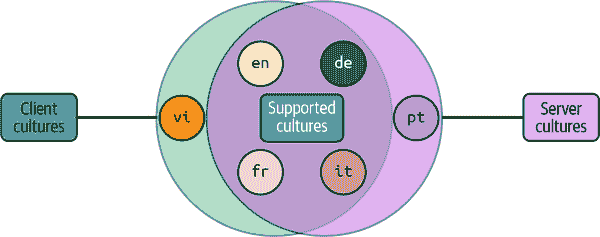
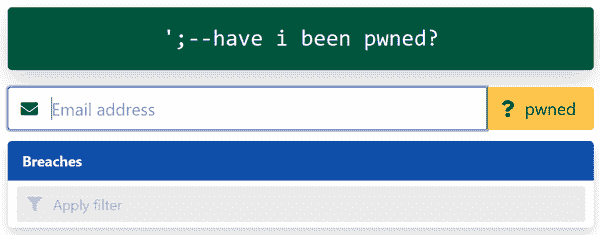
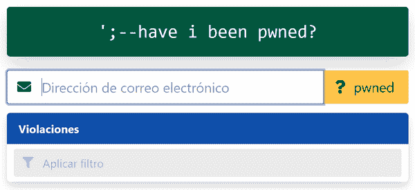
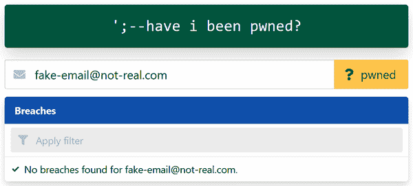
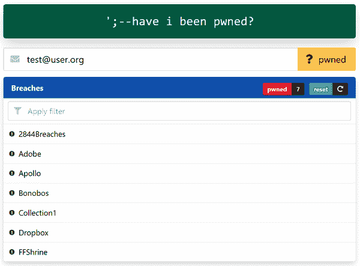
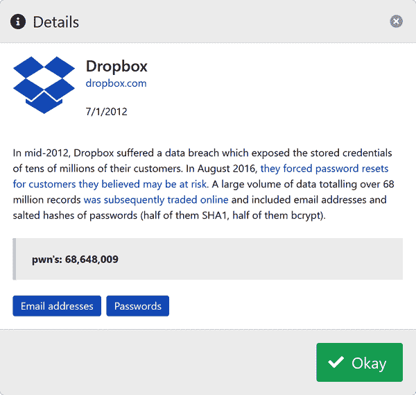
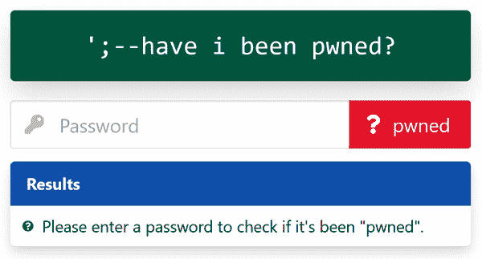
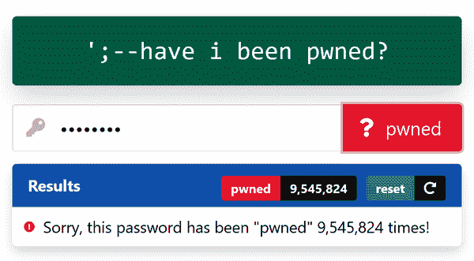

# 第五章：本地化应用程序

在本章中，我将向您展示如何本地化 Blazor WebAssembly 应用程序。以学习 Blazor 应用程序为例，我将展示应用程序如何自动本地化为数十种语言。您将了解到 Blazor WebAssembly 如何识别客户端浏览器对应的静态资源文件的语言。您还将学习如何使用框架提供的 `IStringLocalizer<T>` 接口类型。此外，我还将向您展示使用 [Azure Cognitive Services Translator](https://oreil.ly/4RTN0) 在静态文件上使用 GitHub Action 进行机器翻译的一种可能方法。

我们生活在一个全球化社会，一款只面向某一群体的应用程序会让人失望。这不仅会极大地影响不会讲该应用程序语言的用户的用户体验，而且如果该应用程序参与在线购物体验，也会对销售产生不利影响。这就是本地化的用武之地。

# 什么是本地化？

*本地化* 是将静态资源（例如资源文件中的资源）翻译为应用程序计划支持的特定语言的行为。当您的应用程序支持多种语言时，它将为每个支持的区域设置有各种资源文件。在 .NET 中，本地化使用 XML 格式维护特定区域的资源文件，并使用 *.resx* 文件扩展名。

###### 注意

本地化并不等同于全球化。全球化是指您在编写应用程序时使其易于本地化。有关全球化的概述，请参阅微软的 [“全球化” .NET 文档](https://oreil.ly/cRRVw)。

学习 Blazor 应用程序支持大约 40 种语言。借助 AI 的帮助，支持这些语言是可能的。作为一名讲英语的开发者，我用英语编写我的资源文件。这意味着资源文件名以 *.en.resx* 结尾，其他支持的区域设置则是通过自动化的拉取请求进行机器翻译。您将在本章后面学习如何在您的应用程序中使用这一功能。

作为 .NET 的一部分，Blazor WebAssembly 可以动态确定从哪个翻译版本的文件中提取资源。浏览器将确定其使用的语言，并且此信息在 Web.Client 应用程序中是可用的。使用适当的资源文件，应用程序将根据各种数字和日期格式规则呈现正确的内容。支持应用程序的多种语言即是 *本地化*。有关在 .NET 中的本地化的更多信息，请参阅微软的 [“.NET 中的本地化” 文档](https://oreil.ly/Nm2vS)。

###### 警告

仅使用机器翻译文本进行应用本地化并不理想。相反，开发人员应聘请专业翻译人员来帮助维护机器翻译后的文件。这种方法可以提供更可靠的翻译。虽然不是免费的，但你得到了你付出的代价。机器翻译并不总是准确的，但它们力求自然，并能满足有限文本的简单用户需求。

本地化主要通过应用程序的资源文件完成。资源（*.resx*）文件将其语言编码为子扩展名`.{lang-id}.resx`，其中`{lang-id}`占位符是浏览器指定的语言。该应用程序通过`LanguageSelectionComponent`暴露语言配置，后者使用`ModalComponent`提示用户从应用程序支持的语言列表中进行选择。这些语言可通过`"api/cultures/all"`端点访问应用程序。

# 本地化过程

让我们准备将我们的 Learning Blazor 示例应用本地化。要本地化任何 Blazor WebAssembly 应用程序，您需要以下内容：

+   一个客户端对`Microsoft.Extensions.Localization` NuGet 包的引用

+   在注册服务进行 DI 时调用`AddLocalization()`的能力

+   根据用户偏好和应用程序启动时更新文化的能力，如在“在启动时检测客户端文化”中所示

+   Web.Client 项目可用的资源文件

+   将`IStringLocalizer<T>`实例注入到使用本地化的组件中

+   通过它们的索引器方法 API 调用本地化实例的机会

Blazor 依赖于`CultureInfo.DefaultThreadCurrentCulture`和`CultureInfo.DefaultThreadCurrentUICulture`值来确定使用哪个资源文件。

让我们花点时间了解这个过程是如何组合在一起的。Blazor 应用程序需要注册本地化服务。当 Web.Client 项目启动时，所有它依赖的服务都注册为可以通过框架提供的 DI 服务提供程序发现。每个客户端应用实例都使用内部 HTTP 客户端和业务逻辑服务，其中一个特别来自[`Microsoft.Extensions.Localization` NuGet 包](https://oreil.ly/4olfW)。该包含了使用本地化所需的服务。回想一下“Web.Client ConfigureServices 功能”中的设置`IServiceCollection`时，我们调用了`AddLocalization()`。该方法来自本地化 NuGet 包，将`IStringLocalizer<T>`服务类型添加到客户端应用程序的 DI 容器中。

使用`IStringLocalizer<T>`类型，组件可以使用翻译文件中的资源。每个 Blazor 组件可能对应多个资源文件。`IStringLocalizer<T>`的一个实例对应于单个`T`类型，其中`T`可以是任何可能有资源的类型。

您可以使用包含这些常见值资源的共享对象（`SharedResource`）。当您使用`IStringLocalizer<T>`和`IStringLocal⁠izer​<SharedResource>`时，反复注入这两种类型会变得冗余。为了解决这种冗余，存在一个自定义的`CoalescingStringLocalizer<T>`服务，用于合并这些多个本地化类型，偏向于`T`类型，并在找不到值时合并到`SharedResource`类型。常见文本示例包括 UI 上以命令为中心的按钮的文本，如“确定”或“取消”。这种方法可以在其他 Blazor 应用程序中使用，或者任何本地化的 .NET 应用程序中使用。请考虑以下*C​​oalescingStringLocalizer.cs* C# 文件：

```cs
namespace Learning.Blazor.Localization;

public sealed class CoalescingStringLocalizer<T> 
{
    private readonly IStringLocalizer<T> _localizer = null!;
    private readonly IStringLocalizer<SharedResource> _sharedLocalizer = null!;

    public CoalescingStringLocalizer( 
        IStringLocalizer<T> localizer,
        IStringLocalizer<SharedResource> sharedLocalizer) =>
        (_localizer, _sharedLocalizer) = (localizer, sharedLocalizer);

    /// <summary>
    /// Gets the localized content for the current sub-component,
    /// relying on the contextually appropriate
    /// <see cref="IStringLocalizer{T}"/> implementation.
    /// </summary>
    internal LocalizedString this[string name] 
        => _localizer[name]
        ?? _sharedLocalizer[name]
        ?? new(name, name, false);

    /// <summary>
    /// Gets the localized content for the current sub-component,
    /// relying on the contextually appropriate
    /// <see cref="IStringLocalizer{T}"/> implementation.
    /// </summary>
    internal LocalizedString this[string name, params object[] arguments] 
        => _localizer[name, arguments]
        ?? _sharedLocalizer[name, arguments]
        ?? new(name, name, false);
}
```


`CoalescingStringLocalizer<T>`对象依赖于两个字段：

+   `_localizer`：`T` 类型的本地化程序，其中`T`是一个组件

+   `_sharedLocalizer`：`SharedResource` 类型的本地化程序


构造函数需要两个本地化实例，并分配给类范围的字段。


两个索引器中的第一个接受资源的`name`，并在两个本地化实例上合并。当找不到时，返回给定的`name`。


第二个索引器接受资源的`name`和`arguments`。当找不到资源时，它也会聚合两个本地化实例，并返回给定的`name`。

`CoalescingStringLocalizer<T>` 在我们的 Learning Blazor 应用程序的 Web.Client 项目中广泛使用，并注入到`LocalizableComponentBase<T>`中。从`LocalizableComponentBase<T>`类型继承的组件将可以访问`Localizer`属性。`LocalizableComponentBase<T>`是框架提供的`ComponentBase`类的后代。`LanguageSelectionComponent<T>`为绑定到`Localizer`提供了一个很好的示例，该组件负责暴露客户端语言配置。在接下来的部分中，我们将探讨此组件如何绑定本地化内容并允许用户选择应用程序的语言。

# 语言选择组件

尽管允许用户选择应用程序的语言不是*本地化过程*的具体部分，但提供这一功能非常重要。在本地化应用程序时，应考虑包含这样的功能。

语言选择组件在用户选择顶级语言导航按钮时提示用户选择他们所需的语言。其标记引入了一个新的框架提供的组件用于处理错误，即 `ErrorBoundary` 组件。每当编写不处理错误的代码时，例如没有包装在 `try`/`catch` 块中的潜在错误代码，该代码有可能会对组件的正确渲染能力产生负面影响。因此，作为写入 `try`/`catch` 的替代方案，可以通过显示特定于错误的标记处理错误。 `ErrorBoundary` 组件允许消费者模板化成功逻辑的 `ChildContent` 和在抛出错误时的 `ErrorContent`。即使组件遇到错误也能有条件地渲染内容。例如，如果服务应用程序支持的语言的端点不可用，`ErrorBoundary` 组件可以渲染一个禁用的按钮。

假设没有错误存在，模态对话框充当用户提示。当显示 `LanguageSelectionComponent` 时，点击其 `button` 将显示类似于 图 5-1 的模态对话框。



###### 图 5-1\. 使用模态展示的 `LanguageSelectionComponent` 示例渲染

现在，让我们来看一下 *LanguageSelectionComponent.razor* 标记文件，负责渲染模态对话框：

```cs
@inherits LocalizableComponentBase<LanguageSelectionComponent>

<ErrorBoundary> 
    <ChildContent>
    <span class="navbar-item">
        <button class="button level-item is-rounded is-warning"
            title=@Localizer["Language"] @onclick=ShowAsync>
            <span class="icon">
                <i class="fas fa-language"></i>
            </span>
        </button>
    </span>
    </ChildContent>
    <ErrorContent>
    <span class="navbar-item">
        <button class="button level-item is-rounded is-warning"
            disabled title=@Localizer["Language"]>
            <span class="icon">
                <i class="fas fa-language"></i>
            </span>
        </button>
    </span>
    </ErrorContent>
</ErrorBoundary>

<ModalComponent @ref="_modal"> 
    <TitleContent>
        <span class="icon pr-2">
            <i class="fas fa-cogs"></i>
        </span>
        <span>@Localizer["ChangeLanguage"]</span>
    </TitleContent>

    <BodyContent> 
        <form>
            <div class="field">
                <p class="control has-icons-left">
                    <span class="select is-medium is-fullwidth">
                        <select id="languages" class="has-dotnet-scrollbar"
                            @bind=_selectedCulture> @if (_supportedCultures?.Any() ?? false)
                    {
                        @foreach (var kvp
                            in _supportedCultures.OrderBy(c => c.Key.Name))
                        {
                            var (culture, _) = kvp; <option selected="@(lcid == culture.LCID)"
                                    value="@culture"> @(ToDisplayName(kvp)) </option> }
                    } </select>
                    </span>
                    <span class="icon is-small is-left">
                        <i class="fas fa-globe"></i>
                    </span>
                </p>
            </div>
        </form>
    </BodyContent>

    <ButtonContent> 
        <div class="buttons are-large">
            <button class="button is-success"
                @onclick="ConfirmAsync">
                <span class="icon">
                    <i class="fas fa-check"></i>
                </span>
                <span>@Localizer["Okay"]</span>
            </button>
            <button class="button is-danger"
                @onclick=@(() => _modal.CancelAsync())> <span class="icon">
                    <i class="fas fa-times"></i>
                </span>
                <span>@Localizer["Cancel"]</span>
            </button>
        </div>
    </ButtonContent>
</ModalComponent>
```


`ErrorBoundary` 组件用于包装潜在的错误组件。


`ModalComponent` 用于渲染模态对话框。


主体是 HTML `form` 元素。


`ButtonContent` 渲染了取消和确认按钮。

`LanguageSelectionComponent` 标记文件以 `ErrorBoundary` 组件开头。其 `ChildContent` 渲染一个 `button`，将其 `onclick` 事件处理程序绑定到 `ShowAsync` 方法。 `ErrorContent` 渲染一个禁用的 `button`。两个渲染片段使用相同的语法调用 `LocalizableComponentBase.Localizer` 实例。 `@Localizer["Language"]` 调用请求本地化器为 `"Language"` 键获取相应的值。这返回一个由框架提供的 `LocalizedString` 类型，表示特定于区域设置的 `string`。 `LocalizedString` 类型定义了一个隐式操作符作为 `string`。

本地化服务了解到对于 `IStringLocalizer<LanguageSelectionComponent>`，它们应该按命名约定查找资源。例如，*LanguageSelectionComponent.razor* 和 *LanguageSelectionCompo⁠nent​.razor.cs* 文件是相关的，因为它们是同一个对象的两个 `partial class` 定义。这个组件的资源文件也有相同的关系。我为此定义了一个单独的 *LanguageSelectionComponent.razor.en.resx* 资源文件，稍后会在 Example 5-1 中显示。

使用 `@ref="_modal"` 语法将 `ModalComponent` 捕获为引用并分配给 `_modal` 字段。`BodyContent` 包含一个本地 HTML `form` 元素，并绑定到本地 HTML `selection` 元素。每个 `option` 节点从当前迭代中的 `culture` 绑定到 `value` 属性。当当前文化的语言代码标识符（或 `LCID`）与正在迭代的文化匹配时，它被 `selected`。使用 `ToDisplayName` 辅助方法将 `culture` 和 `azureCulture` 对象转换为它们的文本表示。

`ButtonContent` 定义了两个按钮。第一个按钮是 `"Okay"` 按钮，点击时调用 `ConfirmAsync`。另一个按钮是 `"Cancel"` 按钮，点击时调用 `_modal.CancelAsync()`。

当用户展开所有支持的文化时，对话框将呈现类似于 Figure 5-2 中显示的内容。



###### 图 5-2\. 一个示例 `LanguageSelectionComponent` 渲染，带有打开的模态对话框和展开的文化选择。

###### 提示

在编写本书时，关于 ASP.NET Core 在组件使用文件作用域命名空间时定位资源的能力存在 [一个 bug](https://oreil.ly/Gwu5T)。因此，不显示任何文本或用户输入的组件不需要本地化。因此，它们可以自由使用文件作用域命名空间。您将在代码中看到这两种命名空间格式，不必惊慌。

对应的组件部分代码反映在 *LanguageSelection​Com⁠ponent.razor.cs* 的 C# 文件中。让我们接下来看看它：

```cs
namespace Learning.Blazor.Components
{
    public partial class LanguageSelectionComponent
    {
        private IDictionary<CultureInfo, AzureCulture>? _supportedCultures; 
        private CultureInfo _selectedCulture = null!;
        private ModalComponent _modal = null!;
 [Inject] HttpClient Http { get; set; } = null!;
 [Inject] public NavigationManager Navigation { get; set; } = null!;

        protected override async Task OnInitializedAsync() 
        {
            var azureCultures =
                await Http.GetFromJsonAsync<AzureTranslationCultures>(
                    "api/cultures/all",
                    DefaultJsonSerialization.Options);

            _supportedCultures =
                Culture.MapClientSupportedCultures(azureCultures?.Translation);
        }

        private static string ToDisplayName( 
            KeyValuePair<CultureInfo, AzureCulture> culturePair)
        {
            var (culture, azureCulture) = culturePair;
            return $"{azureCulture.Name} ({culture.Name})";
        }

        private async Task ShowAsync() => await _modal.ShowAsync(); 

        private async Task ConfirmAsync()
        {
            var forceRefresh =
                _selectedCulture is not null &&
                _selectedCulture != Culture.CurrentCulture;

            if (forceRefresh)
            {
                JavaScript.SetItem(
                    StorageKeys.ClientCulture, _selectedCulture!.Name);
            }

            await _modal.ConfirmAsync();

            if (forceRefresh)
            {
                Navigation.NavigateTo(Navigation.Uri, forceLoad: true);
            }
        }
    }
}
```


组件状态由私有字段管理。


`OnInitializedAsync` 方法用于从服务器获取支持的文化。


`ToDisplayName` 辅助方法用于将 `culture` 和 `azure​Cul⁠ture` 对象转换为它们的文本表示。


几种方法向组件公开了 `_modal` 功能。

`LanguageSelectionComponent` 定义了几个字段和几个注入的属性：

`_supportedCultures`

一个`IDictionary<CultureInfo, AzureCulture>`字段，表示支持的文化。字段的键是框架提供的`CultureInfo`，它们的值是自定义的`AzureCulture`位置记录类。

`_selectedCulture`

此值在 Razor 标记中绑定到`select`元素，并对应于用户选择的期望文化。

`_modal`

对`ModalComponent`的引用。通过此引用，我们将调用`ShowAsync`和`ConfirmAsync`来显示和确认模态框。

`Http`

由框架提供的`HttpClient`实例，用于获取支持的文化。

`Navigation`

由框架提供的`NavigationManager`，用于强制重新加载当前页面。在更改文化时，需要重新加载整个应用程序。

当组件初始化（`OnInitializedAsync`）时，调用`"api/cultures/all"`服务器端点。`_supportedCultures`映射从返回的值中分配，并计算交集的支持文化集。这些值反映了重叠客户端文化和服务器支持集的示例 Venn 图中的集合，在图 5-3 中显示，其中每个小圆表示一个两字母语言标识符。



###### 图 5-3。支持的文化是客户端和服务器文化的交集。

剩余的方法依赖于`_modal`实例：

`ShowAsync`

委托给`_modal.ShowAsync()`。

`ConfirmAsync`

如果用户选择了不同的文化，将强制重新加载，并将新值持久化到本地存储。模态框通过调用`_modal.Confirm​A⁠sync()`关闭。

`LanguageSelectionComponent`支持 41 种语言。从*LanguageSelectionComponent.razor*文件中显示的早期标记中，您可能已经注意到`@Localizer`使用给定的参数调用其索引器：

`"Language"`

绑定在`<button title=@Localizer["Language"]></button>`标记中

`"ChangeLanguage"`

绑定到`TitleContent`标记

`"Okay"`

绑定到`ButtonContent`确认按钮文本

`"Cancel"`

绑定到`ButtonContent`取消按钮文本

每个键（或名称）对应于`Lan⁠guage​Selec⁠tionComponent`的资源文件。考虑*LanguageSelectionComponent.razor.en.resx*资源文件，显示在示例 5-1 中。

##### 示例 5-1。`LanguageSelectionComponent`的资源文件

```cs
<?xml version="1.0" encoding="utf-8"?>
<root>
    <!-- XML schema omitted for brevity -->

    <data name="ChangeLanguage" xml:space="preserve">
        <value>Change the current language?</value>
    </data>
    <data name="Language" xml:space="preserve">
        <value>Language</value>
    </data>
</root>
```

每个`data`节点具有一个`name`属性。此`name`与您在请求`IStringLocalizer<T>`相应值时使用的名称相匹配。返回的`value`对应于资源的英文版本。考虑*LanguageSelection​Component.razor.es.resx*资源文件，显示在示例 5-2 中。

##### 示例 5-2。Web.Client/Components/LanguageSelectionComponent.razor.es.resx

```cs
<?xml version="1.0" encoding="utf-8"?>
<root>
    <!-- XML schema omitted for brevity -->

    <data name="ChangeLanguage" xml:space="preserve">
        <value>¿Cambiar el idioma actual?</value>
    </data>
    <data name="Language" xml:space="preserve">
        <value>Idioma</value>
    </data>
</root>
```

此资源文件的子扩展名为 *.es.resx* 而不是 *.en.resx*，每个 `value` 都是西班牙语。这些资源文件仅包含两个 `data` 节点。在标记中引用了两个额外的名称，这就是 `CoalescingString​Lo⁠calizer<T>` 的用武之地。`"Okay"` 和 `"Cancel"` 资源属于 `SharedResource` 对象资源文件的一部分。这种聚合方法确实会带来轻微的性能影响，但说它是*轻微的*是一种夸大。在我所有的测试中，这已被证明是不可测量的。

###### 警告

此代码完全功能齐全且易读。虽然花时间尝试优化它可能看起来有利，但你应该牢记教授唐纳德·克努斯的著名警句。他警告开发者，“过早优化是所有邪恶之源”[¹]。

# 使用 GitHub Actions 自动化翻译

如果适合你的应用程序，你可能希望支持尽可能多的语言。这可以通过为应用程序支持的每种语言创建静态资源文件来手动完成，或者你可以考虑更自动化的方法。你如何管理创建和维护多个资源文件？如果你要手动完成这项工作，当单个翻译文件发生变化时，你必须手动更新每个相应的支持语言翻译文件。许多更大的应用程序将有团队负责翻译任务，监控翻译文件的变化，并创建拉取请求来进行适当的更改，这可能成本高昂。作为一种替代方案，你可以自动化这一过程。

你可以创建自己的 GitHub Action 来自动化翻译，或者你可以使用 GitHub Action 市场上提供的现有 GitHub Action 来完成同样的工作。如果这对你来说是新的，我建议使用一个现有的 GitHub Action，比如我为这本书制作的一个叫做[Machine Translator](https://oreil.ly/fFmmQ)的 GitHub Action。它依赖于[Azure 的认知服务文本翻译器服务](https://oreil.ly/KjO9d)，并且是用 TypeScript 编写的。Learning Blazor 仓库中的 Machine Translator 工作流需要我的 Azure 加密订阅密钥，以便它可以访问基于云的神经机器翻译技术。这允许将静态的 *.resx* 资源文件作为输入进行源到文本的翻译，并为非英语语言写出翻译文本。在 GitHub 仓库中，作为管理员你可以访问*设置 > 秘密* 页面，在那里你将添加若干仓库密钥，这些密钥将在操作运行时被使用。

如果你正在跟随学习 Blazor 应用程序库的克隆版本，请查看微软的[“快速入门：Azure 认知服务翻译器”文档](https://oreil.ly/82O5w)。通过 Azure Translator 订阅密钥，你可以运行操作并在 GitHub Action 的输出中查看结果。你需要设置 `AZURE_TRANSLATOR_SUBSCRIPTION_KEY`、`AZURE_TRANSLATOR_ENDPOINT` 和 `AZURE_TRANSLATOR_REGION` 三个密钥。

要自动化翻译 Learning Blazor 应用程序，我们从以下 [*machine-translation.yml* 工作流文件](https://oreil.ly/Otzm9) 开始：

```cs
name: Azure Translation 

on:
  push:
    branches: [ main ]
    paths:
    - '**.en.resx'
    - '**.razor.en.resx'

env:
  GITHUB_TOKEN: ${{ secrets.GITHUB_TOKEN }}

jobs:
  translate:
    runs-on: ubuntu-latest

    steps:
      - uses: actions/checkout@v2

      - name: Resource translator 
        id: translator
        uses: IEvangelist/resource-translator@main
        with:
          subscriptionKey: ${{ secrets.AZURE_TRANSLATOR_SUBSCRIPTION_KEY }}
          endpoint: ${{ secrets.AZURE_TRANSLATOR_ENDPOINT }}
          region: ${{ secrets.AZURE_TRANSLATOR_REGION }}
          sourceLocale: 'en'
          toLocales: |
          '["af","ar","az","bg","ca","cs","da","de","el","fa",' +
          '"fi","fr","he","hi","hr","hu","id","it","ja","ko",' +
          '"la","lt","mk","nb","nl","pl","pt","ro","ru","sv",' +
          '"sk","sl","es","sr-Cyrl","sr-Latn","th","tr","uk",' +
          '"vi","zh-Hans","zh-Hant"]'

      - name: Create pull request 
        uses: peter-evans/create-pull-request@v3.4.1
        if: ${{ steps.translator.outputs.has-new-translations }} == 'true'
        with:
          title: '${{ steps.translator.outputs.summary-title }}'
          body: '${{ steps.translator.outputs.summary-details }}'
```


*machine-translation.yml* 工作流的名称为 `Azure Translation`。


此工作流中的主要步骤是运行 `IEvangelist/resource-translator@main` GitHub Action。


仅当 `translator` 步骤输出更改时才运行 `create-pull-request` 步骤。

GitHub Action 工作流文件将 `name` 描述为 `"Azure Translation"`，稍后在 GitHub Action 实时状态屏幕中使用。`on` 语法用于描述操作将在何时运行；此操作在任何 *.en.resx* 文件更新并 `pushed` 到 `main` 分支时运行。托管环境将 `secrets` 上下文对象的 GitHub 令牌值映射为 `GITHUB_TOKEN`。工作流在 `jobs` 节点中定义了一个单一作业，其中命名为 `translate` 操作 `runs-on: ubuntu-latest`（Ubuntu 的最新支持版本）。与大多数其他 GitHub Action 工作流文件一样，它需要使用 `action/checkout@v2` 动作检出存储库的源代码。

`steps` 节点的第二步描述了我的 [`IEvangelist/resource-translator@main` GitHub Action](https://oreil.ly/0m9jO)。此引用被标识为 `translator`，稍后允许工作流通过表达式按名称（或 `id`）引用它。`with` 语法允许此步骤提供所需的 GitHub Action 输入。`with` 节点中列出的键直接映射到 GitHub Action 发布为输入的名称：

`subscriptionKey`

从名为 `AZURE_TRANSLATOR_SUBSCRIPTION_KEY` 的存储库 `secrets` 上下文中使用表达式语法的字符串值。此值应来自 Azure Translator 资源的 Keys and Endpoint 页面，KEY 1 或 KEY 2 都是有效的。

`endpoint`

从名为 `AZURE_TRANSLATOR_ENDPOINT` 的存储库 `secrets` 上下文中使用表达式语法的字符串值。此值应来自 Azure Translator 资源的 Keys and Endpoint 页面，KEY 1 或 KEY 2 都是有效的。

`region`

从名为 `AZURE_TRANSLA⁠TOR​_REGION` 的存储库 `secrets` 上下文中使用表达式语法的字符串值。

`sourceLocale`

一个等于 `'en'` 字符串的文字值。

`toLocales`

一个字符串数组，使用文字语法指定要翻译为的本地化值。

现在，我们需要一个条件运行的操作。我们可以使用 GitHub Action Marketplace 中提供的另一个操作。GitHub 用户和社区成员 Peter Evans 提供了一个 `create-pull-request` 操作，我们可以使用它。当资源文件发生更改时，`Create pull request` 步骤将仅运行。这发生在 `translator` 步骤产生的输出指示创建了新的翻译时。这些拉取请求是自动化的，并显示为来自 `github-actions` 机器人的请求。拉取请求的描述（`title`）和 `body` 是根据上一步骤的输出动态确定的。如果你想看看 GitHub Action 机器人生成的实际拉取请求是什么样子，请查看 [automated pull request #13](https://oreil.ly/8bp3v)，它在 Learning Blazor 示例应用的 GitHub 仓库中。

现在我们已经介绍了资源文件的使用及其生成的翻译文件，接下来我们将探索各种本地化格式的示例。

# 本地化实战

到目前为止，我们已经详细检查了 XML 资源文件，并看到了使用框架提供的 `IStringLocalizer<T>` 抽象访问这些文件中数据的机制。在本节中，您将了解 Learning Blazor 示例应用中的“Have I Been Pwned”（HIBP）服务的工作原理及其内容如何受到本地化的影响。您还将了解 `LocalizableComponentBase<T>​.Local⁠izer` 属性的作用。例如，此功能很好地配合了本地化和非本地化内容，如您所见。随着我们的深入，您将更多了解应用如何使用 HIBP 服务。该站点具有一个 *Pwned?!* 的顶级导航，点击此链接将用户导航到 `https://webassemblyof.net/pwned` 路由，如 Figure 5-4 所示。


###### 图 5-4\. 使用 Breaches 和 Passwords 子路由呈现 Pwned 页面

`/pwned` 路由呈现一个页面，其中有两个按钮，每个按钮链接到其相应的子路由。*Breaches* 按钮链接到 `/pwned/breaches`，*Passwords* 按钮链接到 `/pwned/passwords`。

*Pwned.razor* 页面的标记如下：

```cs
@page "/pwned"
@attribute [Authorize]
@inherits LocalizableComponentBase<Pwned>

<PageTitle>  Pwned </PageTitle>

<div class="tile is-ancestor">
    <div class="tile is-vertical is-centered is-7">
        <div class="tile">
            <div class="tile is-parent is-clickable"
                @onclick=@NavigateToBreaches>
                <article class="tile is-child notification is-warning">
                    <p class="title"><span class="is-emoji">&#x1F92C;</span> @Localizer["Breaches"] 
                    </p>
                </article>
            </div>
            <div class="tile is-parent is-clickable"
                @onclick=@NavigateToPasswords>
                <article class="tile is-child notification is-danger">
                    <p class="title"><span class="is-emoji">&#128273;</span> @Localizer["Passwords"] 
                    </p>
                </article>
            </div>
        </div>
    </div>
</div>
```


页面使用框架提供的 `PageTitle` 组件。这将浏览器标签标题设置为 `Pwned`。


按钮文本使用 `Localizer` 实例和 `"Breaches"` 资源进行本地化。


按钮文本使用 `Localizer` 实例和 `"Passwords"` 资源进行本地化。

这是你第一次在本书中看到 `@attribute` 指令。此指令允许您向页面添加任何有效的类作用域属性。在这种情况下，`Authorize` 属性被添加到页面中。此属性由框架用于确定用户是否已登录。如果用户未登录，则会被重定向到登录页面。接下来，让我们看看组件的阴影。考虑 *Pwned.razor.cs* C# 文件：

```cs
namespace Learning.Blazor.Pages
{
    public partial class Pwned
    {
 [Inject]
        public NavigationManager Navigation { get; set; } = null!; 

        private void NavigateToBreaches() => 
            Navigation.NavigateTo("pwned/breaches");

        private void NavigateToPasswords() =>
            Navigation.NavigateTo("pwned/passwords");
    }
}
```


`Pwned` 页面依赖注入的 `NavigationManager` 实例，使用其导航功能。


页面有两种导航方法，分别在调用时导航到 `Breaches` 和 `Passwords` 子路由。

`Pwned` 页面有以下英文 *Pwned.razor.en.resx* 资源文件：

```cs
<?xml version="1.0" encoding="utf-8"?>
<root>
  <!--
    Schema omitted for brevity...
  -->

  <data name="Breaches" xml:space="preserve"> 
    <value>Breaches</value>
  </data>
  <data name="Passwords" xml:space="preserve"> 
    <value>Passwords</value>
  </data>
</root>
```


第一个 `data` 节点命名为 `"Breaches"`，并有一个名为 `Breaches` 的子 `value` 节点。


最后一个 `data` 节点命名为 `"Passwords"`，并有一个名为 `Passwords` 的子 `value` 节点。

你可能想知道为什么我们不只使用 `name` 属性。因为在本地化时，`name` 不会被翻译，只有 `value`。这基于资源文件 XML 的架构，适用于所有 .NET 应用程序。

`Breaches` 页面允许用户自由输入任何电子邮件地址，并检查其是否曾经泄露过数据。页面显示如 图 5-5 所示。



###### 图 5-5\. `Breaches` 页面渲染

当应用程序的语言设置为(`es-ES`)时，页面显示如 图 5-6 所示。



###### 图 5-6\. `Breaches` 页面的西班牙语渲染

在输入电子邮件地址之前，屏幕上显示了几个文本值，如 图 5-5 所示：

`';--have i been pwned?`

此值未被翻译，并且在标记中硬编码，因为它是一个名称，不应该被翻译。

`pwned`

同样，此值也不会被翻译，因为它是一个在互联网上广为人知的术语，无需翻译。

`Email address`

此值已被翻译，并在 `Localizer` 中命名为 `"EmailAddress"`。

`Breaches`

此值已被翻译，并在 `Localizer` 中命名为 `"Breaches"`。

`Apply filter`

此值已被翻译，并在 `Localizer` 中命名为 `"ApplyFilter"`。

不显示整个标记文件，我将专注于与本地化相关的标记的特定部分。考虑来自 *Breaches.razor* 标记文件的以下片段，重点是电子邮件地址输入字段：

```cs
<InputText @bind-Value=_model.EmailAddress
    @ref=_emailInput class="input is-large"
    autocomplete="hidden"
    placeholder=@Localizer["EmailAddress"] />
```

这是用于电子邮件地址输入的标记。框架提供的`InputText`用于呈现电子邮件地址的文本输入。它的`placeholder`显示了用户的提示，表达了给定 HTML `input`元素的期望值。在这种情况下，渲染了本地化字符串`"电子邮件地址"`。

想象一下，用户开始搜索数据泄露。当电子邮件地址未在任何数据泄露记录中找到（例如*fake-email@not-real.com*），结果将使用带有参数重载的`IStringLocalizer<T>`索引器进行格式化。考虑来自*Breaches.razor*标记文件的以下片段：

```cs
<a class="panel-block is-size-5" disabled>
    <span class="panel-icon">
        <i class="fas fa-check" aria-hidden="true"></i>
    </span>
    @Localizer["NoBreachesFormat", _model.EmailAddress!]
</a>
```

在这种情况下，`Localizer`实例调用其索引器，并传递`"NoBreachesFormat"`资源名称和模型的`EmailAddress`。这将呈现如图 5-7 所示。

缺乏数据泄露确实是一种解脱；但这并非完全现实。您的电子邮件地址很可能已经在数据泄露中受到影响。例如，当用户搜索`test@user.org`时，`Breaches`页面会查询 Web.Api 服务的`/api/pwned/breaches`端点。返回结果后，组件更新以显示数据泄露列表。要验证`Breaches`页面是否能成功与 Web.PwnedApi 项目的端点进行通信，我们可以使用已知已被泄露七次的测试用户电子邮件地址。如果您访问学习 Blazor 示例应用程序的`Breaches`页面并[输入`test@user.org`电子邮件地址](https://oreil.ly/MimnM)，您将看到它确实已经被*pwned*了七次，如图 5-8 所示。`Breaches`页面使用自定义共享的`ModalComponent`，在单击结果行时显示每次泄露的详细信息。



###### 图 5-7\. 在没有结果时呈现的`Breaches`页面



###### 图 5-8\. 对于 test@user.org 的`Breaches`页面呈现

假设您对了解更多关于 Dropbox 数据泄露感兴趣。您可以单击泄露以获取更多信息。此操作显示模态框，并将所选的数据泄露记录作为组件参数传递，如图 5-9 所示。



###### 图 5-9\. Dropbox 数据泄露模态框

为了帮助进一步理解本地化的工作原理，我们将查看*Breaches.razor.en.resx* XML 的翻译资源文件：

```cs
<?xml version="1.0" encoding="utf-8"?>
<root>
  <!--
 Schema omitted for brevity...
 -->
  <data name="Breaches" xml:space="preserve">
    <value>Breaches</value>
  </data>
  <data name="EmailAddress" xml:space="preserve">
    <value>Email address</value>
  </data>
  <data name="Filter" xml:space="preserve">
    <value>Apply filter</value>
  </data>
  <data name="InvalidEmailAddress" xml:space="preserve">
    <value>This email is invalid</value>
  </data>
  <data name="NoBreachesFormat" xml:space="preserve">
    <value>No breaches found for {0}.</value>
  </data>
</root>
```

在此资源文件中，有几对英文值的名称-值对。其他语言将有其翻译值。大多数组件都继承自自定义的`LocalizableComponentBase`或框架提供的`IStringLocalizer`。然后，每个组件定义资源文件，并在运行时使用本地化实例检索资源。

接下来，让我们看看`Passwords`页面及其*Passwords.razor*标记的几个片段：

```cs
<div class="field has-addons">
    <p class="is-fullwidth control has-icons-left @(loadingClass)">
        <InputText id="password" @ref=_passwordInput
            type="password" autocomplete="hidden"
            @bind-Value=_model.PlainTextPassword
            class="input is-large"
            DisplayName=@Localizer["Password"] 
            placeholder=@Localizer["Password"] />
        <span class="icon is-small is-left">
            <i class="fas fa-key"></i>
        </span>
    </p>
    <div class="control">
        <button type="submit" disabled="@(_isFormInvalid)"
                class="button is-danger is-large @(loadingClass)">
            <span class="icon">
                <i class="fas fa-question"></i>
            </span>
            <span>pwned</span>
        </button>
    </div>
</div>
```


密码 `InputText` 组件的 `placeholder` 和 `DisplayName` 属性来自本地化的 `"Password"` 资源。

当用户首次进入此页面时，结果为空，但标题文本和消息提示均为本地化资源。如 Figure 5-10 所示渲染。



###### 图 5-10\. `Passwords` 页面

现在我们将看到 *Passwords.razor* 标记的以下部分，负责渲染结果内容：

```cs
<article class="panel is-info">
    <p class="panel-heading has-text-left">
        <span> @Localizer["Results"] 
        </span>
        <span class="is-pulled-right"> @if (_pwnedPassword?.IsPwned ?? false)  { <span class="field is-grouped is-grouped-multiline">
                    <span class="control">
                        <span class="tags are-medium has-addons">
                            <span class="tag is-danger">pwned</span>
                            <span class="tag is-dark"> @(_pwnedPassword.PwnedCount.ToString(  "N0", Culture.CurrentCulture)) </span>
                        </span>
                    </span>
                    <span class="control">
                        <span class="tags is-clickable
                            are-medium has-addons" @onclick=Reset>
                            <span class="tag is-primary">reset</span>
                            <span class="tag is-dark">
                                <i class="fas fa-redo-alt"
                                    aria-hidden="true">
                                </i>
                            </span>
                        </span>
                    </span>
                </span> } </span>
    </p>

    <!-- The remaining markup is discussed later -->
</article>
```


本地化器获取与 `"Results"` 名称匹配的资源值，并将其绘制到 `article` 元素标题中。


使用控制结构时，当组件的 `_pwnedPassword` 对象不为 `null` 且具有 `IsPwned` 值为 `true` 时，添加了两个信息位。


给定密码已被泄露的次数将使用标准的 C# 数字格式化和当前区域设置进行格式化为字符串。

想象一下用户在输入字段中输入 `"password"` 并搜索以查看其是否曾经被泄露。很容易想象这个密码已经被使用了很多次，你并没有错。参见 Figure 5-11 以查看 `"password"` 被泄露多少次的渲染示例。哎呀！



###### 图 5-11\. 具有泄露密码的 `Passwords` 页面

在 `Passwords` 页面内还有几个额外的控制结构。考虑剩余的 *Passwords.razor* 标记：

```cs
@if (_pwnedPassword?.IsPwned ?? false)
{ <a class="panel-block is-size-5">
        <span class="panel-icon">
            <i class="fas has-text-danger
                fa-exclamation-circle" aria-hidden="true">
            </i>
        </span> @Localizer["OhNoFormat", _pwnedPassword.PwnedCount] 
    </a> }
else if (_state is ComponentState.Loaded)
{ <a class="panel-block is-size-5" disabled>
        <span class="panel-icon">
            <i class="fas has-text-success
                fa-check" aria-hidden="true"></i>
        </span> @Localizer["NotPwned"] 
    </a> }
else
{ <a class="panel-block is-size-5" disabled>
        <span class="panel-icon">
            <i class="fas fa-question-circle"
                aria-hidden="true"></i>
        </span> @Localizer["EnterPassword"] 
    </a> }
```


如果密码已经被泄露，将使用 `OhNoFormat` 资源来格式化本地化消息。


显示消息指示密码未被泄露。


否则，显示本地化提示消息。

根据 `_pwnedPassword` 对象是否为 `null` 以及其具有 `IsPwned` 值为 `true` 的情况，进行条件渲染。这将显示带有格式化资源的感叹号图标，匹配 `"OhNoFormat"` 名称，并给出密码被泄露的次数。这依赖于接受 `params object[] arguments` 的 `Localizer` 索引器重载。当 `_state` 对象设置为加载状态，但 `_pwnedPassword` 对象为 `null` 或具有非泄露结果时，将渲染 `"NotPwned"` 资源。当页面首次渲染时，既不设置 `_pwnedPassword` 对象也不设置 `_state` 对象；在这种情况下，将渲染 `"EnterPassword"` 资源。提示用户输入密码。

在下面的 XML 资源中注意，每个 `data` 节点都有一个 `name` 属性和一个单独的 `value` 子节点。考虑 *Passwords.razor.en.resx* 文件：

```cs
<?xml version="1.0" encoding="utf-8"?>
<root>
  <!--
 Schema omitted for brevity...
 -->
  <data name="EnterPassword" xml:space="preserve">
    <value>Please enter a password to check if it's been "pwned".</value>
  </data>
  <data name="NotPwned" xml:space="preserve">
    <value>Great news, this password has not been "pwned"!</value>
  </data>
  <data name="OhNoFormat" xml:space="preserve">
    <value>Sorry, this password has been "pwned" {0:N0} times!</value>
  </data>
  <data name="Password" xml:space="preserve">
    <value>Password</value>
  </data>
  <data name="Passwords" xml:space="preserve">
    <value>Passwords</value>
  </data>
  <data name="Results" xml:space="preserve">
    <value>Results</value>
  </data>
</root>
```

# 摘要

在本章中，我向你展示了如何本地化 Blazor WebAssembly 应用程序。你学到了在 .NET 应用程序中什么是*本地化*，以及*本地化*应用程序的含义。我向你展示了如何使用依赖于 Azure Cognitive Services 的 GitHub Action 将应用程序本地化到数十种语言。我解释了 Blazor WebAssembly 如何使用熟悉的资源管理器识别资源文件。我还介绍了如何使用`IStringLocalizer<T>`接口消耗资源。

在接下来的章节中，你将学习如何在 Blazor WebAssembly 中使用 ASP.NET Core SignalR。你将学习一种模式，可以在整个应用中使用实时 web 功能，包括自定义通知系统、消息页面和实时推特流页面。

¹ Donald Knuth，“带有 go to 语句的结构化编程”，*ACM Computing Surveys* 6, no. 4（1974 年 12 月）：261–301，[*https://doi.org/10.1145/356635.356640*](https://doi.org/10.1145/356635.356640)。
