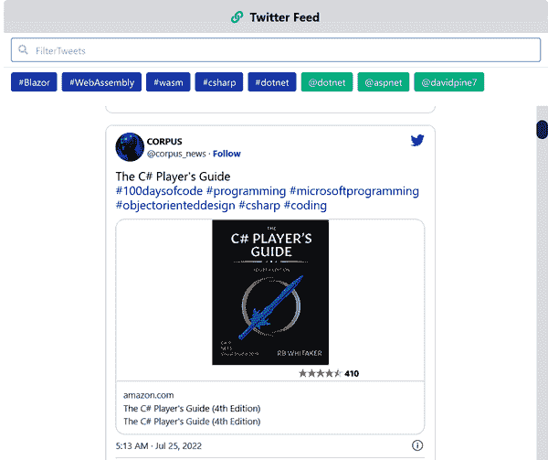
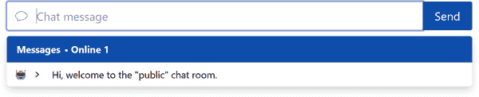
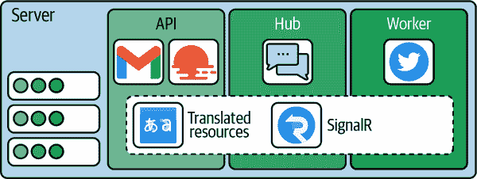
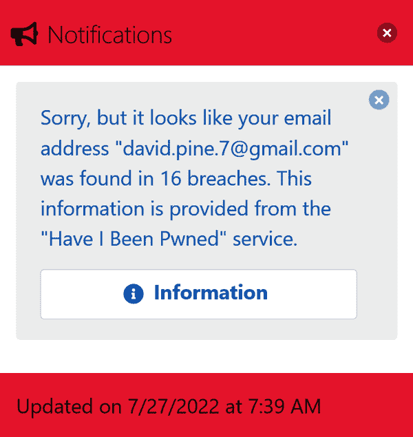
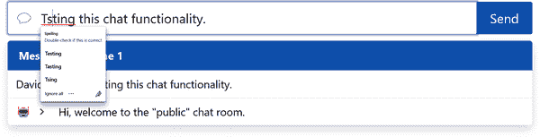
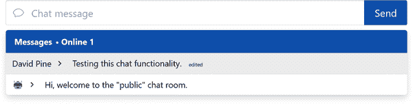
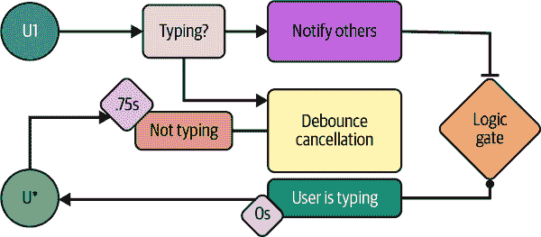
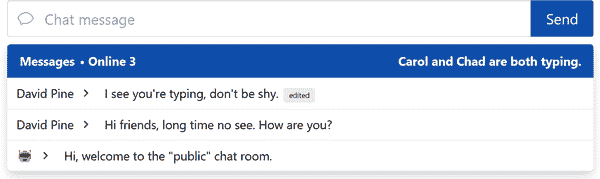

# 第六章：实时 Web 功能的示例

没有网络用户希望不断刷新以获取最新信息。他们希望立即自动获取所有内容。实时 Web 功能非常普遍，大多数现代应用程序都需要。许多应用程序依赖实时数据，以便在其变为可用时向用户提供相关信息。在本章中，您将学习如何使用 ASP.NET Core SignalR（或仅 SignalR）实现实时 Web 功能。然后，您将了解如何创建一个服务器端（`Hub`），该服务器端将公开许多实时数据点，例如实时警报和通知，用于实时用户交互的消息系统，以及可加入的活动 Twitter 流。最后，您将学习如何从我们的 Blazor WebAssembly 应用程序中消耗这些数据，并以引人注目的方式响应和与这些实时数据点交互。

# 定义服务器端事件

要使您的 Blazor 应用程序具有实时 Web 功能，您需要一种方式让其接收实时数据。这就是 SignalR 的用武之地。实时浏览器到服务器的协议，例如 WebSockets 或服务器端事件，可能很难实现。SignalR 通过简洁的 API 提供了这些协议的抽象层，并减少了复杂性。为了处理单个服务器上的多个客户端，SignalR 引入了 hub 作为客户端和服务器之间的代理。在 hub 中，您可以定义可以直接从客户端调用的方法。同样，服务器可以在任何连接的客户端上调用方法。有了 hub，您可以定义从客户端到服务器或服务器到客户端的方法——这是双向（双工）通信。还有一个名为[Azure SignalR Service](https://oreil.ly/C8Vae)的云就绪实现。此服务消除了管理处理可扩展性和客户端连接性的后端处理的需要。

这样做的目的是允许您的应用程序具有实时警报，用于实时用户交互的消息系统和可加入的活动 Twitter 流。SignalR 使所有这些成为可能。

一个机器调用另一个机器的概念称为*远程过程调用*（RPC）。所有发送到服务器的通信都需要认证令牌。没有有效的认证令牌，连接将无法建立或维持。有了有效的令牌，Web.Client 应用程序与其依赖的 HTTP 端点之间的通信将建立一个开放的线路，可以实时发送和接收消息，而不论任何一个过程跨越网络边界。最佳情况是，这两个过程协商并同意使用 WebSockets 作为通信传输方式。

## 公开 Twitter 流和聊天功能

以下示例突出显示了推文的实时流和一个有在场感知的聊天实现，如图 6-1 和 6-2 所示。



###### 图 6-1。`Tweets`页面渲染



###### 图 6-2\. `Chat` 页面渲染

Learning Blazor 模型应用程序使用单个管理所有实时功能的通知中心。 在模型应用程序中，Web.Api 项目包含 SignalR 中心定义。 它定义了一个名为 `NotificationHub` 的单个类，但总共有三个文件。 每个文件代表 `NotificationHub` 对象的 `partial` 实现。 领域特定的段在其文件中封装，例如 *NotificationHub.Chat.cs* 和 *NotificationHub.Tweets.cs*。 让我们首先检查 *NotificationHub.cs* C# 文件：

```cs
namespace Learning.Blazor.Api.Hubs;
 [Authorize, RequiredScope(new[] { "User.ApiAccess" })] 
public partial class NotificationHub : Hub
{
    private readonly ITwitterService _twitterService;
    private readonly IStringLocalizer<Shared> _localizer;

    private string _userName => Context.User?.Identity?.Name ?? "Unknown";
    private string[]? _userEmail => Context.User?.GetEmailAddresses();

    public NotificationHub(
        ITwitterService twitterService,
        IStringLocalizer<Shared> localizer) =>
        (_twitterService, _localizer) = (twitterService, localizer);

    public override Task OnConnectedAsync() => 
        Clients.All.SendAsync(
            HubServerEventNames.UserLoggedIn,
            Notification<Actor>.FromAlert(
                new(UserName: _userName,
                    Emails: _userEmail)));

    public override Task OnDisconnectedAsync(Exception? ex) => 
        Clients.All.SendAsync(
            HubServerEventNames.UserLoggedOut,
            Notification<Actor>.FromAlert(
                new(UserName: _userName)));
}
```


`NotificationHub` 受应用程序的 Azure AD B2C 租户保护。


`override Task OnConnectedAsync` 方法被实现为将事件 `HubServerEventNames.UserLoggedIn` 发送给所有连接的客户端的表达式。


`override Task OnDisconnectedAsync` 方法预期出现错误。

必须从配置的第三方身份验证提供程序之一提供有效的身份验证令牌，并且请求的声明必须是 `"User.ApiAccess"` 范围的一部分。 `NotificationHub` 是框架提供的 `Hub` 类的后代。 这是 SignalR 服务器的要求：它们必须公开一个中心端点。 该文件的主要功能是构造函数（`.ctor`）定义和处理连接和断开连接事件的覆盖。 其他中心局部是特定于领域的。 该类定义了几个字段：

`ITwitterService _twitterService`

此服务依赖于 [`TweetInvi` NuGet package](https://oreil.ly/wcZVs)。 它管理流式传输的 Twitter API，并处理特定标签和句柄的流。

`IStringLocalizer<Shared> _localizer`

`Shared` 类包含本地化的 `NotificationHub` 资源。 某些通用消息已翻译为警报和通知系统。

`string _userName`

中心上下文中只有一个用户。 该用户是来自认证连接的反序列化令牌的表示—换句话说，当前与中心交互的用户。

`string[]? _userEmail`

该中心的用户还具有一个或多个电子邮件地址。

事件是一个`Notification<Actor>`。泛型通知对象是一个`record class`，包含用户名和电子邮件地址数组。这些事件有些通用，因此可以由客户端上的不同利益相关者共享。模型应用程序还需要一些附加功能，以提供丰富的聊天室体验。在本章中，您将学习一种干净的方法来实现“用户正在输入”指示器，创建和共享自定义房间，编辑发送的消息等等。通过使用类似的代码，这些相同的功能可以在您的 Blazor 应用程序中重复使用。让我们探索*C#文件* `NotificationHub.Chat.cs` ，因为它展示了聊天功能的中心的实现：

```cs
namespace Learning.Blazor.Api.Hubs;

public partial class NotificationHub
{
    public Task ToggleUserTyping(bool isTyping) => 
        Clients.Others.SendAsync(
            HubServerEventNames.UserTyping,
            Notification<ActorAction>.FromAlert(
                new(UserName: _userName ?? "Unknown",
                    IsTyping: isTyping)));

    public Task PostOrUpdateMessage( 
        string room, string message, Guid? id = default!) =>
        Clients.Groups(room).SendAsync(
            HubServerEventNames.MessageReceived,
            Notification<ActorMessage>.FromChat(
                new(Id: id ?? Guid.NewGuid(),
                   Text: message,
                   UserName: _userName ?? "Unknown",
                   IsEdit: id.HasValue)));

    public async Task JoinChat(string room) 
    {
        await Groups.AddToGroupAsync(Context.ConnectionId, room);

        await Clients.Caller.SendAsync(
            HubServerEventNames.MessageReceived,
            Notification<ActorMessage>.FromChat(
                new(Id: Guid.NewGuid(),
                    Text: _localizer["WelcomeToChatRoom", room],
                    UserName: UTF8.GetString(
                        new byte[] { 240, 159, 145, 139 }),
                    IsGreeting: true)));
    }

    public async Task LeaveChat(string room) 
    {
        await Groups.RemoveFromGroupAsync(Context.ConnectionId, room);

        await Clients.Groups(room).SendAsync(
            HubServerEventNames.MessageReceived,
            Notification<ActorMessage>.FromChat(
                new(Id: Guid.NewGuid(),
                    Text: _localizer["HasLeftTheChatRoom", _userName ?? "?"],
                    UserName: UTF8.GetString(
                        new byte[] { 240, 159, 164, 150 }))));
    }
}
```


`ToggleUserTyping`方法改变客户端聊天用户的状态。


`PostOrUpdateMessage`方法将消息发布到聊天室中。


`JoinChat`方法将客户端添加到聊天室中。


`LeaveChat`方法将客户端从聊天室中移除。

`ToggleUserTyping`方法接受一个`bool`值，指示上下文用户是否正在聊天室中积极输入。这会触发`HubServerEventNames.UserTyping`事件，向外发送一个表示用户及其输入状态的`Notification<ActorAction>`对象作为消息。

`PostOrUpdateMessage`方法定义了`room`和`message` `string`参数，以及一个可选的`id`。如果`id`为`null`，则将全局唯一标识符（GUID）分配给消息。消息包含消息文本、发送消息的用户以及消息是否被视为已编辑。这用于创建和更新用户聊天消息。

`JoinChat`方法需要一个`room`。调用时，当前连接将被添加到具有匹配房间名称的新建或现有 SignalR 组中。然后，该方法会告知当前调用者`HubServerEventNames.MessageReceived`事件已触发，向聊天室发送欢迎消息。此事件会发送一个`Notification<ActorMessage>`。所有客户端都可以访问此自定义泛型通知模型；它是 Web.Models 项目的一部分。这非常完美，因为客户端可以共享这些模型，并且序列化工作正常。这与您典型的 JavaScript 开发大不相同，后者需要努力维护 API 对象的不断变化的形状。

`LeaveChat` 方法是`JoinChat`功能的伴侣。这是有意的——一旦从客户端加入房间，您需要一种退出`room`的方式。这在`LeaveChat`方法中发生，其中从聊天发送`HubServerEventNames.MessageReceived`。当前上下文用户连接到 SignalR 中心实例中移除他们从聊天室。该特定组将使用机器人用户名和本地化消息发送自动化消息。

聊天功能正在形成。现在想象一下，你的应用程序需要访问实时 Twitter 动态。模型应用程序提供了如何实现这一点的示例。需要特定于 Twitter 的功能，通过实时通信来传达，考虑*C#文件*中的*NotificationHub.Tweets.cs*实现：

```cs
public partial class NotificationHub
{
    public async Task JoinTweets() 
    {
        await Groups.AddToGroupAsync(
            Context.ConnectionId,
            HubGroupNames.Tweets);

        if (_twitterService.CurrentStatus is StreamingStatus status)
        {
            await Clients.Caller.SendAsync(
                HubServerEventNames.StatusUpdated,
                Notification<StreamingStatus>.FromStatus(status));
        }

        if (_twitterService.LastFiftyTweets is { Count: > 0 })
        {
            await Clients.Caller.SendAsync(
                HubServerEventNames.InitialTweetsLoaded,
                Notification<List<TweetContents>>.FromTweets(
                    _twitterService.LastFiftyTweets.ToList()));
        }
    }

    public Task LeaveTweets() => 
        Groups.RemoveFromGroupAsync(
            Context.ConnectionId,
            HubGroupNames.Tweets);

    public Task StartTweetStream() => 
        _twitterService.StartTweetStreamAsync();
}
```


`JoinTweets` 方法将客户端添加到 `Tweets` 组中。


`LeaveTweets` 方法从 `Tweets` 组中移除客户端。


`StartTweetStream` 方法启动推文流。

Tweets hub 中的 RPC 汇集了加入推文流的能力。当这发生时，当前连接加入`HubGroupNames.Tweets`组。局部作用域的`_twitterService`被问及一些问题，例如当前流状态是什么，内存中是否有推文：

+   当当前 Twitter 流状态不为`null`并且具有值时，它被分配给`status`变量。这个`status`流向所有连接的客户端，因为他们被通知当前 Twitter`StreamingStatus`。

+   当内存中有推文时，所有连接的客户端都会被通知推文，作为`List<TweetContents>`集合。

`LeaveTweets` 方法从 `HubGroupNames.Tweets` 组中移除上下文连接。`StartTweetStream` 是幂等的，可以多次调用而不改变状态，第一次成功调用开始推文流。这是一个异步操作的表示。

你可能开始想知道实时推文来自哪里了。下一步我们将在后台服务中查看。

## 编写上下文 RPC 和进程内通信

我们模型应用程序的 Web.Api 项目负责暴露 HTTP API 表面，因此它的范围包括处理请求和提供响应。我们将探讨如何使用`IHubContext`，它允许我们的后台服务与`NotificationHub`实现通信。此外，模型应用程序显示了一个由所有`partial NotificationHub class`实现共同表示的 SignalR`/notifications`端点。关于此应用程序的实时流方面，我们依赖于 Twitter 服务，但我们需要一种监听事件的方法。在 ASP.NET Core 应用程序中，您可以使用`Background​Ser⁠vice`，它在同一进程中运行，但在请求和响应管道之外。SignalR 提供了一种通过`IHub​Context`接口访问`NotificationHub`的机制。所有这些都如图 6-3 所示。



###### 图 6-3。Web.Api 服务器项目

接下来让我们看看*C#*文件*TwitterWorkerService.cs*：

```cs
namespace Learning.Blazor.Api.Services;

public sealed class TwitterWorkerService : BackgroundService 
{
    private readonly ITwitterService _twitterService;
    private readonly IHubContext<NotificationHub> _hubContext;

    public TwitterWorkerService( 
        ITwitterService twitterService,
        IHubContext<NotificationHub> hubContext)
    {
        (_twitterService, _hubContext) = (twitterService, hubContext);

        _twitterService.StatusUpdated += OnStatusUpdated;
        _twitterService.TweetReceived += OnTweetReceived;
    }

    protected override async Task ExecuteAsync( 
        CancellationToken stoppingToken)
    {
        while (!stoppingToken.IsCancellationRequested)
        {
            await Task.Delay(TimeSpan.FromMinutes(1), stoppingToken);
        }
    }

    private Task OnStatusUpdated(StreamingStatus status) => 
        _hubContext.Clients
            .Group(HubGroupNames.Tweets)
            .SendAsync(
                HubServerEventNames.StatusUpdated,
                Notification<StreamingStatus>.FromStatus(status));

    private Task OnTweetReceived(TweetContents tweet) => 
        _hubContext.Clients
            .Group(HubGroupNames.Tweets)
            .SendAsync(
                HubServerEventNames.TweetReceived,
                Notification<TweetContents>.FromTweet(tweet));
}
```


`TwitterWorkerService`实现了`BackgroundService`。


构造函数接受`ITwitterService`和`IHubContext`作为参数。


`ExecuteAsync`方法是服务的主要入口点。


当`_twitterService`触发`StatusUpdated`事件时，将调用`OnStatusUpdated`方法。


`OnTweetReceived`处理`TweetReceived`事件，并通知`HubGroupNames.Tweets`组中的所有客户端。

`TwitterWorkerService`是`BackgroundService`的后代。后台服务是长期运行的应用程序，它们在循环中执行，但可以通过其连接的客户端访问通知中心，并且可以通过它们发送消息。此类定义了两个字段：

`_twitterService`为`ITwitterService`

这项服务用于`NotificationHub`中的内存流状态和推文，现在也可以处理来自底层`TweetInvi`过滤流的事件。

`_hubContext`为`IHubContext<NotificationHub>`

此对象用于向 SignalR 服务器中连接的客户端发送消息。

`TwitterWorkerService`构造函数将值声明为参数。依赖注入框架将提供服务和中心上下文对象。它们使用元组字面量的立即解构进行位置分配。`_twitterService`有其`StatusUpdated`和`TweetReceived`事件处理程序分配。Twitter 服务暴露了一个事件机制，并在接收到推文时触发事件。在 C#中，您可以订阅一个委托到事件，它将作为回调函数。不需要取消订阅事件，因为除非整个应用程序被关闭，否则应用程序不会停止。在这种情况下，我们没有持有任何未订阅的事件——整个过程正在终止。

`ExecuteAsync`方法被实现为应用程序可以执行其任务的信号。这只是在异步循环中延迟和监听停止令牌的取消请求。

当`_twitterService.OnStatusUpdated`事件触发时，向所有订阅者发送当前流状态的更新。`HubGroupNames.Tweets`组中的所有上下文客户端都会收到`HubServerEventNames.StatusUpdated`事件。通知是`StreamingStatus`。

处理`_twitterService.OnTweetReceived`事件时，当接收到新的`TweetContents`对象时。这些推文内容从`HubServerEventNames.TweetReceived`事件发送。它们也发送到名为`HubGroupNames.Tweets`的同一组中。

服务器功能已完成。通过此功能，我们可以通过协商的`/notifications`端点提供 SignalR 连接。每个客户端协商他们要使用的协议和传输方式。SignalR 传输是通信处理程序，例如 WebSockets、服务器发送事件和长轮询。客户端和服务器可以以各种方式进行通信。这通常遵循首选默认到次优的回退约定。好消息是，大多数现代浏览器环境支持高性能的 WebSockets。

## 配置 Hub 端点

使得中心功能作为可消费的路由公开，必须配置客户端如何与其通信。有几个需要配置的事项：

+   所需的消息和传输协议（可能需要额外的 NuGet 包）

+   将`NotificationHub`映射到`/notifications`端点

+   将`TwitterWorkerService`注册为托管服务（`BackgroundService`）

由于 Web.Api 项目目标为 `net6.0` TFM，并指定 `<Project Sdk="Microsoft.NET.Sdk.Web">`，SignalR 隐式引用为 SDK 的元包。有关 .NET 中 SDK 的概述，请参阅 Microsoft 的 [“.NET Project SDKs” 文档](https://oreil.ly/T4WRW)。默认的消息协议是 JSON（基于文本的协议），适合人类阅读和方便调试。但是，使用 MessagePack 更高效，它是一种二进制协议，消息通常大小减半。

*Web.Api.csproj* XML 文件包含以下内容，以及其他的包引用：

```cs
<Project Sdk="Microsoft.NET.Sdk.Web">

    <PropertyGroup>
        <RootNamespace>Learning.Blazor.Api</RootNamespace>
        <TargetFramework>net6.0</TargetFramework>
        <Nullable>enable</Nullable>
        <ImplicitUsings>true</ImplicitUsings>
        <DockerDefaultTargetOS>Linux</DockerDefaultTargetOS>
        <DockerfileContext>..\..</DockerfileContext>
    </PropertyGroup>

    <ItemGroup>
        <PackageReference Version="6.0.1"
            Include="Microsoft.AspNetCore.SignalR.Protocols.MessagePack" /> 
        <!-- Additional package references omitted for brevity -->
    </ItemGroup>
    <ItemGroup>
        <!--
            Project references omitted for brevity:
                Abstractions, Cosmos DB, Distributed Caching,
                Extensions, Http.Extensions, LogicAppServices, TwitterServices
        -->
    </ItemGroup>

    <!-- Omitted for brevity -->
</Project>
```


包含了 `Microsoft.AspNetCore.SignalR.Protocols.MessagePack` NuGet 包引用。

这暴露了 MessagePack 二进制协议。客户端也必须为该协议配置 MessagePack，否则将回退到默认的基于文本的 JSON 协议。

在 Web.Api 项目的 `Startup` 类中，我们添加了 SignalR，并将 `NotificationHub` 映射到 `"/notifications"` 终端。考虑 *Startup.cs* C# 文件：

```cs
namespace Learning.Blazor.Api;

public sealed partial class Startup
{
    readonly IConfiguration _configuration;

    public Startup(IConfiguration configuration) =>
        _configuration = configuration;
}
```

`Startup` 类是 `partial`，仅定义了 `_configuration` 字段和接受配置的构造函数。按照约定，启动对象有两种方法：

`ConfigureServices(IServiceCollection services)`

此方法负责在服务集合上注册服务（通常使用帮助器的 `Add{DomainService}` 扩展方法来实现）。

`Configure(IApplicationBuilder app, IWebHostEnvironment env)`

此方法负责配置服务的使用（通常使用帮助器的 `Use{DomainService}` 扩展方法来实现）。

首先，在 *Startup.ConfigureServices.cs* C# 文件中添加 SignalR：

```cs
namespace Learning.Blazor.Api;

public sealed partial class Startup
{
    public void ConfigureServices(IServiceCollection services) 
    {
        services.AddAuthentication(JwtBearerDefaults.AuthenticationScheme) 
            .AddMicrosoftIdentityWebApi(
                _configuration.GetSection("AzureAdB2C"));

        services.Configure<JwtBearerOptions>(
            JwtBearerDefaults.AuthenticationScheme,
            options =>
            options.TokenValidationParameters.NameClaimType = "name");

        services.AddApiServices(_configuration);

        var webClientOrigin = _configuration["WebClientOrigin"];
        services.AddCors(
            options => options.AddDefaultPolicy(
                builder => builder.WithOrigins(
                    "https://localhost:5001", webClientOrigin)
                    .AllowAnyMethod()
                    .AllowAnyHeader()
                    .AllowCredentials()));

        services.AddControllers();

        services.AddSignalR( 
            options => options.EnableDetailedErrors = true)
                .AddMessagePackProtocol();
    }
}
```


`IServiceCollection` 中添加了服务。


配置了 `JwtBearerOptions`。


配置了 `SignalR` 服务以显示详细错误，并添加了 `MessagePack`。

添加了身份验证中间件，这应该看起来有点熟悉了——它使用了前几章中展示的相同 Azure AD B2C 租户进行配置。它配置为使用 `"name"` 作为名称声明类型。由于我们的 Blazor WebAssembly 应用程序向不同的来源发出请求，我们的 API 需要允许 CORS。

添加了 SignalR，使用 `.AddSignalR` 扩展方法。在此调用链上链式地调用了 `AddMessagePackProtocol`，正如其名称所示，这将添加 MessagePack 作为期望的 SignalR 消息协议。

将这些服务添加到启动例程后，现在我们可以对它们进行配置。让我们看看 *Startup.Configure.cs* C# 文件：

```cs
namespace Learning.Blazor.Api;

public sealed partial class Startup
{
    public void Configure(IApplicationBuilder app, IWebHostEnvironment env) 
    {
        if (env.IsDevelopment())
        {
            app.UseDeveloperExceptionPage();
        }

        app.UseHttpsRedirection();
        app.UseRouting();

        var webClientOrigin = _configuration["WebClientOrigin"];
        app.UseCors(options =>
            options.WithOrigins(
                    "https://localhost:5001", webClientOrigin)
                .AllowAnyHeader()
                .AllowAnyMethod()
                .AllowCredentials());

        var localizationOptions = new RequestLocalizationOptions() 
            .SetDefaultCulture(Cultures.Default)
            .AddSupportedCultures(Cultures.Supported)
            .AddSupportedUICultures(Cultures.Supported);

        app.UseRequestLocalization(localizationOptions);
        app.UseAuthentication();
        app.UseAuthorization();
        app.UseResponseCaching();
        app.UseEndpoints(endpoints => 
        {
            endpoints.MapControllers();
            endpoints.MapHub<NotificationHub>("/notifications");
        });
    }
}
```


`Configure` 方法是 ASP.NET Core web 应用程序的一个约定。它配置了依赖注入的服务。


Web.Api 项目支持请求本地化，类似于 第五章 中详细介绍的本地化，使用翻译资源文件和 `IString​Local⁠izer<T>` 抽象。


`NotificationHub` 映射到其终端点。

`Configure` 功能从根据当前运行时环境配置为 `"Development"` 条件性地使用开发者异常页面开始。使用 HTTPs 重定向，强制 API 使用 `https://` 方案。使用路由功能启用终端点中间件服务。接下来，之前添加的模型应用程序的 CORS 现在正在使用。

在前一章中，我们探讨了本地化的概念。在 Web.Api 项目中，我们使用了相同方法的变体。虽然在本项目中所有资源文件都使用相同的机制，但是在 Web API 项目中，本地化的概念需要一个特定于请求的中间件，该中间件将根据 HTTP 请求自动设置适当的 `Culture`。配置过程指定了使用几个更多的中间件服务：

`UseAuthentication`

使用添加的 Azure AD B2C 租户

`UseAuthorization`

允许 API 使用 `Authorize` 属性进行装饰，要求经过身份验证的用户

`ResponseCaching`

允许 API 声明性地指定缓存行为

调用 `UseEndpoints` 对于 SignalR 是必需的，因为 `NotificationHub` 映射到 `"/notifications"` 终端点。有了这些设置，项目已准备好同时为多个连接的客户端提供服务。

在下一节中，我们将研究客户端应用程序如何接收这些数据。

# 在客户端消费实时数据

返回到 Web.Client 项目，本书的示范应用在多个组件和页面中使用实时数据。为了避免从单个客户端向服务器打开多个连接，使用了一种共享的方法来处理 hub 连接。每个客户端将具有一个 `SharedHubConnection` 实例。`SharedHubConnection` 类有几个实现，负责以线程安全的方式管理一个由框架提供的共享的 `HubConnection`。在使用 `HubConnection` 之前，我们必须首先配置客户端以支持此类型。`SharedHubConnection` 类共享一个 `HubConnection` 实例，并负责以线程安全的方式管理连接。

## 配置客户端

要在客户端配置 SignalR，我们的 Web.Client 项目必须包含两个 NuGet 包引用：

+   [`Microsoft.AspNetCore.SignalR.Client`](https://oreil.ly/P1bXb)

+   [`Microsoft.AspNetCore.SignalR.Protocols.MessagePack`](https://oreil.ly/oZLi1)

除了这些包之外，自定义的`SharedHubConnection`类被注册为客户端的服务提供程序中的单例，使其通过 DI 成为可解析的服务。这最初在“Web.Client ConfigureServices 功能”中讨论过。这个服务的生命周期内只会存在一个实例。这是一个重要的细节，因为它与所有消费组件和页面共享连接状态。接下来，我们将看一下`SharedHubConnection`的实现。

## 共享 Hub 连接

`SharedHubConnection`类被客户端应用程序中需要与 SignalR 服务器通信的任何组件或页面使用，无论组件是否需要向服务器推送数据，还是客户端订阅服务器事件或两者兼有。*SharedHubConnection.cs* C# 包含了共享单个框架提供的`HubConnection`的逻辑：

```cs
namespace Learning.Blazor;

public sealed partial class SharedHubConnection : IAsyncDisposable 
{
    private readonly IServiceProvider _serviceProvider = null!; 
    private readonly ILogger<SharedHubConnection> _logger = null!;
    private readonly CultureService _cultureService = null!;
    private readonly HubConnection _hubConnection = null!;
    private readonly SemaphoreSlim _lock = new(1, 1);
    private readonly HashSet<ComponentBase> _activeComponents = new();

    /// <summary>
    /// Indicates the state of the <see cref="HubConnection"/> to the server.
    /// </summary>
    public HubConnectionState State =>
        _hubConnection?.State ?? HubConnectionState.Disconnected;

    public SharedHubConnection( 
        IServiceProvider serviceProvider,
        IOptions<WebApiOptions> options,
        CultureService cultureService,
        ILogger<SharedHubConnection> logger)
    {
        (_serviceProvider, _cultureService, _logger) =
            (serviceProvider, cultureService, logger);

        var notificationHub =
            new Uri($"{options.Value.WebApiServerUrl}/notifications");

        _hubConnection = new HubConnectionBuilder()
            .WithUrl(notificationHub,
                 options =>
                 {
                     options.AccessTokenProvider = GetAccessTokenValueAsync;
                     options.Headers.Add(
                         "Accept-Language",
                         _cultureService.CurrentCulture
                             .TwoLetterISOLanguageName);
                 })
            .WithAutomaticReconnect()
            .AddMessagePackProtocol()
            .Build();

        _hubConnection.Closed += OnHubConnectionClosedAsync;
        _hubConnection.Reconnected += OnHubConnectionReconnectedAsync;
        _hubConnection.Reconnecting += OnHubConnectionReconnectingAsync;
    }

    Task OnHubConnectionClosedAsync(Exception? exception)
    {
        _logger.LogHubConnectionClosed(exception);
        return Task.CompletedTask;
    }

    Task OnHubConnectionReconnectedAsync(string? message)
    {
        _logger.LogHubConnectionReconnected(message);
        return Task.CompletedTask;
    }

    Task OnHubConnectionReconnectingAsync(Exception? exception)
    {
        _logger.LogHubConnectionReconnecting(exception);
        return Task.CompletedTask;
    }

    async ValueTask IAsyncDisposable.DisposeAsync() 
    {
        if (_hubConnection is not null)
        {
            _hubConnection.Closed -= OnHubConnectionClosedAsync;
            _hubConnection.Reconnected -= OnHubConnectionReconnectedAsync;
            _hubConnection.Reconnecting -= OnHubConnectionReconnectingAsync;

            await _hubConnection.StopAsync();
            await _hubConnection.DisposeAsync();
        }

        _lock?.Dispose();
    }
}
```


`SharedHubConnection`是一个`sealed partial class`。


`SharedHubConnection`定义了几个字段，用于帮助管理共享的 hub 连接。


`SharedHubConnection` 构造函数从定义的参数初始化支持字段。


`SharedHubConnection`显式实现了`IAsyncDisposable.Dispose​A⁠sync`方法。

首先，请注意`SharedHubConnection`是`IAsync​Dis⁠posable`接口的实现。这使得`SharedHubConnection`类能够异步清理需要释放的任何托管资源。

然后类定义了几个在构造过程中（或内联）初始化的字段。它们的描述如下：

`IServiceProvider _serviceProvider`

客户端应用程序的服务提供程序。

`ILogger<SharedHubConnection> _logger`

一个特定于`SharedHubConnection`的日志记录器实例。

`CultureService _cultureService`

用于为从 hub 连接发出的请求填充“Accept-Language”HTTP 头。

`HubConnection _hubConnection`

客户端连接到服务器 hub 的框架提供的表示。

`SemaphoreSlim _lock`

用于线程安全并发访问的异步锁定机制。这个锁在后面详细介绍的共享`StartAsync`方法命令中使用。

`_logger`字段可以访问几个自定义的日志记录扩展方法。这些扩展方法调用从框架提供的`LoggerMessage.Define`工厂方法创建的缓存委托。这是一种性能优化，避免每次记录日志消息时都创建一个新的委托。

连接状态由底层 `HubConnection.State` 计算属性 `State` 表示。当 `_hubConnection` 为 `null` 时，状态显示为 `Disconnected`。

其他状态包括以下内容：

`已连接`

客户端和服务器已连接。

`连接中`

正在建立连接。

`重新连接`

正在重新连接。

接下来，`SharedHubConnection` 构造函数从构造函数的参数中分配了几个字段。从客户端配置的选项对象中，使用 Web API 服务器 URL 以及 `"/notifications"` 路由来实例化通知中心的 `Uri`。使用生成器模式和相应的 `HubConnectionBuilder` 对象实例化 `_hubConnection` 字段。

使用生成器实例和 Hub 连接，通过 `WithUrl` 方法重载配置了其选项。将 `AccessTokenProvider` 分配给用于异步获取上下文访问令牌的委托。更新默认的请求 HTTP 标头，添加 `"Accept-Language"` 标头，并使用当前配置的 ISO 两字母语言名称作为值。这确保 SignalR 服务器连接知道返回适当的本地化内容给连接的客户端。生成器在调用 `Build` 之前配置了自动重连和 MessagePack 协议。

使用 `_hubConnection` 实例，订阅了 `Closed`、`Reconnected` 和 `Reconnecting` 事件。通过这些事件传达了各种连接状态。它们各自的事件处理程序都非常相似。应用程序有条件地记录它们的发生。

最后，`DisposeAsync`功能取消订阅 `_hubConnection` 的事件，然后级联处理连接和用于同步的锁定机制的释放。

### 共享中心连接认证

`SharedHubConnection` 的使用是 `partial` 的，还有其他几个实现要考虑。在构建 `_hubConnection` 实例时分配了 `GetAccessTokenValueAsync` 委托，该功能在 *SharedHubConnection.Tokens.cs* C# 文件中实现：

```cs
namespace Learning.Blazor;

public sealed partial class SharedHubConnection
{
    private async Task<string?> GetAccessTokenValueAsync()
    {
        using (var scope = _serviceProvider.CreateScope())
        {
            var tokenProvider =
                scope.ServiceProvider
                    .GetRequiredService<IAccessTokenProvider>();
            var result =
                await tokenProvider.RequestAccessToken();

            if (result.TryGetToken(out var accessToken))
            {
                return accessToken.Value;
            }

            _logger.LogUnableToGetAccessToken(
                result.Status, result.RedirectUrl);

            return null;
        }
    }
}
```

`SharedHubConnection` 类被注册为单例，但框架提供的 `IAccessTokenProvider` 是一个作用域服务。这就是为什么构造函数不能直接要求 `IAccessTokenProvider`；相反，它需要 `IServiceProvider`。使用 `_serviceProvider` 实例，调用 `CreateScope` 创建一个作用域，以便解析 `IAccessTokenProvider`。

###### 提示

通常情况下，您不需要直接使用 `IServiceProvider`。`SharedHubConnection` 类是一个单例，并且 `IAccessTokenProvider` 是一个作用域服务。当 `SharedHubConnection` 对象开始与服务器通信时，使用 `IServiceProvider` 解析 `IAccessTokenProvider`。

通过 `tokenProvider`，我们调用 `RequestAccessToken`。如果 `result` 有一个访问令牌，则返回它。如果 `GetAccessTokenValueAsync` 无法获取 `accessToken`，则记录并返回 `null`。访问令牌用于对接的 Blazor 客户端与服务器 Hub 进行身份验证。

### 共享的 Hub 连接初始化

由于此类的共享性质，启动功能需要以线程安全的方式实现。任何消费者都可以安全地调用 `StartAsync` 以从客户端启动到服务器的连接。这发生在 *SharedHubConnection​.Com⁠mands.cs* C# 文件中：

```cs
namespace Learning.Blazor;

public sealed partial class SharedHubConnection
{
    public async Task StartAsync(CancellationToken token = default) 
    {
        await _lock.WaitAsync(token);

        try
        {
            if (State is HubConnectionState.Disconnected)
            {
                await _hubConnection.StartAsync(token);
            }
            else
            {
                _logger.LogUnableToStartHubConnection(State);
            }
        }
        finally
        {
            _lock.Release();
        }
    }
}
```


`StartAsync` 方法定义了一个可选的取消 `token`。

当调用 `StartAsync` 时，`SemaphoreSlim _lock` 变量调用其 `WaitAsync` 方法，该方法在进入信号量时完成。这是一个重要的细节，因为它通过确保所有调用者顺序执行来缓解多个组件并发调用 `StartAsync` 的问题。换句话说，想象三个组件同时调用 `StartAsync`。这种异步锁定机制确保第一个进入并启动 `_hubConnection` 的组件是唯一调用 `_hubConnection.StartAsync` 的组件。其他两个组件将记录它们无法启动与服务器 Hub 的连接，因为它已经启动。

### 共享的 Hub 连接聊天

接下来，让我们看看 `SharedHubConnection` 如何实现聊天功能。您可以在 *SharedHubConnection.Chat.cs* C# 文件中看到其定义：

```cs
namespace Learning.Blazor;

public sealed partial class SharedHubConnection
{
    /// <inheritdoc cref="HubClientMethodNames.JoinChat" />
    public Task JoinChatAsync(string room) => 
        _hubConnection.InvokeAsync(
            methodName: HubClientMethodNames.JoinChat, room);

    /// <inheritdoc cref="HubClientMethodNames.LeaveChat" />
    public Task LeaveChatAsync(string room) =>
        _hubConnection.InvokeAsync(
            methodName: HubClientMethodNames.LeaveChat, room);

    /// <inheritdoc cref="HubClientMethodNames.PostOrUpdateMessage" />
    public Task PostOrUpdateMessageAsync(
        string room, string message, Guid? id = default) =>
        _hubConnection.InvokeAsync(
            methodName: HubClientMethodNames.PostOrUpdateMessage,
            room, message, id);

    /// <inheritdoc cref="HubClientMethodNames.ToggleUserTyping" />
    public Task ToggleUserTypingAsync(bool isTyping) =>
        _hubConnection.InvokeAsync(
            methodName: HubClientMethodNames.ToggleUserTyping, isTyping);

    /// <inheritdoc cref="HubServerEventNames.UserLoggedIn" />
    public IDisposable SubscribeToUserLoggedIn( 
        Func<Notification<Actor>, Task> onUserLoggedIn) =>
        _hubConnection.On(
            methodName: HubServerEventNames.UserLoggedIn,
            handler: onUserLoggedIn);

    /// <inheritdoc cref="HubServerEventNames.UserLoggedOut" />
    public IDisposable SubscribeToUserLoggedOut(
        Func<Notification<Actor>, Task> onUserLoggedOut) =>
        _hubConnection.On(
            methodName: HubServerEventNames.UserLoggedOut,
            handler: onUserLoggedOut);

    /// <inheritdoc cref="HubServerEventNames.UserTyping" />
    public IDisposable SubscribeToUserTyping(
        Func<Notification<ActorAction>, Task> onUserTyping) =>
        _hubConnection.On(
            methodName: HubServerEventNames.UserTyping,
            handler: onUserTyping);

    /// <inheritdoc cref="HubServerEventNames.MessageReceived" />
    public IDisposable SubscribeToMessageReceived(
        Func<Notification<ActorMessage>, Task> onMessageReceived) =>
        _hubConnection.On(
            methodName: HubServerEventNames.MessageReceived,
            handler: onMessageReceived);
}
```


`JoinChatAsync` 方法是一个示例，可从客户端调用，并在服务器上调用一个方法。


`SubscribeToUserLoggedIn` 方法是一个示例事件，从服务器触发，客户端可以通过订阅来监听它们。

聊天功能依赖于两个共享的辅助类：

`HubClientMethodNames`

定义了可以从连接的客户端上调用的方法名称

`HubServerEventNames`

定义了客户端可以订阅的来自 SignalR Hub 的事件名称（及其参数详情）

额外的功能是通过这些类来实现的。每个客户端方法都委托给 `_hubConnection.Invoke​A⁠sync` 方法的对应重载，传递适当的方法名称和参数。与此同时，每个服务器事件都订阅了一个分配的函数，作为其回调处理程序。这是通过适当的 `_hubConnection.On` 重载实现的。这些订阅被表示为返回的 `IDisposable`，调用者有责任通过调用 `Dispose` 在可能进行的任何订阅上取消订阅。消费组件将能够加入和离开聊天室，在这些聊天室中发布和更新消息，并共享他们当前是否正在输入。同样，这些组件将能够在另一个用户输入时接收通知，用户登录或退出时接收通知，以及收到消息时接收通知。

### 共享的 hub 连接推文

最后一个功能位于 `SharedHubConnection` 中实现，它在 *SharedHubConnection.Tweets.cs* 的 C# 文件中定义：

```cs
namespace Learning.Blazor;

public sealed partial class SharedHubConnection
{
    /// <inheritdoc cref="HubClientMethodNames.JoinTweets" />
    public Task JoinTweetsAsync() => 
        _hubConnection.InvokeAsync(
            methodName: HubClientMethodNames.JoinTweets);

    /// <inheritdoc cref="HubClientMethodNames.LeaveTweets" />
    public Task LeaveTweetsAsync() =>
        _hubConnection.InvokeAsync(
            methodName: HubClientMethodNames.LeaveTweets);

    /// <inheritdoc cref="HubClientMethodNames.StartTweetStream" />
    public Task StartTweetStreamAsync() =>
        _hubConnection.InvokeAsync(
            methodName: HubClientMethodNames.StartTweetStream);

    /// <inheritdoc cref="HubServerEventNames.StatusUpdated" />
    public IDisposable SubscribeToStatusUpdated( 
        Func<Notification<StreamingStatus>, Task> onStatusUpdated) =>
        _hubConnection.On(
            methodName: HubServerEventNames.StatusUpdated,
            handler: onStatusUpdated);

    /// <inheritdoc cref="HubServerEventNames.TweetReceived" />
    public IDisposable SubscribeToTweetReceived(
        Func<Notification<TweetContents>, Task> onTweetReceived) =>
        _hubConnection.On(
            methodName: HubServerEventNames.TweetReceived,
            handler: onTweetReceived);

    /// <inheritdoc cref="HubServerEventNames.InitialTweetsLoaded" />
    public IDisposable SubscribeToTweetsLoaded(
        Func<Notification<List<TweetContents>>, Task> onTweetsLoaded) =>
        _hubConnection.On(
            methodName: HubServerEventNames.InitialTweetsLoaded,
            handler: onTweetsLoaded);
}
```


*推特* 实现依赖于 `HubClientMethodNames` 来调用 hub 连接方法，给定它们的名称和参数。


类似地，`HubServerEventNames` 用于从服务器订阅命名事件，给定处理程序。

通过封装每个特定于领域的功能的逻辑，`SharedHubConnection` 的相应 `partial` 实现向消费者公开了更有意义的方法。虽然在该类内部使用了框架提供的 `HubConnection`，但它已经被抽象掉了。因此，通过使用 `SharedHubConnection`，消费者可以调用更明确命名和有意义的方法。

## 在组件中消费实时数据

唯一剩下要做的就是在消费组件中使用共享的 hub 连接。每个特定于领域的功能，无论是小组件还是页面，都将依赖于 `SharedHubConnection` 来提供必要的功能。

SignalR 实时数据支持我们模型应用程序的三个组件：`NotificationComponent`、`Tweets` 和 `Chat` 页面。通知系统能够接收以下事件的通知：

+   当用户登录或退出应用程序时

+   当你当前位置有重要的天气警报，如严重天气警告时

+   如果你的电子邮件地址曾经参与过数据泄露（这指的是应用程序的“Have I Been Pwned”功能），如图 6-4 所示。



###### 图 6-4\. 一个 pwned 通知

所有通知都可以取消，但只有一些可以操作。例如，一个通知会告诉您是否涉及到数据泄露，并提供一个链接。如果您决定访问链接，它将带您到应用程序中的 `/pwned` 子路由，展示您的电子邮件参与的所有数据泄露。

应用程序有一个专门用于实时推特内容的 `Tweets` 页面。我们将深入研究其中一个消费组件。有了这些知识，您可以自行审查其他内容。让我们来看看聊天功能。

`Chat` 组件定义了 `@page` 指令，这意味着它是一个 *页面*。可以通过 `/chat` 路由导航到它。考虑 *Chat.razor* 文件：

```cs
@page "/chat/{room?}"  @attribute [Authorize]
@inherits LocalizableComponentBase<Chat>

<PageTitle> @Localizer["Chat"] </PageTitle>

<AuthorizeView> @if (User is { Identity: { } } user)
    { <div class="is-hidden">@user.Identity.Name</div> } </AuthorizeView>

    <div class="columns">
        <section class="column is-10 is-offset-1">
            <div class="field has-addons">
                <div class="control is-fullwidth has-icons-left">
                    <input class="input is-large" spellcheck="true" 
                       type="text" placeholder=@Localizer["ChatMessage"]
                       @ref="_messageInput"
                       @bind-value="@_message"
                       @oninput="@InitiateDebounceUserIsTypingAsync"
                       @onkeyup="@OnKeyUpAsync"
                       autocomplete="off">
                    <span class="icon is-small is-left">
                        <i class="fas">&#x1F4AD;</i>
                    </span>
                </div>
                <div class="control">
                    <a class="button is-info is-large"
                        @onclick="@SendMessageAsync"> @Localizer["Send"] </a>
                </div>
            </div>

            <article class="panel is-info has-dotnet-scrollbar">
                <p class="panel-heading has-text-left">
                    <span> @Localizer["Messages"] </span>
                    <span class="is-pulled-right"> @if (TryGetUsersTypingText(out var text))  {
                        MarkupString isTypingMarkup = new(text); <span class="has-text-grey-light is-strobing"> @isTypingMarkup </span> } </span>
            </p> @foreach (var (id, message) in _messages.Reverse())  { <ChatMessageComponent Message=@message
                    IsEditable=@(OwnsMessage(message.UserName))
                    EditMessage=@OnEditMessageAsync /> } </article>
    </section>
</div>
```


`Chat` 页面的路由模板为 `"/chat/{room?}"`。


每个聊天室只有一个聊天室消息输入框和一个发送按钮。


当一个或多个用户正在输入时，我们会显示专门的消息，以向聊天室的参与者指示这一情况。


一组聊天室消息被迭代并传递给 `ChatMessageComponent`。

`Chat` 页面的路由模板允许使用可选的房间参数。该值隐式绑定到组件对应的 `Room` 属性。路由模板非常强大，我们具有很大的灵活性。这使得我们客户端应用程序的用户可以共享和书签房间，邀请朋友实时互动。有关路由约束的更多信息，请参见微软的 [“ASP.NET Core Blazor 路由和导航”文档](https://oreil.ly/397Vn)。

聊天室功能允许用户编辑他们发送的消息；这是一个很好的功能。它允许聊天用户纠正拼写错误或根据需要更新表达的内容。然而，消息不会被永久保存，这是有意为之的；每个交互都是实时的，如果您离开，消息也会消失。这强调了 *要么专注当下，要么别浪费时间* 的思维方式。从发送有拼写错误的消息到纠正并发送的过程是一个交互式的体验。要查看这一过程，请参见图 6-5、6-6 和 6-7。


###### 图 6-5\. 聊天室消息拼写错误



###### 图 6-6\. 聊天室消息编辑



###### 图 6-7\. 聊天室消息编辑

程序上来说，不持久化消息会使应用稍微简化。主要关注点在于用户通过创建或更新他们的聊天消息来与`Chat`房间互动。用户在`<input type="text">`中输入他们的消息，并使用`<a class="button">` HTML 元素发送消息。`input`具有其本地的`spellcheck`属性设置为`true`。这使得元素能够为用户提供帮助，确保他们消息的拼写准确性。用户可以使用 Enter 键发送消息。发送按钮是明确的用户请求，而不是按 Enter 键的更被动或隐式的性质，但它们在功能上是等效的。

作为实时功能的一部分，当同一聊天室中的用户正在输入消息时，他们的客户端应用程序正在消除他们的输入。

当用户首次开始输入时，会触发一个通知，使用 SignalR 让感兴趣的聊天室参与者知道用户正在输入。每当他们键入一个非终止键后，经过大约 750 毫秒的特定时间，应用程序发送一个取消。用户体验是，您不仅可以看到聊天室中有人正在输入，还可以看到他们的名字。这在图 6-8 中描述。



###### 图 6-8。抑制状态机图表

`Chat`页面维护了一个名为`.NET `Dictionary<Guid, ActorMessage>`的集合`_messages`。这个集合通过来自服务器`NotificationHub`的 SignalR 事件接收到`Notification<T> where T : notnull`和`T`表示`Payload`属性的类型。当通信为`NotificationType.Chat`时，`T`类型为`ActorMessage`。演员消息用于表示来自用户及其意图的消息。这些消息可以以多种方式反映消息，无论用户是否正在编辑消息，或者消息是否是一般的问候语。这些消息具有唯一标识且不可变。消息具有所有权的感觉，因为消息关联有用户名。考虑*C#*文件*Actors.cs*：

```cs
namespace Learning.Blazor.Models;

public record class ActorMessage(
    Guid Id,
    string Text,
    string UserName,
    bool IsGreeting = false,
    bool IsEdit = false) : Actor(UserName);

public record class ActorAction(
    string UserName, bool IsTyping) : Actor(UserName);

public record class Actor(
    string UserName,
    string[]? Emails = null);
```

该文件包含三个`record class`定义：一个基本的`Actor`和两个后代，`ActorAction`和`ActorMessage`。在`_messages`集合中的每条消息按逆序迭代。这显示了消息按它们发布的时间的升序显示，这在所有聊天应用中都很常见。`ActorAction`类将用户的输入状态设置为`true`或`false`。这些`message`对象被传递给自定义的`<ChatMessageComponent>`。这个组件在*ChatMessageComponent.razor*文件中定义。让我们先看看那个：

```cs
<a id="@Message.Id" 
    class="panel-block is-size-5 @_dynamicCss"
	@onclick=@StartEditAsync>
    <span> @Message.UserName </span>
    <span class="panel-icon px-4">
        <i class="fas fa-chevron-right" aria-hidden="true"></i>
    </span>
    <span class="pl-2"> @{  MarkupString messageMarkup = new(Message.Text); <span> @messageMarkup </span> @if (Message.IsEdit)
        { <span class="pl-2">
                <span class="tag is-success-dark">edited</span>
            </span> }
    } </span>
</a> @code {
    private string _dynamicCss  {
        get
        {
            return string.Join(" ", GetStyles()).Trim();

            IEnumerable<string> GetStyles()
            {
                if (!IsEditable)
                    yield return "is-unselectable";

                if (Message.IsGreeting)
                    yield return "greeting";
            };
        }
    }

    [Parameter, EditorRequired]
    public bool IsEditable { get; set; }

    [Parameter, EditorRequired]
    public ActorMessage Message { get; set; } = null!;

    [Parameter, EditorRequired]
    public EventCallback<ActorMessage> EditMessage { get; set; }

    private async Task StartEditAsync()  {
        if (IsEditable && EditMessage.HasDelegate)
        {
            await EditMessage.InvokeAsync(Message);
        }
    }
}
```


每条消息表示为`<a id="@Message.Id">...</a>`锚元素。


框架提供的 `MarkupString` 用于将 C# `string` 渲染为 HTML。


组件动态应用 `_dynamicCss` 计算属性中的样式。


`StartEditAsync()` 方法用于向父 `Chat` 页面发信号，表明此组件正在编辑消息。

`ChatMessageComponent` 用于表示单个聊天消息。如果创建该组件时将 `IsEditable` 设置为 `true`，则用户可以在该组件内编辑消息。如果消息之前已被编辑过，则会适当地应用样式来向聊天室用户指示。如果用户无权编辑消息，则应用 `is-unselectable` 样式。

接下来，让我们看看 `Chat` 页面的实现，它由几个 C# 部分类组成。考虑 *Chat.razor.cs* C# 文件：

```cs
namespace Learning.Blazor.Pages
{
    public sealed partial class Chat : IAsyncDisposable
    {
        private const string DefaultRoomName = "public";

        private readonly Stack<IDisposable> _subscriptions = new(); 
 [Parameter]
        public string? Room { get; set; } = DefaultRoomName;
 [Inject]
        public SharedHubConnection HubConnection { get; set; } = null!; 

        protected override async Task OnInitializedAsync() 
        {
            await base.OnInitializedAsync();

            _subscriptions.Push(
                HubConnection.SubscribeToMessageReceived(
                    OnMessageReceivedAsync));
            _subscriptions.Push(
                HubConnection.SubscribeToUserTyping(
                    OnUserTypingAsync));

            await HubConnection.StartAsync();
            await HubConnection.JoinChatAsync(
                Room ?? DefaultRoomName);
        }

        protected override async Task OnAfterRenderAsync(bool firstRender) 
        {
            if (firstRender)
            {
                await _messageInput.FocusAsync();
            }
        }

        async ValueTask IAsyncDisposable.DisposeAsync() 
        {
            if (HubConnection is not null)
            {
                await HubConnection.LeaveChatAsync(
                    Room ?? DefaultRoomName);
            }

            while (_subscriptions.TryPop(out var disposable))
            {
                disposable.Dispose();
            }
        }
    }
}
```


`Chat` 的实现维护了一个名为 `_subscriptions` 的 `Stack<IDisposable>`。


注入了 `ShareHubConnection HubConnection` 属性。


该类提供了对 `OnInitializedAsync` 方法的 `override`。


使用 `OnAfterRenderAsync` 生命周期事件方法将焦点设置在消息输入框上。


`IAsyncDisposable.DisposeAsync` 的显式实现执行清理操作。

我们观察到的 `Chat` 组件类的第一个实现 `partial` 实现了 `IAsyncDisposable`。该组件公开了一个 `[Parameter] public string? Room` 属性。这是自动绑定的（意味着其值由框架从浏览器 URL 中相应的段提供）。换句话说，如果用户访问 `/chat/MyCoolChatRoom`，则此 `Room` 属性将具有值 `"MyCoolChatRoom"`。当没有指定房间名时，默认房间名为 `"public"`。

当组件初始化时，它订阅以下事件：

`HubConnection.SubscribeToMessageReceived`

`OnMessageReceivedAsync` 方法是处理程序。

`HubConnection.SubscribeToUserTyping`

`OnUserTypingAsync` 方法是处理程序。

当组件被销毁时，它将离开当前聊天室，但会发出适当的 `HubConnection.LeaveChatAsync` 方法调用。还有一个 `_subscriptions` 栈将被取消订阅。下一个 `Chat` 实现的部分定义在 *Chat.razor.Messages.cs* C# 文件中：

```cs
namespace Learning.Blazor.Pages
{
    public sealed partial class Chat
    {
        private readonly Dictionary<Guid, ActorMessage> _messages = new(); 

        private Guid? _messageId = null!;
        private string? _message = null!;
        private bool _isSending = false;
        private ElementReference _messageInput;

        bool OwnsMessage(string user) => User?.Identity?.Name == user;

        Task OnMessageReceivedAsync(Notification<ActorMessage> message) => 
            InvokeAsync(
                async () =>
                {
                    _messages[message.Payload.Id] = message;

                    StateHasChanged();

                    await JavaScript.ScrollIntoViewAsync(
                        $"[id='{message.Payload.Id}']");
                });

        Task OnKeyUpAsync(KeyboardEventArgs args) 
        {
            if (_isSending)
            {
                return Task.CompletedTask;
            }

            return args switch
            {
                { Key: "Enter" } => SendMessageAsync(),
                _ => Task.CompletedTask
            };
        }

        async Task SendMessageAsync() 
        {
            if (_isSending || string.IsNullOrWhiteSpace(_message))
            {
                return;
            }

            try
            {
                _isSending = true;

                await HubConnection.PostOrUpdateMessageAsync(
                    Room ?? DefaultRoomName, _message, _messageId);

                _message = null;
                _messageId = null;
            }
            finally
            {
                _isSending = false;
            }
        }

        async Task OnEditMessageAsync(ActorMessage message) 
        {
            if (!OwnsMessage(message.UserName))
            {
                return;
            }

            _messageId = message.Id;
            _message = message.Text;

            await _messageInput.FocusAsync();
        }
    }
}
```


`_messages` 被表示为键值对的集合。


`OnMessageReceivedAsync` 方法是从 hub 连接接收消息时的事件处理程序。


当用户正在输入并抬起键时，将触发 `OnKeyUpAsync` 方法。


要发送消息，使用 `SendMessageAsync` 方法。


当聊天室用户拥有消息时，他们可以使用 `OnEditMessageAsync` 方法开始编辑消息。

`Chat/Messages` 实现涵盖了消息管理的方方面面。从 `_messages` 的集合到单个 `_message` 和 `_messageId`，该类包含了用于维护聊天消息状态的类作用域字段。 `_isSending` 值用于表示正在发送消息。 `_messageInput` 是框架提供的 `ElementReference`。当组件第一次渲染时，通过 `FocusAsync` 扩展方法聚焦于 `_messageInput`。

`Chat.OwnsMessage` 方法接受一个 `user` 参数，并将其与上下文中的当前用户进行比较。这样可以防止任何人编辑他们没有所有权的消息。当接收到消息时，将调用 `OnMessageReceivedAsync` 方法。由于这可能发生在任何时候，该方法需要调用 `StateHasChanged`。`_messages` 集合通过传入消息进行更新，并使用 `JavaScript` 调用 `ScrollIntoViewAsync` 方法，给定 `message.Payload` 的 `Id`。这是使用命名扩展方法模式的 JavaScript 互操作调用。

当用户输入他们的聊天消息时，将调用 `OnKeyUpAsync` 方法。如果用户当前正在发送消息（由 `_isSending` 位确定），则为 NOOP（即不执行任何操作）。但是，当用户按下 Enter 键时，消息将被发送。如果消息已经在发送或根本没有消息，`SendMessageAsync` 方法将提前退出。当有消息要发送时，将调用 `HubConnection.PostOrUpdateMessageAsync` 方法。

如果用户决定编辑消息，`OnEditMessageAsync` 方法首先确保用户拥有该消息。 `_message` 和 `_messageId` 被分配给正在编辑的消息，并将焦点返回到消息输入框。最后一部分 `Chat` 功能是 debounce 实现。要了解更多，请查看 *Chat.razor.Debounce.cs* C# 文件：

```cs
namespace Learning.Blazor.Pages
{
    public sealed partial class Chat
    {
        private readonly HashSet<Actor> _usersTyping = new(); 
        private readonly SystemTimerAlias _debounceTimer = new()
        {
            Interval = 750,
            AutoReset = false
        };

        private bool _isTyping = false;

        public Chat() => 
            _debounceTimer.Elapsed += OnDebounceElapsed;

        Task InitiateDebounceUserIsTypingAsync() 
        {
            _debounceTimer.Stop();
            _debounceTimer.Start();

            return SetIsTypingAsync(true);
        }

        Task OnUserTypingAsync(Notification<ActorAction> actorAction) => 
            InvokeAsync(() =>
            {
                var (_, (user, isTyping)) = actorAction;
                _ = isTyping
                    ? _usersTyping.Add(new(user))
                    : _usersTyping.Remove(new(user));

                StateHasChanged();
            });

        Task SetIsTypingAsync(bool isTyping) 
        {
            if (_isTyping && isTyping)
            {
                return Task.CompletedTask;
            }

            return HubConnection.ToggleUserTypingAsync(
                _isTyping = isTyping);
        }

        bool TryGetUsersTypingText( 
 [NotNullWhen(true)] out string? text)
        {
            var ut = _usersTyping
                ?.Select(a => a.UserName)
                ?.ToArray();

            text = ut?.Length switch
            {
                0 or null => null,
                1 => Localizer["UserIsTypingFormat", ut[0]],
                2 => Localizer["TwoUsersAreTypingFormat", ut[0], ut[1]],
                _ => Localizer["MultiplePeopleAreTyping"]
            };

            return text is not null;
        }

        async void OnDebounceElapsed(object? _, ElapsedEventArgs e) => 
            await SetIsTypingAsync(false);
    }
}
```


debounce 实现维护 `HashSet<Actor> _usersTyping`。


`Chat` 构造函数连接了 `_debounceTimer.Elapsed` 事件。


`InitiateDebounceUserIsTypingAsync`方法负责重新启动`_debounceTimer`并调用`SetIsTypingAsync`以设置为`true`。


`OnUserTypingAsync`方法处理聊天室中有人输入时触发的事件。


`SetIsTypingAsync`方法有条件地切换一个表示用户是否正在输入状态的值。


`TryGetUsersTypingText`辅助方法获取显示用户正在输入时的消息。


在分配的抖动时间之后，将调用`OnDebounceElapsed`方法，从而清除输入状态。

`Chat/Debounce`实现管理`_usersTyping`集合、来自`System.Timers.Timer`命名空间的`_debounceTimer`以及表示用户是否正在输入的值。

当调用`OnUserTypingAsync`方法时，`Notification<ActorAction>`参数提供了用户是否正在输入的值。用户将被添加或从`_usersTyping`集合中移除。`TryGetUsersTypingText`辅助消息依赖于`_usersTyping`集合的当前状态和`Localizer`来格式化消息。例如，如果我的朋友 Carol 和 Chad 都在输入消息，UI 看起来类似于图 6-9。



###### 图 6-9\. 多人输入消息的聊天室

# 摘要

在本章中，您学习了如何使用 ASP.NET Core SignalR 实现实时 Web 功能。您看到了如何清晰地分离领域责任，充分利用 C#部分类。我们逐步介绍了功能丰富的服务器端 SignalR 实现的源代码，包括在`BackgroundService`中的`Hub`和`IHub​Con⁠text<T>`。您学习了创建实时警报和通知的可能方法，一个用于实时用户交互的消息系统以及一个可加入的活跃 Twitter 流的方法。最后，您学习了如何从我们的 Blazor WebAssembly 应用程序中消费这些数据，重点放在功能丰富的聊天应用上。

在下一章中，您将学习 C#源生成器的一个有效用例。您将看到如何使用众所周知的 JavaScript Web API 来生成扩展方法的实现，实现 JavaScript 互操作功能。您将学习如何将此特定应用于`localStorage` JavaScript API。
