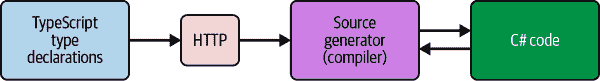
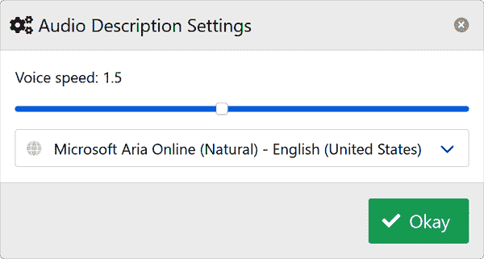

# 第七章：使用源生成器

在本章中，我们将探讨.NET 开发平台如何使你能够在 Blazor 应用程序中使用 C#源生成器。这是一个引人注目的功能，因为它提供了出色的开发者体验，并缓解了编写重复代码的顾虑，让你能够专注于更有趣的问题。事实上，你可以使用源生成器利用 JavaScript API，而无需自己编写任何 JavaScript 互操作代码。我们将通过一个示例源生成器来介绍如何使用一个定义良好的 JavaScript API 来生成代码。

# 什么是源生成器？

*源生成器*是 C#开发者可以编写的组件，允许你做两件事：

1.  检索表示正在编译的所有用户代码的编译对象。

1.  生成可在编译过程中添加到编译对象的 C#源文件。

基本上，你可以编写源生成器代码来生成更多代码。你为什么要这样做呢？作为开发者，你可能会注意到自己反复编写相同的代码。或者，你可能会编写大量的样板代码或重复的编程习语。当出现这种情况时，就是考虑自动化和使用源生成器代表你编写代码的时候了。这不仅会让你的工作更容易，而且会帮助减少代码中的人为错误。

这就是 C#源生成器的用武之地。C#源生成器作为分析器钩入到 C#编译上下文中，并可选择性地在相同上下文中发出源代码。生成的代码既是用户编写的代码的组合，也是自动生成的代码。

让我们考虑 JavaScript 互操作的代码。每次我必须编写 JavaScript 互操作代码时，我都必须执行以下步骤：

1.  使用 API 参考文档来观察目标 JavaScript API，并推断正确消耗 JavaScript API 的方式。

1.  创建一个扩展方法，扩展`IJSRuntime`或`IJSInProcessJRuntime`接口以公开 JavaScript API。

1.  将互操作调用委托给我正在扩展的接口，将参数和返回值从 JavaScript API 映射到 C#方法。

1.  使用扩展方法调用 JavaScript 互操作功能。

这变得重复了，因此很适合编写并使用源生成器。使用 Blazor WebAssembly，框架提供的`IJSRuntime`也是`IJSInProcessRuntime`类型的实现。该接口公开同步 JavaScript 互操作方法。这是因为 WebAssembly 在同一进程中有其相应的 JavaScript 实现，因此可以同步发生。这比使用`async ValueTask`替代方案的开销小，并且对于 Blazor WebAssembly 应用程序而言，这被认为是一种优化，而不是 Blazor Server 托管模型。

在本章后面，你将会了解到 [*blazorators* 库](https://oreil.ly/wEeFJ)，它提供了一个源代码生成器，可用于生成 Blazor 应用的 JavaScript 交互代码。它还生成了一些库，这些库是源代码生成的结果。该源代码生成器依赖于 C# 编译器平台 (Roslyn) 的 API。它有一个生成器，实现了 `Microsoft.CodeAnalysis.ISourceGenerator` 接口。这个接口被编译器用来生成源代码，我们可以根据需要自由实现它。在下一节中，你将看到一个例子，展示了一个源代码生成的 JavaScript API，它生成一个可重用的类库。

# 为源代码生成器构建案例

许多应用程序需要某种形式的持久性来保存用户状态。幸运的是，所有现代浏览器都支持存储，这是一种直接在浏览器中持久化用户状态的方式。`Blazor.LocalStorage.WebAssembly` NuGet 包是由 *blazorators* 源代码生成器创建的。它是一个类库，提供了一组强大的 API，它依赖于 JavaScript，但本身不包含任何 JavaScript。它仅仅是委托给浏览器的 `localStorage` API。

ECMAScript 标准指定了许多众所周知且被支持的 Web API，以及 DOM 和浏览器对象模型 (BOM) 的 API。

###### 提示

Blazor 负责专门管理 DOM，因此建议避免生成特定于 DOM 的 JavaScript API。这是一个重要的细节，因为多段代码同时操作同一 API 可能会导致冲突和异常行为。

让我们专注于 Web API，这些 API 是暴露给 JavaScript 的。这里的 *Web API* 术语不应与 HTTP Web API 混淆，而是指原生于 JavaScript 的 API。其中一个这样的 API 是 [`window.localStorage`](https://oreil.ly/fJ8m0)。这是 `Storage` API 的一种实现。本地存储允许网站在浏览器会话之间持久化数据，非常适合用户偏好和类似用途。`localStorage` API 不需要安全上下文，并且内容存储在客户端浏览器上，用户可以通过浏览器的开发者工具看到这些内容。

`window.localStorage` 的 API 表面描述在 表 7-1 中。

表 7-1\. 本地存储 API 表

| 方法名 | 参数 | 返回类型 |
| --- | --- | --- |
| `clear` | none | `void` |
| `removeItem` | `DOMString keyName` | `void` |
| `getItem` | `DOMString keyName` | `DOMString &#124; null` |
| `setItem` | `DOMString keyName, DOMString keyValue` | `void` |
| `key` | `number index` | `DOMString &#124; null` |
| `length` | none | `number` |

Blazor JavaScript 互操作在`localStorage` JavaScript API 中有一个典型示例。在 Blazor 应用程序中看到这些不同的实现并不罕见。这段代码变得重复，维护起来可能既乏味又耗时，而且容易出错。在下一节中，我们将讨论*blazorators*源生成器如何使用 TypeScript 声明为`localStorage` API 创建适当的 JavaScript 互操作代码。要将此 JavaScript API 公开给 Razor 组件库或 Blazor WebAssembly 应用程序，需要引用`IJSRuntime`或`IJSInProcessRuntime`实现，并将 JavaScript 互操作调用委托给本地`localStorage` API 以提供其功能。

正如在“重新定义单页应用程序”中解释的那样，TypeScript 为 JavaScript 提供了静态类型系统。类型可以在类型声明文件中定义。*blazorators*源生成器依赖于 TypeScript 类型声明。对于常见的 JavaScript API，类型声明信息可以在 TypeScript GitHub 仓库上公开获取。源生成器获取并读取来自*lib.dom.d.ts*文件的类型声明。源生成器解析来自 JavaScript 的类型，并将其转换为相应的 C# 结构。

要帮助可视化这个过程，请考虑图 7-1。



###### 图 7-1\. 源生成器块图示

类型声明是从 HTTP GET 调用中请求的，源生成器确定输出的 C# 代码。*lib.dom.d.ts* 文件中的`Storage`接口类似于以下 TypeScript 代码，并用于生成相应的 C# 代码：

```cs
interface Storage {

    readonly length: number;

    clear(): void;
    getItem(key: string): string | null;
    key(index: number): string | null;
    removeItem(key: string): void;
    setItem(key: string, value: string): void;
}
```

此接口的实现将提供一个只读的`length`属性，返回`Storage`中项目的数量。实现还将提供`clear`、`getItem`、`key`、`removeItem`和`setItem`的常见功能。源生成器将此接口解析为描述接口的 C# 对象。源生成器动态创建`JSAutoGenericInterop`属性。源生成器发现该属性，并根据属性值的元数据将其转换为生成器选项。源生成器将识别所需的`TypeName`及其对应的`Implementation`值的实现。

在编译时，当源生成器检测到`JSAutoGenericInterop`属性时，它将查找`TypeName`和`Implementation`的值。然后，源生成器将为`Storage`接口生成 JavaScript 互操作代码。源生成器解析 TypeScript 声明，并具有将这些方法转换为 JavaScript 互操作扩展方法的逻辑。在接下来的部分中，我将向您展示如何将`localStorage` API 实现为可重用的类库。

# C#源生成器的实际应用

现在您知道 C#源生成器的工作原理，我将向您展示如何在 Blazor 应用程序开发中使用它们。在构建源生成器的用例时，我们看到 TypeScript 的类型声明定义了 API，并且源生成器可以使用此信息来生成适当的 JavaScript 互操作代码。您可以选择编写自己的源生成器，或者使用*blazorators*源生成器。

## 源生成`localStorage` API

如果我告诉您，C#源生成器可以用来生成具有相应 JavaScript 互操作代码的整个库，您会相信吗？这是真的！例如，我创建了[`Blazor.SourceGenerator`项目](https://oreil.ly/Wymlh)，它正是如此。它是一个 C#源生成器，可以根据众所周知的 API 生成 JavaScript 互操作代码。

[`Blazor.LocalStorage.WebAssembly` NuGet 包](https://oreil.ly/Lo5vG)仅包含在*C#文件 ILocalStorageService.cs*中定义的以下代码：

```cs
namespace Microsoft.JSInterop;

[JSAutoGenericInterop(
 TypeName = "Storage",
 Implementation = "window.localStorage",
 Url = "https://developer.mozilla.org/docs/Web/API/Window/localStorage",
 GenericMethodDescriptors = new[]
    {
        "getItem",
        "setItem:value"
    })]
public partial interface ILocalStorageService
{
}
```

`Blazor.SourceGenerator`项目源生成了大量代码。此项目中唯一手写的代码是前面的 14 行。此代码将其指定为`Microsoft.JSInterop`命名空间，使得所有源生成功能对任何使用此命名空间的消费者都可用。该接口是`partial`，因为它将用户定义的代码与源生成的代码分开。它使用`JSAutoGenericInteropAttribute`来指定以下元数据：

`TypeName = "Storage"`

这将目标类型名称设置为[`Storage`](https://oreil.ly/pz6H1)。

`Implementation = "window.localStorage"`

这表达了如何从全局作用域的`window`对象中定位指定类型的实现；这是[`localStorage`](https://oreil.ly/sWMpG)的实现。

`Url`

这将设置实现的 URL；源生成器将使用它来自动为生成的 API 创建代码注释。

`GenericMethodDescriptors`

这些描述符用于推断应使用泛型返回类型或泛型参数生成源代码的哪些方法。通过指定`"getItem"`方法，其返回类型将是泛型`TValue`类型。同样地，指定`"setItem:value"`将指示名为`value`的参数作为泛型`TValue`类型。

这里有很多描述性元数据，可以从这个装饰属性中推断出来。编译后，`Blazor.SourceGenerators` 项目将识别此文件并在 `ILocalStorageService` 上源生成相应的 `localStorage` JavaScript 互操作扩展方法。文件也需要是一个 `public partial interface`。

生成的结果 C# 代码现在显示在 *ILocalStorageService.g.cs* C# 文件中：

```cs
using Blazor.Serialization.Extensions;
using System.Text.Json;

#nullable enable
namespace Microsoft.JSInterop;

/// <summary> /// Source generated interface definition of the <c>Storage</c> type. /// </summary> public partial interface ILocalStorageService
{
    /// <summary>
    /// Source generated implementation of
    /// <c>window.localStorage.length</c>.
    /// <a href=
    /// "https://developer.mozilla.org/docs/Web/API/Storage/length"></a>
    /// </summary>
    double Length { get; } 

    /// <summary>
    /// Source generated implementation of
    /// <c>window.localStorage.clear</c>.
    /// <a href=
    /// "https://developer.mozilla.org/docs/Web/API/Storage/clear"></a>
    /// </summary>
    void Clear(); 

    /// <summary>
    /// Source generated implementation of
    /// <c>window.localStorage.getItem</c>.
    /// <a href=
    /// "https://developer.mozilla.org/docs/Web/API/Storage/getItem"></a>
    /// </summary> 
    TValue? GetItem<TValue>(
        string key,
        JsonSerializerOptions? options = null);

    /// <summary>
    /// Source generated implementation of
    /// <c>window.localStorage.key</c>.
    /// <a href=
    /// "https://developer.mozilla.org/docs/Web/API/Storage/key"></a>
    /// </summary> 
    string? Key(double index);

    /// <summary>
    /// Source generated implementation of
    /// <c>window.localStorage.removeItem</c>.
    /// <a href=
    /// "https://developer.mozilla.org/docs/Web/API/Storage/removeItem"></a>
    /// </summary> 
    void RemoveItem(string key);

    /// <summary>
    /// Source generated implementation of
    /// <c>window.localStorage.setItem</c>.
    /// <a href=
    /// "https://developer.mozilla.org/docs/Web/API/Storage/setItem"></a>
    /// </summary> 
    void SetItem<TValue>(
        string key,
        TValue value,
        JsonSerializerOptions? options = null);
}
```


`Length` 方法返回 `local​Stor⁠age` 实现中底层数组的 `length`。


`Clear` 方法清除 `localStorage`。


`GetItem` 方法以期望的通用形状返回对应 `key` 的项目。


`Key` 方法返回 `localStorage` 中对应 `index` 的 `key`。


`RemoveItem` 方法移除 `localStorage` 中对应 `key` 的项目。


`SetItem` 方法为 `localStorage` 中对应的 `key` 设置项目。

由于这是一个部分接口，源生成器将生成 `ILocalStorageService`。相应的实现也是源生成的。生成代码的消费者使用 `ILocalStorageService` 类型上创建的方法来访问 `localStorage` API。此代码是异步代码的同步替代品，由 [`Blazor.LocalStorage.Server` NuGet 包](https://oreil.ly/bADBx) 生成。`Blazor.LocalStorage.WebAssembly` NuGet 包是依赖于 `Blazor.SourceGenerators` 项目的类库。生成此代码的优势是巨大的。通过少量声明式的手写 C#，可以源生成整个库，并且这些库可以被任何 Razor 项目或 Blazor WebAssembly 项目使用。

`ILocalStorageService` 将通过框架的 DI 系统公开。此接口是使用 `TypeName` 和 `Implementation` 属性的知识生成的。`TypeName` 是将暴露给生成代码的类型名称。`Implementation` 是用于实现 `ILocalStorageService` 接口的 JavaScript 类型的名称。这基于 `localStorage` Web API。以下是源生成的 `LocalStorage` 实现，定义在源生成的 *LocalStorageService.g.cs* C# 文件中：

```cs
#nullable enable

using Blazor.Serialization.Extensions;
using Microsoft.JSInterop;
using System.Text.Json;

namespace Microsoft.JSInterop;

/// <inheritdoc /> internal sealed class LocalStorageService : ILocalStorageService
{
    private readonly IJSInProcessRuntime _javaScript = null;

    /// <inheritdoc />
    double ILocalStorageService.Length => 
        _javaScript.Invoke<double>(
            "eval",
            new object[1]
            {
                "window.localStorage.length"
            });

    public LocalStorageService(IJSInProcessRuntime javaScript) 
    {
        _javaScript = javaScript;
    }

    /// <inheritdoc />
    void ILocalStorageService.Clear() 
    {
        _javaScript.InvokeVoid(
            "window.localStorage.clear");
    }

    /// <inheritdoc />
    TValue? ILocalStorageService.GetItem<TValue>( 
        string key,
        JsonSerializerOptions? options)
    {
        return _javaScript.Invoke<string>(
            "window.localStorage.getItem",
            new object[1]
            {
                key
            })
            .FromJson<TValue>(options);
    }

    /// <inheritdoc />
    string? ILocalStorageService.Key(double index) 
    {
        return _javaScript.Invoke<string>(
            "window.localStorage.key",
            new object[1]
            {
                index
            });
    }

    /// <inheritdoc />
    void ILocalStorageService.RemoveItem(string key) 
    {
        _javaScript.InvokeVoid(
            "window.localStorage.removeItem",
            key);
    }

    /// <inheritdoc />
    void ILocalStorageService.SetItem<TValue>( 
        string key,
        TValue value,
        JsonSerializerOptions? options)
    {
        _javaScript.InvokeVoid(
            "window.localStorage.setItem",
            key,
            value.ToJson<TValue>(options));
    }
}
```


`Length` 属性返回 `localStorage` 中的项目数。


`LocalStorage` 构造函数以 `IJSInProcessRuntime` 作为参数。


`Clear` 方法通过调用 `clear` JavaScript 方法来清空 `localStorage`。


`GetItem` 方法返回 `local​Stor⁠age` 中对应 `key` 的项。


`Key` 方法返回 `localStorage` 中给定 `index` 处的 `key`。


`RemoveItem` 方法通过调用 `clear` JavaScript 方法从 `localStorage` 中移除对应 `key` 的项。


`SetItem` 方法在 `localStorage` 中为对应的 `key` 设置项。

该接口支持泛型和可自定义的 `Json​Seria⁠lizerOptions` 序列化。`JsonSerializerOptions` 用于控制 `GetItem` 方法中 `TValue` 类型的序列化方式。如果未提供 `options`，则将使用默认序列化方式。

需要注意这是一个 `internal sealed class`，它是 `ILocalStorageService` 接口的显式实现。这样做是为了确保 `LocalStorageService` 实现不会直接暴露给生成代码的使用者，而是仅通过抽象进行访问。功能将通过本机 .NET DI 机制与使用者共享，并且该代码也是源生成的。

实现依赖于 `IJSInProcessRuntime` 类型进行 JavaScript 互操作。根据给定的 `TypeName` 和对应的 `Implementation`，还生成了以下代码：

ILocalStorageService.g.cs

对应 `Storage` Web API 表面的部分接口

LocalStorageService.g.cs

`internal sealed` 实现了 `ILocalStorageService` 接口

LocalStorageServiceCollectionExtensions.g.cs

扩展方法将 `ILocalStorageService` 服务添加到 DI 的 `IServiceCollection` 中。

以下是一个源生成的 *LocalStorageServiceCollectionExtensions.g.cs* C# 文件：

```cs
using Microsoft.JSInterop;

namespace Microsoft.Extensions.DependencyInjection;

/// <summary></summary> public static class LocalStorageServiceCollectionExtensions
{
    /// <summary>
    /// Adds the <see cref="ILocalStorageService" /> service to
    /// the service collection.
    /// </summary>
    public static IServiceCollection AddLocalStorageServices( 
        this IServiceCollection services) =>
        services.AddSingleton<IJSInProcessRuntime>(serviceProvider =>
            (IJSInProcessRuntime)serviceProvider.
            GetRequiredService<IJSRuntime>())
            .AddSingleton<ILocalStorageService, LocalStorageService>(); 
}
```


`AddLocalStorageServices` 方法以 `IServiceCollection` 为参数。


`AddLocalStorageServices` 方法返回的 `IServiceCollection` 中添加了 `ILocalStorageService` 服务，并添加了依赖的框架提供的 `IJSInProcessRuntime`。

在 Web.Client 的`WebAssemblyHostBuilderExtensions`类中调用此方法，以在 DI `IServiceCollection` 中注册`ILocalStorageService`服务。将这些部分结合起来，`Blazor.LocalStorage.WebAssembly` NuGet 包只需不到 15 行手写代码，其余部分都是生成的代码，提供了完全功能的 JavaScript 互操作实现，可以作为 DI-ready 服务进行注册。该服务注册为单例，`ILocalStorageService`接口暴露给生成代码的消费者。在下一节中，我将解释如何使用源代码生成器创建完全不同的库来处理`Geolocation` JavaScript API。

## 生成 Geolocation API 的源代码

地理位置信息可能非常有用，可以增强您的应用程序的用户体验。例如，您可以用它告诉用户最近商店的位置，或者可以使用它提供用户所在地区的天气情况。这非常方便，但您需要请求用户授权，以便与您的应用程序共享其地理位置信息。我在前一节介绍给您的源代码生成器项目还生成了`Blazor.Geolocation.WebAssembly` NuGet 包。此包用于在浏览器中访问`Geolocation` API。与`localStorage` API 不同，此 API 不需要泛型或自定义序列化，但需要双向 JavaScript 互操作，这是一个很好的学习示例。

`Geolocation` API 的 JavaScript API 通过`window.navigator.geolocation` JavaScript 对象公开。`Geolocation` API 需要安全上下文，这意味着浏览器会本地提示用户是否允许使用位置服务。用户有选择权，如果他们选择“否”，则无法使用此功能。如果用户选择“允许”，则浏览器将启用此功能。在安全上下文中，浏览器必须使用 HTTPS 协议。根据 TypeScript 接口声明，API 定义如下，同样可以在*lib.dom.d.ts*文件中找到：

```cs
interface Geolocation {
    clearWatch(watchId: number): void;

    getCurrentPosition(
        successCallback: PositionCallback,
        errorCallback?: PositionErrorCallback | null,
        options?: PositionOptions): void;

    watchPosition(
        successCallback: PositionCallback,
        errorCallback?: PositionErrorCallback | null,
        options?: PositionOptions): number;
}
```

所有这些类型都可以在*lib.dom.d.ts*文件中找到。`Geolocation`的定义是事情变得有趣的地方。当然，源代码生成器可以像处理本地存储部分那样生成此 API，但这次生成器需要做更多的工作。还需要评估并可能生成以下类型：

+   `PositionCallback`

+   `PositionErrorCallback`

+   `PositionOptions`

让我们首先从这两个回调函数开始。`PositionCallback`是在调用`getCurrentPosition`或`watchPosition`方法时调用的回调函数。这些回调函数在 TypeScript 中定义如下：

```cs
interface PositionCallback {
    (position: GeolocationPosition): void;
}

interface PositionErrorCallback {
    (positionError: GeolocationPositionError): void;
}
```

每个回调函数都是一个定义了回调方法签名的接口。源代码生成器还必须理解并生成`GeolocationPosition`和`GeolocationPositionError`类型。这些类型在 TypeScript 中的定义如下：

```cs
interface GeolocationPosition {
    readonly coords: GeolocationCoordinates;
    readonly timestamp: DOMTimeStamp;
}

interface GeolocationPositionError {
    readonly code: number;
    readonly message: string;
    readonly PERMISSION_DENIED: number;
    readonly POSITION_UNAVAILABLE: number;
    readonly TIMEOUT: number;
}
```

`GeolocationPosition`类型有两个属性，`coords`和`timestamp`。`coords`属性是一个定义了`GeolocationCoordinates`类型的接口。`timestamp`属性是一个`DOMTimeStamp`类型。`DOMTimeStamp`类型是一个`number`类型，其值是自 Unix 纪元（1970 年 1 月 1 日）以来经过的毫秒数，作为协调世界时（UTC）。源代码生成器将为`DOMTimeStamp`类型生成`readonly`属性，以 UTC 转换的.NET`DateTime`作为便利。`GeolocationCoordinates`类型定义如下：

```cs
interface GeolocationCoordinates {
    readonly accuracy: number;
    readonly altitude: number | null;
    readonly altitudeAccuracy: number | null;
    readonly heading: number | null;
    readonly latitude: number;
    readonly longitude: number;
    readonly speed: number | null;
}
```

最后，源代码生成器将识别在 TypeScript 中定义的`PositionOptions`类型，如下所示：

```cs
interface PositionOptions {
    enableHighAccuracy?: boolean;
    maximumAge?: number;
    timeout?: number;
}
```

源代码生成器有大量代码需要生成。让我们看看这是如何实现的。`Blazor.Geolocation.WebAssembly` NuGet 包包含两个手写文件。第一个是*C#*文件*IGeolocationService.cs*，我们现在来看一下，第二个是 JavaScript 文件，稍后再看：

```cs
namespace Microsoft.JSInterop;

[JSAutoInterop(
 TypeName = "Geolocation",
 Implementation = "window.navigator.geolocation",
 Url = "https://developer.mozilla.org/docs/Web/API/Geolocation")]
public partial interface IGeolocationService
{
}
```

同样，该库定义了一个`partial interface`。`TypeName`设置为`"Geolocation"`，这是 JavaScript API 的名称。`Implementation`设置为`"window​.nav⁠iga⁠tor.geolocation"`，这是库公开的 JavaScript API。`Url`设置为 JavaScript API 文档的 URL。源代码生成器将生成以下*C#*接口*IGeolocationService.g.cs*：

```cs
#nullable enable
namespace Microsoft.JSInterop;

/// <summary> /// Source generated interface definition of the <c>Geolocation</c> type. /// </summary> public partial interface IGeolocationService
{
    /// <summary>
    /// Source generated implementation of
    /// <c>window.navigator.geolocation.clearWatch</c>.
    /// <a href=
    /// "https://developer.mozilla.org/docs/Web/API/Geolocation/clearWatch">
    /// </a>
    /// </summary>
    void ClearWatch(double watchId); 

    /// <summary>
    /// Source generated implementation of
    /// <c>window.navigator.geolocation.getCurrentPosition</c>.
    /// </summary>
    /// <param name="component">
    /// The calling Razor (or Blazor) component.
    /// </param>
    /// <param name="onSuccessCallbackMethodName">
    /// Expects the name of a <c>"JSInvokableAttribute"</c> C# method
    /// with the following <c>System.Action{GeolocationPosition}"</c>.
    /// </param>
    /// <param name="onErrorCallbackMethodName">
    /// Expects the name of a <c>"JSInvokableAttribute"</c> C# method
    /// with the following <c>System.Action{GeolocationPositionError}"</c>.
    /// </param>
    /// <param name="options">The <c>PositionOptions</c> value.</param>
    void GetCurrentPosition<TComponent>( 
        TComponent component,
        string onSuccessCallbackMethodName,
        string? onErrorCallbackMethodName = null,
        PositionOptions? options = null)
        where TComponent : class;

    /// <summary>
    /// Source generated implementation of
    /// <c>window.navigator.geolocation.watchPosition</c>.
    /// </summary>
    /// <param name="component">
    /// The calling Razor (or Blazor) component.
    /// </param>
    /// <param name="onSuccessCallbackMethodName">
    /// Expects the name of a <c>"JSInvokableAttribute"</c> C# method
    /// with the following <c>System.Action{GeolocationPosition}"</c>.
    /// </param>
    /// <param name="onErrorCallbackMethodName">
    /// Expects the name of a <c>"JSInvokableAttribute"</c> C# method
    /// with the following <c>System.Action{GeolocationPositionError}"</c>.
    /// </param>
    /// <param name="options">The <c>PositionOptions</c> value.
    /// </param>
    double WatchPosition<TComponent>( 
        TComponent component,
        string onSuccessCallbackMethodName,
        string? onErrorCallbackMethodName = null,
        PositionOptions? options = null)
        where TComponent : class;
}
```


`ClearWatch`方法接受一个`double watchId`值，该值由`WatchPosition`方法返回。


`GetCurrentPosition`方法接受一个`TComponent`组件，这是调用的 Razor（或 Blazor）组件。


`WatchPosition`方法接受一个`TComponent`组件，这是调用的 Razor（或 Blazor）组件。

`TComponent`参数用于调用`onSuccessCallbackMethodName`和`onErrorCallbackMethodName`方法。这些方法名需要是带有`JSInvokableAttribute`属性的方法。方法签名详细说明在生成的三斜线注释中。这对于使用这些 API 非常方便，因为源代码生成器将根据从相应 TypeScript 声明中解析的类型生成适当的 C#方法签名细节。

此接口的实现在*C#*文件*GeolocationServices.g.cs*中生成：

```cs
namespace Microsoft.JSInterop;

/// <inheritdoc /> internal sealed class GeolocationService : IGeolocationService
{
    private readonly IJSInProcessRuntime _javaScript = null;

    public GeolocationService(IJSInProcessRuntime javaScript)
    {
        _javaScript = javaScript; 
    }

    /// <inheritdoc />
    void IGeolocationService.ClearWatch(double watchId) 
    {
        _javaScript.InvokeVoid(
            "window.navigator.geolocation.clearWatch",
            watchId);
    }

    /// <inheritdoc />
    void IGeolocationService.GetCurrentPosition<TComponent>( 
        TComponent component,
        string onSuccessCallbackMethodName,
        string? onErrorCallbackMethodName,
        PositionOptions? options)
    {
        _javaScript.InvokeVoid(
            "blazorators.getCurrentPosition",
            DotNetObjectReference.Create<TComponent>(component),
            onSuccessCallbackMethodName,
            onErrorCallbackMethodName,
            options);
    }

    /// <inheritdoc />
    double IGeolocationService.WatchPosition<TComponent>( 
        TComponent component,
        string onSuccessCallbackMethodName,
        string? onErrorCallbackMethodName,
        PositionOptions? options)
    {
        return _javaScript.Invoke<double>(
            "blazorators.watchPosition",
            new object[4]
            {
                DotNetObjectReference.Create<TComponent>(component),
                onSuccessCallbackMethodName,
                onErrorCallbackMethodName,
                options
            });
    }
}
```


`GeolocationService` 构造函数接受一个`IJSInProcessRuntime` JavaScript，这是针对 Blazor WebAssembly 执行模型的特定 JavaScript 运行时。


`IGeolocationService.ClearWatch`方法接受一个`double` watchId，并委托给`"window.navigator.geolocation.clearWatch"` JavaScript 方法。


`IGeolocationService.GetCurrentPosition` 方法委托给 `"blazorators.getCurrentPosition"` JavaScript 方法。


`IGeolocationService.WatchPosition` 方法委托给 `"blaz⁠ora⁠tors​.watchPosition"` JavaScript 方法。

框架提供的 `DotNetObjectReference` 用于创建对组件的引用，该引用用于调用回调方法。 对于 `GetCurrentPosition` 和 `WatchPosition` 方法，回调参数在委托的 JavaScript 内部与创建的组件引用一起使用。 在撰写本文时，*blazorators* 源代码生成器尚无法生成 `"blazorators"` 对象的 JavaScript 代码。 理论上这应该是可能的，但需要更多时间来开发。 相反，第二个手写文件是一个包含一些对应功能的 JavaScript 文件。 请考虑 *blazorators.geolocation.js* JavaScript 文件：

```cs
const onSuccess = (dotnetObj, successMethodName, position) => { 
    const result = {
        Timestamp: position.timestamp,
        Coords: {
            Accuracy: position.coords.accuracy,
            Altitude: position.coords.altitude,
            AltitudeAccuracy: position.coords.altitudeAccuracy,
            Heading: position.coords.heading,
            Latitude: position.coords.latitude,
            Longitude: position.coords.longitude,
            Speed: position.coords.speed
        }
    };
    dotnetObj.invokeMethod(successMethodName, result);
    dotnetObj.dispose();
};

const onError = (dotnetObj, errorMethodName, error) => { 
    const result = {
        Code: error.code,
        Message: error.message,
        PERMISSION_DENIED: error.PERMISSION_DENIED,
        POSITION_UNAVAILABLE: error.POSITION_UNAVAILABLE,
        TIMEOUT: error.TIMEOUT
    };
    dotnetObj.invokeMethod(errorMethodName, result);
    dotnetObj.dispose();
};

const getCurrentPosition = ( 
    dotnetObj,
    successMethodName,
    errorMethodName,
    options) => {
    navigator.geolocation.getCurrentPosition(
        position => onSuccess(dotnetObj, successMethodName, position),
        error => onError(dotnetObj, errorMethodName, error),
        options);
}

const watchPosition = ( 
    dotnetObj,
    successMethodName,
    errorMethodName,
    options) => {
    return navigator.geolocation.watchPosition(
        position => onSuccess(dotnetObj, successMethodName, position),
        error => onError(dotnetObj, errorMethodName, error),
        options);
}

window.blazorators = { 
    getCurrentPosition,
    watchPosition
};
```


`onSuccess` 回调方法是一个辅助方法。 它被 `getCurrentPosition` 成功回调调用。


`onError` 回调方法是一个辅助方法。 它被 `watch​Posi⁠tion` 错误回调调用。


`getCurrentPosition` 方法接受一个 `DotNetObjectReference` dotnetObj，这是对组件的引用，以及一个 `string successMethodName`，这是要在组件上调用的方法的名称。 `options` 参数是一个 `PositionOptions` 对象，其中包含当前位置请求的选项。


`watchPosition` 方法接受一个 `DotNetObjectReference` dotnetObj，这是对组件的引用，以及一个 `string successMethodName`，这是要在组件上调用的方法的名称。 `options` 参数是一个 `PositionOptions` 对象，其中包含当前位置请求的选项。


`blazorators` 对象用于调用 `getCurrentPosition` 和 `watch​Po⁠sition` 方法。

下列类型都是由源代码生成器生成的：

+   `GeolocationPosition`

+   `GeolocationPositionError`

+   `GeolocationCoordinates`

+   `PositionOptions`

这意味着作为开发者，你会使用 `Blazor.Geolocation.Web​Assem⁠bly` NuGet 包，调用 `AddGeolocationServices` 扩展方法，然后使用 `IGeolocationService`。 这些回调的类型也都是可用的。 这是一个巨大的优势，并且提供了一个很好的示例，展示了 JavaScript 与 .NET 世界之间的绑定。

您可能还记得，在第三章中的 `WeatherComponent` 讨论中，我们讨论了 `geolocation` 的手动 JavaScript 互操作实现。虽然这是出于教育目的而故意这样做的，但您可以将手动实现重构出来，而不是使用 `Blazor.Geolocation.WebAssembly` 库。

在接下来的章节中，我们将看看如何使用 `Blazor.LocalStorage.WebAssembly` NuGet 包来访问应用程序代码中的 `localStorage` API。

## ILocalStorageService 的示例用法

`ILocalStorageService` 类型的实现源代码已生成，因此让我们看看它的使用。本书的示例应用程序提供了几个依赖于应用程序状态能够在用户会话之外持久化的功能部分，例如用户的首选语言和音频描述设置，如语音速度和语音合成语音。这些值存储在 `localStorage` 中，并在用户重新访问站点时恢复。

在第四章中，我们简要讨论了 `AudioDescriptionComponent`。 `AudioDescriptionComponent` 是一个允许用户配置语音合成设置的组件。当用户配置音频描述设置时，`AudioDescriptionComponent` 依赖于 `AppInMemoryState` 类。 `AppInMemoryState` 被用作服务，并在第二章中进行了讨论。它公开了一个 `ClientVoicePreference` 属性，用于保存用户的首选语音设置，如图 7-2 所示。



###### 图 7-2\. 音频描述组件模态窗口

考虑以下 *ClientVoicePreference.cs* 记录类：

```cs
public record class ClientVoicePreference(
 [property: JsonPropertyName("voice")] string Voice,
 [property: JsonPropertyName("voiceSpeed")] double VoiceSpeed);
```

`ClientVoicePreference` 记录类有两个属性，`Voice` 和 `VoiceSpeed`。 `Voice` 属性是用户选择的语音名称。 `VoiceSpeed` 属性是语音播放的速度。此客户端偏好的值以 JSON `string` 的形式持久化在 `localStorage` 中。例如，以下 JSON `string` 表示用户的首选语音设置：

```cs
{
    "voice": "Microsoft Zira - English (United States)",
    "voiceSpeed": 1.5
}
```

当这个值存在于 `localStorage` 中时，`AudioDescriptionComponent` 将使用它来初始化 `AppInMemoryState` 的 `ClientVoicePreference` 属性。考虑 *AppInMemoryState.cs* 类的简化版本，重点放在 `ClientVoicePreference` 属性上：

```cs
namespace Learning.Blazor.Services;

public sealed class AppInMemoryState
{
    private readonly ILocalStorageService _localStorage;
    private ClientVoicePreference? _clientVoicePreference;
    // Omitted for brevity... 
    public AppInMemoryState(ILocalStorageService localStorage) => 
        _localStorage = localStorage;

    public ClientVoicePreference ClientVoicePreference
    {
        get => _clientVoicePreference ??= 
            _localStorage.GetItem<ClientVoicePreference>(
                StorageKeys.ClientVoice) ?? new("Auto", 1);
        set
        {
            _localStorage.SetItem(
                StorageKeys.ClientVoice,
                _clientVoicePreference = value ?? new("Auto", 1));

            AppStateChanged();
        }
    }

    // Omitted for brevity... }
```


`ILocalStorageService` 类型被注入到 `AppInMemoryState` 类中。


如果 `ClientVoicePreference` 属性在 `AppInMemoryState` 实例中不存在，则从 `_localStorage` 中读取。

这个类公开了一个 `ClientVoicePreference` 属性，用于保存用户的首选语音设置。 `ClientVoicePreference` 属性是从 `AudioDescriptionComponent` 中读取以初始化自身的。

有了用户持久化首选项的知识，现在让我们看看`AudioDescriptionComponent`，它允许用户配置语音合成设置。 考虑下*C#*类*AudioDescriptionComponent.cs*：

```cs
namespace Learning.Blazor.Components
{
    public sealed partial class AudioDescriptionComponent
    {
        private readonly IList<double> _voiceSpeeds = 
            Enumerable.Range(0, 12).Select(i => (i + 1) * .25).ToList();

        private IList<SpeechSynthesisVoice> _voices = null!;
        private string _voice = "Auto";
        private double _voiceSpeed = 1;
        private ModalComponent _modal = null!;

        protected override async Task OnAfterRenderAsync(bool firstRender)
        {
            if (firstRender)
            {
                (_voice, _voiceSpeed) = 
                    AppState.ClientVoicePreference;

                _details = new AudioDescriptionDetails(
                    AppState,
                    _voiceSpeeds,
                    _voices,
                    _voice,
                    _voiceSpeed);

                await UpdateClientVoices(
                    await JavaScript.GetClientVoicesAsync(
                        this, nameof(UpdateClientVoices)));
            }
        }
 [JSInvokable]
        public Task UpdateClientVoices(string voicesJson) =>
            InvokeAsync(() =>
            {
                var voices =
                    voicesJson.FromJson<List<SpeechSynthesisVoice>>(); 
                if (voices is { Count: > 0 })
                {
                    _voices = voices;

                    StateHasChanged();
                }
            });

        private async Task ShowAsync() => await _modal.ShowAsync();

        private void OnDetailsSaved(AudioDescriptionDetails details)
        {
            // Clone
            _details = details with { };

            AppState.ClientVoicePreference = 
                new ClientVoicePreference(_details.Voice, _details.VoiceSpeed);

            Logger.LogInformation(
                "There are {Length} item in localStorage.", LocalStorage.Length);
        }
    }

    public readonly record struct AudioDescriptionDetails( 
        AppInMemoryState AppState,
        IList<double> VoiceSpeeds,
        IList<SpeechSynthesisVoice> Voices,
        string Voice,
        double VoiceSpeed);
}
```


`_voiceSpeeds`属性是一个双精度数组，用于填充语音速度滑块。


`_voice`和`_voiceSpeed`字段从`AppState.ClientVoicePreference`中分配，该值来自`localStorage`。


可用语音从在`JavaScript.GetClientVoicesAsync`调用中注册的回调中检索得到。


当`ClientVoicePreference`属性更改时，将其写入`localStorage`。


`AudioDescriptionDetails`结构体是一个`readonly record`类型，用于初始化`AudioDescriptionComponent`的`_details`字段。

`AudioDescriptionComponent`代表依赖于应用状态能够在用户会话之外持久化的各种功能。 这是一个重要的细节，因为它与基于会话的存储不同。 JavaScript 的`Storage`接口有两种实现：`localStorage`和`sessionStorage`。 会话存储实现仅在单个标签页生命周期内存在。 当标签页关闭时，会话存储将永远消失，包括用户的首选语言和音频描述设置，如语音速度和语音合成语音。 这些值被持久化在`localStorage`中，并在用户再次访问站点时恢复。 让我们来看看*AudioDescriptionComponent.razor*文件的标记：

```cs
@inherits LocalizableComponentBase<AudioDescriptionComponent> 

<span class="navbar-item">
    <button class="button is-info is-rounded level-item"
        title=@Localizer["Audio"] @onclick=ShowAsync> 
        <span class="icon">
            <i class="fas fa-lg fa-audio-description"></i>
        </span>
    </button>
</span>

<AudioDescriptionModalComponent 
    @ref="_modal"
    Title=@Localizer["Settings"]
    Details=@_details
    OnDetailsSaved=@OnDetailsSaved/>
```


`AudioDescriptionComponent`使用`LocalizableComponentBase`类提供本地化支持。


大部分标记是导航栏中的按钮。


当用户点击音频描述按钮时，显示的模态是`AudioDescriptionModalComponent`。

当用户点击音频描述按钮时，调用`ShowAsync`并显示`AudioDescriptionModalComponent`。 `AudioDescriptionModalComponent`是一个简单的模态框，允许用户配置语音合成设置。 使用`@ref`属性将对`AudioDescriptionModalComponent`的引用存储在`_modal`字段中。 `_details`字段使用来自`AppState.ClientVoicePreference`的当前值进行初始化，并传递给`AudioDescriptionModalComponent`。 `AudioDescriptionModalComponent`公开了一个`OnDetailsSaved`事件，由`AudioDescriptionComponent`的`OnDetailsSaved`方法处理。

现在让我们看看*C#*类*AudioDescriptionModalComponent.cs*：

```cs
namespace Learning.Blazor.Components
{
    public sealed partial class AudioDescriptionModalComponent
    {
 [Parameter, EditorRequired]
        public AudioDescriptionDetails Details { get; set; } 
 [Parameter, EditorRequired]
        public string Title { get; set; } = null!;
 [Parameter, EditorRequired]
        public EventCallback<AudioDescriptionDetails> OnDetailsSaved 
        {
            get;
            set;
        }

        private string _voice = null!;
        private ModalComponent _modal = null!;

        protected override void OnParametersSet() => _voice = Details.Voice; 

        private void OnVoiceSpeedChange(ChangeEventArgs args) => 
            Details = Details with
            {
                VoiceSpeed = double.TryParse(
                    args?.Value?.ToString() ?? "1", out var speed) ? speed : 1
            };

        internal async Task ShowAsync() => await _modal.ShowAsync();

        internal async Task ConfirmAsync() 
        {
            if (OnDetailsSaved.HasDelegate)
            {
                await OnDetailsSaved.InvokeAsync(
                    Details = Details with { Voice = _voice });
            }

            await _modal.ConfirmAsync();
        }
    }
}
```


`Details` 属性是一个轻量级 `readonly record struct` 类型。


`OnDetailsSaved` 事件是在用户点击 `Confirm` 按钮时调用的 `EventCallback`。


`_voice` 字段在设置组件参数时从 `Details` 属性分配。


当用户在滑块中更改值时，将更新 `VoiceSpeed` 属性。


当用户点击 `Confirm` 按钮时，将调用 `ConfirmAsync` 方法。

`AudioDescriptionModalComponent` 取决于用户首选的 `ClientVoice​Pre⁠ference` 持久化。这是一个非常重要的细节，因为它不同于基于会话的存储。JavaScript `Storage` 接口有两种实现：`localStorage` 和 `sessionStorage`。该应用只关注 `localStorage` 数据持久化。最后，我们看一下在 *AudioDescriptionModal​Compo⁠nent.razor* 文件中定义的 `AudioDescriptionModal​Compo⁠nent` Razor 标记：

```cs
@inherits LocalizableComponentBase<AudioDescriptionModalComponent>

<ModalComponent @ref="_modal"> 
    <TitleContent>
        <span class="icon pr-2">
            <i class="fas fa-cogs"></i>
        </span>
        <span>@Title</span>
    </TitleContent>

    <BodyContent>
        <form> 
            <div class="field">
                <label for="range"> Voice speed: @Details.VoiceSpeed </label>
                <input type="range" 
                       min="@Details.VoiceSpeeds.Min()"
                       max="@Details.VoiceSpeeds.Max()"
                       step=".25" class="slider is-fullwidth is-info"
                       id="range" list="speeds"
                       value="@Details.VoiceSpeed"
                       @onchange=@OnVoiceSpeedChange>
                <datalist id="speeds"> @foreach (var speed in Details.VoiceSpeeds)  { <option value="@speed">speed</option> } </datalist>
            </div>
            <div class="field">
                <p class="control has-icons-left">
                    <span class="select is-medium is-fullwidth">
                        <select id="voices" class="has-dotnet-scrollbar"
                            @bind=_voice> 
                        <option selected>@Localizer["Auto"]</option> @if (Details.Voices is { Count: > 0 })
                        {
                            @foreach (var voice in Details.Voices)  { <option selected="@voice.Default"
                                    value="@voice.Name"> @voice.Name </option> }
                        } </select>
                    </span>
                    <span class="icon is-small is-left">
                        <i class="fas fa-globe"></i>
                    </span>
                </p>
            </div>
        </form>
    </BodyContent>

    <ButtonContent>
        <button class="button is-success is-large"
            @onclick=ConfirmAsync> 
            <span class="icon">
                <i class="fas fa-check"></i>
            </span>
            <span>@Localizer["Okay"]</span>
        </button>
    </ButtonContent>
</ModalComponent>
```


`ModalComponent` 是一个可重用的组件，用于显示模态框。


`form` 元素用于提供一个带有滑块和下拉列表的表单。滑块用于控制语音速度。下拉列表用于选择语音。


`input` 是一个 `range` 类型的元素，用于控制语音速度。


`datalist` 元素用于提供声音速度列表。


`select` 元素用于选择语音。


`option` 元素用于提供所有 `Audio​Descrip⁠tionDetails.Voices` 的声音列表。


`"Okay"` `button` 元素在用户点击时将调用 `ConfirmAsync`。

此 `form` 是使用 Blazor 进行双向绑定的示例，而不使用 `EditContext`。`@bind` 属性用于将 `_voice` 字段绑定到 `Details` 属性。`@onchange` 属性用于在用户更改滑块中的值或下拉列表中的值时更新 `Details` 属性。当用户修改这些值并关闭 `_modal` 时，将使用 `ILocalStorageService` 实现来持久化用户首选的 `ClientVoicePreference` 值。在下一章中，我们将介绍使用 `EditContext` 提供双向绑定的高级表单技术。

# Summary

在本章中，你了解了为什么在开发 Blazor 应用程序时源生成器非常有用。源生成器可以节省开发时间，并有助于减少手写代码中固有的人为错误。你已经了解到源生成器可以生成整个可消耗的 JavaScript 互操作功能库的可能性。通过*blazorators*源生成器项目的示例，我向你展示了如何使用`Blazor.LocalStorage.WebAssembly` NuGet 包。

在下一章中，我将教你如何使用 Blazor 表单。我将向你展示如何验证用户输入以及如何定制用户体验。你将学习如何使用框架提供的`EditForm`组件。
