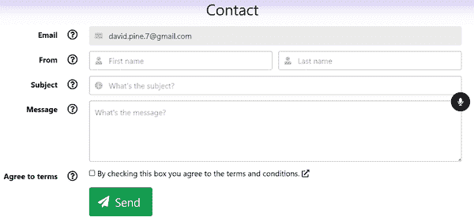

# 第八章：使用验证接受表单输入

在本章中，您将学习如何使用框架提供的组件来接受表单输入，将自定义的 C#模型绑定到`EditForm`组件。我们将介绍在表单中使用本地语音识别。您还将学习如何在 Rx.NET 中使用响应式扩展。模型应用程序的联系页面表单将演示所有这些内容。

让我们从接受和验证用户输入的表单提交开始。您将看到如何将有效的用户输入发送到 HTTP 端点进行处理。

# 表单提交的基础知识

HTML `form` 元素的核心功能是接受和验证用户输入。当用户的输入无效时，应通知用户。当输入有效时，将其提交到 HTTP 端点进行处理。表单提交过程如下：

1.  用户被呈现填写`form`。

1.  用户填写`form`并尝试提交。

1.  对`form`进行验证。

    1.  如果`form`无效，则向用户显示验证消息或错误。

    1.  如果`form`有效，输入将被发送进行处理。

在这些步骤之间，用户以各种方式与`form`交互，有时通过键入，有时通过点击，有时通过选择单选按钮等。当表单无效时，表单的状态可以显示验证消息或错误给用户。表单可以接受多种不同类型的用户输入。我们可以对期望的输入元素应用动态 CSS 来指示用户输入无效。我们可以控制哪个元素具有焦点，并且可以将元素设置为`disabled`或使其`readonly`。这些样式包括动画以强调错误条件并引导用户注意特定区域。

# 表单的框架提供的组件

Blazor 提供了许多组件，这些组件在本地 HTML 元素之上提供了一层。其中一个组件是`EditForm`。`EditForm`组件被设计为包装原生 HTML`form`元素。这是书籍模型应用程序的`Contact`表单中使用的组件。还有其他框架提供的组件。在下一节中，您将看到可以与`EditForm`一起使用的各种框架提供的组件。

Table 8-1 显示可以与`EditForm`组件一起使用的各种框架提供的组件。¹

表 8-1。框架提供的表单组件

| Blazor 组件 | 包装的 HTML 元素 | 组件的目的 |
| --- | --- | --- |
| `EditForm` | `<form>` | 提供对原生 HTML `form` 元素的包装 |
| `InputCheckbox` | `<input type="checkbox">` | 接受用户输入，要么`true`要么`false` |
| `InputDate<TValue>` | `<input type="date">` | 接受`DateTime`值作为用户输入 |
| `InputFile` | `<input type="file">` | 接受文件上传 |
| `InputNumber<TValue>` | `<input type="number">` | 接受用户输入的数值 |
| `InputRadio<TValue>` | `<input type="radio">` | 接受一组互斥的值，代表单个选择 |
| `InputRadioGroup<TValue>` | 一个或多个 `InputRadio<TValue>` 组件的父组件 | 在语义上将 `InputRadio<TValue>` 组件包装在一起，使它们成为互斥的 |
| `InputSelect<TValue>` | `<select>` | 接受`TValue`值作为用户输入，来自自定义选项列表 |
| `InputText` | `<input type="text">` | 接受一个字符串值作为用户输入 |
| `InputTextArea` | `<textarea>` | 接受一个字符串值作为用户输入，但通常显示和期望的值比 `InputText` 组件更大 |

使用上述组件，您可以构建一个与您的应用程序需求一样丰富和复杂的表单。

在下一节中，我将向您展示如何构建一个模型，该模型将表示表单的状态以及用户与之交互的情况。该模型将使用元数据进行修饰，这些元数据将用于验证其绑定到的表单。

# 模型和数据注解

表单的一个常见用例是为最终用户提供一种在应用程序内部联系某人的方式，原因各不相同。《[联系](https://oreil.ly/LZzCM)》表单的学习 Blazor 应用程序正是如此。用户可以填写表单并向我，应用程序的所有者，发送消息。在他们点击发送并确认他们是人类之后，消息将作为电子邮件发送给我。我们将在本章中详细介绍其工作原理。

让我们首先浏览一下表单的用户输入：

1.  用户的电子邮件地址（应用程序的当前用户，如果用户已登录，则预填充）。

1.  用户的名字和姓氏，作为一对。

1.  消息的主题，或者说他们通过应用程序联系的原因。

1.  输入消息使用一个 `TextArea` 组件和一些有趣的 JavaScript 互操作。消息输入提供了一个切换语音识别的麦克风按钮。

作为视觉参考点，请考虑图 8-1。


###### 图 8-1\.《联系》页面的示例呈现

## 定义组件模型

作为表单提交过程的一部分，`EditForm` 将验证用户的输入。`EditForm` 还将显示验证消息和错误。这一切都基于 `EditContext` 或一个模型。模型是一个用于绑定属性和表示相关值的 C# 类。在《联系》页面的情况下，它使用 `EditContext` 来管理表单的状态。而 `EditContext` 则依赖于一个相应的模型。让我们来看一下 *ContactComponentModel.cs* 文件中的 `ContactComponentModel`，它负责表示表单的状态：

```cs
namespace Learning.Blazor.ComponentModels;

public record ContactComponentModel() 
{
 [Required] 
    public string? FirstName { get; set; } = null!;
 [Required]
    public string? LastName { get; set; } = null!;
 [RegexEmailAddress(IsRequired = true)] 
    public string? EmailAddress { get; set; } = null!;
 [Required]
    public string? Subject { get; set; } = null!;
 [RequiredAcceptance] 
    public bool AgreesToTerms { get; set; }
 [Required]
    public string? Message { get; set; } = null!;

    public AreYouHumanMath NotRobot { get; } =
        AreYouHumanMath.CreateNew(MathOperator.Subtraction); 

    public string RobotQuestion => NotRobot.GetQuestion();

    public static implicit operator ContactRequest( 
        ContactComponentModel model) =>
        new(model.FirstName!,
            model.LastName!,
            model.EmailAddress!,
            model.Subject!,
            model.Message!);
}
```


该模型是一种 `record` 类型。


`FirstName` 和 `LastName` 属性是必填的，依据 `Required` 属性。


`EmailAddress` 属性是必需的，并且必须是有效的电子邮件地址。


`AgreesToTerms` 属性必须为 `true`。


`NotRobot` 属性是一个 `readonly` 属性，其计算结果来自 `AreYouHumanMath` 类。


`record` 定义了一个操作符，将其转换为 `ContactRequest`。

此模型公开用户应提供的值。用户的名和姓是必需的，以及一个有效的电子邮件地址。`Required` 属性是一个由框架提供的数据注释属性，用于指示用户必须为属性提供值。如果用户没有提供值，并且他们尝试提交表单或导航离开底层 HTML 元素，则 `EditForm` 将显示错误消息。C# 属性用于为其应用的对象提供额外信息。

## 定义和使用验证属性

`RegexEmailAddress` 属性是一个自定义属性，用于指示用户必须提供有效的电子邮件地址。在装饰模型属性时，此属性将验证其为电子邮件地址。`RequiredAcceptance` 属性是一个自定义属性，用于指示用户必须接受条款和条件。您可以使用各种属性来定义对象。`Message` 属性是必需的，`Subject` 属性也是如此。

让我们来看看 *Regex​E⁠mailAddressAttribute.cs* C# 文件中 `RegexEmailAddress` 属性的实现：

```cs
using System.Text.RegularExpressions;

namespace Learning.Blazor.DataAnnotations;
 
    AttributeUsage( ![1 AttributeTargets.Property |
        AttributeTargets.Field |
        AttributeTargets.Parameter,
        AllowMultiple = false)
]
public sealed class RegexEmailAddressAttribute : DataTypeAttribute
{
    internal static readonly Regex EmailExpression = 
        new("^([a-zA-Z0-9_\\-\\.]+)@" +
        "((\\[[0-9]{1,3}\\.[0-9]{1,3}\\.[0-9]{1,3}\\.)" +
        "|(([a-zA-Z0-9\\-]+\\.)+))([a-zA-Z]{2,4}|[0-9]{1,3})(\\]?)$",
            RegexOptions.CultureInvariant | RegexOptions.Singleline);

    /// <summary>
    /// Gets or sets a value indicating if an email is required.
    /// </summary>
    /// <remarks>Defaults to <c>true</c>.</remarks>
    public bool IsRequired { get; set; } = true; 

    public RegexEmailAddressAttribute()
        : base(DataType.EmailAddress) 
    {
    }

    public override bool IsValid(object? value) 
    {
        if (value is null)
        {
            return !IsRequired;
        }

        return value is string valueAsString
            && EmailExpression.IsMatch(valueAsString);
    }
}
```


`AttributeUsage` 装饰器指定了另一个属性类的用法，即 `RegexEmailAddressAttribute`，它仅适用于属性、字段和参数。


`EmailExpression` 是一个 `readonly Regex` 实例，用于验证电子邮件地址。


`IsRequired` 属性允许开发人员确定是否需要电子邮件地址。


构造函数使用 `DataType.EmailAddress` 值调用其基础构造函数。


`IsValid` 方法用于验证作为可空对象传递的电子邮件地址。

Blazor 开发人员可以编写自定义 `DataTypeAttribute`。如果用户输入的电子邮件地址不匹配正则表达式，`EditForm` 将显示错误消息。如果值为 `null` 并且 `IsRequired` 属性为 `true`，`EditForm` 将显示错误消息。另一个自定义属性是 `RequireAcceptance​At⁠tribute`。此属性用于指示用户必须接受条款和条件。

接下来，让我们看看 `RequiredAcceptanceAttribute`，它在 *Require⁠d​AcceptanceAttribute.cs* C# 文件中定义：

```cs
namespace Learning.Blazor.DataAnnotations;
 
    AttributeUsage( ![1 AttributeTargets.Property |
        AttributeTargets.Field |
        AttributeTargets.Parameter,
        AllowMultiple = false)
]
public sealed class RequiredAcceptanceAttribute : DataTypeAttribute
{
    public RequiredAcceptanceAttribute()
        : base(DataType.Custom) 
    {
    }

    public override bool IsValid(object? value) 
    {
        if (value is null)
        {
            return false;
        }

        return bool.TryParse(value.ToString(), out var isAccepted)
            && isAccepted;
    }
}
```


`RequiredAcceptanceAttribute` 类似于 `RegexEmailAddressAttribute`。


构造函数使用 `DataTypeAttribute` 的基础构造函数，并传入 `DataType.Custom` 值。


`IsValid` 方法用于验证条款和条件的接受情况。

如果用户不接受条款和条件，`EditForm` 将显示错误消息。当表示 `value` 的对象为 `null`，或者 `value` 为 `false` 时，将触发错误条件。您可以自由地创建所需的任何自定义业务逻辑规则。每当需要接受用户输入时，您将从建模表示您需求的对象开始。您将为模型的属性添加自定义或框架提供的数据注释。在接下来的部分中，我们将实践这一点，并看到模型如何绑定到表单组件。

# 实现联系表单

`Contact` 页面的标记有点冗长，但包含了许多具有不同功能和验证要求的用户输入。当用户输入处于错误状态时，为了使控件动画化并提供适当的样式，表单需要比语义化表单更多的标记。页面的标记内容包含在 *Contact.cshtml* Razor 文件中：

```cs
@page "/contact"  @attribute [AllowAnonymous]
@inherits LocalizableComponentBase<Contact>

<PageTitle>@Localizer["Contact"]</PageTitle>

<section class="section">
    <h1 class="is-size-3 pb-3">@Localizer["Contact"]</h1>

    <EditForm class="pb-4" Context="cxt" EditContext="_editContext" 
              OnValidSubmit=@(async c => await OnValidSubmitAsync(c))>
        <DataAnnotationsValidator />

        <!-- Email address -->
        <FieldInput> 
            <FieldLabelContent> @Localizer["Email"] <i class="pl-4 far fa-lg
                    @cxt.GetValidityCss(() => _model.EmailAddress)"></i>
            </FieldLabelContent>
            <FieldControlContent>
                <InputText @ref="_emailInput"
                    @bind-Value="_model.EmailAddress" class="input"
                    readonly=@_isEmailReadonly disabled=@_isEmailReadonly
                    placeholder="@Localizer["EmailPlaceholder"]" />
                <span class="icon is-small is-left">
                    <i class="fas fa-envelope"></i>
                </span>
            </FieldControlContent>
        </FieldInput>
        <!-- First and last name --> 
        <div class="field is-horizontal">
            <div class="field-label is-normal">
                <label class="label"> @Localizer["From"] <i class="pl-4 far fa-lg
                        @cxt.GetValidityCss(
                            () => _model.FirstName,
                            () => _model.LastName)"></i>
                </label>
            </div>
            <div class="field-body">
                <div class="field">
                    <p class="control is-expanded has-icons-left">
                        <InputText @ref="_firstNameInput"
                            @bind-Value="_model.FirstName" class="input"
                            placeholder="@Localizer["FirstName"]" />
                        <span class="icon is-small is-left">
                            <i class="fas fa-user"></i>
                        </span>
                    </p>
                </div>
                <div class="field">
                    <p class="control is-expanded has-icons-left">
                        <InputText @bind-Value="_model.LastName" class="input"
                                   placeholder="@Localizer["LastName"]" />
                        <span class="icon is-small is-left">
                            <i class="fas fa-user"></i>
                        </span>
                    </p>
                </div>
            </div>
        </div>
        <!-- Subject -->
        <FieldInput> 
            <FieldLabelContent> @Localizer["Subject"] <i class="pl-4 far fa-lg
                    @cxt.GetValidityCss(() => _model.Subject)"></i>
            </FieldLabelContent>
            <FieldControlContent>
                <InputText @bind-Value="_model.Subject" class="input"
                    placeholder="@Localizer["SubjectPlaceholder"]" />
                <span class="icon is-small is-left">
                    <i class="fas fa-info-circle"></i>
                </span>
            </FieldControlContent>
        </FieldInput>
        <!-- Message -->
        <FieldInput ControlClasses=@(Array.Empty<string>())> <FieldLabelContent> @Localizer["Message"] <i class="pl-4 far fa-lg
                    @cxt.GetValidityCss(() => _model.Message)"></i>
            </FieldLabelContent>
            <FieldControlContent>
                <AdditiveSpeechRecognitionComponent 
                    SpeechRecognitionStarted=OnRecognitionStarted
                    SpeechRecognitionStopped=OnRecognitionStopped
                    SpeechRecognized=OnSpeechRecognized />
                <InputTextArea @bind-Value="_model.Message" class="textarea"
                    readonly=@_isMessageReadonly disabled=@_isMessageReadonly
                    placeholder="@Localizer["MessagePlaceholder"]" />
            </FieldControlContent>
        </FieldInput>
        <!-- Agree to terms -->
        <FieldInput ControlClasses=@(Array.Empty<string>())> 
            <FieldLabelContent> @Localizer["AgreeToTerms"] <i class="pl-4 far fa-lg
                    @cxt.GetValidityCss(() => _model.AgreesToTerms)"></i>
            </FieldLabelContent>
            <FieldControlContent>
                <label class="checkbox">
                    <InputCheckbox @bind-Value="_model.AgreesToTerms" /> @Localizer["TermsAndConditions"] <a href="/termsandconditions" target="_blank"
                        rel="noopener noreferrer">
                        <i class="fas fa-external-link-alt"></i>
                    </a>
                </label>
            </FieldControlContent>
        </FieldInput>
        <!-- Send button --> 
        <div class="field is-horizontal">
            <div class="field-label">
                <!-- Left empty for spacing -->
            </div>
            <div class="field-body">
                <div class="field is-grouped">
                    <button class="button is-success is-large" type="submit">
                        <span class="icon">
                            <i class="fas fa-paper-plane"></i>
                        </span>
                        <span>@Localizer["Send"]</span>
                    </button>
                </div>
            </div>
        </div>
    </EditForm>
</section>

<VerificationModalComponent @ref="_modalComponent" 
    VerificationAttempted=@OnVerificationAttempted />
```


`Contact` 页面允许匿名用户联系站点所有者。


`EditForm` 是一个由框架提供的组件，用于呈现一个 `form`。


页面模型接受一个 `EmailAddress` 属性并呈现一个 `<InputText>` 元素。


页面模型接受 `FirstName` 和 `LastName` 属性，并呈现两个 `<input type="text">` 元素。


页面模型接受一个 `Subject` 属性并呈现一个 `<InputText>` 元素。


页面模型接受一个`Message`属性，并呈现一个`<InputTextArea>`元素。这是添加性语音识别组件呈现的地方，后面章节详细介绍。


页面模型接受一个`AgreesToTerms`属性，并呈现一个`<InputCheckbox>`元素。


页面模型接受一个`Send`按钮，并呈现一个`<button>`元素。


该页面引用`VerificationModalComponent`以进行垃圾邮件过滤。

当请求`/contact`路由时显示的页面如图 8-2 所示。



###### 图 8-2. 一个空白的`Contact`页面表单，只有电子邮件地址预填充

让我们总结一下这里发生的事情。`Contact`页面是一个带有几个字段的表单。页面模型是一个包含绑定到表单元素的属性的类。`EditForm`组件是一个由框架提供的组件，用于呈现 HTML `form`元素。它要求使用`EditContext`或`Model`，但不能同时使用两者。在这种情况下，`EditContext`包装了`ContactComponentModel`。在`Edit​Con⁠text`中使用的模型可以是任何`object`。`EditContext`保存与数据编辑过程相关的元数据，例如指示哪些字段已被修改的标志和当前设置的验证消息。`EditContext.Model`将被`EditForm`用于呈现表单。`EditContext.OnValidSubmit`事件处理程序用于处理表单提交。当表单既有效又提交时，将调用`Contact.OnValidSubmitAsync`事件处理程序。使用`Data​Anno⁠tations​Val⁠ida⁠tor`框架提供的组件添加验证`Data​Annota⁠tions`属性支持，通知`EditContext`实例有关模型的元数据。

表单中的字段如下所示：

电子邮件

一个自定义的`FieldInput`组件，绑定到模型的`EmailAddress`属性。

发件人

以框架提供的`InputText`组件呈现的两个水平字段，分别绑定到模型的`FirstName`和`LastName`属性。这些值都是必需的，可以改变共享验证图标的验证状态。

主题

一个自定义的`FieldInput`组件，绑定到模型的`Subject`属性。

消息

一个自定义的`FieldInput`组件，绑定到模型的`Message`属性，但依赖于`AdditiveSpeechRecognitionComponent`来添加与`InputTextArea`组件绑定的语音识别支持。`AdditiveSpeech​Rec⁠ogni⁠tionComponent`在其父 HTML 元素的右上角呈现一个覆盖切换`<button>`。

是否用户同意条款

一个自定义的`FieldInput`组件，绑定到模型的`AgreesToTerms`属性，以及框架提供的`InputCheckbox`组件，用于呈现复选框。

提交表单按钮

在 `EditForm` 标记的末尾有一个发送 `<button type="submit">` 元素。当用户点击此按钮时，如果表单有效，则调用 `EditContext.OnValidSubmit` 事件处理程序。

模态对话框

当用户点击 `Send` 按钮时，会显示由 `VerificationModalComponent` 渲染的对话框。该对话框用作垃圾邮件过滤器，因为它要求提交表单的用户回答一个数学问题的字符串形式。

阴影组件执行此操作是因为其中包含大量 Razor 标记。它用于管理框架提供的 `EditContext`、`_model`、`_emailInput`、`_firstNameInput`、`_modalComponent` 以及两个布尔值，用于确定电子邮件或消息输入元素是否应为 `readonly`。这些详细信息将在后续部分中说明。由于联系页面标有 `AllowAnonymous`，非经身份验证的用户可以访问该页面；这是有意为之，以便潜在的应用程序用户可以通过提问与我们联系。

Razor 组件通常在评估模型属性时使用 `Expression<Func<T>>` 语义（或表达式树）。表达式树将代码表示为数据结构，其中每个节点都是一个表达式。表达式看起来像函数，但并不会被直接评估。而是被解析。例如，当我们传入 `_model.EmailAddress` 时，Blazor 库调用 `FieldCssClass`。然后解析表达式，提取如何评估我们的模型及其相应的属性值。

为了方便确定特定模型属性表达式状态下适用的 CSS 类，`GetValidityCss` 扩展方法计算了属性的适当 CSS 类。请参考 *EditContext​Ex⁠tensions.cs* C# 文件：

```cs
namespace Learning.Blazor.Extensions;

public static class EditContextExtensions
{
    /// <summary>
    /// Maps the given <paramref name="accessor"/>
    /// expression to the resulting CSS.
    /// </summary>
    public static string GetValidityCss<T>( 
        this EditContext context,
        Expression<Func<T?>> accessor)
    {
        var css = context?.FieldCssClass(accessor);
        return GetValidityCss(
            IsValid(css),
            IsInvalid(css),
            IsModified(css));
    }

    /// <summary>
    /// Maps the given <paramref name="accessorOne"/> and
    /// <paramref name="accessorTwo"/> expressions to
    /// the resulting CSS.
    /// </summary>
    public static string GetValidityCss<TOne, TTwo>( 
        this EditContext context,
        Expression<Func<TOne?>> accessorOne,
        Expression<Func<TTwo?>> accessorTwo)
    {
        var cssOne = context?.FieldCssClass(accessorOne);
        var cssTwo = context?.FieldCssClass(accessorTwo);
        return GetValidityCss(
            IsValid(cssOne) && IsValid(cssTwo),
            IsInvalid(cssOne) || IsInvalid(cssTwo),
            IsModified(cssOne) && IsModified(cssTwo));
    }

    /// <summary>
    /// Maps the given validation states into corresponding CSS classes.
    /// </summary>
    public static string GetValidityCss( 
        bool isValid, bool isInvalid, bool isModified) =>
        (isValid, isInvalid) switch
        {
            (true, false) when isModified => "fa-check-circle has-text-success",
            (false, true) when isModified => "fa-times-circle has-text-danger",

            _ => "fa-question-circle"
        };

    private static bool IsValid(string? css) => 
        IsContainingClass(css, "valid") && !IsInvalid(css);

    private static bool IsInvalid(string? css) => 
        IsContainingClass(css, "invalid");

    private static bool IsModified(string? css) => 
        IsContainingClass(css, "modified");

    private static bool IsContainingClass(string? css, string name) =>
        css?.Contains(name, StringComparison.OrdinalIgnoreCase) ?? false;
}
```


`Expression<Func<T>>` 参数用于访问模型的属性。


`Expression<Func<TOne>>` 和 `Expression<Func<TTwo>>` 参数用于访问模型的属性。


布尔参数用于确定要返回的 CSS 类。


`IsValid` 方法用于确定属性是否有效。


`IsInvalid` 方法用于确定属性是否无效。


`IsModified` 方法用于确定属性是否已修改。

`EditContextExtensions`类包含一些扩展方法，用于根据模型属性的状态确定要返回的 CSS 类。`GetValidityCss`方法及其重载用于根据模型属性的状态确定要返回的 CSS 类。使用框架提供的`EditContextFieldClassExtensions.FieldCssClass`扩展方法，我们可以根据相应表达式的状态评估当前的 CSS 类。`Get​Vali⁠dityCss`方法在整个标记中使用。

接下来，让我们看看*C#*文件*Contact.razor.cs*：

```cs
namespace Learning.Blazor.Pages
{
    public sealed partial class Contact 
    {
        private EditContext _editContext = null!;
        private ContactComponentModel _model = new();
        private InputText _emailInput = null!;
        private InputText _firstNameInput = null!;
        private VerificationModalComponent _modalComponent = null!;
        private bool _isEmailReadonly = false;
        private bool _isMessageReadonly = false;
 [Inject]
        public IHttpClientFactory HttpFactory { get; set; } = null!;

        protected override async Task OnInitializedAsync() 
        {
            // Initializes the "User" instance.
            await base.OnInitializedAsync();
            InitializeModelAndContext();
        }

        private void InitializeModelAndContext() 
        {
            if (User is { Identity.IsAuthenticated: true })
            {
                _model = _model with
                {
                    EmailAddress = User.GetFirstEmailAddress()
                };
                _isEmailReadonly = _model.EmailAddress is not null
                    && RegexEmailAddressAttribute.EmailExpression.IsMatch(
                        _model.EmailAddress);
            }

            _editContext = new(_model);
        }

        protected override async Task OnAfterRenderAsync(bool firstRender) 
        {
            if (firstRender)
            {
                var input = _isEmailReadonly ? _firstNameInput : _emailInput;
                await (input?.Element?.FocusAsync(preventScroll: true)
                    ?? ValueTask.CompletedTask);
            }
        }

        private void OnRecognitionStarted() => _isMessageReadonly = true; 

        private void OnRecognitionStopped(
            SpeechRecognitionErrorEvent? error) =>
            _isMessageReadonly = false;

        private void OnSpeechRecognized(string transcript) 
        {
            _model.Message = _model.Message switch
            {
                null => transcript,
                _ => $"{_model.Message.Trim()} {transcript}".Trim()
            };

            _editContext.NotifyFieldChanged(
                _editContext.Field(nameof(_model.Message)));
        }

        private Task OnValidSubmitAsync(EditContext context) => 
            _modalComponent.PromptAsync(context);

        private async Task OnVerificationAttempted( 
            (bool IsVerified, object? State) attempt)
        {
            if (attempt.IsVerified)
            {
                var client =
                    HttpFactory.CreateClient(HttpClientNames.ServerApi);

                using var response =
                    await client.PostAsJsonAsync<ContactRequest>(
                    "api/contact",
                    _model,
                    DefaultJsonSerialization.Options);

                if (response.IsSuccessStatusCode)
                {
                    AppState?.ContactPageSubmitted?.Invoke(_model);
                    _model = new();
                    InitializeModelAndContext();
                    await InvokeAsync(StateHasChanged);
                }
            }
        }
    }
}
```


`EditContext`实例包装`ContactComponentModel`。


`OnInitializedAsync`方法调用`base`实现，初始化`User`实例并立即调用`InitializeModelAndContext`。


`InitializeModelAndContext`方法从`User`实例初始化`_model`和`_edit​Con⁠text`属性。


`OnAfterRenderAsync`方法确定页面渲染时应该具有焦点的输入元素。


`OnRecognitionStarted`方法将`_isMessageReadonly`属性设置为`true`。


`OnSpeechRecognized`方法使用传递的文本更新`_model.Message`属性，并通知`_editContext`实例`Message`属性已更改。


当用户点击`Send`按钮时，将调用`OnValidSubmitAsync`方法。


`OnVerificationAttempted`方法在 Web.Api 项目的`[HttpPost("api/contact")]`端点抛出`ContactRequest`。

当初始化`Contact`页面时，也会初始化`base.User`实例。如果存在已验证的用户，则将电子邮件地址设置为`readonly`，并使用用户的电子邮件。如果没有已验证的用户，则使用空的`ContactComponentModel`实例初始化`_model`实例。当首次渲染页面时，要么将焦点放在`_emailInput`元素上，要么放在`_firstNameInput`元素上。

有两个方法负责管理`_messageInput`元素是否为`readonly`。`OnRecognitionStarted`方法将`_isMessageReadonly`属性设置为`true`；`OnRecognitionStopped`方法将其设置为`false`。当识别到语音时，将使用传递的文本更新`_model.Message`属性，并通知`_edit​Con⁠text`实例`Message`属性已更改。

当用户提供了所有必需的输入时，表单被认为是“有效的”。此时，用户可以自由提交表单。提交表单时，将显示 `_modalComponent` 实例，提示用户回答一个问题。如果他们能够做到，表单信息将发送到 Web.Api 项目的 `[HttpPost("api/contact")]` 端点进行处理。

为了封装各种字段输入的一些常见代码，我编写了一个 `Field​In⁠put` 表单组件。这个组件在 `Contact` 页面中广泛使用。让我们来看一下 *FieldInput.razor* Razor 标记文件：

```cs
<div class="field is-horizontal">
    <div class="field-label @LabelSpecifierClass">
        <label class="label"> @FieldLabelContent 
        </label>
    </div>
    <div class="field-body">
        <div class="field @ControlSpecifierClass">
            <p class="control @ControlClasses.ToSpaceDelimitedString()"> @FieldControlContent 
            </p>
        </div>
    </div>
</div> @code {  [Parameter]
    public string? LabelSpecifierClass { get; set; } = "is-normal";

    [Parameter]
    public string? ControlSpecifierClass { get; set; }

    [Parameter]
    public RenderFragment? FieldLabelContent { get; set; }

    [Parameter, EditorRequired]
    public RenderFragment? FieldControlContent { get; set; }

    [Parameter]
    public string[]? ControlClasses { get; set; } = new string[]
    {
        "is-expanded", "has-icons-left"
    };
}
```


`FieldLabelContent` 属性用于为字段渲染 `label`。


`FieldControlContent` 属性用于为字段渲染 `input`。


该组件接受多个可选和必需的参数。

由于 `label` 和 `input` 元素被渲染为 `RenderFragment`，消费者可以自由渲染任何他们想要的内容。在 `Contact` 页面标记中，您可以看到使用以下组件的 `FieldInput` 组件的示例：

+   单个由框架提供的 `InputText` 组件

+   多个由框架提供的 `InputText` 组件

+   自定义 `AdditiveSpeechRecognitionComponent` 组件

+   单个由框架提供的 `InputCheckbox` 组件

让我们探索一些表单可以呈现的更多状态。

除了 `label` 外，图标也用于更清晰地传达验证错误。想象一下用户输入名字后忘记输入姓氏，然后提供一个主题。他们可以尝试点击 `Send` 按钮，但 `_lastNameInput` 元素将被红色边框标出，并且其有效性图标将变为红色叉号。 `_subjectInput` 元素的有效性图标将从问号变为绿色勾号，但 `_messageInput` 元素不会被突出显示，如 Figure 8-3 所示。


###### 图 8-3\. 一个无效 `Contact` 页面的示例放大渲染

用户可以为姓氏和消息提供值，从而清除验证错误，如 Figure 8-4 所示。


###### 图 8-4\. 一个有效 `Contact` 页面的示例放大渲染

在 Figure 8-3 和 Figure 8-4 中，您可能已经注意到了一个麦克风。消息输入元素的上右角边界框中呈现了一个按钮。用户单击按钮时，`_messageInput` 元素将暂时禁用。该元素接受语音识别作为输入形式。接下来的部分将向您展示如何将语音识别输入集成到您的表单中。

# 将语音识别作为用户输入实现

语音识别是现代应用程序中常用的输入机制，既用于可访问性，也方便整体使用。根据 [“Can I Use *Speech Recognition*?” web page](https://oreil.ly/qhqjt)，超过 90% 的网络浏览器支持语音识别 API。语音识别 API 允许 web 开发人员从用户的语音输入中获取转录文本。该 API 受到所有现代浏览器的支持，包括 Chrome、Firefox、Safari 和 Edge。

要让用户可以使用语音识别在表单的消息字段中输入文本，您需要依赖于浏览器的原生语音识别 API。这需要 JavaScript 交互操作。要使用这个 API，您可以编写自己的实现来与原生 API 交互，或者使用一个包含这些逻辑的库。我维护了一个 Razor 类库，提供了一个发布在 NuGet 上的 `ISpeech​Recog⁠nitionService` 实现，称为 [`Blazor.Speech​Recog⁠nition.WebAssem⁠bly`](https://oreil.ly/UpI60)。这个库通过 DI 暴露了这种类型，允许消费者在 `IServiceCollection` 类型上调用 `.AddSpeechRecognitionServices`。一旦服务注册完毕，您就可以使用这个接口。这是对语音识别 API 的抽象，它使用了 Blazor 的 JavaScript 交互。这是一个如何创建可重用 Razor 类库的好例子。

Blazor 类库允许您编写组件，有效地共享通用的标记、逻辑，甚至静态资产。静态资产通常位于 ASP.NET Core 应用程序的 *wwwroot* 文件夹中。`Blazor.SpeechRecognition.WebAssembly` 库在 *wwwroot* 中定义了一些 JavaScript 代码。让我们来看看 *blazorators.speech​Recog⁠nition.js* JavaScript 文件，它暴露了 `speechSynthesis` 功能：

```cs
let _recognition = null; 

/**
 * Cancels any active speech recognition session,
 * considered best practice to properly clean up.
 * @param {boolean} isAborted
 */
export const cancelSpeechRecognition = (isAborted) => { 
    if (_recognition !== null) {
        if (isAborted) {
            _recognition.abort();
        } else {
            _recognition.stop();
        }
        _recognition = null;
    }
};

/**
 * Starts recognizing speech in the browser and registers
 * all the callbacks for the given dotnetObj in context.
 * @param {any} dotnetObj
 * @param {string} lang The BCP47 tag for the language.
 * @param {string} key Used for round-trip verification and callback-receipts.
 * @param {string} onResultMethodName Incremental recognition results callback.
 * @param {string | null} onErrorMethodName Recognition error callback.
 * @param {string | null} onStartMethodName Recognition started callback.
 * @param {string | null} onEndMethodName Recognition ended callback.
 */
export const recognizeSpeech = 
    (dotnetObj, lang, key, onResultMethodName,
        onErrorMethodName, onStartMethodName, onEndMethodName) => {
        if (!dotnetObj || !onResultMethodName) {
            return;
        }

        cancelSpeechRecognition(true);

        _recognition =
            new webkitSpeechRecognition() || new SpeechRecognition();
        _recognition.continuous = true;
        _recognition.interimResults = true;
        _recognition.lang = lang;

        if (onStartMethodName) {
            _recognition.onstart = () => { 
                dotnetObj.invokeMethod(onStartMethodName, key);
            };
        }
        if (onEndMethodName) {
            _recognition.onend = () => {
                dotnetObj.invokeMethod(onEndMethodName, key);
            };
        }
        if (onErrorMethodName) {
            _recognition.onerror = (error) => {
                dotnetObj.invokeMethod(onErrorMethodName, key, error);
            };
        }
        _recognition.onresult = (result) => { 
            let transcript = '';
            let isFinal = false;
            for (let i = result.resultIndex; i < result.results.length; ++i) {
                transcript += result.results[i][0].transcript;
                if (result.results[i].isFinal) {
                    isFinal = true;
                }
            }
            if (isFinal) {
                const punctuation = transcript.endsWith('.') ? '' : '.';
                const replaced =
                    transcript.replace(/\S/, str => str.toLocaleUpperCase());
                transcript =
                    `${replaced}${punctuation}`;
            }
            dotnetObj.invokeMethod(
                onResultMethodName, key, transcript, isFinal);
        };
        _recognition.start();
    };

window.addEventListener('beforeunload', _ => { 
    cancelSpeechRecognition(true);
});
```


`_recognition` 变量用于全局存储当前的 `SpeechRecognition` 实例。


`cancelSpeechRecognition` 方法用于取消当前的语音识别会话。


`recognizeSpeech` 方法用于启动语音识别会话。


`_recognition` 实例有多个回调函数，每个都已注册。


`_recognition.onresult` 回调用于将结果发送回客户端。


`window.addEventListener` 方法中止任何活动的语音识别会话。

尽管我们在本书中已经使用 JavaScript 实现了其他功能，但这里的情况有所不同，因为这里定义的函数使用了`export`关键字。`export` JavaScript 关键字允许您将函数或变量作为可从另一个模块导入的代码进行导出。这是一个非常常见的 JavaScript 特性，用于使您的代码更可共享、可读和更易于维护。Blazor 可以通过 JavaScript 互操作调用来将这些函数导入到 .NET 中，使用`import`和指向 JavaScript 模块的路径。模块简单地将其所需的功能`export`，而其他模块则消费它。在 .NET 中，此模块表示为框架提供的`IJSInProcessObjectReference`类型。有关 JavaScript 隔离的更多信息，请参阅 Microsoft 的[“在 ASP.NET Core Blazor 中从 .NET 方法调用 JavaScript 函数”文档](https://oreil.ly/0nf9D)。

此 JavaScript 文件的两个函数是`cancelSpeechRecognition`和`recognizeSpeech`。主要函数是`recognizeSpeech`，因为它在能够处理时条件注册所有提供的回调。它负责实例化`SpeechRecognition`实例，并将其分配给 JavaScript 代码的全局`_recognition`变量。接下来，我们将看一下`ISpeech​Rec⁠ogni⁠tionService`接口。它在*C#*文件*ISpeechRecognitionService.cs*中定义：

```cs
namespace Microsoft.JSInterop; 

public interface ISpeechRecognitionService : IAsyncDisposable 
{
    Task InitializeModuleAsync(); 

    void CancelSpeechRecognition(bool isAborted); 

    IDisposable RecognizeSpeech( 
        string language,
        Action<string> onRecognized,
        Action<SpeechRecognitionErrorEvent>? onError = null,
        Action? onStarted = null,
        Action? onEnded = null);
}
```


接口声明自身位于`Microsoft.JSInterop`命名空间，以方便使用。


`ISpeechRecognitionService`接口用于定义公共`Speech​Re⁠cognition` API。


`InitializeModuleAsync`方法用于初始化语音识别模块。


`CancelSpeechRecognition`方法用于取消语音识别会话。


`RecognizeSpeech`方法用于启动语音识别会话。

###### 警告

在他人命名空间（如`Microsoft.JSInterop`）中声明类型不应过度使用。通常不公开推荐这种做法，但在这里使用它是为了使库对开发者更加友好。这样一来，开发者选择使用此 NuGet 包时，如果他们的应用程序已经使用了`Microsoft.JSInterop`，他们也可以使用`SpeechRecognition` API。

该接口继承了 `IAsyncDisposable`，其 `DisposeAsync` 调用将执行必要的捕获模块引用的清理工作。`ISpeechRecognitionService` 接口很小，因此非常适合简单的单元测试，这在第九章中有所讨论。这使得可以轻松对围绕语音识别模块的逻辑执行单元测试。接下来，我们将看看 `DefaultSpeech​Re⁠cognitionService` 类。它在 *DefaultSpeechRecognitionService.cs* C# 文件中定义：

```cs
namespace Microsoft.JSInterop;

internal sealed class DefaultSpeechRecognitionService 
    : ISpeechRecognitionService
{
    const string ContentFolder = "_content"; 
    const string Package = "Blazor.SpeechRecognition.WebAssembly";
    const string Module = "blazorators.speechRecognition.js";

    readonly IJSInProcessRuntime _javaScript;
    readonly SpeechRecognitionCallbackRegistry _callbackRegistry = new();

    IJSInProcessObjectReference? _speechRecognitionModule;
    SpeechRecognitionSubject? _speechRecognition;

    public DefaultSpeechRecognitionService(
        IJSInProcessRuntime javaScript) => _javaScript = javaScript;

    void InitializeSpeechRecognitionSubject()
    {
        if (_speechRecognition is not null) 
        {
            CancelSpeechRecognition(false);
            _speechRecognition.Dispose();
        }

        _speechRecognition = SpeechRecognitionSubject.Factory(
            _callbackRegistry.InvokeOnRecognized);
    }

    /// <inheritdoc />
    public async Task InitializeModuleAsync() => 
        _speechRecognitionModule =
            await _javaScript.InvokeAsync<IJSInProcessObjectReference>(
                "import",
                $"./{ContentFolder}/{Package}/{Module}");

    /// <inheritdoc />
    public void CancelSpeechRecognition( 
        bool isAborted) =>
        _speechRecognitionModule?.InvokeVoid(
            "cancelSpeechRecognition",
            isAborted);

    /// <inheritdoc />
    public IDisposable RecognizeSpeech( 
        string language,
        Action<string> onRecognized,
        Action<SpeechRecognitionErrorEvent>? onError,
        Action? onStarted,
        Action? onEnded)
    {
        InitializeSpeechRecognitionSubject();

        var key = Guid.NewGuid();
        _callbackRegistry.RegisterOnRecognized(key, onRecognized);
        if (onError is not null)
            _callbackRegistry.RegisterOnError(key, onError);
        if (onStarted is not null)
            _callbackRegistry.RegisterOnStarted(key, onStarted);
        if (onEnded is not null)
            _callbackRegistry.RegisterOnEnded(key, onEnded);

        _speechRecognitionModule?.InvokeVoid(
            "recognizeSpeech",
            DotNetObjectReference.Create(this),
            language,
            key,
            nameof(OnSpeechRecognized),
            nameof(OnRecognitionError),
            nameof(OnStarted),
            nameof(OnEnded));

        return _speechRecognition!;
    }
 [JSInvokable]
    public void OnStarted(string key) => 
        _callbackRegistry.InvokeOnStarted(key);
 [JSInvokable]
    public void OnEnded(string key) =>
        _callbackRegistry.InvokeOnEnded(key);
 [JSInvokable]
    public void OnRecognitionError(
        string key, SpeechRecognitionErrorEvent errorEvent) =>
        _callbackRegistry.InvokeOnError(key, errorEvent);
 [JSInvokable]
    public void OnSpeechRecognized( 
        string key, string transcript, bool isFinal) =>
        _speechRecognition?.RecognitionReceived(
            new SpeechRecognitionResult(key, transcript, isFinal));

    async ValueTask IAsyncDisposable.DisposeAsync()
    {
        _speechRecognition?.Dispose();
        _speechRecognition = null;

        if (_speechRecognitionModule is not null)
        {
            await _speechRecognitionModule.DisposeAsync();
            _speechRecognitionModule = null;
        }
    }
}
```


`DefaultSpeechRecognitionService` 类既是 `sealed` 又是 `internal`。


除了 `const string` 字段外，此实现还需要几个字段——两个由框架提供的类型（`IJSInProcessRuntime` 和 `IJSInProcessObjectReference`）以及两个自定义类型（`SpeechRecognitionCallbackRegistry` 和 `SpeechRecognitionSubject`）。


`InitializeSpeechRecognitionSubject` 创建语音识别主题。如果它已经存在，则取消现有的语音识别会话。


`InitializeModuleAsync` 方法用于初始化语音识别模块。


`CancelSpeechRecognition` 方法用于取消语音识别会话。


`RecognizeSpeech` 方法用于启动语音识别会话。


`OnStarted` 方法用于调用 `onStarted` 回调。


`OnSpeechRecognized` 方法用于调用 `onRecognized` 回调。

在调用任何其他调用之前，需要调用 `InitializeModuleAsync` 方法。这确保了 `_speechRecognitionModule` 字段的初始化。`Cancel​Spee⁠chRecognition` 方法用于取消语音识别会话。`RecognizeSpeech` 方法用于启动语音识别会话。当启动语音识别会话时，将初始化 `_speechRecognition` 字段。创建调用键（`Guid.NewGuid()`），并将其从 .NET 传递到 JavaScript 交互调用中。调用 JavaScript 使用给定的 `key` 来调用其回调函数。然后使用此方法确保一旦调用，就从 `_callbackRegistry` 中删除回调。`OnStarted`、`OnEnded` 和 `OnRecognitionError` 方法用于调用相应的回调函数。`OnSpeechRecognized` 不同，它将给定的 `transcript` 和 `isFinal` 值推送到 `SpeechRecognitionResult` 对象中，并在 `_speechRecognition` 字段上调用 `Recognition​Received` 方法。

`_speechRecognition` 字段是 `SpeechRecognitionSubject` 类型。这种自定义类型包装了一些响应式代码，并提供了封装的观察者和可观察者对。在下一节中，我将解释如何使用响应式扩展（Reactive Extensions）来创建 `SpeechRecognitionSubject` 类型。

## 使用观察者模式的响应式编程

与 `OnStarted`、`OnEnded` 和 `OnRecognitionError` 事件不同，`OnSpeech​Recog⁠nized` 事件会触发多次。这是因为 JavaScript 语音识别代码在启动语音识别会话时将 `continuous` 标志设置为 `true`。JavaScript 代码将多次调用 `onRecognized` 回调函数，对于每次调用，`isFinal` 标志设置为 `false`。当中间识别结果可用时，最终识别结果仍然是间歇性的。当最终识别时，它是一个完整的想法或句子。语音识别服务将继续监听，直到发生错误或请求取消。我们将使用响应式编程，依赖于异步编程逻辑来处理对静态内容的实时更新。当语音识别服务触发时，我们的应用程序将观察每个事件的发生并采取适当的操作。

[响应式扩展（或响应式扩展）](https://reactivex.io) 是一个用于异步编程的可观察流的 API。响应式扩展是 *观察者模式* 的一种实现。

.NET 实现的响应式扩展被称为 Rx.NET。在这个库中，`Subject` 类型表示一个既是可观察序列又是观察者的对象。在语音识别中，`SpeechRecognition​Sub⁠ject` 类型观察一个流的 `SpeechRecognitionResult` 对象。考虑 *Speech​Recogni⁠tionSubject.cs* C# 文件：

```cs
namespace Microsoft.JSInterop;

internal sealed class SpeechRecognitionSubject : IDisposable 
{
    readonly Subject<SpeechRecognitionResult> _speechRecognitionSubject = new();
    readonly IObservable<(string, string)> _speechRecognitionObservable;
    readonly IDisposable _speechRecognitionSubscription;
    readonly Action<string, string> _observer;

    private SpeechRecognitionSubject( 
        Action<string, string> observer)
    {
        _observer = observer;
        _speechRecognitionObservable =
            _speechRecognitionSubject.AsObservable()
                .Where(r => r.IsFinal)
                .Select(r => (r.Key, r.Transcript));

        _speechRecognitionSubscription =
            _speechRecognitionObservable.Subscribe(
                ((string Key, string SpeechRecognition) tuple) =>
                    _observer(tuple.Key, tuple.SpeechRecognition));
    }

    internal static SpeechRecognitionSubject Factory( 
        Action<string, string> observer) => new(observer);

    internal void RecognitionReceived( 
        SpeechRecognitionResult recognition) =>
        _speechRecognitionSubject.OnNext(recognition);

    public void Dispose() => _speechRecognitionSubscription.Dispose(); 
}
```


类型`SpeechRecognitionSubject`依赖于主题、观察者、可观察对象和订阅。


字段`_observer`用于调用`onRecognized`回调，并且构造函数是`private`。


方法`Factory`用于创建`SpeechRecognitionSubject`类型。


方法`RecognitionReceived`用于将给定的`recognition`值推送到字段`_speechRecognitionSubject`中。


方法`Dispose`用于释放字段`_speechRecognition​Sub⁠scrip⁠tion`。

`SpeechRecognitionSubject`允许消费者将`SpeechRecognitionResult`实例推送到其底层的`Subject`中。消费者还提供了一个`Action<string, string>`观察者函数，该函数在可观察对象的订阅中使用。当`Subject`充当可观察对象时，意味着它的间歇性结果流可以被过滤并有条件地分派给消费者。当最终的`transcript`准备就绪时，会通知消费者并提供`key`和`transcript`值。

自定义主题包装器仅定义了一个`private`构造函数，这意味着除非使用静态工厂方法，否则无法实例化此对象。`Factory`功能接受用于实例化`SpeechRecognitionSubject`的`observer`。订阅实例被存储为字段，以便在主题被处置时可以显式清除。

## 使用注册表管理回调

由于服务暴露了多个回调，它通过自定义注册表管理交互回调。`SpeechRecognitionCallbackRegistry`对象允许注册回调，并通过其键调用相应的回调。让我们看看*C#文件* *SpeechRecognitionCallbackRegistry.cs*：

```cs
namespace Microsoft.JSInterop;

internal sealed class SpeechRecognitionCallbackRegistry 
{
    readonly ConcurrentDictionary<Guid, Action<string>>
        _onResultCallbackRegister = new();
    readonly ConcurrentDictionary<Guid, Action<SpeechRecognitionErrorEvent>>
        _onErrorCallbackRegister = new();
    readonly ConcurrentDictionary<Guid, Action>
        _onStartedCallbackRegister = new();
    readonly ConcurrentDictionary<Guid, Action>
        _onEndedCallbackRegister = new();

    internal void RegisterOnRecognized( 
        Guid key, Action<string> callback) =>
        _onResultCallbackRegister[key] = callback;

    internal void RegisterOnError( 
        Guid key, Action<SpeechRecognitionErrorEvent> callback) =>
        _onErrorCallbackRegister[key] = callback;

    internal void RegisterOnStarted(
        Guid key, Action callback) =>
        _onStartedCallbackRegister[key] = callback;

    internal void RegisterOnEnded(
        Guid key, Action callback) =>
        _onEndedCallbackRegister[key] = callback;

    internal void InvokeOnRecognized( 
        string key, string transcript) =>
        OnInvokeCallback(
            key, _onResultCallbackRegister,
            callback => callback?.Invoke(transcript));

    internal void InvokeOnError( 
        string key, SpeechRecognitionErrorEvent error) =>
        OnInvokeCallback(
            key, _onErrorCallbackRegister,
            callback => callback?.Invoke(error));

    internal void InvokeOnStarted(string key) =>
        OnInvokeCallback(
            key, _onStartedCallbackRegister,
            callback => callback?.Invoke());

    internal void InvokeOnEnded(string key) =>
        OnInvokeCallback(
            key, _onEndedCallbackRegister,
            callback => callback?.Invoke());

    static void OnInvokeCallback<T>( 
        string key,
        ConcurrentDictionary<Guid, T> callbackRegister,
        Action<T?> handleCallback)
    {
        if (key is null or { Length: 0 } ||
            callbackRegister is null or { Count: 0 })
        {
            return;
        }

        if (Guid.TryParse(key, out var guid) &&
            callbackRegister.TryRemove(guid, out var callback))
        {
            handleCallback?.Invoke(callback);
        }
    }
}
```


字段`_onResultCallbackRegister`用于存储`onRecognized`回调的注册。


方法`RegisterOnRecognized`注册了`onRecognized`回调，并且字段`_onResultCallbackRegister`用于存储回调。


方法`RegisterOnError`注册了`onError`回调函数，并且字段`_onErrorCallbackRegister`用于存储回调。


方法`InvokeOnRecognized`调用`onRecognized`回调，并且方法`OnInvokeCallback`调用回调。


方法`InvokeOnError`调用`onError`回调，并且方法`OnInvokeCall⁠back`调用回调。


`OnInvokeCallback` 方法在回调被移除后调用该注册。

`ConcurrentDictionary` 表示一个线程安全的 KVP 集合，可以被多个线程并发访问。有许多管理回调的替代方法，但 `SpeechRecognitionCallbackRegistry` 对象是最简单和最高效的。它是线程安全的，并使用全局唯一标识符管理回调——确保单个注册与回调的单次调用相对应。在这种浏览器中使用 C# 的优势之一是我们可以使用 .NET 生态系统提供的原生类型。具有诸如 `ConcurrentDictionary`、`Guid`、强类型委托 (`Action<T>` 例如) 甚至 Rx.NET 这样的基本类型是一个巨大的优势。

## 将语音识别服务应用于组件

将 `SpeechRecognitionSubject` 和 `SpeechRecognitionCallbackRegistry` 应用于公开 `ISpeechRecognitionService` 接口，我们现在可以创建一个自定义组件，将其添加到 HTML 元素中，并提供语音识别功能。让我们看看 *AdditiveSpeechRecognitionComponent.cs* C# 文件：

```cs
using RecognitionError = Microsoft.JSInterop.SpeechRecognitionErrorEvent;

namespace Learning.Blazor.Components
{
    public sealed partial class AdditiveSpeechRecognitionComponent
        : IAsyncDisposable 
    {
        IDisposable? _recognitionSubscription;
        SpeechRecognitionErrorEvent? _error = null;
        bool _isRecognizing = false;

        string _dynamicCSS => _isRecognizing ? "is-flashing" : "";
 [Inject] 
        private ISpeechRecognitionService SpeechRecognition
        {
            get;
            set;
        } = null!;
 [Parameter] 
        public EventCallback SpeechRecognitionStarted { get; set; }
 [Parameter] 
        public EventCallback<RecognitionError?> SpeechRecognitionStopped
        {
            get;
            set;
        }
 [Parameter, EditorRequired] 
        public EventCallback<string> SpeechRecognized { get; set; }

        protected override async Task OnAfterRenderAsync(bool firstRender)
        {
            if (firstRender)
            {
                await SpeechRecognition.InitializeModuleAsync(); 
            }
        }

        void OnRecognizeButtonClick() 
        {
            if (_isRecognizing)
            {
                SpeechRecognition.CancelSpeechRecognition(false);
            }
            else
            {
                var bcp47Tag = Culture.CurrentCulture.Name;
                _recognitionSubscription?.Dispose();
                _recognitionSubscription = SpeechRecognition.RecognizeSpeech(
                    bcp47Tag,
                    OnRecognized,
                    OnError,
                    OnStarted,
                    OnEnded);
            }
        }

        void OnRecognized(string transcript) => 
            _ = SpeechRecognized.TryInvokeAsync(transcript, this);

        void OnError(SpeechRecognitionErrorEvent recognitionError)
        {
            (_isRecognizing, _error) = (false, recognitionError);
            _ = SpeechRecognitionStopped.TryInvokeAsync(_error, this);
        }

        void OnStarted()
        {
            _isRecognizing = true;
            _ = SpeechRecognitionStarted.TryInvokeAsync(this);
        }

        public void OnEnded()
        {
            _isRecognizing = false;
            _ = SpeechRecognitionStopped.TryInvokeAsync(_error, this);
        }

        ValueTask IAsyncDisposable.DisposeAsync()
        {
            _recognitionSubscription?.Dispose();
            return SpeechRecognition.DisposeAsync();
        }
    }
}
```


`AdditiveSpeechRecognitionComponent` 实现了 `IAsyncDisposable` 接口，允许我们在组件从 DOM 中移除时处置语音识别模块。


`SpeechRecognition` 属性用于访问语音识别服务。


`SpeechRecognitionStarted` 属性是可选的，并用于通知父组件语音识别已启动。


`SpeechRecognitionStopped` 属性也是可选的，在语音识别停止时发信号。


`SpeechRecognized` 属性是一个 `EditorRequired` 参数，在典型会话中被多次调用。


`OnAfterRenderAsync` 方法用于初始化语音识别模块。


`OnRecognizeButtonClick` 方法用于启动或停止语音识别。


`OnRecognized` 方法用于通知父组件语音识别已完成。

当用户点击麦克风按钮时，将调用`OnRecognizeButtonClick`方法。消费者`Contact`页面将把相应的`input`元素标记为`readonly`。这有助于确保用户无法编辑输入字段中的文本，因为它是通过语音识别自动更新的。因此，你不能边说话边打字。`EventCallback`实例会向消费者发出任何更改的信号。`TryInvokeAsync`是一个扩展方法，条件性地调用`EventCallback`实例上的`InvokeAsync`方法，如果其`HasDelegate`值为`true`。

# 表单提交验证和确认

将所有这些内容结合起来，我们构建了一个自定义的`Contact`页面，展示了一个漂亮样式的表单，支持一键语音识别功能。在用户提交表单之前，所有字段都必须通过验证。由于表单的主要功能是接受用户输入并将其传递给接收者，验证输入以确保信息正确传达是非常重要的。

表单模型绑定到各种表单字段，并在提交时进行验证。每个表单字段由使用 Blazor 组件的 HTML 元素表示。表单字段组件负责验证用户的输入。当框架提供的`EditForm`组件得到一个无效的 C# 模型时，它将使用适当的错误消息渲染表单。只有在表单提交有效时，`EditForm`组件才会提交表单。这意味着所有模型上的数据注解都得到验证，包括必填字段、自定义正则表达式模式和自定义验证方法。

一旦`Contact`表单被视为有效并提交，用户将收到一个模态框提示，充当基本的垃圾邮件阻止器。我们在第 4 章的图 4-3 中设置了这个`VerificationModalComponent`。该模态框提示用户回答随机的数学问题，并要求正确答案才能继续提交。

图 8-5 显示了这个模态框提示的一个示例。


###### 图 8-5\. `VerificationModalComponent`的示例渲染，放大后

如果答案不正确，模态框将不允许将用户的表单数据发送到 Web.Api 项目的端点进行处理。错误答案在图 8-6 中显示。


###### 图 8-6\. `VerificationModalComponent`的示例渲染，放大后，答案错误

一旦问题被正确回答，模态框将被关闭，联系表单将被处理。触发通知，说明联系尝试成功，如图 8-7 所示。


###### 图 8-7\. 确认通知的示例渲染

因为表单的主要功能是接收用户输入并传递给接收者，因此验证输入确保信息正确传递非常重要。模型绑定到各种表单字段，并在提交时进行验证。每个表单字段由使用 Blazor 组件的 HTML 元素表示。表单字段组件负责验证用户的输入。当框架提供的`EditForm`组件给定一个无效的 C# 模型时，它将渲染带有适当错误消息的表单。只有在表单提交有效时，`EditForm` 组件才会提交表单，这意味着模型上的所有数据注解都经过验证，包括必填字段、自定义正则表达式模式和自定义验证方法。

# 总结

在本章中，我向您展示了如何实现一个带有验证输入的表单。在此过程中，您学习了表单提交的基础知识，包括如何将自定义的 C# 模型绑定到`EditForm`，如何使用数据注解来装饰模型属性以及如何渲染带有验证错误的表单。我还向您介绍了一个语音识别库，该库可以接受用户口述的文字输入，并将其绑定到文本输入。

在下一章中，我将向您展示如何正确测试您的 Blazor 应用程序。从使用 xUnit 进行单元测试到使用 bUnit 进行组件测试，您将学习如何编写可靠的测试，用于验证应用程序的功能。

¹ “ASP.NET Core Blazor Forms and Input Components,” Microsoft .NET Documentation, August 16, 2022, [*https://oreil.ly/3qzqQ*](https://oreil.ly/3qzqQ).
