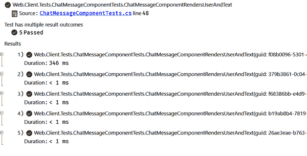

# 第九章：测试所有的东西

在本章中，我们将探讨作为 Blazor 开发人员可用的各种测试选项。了解您可以测试什么以及如何测试非常重要。我们将从适用于所有.NET 和 JavaScript 开发人员的最基本的测试用例开始。我将介绍测试并向您展示如何使用 xUnit、bUnit 和 Playwright 测试框架。然后我们将转向更高级的测试场景。最后，我们将以代码示例结束，展示如何使用 GitHub Action 工作流自动化测试，以及如何编写单元、组件和端到端测试。

# 为什么测试？

也许你会问，“如果你的代码本来就能工作，测试的意义何在？”这是个公平的问题。多年来，我也持相同观点——我不喜欢测试，因为它看起来没有必要。然而，多年来编写代码后，我改变了看法。测试是确保您的代码按预期工作并能根据需要重构的好方法。测试还有助于在核心业务规则更改时使事情正常运行。就像我曾说过良好的代码是给下一个开发者的情书一样，测试也是一种表达情感的方式。让我们从最小的测试类型——*单元测试*开始吧。

# 单元测试

*单元测试*是最基本的测试策略之一，用于测试小型、隔离的代码片段或单元。单元测试应接受已知输入并返回预期输出——最好避免在测试中使用随机化。通过自动化单元测试并避免人为错误，您更有可能在未来的重构中捕捉潜在问题。

###### 注意

所有这里的单元测试都是用 C#编写的，但这并不意味着你不能为我们模型应用程序中使用的 JavaScript 代码编写单元测试。我选择不这样做是因为 Learning Blazor 应用程序几乎没有 JavaScript 代码，主要是包装现有的 API，因此非常可靠。换句话说，我对维护仅验证框架代码的测试不感兴趣。

单元测试是确保代码功能的最佳方式之一，但它不能替代手动功能测试，因为它侧重于单个单元。您可以使用测试框架，如 xUnit、MSTest 和 NUnit，为您的 Blazor 应用程序编写单元测试。所有这些框架都得到了很好的维护、文档化、支持和功能丰富。再加上 GitHub 仓库，您就可以运用如虎添翼。有了 GitHub 工作流文件，您可以调用`dotnet test` CLI 命令来运行单元测试。

###### 提示

一个相当普遍采用的单元测试策略是在编写要测试的代码实现之前开发单元测试。这被称为*测试驱动开发*（TDD）。TDD 的好处在于在编写代码之前你被迫先考虑如何实现 API。这是确保你测试正确事物的好方法。

## 定义可单元测试代码

单元测试的一个好方法是使用扩展方法。我非常喜欢扩展方法。它们非常有用，以至于它们已经成为 C#开发的习惯用语。扩展方法是向现有类添加功能的好方法。长期以来有一个误解，即扩展方法很难进行单元测试。这是不正确的。这种观点来自于一个担忧，即无法对扩展方法进行模拟（无法控制或自定义其实现以进行单元测试），因此依赖扩展功能的其他逻辑无法进行控制。据信这使得测试变得困难。然而，实际上，你仍然可以测试扩展方法和消费功能。你不需要模拟所有东西来编写单元测试。再次强调，单元测试只关心一部分工作，给定已知输入并期望特定输出。

在本节中，我们将通过 Web.Extensions.Tests 项目来实现模型应用程序，该项目使用常见的安排-执行-断言测试模式。在这个模式中，我们将安排我们的输入，在被测试的系统上执行操作，并断言预期的输出是准确的。关于这种模式的更多信息，请参阅 Microsoft 的[“.NET Core 和.NET Standard 单元测试最佳实践”文档](https://oreil.ly/WCx2o)。Web.Extensions.Tests 是一个 xUnit 测试项目，依赖于`Microsoft.NET.Sdk`，像这样的测试项目可以使用.NET CLI 创建：`dotnet new xunit`命令。`xunit`模板已经指定了所有依赖项，并准备好运行测试。有关更多信息，请参阅[xUnit 网站](https://xunit.net)。

在本书的开发和模型应用程序的讨论中，你可以在整个系统中看到`User`属性。这个属性是一个`ClaimsPrincipal`实例，它展示了如何对扩展方法进行单元测试的良好示例。你可能还记得在第八章中从*联系*页面调用了`User.GetFirstEmailAddress()`方法。这个方法是一个扩展方法，用于从用户的“emails”声明中返回第一个电子邮件地址。首先让我们看一下扩展方法的功能，以了解它应该如何运作，并考虑 Web.Extensions 类库项目中的*ClaimsPrincipalExtensions.cs*文件：

```cs
namespace Learning.Blazor.Extensions;

public static class ClaimsPrincipalExtensions
{
    /// <summary>
    /// Gets the first email address (if available) from the "emails" claim.
    /// </summary>
    public static string? GetFirstEmailAddress(this ClaimsPrincipal? user) => 
        user?.GetEmailAddresses()?.FirstOrDefault();

    /// <summary>
    /// Gets the email addresses (if available) from the "emails" claim.
    /// </summary>
    public static string[]? GetEmailAddresses(this ClaimsPrincipal? user) 
    {
        if (user is null) return null;

        var emails = user.FindFirst("emails");
        if (emails is { ValueType: ClaimValueTypes.String }
            and { Value.Length: > 0 })
        {
            return emails.Value.StartsWith("[")
                ? emails.Value.FromJson<string[]>()
                : new[] { emails.Value };
        }

        return null;
    }
}
```


`GetFirstEmailAddress`方法从调用`GetEmailAddresses`获取第一个电子邮件地址。


`GetEmailAddresses`方法从给定用户的“emails”声明中获取所有电子邮件地址。

`ClaimsPrincipalExtensions`类可以从一些单元测试中受益，因为其功能具有几个不同的逻辑分支。当没有“emails”声明值时，逻辑是返回`null`。当有“emails”声明值时，我们希望从`GetEmailAddresses`返回一个电子邮件地址数组。此方法规范化声明值，有效地解析`string`值是否作为数组开始，如果是，则将其反序列化为`string[]`。否则，它被视为一个只有一个元素的单长度数组，其中包含唯一的电子邮件地址。换句话说，如果只有一个电子邮件地址，我们希望返回一个包含一个元素的数组。当有多个电子邮件地址时，我们只关心第一个。

## 编写扩展方法单元测试

要对`ClaimsPrincipal`扩展方法进行单元测试，我们需要能够创建具有已知声明的实例。考虑一个内部辅助类，用于构建自定义`ClaimsPrincipal`实例，就像*C#文件 ClaimsPrincipalExtensionsTests​.Inter⁠nal.cs*中的示例一样：

```cs
namespace Learning.Blazor.Extensions.Tests;

public sealed partial class ClaimsPrincipalExtensionsTests
{
    class ClaimsPrincipalBuilder 
    {
        readonly Dictionary<string, string> _claims =
            new(StringComparer.OrdinalIgnoreCase);

        internal ClaimsPrincipalBuilder WithClaim( 
            string claimType, string claimValue)
        {
            _claims[claimType] = claimValue ?? "";
            return this;
        }

        internal ClaimsPrincipal Build() 
        {
            var claims = _claims.Select(
                kvp => new Claim(kvp.Key, kvp.Value));
            var identity = new ClaimsIdentity(claims, "TestIdentity");

            return new ClaimsPrincipal(identity);
        }
    }
}
```


`ClaimsPrincipalBuilder`是`ClaimsPrincipal​Exten⁠sionsTests`中的一个辅助类。


`WithClaim`方法向建造者实例添加声明类型和值。


`Build`方法返回一个`ClaimsPrincipal`实例，创建一个带有建造者中声明的身份。

建造者模式（如描述在“建造者模式”）对于这个辅助工具非常有用。因为我们正在创建特定于测试的`ClaimsPrincipal`类型，所以框架不会提供`User`实例。相反，我们将使用建造者的`WithClaim`方法添加声明，然后使用`Build`方法创建一个`Claim⁠s​Principal`实例。每个测试可以创建自己的实例（带有已知的输入）。我们可以通过查看来自 Web.Extensions.Tests 项目的*ClaimsPrincipal​Exten⁠sionsTests.cs*文件来看这个辅助工具/建造者的作用：

```cs
namespace Learning.Blazor.Extensions.Tests;

public sealed partial class ClaimsPrincipalExtensionsTests
{
 [Fact]
    public void GetFirstEmailAddressNull() 
    {
        var sut = new ClaimsPrincipalBuilder()
            .WithClaim(
               claimType: "emails",
               claimValue: null!)
            .Build();

        var actual = sut.GetFirstEmailAddress();
        Assert.Null(actual);
    }
 [Fact]
    public void GetFirstEmailAddressKeyMismatch() 
    {
        var sut = new ClaimsPrincipalBuilder()
            .WithClaim(
               claimType: "email",
               claimValue: @"[""admin@email.org"",""test@email.org""]")
            .Build();

        var actual = sut.GetFirstEmailAddress();
        Assert.Null(actual);
    }
 [Fact]
    public void GetFirstEmailAddressArrayString() 
    {
        var sut = new ClaimsPrincipalBuilder()
            .WithClaim(
               claimType: "emails",
               claimValue: @"[""admin@email.org"",""test@email.org""]")
            .Build();

        var expected = "admin@email.org";
        var actual = sut.GetFirstEmailAddress();
        Assert.Equal(expected, actual);
    }
 [Fact]
    public void GetFirstEmailAddressGetSimpleString() 
    {
        var sut = new ClaimsPrincipalBuilder()
            .WithClaim("emails", "test@email.org")
            .Build();

        var expected = "test@email.org";
        var actual = sut.GetFirstEmailAddress();
        Assert.Equal(expected, actual);
    }
 [
        Theory,
        InlineData(
            "emails",
            "test@email.org",
            new[] { "test@email.org" }),
        InlineData(
            "emails",
            @"[""admin@email.org"",""test@email.org""]",
            new[] { "admin@email.org", "test@email.org" }),
        InlineData(
            "email",
            @"[""admin@email.org"",""test@email.org""]",
            null),
        InlineData(
            "emails", null, null),
    ]
    public void GetEmailAddressesCorrectlyGetsEmails( 
        string claimType, string claimValue, string[]? expected)
    {
        var sut = new ClaimsPrincipalBuilder()
            .WithClaim(claimType, claimValue)
            .Build();

        var actual = sut.GetEmailAddresses();
        Assert.Equal(expected, actual);
    }
}
```


`GetFirstEmailAddressNull`验证了没有“emails”声明值时，方法返回`null`。


`GetFirstEmailAddressKeyMismatch`验证了当声明类型不匹配时（没有“emails”声明，而是“email”），方法返回`null`。


`GetFirstEmailAddressArrayString`验证了当声明值中有一个“emails”数组时，返回第一个电子邮件地址。


`GetFirstEmailAddressGetSimpleString`验证了只要有一个“email”，它就会返回。


`GetEmailAddressesCorrectlyGetsEmails`验证了当给定声明类型和值对时，返回预期的电子邮件地址。

前四个测试使用`Fact`属性进行装饰。这向 xUnit 的可发现性机制表明，这些方法代表了单个单元测试。同样，最后一个测试使用`Theory`和`InlineData`属性进行装饰。这向 xUnit 表明这是一个参数化测试。`InlineData`属性接受一个电子邮件地址的字符串数组和预期结果。使用`Theory`装饰的单元测试会多次运行，每次运行一次`InlineData`或通过其他属性对各种数据集进行测试。

###### 提示

在编写`Theory`测试时，重要的是注意可以使用多种类型的数据集属性。您可以使用 xUnit 执行一些强大的操作。我更喜欢它而不是其他选项，因为它带有分析器，帮助确保您的测试编写正确。有关 xUnit 分析器的更多信息，请参阅我的文章[“xUnit Roslyn 分析器”](https://oreil.ly/TP1pG)。

`ClaimsPrincipalExtensionsTests` 测试类是一组八个单元测试。单元测试的一些优点是测试通常运行速度快且具有良好的可读性。在撰写本文时，Web.Extensions.Tests 项目共有 31 个测试，所有测试运行时间为 30 毫秒。

# 组件测试

组件测试专注于功能的单个组件。与单元测试相比，组件测试需要处理更多的开销。这是因为组件通常引用多个其他组件，承担外部依赖项，并管理组件的状态，等等。随着这种增加的复杂性，需要一个可以帮助您测试组件的测试框架。

Blazor 组件无法自行呈现。这就是 [bUnit](https://bunit.dev) 这个用于 Blazor 组件的测试库的用武之地。通过 bUnit，您可以执行以下操作：

+   使用 C# 或 Razor 语法设置和定义正在测试的组件

+   使用语义 HTML 比较器验证结果

+   与组件进行交互并检查组件，以及触发事件处理程序

+   传递参数、级联值和将服务注入到正在测试的组件中

+   模拟`IJSRuntime`、Blazor 认证和授权等

为了演示组件测试，我们将查看模型应用程序中的 Web.Client.Tests 项目。Web.Client.Tests 项目是使用与我们在上一节中进行的 xUnit 测试项目相同的模板创建的。为了简化向组件传递参数和验证标记，bUnit 允许测试项目针对`Microsoft.NET.Sdk.Razor` SDK。这使其成为一个 Razor 项目，因此它可以呈现 Razor 标记。该项目还定义了一个 `<Package​Refer⁠ence Include="bunit" Version="1.6.4" />` 元素，告诉项目使用 bUnit 包。与其他测试项目一样，我们向项目添加了一个 `<Project​Reference>`，指向我们将要编写测试的项目。Web.Client.Tests 项目引用了 Web.Client 项目。

在这个测试中，我们将定义一些输入，并看看如何编写一个测试，安排一个组件进行测试，对其进行操作，然后断言其正确渲染。 让我们直接进入组件测试。 考虑 *ChatMessageComponentTests.razor* Razor 测试文件：

```cs
@using Learning.Blazor.Components
@inherits TestContext 
@code {
    public static IEnumerable<object[]> ChatMessageInput 
    {
        get
        {
            yield return new object[]
            {
                Guid.Parse("f08b0096-5301-4f4d-8e19-6cb1514991ea"),
                "Test message... does this work?",
                "David Pine"
            };
            yield return new object[]
            {
                Guid.Parse("379b3861-0c04-49e9-8287-e5de3a40dcb3"),
                "...",
                "Fake"
            };
            yield return new object[]
            {
                Guid.Parse("f68386bb-e4d9-4fed-86b3-0fe539640b60"),
                "If a tree falls in the forest, does it make a sound?",
                null!
            };
            yield return new object[]
            {
                Guid.Parse("b19ab8b4-7819-438e-a281-56246cd3cda7"),
                null!,
                "User"
            };
            yield return new object[]
            {
                Guid.Parse("26ae3eae-b763-4ff1-8160-11aaad0cf078"),
                null!,
                null!
            };
        }
    }
 [Theory, MemberData(nameof(ChatMessageInput))] 
    public void ChatMessageComponentRendersUserAndText(
        Guid guid, string text, string user)
    {
        var message = new ActorMessage( 
            Id: guid,
            Text: text,
            UserName: user);

        var cut = Render( 
            @<ChatMessageComponent Message="message"
                IsEditable="true"
                EditMessage="() => {}" />);

        cut.MarkupMatches( 
            @<a id=@guid class="panel-block is-size-5">
                <span>@user</span>
                <span class="panel-icon px-4">
                    <i class="fas fa-chevron-right" aria-hidden="true"></i>
                </span>
                <span class="pl-2">
                    <span>@text</span>
                </span>
            </a>);
    }
}
```


该类继承自 *bUnit* 的 *TestContext* 类。


在 *ChatMessageInput* 属性中定义了多个测试输入。


测试方法是一个理论，这意味着它将多次运行，每次运行时都会为 *ChatMessageInput* 属性中的每个元素运行一次。


`ActorMessage` 是根据测试方法参数进行安排的。


`ChatMessageComponent` 根据其必需的参数进行渲染。


测试断言标记与预期标记匹配。

`ActorMessage` 类型是模型应用的 *Web.Models* 项目中的 *record*。 测试框架提供了 *TestContext*，用于渲染待测试的组件（或 *cut*）。 *Render* 方法返回 *IRenderedFragment*。 *MarkupMatches* 方法是来自 *bUnit* 的许多扩展方法之一，用于验证来自标记片段的渲染标记与预期标记的匹配。

要运行这些测试，您可以使用 `dotnet test` 命令或您喜欢的 .NET IDE。 在 Visual Studio 中运行这些测试时，您可以在测试摘要详细信息中看到每个测试的唯一参数，如 图 9-1 所示。



###### 图 9-1\. Visual Studio：测试资源管理器 —— *ChatMessageComponentTests* 的测试详细信息摘要

现在您已经看到了单元测试和组件测试，我将展示如何实现端到端测试。 在下一节中，我将介绍 Microsoft 的 Playwright 如何进行端到端测试。

# 使用 Playwright 进行端到端测试

端到端测试是测试整个场景的一种方式。 它不仅测试应用程序几个部分的集成，而是从头到尾执行整个应用程序场景。 [Playwright](https://playwright.dev) 是一个浏览器自动化库，可为现代 Web 应用程序提供可靠的端到端测试。 它类似于 Selenium，但从我的专业经验来看，它更加可靠，并且在易用性方面具有更简单的 API。 我们可以使用 Playwright 在多个浏览器（如 Chrome 和 Firefox）中测试我们的模型应用。

为了演示使用 Playwright 进行端到端测试，让我们看看模型应用的 Web.Client 项目中的登录测试。正如您可能已经意识到的那样，我喜欢编写 `partial` 类，并将每个 `partial` 分离到具有共享通用概念的单独文件中。在 Web.Client.EndToEndTests 项目的 *LoginTests.Utilities.cs* C# 文件中有一些实用代码：

```cs
namespace Web.Client.EndToEndTests;

public sealed partial class LoginTests 
{
    const string LearningBlazorSite = "https://webassemblyof.net";
    const string LearningBlazorB2CSite = "https://learningblazor.b2clogin.com";

    static IBrowserType ToBrowser(BrowserType browser, IPlaywright pw) => 
        browser switch
        {
            BrowserType.Chromium => pw.Chromium,
            BrowserType.Firefox => pw.Firefox,
            _ => throw new ArgumentException($"Unknown browser: {browser}")
        };

    static Credentials GetTestCredentials() 
    {
        var credentials = new Credentials(
            Username: GetEnvironmentVariable("TEST_USERNAME"),
            Password: GetEnvironmentVariable("TEST_PASSWORD"));

        Assert.NotNull(credentials.Username);
        Assert.NotNull(credentials.Password);

        return credentials;
    }

    readonly record struct Credentials( 
        string? Username,
        string? Password);

    public enum BrowserType 
    {
        Unknown,
        Chromium,
        Firefox,
        WebKit
    }
}
```


该类声明了两个常量 `string` 值，分别是 Learning Blazor 站点的实时应用程序 URL 和认证 B2C 站点。


`ToBrowser` 方法返回一个 `IBrowserType` 实例，该实例是 Playwright 浏览器类型的包装器。


`GetTestCredentials` 方法返回一个 `Credentials` 对象，它是一个 `readonly record struct` 类型，包含用于测试的用户名和密码。


`Credentials` 是一个不可变对象，具有两个 `readonly string?` 值，表示用户名和密码对。


`BrowserType` 是支持的浏览器的枚举。

这些实用工具将在 Playwright 测试中使用。

###### 警告

`Credentials` 类型使用环境变量进行填充。这是用于测试的*安全替代方案*，而不是在测试中硬编码这些值。环境变量用于测试。`TEST_USERNAME` 和 `TEST_PASSWORD` 环境变量还需要存在于持续交付流水线中。幸运的是，如果您正在使用 GitHub 存储库，它将使用 GitHub Action 工作流来消耗加密的密钥并运行所有测试。这很好，因为这是一个安全的替代方案，用于测试中的硬编码值，并且测试会自动在 CI/CD 流水线中运行。

端到端测试在基于 Chromium 的浏览器（Chrome 和 Edge）和 Firefox 中运行。因为这些测试在多个浏览器中运行，您需要为每种浏览器类型指定输入。让我们首先看一下 Chromium 的测试输入，考虑以下 *LoginTests.Chromium.cs* 文件：

```cs
namespace Web.Client.EndToEndTests;

public sealed partial class LoginTests
{
    private static IEnumerable<object[]> ChromiumLoginInputs
    {
        get
        {
            yield return new object[]
            {
                BrowserType.Chromium, 43.04181f, -87.90684f,
                "Milwaukee, Wisconsin (US)"
            };
            yield return new object[]
            {
                BrowserType.Chromium, 48.864716f, 2.349014f,
                "Paris, Île-de-France (FR)", "fr-FR"
            };
            yield return new object[]
            {
                BrowserType.Chromium, 20.666222f, -103.35209f,
                "Guadalajara, Jalisco (MX)", "es-MX"
            };
        }
    }
}
```

xUnit 测试框架允许对测试输入进行参数化。`ChromiumLoginInputs` 属性是一个 `object[]` 对象的集合，每个对象包含浏览器类型、纬度、经度和计算出的位置。每个测试还有一个可选的 `CultureInfo` 参数。Firefox 的测试输入类似，但浏览器类型不同。考虑 *LoginTests.Firefox.cs* 文件：

```cs
namespace Web.Client.EndToEndTests;

public sealed partial class LoginTests
{
    private static IEnumerable<object[]> FirefoxLoginInputs
    {
        get
        {
            yield return new object[]
            {
                BrowserType.Firefox, 43.04181f, -87.90684f,
                "Milwaukee, Wisconsin (US)"
            };
            yield return new object[]
            {
                BrowserType.Firefox, 48.864716f, 2.349014f,
                "Paris, Île-de-France (FR)", "fr-FR"
            };
            yield return new object[]
            {
                BrowserType.Firefox, 20.666222f, -103.35209f,
                "Guadalajara, Jalisco (MX)", "es-MX"
            };
        }
    }
}
```

两者之间唯一的区别是浏览器类型。接下来，让我们考虑 *LoginTests.cs* 文件：

```cs
namespace Web.Client.EndToEndTests;

public sealed partial class LoginTests
{
    private static bool IsDebugging => Debugger.IsAttached; 
    private static bool IsHeadless => !IsDebugging;

    public static IEnumerable<object[]> AllLoginTestInput =>
        ChromiumLoginInputs.Concat(FirefoxLoginInputs);
 [
        Theory,
        MemberData(nameof(AllLoginTestInput))
    ]
    public async Task CanLoginWithVerifiedCredentials(
        BrowserType browserType,
        float lat,
        float lon,
        string? expectedText,
        string? locale = null) 
        var (username, password) = GetTestCredentials();

        using var playwright = await Playwright.CreateAsync(); 
        await using var browser = await ToBrowser(browserType, playwright)
            .LaunchAsync(new() { Headless = IsHeadless });

        await using var context = await browser.NewContextAsync( 
            new BrowserTypeLaunchOptions()
            {
                Permissions = new[] { "geolocation" },
                Geolocation = new Geolocation() // Milwaukee, WI
                {
                    Latitude = lat,
                    Longitude = lon
                }
            });

        var loginPage = await context.NewPageAsync(); 
        await loginPage.RunAndWaitForNavigationAsync(
            async () =>
            {
                await loginPage.GotoAsync(LearningBlazorSite);
                if (locale is not null)
                {
                    await loginPage.AddInitScriptAsync(@"(locale => {
    if (locale) {
        window.localStorage.setItem(
            'client-culture-preference', `""${locale}""`);
    }
})('" + locale + "')");
                }
            },
            new()
            {
                UrlString = $"{LearningBlazorB2CSite}/**",
                WaitUntil = WaitUntilState.NetworkIdle
            });

        // Enter the test credentials, and "sign in".
        await loginPage.FillAsync("#email", username ?? "fail"); 
        await loginPage.FillAsync("#password", password ?? "?!?!");
        await loginPage.ClickAsync("#next" /* "Sign in" button */);

        // Ensure the real weather data loads.
        var actualText = await loginPage.Locator("#weather-city-state") 
            .InnerTextAsync();

        Assert.Equal(expectedText, actualText);
    }
}
```


`IsHeadless` 属性在启动测试浏览器时使用，它确定浏览器是否以*无头*模式启动。


`CanLoginWithVerifiedCredentials`是一个在 Chromium 和 Firefox 浏览器上运行的`Theory`测试方法。


初始化了`playwright`对象并创建了浏览器实例。


浏览器配置了`geolocation`权限，并设置了`latitude`和`longitude`以测试数值。


从配置的`browser`中的`context`创建名为`loginPage`的新页面。


`loginPage`填写用户名和密码，然后点击“登录”按钮。


检索`#weather-city-state`元素的`text`内容。

`CanLoginWithVerifiedCredentials`测试是如何使用 Playwright 的良好示例。在这种情况下，测试被认为是一个`Theory`测试，并且一组参数作为测试输入集合的参数传递给测试。在使用`Theory`属性时，测试将针对测试输入集合中的每个出现运行，本例中为`Chromium`和`Firefox`浏览器。使用`GetTestCredentials`方法获取存储为环境变量的测试凭据。如果不存在，测试将失败。使用`ToBrowser`方法创建并启动测试浏览器实例。配置`browser`对象的`geolocation`权限，并设置`latitude`和`longitude`为测试值。创建`context`对象，并从`context`创建`loginPage`。这是等待调用`NewPageAsync`的结果。此方法在浏览器上下文中创建新页面。

我们验证已验证和注册的用户可以登录到 Learning Blazor 网站。我们指示`context`运行并等待`loginPage`导航到 Learning Blazor 网站。作为操作的一部分，我们有条件地添加一个初始化脚本，将根据给定的`locale`设置客户端文化。这非常强大，因为它允许测试翻译。它测试以下内容：

+   用户可以使用正确的凭据登录。

+   给定用户的 locale，天气数据以正确的语言显示。

使用`loginPage`等待浏览器的 URL 匹配登录站点的 URL。随着 URL 的更改，代码将等待页面呈现其 HTML，完全加载文档并处于空闲状态的网络。如果在可配置的时间内未能实现这一条件，则测试将失败。一旦满足此条件，我们填写用户名和密码，然后点击“登录”按钮。

如果我们无法与登录页面进行交互，或者找不到任何特定的元素或属性，测试将失败。测试提交登录测试凭据，并根据其 `geolocation` 权限，浏览器将能够确定当前位置。测试通过验证 `#weather-city-state` 元素是否包含正确的文本来结束。测试的 `latitude` 和 `longitude` 参数设置为测试的理论值。正确的字符串与已知的格式化城市、州和国家值进行匹配。

只有在已认证用户登录并知道其位置时，所有这些功能才可能。此端到端测试在两个浏览器上运行，并且每当您向应用的 GitHub 仓库的 `main` 分支 `push` 代码时触发。此自动化测试功能与模型应用中的其他测试完美配合！所有这些测试都以自动化方式运行，并且结果会自动发布到 CI 流水线。接下来我们来看看这一点。

# 自动化测试执行

有智慧的人曾告诉我，“把自己自动化掉”，¹ 我很高兴告诉你，这种理念会带来回报。作为开发者，你的目标是某种程度上的懒惰。每当你发现自己重复做同样的事情时，就是自动化的时候了。使用 GitHub Actions 是其中一种方法。我喜欢 GitHub Actions！它是一个强大且简单的工具，您可以使用它来自动化代码变更时的测试。我非常激动能够使用 GitHub Actions 来自动化我的代码测试。我相信，自动化部署我的代码是非常直接的。在我看来，GitHub 已经完美地掌握了自动化的艺术。只需几行代码，您就可以创建一个完全自动化的 CI/CD 流水线。

在本节中，我将向您展示如何使用 GitHub Action workflows 自动化测试，以 Learning Blazor 应用为例。首先，所有可识别的 GitHub Action workflow 文件都应位于项目的 GitHub 仓库的 *.github/workflows* 目录中。例如，在 Learning Blazor 仓库中，有一个 `.github/workflows/build-validation.yml` 文件用于构建和运行单元测试。如果任何测试失败，构建将失败。让我们看一下 *build-validation.yml* YAML 文件：

```cs
name: Build Validation 

on: 
  push:
    branches: [ main ]
    paths-ignore:
    - '**.md'
  pull_request:
    types: [opened, synchronize, reopened, closed]
    branches:
      - main  # only run on main branch

env: 
  TEST_USERNAME: ${{ secrets.TEST_USERNAME }}
  TEST_PASSWORD: ${{ secrets.TEST_PASSWORD }}

jobs: 
  build:
    name: build
    runs-on: ubuntu-latest

    - name: Setup .NET 6.0 
      uses: actions/setup-dotnet@v1
      with:
        dotnet-version: 6.0.x

    - name: Build
      run: |
        dotnet build --configuration Release

    - uses: actions/setup-node@v1 
      name: 'Setup Node'
      with:
        node-version: 18
        cache: 'npm'
        cache-dependency-path: subdir/package-lock.json

    - name: 'Install Playwright browser dependencies'
      run: |
        npx playwright install-deps

    - name: Test 
      run: |
        dotnet test --verbosity normal
```


`name` 就是显示在 GitHub *README.md* 文件状态徽章上的内容，以及最新运行的状态。


使用 `on` 属性，我们告诉 GitHub Action 在特定事件上运行。


`env` 属性用于设置环境变量。


每个 workflow 都有一个 `jobs` 属性，而一个 job 则包含多个 `steps`。


在构建环境中准备 .NET CLI，或安装构建依赖项。


Playwright 需要 NodeJS 及其包管理器，即 Node Package Manager（NPM）。


最后，调用 `dotnet test`，运行所有三组测试。

在这种情况下，我们告诉工作流在 `push` 事件时运行，并且仅在 `main` 分支上运行。我们可以指定额外的逻辑以在 `pull_request` 事件上运行，或者甚至可以通过 GitHub UI 的 `workflow_dispatch` 事件手动运行它。通过这个自动化工作流，GitHub Actions 将根据您的代码更改自动运行测试，这样您就无需手动操作。

# 概要

在本章中，您了解到测试代码的重要性。您看到了三种不同的方法来测试您的 Blazor 应用程序。您可以使用单元测试来确保应用程序的最小组成部分是正确的，使用组件测试来确保一组组件正常工作，以及使用端到端测试来确保一切协同工作。您还了解了如何通过 GitHub Actions 自动化测试。

我们在整本书中覆盖了很多内容。我与您分享了一个包含超过 90,000 行代码的企业级应用程序的一些最重要的组成部分。

若要继续学习 Blazor，我鼓励您查看以下资源：

+   由令人惊叹的 ASP.NET Core 团队编写的 [官方 Microsoft 文档](https://oreil.ly/eiO9A)

+   [了不起的 Blazor GitHub 仓库](https://oreil.ly/icivq)，作为一组出色的 Blazor 资源的集合

+   [Blazor 大学（由 Peter Morris 创作）](https://oreil.ly/02X21)，一个免费的在线 Blazor 站点，充满了教育内容

+   [在需时的 Blazor 内容](https://oreil.ly/9UAnV) 来自 YouTube 上的 .NET 社区

希望您喜欢这本书，并希望您作为开发人员继续学习和成长。总的来说，Blazor 是一个非常适合的 Web 应用程序框架。对我来说，.NET 在其他编程语言和平台上有很大优势，正如我在本书中展示的那样。希望我对这个技术栈的热爱能够通过。感谢您给我这个机会为您详细介绍 *学习 Blazor*！

¹ Microsoft 的 Scott Hanselman。
