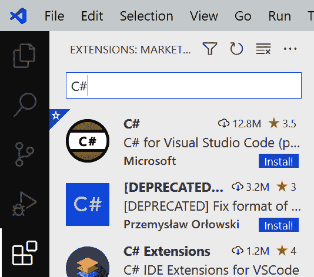
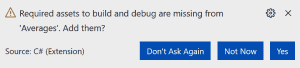
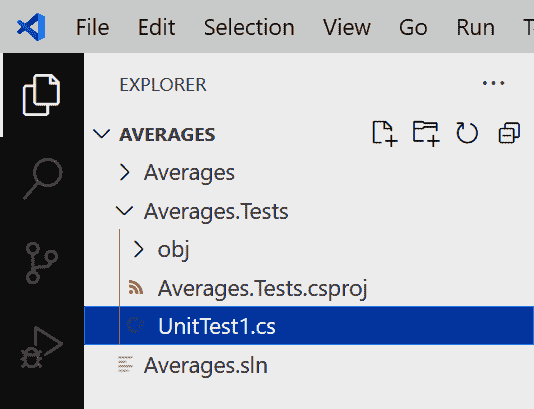
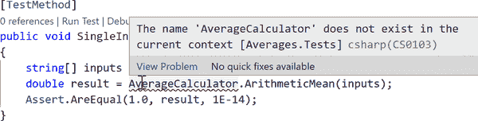
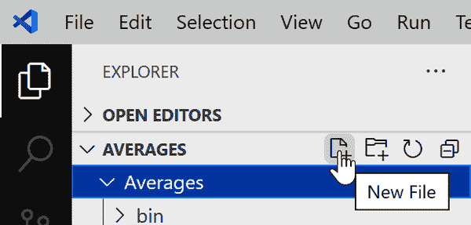

# 第一章：介绍 C#

C# 编程语言（发音为 “see sharp”）用于许多类型的应用程序，包括网站、基于云的系统、物联网设备、机器学习、桌面应用程序、嵌入式控制器、移动应用程序、游戏和命令行实用程序。C# 和相关的运行时、库和工具被称为 .NET，已经在 Windows 开发者中心舞台上超过 20 年。如今，.NET 是跨平台和开源的，使得用 C# 编写的应用程序和服务可以在包括 Android、iOS、macOS 和 Linux 在内的操作系统上运行，以及 Windows。

C# 10.0 的发布及其对应的运行时 .NET 6.0 标志着一个重要的里程碑：C# 成为完全跨平台、开源语言的旅程现已完成。尽管在 C# 的大部分历史中都存在开源实现，但在 2016 年，微软发布了 .NET Core 1.0，这是第一个由微软全面支持在 Linux 和 macOS 以及 Windows 上运行 C# 的平台。最初 .NET Core 的库和工具支持并不完善，因此微软继续发布其较旧的运行时版本，即仅限 Windows 的封闭源 .NET Framework，但六年后，这个旧运行时版本实际上已经退出，¹ 现在跨平台版本全面超越了它。.NET 5.0 删除了其名称中的 “Core”，表明它现在是主要版本，但是在 .NET 6.0 中，跨平台版本才真正到来，因为这个版本享有完整的 *长期支持* (LTS) 状态。首次，这个与平台无关的 C# 和 .NET 版本已经取代了旧的 .NET Framework。

C# 和 .NET 是开源项目，尽管最初并非如此。在 C# 的早期历史中，微软严格保护其所有源代码，但在 2014 年创建了 [.NET Foundation](https://oreil.ly/vYiMY) 来促进 .NET 世界中开源项目的发展。现在，微软许多重要的 C# 和 .NET 项目都在该基金会的管理下（除了许多非微软项目）。这包括 [微软的 C# 编译器](https://github.com/dotnet/roslyn) 和 [.NET 运行时与库](https://github.com/dotnet/runtime)。如今，几乎围绕 C# 的所有内容都是在公开开发的，欢迎外部人员贡献代码。新的语言特性提案在 GitHub 上进行管理，从最早的阶段就能够进行社区参与。

# 为什么选择 C#？

尽管可以使用多种方式使用 C#，其他语言始终是一个选择。为什么你会选择 C#而不是其他语言？这取决于您需要做什么，以及您在编程语言中喜欢和不喜欢的方面。我发现 C#提供了相当大的力量、灵活性和性能，并且以足够高的抽象级别工作，以至于我不会在程序试图解决的问题的细节上花费大量精力。

C#的强大之处在于它支持的多种编程技术。例如，它提供面向对象的特性、泛型和函数式编程。它支持动态和静态类型。由于语言集成查询（LINQ），它提供了强大的列表和集合操作功能。它还具有异步编程的内在支持。此外，支持 C#的各种开发环境都提供了广泛的增强生产力的功能。

C#提供了在开发便捷性与性能之间取得平衡的选项。运行时一直提供垃圾回收器（GC），使开发人员不必过多地处理程序不再使用的内存回收工作。GC 在现代编程语言中是一项常见功能，虽然对大多数程序有益，但在某些特定场景下其性能影响可能成问题，因此 C#支持更显式的内存管理方式，使您可以在不丧失类型安全性的前提下，在开发便捷性与运行时性能之间进行权衡。这使得 C#适用于多年来一直是较不安全语言（如 C 和 C++）所独有的某些对性能要求极高的应用场景。

编程语言并非孤立存在，具备广泛特性的高质量库至关重要。一些优雅而学术美观的语言在处理平凡任务时仍显光辉，例如与数据库交互或确定用户设置存储位置。无论语言提供了多么强大的编程习语，它还需要提供对底层平台服务的完整便捷访问。在这方面，C#表现非常强大，归功于其运行时、内置类库以及广泛的第三方库支持。

.NET 包括 C#程序使用的运行时和主要类库。运行时部分称为*公共语言运行时*（通常缩写为 CLR），因为它不仅支持 C#，还支持任何.NET 语言。例如，Microsoft 还提供 Visual Basic、F#以及 C++的.NET 扩展。CLR 具有*公共类型系统*（CTS），它使来自多种语言的代码可以自由互操作，这意味着.NET 库通常可以从任何.NET 语言中使用——F#可以使用用 C#编写的库，C#可以使用 Visual Basic 库，等等。

在 .NET 中内置了一套庞大的类库集合。多年来，这些类库曾用过几个名称，包括基础类库 (BCL)、框架类库和框架库，但是微软现在似乎已经将 *运行时类库* 定为 .NET 这一部分的名称。这些类库为许多底层操作系统 (OS) 功能提供了包装器，同时它们本身也提供了大量的功能，例如集合类和 JSON 处理等。

.NET 运行时类库并非全部内容——许多其他系统也提供了它们自己的 .NET 类库。例如，有些类库使得 C# 程序可以使用流行的云服务。正如你所预期的那样，Microsoft 提供了全面的 .NET 类库，用于与其 Azure 云平台上的服务进行交互。同样，亚马逊提供了一个功能完备的开发工具包，供使用 C# 和其他 .NET 语言访问 Amazon Web Services (AWS)。并且，类库并不一定要与特定服务相关联。有一个庞大的 .NET 类库生态系统，其中既有商业产品，也有免费产品，包括数学工具、解析类库以及用户界面 (UI) 组件等等。即使你不幸需要使用一个没有任何 .NET 类库包装器的操作系统特性，C# 也提供了各种机制，用于与其他类型的 API 进行交互，例如在 Win32、macOS 和 Linux 上可用的 C 风格 API，或者在 Windows 上基于组件对象模型 (COM) 的 API。

除了类库之外，还有许多应用框架。.NET 内置了用于创建 Web 应用程序和 Web API、桌面应用程序以及移动应用程序的框架。还有针对各种分布式系统开发风格的开源框架，例如高容量事件处理的 [Reaqtor](https://reaqtive.net) 或者全球分布式高可用系统的 [Orleans](https://oreil.ly/kxaEg)。

最后，随着 .NET 已经存在了二十多年，许多组织已经大量投资于基于这一平台构建的技术。因此，C# 往往是获得这些投资回报的自然选择。

总之，使用 C# 我们得到了一组内置的强大抽象，一个强大的运行时，以及轻松访问大量的类库和平台功能。

## 托管代码和 CLR

C# 是第一种旨在成为 CLR 世界中本地语言的语言。这赋予了 C# 独特的感觉。这也意味着，如果你想理解 C#，你需要了解 CLR 及其运行代码的方式。

多年来，编译器处理源代码并生成可由计算机 CPU 直接执行的输出形式，一直是最常见的工作方式。编译器会生成*机器码* ——符合计算机 CPU 所需的二进制格式的一系列指令。许多编译器仍然采用这种方式工作，但 C# 编译器不是这样。它使用一种称为*托管代码*的模型。

在托管代码中，编译器不会生成 CPU 执行的机器码。相反，编译器生成一种称为*中间语言*（IL）的二进制代码形式。可执行二进制通常在运行时生成，虽然不总是如此。使用 IL 使得在传统模型下难以或者甚至不可能提供的功能成为可能。

可能托管模型最明显的好处是，编译器的输出不与单一的 CPU 架构绑定。例如，大多数现代计算机使用的 CPU 支持 32 位和 64 位指令集（分别因历史原因而称为*x86*和*x64*）。在旧模型下将源代码编译成机器语言时，您需要选择要支持的指令集之一，并且在需要目标多个指令集时，需要构建多个版本的组件。但是在 .NET 中，您可以构建一个单一的组件，无需修改即可在 32 位或 64 位进程中运行。同一组件甚至可以在完全不同的架构上运行，例如 ARM（一种广泛用于手机、较新的 Mac 和树莓派等小型设备的处理器架构）。如果使用直接编译为机器码的语言，则需要为每种架构构建不同的二进制文件，或者在某些情况下，可能会构建一个包含多个代码副本的单一文件，每个副本针对每种支持的架构。在 .NET 中，您可以编译一个只包含一个代码版本的单一组件，它可以在任何架构上运行。即使在编译代码时未支持的平台未来提供了合适的运行时，这些组件也可以本地运行，而不依赖于通常用于使旧代码在新处理器上工作的[*Rosetta*](https://oreil.ly/MO6W1)翻译技术。更一般地说，CLR 代码生成的任何改进——无论是对新 CPU 架构的支持还是对现有架构的性能改进——都会立即使所有 .NET 语言受益。例如，早期版本的 CLR 没有利用现代 x86 和 x64 处理器上可用的向量处理扩展，但当前版本通常在生成循环代码时会利用这些扩展。所有运行在当前 .NET 版本上的代码都从中受益，包括在此增强功能添加之前构建的组件。

CLR 生成可执行机器代码的确切时机可能会有所不同。通常情况下，它使用一种称为*即时*（JIT）编译的方法，即每个单独函数的机器代码在第一次运行时生成。但它不一定非得这样工作。运行时实现之一称为 Mono，能够直接解释 IL，而不必将其转换为可运行的机器语言，这在诸如 iOS 这样的平台上非常有用，因为法律约束可能阻止 JIT 编译。.NET 软件开发工具包（SDK）还提供了一个名为*crossgen*的工具，它使你能够在 IL 旁边构建预编译代码。这种*提前编译*（AoT）可以提高应用程序的启动时间。还有一个完全独立的运行时称为.NET Native，它仅支持预编译，并且被用于为通用 Windows 平台（UWP）构建的 Windows Store 应用程序。（请注意，微软已宣布 Windows 专用的.NET Native 运行时可能会被其跨平台后继者 NativeAOT 所取代，逐步淘汰。）

###### 注

即使使用 crossgen 预编译代码，仍然可能在运行时生成可执行代码。CLR 的*分层编译*功能可以选择动态重新编译方法，以优化其在运行时的使用方式，无论您使用 JIT 还是 AoT，它都可以做到这一点。²

托管代码具有普遍存在的类型信息。.NET 运行时需要这些信息存在，因为它启用了某些运行时特性。例如，.NET 提供各种自动序列化服务，可以将对象转换为其状态的二进制或文本表示，并且稍后可以将这些表示再转换回对象，甚至可能在不同的计算机上。这种服务依赖于对象结构的完整和准确描述，在托管代码中是有保证的。类型信息还可以用于其他方面。例如，单元测试框架可以使用它来检查测试项目中的代码，并发现你编写的所有单元测试。这依赖于 CLR 的*反射*服务，这是第十三章的主题。

尽管 C#与运行时的紧密连接是其主要的定义特征之一，但这并不是唯一的特征。C#的设计背后有一定的哲学支持。

## C#更偏向于泛化而不是特化

C#更倾向于通用语言特性而不是专用特性。C#现在已经是其第 10 个主要版本，并且每次发布时，语言的设计者都在设计新功能时考虑了特定的场景。然而，他们始终努力确保每个添加的元素在超出这些主要场景时也是有用的。

例如，几年前，C# 语言设计师决定向 C# 添加功能，使数据库访问与语言紧密集成。由此产生的技术，即语言集成查询（LINQ，详见 第十章），确实支持了这一目标，但他们在不向语言直接添加数据访问支持的情况下实现了这一点。设计团队引入了一系列看似差异很大的能力，包括更好地支持函数式编程习惯用法，能够在不使用继承的情况下向现有类型添加新方法，支持匿名类型，能够获取表示表达式结构的对象模型，并引入了查询语法。其中最后一个与数据访问有明显的关联，但其他的与当前任务的关联则较为困难。尽管如此，这些能力可以集体使用，显著简化某些数据访问任务。这些功能在其自身权威上都很有用，因此除了支持数据访问外，它们还能够支持更广泛的场景。例如，这些添加使得处理列表、集合和其他对象组变得更加容易，因为新功能适用于来自任何来源的事物集合，而不仅仅是数据库。

这种通用性哲学的一个例证是为 C# 原型化但最终设计师们选择不继续推进的语言功能。该功能将允许您直接在源代码中编写 XML，在运行时嵌入表达式以计算特定内容的值。该原型将其编译为在运行时生成完成的 XML 的代码。微软研究部门公开展示了这一功能，但这一特性最终没有进入 C#，尽管它后来在另一种 .NET 语言 Visual Basic 中推出，并为从 XML 文档中提取信息提供了一些专门的查询功能。嵌入式 XML 表达式是一个相对狭窄的功能，只在创建 XML 文档时有用。至于查询 XML 文档，C# 通过其通用的 LINQ 功能支持此功能，而无需任何特定于 XML 的语言功能。自从提出这个语言概念以来，XML 的星光已经逐渐黯淡，在许多情况下已被 JSON 取代（毫无疑问，这些年后将被其他东西所取代）。如果嵌入式 XML 最终进入了 C#，那么现在它可能会感觉像一个略显过时的奇特现象。

在后续版本的 C# 中添加的新功能继续沿着同样的思路发展。例如，跨过去几个版本添加的解构和模式匹配功能旨在以微妙但有用的方式简化生活，并且不限于任何特定的应用领域。

# C# 标准与实现

在我们可以开始编写实际代码之前，我们需要知道我们正在目标化哪个 C# 实现和运行时。Ecma 标准化机构编写了定义 C# 语言和运行时行为的规范（分别是 ECMA-334 和 ECMA-335）。这使得多个 C# 实现和运行时得以出现。目前，广泛使用的有四种：Mono、.NET Native、.NET（之前称为 .NET Core）和 .NET Framework。有些令人困惑的是，微软背后支持了所有这些项目，尽管最初并非如此。

## 许多 .NET 实现

Mono 项目于 2001 年启动，并非起源于微软。（这就是为什么它的名字中没有 .NET，它可以使用 C# 这个名称，因为标准称该语言为 C#，但在 .NET 基金会成立前，.NET 品牌专门由微软使用。）Mono 最初的目标是在 Linux 上支持使用 C# 进行桌面应用程序开发，但后来它增加了对 iOS 和 Android 的支持。这一重要举措帮助 Mono 找到了自己的市场定位，因为它现在主要用于开发跨平台移动设备应用程序的 C#。现在，Mono 还支持目标 WebAssembly（也称为 WASM），并包括一个可以在任何符合标准的 Web 浏览器中运行的 CLR 实现，使得 C# 代码能够在 Web 应用程序的客户端上运行。这通常与一个名为 Blazor 的 .NET 应用程序框架一起使用，Blazor 允许您构建基于 HTML 的用户界面，同时使用 C# 实现行为。Blazor 与 WASM 的组合还使得 C# 成为与 Electron 等使用 Web 客户端技术创建跨平台桌面应用程序的平台合作的一种可行语言。（Blazor 不需要 WASM，它也可以使用正常编译的 C# 代码在 .NET 运行时上运行；这是 .NET 的多平台应用程序用户界面（MAUI）的基础，它使得编写可以在 Android、iOS、macOS 和 Windows 上运行的单一应用程序成为可能。）

Mono 从一开始就是开源的，并且在其存在的整个过程中得到了多家公司的支持。2016 年，微软收购了拥有 Mono 管理权的公司：Xamarin。目前，微软将 Xamarin 作为一个独立的品牌保留下来，并将其定位为编写可在移动设备上运行的跨平台 C#应用程序的方式。Mono 的核心技术已经并入了微软的.NET 运行时代码库。这是多年融合的终点，其中 Mono 逐渐与.NET 共享越来越多的共同点。最初，Mono 提供了自己的一套实现：C#编译器、库和 CLR。但是当微软发布了其自己的开源编译器时，Mono 工具就转移到了那里。Mono 曾经有自己完整的.NET 运行时库实现，但自从微软首次发布开源.NET Core 以来，Mono 越来越依赖于它。如今，Mono 实际上是主要.NET 运行时库中两个 CLR 实现之一，支持移动和 WebAssembly 运行时环境。

其他三种实现是什么情况呢？它们似乎都被称为.NET？其中之一是.NET Native，用于 UWP 应用程序，正如前文所述，这是.NET 的一种专门版本，仅支持 AoT 编译。然而，.NET Native 计划被 NativeAOT 取代，后者将有效地成为.NET 的一个特性，而不是完全独立的实现，因此在实际应用中，我们现在只有两个当前的、非注定失败的版本：.NET Framework（仅限 Windows，闭源）和.NET（跨平台，开源；以前称为.NET Core）。然而，正如前面提到的，微软不打算向仅限 Windows 的.NET Framework 添加任何新功能，因此这使得.NET 6.0 实际上是唯一的当前版本。

.NET 6 的一个主要目标是回归到一个主要的当前版本，这使得它成为一个特别重要的版本。然而，了解其他版本也是有用的，因为你可能会遇到继续在这些版本上运行的实时系统。.NET Framework 继续流行的一个原因是它可以做一些.NET 6.0 无法做到的事情。.NET Framework 仅在 Windows 上运行，而.NET 6.0 支持 Windows、macOS 和 Linux，尽管这使得.NET Framework 的可用性较小，但它可以支持一些 Windows 特定的功能。例如，.NET Framework 类库中有一个部分专门用于与 COM+组件服务一起工作，这是一个用于托管与 Microsoft 事务服务器集成的组件的 Windows 特性。这在新的跨平台.NET 版本上是不可能的，因为代码可能在 Linux 上运行，那里的等效功能要么不存在，要么与通过相同的.NET API 呈现的方式有太大不同。

在过去几个版本中，仅限于.NET Framework 的特性数量已经大幅减少，因为微软一直致力于使即使是仅限 Windows 的应用程序也能使用最新版本的.NET 6.0。例如，`System.Speech` .NET 库过去仅在.NET Framework 上可用，因为它提供对 Windows 特定的语音识别和合成功能的访问，但现在有了.NET 6.0 版本的这个库。该库仅在 Windows 上工作，但其可用性意味着依赖它的应用程序开发人员现在可以自由地从.NET Framework 转移到.NET。未能迁移的剩余.NET Framework 特性是那些使用不足以证明工程投入的特性。COM+支持不仅仅是一个库——它对 CLR 执行代码的方式有影响，因此在现代.NET 中支持它会带来难以接受的成本，这现在已经是一个很少使用的功能了。

跨平台的.NET 是过去几年中大部分.NET 新开发发生的地方。.NET Framework 仍然得到支持，但已经落后了一段时间。例如，微软的 Web 应用程序框架 ASP.NET Core 在 2019 年就停止了对.NET Framework 的支持。因此，.NET Framework 的退役和.NET 6.0 作为唯一真正的.NET 的到来，是一个已经进行了几年的过程的不可避免的结论。

## 发布周期和长期支持

微软目前每年发布一个新版本的.NET，通常在 11 月或 12 月左右发布，但并非所有版本都是平等的。备用版本会得到长期支持（LTS），这意味着微软承诺至少支持该版本三年。在此期间，工具、库和运行时将定期更新以提供安全补丁。.NET 6.0 在 2021 年 11 月发布，是一个 LTS 版本。之前的 LTS 版本是.NET Core 3.1，于 2019 年 12 月发布，因此支持将持续到 2022 年 12 月；再早之前的 LTS 版本是.NET Core 2.1，在 2021 年 8 月停止支持。

那么非 LTS 版本呢？这些版本在发布时得到支持，但在下一个 LTS 版本发布六个月后就会停止支持。例如，.NET 5.0 在 2020 年 12 月发布时得到了支持，但在.NET 6.0 发布后的 2022 年 5 月支持就结束了。当然，微软可以选择延长支持，但为了规划目的，假设非 LTS 版本在大约 18 个月内基本上就无法使用了是明智的。

生态系统通常需要几个月的时间才能跟上新版本的发布。实际上，在发布当天可能还不能使用新版本的 .NET，因为你的云平台提供商可能还不支持，或者可能存在你需要使用的库的不兼容性。这显著缩短了非 LTS 版本的有效使用寿命，并可能导致在下一个 LTS 版本出现时，升级的时间窗口非常狭窄而令人不安。如果工具、平台和依赖的库需要几个月才能与新版本对齐，那么在它退出支持之前，你将有很少的时间可以升级。在极端情况下，这个升级的机会甚至可能不存在：.NET Core 2.2 在 Azure Functions 完全支持 .NET Core 3.0 或 3.1 之前已经到了支持结束的生命周期，因此那些在 Azure Functions 上使用非 LTS .NET Core 2.2 的开发者发现自己处于一个最新支持版本实际上倒退的情况：他们不得不选择要么回退到 .NET Core 2.1，要么在生产中使用不支持的运行时几个月。因此，一些开发者把非 LTS 版本看作预览版本：你可以试验性地针对新功能，预期它们会在 LTS 版本中使用。

## [使用 .NET Standard 针对多个 .NET 版本](https://nuget.org)的目标

长期以来，每个运行时版本的多样性，每个都有其自己不同的运行时库版本，对于希望将其 C# 代码提供给其他开发者的人来说一直是一个挑战。尽管我们最终看到的 .NET 6.0 的收敛可以减少这种问题，但想要继续支持运行在旧 .NET Framework 上的系统将是常见的。这意味着，为了可预见的未来，生产目标多个 .NET 运行时的组件将是有用的。有一个[.NET 组件的包存储库](https://nuget.org)，微软发布所有不属于 .NET 本身的 .NET 库的地方，也是大多数 .NET 开发者发布他们想要分享的库的地方。但是，你应该为哪个版本构建呢？这是一个二维的问题：有运行时实现（.NET、.NET Framework）和版本（例如，.NET Core 3.1 或 .NET 6.0；.NET Framework 4.7.2 或 4.8）。许多通过 NuGet 分发的热门开源软件包的作者支持多个新旧版本。

组件作者过去常常通过构建多个库的变体来支持多个运行时。当通过 NuGet 分发 .NET 库时，你可以在包中嵌入多组二进制文件，每组针对不同的 .NET 变体。然而，其中一个主要问题是，随着多年来出现了新形式的 .NET，现有库可能无法在所有新的运行时上运行。为 .NET Framework 4.0 编写的组件将适用于所有后续版本的 .NET Framework，但不适用于比如说 .NET 6.0。即使组件的源代码与较新的运行时完全兼容，你也需要编译一个针对该平台的单独版本。如果你使用的库的作者没有为 .NET 提供明确的支持，这将阻止你使用它。这对每个人都是不利的。多年来出现了各种版本的 .NET（比如 Silverlight 和几个 Windows Phone 变体），这意味着组件作者发现自己不得不不断推出其组件的新变体，并且因为这依赖于那些作者是否有这样做的意愿和时间，组件的消费者可能会发现并非所有他们想要使用的组件都在他们选择的平台上可用。

为了避免这种情况，微软推出了 .NET Standard，它定义了 .NET 运行时库 API 表面的常见子集。如果一个 NuGet 包的目标是，比如说，.NET Standard 1.0，这就保证它能在 .NET Framework 版本 4.5 或更高版本、.NET Core 1.0 或更高版本、.NET 5.0 及更高版本，或者 Mono 4.6 及更高版本上运行。至关重要的是，如果出现了另一个 .NET 的变种，只要它也支持 .NET Standard 1.0，现有的组件就能够在不需修改的情况下运行，即使在编写这些组件时，那个新平台还不存在。

今天，.NET Standard 2.0 很可能是希望支持广泛平台的组件作者的最佳选择，因为所有最近发布的 .NET 版本都支持它，并且它提供了非常广泛的功能集。然而，微软今天支持的 .NET 变体数量远低于 .NET Standard 首次推出时的水平，因此 .NET Standard 的重要性可能不如过去。如今，将代码目标设置为 .NET Standard 的主要好处是你的代码将在 .NET Framework 以及 .NET Core 和 .NET 上运行。如果你不需要支持 .NET Framework，将代码目标设置为 .NET Core 3.1 或 .NET 6.0 可能更合理。第十二章 详细描述了围绕 .NET Standard 的一些考虑。

微软不仅提供语言和各种运行时及其相关的类库，还提供可以帮助你编写、测试、调试和维护代码的开发环境。

# Visual Studio、Visual Studio Code 和 JetBrains Rider

微软提供了三种桌面开发环境：Visual Studio Code、Visual Studio 和 Visual Studio for Mac。这三款产品都提供了基本功能，如文本编辑器、构建工具和调试器，但是 Visual Studio 为开发 C#应用程序提供了最全面的支持，无论这些应用程序是在 Windows 还是其他平台上运行。Visual Studio 已经存在很长时间——从 C#诞生之时起，因此它来自于开源之前的时代，并继续作为闭源产品存在。各种可用的版本从免费到价格高昂都有。微软并不是唯一的选择：开发者生产力公司 JetBrains 销售一款名为 Rider 的完整的.NET IDE，它能在 Windows、Linux 和 macOS 上运行。

Visual Studio 是一种集成开发环境（IDE），因此采用“一切包含”的方式。除了功能齐全的文本编辑器外，它还提供了用于 UI 可视化编辑的工具。它与 Git 等源代码控制系统以及提供源代码库、问题跟踪和其他应用生命周期管理（ALM）功能的在线系统（例如 GitHub 和 Microsoft 的 Azure DevOps 系统）深度集成。Visual Studio 提供内置的性能监控和诊断工具。它具有多种特性，用于处理开发和部署到 Microsoft 的 Azure 云平台的应用程序。它是这三个 Microsoft 环境中拥有最广泛重构功能集的产品之一。请注意，Visual Studio 仅在 Windows 上运行。

2017 年，微软发布了适用于 Mac 的 Visual Studio。这不是 Windows 版本的简单移植。它起源于一个名为 Xamarin 的平台，这是一个专门用于在 Mac 上构建运行在 Mono 运行时上的 C#移动应用程序的开发环境。Xamarin 最初是一项独立技术，但在微软收购了开发它的公司后，微软将 Windows 版 Visual Studio 的各种功能整合到了这个产品中，并将其纳入 Visual Studio 品牌。

JetBrains Rider IDE 是一款能在三个操作系统上运行的单一产品。它比 Visual Studio 更专注，因为它专门设计用于支持.NET 应用程序开发（Visual Studio 也支持 C++）。它采用了类似的“一切包含”方式，并提供了特别强大的重构工具。

Visual Studio Code（通常缩写为 VS Code）于 2015 年首次发布。它是开源且跨平台的，支持 Linux 以及 Windows 和 Mac 操作系统。它基于 Electron 平台，并主要使用 TypeScript 编写。（这意味着与 Visual Studio 不同，VS Code 在所有操作系统上确实是同一个程序。）VS Code 比 Visual Studio 更加轻量级：基本安装仅支持文本编辑。然而，当您打开文件时，它会发现可下载的扩展程序，如果选择安装，可以为 C＃、F＃、TypeScript、PowerShell、Python 和许多其他语言添加支持。（扩展机制是开放的，因此任何愿意的人都可以发布扩展。）因此，尽管在初始形式上它更像是一个简单的文本编辑器而不是一个集成开发环境（IDE），其可扩展性模型使其非常强大。广泛的扩展程序范围使得 VS Code 在微软语言以外的世界中非常流行，进而促进了扩展程序范围更大的增长的良性循环。

Visual Studio 和 JetBrains Rider 提供了最简单的路径来开始使用 C＃ - 您无需安装任何扩展程序或修改任何配置即可启动并运行。但是，由于 Visual Studio Code 面向更广泛的受众，因此我将在接下来的快速介绍中使用它来进行 C＃的工作。尽管如此，所有环境都适用于相同的基本概念，因此如果您将使用 Visual Studio 或 Rider，则我在这里描述的大部分内容仍然适用。

###### 提示

您可以免费下载[Visual Studio Code](https://oreil.ly/m0vaY)。您还需要[安装.NET SDK](https://oreil.ly/8Ok2Z)。

如果您使用 Windows 并希望使用 Visual Studio，您可以下载免费版本的 Visual Studio，称为[Visual Studio Community](https://oreil.ly/3RUGS)。在安装期间，只要选择至少一个.NET *工作负载*，它将为您安装.NET SDK。

任何非平凡的 C＃项目都将具有多个源代码文件，并且这些文件将属于一个*项目*。每个项目构建一个单一的输出，或称为*目标*。构建目标可能会很简单，比如一个单文件 - 例如，一个 C＃项目可以生成可执行文件或库 - 但某些项目会生成更复杂的输出。例如，某些项目类型会构建网站。网站通常包含多个文件，但总体而言，这些文件代表一个单一的实体：一个网站。每个项目的输出将作为一个单元部署，即使它由多个文件组成。

###### 注意

在 Windows 上，可执行文件通常具有*.exe*文件扩展名，而库使用*.dll*（历史上简称为动态链接库）。然而，使用.NET，所有的代码都放在*.dll*文件中。SDK 还可以生成引导执行文件（在 Windows 上具有*.exe*扩展名），但这只是启动运行时，然后加载包含主要编译输出的*.dll*文件。（如果你的目标是.NET Framework，则稍有不同：它会将应用程序直接编译为自我引导的*.exe*，而不是分开的*.dll*。）无论如何，应用程序的主要编译输出和库的唯一区别在于前者指定了应用程序的入口点。这两种文件类型都可以导出供其他组件消费的功能。这些都是*程序集*的例子，是第十二章的主题。

C#项目文件使用*.csproj*扩展名，如果你使用文本编辑器查看这些文件，你会发现它们包含 XML。*.csproj*文件描述了项目的内容并配置了项目的构建方式。这些文件可以被 Visual Studio 和 VS Code 的.NET 扩展识别。它们也可以被各种命令行构建工具识别，例如.NET SDK 安装的`dotnet`命令行工具，以及微软的旧版 MSBuild 工具。（MSBuild 支持多种语言和目标，不仅仅是.NET。实际上，当你使用.NET SDK 的`dotnet build`命令构建 C#项目时，它实际上是 MSBuild 的一个包装。）

通常情况下，你会希望处理一组项目。例如，为你的代码编写测试是一个良好的实践，但大多数测试代码不需要作为应用程序的一部分部署，因此你通常会将自动化测试放入单独的项目中。你可能也想因其他原因拆分代码。也许你正在构建的系统有一个桌面应用程序和一个网站，而你希望在这两个应用程序中使用相同的通用代码。在这种情况下，你需要一个项目来构建包含通用代码的库，另一个生成桌面应用程序可执行文件，另一个构建网站，以及另外三个项目分别包含每个主项目的测试。

理解.NET 的构建工具和 IDE 帮助你通过所谓的*解决方案*来处理多个相关项目。解决方案是一个带有*.sln*扩展名的文件，定义了一组项目。尽管解决方案中的项目通常是相关的，但它们不一定非要相关。

如果你正在使用 Visual Studio，请注意，即使只有一个项目，它也要求项目属于一个解决方案。Visual Studio Code 可以愉快地打开单个项目，但其.NET 扩展也可以识别解决方案。

一个项目可以属于多个解决方案。在一个大型代码库中，通常会有多个带有不同项目组合的*.sln*文件。你通常会有一个包含每个项目的主解决方案，但并非所有开发人员都希望一直处理所有代码。在我们的假设示例中，处理桌面应用程序的人还会想要共享库，但可能对加载 Web 项目不感兴趣。

我将展示如何创建一个新项目，在 Visual Studio Code 中打开它并运行它。然后我将逐步介绍一个新的 C#项目的各种特性，作为语言介绍的一部分。我还会展示如何添加一个单元测试项目，以及如何创建一个包含两者的解决方案。

# 简单程序的解剖

一旦你安装了.NET 6.0 SDK，可以直接安装或者通过安装一个 IDE 来创建一个新的.NET 程序。首先在计算机上创建一个名为*HelloWorld*的新目录来保存代码。打开命令提示符，并确保当前目录设置为该目录，然后运行以下命令：

```cs
dotnet new console
```

这通过创建两个文件创建了一个新的 C#控制台应用程序。它创建一个基于父目录命名的项目文件：在这种情况下是*HelloWorld.csproj*。还会有一个包含代码的*Program.cs*文件。如果你在文本编辑器中打开这个文件，你会看到它非常简单，正如示例 1-1 所示。

##### 示例 1-1\. 我们的第一个程序

```cs
// See https://aka.ms/new-console-template for more information
Console.WriteLine("Hello, World!");

```

你可以使用以下命令编译并运行此程序：

```cs
dotnet run
```

正如你可能已经猜到的那样，这将显示文本`Hello, World!`作为输出。

如果你已经有一些 C#经验，并且正在阅读本书以了解 C# 10.0 中的新内容，这个例子可能会让你感到惊讶。在语言的早期版本中，所有编程书籍必须以经典的“Hello, World!”示例开头，而它要大得多。这看起来如此不同，以至于.NET SDK 的作者们认为有必要提供一个解释——这个例子的一半以上只是一个带有链接到网页的注释，解释其余代码的位置。这里的第二行就是你所需的全部内容。

这展示了 C# 10.0 引入的变化之一：它旨在通过减少*样板代码*的数量使应用程序直奔主题。样板代码是指需要存在以满足某些规则或约定的代码，但在任何项目中看起来多少都是一样的。例如，C#要求代码在*方法*内定义，而方法必须始终在*类型*内定义。你可以在示例 1-1 中看到这些规则的证据。为了产生输出，它依赖于.NET 运行时显示文本的能力，这体现在一个名为`WriteLine`的方法中。但我们不只是说`WriteLine`，因为 C#方法总是属于类型，这就是为什么代码将其标记为`Console.WriteLine`的原因。

当然，我们编写的任何 C# 代码都受到规则的约束，因此我们调用`Console.WriteLine`方法的代码本身必须存在于一个类型内的方法中。在大多数 C# 代码中，这是显式的：在大多数情况下，您将看到类似示例 1-2 的代码。

##### 示例 1-2\. 可见样板的“Hello, World!”

```cs
using System;

internal class Program
{
    private static void Main(string[] args)
    {
        Console.WriteLine("Hello, World!");
    }
}
```

在这里仍然只有一行定义应用程序行为的代码，与示例 1-1 中相同。第一个示例的明显优势在于它让我们集中精力在程序实际做什么上，尽管缺点是很多东西都会变得看不见。在示例 1-2 中采用显式风格，没有任何隐藏。在示例 1-1 中，编译器仍然会将代码放在一个名为`Program`的类型内定义的方法中；只是从代码中看不出来而已。在示例 1-2 中，方法和类型都是清晰可见的。

实际上，大多数 C# 代码看起来更像示例 1-2 而不是示例 1-1，因为 C# 10.0 的大部分样板减少措施只是为了程序入口点。当您编写希望在程序启动时执行的代码时，您不需要定义一个包含类或方法。但是一个程序只有一个入口点，对于其他所有内容，您仍然需要详细说明。

由于实际项目涉及多个文件，通常还涉及多个项目，让我们进入一个稍微现实的例子。我将创建一个计算一些数字平均值（确切地说是算术平均值）的程序。我还将创建第二个项目来自动测试我们的第一个项目。由于我有两个项目，这次我将需要一个解决方案。我将创建一个名为*Averages*的新目录。如果您在跟着做，无论放在哪里都没有关系，尽管最好不要将其放在第一个项目的目录内。我将在该目录中打开命令提示符并运行以下命令：

```cs
dotnet new sln
```

这将创建一个名为*Averages.sln*的新解决方案文件。（默认情况下，`dotnet new`通常根据其包含目录的名称命名新项目和解决方案，尽管您可以指定其他名称。）现在我将使用以下两个命令添加我需要的两个项目：

```cs
dotnet new console -o Averages
dotnet new mstest -o Averages.Tests
```

这里的`-o`选项（缩写为`output`）表示我希望每个新项目都在新的子目录中创建——当您有多个项目时，每个项目都需要其自己的目录。

现在我需要将它们添加到解决方案中：

```cs
dotnet sln add ./Averages/Averages.csproj
dotnet sln add ./Averages.Tests/Averages.Tests.csproj
```

我将使用第二个项目来定义一些测试，检查第一个项目中的代码（这就是为什么我指定了`mstest`项目类型——这个项目将使用微软的单元测试框架）。为了使其工作，第二个项目将需要访问第一个项目中的代码。为了实现这一点，我运行以下命令：

```cs
dotnet add ./Averages.Tests/Averages.Tests.csproj reference
./Averages/Averages.csproj
```

(我把它分成两行以便适应，但需要作为单个命令运行。) 最后，为了编辑项目，我可以使用以下命令在当前目录中启动 VS Code：

```cs
code .
```

如果你在跟着做，并且这是你第一次运行 VS Code，它会要求你做一些决策，比如选择一个配色方案。你可能会忽略它的问题，但此时它提供的其中一个选项是安装语言支持的扩展。人们使用 VS Code 来处理各种语言，安装程序不会假设你将使用哪种语言，所以你必须安装一个扩展来获取 C# 支持。但是如果你按照 VS Code 的指示浏览语言扩展，它会提供微软的 C# 扩展。如果 VS Code 没有提供这样做，请不要惊慌。也许你已经安装了它，所以它不再询问这些入门问题，或者自从我写这篇文章以来，Code 的首次运行行为发生了变化。你仍然可以非常容易地找到这个扩展。点击左侧栏上的 Extensions 图标，它将显示一组它认为可能相关的扩展。如果你在一个包含 *.csproj* 文件的目录中打开了 VS Code，这将包括 C# 扩展。如果其他方法都失败了，你可以搜索你需要的扩展。图 1-1 显示了 VS Code 的扩展面板——你可以通过点击左侧栏上的图标进入这个面板。这里底部显示的是四个方块的那一个。



###### 图 1-1\. Visual Studio Code 的 C# 扩展

正如你所见，我在顶部的搜索框中输入了*C#*，这里的第一个结果是微软的 C#扩展。还有几个其他结果也显示出来。如果你在跟着做，请确保选择正确的结果。如果你点击搜索结果，它将显示更详细的信息，其中应该显示其全名为“C# for Visual Studio Code (powered by OmniSharp)”，并且显示“Microsoft”作为发布者。点击安装按钮来安装这个扩展。

安装 C# 扩展可能需要几分钟时间，但一旦完成，窗口左下角的状态栏应该类似于 图 1-2，显示解决方案文件的名称和一个火焰图标，表示 OmniSharp 已准备好，这是在 VS Code 中提供 C# 支持的系统。可能会在窗口顶部出现一个项目选择器——C# 扩展已扫描解决方案目录并找到两个 C# 项目及其所在的解决方案。通常它会直接打开解决方案文件，但根据你的系统配置，它可能会询问你想使用哪个。我将在解决方案的两个项目中进行工作，所以我将选择 *Averages.sln* 条目。


###### Figure 1-2\. Visual Studio Code 状态栏

现在 C# 扩展将检查解决方案中所有项目的所有源代码。显然，这些项目中目前没有太多内容，但随着我输入代码，它将继续分析，帮助我识别问题并提出建议。在此过程中，它会注意到尚未为项目配置构建和调试设置。如 Figure 1-3 所示，它会在窗口右下角显示一个对话框，提供添加这些设置的选项。建议点击“是”按钮，并在询问你要启动哪个项目时选择主程序 *Averages.csproj*，以便 VS Code 在运行或调试代码时知道要使用哪一个。



###### Figure 1-3\. C# 扩展提供添加构建和调试资产的选项

我可以通过切换到资源管理器视图来查看代码，方法是点击左侧工具栏顶部的按钮。正如 Figure 1-4 所示，它显示目录和文件。我已展开 *Averages.Test* 目录并选择了其 *UnitTest1.cs* 文件。



###### Figure 1-4\. Visual Studio Code 的资源管理器

###### 小贴士

如果你在资源管理器面板中单击文件，VS Code 将在*预览标签*中显示它，这意味着它不会长时间保持打开状态：一旦你单击其他文件，它就会被替换。这样设计是为了避免打开数百个标签页，但如果你需要频繁在两个文件之间切换，这可能有些烦人。你可以通过双击文件来避免这种情况，这样会打开一个非预览标签，直到你有意关闭它为止。另外，如果你已经在预览标签中打开了一个文件，你可以双击标签将其转换为普通标签。VS Code 在预览标签中以斜体显示文件名，当你双击时，它将变为非斜体。

你可能会想知道为什么我展开了 *Averages.Tests* 目录。这个测试项目的目的是确保主项目的功能正常。我偏好在编写代码之前编写测试的开发风格，因此我会从测试项目开始。

## 编写单元测试

当我之前运行命令创建这个项目时，我指定了一个`mstest`项目类型。这个项目模板为我提供了一个测试类来启动我的工作，在一个名为*UnitTest1.cs*的文件中。我想选择一个更具信息性的名称。有多种关于如何组织单元测试的思路。一些开发人员主张为每个要测试的类编写一个测试类，但我喜欢的风格是为您想要测试特定类的每个*场景*编写一个类，并为该场景中您的代码应该正确的每个事物编写一个方法。此程序只有一种行为：计算其输入的算术平均值。因此，我将*UnitTest1.cs*源文件重命名为*WhenCalculatingAverages.cs*。（您可以通过右键单击 VS Code 的 Explorer 面板中的文件，并选择 Rename 条目来重命名文件。）此测试应验证我们对几个代表性输入得到了预期结果。示例 1-3 展示了一个完成此任务的完整源文件；这里有两个测试，用粗体显示。

##### 示例 1-3\. 我们第一个程序的单元测试类

```cs
using Microsoft.VisualStudio.TestTools.UnitTesting;

namespace Averages.Tests;
 [TestClass]
public class WhenCalculatingAverages
{
    `[TestMethod]`
    `public` `void` `SingleInputShouldProduceSameValueAsResult``(``)`
    `{`
        `string``[``]` `inputs` `=` `{` `"1"` `}``;`
        `double` `result` `=` `AverageCalculator``.``ArithmeticMean``(``inputs``)``;`
        `Assert``.``AreEqual``(``1.0``,` `result``,` `1E-14``)``;`
    `}`
 `[TestMethod]`
    `public` `void` `MultipleInputsShouldProduceAverageAsResult``(``)`
    `{`
        `string``[``]` `inputs` `=` `{` `"1"``,` `"2"``,` `"3"` `}``;`
        `double` `result` `=` `AverageCalculator``.``ArithmeticMean``(``inputs``)``;`
        `Assert``.``AreEqual``(``2.0``,` `result``,` `1E-14``)``;`
    `}`
}

```

一旦展示了程序本身，我将解释该文件中的每个特性。目前，这个示例中最有趣的部分是两个方法。首先是`SingleInputShouldProduceSameValueAsResult`方法，它检查我们的程序是否正确处理只有一个输入的情况。此方法内的第一行描述了输入——一个数字。（有点令人惊讶的是，这个测试将数字表示为字符串。这是因为我们的输入最终将作为命令行参数，所以我们的测试需要反映这一点。）第二行执行了待测试的代码（实际上我还没有写）。第三行说明计算出的平均值应该等于唯一的输入。如果不是，则此测试将报告失败。第二个方法`MultipleInputsShouldProduceAverageAsResult`检查了稍微复杂一些的情况，其中有三个输入，但基本形状与第一个相同。

###### 注意

这里我们使用了 C#的`double`类型，即双精度浮点数，以便能够处理不是整数的结果。在下一章中，我将更详细地描述 C#的内置数据类型，但要注意，与大多数编程语言一样，C#中的浮点运算精度有限。我在这里使用的`Assert.AreEqual`方法考虑到了这一点，并允许我指定最大的误差容限。每种情况下的最后一个参数`1E-14`表示数字 1 除以 10 的 14 次方，因此这些测试表明结果需要正确到小数点后 14 位。

让我们关注这些测试中的一个特定行：运行我想测试的代码的那一行。示例 1-4 显示了从 示例 1-3 中相关的行。这是在 C# 中调用返回结果的方法。这行代码首先声明一个变量来保存结果（`double` 表示数据类型，`result` 是变量的名称）。所有的 C# 方法都需要在一个类型内定义，就像我们之前在 `Console.WriteLine` 示例中看到的一样，在这里也是相同的形式：类型名称，然后是一个句点，然后是方法名称。然后在括号内是方法的输入。

##### 示例 1-4\. 调用一个方法

```cs
double result = AverageCalculator.ArithmeticMean(inputs);
```

如果你正在阅读时同时输入代码，首先：做得好。但是第二，如果你查看这行代码出现的两个地方（每个测试方法中一次），你可能会注意到 VS Code 在 `AverageCalculator` 下面画了一条波浪线。将鼠标悬停在这种波浪线上会显示一个错误消息，就像 图 1-5 所示的那样。



###### 图 1-5\. 一个未识别的类型

这告诉我们一些我们已经知道的事情：我还没有编写这个测试的代码。让我们解决这个问题。我需要添加一个新文件，在 VS Code 的资源管理器视图中，通过点击 *Averages* 目录，然后在选择了它之后，点击资源管理器顶部附近的最左侧按钮。当你将鼠标悬停在此按钮上时，会显示一个工具提示确认其用途。点击后，我可以输入 *AverageCalculator.cs* 作为新文件的名称。



###### 图 1-6\. 添加一个新文件

VS Code 将创建一个新的空文件。我将添加尽可能少的代码来修复 图 1-5 中报告的错误。示例 1-5 将满足 C# 编译器。它还不完整——它还没有执行必要的计算，但我们会解决这个问题。

##### 示例 1-5\. 一个简单的类

```cs
namespace Averages;

public static class AverageCalculator
{
    public static double ArithmeticMean(string[] args)
    {
        return 1.0;
    }
}
```

由于现在代码可以编译，我可以用以下命令运行测试：

```cs
dotnet test
```

这将产生以下输出：

```cs
  Failed MultipleInputsShouldProduceAverageAsResult [291 ms]
  Error Message:
   Assert.AreEqual failed. Expected a difference no greater than <1E-14>
 between expected value <2> and actual value <1>.
  Stack Trace:
     at Averages.Tests.WhenCalculatingAverages.
MultipleInputsShouldProduceAverageAsResult() in
C:\book\Averages\Averages.Tests\WhenCalculatingAverages.cs:line 21

Failed!  - Failed:     1, Passed:     1, Skipped:     0, Total:     2,
Duration: 364 ms - Averages.Tests.dll (net6.0)
```

正如预期的那样，由于我还没有编写一个合适的实现，我们会得到失败的结果。但首先，我想逐个解释 示例 1-5 的每个元素，因为它对 C# 语法和结构的一些重要元素提供了一个有用的介绍。这个文件的第一件事就是一个 *命名空间声明*。

## 命名空间

命名空间为本应混乱不堪的事物带来了秩序和结构。.NET 运行时库包含大量类型，还有许多第三方库中的类型，更不用说你自己编写的类了。在处理这么多命名实体时会出现两个问题。首先，保证唯一性变得困难。其次，在未经组织的数万个事物中找到你需要的 API 可能会变得具有挑战性；除非你知道或能猜出正确的名称，否则很难找到所需的内容。命名空间解决了这两个问题。

大多数.NET 类型都定义在一个命名空间中。关于命名空间有一些约定，你会经常看到。例如，.NET 运行时库中的类型在以`System`开头的命名空间中。此外，微软提供了许多有用的库，虽然它们不是.NET 核心的一部分，但通常以`Microsoft`开头；或者，如果仅用于某些特定技术，它们可能以此命名。例如，有一些用于使用微软 Azure 云平台的库，它们在以`Azure`开头的命名空间中定义类型。来自其他供应商的库通常以公司名称或产品名称开头，而开源库通常使用其项目名称。你不必把自己的类型放入命名空间中，但建议这样做。C#并不把`System`作为特殊的命名空间，所以没有什么能阻止你将其用于自己的类型，但除非你正在编写将作为拉取请求提交给[.NET 运行时源代码库](https://github.com/dotnet/runtime)的.NET 运行时库贡献，否则这是一个坏主意，因为它会导致其他开发者混淆。你应该为自己的代码选择更具有特色的名称，比如你的公司或项目名称。正如你可以从示例 1-5 的第一行看到的那样，我选择在名为`Averages`的命名空间中定义我们的`AverageCalculator`类，与我们的项目名称相匹配。

在 示例 1-5 中展示的命名空间声明风格是 C# 10.0 的新特性。如今，你可能会遇到的大多数代码都采用稍显冗长的旧式风格，如 示例 1-6 所示。两者的区别在于命名空间声明后跟着大括号 (`{}`)，其作用仅限于大括号内的内容。这使得单个文件可以包含多个命名空间声明。但实际上，绝大多数 C# 文件只包含一个命名空间声明。在旧语法中，这意味着每个文件的绝大部分内容必须位于一对大括号内，缩进一个制表符。而 示例 1-5 中展示的新风格适用于文件中声明的所有类型，无需显式包裹。这是 C# 10.0 旨在减少源文件中无效冗余的一部分。

##### 示例 1-6\. C# 10.0 之前的命名空间声明

```cs
namespace Averages
{
    public static class AverageCalculator
    {
        ...as before...
    }
}
```

命名空间通常提示类型的用途。例如，所有与文件处理相关的运行库类型都可以在 `System.IO` 命名空间中找到，而与网络相关的则位于 `System.Net` 下。命名空间可以形成层次结构。因此，框架的 `System` 命名空间包含类型以及其他命名空间，如 `System.Net`，而这些通常还包含更多的命名空间，如 `System.Net.Sockets` 和 `System.Net.Mail`。这些示例显示，命名空间充当一种描述，有助于你浏览库。例如，如果你在寻找正则表达式处理功能，你可能会浏览可用的命名空间，并注意到 `System.Text` 命名空间。在那里查找，你会找到一个 `System.Text.RegularExpressions` 命名空间，这时你会相当有信心你找对了地方。

命名空间还提供了确保唯一性的一种方式。类型定义所在的命名空间是其完整名称的一部分。这使得库可以为事物使用短小的简单名称。例如，正则表达式 API 包含一个 `Capture` 类，用于表示正则表达式捕获的结果。如果你正在开发处理图像的软件，术语 *capture* 通常用于表示获取某些图像数据，你可能认为在你自己的代码中 `Capture` 是描述最为准确的类名。如果你的图像获取代码根本不使用正则表达式，意味着你根本没有打算使用现有的 `Capture` 类型，那么因为最佳名称已经被使用而不得不选择其他名称会很令人恼火。

但事实上，这样也没问题。这两种类型都可以称为`Capture`，它们仍然会有不同的名称。正则表达式`Capture`类的完整名称实际上是`System.Text.RegularExpressions.Capture`，同样地，您类的完整名称将包括其所在的命名空间（例如，`Spi⁠ffi⁠ngS⁠oft⁠wor⁠ks.​Ima⁠gin⁠g.Ca⁠ptu⁠re`）。

如果确实希望，您可以每次使用类型时都写出完全限定的名称，但大多数开发人员不想做这样单调乏味的事情，这就是我们在示例 1-2 和 1-3 开头看到的`using`指令的用处。在每个源文件的顶部看到一列指令是很常见的，它声明了该文件意图使用的类型的命名空间。在此示例中，`dotnet`命令行工具在创建测试项目时添加了`using Microsoft.VisualStudio.TestTools.UnitTesting;`。您会在不同的上下文中看到不同的集合。例如，如果添加一个代表 UI 元素的类，Visual Studio 会在列表中包含各种与 UI 相关的命名空间。

针对 C# 10.0 或更高版本的项目通常比您在为旧版本编写的项目中看到的`using`指令要少，这是因为有了一个新的语言特性：*全局 using 指令*。如果我们在指令前加上`global`关键字，如示例 1-7 所示，该指令适用于项目中的所有文件。然后，.NET SDK 进一步采取了措施，在您的项目中生成了一个隐藏文件，并使用一组这些`global using`指令来确保常用的命名空间，例如`System`和`System.Collections.Generic`可用。（隐式全局导入的确切命名空间集合因项目类型而异——例如，Web 项目会额外获取几个。如果您想知道为什么单元测试项目不会像示例 1-7 那样自动进行全局 using 指令，原因是.NET SDK 没有针对测试项目的特定项目类型——它认为它们只是一种类库。）

##### 示例 1-7\. 全局`using`指令

```cs
global using Microsoft.VisualStudio.TestTools.UnitTesting;
```

使用这样的`using`声明（可以是每个文件或全局），您可以仅使用类的简短、未限定的名称。使得示例 1-1 中的代码行能够发挥作用的代码行使用了`System.Console`类，但由于 SDK 为`System`命名空间添加了一个隐式的`global using`指令，因此它可以简称为`Console`。

###### 注意

之前，我使用`dotnet` CLI 从我们的`Averages.Tests`项目向我们的`Averages`项目添加了一个引用。你可能会认为引用是多余的 — 编译器不能从命名空间中推断出我们正在使用的外部库吗？如果命名空间与库或包直接对应，那么它可能可以，但实际上并非如此。有时候会有表面上的关联 — 流行的`Newtonsoft.Json` NuGet 包含一个*Newtonsoft.Json.dll*文件，其中包含`Newtonsoft.Json`命名空间的类，例如。但通常情况下并没有这样的对应关系 — .NET 运行时库包括一个*Sys⁠tem.​Pri⁠vat⁠e.C⁠ore⁠Lib⁠.dll*文件，但却没有`System.Private.CoreLib`命名空间。因此，有必要告诉编译器你的项目依赖哪些库，以及使用了哪些命名空间。我们将在第十二章中更详细地讨论库文件的性质和结构。

即使使用了命名空间，仍然存在潜在的歧义。单个源文件可能使用两个命名空间，这两个命名空间恰好都定义了同名的类。如果要使用这个类，就需要显式地引用它的完整名称。如果在文件中经常需要使用这些类，你仍然可以节省些打字：只需使用完整名称一次，因为你可以定义一个别名。示例 1-8 使用别名来解决我遇到过几次的冲突：.NET 的桌面 UI 框架，Windows Presentation Foundation（WPF），定义了一个用于处理贝塞尔曲线、多边形和其他形状的`Path`类，但也有一个用于处理文件系统路径的`Path`类，你可能想要同时使用这两种类型来生成文件内容的图形表示。如果不加任何`using`指令直接使用这两个命名空间，简单名称`Path`会存在歧义。但正如示例 1-8 所示，你可以为每个类定义不同的别名。

##### 示例 1-8\. 使用别名消除歧义

```cs
using System.IO;
using System.Windows.Shapes;
`using` `IoPath` `=` `System``.``IO``.``Path``;`
`using` `WpfPath` `=` `System``.``Windows``.``Shapes``.``Path``;`

```

有了这些别名，你可以使用`IoPath`作为文件相关的`Path`类的同义词，而使用`WpfPath`作为图形化类的同义词。

顺便说一句，你可以在自己的命名空间中引用类型而无需限定符，也不需要`using`指令。这就是为什么示例 1-3 中的测试代码没有`using Averages;`指令的原因。不过，也许你会想知道这是如何工作的，因为测试代码声明了一个不同的命名空间`Averages.Tests`。要理解这一点，我们需要看看命名空间的嵌套。

### 嵌套命名空间

正如你已经看到的，.NET 运行时库会对其命名空间进行嵌套，有时候相当深入，你也经常会想要做同样的事情。你可以通过两种方式来实现这一点。你可以像示例 1-9 所示那样嵌套命名空间声明。

##### 示例 1-9\. 嵌套命名空间声明

```cs
namespace MyApp
{
    namespace Storage
    {
        ...
    }
}
```

或者，您可以在单个声明中指定完整的命名空间，正如 示例 1-10 所示。这是更常用的风格。这种单一声明样式适用于新的 C# 10.0 样式声明或使用大括号的旧样式。

##### 示例 1-10\. 单个声明的嵌套命名空间

```cs
namespace MyApp.Storage;
```

任何您在嵌套命名空间中编写的代码都可以使用不仅来自该命名空间的类型，还可以使用其包含命名空间的类型而无需限定符。示例 1-9 或 1-10 中的代码不需要显式限定或 `using` 指令来使用 `MyApp.Storage` 命名空间或 `MyApp` 命名空间中的类型。这就是为什么在 示例 1-3 中，我不需要添加 `using Averages;` 指令来访问 `Averages` 命名空间中的 `AverageCalculator`：测试被声明在 `Averages.Tests` 命名空间中，因此自动具有对该外部命名空间的访问权限。

当您定义嵌套命名空间时，惯例是创建匹配的目录层次结构。一些工具期望如此。虽然 VS Code 目前在此方面没有特别的期望，但 Visual Studio 遵循此惯例。如果您的项目叫做 `MyApp`，那么当您向项目中添加新类时，它们将放在 `MyApp` 命名空间中。但如果您在项目中创建一个名为 *Storage* 的新目录，Visual Studio 将把您创建的任何新类放入 `MyApp.Storage` 命名空间中。再次强调，您并不需要保持这一点 —— Visual Studio 在创建文件时只是添加一个命名空间声明，您可以自由更改它。编译器不需要命名空间与目录层次结构匹配。但由于许多工具（包括 Visual Studio）支持这种约定，如果您遵循这种约定，生活会更轻松。

## 类

在命名空间声明之后，我们的 *AverageCalculator.cs* 文件定义了一个 *class*。 示例 1-11 展示了文件的这一部分。它以 `public` 关键字开始，这使得该类可以被其他组件访问。接下来是 `static` 关键字，表明此类不应该被实例化 —— 它仅提供类级别的操作而没有每个实例的特性。然后是 `class` 关键字，后跟名称，当然，该类型的完整名称实际上是 `Averages.AverageCalculator`，因为有了命名空间声明。正如您所见，C# 使用大括号（{}）来界定各种内容 —— 我们已经在旧的（但仍广泛使用的）命名空间声明语法中看到了这一点，这里您可以看到类似的情况，还有它包含的方法。

##### 示例 1-11\. 带有方法的类

```cs
public static class AverageCalculator
{
    public static double ArithmeticMean(string[] args)
    {
        return 1.0;
    }
}
```

类是 C#中定义结合状态和行为实体的机制，这是一种常见的面向对象习语。但这个类只包含一个方法。C#不支持全局方法——所有代码都必须作为某种类型的成员编写。因此，这个特定的类并不是很有趣——它的唯一作用是作为执行实际工作的方法的容器。在第三章中，我们将看到一些更有趣的类的用法。

与类一样，我将方法标记为`public`，以便从其他组件访问。我还声明了这是一个*静态方法*，这意味着不需要创建包含类型（在本例中为`AverageCalculator`）的实例即可调用该方法。后面跟随的`double`关键字表示此方法返回的数据类型是双精度浮点数。

方法声明后跟着方法体，例如本例中包含返回占位值的代码，因此剩下的工作就是修改方法体边界括号内的代码。示例 1-12 展示了计算平均值的代码，而不仅仅返回 1.0。

##### 示例 1-12\. 计算平均值

```cs
return args.Select(numText => double.Parse(numText)).Average();
```

这依赖于处理集合的库函数，这些函数是作为 LINQ 功能集的一部分，即语言集成查询的一部分。这是第十章的主题。但是，简单描述一下这里发生的情况，`Select`方法允许我们对集合中的每个项应用操作，在这种情况下，我应用的操作是`double.Parse`方法，它是一个.NET 运行时库函数，用于将包含数字的文本字符串转换为本机双精度浮点类型。然后我们通过`Average`方法将这些转换后的结果推送，该方法为我们执行计算。

设置好这些之后，如果再次运行`dotnet test`，它将报告所有测试都已通过。因此，显然代码是有效的。但是，如果我试图通过运行程序来非正式验证它，我会遇到一个问题，我可以用这个命令来执行：

```cs
./Averages/bin/Debug/net6.0/Averages 1 2 3 4 5
```

这只是将`Hello, World!`输出到屏幕上。我已经编写并测试了执行所需计算的代码，但尚未将其连接到程序的入口点。程序启动时运行的代码位于*Program.cs*中，尽管该文件名并不特殊。程序入口点可以位于任何文件中。在较早版本的 C#中，您通过定义一个名为`Main`的`static`方法来表示入口点，就像示例 1-2 所示。但从 C# 10.0 开始，您可以添加一个包含可执行语句的文件，而无需显式将它们放在类型的方法中，C#编译器将其视为入口点。（您只允许在项目中有一个以这种方式编写的文件，因为程序只能有一个入口点。）如果我用示例 1-13 中显示的代码替换*Program.cs*的整个内容，它将产生预期的效果。

##### 示例 1-13\. 带参数的程序入口点

```cs
using Averages;

Console.WriteLine(AverageCalculator.ArithmeticMean(args));
```

请注意，当您使用 C# 10.0 的新简化程序入口点语法时，该文件中的代码默认不属于任何命名空间，因此我需要声明我想要使用在`Averages`命名空间中定义的类。之后，这段代码调用我之前编写的方法，并将`args`作为参数传递，然后调用`Console.WriteLine`来显示结果。当您使用这种程序入口点样式时，`args`是一个特殊名称——它实际上是一个隐式定义的本地变量，提供对命令行参数的访问。这将是一个字符串数组，每个参数对应一个条目。如果您希望再次使用相同的参数运行程序，请先运行`dotnet build`命令重新构建它。

###### 提示

一些 C 家族语言将程序本身的文件名作为第一个参数包含在内，因为它是用户在命令提示符下键入的一部分。C#不遵循这种约定。如果程序在没有参数的情况下启动，数组的长度将为 0。您可能已经注意到，该代码在这种情况下处理得不好。请随意添加一个定义相关行为的新测试场景，并修改程序以匹配。

## 单元测试

现在程序已经运行正常，我想回到测试，因为它们展示了一些主程序中没有的 C#特性。如果你回顾一下示例 1-3，它从一个相当普通的方式开始：我们有一个`using`指令，然后是一个命名空间声明，这次是为`Averages.Tests`，与测试项目名称匹配。但这个类看起来有些不同。示例 1-14 展示了示例 1-3 中相关的部分。

##### Example 1-14\. 具有属性的测试类

```cs
[TestClass]
public class WhenCalculatingAverages
{
```

在类声明之前的文本是 `[TestClass]`。这是一个 *属性*。属性是你可以应用于类、方法和代码的其他特性的注解。它们中的大多数本身什么都不做——编译器只会在编译输出中记录属性的存在。属性只有在某些情况下才有用，因此它们倾向于被框架使用。在这种情况下，我使用的是微软的单元测试框架，它会寻找带有 `TestClass` 属性的类。它会忽略没有此注解的类。属性通常特定于特定的框架，你也可以定义自己的属性，正如我们将在 第十四章 中看到的。

类中的两个方法也标有属性。示例 1-15 展示了来自 示例 1-3 的相关摘录。测试运行器将执行任何标记有 `[TestMethod]` 属性的方法。

##### 示例 1-15\. 标记方法

```cs
[TestMethod]
public void SingleInputShouldProduceSameValueAsResult()
...

[TestMethod]
public void MultipleInputsShouldProduceAverageAsResult()
...
```

我们已经检查了程序的每个元素以及验证其正常工作的测试项目。

# 摘要

现在你已经看到了 C# 程序的基本结构。我创建了一个包含两个项目的解决方案，一个用于测试，一个用于程序本身。这是一个简单的例子，因此每个项目只有一个或两个感兴趣的源文件。必要时，这些文件以 `using` 指令开头，指示文件使用的类型。程序的入口点使用了 C# 10.0 的新精简样式，但另外两个项目使用了更传统的结构，包含一个声明命名空间的命名空间声明，以及包含一个或多个方法或其他成员（如字段）的类。

我们将在 第三章 中更详细地讨论类型及其成员，但首先，第二章 将处理位于方法内部的代码，其中我们表达了我们的程序想要做什么。

¹ 旧的 .NET Framework 将继续得到支持很多年，但微软已经表示它将不会获得任何新功能。

² .NET Native 和 NativeAOT 并不这样做：它们专为避免任何运行时 JIT 而设计，因此它们不提供分层编译。

³ 如果你想知道这些版本号和日期如何与年度交替发布相符，当前的时间表是从 .NET Core 3.1 开始介绍的，没有 .NET Core 4。当 .NET Core 被重新命名为纯粹的 .NET 时，它从 3.1 跳到了 5.0，以强调这一点是从 .NET Framework 转移，其最新版本为 4.8。

⁴ 或者 .NET Core。这里的名称变更可能会引起混淆。支持 .NET Core 3.1 的组件将在 .NET 5.0 和 .NET 6.0 上运行，因为它们是同一运行时的更新版本；在 .NET 5.0 发布时，它只是去掉了 *Core* 这个词，并跳过了一个版本号。
