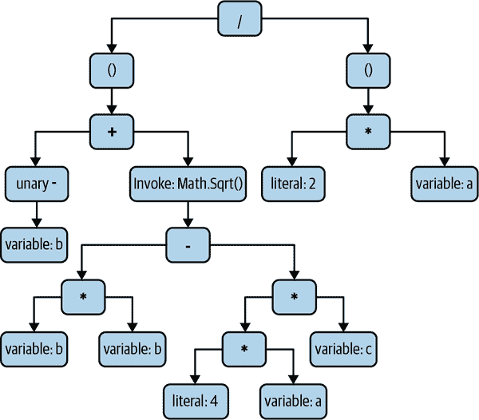

# 第二章：C# 基本编码

所有编程语言都必须提供一定的功能。我们必须能够表达代码应执行的计算和操作。程序需要能够根据输入做出决策。有时我们需要重复执行任务。这些基本功能是编程的基础，本章将展示这些功能在 C# 中的工作原理。

根据你的背景，本章的部分内容可能非常熟悉。C# 被称为“C 家族”语言的一员。C 是一种极具影响力的编程语言，许多语言借鉴了其语法。有直接的后继者，如 C++ 和 Objective-C。还有更远的关联语言，包括 Java、JavaScript 和 C# 本身，它们没有与 C 的兼容性，但仍然复制了其语法的许多方面。如果你熟悉这些语言中的任何一种，你将会认识到我们即将探讨的许多语言特性。

我们在第一章中看到了程序的基本要素。在本章中，我们将仅关注方法内的代码。正如你所见，C# 需要一定的结构：代码由位于方法内的语句组成，该方法属于一个类型，通常位于一个命名空间内，所有这些都在一个项目的文件中，通常包含在一个解决方案中。（在程序入口点的特殊情况下，由于 C# 10.0 的简化特性，包含的方法和类型可能会隐藏起来，但在大多数文件中它们是可见的。）为了清晰起见，本章的大多数示例将单独显示感兴趣的代码，例如示例 2-1。

##### 示例 2-1\. 代码及其余无余地

```cs
Console.WriteLine("Hello, World!");
```

虽然 C# 10.0 接受更短的示例作为程序的全部内容，但任何大于单个文件的程序（即几乎所有有用的程序）都需要明确包含其他元素。因此，除非我另有说明，这种摘录是为了在合适结构化的文件内显示上下文中的代码。例如，像示例 2-1 这样的示例相当于更像示例 2-2。

##### 示例 2-2\. 整段代码

```cs
using System;

internal class MyType
{
    private static void SomeMethod()
    {
        Console.WriteLine("Hello, World!");
    }
}
```

虽然我会在本节介绍语言的基本要素，但这本书是给那些已经熟悉至少一种编程语言的人看的，所以我会相对简短地介绍语言的最常见特性，并会更详细地讲解那些特别适用于 C# 的方面。

# 局部变量

不可避免的“Hello, World!”示例缺少一个重要元素：它实际上并未处理信息。有用的程序通常会获取、处理和生成数据，因此定义和标识数据的能力是语言中最重要的功能之一。与大多数语言一样，C# 允许您定义*本地变量*，这些是方法内的命名元素，每个都包含一部分信息。

###### 注意

在 C# 规范中，术语*变量*可以指本地变量，也可以指对象中的字段和数组元素。本节完全涉及本地变量，但是继续阅读*本地*前缀会有点累。因此，在本节中，*变量*指的是本地变量。

C# 是一种*静态类型*语言，这意味着代码中任何代表或产生信息的元素（如变量或表达式）在编译时都有确定的数据类型。这与*动态类型*语言（如 JavaScript）不同，后者在运行时确定类型。¹

看到 C# 的静态类型在简单变量声明中的实际运行方式最简单的方法是，例如在示例 2-3 中的简单变量声明。每个变量声明以数据类型开头，前两个变量是`string`类型，接着两个是`int`类型。这些类型分别表示文本字符串和 32 位有符号整数。

##### 示例 2-3\. 变量声明

```cs
string part1 = "the ultimate question";
string part2 = "of something";
int theAnswer = 42;
int andAnotherThing;
```

数据类型紧跟变量名之后。变量名必须以字母或下划线开头，后面可以跟任意字母、十进制数字和下划线的组合。（至少在 ASCII 码情况下是这样。C# 支持 Unicode，因此如果您以 UTF-8 或 UTF-16 格式保存文件，标识符中第一个字符后面的字符可以是 Unicode 规范“标识符和模式语法”附录中描述的任何字符。这包括各种重音符号、变音符号和许多标点符号，但只有 Unicode 标识为用于*单词内部*的字符可以用于*分隔*单词的字符不能用。）这些规则同样适用于 C# 中任何用户定义实体的合法标识符，如类或方法。

示例 2-3 显示了几种变量声明的形式。前三个变量包括一个*初始化器*，提供变量的初始值，但是如最后一个变量所示，这是可选的。这是因为您可以在任何时候将新值赋给变量。示例 2-4 继续自示例 2-3，展示了不管变量是否有初始值，都可以向变量赋新值。

##### 示例 2-4\. 为先前声明的变量赋值

```cs
part2 = " of life, the universe, and everything";
andAnotherThing = 123;
```

因为变量具有静态类型，所以编译器将拒绝尝试分配错误类型的数据。因此，如果我们从示例 2-3 继续使用示例 2-5 中的代码，编译器将会抱怨。它知道名为`theAnswer`的变量具有`int`类型，这是一个数值类型，因此如果我们尝试将文本字符串分配给它，它将报告一个错误。

##### 示例 2-5。一个错误：错误的类型

```cs
theAnswer = "The compiler will reject this";
```

在 JavaScript 等动态语言中，您允许这样做，因为在这些语言中，变量没有自己的类型 - 所有的一切都取决于它包含的值的类型，并且随着代码运行，它可以改变。在 C#中，可以通过声明具有类型`dynamic`或`object`的变量来执行类似的操作（稍后在“动态”和“对象”中描述）。但是，在 C#中最常见的做法是使变量具有更具体的类型。

###### 注意

静态类型并不能始终提供完整的图片，多亏了继承。我会在第六章中讨论这个问题，但现在知道一些类型可以通过继承来扩展就足够了，如果一个变量使用了这样的类型，那么它可能引用从变量的静态类型派生的类型的某些对象。接口，在第三章中描述，提供了一种类似的灵活性。但是，静态类型总是决定您可以对变量执行哪些操作。如果您想使用一些特定派生类型的附加成员，您将无法通过基础类型的变量来执行。

您不必明确声明变量类型。您可以使用关键字`var`代替数据类型，让编译器为您完成。示例 2-6 显示了来自示例 2-3 的前三个变量声明，但使用`var`代替显式数据类型。

##### 示例 2-6。使用`var`关键字的隐式变量类型

```cs
var part1 = "the ultimate question";
var part2 = "of something";
var theAnswer = 40 + 2;
```

这段代码经常会误导那些了解一些 JavaScript 的人，因为 JavaScript 中也有一个`var`关键字，可以以类似的方式使用。但是`var`在 C#中的工作方式与 JavaScript 不同：这些变量仍然都是静态类型的。改变的只是我们没有说类型是什么 - 我们让编译器为我们推断。它查看初始化程序，并可以看到前两个变量是字符串，而第三个是整数。（这就是为什么我从示例 2-3 中省略了第四个变量`andAnotherThing`。它没有初始化程序，所以编译器无法推断其类型。如果尝试在没有初始化程序的情况下使用`var`关键字，会收到编译器错误。）

你可以证明使用 `var` 声明的变量是静态类型的，通过尝试将不同类型的东西分配给它们。我们可以重复在 示例 2-5 中尝试的相同事情，但这次使用 `var` 样式的变量。示例 2-7 这样做，它会产生完全相同的编译器错误，因为这是相同的错误——我们试图将文本字符串分配给不兼容类型的变量。这里的变量 `theAnswer` 在这里的类型是 `int`，尽管我们没有明确说明。

##### 示例 2-7\. 错误：错误的类型（再次）

```cs
var theAnswer = 42;
theAnswer = "The compiler will reject this";
```

对于何时以及如何使用 `var` 关键字，意见分歧很大，后面的边栏 “To var, or Not to var?” 描述了这一点。

声明的最后一个值得知道的是，你可以在一行中声明并选择性地初始化多个变量。如果你需要多个相同类型的变量，这可能会减少代码的混乱。在 示例 2-8 中，它声明了三个相同类型的变量，并初始化了其中的两个。

##### 示例 2-8\. 单次声明中的多个变量

```cs
double a, b = 2.5, c = -3;
```

无论你如何声明它，变量都保存特定类型的某些信息，并且编译器会阻止我们将不兼容类型的数据放入该变量中。变量之所以有用，仅仅是因为我们稍后可以在代码中引用它们。示例 2-9 从我们之前看到的变量声明开始，然后继续使用这些变量的值来初始化更多变量，并显示结果。

##### 示例 2-9\. 使用变量

```cs
string part1 = "the ultimate question";
string part2 = "of something";
int theAnswer = 42;

part2 = "of life, the universe, and everything";

string questionText = "What is the answer to " + part1 + ", " + part2 + "?";
string answerText = "The answer to " + part1 + ", " +
                       part2 + ", is: " + theAnswer;

Console.WriteLine(questionText);
Console.WriteLine(answerText);
```

顺便说一句，这段代码依赖于 C# 对 `+` 运算符的几种含义的定义，当它与字符串一起使用时。首先，当你将两个字符串“相加”在一起时，它们会连接起来。其次，当你将不是字符串的东西添加到字符串的末尾（正如 `answerText` 的初始化器所做的那样——它添加了一个数字 `theAnswer`），C# 会生成将值转换为字符串然后附加它的代码。因此，示例 2-9 会产生如下输出：

```cs
What is the answer to the ultimate question, of life, the universe, and everythi
ng?
The answer to the ultimate question, of life, the universe, and everything, is:
42
```

###### 注意

在本书中，超过 80 个字符的文本会被换行以适应页面。如果您尝试这些示例，如果您的控制台窗口配置为不同的宽度，则它们将看起来不同。

当你使用一个变量时，它的值就是你最后分配给它的值。如果你尝试在分配值之前使用一个变量，正如 示例 2-10 所做的那样，C# 编译器将报告一个错误。

##### 示例 2-10\. 错误：使用未赋值的变量

```cs
int willNotWork;
Console.WriteLine(willNotWork);
```

编译后，第二行会产生以下错误：

```cs
error CS0165: Use of unassigned local variable 'willNotWork'
```

编译器使用一种稍微悲观的系统（称为*明确的赋值*规则）来确定变量是否已经有值。在每种可能的情况下都无法创建能够确定这些事情的算法。² 由于编译器必须谨慎处理，有些情况下变量在执行相关代码时已经有值，但编译器仍会抱怨。解决方案是编写一个初始化器，以便变量始终包含某些内容，例如对于数值使用`0`，对于布尔变量使用`false`。在第三章中，我将介绍引用类型，顾名思义，这种类型的变量可以保存对类型实例的引用。如果需要在有东西可以引用之前初始化这样的变量，可以使用关键字`null`，表示一个指向无内容的引用。或者，您可以使用关键字`default`来初始化任何类型的变量，它表示零、`false`或`null`的值。

明确的赋值规则决定了编译器认为变量包含有效值的代码部分，并因此允许您从中读取。写入变量的操作不受限制，但正如您可能预料的那样，任何给定变量只能从代码的某些部分访问。让我们看看控制这些规则的细则。

## 范围

变量的*作用域*是您可以通过其名称引用该变量的代码范围。变量并非唯一具有作用域的事物。方法、属性、类型，实际上，所有具有名称的东西都有作用域。这些需要扩展作用域的定义：它是您可以在代码中通过名称引用实体而无需额外限定的部分。当我写`Console.WriteLine`时，我是通过其名称(`WriteLine`)引用方法，但我需要使用类名(`Console`)加以限定，因为该方法不在作用域内。但对于局部变量，作用域是绝对的：要么可以无需限定就可以访问，要么根本无法访问。

广义上讲，变量的作用域从其声明开始，到其所在的*块*结束。（某些语句，如循环，通过将变量声明放在其所在作用域之前来使此过程复杂化。）块是由一对大括号（{}）界定的代码区域。方法体就是一个块，因此在一个方法中定义的变量在另一个方法中是不可见的，因为它超出了作用域。如果尝试编译示例 2-11，将会收到一个错误，指出`当前上下文中不存在名称'thisWillNotWork'`。

##### Example 2-11\. 错误：超出范围

```cs
static void SomeMethod()
{
    int thisWillNotWork = 42;
}

static void AnUncompilableMethod()
{
    Console.WriteLine(thisWillNotWork);
}
```

方法通常包含嵌套块，特别是当你使用本章稍后将介绍的循环和流控制结构时。在嵌套块开始的地方，外部块中的所有作用域继续在该嵌套块内部有效。示例 2-12 声明了一个名为 `someValue` 的变量，然后在 `if` 语句的一部分中引入了一个嵌套块。此块内的代码能够访问在包含块中声明的该变量。

##### 示例 2-12\. 在块外声明变量，在块内使用

```cs
int someValue = GetValue();
if (someValue > 100)
{
    Console.WriteLine(someValue);
}
```

逆否命题并不成立。如果你在嵌套块中声明一个变量，其作用域不会延伸到该块外部。因此，示例 2-13 编译将失败，因为 `willNotWork` 变量只在嵌套块内部有效。由于试图在该块外部使用该变量，最后一行代码将产生编译器错误。

##### 示例 2-13\. 错误：尝试使用不在作用域内的变量

```cs
int someValue = GetValue();
if (someValue > 100)
{
    int willNotWork = someValue - 100;
}
Console.WriteLine(willNotWork);
```

这可能看起来相当简单，但当涉及到潜在的命名冲突时情况会变得更加复杂。在这里，C#有时会让人感到意外。

## 变量名称的歧义

考虑 示例 2-14 中的代码。这里声明了一个名为 `anotherValue` 的变量在一个嵌套块内。正如你所知，该变量仅在该嵌套块的末尾处于作用域内。在该块结束后，我们尝试声明另一个同名变量。

##### 示例 2-14\. 错误：令人惊讶的名称冲突

```cs
int someValue = GetValue();
if (someValue > 100)
{
    int anotherValue = someValue - 100;  // Compiler error
    Console.WriteLine(anotherValue);
}

int anotherValue = 123;
```

这导致了在第一行声明 `anotherValue` 时的编译器错误：

```cs
error CS0136: A local or parameter named 'anotherValue' cannot be declared in
 this scope because that name is used in an enclosing local scope to define a
 local or parameter
```

这似乎有些奇怪。在最后一行，所谓的冲突早期声明已经不在作用域内，因为我们已经超出了它所声明的嵌套块。此外，第二个声明在该嵌套块内也不在作用域内，因为声明发生在块之后。尽管作用域不重叠，但尽管如此，我们仍然在处理 C#避免名称冲突规则时遇到问题。要了解为什么此示例失败，首先需要看一个不那么令人意外的示例。

C# 试图通过不允许一个名称可能指代多个东西的代码来避免歧义。示例 2-15 展示了它旨在避免的问题类型。这里我们有一个名为 `errorCount` 的变量，并且代码在进展过程中开始修改它，³ 但在中途，它在一个嵌套块中引入了一个新的同名变量，也叫 `errorCount`。可以想象一种允许这种情况的语言——你可以有一个规则，即当多个同名项处于作用域内时，只选择最后声明的那个。

##### 示例 2-15\. 错误：隐藏一个变量

```cs
int errorCount = 0;
if (problem1)
{
    errorCount += 1;

    if (problem2)
    {
        errorCount += 1;
    }

    // Imagine that in a real program there was a big
    // chunk of code here before the following lines.

    int errorCount = GetErrors();  // Compiler error
    if (problem3)
    {
        errorCount += 1;
    }
}
```

C#选择不允许这种情况，因为这样的代码很容易误解。这是一个人为缩短的方法，因为它是书中的一个假设示例，所以很容易看到重复的名称，但如果代码再长一点，很容易忽略嵌套变量声明。那么，在方法结束时，我们可能意识不到`errorCount`的含义与之前不同。C#简单地禁止这种情况以避免误解。

但是为什么示例 2-14 会失败呢？这两个变量的作用域并不重叠。嗯，事实证明，禁止示例 2-15 的规则并不基于作用域。它基于一个微妙不同的概念，叫做*声明空间*。声明空间是代码中的一个区域，在这个区域中，一个名称不能指代两个不同的实体。每个方法为变量引入一个声明空间。嵌套块也会引入声明空间，而在嵌套声明空间中声明与其父声明空间中同名变量是非法的。这就是我们在这里违反的规则——示例 2-15 中最外层的声明空间包含一个名为`errorCount`的变量，而嵌套块的声明空间试图引入另一个同名变量。

如果这一切看起来有点枯燥或武断，了解*为什么*有一个完全独立的名称冲突规则集合可能会有所帮助，而不是基于作用域。声明空间规则的意图大部分情况下不应受到声明放置位置的影响。如果你将一个块中的所有变量声明移动到该块的开头——某些组织有规范要求这种布局——这些规则的理念就是这不应该改变代码的含义。如果示例 2-15 是合法的，这将是不可能的。这也解释了为什么示例 2-14 是非法的。虽然作用域不重叠，但如果你将所有变量声明移动到包含块的顶部，它们将会重叠。

## 局部变量实例

变量是源代码的特征，因此每个特定变量都有一个独特的身份：它在源代码中只声明一次，并且在一个明确定义的地方超出作用域。但这并不意味着它对应于内存中的单个存储位置。通过递归、多线程或异步执行，可能会同时存在单个方法的多个调用。

每次方法运行时，它都会获得一组独特的存储位置来保存局部变量的值。这使得多个线程可以同时执行同一个方法而不会出现问题，因为每个线程都有自己的局部变量集合。同样，在递归代码中，每个嵌套调用都会获得自己的局部变量集合，不会干扰任何调用它的方法。对于同一方法的多个并发调用也是如此。严格来说，每个特定*作用域*的执行都有自己的变量集合。当您使用匿名函数时，这一区别很重要，详见第九章中的描述。作为优化，C# 在可能的情况下会重用存储位置，因此只有在真正需要时才会为每个作用域的执行分配新内存。（例如，除非您将其置于必须这样做的情况中，否则不会为循环体内声明的变量每次迭代分配新内存。）但其效果就像每次都分配了新空间一样。

请注意，C# 编译器对于变量存放位置并没有特别的保证（除了一些特殊情况，我们将在第十八章中看到）。它们可能存在于堆栈上，但有时并非如此。当我们在后面的章节中看匿名函数时，您将看到有时变量需要超出声明它们的方法的生存期，因为它们在嵌套方法中仍处于作用域中，这些嵌套方法将在包含方法返回后作为回调运行。

顺便说一句，在我们继续之前，请注意，变量不是唯一具有作用域的事物，还有适用于声明空间的规则的其他语言特性，我们稍后会看到，包括类、方法和属性等。

# 语句和表达式

变量为我们提供了一个存放代码处理信息的地方，但要对这些变量进行任何操作，我们需要编写一些代码。这意味着编写*语句*和*表达式*。

## 语句

当我们编写一个 C# 方法时，我们实际上是在编写一系列语句。非正式地说，方法中的语句描述了我们希望方法执行的操作。示例 2-16 中的每一行都是一个语句。也许有些诱人的想法认为语句是一个指令（例如初始化变量或调用方法）。或者您可能采用更词法化的观点，认为任何以分号结尾的东西都是语句。（顺便说一句，这里重要的是分号，而不是换行。我本可以将其写成一行长代码，它的意义完全相同。）然而，这两种描述都过于简单化，尽管它们在这个特定示例中恰好是正确的。

##### 示例 2-16\. 一些语句

```cs
int a = 19;
int b = 23;
int c;
c = a + b;
Console.WriteLine(c);
```

C#识别许多不同类型的语句。 示例 2-16 的前三行是*声明语句*，用于声明并可选地初始化变量。第四和第五行是*表达式语句*。但是有些语句比这个例子中的更有结构。

当你编写一个循环时，那是一个*迭代语句*。当你在本章后面描述的使用`if`或`switch`机制来选择各种可能操作时，那些是*选择语句*。实际上，C#规范区分了 13 种语句类别。大多数都可以广泛地归类为描述代码接下来应该做什么，或者对于循环或条件语句等功能，描述如何决定接下来该做什么。第二类语句通常包含一个或多个嵌入语句，描述在循环中执行的操作，或者在`if`语句的条件满足时执行的操作。

有一种特殊情况。块是一种语句。这使得诸如循环之类的语句比通常更有用，因为循环只是迭代一个嵌入的语句。那个语句可以是一个块，而由于块本身是一系列语句（用大括号分隔），这使得循环可以包含多于一个语句。

这解释了为什么前面提到的两种简单观点——“语句是行动”和“语句是以分号结尾的东西”——都是错误的。比较示例 2-16 和 2-17。两者做的事情是一样的，因为我们想要执行的各种操作保持完全一样，并且两者都包含五个分号。然而，示例 2-17 包含了一个额外的语句。前两个语句是相同的，但后面跟着一个第三个语句，一个块，其中包含了来自 示例 2-16 的最后三个语句。这个额外的语句，即块，既不以分号结尾，也不执行任何操作。在这个特定的例子中，它是无意义的，但有时候引入这样一个嵌套块可以避免名称歧义错误。因此，语句可以是结构性的，而不是在运行时引起任何事情发生。

##### 示例 2-17\. 一个块

```cs
int a = 19;
int b = 23;
{
    int c;
    c = a + b;
    Console.WriteLine(c);
}
```

虽然你的代码将包含多种类型的语句，但最终至少会包含一些表达式语句。表达式语句是由合适的表达式后跟一个分号组成的语句。什么是合适的表达式？实际上什么是表达式？在回到组成语句的有效表达式之前，我最好先回答第二个问题。

## 表达式

微软对 C# *expression*的官方定义相当枯燥：“一系列操作符和操作数。”尽管如此，语言规范往往是这样的，但除了这种形式化的散文外，C#规范还包含一些非常可读的非正式解释更正式表达的想法。 （例如，在说明语句作为表达程序操作的手段之前，它描述了表达式的含义，然后用不太接近但技术上更精确的语言来确定。）本段开头的引语来自表达式的正式定义，所以我们可能希望在引言中的非正式解释将更有帮助。没那么幸运：它说表达式“是从操作数和操作符构造的。”这当然不如其他定义那么精确，但理解起来也不容易。问题在于，有几种类型的表达式，它们执行不同的工作，所以没有单一的、通用的、非正式的描述。

描述一个表达式为产生值的代码是很诱人的。对于所有表达式来说并非如此，但你将写的大多数表达式都符合这个描述，所以我现在将重点放在这一点上，并稍后提到例外情况。

最简单的表达式是*literals*，我们只需写出我们想要的值，比如`"Hello, World!"`或`42`。你也可以使用变量的名称作为一个表达式。表达式可以涉及运算符，描述进行的计算或其他计算。运算符有固定数量的输入，称为*operands*。有些运算符只需要一个操作数。例如，你可以通过在数字前面加一个减号来对数字取反。有些运算符需要两个操作数：`+`运算符允许你形成一个表达式，将两侧操作数的结果相加。

###### 注意

一些符号在不同的上下文中有不同的作用。减号不仅仅用于取反。如果它出现在两个表达式之间，则充当双操作数减法运算符。

通常，操作数也是表达式。所以，当我们写`2 + 2`时，这是一个包含两个更多表达式的表达式——`+`符号两侧的一对"`2`" literals。这意味着我们可以通过在表达式内部嵌套表达式来编写任意复杂的表达式。示例 2-18 利用这一点来评估二次方程的解（解二次方程的标准方法）。

##### 示例 2-18。表达式内的表达式

```cs
double a = 1, b = 2.5, c = -3;
`double` `x` `=` `(``-``b` `+` `Math``.``Sqrt``(``b` `*` `b` `-` `4` `*` `a` `*` `c``)``)` `/` `(``2` `*` `a``)``;`
Console.WriteLine(x);
```

看看第二行的声明语句。其初始化表达式的整体结构是一个除法操作。但是该除法运算符的两个操作数也是表达式。其左操作数是一个*括号表达式*，告诉编译器我希望整个表达式 `(-b + Math.Sqrt(b * b - 4 * a * c))` 成为除法的第一个操作数。这个子表达式包含一个加法，其左操作数是一个否定表达式，其单个操作数是变量 `b`。加法的右操作数则对另一个更复杂的表达式进行平方根运算。而除法的右操作数是另一个括号表达式，其中包含一个乘法。图 2-1 展示了表达式的完整结构。



###### 图 2-1\. 表达式的结构

最后一个示例的一个重要细节是，方法调用是一种表达式。在示例 2-18 中使用的 `Math.Sqrt` 方法是一个 .NET 运行时库函数，用于计算其输入的平方根并返回结果。也许更令人惊讶的是，像 `Console.WriteLine` 这样不返回值的方法调用，从技术上讲也是表达式。还有一些其他不产生值但仍被视为表达式的结构，包括对类型的引用（例如 `Console.WriteLine` 中的 `Console`）或对命名空间的引用。这些构造利用了一套通用规则（例如作用域、如何解析名称引用等），因此被视为表达式。然而，所有不生成值的表达式只能在特定情况下使用（例如，不能将一个表达式用作另一个表达式的操作数）。因此，虽然从技术上讲定义表达式为生成值的代码片段并不完全正确，但我们在描述代码要执行的计算时确实使用这些表达式。

现在我们可以回到一个问题，即在表达式语句中可以放什么？粗略来说，表达式必须执行某些操作；它不能只计算一个值。因此，虽然 `2 + 2` 是一个有效的表达式，但如果您试图在其末尾添加分号将其转换为表达式语句，您将会得到一个错误。这个表达式计算了某些东西，但没有对结果做任何事情。更准确地说，您可以将以下类型的表达式用作语句：方法调用、赋值、增量、减量以及新对象的创建。我们将在本章后面讨论增量和减量，后续章节还会讨论对象，因此留下了调用和赋值两种情况。

因此，方法调用允许作为表达式语句。这可能涉及其他类型的嵌套表达式，但整个表达式必须是一个方法调用。示例 2-19 展示了一些有效的例子。请注意，C# 编译器并不检查方法调用是否真正产生了任何持久效果——`Math.Sqrt` 函数是一个纯函数，它仅仅根据其输入返回一个值。因此调用它然后不对结果做任何操作实际上什么都没做——这不比表达式`2 + 2`更有作用。但就 C# 编译器而言，任何方法调用都允许作为表达式语句。

##### 示例 2-19\. 方法调用表达式作为语句

```cs
Console.WriteLine("Hello, World!");
Console.WriteLine(12 + 30);
Console.ReadKey();
Math.Sqrt(4);
```

###### 注意

如果在 VS Code 中运行此示例，则`ReadKey`的调用可能会失败，因为调试器默认会重定向输入和输出。[文档说明](https://oreil.ly/JefbY)了在调试需要读取控制台输入的程序时如何避免此问题。

C# 禁止我们将加法表达式用作语句，而允许`Math.Sqrt`，看起来是不一致的。这两者都执行计算并产生结果，因此在这种方式下使用它们是毫无意义的。如果 C# 只允许调用不返回任何内容的方法用作表达式语句，那么这会更一致吗？这将排除示例 2-19 的最后一行，因为这段代码并不执行任何有用的操作。这也与`2 + 2`不能形成表达式语句的事实一致。不幸的是，有时您希望忽略返回值。示例 2-19 调用`Console.ReadKey()`，它等待按键并返回一个值，指示按下了哪个键。如果我的程序行为依赖于用户按下的特定键，我需要检查方法的返回值，但如果我只是想等待任何键，忽略返回值就可以了。如果 C# 不允许具有返回值的方法用作表达式语句，那么我将无法这样做。编译器无法区分哪些方法会导致毫无意义的语句，因为它们没有副作用（比如`Math.Sqrt`），哪些可能是好的候选（比如`Console.ReadKey`），因此它允许任何方法。

要使表达式成为有效的表达式语句，仅仅包含方法调用是不够的。示例 2-20 展示了一些调用方法并将其用作加法表达式一部分的表达式。虽然这些是有效的表达式，但它们不是有效的表达式语句，因此会导致编译器错误。关键在于最外层的表达式。在这两行中，最外层都是加法表达式，这就是为什么这些是不允许的原因。

##### Example 2-20\. 错误：一些不作为语句工作的表达式

```cs
Console.ReadKey().KeyChar + "!";
Math.Sqrt(4) + 1;
```

之前我说过我们可以将作为语句使用的一种表达式是赋值。赋值作为表达式并不明显，但确实如此，并且它们会产生一个值：赋值表达式的结果是分配给变量的值。这意味着可以在示例 2-21 中编写这样的代码是合法的。这里的第二行使用赋值表达式作为方法调用的参数，展示了该表达式的值。前两个`WriteLine`调用都显示`123`。

##### Example 2-21\. 赋值是表达式

```cs
int number;
`Console``.``WriteLine``(``number` `=` `123``)``;`
Console.WriteLine(number);

int x, y;
`x` `=` `y` `=` `0``;`
Console.WriteLine(x);
Console.WriteLine(y);
```

本例的第二部分通过利用赋值为两个变量同时分配一个值，说明了赋值作为表达式的事实——它将`y = 0`表达式的值（评估为`0`）分配给了`x`。

这表明评估表达式不仅仅是产生一个值。一些表达式具有副作用。我们刚刚看到赋值是一个表达式，当然它有改变变量内容的效果。方法调用也是表达式，尽管可以编写仅从其输入计算结果的纯函数，比如`Math.Sqrt`，但许多方法会有一些持久的效果，例如向屏幕写入数据，更新数据库或触发建筑物的拆除。这意味着我们可能关心表达式的操作数评估顺序。

表达式的结构对操作符完成工作的顺序施加了一些约束。例如，我可以使用括号强制执行顺序。表达式`10 + (8 / 2)`的值为 14，而表达式`(10 + 8) / 2`的值为 9，尽管它们都有完全相同的文字操作数和算术运算符。这里的括号决定了除法是在减法之前还是之后执行。⁴

然而，虽然表达式的结构对操作数的评估顺序施加了一些约束，但仍然有一些余地：虽然加法的两个操作数在执行加法之前必须先评估，但加法运算符不关心我们先评估哪个操作数。但如果操作数是具有副作用的表达式，顺序可能很重要。对于这些简单的表达式，这并不重要，因为我使用了文字，所以我们无法真正知道它们何时被评估。但是，如果操作数调用了某些方法的表达式呢？示例 2-22 包含这种类型的代码。

##### Example 2-22\. 操作数的评估顺序

```cs
static int X(string label, int i)
{
    Console.Write(label);
    return i;
}

Console.WriteLine(X("a", 1) + X("b", 1) + X("c", 1) + X("d", 1));
```

这定义了一个方法，`X`，它接受两个参数。它显示第一个参数，并返回第二个参数。然后，我在表达式中多次使用了这个方法，这样我们就可以确切地看到调用 `X` 的操作数何时被评估。一些语言选择不定义此顺序，使得这样的程序的行为变得不可预测，但是在 C# 中这里是有规定的。规则是在任何表达式内部，操作数按照它们在源代码中出现的顺序进行评估。因此，当 示例 2-22 中的 `Console.WriteLine` 运行时，它会多次调用 `X`，每次调用 `X` 都会调用 `Console.Write`，因此我们会看到这样的输出：`abcd4`。

然而，这忽略了一个重要的微妙之处：当嵌套发生时，我们在说表达式的顺序时到底是什么意思？`Console.WriteLine` 的整个参数是一个大的加法表达式，其中第一个操作数是 `X("a", 1)`，第二个操作数是另一个加法表达式，它又以 `X("b", 1)` 作为第一个操作数，并且有一个第二操作数，它又是另一个加法表达式，其操作数分别是 `X("c", 1)` 和 `X("d", 1)`。考虑这些加法表达式中的第一个，它构成了传递给 `Console.WriteLine` 的整个参数，现在问这个加法表达式的第一个操作数究竟是在其第一个操作数之前还是之后，这是否有意义？在词法上，最外层的加法表达式从其第一个操作数开始的确切点开始，并在其第二操作数结束的点结束（这也恰好是最终的 `X("d", 1)` 结束的地方）。在这种特定情况下，真正重要的是评估顺序的唯一可观察效果是调用 `X` 方法时产生的输出。没有一个调用 `X` 的表达式是嵌套在另一个表达式中的，因此我们可以有意义地说这些表达式的顺序，并且我们看到的输出与该顺序匹配。然而，在某些情况下，如 示例 2-23，嵌套表达式的重叠可能会产生可见的影响。

##### 示例 2-23\. 带有嵌套表达式的操作数评估顺序

```cs
Console.WriteLine(
    X("a", 1) +
    X("b", (X("c", 1) + X("d", 1) + X("e", 1))) +
    X("f", 1));
```

这里，`Console.WriteLine` 的参数添加了三次调用 `X` 的结果；然而，这三次 `X` 的调用中，第二次调用（第一个参数为`"b"`）的第二个参数是一个表达式，该表达式又添加了三次调用 `X` 的结果（参数分别为`"c"`、`"d"` 和 `"e"`）。通过最后一次调用 `X`（传递`"f"`），在该语句中我们总共有六个调用 `X` 的表达式。C# 按照表达式出现的顺序来评估表达式的规则始终适用，但由于存在重叠，结果一开始会令人惊讶。尽管字母按照字母表顺序出现在源代码中，输出却是`"acdebf5"`。如果你想知道这是如何与按顺序评估表达式保持一致，请考虑代码从表达式开始评估的顺序，以及在表达式完成评估时的顺序，这两者是不同的排序方式。特别是，使用`"b"`调用 `X` 的表达式开始其评估比使用`"c"`、`"d"` 和 `"e"` 调用 `X` 的表达式开始评估更早，但在它们之后完成其评估。我们在输出中看到的正是这种*后续*排序。如果你在本例中找到每个与调用 `X` 相对应的闭合括号，你会发现调用顺序与显示的内容完全一致。

# 注释与空白

大多数编程语言允许源文件包含编译器忽略的文本，C#也不例外。与大多数 C 家族语言一样，它支持两种用于此目的的*注释*风格。有*单行注释*，如示例 2-24 中所示，其中写入两个`/`字符，从而使得从这里到行尾的所有内容都将被编译器忽略。

##### 示例 2-24\. 单行注释

```cs
Console.WriteLine("Say");        // This text will be ignored, but the code on
Console.WriteLine("Anything");   // the left is still compiled as usual.
```

C# 也支持*定界注释*。你可以使用`/*`开始这种类型的注释，编译器将忽略直到遇到第一个`*/`字符序列的所有内容。如果你不希望注释一直持续到行尾，这将会很有用，正如示例 2-25 的第一行所示。本例还展示了定界注释可以跨越多行。

##### 示例 2-25\. 定界注释

```cs
Console.WriteLine(/* Has side effects */ GetLog());

/* Some developers like to use delimited comments for big blocks of text,
 * where they need to explain something particularly complex or odd in the
 * code. The column of asterisks on the left is for decoration - asterisks
 * are necessary only at the start and end of the comment.
 */
```

使用定界注释可能会遇到一个小问题；即使注释在单行内，也可能会发生，但更常见的是在多行注释中出现。示例 2-26 展示了从第一行中间开始到第四行末尾的注释问题。

##### 示例 2-26\. 多行注释

```cs
Console.WriteLine("This will run");   /* This comment includes not just the
Console.WriteLine("This won't");       * text on the right but also the text
Console.WriteLine("Nor will this");   /* on the left except the first and last
Console.WriteLine("Nor this");         * lines. */
Console.WriteLine("This will also run");
```

注意，在本示例中`/*`字符序列出现了两次。当此序列出现在注释中间时，它什么特别操作也不会执行——注释不会嵌套。尽管我们看到了两个`/*`序列，但第一个`*/`就足以结束注释。这有时令人沮丧，但对于 C 家族语言来说，这是常态。

有时临时禁用一段代码并且轻松恢复是非常有用的。将代码转换为注释是一个常见的方法，虽然一个分隔的注释看起来似乎是一个显而易见的选择，但如果你注释掉的区域恰好包含另一个分隔的注释，那么它会变得很笨拙。由于没有支持嵌套，你需要在内部注释的闭合`*/`后添加一个`/*`来确保你注释掉了整个范围。因此，通常使用单行注释来实现这一目的。（你还可以使用下一节中描述的`#if`指令。）

###### 注意

Visual Studio 和 VS Code 都可以帮助你注释掉代码区域。如果你选择了几行文本并按下 Ctrl-K，然后立即按下 Ctrl-C，它会在选择的每一行开头添加 `//`。而取消注释则是通过 Ctrl-K，Ctrl-U 来实现。（在安装 Visual Studio 时，如果你选择了除了 C# 以外的首选语言，这些操作可能绑定了不同的键序列，但它们也可以在“编辑”→“高级”菜单中找到，并且在默认情况下会显示在文本编辑器工具栏中，这是 Visual Studio 显示的标准工具栏之一。）

谈到忽略的文本，C# 在大多数情况下忽略额外的空白。并非所有的空白都是无关紧要的，因为你至少需要一些空间来分隔完全由字母数字符号组成的标记。例如，你不能将`staticvoid`作为方法声明的开头—你需要至少一个空格（或制表符、换行符或其他类似的空格字符）来分隔`static`和`void`。但是对于非字母数字符号，空格是可选的，并且在大多数情况下，单个空格等同于任意数量的空白和换行符。这意味着 示例 2-27 中的三个语句都是等效的。

##### 示例 2-27\. 无关紧要的空白

```cs
Console.WriteLine("Testing");
Console . WriteLine(   "Testing");
Console.
    WriteLine ("Testing" )
  ;
```

有几种情况下，C# 对空白更为敏感。在字符串文字内部，空格是有意义的，因为你写入的空格将出现在字符串值中。此外，虽然 C# 大多数情况下不关心你是否将每个元素放在自己的一行中，或者将所有代码放在一个大行中，或者（似乎更可能的是）介于两者之间，但有一个例外：预处理指令必须单独出现在它们自己的行上。

# 预处理指令

如果你熟悉 C 语言或其直接后代，你可能会想知道 C# 是否有预处理器。它没有单独的预处理阶段，也不提供宏。但是，它确实有少数与 C 预处理器提供的指令类似的指令，尽管选择非常有限。即使 C# 没有像 C 那样的完整预处理阶段，这些仍然被称为预处理指令。

## 编译符号

C# 提供了一个`#define`指令，允许你定义一个*编译符号*。这些符号通常与`#if`指令一起使用，根据不同情况编译代码。例如，你可能希望某些代码仅在调试版本中存在，或者可能需要在不同平台上使用不同的代码以达到特定效果。通常情况下，你不会直接使用`#define`指令，而是通过编译器的构建设置定义编译符号。你可以打开*.csproj*文件，在任何`<PropertyGroup>`的`<DefineConstants>`元素中定义你想要的值。另外，Visual Studio 也可以帮助你完成这些操作：右键单击解决方案资源管理器中的项目节点，选择属性，在打开的属性页中转到“生成”部分。该界面允许你为每个构建配置配置不同的符号值（通过向包含这些设置的`<PropertyGroup>`添加像`Condition="'$(Configuration)|$(Platform)'=='Debug|AnyCPU'"`这样的属性）。

###### 注意

.NET SDK 默认定义了某些符号。它支持两种配置，Debug 和 Release。在 Debug 配置中定义了一个`DEBUG`编译符号，而 Release 则会定义`RELEASE`。它在两种配置中都定义了一个名为`TRACE`的符号。某些项目类型会获得额外的符号。一个面向.NET Standard 的库将定义`NETSTANDARD`，以及一个特定版本的符号，比如`NETSTANDARD2_0`。目标为.NET 6.0 的项目会得到一个`NET6_0`符号。

编译符号通常与`#if`、`#else`、`#elif`和`#endif`指令一起使用（`#elif`是*else if*的简写）。示例 2-28 使用了其中一些指令，以确保只在调试版本中编译某些代码行。（你也可以写`#if false`来完全阻止某些代码段的编译。这通常只是临时措施，是一种避免注释嵌套问题的替代方法。）

##### 示例 2-28\. 条件编译

```cs
#if DEBUG
    Console.WriteLine("Starting work");
#endif
    DoWork();
#if DEBUG
    Console.WriteLine("Finished work");
#endif
```

C# 提供了一种更微妙的机制来支持这种情况，称为*条件方法*。编译器识别运行时库定义的一个称为`ConditionalAttribute`的特性，为其提供特殊的编译时行为。你可以使用这个特性注解任何方法。示例 2-29 使用它来指示只有在定义了`DEBUG`编译符号时才应使用注解方法。

##### 示例 2-29\. 条件方法

```cs
[System.Diagnostics.Conditional("DEBUG")]
static void ShowDebugInfo(object o)
{
    Console.WriteLine(o);
}
```

如果您编写调用以这种方式注释的方法的代码，C# 编译器将在不定义相关符号的构建中省略该调用。因此，如果您编写调用 `ShowDebugInfo` 方法的代码，编译器将在非调试构建中剥离所有这些调用。这意味着您可以获得与 示例 2-28 相同的效果，但不会用指令使代码混乱。

运行时库的 `System.Diagnostics` 命名空间中的 `Debug` 和 `Trace` 类使用了这个特性。`Debug` 类提供了各种方法来生成诊断输出，这些方法在 `DEBUG` 编译符号条件下才会生效，而 `Trace` 类的方法则在 `TRACE` 条件下才会生效。如果保留新的 C# 项目的默认设置，通过 `Trace` 类产生的任何诊断输出将在调试和发布构建中都可用，但调用 `Debug` 类上的方法的任何代码将不会编译到发布构建中。

###### 警告

`Debug` 类的 `Assert` 方法在 `DEBUG` 条件下才会生效，这有时会让开发人员感到困惑。`Assert` 允许您指定必须在运行时为真的条件，如果条件为假，则会抛出异常。C# 初学者经常错误地将两件事放入 `Debug.Assert` 中：实际上应该在所有构建中发生的检查，以及代码其余部分依赖的具有副作用的表达式。这会导致错误，因为编译器会在非调试构建中剥离此代码。

## #error 和 #warning

C# 允许您使用 `#error` 和 `#warning` 指令生成编译器错误或警告。这些通常用于条件区域内，就像 示例 2-30 所示的那样，尽管无条件的 `#warning` 可能会作为提醒自己尚未编写某些特别重要的代码的一种方式。

##### 示例 2-30\. 生成编译器错误

```cs
#if NETSTANDARD
  #error .NET Standard is not a supported target for this source file
#endif
```

## #line

`#line` 指令在生成的代码中很有用。当编译器产生错误或警告时，它会说明问题发生的位置，提供文件名、行号和该行内的偏移量。但是，如果所讨论的代码是使用其他文件自动生成的，并且如果该其他文件包含问题的根本原因，那么将错误报告在输入文件中可能更有用，而不是在生成的文件中。`#line` 指令可以指示 C# 编译器表现得好像错误发生在指定的行号，并且可选地，好像错误发生在完全不同的文件中。示例 2-31 展示了如何使用它。指令后的错误将被报告好像来自名为 *Foo.cs* 的文件的第 123 行。您可以通过编写 `#line default` 来告诉编译器恢复报告警告和错误而不进行伪造。

##### 示例 2-31\. `#line` 指令和故意错误

```cs
#line 123 "Foo.cs"
    intt x;
```

此指令还影响调试。当编译器生成调试信息时，它会考虑`#line`指令。这意味着在调试器中逐步执行代码时，你将看到`#line`引用的位置。

文件名部分是可选的，这使你可以伪造行号。相反，此编译指示还接受更复杂的形式，在其中可以提供列和范围信息，用于生成的代码与输入之间没有直接的行对行关系的情况。ASP.NET Core Web 框架使用此功能：它包括一个名为 Razor 的功能，允许将 C# 表达式与 HTML 混合。Razor 通过生成 C# 文件工作，但它使用`#line`指令，以便调试器显示开发人员在 Razor 文件中编写的原始代码，而不是生成的代码。

这个指令还有另外一个用法。不需要行号（和可选的文件名），你可以写`#line hidden`。这只影响调试器的行为：在单步调试时，Visual Studio 将直接运行所有这种指令之后的代码，直到遇到非`hidden #line`指令（通常是`#line default`）为止。

## #pragma

`#pragma`指令提供了两个功能：它可用于禁用选定的编译器警告，也可用于覆盖编译器放入包含调试信息的*.pdb*文件中的校验和值。这两者主要设计用于代码生成场景，尽管偶尔在普通代码中禁用警告可能也有用。示例 2-32 展示了如何使用`#pragma`防止编译器在你声明了但未使用的变量时发出的警告。

##### 示例 2-32\. 禁用编译器警告

```cs
#pragma warning disable CS0168
    int a;
```

通常应避免禁用警告。此功能在生成的代码中很有用，因为代码生成通常会创建未始终使用的项，而编译器指令可能是获得干净编译的唯一途径。但当你手动编写代码时，通常应该能够避免首先出现正常的编译器警告。

话虽如此，如果您选择了额外的诊断，禁用特定警告可能会很有用。NuGet 上的一些组件提供*代码分析器*，这些组件连接到 C# 编译器 API 并有机会检查代码并生成自己的诊断消息。（这发生在构建时，在 Visual Studio 中编辑时也会提供实时诊断，即您键入时。如果安装了 OmniSharp C# 扩展并启用了 `omn⁠ish⁠arp⁠.en⁠ab⁠leRos⁠lyn​Ana⁠lyz⁠ers` 设置，它们也会在 Visual Studio Code 中实时工作。）.NET SDK 还包括内置的分析器，可以检查代码的各个方面，如遵守命名约定或常见安全错误的存在。您可以使用 `AnalysisMode` 设置在项目级别配置这些内容，但与编译器警告一样，可能希望在特定情况下禁用分析器警告。您可以使用 `#pragma warning` 指令来控制来自代码分析器的警告，而不仅仅是来自 C# 编译器的警告。分析器通常在其警告编号前加上一些字母以便您区分它们——例如，编译器警告全部以 `CS` 开头，而来自.NET SDK 分析器的警告以 `CA` 开头。

C# 的未来版本可能基于 `#pragma` 添加其他功能。当编译器遇到它不理解的 `#pragma` 时，它会生成一个警告而不是错误，因为未识别的 `#pragma` 可能对未来的编译器版本或其他供应商的编译器有效。

## `#nullable`

`#nullable` 指令允许对可为空注解上下文和可为空警告上下文进行精细控制。这是*可为空引用*功能的一部分。第三章 更详细地描述了 `#nullable` 指令。

## `#region` 和 `#endregion`

最后，我们有两个什么也不做的预处理指令。如果您写 `#region` 指令，编译器唯一做的就是确保它们有相应的 `#endregion` 指令。不匹配会导致编译器错误，但编译器会忽略正确配对的 `#region` 和 `#endregion` 指令。区域可以是嵌套的。

这些指令完全是为了那些选择识别它们的文本编辑器而存在。Visual Studio、VS Code 和 Rider 使用它们来提供将代码段折叠到屏幕上单行的能力。C# 编辑器自动允许某些特性扩展和折叠，例如类定义、方法和代码块（一种称为*大纲*的功能）。如果你使用这两个指令定义区域，它也将允许这些区域进行扩展和折叠。这允许在编辑器自动提供的细粒度（例如单个块内）和粗粒度（例如多个相关方法）的大纲之间进行大纲化。

如果你在 Visual Studio 中将鼠标悬停在折叠区域上，它会显示一个工具提示，显示该区域的内容。你可以在`#region`标记后面放置文本。当 IDE 显示一个折叠区域时，它将此文本显示在剩下的单行上。虽然可以省略此文本，但通常最好包含一些描述性文本，以便人们可以大致了解他们如果展开将会看到什么。

一些人喜欢将类的整个内容放入不同的区域，因为通过折叠所有区域，你可以一目了然地看到文件的结构。由于区域被缩减为单行，甚至整个文件可能会一次性显示在屏幕上。另一方面，一些人讨厌折叠区域，因为它们在查看代码时会造成阻碍，并且还会鼓励人们将过多的源代码放入一个文件中。

# 基础数据类型

.NET 在其运行库中定义了数千种类型，你可以编写自己的类型，因此 C#可以处理无限数量的数据类型。然而，一些类型从编译器中获得特殊处理。你之前在示例 2-9 中看到过，如果你有一个字符串，并尝试将数字添加到它，编译后的代码将把该数字转换为字符串并附加到第一个字符串上。事实上，行为比那更一般——它不仅限于数字。编译后的代码通过调用`String.Concat`方法工作，如果向其传递任何非字符串参数，它将在执行附加操作之前调用它们的`ToString`方法。所有类型都提供`ToString`方法，因此这意味着你可以将任何类型的值附加到字符串上。

这很方便，但它之所以有效，是因为 C#编译器了解字符串并为其提供特殊服务。（C#规范的一部分定义了`+`运算符的唯一字符串处理方式。）C#不仅为字符串提供各种特殊服务，还为某些数值数据类型、布尔值、一系列称为元组的类型以及两种特定类型——`dynamic`和`object`提供特殊服务。这些大多数不仅对 C#特有，而且对运行时也是特有的——几乎所有数值类型在中间语言（IL）中都得到直接支持，而`bool`、`string`和`object`类型也被运行时本质上理解。

## 数值类型

C#支持整数和浮点数算术运算。有符号和无符号整数类型，它们有各种不同的大小，如表 2-1 所示。最常用的整数类型是`int`，因为它足够大，可以表示广泛的值范围，而且在支持.NET 的所有 CPU 上工作效率也很高。（较大的数据类型可能不会被 CPU 原生支持，并且在多线程代码中可能具有不良特性：32 位类型的读取和写入是原子的⁵，但对于较大的类型可能不是。）

表 2-1\. 整数类型

| **C# 类型** | **CLR 名称** | **有符号** | **位大小** | **包含范围** |
| --- | --- | --- | --- | --- |
| `byte` | `System.Byte` | 否 | 8 | 0 到 255 |
| `sbyte` | `System.SByte` | 是 | 8 | −128 到 127 |
| `ushort` | `System.UInt16` | 否 | 16 | 0 到 65,535 |
| `short` | `System.Int16` | 是 | 16 | −32,768 到 32,767 |
| `uint` | `System.UInt32` | 否 | 32 | 0 到 4,294,967,295 |
| `int` | `System.Int32` | 是 | 32 | −2,147,483,648 到 2,147,483,647 |
| `ulong` | `System.UInt64` | 否 | 64 | 0 到 18,446,744,073,709,551,615 |
| `long` | `System.Int64` | 是 | 64 | −9,223,372,036,854,775,808 到 9,223,372,036,854,775,807 |
| `nint` | `System.IntPtr` | 是 | 取决于 | 取决于 |
| `nuint` | `System.UIntPtr` | 否 | 取决于 | 取决于 |

表 2-1 中的第二列显示了 CLR 中类型的名称。不同的语言有不同的命名约定，C# 使用其 C 家族根源的名称用于数值类型，但这些名称不符合 .NET 对其数据类型的命名约定。对于运行时来说，第二列中的名称是真正的名称——有各种 API 可以在运行时报告类型信息，它们报告这些 CLR 名称，而不是 C# 的名称。除了最后两项外，在 C# 源代码中，名称在语义上是同义词，因此您可以自由地使用运行时名称，但 C# 的名称在风格上更合适——C 家族语言的关键字均为小写。由于编译器处理这些类型的方式与其他类型不同，因此让它们显眼可能是个好主意。

`nint` 和 `nuint` 类型在这里是特例。这些是*本地大小整数*类型（因此有 `n` 前缀），用于需要直接处理内存中数据地址的低级代码。这就是它们没有固定大小的原因——在 32 位进程中它们是 32 位宽，在 64 位进程中是 64 位宽。与表 2-1 中的所有其他类型不同，根据使用 C# 名称或 CLR 名称的方式，可用的特性也不同：C# 当前不允许在使用 `System.IntPtr` 或 `System.UIntPtr` 时进行算术运算，但它支持 `nint` 和 `nuint`，并且还添加了来自其他整数类型的各种隐式转换。这些是非常专业的类型，通常仅在为非 .NET 库编写包装器时使用，并且我仅出于完整性将它们包含在这个表格中。

###### 警告

并非所有的.NET 语言都支持无符号数，因此.NET 运行库倾向于避免使用它们。支持多种语言的运行时（如 CLR）面临着在提供足够丰富的类型系统以涵盖大多数语言需求之间的权衡，同时又不会强加过于复杂的类型系统于简单的语言上。为解决这个问题，.NET 的类型系统 CTS 相对而言是相当全面的，但语言并不必须支持其全部。.NET 还定义了公共语言规范（CLS），它确定了所有语言应支持的相对较小的 CTS 子集。有符号整数在 CLS 中，但无符号整数不在其中。这解释了一些看起来令人惊讶的类型选择，比如数组的`Length`属性是`int`（而不是`uint`），尽管它永远不会返回负值。

C# 也支持浮点数。有两种类型：`float` 和 `double`，分别是 32 位和 64 位的数字，符合标准的[IEEE 754 格式](https://oreil.ly/ZMz9o)，如表 2-2 中的 CLR 名称所示，这些通常被称为*单精度*和*双精度数*。浮点数值的工作方式与整数不同，因此这张表格与整数类型表格有所不同。浮点数存储值和指数（在概念上类似于科学计数法，但是使用二进制而不是十进制）。精度列显示了值部分有多少位可用，然后范围被表示为可以表示的最小非零值和最大值（这些可以是正数或负数）。

表 2-2\. 浮点数类型

| **C# 类型** | **CLR 名称** | **位大小** | **精度** | **范围（数量级）** |
| --- | --- | --- | --- | --- |
| `float` | `System.Single` | 32 | 23 位（约 7 个十进制数字） | 1.5 × 10^(−45) 到 3.4 × 10³⁸ |
| `double` | `System.Double` | 64 | 52 位（约 15 个十进制数字） | 5.0 × 10^(−324) 到 1.7 × 10³⁰⁸ |

C#识别了第三种非整数数值表示，称为`decimal`（或 CLR 中的`Sys⁠tem.​Dec⁠im⁠al`）。这是一个 128 位的值，因此它可以提供比其他格式更高的精度，但它并不仅仅是`double`的扩展版本。它设计用于需要可预测处理小数部分的计算，这是`float`和`double`都无法提供的。如果你编写了这样的代码：将类型为`float`的变量初始化为 0，然后连续九次加上 0.1，你可能期望得到一个值为 0.9，但实际上你会得到大约是 0.9000001。这是因为 IEEE 754 标准将数字存储为二进制，无法表示所有的十进制小数。它可以处理一些情况，比如十进制的 0.5 在二进制中表示为 0.1。但是十进制的 0.1 在二进制中会变成一个循环数（具体来说，是 0.0 后跟一个循环序列 0011）。这意味着`float`和`double`只能表示十进制值 0.1 的近似值，更广义地说，只有少数小数可以被完全准确地表示。这并不总是立即显而易见，因为当浮点数转换为文本时，它们会被舍入为一个可以掩盖差异的十进制近似值。但在多次计算中，这种不准确性往往会累积，最终产生看似令人惊讶的结果。

对于某些类型的计算，这并不重要；例如在模拟或信号处理中，预期会有一些噪声和误差。但是会计师和金融监管者往往不太宽容——这种小的差异可能会让人觉得钱似乎神奇地消失或出现了。我们需要涉及金钱的计算绝对精确，这使得二进制浮点数对于这样的工作来说是一个糟糕的选择。这就是为什么 C#提供`decimal`类型，它提供了一个明确定义的十进制精度水平。

###### 注意

大多数整数类型可以由 CPU 本地处理。（在 64 位进程中运行时，它们全部可以处理。）同样，许多 CPU 可以直接处理`float`和`double`的表示。然而，没有一个 CPU 有内置的支持`decimal`，这意味着即使是简单的操作，如加法，也需要多个 CPU 指令。这意味着使用`decimal`进行算术运算比迄今为止展示的其他数值类型要慢得多。

`decimal`将数字存储为符号位（正或负）和一对整数。有一个 96 位整数，而`decimal`的值是这第一个整数（如果符号位表示如此，则取负数）除以 10 的第二整数次方，这是 0 到 28 之间的一个数（并不是所有的 29 位数，但有一些是）。 因此，第二个整数——表示第一个整数除以的 10 的幂——有效地决定了小数点的位置。这种格式使得能够精确表示任何具有 28 个或更少数字的十进制数。

当您编写字面数值时，可以选择类型，也可以让编译器为您选择合适的类型。如果您写一个普通整数，比如 `123`，其类型将为 `int`、`uint`、`long` 或 `ulong` — 编译器将从这些范围包含该值的第一个类型中进行选择（所以 `123` 将是 `int`，`3000000000` 将是 `uint`，`5000000000` 将是 `long` 等）。如果您写一个带有小数点的数字，例如 `1.23`，其类型是 `double`。

如果您处理大数，很容易搞错零的数量。这通常是不好的，可能会非常昂贵或危险，具体取决于您的应用领域。C#通过允许在数字文字中的任何位置添加下划线来提供一些缓解，可以根据您的需求将数字分割开来。这类似于大多数讲英语的国家中常见的用逗号将零分组成三组的常见做法。例如，大多数以英语为母语的人不会写 5000000000，而会写成 5,000,000,000，这样一来，您能够立即看到这是 50 亿而不是 500 亿或 500 百万。 （很多以英语为母语的人不知道的是，世界上有几个国家使用句号，而不是逗号。这些国家会把 5,000,000,000 写成 5.000.000.000，而把逗号放在大多数以英语为母语的人会把小数点放的位置。要理解一个像€100.000 这样的值，您需要知道正在使用哪个国家的惯例，以免犯灾难性的金融计算错误。不过，我岔开了话题。） 在 C#中，我们可以通过将数字文字写成 `5_000_000_000` 来做类似的事情。

通过添加后缀，您可以告诉编译器您需要的特定类型。因此，`123U` 是 `uint`，`123L` 是 `long`，而 `123UL` 则是 `ulong`。后缀字母不区分大小写和顺序，所以您可以写成 `123UL`，也可以写成 `123Lu`、`123uL` 或任何其他排列组合。对于 `double`、`float` 和 `decimal`，分别使用后缀 `D`、`F` 和 `M`。

这些最后三种类型都支持大数字的十进制指数字面量格式，其中您先放置一个小数点，然后是字母`E`，后跟一个整数。该值是第一个数字乘以 10 的第二个数字次方。例如，字面值`1.5E-20`是值 1.5 乘以 10^(−20)的结果。（这恰好是`double`类型，因为这是具有小数点的数字的默认类型，无论其是否处于指数格式中。您可以写`1.5E-20F`和`1.5E-20M`来表示等效值的`float`和`decimal`常量。

在十六进制中写入整数字面量通常很有用，因为数字在运行时使用的二进制表示中更好地映射到数字。当数字的不同位范围表示不同事物时，这一点尤为重要。例如，您可能需要处理来自 Windows 系统调用的数值错误代码——这些错误偶尔会出现在异常中。在某些情况下，这些代码使用最高位来指示成功或失败，接下来的几位表示错误的起源，剩余的位用于标识具体的错误。例如，COM 错误代码 E_ACCESSDENIED 的值为−2,147,024,891\. 在十进制中很难看到结构，但在十六进制中更容易：80070005\. 数字 8 表示这是一个错误，接下来的 007 表示这原本是一个普通的 Win32 错误，已经转换为 COM 错误。剩余的位表示 Win32 错误代码为 5（ERROR_ACCESS_DENIED）。在这种情况下，C#允许您以十六进制编写整数字面量，以便更清晰地阅读。只需在数字前加上`0x`；因此，在这种情况下，您会写成`0x80070005`。

您还可以使用`0b`前缀编写二进制字面量。在十六进制和二进制中可以像在十进制中一样使用数字分隔符，虽然在四位一组地分组二进制数字比十六进制更常见，如此：`0b_0010_1010`。显然，这比十六进制使数字中的任何二进制结构更加明显，但 32 位二进制字面量的长度令人不便，这就是为什么我们经常使用十六进制的原因。

### 数字转换

每种内置的数字类型在内存中存储数字时使用不同的表示。从一种形式转换为另一种形式需要一些工作，即使数字 1 在查看其二进制表示作为`float`、`int`和`decimal`时看起来差异很大。然而，C#能够生成代码来在各种格式之间进行转换，并且通常会自动执行这些转换。示例 2-33 展示了一些会发生这种情况的案例。

##### 示例 2-33\. 隐式转换

```cs
int i = 42;
double di = i;
Console.WriteLine(i / 5);
Console.WriteLine(di / 5);
Console.WriteLine(i / 5.0);
```

第二行将一个`int`变量的值赋给一个`double`变量。C#编译器会生成必要的代码，将整数值转换为其等效的浮点值。更微妙的是，最后两行将执行类似的转换，正如我们从代码的输出中可以看到的那样：

```cs
8
8.4
8.4
```

这表明第一次除法产生了一个整数结果——将整数变量`i`除以整数文字 5 导致编译器生成执行整数除法的代码，因此结果为 8。但另外两个除法产生了浮点结果。在第二种情况下，我们将`double`变量`di`除以整数文字 5。在执行除法之前，C#将该 5 转换为浮点数。 （作为优化，在这种特定情况下，编译器恰好在编译时执行了该转换，因此它为该表达式生成了与我们写了`di / 5.0`相同的代码。）而在最后一行中，我们将整数变量除以浮点文字。这次是变量的值在执行除法之前从整数转换为浮点值。（由于`i`是一个变量，而不是常量，因此编译器会生成在运行时执行该转换的代码。）

一般情况下，当您执行包含不同数值类型混合的算术运算时，C#会选择具有最大范围的类型，并在执行计算之前将具有较窄范围的类型的值*提升*为该较大类型。 （算术运算符通常要求所有操作数具有相同的类型，因此如果您提供具有不同类型的操作数，则某种类型必须在任何特定的运算符中“获胜”。）例如，`double`可以表示`int`可以表示的任何值，以及许多`int`无法表示的值，因此`double`是更具表现力的类型。⁷

在 C#中，当转换是升级（即目标类型比源类型范围更广）时，C#会隐式执行数值转换，因为不存在转换失败的可能性。然而，在另一个方向上，它不会隐式转换。示例 2-34 的第二和第三行将无法编译通过，因为它们试图将`double`类型的表达式分配给`int`，这是一种*缩小*转换，意味着源类型可能包含超出目标范围的值。

##### 示例 2-34\. 错误：隐式转换不可用

```cs
int i = 42;
int willFail = 42.0;
int willAlsoFail = i / 1.0;
```

在这个方向上是可以转换的，只是不能隐式转换。你可以使用*强制转换*，在括号中指定要转换为的类型的名称。示例 2-35 展示了示例 2-34 的修改版本，我们明确表示我们要转换为`int`，并且要么不介意这个转换可能不正确，要么有理由相信，在这种特定情况下，值将在范围内。请注意，在最后一行中，我在强制转换后的表达式周围加上了括号。这使得强制转换应用于整个表达式；否则，C#的优先规则意味着它只适用于`i`变量，而由于那已经是一个`int`，它将没有效果。

##### 示例 2-35\. 使用强制转换进行显式转换

```cs
int i = 42;
int i2 = (int) 42.0;
int i3 = (int) (i / 1.0);
```

因此，缩小转换需要显式转换，而不能丢失信息的转换会隐式发生。然而，对于某些类型的组合，两者都不严格比另一个更具表现力。如果尝试将`int`加到`uint`，或者将`int`加到`float`会发生什么？这些类型都是 32 位大小，因此它们都不可能提供超过 2³²个不同的值，但它们具有不同的范围，这意味着每种类型都有它可以表示的值，其他类型无法表示。例如，你可以在`uint`中表示值 3000000001，但对于`int`来说太大了，只能在`float`中近似表示。随着浮点数变得更大，可以表示的值之间的距离变得更远——`float`可以表示 3000000000 和 3000001024，但中间没有任何值。因此，对于值 3000000001，`uint`似乎比`float`更好。但是-1 呢？那是一个负数，所以`uint`无法处理。然后有一些非常大的数字，`float`可以表示，但对于`int`和`uint`来说超出范围。每种类型都有其优势和劣势，说其中一种通常比其他类型更好是没有意义的。

令人惊讶的是，即使在这些潜在的有损情况下，C#也允许一些隐式转换。规则只考虑范围，而不考虑精度：如果目标类型的范围完全包含源类型的范围，则允许隐式转换。因此，你可以从`int`或`uint`转换为`float`，因为虽然`float`无法精确表示某些值，但至少没有`int`或`uint`值它无法至少近似表示。但是，不允许在另一个方向进行隐式转换，因为有些`float`值太大了——与`float`不同，整数类型无法为更大的数字提供近似值。

当你强制将一个数值转换为`int`类型时，可能会想知道在超出范围的情况下会发生什么，就像示例 2-35 中所做的那样。答案取决于你要转换的类型。从一个整数类型到另一个整数类型的转换与从浮点数到整数的转换有所不同。事实上，C#规范并未定义如何将过大的浮点数转换为整数类型——结果可能是任何值。但是当在不同大小的整数类型之间进行转换时，结果是明确定义的。如果两种类型的大小不同，二进制数据将会被截断或填充零（或者如果源类型是有符号的且值为负，则填充为一），以使其成为目标类型的正确大小，然后这些位将被视为目标类型的位。这有时很有用，但更可能会产生令人惊讶的结果，因此你可以通过将其设置为*checked*转换来选择任何超出范围的转换的替代行为。

### *checked*上下文

C#定义了`checked`关键字，你可以将其放在块语句或表达式前面，使其成为*checked*上下文。这意味着某些算术操作，包括转换，会在运行时检查是否发生了范围溢出。如果在*checked*上下文中将一个值转换为整数类型，且该值过高或过低以至于无法容纳，将会导致错误——代码将抛出`System.OverflowException`。

除了检查转换外，*checked*上下文还将检测普通算术中的范围溢出。加法、减法和其他操作可能使一个值超出其数据类型的范围。对于整数来说，当未经检查时，这会导致数值“溢出”，因此将最大值加 1 会产生最小值，反之亦然。有时这种环绕操作可能很有用。例如，如果你想确定代码中两个时间点之间经过了多少时间，一种方法是使用`Environment.TickCount`属性。⁸（这比使用当前日期和时间更可靠，因为后者可能会因时钟调整或时区切换而改变。Tick count 会以稳定的速率不断增加。尽管如此，在实际代码中，你可能会使用运行时库的`Stopwatch`类。）示例 2-36 展示了一种实现这一点的方法。

##### 示例 2-36\. 利用未检查的整数溢出

```cs
int start = Environment.TickCount;
DoSomeWork();
int end = Environment.TickCount;

int totalTicks = end - start;
Console.WriteLine(totalTicks);
```

`Environment.TickCount`的棘手之处在于它偶尔会“环绕”。它计算自系统上次启动以来的毫秒数，由于其类型为`int`，最终会超出范围。25 天的时间跨度是 21.6 亿毫秒，这个数字对于`int`来说太大了。（可以通过使用`TickCount64`属性来避免这种情况，它可以支持近 3 亿年的时间。但在.NET Framework 或任何当前的.NET 标准中都不可用。）假设时刻数为 2,147,483,637，比`int`的最大值少 10。你希望它在 100 毫秒后是多少？它不能比之前的值高 100（2,147,483,727），因为那对于`int`来说太大了。我们期望它在 10 毫秒后达到最大可能值，因此在 11 毫秒后，它将会回到最小值；因此，在 100 毫秒后，我们预期时刻数将比最小值高 89（即−2,147,483,559）。

###### 警告

实际上，时刻数并不一定精确到最近的毫秒。在跳跃前，它通常会静止几毫秒的时间，然后以 10 毫秒、15 毫秒或更多的增量向前跳跃。然而，这个值仍然会溢出——你可能无法观察到它的每一个可能的时刻值在溢出时的情况。

有趣的是，示例 2-36 完美地处理了这个问题。如果 `start` 中的时刻数在计数环绕之前获得，而 `end` 中的时刻数在之后获得，`end` 将包含一个比 `start` 低得多的值，这似乎有些反常，它们之间的差异将会很大——大于一个 `int` 的范围。然而，当我们从 `start` 中减去 `end` 时，溢出会以与时刻数溢出完全匹配的方式发生，这意味着我们最终会得到正确的结果。例如，如果 `start` 包含从溢出前 10 毫秒获得的时刻数，而 `end` 是从之后 90 毫秒获得的，减去相关的时刻数（即减去−2,147,483,558 从 2,147,483,627），看起来应该产生 4,294,967,185 的结果。但由于减法溢出的方式，我们实际上得到了一个结果为 100，这对应于 100 毫秒的经过时间。

但在大多数情况下，这种整数溢出是不可取的。这意味着在处理大数时，可能会得到完全不正确的结果。通常情况下，这不是一个大问题，因为你将处理的是相当小的数字，但如果你的计算可能会遇到溢出的可能性，你可能希望使用 checked 上下文。在表达式中使用 `checked` 运算符可以请求这一点，就像示例 2-37 所示的那样。括号内的所有内容将在 checked 上下文中进行评估，所以如果将 `a` 和 `b` 相加时发生溢出，你将看到 `OverflowException`。这里 `checked` 关键字并不适用于整个语句，因此如果由于添加 `c` 而导致溢出，则不会引发异常。

##### 示例 2-37\. Checked 表达式

```cs
int result = checked(a + b) + c;
```

你也可以通过 `checked` 语句来为整个代码块开启检查，这是一个以 `checked` 关键字开头的块，如示例 2-38 所示。`checked` 语句总是涉及一个块 —— 你不能只在示例 2-37 中的 `int` 关键字前面添加 `checked` 关键字就将其转换为 `checked` 语句。你还需要将代码放在大括号中。

##### 示例 2-38\. Checked 语句

```cs
checked
{
    int r1 = a + b;
    int r2 = r1 - (int) c;
}
```

###### 警告

`checked` 块只影响块内的代码行。如果代码调用任何方法，这些方法不会受到 `checked` 关键字的影响——CPU 中没有某种 *checked* 位在 `checked` 块内启用当前线程。（换句话说，此关键字的范围是词法作用域，而非动态作用域。）

C# 还有一个 `unchecked` 关键字。你可以在 `checked` 块内使用它来指示特定表达式或嵌套块不应处于 checked 上下文中。如果你希望除了一个特定表达式外的所有内容都要检查，而不是将所有内容标记为 checked，你可以将所有代码放入 checked 块中，然后排除希望允许溢出而无错误的部分。

您可以配置 C#编译器，使其默认将所有内容放入检查上下文中，以便仅显式`unchecked`表达式和语句才能在溢出时静默失败。在 Visual Studio 中，您可以通过打开项目属性，转到“生成”选项卡，然后单击“高级”按钮来配置此设置。或者您可以编辑*.csproj*文件，在`<PropertyGroup>`中添加`<CheckForOverflowUnderflow>true</CheckFor​Ove⁠rfl⁠owU⁠nde⁠rfl⁠ow>`。请注意，这样做会有显著的成本——检查可能会使单个整数操作变慢数倍。整体上对应用程序的影响将较小，因为程序不会花费全部时间执行算术运算，但成本可能仍然不容忽视。当然，与任何性能问题一样，您应该测量实际影响。您可能会发现，性能成本是为了保证发现意外溢出而支付的可接受代价。

### BigInteger

有一个最后一个值得注意的数字类型：`BigInteger`。它是运行时库的一部分，并且不会受到 C#编译器的特殊认可，因此严格来说不属于本书的这一部分。然而，它定义了算术运算符和转换，这意味着你可以像使用内置数据类型一样使用它。它将编译为稍微不那么紧凑的代码格式——.NET 程序的编译格式可以原生地表示整数和浮点值，但是`BigInteger`必须依赖于普通类库类型使用的更通用的机制。从理论上讲，它可能会慢得多，尽管在大量代码中，你对小整数进行基本算术运算的速度并不是限制因素，所以你可能不会注意到这一点。至于编程模型，它在你的代码中看起来和感觉像是正常的数字类型。

顾名思义，`BigInteger`代表一个整数。它的独特卖点是它将根据需要增长以容纳值。因此，与内置数值类型不同，它在范围上没有理论限制。示例 2-39 使用它来计算斐波那契数列中的值，并显示每 10 万个值。这很快产生了远远超出其他整数类型范围的数字。我展示了此示例的完整源代码，包括`using`指令，以说明此类型定义在`System.Numerics`命名空间中。

##### 示例 2-39\. 使用`BigInteger`

```cs
using System.Numerics;

BigInteger i1 = 1;
BigInteger i2 = 1;
Console.WriteLine(i1);
int count = 0;
while (true)
{
    // The % operator returns the remainder of dividing its 1st operand by its
    // 2nd, so this displays the number only when count is divisible by 100000.
    if (count++ % 100000 == 0)
    {
        Console.WriteLine(i2);
    }
    BigInteger next = i1 + i2;
    i1 = i2;
    i2 = next;
}
```

尽管`BigInteger`没有固定的限制，但存在实际限制。例如，您可能会生成一个超出可用内存范围的数字。或者更有可能的是，数字可能会增长到足以使即使是基本算术所需的 CPU 时间变得不可接受的程度。但在耗尽内存或耐心之前，`BigInteger`将会增长以容纳任意大的数字。

## 布尔值

C#定义了一个叫做 `bool` 的类型，或者在运行时称之为 `System.Boolean`。它只提供了两个值： `true` 和 `false`。而某些 C 语言家族允许数字类型代表布尔值，例如约定使用 0 表示假和其他任何值表示真，C#不会接受数字。它要求用 `bool` 表示真或假，并且任何数字类型都不能转换为 `bool`。例如，在 `if` 语句中，你不能写 `if (someNumber)` 来仅在 `someNumber` 非零时运行某些代码。如果你想要这样做，你需要明确地写成 `if (someNumber != 0)`。

## 字符串和字符

`string` 类型（与 CLR `System.String` 类型同义）代表文本。字符串是一系列 `char` 类型的值（或 CLR 称之为 `System.Char`），每个 `char` 是一个表示单个 UTF-16 *代码单元* 的 16 位值。

一个常见的错误是认为每个 `char` 表示一个字符。（类型的名称要为此负责的一部分。）这通常是正确的，但并非总是如此。需要记住两个因素：首先，我们可能认为是单个字符的东西可以由多个 Unicode *代码点* 组成。（代码点是 Unicode 的核心概念，至少在英语中，每个字符都由一个单独的代码点表示，但某些语言更复杂。）示例 2-40 使用 Unicode 的 0301“组合重音符号”在字母上添加重音以形成文本 `cafés`。

##### 示例 2-40\. 字符与 `char`

```cs
char[] chars = { 'c', 'a', 'f', 'e', (char) 0x301, 's' };
string text = new string(chars);
```

因此，这个字符串是六个 `char` 值的序列，但它代表的文本看起来只包含五个字符。还有其他方法可以实现这一点——我可以使用代码点 00E9“拉丁小写带重音的 e”来表示该重音字符作为单个代码点。但任何一种方法都是有效的，并且在某些场景中，创建所需确切字符的唯一方法是使用这种组合字符机制。这意味着对字符串中的 `char` 值执行某些操作可能会产生令人惊讶的结果——如果你颠倒值的顺序，结果字符串看起来不会像文本的颠倒版本——重音符号现在会应用于 s，导致 `śefac`！（如果我使用 00E9 而不是组合 e 和 0301，颠倒字符将产生不那么令人惊讶的 `séfac`。）

尽管 Unicode 的组合标记，还有第二个因素需要考虑。Unicode 标准定义的代码点数量多于可以用单个 16 位值表示的数量。（我们在 2001 年超过了这一点，当时 Unicode 3.1 定义了 94,205 个代码点。）UTF-16 将任何值大于 65,535 的代码点表示为一对 UTF-16 代码单元，称为*代理对*。Unicode 标准定义了将代码点映射到代理对的规则，以便生成的代码单元的值在 0xD800 到 0xDFFF 的范围内，这是一个保留范围，永远不会定义任何代码点。（例如，代码点 10C48，“古代突厥文字母 ORKHON BASH”，看起来像 ，将变成 0xD803，后跟 0xDC48。）

总之，用户视为单个字符的项可能用多个 Unicode 代码点表示，而某些单个代码点可能表示为多个代码单元。因此，操作构成字符串的单个 `char` 值是一项您应该谨慎对待的工作。通常情况下，简单的方法已经足够——例如，如果您想要搜索一个字符串以查找某些适合单个代码单元（如 `/`）的特定字符，一个简单的基于 `char` 的搜索就足够了。但是，如果您有一个更复杂的场景需要正确检测所有多代码单元序列，运行时库在这里提供了一些帮助。

`string` 类型提供了一个 `EnumerateRunes` 方法，有效地将代理对组合成它们所表示的代码点的值。它将字符串呈现为 `Rune` 类型值的序列，如果一个字符串包含刚刚描述的 `0xD803, 0xDC48` 序列，这对 `char` 值将被呈现为一个值为 `0x10C48` 的单个 `Rune`。`Rune` 类型仍然在单个代码点的级别上操作，因此它不能帮助您处理组合字符，但如果您需要进一步，运行时库在 `Sys⁠tem.​Glo⁠bal⁠iza⁠ti⁠on` 命名空间中定义了一个 `StringInfo` 类。它将字符串解释为“文本元素”的序列，在像 `cafés` 这样的情况下，它将 `é` 报告为一个单一的文本元素，即使它是使用组合字符机制形成的两个代码点。

### 字符串的不可变性

.NET 字符串是不可变的。有许多操作听起来似乎会修改字符串，比如连接操作，或者 `ToUpper` 和 `ToLower` 方法，但每个操作都会生成一个新的字符串，原始字符串保持不变。这意味着，如果你将字符串作为参数传递，即使是给你没有编写的代码，你也可以确保它不能改变你的字符串。

不可变性的缺点在于字符串处理可能效率低下。如果需要对字符串进行一系列修改的工作，比如逐字符构建字符串，你将会分配大量内存，因为每次修改都会生成一个新的字符串。这会给.NET 的垃圾收集器增加很多额外工作，导致程序使用比必要更多的 CPU 时间。在这些情况下，你可以使用一种叫做`StringBuilder`的类型。（与`string`不同，这种类型在 C#编译器中并未特别认可。）这在概念上类似于`string`——它是一系列`char`值，并提供各种有用的字符串操作方法——但是它是可修改的。或者，在极其性能敏感的场景中，你可能会使用第十八章中展示的技术。

### 字符串操作方法

`string`类型具有许多实例方法来处理字符串。我已经提到了`ToUpper`和`ToLower`，但还有用于在字符串中查找文本的方法，包括`IndexOf`和`LastIndexOf`。`StartsWith`和`EndsWith`返回一个`bool`值，指示字符串是否以特定字符或字符串开头或结尾。`Split`接受一个或多个分隔符字符（例如逗号或空格），并返回一个数组，其中包含分隔符之间的每个子字符串。例如，`"One,two,three".Split(',')`返回一个包含三个字符串`"One"`、`"two"`和`"three"`的数组。`Substring`接受一个起始位置和可选长度，并返回一个新字符串，其中包含从起始位置开始到字符串末尾或指定长度的所有字符；`Remove`则相反：它通过删除`Substring`将返回的原始字符串的一部分形成一个新字符串。`Insert`通过在另一个字符串的中间插入一个字符串来形成一个新字符串。`Replace`返回一个通过将特定字符或字符串的所有实例替换为另一个字符或字符串而形成的新字符串。`Trim`可用于删除不需要的前导和尾随字符，如空格。

### 格式化字符串中的数据

C# 提供了一种语法，使得可以轻松生成包含固定文本和运行时确定信息的字符串。（这种特性的官方名称是*字符串插值*。）例如，如果你有名为`name`和`age`的局部变量，你可以在字符串中使用它们，就像示例 2-41 所示。

##### 示例 2-41\. 字符串中的表达式

```cs
string message = $"{name} is {age} years old";
```

当你在字符串字面量前面加上`$`符号时，C#编译器会查找由大括号分隔的嵌入表达式，并生成将表达式的文本表示插入到字符串中的代码。 （因此，如果`name`和`age`分别是`Ian`和`48`，则字符串的值将是`"Ian is 48 years old"`。）嵌入表达式可以比变量名更复杂，正如示例 2-42 所示。

##### 示例 2-42\. 字符串中的更复杂表达式

```cs
double width = 3, height = 4;
string info = $"Hypotenuse: {Math.Sqrt(width * width + height * height)}";
```

如果你想使用字符串插值，但又希望生成的字符串包含开放或关闭的大括号，则将它们加倍。当插值字符串包含`{{`或`}}`时，编译器不会将它们解释为嵌入表达式的分隔符，而只会在输出中生成单个`{`或`}`。例如，`$"Brace: {{, braces: {{}}, width: {width}, braced width: {{{width}}}"`评估为`Brace: {, braces: {}, width: 3, braced width: {3}`（假设`width`为`3`）。

运行时库提供了另一种将值插入字符串的机制。`string`类的`Format`方法接受一个带有形如`{0}`和`{1}`的编号占位符的字符串，后跟一系列提供这些占位符值的参数。示例 2-43 使用这种方法实现了与示例 2-41 和 2-42 相同的效果。

##### 示例 2-43\. 使用`string.Format`

```cs
string message = string.Format("{0} is {1} years old", name, age);
string info = string.Format(
    "Hypotenuse: {0}",
    Math.Sqrt(width * width + height * height));
```

这种编号占位符机制较旧，自 C# 1.0 起就存在，而字符串插值是在 C# 6.0 中引入的，因此你会在许多地方看到它的身影。例如，`Console.WriteLine`支持它。它确实比字符串插值有一个优点：如果你想将大量表达式组合成一个字符串，或者如果你要使用的任何表达式很大，则插值字符串语法可能变得笨拙；像示例 2-43 那样将一个长的成分表达式放在自己的一行上有时可以提高可读性。但是，字符串插值要少出错得多——`string.Format`使用基于位置的占位符，很容易将表达式放在错误的位置。对于阅读代码的任何人来说，尝试弄清编号占位符与后续参数的关系尤其是在表达式数量增加时是很乏味的。插值字符串通常更容易阅读。

插值字符串有时可以提供性能优势。`string.Format` 总是在运行时组装字符串，但是使用字符串插值时，编译器可能能够执行编译时优化。例如，如果插值字符串中的表达式是一个`const`字符串（第三章描述了`const`关键字），编译器将在编译时将其值插入到字符串中。此外，C# 10.0 允许库表明它们希望参与插值过程，从而可以避免在不使用该字符串的情况下创建字符串。何时可能编写一个不会使用的插值字符串？请参考 示例 2-44。

##### 示例 2-44\. 潜在未使用的插值字符串

```cs
Debug.Assert(everythingIsOk, $"Everything is *not* OK: {myApplicationModel}");
```

这里使用了 `Debug.Assert`，这是一个诊断方法，您可以将其添加到代码中，以检测应用程序是否进入了某些意外状态。`Debug.Assert` 检查其第一个参数，如果为`false`，它将停止程序，并显示作为第二个参数传递的消息。但是，如果参数为`true`，它将在不使用第二个参数的情况下继续执行。在本例中，如果在插值字符串中调用 `My⁠App⁠lic⁠ati⁠on​Mod⁠el` 的 `ToString()` 方法很昂贵，那么即使在一切正常的情况下也会很不好——我们的程序可能正在做大量工作来创建一个最终会被丢弃的字符串。但是，.NET 6.0 添加了 `Debug.Assert` 的新重载，利用了 C# 10.0 中的新字符串插值特性，以一种避免在不使用时创建该字符串的方式。此机制也可以被日志记录框架使用，其中代码通常可以生成大量字符串以提供发生情况的详细描述，但在未启用详细日志记录的典型情况下将不会使用这些字符串。

对于某些数据类型，它们的文本表示方式有所选择余地。例如，对于浮点数，您可能希望限制小数位数，或者强制使用指数表示法。（例如，`1e6`代替`1000000`。）在.NET 中，我们通过*格式说明符*来控制这一点，它是一个描述如何将某些数据转换为字符串的字符串。某些数据类型只有一个合理的字符串表示形式，因此它们不支持此功能，但对于具有多个字符串形式的类型，您可以将格式说明符作为参数传递给`ToString`方法。例如，`System.Math.PI.ToString("f4")` 将`PI`常量（类型为`double`）格式化为四位小数（`"3.1416"`）。数字有九种内置格式，如果没有一种适合您的要求，还有一种用于定义自定义格式的小语言。此外，不同类型使用不同的格式字符串——例如，日期与数字的工作方式大不相同——因此，这里列出的可用格式的范围太大了。Microsoft 提供了详尽的文档说明。

在使用`string.Format`时，您可以在占位符中包含格式说明符；例如，`{0:f3}` 表示第一个表达式应格式化为小数点后三位数。您也可以以类似的方式在字符串插值中包含格式说明符。示例 2-45 展示了带有小数点后一位数的年龄。

##### 示例 2-45\. 格式说明符

```cs
string message = $"{name} is {age:f1} years old";
```

这里有一个细微的问题：对于许多数据类型，转换为字符串的过程是与文化相关的。例如，如前所述，在美国和英国，小数通常用句点分隔整数部分和小数部分，您可能使用逗号来分组数字以提高可读性，但一些欧洲国家则颠倒此习惯：他们使用句点分组数字，而逗号表示小数部分的开始。因此，在一个国家中写成 1,000.2，在另一个国家可能写成 1.000,2。

就源代码中的数字文字而言，这是一个无关紧要的问题：C#使用下划线进行数字分组，并始终使用句点作为小数点。但是在运行时处理数字时怎么办？默认情况下，您将获得由当前线程文化确定的约定，并且除非您已更改，否则它将使用计算机的区域设置。有时这很有用——它可以意味着数字、日期等按照程序运行的任何区域设置正确格式化。但这可能会有问题：如果您的代码依赖于字符串以特定方式格式化（例如，序列化将通过网络传输的数据），则可能需要应用特定的约定集。因此，您可以向`string.Format`方法传递*格式提供程序*，这是一个控制格式约定的对象。同样，依赖于区域设置的数据类型接受其`ToString`方法中的可选格式提供程序参数。但是，在使用字符串插值时如何控制这一点呢？没有地方可以放置格式提供程序。您可以通过`string`类型的`Create`方法解决此问题，如示例 2-46 所示。

##### Example 2-46\. 使用不变文化的格式规范

```cs
decimal v = 1234567.654m;
string i = string.Create(CultureInfo.InvariantCulture, $"Quantity {v:N}");
string f = string.Create(new CultureInfo("fr"), $"Quantity {v:N}");
string frc = string.Create(new CultureInfo("fr-FR"), $"Quantity {v:C}");
string cac = string.Create(new CultureInfo("fr-CA"), $"Quantity {v:C}");
```

这里将不同的格式提供程序传递给`string.Create`方法，但每次使用相同的插值字符串。请注意，它在前两行变量名后面加上`:N`。这要求普通数字格式，包括数字分隔符。第一次调用使用*不变文化*，这保证了无论代码在何种区域设置中运行，格式始终一致，导致`i`得到值`"Quantity 1,234,567.654"`。第三行使用构造参数为`"fr"`的`CultureInfo`对象。这告诉它我们希望以法语文化为代表的方式格式化字符串，所以变量`f`得到值`"Quantity 1.234.567,654"`。最后两行使用`:C`，表示我们希望以货币形式显示值。我分别传递了代表法国和加拿大法语区域的文化，结果分别为欧元和美元符号。

这可能看起来很奇怪：通常，方法参数在传递到方法之前会先进行评估，因此您可能希望插值字符串在调用`string.Create`之前变成普通字符串，这意味着应用指定的格式提供程序已经太晚了。但正如我之前所说，方法可以表明它们希望参与字符串插值过程。`string.Create`方法正是这样做的，使其能够控制该过程，这就是它能够应用格式提供程序的方式。

### 原始字符串字面量

C# 支持一种更方便的表示字符串值的方式：你可以在字符串字面量前加上 `@` 符号，如 `@"Hello"`。这种形式的字符串被称为*逐字字符串字面量*。它们有两个优点：一是能提高包含反斜杠的字符串的可读性，二是能够编写多行字符串字面量。

在普通字符串字面量中，编译器将反斜杠视为转义字符，使得可以包含各种特殊值。例如，在字面量 `"Hello\tWorld!"` 中，`\t` 表示单个制表符（代码点 9）。这是在 C 系列语言中表达控制字符的常见方式。你还可以使用反斜杠在字符串中包含双引号——反斜杠可以阻止编译器将字符解释为字符串结束。尽管如此，这使得在字符串中包含反斜杠有些麻烦：你必须写两个反斜杠。由于 Windows 在路径中使用反斜杠，这可能会变得很丑陋：`"C:\\Windows\\System32\\"`。在这种情况下，逐字字符串字面量非常有用，因为它会逐字处理反斜杠，使你可以仅写 `@"C:\Windows\System32"`。 （你仍然可以在逐字字面量中包含双引号：只需连续写两个双引号。例如，`@"Hello ""World"""` 会产生字符串值 `Hello "World"`。）

###### 提示

你可以在插值字符串前面使用 `@` 符号。这样做既结合了逐字字面量的好处——直接使用反斜杠和换行符，又支持嵌入表达式。

逐字字符串字面量还允许值跨多行。在普通字符串字面量中，如果结束的双引号不在同一行上，编译器将报错。但在逐字字符串字面量中，字符串可以跨越源代码的任意行数。

结果字符串将使用源代码使用的换行符约定。假如你还没遇到这种情况，那么计算机历史上的一个不幸意外是不同系统使用不同的字符序列来表示换行符。互联网协议中主导的系统使用一对控制码表示每行结尾：无论是 Unicode 还是 ASCII，我们使用代码点 13 和 10，分别表示*回车*和*换行*，通常简称为 CR LF。这是计算机屏幕出现之前的过时遗物，开始新行意味着将电传打印机的打印头移回起始位置（回车），然后将纸向上移动一行（换行）。时代背景下，HTTP 规范和多种流行的电子邮件标准如 SMTP、POP3 和 IMAP 要求使用这种表示法。这也是 Windows 的标准约定。不幸的是，Unix 操作系统及其大多数衍生产品如 macOS 和 Linux 的约定不同——这些系统的约定是仅使用单个换行字符。C#编译器接受任意一种约定，并且即使单个源文件混合使用了这两种约定，它也不会抱怨。这给多行字符串字面量引入了潜在问题，特别是如果你正在使用一个为你转换换行符的源代码控制系统。例如，*Git*是一个非常流行的源代码控制系统，由于它的起源（由 Linux 的创始人 Linus Torvalds 创建），它的仓库中广泛使用 Unix 风格的换行符约定。然而，在 Windows 上可以配置它将文件的工作副本转换为 CR LF 表示法，在提交更改时再将其转换回 LF。这意味着，文件看起来会因为在 Windows 系统或 Unix 系统上查看它们而使用不同的换行符约定。（甚至从一个 Windows 系统到另一个 Windows 系统也可能不同，因为默认的换行符处理是可配置的。个别用户可以配置机器范围内的默认设置，也可以为他们本地克隆的任何仓库设置配置，如果该仓库未指定该设置。）这反过来意味着，在 Windows 系统上编译包含多行字面量字符串的文件可能会产生与在 Unix 系统上看到的完全相同文件产生微妙不同的行为，如果启用了自动换行符转换（在大多数 Windows 安装的 Git 上默认是这样）。这可能没问题——在 Windows 上运行时通常需要 CR LF，在 Unix 上运行时需要 LF——但如果将代码部署到与构建代码的操作系统不同的机器上可能会有意外情况发生。因此，在你的仓库中提供一个*.gitattributes*文件是非常重要的，以便指定所需的行为，而不是依赖于可变的本地设置。如果需要在字符串字面量中依赖特定的换行符，最好在*.gitattributes*中禁用换行符转换。

## 元组

*元组*让你将多个值组合成一个值。元组这个名称（与许多提供类似功能的编程语言共享）意味着它是诸如*double*、*triple*、*quadruple*等单词的泛化版本，但即使在我们不需要泛化的情况下，我们通常也称它们为元组。例如，即使我们在讨论一个包含两个项目的元组时，我们仍然称其为元组，而不是双。示例 2-47 创建一个包含两个`int`值的元组，然后显示它们。

##### 示例 2-47\. 创建和使用元组

```cs
(int X, int Y) point = (10, 5);
Console.WriteLine($"X: {point.X}, Y: {point.Y}");
```

那第一行是一个带有初始化器的变量声明。值得详细解释一下，因为元组的语法使得声明看起来比我们到目前为止见到的稍微复杂一些。记住，这种形式语句的一般模式如下：

```cs
*type identifier* = *initial-value*;
```

这意味着在示例 2-47 中，类型为`(int X, int Y)`。因此，我们说我们的变量`point`是一个包含两个`int`类型值的元组，我们希望将它们称为`X`和`Y`。这里的初始化器是`(10, 5)`。因此，当我们运行这个示例时，它产生以下输出：

```cs
X: 10, Y: 5
```

如果你喜欢使用`var`，你会高兴地知道，你可以使用在示例 2-48 中展示的语法在初始化器中指定名称，从而使用`var`而不是显式类型。这相当于示例 2-47。

##### 示例 2-48\. 在初始化器中命名元组成员

```cs
var point = (X: 10, Y: 5);
Console.WriteLine($"X: {point.X}, Y: {point.Y}");
```

如果你从现有变量初始化一个元组并且没有指定名称，编译器会假定你想使用那些变量的名称，正如示例 2-49 所示。

##### 示例 2-49\. 从变量推断元组成员名称

```cs
int x = 10, y = 5;
var point = (x, y);
Console.WriteLine($"X: {point.x}, Y: {point.y}");
```

这引出了一个风格上的问题：元组成员的名称应该以小写还是大写字母开头？这些成员在性质上类似于属性，我们将在第三章中讨论，按照传统，这些属性通常以大写字母开头。因此，许多人认为元组成员的名称也应该是大写的。对于一个经验丰富的 .NET 开发者来说，示例 2-49 中的`point.x`看起来很奇怪。然而，另一个 .NET 的惯例是局部变量通常以小写字母开头命名。如果你遵循这两个惯例，元组名称推断看起来并不是很有用。许多开发者选择接受在纯粹用于局部变量的元组中使用小写元组成员名称，因为这样做可以使用方便的名称推断功能，仅在暴露给方法外部的元组中使用这种大小写风格。

可能这并不重要，因为元组成员名称实际上只存在于观察者的眼中。首先，它们是可选的。正如示例 2-50 所示，省略它们是完全合法的。这些名称默认为`Item1`、`Item2`等。

##### 示例 2-50\. 默认元组成员名称

```cs
(int, int) point = (10, 5);
Console.WriteLine($"X: {point.Item1}, Y: {point.Item2}");
```

其次，名称仅用于使用元组的代码的便利性，并不对运行时可见。您可能已经注意到，在示例 2-47 中，我使用了与示例 2-50 中相同的初始化表达式`(10, 5)`，因为它没有指定名称，所以表达式的类型是`(int, int)`，这与在示例 2-47 中的`(int X, int Y)`匹配。这是因为名称本质上是无关紧要的—在底层它们都是相同的东西。（正如我们将在第四章 中看到的那样，在运行时，它们都表示为类型为`ValueTuple<int, int>`的实例。）C#编译器会跟踪我们选择使用的名称，但是对于 CLR 来说，所有这些元组都只有称为`Item1`和`Item2`的成员。由此产生的结果是，我们可以将任何元组分配给具有相同形状的任何变量，正如示例 2-51 所示。

##### 示例 2-51\. 元组的结构等价性

```cs
(int X, int Y) point = (46, 3);
(int Width, int Height) dimensions = point;
(int Age, int NumberOfChildren) person = point;
```

这种灵活性是一把双刃剑。在示例 2-51 中的赋值看起来相当草率。将代表位置的值赋予代表大小的值可能是可以接受的某些情况。但是将同样的值赋予看似表示某人年龄和子女数量的值似乎是错误的。尽管如此，编译器不会阻止我们，因为它认为所有包含一对`int`值的元组都具有相同的类型。（这与将一个名为`age`的`int`变量赋值给一个名为`height`的`int`变量的情况没有什么不同。它们都是`int`类型。）

如果要强制进行语义区分，最好根据第三章 中描述的方式定义自定义类型。元组的真正设计目的是在不真正需要的情况下方便地将几个值打包在一起。

C#确实要求元组具有适当的形状。您不能将`(int, int)`赋值给`(int, string)`，也不能赋值给`(int, int, int)`。然而，在“数字转换”中的所有隐式转换都是有效的，因此您可以将具有`(int, int)`形状的任何内容赋给`(int, double)`或`(double, long)`。因此，元组实际上就像是在另一个变量中整齐地包含了一些变量。

元组支持比较，因此您可以在本章后面描述的`==`和`!=`关系运算符中使用它们。为了被视为相等，两个元组必须具有相同的形状，并且第一个元组中的每个值必须等于其在第二个元组中的对应值。

### 元组解构

有时候你会想要将一个元组分解为其组成部分。最直接的方法是按顺序访问每个项的名称（或者作为`Item1`、`Item2`等，如果你没有指定名称），但是 C#提供了另一种机制，称为*解构*。示例 2-52 声明并初始化了两个元组，然后展示了两种不同的解构方式。

##### 示例 2-52\. 构造后解构元组

```cs
(int X, int Y) point1 = (40, 6);
(int X, int Y) point2 = (12, 34);

`(``int` `x``,` `int` `y``)` `=` `point1``;`
Console.WriteLine($"1: {x}, {y}");
`(``x``,` `y``)` `=` `point2``;`
Console.WriteLine($"2: {x}, {y}");

```

在定义了`point1`和`point2`之后，这将`point1`解构为两个变量，`x`和`y`。这种特定形式的解构还声明了元组被解构到的变量。在我们解构`point2`时展示了另一种形式 —— 在这里，我们将其解构为两个已经存在的变量，因此不需要声明它们。

直到你习惯了这种语法，第一个解构示例可能会令人困惑地类似于前几行，在那里我们声明并初始化了新的元组。在那些最初的几行中，`(int X, int Y)`文本表示一个具有两个名为`X`和`Y`的`int`值的元组类型，但在解构行中当我们写`(int x, int y)`时，我们实际上声明了两个类型为`int`的变量。唯一显著的区别是，在构造新元组的行中，在`=`符号之前有一个变量名。（此外，在那里我们使用大写名称，但这只是一种约定。完全合法的是写`(int x, int y) point3 = point1;`。那将声明一个名为`point3`的新元组，其中包含两个名为`x`和`y`的`int`值，初始化为与`point1`中相同的值。同样，我们可以写`(int X, int Y) = point1;`。那将把`point1`解构为两个名为`X`和`Y`的局部变量。）

从 C# 10.0 开始，你可以混合使用两种解构形式。在此之前，元组的任何单一解构都必须为目标的每个部分声明一个新变量，或者每个目标都必须是一个已存在的变量。但是正如示例 2-53 所示，现在单个解构可以包含目标类型的混合。

##### 示例 2-53\. 在元组解构中混合声明和现有变量

```cs
int u;
(u, int v) = point1;
```

如果你不需要元组的每个元素，你可以使用下划线，正如示例 2-54 所示。这被称为*废弃*。

##### 示例 2-54\. 使用废弃的元组解构

```cs
(_, int h) = point1;
```

下划线字符可以出现在目标的任何位置，并告诉编译器我们不需要将元组的该部分提取到变量中。

## 动态类型

C#定义了一种名为`dynamic`的类型。这个类型并不直接对应 CLR 中的任何类型 —— 当我们在 C#中使用`dynamic`时，编译器将其呈现给运行时作为`object`，这在下一节中有描述。然而从 C#代码的角度来看，`dynamic`是一种独特的类型，它启用了一些特殊的行为。

使用 `dynamic` 时，编译器在编译时不会尝试检查代码执行的操作是否可能成功。换句话说，它有效地禁用了我们通常在 C# 中得到的静态类型行为。你可以自由地在 `dynamic` 变量上尝试几乎任何操作 —— 你可以使用算术运算符，可以尝试调用其方法，可以尝试将其分配到其他类型的变量中，并且可以尝试获取或设置其属性。当你这样做时，编译器生成的代码试图在运行时理解你要求它做的事情。

如果你从一种这种行为是常态的语言（如 JavaScript）转到 C#，你可能会倾向于因为它符合你习惯的工作方式而将 `dynamic` 用于一切。然而，你应该意识到它存在一些问题。首先，它是为特定场景设计的：与某些早期 .NET Windows 组件的互操作性。Windows 中的组件对象模型（COM）是自动化 Microsoft Office 套件及许多其他应用程序的基础，而 Office 内置的脚本语言是动态的。由此带来的一个结果是，从 C# 中使用许多 Office 的自动化 API 曾经是一项艰苦的工作。将 `dynamic` 添加到语言中的一个主要动机之一是希望改进这一点。

和所有 C# 特性一样，它的设计考虑了更广泛的适用性，而不仅仅是作为 Office 互操作功能。但由于这是该功能最重要的应用场景，你可能会发现它支持你从动态语言熟悉的习惯用法的能力令人失望。还需要注意的第二个问题是，它并不是语言中正在进行大量新工作的领域。在引入它时，微软竭尽全力确保所有动态行为尽可能与编译器在编译时知道你将使用的类型时所见到的行为一致。

这意味着支持 `dynamic` 的基础架构（称为动态语言运行时或 DLR）必须复制 C# 行为的重要部分。然而，自从 `dynamic` 在 2010 年的 C# 4.0 中添加以来，DLR 并没有得到太多更新，尽管语言自那时以来引入了许多新功能。当然，`dynamic` 仍然可用，但其功能反映了大约十年前的语言外观。

尽管 `dynamic` 一开始出现时就存在一些限制。C# 的某些方面依赖于静态类型信息的可用性，这意味着 `dynamic` 一直在处理委托以及 LINQ 方面存在问题。因此，从一开始，与按照预期使用 C# 作为静态类型语言相比，它确实处于某种劣势。

## Object

C# 编译器最后一个特别认可的数据类型是`object`（或 CLR 称之为`System.Object`）。这是几乎所有 C# 类型的基类。类型为`object`的变量能够引用任何派生自`object`的类型的值。这包括所有数值类型、`bool`和`string`类型，以及你可以使用下一章将介绍的关键字定义的任何自定义类型，例如`class`、`record`和`struct`。同时也包括运行时库定义的所有类型，除了某些只能存储在堆栈上并在第十八章中描述的特定类型。

因此，`object`是终极通用容器。你可以用`object`变量引用几乎任何东西。我们在第六章中讨论继承时将回到这一点。

# 运算符

你之前看到表达式是运算符和操作数的序列。我展示了一些可用作操作数的类型，现在是时候看看 C# 提供了哪些运算符了。表 2-3 展示了支持常见算术操作的运算符。

表 2-3\. 基本算术运算符

| **名称** | **示例** |
| --- | --- |
| 一元加号（不起作用） | `+x` |
| 取反（一元负号） | `-x` |
| 后增量 | `x++` |
| 后减量 | `x--` |
| 前增量 | `++x` |
| 前减量 | `--x` |
| 加法 | `x + y` |
| 减法 | `x - y` |
| 乘法 | `x * y` |
| 除法 | `x / y` |
| 取余 | `x % y` |

如果你有其他 C 家族语言的经验，所有这些都应该很熟悉。如果不熟悉，可能最奇特的是增量和减量运算符。它们有副作用：对应用于的变量加一或减一（这意味着它们只能应用于变量）。对于后增量和后减量，尽管变量被修改，但包含的表达式最终获取原始值。因此，如果`x`是一个包含值为 5 的变量，则`x++`的值也是 5，尽管在计算`x++`表达式后，`x`变量将具有值 6。前缀形式返回修改后的值，因此如果`x`最初是 5，`++x`生成值 6，这也是在评估表达式后`x`的值。

尽管表 2-3 中的运算符用于算术运算，某些非数值类型也可以使用。如前所述，当处理字符串时，`+`符号表示连接，如在第九章中所示，加法和减法运算符也用于组合和删除委托。

C# 还提供了一些运算符，在构成值的位上执行某些二进制操作，如表 2-4 所示。这些运算符不适用于浮点类型。

表 2-4\. 二进制整数运算符

| **名称** | **示例** |
| --- | --- |
| 按位取反 | `~x` |
| 按位 AND | `x & y` |
| 按位 OR | `x &#124; y` |
| 按位异或 | `x ^ y` |
| 左移 | `x << y` |
| 右移 | `x >> y` |

按位取反运算符反转整数中的所有位数 —— 任何值为 1 的二进制数字变为 0，反之亦然。移位运算符将所有二进制位数左移或右移，移动的位数由第二个操作数指定。左移将底部数字设为 0。对于无符号整数，右移将填充顶部数字为 0，而对于有符号整数的右移则保留顶部数字不变（即负数保持负数，因为它们保持其顶部位设置，而正数将其顶部位设为 0，因此保持正数）。

按位 AND、OR 和 XOR（异或）运算符在整数上执行每个位的布尔逻辑运算。当操作数为 `bool` 类型时，这三个运算符也可用。（实际上，这些运算符将 `bool` 视为一位二进制数。）还有一些额外的 `bool` 值运算符，详见 表 2-5。`!` 运算符对 `bool` 执行与 `~` 运算符对整数位的操作相同。

表 2-5\. `bool` 类型运算符

| **名称** | **示例** |
| --- | --- |
| 逻辑取反（也称为 NOT） | `!x` |
| 条件 AND | `x && y` |
| 条件 OR | `x &#124;&#124; y` |

如果您没有使用其他 C 家族语言，AND 和 OR 运算符的条件版本可能对您来说是新的。它们仅在必要时评估其第二个操作数。例如，在评估 `(a && b)` 时，如果表达式 `a` 是 `false`，编译器生成的代码甚至不会尝试评估 `b`，因为无论 `b` 的值如何，结果都将是 `false`。相反，如果第一个操作数是 `true`，条件 OR 运算符则不会费心评估其第二个操作数，因为无论第二个操作数的值如何，结果都将是 `true`。如果第二个操作数的表达式包含具有副作用（例如方法调用）或可能产生错误的元素，则这一点非常重要。例如，您经常会看到类似 示例 2-55 的代码。

##### 例 2-55\. 条件 AND 运算符

```cs
if (s != null && s.Length > 10)
...
```

此代码检查变量 `s` 是否包含特殊值 `null`，即它当前不引用任何值。此处使用 `&&` 运算符很重要，因为如果 `s` 是 `null`，评估表达式 `s.Length` 将导致运行时错误。如果我们使用了 `&` 运算符，编译器将生成代码，总是评估两个操作数，这意味着如果 `s` 是 `null`，运行时将会看到 `NullReferenceException`。通过使用条件 AND 运算符，我们避免了这种情况，因为第二个操作数 `s.Length > 10` 仅在 `s` 不是 `null` 时才会被评估。

###### 注意

尽管像示例 2-55 中所示的代码曾经很常见，但由于引入了 C# 6.0 中的一个特性——*null-conditional operators*，它已逐渐变得越来越少见。如果你写 `s?.Length` 而不是仅仅 `s.Length`，编译器会生成代码来首先检查 `s` 是否为 `null`，从而避免 `NullReferenceException`。这意味着检查可以简化为 `if (s?.Length > 10)`。此外，C# 的可选*可空引用类型*（一个相对较新的特性，在第 3 章中讨论）可以帮助减少对 `null` 测试的需求。

示例 2-55 通过使用 `>` 运算符测试一个属性是否大于 10。这是几种*关系运算符*之一，允许我们比较值。它们都接受两个操作数，并产生一个 `bool` 结果。表格 2-6 显示了这些运算符，支持所有数值类型。某些运算符也适用于其他一些类型。例如，你可以使用 `==` 和 `!=` 运算符比较字符串值。（对于 `string`，其他关系运算符没有内置的排序含义，因为不同国家对字符串排序顺序有不同的理解。如果你想进行有序的字符串比较，.NET 提供了 `StringComparer` 类，允许你选择排序规则。）

表格 2-6\. 关系运算符

| **名称** | **示例** |
| --- | --- |
| 小于 | `x < y` |
| 大于 | `x > y` |
| 小于或等于 | `x <= y` |
| 大于或等于 | `x >= y` |
| 等于 | `x == y` |
| 不等于 | `x != y` |

与 C 语言家族语言一样，等号运算符是一对等号。这是因为单个等号表示其他东西：它是一个赋值操作，而赋值也是表达式。这可能导致一个不幸的问题：在某些 C 语言家族语言中，当你打算写 `if (x == y)` 时却误写成 `if (x = y)`。幸运的是，在 C# 中这通常会产生编译器错误，因为 C# 有一个专门的类型来表示布尔值。在允许数字代表布尔值的语言中，即使 `x` 和 `y` 是数字，这两段代码都是合法的。（第一段意味着将 `y` 的值赋给 `x`，然后如果该值非零，则执行 `if` 语句的主体。这与第二段代码非常不同，它并不改变任何东西的值，并且仅在 `x` 和 `y` 相等时执行 `if` 语句的主体。）但在 C# 中，第一个示例仅在 `x` 和 `y` 都是 `bool` 类型时才有意义。¹⁰

C 家族常见的另一个特性是条件运算符。（有时也称为三元运算符，因为它是语言中唯一接受三个操作数的运算符。）它在两个表达式之间进行选择。更确切地说，它评估其第一个操作数，该操作数必须是布尔表达式，然后根据第一个操作数的值是`true`还是`false`返回第二个或第三个操作数的值，分别是。（这只是举例说明。在实践中，您通常会使用.NET 的`Math.Max`方法，其效果相同但更易读。`Math.Max`还有一个好处，即如果使用具有副作用的表达式，它将仅评估每个表达式一次，这是您无法使用示例 2-56 中显示的方法做到的，因为我们最终会写两次每个表达式。）

##### 示例 2-56。条件运算符

```cs
int max = (x > y) ? x : y;
```

这说明了为什么 C 及其后继者以简洁的语法而闻名。如果您熟悉此类家族的任何语言，示例 2-56 将很容易阅读，但如果您不熟悉，则其含义可能不会立即清晰。这将评估`?`符号之前的表达式，在本例中是`(x > y)`，并且它要求是产生`bool`值的表达式。（括号是可选的。我添加它们是为了使代码更易于阅读。）如果这是`true`，则使用`?`和`:`符号之间的表达式（在本例中是`x`）；否则，使用`:`符号之后的表达式（在这里是`y`）。

条件运算符类似于条件 AND 和 OR 运算符，因为它只评估必须的操作数。它总是评估其第一个操作数，但永远不会同时评估第二个和第三个操作数。这意味着您可以通过编写类似于示例 2-57 的代码来处理`null`值。这不会因为`s`为`null`而导致`NullReferenceException`的风险，因为它只有在`s`不为`null`时才会评估第三个操作数。

##### 示例 2-57。利用条件评估

```cs
int characterCount = s == null ? 0 : s.Length;
```

但在某些情况下，处理`null`值的方法更简单。假设您有一个`string`变量，如果它为`null`，则希望使用空字符串代替。您可以写`(s == null ? "" : s)`。但您也可以直接使用*空值合并*运算符，因为它专门设计用于此任务。这个运算符显示在示例 2-58 中（它是`??`符号），它评估其第一个操作数，如果第一个操作数非空，则结果是该表达式的结果。如果第一个操作数为`null`，则评估其第二个操作数并使用它代替。

##### 示例 2-58。空值合并运算符

```cs
string neverNull = s ?? "";
```

我们可以将空值条件运算符与空值合并运算符结合起来，以提供比示例 2-57 更简洁的替代方案，如示例 2-59 所示。

##### 示例 2-59\. 空值条件和空值合并运算符

```cs
int characterCount = s?.Length ?? 0;
```

条件、空值条件和空值合并运算符提供的主要好处之一是，它们通常允许您在需要编写大量代码的情况下仅编写单个表达式。如果您将该表达式作为方法的参数使用，这将特别有用，例如在示例 2-60 中。

##### 示例 2-60\. 条件表达式作为方法参数

```cs
FadeVolume(gateOpen ? MaxVolume : 0.0, FadeDuration, FadeCurve.Linear);
```

与如果条件运算符不存在时需要编写的代码进行比较。您将需要一个 `if` 语句。（我会在下一节讨论 `if` 语句，但由于本书不是给初学者的，我假设您对大致概念很熟悉。）您还需要引入一个本地变量，如示例 2-61 所示，或者在 `if`/`else` 的两个分支中复制方法调用，并只更改第一个参数。因此，尽管条件和空值合并运算符很简洁，但它们可以从您的代码中移除大量混乱。

##### 示例 2-61\. 没有条件运算符的生活

```cs
double targetVolume;
if (gateOpen)
{
    targetVolume = MaxVolume;
}
else
{
    targetVolume = 0.0;
}
FadeVolume(targetVolume, FadeDuration, FadeCurve.Linear);
```

还有最后一组要看的运算符：*复合赋值* 运算符。这些结合赋值和其他某些操作，并适用于 `+`, `-`, `*`, `/`, `%`, `<<`, `>>`, `&`, `^`, `|`, 和 `??` 运算符。它们使您无需编写像示例 2-62 中显示的代码。

##### 示例 2-62\. 赋值和加法

```cs
x = x + 1;
```

我们可以将此赋值语句更简洁地写成 示例 2-63 中的代码。所有复合赋值运算符都采用这种形式——您只需在原始运算符的末尾加上 `=`。

##### 示例 2-63\. 复合赋值（加法）

```cs
x += 1;
```

这是一种独特的语法，非常清楚地表明我们正在以某种特定方式修改变量的值。因此，尽管这两个片段执行相同的工作，许多开发人员发现第二种习惯上更可取。

这并不是运算符的全面列表。还有一些更专业的运算符，我会在我们看过为其定义的语言区域后再介绍。 （有些与类和其他类型相关，有些与继承相关，有些与集合相关，有些与委托相关。接下来的章节将讲解所有这些内容。）顺便说一句，虽然我一直在描述哪些运算符适用于哪些类型，但也可以编写自定义类型，为大多数这些运算符定义自己的含义。这就是 .NET 的 `BigInteger` 类型如何支持与内置数值类型相同的算术运算的方式。我将展示如何在 Chapter 3 中实现这一点。

# 流程控制

到目前为止，我们所检查的大部分代码按照编写顺序执行语句，并在到达末尾时停止。如果这是代码执行流动的唯一可能方式，那么 C# 将没有多大用处。因此，正如你所期望的那样，它有多种结构来编写循环并根据输入来决定执行哪些代码。

## 使用 `if` 语句进行布尔决策

`if` 语句根据 `bool` 表达式的值决定是否运行特定语句。例如，在 Example 2-64 中的 `if` 语句将仅在 `age` 变量的值小于 18 时执行显示消息的块语句。

##### Example 2-64\. 简单的 `if` 语句

```cs
if (age < 18)
{
    Console.WriteLine("You are too young to buy alcohol in a bar in the UK.");
}
```

使用 `if` 语句时不一定需要使用块语句。你可以使用任何类型的语句作为主体。只有当你希望 `if` 语句控制多个语句的执行时才需要块。然而，一些编程风格指南建议在所有情况下都使用块。这部分是为了保持一致性，同时也是因为在以后修改代码时避免可能的错误：如果你的 `if` 语句的主体是非块语句，然后你在后面添加另一个语句，打算让它成为相同主体的一部分，很容易忘记在这两个语句周围添加块，导致像 Example 2-65 中那样的代码。缩进表明开发人员希望最后一个语句是 `if` 语句主体的一部分，但 C# 忽略缩进，因此最后一个语句将始终运行。如果你习惯于始终使用块，你就不会犯这种错误。

##### Example 2-65\. 可能不是预期的结果

```cs
if (authenticationCodesCorrect)
    SendTransferConfirmation();
    TransferFunds();
```

`if` 语句还可以选择包含一个 `else` 部分，后面跟着另一个语句，仅在 `if` 语句的表达式求值为 `false` 时运行。所以 Example 2-66 将根据 `optimistic` 变量是 `true` 还是 `false` 写入第一条或第二条消息。

##### Example 2-66\. `if` 和 `else`

```cs
if (optimistic)
{
    Console.WriteLine("Glass half full");
}
else
{
    Console.WriteLine("Glass half empty");
}
```

`else`关键字后可以跟随任何语句，通常这是一个代码块。但是，有一种情况大多数开发者不会为`else`部分使用代码块，那就是它们使用另一个`if`语句时。示例 2-67 展示了这一点——它的第一个`if`语句有一个`else`部分，该部分的主体是另一个`if`语句。

##### 示例 2-67\. 选择多个可能性

```cs
if (temperatureInCelsius < 52)
{
    Console.WriteLine("Too cold");
}
else if (temperatureInCelsius > 58)
{
    Console.WriteLine("Too hot");
}
else
{
    Console.WriteLine("Just right");
}
```

尽管代码看起来仍然像是为第一个`else`使用了代码块，但该代码块实际上是第二个`if`语句的主体。第二个`if`语句才是`else`的主体。如果我们要严格遵循给每个`if`和`else`主体分配自己的代码块的规则，我们会将示例 2-67 重写为示例 2-68。这似乎过于繁琐，因为我们试图通过使用代码块来避免的主要风险在示例 2-67 中并不真正适用。

##### 示例 2-68\. 过度使用代码块

```cs
if (temperatureInCelsius < 52)
{
    Console.WriteLine("Too cold");
}
else
{
    if (temperatureInCelsius > 58)
    {
        Console.WriteLine("Too hot");
    }
    else
    {
        Console.WriteLine("Just right");
    }
}
```

尽管我们可以像示例 2-67 中展示的那样将`if`语句链接在一起，但 C#提供了一种更专门的语句，有时可能更易于阅读。

## 用`switch`语句进行多选

`switch`语句定义了多个语句组，并根据输入表达式的值运行其中一个组或者什么都不做。正如示例 2-69 所示，你将表达式放在`switch`关键字后的括号内，然后是由大括号界定的区域，其中包含一系列`case`部分，为表达式的每个预期值定义行为。

##### 示例 2-69\. 使用字符串的`switch`语句

```cs
switch (workStatus)
{
case "ManagerInRoom":
    WorkDiligently();
    break;

case "HaveNonUrgentDeadline":
case "HaveImminentDeadline":
    CheckTwitter();
    CheckEmail();
    CheckTwitter();
    ContemplateGettingOnWithSomeWork();
    CheckTwitter();
    CheckTwitter();
    break;

case "DeadlineOvershot":
    WorkFuriously();
    break;

default:
    CheckTwitter();
    CheckEmail();
    break;
}
```

如你所见，单个部分可以服务于多个可能性——你可以在部分的开头放置多个不同的`case`标签，如果任何一个情况适用，该部分中的语句将会运行。你也可以编写一个`default`部分，如果没有`case`匹配表达式的值，则运行该部分。`switch`语句不必是全面的，因此如果没有与表达式值匹配的`case`，也没有`default`部分，则`switch`语句不执行任何操作。

不像`if`语句需要将主体包裹在一个代码块中，`case`后面可以跟随多个语句而无需包裹它们。示例 2-69 中的各个部分由`break`语句界定，这会导致执行跳到`switch`语句的结尾。这并非结束部分的唯一方式——严格来说，C#编译器规定每个`case`语句列表的结束点不能可达，因此任何导致执行离开`switch`语句的方式都是可接受的。你可以使用`return`语句，或者抛出异常，甚至可以使用`goto`语句。

一些 C 家族语言（例如 C）允许*穿透*，意味着如果执行允许达到`case`部分语句的末尾，它将继续执行下一个。示例 2-70 展示了这种风格，但在 C#中不允许，因为该规则要求`case`语句列表的末尾不可到达。

##### 示例 2-70\. C 风格的穿透，在 C#中是非法的。

```cs
switch (x)
{
case "One":
    Console.WriteLine("One");
case "Two":  // This line will not compile
    Console.WriteLine("One or two");
    break;
}
```

C#禁止这种做法，因为绝大多数`case`部分不会穿透，而在允许它的语言中，当开发者忘记写`break`语句（或者其他中断`switch`的语句）时，通常会导致错误。意外的穿透可能会产生不希望的行为，因此 C#要求不仅仅是省略了`break`：如果你想要穿透，必须明确请求。正如示例 2-71 所示，我们使用不被喜爱的`goto`关键字来表达我们确实希望一个`case`穿透到下一个`case`。

##### 示例 2-71\. C#中的穿透。

```cs
switch (x)
{
case "One":
    Console.WriteLine("One");
    `goto` `case` `"Two"``;`
case "Two":
    Console.WriteLine("One or two");
    break;
}
```

这在技术上不是`goto`语句。这是一个`goto case`语句，只能在`switch`块内部使用。C#还支持更一般的`goto`语句——您可以在代码中添加标签，并在方法内部跳转。但是`goto`被严重反对，因此`goto case`语句提供的穿透形式似乎是这个关键字唯一被认为是现代社会可接受的用法。

所有这些示例都使用了字符串。你还可以在整数类型、`char` 类型以及任何枚举（在下一章节中讨论的一种类型）上使用`switch`。但是`case`标签不一定要是常量：你还可以使用模式，这将在本章后面讨论。

## 循环：`while`和`do`

C#支持通常的 C 家族循环机制。示例 2-72 展示了一个`while`循环。它采用一个`bool`表达式。评估该表达式，如果结果为`true`，它将执行后续的语句。到目前为止，这与`if`语句完全相同，但不同之处在于一旦嵌套语句完成，它将再次评估表达式，如果再次为`true`，它将再次执行嵌套语句。它将继续执行，直到表达式评估为`false`。与`if`语句一样，循环体不需要是一个块，但通常会是。

##### 示例 2-72\. 一个`while`循环。

```cs
while (!reader.EndOfStream)
{
    Console.WriteLine(reader.ReadLine());
}
```

循环体可能会使用`break`语句提前结束循环。`while`表达式是`true`或`false`并不重要——执行`break`语句总是会终止循环。

C# 还提供了`continue`语句。像`break`语句一样，它终止当前迭代，但与`break`不同的是，它然后重新评估`while`表达式，因此迭代可以继续。`continue`和`break`都直接跳转到循环的结尾，但你可以认为`continue`直接跳转到循环结束`}`之前的点，而`break`则跳转到之后的点。顺便说一下，`continue`和`break`也适用于我即将展示的所有其他循环样式。

因为`while`语句在每次迭代之前评估其表达式，所以`while`循环有可能根本不运行其主体。有时，您可能希望编写一个至少运行一次的循环，仅在第一次迭代后评估`bool`表达式。这就是`do`循环的目的，如示例 2-73 所示。

##### 示例 2-73\. 一个`do`循环

```cs
char k;
do
{
    Console.WriteLine("Press x to exit");
    k = Console.ReadKey().KeyChar;
}
while (k != 'x');
```

注意，示例 2-73 以分号结尾，表示语句结束。与包含`while`关键字的示例 2-72 中的行进行比较，后者尽管看起来非常相似，但没有分号。这看起来可能不一致，但这不是打字错误。在示例 2-72 中带有`while`关键字的行末尾放置分号是合法的，但这会改变其含义——它将指示我们希望`while`循环的主体是一个空语句。随后的代码块将被视为一个全新的语句，在循环完成后执行。代码将陷入无限循环，除非读者已经在流的末尾。（顺便说一句，编译器会发出“可能是误写的空语句”警告。）

## C 风格的`for`循环

C# 继承自 C 的另一种循环方式是`for`循环。这类似于`while`，但它为循环的`bool`表达式添加了两个特性：提供了一个声明和/或初始化一个或多个变量的位置，这些变量在循环运行期间保持在作用域内，并且提供了一个在每次循环时执行某些操作的位置（除了形成循环体的语句）。因此，`for`循环的结构如下：

```cs
for (*`initializer`*; *`condition`*; *`iterator`*) *`body`*
```

这种循环的一个非常常见的应用是对数组中的所有元素执行某些操作。示例 2-74 展示了一个`for`循环，它将数组中的每个元素乘以 2。条件部分的工作方式与`while`循环完全相同——它确定嵌入语句形成的循环体是否运行，并且在每次迭代之前对其进行评估。再次强调，循环体不一定严格要求是一个块，但通常是。

##### 示例 2-74\. 使用`for`循环修改数组元素

```cs
for (int i = 0; i < myArray.Length; i++)
{
    myArray[i] *= 2;
}
```

此示例中的初始化器声明了一个名为`i`的变量，并将其初始化为 0。此初始化仅发生一次——如果它每次循环都重置变量为 0，这将毫无用处，因为循环永远不会结束。该变量的生命周期实际上是在循环开始之前开始，并在循环结束时结束。初始化器不需要是变量声明——您可以使用任何表达式语句。

示例 2-74 中的迭代器仅将循环计数器加 1。它在每次循环迭代结束时运行，在主体运行之后和条件重新评估之前运行。（因此，如果条件最初为假，则不仅主体不运行，迭代器也永远不会被评估。）C#不对迭代器表达式的结果执行任何操作——它仅用于其副作用。因此，无论您是写`i++`、`++i`、`i += 1`，甚至`i = i + 1`，都没有关系。

`for`循环不允许您做任何通过编写`while`循环并在循环之前放置初始化代码以及在循环体末尾放置迭代器来实现的事情。¹¹ 但是，可能存在可读性的好处。`for`语句将定义如何循环的代码放在一个地方，与定义每次循环时做什么的代码分开，这可能有助于阅读代码的人理解它的功能。他们不必扫描长循环到底部以找到迭代器语句（尽管长循环体跨越代码页通常被认为是不良实践，因此最后一个好处有些可疑）。

如示例 2-75 所示，初始化器和迭代器都可以包含列表，尽管在这种特定情况下并不是非常有用——因为所有迭代器每次循环都会运行，`i`和`j`将始终具有相同的值。

##### 示例 2-75\. 多个初始化器和迭代器

```cs
for (int i = 0, j = 0; i < myArray.Length; i++, j++)
...
```

您不能编写一个单独的`for`循环来执行多维迭代。如果需要，您可以像示例 2-76 中所示一样将一个循环嵌套在另一个循环中。

##### 示例 2-76\. 嵌套`for`循环

```cs
for (int j = 0; j < height; ++j)
{
    for (int i = 0; i < width; ++i)
    {
        ...
    }
}
```

尽管示例 2-74 展示了一个足够常见的遍历数组的习惯用法，您通常会使用不同、更专业的构造。

## 使用 foreach 循环进行集合迭代

C#提供了一种不在 C 语系语言中通用的循环风格。`foreach`循环专门用于迭代集合。`foreach`循环符合以下模式：

```cs
foreach (*`item``-``type` `iteration``-``variable`* in *`collection`*) *`body`*
```

*集合* 是一个表达式，其类型必须与编译器识别的特定模式匹配。运行时库的`IEnumerable<T>`接口，我们将在第五章中看到，符合这种模式，尽管编译器实际上并不需要实现该接口——它只需要集合有一个类似该接口定义的`GetEnumerator`方法。示例 2-77 使用`foreach`显示数组中的所有字符串（所有数组都提供`foreach`所需的方法）。

##### 示例 2-77\. 使用`foreach`遍历集合

```cs
string[] messages = GetMessagesFromSomewhere();
foreach (string message in messages)
{
    Console.WriteLine(message);
}
```

此循环将为数组中的每个项目运行一次主体。*迭代变量*（在本例中为`message`）每次循环都不同，并且将引用当前迭代的项目。

从某种角度来看，这比示例 2-74 中显示的基于`for`的循环更不灵活：`foreach`循环无法修改其迭代的集合。这是因为并非所有集合都支持修改。`IEnumerable<T>`对其集合要求非常少——它不要求可修改性、随机访问，甚至不要求在前面知道集合提供的项目数量。事实上，`IEnumerable<T>`能够支持永不结束的集合。例如，可以完全合法地编写一个实现，它将返回随机数，只要你愿意继续获取值即可。

但`foreach`比`for`提供了两个优势。一个优势是主观的，因此存在争议：它更可读。但显著的是，它也更通用。如果您正在编写对集合执行操作的方法，那么如果使用`foreach`而不是`for`，这些方法将更广泛适用，因为您将能够接受一个`IEnumerable<T>`。示例 2-78 可以处理包含字符串的任何集合，而不仅仅限于数组。

##### 示例 2-78\. 通用集合迭代

```cs
public static void ShowMessages(IEnumerable<string> messages)
{
    foreach (string message in messages)
    {
        Console.WriteLine(message);
    }
}
```

此代码可以处理不支持随机访问的集合类型，例如第五章中描述的`LinkedList<T>`类。它还可以处理决定按需生成项目的惰性集合，包括迭代器函数生成的集合，同样显示在第五章中，以及某些 LINQ 查询生成的集合，如第十章中描述的那样。

# 模式

C#中还有一个最后一个重要的机制要看一看：*模式*。模式描述了一个值可以根据其进行测试的一个或多个条件。你已经在某些简单模式中看到了它们的作用：`switch`中的每个`case`指定了一个模式。但正如我们将要看到的，有许多种类的模式，它们不仅仅适用于`switch`语句。

之前的 `switch` 示例，例如 示例 2-69，都使用了最简单的模式类型之一：它们都是*常量模式*。对于这些模式，只需指定一个常量值，如果表达式具有该值，则匹配此模式。示例 2-79 展示了更有趣的模式类型：它使用了*声明模式*。如果表达式具有指定类型，则匹配声明模式。正如你在 “Object” 中看到的那样，某些变量能够保存各种不同类型的值。类型为 `object` 的变量是这种情况的极端案例，因为它们几乎可以保存任何类型的值。语言特性如*接口*（在 第三章 中讨论）、泛型（在 第四章 中）和继承（在 第六章 中）可能导致变量的静态类型提供了比任意类型 `object` 更多的信息，但仍为运行时的各种可能类型留下了余地。在这些情况下，声明模式可以非常有用。

##### 示例 2-79\. 声明模式

```cs
switch (o)
{
case string s:
    Console.WriteLine($"A piece of string is {s.Length} long");
    break;

case int i:
    Console.WriteLine($"That's numberwang! {i}");
    break;
}
```

声明模式有一个有趣的特性，常量模式没有：除了所有模式共有的布尔匹配/不匹配之外，声明模式会产生额外的输出。示例 2-79 中的每个 `case` 引入一个变量，然后该 `case` 的代码继续使用该变量。这个输出只是输入，但是复制到具有指定静态类型的变量中。因此，如果 `o` 最终是 `string`，那么第一个 `case` 将匹配，并且我们可以通过 `s` 变量访问它（这就是为什么 `s.Length` 表达式编译正确；如果 `o` 的类型是 `object`，`o.Length` 就不会编译通过）。

有时，实际上并不需要声明模式的输出结果——知道输入是否匹配模式就足够了。处理这些情况的一种方法是使用*丢弃*：如果在通常用于输出变量名称的位置放置一个下划线 (`_`)，那告诉 C# 编译器你只关心值是否匹配类型。C# 9.0 引入了一个更简洁的替代方案：*类型模式*。类型模式看起来和工作方式类似于声明模式，但没有变量 —— 如 示例 2-80 所示，模式仅由类型名称组成。

##### 示例 2-80\. 类型模式

```cs
switch (o)
{
case string:
    Console.WriteLine("This is a piece of string");
    break;

case int:
    Console.WriteLine("That's numberwang!");
    break;
}
```

有些模式需要更多工作来产生它们的输出。例如，示例 2-81 展示了一个*位置模式*，它匹配任何包含一对 `int` 值的元组，并将这些值提取到两个变量 `x` 和 `y` 中。

##### 示例 2-81\. 位置模式

```cs
case (int x, int y):
    Console.WriteLine($"I know where it's at: {x}, {y}");
    break;
```

位置模式是*递归模式*的一个示例：它们是包含其他模式的模式。在这种情况下，这个位置模式包含声明模式作为它的每一个子模式。但正如示例 2-82 展示的那样，我们可以在每个位置使用常量值来匹配具有特定值的元组。

##### 示例 2-82\. 带有常量值的位置模式

```cs
switch (p)
{
case (0, 0):
    Console.WriteLine("How original");
    break;

case (0, 1):
case (1, 0):
    Console.WriteLine("What an absolute unit");
    break;

case (1, 1):
    Console.WriteLine("Be there and be square");
    break;
}
```

我们可以混合使用，因为位置模式可以在每个位置包含不同的模式类型。示例 2-83 展示了一个在第一个位置使用常量模式，在第二个位置使用声明模式的位置模式。

##### 示例 2-83\. 带有常量和声明模式的位置模式

```cs
case (0, int y):
    Console.WriteLine($"This is on the X axis, at height {y}");
    break;
```

如果你是`var`的粉丝，你可能会想知道是否可以像示例 2-84 那样编写。这是可行的，这里的`x`和`y`变量的静态类型取决于模式输入表达式的类型。如果编译器可以确定表达式如何解构（例如，如果`switch`语句输入的静态类型是`(int, int)`元组），那么它将使用这些信息来确定输出变量的静态类型。在未知情况下，但仍然可以想象此模式可能匹配的情况下（例如，如果输入是`object`），那么这里的`x`和`y`也将具有类型`object`。

##### 示例 2-84\. 带有`var`的位置模式

```cs
case (var x, var y):
    Console.WriteLine($"I know where it's at: {x}, {y}");
    break;
```

###### 注意

编译器将拒绝那些它能够确定匹配不可能发生的模式。例如，如果它知道输入类型是 `(string, int, bool)` 元组，它不可能匹配只有两个子模式的位置模式，所以 C# 不会允许你尝试。

示例 2-84 展示了一个不寻常的情况，即在某些情况下，使用 `var` 而不是显式类型可能会引入显著的行为变化。这些 *var 模式* 与 示例 2-81 中的 *声明模式* 在一个重要方面有所不同：*var 模式* 总是匹配其输入，而 *声明模式* 则检查其输入的类型以确定在运行时是否匹配。实际上，这种检查可能会被优化掉——有些情况下，声明模式将始终匹配，因为其输入类型在编译时已知。但在代码中表达的唯一方法，以确保在位置模式中的子模式不执行运行时检查，是使用 `var`。因此，尽管一个包含声明模式的位置模式与 示例 2-52 中显示的解构语法非常相似，其行为却大不相同。示例 2-81 实际上执行了三个运行时测试：值是否为 2 元组，第一个值是否为 `int`，第二个值是否为 `int`。（因此，它适用于静态类型为 `(object, object)` 的元组，只要每个值在运行时为 `int` 即可。）这其实不应该让人感到意外：模式的目的是在运行时测试值是否具有某些特征。然而，在某些递归模式中，您可能希望表达运行时匹配的混合（例如，这个东西是 `string` 吗？）与静态类型的解构（例如，如果这是 `string`，我想提取其 `Length` 属性，我相信它的类型是 `int`，如果这种信念被证明错误，我希望编译器报错）。模式并不设计用于这样做，所以最好不要试图以这种方式使用它们。

如果我们不需要使用元组中的所有项怎么办？您已经知道一种处理方法。由于我们可以在每个位置使用任何模式，我们可以使用一个声明模式，在第二个位置丢弃其结果：`(int x, int _)`。或者我们可以使用类型模式：`(int x, int)`。然而，示例 2-85 显示了一个更简短的替代方案：与其使用类型模式，我们可以只使用一个孤立的下划线。这是一个 *丢弃模式*。您可以在需要模式但希望指示该特定位置可以使用任何内容且您不需要知道其内容的任何位置使用它。

##### 示例 2-85\. 带有丢弃模式的位置模式

```cs
case (int x, _):
    Console.WriteLine($"At X: {x}. As for Y, who knows?");
    break;
```

这与丢弃声明模式或类型模式的语义略有不同：这些模式将在运行时检查要丢弃的值是否具有指定的类型，并且仅当此检查成功时，模式才会匹配。但是丢弃模式总是匹配的，因此它将匹配 `(10, 20)`，`(10, "Foo")` 和 `(10, (20, 30))`，例如。

位置模式不是唯一的递归模式：您还可以编写*属性模式*。我们将在下一章详细讨论属性，但现在只需知道它们是一种类型的成员，提供某种信息，例如`string`类型的`Length`属性，返回一个`int`，告诉您字符串包含多少个代码单元。示例 2-86 显示了检查此`Length`属性的属性模式。

##### 示例 2-86\. 属性模式

```cs
case string { Length: 0 }:
    Console.WriteLine("How long is a piece of string? Not very!");
    break;
```

此属性模式以类型名称开头，因此它有效地包含了类型模式的行为，除了其基于属性的测试之外。（在类型模式的输入类型已足够具体以识别属性的情况下，可以省略此内容。例如，在这种情况下，如果输入已经是类型为`string`的静态内容，则可以省略此内容。）然后，跟随一个花括号中的部分，列出模式想要检查的每个属性及其应用的模式。（这些子模式是使其成为另一个递归模式的内容。）因此，此示例首先检查输入是否为`string`。如果是，然后将常量模式应用于字符串的`Length`，因此仅当输入为具有长度为 0 的`string`时，此模式匹配。

属性模式可以选择指定输出。示例 2-86 没有这样做。示例 2-87 显示了语法，尽管在这种特定情况下，这并不是非常有用，因为此模式将确保`s`仅指向空字符串。

##### 示例 2-87\. 具有输出的属性模式

```cs
case string { Length: 0 } s:
    Console.WriteLine($"How long is a piece of string? This long: {s.Length}");
    break;
```

由于属性模式中的每个属性都包含一个嵌套模式，因此这些模式也可以产生输出，如示例 2-88 所示。

##### 示例 2-88\. 具有输出的嵌套模式的属性模式

```cs
case string { Length: int length }:
    Console.WriteLine($"How long is a piece of string? This long: {length}");
    break;
```

您可以在属性模式内嵌套属性模式。示例 2-89 使用这种方式来检查由`Environment.OSVersion`报告的操作系统版本，测试其主要版本是否等于 10。

##### 示例 2-89\. 具有嵌套属性模式的属性模式

```cs
switch (Environment.OSVersion)
{
    case { Version: { Major: 10 } }:
        Console.WriteLine("Windows 10, 11, or later");
        break;
}
```

C# 10.0 添加了一种更简洁的语法来表达相同的内容。您可以用示例 2-90 替换示例 2-89 中的`case`。它具有完全相同的效果，但是表达意图更为紧凑，且可以认为更易读。

##### 示例 2-90\. 扩展属性模式

```cs
case { Version.Major: 10 }:
    Console.WriteLine("Windows 10, 11, or later");
    break;
```

## 组合和否定模式

C# 提供了三种用于模式匹配的逻辑操作：`and`（与）、`or`（或）和 `not`（非）。其中最简单的是 `not`，它可以反转模式的含义。示例 2-91 使用 `not` 来确保仅在变量非空时运行特定代码。这将 `not` 应用于一个常量模式：这里的 `null` 被解释为一个常量模式。如果我们仅写 `null`，那么当值为 null 时该模式匹配，但使用 `not null` 时，该模式在值非 null 时匹配。

##### 示例 2-91\. 使用模式非空检测非空性

```cs
case not null:
    Console.WriteLine($"User's middle name is: {middleName}");
    break;
```

我们可以使用 `and` 和 `or` 来组合两个模式。（这些被官方称为 *合取* 和 *析取* 模式；显然 C# 的语言设计者们是形式逻辑的粉丝。）如果我们使用 `and` 来组合两个模式，结果是一个仅在两个组成模式都匹配时才匹配的模式。例如，如果你想编写代码反对我的中间名，你可以使用 示例 2-92 中展示的方法。这也展示了你可以混合使用这些逻辑操作：它同时使用了 `and` 和 `not`。

##### 示例 2-92\. 使用模式合取 (`and`) 和非 (`not`)

```cs
case not null and not "David":
    Console.WriteLine($"User's middle name is: {middleName}");
    break;
```

我们可以类似地使用 `or`，其效果是当其组成模式中任何一个匹配时，该模式匹配其输入。通过重复使用 `and` 和/或 `or` 可以构建更大的组合。

## 关系模式

当模式的类型支持比较时，模式可以使用 `<`、`<=`、`>=` 和 `>` 操作符。示例 2-93 展示了一个包含两个 *关系模式* 的 `switch` 语句，这些基于这些操作符的模式称为关系模式。

##### 示例 2-93\. 关系模式

```cs
switch (value)
{
case > 0: Console.WriteLine("Positive"); break;
case < 0: Console.WriteLine("Negative"); break;
default: Console.WriteLine("Neither strictly positive nor negative"); break;
};
```

你可以在任何其他模式可以使用的位置使用关系模式。因此它们可以出现在位置模式内（例如，如果你想匹配 Y 轴上方 X 轴上的点，你可以写 `(0, > 0)`）。示例 2-94 使用两个关系模式作为合取的组成部分，以表达一个值在特定范围内的要求。

##### 示例 2-94\. 在合取中使用关系模式

```cs
case >= 168 and <= 189:
    Console.WriteLine("Is within inner 90 percentiles");
    break;
```

关系模式仅支持与常量的比较。你不能用变量替换前面示例中的数字。

## 更具体的 `when` 使用

有时，内置的模式类型不能提供您所需的精度级别。例如，使用位置模式，我们已经看到如何编写匹配任何值对、任何数字对或第一个数字具有特定值的数字对的模式。但是，如果您想匹配第一个数字大于第二个数字的数字对怎么办？这不是一个大的概念性跳跃，但是没有内置支持--关系模式无法做到这一点，因为它们只能与常量进行比较。当然，我们可以用`if`语句检测条件，但是要重构我们的代码从`switch`到一系列`if`和`else`语句似乎有点可惜，仅仅为了迈出这一小步。幸运的是，我们不必这样做。

`case`标签中的任何模式都可以通过添加`when`子句来限定。它允许包含一个布尔表达式。如果值与模式的主体部分匹配，则将评估此表达式，并且仅当`when`子句为真时，该值才会作为整体模式匹配。示例 2-95 展示了一个带有`when`子句的位置模式，该模式匹配第一个数字大于第二个数字的对。

##### 示例 2-95\. 带有`when`子句的模式

```cs
case (int w, int h) when w > h:
    Console.WriteLine("Landscape");
    break;
```

## 表达式中的模式

所有到目前为止我展示的模式都出现在`switch`语句的`case`标签中。这不是使用模式的唯一方式。它们也可以出现在表达式中。要了解这如何有用，请先看看示例 2-96 中的`switch`语句。这里的意图是返回一个由输入确定的单个值，但有点笨拙：我不得不写四个单独的`return`语句来表达这一点。

##### 示例 2-96\. 模式，但不在表达式中

```cs
switch (shape)
{
    case (int w, int h) when w < h: return "Portrait";
    case (int w, int h) when w > h: return "Landscape";
    case (int _, int _): return "Square";
    default: return "Unknown";
}
```

示例 2-97 展示了执行相同任务的代码，但重写为使用*switch 表达式*。与`switch`语句一样，`switch`表达式包含一系列模式。区别在于，`switch`语句中的标签后面跟着一系列语句，而在`switch`表达式中，每个模式后面跟着一个单一表达式。`switch`表达式的值是与第一个匹配模式相关联的表达式的结果。

##### 示例 2-97\. 一个`switch`表达式

```cs
return shape switch
{
    (int w, int h) when w < h => "Portrait",
    (int w, int h) when w > h => "Landscape",
    (int _, int _) => "Square",
    _ => "Unknown"
};
```

`switch` 表达式看起来与 `switch` 语句有很大不同，因为它们不使用 `case` 关键字。相反，它们直接使用模式，然后在模式和相应表达式之间使用 `=>`。这样做有几个原因。首先，它使 `switch` 表达式更加紧凑。通常在其他东西内部使用表达式——在这种情况下，`switch` 表达式是 `return` 语句的值，但您也可以在方法参数或任何允许表达式的地方使用它们——因此我们通常希望它们简洁明了。其次，在这里使用 `case` 可能会导致混淆，因为对于 `switch` 语句和 `switch` 表达式，跟随每个 `case` 的规则是不同的：在 `switch` 语句中，每个 `case` 标签后面跟随一个或多个语句，但在 `switch` 表达式中，每个模式后必须跟随一个单一的表达式。最后，尽管 `switch` 表达式是在 C# 的 8.0 版本中添加的，但这种构造形式在其他语言中已经存在多年了。C# 的版本更接近于其他语言中的等价物，而不是使用 `case` 关键字时可能会有所不同。

注意，在 示例 2-97 中，最后的模式是一个丢弃模式。它会匹配任何内容，并且用于确保模式是穷尽的，即覆盖了所有可能的情况。它与 `switch` 语句中的 `default` 部分有类似的效果。不同于 `switch` 语句，其中无匹配是可以接受的，`switch` 表达式必须产生一个结果，因此如果您的模式不处理输入类型的所有可能情况，编译器会发出警告。如果我们移除了最后一个情况（假设 `shape` 的类型是 `object`），在这种情况下编译器会抱怨。反之，如果 `shape` 的类型是 `(int, int)`，那么我们必须移除最后一个情况，因为前三个情况实际上覆盖了该类型的所有可能值，编译器会提示最后的模式永远不会应用。如果忽略此警告，然后在运行时评估一个 `switch` 表达式，传入一个无法匹配的值，它将抛出 `SwitchExpressionException`。异常在 第 8 章 中有描述。

还有一种方法可以在表达式中使用模式，那就是使用 `is` 关键字。它将任何模式转换为布尔表达式。示例 2-98 展示了一个简单的例子，用于确定一个值是否是包含两个整数的元组。

##### 示例 2-98\. 一个 `is` 表达式

```cs
bool isPoint = value is (int, int);
```

这也提供了一种在继续之前确保值非空的方法。示例 2-99 结合了否定和常量模式测试 `null`。

##### 示例 2-99\. 使用 `is` 进行非空性测试

```cs
if (s is not null)
{
    Console.WriteLine(s.Length);
}
```

你可能会想为什么我们不直接写`s != null`。在大多数情况下，这样做是有效的，但它存在一个潜在问题：类型可以自定义比较运算符（如`!=`）的行为。示例 2-99 中的方法的优势在于，即使类型已经自定义了`!=`和`==`的行为，它也会始终执行与`null`的简单比较。（肯定形式`is null`也具有相同的优势。）

与`switch`语句或表达式中的模式一样，`is`表达式中的模式可以从其源中提取值。就像示例 2-98 中的模式一样，示例 2-100 中的模式测试一个值是否是包含两个整数的元组，但继续使用元组中的两个值。

##### 示例 2-100。使用`is`表达式中的模式的值

```cs
if (value is (int x, int y))
{
    Console.WriteLine($"X: {x}, Y: {y}");
}
```

通过`is`表达式以这种方式引入的新变量在其包含语句之后仍然在作用域内。因此，在这两个示例中，`x`和`y`将一直在作用域内，直到包含块的末尾。由于示例 2-100 中的模式在`if`语句的条件表达式中，这意味着这些变量在主体块之后仍然在作用域内。然而，如果您尝试在主体之外使用它们，您会发现编译器的明确赋值规则会告诉您它们未初始化。它允许示例 2-100，因为它知道`if`语句的主体只有在模式匹配时才会运行，因此在这种情况下，`x`和`y`将已经初始化并且可以安全使用。

`is`表达式中的模式不能包含`when`子句。这是多余的：结果是一个布尔表达式，因此您可以使用正常的布尔运算符添加任何所需的限定条件，就像示例 2-101 所示。

##### 示例 2-101。`is`表达式中的模式不需要`when`

```cs
if (value is (int w, int h) && w < h)
{
    Console.WriteLine($"(Portrait) Width: {w}, Height: {h}");
}
```

# 摘要

在本章中，我展示了 C#代码的基本要素——变量、语句、表达式、基本数据类型、运算符、流控制和模式。现在是时候看看程序的更广泛结构了。C#程序中的所有代码必须属于一个类型，而类型将是下一章的主题。

¹ C#确实提供了动态类型作为一个选项，使用`dynamic`关键字，但它采取了一个略微不同寻常的步骤，将其纳入静态类型的观点中：动态变量的静态类型为`dynamic`。

² 有关计算的详细信息，请参阅艾伦·图灵的开创性工作。查尔斯·佩兹尔德的《图灵注释》（约翰·威利和儿子）是相关论文的优秀指南。

³ 如果您对 C 系列语言不熟悉，`+=`运算符可能会让您感到陌生。它是一个*复合赋值*运算符，在本章后面进行了描述。我在这里使用它来将`errorCount`增加一。

⁴ 在没有括号的情况下，C# 有 *优先级* 规则来确定操作符的求值顺序。有关完整且不是很有趣的细节，请参阅文档。在这个例子中，因为除法比加法具有更高的优先级，所以在没有括号的情况下，表达式将求值为 14。

⁵ 严格来说，这仅对正确对齐的 32 位类型保证。然而，C# 默认正确对齐它们，只有当你的代码需要调用非托管代码时，你才会遇到数据错位的情况。

⁶ 因此，十进制数并没有使用其全部的 128 位。如果使其更小会导致对齐困难，而将额外的位用于提高精度则会对性能产生显著影响，因为长度是 32 位的整数对大多数 CPU 来说更容易处理。

⁷ 升级实际上并不是 C# 的一个特性。有一个更通用的机制：转换操作符。C# 为内置数据类型定义了内置的隐式转换操作符。这里讨论的升级是由编译器根据其通常的转换规则而发生的。

⁸ *属性* 是类型的成员，代表可以读取或修改或两者都可以的值。第三章 详细描述了属性。

⁹ 存在一些特殊的例外情况，比如指针类型。

¹⁰ 语言专家会注意到，在存在自定义的隐式转换到 `bool` 的情况下，它在某些情况下也会有意义。我们将在 第三章 中讨论自定义转换。

¹¹ `continue` 语句使事情变得复杂，因为它提供了一种在不完全执行循环体的情况下进入下一次迭代的方式。即使如此，在使用 `continue` 语句时也可以复制迭代器的效果，只是需要更多的工作。
