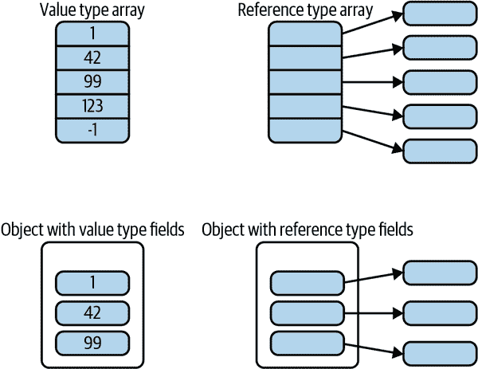

# 第三章\. 类型

C# 不限制我们使用第二章中展示的内置数据类型。你可以定义自己的类型。实际上，你别无选择：如果要编写任何代码，C# 要求该代码必须在一个类型内。我们编写的所有内容，以及我们从 .NET 运行库（或任何其他 .NET 库）中消耗的任何功能，都将属于某一类型。

C# 识别多种类型。我将从最重要的类型开始介绍。

# 类

在 C# 中，你处理的大多数类型将是*类*。类可以同时包含代码和数据，可以选择公开一些特性同时保持其他特性仅在类内可访问。因此，类提供了一种*封装*机制——它们可以为其他人定义一个清晰的公共编程接口，同时保持内部实现细节不可访问。

如果你熟悉面向对象的语言，这一切看起来非常普通。如果不熟悉，你可能需要先阅读一本更入门级的书籍，因为本书不旨在教授编程。我将只描述特定于 C# 类的细节。

我已经在早期章节中展示了类的示例，但让我们更详细地查看结构。示例 3-1 展示了一个简单的类。（参见侧边栏 “命名约定” 以获取有关类型及其成员名称的信息。）

##### 示例 3-1\. 一个简单的类

```cs
public class Counter
{
    private int _count;

    public int GetNextValue()
    {
        _count += 1;
        return _count;
    }
}
```

类定义总是包含关键字 `class`，后跟类的名称。C# 不要求名称与包含文件匹配，也不限制文件中只能有一个类。尽管如此，大多数 C# 项目按约定使类名和文件名匹配。无论如何，类名必须遵循第二章中描述的标识符基本规则，例如，它们不能以数字开头。

示例 3-1 的第一行包含了额外的关键字：`public`。类定义可以选择指定*可访问性*，确定其他代码是否可以使用该类。普通类在这里只有两个选择：`public` 和 `internal`，后者是默认值。（稍后我将展示，你可以将类嵌套在其他类型内，嵌套类的可访问性选项稍宽泛。）内部类仅可在定义它的组件中使用。因此，如果你正在编写一个类库，可以自由定义作为库实现一部分的类：通过将它们标记为 `internal`，你可以阻止外部世界使用它们。

###### 注意

您可以选择将内部类型对选定的外部组件可见。微软有时会在其库中使用此功能。运行库分布在许多 DLL 中，每个 DLL 定义许多内部类型，但某些内部功能由库中的其他 DLL 使用。通过使用 `[assembly: Int⁠ern⁠als​Vis⁠ibl⁠eTo("*name*")]` 属性对组件进行注释，指定希望共享的组件名称。（第 14 章 更详细地描述了此内容。）例如，您可能希望使应用程序中的每个类对测试项目可见，以便可以编写针对不打算公开的代码的单元测试。

示例 3-1 中的 `Counter` 类选择了 `public`，但这并不意味着它必须使所有内容都可访问。它定义了两个成员——一个名为 `_count` 的字段，保存一个 `int`，以及一个名为 `GetNextValue` 的方法，操作该字段中的信息。（当创建 `Counter` 时，CLR 将自动将此字段初始化为 0。）如您所见，这两个成员都有可访问性修饰符。正如面向对象编程非常常见的那样，该类选择将数据成员设为私有，并通过方法公开公共功能。

成员的可访问性修饰符对于成员是可选的，就像对于类一样，如果未指定，则默认为最严格的选项：在这种情况下是 `private`。所以我本可以在 示例 3-1 中省略 `private` 关键字而不改变其含义，但我更喜欢明确指出。（如果您不指定，阅读您代码的人可能会想知道这是故意还是偶然。）

字段保存数据。它们是一种变量，但不像局部变量那样，其作用域和生命周期由其所在的方法决定，字段与其所在的类型相关联。示例 3-1 能够通过其未限定名称引用 `_count` 字段，因为字段在其定义的类中是可见的。但是生命周期如何呢？我们知道，每次方法调用都会得到其自己的一组局部变量。一个类的字段有多少组？这取决于如何定义字段，在这种情况下，每个实例一个。示例 3-2 使用 示例 3-1 中的 `Counter` 类来说明这一点。

##### 示例 3-2\. 使用自定义类

```cs
var c1 = new Counter();
var c2 = new Counter();
Console.WriteLine("c1: " + c1.GetNextValue());
Console.WriteLine("c1: " + c1.GetNextValue());
Console.WriteLine("c1: " + c1.GetNextValue());

Console.WriteLine("c2: " + c2.GetNextValue());

Console.WriteLine("c1: " + c1.GetNextValue());
```

使用 `new` 运算符创建我的类的新实例。由于我使用 `new` 两次，所以我得到两个 `Counter` 对象，每个对象都有自己的 `_count` 字段。因此，正如程序的输出所示，我们得到两个独立的计数：

```cs
c1: 1
c1: 2
c1: 3
c2: 1
c1: 4
```

如您所预期的那样，它开始计数，然后在我们切换到第二个计数器时，新的序列从 1 开始。但当我们回到第一个计数器时，它会从中断处继续。这表明每个实例都有自己的 `_count`。但如果我们不希望如此呢？有时，您会希望跟踪与任何单个对象无关的信息。

## 静态成员

`static` 关键字允许我们声明成员不与类的任何特定实例相关联。示例 3-3 显示了从示例 3-1 修改的 `Counter` 类的修改版本。我添加了两个新成员，均为静态成员，用于跟踪和报告所有实例的计数。

##### 示例 3-3\. 具有静态成员的类

```cs
public class Counter
{
    private int _count;
    `private` `static` `int` `_totalCount``;`

    public int GetNextValue()
    {
        _count += 1;
        `_totalCount` `+``=` `1``;`
        return _count;
    }

    `public` `static` `int` `TotalCount` `=``>` `_totalCount``;`
}
```

`TotalCount` 只报告计数，但它并不执行任何操作 —— 它只是返回类保持更新的一个值。正如我将在“属性”中解释的那样，这使它成为一个理想的属性候选项，而不是一个方法。静态字段 `_totalCount` 跟踪调用 `GetNextValue` 的总次数，与非静态 `_count` 不同，后者只跟踪当前实例的调用次数。

###### 注意

`=>` 语法在 `TotalCount` 属性中让我们使用单个表达式定义属性 —— 在这种情况下，每当代码读取 `Counter.TotalCount` 属性时，结果将是 `_totalCount` 字段的值。正如我们将在后面看到的，有更复杂的属性编写方法，但这是简单只读属性的常见方法。

请注意，我可以在 `GetNextValue` 中以与非静态 `_count` 相同的方式使用该静态字段。如果我在 示例 3-2 的代码末尾添加所示的代码行到 示例 3-4，则行为差异显而易见。

##### 示例 3-4\. 使用静态属性

```cs
Console.WriteLine(Counter.TotalCount);
```

此行显示 5，即两个计数的总和。要访问静态成员，我只需写 `*ClassName*.*MemberName*`。事实上，示例 3-4 使用了两个静态成员 —— 除了我的类的 `TotalCount` 属性，还使用了 `Console` 类的静态 `WriteLine` 方法。

因为我将 `TotalCount` 声明为静态属性，所以它包含的代码只能访问其他静态成员。如果它尝试使用非静态 `_count` 字段或调用非静态 `GetNextValue` 方法，编译器会抱怨。将 `TotalCount` 属性中的 `_totalCount` 替换为 `_count` 将导致此错误：

```cs
error CS0120: An object reference is required for the non-static field, method,
 or property Counter._count'
```

由于非静态字段与类的特定实例相关联，C#需要知道使用哪个实例。对于非静态方法或属性，将是调用该方法或属性的实例。因此，在示例 3-2 中，我写了`c1.GetNextValue()`或`c2.GetNextValue()`以选择使用我两个对象中的哪一个。C#将存储在`c1`或`c2`中的引用作为隐含的隐藏第一个参数传递。您可以通过使用`this`关键字从类内部的代码获取该引用。示例 3-5 展示了我们可以如何以替代方式编写来自示例 3-3 的`GetNextValue`方法的第一行，显式指示我们相信`_count`是在调用`GetNextValue`方法的实例中的成员。

##### 示例 3-5\. `this`关键字

```cs
this._count += 1;
```

有时由于名称冲突，需要通过`this`进行显式成员访问。尽管类的所有成员对同一类中的任何代码都在范围内，但方法中的代码与类不共享*声明空间*。从第二章中记住，声明空间是一个代码区域，在其中单个名称不能引用两个不同的实体，因为方法不与包含类共享它们的空间，您可以声明与类成员名称相同的局部变量和方法参数。如果不使用下划线前缀等约定，这很容易发生。在这种情况下，您不会收到错误提示——局部变量和参数只是隐藏类成员。但您仍然可以通过使用`this`限定访问来访问类成员。

静态方法不能使用`this`关键字，因为它们不与任何特定实例相关联。

## 静态类

有些类仅提供静态成员。在`Sys⁠tem.​Thr⁠ead⁠ing`命名空间中有几个示例，其中包含提供多线程工具的各种类。例如，`Interlocked`类提供原子、无锁、读取-修改-写入操作；`LazyInitializer`类提供在保证避免多线程环境中的双重初始化的情况下执行延迟初始化的辅助方法。这些类仅通过静态方法提供服务。创建这些类型的实例没有意义，因为它们无法保存有用的每个实例信息。

通过在`class`关键字前加上`static`关键字，您可以声明您的类意在以此方式使用。这种编译方式会阻止对其进行实例化。任何试图构造此类实例的人显然不理解其功能，因此编译器错误将是对文档的有用提示。

您可以声明希望能够在某些类上调用静态方法，而无需每次都命名类。如果您正在编写大量使用特定类型提供的静态方法的代码，则这可能会很有用。（顺便说一句，这不仅限于静态类。您可以将此技术用于具有静态成员的任何类，但对其成员全为静态的类最有用。）示例 3-6 使用了`Math`类（位于`System`命名空间）的静态方法（`Sin`）和静态属性（`PI`）。它还使用了`Console`类的静态`WriteLine`方法。（我在这个例子和下一个例子中展示了整个源文件，因为`using`指令特别重要。第一个例子不需要`using System;`，因为默认的隐式全局`using`使其在任何地方都可用。）

##### 示例 3-6\. 正常使用静态成员

```cs
public static class Normal
{
    public static void UseStatics()
    {
        Console.WriteLine(Math.Sin(Math.PI / 4));
    }
}
```

示例 3-7 完全等效，但调用三个静态成员的行没有使用其定义类的名称限定。

##### Example 3-7\. 使用静态成员而不进行显式限定

```cs
using static System.Console;
using static System.Math;

public static class WithoutQualification
{
    public static void UseStatics()
    {
        WriteLine(Sin(PI / 4));
    }
}
```

要使用这种更简洁的替代方法，必须使用`using static`指令声明要以这种方式使用的类。虽然`using`指令通常指定一个命名空间，使该命名空间中的类型无需限定即可使用，但`using static`指令指定一个类，使其静态成员无需限定即可使用。顺便说一句，正如您在第一章中看到的，C# 10.0 允许您在`using`指令中添加`global`关键字。这对`using static`指令也有效，因此，如果您希望`Math`类型的静态成员在项目中的任何文件中无需限定即可使用，只需在一个文件中编写`global using static System.Math;`，它将适用于所有文件。

# 记录

尽管封装是软件开发中管理复杂性的强大工具，有时仅使用保存信息的类型可能也很有用。例如，我们可能希望表示通过网络发送的消息，或者数据库中表中的一行。专为此设计的类型有时被称为*POD 类型*，其中 POD 代表简单旧数据。我们可以尝试通过编写一个只包含公共字段的类来实现这一点，正如示例 3-8 所示。

##### 示例 3-8\. 简单旧数据，使用公共字段

```cs
public class Person
{
    public string? Name;
    public string? FavoriteColor;
}
```

这里可能会有些开发人员对缺乏封装性感到恐惧。没有阻止任何人直接访问`Person`实例并改变字段的方法——哦，天哪！在做任何不仅仅是保存一些数据的类型时，这确实可能会引发问题。类型的方法可能包含依赖于这些字段以特定方式使用的代码，而将字段公开的问题在于任何东西都可能改变它们，使得难以知道它们将处于什么状态。但是这种类型没有代码——它的唯一工作就是保存一些数据，所以这并不会是世界末日。话虽如此，这个例子确实带来了一个问题：这些字段包含字符串，但我必须在类型名称后面加上一个`?`。这表示这些字段可能包含特殊值`null`。如果我不添加这些`?`修饰符，编译器会警告我，告诉我没有做任何事情来确保这些字段被适当初始化，因此我不应该声称它们肯定包含字符串。如果我想要确保这些字段始终具有非空值，我需要控制类型如何初始化，这可以通过编写*构造函数*来实现。稍后在本章节中我会更详细地描述这些内容，但是示例 3-9 展示了一个简单的示例，确保这些字段被初始化，使我们能够移除`?`修饰符。

##### 示例 3-9\. 通过构造函数强制初始化字段

```cs
public class Person
{
    public string Name;
    public string FavoriteColor;

    public Person(string name, string favoriteColor)
    {
        this.Name = name;
        this.FavoriteColor = favoriteColor;
    }
}
```

看起来现在有些啰嗦了。记录类型提供了编写普通数据类型的更简单方式，就像示例 3-10 所示。

##### 示例 3-10\. 一种具有位置语法的记录类型

```cs
public record Person(string Name, string FavoriteColor);
```

示例 3-11 展示了我们如何使用这种记录类型。如果我们有一个变量指向一个`Person`，比如`ShowPerson`方法中的`p`参数，我们可以写`p.Name`和`p.FavoriteColor`来访问它包含的数据，就像在示例 3-8 或 3-9 中定义`Person`一样。（我的记录类型并非完全等价。之前的示例都定义了公共字段，但是示例 3-11 更符合正常的 .NET 实践，因为它将`Name`和`FavoriteColor`定义为属性。我稍后在本章节将更详细地描述属性。）如您所见，我们使用`new`关键字创建记录类型的实例，就像创建类一样。当记录类型定义方式如示例 3-10 所示时，我们必须按正确的顺序将所有属性传递给构造函数。这种定义记录的方式称为*位置语法*。

##### 示例 3-11\. 使用记录类型

```cs
void ShowPerson(Person p)
{
    Console.WriteLine($"{p.Name}'s favorite color is {p.FavoriteColor}");
}

var ian = new Person("Ian", "Blue");
var deborah = new Person("Deborah", "Green");
ShowPerson(ian);
ShowPerson(deborah);
```

当您使用示例 3-10 中的语法时，生成的记录类型是不可变的：如果您编写了试图修改现有`Person`的任一属性的代码，编译器将报告错误。不可变数据类型可以使代码分析变得更加容易，尤其是多线程代码，因为您可以确保它们在您脚下不会改变。这也是 .NET 中字符串不可变的原因之一。然而，在引入记录类型之前，在 C# 中使用不可变自定义类型通常是不方便的。例如，如果您需要生成某个新值，它是现有值的修改版本，那么您可能需要进行大量乏味的工作。而内置的`string`类型提供了许多方法来生成由现有字符串构建的新字符串（例如子字符串，或转换为小写或大写），而在编写类时，您就需要自己实现这些方法。

例如，假设您正在编写一个应用程序，其中定义了一种数据类型，表示某人在特定时间点的支付账户状态。如果将其定义为不可变类型，则在处理新交易时，您需要创建一个除当前余额外完全相同的副本。在 C# 中，以往的做法意味着在创建新实例时需要编写代码来复制任何未更改的数据。记录类型的主要目的之一是更容易地定义和使用不可变数据类型，因此它们提供了一种简便的方法来创建具有某些属性修改的现有实例的副本，正如示例 3-12 所示，您可以在记录表达式之后写上`with`，然后是一对大括号括起来的您想要更改的属性列表。

##### 示例 3-12\. 创建一个不可变记录的修改副本

```cs
var startingRecord = new Person("Ian", "Blue");
var modifiedCopy = startingRecord with
{
    FavoriteColor = "Green"
};
```

在这种特定情况下，我们的类型只有两个属性，所以与仅写`new Person(startingRecord.Name, "Green")`相比，并没有显著的改进。然而，对于具有更多属性的记录而言，这种语法比每次重新构建整个对象要方便得多。

虽然记录类型使得创建和使用不可变数据类型变得更加容易，但它们并不一定非要是不可变的。如示例 3-13 所示，`Person`记录允许在构建后修改属性。（`{ get; set; }`语法表示这些是自动实现的属性。我稍后会更详细地描述它们，但它们基本上只是简单的读/写属性。）

##### 示例 3-13\. 具有可修改属性的记录类型

```cs
public record Person
{
    public Person(string name, string favoriteColor)
    {
        this.Name = name;
        this.FavoriteColor = favoriteColor;
    }

    public string Name { get; set; }
    public string FavoriteColor { get; set; }
}
```

此时，我们几乎回到了示例 3-9 中的情况，唯一的区别是`Name`和`FavoriteColor`现在是属性而不是字段。在这个示例中，我们只需将`record`关键字替换为`class`，代码仍然可以编译。那么，当我们将其定义为`record`时究竟发生了什么呢？

尽管记录的主要目的是简化构建不可变数据类型，`record`关键字还增加了一些有用的特性。除了用于构建修改副本的`with`语法外，记录还获得了内置的相等性测试支持和一个`ToString`实现，该实现报告所有属性值。相等性测试使您能够使用`==`运算符比较两个记录，只要它们的所有属性值相同，它们就被视为相等。通过`Equals`方法也可以实现相同的功能。所有类型都提供一个`Equals`方法（稍后我会更详细地描述），记录安排了这个方法来提供基于值的比较。您可能想知道为什么记录类型在这方面是特殊的——`Equals`对所有类型都起作用吗？并非如此。看看示例 3-14。

##### 示例 3-14\. 比较两个类型的实例

```cs
var p1 = new Person("Ian", "Blue");
var p2 = new Person("Ian", "Blue");
if (p1 == p2)
{
    Console.WriteLine("Equal");
}
```

如果您对早期示例中定义的任何`Person`类型之一运行此代码，作为`record`类型，它将显示文本`Equal`。但是，如果您使用示例 3-9 中`Person`的定义（它定义为`class`），则不会显示该消息。即使所有属性都具有相同的值，`Equals`也会报告它们在这种情况下不相等。这是因为类的默认比较行为是基于标识的：只有当两个变量引用完全相同的对象时它们才相等。当变量引用两个不同的对象时，即使这些对象具有完全相同的类型和所有相同的属性和字段值，它们仍然是不同的，`Equals`反映了这一点。您可以在编写类时更改此行为，但必须编写自己的`Equals`方法。对于`record`，编译器会为您生成这个方法。

记录还提供的另一种行为是专门的`ToString`实现。.NET 中的所有类型都提供`ToString`方法，您可以直接调用它，也可以通过某些隐式调用它的机制，比如字符串插值。对于不提供自己的`ToString`的类型，默认实现只是返回类型名称，因此如果您在示例 3-9 中定义的类上调用`ToString`，它将始终返回`"Person"`，无论成员的值是什么。类型可以提供自己的`ToString`，编译器会为任何记录类型为您执行此操作。因此，如果您在示例 3-14 中创建的任何一个`Person`实例上调用`ToString`，它将返回`"Person { Name = Ian, FavoriteColor = Blue }"`。

您可以定义具有其类型也是记录类型的属性的记录。示例 3-15 定义了一个`Person`记录类型，还定义了一个`Relation`记录类型，用于指示两个人之间的某种关系。

##### 示例 3-15\. 嵌套记录类型

```cs
public record Person(string Name, string FavoriteColor);
public record Relation(Person Subject, Person Other, string RelationshipType);
```

当你有这种复合结构——记录内部的记录——`Equals` 和 `ToString` 都会遍历到嵌套记录中。示例 3-16 演示了这一点。

##### 示例 3-16\. 使用嵌套记录类型

```cs
var ian = new Person("Ian", "Blue");
var gina = new Person("Gina", "Green");
var ian2 = new Person("Ian", "Blue");
var gina2 = new Person("Gina", "Green");
var r1 = new Relation(ian, gina, "Sister");
var r2 = new Relation(gina, ian, "Brother");
var r3 = new Relation(ian2, gina2, "Sister");

Console.WriteLine(r1);
Console.WriteLine(r2);
Console.WriteLine(r3);
Console.WriteLine(r1 == r2);
Console.WriteLine(r1 == r3);
Console.WriteLine(r2 == r3);
```

运行此示例将产生以下输出（为了适应页面而将行拆分）：

```cs
Relation { Subject = Person { Name = Ian, FavoriteColor = Blue },
 Other = Person { Name = Gina, FavoriteColor = Green },
 RelationshipType = Sister }
Relation { Subject = Person { Name = Gina, FavoriteColor = Green },
 Other = Person { Name = Ian, FavoriteColor = Blue },
 RelationshipType = Brother }
Relation { Subject = Person { Name = Ian, FavoriteColor = Blue },
 Other = Person { Name = Gina, FavoriteColor = Green },
 RelationshipType = Sister }
False
True
False
```

如你所见，`Relation` 类型的 `ToString` 方法展示了每个嵌套 `Person` 记录的所有属性（以及 `RelationshipType` 属性，它只是一个普通的 `string`）。同样，比较逻辑也适用于嵌套记录。 这里没有什么特别的情况——记录类型逐个属性进行比较，通过对比每个属性的值调用该属性的 `Equals` 方法，传递与其比较的记录相应的属性。因此，当它碰巧到达记录类型属性时，它会像对待任何其他属性一样调用其 `Equals` 方法，在这一点上，该记录类型自己的 `Equals` 实现将执行，逐个比较每个嵌套属性。

我描述的 `record` 关键字的特性，你都可以手动实现。编写相应的 `ToString` 和 `Equals` 的等效实现虽然很繁琐，但并不复杂。 （编译器还提供了 `==` 和 `!=` 操作符的实现以及名为 `GetHashCode` 和 `Deconstruct` 的方法，稍后我将描述这些方法。但你也可以手动编写所有这些内容。）就 .NET 运行时而言，记录类型没有什么特别之处——它只是将它们视为普通类。

记录类型是一种语言级别的特性。 C# 编译器以这种方式生成这些类型，以便它可以识别外部库中声明为记录的类型，¹ 但它们本质上只是编译器为其生成了一些额外成员的类。 实际上，你可以通过将类型声明为 `record class` 而不仅仅是 `record` 来明确此点——这两种语法是等效的。

# 引用和空值

使用 `class` 关键字定义的任何类型都将是*引用类型*（同样适用于声明为 `record` 或等效的 `record class`）。任何引用类型的变量都不会包含构成类型实例的数据；相反，它可以包含对类型实例的*引用*。因此，赋值操作不会复制对象，只会复制引用。示例 3-17 几乎包含与 示例 3-2 相同的代码，但是不是使用 `new` 关键字初始化 `c2` 变量，而是用 `c1` 的副本初始化它。

##### 示例 3-17\. 复制引用

```cs
Counter c1 = new Counter();
`var` `c2` `=` `c1``;`
Console.WriteLine("c1: " + c1.GetNextValue());
Console.WriteLine("c1: " + c1.GetNextValue());
Console.WriteLine("c1: " + c1.GetNextValue());

Console.WriteLine("c2: " + c2.GetNextValue());

Console.WriteLine("c1: " + c1.GetNextValue());
```

因为此示例仅使用了一次 `new`，所以只有一个 `Counter` 实例，并且两个变量都引用同一个实例。因此，我们得到不同的输出：

```cs
c1: 1
c1: 2
c1: 3
c2: 4
c1: 5
```

不仅是局部变量会这样—如果您为任何其他类型的变量使用引用类型，例如字段或属性，赋值方式也是相同的，复制的是引用而不是整个对象。这是引用类型的定义特征，与我们在 第二章 中看到的内置数值类型的行为不同。对于内置数值类型，每个变量包含一个值而不是值的引用，因此赋值必然涉及到复制该值。（这种值复制行为对于大多数引用类型是不可用的—请参见下一个侧边栏，“复制实例”。）

我们可以编写代码来检测两个引用是否指向同一个东西。 示例 3-18 安排了三个变量引用两个具有相同计数的计数器，然后比较它们的标识。默认情况下，当其操作数为引用类型时，`==` 运算符确实执行这种对象标识比较。然而，类型允许重新定义 `==` 运算符。 `string` 类型更改 `==` 以执行值比较，因此如果将两个不同的字符串对象作为 `==` 的操作数传递，如果它们包含相同的文本，则结果将为真。如果要强制进行对象标识比较，可以使用静态的 `object.ReferenceEquals` 方法。

##### 示例 3-18\. 比较引用

```cs
var c1 = new Counter();
c1.GetNextValue();
Counter c2 = c1;
var c3 = new Counter();
c3.GetNextValue();

Console.WriteLine(c1.Count);
Console.WriteLine(c2.Count);
Console.WriteLine(c3.Count);
Console.WriteLine(c1 == c2);
Console.WriteLine(c1 == c3);
Console.WriteLine(c2 == c3);
Console.WriteLine(object.ReferenceEquals(c1, c2));
Console.WriteLine(object.ReferenceEquals(c1, c3));
Console.WriteLine(object.ReferenceEquals(c2, c3));
```

输出的前三行证实了所有三个变量都引用具有相同计数的计数器：

```cs
1
1
1
True
False
False
True
False
False
```

它还说明了，尽管它们都有相同的计数，只有 `c1` 和 `c2` 被认为是同一件事。这是因为我们将 `c1` 赋值给了 `c2`，这意味着 `c1` 和 `c2` 都将引用同一个对象，这就是为什么第一个比较成功的原因。但是 `c3` 引用的是完全不同的对象（即使它恰好具有相同的值），这就是第二个比较失败的原因。（我在这里同时使用了 `==` 和 `object.ReferenceEquals` 比较来说明它们在这种情况下是一样的，因为 `Counter` 没有定义 `==` 的自定义含义。）

我们可以尝试用 `int` 而不是 `Counter` 做同样的事情，正如 示例 3-19 所示。（这样做是为了尽可能地模仿 示例 3-18 的初始化变量方式。）

##### 示例 3-19\. 比较值

```cs
int c1 = new int();
c1++;
int c2 = c1;
int c3 = new int();
c3++;

Console.WriteLine(c1);
Console.WriteLine(c2);
Console.WriteLine(c3);
Console.WriteLine(c1 == c2);
Console.WriteLine(c1 == c3);
Console.WriteLine(c2 == c3);
Console.WriteLine(object.ReferenceEquals(c1, c2));
Console.WriteLine(object.ReferenceEquals(c1, c3));
Console.WriteLine(object.ReferenceEquals(c2, c3));
Console.WriteLine(object.ReferenceEquals(c1, c1));
```

与之前一样，我们可以看到所有三个变量具有相同的值：

```cs
1
1
1
True
True
True
False
False
False
False
```

这也说明了`int`类型为`==`定义了一种特殊含义。对于`int`，此运算符比较值，因此这三个比较都成功了。但对于值类型，`object.ReferenceEquals`永远不会对值类型成功—事实上，在这里我添加了一个额外的第四个比较，将`c1`与自身进行比较，甚至那个也失败了！这个令人惊讶的结果是因为使用`int`进行引用比较是没有意义的—它不是引用类型。编译器必须对示例 3-19 中的最后四行执行从`int`到`object`的隐式转换：它对`object.ReferenceEquals`的每个参数进行了称为*装箱*的操作，我们将在第七章中详细讨论这一点。每个参数都获得了一个独立的装箱，这就是为什么即使最后的比较也失败的原因。

引用类型和`int`等类型之间还有另一个区别。默认情况下，任何引用类型变量都可以包含特殊值`null`，这意味着变量根本不引用任何对象。您无法将此值分配给任何内置数值类型（尽管请参见下一侧边栏，“`Nullable<T>`”）。

## 用非可空引用消除空值

程序设计语言中广泛存在空引用的可能性可以追溯到 1965 年，当时计算机科学家 Tony Hoare 将其添加到具有高度影响力的 ALGOL 语言中。他后来为此发明道歉，称这是他的“十亿美元错误”。引用类型变量可能包含`null`的可能性使得难以确定是否安全地尝试使用该变量执行操作。（在 C# 程序中，如果尝试这样做，将抛出`NullReferenceException`，通常会导致程序崩溃。第八章讨论了异常。）一些现代编程语言通过类型系统中的显式选择性机制，避免了默认允许引用为空的做法，而是提供某种可选值系统。事实上，就像你在`Nullable<T>`中看到的那样，对于内置数值类型（以及我们将看到的任何自定义值类型），这已经是事实，但直到最近，对于所有引用类型变量来说，空性并不是可选的。

C# 8.0 引入了一个重要的新功能，可以扩展语言的类型系统，以区分可能为空的引用和不得为空的引用。在 C# 10.0 之前，默认情况下此功能是禁用的，但现在创建新项目时将启用此功能。这个功能被称为*可空引用*，这个名字似乎有些奇怪，因为自 C# 1.0 起引用就能包含`null`。然而，这个名字指的是启用此功能后，空引用成为一种选择性功能：一个引用不会包含`null`，除非明确定义为可空引用。至少，这是理论上的说法。

###### 警告

让类型系统能够区分可空和非可空引用始终是一件棘手的事情，特别是在语言已有近二十年历史的情况下。因此，事实上 C# 不能始终保证非可空引用永远不会包含 `null`。然而，如果满足某些约束条件，它可以做出这种保证，而且更一般地说，即使在无法绝对排除这种情况的情况下，它也将显著减少遇到 `NullReferenceException` 的机会。

启用非空性是一项重大变革，这也是为什么直到最近，该功能默认情况下是关闭的，直到您明确启用它为止。（即使现在，使用 C# 10.0，新创建的 *.csproj* 文件包含打开此功能的设置。没有该设置，该功能仍然默认关闭。）打开它可能会对现有代码产生显著影响，因此可以在更细粒度的级别控制此功能，以在旧世界和新的可空引用感知世界之间实现渐进过渡。

C# 提供了两个控制维度，它称之为*可空注解上下文*和*可空警告上下文*。C# 程序中的每行代码都与这两种上下文中的一种相关联。默认情况下，所有代码都处于*禁用*的可空注解上下文和*禁用*的可空警告上下文中。您可以在项目级别更改这些默认设置（新创建的 C# 10.0 项目将会这样做）。您还可以使用 `#nullable` 指令在更精细的级别更改任一可空注解上下文，如果需要的话，甚至可以每行代码都不同。那么这两个上下文是如何工作的呢？

可空注解上下文确定我们是否可以声明使用引用类型的特定变量的可空性。（我在这里使用 C# 更广泛的*变量*定义，不仅包括局部变量，还包括字段、参数和属性。）在禁用的注解上下文中（默认情况下），我们无法表达这一点，所有引用都被隐式地视为可空。官方分类将这些描述为对空性*无视*，将其与您故意注释为可空的引用区分开来。然而，在启用的注解上下文中，我们可以选择。示例 3-20 展示了如何实现这一点。

##### 示例 3-20\. 指定可空性

```cs
string cannotBeNull = "Text";
string? mayBeNull = null;
```

这与内置数值类型和自定义值类型的空值语法相呼应。如果您只写类型名称，则表示非可空。如果您希望其可空，则附加一个 `?`。

这里最重要的一点是，在启用的可空注解上下文中，旧语法将获得新行为，如果您需要旧行为，则需要使用新语法。这意味着，如果您将原本没有任何空值感知的现有代码放入启用的注解上下文中，*所有* 引用类型变量现在实际上被标注为非可空，这与编译器在之前对完全相同代码的处理方式相反。

将代码放入启用的可空注解上下文的最直接方式是使用 `#nullable enable annotations` 指令。您可以将其放在源文件的顶部以启用整个文件，或者可以更局部地使用它，然后跟随 `#nullable restore annotations` 来恢复项目范围的默认设置。单独使用此指令不会产生任何可见变化。如果禁用了可空警告上下文（默认情况下是禁用的），编译器不会对这些注解进行处理。您可以使用 `#nullable enable warnings` 在本地启用它（`#nullable restore warnings` 可以恢复为项目范围的默认设置）。您可以通过在 *.csproj* 文件中添加 `<Nullable>` 属性来控制项目范围的默认设置。示例 3-21 将默认设置为启用的可空警告上下文和启用的可空注解上下文。您将在任何新创建的 C# 10.0 项目中找到此类设置（无论是从 Visual Studio 创建还是使用命令行的 `dotnet new`）。

##### 示例   示例 3-21\. 指定作为项目范围默认启用的可空警告和注解上下文

```cs
<PropertyGroup>
  <Nullable>enable</Nullable>
</PropertyGroup>
```

这意味着所有代码将位于启用的可空警告上下文和启用的可空注解上下文中，除非明确选择退出。其他项目范围的设置包括 `disable`（与不设置 `<Nullable>` 具有相同效果）、`warnings`（启用警告但不启用注解）和 `annotations`（启用注解但不启用警告）。

如果您在项目级别指定了启用的注解上下文，可以使用 `#nullable disable annotations` 来在单个文件中退出。同样，如果您在项目级别指定了启用的警告上下文，可以使用 `#nullable disable warnings` 来退出。

我们拥有这些精细的控制功能，使得在现有代码中启用非空性变得更加容易。如果你一步到位地为整个项目完全启用了这一功能，可能会遇到大量警告。实际操作中，更有意义的做法可能是将项目中所有代码放在启用警告的上下文中，但不要一开始就启用任何注解。因为你的所有引用都将对空值检查视而不见，你所看到的唯一警告将与库的使用有关。在这个阶段，任何警告很可能都表明存在潜在问题，例如，缺少空值的测试。一旦解决了这些问题，你可以开始逐个文件（或者更小的块，如果你喜欢的话）将自己的代码移到启用注解的上下文中，并进行必要的更改。

随着时间的推移，目标是使所有代码达到可以在项目级别完全启用非空支持的程度。对于新创建的项目，最好从一开始就启用可空引用，以防止问题的空值处理进入你的代码——这就是为什么新项目默认启用此功能的原因。

在我们完全启用了非空性支持的代码中，编译器对我们做了什么？我们主要得到了两个东西。首先，编译器使用类似于确定赋值规则的规则，以确保我们在尝试解引用变量之前先检查它是否为空。示例 3-22 展示了一些编译器将接受的情况，以及在启用了可空性警告上下文的情况下会导致警告的情况，假设 `mayBeNull` 在启用了可空性注解上下文中声明为可空。

##### 示例 3-22\. 解引用可空引用

```cs
if (mayBeNull is not null)
{
    // Allowed because we can only get here if mayBeNull is not null
    Console.WriteLine(mayBeNull.Length);
}

// Allowed because it checks for null and handles it
Console.WriteLine(mayBeNull?.Length ?? 0);

// The compiler will warn about this in an enabled nullable warning context
Console.WriteLine(mayBeNull.Length);
```

其次，除了检查解引用（使用 `.` 访问成员）是否安全外，编译器还会在你尝试将可能为空的引用分配给需要非空引用的位置时发出警告，或者当你将一个可能为 null 的引用作为参数传递给方法时，该方法的相应参数声明为非空时也会发出警告。

有时，在将所有代码移入完全启用的空安全上下文的道路上，您会遇到障碍。也许您依赖于一些组件，这些组件在可预见的将来不太可能被升级为带有空安全注解，或者可能存在一些情况，C# 的保守安全规则错误地认定某些代码不安全。在这些情况下，您可以怎么做？您不希望为整个项目禁用警告，并且在代码中留下`#nullable`指令将会很烦人。虽然您可以通过添加对`null`的显式检查来防止警告，但在您确信这些检查是不必要的情况下，这种方式并不理想。还有一种替代方案：您可以告诉 C# 编译器您知道一些它不知道的事情。如果您有一个引用，编译器假定它可能为 null，但您有充分理由相信它永远不会为 null，您可以通过使用*空值宽容运算符*来告知编译器，您可以在示例 3-23 的第二行末尾看到它。它有时被非正式地称为*该死的运算符*，因为它看起来像是一种略带恼怒的断言。

##### 示例 3-23\. 空值宽容运算符

```cs
string? referenceFromLegacyComponent = legacy.GetReferenceWeKnowWontBeNull();
string nonNullableReferenceFromLegacyComponent = referenceFromLegacyComponent!;
```

在任何启用了可空注解的上下文中，您可以使用空值宽容运算符。它的作用是将可空引用转换为非可空引用。然后，您可以继续对该非可空引用进行解引用或在不允许可空引用的地方使用它，而不会引发任何编译器警告。

###### 警告

空值宽容运算符不会检查其输入。如果您在运行时应用于值为 null 的情况，它将不会检测到这一点。相反，在您尝试使用引用的位置时，将会在运行时出现错误。

虽然空值宽容运算符在可空感知代码与您无法控制的旧代码之间的边界处很有用，但还有另一种方法可以告诉编译器，明显可为空的表达式实际上不会为 null：可空属性。 .NET 定义了几个属性，您可以使用它们来注释代码，描述它们何时会或不会返回 null 值。考虑示例 3-24 中的代码。如果您没有启用可空引用类型功能，这将运行正常，但如果您启用它们，您将收到警告。（这使用了一个字典，这是一种在第五章中详细描述的集合类型。）

##### 示例 3-24\. 空安全性与尝试模式——在可空引用类型之前

```cs
public static string Get(IDictionary<int, string> d)
{
    if (d.TryGetValue(42, out string s))
    {
        return s;
    }

    return "Not found";
}
```

当完全启用了可空性时，编译器会抱怨 `out string s`。它会正确地告诉你，`TryGetValue` 可能通过 `out` 参数传递 `null`。 （这种参数稍后会讨论；它提供了一种在主返回值之外返回额外值的方式。）此函数检查字典是否包含指定键的条目。如果有，它将返回 `true` 并将相关值放入 `out` 参数中，但如果没有，则返回 `false` 并将 `out` 参数设置为 `null`。我们可以修改我们的代码以反映这一事实，方法是在 `out string` 后面加一个 `?`。示例 3-25 显示了这个修改。

##### 示例 3-25\. 使用 Try 模式时注意可空性

```cs
public static string Get(IDictionary<int, string> d)
{
    if (d.TryGetValue(42, out string? s))
    {
        return s;
    }

    return "Not found";
}
```

你可能会期待这会带来一个新问题。我们的 `Get` 方法返回一个 `string`，而不是 `string?`，那么 `return s` 怎么可能正确呢？我们刚刚修改了代码以指示 `s` 可能为 null，那么当我们试图从声明不返回 `null` 的方法中返回这个可能为 null 的值时，编译器难道不会抱怨吗？但事实上，这个是可以编译通过的。编译器接受这个是因为它知道 `TryGetValue` 只会在返回 `false` 时将 `out` 参数设置为 `null`。这意味着编译器知道虽然 `s` 变量的类型是 `string?`，但在 `if` 语句体内它不会是 `null`。它知道这一点是因为在 `TryGetValue` 方法的定义中应用了一个可空属性。（属性在第十四章中描述。）示例 3-26 显示了该方法声明中的属性。（这个方法是泛型类型的一部分，这就是为什么我们看到这里的是 `TKey` 和 `TValue` 而不是我例子中使用的 `int` 和 `string` 类型。第四章详细讨论了这种方法。在手头的例子中，`TKey` 和 `TValue` 实际上是 `int` 和 `string`。）

##### 示例 3-26\. 可空属性示例

```cs
public bool TryGetValue(TKey key, [MaybeNullWhen(false)] out TValue value)
```

这个注解告诉 C# 如果 `TryGetValue` 返回 `false`，值可能是 `null`，但如果返回 `true`，则不会是 `null`。如果没有这个属性，即使启用了可空警告，示例 3-24 也会成功编译，因为我使用 `IDictionary<int, string>` 而不是 `IDictionary<int, string?>` 表示我的字典不允许空值。因此，通常情况下，C# 会假设当方法从字典返回值时，它也会产生一个 `string`。但是 `TryGetValue` 有时没有值可返回，这就是为什么它需要这个注解。表 3-1 描述了可以应用的各种属性，以便向 C# 编译器提供有关可能是 `null` 或不是 `null` 的更多信息。

表 3-1\. 可空属性

| **类型** | **用法** |
| --- | --- |
| `AllowNull` | 即使类型不可空，代码也允许提供 `null`。 |
| `DisallowNull` | 即使类型可为空，代码也不能提供 `null`。 |
| `MaybeNull` | 代码应准备好即使类型为非可空也可能返回 `null` 值。 |
| `MaybeNullWhen` | 仅与 `out` 或 `ref` 参数一起使用；如果方法返回指定的 `bool` 值，则输出可能为 `null`。 |
| `NotNull` | 用于参数。如果方法返回而没有错误，则参数不是`null`。（对于带有 `out` 或 `ref` 参数，这通常意味着方法确保设置它们；对于仅入站参数，这意味着方法检查值并且仅在其不是 `null` 时返回而没有错误。） |
| `NotNullWhen` | 仅与 `out` 或 `ref` 参数一起使用；如果方法返回指定的 `bool` 值，则输出可能不为 `null`。 |
| `NotNullIfNotNull` | 如果将非 `null` 值作为此属性命名的参数的参数传递，则此属性目标返回的值不会为 `null`。 |

这些属性已经适用于大多数 .NET 运行时库，以减少采用可空引用时涉及的摩擦。

将代码移到已启用的可空警告和注释上下文中可以显著提高代码质量。许多将现有代码库迁移的开发人员通常在此过程中发现一些潜在的错误，这要归功于编译器执行的额外检查。然而，它并非完美。需要注意的是有两个盲点，因为从一开始就没有在类型系统中包含可空性。首先是遗留代码引入的问题，即使您的所有代码都在启用了可空注释上下文中，如果使用的 API 不是，则从中获取的引用将对可空性视而不见。如果需要使用空值宽容操作符来使编译器满意，那么总有可能出错，到那时您将会在一个应该是非空变量的地方得到一个 `null`。第二个问题更为恼人，即使您从一开始就完全启用了此功能，某些 .NET 中的存储位置在初始化时会填充零值。如果这些位置是引用类型，则最终将以 `null` 值开始，目前 C# 编译器无法强制执行其非空性。数组存在此问题。参见 例子 3-27。

##### 例 3-27\. 数组和可空性

```cs
var nullableStrings = new string?[10];
var nonNullableStrings = new string[10];
```

这段代码声明了两个字符串数组。第一个使用了`string?`，因此允许可空引用。第二个则不允许。然而，在.NET 中，您必须先创建数组，然后才能放置任何内容，并且新创建的数组的内存始终是零初始化的。这意味着我们的`nonNullableStrings`数组在初始时会被填满`null`。由于.NET 中数组的工作方式，无法避免这一点。减轻这个问题的一种方法是避免直接使用数组。如果使用`List<string>`代替（参见第五章），它将仅包含您添加的项 —— 不像数组，`List<T>`不提供一种初始化它的空槽的方法。但是，并不总是可以用`List<T>`替代数组。有时您只需确保初始化数组的所有元素。

在值类型的字段中存在类似问题，在下一节中进行了描述。如果它们具有引用类型的字段，则存在无法防止其初始化为`null`的情况。因此，可空引用功能并不完美。尽管如此，它仍然非常有用。已经对现有项目进行了必要的更改以使用它的团队报告称，这个过程往往会发现许多以前未发现的错误。这是提高代码质量的重要工具。

尽管非空引用减少了引用类型和内置数值类型之间的某些区别，但仍然存在重要差异。`int`类型的变量不是指向`int`的引用。它包含`int`的值 —— 没有间接引用。在某些语言中，引用类型和值类型的行为选择取决于类型的使用方式，但在 C#中，这是类型的固定特性。任何特定类型要么是引用类型，要么是*值类型*。所有内置数值类型都是值类型，如`bool`，而`class`始终是引用类型。但这并不是内置类型和自定义类型之间的区别。您可以编写自定义值类型。

# 结构体

有时，对于自定义类型来说，使其具有与内置值类型相同的行为是合适的。最明显的例子是自定义数值类型。虽然 CLR 提供各种内置数值类型，但某些类型的计算需要比它们提供的更多结构。例如，许多科学和工程计算使用复数。运行时不定义这些的内在表示，但运行时库通过`Complex`类型支持它们。如果像这样的数值类型表现与内置类型显著不同，这将是没有帮助的。幸运的是，它并没有，因为它是一个值类型。编写自定义值类型的方法是使用`struct`关键字，而不是`class`。

一个结构体可以拥有与类几乎相同的特性；它可以包含方法、字段、属性、构造函数和类支持的任何其他成员类型（在“Members”中描述），我们可以使用相同的访问权限关键字，如`public`和`internal`。有一些限制，但是对于我之前编写的简单`Counter`类型，我*可能*只需将`class`关键字替换为`struct`。然而，这不会是一个有用的转换。记住，引用类型（类）和值类型之间的主要区别之一是前者具有身份：我可能需要创建多个`Counter`对象，以便可以计算不同类型的事物。但是对于值类型（内置的或自定义的结构体），假设它们可以自由复制。如果我有一个`int`类型的实例（例如 4），并且将其存储在几个字段中，没有期望这个值具有自己的生命周期：数字 4 的一个实例与另一个实例无法区分。持有值的变量有它们自己的身份和生命周期，但它们持有的值没有。这与引用类型的工作方式不同：不仅引用它们的变量具有身份和生命周期，它们引用的对象也有自己的独立身份和生命周期，与任何特定变量无关。

如果我将`int`值 4 加 1，结果将是一个完全不同的`int`值。如果我在`Counter`上调用`GetNextValue()`，它的计数会增加 1，但它仍然是同一个`Counter`实例。因此，虽然在示例 3-3 中用`struct`替换`class`会编译通过，但我们真的不希望我们的`Counter`类型变成一个结构体。示例 3-28 展示了一个更好的候选项。

##### 示例 3-28\. 一个简单的结构体

```cs
public struct Point
{
    private double _x;
    private double _y;
    public Point(double x, double y)
    {
        _x = x;
        _y = y;
    }

    public double X => _x;
    public double Y => _y;
}
```

这代表二维空间中的一个点。虽然可以想象希望能够表示具有自己标识的特定点的能力（在这种情况下，我们会想要一个`class`），但希望有一个类似值的类型来表示点的位置是完全合理的。

虽然示例 3-28 仅限于目前的内容，但常见的值支持比较。如前所述，C#为引用类型定义了`==`运算符的默认含义：它等同于`object.ReferenceEquals`，用于比较标识。这对值类型没有意义，因此 C#不会自动支持`==`用于`struct`。你不一定需要提供定义，但内置的值类型都这样做了，所以如果我们试图创建一个具有类似特性的类型，我们应该这样做。如果你单独添加了`==`运算符，编译器会提醒你必须定义一个匹配的`!=`运算符。你可能会认为 C#会将`!=`定义为`==`的反义，因为它们似乎意味着相反的含义。然而，某些类型对于某些操作数对将同时返回`false`，因此 C#要求我们独立定义两者。正如示例 3-29 所示，要定义运算符的自定义含义，我们使用`operator`关键字，后跟我们想要自定义的运算符。本例为我们简单类型定义了`==`和`!=`的行为，非常直接。（由于本例中的所有新方法都只返回单个表达式的值，我使用了`=>`语法来实现它们，就像在之前的示例中用于各种属性一样。）

##### 示例 3-29\. 支持自定义比较

```cs
public struct Point : IEquatable<Point>
{
    private double _x;
    private double _y;
    public Point(double x, double y)
    {
        _x = x;
        _y = y;
    }

    public double X => _x;
    public double Y => _y;

    public override bool Equals(object? o) => o is Point p && this.Equals(p);
    public bool Equals(Point o) => this.X == o.X && this.Y == o.Y;
    public override int GetHashCode() => HashCode.Combine(X, Y);

    public static bool operator ==(Point a, Point b) => a.Equals(b);
    public static bool operator !=(Point a, Point b) => !(a == b);
}
```

如果你只是添加了`==`和`!=`运算符，你会发现编译器会生成警告，建议你定义两个名为`Equals`和`GetHashCode`的方法。`Equals`是所有.NET 类型上都可用的标准方法，如果你为`==`定义了自定义含义，应确保`Equals`也执行同样的操作。示例 3-29 做到了这一点，正如你所见，它包含与`==`运算符相同的逻辑，但需要做一些额外的工作。`Equals`方法允许与任何类型进行比较，因此我们首先检查我们的`Point`是否与另一个`Point`进行比较。我使用了声明模式来执行此检查，并在模式匹配的情况下将传入的`obj`参数转换为`Point`类型的变量。事实上，它实现了两个版本的`Equals`：接受任何`object`的标准方法和仅允许与其他`Point`值进行比较的更专业的方法。这通过避免装箱（在第七章中描述）实现了更高效的比较，并且如常见做法一样，在提供这第二种形式的`Equals`时，我声明了对`IEquatable<Point>`接口的支持；我将在“接口”中描述接口。示例 3-29 还实现了`GetHashCode`，如果我们实现了`Equals`，我们就必须这样做。有关详细信息，请参阅下一节边栏`GetHashCode`。

使用 示例 3-29 中的 `Point` 版本，我们可以运行几个测试。示例 3-30 的工作方式类似于示例 3-18 和 3-19。

##### 示例 3-30\. 比较结构实例

```cs
var p1 = new Point(40, 2);
Point p2 = p1;
var p3 = new Point(40, 2);

Console.WriteLine($"{p1.X}, {p1.Y}");
Console.WriteLine($"{p2.X}, {p2.Y}");
Console.WriteLine($"{p3.X}, {p3.Y}");
Console.WriteLine(p1 == p2);
Console.WriteLine(p1 == p3);
Console.WriteLine(p2 == p3);
Console.WriteLine(object.ReferenceEquals(p1, p2));
Console.WriteLine(object.ReferenceEquals(p1, p3));
Console.WriteLine(object.ReferenceEquals(p2, p3));
Console.WriteLine(object.ReferenceEquals(p1, p1));
```

运行该代码会产生以下输出：

```cs
40, 2
40, 2
40, 2
True
True
True
False
False
False
False
```

所有三个实例具有相同的值。对于 `p2`，这是因为我通过将 `p1` 分配给它进行了初始化，而对于 `p3`，我从头开始构建它，但使用相同的参数。然后我们有前三个比较，记住，它们使用 `==`。由于 示例 3-29 定义了一个自定义实现来比较值，所有比较都成功了。而所有 `object.ReferenceEquals` 的值都失败了，因为这是一个值类型，就像 `int` 一样。事实上，这与我们在 示例 3-19 中看到的行为相同，那里使用的是 `int` 而不是 `Counter`。（同样，编译器在这里生成了隐式转换，产生了箱子，我们将在 第七章 中看到。）因此，我们已经实现了定义一种与内置值类型（如 `int`）具有类似行为的类型的目标。

## 编写值类型的时机

我展示了引用类型（`class`或`record`）与`struct`之间在可观察行为上的一些差异，但尽管我辩称为什么`Counter`不适合作为`struct`，我还没有完全解释什么才是一个好的`struct`。简短的答案是，只有两种情况下你应该编写值类型。首先，如果你需要表示类似值的东西，比如数字，`struct`可能是理想的选择。其次，如果你已经确定在你将使用该类型的场景中，`struct`具有更好的性能特征，那么`struct`可能并不是理想的，但仍然可能是一个不错的选择。但值得更详细地了解其利弊。我还将解释一个关于值类型令人意外地持久的神话。

对于引用类型，对象与引用它的变量是不同的。这可能非常有用，因为我们经常使用对象作为具有自己身份的真实事物的模型。但这对性能有一些影响。对象的生命周期不一定直接与引用它的变量的生命周期相关联。你可以创建一个新对象，将其引用存储在局部变量中，然后稍后将该引用复制到静态字段中。最初创建对象的方法可能会返回，因此最初引用对象的局部变量不再存在，但对象需要保持活动状态，因为仍然可以通过其他方式访问它。

CLR 会极力确保对象占用的内存不会过早回收，而是在对象不再使用时最终释放。这是一个相当复杂的过程（在第七章中详细描述），.NET 应用程序可能会导致 CLR 消耗大量 CPU 时间来跟踪对象，以确定它们何时不再使用。创建大量对象会增加这种开销。在某些方式中增加复杂性也会增加对象跟踪的成本——如果某个对象之所以保持活跃是因为它通过一些非常复杂的路径可达，CLR 可能需要每次尝试确定仍在使用的内存时都跟随该路径。你添加的每个间接层都会产生额外的工作。引用本质上是间接的，因此每个引用类型变量都会为 CLR 创建工作量。

值类型通常可以以更简单的方式处理。例如，考虑数组。如果你声明了某个引用类型的数组，最终你得到的是一个引用的数组。这是非常灵活的——元素可以是空的，而且你也可以自由地有多个不同的元素都引用同一个项目。但如果你实际上需要的是一个简单的顺序项目集合，这种灵活性只是额外的开销。一个包含 1,000 个引用类型实例的集合需要 1,001 个内存块：一个用于保存引用数组的块，然后 1,000 个用于这些引用的对象。但是对于值类型来说，一个单独的块就可以容纳所有的值。这简化了内存管理的目的——数组要么仍在使用，要么就不在使用，CLR 不需要单独检查这 1,000 个元素。

不仅仅是数组可以从这种效率中受益。字段也有优势。考虑一个包含 10 个 `int` 类型字段的类。用于保存这些字段值所需的 40 个字节可以直接存在包含类实例的内存中。与之相比，如果有 10 个某种引用类型的字段。虽然这些引用可以存储在对象实例的内存中，但它们所引用的对象将是独立的实体，因此如果字段都是非空并且都引用不同的对象，你现在将有 11 个内存块——一个用于包含所有字段的实例，然后每个字段引用的对象各有一个。图 3-1 说明了这些在数组和对象方面引用与值之间的差异（以较小的示例来说明，因为即使在少数实例中也适用相同的原则）。

值类型有时还可以简化生命周期处理。通常情况下，为局部变量分配的内存可以在方法返回时立即释放（尽管如我们将在第九章中看到的，匿名函数意味着情况并不总是那么简单）。这意味着局部变量的内存通常可以存放在堆栈上，而堆栈的开销通常比堆小得多。对于引用类型来说，变量的内存只是故事的一部分——它所引用的对象并不那么容易处理，因为该对象在方法退出后可能仍然可通过其他路径访问到。



###### 图 3-1\. 引用与值

实际上，一个值的内存可能在方法返回之前就被回收。新值实例通常会覆盖旧实例。例如，C#通常可以只使用一块内存来表示一个变量，不管你往里面放多少不同的值。创建一个值类型的新实例并不一定意味着分配更多内存，而对于引用类型来说，新实例意味着一个新的堆块。这就是为什么每次我们使用值类型进行操作——比如整数加法或减法——都会产生一个新实例。

关于值类型的一个最持久的误解之一是认为值是分配在堆栈上的，而不像对象。事实上，对象总是存在于堆上，但值类型并不总是存在于堆栈上²，即使在它们存在于堆栈上的情况下，这只是一种实现细节，而不是 C#的基本特性。图 3-1 展示了两个反例。在类型为`int[]`的数组内部的一个`int`值并不位于堆栈上，它存在于数组的堆块内部。同样地，如果一个类声明了一个非静态的`int`字段，该`int`的值存在于其所包含的对象实例的堆块内部。甚至值类型的局部变量并不一定最终位于堆栈上。例如，优化可能使得局部变量的值完全存在于 CPU 的寄存器内，而不需要放在堆栈上。正如你将在第九章和 17 章看到的，局部变量有时也可以存在于堆上。

你可能会诱惑将前面几段总结为“有一些复杂的细节，但本质上，值类型更有效率”。但那是一个错误。在某些情况下，值类型会显著更昂贵。请记住，值类型的一个定义特征是在赋值时会复制数值。如果值类型很大，那么复制将会相对昂贵。例如，运行时库定义了`Guid`类型来表示 Windows 中许多地方出现的 16 字节的*全局唯一标识符*。这是一个`struct`，所以涉及`Guid`的任何赋值语句都会请求复制一个 16 字节的数据结构。这可能比复制引用更昂贵，因为 CLR 对引用使用基于指针的实现；一个指针通常占据 4 或 8 字节，但更重要的是，它将自然适合单个 CPU 寄存器。

不仅赋值会导致值被复制。将值类型参数传递给方法可能需要复制。事实上，通过方法调用，实际上可以传递一个值的引用，尽管我们稍后会看到，这是一种稍微有限的引用类型，它所施加的限制有时是不希望的，因此您可能最终决定复制的成本更可取。这就是为什么微软的设计指南建议，除非“实例大小小于 16 字节”，否则不应将类型定义为`struct`（技术上`Guid`类型违反了这一指南，因为它的确刚好是 16 字节大小）。但这不是一个死板的规则——这实际上取决于您将如何使用它，而且由于 C#的更新版本提供了更多间接使用值类型的灵活性，因此在性能敏感的代码中忽略这一限制并致力于最小化复制现在变得越来越普遍。

值类型并不自动比引用类型更有效率，所以在大多数情况下，您的选择应该由您需要的行为驱动。最重要的问题是：实例的身份对您是否重要？换句话说，一个实例与另一个实例之间的区别是否重要？对于我们的`Counter`示例，答案是肯定的：如果我们想要一个来为我们计数的东西，最简单的方法就是将该计数器作为一个具有自己身份的独立物体。但对于我们的`Point`类型，答案是否定的，所以它是作为值类型的一个合理候选。

一个重要且相关的问题是：你的类型的实例是否包含随时间变化的状态？可修改的值类型往往是有问题的，因为很容易会意外地使用某个值的副本而不是你想要的实例。（稍后我会展示一个关于这个问题的重要例子，在“属性和可变值类型”中，并且在描述`List<T>`时我会在第五章中再次描述。）因此，对于值类型来说，通常最好是不可变的。这并不意味着这些类型的变量不能被修改；它只意味着要修改变量，你必须完全用不同的值替换其内容。对于像`int`这样简单的东西，这似乎是纠缠细节，但是在包含多个字段的结构体中这一区别是重要的，例如.NET 的`Complex`类型，它表示一个由实部和虚部组成的数。你不能改变现有`Complex`实例的`Real`或`Imaginary`属性，因为该类型是不可变的。之前展示的`Point`类型也是一样的。如果你手头的值不是你想要的值，不可变性意味着你需要创建一个新的值，因为你不能调整现有的实例。

不可变性并不一定意味着你应该编写一个结构体——内置的`string`类型是不可变的，这是一个类。³ 然而，因为在 C#中通常不需要为了保存值类型的新实例而分配新的内存，值类型在需要创建大量新值的场景（例如循环中）比类更有效地支持不可变性。对于结构体来说，不可变性并非绝对要求——在.NET 运行时库中存在一些不幸的例外情况。但通常应该使值类型是不可变的，因此对可变性的需求通常是你应该选择类而不是结构体的一个良好迹象。

一个类型只有在它代表的东西与其他值类型非常相似时才应该是一个结构体。（在大多数情况下，它还应该相当小，因为通过值传递大型类型是昂贵的。）例如，在运行时库中，`Complex`是一个结构体，这并不奇怪，因为它是一个数值类型，而所有内置数值类型都是值类型。`TimeSpan`也是一个值类型，这是合理的，因为它实际上只是一个表示时间长度的数字。在 UI 框架 WPF 中，用于简单几何数据的类型，如`Point`和`Rect`，都是结构体。但如果不确定的话，就编写一个类。

## 保证不可变性

可以通过在 `struct` 前添加 `readonly` 关键字来声明将结构体设置为只读，就像示例 3-31 所示。这类似于示例 3-28 中显示的 `Point` 类型，但我进行了一些其他修改。除了添加 `readonly` 限定符外，我还使用了只读自动属性来减少混乱——编译器将为这些属性生成与先前示例相当的代码。出于即将明确的原因，我还添加了一个成员函数。与早期版本类似，这个版本有一个构造函数，在这种情况下是强制性的：构造函数提供了为 `Point` 属性提供值的唯一机会，因此没有构造函数的话，这种类型将毫无用处。

##### 示例 3-31\. 只读结构体

```cs
public readonly struct Point
{
    public Point(double x, double y)
    {
        X = x;
        Y = y;
    }

    public double X { get; }
    public double Y { get; }
    public double DistanceFromOrigin() => Math.Sqrt(X * X + Y * Y);
}
```

将 `readonly` 关键字应用于 `struct` 具有两个效果。首先，C# 编译器会确保你的诚实，防止外部或内部的修改。如果声明了任何字段，除非这些字段也标记为 `readonly`，否则编译器将生成错误。类似地，如果尝试定义可设置的自动属性（包括 `set;` 和 `get;`），编译器也会产生错误。

第二，只读结构体享有某些优化。如果在某些其他类型中声明一个 `readonly` 字段（直接或间接使用只读自动属性），其类型为 `readonly struct`，当某些内容使用该字段时，编译器可以避免复制数据。考虑示例 3-32 中的类。

##### 示例 3-32\. 只读结构体在只读属性中

```cs
public class LocationData
{
    public LocationData(string label, Point location)
    {
        Label = label;
        Location = location;
    }

    public string Label { get; }
    public Point Location { get; }
}
```

假设您有一个变量 `r`，其中包含对 `LocationData` 的引用。如果写入表达式 `r.Location.DistanceFromOrigin()`，会发生什么呢？从逻辑上讲，我们正在请求 `r.Location` 检索 `Point`，由于 `Point` 是值类型，这将涉及复制值。通常情况下，C# 会生成确实进行复制的代码，因为通常情况下它无法知道调用 `struct` 的某些成员是否会修改它。这些称为*防御性复制*，它们确保像这样的表达式不会引起意外，比如更改看似只读的属性或字段的值。然而，由于 `Point` 是 `readonly struct`，编译器可以知道在这里不需要创建防御性复制。在这种情况下，C# 编译器或 JIT 编译器（或 AoT 代码生成器）可以通过直接在 `LocationData` 中存储的值上调用 `DistanceFromOrigin` 来优化这段代码，而无需首先创建复制品。

###### 提示

如果愿意，可以在可写字段和属性中使用 `readonly struct`。`readonly` 关键字仅保证此类型的任何特定值不会更改。如果想要用完全不同的值覆盖现有值，完全由你决定。

## 记录结构体

当您看到示例 3-29 时，您可能会想到，这似乎很像编译器可以为我们在`record`类型中执行的工作。我们是否可以用`struct`做同样的工作？从 C# 10.0 开始，我们可以声明一个`record struct`类型，它添加了与基于`class`的`record`相同的比较行为 - 编译器将为您编写`GetHashCode`和两种形式的`Equals`方法，以及`==`和`!=`运算符。

除了已经描述的类和值类型之间的常规区别之外，`record`和`record struct`类型之间还有一些其他更微妙的区别。例如，由于`struct`类型有一种明确声明它们是不可变的方式（使用`readonly`修饰符），当您在`record struct`中使用位置语法时，编译器假设如果您想要一个只读类型，您将通过声明`readonly record struct`来表明。因此，尽管使用位置语法定义的属性在`readonly record struct`上是不可变的（就像在`record`上一样），但在`record struct`上是可修改的。因此，虽然您不能在构造后修改`PointRecord`类型的`X`和`Y`属性（见示例 3-33），但您可以更改`PointStructRecord`的属性。但是`Poi⁠ntR⁠ead⁠on⁠ly​Str⁠uct⁠Rec⁠ord`获取到的是不可变属性，就像`PointRecord`一样。

##### 示例 3-33. 一个只读的`record`，一个可变的`record struct`和一个`readonly record struct`

```cs
public record PointRecord(int X, int Y);
public record struct PointStructRecord(int X, int Y);
public readonly record struct PointReadonlyStructRecord(int X, int Y);
```

`record struct`还在构造函数周围有一些微妙的差异，我将在“构造函数”中描述。

# 类、结构、记录或元组？

正如您现在所看到的，C# 提供了许多定义类型的方式。我们应该如何在它们之间进行选择？假设您的代码需要处理表示二维空间中位置的坐标对？在 C#中应该如何表示这个？

最简单的答案可能是声明两个`double`类型的变量，一个表示每个维度。这当然可以工作，但是您的代码将无法捕获到一个重要的东西：这两个值不是两个独立的东西。如果您选择的类型不能表示这两个数字是单个实体的事实，这将会导致问题。当您想编写以位置作为参数的方法时，这是不方便的 - 您最终会需要两个参数。如果您意外地传递一个坐标对的 X 值和另一个坐标对的 Y 值，编译器将无法知道这是错误的。如果您想要一个函数返回一个位置，使用两个独立的值尤其麻烦，因为 C#方法只能返回单个值。

元组在第二章中描述，可以解决我刚刚描述的问题，因为单个值可以包含一对数字：`(1.0, 2.0)`。虽然这确实是一个改进，但元组的问题在于它们无法区分具有相同结构的不同类型的数据。这并非元组特有：内置类型也有相同的问题。一个表示英尺距离的`double`具有与表示米距离的`double`相同的 C#类型，尽管它们在含义上有显著差异。（NASA 在 1999 年因为对相同类型但不同单位的值混淆而丢失了一枚太空探测器。）但这些问题超出了不匹配的单位。假设你有一个元组`(X: 10.0, Y: 10.0)`表示矩形在米中的位置，另一个`(Width: 2.0, Height: 1.0)`表示其大小，同样也是以米为单位。这里单位相同，但位置和大小是完全不同的概念，然而这两个元组恰好具有完全相同的类型。当元组成员具有不同名称时，这可能特别令人惊讶——第一个有`X`和`Y`，但第二个有`Width`和`Height`。然而，正如你在前一章中看到的，这些元组成员名称是 C#编译器为我们方便提供的虚构名称。真正的名称是`Item1`和`Item2`。

鉴于元组的局限性，可能更合适的问题是：何时才会选择使用元组而不是专用类型，例如记录？我发现在私有实现细节中，元组非常有用，特别是在概念上不相关的元组类型的结构等价性几乎不会引起问题的地方。例如，在使用第五章中描述的`Dictionary<TKey, TValue>`容器类型时，有时将字典键组合成多个值是有用的。元组非常适合这种复合键的情况。它们还可以在方法需要返回多个相关数据的情况下非常有用，而定义全新类型似乎有些过头。例如，如果方法是一个私有方法，在只调用一两次的情况下，定义一个完整的类型真的值得吗？

记录类型将比元组更适合于我们结构上类似但概念上不同的位置和尺寸示例：如果我们定义`public record Position(double X, double Y)`和`public record Dimensions(double Width, double Height)`，现在我们有两种不同的类型来表示这两种不同的数据。如果我们不小心在需要尺寸时使用位置，编译器将指出错误。此外，与我们可以为元组成员给出的局部定义名称不同，记录属性的名称是真实的，因此使用`Dimensions`的代码将始终引用其成员为`Width`和`Height`。记录类型自动实现相等比较和哈希码，因此它们在字典中作为复合键的工作与元组一样出色。您可能选择元组而不是记录只有两个原因。一种是当您实际上希望结构上的等价性时——有些情况下，故意对类型模糊提供额外的灵活性可能会证明可以接受安全性可能降低的情况下。第二种情况是在定义类型似乎过于繁琐时（例如，在仅在一个方法内部使用的字典的复合键）。

由于记录类型是完整的 .NET 类型，它们可以包含不仅仅是属性，还可以包含以下部分描述的任何其他成员类型。例如，我们的`Dimensions`记录类型可以包括一个计算面积的方法。而且我们可以自由选择使用`record`或者`record struct`来定义引用类型或值类型。

什么时候我们会使用类（或结构体）而不是记录？一个原因可能是您不想要等式逻辑。如果您的应用程序有具有自己标识的实体——也许某些对象对应于人或特定设备——为记录类型生成的基于值的比较逻辑将不合适，因为即使两个项目具有相同的特征，它们也可能是不同的。 （想象一下代表绘图程序中形状的对象。如果您克隆一个形状，您将有两个相同的对象，但重要的是它们仍被认为是不同的，因为克隆的项目可能会继续移动或以其他方式修改。）所以您可能想问：您的类型是否代表一种事物，还是仅仅包含一些信息？如果它代表一些信息，记录类型可能是一个不错的选择，但是对于表示某个真实实体的实体，类可能是更好的选择，特别是如果类型的实例具有自己的行为。例如，在构建用户界面时，像按钮这样的交互元素最好建模为`class`而不是`record`。并不是说记录类型不能工作——它们可以做与普通类和结构体几乎一样的事情；只是它们可能不太合适。

# 成员

无论您是编写类、结构体还是记录，您都可以在自定义类型中放置几种不同类型的成员。我们已经看到了一些示例，但让我们更仔细和全面地查看一下。

## 可访问性

您可以为大多数类和结构成员指定访问权限。就像类型可以是`public`或`internal`一样，每个成员也可以是这样。成员也可以声明为`private`，这样它们只能在类型内部的代码中访问，这是默认的访问权限。正如我们将在第六章中看到的那样，继承为成员添加了另外三个可访问性级别：`protected`、`protected internal`和`protected private`。

## 字段

您已经看到字段是命名存储位置，根据其类型可以保存值或引用。默认情况下，每个类型的实例都有其自己的一组字段，但是如果您希望一个字段是唯一的，而不是每个实例都有一个，则可以使用`static`关键字。您还可以将`readonly`关键字应用于字段，该关键字表示它只能在初始化期间设置，并且之后不能更改。

###### 警告

`readonly`关键字并不提供绝对保证。有一些机制可以通过它们来设法改变`readonly`字段的值。本章的反射机制提供了一种方法，而不安全代码则允许您直接使用原始指针，提供了另一种方法。编译器将阻止您意外修改字段，但是如果有足够的决心，您可以绕过此保护。即使没有这种诡计，`readonly`字段在构造过程中仍然可以自由更改。

C#提供了一个关键字，表面上看似乎类似：您可以定义一个`const`字段。然而，这是为了一个稍有不同的目的而设计的。`readonly`字段在初始化后就不会再改变，而`const`字段定义的值始终不变。`readonly`字段更加灵活：它可以是任何类型，并且其值可以在运行时计算，这意味着您可以将其定义为每个实例或者静态字段。`const`字段的值在编译时确定，这意味着它是在类级别定义的（因为没有办法使单个实例具有不同的值）。这也限制了可用的类型。对于大多数引用类型，唯一支持的`const`值是`null`，因此在实践中，通常仅将`const`与编译器本身支持的类型一起使用（具体来说，如果要使用除`null`之外的值，`const`的类型必须是内置的数值类型、`bool`、`string`或枚举类型，如本章后面所述）。

这使得`const`字段比`readonly`字段更加受限，因此你可能会合理地问：意义何在？嗯，尽管`const`字段不太灵活，但它确实强烈表明了值的不变性。例如，.NET 的`Math`类定义了一个`double`类型的`const`字段，称为`PI`，它包含尽可能接近数学常量π的近似值，这是一个永远固定的值，因此在非常强的意义上是一个常量。

当涉及到不太固定的值时，你需要对`const`字段稍加小心；C#规范允许编译器假设该值确实永远不会改变。当代码读取`readonly`字段的值时，它会在运行时从包含字段的内存中获取值。但当你使用`const`字段时，编译器可以在编译时读取值，并将其复制到 IL 中，就好像它是一个字面常量。因此，如果你编写一个声明了`const`字段的库组件，并且稍后更改其值，除非重新编译该代码，否则使用您的库的代码可能不会立即反映这一变化。

`const`字段的一个好处是，在某些`readonly`字段不可用的情况下，它可以在特定的上下文中使用。例如，如果你想要在`switch`语句的`case`标签中使用常量模式（引入自第二章的模式），你指定的值必须在编译时固定。因此，常量模式不能引用`readonly`字段，但可以使用适当类型的`const`字段。你还可以在定义另一个`const`字段的值的表达式中使用`const`字段（只要不引入循环引用）。

`const`字段需要包含定义其值的表达式，例如示例 3-34 中所示的表达式。

##### 示例 3-34\. 一个`const`字段

```cs
const double kilometersPerMile = 1.609344;
```

尽管对于一个`const`来说，这个初始化表达式是必需的，但对于类的普通和`readonly`⁴字段来说是可选的。如果你省略了初始化表达式，字段将自动初始化为默认值。（对于数值，这是 0，对于其他类型如`false`、`null`等则是相应的等价值。）

实例字段初始化器作为构造的一部分运行，即当你使用`new`关键字（或某些等效机制，如通过反射构造实例，如第十三章中所述）时。这意味着你应该小心使用值类型的字段初始化器。`struct`可以隐式初始化，此时它的实例字段设置为 0（或`false`等）。从 C# 10.0 开始，你可以在`struct`中编写实例字段初始化器，但这些只会在*显式*初始化`struct`时运行。如果你创建一个数组，其元素是带有字段初始化器的某个值类型，则数组中所有元素的所有字段将以值 0 开始；如果你希望字段初始化器运行，你需要编写一个循环，使用`new`初始化数组中的每个元素。同样，当你将`struct`类型用作字段时，它将被零初始化，并且只有在使用`new`关键字显式初始化字段时，其字段初始化器才会运行。（`class`中的实例字段初始化器也仅在构造该`class`时运行，但主要区别在于，不可能在不运行其构造函数之一的情况下获取`class`的实例。⁵ 有常见情况下，你将能够使用隐式零初始化的`struct`实例。）对于非实例字段（即`const`和`static`字段），初始化器始终对`struct`执行。

如果你为非`const`字段提供了初始化表达式，它不需要在编译时可评估，因此它可以进行运行时工作，比如调用方法或读取属性。当然，这种代码可能具有副作用，因此重要的是要注意初始化器运行的顺序。

非静态字段初始化器会在每个创建的实例中运行，并且它们按照文件中出现的顺序执行，在构造函数运行之前立即执行。静态字段初始化器最多只执行一次，无论你创建该类型的实例多少个。它们也按照声明的顺序执行，但很难确定它们确切的运行时间。如果你的类没有静态构造函数，C#保证在访问类中的字段之前运行字段初始化器，但不一定等到最后一刻——它保留在喜欢的任何时间运行字段初始化器的权利。（这一切发生的确切时机在不同版本的.NET 中有所不同。）但是如果存在静态构造函数，情况稍微清晰些：静态字段初始化器会在静态构造函数运行之前立即执行，但这只是提出了一个问题：什么是静态构造函数，以及它何时运行？所以我们最好看一下构造函数。

## 构造函数

新创建的对象可能需要一些信息来完成其工作。例如，`System`命名空间中的`Uri`类表示统一资源标识符（URI），如 URL。由于它的整个目的是包含并提供关于 URI 的信息，因此如果一个`Uri`对象不知道其 URI 是什么，那么创建它就没有多大意义。因此，不提供 URI 的情况下是不可能创建一个`Uri`对象的。如果尝试运行示例 3-35，将会得到编译器错误。

##### 示例 3-35\. 错误：未提供带有其 URI 的`Uri`

```cs
Uri oops = new Uri();  // Will not compile
```

`Uri`类定义了多个*构造函数*，这些成员包含初始化类型的新实例的代码。如果某个类需要特定信息才能工作，你可以通过构造函数来强制执行这一要求。几乎总是在创建一个类的实例时会使用构造函数，因此如果你定义的所有构造函数都要求某些信息，那么开发人员在想要使用你的类时就必须提供这些信息。因此，`Uri`类的所有构造函数都需要以某种形式提供 URI。

要定义一个构造函数，首先指定可访问性（`public`、`private`、`internal`等），然后是包含类型的名称。然后是括号中的参数列表（可以为空）。示例 3-36 展示了一个定义了单个构造函数的类，该构造函数需要两个参数：一个是`decimal`类型，另一个是`string`类型。参数列表后面是包含代码的块。因此，构造函数看起来很像方法，但其返回类型和方法名称的位置由包含类型名称代替。

##### 示例 3-36\. 具有一个构造函数的类

```cs
public class Item
{
    public Item(decimal price, string name)
    {
        _price = price;
        _name = name;
    }
    private readonly decimal _price;
    private readonly string _name;
}
```

这个构造函数非常简单：它只是将其参数复制到字段中。许多构造函数不做更多的事情。你可以在其中放置任意数量的代码，但是按照惯例，开发人员通常希望构造函数做的事情很少——其主要工作是确保对象处于有效的初始状态。这可能涉及检查参数并在出现问题时抛出异常，但不会做其他太多事情。如果你编写了一个执行非平凡操作的构造函数，比如向数据库添加数据或通过网络发送消息，可能会让使用你的类的开发人员感到惊讶。

示例 3-37 展示了如何使用示例 3-36 定义的构造函数。我们只需使用`new`运算符，并适当地传递类型匹配的值作为参数。

##### 示例 3-37\. 使用构造函数

```cs
var item1 = new Item(9.99M, "Hammer");
```

你可以定义多个构造函数，但必须能够区分它们：不能定义两个构造函数，它们都接受相同数量和类型的参数，因为`new`关键字无法知道你指的是哪一个。

早些时候，我展示了记录类型如何要求某些属性必须存在。示例 3-38 展示了一个类似于示例 3-36 中`Item`类的`record`（尽管这会使相关数据公开）。这样做实际上是在定义一个构造函数。

##### 示例 3-38\. 使用编译器生成的构造函数的记录类型

```cs
public record Item(decimal Price, string Name);
```

使用此示例，编译器将生成一个接受`decimal`和`string`参数的构造函数。生成的构造函数将使用这些参数来初始化`Price`和`Name`属性。正如您之前在示例 3-13 中看到的，如果需要，您可以自己提供构造函数，但在编译器生成的构造函数能够满足需求的情况下，这非常方便。这并不是编译器为您可以生成的唯一类型的构造函数。

### 默认构造函数和零参数构造函数

如果您根本不定义任何构造函数，C#将提供一个*默认构造函数*，它相当于一个不带参数的空构造函数。如果您编写的是结构体，即使您定义了其他构造函数，也会得到这个默认构造函数。

###### 注意

尽管 C#规范明确定义了默认构造函数是由编译器为您生成的构造函数，但请注意还有另一种广泛使用的含义。您经常会看到术语*默认构造函数*用于指任何公共的无参数构造函数，不管它是由编译器生成的还是显式定义的。从这个角度来看，这也有一些逻辑——当使用一个类时，无法区分编译器生成的构造函数和显式的零参数构造函数，因此，如果术语*默认构造函数*要从这个角度上有任何有用的含义，它只能指一个公共的不带参数的构造函数。然而，这并不是 C#规范定义的术语含义。

编译器生成的默认构造函数除了对字段进行零初始化外，什么也不做，这是所有新对象的起始点。然而，在某些情况下，编写自己的无参数构造函数是必要的。您可能需要构造函数来执行一些代码。示例 3-39 根据一个静态字段设置了`_id`字段，该字段在每个新对象中递增，以使每个实例具有不同的 ID。这不需要传入任何参数，但确实涉及运行一些代码。

##### 示例 3-39\. 非空的零参数构造函数

```cs
public class ItemWithId
{
    private static int _lastId;
    private int _id;

    public ItemWithId()
    {
        _id = ++_lastId;
    }
}
```

还有一种方法可以实现与示例 3-39 相同的效果。我本可以编写一个名为`GetNextId`的静态方法，并在`_id`字段的初始化器中使用它。那么我就不需要编写这个构造函数了。然而，将代码放在构造函数中有一个优势：字段初始化器不允许调用对象自身的非静态方法，但构造函数可以。这是因为在字段初始化期间，对象处于不完全状态，调用其非静态方法可能是危险的——它们可能依赖于字段具有有效值。但对象允许在构造函数中调用自己的非静态方法，因为尽管对象仍未完全构建，但它更接近完成状态，因此风险减少了。

编写自己的零参数构造函数还有其他原因。如果你为一个类定义了至少一个构造函数，这将禁用默认的构造函数生成。如果你的类需要提供带参数的构造，但仍希望提供一个无参数的构造函数，即使是空的，你也需要编写一个。或者，如果你想编写一个类，其唯一的构造函数是一个空的、零参数的构造函数，但访问级别不是默认的`public`，比如你可能想将其设置为`private`，以便只有你的代码可以创建实例，那么即使它是空的，你也需要显式地编写这个构造函数以便指定访问级别。

###### 注意

有些框架只能使用提供公共的、零参数构造函数的类。例如，如果你用 Windows Presentation Foundation (WPF) 构建用户界面，那些可以作为自定义 UI 元素的类通常需要这样的构造函数。

对于结构体，零参数构造函数的工作方式略有不同，因为值类型需要支持隐式初始化。当值类型用作其他类型的字段或数组的元素类型时，保存值的内存是包含对象的一部分，当你创建一个新的对象或数组时，CLR 总是将其内存填充为零。这意味着始终可以初始化一个值而不需要传递任何构造函数参数。因此，尽管在类中添加了带参数的构造函数会移除默认构造函数，但对于结构体（包括`record struct`类型），C# 并不会这样做——即使它隐藏了它，你仍然可以间接调用这种隐式初始化，例如通过创建该类型的单元素数组：`MyStruct s = (new MyStruct[1])[0];`。由于结构体始终支持隐式初始化，编译器隐藏相应的构造函数就没有意义了。

直到 C# 10.0，你不允许为`struct`编写零参数构造函数，因为存在许多情况下该构造函数不会运行。（这与`struct`以前不支持实例字段初始化器的原因相同：本质上是相同的问题，因为字段初始化器作为构造的一部分运行。）现在你可以为`struct`编写零参数构造函数了，但与字段初始化器一样，要注意它只会在你的代码明确调用构造函数的情况下运行。CLR 的零初始化在大多数情况下被使用。

还有一种重要的由编译器生成的构造函数类型需要注意：当你编写一个`record`或`record class`时，编译器生成一个构造函数，用于在使用示例 3-12 中展示的`with`语法创建副本时使用。（这被称为*拷贝构造函数*，尽管如果你熟悉 C++，不要被误导：这仅在`record`类型内部使用，不是通用的拷贝机制。C#不支持在普通类中使用拷贝构造函数。）它默认执行浅拷贝，就像复制`struct`时一样，但如果你愿意，你可以写自己的实现，就像示例 3-40 展示的那样。

##### 示例 3-40\. 带有自定义拷贝构造函数的记录类型

```cs
public record ValueWithId(int Value, int Id)
{
    public ValueWithId(ValueWithId source)
    {
        Value = source.Value;
        Id = source.Id + 1;
    }
}
```

这可以防止编译器生成通常的拷贝构造函数。你的构造函数将在`with`语法导致创建类型副本时使用。

编译器不会为`record struct`生成拷贝构造函数。这是没有必要的，因为所有`struct`类型都是内部可复制的。虽然你可以写一个类似示例 3-40 中的构造函数给`record struct`，但编译器不会使用它。

### 链接构造函数

如果你编写的类型提供了多个构造函数，你可能会发现它们有一些共同之处——通常都有一些初始化任务需要执行。在示例 3-39 中的类在其构造函数中为每个对象计算一个数值标识符，如果它提供多个构造函数，它们可能都需要执行相同的工作。将这项工作移到字段初始化程序中是一种解决方法，但如果只有一些构造函数想要执行它呢？你可能有一些对大多数构造函数通用的工作，但你可能希望通过允许某个构造函数允许指定 ID 而不是计算来进行例外。字段初始化程序的方法就不再合适了，因为你希望各个构造函数可以选择加入或退出。示例 3-41 展示了从示例 3-39 修改后的代码，定义了两个额外的构造函数。

##### 示例 3-41\. 构造函数的可选链接

```cs
public class ItemWithId
{
    private static int _lastId;
    private int _id;
    private string? _name;

    public ItemWithId()
    {
        _id = ++_lastId;
    }

    `public` `ItemWithId``(``string` `name``)`
        `:` `this``(``)`
    {
        _name = name;
    }

    public ItemWithId(string name, int id)
    {
        _name = name;
        _id = id;
    }
}
```

如果你查看示例 3-41 中的第二个构造函数，其参数列表后面跟着一个冒号，然后是`this()`，它调用第一个构造函数。构造函数可以以这种方式调用任何其他构造函数。示例 3-42 展示了不同的结构化所有三个构造函数的方式，演示了如何传递参数。

##### 示例 3-42\. 链式构造函数参数

```cs
public ItemWithId()
    : this(null)
{
}

public ItemWithId(string? name)
    : this(name, ++_lastId)
{
}

private ItemWithId(string? name, int id)
{
    _name = name;
    _id = id;
}
```

这里的两参数构造函数现在是唯一实际执行任何工作的构造函数。其他构造函数只是为该主构造函数选择合适的参数。这可以说是比前面的例子更清晰的解决方案，因为初始化字段的工作只在一个地方完成，而不是每个构造函数都执行自己的字段初始化。

注意，我已经将示例 3-42 中的两参数构造函数设为`private`。乍一看，定义一个创建类实例的方法然后将其设为不可访问可能看起来有些奇怪，但在链式构造函数中这是完全合理的。而且，在其他场景中私有构造函数可能也很有用 —— 我们可能想写一个方法来创建一个现有的`ItemWithId`的克隆，在这种情况下该构造函数将很有用，但通过将其设为私有，我们保留了如何创建新对象的控制权。有时甚至将类型的所有构造函数都设为`private`也可能很有用，强制类型的用户通过所谓的*工厂方法*（一个创建对象的`static`方法）获取实例。这样做的两个常见原因是：一是如果对象的完全初始化需要额外的工作，这种工作不适合在构造函数中执行（例如，如果需要使用第十七章描述的异步语言特性进行缓慢的工作，那么不能将该代码放在构造函数中）。另一个原因是如果想要使用继承（见第六章）为类型提供多个变体，但希望在运行时决定返回哪个具体类型。

### 静态构造函数

到目前为止我们看过的构造函数在创建对象的新实例时运行。类和结构体也可以定义静态构造函数。这在应用程序的生命周期中最多运行一次。你不需要显式调用它 —— C# 会在你首次使用类之前的某个时刻自动运行它。因此，不像实例构造函数，没有传递参数的机会。由于静态构造函数不能接受参数，每个类只能有一个静态构造函数。而且，因为这些永远不会被显式访问，所以不需要为静态构造函数声明任何类型的可访问性。示例 3-43 展示了一个带有静态构造函数的类。

##### 示例 3-43\. 带有静态构造函数的类

```cs
public class Bar
{
    private static DateTime _firstUsed;
    static Bar()
    {
        Console.WriteLine("Bar's static constructor");
        _firstUsed = DateTime.Now;
    }
}
```

就像实例构造函数将实例置于有用的初始状态一样，静态构造函数提供了初始化任何静态字段的机会。

顺便说一句，你不必确保构造函数（静态或实例）初始化每个字段。当创建类的新实例时，实例字段最初都设置为 0（或等效值，如`false`或`null`）。同样，类型的静态字段在类首次使用之前都被清零。与局部变量不同，你只需要初始化字段，如果你希望将它们设置为与默认的零值不同的值。

即便如此，你可能并不需要构造函数。字段初始化程序可能已经足够了。然而，了解构造函数和字段初始化程序运行的确切时间是很有用的。我之前提到过行为因构造函数的存在而有所不同，所以现在我们稍微详细看过构造函数之后，我终于可以展示初始化的更完整的图片了。（还会有更多内容—正如第六章所描述的，继承添加了另一个维度。）

在运行时，类型的静态字段将首先设置为 0（或等效值）。接下来，字段初始化程序按照它们在源文件中编写的顺序运行。如果一个字段的初始化程序引用另一个字段，这种顺序很重要。在示例 3-44 中，字段`a`和`c`都有相同的初始化表达式，但由于初始化程序运行的顺序不同，它们最终具有不同的值（分别是 1 和 42）。

##### 示例 3-44\. 静态字段的重要顺序

```cs
private static int a = b + 1;
private static int b = 41;
private static int c = b + 1;
```

静态字段初始化程序确切的运行时刻取决于是否有静态构造函数。如前所述，如果没有，那么时机未定义—C#保证在访问类型的字段之前运行它们，但保留任意早地运行它们的权利。静态构造函数的存在改变了情况：在这种情况下，静态字段初始化程序会在构造函数之前立即运行。那么构造函数何时运行呢？它将由两个事件中的任意一个触发，哪个事件先发生：创建一个实例或访问类的任何静态成员。

对于非静态字段，情况类似：字段首先全部初始化为 0（或等效值），然后字段初始化程序按照它们在源文件中出现的顺序运行，这发生在构造函数运行之前。不同之处在于实例构造函数是显式调用的，因此清楚这种初始化发生的时机。

我编写了一个名为 `InitializationTestClass` 的类，旨在说明这种构造行为，显示在 示例 3-45 中。该类既有静态字段也有非静态字段，它们的初始化器都调用一个名为 `GetValue` 的方法。该方法始终返回相同的值 1，但会打印出一条消息，以便我们能够看到它何时被调用。该类还定义了一个无参数的实例构造函数和一个静态构造函数，它们都打印出消息。

##### 示例 3-45\. 初始化顺序

```cs
public class InitializationTestClass
{
    public InitializationTestClass()
    {
        Console.WriteLine("Constructor");
    }

    static InitializationTestClass()
    {
        Console.WriteLine("Static constructor");
    }

    public static int s1 = GetValue("Static field 1");
    public int ns1 = GetValue("Non-static field 1");
    public static int s2 = GetValue("Static field 2");
    public int ns2 = GetValue("Non-static field 2");

    private static int GetValue(string message)
    {
        Console.WriteLine(message);
        return 1;
    }

    public static void Foo()
    {
        Console.WriteLine("Static method");
    }
}

class Program
{
    static void Main()
    {
        Console.WriteLine("Main");
        InitializationTestClass.Foo();
        Console.WriteLine("Constructing 1");
        var i = new InitializationTestClass();
        Console.WriteLine("Constructing 2");
        i = new InitializationTestClass();
    }
}
```

`Main` 方法打印出一个消息，调用由 `Ini⁠tia⁠liz⁠ati⁠on​Tes⁠tCla⁠ss` 定义的静态方法，然后构造几个实例。运行程序时，我看到以下输出：

```cs
Main
Static field 1
Static field 2
Static constructor
Static method
Constructing 1
Non-static field 1
Non-static field 2
Constructor
Constructing 2
Non-static field 1
Non-static field 2
Constructor
```

注意，静态字段的初始化器和静态构造函数都会在调用静态方法（`Foo`）之前运行。字段的初始化器在静态构造函数之前运行，而且按照它们在源文件中出现的顺序运行，这是预期的行为。因为这个类包含一个静态构造函数，我们知道静态初始化将在何时开始——它是由该类型的第一次使用触发的，例如本例中当我们的 `Main` 方法调用 `InitializationTestClass.Foo` 时。你可以看到它恰好在这一点之前发生，而且不会更早，因为我们的 `Main` 方法成功打印出了它的第一个消息，然后静态初始化才发生。如果这个示例没有静态构造函数，只有静态字段的初始化器，那么不能保证静态初始化将在完全相同的点发生；C# 规范允许初始化发生得更早。

在静态初始化期间运行的代码需要小心：它可能比你预期的要早。例如，假设您的程序使用某种诊断日志记录机制，并且您需要在程序启动时配置它以便将消息记录到正确的位置。静态初始化期间运行的代码有可能在您成功执行此操作之前就开始执行，这意味着诊断日志记录可能还不起作用。这可能会使得调试这段代码变得困难。即使通过提供静态构造函数来缩小 C# 的选项，也很容易比您打算的更早运行它。使用类的任何静态成员都会触发其初始化，您可能会发现自己处于一个情况中，其中您的静态构造函数是由其他没有静态构造函数的类中的静态字段初始化器触发的——这可能发生在您的 `Main` 方法开始之前。

您可以尝试通过将其自己的静态初始化代码初始化为日志记录代码来修复此问题。因为 C# 保证在类型的第一次使用之前运行初始化，您可能会认为这将确保在任何使用日志记录系统的代码的静态初始化完成之前，日志记录初始化将完成。然而，这里有一个潜在的问题：C# 仅保证何时开始对任何特定类的静态初始化。它不保证等待它完成。它无法作出这样的保证，因为如果这样做，像异常的英国示例 3-46 这样的代码会使其处于不可能的情况中。

##### 示例 3-46\. 循环静态依赖

```cs
public class AfterYou
{
    static AfterYou()
    {
        Console.WriteLine("AfterYou static constructor starting");
        Console.WriteLine("AfterYou: NoAfterYou.Value = " + NoAfterYou.Value);
        Value = 123;
        Console.WriteLine("AfterYou static constructor ending");
    }

    public static int Value = 42;
}

public class NoAfterYou
{
    static NoAfterYou()
    {
        Console.WriteLine("NoAfterYou static constructor starting");
        Console.WriteLine("NoAfterYou: AfterYou.Value: = " + AfterYou.Value);
        Value = 456;
        Console.WriteLine("NoAfterYou static constructor ending");
    }

    public static int Value = 42;
}
```

在这个例子中，这两种类型之间存在循环依赖关系：它们都有试图使用另一个类定义的静态字段的静态构造函数。行为将取决于程序首先尝试使用这两个类中的哪一个。在一个首先使用 `AfterYou` 的程序中，我看到以下输出：

```cs
AfterYou static constructor starting
NoAfterYou static constructor starting
NoAfterYou: AfterYou.Value: = 42
NoAfterYou static constructor ending
AfterYou: NoAfterYou.Value = 456
AfterYou static constructor ending
```

正如你所预期的那样，`AfterYou` 的静态构造函数首先运行，因为这是我的程序要使用的类。它打印出第一条消息，但然后它尝试使用 `NoAfterYou.Value` 字段。这意味着现在必须开始 `NoAfterYou` 的静态初始化，因此我们看到它的静态构造函数的第一条消息。然后它继续检索 `AfterYou.Value` 字段，尽管 `AfterYou` 的静态构造函数还没有完成。（它检索了字段初始化器设置的值 42，并不是静态构造函数设置的值 123。）这是允许的，因为排序规则只有在触发静态初始化时才有效，并且它们不保证何时完成。如果它们试图保证完整初始化，这段代码将无法继续进行——`NoAfterYou` 的静态构造函数无法继续前进，因为 `AfterYou` 的静态构造尚未完成，但这不能前进，因为它将等待 `NoAfterYou` 的静态初始化完成。

这个故事的寓意是，您不应该对静态初始化期间尝试实现的目标过于雄心勃勃。很难预测事情发生的确切顺序。

###### 小贴士

`Microsoft.Extensions.Hosting` NuGet 包通过其 `HostBuilder` 类提供了处理初始化问题的更好方法。这超出了本章的范围，但是找到并探索它是非常值得的。

## 解构器

在第二章中，我们看到了如何将元组解构为其组件部分，但解构不仅适用于元组。通过添加适当的 `Deconstruct` 成员，您可以为任何您编写的类型启用解构，如示例 3-47 所示。

##### 示例 3-47\. 启用解构

```cs
public readonly struct Size
{
    public Size(double w, double h)
    {
        W = w;
        H = h;
    }

    public void Deconstruct(out double w, out double h)
    {
        w = W;
        h = H;
    }

    public double W { get; }
    public double H { get; }
}
```

C#识别了具有`out`参数列表的名为`Deconstruct`的方法的约定（下一节将更详细描述`out`），并使您能够像对元组一样使用相同的解构语法。Example 3-48 使用这一特性提取`Size`的组件值，以使其能够简洁地表达其执行的计算。

##### Example 3-48\. 使用自定义解构器

```cs
static double DiagonalLength(Size s)
{
    (double w, double h) = s;
    return Math.Sqrt(w * w + h * h);
}
```

具有解构器的类型还可以使用位置模式匹配。Chapter 2 展示了如何使用与解构非常相似的语法，在模式中匹配元组。任何具有自定义解构器的类型都可以使用相同的语法。Example 3-49 使用`Size`类型的自定义解构器在 switch 表达式中定义`Size`的各种模式。

##### Example 3-49\. 使用自定义解构器的位置模式

```cs
static string DescribeSize(Size s) => s switch
{
    (0, 0) => "Empty",
    (0, _) => "Extremely narrow",
    (double w, 0) => $"Extremely short, and this wide: {w}",
    _ => "Normal"
};
```

回想一下 Chapter 2，位置模式是递归的：模式中的每个位置包含一个嵌套模式。由于`Size`解构为两个元素，因此每个位置模式都有两个位置用于放置子模式。Example 3-49 使用了常量模式、弃置模式和声明模式。

要在模式中使用解构器，C#需要在编译时知道要解构的类型。这在 Example 3-49 中起作用，因为 switch 表达式的输入类型为`Size`。如果位置模式的输入类型为`object`，除非您显式命名类型，否则编译器会假定您正在尝试匹配元组，正如 Example 3-50 所示。

##### Example 3-50\. 具有显式类型的位置模式

```cs
static string Describe(object o) => o switch
{
    Size (0, 0) => "Empty",
    Size (0, _) => "Extremely narrow",
    Size (double w, 0) => $"Extremely short, and this wide: {w}",
    Size _ => "Normal shape",
    _ => "Not a shape"
};
```

如果您编写一个`record`类型（无论是基于类的还是`record struct`），并且使用位置语法，即需要在初始化时提供特定属性，例如 Example 3-51，编译器会为您生成一个`Deconstruct`方法。因此，就像元组一样，以这种方式定义的任何`record`都可以自动解构。

##### Example 3-51\. 使用位置语法的`record struct`

```cs
public readonly record struct Size(double W, double H);
```

尽管编译器为这些示例依赖的`Deconstruct`成员提供了特殊处理，但从运行时的角度来看，这只是一个普通方法。因此，现在是更详细地查看方法的好时机。

## 方法

*方法*是可以选择返回结果并且可能接受参数的命名代码块。C#做了一个非常普遍的区分，即*参数*和*参数值*：方法定义了它所期望的输入列表——参数——而方法内的代码则按名称引用这些参数。代码看到的值在每次调用方法时可能不同，术语*参数值*指的是特定调用中为参数提供的特定值。

正如您已经看到的那样，当存在诸如 `public` 或 `private` 这样的可访问性修饰符时，它出现在方法声明的开头。接下来是可选的 `static` 关键字（如果存在）。然后，方法声明指定返回类型。与许多 C 家族语言一样，您可以编写不返回任何内容的方法，并通过将 `void` 关键字放在返回类型的位置来指示这一点。在方法内部，您使用 `return` 关键字后跟一个表达式来指定方法返回的值。对于 `void` 方法，如果您的代码决定提前退出，可以使用 `return` 关键字而不带表达式来终止方法，尽管这是可选的，因为当执行到 `void` 方法的末尾时，它会自动终止。通常情况下，只有在 `void` 方法中，如果您的代码决定提前退出，才会使用 `return`。

### 通过引用传递参数

在 C# 中，方法只能直接返回一个项。如果要返回多个值，可以将该项作为元组返回。或者，您可以将参数指定为输出而不是输入。示例 3-52 返回两个值，都是整数除法产生的。主要返回值是商，但还通过其最后一个带有 `out` 关键字的参数返回余数。

##### 示例 3-52\. 使用 `out` 返回多个值

```cs
public static int Divide(int x, int y, out int remainder)
{
    remainder = x % y;
    return x / y;
}
```

因为元组仅在 C# 7 中引入，而 `out` 参数从一开始就存在，所以在类库中，`out` 在元组可能更简单的场景中经常出现。例如，您会看到许多方法遵循类似于 `int.TryParse` 的模式，其中返回类型是一个 `bool`，指示成功或失败，实际结果通过 `out` 参数传递。

示例 3-53 展示了使用 `out` 参数调用方法的一种方式。与正常参数的参数化表达式不同，我们使用 `out` 关键字后跟一个变量声明。这引入了一个新变量，成为此 `out` 参数的参数。因此，在这种情况下，我们得到一个新的变量 `r`，初始化为 1（除法运算的余数）。

##### 示例 3-53\. 将 `out` 参数的结果放入新变量中

```cs
int q = Divide(10, 3, out int r);
```

`out` 参数中声明的变量遵循通常的作用域规则，因此在 示例 3-53 中，`r` 的作用域将与 `q` 一样长。更不明显的是，`r` 在表达式的其余部分也是可用的。示例 3-54 利用这一点尝试将一些文本解析为整数，如果解析成功，则返回解析结果，否则返回–1 作为回退值。

##### 示例 3-54\. 在同一表达式中使用 `out` 参数的结果

```cs
int value = int.TryParse(text, out int x) ? x : -1;
```

当传递一个 `out` 参数时，这是通过传递对局部变量的引用来实现的。当 示例 3-53 调用 `Divide` 方法时，当该方法将值分配给 `remainder` 时，实际上是将其分配给调用者的 `r` 变量。这是一个值类型 `int`，通常不会按引用传递，这种引用与引用类型的能力相比受到限制。⁶ 例如，你不能声明一个类中的字段来保存这种引用，因为局部变量 `r` 在作用域结束时将会消失，而类的实例可以在堆块中永久存在。C# 必须确保你不能在可能超出变量生存期的地方放置对局部变量的引用。

###### 警告

`async` 关键字标注的方法（在 第十七章 中描述）不能有任何 `out` 参数。这是因为异步方法在完成之前可能会隐式返回给调用者，稍后再继续执行。这意味着调用者在 `async` 方法再次运行时可能已经返回，此时传递的引用变量可能已经不存在了。匿名函数（在 第九章 中描述）也适用相同的限制。这两种方法允许将 `out` 参数传递给它们调用的方法。

并非每次都想为每个 `out` 参数声明一个新变量。如 示例 3-55 所示，你只需写上 `out` 后面跟现有变量的名称即可。（曾经这是使用 `out` 参数的唯一方式，所以有时你会看到在使用之前另外声明一个新变量的代码，尽管 示例 3-53 中的形式会更简单。）

##### 示例 3-55\. 将 `out` 参数的结果放入现有变量中

```cs
int r, q;
q = Divide(10, 3, out r);
Console.WriteLine($"3: {q}, {r}");
q = Divide(10, 4, out r);
Console.WriteLine($"4: {q}, {r}");
```

###### 注意

当调用带有 `out` 参数的方法时，我们必须明确指出我们知道该方法如何使用这个参数。无论我们使用现有变量还是声明一个新变量，我们在调用处以及声明处都必须使用 `out` 关键字。

有时你可能希望调用一个具有 `out` 参数的方法，而你却不需要它——也许你只需要主返回值。如 示例 3-56 所示，你可以在 `out` 关键字后面直接放一个下划线。这告诉 C# 丢弃这个结果。

##### 示例 3-56\. 丢弃 `out` 参数的结果

```cs
int q = Divide(10, 3, out _);
```

###### 提示

在 C#中应避免使用`_`（单个下划线）作为某物的名称，因为它可能会阻止编译器将其解释为丢弃。如果在范围内有名为`_`的局部变量，那么自 C# 1.0 以来，写入`out _`表明你希望将`out`结果分配给该变量，因此为了向后兼容，当前版本的 C#必须保留这种行为。只有在范围内没有名为`_`的符号时，才能使用这种形式的丢弃。

`out`引用需要信息从方法返回到调用者，因此如果尝试编写一个方法，在其所有`out`参数中都未分配内容的情况下返回，将会得到编译错误。C#使用第二章中提到的“明确分配”规则来检查这一点。（如果方法抛出异常而不是返回，则不适用此要求。）还有一个相关的关键字`ref`，具有类似的引用语义，但允许信息双向流动。对于`ref`参数，就好像方法直接访问调用者传入的变量一样——我们可以读取其当前值，也可以修改它。（调用者必须确保在调用之前，用`ref`传递的变量包含一个值，因此在这种情况下，方法在返回前不需要设置它。）如果使用`ref`而不是`out`参数调用方法，必须在调用点清楚地表明你想要传递一个变量的引用作为参数，就像示例 3-57 展示的那样。

##### 示例 3-57. 使用`ref`参数调用方法

```cs
long x = 41;
Interlocked.Increment(ref x);
```

有第三种方法可以为参数增加一层间接性：可以使用`in`关键字。`out`仅允许信息从方法中流出，而`in`则只允许信息流入。这类似于`ref`参数，但调用的方法不允许修改参数所引用的变量。这看起来可能有些多余：如果没有办法通过参数返回信息，为什么要通过引用传递呢？`in int`参数听起来并没有和普通的`int`参数有实质上的不同。实际上，你不会将`in`用于`int`。它只用于比较大的类型。如你所知，值类型通常是按值传递的，这意味着在传递值作为参数时需要进行复制。`in`关键字使我们可以避免通过引用而不是复制来传递参数。过去，有时候人们使用`ref`关键字来避免复制数据，但这会增加方法可能修改值的风险，而调用方可能不希望如此。C# 7.2 引入了`in`，使我们可以通过这种方式实现仅限输入的语义，与通过常规方式传递值时获得的相同效果，但有可能提高效率，因为不需要传递整个值。

你应该只在大于指针的类型上使用`in`。这就是为什么`in int`没有用处。一个`int`是 32 位长，所以通过引用传递`int`并没有节省任何东西。在 32 位进程中，该引用将是一个 32 位指针，因此我们什么也没节省，而且通过引用间接使用值会导致轻微的额外低效性。在 64 位进程中，该引用将是一个 64 位指针，因此我们最终必须传入比直接传递`int`更多的数据到方法中！（有时 CLR 可以内联方法并避免创建指针的成本，但这意味着最好情况下`in int`的成本与`int`相同。由于`in`完全是关于性能的，这就是为什么对于像`int`这样的小类型，`in`没有用处。）

示例 3-58 定义了一个相当大的值类型。它包含四个`double`值，每个值大小为 8 字节，因此该类型的每个实例占用 32 字节。.NET 设计指南一直建议避免使值类型变得如此庞大，主要原因是将它们作为参数传递效率低下。早期版本的 C#不支持`in`关键字的这种用法，使得这一指南更为重要，但现在`in`可以减少这些成本，在某些情况下定义这么大的`struct`可能是有意义的。

##### Example 3-58\. 一个大值类型

```cs
public readonly record struct Rect(double X, double Y, double Width, double Height);
```

示例 3-59 展示了一个计算矩形面积的方法，该矩形由示例 3-58 中定义的`Rect`类型表示。我们真的不想复制所有 32 字节来调用这个非常简单的方法，特别是因为它只使用了`Rect`中的一半数据。由于此方法用`in`标注其参数，因此不会发生此类复制：参数将通过引用传递，实际上意味着只需传递一个指针——无论代码是在 32 位还是 64 位进程中运行，其大小分别为 4 或 8 字节。

##### Example 3-59\. 具有`in`参数的方法

```cs
public static double GetArea(in Rect r) => r.Width * r.Height;
```

你可能会期望调用具有`in`参数的方法需要调用方指示它知道参数将通过引用传递，就像我们需要在调用点写`out`或`ref`来进行另外两种引用样式一样。正如示例 3-60 所示，你可以这样做，但这是可选的。如果你想明确表达通过引用调用，你可以这样做，但与`ref`和`out`不同，如果不添加`in`，编译器仍然会通过引用传递参数。

##### Example 3-60\. 调用具有`in`参数的方法

```cs
var r = new Rect(10, 20, 100, 100);
double area = GetArea(in r);
double area2 = GetArea(r);
```

`in` 关键字在调用站点是可选的，因为将参数定义为 `in` 只是一种性能优化，不会改变行为，不像 `out` 和 `ref`。微软希望开发人员能够引入源级兼容的更改，在现有方法的参数中添加 `in`。这在二进制级别是一个破坏性变更，但在您可以确保需要重新编译的情况下（例如，当所有代码都在您的控制下时），出于性能原因引入这样的更改可能很有用。当然，像所有这样的增强功能一样，您应该在更改前后测量性能，以确定其是否产生预期的效果。

虽然刚才展示的示例能正常工作，但 `in` 对于不注意的人来说是个陷阱。它之所以工作，仅因为我将 Example 3-58 中的 `struct` 标记为 `readonly`。如果我没有自己定义 `Rect`，而是使用了 `System.Windows` 命名空间（WPF UI 框架的一部分）中同名的非常相似的 `struct`，那么 Example 3-60 将无法避免复制。它会编译并在运行时产生正确的结果，但不会提供任何性能优势。这是因为 `System.Windows.Rect` 不是只读的。早些时候，我讨论了当您使用包含可变值类型的 `readonly` 字段时，C# 所做的防御性拷贝。同样的原理也适用于这里，因为 `in` 参数实际上是只读的：传递参数的代码期望它们不会被修改，除非显式标记为 `out` 或 `ref`。因此，编译器必须确保 `in` 参数不被修改，即使被调用的方法具有对调用者变量的引用。当涉及的类型已经是只读时，编译器不需要额外的工作。但如果它是一个可变的值类型，那么如果传递该参数的方法反过来调用该值的方法，编译器会生成使得拷贝并在其上调用方法的代码，因为它不能知道方法是否会修改该值。您可能认为编译器可以通过阻止具有 `in` 参数的方法执行可能修改值的任何操作来强制执行这一点，但实际上这意味着阻止它调用该值上的任何方法——通常编译器无法确定任何特定方法调用是否可能修改值。（即使今天不会，也可能在定义类型的库的未来版本中会这样做。）由于属性本质上是方法，因此在与可变类型一起使用时，`in` 参数或多或少是无用的。

###### 提示

您应该仅在 `readonly` 值类型中使用 `in`，因为可变值类型可能会消除性能优势。（通常来说，可变值类型本身就不是一个好主意。）

C# 提供了一个功能，可以稍微放宽这个约束。它允许在成员上应用`readonly`关键字，以便它们声明不会修改它们所属的值。这样可以避免在可变值上进行这些防御性拷贝。

您也可以将`out`和`ref`关键字用于引用类型。这听起来可能多余，但它确实有用。它提供了双重间接性——方法接收一个指向保存引用的变量的引用。当您将引用类型参数传递给方法时，该方法可以访问您选择传递的任何对象。虽然方法可以使用该对象的成员，但通常不能用不同的对象替换它。但是，如果您用`ref`标记引用类型参数，方法就可以访问您的变量，因此它可以用指向完全不同对象的引用替换它。

构造函数也可以有`out`和`ref`参数，尽管这很少见。此外，请明确，`out`或`ref`限定符是方法或构造函数签名的一部分。只有在参数声明为`out`（或`ref`）时，调用者才能传递`out`（或`ref`）参数。调用者不能单方面决定将参数按引用传递给不期望它的方法。

### 引用变量和返回值

现在您已经看到了传递方法值的引用（或引用的引用）的各种方法，也许您想知道是否可以以其他方式获取这些引用。正如示例 3-61 所示，您可以，但存在一些限制。

##### 示例 3-61\. 本地`ref`变量

```cs
string rose = null;
ref string rosaIndica = ref rose;
rosaIndica = "smell as sweet";
Console.WriteLine($"A rose by any other name would {rose}");
```

此示例声明了一个名为`rose`的变量。然后它声明了一个类型为`ref string`的新变量。这里的`ref`与方法参数上的效果完全相同：它表示此变量是对另一个变量的引用。由于代码用`ref rose`初始化它，变量`rosaIndica`是对该`rose`变量的引用。因此，当代码向`rosaIndica`赋值时，该值将存入`rosa`引用的`rose`变量中。当最后一行读取`rose`变量的值时，它将看到前一行写入的值。

那么约束条件是什么呢？C#必须确保您不能将对局部变量的引用放入可能超出其所引用的变量生存期的地方。因此，您不能在字段上使用此关键字。静态字段的生存期与其定义的类型加载时间一样长（通常直到进程退出），类的成员字段存储在堆上，使它们能够比任何特定方法调用更长寿。（大多数结构体也是如此。但是对于`ref struct`并非如此，即使这些结构体目前也不支持在字段上使用`ref`关键字。）即使在您认为生命周期不是问题的情况下（例如，引用的目标本身是对象中的字段），结果表明运行时根本不支持将这种引用存储在字段中或作为数组中的元素类型。更隐晦的是，这也意味着您不能在 C#会将变量存储在类中的上下文中使用`ref`局部变量。这排除了它们在`async`方法和迭代器中的使用，也防止它们被匿名函数捕获（分别在第十七章、5 章和 9 章中描述）。

虽然类型不能定义具有`ref`的字段，但它们可以定义返回`ref`样式引用的方法（并且因为属性是伪装的方法，所以属性 getter 也可以返回引用）。像往常一样，C#编译器必须确保引用不能超出其所引用的内容，因此它将阻止在无法确定能够强制执行此规则的情况下使用此特性。例子 3-62 展示了`ref`返回类型的各种用法，编译器接受了其中的一些用法，而另一些则没有。

##### Example 3-62\. `ref` 返回值的有效和无效用法

```cs
public class Referable
{
    private int i;
    private int[] items = new int[10];

    public ref int FieldRef => ref i;

    public ref int GetArrayElementRef(int index) => ref items[index];

    public ref int GetBackSameRef(ref int arg) => ref arg;

    public ref int WillNotCompile()
    {
        int v = 42;
        return ref v;
    }

    public ref int WillAlsoNotCompile()
    {
        int i = 42;
        return ref GetBackSameRef(ref i);
    }

    public ref int WillCompile(ref int i)
    {
        return ref GetBackSameRef(ref i);
    }
}
```

允许返回指向堆上对象内部的`ref`样式引用的方法返回一个`int`字段或数组中的元素，因为`ref`样式引用始终可以引用堆上对象内部的项（它们只是不能生存于其中）。堆对象可以在需要时存在（并且垃圾收集器，在第七章中讨论过，知道这些引用类型并确保保持引用其内部的堆对象存活）。方法可以返回其任何`ref`参数，因为调用者已经要求它们在调用期间保持有效。但是，方法不能返回对其局部变量之一的引用，因为在这些变量最终存在于堆栈上的情况下，当方法返回时，堆栈帧将不再存在。如果方法可以返回对现在已废弃的堆栈帧中变量的引用，那将是个问题。

当涉及返回从其他方法获取的引用时，规则变得更加微妙。示例 3-62 中的最后两种方法都试图返回由`GetBackSameRef`返回的引用。一种有效，而另一种无效。结果是有道理的：`WillAlsoNotCompile`需要被拒绝，原因与`WillNotCompile`相同：两者都试图返回对局部变量的引用，并且`WillAlsoNotCompile`仅仅通过另一个方法`GetBackSameRef`进行了伪装。在这些情况下，C#编译器做出了保守的假设，即任何返回`ref`并且还接受一个或多个`ref`参数的方法，可能会选择返回其中一个参数的引用。因此，编译器不允许在`WillAlsoNotCompile`中调用`GetBackSameRef`，理由是它可能返回对通过引用传递的同一局部变量的引用（在这种情况下，编译器是正确的。但即使方法返回对完全不同东西的引用，它也会拒绝这种形式的任何调用）。但它允许`WillCompile`返回`GetBackSameRef`返回的`ref`，因为在这种情况下，我们传递的引用是可以直接返回的。

与`in`参数一样，使用`ref`返回值的主要原因是它们可以通过避免拷贝来实现更大的运行时效率。这类方法不会返回整个值，而是可以返回指向现有值的指针。这还可以使调用者能够修改所引用的内容。例如，在示例 3-62 中，我可以将一个值赋给`FieldRef`属性，尽管该属性看起来是只读的。在这种情况下，缺少 setter 并不重要，因为其类型为`ref int`，可以作为赋值的目标。因此，通过编写`r.FieldRef = 42;`（其中`r`的类型是`Referable`），我可以修改`i`字段。同样，可以使用`GetArrayElementRef`返回的引用来修改数组中的相关元素。如果这不是你的意图，可以将返回类型改为`ref readonly`而不是仅仅是`ref`。在这种情况下，编译器将不允许将结果引用用作赋值的目标。

###### 提示

只应在`readonly struct`中使用`ref readonly`返回值，否则会遇到我们之前见过的防御性拷贝问题。

### 可选参数

通过定义默认值，可以使非`out`、非`ref`参数变为可选。在示例 3-63 中的方法指定了如果调用者未提供参数时参数应该具有的值。

##### 示例 3-63\. 带可选参数的方法

```cs
public static void Blame(string perpetrator = "the youth of today",
    string problem = "the downfall of society")
{
     Console.WriteLine($"I blame {perpetrator} for {problem}.");
}
```

此方法可以不带参数、带一个参数或两个参数调用。示例 3-64 只提供第一个参数，采用`problem`参数的默认值。

##### 示例 3-64\. 省略一个参数

```cs
Blame("mischievous gnomes");
```

通常，在调用方法时，你按顺序指定参数。但是，如果你想调用 示例 3-63 中的方法，但只想为第二个参数提供一个值，而第一个参数使用默认值呢？你不能简单地将第一个参数留空——如果尝试写 `Blame( , "everything")`，会导致编译器错误。相反，你可以指定想要提供的参数的名称，使用 示例 3-65 中显示的语法。C# 将使用指定的默认值填充你省略的参数。

##### 示例 3-65\. 指定参数名称

```cs
Blame(problem: "everything");
```

显然，只有在调用定义了默认参数值的方法时，你才能像这样省略参数。但是，你可以在调用任何方法时指定参数名称——有时即使没有省略任何参数，这样做也很有用，因为它可以在阅读代码时更容易看到参数的含义。如果你面对一个接受 `bool` 类型参数的 API，并且它不立即清楚它们的含义，这将特别有帮助。示例 3-66 创建了一个 `StreamReader` 和一个 `StreamWriter`（在 第 15 章 中描述），分别使用了多个参数的构造函数。显然，`stream`、`filepath` 和 `Encoding.UTF8` 参数的含义相当明确，但对于其他参数，除非读者恰好将所有 13 个 `StreamReader` 和 10 个 `StreamWriter` 构造函数重载都记在心中，否则可能会是个谜。（此处显示的 *using declaration* 语法在 第 7 章 中有描述。）

##### 示例 3-66\. 参数不清晰

```cs
using var r = new StreamReader(stream, Encoding.UTF8, true, 8192, false);
using var w = new StreamWriter(filepath, true, Encoding.UTF8);
```

虽然此处不需要参数名称，但我们可以通过包含一些参数名称使代码更易于理解。如 示例 3-67 所示，我们可以自由地命名那些比较神秘的参数，只要我们为所有参数提供参数。

##### 示例 3-67\. 通过命名参数来提高清晰度

```cs
using var r = new StreamReader(stream, Encoding.UTF8,
  detectEncodingFromByteOrderMarks: true, bufferSize: 8192, leaveOpen: false);
using var w = new StreamWriter(filepath, append: true, Encoding.UTF8);
```

了解 C# 如何实现默认参数值非常重要，因为它对库的设计演进有影响。当你调用一个方法但未提供所有参数时，就像 示例 3-65 一样，编译器会生成代码，按照正常方式传递一整套参数。它实际上重写了你的代码，添加了你省略的参数。这一点的重要性在于，如果你编写了定义此类默认参数值的库，如果你更改了默认值，就会遇到问题。使用旧版本库编译的代码将把旧的默认值复制到调用位置，并且不会在不重新编译的情况下获取新值。

### 过载

有时您会看到另一种允许省略参数的机制的替代方法，它避免在调用点将默认值固定到其中：*重载*。这是一个略显煽情的术语，用来描述一个单一的名称或符号可以被赋予多个含义的相当平凡的想法。实际上，我们在构造函数中已经看到了这种技术——在示例 3-42 中，我定义了一个主要构造函数来完成实际工作，然后定义了另外两个调用该构造函数的构造函数。我们可以在方法中使用同样的技巧，正如示例 3-68 所示。

##### 示例 3-68\. 方法重载

```cs
public static void Blame(string perpetrator, string problem)
{
     Console.WriteLine($"I blame {perpetrator} for {problem}.");
}

public static void Blame(string perpetrator)
{
    Blame(perpetrator, "the downfall of society");
}

public static void Blame()
{
    Blame("the youth of today", "the downfall of society");
}
```

在某种意义上，这比默认参数值略显不灵活，因为调用`Blame`方法的代码不再有任何方法可以为`problem`参数指定一个值，同时获取默认的`perpetrator`（尽管通过添加一个不同名称的方法很容易解决）。另一方面，方法重载提供了两个潜在的优势：它允许您在必要时在运行时决定默认值，并且还提供了一种使`out`和`ref`参数变为可选的方法。这些参数需要对局部变量的引用，因此无法定义默认值，但是如果需要，您总是可以提供有和没有这些参数的重载。而且您可以同时使用这两种技术——您可以主要依赖于可选参数，仅在需要时使用重载来使`out`或`ref`参数被省略。

### 使用`params`关键字的可变参数数量

有些方法需要能够根据不同情况接受不同数量的数据。例如，我在本书中多次使用的显示信息的机制。在大多数情况下，我向`Console.WriteLine`传递一个简单的字符串，当我想要格式化和显示其他信息时，我使用字符串插值将表达式嵌入到字符串中。然而，正如你在第二章中记得的那样，在我们想要将大量表达式嵌入到字符串中时，字符串插值可能变得笨拙，可能更适合使用较旧的`string.Format`方法，如示例 3-69 所示。

##### 示例 3-69\. 字符串格式化

```cs
var r = new Random();
Console.WriteLine(string.Format(
    "{0}, {1}, {2}, {3}",
    r.Next(10), r.Next(10), r.Next(10), r.Next(10)));
```

如果你查看`string.Format`的文档，你会发现它提供了几种不同数量参数的重载。重载的数量必须是有限的，但是如果你尝试一下，你会发现这仍然是一个开放式的安排。你可以在字符串后面传递任意多的参数，并且占位符中的数字可以随需要而高到引用这些参数。在示例 3-69 的最后一行，在字符串后面传递了四个参数，即使`string`类没有定义接受那么多参数的重载，它也能正常工作。

`string.Format` 方法的一个特定重载在您传递字符串后的参数数量超过一定数量（实际上是超过三个）时接管操作。这个重载只接受两个参数：一个 `string` 和一个 `object[]` 数组。编译器为调用该方法创建的代码会构建一个数组来容纳字符串后的所有参数，并传递该数组。因此，示例 3-69 的最终语句实际上等效于 示例 3-70 中的代码。(第 5 章 描述了数组。)

##### 示例 3-70\. 明确传递多个参数作为数组

```cs
Console.WriteLine(string.Format(
    "{0}, {1}, {2}, {3}",
    new object[] { r.Next(10), r.Next(10), r.Next(10), r.Next(10) }));
```

编译器只会对用 `params` 关键字注释的参数执行此操作。示例 3-71 显示了相关 `string.Format` 方法声明的样子。

##### 示例 3-71\. `params` 关键字

```cs
public static string Format(string format, params object[] args)
```

`params` 关键字只能出现在方法的最后一个参数上，并且该参数的类型必须是数组。在这种情况下，它是 `object[]`，这意味着我们可以传递任何类型的对象，但您可以更具体地限制可以传递的内容。

###### 注意

当方法被重载时，C# 编译器会寻找最匹配提供的参数的方法。只有在没有更具体的匹配时，它才会考虑使用带有 `params` 参数的方法。

您可能会想知道为什么 `string` 类要提供接受一个、两个或三个 `object` 参数的重载。这个 `params` 版本的存在似乎使它们变得多余 —— 它允许您在字符串后传递任意数量的参数，那么接受特定数量参数的重载有什么意义呢？这些重载存在的目的是为了避免分配数组。这并不意味着数组特别昂贵；它们的成本不比相同大小的其他对象更高。然而，分配内存并非免费。您分配的每个对象最终都必须由垃圾收集器释放（除了整个程序生命周期内都存在的对象），因此减少分配次数通常有利于性能。因此，运行库中大多数接受通过 `params` 变量数量参数的 API 也提供了不需要分配数组即可传递少量参数的重载。

### 本地函数

您可以在其他方法内部定义方法。这些称为*本地函数*，示例 3-72 定义了其中的两个。（您还可以将它们放在其他类似方法的功能中，如构造函数或属性访问器中。）

##### 示例 3-72\. 本地函数

```cs
static double GetAverageDistanceFrom(
    (double X, double Y) referencePoint,
    (double X, double Y)[] points)
{
    double total = 0;
    for (int i = 0; i < points.Length; ++i)
    {
        total += GetDistanceFromReference(points[i]);
    }
    return total / points.Length;

    double GetDistanceFromReference((double X, double Y) p)
    {
        return GetDistance(p, referencePoint);
    }

    static double GetDistance((double X, double Y) p1, (double X, double Y) p2)
    {
        double dx = p1.X - p2.X;
        double dy = p1.Y - p2.Y;
        return Math.Sqrt(dx * dx + dy * dy);
    }
}
```

使用局部函数的一个原因是它们可以通过将步骤移到命名方法中使代码更易于阅读——通过调用`GetDistance`方法来看到发生了什么比在内联计算时更容易。请注意可能存在开销，尽管在这个特定的例子中，当我在.NET 6.0 上运行此代码的发布版本时，JIT 编译器足够聪明，可以内联这里的两个局部调用，因此这两个局部函数消失了，而`Get⁠Ave⁠ra⁠ge​Dis⁠tan⁠ceF⁠rom`最终只是一个方法。所以我们在这里没有付出任何代价，但是对于更复杂的嵌套函数，JIT 编译器可能决定不内联。当这种情况发生时，了解 C#编译器如何使这段代码工作是很有用的。

这里的`GetDistanceFromReference`方法接受一个元组参数，但它使用由其包含方法定义的`referencePoint`变量。为了使其工作，C#编译器将该变量移动到一个生成的`struct`中，并作为隐藏参数传递给`GetDistanceFromReference`方法。这就是单个局部变量可以被两个方法访问的方式。由于这个生成的`struct`是通过引用传递的，所以在这个例子中，`referencePoint`变量仍然可以保留在堆栈上。然而，如果获取指向本地方法的委托，以这种方式共享的任何变量必须移动到一个存在于垃圾回收堆上的`class`中，这将产生更高的开销。（详见第七章和第九章了解更多详情。）如果你想避免这种开销，你可以始终不在内外方法之间共享任何变量。你可以通过将`static`关键字应用于局部函数来告诉编译器这是你的意图，就像示例 3-72 中的`GetDistance`所做的那样。这将导致如果方法尝试使用其包含方法的变量，编译器将报告错误。

除了提供一种分割方法以提升可读性的方式外，局部函数有时也用于解决一些迭代器的限制（见第五章）和`async`方法（见第十七章）。这些是可能在执行过程中返回部分结果然后稍后继续的方法，这意味着编译器需要安排将它们的所有局部变量存储在一个对象中，该对象存储在堆上，以便这些变量可以存活所需的时间。这阻止这些方法声明某些类型的变量，例如引用变量或`Span<T>`（在第十八章中描述）。在需要同时使用`async`和`Span<T>`的情况下，将使用后者的代码移动到位于`async`函数内部的局部非`async`函数是常见的。这使得局部函数能够使用这些受限制类型的局部变量。

### 表达式主体方法

如果您编写的方法足够简单，仅由单个返回语句组成，您可以使用更简洁的语法。示例 3-73 展示了从示例 3-72 的`GetDistanceFromReference`方法的另一种编写方式。（如果您按顺序阅读本书，您可能已经注意到我在其他一些示例中已经使用了这种方式。）顺便说一句，我不能为`GetDistance`这个方法做同样的事情，因为它包含多个语句。

##### 示例 3-73\. 表达式主体方法

```cs
double GetDistanceFromReference((double X, double Y) p)
    => GetDistance(p, referencePoint);
```

您可以写`=>`，后面跟随本来应该跟在`return`关键字后面的表达式，而不是方法体。这种`=>`语法故意类似于您可以用于编写内联函数和构建表达式树的 lambda 语法。这些在第九章中讨论。但是，在使用`=>`编写表达式主体成员时，它只是一种方便的缩写。代码的工作方式完全就像您编写了一个只包含`return`语句的完整方法一样。

### 扩展方法

C#允许您编写看起来像是现有类型的新成员的方法。*扩展方法*就是这样的方法，看起来像普通的静态方法，但在第一个参数之前加了`this`关键字。您只能在静态类中定义扩展方法。示例 3-74 添加了一个名为`Show`的不太有用的扩展方法到`string`中。

##### 示例 3-74\. 扩展方法

```cs
namespace MyApplication;

public static class StringExtensions
{
    public static void Show(this string s)
    {
        Console.WriteLine(s);
    }
}
```

我在这个例子中展示了命名空间声明，因为命名空间很重要：只有在为扩展定义的命名空间编写了`using`指令，或者您正在编写的代码与扩展方法定义在同一个命名空间中时，扩展方法才可用。在既不做这些事情的代码中，`string`类看起来将很正常，并且不会获得示例 3-74 定义的`Show`方法。然而，像示例 3-75 这样的代码，定义在与扩展方法相同的命名空间中，将会发现该方法是可用的。

##### 示例 3-75\. 由于命名空间声明可用的扩展方法

```cs
`namespace` `MyApplication``;`

internal class Showy
{
    public static void Greet()
    {
        `"Hello"``.``Show``(``)``;`
    }
}
```

在示例 3-76 中的代码位于不同的命名空间，但也可以访问扩展方法，这要归功于`using`指令。

##### 示例 3-76\. 由于`using`指令可用的扩展方法

```cs
`using` `MyApplication``;`

namespace Other;

internal class Vocal
{
    public static void Hail()
    {
        "Hello".Show();
    }
}
```

扩展方法并不真正成为它们所定义的类的成员——在这些示例中，`string`类并没有真正获得额外的方法。这只是 C#编译器维护的一种错觉，即使在隐式方法调用发生的情况下也是如此。这在需要特定方法的 C#功能中特别有用。在第二章中，您看到`foreach`循环依赖于`GetEnumerator`方法。我们将在第十章中看到的许多 LINQ 功能也依赖于特定方法的存在，正如在第十七章中描述的异步语言功能一样。在所有这些情况下，您可以通过编写适当的扩展方法为不直接支持它们的类型启用这些语言功能。

## 属性

类和结构体可以定义*属性*，实质上它们只是伪装成方法。要访问属性，您使用看起来像是访问字段的语法，但实际上会调用一个方法。属性可以用于传达意图。当某物被公开为属性时，暗示它代表对象的信息，而不是对象执行的操作，因此读取属性通常是廉价的，并且不应该具有重大的副作用。另一方面，方法更有可能导致对象执行某些操作。

当然，由于属性只是一种方法，没有任何强制规定这一点。您可以自由地编写一个需要运行数小时并且在读取其值时会显著更改应用程序状态的属性，但这将是设计代码的一种相当糟糕的方式。

属性通常提供一对方法：一个用于获取值，另一个用于设置值。示例 3-77 展示了一个非常常见的模式：一个具有`get`和`set`方法的属性，用于访问字段。为什么不直接将字段设为公共的？通常不建议这样做，因为这样会使外部代码有可能在对象不知情的情况下改变其状态。可能在代码的未来版本中，对象需要在每次值更改时执行某些操作——比如更新 UI。无论如何，由于属性包含代码，它们比公共字段更灵活。例如，您可能希望以与属性返回值不同的格式存储数据，或者甚至可以实现一个属性，它根据其他属性计算其值。使用属性的另一个原因是一些系统要求这样做——例如，一些 UI 数据绑定系统只能接受属性。此外，一些类型不支持实例字段；本章后面将展示如何使用*接口*定义抽象类型，接口可以包含属性但不能包含实例字段。

##### 示例 3-77\. 具有简单属性的类

```cs
public class HasProperty
{
    private int _x;
    `public` `int` `X`
    `{`
        `get`
        `{`
            `return` `_x``;`
        `}`
        `set`
        `{`
            `_x` `=` `value``;`
        `}`
    `}`
}
```

###### 注意

在`set`访问器内部，`value`具有特殊含义。它是*上下文关键字*—在某些上下文中，语言将其视为关键字。在属性外部，您可以将`value`用作标识符，但在属性内部，它代表调用者希望分配给属性的值。

在整个`get`体仅为一个返回语句的情况下，或者`set`是一个单一表达式语句的情况下，您可以使用示例 3-78 中显示的*表达式体成员*语法。（这与示例 3-73 中显示的方法语法非常相似。）

##### 示例 3-78\. 表达式体`get`和`set`

```cs
public class HasProperty
{
    private int _x;
    public int X
    {
        get => _x;
        set => _x = value;
    }
}
```

示例 3-77 和 3-78 中的模式非常常见，以至于 C#可以为您大部分写好。 示例 3-79 或多或少是等效的——编译器为我们生成一个字段，并生成`get`和`set`方法，用于检索和修改与示例 3-77 中相同的值。唯一的区别是，同一类中的其他代码不能直接访问示例 3-79 中的字段，因为编译器将其隐藏。在语言规范中，官方名称称为*自动实现属性*，但通常简称为*自动属性*。

##### 示例 3-79\. 自动属性

```cs
public class HasProperty
{
    public int X { get; set; }
}
```

无论您使用显式还是自动属性，这只是一对方法的花哨语法。 `get`方法返回属性声明类型的值—在本例中是`int`—而 setter 通过隐式的`value`参数接收该类型的单个参数。 示例 3-77 利用该参数更新字段。当然，您并不强制将值存储在字段中。事实上，没有任何东西甚至要求您以任何方式使`get`和`set`方法相关联—您可以编写一个返回随机值的 getter 和一个完全忽略您提供的值的 setter。但是，仅仅因为您*能够*这样做，并不意味着您*应该*这样做。实际上，任何使用您的类的人都希望属性能够记住它们被赋予的值，至少因为在使用中，属性看起来就像字段一样，如示例 3-80 所示。

##### Example 3-80\. 使用属性

```cs
var o = new HasProperty();
o.X = 123;
o.X += 432;
Console.WriteLine(o.X);
```

如果您使用完整语法（如示例 3-77 所示）或表达式体形式（如示例 3-78 所示）来实现属性，则可以省略`set`或`get`中的任一项，以创建只读或只写属性。只读属性对于对象生命周期内固定的方面（如标识符或从其他属性计算而来的属性）非常有用。只写属性则不太常见，尽管它们可能在依赖注入系统中出现。使用示例 3-79 中显示的自动属性语法无法创建只写属性，因为您无法对设置的值执行有用的操作。

只读属性有两种变体。有时，拥有公共只读属性但是您的类可以自由更改其值是很有用的。您可以定义一个属性，其中 getter 是公共的，但 setter 不是（或者对于写入属性而言反之亦然）。您可以使用完整语法或自动语法来实现此目的。示例 3-81 展示了后者的外观。

##### 示例 3-81\. 带私有 setter 的自动属性

```cs
public int X { get; private set; }
```

如果希望属性在构造后其值不再改变（即只读属性），则可以在使用自动属性语法时完全省略 setter，如示例 3-82 所示。

##### 示例 3-82\. 没有 setter 的自动属性

```cs
public int X { get; }
```

没有 setter 且没有直接访问的字段时，您可能会想知道如何设置此类属性的值。答案是，在对象的构造函数内部，该属性看起来是可设置的（如果省略`set`，实际上并没有 setter —— 当您在构造函数中“设置”属性时，编译器生成的代码只是直接设置后备字段）。只读自动属性实际上等效于包装在普通只读属性中的`readonly`字段。与字段一样，您还可以编写初始化程序来提供初始值。示例 3-83 使用了这两种风格；如果使用不带参数的构造函数，则属性的值将为 42；如果使用其他构造函数，则属性将具有您提供的任何值。

##### 示例 3-83\. 使用没有 setter 的自动属性初始化

```cs
public class WithAutos
{
    public int X { get; } = 42;

    public WithAutos()
    {
    }

    public WithAutos(int val)
    {
        X = val;
    }
}
```

顺便说一下，这种初始化程序语法适用于可读写属性。您还可以在希望使用位置语法但希望属性可写入的`record`类型中使用它，正如示例 3-84 所示。这略有不同，因为记录类型提供的功能主要旨在更轻松地定义不可变数据类型。但是支持可变性，并且在要求某些属性在初始化时必须初始化为非空引用类型时，可设置的功能可能会很有用。

##### Example 3-84\. 要求初始值但允许稍后修改的记录

```cs
public record EnforcedInitButMutable(string Name, string FavoriteColor)
{
    public string Name { get; set; } = Name;
    public string FavoriteColor { get; set; } = FavoriteColor;
}
```

由于位置语法最终只是定义构造函数的一种方式，在像示例 3-84 这样的情况下，您可能会诱使使用更常规的大小写名称来命名构造函数参数，例如，`name` 和 `favoriteColor`。但是，这样做的效果将是创建一个具有四个属性的记录：`name`、`Name`、`favoriteColor` 和 `FavoriteColor`。如果您使用位置语法，则记录类型将具有该语法中命名的所有属性。这里看起来我们定义了相同的属性两次，但实际上重复的名称是 C#知道我们只是在说我们希望在此处有一些不同于正常生成的属性。

在示例 3-85 中展示了只读属性主题的变体。在`set`的位置，我们使用了 `init` 关键字。（顺便说一下，这是由于位置语法而生成的属性在您没有自定义它们时的样子。）

##### Example 3-85\. 具有只读属性初始化的类

```cs
public class WithInit
{
    public int X { get; init; }
}
```

这与只读属性几乎完全相同：它指示对象初始化后不得修改属性。但是，有一个重要的区别：当您使用此语法时，编译器会生成一个公共设置器。在对象初始化程序中尝试修改属性后，编译器会拒绝编译代码，因此对于大多数场景，它的行为就像只读属性一样，但这使得一个关键场景成为可能：它允许您在*对象初始化程序*中设置属性。稍后我将详细描述对象初始化程序，但示例 3-86 显示了一个简单的示例。

##### Example 3-86\. 设置只读属性初始化

```cs
var x = new WithInit
{
    X = 42
};
```

这是您可以使用只读属性初始化的另一个额外位置—除此之外，您只能在可以设置只读属性的地方设置它们。

###### 警告

仅编译器强制执行对只读属性的限制。从 CLR 的角度来看，它们是可读写的属性，这意味着如果你从某些不识别这个 init-only 特性（这在 C# 9.0 中是新功能）的语言中使用此类属性，或者使用间接手段如反射（见第十三章），它可以在任何时候设置属性，而不仅仅是在初始化期间。

Init-only 属性提供了一种方法，使得不可变的 `struct` 类型可以使用与记录类型相同的 `with` 语法。示例 3-87 展示了在之前各种示例中使用的 `Point` 类型的另一种变体，这次特色是 init-only 属性。

##### 示例 3-87\. 带有 init-only 属性的 `readonly struct`

```cs
public readonly struct Point
{
    public Point(double x, double y)
    {
        X = x;
        Y = y;
    }

    public double X { get; init; }
    public double Y { get; init; }
}
```

这定义了属性的设置器，通常不允许在 `readonly struct` 中使用，但因为它们只能在初始化期间设置，所以在这里不会引起问题。它们使得像示例 3-88 这样的代码得以实现。

##### 示例 3-88\. 在非记录 `readonly struct` 上使用 `with` 语法

```cs
Point p1 = new(0, 10);
Point p2 = p1 with { X = 20 };
```

###### 注意

因为你可以在非记录 `struct` 上使用 `with` 语法，你可能想知道它是否也适用于非记录 `class`。不适用。`with` 关键字依赖于能够创建现有实例的副本。这对于 `struct` 类型并不是问题——它们的定义特性是可以被复制的。但是对于 `class` 类型的实例，没有一种可靠的通用方法来克隆实例，因此对于引用类型，`with` 只在记录类型上起作用，因为记录类型是可靠可克隆的。

有时候，编写一个只读属性，其值完全是基于其他属性计算而得，是很有用的。例如，如果你已经编写了一个代表向量的类型，拥有名为`X`和`Y`的属性，你可以添加一个属性，返回这个向量的大小，从这两个属性计算而得，就像在示例 3-89 中展示的那样。

##### 示例 3-89\. 一个计算属性

```cs
public double Magnitude
{
    get
    {
        return Math.Sqrt(X * X + Y * Y);
    }
}
```

有一种更简洁的写法。我们可以使用在示例 3-78 中展示的表达式主体语法，但对于只读属性，我们可以再进一步：你可以直接在属性名后面放置 `=>` 和表达式。（这使我们可以省略大括号和 `get` 关键字。）示例 3-90 与示例 3-89 完全等效。

##### 示例 3-90\. 表达式主体只读属性

```cs
public double Magnitude => Math.Sqrt(X * X + Y * Y);
```

谈到只读属性，有一个需要注意的重要问题，涉及属性、值类型和不可变性。

### 属性和可变值类型

如前所述，如果值类型是不可变的，它们通常会更加简单直接，但这不是必需的。避免修改可修改的值类型的一个原因是，你可能会意外修改值的副本，而不是你打算修改的那个，如果你定义一个使用可修改值类型的属性，这个问题就会显现出来。位于`System.Windows`命名空间中的`Point`结构体是可修改的，因此我们可以用它来说明这个问题。示例 3-91 定义了这种类型的`Location`属性。

##### 示例 3-91\. 使用可修改值类型的属性

```cs
using System.Windows;

public class Item
{
    public Point Location { get; set; }
}
```

`Point`类型定义了名为`X`和`Y`的读/写属性，因此，给定类型为`Point`的变量，可以设置这些属性。但是，如果你试图通过另一个属性设置这些属性中的任何一个，代码将无法编译通过。示例 3-92 尝试了这一点——它试图修改从`Item`对象的`Location`属性检索到的`Point`的`X`属性。

##### 示例 3-92\. 错误：不能修改值类型属性的属性

```cs
var item = new Item();
item.Location.X = 123;  // Will not compile
```

此示例会产生以下错误：

```cs
error CS1612: Cannot modify the return value of 'Item.Location' because it is
not a variable
```

C#将字段视为变量，以及局部变量和方法参数，因此，如果我们修改示例 3-91，使`Location`成为一个公共字段而不是属性，示例 3-92 将会编译通过，并按预期工作。但为什么它不适用于属性呢？请记住，属性只是方法，因此示例 3-91 与示例 3-93 基本等效。

##### 示例 3-93\. 用方法替换属性

```cs
using System.Windows;

public class Item
{
    private Point _location;
    public Point get_Location()
    {
        return _location;
    }
    public void set_Location(Point value)
    {
        _location = value;
    }
}
```

由于`Point`是一个值类型，`get_Location`返回一个副本。你可能会想知道我们是否可以使用前面描述的`ref`返回特性。对于普通方法，我们当然可以，但是在属性中做这些有一些限制。首先，你不能使用`ref`类型定义自动属性。其次，你不能使用`ref`类型定义可写属性。但是，正如示例 3-94 所示，你可以定义一个只读的`ref`属性。

##### 示例 3-94\. 返回引用的属性

```cs
using System.Windows;

public class Item
{
    private Point _location;

    public ref Point Location => ref _location;
}
```

有了`Item`的这种实现，示例 3-92 中的代码现在可以正常工作了。（具有讽刺意味的是，为了使属性可修改，我们不得不将其变成只读属性。）

在 C# 7.0 中添加 `ref` 返回之前，没有办法使其工作。 所有属性的所有可能实现最终都会返回属性值的副本，因此如果编译器确实允许 示例 3-92 编译，我们将设置由属性返回的副本上的 `X` 属性，而不是属性代表的 `Item` 对象中的实际值。 示例 3-95 显式地进行了此操作，并且实际上会编译—如果我们非常清楚地表明我们确实想要这样做，编译器将允许我们自食其果。 并且通过这个代码版本，很明显这不会修改 `Item` 对象中的值。

##### 示例 3-95\. 明确复制

```cs
var item = new Item();
Point location = item.Location;
location.X = 123;
```

但是，在 示例 3-94 中的属性实现中， 示例 3-92 中的代码确实编译，并且行为类似于 示例 3-96 中显示的代码。 在这里，我们可以看到我们获取了对 `Point` 的引用，因此当我们设置其 `X` 属性时，我们实际上是在操作其引用的内容（在这种情况下是 `Item` 中的 `_location` 字段），而不是本地副本。

##### 示例 3-96\. 明确引用

```cs
var item = new Item();
ref Point location = ref item.Location;
location.X = 123;
```

多亏了语言的相对较新的增强功能，现在可以使其工作，尽管在这里可以说封装性有所减少：行为现在更或多或少等同于定义一个公共字段。 并且很容易搞错。 幸运的是，大多数值类型是不可变的，这个问题只会在可变值类型中出现。

###### 注意

不可变性并不能完全解决问题——您仍然无法编写可能想要的代码，例如 `item.Location.X = 123`。 但至少不可变结构不会让您误以为您应该能够这样做。

由于所有属性实际上只是方法（通常成对出现），理论上除了 `set` 方法使用的隐式 `value` 参数之外，它们可以接受更多参数。 CLR 允许这样做，但是 C# 除了一种特殊类型的属性——索引器之外不支持。

### 索引器

*索引器* 是一个接受一个或多个参数的属性，并且使用与数组相同的语法进行访问。 当您编写包含对象集合的类时，这非常有用。 运行库提供的一个集合类示例 示例 3-97 使用 `List<T>`。 它本质上是一个可变长度的数组，并且由于其索引器，在第二和第三行使用。 （我将在 第五章 中详细描述数组和集合类型。 以及我将在 第四章 中描述泛型类型，其中 `List<T>` 是一个示例。）

##### 示例 3-97\. 使用索引器

```cs
var numbers = new List<int> { 1, 2, 1, 4 };
`numbers``[``2``]` `+``=` `numbers``[``1``]``;`
`Console``.``WriteLine``(``numbers``[``0``]``)``;`
```

从 CLR 的角度来看，索引器是与任何其他属性一样的属性，只是它被指定为*默认属性*。这个概念是从旧版基于 COM 的 Visual Basic 中保留下来，并且被带入到.NET 中，尽管 C#大部分情况下忽略了它。索引器是唯一一种将默认属性视为特殊的 C#特性。如果一个类指定某个属性为默认属性，并且该属性至少接受一个参数，C#将允许您通过索引器语法使用该属性。

声明索引器的语法有些特殊。示例 3-98 展示了一个只读索引器。您可以添加一个`set`访问器使其变为读/写，就像处理任何其他属性一样。⁷

##### 示例 3-98\. 带有索引器的类

```cs
public class Indexed
{
    public string this[int index]
    {
        get => index < 5 ? "Foo" : "bar";
    }
}
```

C#支持多维索引器。这些是具有多个参数的索引器—因为属性实际上只是方法，您可以为参数定义任意数量的索引器。索引器还支持重载，因此您可以定义任意数量的索引器，只要每个索引器使用一组不同的参数类型。

正如您可能从第二章中记得的那样，C#提供了*空值条件*运算符。在那一章中，我们看到它被用于访问属性和字段，例如，`myString?.Length`的类型将是`int?`—如果`myString`为`null`，其值将为`null`，否则为`Length`属性的值。还有一种空值条件运算符的形式，可以用于索引器，如示例 3-99 所示。

##### 示例 3-99\. 空值条件索引访问

```cs
string? s = objectWithIndexer?[2];
```

与空值条件字段或属性访问类似，这会生成代码来检查左侧部分（在本例中是`objectWithIndexer`）是否为 null。如果是，整个表达式将评估为 null；只有在表达式的左侧部分不为 null 时才会调用索引器。这实际上相当于在示例 3-100 中展示的代码。

##### 示例 3-100\. 等效于空值条件索引访问的代码

```cs
string? s = objectWithIndexer == null ? null : objectWithIndexer[2];
```

这种空值条件索引语法也适用于数组。

### 初始化器语法

您通常希望在创建对象时设置某些属性，因为可能无法通过构造函数参数提供所有相关信息。这在表示控制某些操作的设置的对象中特别常见。例如，`ProcessStartInfo`类型使您能够配置新创建的操作系统进程的许多不同方面。它有 16 个属性，但在任何特定场景中，您通常只需设置其中的几个。即使假设运行的文件名应始终存在，仍然存在 32768 种可能的属性组合。您不希望为其中每一个组合编写构造函数。

在实践中，一个类可能为一些特别常见的组合提供构造函数，但对于其他一切，您只需在构造之后设置属性。C# 提供了一种简洁的方式来创建对象并在单个表达式中设置其一些属性。示例 3-101 使用了这种 *对象初始化器* 语法。这也适用于字段，尽管具有可写公共字段相对较不常见。

##### 示例 3-101\. 使用对象初始化器

```cs
Process.Start(new ProcessStartInfo
{
    FileName = "cmd.exe",
    UseShellExecute = true,
    WindowStyle = ProcessWindowStyle.Maximized,
});
```

您也可以提供构造函数参数。示例 3-102 与 示例 3-101 具有相同的效果，但选择将文件名作为构造函数参数提供。（这是 `ProcessStartInfo` 允许以这种方式提供的少数属性之一。）

##### 示例 3-102\. 使用构造函数和对象初始化器

```cs
Process.Start(new ProcessStartInfo("cmd.exe")
{
    UseShellExecute = true,
    WindowStyle = ProcessWindowStyle.Maximized,
});
```

对象初始化器语法可以消除在设置所需属性时引用对象的单独变量的需要。正如示例 3-101 和 3-102 所示，您可以直接将以这种方式初始化的对象作为参数传递给方法。更一般地说，这种初始化样式可以完全包含在单个表达式中。在使用表达式树的场景中尤为重要，我们将在 第九章 中探讨这一点。初始化器的另一个重要优点是，它们可以使用 `init` 访问器——当属性定义了 `init` 访问器，并且没有可用于设置该属性的构造函数重载时，对象初始化器语法是设置该属性的唯一机制。

有一种变体的对象初始化器语法，可以在对象初始化器中为索引器提供值。示例 3-103 使用此语法来初始化字典。(第五章 详细描述了字典和其他集合类型。)

##### 示例 3-103\. 在对象初始化器中使用索引器

```cs
var d = new Dictionary<string, int>
{
 ["One"] = 1,
 ["Two"] = 2,
 ["Three"] = 3
};
```

## 运算符

类和结构体可以为运算符定义自定义含义。我之前展示了一些自定义运算符：示例 3-29 提供了`==`和`!=`的定义。类或结构体可以支持在第二章中引入的几乎所有算术、逻辑和关系运算符。在表 2-3、2-4、2-5 和 2-6 中展示的运算符中，除了条件 AND (`&&`) 和条件 OR (`||`) 运算符外，你可以为其他所有运算符定义自定义含义。但是这些运算符是基于其他运算符进行评估的，因此通过定义逻辑 AND (`&`)、逻辑 OR (`|`)以及逻辑`true`和`false`运算符（稍后描述），你可以控制`&&`和`||`对于你的类型的工作方式，尽管你不能直接实现它们。

所有自定义运算符实现都遵循一定的模式。它们看起来像静态方法，但在通常期望方法名的位置上，你会看到`operator`关键字，后跟你想要为其定义自定义含义的运算符。之后是一个参数列表，其中参数的数量由运算符所需的操作数数量决定。示例 3-104 展示了如何为本章前面定义的`Counter`类实现二元`+`运算符。

##### 示例 3-104\. 实现`+`运算符

```cs
public static Counter operator +(Counter x, Counter y)
{
    return new Counter { _count = x._count + y._count };
}
```

虽然参数数量必须与运算符所需的操作数数量匹配，但只有一个参数必须与定义类型相同。示例 3-105 利用这一点允许将`Counter`类添加到`int`中。

##### 示例 3-105\. 支持其他操作数类型

```cs
public static Counter operator +(Counter x, int y)
{
    return new Counter { _count = x._count + y };
}

public static Counter operator +(int x, Counter y)
{
    return new Counter { _count = x + y._count };
}
```

在 C#中，某些运算符必须成对定义。我们已经看到了`==`和`!=`运算符的情况——定义一个而不定义另一个是不合法的。同样，如果你为你的类型定义了`>`运算符，那么你必须同时定义`<`运算符，反之亦然。对于`>=`和`<=`也是如此。（还有一对运算符是`true`和`false`，但它们稍有不同；我稍后会详细说明。）

当你为存在复合赋值运算符的运算符重载时，实际上你定义了两者的行为。例如，如果你为`+`运算符定义了自定义行为，那么`+=`运算符也会自动工作。

`operator`关键字还可以定义自定义转换——将你的类型转换为其他类型或从其他类型转换。例如，如果我们希望能够将`Counter`对象转换为`int`并且反之亦然，我们可以将示例 3-106 中的两个方法添加到该类中。

##### 示例 3-106\. 转换运算符

```cs
public static explicit operator int(Counter value)
{
    return value._count;
}

public static explicit operator Counter(int value)
{
    return new Counter { _count = value };
}
```

这里我使用了`explicit`关键字，这意味着这些转换可以使用强制类型转换的语法，正如示例 3-107 所示。

##### 示例 3-107\. 使用显式转换运算符

```cs
var c = (Counter) 123;
var v = (int) c;
```

如果你使用`implicit`关键字而不是`explicit`，你的转换可以在不需要转换的情况下进行。在第二章中我们看到，某些转换是隐式进行的：在特定情况下，C#会自动提升数值类型。例如，你可以在期望`long`的地方使用`int`，比如作为方法的参数或赋值。从`int`到`long`的转换总是成功的，不会丢失信息，所以编译器会自动生成代码来执行转换，而不需要显式的类型转换。如果你编写`implicit`转换运算符，C#编译器将会静默地以完全相同的方式使用它们，使得你的自定义类型可以在期望其他类型的地方使用。（事实上，C#规范定义了如从`int`到`long`的数值提升作为内置的隐式转换。）

隐式转换运算符并不是你经常需要编写的东西。只有当你可以达到与内置提升相同的标准时才应该这样做：转换必须始终可能，并且不应抛出异常。此外，转换应该是不令人意外的——`implicit`转换有点狡猾，因为它们允许你在看起来不像是调用方法的代码中调用方法。因此，除非你打算混淆其他开发人员，否则你应该只在似乎毫无疑问的地方编写隐式转换。

C#还识别出两个运算符：`true`和`false`。如果你定义了其中一个，你必须同时定义另一个。这两个运算符有点奇怪，因为虽然 C#规范将它们定义为一元运算符重载，但它们并不直接对应于你可以在表达式中编写的任何运算符。它们在两种情况下起作用。

如果你没有定义一个隐式转换到`bool`的方法，但是你定义了`true`和`false`运算符，那么当你把你的类型作为`if`语句、`do`或`while`循环的表达式，或者作为`for`循环的条件表达式时，C#将使用`true`运算符。然而，编译器更倾向于隐式的`bool`运算符，所以这并不是`true`和`false`运算符存在的主要原因。

`true` 和 `false` 操作符的主要场景是允许你的自定义类型作为条件布尔运算符（`&&` 或 `||`）的操作数之一。请记住，这些操作符仅在第一个结果不能完全确定结果时才会评估其第二个操作数。如果您想定制这些操作符的行为，则不能直接实现它们。相反，您必须定义操作符的非条件版本（`&` 和 `|`），并且还必须定义 `true` 和 `false` 操作符。在评估 `&&` 时，C# 将在第一个操作数上使用您的 `false` 操作符，如果这表明第一个操作数是假的，则不会评估第二个操作数。如果第一个操作数不是假的，则将评估第二个操作数，然后将两者传递到您的自定义 `&` 操作符中。`||` 操作符的工作方式类似，但使用 `true` 和 `|` 操作符分别。

或许你会想为什么我们需要特别的 `true` 和 `false` 操作符 —— 难道我们不能简单地定义到 `bool` 类型的隐式转换吗？事实上我们可以，如果我们这样做而不是提供 `&`、`|`、`true` 和 `false`，C# 将使用它来实现我们类型的 `&&` 和 `||`。然而，有些类型可能希望表示既非真也非假的值 —— 可能存在一个第三个值，表示未知状态。`true` 操作符允许 C# 提出问题：“这绝对是真吗？” 并且对象可以回答 “不是” 而不意味着它绝对是假的。转换到 `bool` 不支持这一点。

###### 注意

`true` 和 `false` 操作符自 C# 的第一个版本以来就存在，并且它们的主要应用是使得支持可空布尔值的类型可以具有与许多数据库提供的语义类似的实现。C# 2.0 中添加的可空类型支持提供了更好的解决方案，因此这些操作符不再特别有用，但仍然有一些旧的运行库部分依赖于它们。

不能重载任何其他操作符。例如，不能为用于访问方法成员的 `.` 操作符或条件运算符 (`? :`) 或空值合并运算符 (`??`) 定义自定义含义。

## 事件

结构体和类可以声明*事件*。这种成员类型使得类型在发生有趣的事情时能够提供通知，采用订阅模型。例如，表示按钮的 UI 对象可能定义一个 `Click` 事件，您可以编写代码订阅该事件。

事件依赖于委托，而由于第九章专门讨论了这些主题，我在这里不会详细介绍。我仅提到它们是因为否则这一类型成员部分会显得不完整。

## 嵌套类型

在类、结构体或记录中可以定义的最终成员类型是嵌套类型。你可以在本章后面描述的任何类型中定义嵌套类、结构体或任何其他类型。嵌套类型可以做任何其正常对应部分可以做的事情，但它还有几个额外的功能。

当一个类型被嵌套时，你对于可访问性有更多的选择。在全局范围定义的类型只能是`public`或者`internal`，因为`private`没有意义，因为私有仅使得某些东西仅从其包含的类型内部访问，而在定义在全局范围内的东西时没有包含的类型。但是嵌套类型确实有一个包含类型，因此如果你定义一个嵌套类型并将其设为`private`，那么该类型只能在它被嵌套的类型内部使用。示例 3-108 展示了一个私有的类。

##### 示例 3-108\. 一个私有的嵌套类

```cs
internal static class FileSorter
{
    public static string[] GetByNameLength(string path)
    {
        string[] files = Directory.GetFiles(path);
        var comparer = new LengthComparer();
        Array.Sort(files, comparer);
        return files;
    }

    `private` `class` `LengthComparer` `:` `IComparer``<``string``>`
    `{`
        `public` `int` `Compare``(``string?` `x``,` `string?` `y``)`
        `{`
            `int` `diff` `=` `(``x``?``.``Length` `?``?` `0``)` `-` `(``y``?``.``Length` `?``?` `0``)``;`
            `return` `diff` `=``=` `0`
                `?` `StringComparer``.``OrdinalIgnoreCase``.``Compare``(``x``,` `y``)`
                `:` `diff``;`
        `}`
    `}`
}
```

私有类在这种情况下可能很有用，例如当你使用一个需要实现特定接口的 API，而你不想把该接口作为你的类型的一部分，或者像在这种情况下一样，即使你想也不能。（我的`FileSorter`类型是`static`的，所以我不能创建它的实例来传递给`Array.Sort`。）在这种情况下，我调用`Array.Sort`来按文件名长度排序文件列表。（虽然这没什么用，但看起来不错。）我提供自定义排序顺序，形式是实现了`IComparer<string>`接口的对象。接口的详细信息我将在下一节详细描述，但这个接口仅仅是描述了`Array.Sort`方法需要我们提供的内容。我编写了一个自定义类来实现这个接口。这个类仅仅是我代码的一个实现细节，所以我不想把它设为公共的。一个嵌套的私有类正是我需要的。

嵌套类型中的代码可以使用其包含类型的非公共成员。然而，嵌套类型的实例并不会自动获取对其包含类型实例的引用。如果您需要嵌套实例引用它们的容器，则需要声明一个字段来保存它，并安排进行初始化；这将与希望保留对另一个对象引用的任何对象完全相同。显然，这只适用于外部类型是引用类型的情况。

到目前为止，我们只看过类、记录和结构体，但在 C#中定义自定义类型还有其他几种方法。其中一种足够复杂，值得单独章节讨论，但还有几种较简单的方法我会在这里讨论。

# 接口

C#的`interface`关键字定义了一个编程接口。接口往往完全没有实现，尽管您可以为某些或所有方法定义默认实现。您还可以定义嵌套类型和静态字段。（但接口不能定义非静态字段。）类可以选择实现接口。如果您编写的代码是基于一个接口，它将能够与实现该接口的任何内容一起工作，而不限于与一个特定类型一起工作。

例如，.NET 运行库包括一个名为`IEnumerable<T>`的接口，它定义了一个表示值序列的最小成员集。（它是一个泛型接口，因此可以表示任何类型的序列。例如，`IE⁠num⁠era⁠ble​<st⁠rin⁠g>`是一个字符串序列。泛型类型在第四章中讨论。）如果一个方法具有类型为`IEnumerable<string>`的参数，您可以将其传递给任何实现该接口的类型的实例的引用，这意味着单个方法可以与数组、.NET 运行库提供的各种集合类、某些 LINQ 特性和许多其他内容一起工作。

接口声明方法、属性和事件，但不必定义它们的实现，就像示例 3-109 展示的那样。属性指示是否应存在 getter 和/或 setter，但我们用分号代替实现体。接口实际上是一个列表，列出了一个类型在想要实现接口时需要提供的成员。请注意，在.NET Framework 上，这些方法类成员是接口可以拥有的唯一类型的成员。稍后我将讨论在.NET Core 和.NET 上可用的其他成员类型，但今天你可能会遇到的大多数接口只包含这些成员类型。

##### 示例 3-109\. 一个接口

```cs
public interface IDoStuff
{
    string this[int i] { get; set; }
    string Name { get; set; }
    int Id { get; }
    int SomeMethod(string arg);
    event EventHandler? Click;
}
```

单独的方法成员不允许使用访问修饰符——它们的访问权限由接口本身控制。（与类一样，接口要么是`public`，要么是`internal`，除非它们是嵌套的，在这种情况下，它们可以有任何访问权限。）接口不能声明构造函数——接口只能在对象构造后说对象应该提供哪些服务。

顺便说一句，在.NET 中，大多数接口遵循以下约定：它们的名称以大写字母`I`开头，后面跟着一个或多个 PascalCasing 风格的单词。

类在类名后面的冒号后面的列表中声明它实现的接口，就像示例 3-110 所示的那样。它必须提供接口中列出的所有成员的实现。如果您遗漏了任何一个成员，编译器将会报错。记录类型也可以实现接口，使用类似的语法。如果记录类型使用位置语法，冒号和接口列表将在位置参数列表后出现。

##### 示例 3-110\. 实现一个接口

```cs
public class DoStuff : IDoStuff
{
    public string this[int i] { get { return i.ToString(); } set { } }
    public string Name { get; set; }
    ...etc
}
```

在 C#中实现接口时，通常将该接口的每个方法定义为类的公共成员。然而，有时你可能希望避免这样做。偶尔，某些 API 可能要求你实现一个污染了类 API 纯度的接口。或者更平淡地说，你可能已经定义了与接口要求的同名同签名成员执行不同操作的成员。或者更糟的是，你可能需要实现两个不同的接口，这两个接口都定义了具有相同名称和签名但需要不同行为的成员。你可以通过称为*显式实现*的技术解决这些问题，来定义实现特定接口成员的成员，而无需公开。示例 3-111 展示了此语法，包括从示例 3-109 中接口方法的实现。使用显式实现时，你不需要指定可访问性，并且需要用接口名称作为成员名称的前缀。

##### 示例 3-111\. 显式实现接口成员

```cs
int IDoStuff.SomeMethod(string arg)
{
    ...
}
```

当类型使用显式接口实现时，这些成员不能通过类型本身的引用使用。它们只有在通过接口类型的表达式引用对象时才可见。

当类实现接口时，它变成了隐式可转换为该接口类型。因此，你可以将来自示例 3-110 的`DoStuff`类型的任何表达式作为`IDoStuff`类型的方法参数传递，例如。

接口是引用类型。尽管如此，你可以在类和结构上实现接口。但是，在对结构进行此类操作时需要小心，因为当你获取一个结构的接口类型引用时，它实际上是对*箱*的引用，这是一种以可以通过引用引用的方式保存结构的对象。我们将在第七章中讨论装箱。

## 默认接口实现

接口定义可以包含一些实现细节。这个相对较新的特性（在 C# 8.0 中添加）依赖于运行时支持，因此仅适用于目标为.NET Core 3.1 或更高版本，或者.NET Standard 2.1 或更高版本的代码，因此无法在.NET Framework 上使用。但只要你使用合适的运行时，你的接口定义可以提供静态字段、嵌套类型，以及方法、属性访问器的主体，以及事件的`add`和`remove`方法（我将在第九章中描述）。示例 3-112 展示了如何使用它来定义属性的默认实现。

##### 示例 3-112\. 带有默认属性实现的接口

```cs
public interface INamed
{
    int Id { get; }
    string Name => $"{this.GetType()}: {this.Id}";
}
```

如果一个类选择实现 `INamed` 接口，它只需要为这个接口的 `Id` 属性提供实现。它也可以提供一个 `Name` 属性，但这是可选的。如果类没有定义自己的 `Name`，则会使用接口中的定义。

默认接口实现为接口长期存在的一个局限性提供了部分解决方案：如果你定义了一个接口，然后让其他代码使用它（例如通过类库），那么向该接口添加新成员可能会对已存在使用它的代码造成问题。调用接口方法的代码不会有问题，因为它并不知道新成员的存在，但是任何实现你接口的类，在 C# 8.0 之前，如果你添加了新成员，就会出现问题。具体类需要提供其实现的接口所有成员，因此如果接口添加了新成员，原本完整的实现现在将变得不完整。除非你有办法联系到所有实现你接口的类型的作者，并让他们添加缺失的成员，否则如果他们升级到新版本，将会给他们带来问题。

你可能会认为这只有当使用接口的代码作者有意升级到包含更新接口的库时才会成为问题，这时他们会有机会修复问题。然而，有时候库的升级可能会被强制进行。如果你编写一个应用程序，使用了多个库，每个库都是针对某些共同库的不同版本构建的，那么其中至少一个在运行时将会获取到与其编译版本不同的共同库的版本。（这种情况的典型例子是 Json.NET 库用于解析 JSON。它被广泛使用，并且有许多版本发布，因此一个应用程序通常会使用多个库，每个库依赖于 Json.NET 的不同版本。在运行时只能使用一个版本，因此它们无法满足所有的期望。）这意味着，即使你使用了语义版本控制这样的方案，在这种方案中，破坏性变更总是伴随着组件主版本号的更改，这可能并不足以避免麻烦：你可能会发现自己需要同时使用两个组件，其中一个需要某个接口的 v1.0 版本，而另一个则需要 v2.0 版本。

结果是接口基本上被冻结了：即使跨大版本更改，你也不能随时间添加新成员。但是默认接口实现放宽了这一限制：如果为新添加的成员提供了默认实现，你可以向现有接口添加新成员。这样，已实现旧版本的类型可以提供更新定义的完整实现，因为它们自动获取新添加成员的默认实现，无需任何修改。（然而，这个方法仍有一些小缺陷，使得在某些情况下仍然更倾向于使用旧的解决方案，即抽象基类。Chapter 6 描述了这些问题。因此，尽量避免修改已发布的接口，尽管默认接口实现可以提供有用的逃生口。）

除了为向后兼容性提供额外的灵活性外，默认接口实现功能还增加了三个功能：接口现在可以定义常量、静态字段和类型。 Example 3-113 显示了一个包含嵌套常量和类型的接口。

##### Example 3-113\. 包含 `const` 和嵌套类型的接口

```cs
public interface IContainMultitudes
{
    public const string TheMagicWord = "Please";

    public enum Outcome
    {
        Yes,
        No
    }

    Outcome MayI(string request)
    {
        return request == TheMagicWord ? Outcome.Yes : Outcome.No;
    }
}
```

对于诸如这些非方法样式成员，我们需要指定其可访问性，因为在某些情况下，你可能只想为了默认方法实现而引入这些嵌套成员，在这种情况下，你希望它们是 `private` 的。在这种情况下，我希望相关成员对所有人都可访问，因为它们是该接口定义的一部分 API，所以我将它们标记为 `public`。你可能正在看这个嵌套的 `Outcome` 类型并想知道发生了什么。不用再纳闷了。

# 枚举

`enum` 关键字声明了一种非常简单的类型，用于定义一组命名值。 Example 3-114 显示了一个定义了一组互斥选择的 `enum`。你可以说这个 *列举* 了选项，这就是 `enum` 关键字得名的由来。

##### Example 3-114\. 具有互斥选项的 `enum`

```cs
public enum PorridgeTemperature
{
    TooHot,
    TooCold,
    JustRight
}
```

`enum` 可以在大多数情况下使用，就像你可能使用其他任何类型一样——它可以是局部变量、字段或方法参数的类型，例如。但是使用 `enum` 最常见的一种方式是在 `switch` 语句中，正如 Example 3-115 所示。

##### Example 3-115\. 使用 `enum` 进行切换

```cs
switch (porridge.Temperature)
{
case PorridgeTemperature.TooHot:
    GoOutsideForABit();
    break;

case PorridgeTemperature.TooCold:
    MicrowaveMyBreakfast();
    break;

case PorridgeTemperature.JustRight:
    NomNomNom();
    break;
}
```

正如这个例子所示，要引用枚举成员，必须使用类型名称限定它们。事实上，`enum` 只是定义一堆 `const` 字段的一种花哨方式。这些成员在底层都是 `int` 值。你甚至可以像 Example 3-116 所示一样显式指定这些值。

##### Example 3-116\. 显式 `enum` 值

```cs
[System.Flags]
public enum Ingredients
{
    Eggs           =        0b1,
    Bacon          =       0b10,
    Sausages       =      0b100,
    Mushrooms      =     0b1000,
    Tomato         =   0b1_0000,
    BlackPudding   =  0b10_0000,
    BakedBeans     = 0b100_0000,
    TheFullEnglish = 0b111_1111
}
```

此示例还展示了使用`enum`的另一种方法。示例 3-116 中的选项不是互斥的。我在这里使用了二进制常量，这样你可以看到每个值对应于特定的位位置被设置为 1。这使得它们易于组合——`Eggs`和`Bacon`将是 3（二进制中的 11），而`Eggs`、`Bacon`、`Sausages`、`BlackPudding`和`BakedBeans`（我偏爱的组合）将是 103（二进制中的 1100111，或者 16 进制中的 0x67）。

###### 注意

在组合基于标志的枚举值时，通常使用按位 OR 运算符。例如，你可以写`Ing⁠red⁠ien⁠ts.​Eg⁠gs|⁠Ing⁠red⁠ien⁠ts.⁠Ba⁠con`。这不仅比使用数值更容易阅读，而且在 IDE 中的搜索工具中也很有效——你可以通过右键单击其定义并选择“查找所有引用”或“转到引用”来查找使用特定符号的所有位置。你可能会遇到使用`+`而不是`|`的代码。这对某些组合有效；然而，`Ingredients.TheFullEnglish + Ingredients.Eggs`将是一个值为 128 的值，这不对应于任何东西，因此最好还是坚持使用`|`。

当你声明一个设计为可以这样组合的`enum`时，应该使用`Flags`属性进行注释，该属性定义在`System`命名空间中。(第十四章将详细描述属性。) 示例 3-116 就是这样做的，尽管在实际应用中，如果你忘记了也不会有太大问题，因为 C#编译器并不在乎，实际上很少有工具会注意到这一点。主要的好处是，如果在`enum`值上调用`ToString`时存在`Flags`属性，它会注意到。对于`Ingredients`类型，`ToString`会将值 3 转换为字符串`Eggs, Bacon`，这也是调试器显示值的方式，而没有`Flags`属性，则会被视为未识别的值，你只会得到一个包含数字`3`的字符串。

使用这种标志样式的枚举，你很快就会用完位。默认情况下，`enum`使用`int`表示值，对于一系列互斥的值，这通常是足够的。只有在单个枚举类型中需要数十亿不同值的情况下，才会变得相当复杂。然而，每个标志位 1 位，`int`提供的空间只能容纳 32 个标志。幸运的是，你可以获得更多的空间，因为你可以指定不同的底层类型——你可以使用任何内置整数类型，这意味着你可以使用最多 64 位。正如示例 3-117 所示，你可以在`enum`类型名称后面的冒号后指定底层类型。

##### 示例 3-117\. 64 位`enum`

```cs
[Flags]
public enum TooManyChoices : long
{
    ...
}
```

所有的`enum`类型都是值类型，顺便说一句，就像内置的数值类型或任何结构体一样。但它们的功能非常有限。你不能定义除了常量值以外的任何成员—例如，没有方法或属性。

枚举类型有时可以提升代码的可读性。许多 API 接受一个`bool`来控制其行为的某些方面，但可能更好地使用`enum`。考虑示例 3-118 中的代码。它构造了一个`StreamReader`，这是一个用于处理包含文本数据流的类。第二个构造函数参数是一个`bool`。

##### 示例 3-118\. 不合理使用`bool`类型

```cs
using var rdr = new StreamReader(stream, true);
```

很难看出第二个参数的作用。如果你熟悉`StreamReader`，你可能知道这个参数确定是否应该从代码中显式设置多字节文本编码的字节顺序，或者应该从流的开头的前导部分确定。 （在这里使用命名参数语法会有所帮助。）如果你有非常好的记忆力，你甚至可能知道`true`选择了哪个选项。但是大多数普通开发者可能需要借助 IntelliSense 或者文档来弄清楚这个参数的作用。将这种经验与示例 3-119 进行比较，它展示了不同的类型。

##### 示例 3-119\. 通过`enum`来提高清晰度

```cs
using var fs = new FileStream(path, FileMode.Append);
```

此构造函数的第二个参数使用了枚举类型，这样可以使代码更加清晰易懂。不需要超强记忆力就能理解，这段代码的意图是将数据追加到现有文件中。

由于这个特定的 API 有超过两个选项，所以它不能使用`bool`。因此，`FileMode`确实必须是一个`enum`。但这些示例说明，即使在只有两个选择时，考虑定义一个`enum`来进行选择也是非常值得的，这样当你查看代码时就完全明了了。

# 其他类型

我们几乎完成了对类型及其内容的调查。直到第九章之前，我将不讨论一种类型：委托。当我们需要引用函数时，我们使用委托，但细节有些复杂。

我也没有提到指针。C#支持指针，其工作方式与 C 风格指针非常相似，包括指针算术。 （如果你对这些不熟悉，它们提供了对内存中特定位置的引用。）这些有点奇怪，因为它们略微超出了其余类型系统的范围。例如，在第二章中，我提到类型为`object`的变量可以引用“几乎任何东西”。我必须说明的原因是指针是两个例外之一—`object`可以与除了指针或`ref struct`之外的任何 C# 数据类型一起使用。（第十八章讨论了后者。）

但现在我们真的完成了。C#中的某些类型是特殊的，包括第二章中讨论的基本类型以及刚刚描述的记录、结构、接口、枚举、委托和指针，但其他所有内容看起来都像一个类。在某些情况下，有几个类会有特殊处理，特别是属性类（第十四章）和异常类（第八章），但除了某些特殊情况外，它们都是完全普通的类。尽管我们已经看过 C#支持的所有类型，但还有一种定义类的方式我还没有展示过。

# 匿名类型

C#提供了两种将少数值组合在一起的机制。你已经看过元组，这些在第二章中描述过。它们在 C# 7.0 中引入，但自 C# 3.0 以来就有另一种可用的替代方案：示例 3-120 展示了如何创建*匿名类型*的实例以及如何使用它。

##### 示例 3-120\. 匿名类型

```cs
var x = new { Title = "Lord", Surname = "Voldemort" };

Console.WriteLine($"Welcome, {x.Title} {x.Surname}");
```

正如你所见，我们在不指定类型名称的情况下使用`new`关键字。相反，我们只使用对象初始化器语法。C#编译器将为每个初始化器中的条目提供一个只读属性的类型。因此，在示例 3-120 中，变量`x`将引用一个具有两个属性的对象，`Title`和`Surname`，均为`string`类型。（在匿名类型中，你不需要显式声明属性类型。编译器会根据初始化表达式推断每个属性的类型，就像对`var`关键字一样。）由于这些只是普通的属性，我们可以使用通常的语法访问它们，正如示例的最后一行所示。

###### 小贴士

对于记录类型和`struct`类型，也可以使用`with`语法，这也适用于匿名类型。`with`不适用于所有引用类型的原因是缺乏通用的克隆机制，但这对于匿名类型来说不是问题。它们总是由编译器生成，因此编译器清楚地知道如何复制它们。

编译器为每个匿名类型生成一个相当普通的类定义。它是不可变的，因为所有属性都是只读的。就像记录一样，它重写了`Equals`以便您可以按值比较实例，并且还提供了相应的`GetHashCode`实现。生成类的唯一不寻常之处在于，在 C#中无法通过名称引用该类型。在调试器中运行示例 3-120，我发现编译器选择了名称`<>f__AnonymousType0'2`。由于这些尖括号（`<>`）的存在，这不是 C#中的合法标识符。当 C#希望创建不会与您自己代码中的任何标识符冲突的东西，或者想要防止您直接使用时，会使用这种类型的名称。这种标识符被称为*不可言之名*，相当壮观。

由于无法写出匿名类型的名称，方法不能声明其返回一个匿名类型，也不能要求将其作为参数传递（除非您将匿名类型用作推断的泛型类型参数，我们将在第四章中看到）。当然，类型为`object`的表达式可以引用匿名类型的实例，但只有定义类型的方法才能使用其属性（除非您使用了第二章中描述的`dynamic`类型）。因此，匿名类型的价值有所限制。它们被添加到语言中以用于 LINQ 的好处：它们使查询能够从某些源集合中选择特定列或属性，并定义自定义分组条件，正如您将在第十章中看到的那样。

这些限制提供了一个线索，说明为什么 Microsoft 觉得在 C# 7.0 中需要添加元组，尽管语言已经有了一个看起来非常相似的特性。然而，如果无法将匿名类型用作参数或返回类型是唯一的问题，显而易见的解决方案可能是引入一种语法来使它们能够被识别。引用元组的语法可能起作用——我们现在可以写`(string Name, double Age)`来引用元组类型，但为什么要引入一个全新的概念呢？为什么不只是使用那个语法来命名匿名类型呢？（显然，我们将不能再称它们为匿名类型，但至少我们不会最终得到两个令人困惑的相似语言特性。）然而，没有名称并不是匿名类型的唯一问题。

随着 C#在越来越多的应用程序中被使用，并跨越更广泛的硬件范围，效率变得更加重要。在匿名类型最初引入的数据库访问场景中，对象分配的成本可能只是一个相对较小的部分，但其基本概念——一小组值——在更广泛的场景中可能非常有用，其中一些场景更加注重性能。然而，匿名类型都是引用类型，虽然在许多情况下这并不是问题，但在某些超高性能敏感的场景中可能会排除它们。另一方面，元组都是值类型，使得它们在试图最小化分配数量的代码中也是可行的。 (详见第七章了解有关内存管理和垃圾回收的更多细节，以及第十八章了解有关一些旨在实现更高效内存使用的新语言特性的信息。) 另外，由于元组都是基于一组通用类型底层实现的，它们可能会减少在跟踪加载的类型所需的运行时开销：使用匿名类型时，可能会加载更多不同的类型。出于相关原因，匿名类型在组件边界之间的兼容性可能会存在问题。

这是否意味着匿名类型不再有任何用处呢？事实上，它们仍然提供了一些优势。最重要的优势是你无法在将转换为表达式树的 lambda 表达式中使用元组。这个问题在第九章中有详细描述，但实际上的结果是，你不能在之前提到的支持匿名类型的 LINQ 查询中使用元组。

更微妙的是，对于元组而言，属性名称是一个方便的虚构，而对于匿名类型来说，它们是真实存在的。这有两个结果。一个关于等价性：元组`(X: 10, Y:20)`和`(W:10, H:20)`被视为可互换，任何能够容纳一个的变量也能容纳另一个。但对于匿名类型并非如此：`new { X = 10, Y = 20 }`与`new { W = 10, H = 20 }`有不同的类型，尝试将其中一个传递给期望另一个的代码将导致编译器错误。这种差异使得元组可能更加方便，但也可能更容易出错，因为编译器只关注数据的形状来判断是否使用了正确的类型。匿名类型仍然可能导致错误：如果有两个类型具有完全相同的属性名称和类型但在语义上不同，那么用匿名类型无法表达这一点。（实际上，您可能只需定义两种记录类型来处理这种情况。）匿名类型提供真正的属性的第二个结果是，您可以将它们传递给检查对象属性的代码。许多反射驱动的功能，如某些序列化框架或 UI 框架数据绑定，依赖于能够通过反射在运行时发现属性（参见 第十三章）。与元组相比，匿名类型可能在这些框架中表现更好，因为它们的属性真实名称类似于`Item1`、`Item2`等。

# 部分类型和方法

关于类型，我想讨论的最后一个话题是部分类型声明。C# 支持所谓的*部分类型声明*。这是一个非常简单的概念：它意味着类型声明可能跨多个文件。如果在类型声明中添加`partial`关键字，C# 将不会在另一个文件定义相同的类型时报错——它会简单地假定这两个文件定义的所有成员都像在一个文件中单独声明的一样。

此功能存在是为了更轻松地编写代码生成工具。Visual Studio 中的各种功能可以为您生成类的各个部分。这在 UI 中特别常见。UI 应用程序通常有标记，定义 UI 各部分的布局和内容，您可以选择让某些 UI 元素在代码中可访问。通常通过向与标记文件关联的类添加字段来实现这一点。为了保持简单，所有 Visual Studio 生成的类部分都放在与您编写的部分分开的文件中。这意味着生成的部分可以在需要时从头开始重新制作，而不会有任何覆盖您编写的代码的风险。在引入部分类型到 C# 之前，所有类的代码都必须在一个文件中，有时，代码生成工具会混淆，导致代码丢失。

###### 注意

部分类不仅限于代码生成场景，因此您当然可以使用它来将自己的类定义分割到多个文件中。然而，如果您编写了一个如此庞大和复杂的类，以至于您感觉需要将其分割成多个源文件来保持可管理性，那可能是该类过于复杂的迹象。对这个问题的更好响应可能是改变您的设计。然而，如果您需要维护针对不同目标平台以不同方式构建的代码，使用部分类将非常有用：您可以使用部分类将特定于目标的部分放入单独的文件中。

部分方法也是为代码生成场景设计的，但它们稍微复杂一些。它们允许一个文件（通常是生成的文件）声明一个方法，另一个文件实现该方法。（严格来说，声明和实现可以在同一个文件中，但通常不会。）这听起来像是接口和实现该接口的类之间的关系，但并不完全相同。使用部分方法，声明和实现在同一个类中，它们之所以在不同文件中仅因为类已分割成多个文件。

如果您没有提供部分方法的实现，则只要方法定义不指定任何可访问性，具有`void`返回类型，并且没有`out`参数，编译器会表现得好像方法根本不存在，任何调用该方法的代码在编译时都将被忽略。这样做的主要原因是支持能够提供多种通知的代码生成机制，但您不需要的通知在运行时不产生任何开销。部分方法通过允许代码生成器为其提供的每种通知声明一个部分方法，并生成在必要时调用所有这些部分方法的代码来实现这一点。对于您未编写处理程序方法的通知相关的所有代码将在编译时被剥离。

这是一个特殊的机制，但它是由提供极其细粒度通知和扩展点的框架驱动的。还有一些更明显的运行时技术您可以使用，比如接口，或者我稍后将介绍的特性，比如回调或虚方法。然而，这些方法中的任何一个都将对未使用的特性施加相对较高的成本。未使用的部分方法在编译时被剥离，将不需要使用的位的成本降至零，这是一个相当大的改进。

直到最近，局部方法要求不指定它们的可访问性并且不返回任何数据。C# 9.0 放宽了这一点，以支持额外的代码生成场景，在这些场景中，开发人员编写局部方法，期望代码生成工具提供实现。当局部方法指定了可访问性（即使是`private`并且不返回数据），如果未实现该方法，则会产生错误。

# Summary

现在你已经看到了你可以在 C#中编写的大多数类型以及它们支持的成员类型。类是最广泛使用的，但如果需要赋值和参数的值类型语义，结构体也是有用的；两者都支持相同的成员类型，包括字段、构造函数、方法、属性、索引器、事件、自定义运算符和嵌套类型。记录提供了更方便的语法来定义主要由属性组成的类型，特别是如果你希望能够比较这些类型的值。虽然它们不必是不可变的，但记录类型使得定义和处理不可变数据变得更容易。接口是抽象的，因此在实例级别上只支持方法、属性、索引器和事件。它们还可以提供静态字段、嵌套类型和其他成员的默认实现。而枚举非常有限，只提供一组已知的值。

C#类型系统的另一个特性使得编写非常灵活的类型成为可能，称为泛型类型。我们将在下一章节中介绍这些内容。

¹ 具体来说，它生成一个带有特殊名称`<Clone>$`的方法。这个名称在 C#中是非法标识符，因此这个方法实际上被隐藏在你的代码中，但如果你使用`with`语法来构建记录的修改副本，则间接使用它。

² 有一些例外情况，在第十八章中有描述。

³ 你不希望它成为值类型，因为字符串可能很大，因此按值传递它们将是昂贵的。无论如何，它不能是结构体，因为字符串的长度不同。然而，在 C#中你无法自己编写可变长度的数据类型，只有字符串和数组类型具有可变大小。

⁴ 如果省略了`readonly`字段的初始化程序，则应在构造函数或属性的`init`访问器中设置它；否则它没有什么用处。

⁵ 有两个例外情况。如果一个类支持 CLR 特性称为*serialization*，那么该类型的对象可以直接从数据流反序列化，而不经过构造函数。但即便如此，你也可以规定所需的数据。并且在第六章中描述了`MemberwiseClone`方法。

⁶ CLR 将这种引用称为*托管指针*，以区别于指向堆上对象的引用。不幸的是，C# 的术语并不那么清晰：它都称这些为*引用*。

⁷ 顺便提一下，默认属性有一个名称，因为所有属性都必须有。C# 将索引器属性称为`Item`，并自动添加注释以指示它是默认属性。通常情况下不会通过名称来引用索引器，但在某些工具中可以看到这个名称。.NET 文档将索引器列在`Item`下，尽管在代码中很少使用这个名称。
