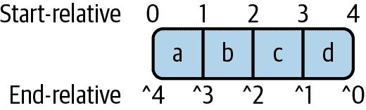
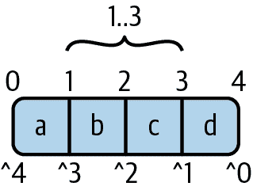

# 第五章：集合

大多数程序需要处理多个数据片段。例如，你的代码可能需要迭代一些交易来计算账户的余额，或者在社交媒体 Web 应用程序中显示最近的消息，或者更新游戏中角色的位置。在大多数应用程序中，处理信息集合的能力可能是非常重要的。

C# 提供了一种简单的集合类型，称为*数组*。CLR 的类型系统本身支持数组，因此它们很高效，但对于某些场景来说可能太基础了，因此运行库在数组提供的基础服务上构建了更强大和灵活的集合类型。我会从数组开始讲起，因为它们是大多数集合类的基础。

# 数组

数组是一个包含特定类型多个*元素*的对象。每个元素都是一个类似于字段的存储位置，但不同于字段的是，数组元素仅仅是按数字编号。数组的元素数量在其生命周期内是固定的，因此在创建数组时必须指定大小。示例 5-1 展示了创建新数组的语法。

##### 示例 5-1\. 创建数组

```cs
int[] numbers = new int[10];
string[] strings = new string[numbers.Length];
```

与所有对象一样，我们使用 `new` 关键字和类型名称构造数组，但是与构造函数参数用括号不同的是，我们使用包含数组大小的方括号。正如示例所示，定义大小的表达式可以是一个常量，但不必如此——第二个数组的大小将通过在运行时评估 `numbers.Length` 来确定。在这种情况下，第二个数组将有 10 个元素，因为我们使用了第一个数组的 `Length` 属性。所有数组都有这个只读属性，它返回数组中的总元素数。

`Length` 属性的类型是 `int`，这意味着它可以处理多达约 21 亿个元素的数组。在 32 位进程中，数组大小的限制因素可能是可用地址空间，但在.NET 支持 64 位进程后，可以使用更大的数组，因此还有一个 `LongLength` 属性，类型为 `long`。然而，你不经常看到它被使用，因为运行时当前不支持创建超过 2,147,483,591 (0x7FFFFFC7) 个元素的数组。因此，只有矩形多维数组（本章后面描述）可以包含比 `Length` 报告的更多元素。甚至这些数组在当前版本的.NET 上也有上限，为 4,294,967,295 (0xFFFFFFFF) 个元素。

###### 注意

如果你使用的是.NET Framework，你将首先遇到另一个限制：单个数组通常不能占用超过 2 GB 的内存。（这是任何单个对象大小的上限。实际上，通常只有数组会遇到这个限制，尽管你可能会用特别长的字符串达到这个限制。）你可以通过在项目的*App.config*文件的`<runtime>`部分内添加`<gcAllowVeryLargeObjects enabled="true" />`元素来克服这一限制。前面段落中的限制仍然适用，另外还有一个额外的限制：元素类型不是`byte`的数组不能超过 0x7FFEFFFF 个元素。即便如此，这些限制要比 2 GB 的上限宽松得多。

在示例 5-1 中，我打破了避免变量声明中多余类型名称的常规规则。初始化表达式清楚地表明变量分别是`int`和`string`数组，所以我通常会对这种代码使用`var`，但我在这里做了一个例外，以便展示如何写出数组类型的名称。数组类型在其自身的权利中是不同的类型，如果我们想引用特定元素类型的单维数组类型，我们将在元素类型名称之后放置`[]`。

所有的数组类型都派生自一个名为`System.Array`的共同基类。这个类定义了`Length`和`LongLength`属性以及其他我们接下来会看到的成员。你可以在所有可以使用其他类型的地方使用数组类型。所以你可以声明一个类型为`string[]`的字段或者方法参数。你也可以将数组类型用作泛型类型参数。例如，`IEnumerable<int[]>`将会是一个整数数组的序列（每个数组可能大小不同）。

无论元素类型如何，数组类型始终是引用类型。尽管如此，在引用类型和值类型元素之间的选择在数组的行为上有重大差异。正如在第三章中讨论的，当对象具有值类型字段时，该值本身存在于为对象分配的内存中。对于数组也是如此——当元素为值类型时，值存在于数组元素本身，但对于引用类型，元素只包含引用。每个引用类型的实例都有其自己的标识，由于多个变量可能最终都引用该实例，CLR 需要独立管理其生存周期，因此它将拥有自己独立的内存块。因此，虽然包含 1,000 个`int`值的数组可以全部存在于一个连续的内存块中，但对于引用类型，数组只包含引用，而不包含实际实例。包含 1,000 个不同字符串的数组将需要 1,001 个堆块——一个用于数组本身，每个字符串一个。

###### 注

在使用引用类型元素时，你不必让引用数组中的每个元素都引用不同的对象。你可以将任意数量的元素设置为`null`，而且还可以自由地使多个元素引用同一个对象。这只是数组元素中引用工作方式的另一种变化，它与局部变量和字段中的引用工作方式基本相同。

要访问数组中的元素，我们使用包含我们想要使用的元素索引的方括号。索引是从零开始的。示例 5-2 展示了一些示例。

##### 示例 5-2\. 访问数组元素

```cs
// Continued from Example 5-1
numbers[0] = 42;
numbers[1] = numbers.Length;
numbers[2] = numbers[0] + numbers[1];
numbers[numbers.Length - 1] = 99;
```

与数组大小在构建时一样，数组索引可以是一个常量，但也可以是在运行时计算的更复杂的表达式。实际上，直接位于开放括号之前的部分也是如此。在示例 5-2 中，我只是使用了一个变量名来引用一个数组，但是你可以在任何数组类型的表达式之后使用括号。示例 5-3 检索由方法调用返回的数组的第一个元素。（示例的细节并不严格相关，但如果你在想，它找到与定义对象类型的组件相关联的版权信息。例如，如果你将一个`string`传递给方法，它将返回“© Microsoft Corporation. All rights reserved.” 这使用了反射 API 和自定义属性，这些是第 13 和第十四章的主题。）

##### 示例 5-3\. 复杂的数组访问

```cs
public static string GetCopyrightForType(object o)
{
    Assembly asm = o.GetType().Assembly;
    var copyrightAttribute = (AssemblyCopyrightAttribute)
        `asm``.``GetCustomAttributes``(``typeof``(``AssemblyCopyrightAttribute``)``,` `true``)``[``0``]``;`
    return copyrightAttribute.Copyright;
}
```

涉及数组元素访问的表达式是特殊的，因为 C#将它们视为一种变量。这意味着与局部变量和字段一样，无论是简单的表达式（如示例 5-2 中的表达式）还是更复杂的表达式（如示例 5-3 中的表达式），你都可以将它们用作赋值语句的左操作数。你还可以使用`ref`关键字（如第 3 章所述）将特定元素的引用传递给方法，将其存储在`ref`局部变量中，或者将其作为具有`ref`返回类型的方法的返回值。

CLR 始终检查索引与数组大小是否匹配。如果尝试使用负索引或大于或等于数组长度的索引，运行时将抛出`IndexOutOfRangeException`异常。

尽管数组的大小固定不变，但其内容始终可修改——并不存在只读数组。 （正如我们将在“ReadOnlyCollection<T>”中看到的，.NET 提供了一个可以作为数组的只读外观的类。）当然，您可以创建一个具有不可变元素类型的数组，这将阻止您在原地修改元素。因此，使用.NET 提供的不可变`Complex`值类型的示例 5-4 将无法编译。

##### 示例 5-4\. 如何不修改具有不可变元素的数组

```cs
var values = new Complex[10];
// These lines both cause compiler errors:
values[0].Real = 10;
values[0].Imaginary = 1;
```

编译器抱怨因为`Real`和`Imaginary`属性是只读的；`Complex`不提供任何修改其值的方法。尽管如此，您仍然可以修改数组：即使无法就地修改现有元素，您始终可以通过提供不同的值来覆盖它，正如示例 5-5 所示。

##### 示例 5-5\. 修改具有不可变元素的数组

```cs
var values = new Complex[10];
values[0] = new Complex(10, 1);
```

无论如何，只读数组在任何情况下都没有什么用，因为所有数组最初都填充了默认值，您无法指定。CLR 会用零填充新数组的内存，因此您将看到`0`、`null`或`false`，具体取决于数组的元素类型。

###### 警告

C# 10.0 添加了为`struct`编写零参数构造函数的能力。您可能期望数组创建自动调用此类构造函数。事实并非如此。

对于某些应用程序来说，全零（或等效）内容可能是数组的有用初始状态，但在某些情况下，您可能需要在开始工作之前设置一些其他内容。

## 数组初始化

初始化数组最直接的方法是依次为每个元素分配值。示例 5-6 创建了一个`string`数组，由于`string`是引用类型，创建五个元素的数组并不会创建五个字符串。我们的数组最初有五个空值。（即使您已启用 C#的可空引用功能，如第三章所述。不幸的是，数组初始化是使该功能无法提供绝对非空性保证的漏洞之一。）因此，示例继续为每个数组元素填充了对字符串的引用。

##### 示例 5-6\. 繁琐的数组初始化

```cs
var workingWeekDayNames = new string[5];
workingWeekDayNames[0] = "Monday";
workingWeekDayNames[1] = "Tuesday";
workingWeekDayNames[2] = "Wednesday";
workingWeekDayNames[3] = "Thursday";
workingWeekDayNames[4] = "Friday";
```

这种方法虽然可行，但冗长了。C#支持一种更简洁的语法，可以实现相同的效果，详见示例 5-7。编译器将其转换为与示例 5-6 类似的代码。

##### 示例 5-7\. 数组初始化语法

```cs
var workingWeekDayNames = new string[]
    { "Monday", "Tuesday", "Wednesday", "Thursday", "Friday" };
```

你可以更进一步。示例 5-8 显示，如果在变量声明中明确指定类型，你可以只写初始化列表，省略 `new` 关键字。顺便说一句，这只在初始化表达式中有效；在其他表达式中（如赋值或方法参数），你不能使用这种语法创建数组。（在 示例 5-7 中更详细的初始化表达式在所有这些上下文中都有效。）

##### 示例 5-8\. 更短的数组初始化语法

```cs
string[] workingWeekDayNames =
    { "Monday", "Tuesday", "Wednesday", "Thursday", "Friday" };
```

我们还可以更进一步：如果数组初始化列表内的所有表达式都是相同类型，编译器可以推断出数组类型，因此我们可以只写 `new[]` 而不需要显式元素类型。示例 5-9 就是这样做的。

##### 示例 5-9\. 元素类型推断的数组初始化语法

```cs
var workingWeekDayNames = new[]
    { "Monday", "Tuesday", "Wednesday", "Thursday", "Friday" };
```

实际上，这比 示例 5-8 稍微长一些。但是，与 示例 5-7 一样，这种风格并不局限于变量初始化。例如，在需要将数组作为参数传递给方法时，也可以使用它。如果你创建的数组只会被传递到方法中并且不再被引用，你可能不想声明一个变量来引用它。直接在参数列表中写数组可能更加简洁。示例 5-10 就是使用这种技术将字符串数组传递给方法的示例。

##### 示例 5-10\. 作为参数的数组

```cs
SetHeaders(new[] { "Monday", "Tuesday", "Wednesday", "Thursday", "Friday" });
```

## 搜索和排序

有时候，你可能不知道需要的数组元素的索引。例如，假设你正在编写一个显示最近使用文件列表的应用程序。每次用户在你的应用程序中打开一个文件时，你都希望将该文件移动到列表顶部，并且你需要检测文件是否已经在列表中，以避免出现多次显示。如果用户恰好使用你的最近文件列表打开文件，你已经知道它在列表中且位于哪个偏移量。但是如果用户以其他方式打开文件呢？在这种情况下，你有一个文件名，需要找出它在列表中的位置，如果存在的话。

数组可以帮助你在这种情况下找到你想要的项。有些方法会逐个检查每个元素，停在第一个匹配项上，还有一些方法可以在特定顺序存储其元素的数组中更快地工作。为了帮助处理这种情况，还有一些方法可以对数组内容进行排序，按照你需要的任何顺序排序。

静态的 `Array.IndexOf` 方法提供了搜索元素的最简单方法。它不需要你的数组元素处于任何特定顺序：你只需传递要搜索的数组和你要查找的值，它将遍历元素直到找到与你想要的值相等的元素。它返回找到的第一个匹配元素的索引，如果在数组末尾没有找到匹配项则返回 −1。示例 5-11 展示了如何在更新最近打开文件列表的逻辑中使用此方法。

##### 示例 5-11\. 使用 `IndexOf` 进行搜索

```cs
int recentFileListIndex = Array.IndexOf(myRecentFiles, openedFile);
if (recentFileListIndex < 0)
{
    AddNewRecentEntry(openedFile);
}
else
{
    MoveExistingRecentEntryToTop(recentFileListIndex);
}
```

该示例从数组的开头开始搜索，但你也有其他选项。`IndexOf` 方法是重载的，你可以传递一个起始搜索的索引，还可以选择传递第二个数字，表示在放弃搜索之前要查看的元素数。还有一个 `LastIndexOf` 方法，它是反向工作的。如果你不指定索引，它将从数组的末尾开始向前工作。与 `IndexOf` 类似，你可以提供一个或两个额外的参数，指示你想要开始搜索的偏移量以及要检查的元素数。

如果你确切知道你要查找的值，这些方法都很好用。但通常情况下，你可能需要更加灵活：你可能想找到符合某些特定条件的第一个（或最后一个）元素。例如，假设你有一个表示直方图中箱子值的数组。找到第一个非空箱子可能是有用的。因此，你不是在寻找特定值，而是想找到第一个值不为零的元素。示例 5-12 展示了如何使用 `FindIndex` 方法来定位第一个符合条件的条目。

##### 示例 5-12\. 使用 `FindIndex` 进行搜索

```cs
public static int GetIndexOfFirstNonEmptyBin(int[] bins)
    => Array.FindIndex(bins, IsNonZero);

private static bool IsNonZero(int value) => value != 0;
```

我的 `IsNonZero` 方法包含决定任何特定元素是否匹配的逻辑，并将该方法作为参数传递给 `FindIndex`。你可以传递任何具有合适签名的方法 —— `FindIndex` 需要一个接受数组元素类型的实例并返回 `bool` 的方法。（严格来说，它接受一个 `Predicate<T>`，这是一种委托，我将在第九章讨论。）由于任何具有适当签名的方法都可以，我们可以使我们的搜索条件简单或者复杂，随心所欲。

顺便提一句，这个特定示例的逻辑如此简单，以至于为条件单独编写一个方法可能有些大材小用。对于这类简单情况，你几乎肯定会使用 lambda 语法（使用 `=>` 表示表达式代表内联函数），而不是单独编写方法。这也是我将在 第九章 中讨论的内容，所以这有些超前，但我只是展示一下它的样子，因为更为简洁。示例 5-13 的效果与 示例 5-12 完全相同，但不需要我们显式声明和编写一个完整的额外方法。（并且在撰写本文时，它也更高效，因为使用 lambda，编译器生成代码以重用它创建的 `Predicate<T>` 对象，而 示例 5-12 每次都会构造一个新的对象。）

##### 示例 5-13\. 使用 lambda 和 `FindIndex`

```cs
public static int GetIndexOfFirstNonEmptyBin(int[] bins)
    => Array.FindIndex(bins, value => value != 0);
```

与 `IndexOf` 类似，`FindIndex` 提供了重载，允许您指定开始搜索的偏移量和在放弃之前检查的元素数量。`Array` 类还提供了 `FindLastIndex`，它向后工作，对应于 `LastIndexOf`，就像 `FindIndex` 对应于 `IndexOf` 一样。

当您搜索满足某些特定条件的数组条目时，您可能并不那么关心匹配元素的索引，您可能只需要知道第一个匹配的值。显然，获得这个值非常容易：您可以结合数组索引语法使用 `FindIndex` 返回的值。然而，您并不需要这样做，因为 `Array` 类提供了 `Find` 和 `FindLast` 方法，以完全相同的方式进行搜索，但返回第一个或最后一个匹配的值，而不是返回找到该值的索引。

数组可能包含多个满足您条件的项，您可能希望找到它们全部。您可以编写一个循环调用 `FindIndex`，将前一个匹配项的索引加一作为下一个搜索的起点，重复此过程，直到达到数组的末尾或得到一个结果为 -1，表示没有找到更多的匹配项。如果您只对知道所有匹配值感兴趣，而不需要准确知道这些值在数组中的位置，您可以使用 示例 5-14 中展示的 `FindAll` 方法来完成所有工作。

##### 示例 5-14\. 使用 `FindAll` 查找多个项

```cs
public static T[] GetNonNullItems<T>(T[] items) where T : class
    => Array.FindAll(items, value => value != null);
```

这个方法接受任何包含引用类型元素的数组，并返回一个仅包含该数组中非空元素的数组。

到目前为止，我展示的所有搜索方法都是按顺序遍历数组的元素，逐个测试每个元素。这种方法已经足够有效，但对于大型数组来说，可能会显得不必要地昂贵，特别是在比较相对复杂的情况下。即使是简单的比较，如果你需要处理数百万个元素的数组，这种搜索方式也可能耗费足够长的时间以至于引入明显的延迟。但是，我们可以做得更好。例如，如果给定一个按升序排序的值数组，*二分查找* 的性能可以提高数个数量级。示例 5-15 展示了两种方法。首先，`Sort` 方法将数字数组按升序排序。然后，如果我们有这样一个已排序的数组，我们可以将其传递给 `Find` 方法，该方法使用 `Array.BinarySearch` 方法。

##### 示例 5-15\. 排序数组和 `BinarySearch`

```cs
void Sort(int[] numbers)
{
    Array.Sort(numbers);
}

int Find(int[] numbers, int searchFor)
{
    return Array.BinarySearch(numbers, searchFor);
}
```

二分查找是一种广泛使用的算法，利用输入已排序的事实，能够在每一步排除一半的数组。它从数组中间开始。如果恰好这个值就是我们需要的值，搜索可以停止，否则，根据它找到的值是高于还是低于我们想要的值，它可以立即知道值会在数组的哪一半（如果存在的话）。然后它跳到剩余一半的中间，如果那不是正确的值，再次可以确定哪一部分将包含目标。在每一步中，它通过一半来缩小搜索范围，几次减半后，搜索将缩小到单个项。如果这不是它正在寻找的值，那么所需的项就不存在。

###### 提示

`BinarySearch` 在未找到值时会生成负数。在这些情况下，这个二分搜索过程将会在最接近我们正在寻找的值处结束，并且这可能是有用的信息。因此，负数仍然告诉我们搜索失败，但这个数是最接近匹配的索引的负数。

二分查找比简单的线性搜索更复杂，但对于大数组来说，它效果很明显，因为需要的迭代次数大大减少。给定一个包含 100,000,000 个元素的数组，它只需执行 27 步，而不是 100,000,000 步。显然，对于较小的数组，改进有限，而二分查找的相对复杂性达到了一定的最小数组大小，超过这个最小数组大小时，线性搜索可能更快。但对于包含 100,000,000 个`int`元素的数组，二分查找肯定是明显的胜利者。需要最多工作的情况是它找不到匹配项（产生负结果），在这些情况下，`BinarySearch`比`Array.IndexOf`执行的线性搜索快了超过 19,000 倍。但是，你需要注意：二分查找仅适用于已经排序的数据，将数据排序的成本可能会超过改进搜索速度的好处。对于包含 100,000,000 个`int`的数组，你需要在成本超过改进搜索速度之前进行大约 500 次搜索，并且，当然，只有在这期间没有任何强制您重新排序的变化时才有效。在性能调整中，查看整体场景而不仅仅是微基准测试非常重要。

顺便说一下，`Array.BinarySearch`提供了用于在数组某个子段内搜索的重载，类似于我们看到的其他搜索方法。它还允许您自定义比较逻辑。这与我在早期章节展示的比较接口一起工作。默认情况下，它将使用数组元素自身提供的`IComparable<T>`实现，但您可以提供自定义的`IComparer<T>`。我用来对元素进行排序的`Array.Sort`方法也支持缩小范围和使用自定义比较逻辑。

除了`Array`类本身提供的搜索和排序方法之外，还有其他的搜索和排序方法。所有的数组都实现了`IEnumerable<T>`（其中`T`是数组的元素类型），这意味着你也可以使用.NET 的*LINQ to Objects*功能提供的任何操作。这为搜索、排序、分组、过滤以及一般对象集合处理提供了更广泛的功能；第十章将详细描述这些功能。数组在.NET 中存在的时间比 LINQ 更长，这是功能重叠的一个原因，但数组提供了自己的标准 LINQ 操作符等价物，有时会更高效，因为 LINQ 是一个更通用的解决方案。

## 多维数组

到目前为止，我展示的数组都是一维的，但 C#支持两种多维形式：*交错数组*和*矩形数组*。

### 交错数组

不规则数组简单地是数组的数组。这种类型的数组的存在是数组类型与其元素类型不同的自然结果。因为`int[]`是一种类型，您可以将其用作另一个数组的元素类型。示例 5-16 展示了几乎毫不意外的语法。

##### 示例 5-16\. 创建不规则数组

```cs
int[][] arrays = new int[5][]
{
    new[] { 1, 2 },
    new[] { 1, 2, 3, 4, 5, 6 },
    new[] { 1, 2, 4 },
    new[] { 1 },
    new[] { 1, 2, 3, 4, 5 }
};
```

再次，我打破了通常的变量声明规则 —— 通常我会在第一行使用`var`，因为类型从初始化器中就能明确，但我想展示声明变量和构造数组的语法。在示例 5-16 中还有第二个冗余之处：使用数组初始化器语法时，不必明确指定大小，因为编译器会自动计算。我已经利用了这一点来处理嵌套数组，但为了显示大小（`5`）出现的位置，我明确为外部数组设置了大小，因为这可能不是您期望的位置。

不规则数组的类型名称足够简单。一般而言，数组类型的形式是`*ElementType*[]`，因此如果元素类型是`int[]`，我们期望结果数组类型应写成`int[][]`，这也是我们看到的。构造函数的语法稍微奇特一些。它声明了一个包含五个数组的数组，乍一看，`new int[5][]`似乎是表达这种意图的完全合理的方式。对于不规则数组的数组索引语法保持一致；我们可以写`arrays[1][3]`，它获取这五个数组中的第二个数组，然后从该第二个数组中检索第四个元素。（顺便说一句，这不是专门的语法 —— 这里没有需要特别处理的地方，因为任何求值为数组的表达式都可以跟随方括号中的索引。表达式`arrays[1]`求值为一个`int[]`数组，所以我们可以跟随`[3]`。）

然而，`new`关键字确实会特殊对待不规则数组。它使它们看起来与数组元素访问语法一致，但必须稍微扭曲一下才能做到这一点。对于一维数组，构造新数组的模式是`new *ElementType*[*length*]`，因此创建五个元素的数组，您希望写成`new *ElementType*[5]`。如果您要创建的是`int`数组，您是否期望看到`int[]`代替`*ElementType*`？这将意味着语法应该是`new int[][5]`。

这看起来是逻辑的，但似乎是错误的，这是因为数组类型的语法本身实际上是反向的。数组是构造类型，就像泛型一样。对于泛型，我们从中构造实际类型的泛型类型名称在类型参数之前（例如，`List<int>` 使用泛型 `List<T>` 类型，并用 `int` 类型参数构造它）。如果数组具有类似泛型的语法，我们可能会期望看到 `array<int>` 表示一维数组，`array<array<int>>` 表示二维数组，依此类推——元素类型会在表示我们想要数组的部分之后出现。但数组类型反其道而行——数组性由 `[]` 字符表示，因此元素类型首先出现。这就是为什么数组构造的假设逻辑正确的语法看起来很奇怪。C# 避免了这种奇怪感，不过于强调逻辑，在大多数人期望的地方放置尺寸而不是应该放置的地方。

###### 注意

语法可以显而易见地扩展——例如，`int[][][]` 表示类型，`new int[5][][]` 表示构造。C# 不定义维度数量的特定限制，但存在一些特定于实现的运行时限制。（微软的编译器在我要求创建一个 5000 维 jagged 数组时毫不畏惧，但 CLR 拒绝加载生成的程序。事实上，它不会加载超过 1166 维的任何东西。）

示例 5-16 用五个一维 `int[]` 数组初始化数组。代码的布局应该很清楚地说明为什么这种类型的数组被称为 *jagged*：每一行长度不同。对于数组的数组，没有要求是矩形布局。我可以进一步讲解。数组是引用类型，所以我可以将一些行设置为 `null`。如果我放弃数组初始化器语法，逐个初始化数组元素，我可以决定让一些一维 `int[]` 数组出现在多行中。

因为这个 jagged 数组中的每一行都包含一个数组，所以这里我最终有了六个对象——五个 `int[]` 数组，然后是包含对它们引用的 `int[][]` 数组。如果引入更多维度，将会得到更多数组。对于某些工作来说，非矩形和大量对象可能会成为问题，这就是为什么 C# 支持另一种多维数组的原因。

### 矩形数组

矩形数组是支持多维索引的单个数组对象。如果 C#没有提供多维数组，我们可以按照惯例构建类似它们的东西。如果您想要一个包含 10 行和 5 列的数组，您可以构造一个具有 50 个元素的一维数组，然后使用像`myArray[i + (5 * j)]`这样的代码来访问它，其中`i`是列索引，`j`是行索引。那将是一个您选择将其视为二维的数组，尽管它实际上只是一个大的连续块。矩形数组本质上是相同的概念，但是在其中 C#为您做了这项工作。 示例 5-17 展示了如何声明和构造矩形数组。

###### 注意

矩形数组不仅仅是便利性问题。还有一个类型安全的方面：`int[,]`是与`int[]`或`int[,,]`不同的类型，因此如果您编写一个期望二维矩形数组的方法，C#将不允许传递其他类型。

##### 示例 5-17\. 矩形数组

```cs
int[,] grid = new int[5, 10];
var smallerGrid = new int[,]
{
    { 1, 2, 3, 4 },
    { 2, 3, 4, 5 },
    { 3, 4, 5, 6 }
};
```

矩形数组类型名称仅使用一对方括号，无论它们有多少维。括号内部逗号的数量表示维度的数量，因此这些具有一个逗号的示例是二维的。与不规则数组相比，运行时似乎对矩形数组的维度数设置了一个更低的限制。在.NET 6.0 中，试图使用超过 32 个维度的矩形数组的程序将无法加载。

初始化语法与多维数组非常相似（参见示例 5-16），但我没有像那样用`new[]`来开始每一行，因为这是一个大数组，而不是数组的数组。 示例 5-17 中的数字形成了一个明显是矩形的形状，如果您尝试使事情变得不规则（使用不同的行大小），编译器将报告错误。这种情况也适用于更高的维度。如果您想要一个三维的“矩形”数组，它将需要是一个*cuboid*。 示例 5-18 展示了一个 cuboid 数组。您可以将初始化器视为由两个矩形切片组成的 cuboid 的列表。而且您可以升级，使用*hypercuboid*数组（尽管无论您使用多少维度，它们仍然被称为矩形数组）。

##### 示例 5-18\. 一个 2 × 3 × 5 的 cuboid“矩形”数组

```cs
var cuboid = new int[,,]
{
    {
        { 1, 2, 3, 4, 5 },
        { 2, 3, 4, 5, 6 },
        { 3, 4, 5, 6, 7 }
    },
    {
        { 2, 3, 4, 5, 6 },
        { 3, 4, 5, 6, 7 },
        { 4, 5, 6, 7, 8 }
    }
};
```

访问矩形数组的语法足够可预测。如果来自示例 5-17 的第二个变量在作用域内，我们可以写`smallerGrid[2, 3]`来访问数组中的最后一项；与单维数组一样，索引是从零开始的，因此这指的是第三行的第四个项目。

请记住，数组的 `Length` 属性返回数组中的元素总数。由于矩形数组将所有元素存储在单个数组中（而不是引用其他数组），因此它将返回所有维度大小的乘积。例如，一个具有 5 行和 10 列的矩形数组的 `Length` 为 50。如果你想在运行时发现特定维度的大小，请使用 `GetLength` 方法，该方法接受一个 `int` 参数，指示你想知道大小的维度。

## 复制和调整大小

有时你会希望在数组中移动数据块。也许你想在数组的中间插入一个项目，将其后的项目向上移动一个位置（并丢失最后一个元素，因为数组大小是固定的）。或者你可能想要将数据从一个数组移动到另一个数组，也许它们大小不同。

静态 `Array.Copy` 方法接受两个数组的引用，以及一个指示要复制多少个元素的数字。它提供了多个重载，以便你可以指定在两个数组中开始复制的位置。（更简单的重载从每个数组的第一个元素开始。）你可以将源数组和目标数组作为同一个数组传递，并且它会正确处理重叠：复制动作就像首先将所有元素复制到临时位置，然后开始将它们写入目标位置。

###### 警告

除了静态的 `Copy` 方法外，`Array` 类还定义了非静态的 `CopyTo` 方法，它将整个数组复制到目标数组中，从指定的偏移位置开始。此方法存在的原因是因为所有数组实现了某些集合接口，包括 `ICollection<T>`（其中 `T` 是数组的元素类型），该接口定义了这个 `CopyTo` 方法。它比 `Copy` 方法不够灵活 —— `CopyTo` 不能复制数组的子范围。在两种方法都能使用的情况下，文档建议使用 `Array.Copy` —— `CopyTo` 只是为了通用代码的利益，可以与任何集合接口的实现一起使用。

当需要处理可变数量的数据时，将元素从一个数组复制到另一个数组可能是必要的。通常情况下，你会分配一个比最初需要的更大的数组，如果最终填满了，你将需要一个新的更大数组，并且需要将旧数组的内容复制到新数组中。事实上，`Array` 类可以通过其 `Resize` 方法为一维数组执行此操作。方法名有些误导，因为数组无法调整大小，所以它会分配一个新的数组，并将旧数组的数据复制到其中。`Resize` 可以构建一个更大或更小的数组，如果你要求一个更小的数组，它只会复制尽可能多的元素。

当我谈论复制数组数据的方法时，我应该提到`Reverse`，它简单地颠倒数组元素的顺序。还有，虽然这不严格属于复制的范畴，但`Array.Clear`方法在处理需要频繁变换数组大小的场景时非常有用——它允许你将数组的某个范围重置为初始的零值状态。

这些在数组内部移动数据的方法对于在基本数组服务的基础上构建更灵活的数据结构非常有用。但通常你自己不需要使用它们，因为运行时库提供了几个有用的集合类来代替这些工作。

# `List<T>`

`List<T>`类定义在`System.Collections.Generic`命名空间中，包含类型为`T`的元素的可变长度序列。它提供了一个索引器，允许你按编号获取和设置元素，因此`List<T>`表现得像一个可调整大小的数组。它并非完全可互换—你不能将`List<T>`作为期望`T[]`数组的参数传递—但数组和`List<T>`都实现了各种常见的泛型集合接口，我们稍后将会讨论这些接口。例如，如果你编写一个接受`IList<T>`的方法，它将能够与数组或`List<T>`一起使用。

虽然使用索引器的代码看起来像是访问数组元素，但实际上并非完全相同。索引器是一种属性，因此它在可变值类型方面与我在第三章中讨论过的问题相同。给定类型为`List<Point>`（其中`Point`是`System.Windows`命名空间中的可变值类型）的变量`pointList`，你不能编写`pointList[2].X = 2`，因为`pointList[2]`返回的是值的副本，而这段代码实际上是要求修改那个临时副本。这会导致更新丢失，因此 C#禁止这样做。但对于数组来说，这是可行的。如果`pointArray`的类型是`Point[]`，`pointArray[2]`不是获取元素，而是标识元素，这使得通过写`pointArray[2].X = 2`可以直接修改数组元素的值。尽管在 C#中添加了`ref`返回值后，可以编写按此方式工作的索引器，但`List<T>`和`IList<T>`是在此之前创建的。对于像`Complex`这样的不可变值类型，这种区别是无关紧要的，因为无论是使用数组还是列表，你都不能直接修改它们的值—你必须用新值覆盖元素。

不像数组，`List<T>` 提供了可以改变其大小的方法。`Add` 方法将一个新元素追加到列表的末尾，而 `AddRange` 可以添加多个元素。`Insert` 和 `InsertRange` 在列表的任意位置添加元素，将插入点后的所有元素向下移动以腾出空间。这四种方法都使列表变长，但是 `List<T>` 也提供了 `Remove` 方法，用于移除指定值的第一个实例；`RemoveAt` 方法用于移除特定索引处的元素；以及 `RemoveRange` 方法，用于从特定索引开始移除多个元素。所有这些方法都会将元素向下移动，以关闭被移除元素或元素留下的空隙，从而使列表变短。

###### 注意

`List<T>` 在内部使用数组来存储其元素。这意味着所有元素都存储在单个内存块中，并且它们是连续存储的。这使得正常的元素访问非常高效，但也是为什么插入需要将元素向上移动以腾出空间，并且移除需要将元素向下移动以关闭空隙的原因。

示例 5-19 展示了如何创建一个 `List<T>`。它只是一个类，因此我们使用常规的构造函数语法。它展示了如何添加和移除条目，以及如何使用类似数组的索引器语法访问元素。这还显示了 `List<T>` 通过 `Count` 属性提供其大小。这个名字可能看起来和数组提供的 `Length` 有些不同，但原因是：这个属性是由 `ICollection<T>` 定义的，而 `List<T>` 实现了它。并非所有的 `ICollection<T>` 实现都是序列，因此在某些情况下 `Length` 可能不合适。（恰好，数组也提供 `Count`，因为它们也实现了 `ICollection` 和 `ICollection<T>`。然而，它们使用显式接口实现，这意味着只能通过这些接口类型的引用看到数组的 `Count` 属性。）

##### 示例 5-19\. 使用 `List<T>`

```cs
var numbers = new List<int>();
numbers.Add(123);
numbers.Add(99);
numbers.Add(42);
Console.WriteLine(numbers.Count);
Console.WriteLine($"{numbers[0]}, {numbers[1]}, {numbers[2]}");

numbers[1] += 1;
Console.WriteLine(numbers[1]);

numbers.RemoveAt(1);
Console.WriteLine(numbers.Count);
Console.WriteLine($"{numbers[0]}, {numbers[1]}");
```

因为 `List<T>` 可以根据需要增长和收缩，所以在构造时不需要指定其大小。但是，如果需要的话，可以指定其*容量*。列表的容量是它当前可用于存储元素的空间量，这通常与它包含的元素数量不同。为了避免在每次添加或移除元素时都分配一个新的内部数组，它会独立跟踪使用的元素数量，而不是数组的大小。当需要更多空间时，它会过度分配，创建一个比需要的大的新数组，过度分配的量与列表当前大小成比例。这意味着，如果程序重复向列表添加项目，列表越大，它需要分配新数组的频率就越低，但每次重新分配后剩余容量的比例将保持大致相同。

If you know up front that you will eventually store a specific number of elements in a list, you can pass that number to the constructor, and it will allocate exactly that much capacity, meaning that no further reallocation will be required. If you get this wrong, it won’t cause an error—you’re just requesting an initial capacity, and it’s OK to change your mind later.

If the idea of unused memory going to waste in a list offends you, but you don’t know exactly how much space will be required before you start, you could call the `TrimExcess` method once you know the list is complete. This reallocates the internal storage to be exactly large enough to hold the list’s current contents, eliminating waste. This will not always be a win. To ensure that it is using exactly the right amount of space, `TrimExcess` has to create a new array of the right size, leaving the old, oversized one to be reclaimed by the garbage collector later on, and in some scenarios, the overhead of forcing an extra allocation just to trim things down to size may be higher than the overhead of having some unused capacity.

Lists have a third constructor. Besides the default constructor, and the one that takes a capacity, you can also pass in a collection of data with which to initialize the list. You can pass any `IEnumerable<T>`.

You can provide initial content for lists with syntax similar to an array initializer. Example 5-20 loads the same three values into the new list as at the start of Example 5-19.

##### Example 5-20\. List initializer

```cs
var numbers = new List<int> { 123, 99, 42 };
```

If you’re not using `var`, you can omit the type name after the `new` keyword, as Example 5-21 shows. But in contrast to arrays, you cannot omit the `new` keyword entirely. Nor will the compiler infer the type argument, so whereas with an array you can write just `new[]` followed by an initializer, you cannot write `new List<>`.

##### Example 5-21\. List initializer with target-typed `new`

```cs
List<int> numbers = new() { 123, 99, 42 };
```

Examples 5-20 and 5-21 are equivalent, and each compile into code that calls `Add` once for each item in the list. You can use this syntax with any type that has a suitable `Add` method and implements the `IEnumerable` interface. This works even if `Add` is an extension method. (So if some type implements `IEnumerable`, but does not supply an `Add` method, you are free to use this initializer syntax if you provide your own `Add`.)

`List<T>` provides `IndexOf`, `LastIndexOf`, `Find`, `FindLast`, `FindAll`, `Sort`, and `Bin⁠ary​Sea⁠rch` methods for finding and sorting list elements. These provide the same services as their array namesakes, although `List<T>` chooses to provide these as instance methods rather than statics.

我们现在已经看到了两种表示值列表的方式：数组和列表。幸运的是，接口使得可以编写既可以与数组又可以与列表一起工作的代码，因此如果想支持这两种情况，您不需要编写两套函数。

# 列表和序列接口

运行时库定义了几个代表集合的接口。其中三个与简单线性序列相关，可以存储在数组或列表中：`IList<T>`、`ICollection<T>` 和 `IEnumerable<T>`，全部位于 `Sys⁠tem.​Col⁠lec⁠tio⁠ns.⁠Gen⁠eri⁠cs` 命名空间。这里有三个接口，因为不同的代码有不同的要求。有些方法需要对集合中的任何编号元素进行随机访问，但并非所有情况都需要，也不是所有集合都能支持这样做——有些序列会逐渐产生元素，可能没有办法直接跳到第 *n* 个元素。例如，考虑表示按键的序列——每个项目只会在用户按下下一个键时出现。如果选择较少要求的接口，您的代码可以与更广泛的数据源一起工作。

`IEnumerable<T>` 是集合接口中最通用的一个，因为它对其实现者的要求最少。我已经多次提到它了，因为它是一个经常出现的重要接口，但直到现在我还没有展示其定义。正如示例 5-22 所示，它只声明了一个方法。

##### 示例 5-22\. `IEnumerable<T>` 和 `IEnumerable`

```cs
public interface IEnumerable<out T> : IEnumerable
{
    IEnumerator<T> GetEnumerator();
}

public interface IEnumerable
{
    IEnumerator GetEnumerator();
}
```

使用继承，`IEnumerable<T>` 要求其实现者同时实现 `IEnumerable`，后者几乎与前者相同。它是 `IEnumerable<T>` 的非泛型版本，其 `GetEnumerator` 方法通常不会做更多事情，只是调用泛型实现。之所以存在这两种形式，是因为在 .NET 1.0 中就有非泛型的 `IEnumerable`，但该版本不支持泛型。在 .NET 2.0 中引入泛型后，可以更精确地表达 `IEnumerable` 的意图，但为了保持兼容性，旧接口仍然存在。因此，这两个接口实际上要求相同的内容：一个返回枚举器的方法。什么是枚举器？示例 5-23 显示了泛型和非泛型接口。

##### 示例 5-23\. `IEnumerator<T>` 和 `IEnumerator`

```cs
public interface IEnumerator<out T> : IDisposable, IEnumerator
{
    T Current { get; }
}

public interface IEnumerator
{
    bool MoveNext();
    object Current { get; }
    void Reset();
}
```

对于 `IEnumerable<T>`（以及 `IEnumerable`），使用模型是调用 `GetEnumerator` 来获取枚举器，该枚举器可用于遍历集合中的所有项目。您调用枚举器的 `MoveNext()` 方法；如果它返回 `false`，则表示集合为空。否则，`Current` 属性现在将提供集合中的第一个项目。然后，再次调用 `MoveNext()` 来移动到下一个项目，并且只要它继续返回 `true`，`Current` 将提供下一个项目。（`Reset` 方法是一种历史遗留物，用于帮助与 COM（Windows 中的 .NET 之前的跨语言对象模型）兼容。文档允许实现从 `Reset` 抛出 `NotSupportedException`，因此您通常不会使用此方法。）

###### 注意

请注意，`IEnumerator<T>` 的实现必须实现 `IDisposable`。完成枚举后，您必须调用枚举器的 `Dispose` 方法，因为其中许多依赖于此。

在 C# 中，`foreach` 循环会为您完成遍历可枚举集合所需的所有工作[¹]，包括生成调用 `Dispose` 的代码，即使循环由于 `break` 语句、错误或者（不可思议的）`goto` 语句而提前终止。第七章将更详细地描述 `IDisposable` 的用法。

`IEnumerable<T>` 是 LINQ to Objects 的核心，在第十章中将进行讨论。LINQ 操作符可用于实现此接口的任何对象。运行时库定义了一个相关的接口 `IAsyncEnumerable<T>`。从概念上讲，它与 `IEnumerable<T>` 相同：它表示提供项目序列的能力。不同之处在于，它允许异步枚举项目。正如示例 5-24 所示，此接口及其对应的 `IAsyncEnumerator<T>` 与 `IEnumerable<T>` 和 `IEnumerator<T>` 类似。主要区别在于使用异步编程功能 `ValueTask<T>` 和 `CancellationToken`，将在第十六章中描述。还有一些小的区别：这些接口没有泛型版本，也没有重置现有异步枚举器的功能（尽管如前所述，许多同步枚举器在调用 `Reset` 时会抛出 `NotSupportedException`）。

##### 示例 5-24\. `IAsyncEnumerable<T>` 和 `IAsyncEnumerator<T>` 的用法模型

```cs
public interface IAsyncEnumerable<out T>
{
    IAsyncEnumerator<T> GetAsyncEnumerator(
        CancellationToken cancellationToken = default);
}

public interface IAsyncEnumerator<out T> : IAsyncDisposable
{
    T Current { get; }

    ValueTask<bool> MoveNextAsync();
}
```

您可以使用特殊形式的 `foreach` 循环消耗 `IAsyncEnumerable<T>`，在这种情况下，您需要在前面加上 `await` 关键字。这只能在使用 `async` 关键字标记的方法中使用。第十七章详细描述了 `async` 和 `await` 关键字，以及 `await foreach` 的用法。

虽然`IEnumerable<T>`非常重要且被广泛使用，但它相当受限制。你只能依次要求它一个项，并且它会按照它认为合适的顺序分发它们。它不提供修改集合的方法，甚至没有办法在不迭代整个集合的情况下找出集合包含的项数。对于这些工作，我们有`ICollection<T>`，它在示例 5-25 中展示。

##### 示例 5-25\. `ICollection<T>`

```cs
public interface ICollection<T> : IEnumerable<T>, IEnumerable
{
    void Add(T item);
    void Clear();
    bool Contains(T item);
    void CopyTo(T[] array, int arrayIndex);
    bool Remove(T item);

    int Count { get; }
    bool IsReadOnly { get; }
}
```

这要求实现者还必须提供`IEnumerable<T>`，但注意这个接口并不继承非泛型的`ICollection`。确实有这样一个接口，但它代表了一个不同的抽象：它除了`CopyTo`方法外没有任何方法。在引入泛型时，微软审查了旧的非泛型集合类型的使用方式，并得出结论，旧的`ICollection`增加的那一个额外方法并没有使它比`IEnumerable`更加有用。更糟糕的是，它还包含了一个名为`SyncRoot`的属性，旨在帮助管理某些多线程场景，但实际上证明这是一个解决该问题的不良方案。因此，`ICollection`所代表的抽象并没有得到泛型等价物，并且并没有被深切怀念。在审查过程中，微软还发现缺少一个通用的可修改集合的接口是一个问题，因此制定了`ICollection<T>`以解决这个问题。将这个旧名称附加到不同的抽象上固然不完全有助于问题的解决，但由于几乎没有人在使用旧的非泛型`ICollection`，这似乎并没有造成太大麻烦。

第三个顺序集合的接口是`IList<T>`，所有实现它的类型都必须实现`ICollection<T>`，因此也必须实现`IEnumerable<T>`。正如你所预料的那样，`List<T>`实现了`IList<T>`。数组也实现了它，使用它们的元素类型作为`T`的参数。示例 5-26 展示了接口的样子。

##### 示例 5-26\. `IList<T>`

```cs
public interface IList<T> : ICollection<T>, IEnumerable<T>, IEnumerable
{
    int IndexOf(T item);
    void Insert(int index, T item);
    void RemoveAt(int index);

    T this[int index] { get; set; }
}
```

虽然有一个非泛型的`IList`，但这个接口与它没有直接关系，尽管两个接口表示类似的概念——非泛型的`IList`有`IList<T>`成员的对应物，它还包括了几乎所有`ICollection<T>`的成员，包括`ICollection`缺失的所有成员。因此，要求`IList<T>`的实现同时实现`IList`本来是可能的，但这将会强制实现者提供大多数成员的两个版本，一个使用类型参数`T`，另一个使用`object`，因为旧的非泛型接口就是这样使用的。这也将迫使集合提供没有用处的`SyncRoot`属性。这些不便之处远不值得好处，因此`IList<T>`的实现不需要实现`IList`。它们可以选择这样做，`List<T>`选择了，但这取决于各个集合类。

由于这三个泛型接口的关系方式，不幸的是它们没有提供一个表示只读索引集合的抽象，甚至没有提供固定大小的抽象。虽然`IEnumerable<T>`是一个只读的抽象，但它是一个按顺序的抽象，没有直接访问第*n*个值的方法。`IList<T>`提供了索引访问，但它还定义了插入和索引移除的方法，并且要求实现`ICollection<T>`，其包括添加和基于值的移除方法。所以你可能会想知道为什么数组可以实现这些接口，因为所有的数组都是固定大小的。

数组通过使用显式接口实现来缓解这个问题，隐藏可以改变列表长度的`IList<T>`方法，阻止你尝试使用它们。（正如你在第三章看到的，这种技术使你能够提供接口的完整实现，但可以选择性地使某些成员直接可见。）然而，你可以将数组的引用存储在类型为`IList<T>`的变量中，从而使这些方法可见——示例 5-27 使用此方法调用数组的`IList<T>.Add`方法。然而，这将导致运行时错误。

##### 示例 5-27\. 尝试（并失败）扩展数组

```cs
IList<int> array = new[] { 1, 2, 3 };
array.Add(4);  // Will throw an exception
```

`Add`方法抛出一个`NotSupportedException`，错误消息表明集合的大小是固定的。如果你查看`IList<T>`和`ICollection<T>`的文档，你会看到所有可能修改集合的成员都可以抛出此错误。你可以使用`ICollection<T>`接口的`IsReadOnly`属性在运行时发现是否会发生这种情况。然而，这并不能帮助你事先发现集合只允许某些更改。（例如，数组的大小是固定的，但你仍然可以修改元素。）

这造成了一个令人恼火的问题：如果你在编写确实需要可修改集合的代码，却无法声明这一事实。如果一个方法接受`IList<T>`，很难知道该方法是否会尝试调整列表的大小。不匹配会导致运行时异常，这些异常很可能出现在并没有做错事情的代码中，而错误——传递了错误类型的集合——是调用者的问题。这些问题并不是致命错误；在动态类型语言中，这种编译时不确定性实际上是常态，并且不会妨碍你编写良好的代码。

这里有一个`ReadOnlyCollection<T>`类，但正如我们稍后将看到的，它解决的是不同的问题——它是一个包装类，而不是一个接口，因此有很多固定大小的集合并不提供`ReadOnlyCollection<T>`。如果您要编写一个参数类型为`ReadOnlyCollection<T>`的方法，它将无法直接与某些类型的集合（包括数组）一起工作。无论如何，它甚至不是相同的抽象——只读比固定大小的限制更严格。

.NET 定义了`IReadOnlyList<T>`，这是一个更好的解决方案，用于表示只读索引集合（尽管它仍然无法处理像数组这样的可修改的固定大小集合）。像`IList<T>`一样，它要求实现`IEnumerable<T>`，但不需要`ICollection<T>`。它定义了两个成员：`Count`，返回集合的大小（就像`ICollection<T>.Count`一样），以及一个只读的索引器。这解决了使用`IList<T>`处理只读集合时遇到的大部分问题。一个小问题是，由于它比我在此处描述的大多数其他接口都要新，因此并不是普遍受支持的。（它在 2012 年的.NET 4.5 中推出，比`IList<T>`晚了七年。）因此，如果遇到要求`IReadOnlyList<T>`的 API，您可以确信它不会尝试修改集合，但如果一个 API 要求`IList<T>`，那么很难知道这是因为它打算修改集合，还是仅仅是因为它是在`IReadOnlyList<T>`被发明之前编写的。

###### 注意

集合并不需要是只读的才能实现`IReadOnlyList<T>`——一个可修改的列表可以很容易地呈现一个只读的外观。因此，所有数组和`List<T>`都实现了这个接口。

我刚刚讨论的问题和接口引发了一个问题：在编写与集合工作的代码或类时，应该使用什么类型？如果你的 API 要求能够处理最少具体类型的需求，通常会得到最大的灵活性。例如，如果`IEnumerable<T>`适合你的需求，就不要要求一个`IList<T>`。同样，接口通常比具体类型更好，所以你应该优先选择`IList<T>`而不是`List<T>`或`T[]`。偶尔可能会有性能优化的争论，如果你有一个关键循环对应用程序整体性能至关重要，通过集合内容工作时，如果仅使用数组类型可能会使代码运行更快，因为 CLR 在知道期望的情况下可以执行更好的优化。但在许多情况下，差异可能太小而无法测量，并且不足以证明被绑定到特定实现的不便，因此在没有测量任务的性能之前，不应采取此类步骤。 (如果您正在考虑这样的性能导向变更，您还应该查看第十八章中描述的技术。) 如果您发现有可能提高性能，但正在编写共享库，希望同时提供灵活性和最佳性能，有几种同时满足两者的选项。您可以提供重载，以便调用者可以传递接口或特定类型。或者，您可以编写一个单一的公共方法，接受接口但测试已知类型，并根据调用者传递的内容选择不同的内部代码路径。

我们刚刚查看的接口并不是唯一的通用集合接口，因为简单的线性列表并不是唯一的集合类型。但在转向其他接口之前，我想展示一下可枚举和列表的另一面：我们如何实现这些接口？

# 实现列表和序列

以`IEnumerable<T>`或`IList<T>`的形式提供信息通常很有用。前者尤其重要，因为.NET 提供了一个强大的工具包，用于处理序列，即 LINQ to Objects，我将在第十章中展示。 LINQ to Objects 提供了各种操作符，所有这些操作符都以`IEnumerable<T>`的形式工作。 `IList<T>`在任何需要通过索引随机访问任何元素的地方都是一个有用的抽象。某些框架期望一个`IList<T>`。例如，如果你想将一组对象绑定到某种列表控件，一些 UI 框架将期望一个`IList`或`IList<T>`。

你可以手动实现这些接口，因为它们都不是特别复杂。然而，C# 和运行时库可以提供帮助。直接支持在语言级别实现`IEnumerable<T>`，而运行时库则为通用和非通用列表接口提供支持。

## 使用迭代器实现 IEnumerable<T>

C# 支持一种称为*迭代器*的特殊方法。迭代器是使用`yield`关键字生成可枚举序列的方法。 示例 5-28 展示了一个简单的迭代器及其使用的一些代码。这将显示从 5 到 1 倒数的数字。

##### 示例 5-28\. 一个简单的迭代器

```cs
public static IEnumerable<int> Countdown(int start, int end)
{
    for (int i = start; i >= end; --i)
    {
        yield return i;
    }
}

private static void Main(string[] args)
{
    foreach (int i in Countdown(5, 1))
    {
        Console.WriteLine(i);
    }
}
```

迭代器看起来很像任何普通方法，但它返回值的方式不同。示例 5-28 中的迭代器具有`IEnumerable<int>`的返回类型，但看起来并未返回任何该类型的内容。它不是使用普通的`return`语句，而是使用`yield return`语句，该语句返回单个`int`，而不是一个集合。迭代器通过`yield return`语句逐个产生值，并且与普通的`return`不同，方法在返回值后可以继续执行 —— 只有当方法运行到结尾或通过`yield break`语句或抛出异常提前结束时，它才算完成。 示例 5-29 更明显地展示了这一点。每个`yield return`导致从序列中发出一个值，因此这个迭代器将产生数字 1 到 3。

##### 示例 5-29\. 一个非常简单的迭代器

```cs
public static IEnumerable<int> ThreeNumbers()
{
    yield return 1;
    yield return 2;
    yield return 3;
}
```

尽管这在概念上相当简单，但它的工作方式有些复杂，因为迭代器中的代码不像其他代码那样运行。记住，对于`IEnumerable<T>`，调用者负责何时检索下一个值；`foreach`循环将获取一个枚举器，然后重复调用`MoveNext()`直到返回`false`，并期望`Current`属性提供当前值。那么示例 5-28 和 5-29 如何适应这个模型呢？也许你会认为，也许 C# 在一个`List<T>`中存储迭代器产生的所有值，并在迭代器完成后返回它，但很容易通过编写一个永不完成的迭代器（如 示例 5-30 中的迭代器）来证明这并不正确。

##### 示例 5-30\. 一个无限迭代器

```cs
public static IEnumerable<BigInteger> Fibonacci()
{
    BigInteger v1 = 1;
    BigInteger v2 = 1;

    while (true)
    {
        yield return v1;
        var tmp = v2;
        v2 = v1 + v2;
        v1 = tmp;
    }
}
```

此迭代器运行无限期；它有一个带有`true`条件的`while`循环，并且不包含`break`语句，因此它永远不会自愿停止。如果 C#试图在返回任何内容之前完成迭代器的运行，它将在此处卡住。 (数字会增长，因此如果运行时间足够长，该方法最终会通过抛出`OutOfMemoryException`而终止。) 但是如果你尝试这样做，你会发现它立即开始从斐波那契序列中返回值，并且只要你继续迭代其输出，它将继续这样做。 显然，C#并非简单地在返回之前运行整个方法。

C#对您的代码进行了一些严肃的手术以使其工作。 如果您使用像 ILDASM（与.NET SDK 一起提供的.NET 代码反汇编器）这样的工具检查迭代器的编译器输出，您会发现它生成了一个作为方法返回的`IEnumerable<T>`的实现以及`IEnumerable<T>`的`GetEnumerator`方法返回的`IEnumerator<T>`的私有嵌套类。 您的迭代器方法的代码最终位于此类的`MoveNext`方法内部，但几乎无法识别，因为编译器以一种方式将其拆分，使得每次`yield return`都能返回给调用者，但在下次调用`MoveNext`时继续执行。 在必要时，它将存储局部变量在此生成的类中，以便它们的值可以在多次调用`MoveNext`时保持不变。 或许了解 C#在编译迭代器时所需做的工作的最简单方法就是手动编写等效代码。 示例 5-31 提供了与示例 5-30 相同的斐波那契序列，但没有使用迭代器的帮助。 它不完全是编译器所做的，但它展示了其中的一些挑战。

##### 示例 5-31\. 手动实现`IEnumerable<T>`

```cs
public class FibonacciEnumerable :
    IEnumerable<BigInteger>, IEnumerator<BigInteger>
{
    private BigInteger v1;
    private BigInteger v2;
    private bool first = true;

    public BigInteger Current => v1;

    public void Dispose() { }

    object IEnumerator.Current => Current;

    public bool MoveNext()
    {
        if (first)
        {
            v1 = 1;
            v2 = 1;
            first = false;
        }
        else
        {
            var tmp = v2;
            v2 = v1 + v2;
            v1 = tmp;
        }

        return true;
    }

    public void Reset()
    {
        first = true;
    }

    public IEnumerator<BigInteger> GetEnumerator() =>
        new FibonacciEnumerable();

    IEnumerator IEnumerable.GetEnumerator() => GetEnumerator();
}
```

这不是一个特别复杂的例子，因为它的枚举器基本上处于两种状态之一——要么是第一次运行，因此需要运行循环之前的代码，要么是在循环内部。 即便如此，这段代码比示例 5-30 要难读得多，因为支持枚举的机制掩盖了基本逻辑的本质。

如果我们需要处理异常，代码会变得更加复杂。 您可以编写`using`块和`finally`块，这使得您的代码能够在面对错误时正确运行，正如我将在第 7 和 8 章中展示的那样，编译器最终可能会为了保留这些正确的语义而做很多工作，当方法的执行在多个迭代之间分割时。² 在您手动编写多个枚举之前，您可能会感谢 C#可以为您完成这些工作的方式。

顺便说一下，迭代器方法并不一定要返回 `IEnumerable<T>`。如果你愿意，你可以返回 `IEnumerator<T>`。而且，正如你之前看到的，实现这些接口的对象也总是实现它们的非泛型版本，因此如果你需要一个普通的 `IEnumerable` 或 `IEnumerator`，你不需要额外的工作——你可以将一个 `IEnumerable<T>` 传递给任何期望普通 `IEnumerable` 的地方，对于枚举器也是一样。如果出于某种原因你想要提供其中一个非泛型接口，并且你不想提供泛型版本，你可以直接编写返回非泛型形式的迭代器。

迭代器需要小心的一点是，直到调用者第一次调用 `MoveNext` 方法时，它们才会执行非常少的代码。因此，如果你逐步执行调用 示例 5-30 中的 `Fibonacci` 方法的代码，该方法调用似乎根本不会做任何事情。如果你尝试在调用时步入方法，在方法运行时将不会执行任何代码。只有当迭代开始时，你才会看到迭代器的主体执行。这有几个后果。

首先要记住的是，如果你的迭代器方法接受参数，并且你想要验证这些参数，你可能需要做一些额外的工作。默认情况下，验证将在迭代开始时才会发生，因此错误可能会比预期晚发生。如果你想立即验证参数，你需要编写一个包装器。示例 5-32 展示了一个例子——它提供了一个名为 `Fibonacci` 的普通方法，不使用 `yield return`，因此不会得到迭代器的特殊编译器行为。这个普通方法在调用嵌套的迭代器方法之前验证其参数。（这也说明了局部方法可以使用 `yield return`。）

##### 示例 5-32\. 迭代器参数验证

```cs
public static IEnumerable<BigInteger> Fibonacci(int count)
{
    if (count < 0)
    {
        throw new ArgumentOutOfRangeException(nameof(count));
    }
    return Core(count);

    static IEnumerable<BigInteger> Core(int count)
    {
        BigInteger v1 = 1;
        BigInteger v2 = 1;

        for (int i = 0; i < count; ++i)
        {
            yield return v1;
            var tmp = v2;
            v2 = v1 + v2;
            v1 = tmp;
        }
    }
}
```

第二点需要记住的是，迭代器可能会执行多次。`IEnumerable<T>` 提供了一个 `GetEnumerator` 方法，可以被多次调用，而你的迭代器体每次都会从头开始运行。所以即使你的迭代器方法可能只被调用了一次，它也可能会运行多次。

## Collection<T>

如果你查看运行时库中的类型，你会发现当它们提供暴露 `IList<T>` 实现的属性时，通常是间接的。与接口不同，属性通常提供某种具体类型，尽管通常不是 `List<T>`。`List<T>` 被设计为你代码的实现细节，如果直接暴露它，可能会给你的类的用户过多的控制权。你希望他们能修改列表吗？即使你希望如此，你的代码是否需要知道这种情况发生的时机呢？

运行时库提供了一个`Collection<T>`类，旨在作为类型公开的集合的基类使用。它类似于`List<T>`，但有两个显著的区别。首先，它的 API 更小——它提供了`IndexOf`，但所有其他适用于`List<T>`的搜索和排序方法都不包括，并且它不提供独立于其大小的方式来发现或更改其容量。其次，它为派生类提供了一种发现添加或移除项时机制的方法。`List<T>`则没有这样的机制，因为它是你的列表，所以你应该知道何时添加和移除项。通知机制并不是免费的，所以`List<T>`通过不提供它们来避免不必要的开销。但`Collection<T>`假设外部代码将访问你的集合，并且你因此不能控制每一次添加和移除，这正当了提供一种让你发现列表何时被修改的开销。 （这仅适用于从`Collection<T>`派生的代码。如果你希望使用你的集合的代码能够检测到变化，`ObservableCollection<T>`类型就是为这种情况设计的。例如，如果你在桌面和移动 UI 框架（如 WPF、UWP、MAUI 和 Xamarin）中将此类型用作列表的源，它们将能够在修改集合时自动显示列表。）

你通常从`Collection<T>`派生一个类，并且你可以重写它定义的虚方法来发现集合的变化。(第六章将讨论继承和重写。)`Collection<T>`实现了`IList`和`IList<T>`，因此你可以通过接口类型的属性展示基于`Collection<T>`的集合，但通常会将派生的集合类型公开并使用它而不是接口作为属性类型。

## ReadOnlyCollection<T>

如果你想提供一个不可修改的集合，那么你可以使用`ReadOnlyCollection<T>`而不是使用`Collection<T>`。顺便说一下，这比数组施加的限制更进一步：不仅你不能添加、移除或插入项目，而且你甚至不能替换元素。这个类实现了`IList<T>`，它要求一个带有`get`和`set`的索引器，但是`set`会抛出异常。（当然，它也实现了`IReadOnlyCollection<T>`。）

如果你集合的元素类型是引用类型，将集合设为只读并不能防止元素引用的对象被修改。例如，我可以从只读集合中检索第 12 个元素，并且它会返回给我一个引用。获取引用算是一个只读操作，但现在我已经得到了那个引用，集合对象已经不再受限制，我可以随心所欲地对那个引用进行操作。由于 C# 并没有提供任何类似于 C++ `const` 引用的概念，因此要展示一个真正只读的集合的唯一方法是与不可变类型结合使用 `ReadOnlyCollection<T>`。

使用 `ReadOnlyCollection<T>` 有两种方法。你可以直接将它用作现有列表的包装器——它的构造函数接受一个 `IList<T>`，并且会提供对其的只读访问。（顺便说一句，`List<T>` 提供了一个名为 `AsReadOnly` 的方法，用于为你构造一个只读包装器。）或者，你可以从它派生一个类。与 `Collection<T>` 一样，一些类为希望通过属性公开的集合执行此操作，通常是因为它们希望定义与集合用途相关的附加方法。即使从这个类派生，你仍然会使用它来包装一个底层列表，因为它提供的唯一构造函数就是接受列表的构造函数。

###### 警告

`ReadOnlyCollection<T>` 通常不适合自动映射对象模型和外部表示之间的场景。例如，在作为数据传输对象（DTOs）使用的类型中，它会在转换为和从通过网络连接发送的 JSON 消息中引起问题，并且在通过对象关系映射系统通过对象模型呈现数据库内容时也会出现问题。这些场景的框架需要能够实例化你的类型并将其填充数据，因此，尽管只读集合可能是你的模型某些部分的理想匹配，但它可能与这些映射框架期望初始化对象的方式不符。

# 使用索引和范围语法访问元素

无论是使用数组、`List<T>`、`IList<T>` 还是前面讨论的各种相关类型和接口，我们都使用简单的示例来识别元素，例如 `items[0]`，以及更一般的形式为 `*arrayOrListExpression*[*indexExpression*]` 的表达式。到目前为止，所有示例都使用了 `int` 类型的表达式作为索引，但这并不是唯一的选择。示例 5-33 使用了另一种语法来访问数组的最后一个元素。

##### 示例 5-33\. 使用端相对索引访问数组的最后一个元素

```cs
char[] letters = { 'a', 'b', 'c', 'd' };
char lastLetter = letters[¹];
```

这展示了用于索引器的两个运算符之一：`^`运算符和*范围运算符*。后者在示例 5-34 中展示，是一对点号(`..`)，用于标识数组、字符串或任何实现特定模式的可索引类型的子范围。

##### 示例 5-34\. 使用范围运算符获取数组的子范围

```cs
int[] numbers = { 1, 2, 3, 4, 5, 6, 7 };
// Gets 4th and 5th (but not the 3rd or 6th, for reasons explained shortly) int[] theFourthTheFifth = `numbers``[``3..5``]``;`
```

使用`^`和`..`运算符的表达式分别是`Index`和`Range`类型。这些类型在.NET Standard 2.1 中可用，意味着它们内置于.NET Core 3.1 和.NET 5.0 或更高版本中。然而，在.NET Framework 上这些类型不可用，这意味着你只能在较新的运行时中使用这些语言特性。

## `System.Index`

你可以将`^`运算符放在任何`int`表达式的前面。它产生一个`System.Index`，这是一个值类型，表示一个位置。当你用`^`创建一个索引时，它是结束相对的，但你也可以创建起始相对索引。没有特殊的运算符，但由于`Index`提供从`int`的隐式转换，你可以直接将`int`值分配到`Index`类型的变量中，正如示例 5-35 所示。你也可以显式地构造一个索引，就像`var`行所示。最后的`bool`参数是可选的——默认为`false`——但我展示它来说明`Index`如何知道你想要哪种类型。

##### 示例 5-35\. 一些起始相对和结束相对的`Index`值

```cs
Index first = 0;
Index second = 1;
Index third = 2;
var fourth = new Index(3, fromEnd: false);

Index antePenultimate = ³;
Index penultimate = ²;
Index last = ¹;
Index directlyAfterTheLast = ⁰;
```

如示例 5-35 所示，结束相对索引存在于任何特定集合之外。（在内部，`Index`将结束相对索引存储为负数。这意味着`Index`与`int`大小相同。这也意味着负的起始或结束相对值是非法的——如果尝试创建一个，你会得到一个异常。）C#会生成代码，在使用索引时确定实际元素位置。如果`small`和`big`分别是包含 3 和 30 个元素的数组，`small[last]`将返回第三个元素，而`big[last]`将返回第 30 个元素。C#将把这些转换为`small[last.GetOffset(small.Length)]`和`big[last.GetOffset(big.Length)]`。

人们常说，计算机科学中三大难题是为事物命名和一错再错的错误。乍一看，示例 5-35 使人觉得`Index`可能在加剧这些问题。第三个项目的索引是二而不是三可能会使人困惑，但这至少与 C#中数组的工作方式一致，并且对于任何零基索引系统都是正常的。但鉴于零基准约定，为什么结束相对索引看起来是一基的呢？我们用`0`表示第一个元素，但用`¹`表示最后一个元素！

这样做有一些很好的理由。其核心洞见是，在 C#中，索引始终指定距离。当编程语言设计者选择零基索引系统时，并非真的决定将第一个元素称为 0：而是决定将索引解释为从数组开始的距离。由此产生的一个结果是，索引并不真正指代一个项。图 5-1 展示了一个包含四个元素的集合，并指示了在该集合中各种索引值指向的位置。注意，所有的索引都指向各个项之间的边界。这可能看起来有些吹毛求疵，但这是理解所有零基索引系统的关键，也是示例 5-35 中显露的表面不一致的背后原因。



###### 图 5-1\. `Index`值指向的位置

当你通过索引访问集合的元素时，你要求的是从索引指示的位置*开始*的元素。因此，`array[0]`检索的是从数组开头开始的单个元素，填充索引 0 和 1 之间的空间的元素。同样，`array[1]`检索的是索引 1 和 2 之间的元素。那么`array[⁰]`意味着什么？³ 这将尝试获取从数组末尾开始的元素。由于元素都占据一定的空间，从数组末尾开始的元素必然会在数组末尾之后一个位置结束。在这个四元素数组中，`array[⁰]`相当于`array[4]`，因此我们要求的是占据从开头计算起四个元素开始并结束在开头五个元素的空间的元素。由于这是一个四元素数组，显然是行不通的。

表面上的差异——即`array[0]`获取第一个元素，但我们需要写`array[¹]`来获取最后一个元素——是因为元素位于两个索引之间，而数组索引器总是检索指定索引和其后索引之间的元素。即使指定了一个末尾相关的索引，它们也会这样做，这就是为什么这些看起来是基于一的原因。这种语言特性本可以设计得不同：你可以想象一种规则，即末尾相关的索引始终访问从末尾指定距离结束并从这之前一位置开始的元素。这样设计本应更对称，因为这会使得`array[⁰]`指向最后一个元素，但这样做带来的问题比解决的问题更多。

使索引器在两种不同方式下解释索引会很令人困惑——这意味着两个不同的索引可能指向同一个位置，但提取不同的元素。无论如何，C# 开发人员已经习惯了这种工作方式。正如 Example 5-36 所示，在 `^` 索引运算符之前，访问数组的最后一个元素的方法是使用从长度中减去一计算出的索引。如果想要倒数第二个元素，则从长度中减去两个，依此类推。正如你所见，新的结束相对语法与长期存在的现有实践完全一致。

##### 示例 5-36\. 结束相对索引和 `Index` 前等价物

```cs
int lastOld = numbers[numbers.Length - 1];
int lastNew = numbers[¹];

int penultimateOld = numbers[numbers.Length - 2];
int penultimateNew = numbers[²];
```

还有一种思考方法是想象如果我们通过指定范围来访问数组会是什么样子。第一个元素在范围 0–1 中，最后一个元素在范围 ¹–⁰ 中。以这种方式表达，起始相对和结束相对形式之间显然存在对称性。说到范围……

## `System.Range`

正如我之前所说，C# 有两个对处理数组和其他可索引类型非常有用的运算符。我们刚刚看过 `^` 和对应的 `Index` 类型。另一个称为 *范围运算符*，它在 `System` 命名空间中也有相应的类型 `Range`。`Range` 是一对 `Index` 值，通过 `Start` 和 `End` 属性提供。`Range` 提供了一个接受两个 `Index` 值的构造函数，但在 C# 中，创建它的习惯方式是使用范围运算符，正如 Example 5-37 所示。

##### 示例 5-37\. 不同的范围

```cs
Range everything = 0..⁰;
Range alsoEverything = 0..;
Range everythingAgain = ..⁰;
Range everythingOneMoreTime = ..;
var yetAnotherWayToSayEverything = Range.All;

Range firstThreeItems = 0..3;
Range alsoFirstThreeItems = ..3;

Range allButTheFirstThree = 3..⁰;
Range alsoAllButTheFirstThree = 3..;

Range allButTheLastThree = 0..³;
Range alsoAllButTheLastThree = ..³;

Range lastThreeItems = ³..⁰;
Range alsoLastThreeItems = ³..;
```

正如你所见，如果在 `..` 前面没有放置起始索引，默认为 0；如果省略结束索引，默认为 `⁰`（即最开始和最后，分别）。示例还显示，起始索引可以是起始相对的，也可以是结束相对的，结束索引也是如此。

###### 警告

`Range` 的默认值——在未显式初始化的字段或数组元素中得到的值——是 0..0。这表示一个空范围。虽然这是由于值类型默认总是初始化为类似于零的值所导致的自然结果，但这可能与你期望的不同，因为 `..` 等同于 `Range.All`。

由于 `Range` 是基于 `Index` 工作的，起始和结束表示偏移量，而不是元素。例如，考虑范围 `1..3` 对应于 Figure 5-1 中显示的元素的含义。在这种情况下，两个索引都是起始相对的。起始索引 `1` 是第一个和第二个元素（`a` 和 `b`）之间的边界，结束索引 `3` 是第三个和第四个元素（`c` 和 `d`）之间的边界。因此，这是一个从 `b` 的开头到 `c` 的结尾的范围，正如 Figure 5-2 所示。因此，这确定了一个包含两个元素 `b` 和 `c` 的范围。



###### Figure 5-2\. 一个范围

数组范围的解释有时会让人感到惊讶，当他们第一次看到时：有些人期望`1..3`表示第一、第二和第三个元素（或者，如果考虑到 C# 的从零开始索引，可能是第二、第三和第四个元素）。起始索引看起来是包含的，而结束索引是排除的，这一点一开始可能显得不一致。但是一旦你记住索引指的不是项目而是偏移量，因此是两个项目之间的边界，这一切就都说得通了。如果你画出范围索引表示的位置，就像图 5-2 那样，就会完全明白`1..3`范围只覆盖了两个元素。

那么我们可以用`Range`做什么呢？正如示例 5-34 所示，我们可以使用它来获取数组的子范围。这会创建一个相应大小的新数组，并将范围内的值复制到其中。同样的语法也适用于获取子字符串，正如示例 5-38 所示。

##### 示例 5-38\. 使用范围获取子字符串

```cs
string t1 = "dysfunctional";
string t2 = t1[3..6];
Console.WriteLine($"Putting the {t2} in {t1}");
```

你还可以在`ArraySegment<T>`中使用`Range`，这是一个值类型，用于引用数组中的一段元素。示例 5-39 对示例 5-34 稍作修改。它不是将范围传递给数组的索引器，而是首先创建一个表示整个数组的`Ar⁠ray​Seg⁠men⁠t<i⁠nt>`，然后使用范围获取第四和第五个元素的第二个`ArraySegment<int>`。这样做的好处是不需要分配新的数组——两个`ArraySegment<int>`值引用相同的基础数组；它们只是指向它的不同部分，并且由于`ArraySegment<int>`是值类型，这可以避免分配新的堆块。（顺便说一句，`ArraySegment<int>`没有直接支持范围。编译器会将此转换为调用段的`Slice`方法。）

##### 示例 5-39\. 使用范围运算符获取`ArraySegment<T>`的子范围

```cs
int[] numbers = { 1, 2, 3, 4, 5, 6, 7 };
ArraySegment<int> wholeArrayAsSegment = numbers;
ArraySegment<int> theFourthTheFifth = wholeArrayAsSegment[3..5];
```

自 .NET 2.0 起（并在 .NET Standard 1.0 中存在），`ArraySegment<T>` 类型是一种避免额外分配的有用方式，但它有限制：它只适用于数组。那么字符串呢？所有当前版本的 .NET 都支持提供这个概念更一般化的类型，即 `Span<T>` 和 `ReadOnlySpan<T>`。（在 .NET Framework 中，通过 `System.Memory` NuGet 包可用。它们内置于其他 .NET 版本中。）与 `ArraySegment<T>` 类似，`Span<T>` 表示其他某物中的子序列，但关于这个“其他某物”它更加灵活。它可以是一个数组，也可以是字符串，堆栈帧中的内存，或者完全在 .NET 之外由某个库或系统调用分配的内存。关于 `Span<T>` 和 `ReadOnlySpan<T>` 类型的更详细讨论见第十八章，但现在，示例 5-40 展示了它们的基本用法。

##### 示例 5-40\. 使用范围运算符获取跨度的子范围

```cs
int[] numbers = { 1, 2, 3, 4, 5, 6, 7 };
Span<int> wholeArrayAsSpan = numbers;
Span<int> theFourthTheFifth = wholeArrayAsSpan[3..5];
ReadOnlySpan<char> textSpan = "dysfunctional".AsSpan();
ReadOnlySpan<char> such = textSpan[3..6];
```

这些与前面的示例在逻辑上具有相同的含义，但它们避免了复制底层数据。

我们已经看到可以在几种类型上使用范围：数组、字符串、`Arr⁠ay​Seg⁠men⁠t<T>`、`Span<T>` 和 `ReadOnlySpan<T>`。这引发了一个问题：C# 是否有一个特殊处理的类型列表，或者我们可以在我们自己的类型中支持索引器和范围？答案分别是肯定的。C# 对数组和字符串有一些内建处理：它知道调用特定的运行时库方法以生成子数组和子字符串。然而，对于数组段或跨度没有特殊的范围处理：它们之所以有效是因为它们符合一种模式。支持使用 `Index` 也有一种模式。如果你支持相同的模式，你可以让 `Index` 和 `Range` 在你自己的类型中工作。

## 支持在自定义类型中使用索引和范围

数组类型并没有定义接受 `Index` 类型参数的索引器。在本章早些时候展示的任何泛型数组样式类型也没有 —— 它们都只有普通的基于 `int` 的索引器；然而，你仍然可以与它们一起使用 `Index`。正如我之前解释的那样，形如 `col[index]` 的代码将展开为 `col[index.GetOffset(a.Length)]`。⁴ 因此，你只需要一个基于 `int` 的索引器和一个名为 `Length` 或 `Count` 的 `int` 类型属性。示例 5-41 展示了使你的类型的索引器能接受 `Index` 参数的最小化实现。它不是一个非常有用的实现，但足以让 C# 快乐。

##### 示例 5-41\. 最小化启用 `Index`

```cs
public class Indexable
{
    public char this[int index] => (char)('0' + index);

    public int Length => 10;
}
```

###### Tip

有一个更简单的方法：只需定义一个接受`Index`类型参数的索引器即可。但是，大多数可索引类型都提供了基于`int`的索引器，因此在实践中，你会重载你的索引器，提供这两种形式。这并不简单，但它可以使你的代码区分起始和结束相对索引。如果我们在示例 5-41 中使用`1`或`⁹`，无论哪种情况，其索引器都会看到 1，因为 C#会生成将`Index`转换为基于起始的`int`的代码，但如果你编写一个接受`Index`参数的索引器，C#会直接传递`Index`。如果你重载索引器以使`int`和`Index`形式都可用，它将永远不会生成将`Index`转换为`int`的代码以调用`int`索引器：只有在没有`Index`特定索引器可用时才会出现这种模式。

`IList<T>`符合模式的要求（例如实现它的`List<T>`类型），因此你可以将`Index`传递给任何实现此接口的内容的索引器。它提供`Count`属性而不是`Length`，但是模式接受任何一种。这是一个广泛实现的接口，因此在实践中，许多类型在`Index`引入之前就自动获得了对`Index`的支持。这是一个模式化支持`Index`的例子，即使是面向较旧.NET 版本（如.NET Standard 2.0）的库也可以定义在新版本.NET 中使用`Index`的类型。

支持`Range`的模式不同：如果你的类型提供了一个接受两个整数参数的实例方法`Slice`，C#允许代码将`Range`作为索引器参数。示例 5-42 展示了使类型最少支持`Range`的方式，尽管这不是一个非常有用的实现。（与`Index`类似，你也可以直接定义一个接受`Range`的索引器重载。但是，模式方法的优势在于你可以在针对较旧版本（如不支持`Range`或`Index`类型的.NET Standard 2.0）时使用它，同时仍支持针对新版本的代码的范围。）

##### 示例 5-42\. 最小化启用`Range`

```cs
public class Rangeable
{
    public int Length => 10;

    public Rangeable Slice(int offset, int length) => this;
}
```

你可能已经注意到，这种类型并没有定义索引器。这是因为基于模式的支持形式`x[1..¹]`不需要索引器。它看起来像是在使用索引器，但实际上只是调用了`Slice`方法。（同样，先前的使用`string`和数组的范围示例会编译成方法调用。）你需要`Length`属性（或`Count`），因为编译器生成的代码依赖于此来解析范围的索引。示例 5-43 大致展示了编译器如何使用支持此模式的类型。

##### 示例 5-43\. 范围索引的扩展方式

```cs
Rangeable r1 = new();
Range r = 2..²;

Rangeable r2;

r2 = r1[r];
// is equivalent to
int startIndex = r.Start.GetOffset(r1.Length);
int endIndex = r.End.GetOffset(r1.Length);
r2 = r1.Slice(startIndex, endIndex - startIndex);
```

到目前为止，我们看到的所有集合都是线性的：我只展示了一些对象或值的简单序列，其中一些提供了索引访问。但是，.NET 提供了其他类型的集合。

# 字典

最有用的一种集合之一是字典。.NET 提供了`Dictionary<TKey, TValue>`类，还有一个相应的接口称为`IDictionary<TKey, TValue>`，以及一个只读版本`IReadOnlyDictionary<TKey, TValue>`。这些表示键/值对的集合，它们最重要的功能是根据键查找值，使字典在表示关联时非常有用。

假设您正在为支持在线讨论的应用程序编写用户界面。在显示消息时，您可能希望显示发送消息的用户的某些信息，例如他们的姓名和图片，并且您可能希望避免每次从持久存储获取这些详细信息；如果用户正在与几个朋友进行对话，那么同样的人将会重复出现，因此您需要某种缓存来避免重复查找。您可以在此缓存的一部分中使用字典。示例 5-44 展示了这种方法的概要（省略了实际获取数据的应用程序特定细节以及何时从内存中删除旧数据）。

##### 示例 5-44\. 将字典用作缓存的一部分

```cs
public class UserCache
{
    private readonly Dictionary<string, UserInfo> _cachedUserInfo = new();

    public UserInfo GetInfo(string userHandle)
    {
        RemoveStaleCacheEntries();
        if (!_cachedUserInfo.TryGetValue(userHandle, out UserInfo? info))
        {
            info = FetchUserInfo(userHandle);
            _cachedUserInfo.Add(userHandle, info);
        }
        return info;
    }

    private UserInfo FetchUserInfo(string userHandle)
    {
        // fetch info...
    }

    private void RemoveStaleCacheEntries()
    {
        // application-specific logic deciding when to remove old entries...
    }
}

public class UserInfo
{
    // application-specific user information...
}
```

第一个类型参数，`TKey`，用于查找，本例中我使用的是某种方式标识用户的字符串。`TValue`参数是与键相关联的值的类型，在这种情况下是先前为用户获取并在`UserInfo`实例中本地缓存的信息。`GetInfo`方法使用`TryGetValue`在字典中查找与用户句柄关联的数据。还有一种更简单的方法来检索值。正如示例 5-45 所示，字典提供了一个索引器。但是，如果指定的键没有条目，它会抛出`KeyNotFoundException`。如果您的代码始终期望找到它正在查找的内容，那么这没问题，但在我们的情况下，对于任何数据不在缓存中的用户，键将丢失。这可能会经常发生，这就是为什么我使用`TryGetValue`。作为替代方案，我们可以使用`ContainsKey`方法来查看条目是否存在，但如果值存在，则效率低下——字典将在调用`ContainsKey`时两次查找条目，然后在使用索引器时再次查找。`TryGetValue`将测试和查找作为单个操作执行。

##### 示例 5-45\. 使用索引器进行字典查找

```cs
UserInfo info = _cachedUserInfo[userHandle];
```

正如你所预期的那样，我们也可以使用索引器来设置与键相关联的值。在示例 5-44 中，我并没有这样做。相反，我使用了`Add`方法，因为它具有微妙的不同语义：通过调用`Add`，你表明你认为不存在具有指定键的任何条目。而字典的索引器如果存在相同键的条目则会悄无声息地覆盖它，如果你尝试使用已存在的键，`Add`会抛出异常。在存在已有键可能意味着有问题的情况下，最好调用`Add`，这样问题就不会被忽视。

`IDictionary<TKey, TValue>`接口要求其实现也提供`ICollection<KeyValuePair<TKey, TValue>>`接口，因此也提供`IEnumerable<KeyValuePair<TKey, TValue>>`。只读对应接口要求后者但不要求前者。这些接口依赖于泛型结构`KeyValuePair<TKey, TValue>`，它是一个简单的容器，将键和值包装在单个实例中。这意味着你可以使用`foreach`遍历字典，并依次返回每个键值对。

存在`IEnumerable<T>`和`Add`方法意味着我们可以使用集合初始化器语法。这与简单列表不完全相同，因为字典的`Add`方法接受两个参数：键和值。但集合初始化器语法可以处理多参数的`Add`方法。你需要将每组参数包裹在嵌套的大括号中，就像示例 5-46 所示。

##### 示例 5-46. 使用字典的集合初始化器语法

```cs
var textToNumber = new Dictionary<string, int>
{
    { "One", 1 },
    { "Two", 2 },
    { "Three", 3 },
};
```

如你在第三章中所看到的，有一种替代方式来填充字典：不使用集合初始化器，而是使用对象初始化器语法。你可能还记得，这种语法允许你在新创建的对象上设置属性。这是初始化匿名类型属性的唯一方法，但你可以在任何类型上使用它。索引器只是一种特殊的属性，因此能够使用对象初始化器设置它们是有道理的。尽管第三章已经展示了这一点，但将对象初始化器与集合初始化器进行比较仍是值得的，因此示例 5-47 展示了初始化字典的替代方式。

##### 示例 5-47. 使用字典的对象初始化器语法

```cs
var textToNumber = new Dictionary<string, int>
{
 ["One"] = 1,
 ["Two"] = 2,
 ["Three"] = 3
};
```

尽管此处效果与示例 5-46 和 5-47 相同，但编译器对每种情况生成的代码略有不同。对于 示例 5-46，它通过调用 `Add` 来填充集合，而 示例 5-47 使用索引器。对于 `Dictionary<TKey, TValue>`，结果是相同的，因此没有客观理由选择其中之一，但对于某些类来说，这种差异可能很重要。例如，如果你正在使用一个具有索引器但没有 `Add` 方法的类，那么只有基于索引的代码才能工作。另外，使用对象初始化语法，可以在支持此操作的类型上设置索引值和属性（尽管你不能在 `Dictionary<TKey, TValue>` 上这样做，因为它除了索引器之外没有可写的属性）。

`Dictionary<TKey, TValue>` 集合类依赖哈希来提供快速查找。第 3 章 描述了 `GetHashCode` 方法，你应确保作为键使用的任何类型都提供了良好的哈希实现。`string` 类的工作效果良好。对于其他类型，只有当类型的不同实例始终被视为具有不同值时，默认的 `GetHashCode` 方法才可行，但对于这种情况，对键类型本身提供的 `GetHashCode` 和 `Equals` 实现而言，字典类提供了接受 `IEqualityComparer<TKey>` 的构造函数。示例 5-48 使用此功能制作了 示例 5-46 的不区分大小写版本。

##### 示例 5-48\. 不区分大小写的字典

```cs
var textToNumber =
    new Dictionary<string, int>(StringComparer.InvariantCultureIgnoreCase)
{
    { "One", 1 },
    { "Two", 2 },
    { "Three", 3 },
};
```

这里使用了 `StringComparer` 类，它提供了 `IComparer<string>` 和 `IEqualityComparer<string>` 的各种实现，提供不同的比较规则。在这里，我选择了一个忽略大小写并且忽略配置的区域设置的排序，以确保在不同区域中表现一致。如果我要使用字符串进行显示，我可能会使用其中一种支持文化感知的比较方式。

## 排序字典

因为 `Dictionary<TKey, TValue>` 使用基于哈希的查找，当你遍历其内容时返回元素的顺序很难预测并且没有什么用处。它通常与添加内容的顺序无关，并且与内容本身也没有明显的关系。（顺序通常看起来是随机的，尽管实际上与哈希码有关。）

有时，能够以某种有意义的顺序检索字典的内容是很有用的。您可以将内容放入数组中然后进行排序，但是`System.Collections.Generic`命名空间包含两个更实用的`IDictionary<TKey, TValue>`接口实现，它们会保持其内容永久有序。这就是`SortedDictionary<TKey, TValue>`和更令人困惑的`SortedList<TKey, TValue>`，尽管名字相似，但实现了`IDictionary<TKey, TValue>`接口并且并没有直接实现`IList<T>`。

这些类不使用哈希码。它们仍然提供相对快速的查找，但是通过保持其内容排序来实现。每次添加新条目时，它们都会保持顺序，这使得这两个类的添加速度比基于哈希的字典慢，但这意味着当您遍历内容时，它们会按顺序输出。与数组和列表排序一样，您可以指定自定义比较逻辑，但如果您不提供它，这些字典要求键类型实现`IComparable<T>`接口。

`SortedDictionary<TKey, TValue>`维护的顺序只有在使用其枚举支持（例如，通过`foreach`）时才显现出来。`SortedList<TKey, TValue>`也按顺序枚举其内容，但它还额外提供了对键和值的数值索引访问。这不是通过对象的索引器来完成的——它期望像任何字典一样传递一个键。相反，排序列表字典定义了两个属性，`Keys`和`Values`，分别提供所有键和值作为`IList<TKey>`和`IList<TValue>`，并按升序排序键。（`Values`也按键的顺序排序，就像`Keys`一样。）

对排序列表进行插入和删除对象操作相对较昂贵，因为它必须上移或下移键和值列表的内容。（这意味着单个插入具有*O(n)*的复杂度。）另一方面，排序字典使用树数据结构来保持其内容排序。具体细节未指定，但插入和删除性能被记录为具有*O(log n)*的复杂度，这比排序列表好得多。⁵ 然而，这种更复杂的数据结构使得排序字典的内存占用显著增加。这意味着两者都没有绝对更快或更好的选择——这完全取决于使用模式，这也是为什么运行时库同时提供了这两种。

在大多数情况下，基于哈希的`Dictionary<TKey, Value>`比排序字典在插入、删除和查找性能上都更好，并且比`SortedDictionary<TKey, TValue>`具有更低的内存消耗，因此只有在需要按顺序访问字典内容时才应使用这些排序字典集合。

# 集合

命名空间`System.Collections.Generic`定义了`ISet<T>`接口。这提供了一个简单的模型：特定值要么是集合的成员，要么不是。您可以添加或删除项目，但集合不会跟踪您添加项目的次数，而且`ISet<T>`不要求项目以任何特定顺序存储。

所有集合类型都实现了`ICollection<T>`，它提供了添加和删除项目的方法。事实上，它还定义了用于确定成员资格的方法：虽然我现在还没有引起注意，但您可以在示例 5-25 中看到，`ICollection<T>`定义了一个`Contains`方法。这个方法接受一个值，并在集合中返回`true`，如果该值在集合中。

鉴于`ICollection<T>`已经为集合提供了定义操作，您可能会想知道为什么我们还需要`ISet<T>`。但它确实增加了一些东西。虽然`ICollection<T>`定义了一个`Add`方法，但`ISet<T>`定义了自己略有不同的版本，它返回一个`bool`，因此您可以找出刚刚添加的项是否已经在集合中。示例 5-49 使用这个功能在显示其输入中的每个字符串时检测重复项。（这展示了使用方法，但实际上使用在第十章描述的`Distinct` LINQ 运算符会更简单。）

##### 示例 5-49\. 使用集合来确定新内容

```cs
public static void ShowEachDistinctString(IEnumerable<string> strings)
{
    var shown = new HashSet<string>();  // Implements ISet<T>
    foreach (string s in strings)
    {
        if (shown.Add(s))
        {
            Console.WriteLine(s);
        }
    }
}
```

`ISet<T>`还定义了一些用于合并集合的操作。`UnionWith`方法接受一个`IEnumerable<T>`，并将该序列中之前不在集合中的所有值添加到集合中。`ExceptWith`方法从集合中删除也在您传递的序列中的项目。`IntersectWith`方法从集合中删除不在您传递的序列中的项目。而`SymmetricExceptWith`还接受一个序列，并从集合中删除序列中的元素，但还将序列中以前不在集合中的值添加到集合中。

还有一些用于比较集合的方法。同样，这些方法都接受一个`IEnumerable<T>`参数，表示要执行比较的另一个集合。`IsSubsetOf`和`IsProperSubsetOf`允许您检查调用方法的集合是否仅包含也存在于序列中的元素，后者方法还要求序列至少包含一个不在集合中的项。`IsSupersetOf`和`IsProperSupersetOf`在相反的方向执行相同的测试。`Overlaps`方法告诉您这两个集合是否至少共享一个公共元素。

数学集合不为其内容定义顺序，因此引用集合的第 1 个、第 10 个或第 *n* 个元素是没有意义的——你只能询问元素是否在集合中。为了符合数学集合的这一特性，.NET 集合不支持索引访问，因此 `ISet<T>` 不要求支持 `IList<T>`。集合可以按照它们喜欢的任何顺序生成其成员在其 `IEnumerable<T>` 实现中。

运行时库提供了两个类来提供这个接口，采用不同的实现策略：`HashSet` 和 `SortedSet`。从名称可以猜到，这两个内置的集合实现中的一个确实选择保持其元素的顺序；`SortedSet` 始终保持其内容排序，并通过其 `IEnumerable<T>` 实现以此顺序呈现项目。文档没有描述用于维护顺序的确切策略，但似乎使用了平衡二叉树来支持高效的插入和删除，并在尝试确定特定值是否已在列表中时提供快速查找。

另一种实现方式，`HashSet`，更像是 `Dictionary<TKey, TValue>`。它使用基于哈希的查找，这通常比有序方法更快，但如果你用 `foreach` 枚举集合，结果将不会按任何有用的顺序排列。（因此，`HashSet` 和 `SortedSet` 之间的关系与基于哈希的字典与有序字典之间的关系非常类似。）

# 队列和栈

*队列* 是一个只能在列表末尾添加项目，并且只能移除第一个项目（此时，如果有第二个项目，则成为新的第一个项目）的列表。这种列表风格通常称为先进先出（FIFO）列表。这使得它比 `List<T>` 更不方便，因为你可以在 `List<T>` 中的任何位置读取、写入、插入或删除项目。然而，这些限制使得可以实现具有更好插入和删除性能特征的队列。从 `List<T>` 中移除项目时，必须将被移除项目后的所有项目移动到前面来填补空隙，插入需要类似的移动。在 `List<T>` 的末尾进行插入和删除是高效的，但如果需要 FIFO 语义，不能完全在末尾工作，而是需要在开始时进行插入或移除操作，使得 `List<T>` 不是一个好的选择。`Queue<T>` 可以使用更高效的策略，因为它只需要支持队列语义。（它在内部使用一个循环缓冲区，尽管这是一个未记录的实现细节。）

要向队列末尾添加新项，请调用 `Enqueue` 方法。要移除队列头部的项，请调用 `Dequeue` 方法，或者使用 `Peek` 方法查看项而不移除它。如果队列为空，这两种操作都会抛出 `InvalidOperationException` 异常。你可以通过 `Count` 属性查看队列中的项数。

虽然你无法在列表中间插入、移除或更改项，但可以检查整个队列，因为 `Queue<T>` 实现了 `IEnumerable<T>`，并且提供了 `ToArray` 方法，返回包含当前队列内容副本的数组。

*栈* 类似于队列，但你从插入的同一端检索项，所以这是一个后进先出（LIFO）列表。`Stack<T>` 看起来与 `Queue<T>` 非常相似，但是添加和移除项的方法使用了传统的栈操作名称：`Push` 和 `Pop`（其他方法如 `Peek`、`ToArray` 等保持不变）。

运行时库不提供双端队列。然而，链表可以提供该功能的超集。

# 链表

`LinkedList<T>` 类提供了经典的双向链表数据结构的实现，在此结构中，序列中的每个项都被包装在一个对象中（类型为 `LinkedListNode<T>`），该对象提供对其前驱和后继的引用。链表的优势在于插入和删除操作成本低廉，不需要在数组中移动元素，也不需要重新平衡二叉树。它只需要交换几个引用。缺点是链表在内存开销上相对较高，每个集合中的项都需要额外的堆对象，并且获取第 *n* 个项对 CPU 来说比较昂贵，因为你必须从开头开始遍历 *n* 个节点。

`LinkedList<T>` 中的第一个和最后一个节点可以通过可预见的 `First` 和 `Last` 属性访问。你可以使用 `AddFirst` 和 `AddLast` 在列表的开头或结尾插入项。要在列表中间添加项，请调用 `AddBefore` 或 `AddAfter` 方法，传入要在其前面或后面添加新项的 `LinkedListNode<T>`。

该列表还提供了 `RemoveFirst` 和 `RemoveLast` 方法，以及两个重载的 `Remove` 方法，允许你移除具有特定值的第一个节点或特定的 `LinkedListNode<T>`。

`LinkedListNode<T>` 本身提供了一个 `Value` 属性，类型为 `T`，包含序列中该节点点的实际项。其 `List` 属性引用回包含它的 `LinkedList<T>`，`Previous` 和 `Next` 属性允许你找到前一个或后一个节点。

要遍历链表的内容，你可以从`First`属性检索第一个节点，然后按照每个节点的`Next`属性依次遍历，直到遇到`null`为止。但是，`LinkedList<T>`实现了`IEnumerable<T>`，所以更容易的方法是使用`foreach`循环。如果想要逆序获取元素，从`Last`开始，按照每个节点的`Previous`遍历。如果链表为空，`First`和`Last`将都是`null`。

# 并发集合

到目前为止描述的集合类都是为单线程使用设计的。你可以在不同的线程上同时使用不同的实例，但任何这些类型的特定实例在任一时刻只能由一个线程使用。⁶ 但是有些类型设计成可以同时被多个线程使用，而不需要使用在第十六章讨论过的同步机制。这些类型位于`System.Collections.Concurrent`命名空间中。

并发集合并不为每种非并发集合类型提供等价物。某些类是为了解决特定的并发编程问题而设计的。即使是那些有非并发对应物的集合，由于需要在不锁定的情况下并发使用，它们的 API 可能与任何普通集合类略有不同。

`ConcurrentQueue<T>`和`ConcurrentStack<T>`类看起来最像我们已经见过的非并发集合，尽管它们并非完全相同。队列的`Dequeue`和`Peek`方法被`TryDequeue`和`TryPeek`替代，因为在并发世界中，无法可靠地预知尝试从队列获取项是否成功（你可以检查队列的`Count`，但即使这个值非零，其他线程也可能在你检查计数和尝试检索项之间清空队列）。因此，获取项的操作必须与检查项是否可用的操作原子化，因此引入了可能失败而不抛出异常的`Try`形式。同样，并发栈提供了`TryPop`和`TryPeek`方法。

`ConcurrentDictionary<TKey, TValue>`看起来与其非并发版本相似，但它添加了一些额外的方法，以提供并发世界所需的原子性：`TryAdd`方法结合了对键是否存在的测试和新条目的添加；`GetOrAdd`方法在同一原子操作中执行相同的操作，并返回已存在的值（如果有的话）。

没有并发列表，因为在并发世界中，为了成功使用有序的、索引的列表，你往往需要更粗粒度的同步。但如果你只想要一堆对象，可以使用`ConcurrentBag<T>`，它不保持任何特定的顺序。

还有一个`BlockingCollection<T>`，它的作用类似于队列，但允许想要从队列中取出项目的线程选择阻塞，直到有可用的项目为止。您还可以设置有限的容量，并使将项目放入队列的线程在队列当前已满时阻塞，直到空间可用为止。

# 不可变集合

Microsoft 提供了一组保证不可变性的集合类，并提供一种轻量级方法来生成集合的修改版本，而无需制作完整的新副本。（这些内置在 .NET Core 和 .NET 中，但在 .NET Framework 中，您需要引用 `System.Collections.Immutable` NuGet 包才能使用这些功能。）

在多线程环境中，不可变性可以是一个非常有用的特性，因为如果您知道正在使用的数据不会更改，那么您就不需要采取特殊预防措施来同步对其的访问。（这比仅防止修改集合的 `IReadOnlyList<T>` 提供了更强的保证；它可能只是一个外观，覆盖了其他线程能够修改的集合。）但是，如果您的数据偶尔需要更新，该怎么办？在您预期冲突很少的情况下，放弃不可变性并承担传统多线程同步的开销似乎有些可惜。

一种低技术手段是每次数据发生变化时（例如，当您想要向集合添加项目时），构建所有数据的新副本（创建一个包含所有旧元素和新元素副本的新集合，并从那时起使用该新集合）。这种方法有效，但可能效率极低。然而，存在技术可以有效地重用现有集合的部分。其基本原则是，如果要向集合添加项目，则构建一个新集合，该集合仅指向已有数据，并附加一些额外信息以表明发生了什么变化。实际上要复杂得多，但关键点在于，已经建立了可以实现各种集合的方式，因此您可以高效地构建看起来像原始数据的完整独立副本，并应用一些小的修改，而无需修改原始数据或完全构建新副本的集合。不可变集合为您完成所有这些工作，并将工作封装在一些简单的接口背后。

这使得一种模型成为可能，即在不影响正在使用当前数据版本的代码的情况下更新应用程序的模型。因此，您无需在读取数据时保持锁定状态——在获取数据的最新版本时可能需要一些同步，但此后，您可以在不考虑并发问题的情况下处理数据。编写多线程代码时，这一点尤为有用。微软的 C#编译器基础.NET 编译器平台（通常以其代号 Roslyn 而闻名）使用这种技术来实现有效利用多个 CPU 核心进行编译。

`System.Collections.Immutable` 命名空间定义了其自己的接口—— `IImmutableList<T>`、 `IImmutableDictionary<TKey, TValue>`、 `IImmutableQueue<T>`、 `IImutableStack<T>` 和 `IImutableSet<T>`。这是必要的，因为所有修改集合的操作都需要返回一个新的集合。示例 5-50 展示了向字典添加条目的意义。

##### 示例 5-50\. 创建不可变字典

```cs
IImmutableDictionary<int, string> d = ImmutableDictionary.Create<int, string>();
d = d.Add(1, "One");
d = d.Add(2, "Two");
d = d.Add(3, "Three");
```

不可变类型的整个要点在于，使用现有对象的代码可以确保不会发生任何变化，因此添加、删除或修改必然意味着创建一个新对象，该对象看起来与旧对象完全相同，但应用了修改。（内置的 `string` 类型也是不可变的，工作方式完全相同——诸如 `Trim` 这类看起来会改变值的方法实际上返回一个新的字符串。）因此，在 示例 5-50 中，变量 `d` 连续引用四个不同的不可变字典：一个空字典，一个包含一个值的字典，一个包含两个值的字典，最后一个包含所有三个值的字典。

如果您像这样添加一系列值，并且不会将中间结果提供给其他代码，那么通过单个操作添加多个值更为高效，因为它不必为每个添加的条目生成单独的 `IIm⁠mut⁠ab⁠le​Dic⁠tio⁠nar⁠y<T⁠Key⁠, TValue>`。（您可以将不可变集合视为类似源代码控制系统的工作方式，其中每个更改对应一个提交——对于每个提交，将存在一个版本的集合，该版本代表其在该更改之后的内容。）将一组相关的更改批量处理为单个“版本”更为高效，因此所有集合都具有 `AddRange` 方法，可让您一次添加多个项。

当你从头开始构建一个新集合时，同样的原则适用：如果你将所有初始内容放入集合的第一个版本中，而不是逐个添加项目，那么效率会更高。每种不可变集合类型都提供了一个嵌套的`Builder`类，使这一过程更加简单，使你能够逐个添加项目，但在完成后延迟实际集合的创建。示例 5-51 展示了如何做到这一点。

##### 示例 5-51\. 使用构建器创建不可变字典

```cs
ImmutableDictionary<int, string>.Builder b =
    ImmutableDictionary.CreateBuilder<int, string>();
b.Add(1, "One");
b.Add(2, "Two");
b.Add(3, "Three");
IImmutableDictionary<int, string> d = b.ToImmutable();
```

构建器对象不是不可变的。与`StringBuilder`类似，它是一个可变对象，提供了一种有效的方式来构建不可变对象的描述。

除了不可变列表、字典、队列、栈和集合类型之外，还有一种不同于其他的不可变集合类：`ImmutableArray<T>`。这本质上是一个包装器，在数组周围提供了一个不可变的外观。它实现了`IImmutableList<T>`，这意味着它提供了与不可变列表相同的服务，但性能特征有着显著的不同。

当你在不可变列表上调用`Add`方法时，它会尝试重用已经存在的大部分数据，因此如果你的列表中有一百万个项目，“新”列表由`Add`返回的并不包含这些项目的新副本，而是大部分重用了已经存在的数据。然而，为了实现这一点，`ImmutableList<T>`在内部使用了一种相当复杂的树数据结构。结果是，在`ImmutableList<T>`中通过索引查找值的效率远不如使用数组（或`List<T>`）。`ImmutableList<T>`的索引器具有*O(log n)*的复杂度。

对于读取操作来说，`ImmutableArray<T>`要高效得多——作为数组的包装器，它具有*O(1)*的复杂度，即获取条目的时间是常数，无论集合大小如何。然而，代价是对于构建修改版本的所有`IImmutableList<T>`方法（`Add`、`Remove`、`Insert`、`SetItem`等）来说，都需要构建一个完整的新数组，包括需要传递的任何数据的新副本。（换句话说，与所有其他不可变集合类型不同，`ImmutableArray<T>`采用了我之前描述的低技术方法来实现不可变性。）这使得修改变得非常昂贵，但如果你有一些数据在创建数组后不期望修改，这是一个很好的权衡，因为你只会构建一个数组的副本。如果偶尔需要进行修改，每次变更的高成本总体来看可能仍然是值得的。

# 摘要

在本章中，我们看到了运行时提供的数组的固有支持，以及.NET 在需要更多于固定大小项目列表时提供的各种集合类。接下来，我们将看一个更高级的主题：继承。

¹ 令人惊讶的是，`foreach`并不需要任何特定的接口；它将使用任何具有返回提供`MoveNext`方法和`Current`属性的对象的`GetEnumerator`方法的类型。在泛型出现之前，这是通过值类型元素集合进行迭代的唯一方法，而不会对每个项进行装箱。第七章描述了装箱。尽管泛型已经解决了这个问题，但基于非接口的枚举继续很有用，因为它使集合类能够提供额外的`GetEnumerator`方法，返回一个`struct`，在`foreach`循环开始时避免额外的堆分配。`List<T>`就是这样做的。

² 在调用`Dispose`时，部分清理工作已经完成。请记住，所有`IEnumerator<T>`的实现都实现了`IDisposable`接口。`foreach`关键字在遍历集合后会调用`Dispose`（即使遍历由于错误而提前终止）。如果不使用`foreach`，而是手动进行迭代，则必须牢记调用`Dispose`的重要性。

³ 由于终点相对索引存储为负数，你可能会想知道`⁰`是否合法，因为`int`类型不区分正零和负零。它是允许的，因为正如你很快就会看到的那样，当使用范围时，`⁰`在`Index`中是有用的，所以`Index`能够进行区分。

⁴ 在直接针对`int`类型的数组索引器使用`^`的情况下（例如，`a[^i]`，其中`i`是一个`int`），编译器会生成稍微简单的代码。它不会将`i`转换为`Index`，然后调用`GetOffset`，而是会生成等效于`a[a.Length - i]`的代码。

⁵ 常规的复杂性分析警告适用于小型集合，更简单的数据结构可能表现更好，其理论优势只在处理较大集合时才能显现。

⁶ 这个规则有一个例外：只要没有线程尝试修改它，你可以在多个线程中使用同一个集合。
