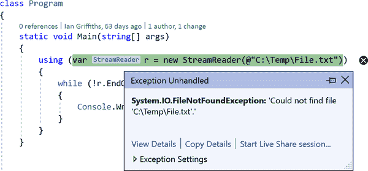

# 第八章。异常

有些操作可能会失败。如果你的程序从存储在外部驱动器上的文件读取数据，可能会有人断开驱动器。您的应用程序可能尝试构造数组，但发现系统没有足够的空闲内存。间歇性的无线网络连接问题可能会导致网络请求失败。程序发现这些故障的一个广泛使用的方法是每个 API 返回一个值，指示操作是否成功。这要求开发人员保持警惕，以便检测所有的错误，因为程序必须检查每个操作的返回值。这确实是一种可行的策略，但它可能会使代码变得难以理解；当没有问题时执行的工作的逻辑顺序可能会被所有的错误检查淹没，使得代码难以维护。C# 支持另一种流行的错误处理机制，可以缓解这个问题：*异常*。

当 API 报告异常导致操作失败时，会打断正常的执行流程，直接跳转到最近的适当错误处理代码。这种方式使得错误处理逻辑与尝试执行任务的代码分离，这样做可以使得代码更易读和维护，尽管其缺点是可能较难看出代码可能执行的所有可能路径。

异常还可以报告操作问题，而这些问题可能不适合使用返回码进行处理。例如，运行时可以检测和报告基本操作的问题，甚至简单到使用引用。引用类型变量可能包含`null`，如果尝试在空引用上调用方法，则会失败。运行时会用异常报告这种情况。

.NET 中的大多数错误都表示为异常。但是，一些 API 提供了返回代码和异常之间的选择。例如，`int` 类型具有一个 `Parse` 方法，该方法接受一个字符串并尝试解释其内容为数字，如果传递了一些非数字文本（例如 `"Hello"`），它将通过抛出 `FormatException` 来指示失败。如果您不喜欢这样，可以改用 `TryParse`，它完全执行相同的任务，但如果输入非数字，则返回 `false` 而不是抛出异常。（由于方法的返回值负责报告成功或失败，该方法通过 `out` 参数提供整数结果。）数字解析并不是唯一使用此模式的操作，在这种情况下，一对方法（在本例中为 `Parse` 和 `TryParse`）提供了异常和返回值之间的选择。正如您在 第五章 中看到的那样，字典也提供了类似的选择。索引器如果使用不在字典中的键，则会抛出异常，但您还可以使用 `TryGetValue` 查找值，如果失败，则返回 `false`，就像 `TryParse` 一样。尽管此模式在几个地方出现，但对于大多数 API 来说，异常是唯一的选择。

如果您设计一个可能会失败的 API，应如何报告失败？应该使用异常、返回值还是两者兼有？微软的类库设计指南包含似乎毫不含糊的说明：

> 不要返回错误代码。在框架中，异常是报告错误的主要手段。
> 
> .NET Framework 设计指南

但是这与存在 `int.TryParse` 的事实如何相符呢？指南中有关异常性能考虑的部分如下所述：

> 考虑在常见情况下可能会抛出异常的成员使用“尝试-解析”模式，以避免与异常相关的性能问题。
> 
> .NET Framework 设计指南

解析数字失败不一定是错误。例如，您可能希望应用程序允许以数字或文本指定月份。因此，在操作可能失败的常见情况下，还有另一个标准：它建议在“极其性能敏感的 API”中使用 `TryParse` 方法，因此只有在操作速度比抛出和处理异常的时间快时，您才应该提供这种方法。

异常通常可以在几毫秒内抛出和处理，因此它们并不是非常慢的——例如，并不像读取网络连接上的数据那么慢——但它们也不是极快的。我发现在我的电脑上，使用.NET 6.0，单线程可以以约每秒大约 8000 万个字符串的速率解析五位数字字符串，并且如果我使用`TryParse`，它能够以类似的速度拒绝非数字字符串。`Parse`方法处理数字字符串同样快，但在拒绝非数字字符串方面大约慢 400 倍，这要归因于异常的成本。当然，将字符串转换为整数是一种非常快速的操作，所以这使得异常看起来特别糟糕，但这也是为什么这种模式在自然快速的操作中最为常见。

调试时，异常可能特别慢。部分原因是调试器必须决定是否中断，但特别是在程序首次遇到未处理的异常时尤为明显。这可能给人一种异常的成本远高于实际情况的印象。上述段落中的数字基于观察到的运行时行为，没有考虑调试开销。尽管如此，这些数字略微低估了成本，因为处理异常往往会导致 CLR 运行代码片段并访问否则不需要使用的数据结构，这可能会导致有用的数据被推出 CPU 的缓存，使代码在异常处理后的短时间内运行更慢，直到非异常代码和数据重新进入缓存。我的示例的简单性减少了这种影响。

大多数 API 不提供`Try*Xxx*`形式，并且会将所有失败报告为异常，即使在失败可能很常见的情况下也是如此。例如，文件 API 不提供一种在文件丢失时打开现有文件进行读取而不抛出异常的方式。（您可以使用不同的 API 先测试文件是否存在，但这并不能保证成功。总是可能会有其他进程在您询问文件是否存在和尝试打开它之间删除该文件。）由于文件系统操作本质上是慢速的，即使在这里`Try*Xxx*`模式也不会提供值得的性能提升，尽管逻辑上可能有意义。

###### 警告

如果您使用`Try*Xxx*`模式，请注意，如果操作可能会失败的原因有多种，`false`返回值通常只表示一种特定类型的失败。因此，这种类型的方法在某些失败模式下仍可能抛出异常。

# 异常来源

类库 API 不是异常的唯一来源。它们可以在以下任何场景中抛出：

+   您自己的代码检测到了一个问题。

+   您的程序使用了一个类库 API，它检测到了一个问题。

+   运行时检测到操作失败（例如，在检查上下文中发生算术溢出，或者尝试使用空引用，或者尝试为没有足够内存的对象分配内存）。

+   运行时检测到影响您代码的情况，这些情况不在您的控制之内（例如，运行时尝试为某些内部目的分配内存，却发现没有足够的可用内存）。

尽管所有这些情况都使用相同的异常处理机制，但异常发生的位置各不相同。当您自己的代码抛出异常时（我稍后会告诉您如何操作），您将知道导致它发生的条件，但这些其他场景何时会产生异常呢？我将在接下来的部分描述在哪里期望每种类型的异常。

## 来自 API 的异常

使用 API 调用时，可能会出现几种导致异常的问题。您可能提供了毫无意义的参数，比如需要非空引用而提供了 `null` 引用，或者期望文件名而提供了空字符串。或者这些参数在单独看起来是合理的，但在集体使用时却不行。例如，您可能调用了一个将数据复制到数组的 API，请求它复制超过数组容量的数据。您可以将这些错误描述为“那绝对行不通”的错误类型，通常是由于代码中的错误而导致的。（一个曾在 C# 编译器团队工作过的开发者将这些称为 *愚蠢的* 异常。）

另一类问题是，参数看起来都合理，但基于当前世界状态，操作实际上不可能进行。例如，您可能要求打开某个特定的文件，但该文件可能不存在；或者它存在，但某个其他程序已经打开并要求独占访问该文件。还有另一种情况是，事情可能一开始顺利，但情况可以改变，例如您成功打开了一个文件并且已经读取了一段时间的数据，但随后该文件变得不可访问。如前所述，可能是有人拔掉了磁盘，或者驱动器由于过热或老化而失败。

与外部服务通过网络通信的软件需要考虑，异常并不一定表示真的有什么问题—有时请求因某些临时条件而失败，您可能只需重试操作。这在云环境中特别常见，在那里单个服务器作为负载平衡的一部分会频繁上下线—因此偶尔会有几次操作由于没有明确的原因而失败。

###### 小贴士

当使用库通过服务时，你应该弄清楚它是否已经为你处理了这些问题。例如，Azure 存储库默认会自动执行重试，并且只有在你禁用此行为或者在多次尝试后问题仍然存在时才会抛出异常。你通常不应该为这种类型的错误在已经处理了这一问题的库周围添加自己的异常处理和重试循环。

异步编程还增加了另一种变化。在第十六章和 17 章中，我将展示各种异步 API——其中工作可以在启动它的方法返回后继续进行。异步运行的工作也可能会异步失败，在这种情况下，库可能必须等到你的代码下次调用它之前才能报告错误。

尽管情况各异，在所有这些情况中，异常都将来自你的代码调用的某个 API。（即使异步操作失败，异常也会在你尝试收集操作结果时或显式询问是否发生错误时产生。）示例 8-1 展示了可能出现这类异常的一些代码。

##### 示例 8-1\. 从库调用中获取异常

```cs
static void Main(string[] args)
{
    using (var r = new StreamReader(@"C:\Temp\File.txt"))
    {
        while (!r.EndOfStream)
        {
            Console.WriteLine(r.ReadLine());
        }
    }
}
```

没有什么绝对错误的这段代码，所以我们不会得到任何关于参数明显错误的异常。（在非正式术语中，它不会犯愚蠢的错误。）如果你的电脑 *C:* 驱动器有一个 *Temp* 文件夹，并且其中包含一个 *File.txt* 文件，而且运行程序的用户有权限读取该文件，并且计算机上没有其他内容已经独占了该文件，并且没有问题——比如磁盘损坏——可能导致文件的任何部分不可访问，并且在程序运行时没有新问题（比如驱动器着火），这段代码就会完美地工作：它将显示文件中的每一行文本。但是这里有很多 *如果*。

如果没有这样的文件，`StreamReader` 构造函数将无法完成。相反，它会抛出一个异常。这个程序没有尝试处理这种情况，所以应用程序会终止。如果你在 Visual Studio 的调试器外运行程序，你会看到以下输出：

```cs
Unhandled exception. System.IO.FileNotFoundException: Could not find file 'C:\Te
mp\File.txt'.
File name: 'C:\Temp\File.txt'
   at Microsoft.Win32.SafeHandles.SafeFileHandle.CreateFile(String fullPath, Fil
eMode mode, FileAccess access, FileShare share, FileOptions options)
   at Microsoft.Win32.SafeHandles.SafeFileHandle.Open(String fullPath, FileMode
mode, FileAccess access, FileShare share, FileOptions options, Int64 preallocati
onSize)
   at System.IO.Strategies.OSFileStreamStrategy..ctor(String path, FileMode mode
, FileAccess access, FileShare share, FileOptions options, Int64 preallocationSi
ze)
   at System.IO.Strategies.FileStreamHelpers.ChooseStrategyCore(String path, Fil
eMode mode, FileAccess access, FileShare share, FileOptions options, Int64 preal
ocationSize)
   at System.IO.Strategies.FileStreamHelpers.ChooseStrategy(FileStream fileStrea
m, String path, FileMode mode, FileAccess access, FileShare share, Int32 bufferS
ize, FileOptions options, Int64 preallocationSize)
   at System.IO.StreamReader.ValidateArgsAndOpenPath(String path, Encoding encod
ing, Int32 bufferSize)
   at System.IO.StreamReader..ctor(String path)
   at Exceptional.Program.Main(String[] args) in c:\Examples\Ch08\Example1\Progr
am.cs:line 10
```

这告诉我们发生了什么错误，并显示了程序在问题发生时的完整调用堆栈。在 Windows 上，系统级错误处理也会介入，所以根据计算机的配置，你可能会看到其错误报告对话框，甚至可能会向 Microsoft 的错误报告服务报告崩溃情况。如果你在调试器外运行相同的程序，它会告诉你有关异常，并突出显示发生错误的代码行，就像 图 8-1 所示。



###### 图 8-1\. Visual Studio 报告异常

我们在这里看到的是程序在不处理异常的情况下的默认行为：如果附加了调试器，它将中断，否则程序就会崩溃。不久我将展示如何处理异常，但这说明了你不能简单地忽略它们。

顺便说一下，在示例 8-1 中，对 `StreamReader` 构造函数的调用并不是唯一可能引发异常的行。代码多次调用 `ReadLine`，其中任何调用都可能失败。一般来说，任何成员访问都可能导致异常，甚至仅仅是读取属性，尽管类库设计者通常试图最小化属性引发异常的情况。如果犯了“那绝对行不通”的错误（愚蠢的错误），那么属性可能会引发异常，但通常不是“这个特定操作失败”的错误。例如，文档说明了在示例 8-1 中使用的 `EndOfStream` 属性，如果在对 `StreamReader` 对象调用 `Dispose` 后尝试读取它，将引发异常——这是一个明显的编码错误，但如果在读取文件时出现问题，`StreamReader` 仅会从方法或构造函数中抛出异常。

## 运行时检测到的失败

另一个异常源是当 CLR 自身检测到某些操作失败时。示例 8-2 展示了可能发生这种情况的方法。与示例 8-1 类似，这段代码本质上没有问题（除了不是很有用）。完全可以在不引起问题的情况下使用它。但是，如果有人将第二个参数传入 `0`，那么代码将尝试执行非法操作。

##### 示例 8-2\. 可能的运行时检测到的失败

```cs
static int Divide(int x, int y)
{
    return x / y;
}
```

CLR 将检测到此除法操作试图除以零并将引发 `DivideByZeroException`。这将与来自 API 调用的异常具有相同的效果：如果程序未尝试处理异常，则会崩溃，或者调试器将中断。

###### 注意

在 C# 中，除零操作并非总是非法的。浮点类型支持表示正无穷大和负无穷大的特殊值，这是在将正数或负数除以零时得到的值；如果除以零，则得到特殊的非数值。整数类型不支持这些特殊值，因此整数除以零总是错误的。

我之前描述的异常的最终来源也是运行时检测到某些失败的地方，但它们的工作方式略有不同。它们不一定直接由线程上的代码触发。这些有时被称为*异步异常*，理论上可以在代码的任何地方抛出，这使得确保正确处理它们变得困难。然而，它们往往只在相当灾难性的情况下抛出，通常是在程序即将关闭时，因此通常无法有用地处理它们。例如，`Sta⁠ckO⁠ver⁠flow​Exc⁠ept⁠ion`和`OutOfMemoryException`理论上可以在任何时候抛出（因为 CLR 可能需要为自己的目的分配内存，即使您的代码并未明确尝试这样做）。

我已经描述了异常被抛出的常见情况，您也看到了默认行为，但如果您希望程序执行与崩溃不同的操作怎么办？

# 处理异常

当抛出异常时，CLR 会寻找处理异常的代码。只有在整个调用堆栈上没有合适的处理程序时，默认的异常处理行为才会起作用。为了提供处理程序，我们使用 C#的`try`和`catch`关键字，正如示例 8-3 所示。

##### 示例 8-3\. 处理异常

```cs
try
{
    using (var r = new StreamReader(@"C:\Temp\File.txt"))
    {
        while (!r.EndOfStream)
        {
            Console.WriteLine(r.ReadLine());
        }
    }
}
catch (FileNotFoundException)
{
    Console.WriteLine("Couldn't find the file");
}
```

紧跟在`try`关键字之后的块通常称为*try 块*，如果程序在此类块内部抛出异常，CLR 会寻找匹配的*catch 块*。示例 8-3 只有一个单独的`catch`块，在`catch`关键字后的括号中，您可以看到此特定块旨在处理`FileNotFoundException`类型的异常。

如前所示，如果没有*C:\Temp\File.txt*文件，`StreamReader`构造函数会抛出`FileNotFoundException`。在示例 8-1 中，这导致我们的程序崩溃，但因为示例 8-3 中有一个`catch`块来处理该异常，CLR 将运行该`catch`块。此时，它会认为异常已经被处理，因此程序不会崩溃。我们的`catch`块可以自由地执行任何操作，在这种情况下，我的代码只是显示一个消息，指示找不到该文件。

异常处理程序不需要位于引发异常的方法中。CLR 会沿着调用堆栈向上查找，直到找到合适的处理程序。如果失败的`StreamReader`构造函数调用位于从示例 8-3 的`try`块内部调用的其他方法中，我们的`catch`块仍然会运行（除非该方法为相同异常提供了自己的处理程序）。

## 异常对象

异常是对象，其类型派生自`Exception`基类。¹ 这定义了提供异常信息的属性，一些派生类型还添加了特定于它们所代表问题的属性。如果需要了解出了什么问题，你的`catch`块可以获取异常的引用。示例 8-4 显示了来自示例 8-3 的`catch`块的修改。在`catch`关键字后的括号中，除了指定异常类型，我们还提供了一个标识符（`x`），用于`catch`块中的代码引用异常对象。这使得代码能够读取特定于`FileNotFoundException`类的属性：`FileName`。

##### 示例 8-4\. 在`catch`块中使用异常

```cs
try
{
    // ...same code as Example 8-3...
}
catch (FileNotFoundException x)
{
    Console.WriteLine($"File '{x.FileName}' is missing");
}
```

这将显示找不到的文件的名称。通过这个简单的程序，我们已经知道我们试图打开哪个文件，但是在处理多个文件的更复杂程序中，这个属性可能会有所帮助。

基类`Exception`定义的通用成员包括`Message`属性，它返回包含问题文本描述的字符串。控制台应用程序的默认错误处理显示这个信息。当我们首次运行示例 8-1 时看到的文本`Could not find file 'C:\Temp\File.txt'`来自`Message`属性。在诊断意外异常时，这个属性非常重要。

###### 警告

`Message`属性用于人类阅读，因此 API 可能会本地化这些消息。因此，试图通过检查`Message`属性来解释异常是一个不好的主意，因为当你的代码在配置为运行在语言与你不同的区域的计算机上运行时，这可能会失败。 （并且微软不将异常消息更改视为破坏性更改，因此即使在同一区域内，文本也可能会更改。）最好依赖实际的异常类型，尽管某些异常如`IOException`在模棱两可的情况下会被使用。因此，有时需要检查`HResult`属性，该属性将设置为操作系统中的错误代码。

`Exception` 还定义了一个 `InnerException` 属性。通常情况下这是 `null`，但当一个操作由于其他失败而失败时，它会变得有用。有时，在库的深层中发生的异常如果允许一直传播到调用者可能会让人感到困惑。例如，.NET 提供了一个用于解析 XAML 文件的库。（XAML——可扩展应用程序标记语言——被各种 .NET UI 框架使用，包括 WPF。）XAML 是可扩展的，因此您的代码（或者第三方代码）可能会作为加载 XAML 文件过程的一部分而运行，而这些扩展代码可能会失败——假设您的代码中存在错误导致在访问数组元素时抛出 `IndexOutOfRangeException`。如果这种异常从 XAML API 中出现，那将有些费解，因此无论失败的根本原因是什么，库都会抛出 `XamlParseException`。这意味着，如果您想要处理加载 XAML 文件失败的情况，您可以确切地知道要处理的异常，但失败的根本原因不会丢失：当其他异常导致失败时，它将在 `InnerException` 中。

所有异常都包含关于异常抛出位置的信息。`StackTrace` 属性提供了调用堆栈的字符串表示。正如您已经看到的，默认的控制台应用程序异常处理程序会显示这些信息。还有一个 `TargetSite` 属性，告诉您正在执行的方法。它返回反射 API 的 `MethodBase` 类的实例。详细信息请参见第十三章关于反射的部分。

## 多个 catch 块

`try` 块后面可以跟多个 `catch` 块。如果第一个 `catch` 不匹配抛出的异常，CLR 将查看下一个，依此类推。示例 8-5 提供了对 `FileNotFoundException`、`DirectoryNotFoundException` 和 `IOException` 的处理程序。

##### 示例 8-5\. 处理多个异常类型

```cs
try
{
    using (var r = new StreamReader(@"C:\Temp\File.txt"))
    {
        while (!r.EndOfStream)
        {
            Console.WriteLine(r.ReadLine());
        }
    }
}
catch (FileNotFoundException x)
{
    Console.WriteLine($"File '{x.FileName}' is missing");
}
catch (DirectoryNotFoundException)
{
    Console.WriteLine($"The containing directory does not exist.");
}
catch (IOException x)
{
    Console.WriteLine($"IO error: '{x.Message}'");
}
```

这个示例的一个有趣特性是 `FileNotFoundException` 和 `DirectoryNotFoundException` 都派生自 `IOException`。我可以移除前两个 `catch` 块，这仍然可以正确处理这些异常（只是显示的消息会更少具体），因为 CLR 会认为 `catch` 块匹配异常的基类型时也是有效的。因此，示例 8-5 为 `FileNotFoundException` 提供了两个可行的处理程序，并且为 `DirectoryNotFoundException` 也提供了两个可行的处理程序。（第三个处理程序仍然有用，因为文档告诉我们，对于某些类型的失败，`StreamReader` 将抛出 `IOException`，而不是更特定的类型。）在这些情况下，C# 要求更具体的处理程序首先出现。如果我将 `IOException` 处理程序移动到其他处理程序的上方，那么对于每个更具体的处理程序，编译器将会报错：

```cs
error CS0160: A previous catch clause already catches all exceptions of this or
of a super type ('IOException')
```

如果为`Exception`基类型编写`catch`块，它将捕获所有异常。在大多数情况下，这是不正确的做法。虽然处理你可以预期的异常是好的，但如果你不知道异常代表什么，通常应该让它继续传播。否则，你可能会掩盖问题。如果让异常继续传播，它更有可能被注意到，增加了在某个时刻正确修复问题的机会。如果你打算将所有异常都包装在另一个异常中并抛出，就像前面描述的`XamlParseException`一样，那么一个捕获所有异常的处理程序可能是适当的。如果在异常只能由系统提供的默认处理方式处理的地方，捕获所有异常并将细节写入日志文件或类似的诊断机制也许是合适的。即便如此，在记录日志之后，你可能仍然希望重新抛出异常，就像本章后面描述的那样，甚至终止具有非零退出代码的进程。

###### 警告

对于非常重要的服务，你可能会考虑编写代码来吞噬异常，以便你的应用程序可以继续运行。这是一个坏主意。如果发生了你没有预料到的异常，你的应用程序内部状态可能不再可信，因为在故障发生时，你的代码可能已经进行到一半的操作。如果你不能承担应用程序离线的代价，最好的方法是安排它在故障后自动重启。例如，可以配置 Windows 服务自动执行此操作。

## 异常过滤器

你可以使`catch`块有条件地执行：如果为`catch`块提供了一个*异常过滤器*，那么只有在过滤器条件为真时才会捕获异常。 示例 8-6 展示了这样做的实用性。它使用了 Azure 表存储的客户端 API，这是 Microsoft Azure 云计算平台的一部分提供的 NoSQL 存储服务。该 API 的`TableClient`类有一个`AddEntity`方法，如果出现问题就会抛出`RequestFailedException`。问题是，“出现问题”非常广泛，涵盖了不仅仅是连接和身份验证失败。在某些乐观并发模型中，尝试插入具有相同键的另一行时，也会看到此异常。这不一定是错误，有时在正常使用中会出现。

##### 示例 8-6\. `catch`块的异常过滤器

```cs
public static bool InsertIfDoesNotExist(MyEntity item, TableClient table)
{
    try
    {
        table.AddEntity(item);
        return true;
    }
    catch (RequestFailedException x)
    `when` `(``x``.``Status` `=``=` `409``)`
    {
        return false;
    }
}
```

示例 8-6 查找特定的失败案例，并在异常继续向上传播之前返回`false`。它使用包含过滤器的`when`子句来实现这一点，该过滤器必须是`bool`类型的表达式。如果`Execute`方法抛出的`StorageException`不符合过滤条件，则异常将像没有`catch`块一样传播。

###### 提示

在使用异常过滤器时，单个`try`块可以有多个针对同一异常的`catch`块。通常情况下，这会导致编译器错误，因为只有第一个这样的`catch`块会起作用，但是使用过滤器时，情况并非一定如此，因此编译器允许这样做。甚至可以为特定异常类型的一个未经过滤的`catch`块与同一类型的过滤`catch`块共存，但未经过滤的必须出现在最后。

异常过滤器必须是生成`bool`的表达式。如果需要，它可以调用外部方法。示例 8-6 只是获取一个属性并执行比较，但您可以自由地在表达式中调用任何方法。² 但是，应注意避免在过滤器中执行可能引发另一个异常的操作。如果发生这种情况，第二个异常将丢失。

## 嵌套的 try 块

如果在`try`块中发生异常，而没有提供适当的处理程序，则 CLR 将继续查找。必要时会沿着堆栈向上走，但是可以通过将一个`try`/`catch`嵌套在另一个`try`块中，在单个方法中嵌套多组处理程序，就像示例 8-7 所示。`ShowFirstLineLength`在另一个`try`/`catch`对的`try`块内部嵌套了一个`try`/`catch`对。也可以跨方法进行嵌套——`Main`方法将捕获从`ShowFirstLineLength`方法抛出的任何`NullReferenceException`（如果文件完全为空，则调用`ReadLine`将返回`null`）。

##### 示例 8-7\. 嵌套异常处理

```cs
static void Main(string[] args)
{
    try
    {
        ShowFirstLineLength(@"C:\Temp\File.txt");
    }
    catch (NullReferenceException)
    {
        Console.WriteLine("NullReferenceException");
    }
}

static void ShowFirstLineLength(string fileName)
{
    try
    {
        using (var r = new StreamReader(fileName))
        {
            try
            {
                Console.WriteLine(r.ReadLine()!.Length);
            }
            catch (IOException x)
            {
                Console.WriteLine("Error while reading file: {0}",
                    x.Message);
            }
        }
    }
    catch (FileNotFoundException x)
    {
        Console.WriteLine("Couldn't find the file '{0}'", x.FileName);
    }
}
```

我在这里嵌套了`IOException`处理程序，使其仅适用于工作的某个特定部分：它仅处理在成功打开文件后读取时发生的错误。有时，对此情况作出不同响应可能比对导致无法打开文件的错误响应更有用。

此处的跨方法处理有些刻意。可以通过测试`ReadLine`的返回值是否为`null`来避免`NullReference​Excep⁠tion`。然而，这里展示的 CLR 底层机制非常重要。特定的`try`块可以定义仅对其知道如何处理的那些异常的`catch`块，允许其他异常逃逸到更高级别。

让异常继续向上堆栈传播通常是正确的做法。除非你的方法能够在发现错误时采取一些有用的措施，否则它将需要告知其调用者存在问题，所以除非你想用另一种异常包装异常，否则你可以让异常自由传播。

###### 注意

如果你熟悉 Java，你可能想知道 C#是否有等效于已检查异常的东西。它没有。方法不会正式声明它们可能抛出的异常，因此编译器无法告诉你是否未能处理它们或声明你的方法可能反过来抛出它们。

你也可以将一个`try`块嵌套在一个`catch`块内。如果你的错误处理程序本身可能失败，这一点很重要。例如，如果你的异常处理程序将有关磁盘故障的信息记录到磁盘上，那么如果磁盘出现问题，它可能会失败。

有些 `try` 块永远不会捕获任何东西。编写不紧跟着`catch`块的`try`块是非法的，但那个东西不必是一个`catch`块：它可以是一个*finally 块*。

## finally 块

一个`finally`块包含在其关联的`try`块完成后始终运行的代码。它无论是通过达到结尾、从中间返回或抛出异常离开`try`块，都会运行。即使你使用`goto`语句直接跳出块，`finally`块也会运行。示例 8-8 展示了`finally`块的使用。

##### 示例 8-8\. 一个`finally`块

```cs
using Microsoft.Office.Interop.PowerPoint;

...

[STAThread]
static void Main(string[] args)
{
    var pptApp = new Application();
    Presentation pres = pptApp.Presentations.Open(args[0]);
    try
    {
        ProcessSlides(pres);
    }
    finally
    {
        pres.Close();
    }
}
```

这是我编写的用于处理 Microsoft Office PowerPoint 文件内容的实用程序的摘录。这只显示了最外层的代码；我省略了实际的详细处理代码，因为这里并不重要（尽管如果你好奇的话，本书的可下载示例的完整版本将动画幻灯片导出为视频剪辑）。我展示它是因为它使用了`finally`。这个示例使用 COM 互操作来控制 PowerPoint 应用程序。这个示例在完成后关闭文档，我将该代码放在`finally`块中的原因是，如果程序在中途出现问题，我不希望它留下未关闭的东西。这是因为 COM 自动化的工作方式。这不像打开文件，操作系统在进程终止时会自动关闭所有内容。如果程序突然退出，PowerPoint 不会关闭已经打开的任何东西，它只是假设你是要保留打开的。 （当创建用户将编辑的新文档时，你可能会故意这样做。）我不希望这样，将文件在`finally`块中关闭是避免这种情况的可靠方法。

通常，您会为此类事物编写`using`语句，但是 PowerPoint 的基于 COM 的自动化 API 不支持.NET 的`IDisposable`接口。实际上，正如我们在上一章中看到的那样，`using`语句在内部使用`finally`块工作，`foreach`也是如此，因此即使在编写`using`语句和`foreach`循环时，您也依赖于异常处理系统的`finally`机制。

###### 注意

当异常块嵌套时，`finally`块会正确运行。如果某个方法抛出异常，由调用堆栈中较高级别的方法处理，而中间某些方法位于`using`语句、`foreach`循环或带有关联`finally`块的`try`块中，则所有这些中间`finally`块（无论是显式声明的还是编译器隐式生成的）都会在处理程序运行之前执行。

处理异常当然只是问题的一半。您的代码可能会检测到问题，并且异常可能是适当的报告机制。

# 抛出异常

抛出异常非常直接。只需构造适当类型的异常对象，然后使用`throw`关键字。当`position`参数超出合理范围时，示例 8-9 会这样做。

##### 示例 8-9\. 抛出异常

```cs
public static string GetCommaSeparatedEntry(string text, int position)
{
    string[] parts = text.Split(',');
    if (position < 0 || position >= parts.Length)
    {
        `throw` `new` `ArgumentOutOfRangeException``(``nameof``(``position``)``)``;`
    }
    return parts[position];
}
```

CLR 为我们完成了所有工作。它捕获了异常所需的信息，以便能够通过`StackTrace`和`TargetSite`属性报告其位置。（它不计算它们的最终值，因为这些值相对昂贵。它只是确保它具有生成这些值所需的信息，以备查询。）然后它寻找合适的`try`/`catch`块，如果需要运行任何`finally`块，它将执行它们。

示例 8-9 展示了在抛出报告方法参数问题的异常时常用的一种技术。诸如`ArgumentNull​Excep⁠tion`、`ArgumentOutOfRangeException`及其基类`ArgumentException`等异常都可以报告有问题的参数的名称。（这是可选的，因为有时需要报告多个参数之间的不一致性，此时没有单个参数需要命名。）使用 C#的`nameof`运算符是个不错的主意。您可以将其与任何引用命名项的表达式一起使用，例如参数、变量、属性或方法。它编译为包含该项名称的字符串。

在这里，我本可以简单地使用字符串字面量`"position"`，但`nameof`的优点在于它可以避免愚蠢的错误（如果我输入`positon`而不是`position`，编译器会告诉我找不到这样的符号），并且可以帮助避免由于重命名符号时引起的问题。如果我在示例 8-9 中重命名`position`参数，很容易忘记更改以匹配的字符串字面量。但是通过使用`nameof(position)`，如果我更改参数名称为`pos`而没有同时更改`nameof(position)`，编译器会报告找不到名为`position`的标识符。如果我请求一个了解 C# 的 IDE（例如 Visual Studio 或 JetBrains Rider）重命名参数，它将自动更新代码中使用该符号的所有地方，因此它将为我替换异常的构造函数参数为`nameof(input)`。

我们可以使用类似的技术处理`ArgumentNullException`，但是.NET 6.0 添加了一个可以简化抛出此特定异常的帮助函数。正如示例 8-10 所示，与其编写一个测试输入的`if`语句，其主体抛出标识正确参数名称的异常，我们可以直接调用`ArgumentNullException.ThrowIfNull`。

##### 示例 8-10\. 抛出`ArgumentNullException`

```cs
public static int CountCommas(string text)
{
    `ArgumentNullException``.``ThrowIfNull``(``text``)``;`
    return text.Count(ch => ch == ',');
}

```

此方法测试传递的任何参数，并在其为 null 时抛出`ArgumentNullException`。但是如何正确设置参数名称呢？此`ThrowIfNull`方法利用了新的 C# 10.0 功能：它带有`CallerArgument​Ex⁠pression`属性的注释。正如第十四章所述，此属性使`ThrowIfNull`助手能够发现调用方用作参数的表达式文本。由于我们将我们的`text`参数传递给此助手，它将传递一个额外的隐藏参数，字符串`"text"`。因此，这与使用其他参数异常的`nameof`具有相同的所有好处，但它还为我们执行相关的测试。

###### 警告

许多异常类型提供了一个构造函数重载，允许您设置`Message`文本。更专业的消息可能会使问题更容易诊断，但要小心一件事。异常消息经常出现在诊断日志中，并且可能也会通过监控系统自动发送电子邮件。因此，请注意您在这些消息中放入的信息。如果您的软件将在有数据保护法的国家使用，这一点尤为重要——在异常消息中放入任何与特定用户有关的信息有时可能违反这些法律。

## 重新抛出异常

有时编写一个`catch`块以响应错误并允许该错误在完成工作后继续是有用的。这有一种明显但错误的方法，例如示例 8-11 中所示。

##### 示例 8-11\. 如何不重新抛出异常

```cs
try
{
    DoSomething();
}
catch (IOException x)
{
    LogIOError(x);
    // This next line is BAD!
    throw x;  // Do not do this
}
```

这将编译而不会出错，甚至看起来可以工作，但它有一个严重的问题：它丢失了最初引发异常的上下文。CLR 将其视为全新的异常（即使您正在重用异常对象），并将重置位置信息：`StackTrace`和`TargetSite`将报告错误的源自于`catch`块内部。这可能会导致诊断问题变得困难，因为您将无法看到其最初抛出的位置。示例 8-12 展示了如何避免此问题。

##### 示例 8-12\. 不丢失上下文而重新抛出

```cs
try
{
    DoSomething();
}
catch (IOException x)
{
    LogIOError(x);
    `throw``;`
}
```

除了删除警告评论之外，这与示例 8-11 的唯一区别在于，我使用`throw`关键字而没有指定要用作异常的对象。您只能在`catch`块内执行此操作，并且它会重新抛出`catch`块正在处理的任何异常。这意味着报告异常原始抛出位置的`Exception`属性仍将指向原始的抛出位置，而不是重新抛出位置。

###### 警告

在.NET Framework 上（即，如果您不使用.NET 或.NET Core），示例 8-12 并未完全解决此问题。虽然将异常抛出的点（在此示例中发生在`DoSomething`方法内部的某处）将被保留，但在堆栈跟踪中显示示例 8-12 方法达到的部分将不会。而是将指示它位于包含`throw`的行。这有点奇怪的效果是，堆栈跟踪看起来好像是`DoSomething`方法被`throw`关键字调用。.NET Core 3.1 及更高版本不会出现此问题。

处理异常时还需要注意另一个与上下文相关的问题，可能需要重新抛出异常，这与 CLR 向 Windows 错误报告（3）（WER）提供信息的方式有关。在 Windows 上应用程序崩溃时，WER 可能会显示崩溃对话框，其中可以提供包括重新启动应用程序、向 Microsoft 报告崩溃、调试应用程序或仅终止应用程序在内的选项。除此之外，当 Windows 应用程序崩溃时，WER 会捕获多个信息片段来确定崩溃位置。对于.NET 应用程序，这包括组件失败的名称、版本和时间戳，抛出的异常类型以及异常抛出位置的信息。这些信息有时被称为*bucket*值。如果应用程序以相同的值崩溃两次，这两次崩溃会进入同一个 bucket 中，这意味着它们在某种意义上被认为是相同的崩溃。

从 Windows 事件日志中检索这些信息对于在您控制的计算机上运行的代码来说是很好的（或者您可能更喜欢使用更直接的方法来监视此类应用程序，例如使用 Microsoft 的应用程序洞察来收集遥测数据，此时 WER 就不是很有趣了）。WER 变得更重要的地方是那些可能在您控制之外的其他计算机上运行的应用程序，例如完全本地运行的带有 UI 的应用程序或控制台应用程序。计算机可以配置为将崩溃报告上传到错误报告服务，通常只发送 bucket 值，尽管服务可以在最终用户同意的情况下请求额外的数据。在决定如何优先修复 bug 时，bucket 分析非常有用：从最大的 bucket 开始是有意义的，因为这是您的用户最常见的崩溃情况。（或者，至少，这是由于用户未禁用崩溃报告而最经常见到的情况。我总是在我的计算机上启用这个功能，因为我希望程序中遇到的 bug 能够尽快修复。）

###### 注意

获取累积崩溃 bucket 数据的方法取决于您正在编写的应用程序类型。对于仅在您企业内部运行的业务应用程序，您可能希望运行自己的错误报告服务器，但如果应用程序在您的管理之外运行，则可以使用 Microsoft 自己的崩溃服务器。有一个基于证书的验证过程，用于验证您有权访问数据，但一旦您通过相关的程序，Microsoft 将显示所有应用程序的已报告崩溃，按 bucket 大小排序。

某些异常处理策略可能会破坏崩溃桶系统。如果编写通用的错误处理代码，涉及所有异常，有风险，WER 将认为您的应用程序只会在该通用处理程序内部崩溃，这意味着所有类型的崩溃将进入同一个桶中。这并非不可避免，但要避免这种情况，您需要了解您的异常处理代码如何影响 WER 崩溃桶数据。

如果一个异常在未被处理时到达堆栈的顶部，WER 将准确地了解崩溃发生的确切位置，但如果在最终允许它（或其他异常）继续上升堆栈之前捕获异常，可能会出现问题。有点令人惊讶的是，即使使用示例 8-11 中显示的错误方法，.NET 也会成功保留 WER 的位置（仅从应用程序内部的.NET 视角来看，这会丢失异常上下文——`StackTrace`将显示重新抛出位置。因此，WER 不一定报告与.NET 代码中异常对象中看到的相同的崩溃位置）。当您将异常包装为新异常的`InnerException`时，情况类似：.NET 将使用该内部异常的位置作为崩溃桶值的位置。

这意味着相对容易保留 WER 桶。丢失原始上下文的唯一方法是完全处理异常（即不崩溃），或者编写一个`catch`块，处理异常，然后抛出一个新异常而不将原异常作为`InnerException`传递。

尽管示例 8-12 保留了原始上下文，但这种方法有一个限制：只能在捕获异常的块内部重新抛出异常。随着异步编程越来越普遍，异常越来越可能在某个随机工作线程上发生。我们需要一种可靠的方法来捕获异常的完整上下文，并能在随后的任意时间点重新抛出异常，可能是从不同的线程。

`ExceptionDispatchInfo` 类解决了这些问题。如果从`catch`块中调用它的静态`Capture`方法，并传入当前异常，它会捕获完整的上下文，包括 WER 需要的信息。`Capture`方法返回一个`ExceptionDispatchInfo`的实例。当你准备重新抛出异常时，可以调用这个对象的`Throw`方法，CLR 将以原始上下文完全不变地重新抛出异常。与示例 8-12 中显示的机制不同，重新抛出时不需要在`catch`块内部。甚至不需要在最初引发异常的线程上。

###### 注意

如果你使用了在第 17 章中描述的`async`和`await`关键字，它们为你使用`ExceptionDispatchInfo`来确保异常上下文被正确保存。

## 快速失败

有些情况需要采取激烈的行动。如果检测到你的应用程序处于无法挽回的腐败状态，抛出异常可能不足够，因为总是有可能有些东西会处理它，然后试图继续。这会冒着损坏持久状态的风险——也许无效的内存状态可能会导致你的程序将错误数据写入数据库。在造成任何持久性损坏之前，最好立即退出。

`Environment`类提供了一个`FailFast`方法。如果调用此方法，CLR 将终止你的应用程序。（如果你在 Windows 上运行，它还将向 Windows 事件日志写入消息，并向 WER 提供详细信息。）你可以传递一个字符串以包含在事件日志条目中，并且还可以传递一个异常，在这种情况下，在 Windows 上将写入异常的详细信息，包括异常抛出时的 WER 桶值。

# 异常类型

当你的代码检测到问题并抛出异常时，你需要选择抛出哪种类型的异常。你可以定义自己的异常类型，但运行时库定义了大量的异常类型，因此在许多情况下，你可以选择已有的类型。有数百种异常类型，因此在这里列出完整列表是不合适的；如果你想看到完整的集合，可以查看`Exception`类的在线文档列出的派生类型。然而，有一些异常类型是重要的需要了解的。

运行时库定义了一个`ArgumentException`类，它是几个异常的基类，用于指示方法使用了错误的参数。示例 8-9 使用了`ArgumentOutOfRangeException`，而示例 8-10 间接地抛出了`ArgumentNullException`。基类`ArgumentException`定义了一个`ParamName`属性，其中包含提供了错误参数的名称。这对于多参数方法很重要，因为调用方需要知道哪个参数出错了。所有这些异常类型都有构造函数，允许你指定参数名，你可以在示例 8-9 中看到其中之一的使用。基类`ArgumentException`是一个具体类，因此如果参数以未被派生类型覆盖的方式错误，你可以直接抛出基本异常，提供问题的文本描述。

除了刚才描述的通用类型外，一些 API 定义了更专门的派生参数异常。例如，`System.Globalization`命名空间定义了一个称为`CultureNotFoundException`的异常类型，它派生自`ArgumentException`。你也可以做类似的事情，而有两个理由你可能想这么做。如果你可以提供关于为什么参数无效的额外信息，你将需要一个自定义异常类型，以便将该信息附加到异常上（`CultureNotFoundException`提供了描述其搜索文化信息方面的三个属性）。或者，可能某种形式的参数错误可以被调用者特别处理。通常，参数异常仅表示编程错误，但在可能表示环境或配置问题的情况下（例如，未安装正确的语言包），开发人员可能希望以不同方式处理该特定问题。在这种情况下使用基本的`ArgumentException`将不会有帮助，因为很难区分他们想要处理的特定失败和参数的任何其他问题。

有些方法可能会执行可能会产生多个错误的工作。也许你正在运行某种批处理作业，如果批处理中的某些单个任务失败，你希望中止这些任务但继续执行其余任务，并在最后报告所有失败。对于这些场景，了解`AggregateException`是值得的。它扩展了基本`Exception`的`InnerException`概念，添加了一个`InnerExceptions`属性，返回一个异常集合。

###### 提示

如果嵌套了可能会产生`AggregateException`的工作（例如，在一个批处理中运行另一个批处理），那么你可能会得到一些内部异常也是`AggregateException`类型。这个异常提供了一个`Flatten`方法，它递归地遍历任何这样的嵌套异常，并生成一个扁平的异常列表。它返回一个`AggregateException`，其`InnerExceptions`是该列表。

另一个常用的类型是`InvalidOperationException`。如果某人试图在其当前状态下对对象进行不支持的操作，则会抛出此异常。例如，假设你编写了一个表示可以发送到服务器的请求的类。你可能会设计成每个实例只能使用一次，因此如果请求已经发送，尝试进一步修改请求将是一个错误，这时抛出此异常就是合适的。另一个重要的例子是，如果你的类型实现了`IDisposable`接口，并且在被释放后有人试图使用实例，那么有一个从`InvalidOperationException`派生的专门类型叫做`ObjectDisposedException`。

您应该注意`NotImplementedException`与听起来相似但在语义上不同的`NotSupportedException`之间的区别。当接口要求时，后者应该被抛出。例如，`IList<T>`接口定义了修改集合的方法，但不要求集合可修改——相反，它表示只读集合应该从会修改集合的成员抛出`NotSupportedException`。`IList<T>`的实现可以抛出这个异常并被认为是完整的，而`NotImplementedException`意味着有东西缺失。您最常见到的是 IDE 生成的代码——如果您要求它们生成接口实现或提供事件处理程序，它们可以创建存根方法。它们生成这些代码以便您不必输入完整的方法声明，但仍然需要您实现方法的主体，因此生成的方法将抛出此异常，以免您意外地保留空方法。

在发布之前，您通常会希望删除所有抛出`NotImplementedException`的代码，并替换为适当的实现。然而，有一种情况可能需要抛出它。假设您编写了一个包含抽象基类的库，并且您的客户编写了从这个基类派生的类。当您发布库的新版本时，您可以向该基类添加新方法。现在想象一下，您想要为该库添加一个新的特性，似乎应该向基类添加一个新的抽象方法。这将是一个破坏性变更——成功从旧版本类派生的现有代码将不再工作。您可以通过提供虚方法而不是抽象方法来避免这个问题，但如果您无法提供有用的默认实现怎么办？在这种情况下，您可以编写一个基本实现来抛出`NotImplementedException`。构建于旧版本库的代码将不会尝试使用新功能，因此永远不会尝试调用该方法。但如果客户尝试在其类中使用新库功能而没有覆盖相关方法，则会收到此异常。换句话说，这提供了一种强制要求的方式：如果您想要使用它表示的功能，则必须覆盖此方法。（当向接口添加新成员并提供默认实现时，您可以使用相同的方法。）

当然，在框架中还有其他更专业的异常情况，你应该始终尝试找到与你想要报告的问题相匹配的异常。然而，有时您需要报告的错误是运行时库没有提供合适异常的情况。在这种情况下，您将需要编写自己的异常类。

# 自定义异常

自定义异常类型的最低要求是它应该从`Exception`（直接或间接）派生。但是，还有一些设计准则。首先要考虑的是直接基类：如果你查看内置的异常类型，你会注意到其中许多只间接地通过`ApplicationException`或`SystemException`从`Exception`派生。你应该避免使用这两者。它们最初是引入的，目的是区分应用程序产生的异常和.NET 产生的异常。然而，这种区分并没有证明是有用的。某些异常在不同的场景下可能由应用程序和系统抛出，而且通常情况下，编写一个捕获所有应用程序异常但不捕获所有系统异常的处理程序是没有用的，反之亦然。类库设计准则现在告诉你不要使用这两个基础类型。

自定义异常类通常直接从`Exception`派生，除非它们代表某种现有异常的专门形式。例如，我们已经看到`ObjectDisposedException`是`InvalidOperationException`的一个特例，运行时库定义了几个更专门的派生类，如用于网络代码的`ProtocolViolationException`。如果你希望你的代码报告的问题明显是某种现有异常类型的例子，但仍然有必要定义一个更专门的类型，那么你应该从该现有类型派生。

虽然`Exception`基类有一个无参数的构造函数，但通常不应该使用它。异常应该提供有用的错误文本描述，因此你自定义异常的构造函数应该调用一个接受字符串参数的`Exception`构造函数。你可以在派生类中硬编码消息字符串⁴，或定义一个接受消息的构造函数，并将其传递给基类；异常类型通常提供这两种方式，尽管如果你的代码只使用其中一个构造函数，这可能是一种浪费。这取决于你的异常是否可能被其他代码抛出，还是仅仅是你自己的代码。

通常也会提供一个接受另一个异常作为参数的构造函数，这将成为`InnerException`属性的值。再次强调，如果你编写的异常仅供自己的代码使用，那么在需要之前添加这个构造函数没有太多意义；但如果你的异常是可重复使用的库的一部分，这是一个常见的特性。示例 8-13 展示了一个假设性的示例，提供了各种构造函数以及由异常添加的属性使用的枚举类型。

##### 示例 8-13\. 自定义异常

```cs
public class DeviceNotReadyException : InvalidOperationException
{
    public DeviceNotReadyException(DeviceStatus status)
        : this("Device status must be Ready", status)
    {
    }

    public DeviceNotReadyException(string message, DeviceStatus status)
        : base(message)
    {
        Status = status;
    }

    public DeviceNotReadyException(string message, DeviceStatus status,
                                   Exception innerException)
        : base(message, innerException)
    {
        Status = status;
    }

    public DeviceStatus Status { get; }
}

public enum DeviceStatus
{
    Disconnected,
    Initializing,
    Failed,
    Ready
}
```

在这里选择自定义异常的理由是，这个特定错误除了告诉我们某些东西不处于适当状态外，还提供了关于对象在操作失败时刻状态的信息。

.NET Framework 设计指南曾建议异常应该是可序列化的。从历史上看，这是为了使它们能够在*应用程序域*之间传递。应用程序域是一个隔离的执行上下文；然而，它们现在已被弃用，因为它们只在.NET Framework 中受支持，而在.NET Core 或.NET 中则不支持。尽管如此，在一些应用程序类型中，异常序列化仍然是有趣的，特别是基于微服务的体系结构，例如在运行于[Akka.NET](https://oreil.ly/akka)或 Microsoft Service Fabric 上的体系结构，在这些体系结构中，单个应用程序跨多个进程运行，通常分布在许多不同的机器上。通过使异常可序列化，你使得异常能够跨进程边界传递——原始异常对象不能直接在边界上使用，但序列化使得可以在目标进程中构建异常的副本。

因此，尽管不再建议对所有异常类型进行序列化，但对于可能在这些多进程环境中使用的异常来说，它是有用的。出于这个原因，.NET Core 和 .NET 中的大多数异常类型继续支持序列化。如果你不需要支持这一点，你的异常就不必被设计为可序列化，但由于这种情况相当常见，我将描述你需要进行的更改。首先，你需要在类声明前添加`[Serializable]`属性。然后，你需要重写`Exception`定义的一个处理序列化的方法。最后，你必须提供一个特殊的构造函数，在反序列化你的类型时使用。示例 8-14 显示了你需要添加的成员，以使示例 8-13 中的自定义异常支持序列化。`GetObjectData`方法简单地将异常的`Status`属性的当前值存储在在序列化过程中提供的名称/值容器中。它在反序列化期间调用的构造函数中检索此值。

##### 示例 8-14\. 添加序列化支持

```cs
public override void GetObjectData(SerializationInfo info,
                                   StreamingContext context)
{
    base.GetObjectData(info, context);
    info.AddValue("Status", Status);
}

protected DeviceNotReadyException(SerializationInfo info,
                               StreamingContext context)
    : base(info, context)
{
    Status = (DeviceStatus) info.GetValue("Status", typeof(DeviceStatus))!;
}
```

# 未处理的异常

早些时候，你看到控制台应用程序在你的应用程序抛出它无法处理的异常时展示的默认行为。它显示异常的类型、消息和堆栈跟踪，然后终止进程。这无论异常是在主线程上未处理，还是你明确创建的线程上未处理，甚至是 CLR 为你创建的线程池线程上未处理，都会发生这种情况。

请注意，多年来未处理异常的行为已经发生了一些变化，这些变化仍然具有一定的相关性，因为您可以选择重新启用旧的行为。在 .NET 2.0 之前，CLR 为您创建的线程会吞噬异常而不报告它们或崩溃。您偶尔可能会遇到仍依赖此行为的旧应用程序：如果应用程序有一个包含 `legacyUnhandledExceptionPolicy` 元素和 `enabled="1"` 属性的 .NET Framework 风格配置文件，则旧的 .NET 1 行为将返回，意味着未处理的异常可能会悄然消失。在 .NET 4.5 中，某一功能朝相反方向移动了一步。如果您使用 `Task` 类（在 第十六章 中描述）来运行并发工作，而不是直接使用线程或线程池，任何任务内的未处理异常曾经会终止进程，但自 .NET 4.5 起，默认不再如此。您可以通过配置文件恢复到旧的行为。（详见 第十六章。）

CLR 提供了一种方法来发现当未处理异常到达堆栈顶部时的情况。`AppDomain` 类提供了一个 `UnhandledException` 事件，在任何线程上发生这种情况时 CLR 将引发此事件。⁵ 我将在 第九章 中描述事件，但稍微超前一点，示例 8-15 展示了如何处理此事件。它还抛出一个未处理的异常以测试处理程序。

##### 示例 8-15\. 未处理异常通知

```cs
static void Main(string[] args)
{
    AppDomain.CurrentDomain.UnhandledException += OnUnhandledException;

    // Crash deliberately to illustrate the UnhandledException event
    throw new InvalidOperationException();
}

private static void OnUnhandledException(object sender,
    UnhandledExceptionEventArgs e)
{
    Console.WriteLine($"An exception went unhandled: {e.ExceptionObject}");
}
```

当处理程序收到通知时，要阻止异常已经为时过晚——CLR 在调用处理程序后不久将终止进程。这个事件存在的主要原因是提供一个放置日志代码的地方，以便您可以记录一些有关故障的信息用于诊断目的。原则上，您还可以尝试存储任何未保存的数据，以便在程序重新启动时进行恢复，但您应当小心：如果您的未处理异常处理程序被调用，则您的程序处于可疑状态，因此保存的任何数据可能无效。

一些应用程序框架提供了它们自己的处理未处理异常的方法。例如，UI 框架（如 Windows Forms 或 WPF）为 Windows 桌面应用程序做到了这一点，部分原因是默认的写入控制台的行为对不显示控制台窗口的应用程序而言并不是很有用。这些应用程序需要运行一个消息循环来响应用户输入和系统消息。它检查每个消息并可能决定调用你代码中的一个或多个方法，在这种情况下，它会将每个调用包装在`try`块中，以便捕获你的代码可能抛出的任何异常。框架可能会在窗口中显示错误信息。Web 框架（如 ASP.NET Core）需要不同的机制：至少，它们应该生成一个响应，指示服务器端错误的方式符合 HTTP 规范的推荐方法。

这意味着，在你的代码中出现未处理异常并逃逸时，示例 8-15 使用的`UnhandledException`事件可能不会被触发，因为它可能被框架捕获了。如果你正在使用应用程序框架，应检查是否提供了处理未处理异常的机制。例如，ASP.NET Core 应用程序可以在应用程序启动期间提供一个名为`Use​Ex⁠ceptionHandler`的方法的回调。WPF 有其自己的`Application`类，其`DispatcherUnhandledException`事件是应用的一部分。同样，Windows Forms 提供了一个`Application`类和一个`ThreadException`成员。

即使在使用这些框架时，它们的未处理异常机制也仅处理框架控制的线程上发生的异常。如果你创建一个新线程并在其上抛出一个未处理异常，它将显示在`AppDomain`类的`UnhandledException`事件中，因为框架无法控制整个 CLR。

# 摘要

在.NET 中，错误通常通过异常报告，除了在某些预计失败是常见且异常成本可能高于正在处理的工作成本的情况下。异常允许将错误处理代码与执行工作的代码分开。它们还使得难以忽略错误——意外错误会向上传播并最终导致程序终止并生成错误报告。`catch`块允许我们处理那些我们可以预期的异常。（你也可以用它们来无差别地捕获所有异常，但那通常是一个坏主意——如果你不知道为什么发生了特定的异常，你无法确定如何安全地从中恢复。）`finally`块提供了一种无论代码成功执行还是遇到异常都可以安全执行清理的方法。运行时库定义了许多有用的异常类型，但如果必要，我们也可以编写自己的异常类型。

在迄今为止的章节中，我们已经看过代码、类和其他自定义类型、集合以及错误处理的基本元素。还有 C# 类型系统的最后一个特性需要注意：一种特殊的对象称为 *委托*。

¹ 严格来说，CLR 允许任何类型作为异常。但是，C# 只能抛出派生自 `Exception` 的类型。有些语言允许抛出其他类型的异常，但这是强烈不推荐的。C# 可以处理任何类型的异常，尽管这是因为编译器自动在其生成的每个组件上设置了 `RuntimeCompatibility` 属性，请求 CLR 将不派生自 `Exception` 的异常包装在 `RuntimeWrappedException` 中。

² 异常过滤器不能使用 `await` 关键字，关于这一点可以在第十七章中找到讨论。

³ 有些人称 WER 为一个旧的 Windows 崩溃报告机制的名字：Dr. Watson。

⁴ 您还可以考虑使用 `System.Resources` 命名空间中的设施查找本地化字符串，而不是将其硬编码。运行时库中的异常都这样做了。这不是强制性的，因为并非所有程序在多个地区运行，即使对于那些运行的程序，异常消息也不一定会显示给最终用户。

⁵ 虽然 .NET Core 和 .NET 不支持创建新的应用程序域，但它们仍提供 `AppDomain` 类，因为它公开了某些重要的特性，例如此事件。它将通过 `AppDomain.CurrentDomain` 提供单一实例。
