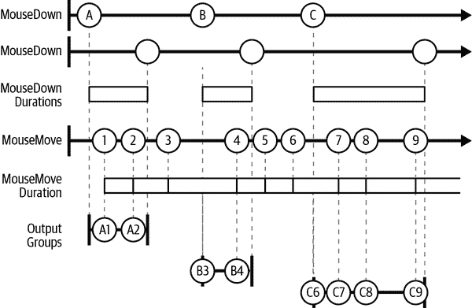

# -   第十一章\. 反应式扩展

[.NET 反应式扩展](https://wiki.example.org/rx)（通常简称为*Rx*）专为处理异步和基于事件的信息源而设计。Rx 提供了帮助您编排和同步代码对这些类型数据反应的服务。我们已经看到如何在 第九章 中定义和订阅事件，但 Rx 提供的远不止这些基本功能。它提供了一个比事件更陡峭的事件源抽象，但却配备了一组强大的操作符，使得组合和管理多个事件流比使用委托和 .NET 事件提供的自由组合更加容易。微软还推出了一个名为 Reaqtor 的相关库，它基于 Rx 的基础提供了一个可靠、有状态、分布式、可扩展、高性能的事件处理服务框架。

Rx 的基本抽象是 `IObservable<T>`，它表示一个项的序列，其操作符定义为此接口的扩展方法。这听起来很像 LINQ to Objects，它们确实有相似之处 —— 不仅 `IObservable<T>` 与 `IEnumerable<T>` 有很多共同之处，而且 Rx 也支持几乎所有标准的 LINQ 操作符。如果您熟悉 LINQ to Objects，那么您在 Rx 中也会感到如鱼得水。区别在于，在 Rx 中，序列不那么被动。与 `IEnumerable<T>` 不同，Rx 源不等待请求其项，消费者也不能要求提供下一个项。相反，Rx 使用一种*推送*模型，在此模型中，源在项可用时通知其接收者。

举例来说，如果您正在编写一个处理实时金融信息（例如股市价格数据）的应用程序，`IObservable<T>` 模型比 `IEnumerable<T>` 更为自然。因为 Rx 实现了标准的 LINQ 操作符，您可以对实时数据源编写查询 —— 您可以通过 `where` 子句筛选事件流，或者按股票代码分组。Rx 不仅限于标准的 LINQ，它还添加了自己的操作符，考虑了实时事件源的时间性质。例如，您可以编写一个查询，仅提供更频繁变动价格的股票数据。

Rx 的推送式方法使其比`IEnumerable<T>`更适合类似事件的源。但为什么不直接使用事件，甚至普通的委托呢？Rx 解决了这些替代方案的四个缺点。首先，它定义了源报告错误的标准方式。其次，在涉及多个源的多线程场景中，它能够以明确定义的顺序传递项。第三，Rx 提供了清晰的方法来信号化没有更多项的时候。第四，因为传统事件是特殊类型的成员，而不是正常的对象，所以对于事件的使用有显著的限制——你不能将.NET 事件作为参数传递给方法，存储在字段中或在属性中提供。你可以使用委托来处理事件，但这并不相同——委托可以处理事件，但不能表示它们的源。没有办法编写一个订阅某个.NET 事件的方法，并将其作为参数传递，因为你不能传递实际的事件本身。Rx 通过将事件源表示为对象而不是类型系统中不像其他任何东西的特殊的独特元素来修复了这一点。

当然，在`IEnumerable<T>`的世界中，我们可以免费获得这四个特性。集合在枚举其内容时可能会抛出异常，但使用回调时，何时何地传递异常就不那么明显了。`IEnumerable<T>`让消费者逐个检索项，所以排序是明确的，但使用普通事件和委托时，并没有强制执行这一点。而`IEnumerable<T>`告诉消费者集合已经结束时，使用简单回调时，并不一定清楚何时发出了最后一次调用。`IObservable<T>`处理了所有这些情况，将我们在`IEnumerable<T>`中可以理所当然的事情带入了事件的世界。

通过提供一个统一的抽象来解决这些问题，Rx 能够将 LINQ 的所有优势带入事件驱动的场景中。如果 Rx 能够替代事件的话，我就不会在第九章中专门提到它们了。事实上，Rx 可以与事件集成。它可以在其自身的抽象和其他几种抽象之间架起桥梁，不仅仅是普通事件，还有`IEnumerable<T>`和各种异步编程模型。远非淘汰事件，Rx 将它们的功能提升到了一个新的水平。理解 Rx 要比理解事件难得多，但一旦理解了，它提供的能力就远超过后者。

Rx 的核心是两个接口。通过这个模型展示项的源实现了`IObservable<T>`。订阅者需要提供一个实现了`IObserver<T>`的对象。这两个接口内置于.NET 中。Rx 的其他部分包含在`System.Reactive` NuGet 包中。

# 基本接口

Rx 中最重要的两种类型是 `IObservable<T>` 和 `IObserver<T>` 接口。它们足够重要，以至于位于 `System` 命名空间中。示例 11-1 显示了它们的定义。

##### 示例 11-1\. `IObservable<T>` 和 `IObserver<T>`

```cs
public interface IObservable<out T>
{
    IDisposable Subscribe(IObserver<T> observer);
}

public interface IObserver<in T>
{
    void OnCompleted();
    void OnError(Exception error);
    void OnNext(T value);
}
```

Rx 中的基本抽象 `IObservable<T>` 由事件源实现。它模拟事件作为项目序列，而不是使用 `event` 关键字。`IObservable<T>` 根据准备好提供项目时为订阅者提供项目。

正如您所看到的，`IObservable<T>` 的类型参数是协变的，这意味着如果您有一个类型 `Base` 是另一个类型 `Derived` 的基类型，那么就像您可以将 `Derived` 传递给任何期望 `Base` 的方法一样，您可以将 `IObservable<Derived>` 传递给任何期望 `IObservable<Base>` 的东西。直观地看，这里使用 `out` 关键字是有道理的，因为像 `IEnumerable<T>` 一样，这是信息的来源——项目从中出来。相反，项目进入订阅者的 `IObserver<T>` 实现，因此它具有 `in` 关键字，表示逆变性——您可以将 `IObserver<Base>` 传递给任何期望 `IObserver<Derived>` 的东西。（我在 第六章 中描述了变体。）

我们可以通过将 `IObserver<T>` 的实现传递给 `Subscribe` 方法来订阅源。当源希望报告事件时，它将调用 `OnNext`，并且可以调用 `OnCompleted` 来指示不再有进一步的活动。如果源希望报告错误，它可以调用 `OnError`。`OnCompleted` 和 `OnError` 都表示流的结束——在此之后，观察者上的任何方法都不应再调用。

###### 警告

如果您违反此规则，不一定会立即收到异常。在某些情况下会收到异常——如果您使用 NuGet 的 `System.Reactive` 库来帮助实现和消费这些接口，则某些情况下它可以检测到此类错误。但通常情况下，调用这些方法的代码负责遵守这个规则。

表示 Rx 活动的视觉约定有一个视觉约定。有时称为 *弹珠图*，因为它主要由看起来有点像弹珠的小圆圈组成。图 11-1 使用这种约定来表示两个事件序列。水平线表示对源的订阅，左侧的竖线表示订阅开始，水平位置表示事件发生的时间（从左到右的经过时间）。圆圈表示对 `OnNext` 的调用（即源报告的事件）。右端的箭头表示订阅在图表表示的时间结束时仍然活动。右侧的竖线表示订阅结束——由于调用 `OnError` 或 `OnCompleted` 或订阅者取消订阅。


###### 图 11-1. 简单的弹珠图

当您在可观察对象上调用 `Subscribe` 时，它会返回一个实现 `IDisposable` 接口的对象，提供取消订阅的方法。如果调用 `Dispose`，可观察对象将不再向您的观察者发送任何通知。这比取消事件的机制更方便；要取消事件，您必须传入与用于订阅的委托相等的委托。如果您使用匿名方法，这可能会让人感到令人惊讶的笨拙，因为通常唯一的方法是保留对原始委托的引用。使用 Rx，对源的任何订阅都表示为 `IDisposable`，使其更容易以统一的方式处理。事实上，通常您根本不需要取消订阅 —— 这只有在希望在源完成之前停止接收通知时才是必需的（这是 .NET 中相对不常见的事情的一个示例：可选的可释放性）。

## IObserver<T>

如您所见，在实践中，我们通常不直接调用源的 `Subscribe` 方法，也不通常需要自己实现 `IObserver<T>`。相反，通常使用 Rx 提供的基于委托的扩展方法，该方法附加了一个 Rx 提供的实现。然而，这些扩展方法不是 Rx 的基本类型的一部分，所以现在我将展示如果这些接口是您唯一拥有的内容，您需要编写什么。示例 11-2 展示了一个简单但完整的观察者。

##### 示例 11-2. 简单的 `IObserver<T>` 实现

```cs
class MySubscriber<T> : IObserver<T>
{
    public void OnNext(T value) => Console.WriteLine("Received: " + value);
    public void OnCompleted() => Console.WriteLine("Complete");
    public void OnError(Exception ex) => Console.WriteLine("Error: " + ex);
}
```

Rx 源（即 `IObservable<T>` 的实现）必须对如何调用观察者方法作出某些保证。调用发生在特定顺序中：对于源提供的每个项目，都会调用 `OnNext` 方法，我已经提到，一旦调用 `OnCompleted` 或 `OnError` 中的任何一个，观察者就知道不会再调用这三种方法中的任何一个。这两种方法中的任何一种信号序列的结束。

另外，不允许调用重叠 —— 当可观察源调用我们观察者的方法之一时，必须等待该方法返回后再调用。多线程可观察源必须小心协调其调用，即使在单线程世界中，递归的可能性也可能需要源检测和防止重入调用。

这让观察者的生活变得简单。因为 Rx 将事件作为一个序列提供，我的代码不需要处理并发调用的可能性。调用方法的正确顺序取决于源。因此，尽管 `IObservable<T>` 界面看起来更简单，只有一个方法，但实际上更难以实现。稍后您会看到，让 Rx 库为您实现这一点通常是最简单的，但了解可观察源如何工作仍然很重要，因此我将从头开始手动实现它。

## IObservable<T>

Rx 区分*热*和*冷*可观察源。热可观察源会在有趣的事情发生时产生每个值，并且如果此时没有订阅者附加，那么该值将丢失。热可观察源通常代表实时事件，例如鼠标输入、按键或传感器报告的数据，因此它们生成的值独立于附加的订阅者数量。热源通常具有类似广播的行为—它们将每个项目发送给所有订阅者。这些可能是更复杂的源的实现方式，因此我将先讨论冷源。

### 实现冷源

热源根据自己的意愿报告项目，而冷可观察源的工作方式有所不同。它们在观察者订阅时开始推送值，并且将值分别提供给每个订阅者，而不是广播。这意味着订阅者不会因为太迟而错过任何内容，因为源在你订阅时开始提供项目。示例 11-3 展示了一个非常简单的冷源。

##### 示例 11-3\. 一个简单的冷可观察源

```cs
public class SimpleColdSource : IObservable<string>
{
    public IDisposable Subscribe(IObserver<string> observer)
    {
        observer.OnNext("Hello,");
        observer.OnNext("World!");
        observer.OnCompleted();
        return NullDisposable.Instance;
    }

    private class NullDisposable : IDisposable
    {
        public readonly static NullDisposable Instance = new();
        public void Dispose() { }
    }
}
```

一旦观察者订阅，这个源将提供两个值，字符串 `"Hello,"` 和 `"World!"`，然后通过调用 `OnCompleted` 表示序列结束。它在 `Subscribe` 中完成所有这些操作，所以这实际上看起来不像是一个订阅—在 `Subscribe` 返回时序列已经结束，所以支持取消订阅没有任何实际意义。这就是为什么这返回一个 `IDisposable` 的微不足道的实现。（我选择了一个极其简单的示例来展示基础知识。真实的源会更复杂。）

要展示这个过程，我们需要创建一个 `SimpleColdSource` 的实例，还需要从 示例 11-2 中创建一个我的观察者类的实例，并使用它订阅源，就像 示例 11-4 所做的那样。

##### 示例 11-4\. 将观察者附加到可观察源

```cs
var source = new SimpleColdSource();
var sub = new MySubscriber<string>();
source.Subscribe(sub);
```

预计，这将产生以下输出：

```cs
Received: Hello,
Received: World!
Complete
```

一般来说，冷观察者将可以访问某些底层信息源，它可以按需推送给订阅者。在 示例 11-3 中，那个“源”只是两个硬编码的值。示例 11-5 展示了一个稍微有趣的冷可观察源，它读取文件中的行并将它们提供给订阅者。

##### 示例 11-5\. 一个表示文件内容的冷可观察源

```cs
public class FilePusher : IObservable<string>
{
    private readonly string _path;
    public FilePusher(string path)
    {
        _path = path;
    }

    public IDisposable Subscribe(IObserver<string> observer)
    {
        using (var sr = new StreamReader(_path))
        {
            while (!sr.EndOfStream)
            {
                string? line = sr.ReadLine();
                if (line is not null)
                {
                    observer.OnNext(line);
                }
            }
        }
        observer.OnCompleted();
        return NullDisposable.Instance;
    }

    private class NullDisposable : IDisposable
    {
        public static NullDisposable Instance = new();
        public void Dispose() { }
    }
}
```

与之前一样，这并不表示事件的实时源，它只有在有订阅发生时才会启动，但比示例 11-3 更加有趣。每当从文件中检索到每一行时，它会调用观察者，因此虽然它开始工作的时间由订阅者确定，但这个源控制它提供值的速率。就像示例 11-3 一样，在`Subscribe`调用内部，它将所有项传递给调用者线程上的观察者，但从示例 11-5 到一个从文件读取数据时运行在单独线程或使用异步技术（例如第十七章中描述的）的概念跨度可能相对较小，从而使`Subscribe`在工作完成之前返回（在这种情况下，您需要编写一个更有趣的`IDisposable`实现来允许调用者取消订阅）。这仍然是一个冷源，因为它代表一些基础数据集，可以从开始为每个订阅者的利益枚举。

示例 11-5 还不完整——它未能处理从文件读取时发生的错误。我们需要捕获这些错误并调用观察者的`OnError`方法。不幸的是，简单地将整个循环放在`try`块中并不那么简单，因为这也会捕获来自观察者的`OnNext`方法的异常。如果`OnNext`抛出异常，我们应该允许它继续向上堆栈传播——我们应该只处理我们代码中预期的位置出现的异常。不幸的是，这使代码变得相当复杂。示例 11-6 将使用`FileStream`的所有代码放在`try`块内，但将允许观察者抛出的任何异常向上传播，因为我们无权处理这些异常。

##### 示例 11-6\. 处理文件系统错误但不处理观察者错误

```cs
public IDisposable Subscribe(IObserver<string> observer)
{
    StreamReader? sr = null;
    string? line = null;
    bool failed = false;

    try
    {
        while (true)
        {
            try
            {
                if (sr == null)
                {
                    sr = new StreamReader(_path);
                }
                if (sr.EndOfStream)
                {
                    break;
                }
                line = sr.ReadLine();
            }
            catch (IOException x)
            {
                observer.OnError(x);
                failed = true;
                break;
            }

            if (line is not null)
            {
                observer.OnNext(line);
            }
            else
            {
                break;
            }
        }
    }
    finally
    {
        if (sr != null)
        {
            sr.Dispose();
        }
    }
    if (!failed)
    {
        observer.OnCompleted();
    }
    return NullDisposable.Instance;
}
```

如果在从文件读取时发生 I/O 异常，则会报告给观察者的`OnError`方法——因此，此源使用`IObserver<T>`的所有三个方法。

### 实现热源

热源在数值可用时通知所有当前订阅者。这意味着任何热 observable 必须跟踪当前已订阅的观察者。在热源中，订阅和通知被分开处理，这种方式通常在冷源中是不会出现的。

示例 11-7 是一个可观察源，每次按键报告一个项目，作为热源，它非常简单。它是单线程的，因此不需要采取任何特殊措施来避免重叠调用。它不报告错误，因此从不需要调用观察者的`OnError`方法。而且它永不停止，因此也不需要调用`OnCompleted`。即便如此，它也相当复杂。（一旦我介绍 Rx 库支持，情况将会简单得多——目前，我只坚持使用两个基本接口，所以这个示例相对复杂。）

##### 示例 11-7\. 用于监控按键的`IObservable<T>`

```cs
public class KeyWatcher : IObservable<char>
{
    private readonly List<Subscription> _subscriptions = new();

    public IDisposable Subscribe(IObserver<char> observer)
    {
        var sub = new Subscription(this, observer);
        _subscriptions.Add(sub);
        return sub;
    }

    public void Run()
    {
        while (true)
        {
            // Passing true here stops the console from showing the character
            char c = Console.ReadKey(true).KeyChar;

            // ToArray duplicates the list, enabling us to iterate over a
            // snapshot of our subscribers. This handles the case where an
            // observer unsubscribes from inside its OnNext method.
            foreach (Subscription sub in _subscriptions.ToArray())
            {
                sub.Observer.OnNext(c);
            }
        }
    }

    private void RemoveSubscription(Subscription sub)
    {
        _subscriptions.Remove(sub);
    }

    private class Subscription : IDisposable
    {
        private KeyWatcher? _parent;
        public Subscription(KeyWatcher parent, IObserver<char> observer)
        {
            _parent = parent;
            Observer = observer;
        }

        public IObserver<char> Observer { get; }

        public void Dispose()
        {
            if (_parent is not null)
            {
                _parent.RemoveSubscription(this);
                _parent = null;
            }
        }
    }
}
```

这定义了一个名为`Subscription`的嵌套类，用于跟踪每个订阅的观察者，并提供了我们的`Subscribe`方法需要返回的`IDisposable`的实现。Observable 在`Subscribe`期间创建此嵌套类的新实例，并将其添加到当前订阅者列表中；如果调用了`Dispose`，则从该列表中移除自身。

作为.NET 的一般规则，在使用完代表您的资源分配的任何`IDisposable`资源时，应调用`Dispose`。但在 Rx 中，通常不会处理表示订阅的对象的释放，因此，如果您实现了这样的对象，则不应指望其被处理。这通常是不必要的，因为 Rx 可以为您清理。与普通的.NET 事件或委托不同，可观察对象可以明确地结束，此时分配给订阅者的任何资源都可以释放。（某些会无限期运行，但在这种情况下，订阅通常会保持活动状态直到程序生命周期结束。）承认，到目前为止我展示的例子并没有自动清理，因为我提供了自己的实现，这些实现足够简单，不需要这样做，但是如果使用 Rx 库的源和订阅者实现，Rx 库会这样做。在 Rx 中，通常只有在您希望在源完成之前取消订阅时，才会处理订阅。

###### 注意

订阅者无需确保通过`Subscribe`返回的`object`仍然可访问。如果您不需要早期取消订阅的能力，则可以忽略它，并且如果垃圾收集器释放了对象，则不会有任何影响，因为 Rx 提供的代表订阅的`IDisposable`实现中没有任何终结器。（虽然通常不会自己实现这些——我在这里只是为了说明它是如何工作的——如果您决定编写自己的实现，请采用相同的方法：不要在代表订阅的类上实现终结器。）

在 示例 11-7 中，`KeyWatcher` 类有一个 `Run` 方法。这不是标准的 Rx 特性；它只是一个循环，坐等键盘输入——这个可观察对象实际上不会产生任何通知，除非有东西调用该方法。每次这个循环接收到一个键时，它会在每个当前订阅的观察者上调用 `OnNext` 方法。请注意，我正在构建订阅者列表的副本（通过调用 `ToArray` —— 这是让 `List<T>` 复制其内容的简单方法），因为有可能订阅者在调用 `OnNext` 过程中选择取消订阅。如果我直接将订阅者列表传递给 `foreach`，在这种情况下会抛出异常，因为列表不允许在迭代过程中添加和删除项目。

###### 警告

这个例子仅防止在同一线程上重新进入调用；处理多线程取消订阅将会更加复杂。事实上，甚至构建一个副本也不够谨慎。我确实应该检查我的快照中的每个观察者在调用其 `OnNext` 之前当前是否仍在订阅，因为有可能一个观察者可能选择取消其他观察者的订阅。这也不尝试处理来自另一个线程的取消订阅。稍后，我将用 Rx 库中更加健壮的实现来替换所有这些。

在使用中，这个热源与我的冷源非常相似。我们需要创建一个 `KeyWatcher` 类的实例，并且还需要另一个观察者类的实例（这次使用 `char` 类型参数，因为这个源产生的是字符而不是字符串）。因为这个源在其监控循环运行之前不会生成项目，所以我需要调用 `Run` 来启动它，就像 示例 11-8 那样。

##### 示例 11-8\. 将观察者附加到可观察对象

```cs
var source = new KeyWatcher();
var sub = new MySubscriber<char>();
source.Subscribe(sub);
source.Run();
```

运行该代码时，应用程序将等待键盘输入，如果您按下，比如说，*m* 键，观察者（示例 11-2）将显示消息 `Received: m`。（由于我的源永不停息，`Run` 方法将永远不会返回。）

您可能需要处理混合的热和冷可观察对象。此外，一些冷源具有某些热特性。例如，您可以想象一个表示警报消息的源，可能有意义的是以这样一种方式实现它，即存储警报，以确保您不会错过在创建源和附加订阅者之间发生的任何事件。因此，它将是一个冷源——任何新的订阅者都会获得到目前为止的所有事件——但是一旦订阅者赶上了，持续的行为看起来更像是一个热源，因为任何新事件都将被广播给所有当前的订阅者。正如您将看到的，Rx 库提供了各种方法来混合和适应这两种类型的源。

虽然了解观察者和可观察对象需要做什么很有用，但如果让 Rx 来处理这些繁重的工作会更高效。现在我将展示如果你使用 `System.Reactive` NuGet 库而不仅仅是两个基本接口，你将如何编写源和订阅者。

# 使用委托发布和订阅

如果你使用 `System.Reactive` NuGet 包，就不需要直接实现 `IObservable<T>` 或 `IObserver<T>`。该库提供了多种实现。其中一些是适配器，用于在 Rx 和其他异步生成序列表示之间桥接。有些是包装现有的可观察流。但这些助手不仅仅用于适配现有内容。它们还可以帮助你编写生成新项或作为最终目标的代码。其中最简单的助手提供了基于委托的 API 来创建和消费可观察流。

## 使用委托创建可观察源

正如你在之前的一些示例中看到的那样，虽然 `IObservable<T>` 是一个简单的接口，但实现它的源可能需要做相当多的工作来跟踪订阅者。而且我们还没有看到全部的故事。正如你将在 “Schedulers” 中看到的那样，源经常需要采取额外的措施来确保它与 Rx 的线程机制良好集成。幸运的是，Rx 库可以为我们完成部分工作。示例 11-9 展示了如何使用 `Observable` 类的静态 `Create` 方法来实现一个冷源。（每次调用 `GetFilePusher` 都会创建一个新的源，因此这实际上是一个工厂方法。）

##### 示例 11-9\. 基于委托的可观察源

```cs
public static IObservable<string> GetFilePusher(string path)
{
    return Observable.Create<string>(observer =>
    {
        using (var sr = new StreamReader(path))
        {
            while (!sr.EndOfStream)
            {
                string? line = sr.ReadLine();
                if (line is not null)
                {
                    observer.OnNext(line);
                }
                else
                {
                    break;
                }
            }
        }
        observer.OnCompleted();
        return () => { };
    });
}
```

这与 例子 11-5 的目的相同——它提供了一个可观察源，逐行向订阅者提供文件中的每一行。（与 例子 11-5 一样，出于清晰起见，我省略了错误处理。在实践中，你需要像 例子 11-6 那样报告错误。）代码的核心部分是相同的，但我只需要编写一个方法而不是整个类，因为现在 Rx 提供了 `IObservable<T>` 的实现。每当观察者订阅该可观察对象时，Rx 就会调用我传递给 `Create` 的回调函数。因此，我所需要做的就是编写提供这些项的代码。除了不需要外部实现 `IObservable<T>` 的类之外，我还能够省略实现 `IDisposable` 的嵌套类——`Create` 方法允许我们返回一个 `Action` 委托而不是对象，并且如果订阅者选择取消订阅，它将调用该委托。因为我的方法在生成项目后才会返回，所以我只是返回了一个空方法。

我写的代码比示例 11-5 少得多，但是除了简化我的实现外，`Observable.Create` 对我们还做了两件稍微微妙的事情，这些事情并不立即从代码中显现出来。

首先，如果订阅者提前取消订阅，这段代码现在会正确停止发送项目给它，尽管我没有编写处理这种情况的代码。当观察者订阅这种类型的源时，Rx 不会直接将 `IObserver<T>` 传递给我们的回调。示例 11-9 中嵌套方法中的 `observer` 参数指的是一个由 Rx 提供的包装器。如果底层观察者取消订阅，该包装器会自动停止转发通知。我的循环会在订阅者停止监听后继续运行文件，这是浪费的，但至少订阅者在要求停止后不再收到项目。 （也许你会想知道，订阅者如何有机会取消订阅，因为我的代码直到完成才返回。它可以在其 `OnNext` 方法中执行此操作。）

你可以结合 C# 的异步语言特性（具体来说，是`async`和`await`关键字）使用 Rx 来实现示例 11-9 的一个版本，这不仅可以更有效地处理取消订阅，还可以异步地从文件中读取数据，意味着订阅不需要阻塞。这显著提升了效率，但代码几乎没有改变。我不会在第十七章介绍异步语言特性，所以这可能现在还不完全明白，但如果你感兴趣，示例 11-10 展示了其实现方式。修改的行已用粗体标出。（再次强调，这是没有错误处理的版本。异步方法可以像同步方法一样处理异常，所以你可以用与示例 11-6 相同的方式处理错误。）

##### 示例 11-10\. 异步源

```cs
public static IObservable<string> GetFilePusher(string path)
{
    `return` `Observable``.``Create``<``string``>``(``async` `(``observer``,` `cancel``)` `=``>`
    {
        using (var sr = new StreamReader(path))
        {
            `while` `(``!``sr``.``EndOfStream` `&``&` `!``cancel``.``IsCancellationRequested``)`
            {
                `string?` `line` `=` `await` `sr``.``ReadLineAsync``(``)``;`
                if (line is not null)
                {
                    observer.OnNext(line);
                }
                else
                {
                    break;
                }
            }
        }
        observer.OnCompleted();
    });
}
```

`Observable.Create` 在幕后为我们做的第二件事，在某些情况下，它将使用 Rx 的调度系统通过工作队列调用我们的代码，而不是直接调用它。这样做可以避免在链式多个 observable 的情况下可能出现的死锁。我将在本章稍后描述调度器。

这种技术适用于冷源，比如示例 11-9。热源的工作方式不同，它将实时事件广播给所有订阅者，`Observable.Create` 不直接支持它们，因为它每个订阅者只调用一次你传递的委托。不过，Rx 库仍然可以提供帮助。

Rx 为任何 `IObservable<T>` 提供了一个 `Publish` 扩展方法，由 `System.Reactive.Linq` 命名空间中的 `Observable` 类定义。该方法旨在包装一个仅支持一次运行的订阅方法的源（即您传递给 `Observa⁠ble​.Create` 的委托），但您希望附加多个订阅者—它为您处理多播逻辑。严格来说，仅支持单个订阅的源是退化的，但只要您将其隐藏在 `Publish` 后面，这并不重要，您可以将其用作实现热源的方法。[Example 11-11](https://example.org/delegate-based_hot_source) 展示了如何创建一个提供与 [Example 11-7](https://example.org/keypress_monitor_iobservable) 中的 `KeyWatcher` 相同功能的源。我还连接了两个订阅者，仅仅是为了说明这支持多个订阅者的点。

##### Example 11-11\. 基于委托的热源

```cs
IObservable<char> singularHotSource = Observable.Create(
    (Func<IObserver<char>, IDisposable>) (obs =>
    {
        while (true)
        {
            obs.OnNext(Console.ReadKey(true).KeyChar);
        }
    }));

IConnectableObservable<char> keySource = singularHotSource.Publish();

keySource.Subscribe(new MySubscriber<char>());
keySource.Subscribe(new MySubscriber<char>());

keySource.Connect();
```

`Publish` 方法不会立即在源上调用 `Subscribe`。当您首次将订阅器附加到返回的源时，也不会立即调用。我必须告诉已发布的源何时启动。请注意，`Publish` 返回一个 `IConnectableObservable<T>`。这从 `IObservable<T>` 派生，并添加了一个额外的方法 `Connect`。这个接口表示一个在被告知之前不会启动的源，设计用于让您在设置其运行之前连接所有需要的订阅器。在由 `Publish` 返回的源上调用 `Connect` 导致它订阅我的原始源，调用我传递给 `Observable.Create` 的订阅回调并运行我的循环。这使得 `Connect` 方法具有与在我的原始 [Example 11-7](https://example.org/keypress_monitor_iobservable) 上调用 `Run` 相同的效果。

`Connect` 返回一个 `IDisposable`。这提供了一种在稍后断开连接的方式—即从底层源取消订阅。（如果您不调用此方法，则由 `Publish` 返回的可连接的可观察对象将保持订阅到您的源，即使您每个单独的下游订阅都 `Dispose`。）在这个特定的例子中，对 `Connect` 的调用将永远不会返回，因为我传递给 `Observable.Create` 的代码也永远不会返回。大多数可观察源不会这样做。通常，它们通过使用异步或基于调度程序的技术来避免这种情况，我将在本章后面展示。

基于委托的 `Observable.Create` 结合 `Publish` 提供的多播功能，使我能够丢弃 [Example 11-7](https://example.org/keypress_monitor_iobservable) 中除了实际生成项的循环之外的所有内容，甚至这个循环也变得更简单了。能够删除大约 80% 的代码并不是全部故事。这将工作得更好—`Publish` 让 Rx 处理我的订阅者，这些订阅者将正确处理在通知期间取消订阅的尴尬情况。

当然，Rx 库不仅有助于实现数据源，还可以简化订阅者。

## 使用委托订阅可观察源

就像你不必实现`IObservable<T>`一样，也不必提供`IObserver<T>`的实现。你并不总是关心这三种方法中的全部——示例 11-7 中的`KeyWatcher`可观察对象甚至从未调用`OnCompleted`或`OnError`方法，因为它运行时间无限，并且没有错误检测。即使你需要提供所有三种方法，你也不一定想要编写一个完全独立的类型来提供它们。因此，Rx 库提供了扩展方法来简化订阅，由`System`命名空间中的`ObservableExtensions`类定义。大多数 C# 源文件包含`using System;`指令，或者在一个隐式全局`using`指令的项目中，对`System`的引用通常都是可用的，因此它提供的扩展方法也通常可用于任何`IObservable<T>`。示例 11-12 使用其中一个。

##### 示例 11-12\. 在不实现`IObserver<T>`的情况下订阅

```cs
var source = new KeyWatcher();
`source``.``Subscribe``(``value` `=``>` `Console``.``WriteLine``(``"Received: "` `+` `value``)``)``;`
source.Run();
```

这个示例与示例 11-8 具有相同的效果。然而，通过使用这种方法，我们不再需要像示例 11-2 那样编写一个完整实现`IObserver<T>`的类。使用这个`Subscribe`扩展方法，Rx 为我们提供了`IObserver<T>`的实现，我们只需为我们想要的通知提供方法。

示例 11-12 使用的`Subscribe`重载接受一个`Action<T>`，其中`T`是`IObservable<T>`的项类型，在本例中为`char`。我的源代码不提供错误通知，也不使用`OnCompleted`来指示项目结束，但许多源会这样做，因此有三个`Subscribe`重载来处理这种情况。其中一个接受一个额外的`Action<Exception>`委托来处理错误。另一个接受一个类型为`Action`（即不带参数的委托）的第二个委托来处理完成通知。第三个重载接受三个委托——与所有项相关的回调相同，然后是一个异常处理程序和一个完成处理程序。

###### 注意

如果在使用基于委托的订阅时没有提供异常处理程序，但源调用 `OnError`，Rx 提供的 `IObserver<T>` 将抛出异常以防止错误被忽略。例子 11-5 在处理 I/O 异常的 `catch` 块中调用 `OnError`，如果使用 例子 11-12 中的技术订阅，你会发现调用 `OnError` 会将 `IOException` 再次抛出——相同的异常连续抛出两次，一次是由 `StreamReader` 抛出，然后再由 Rx 提供的 `IObserver<T>` 实现抛出。由于这时我们已经在 例子 11-5 的 `catch` 块中（而不是 `try` 块），这第二次抛出会导致异常从 `Subscribe` 方法中出现，要么被更高层次处理，要么导致应用程序崩溃。

`Subscribe` 扩展方法还有一个不带参数的重载。这会订阅一个源，然后对接收到的项不做任何处理。（它会将任何错误抛回给源，就像那些不带错误回调的其他重载一样。）如果你有一个源在订阅时执行了一些重要的副作用，这会很有用，尽管最好避免必须这样设计。

# 序列生成器

Rx 定义了几种方法，可以从头开始创建新的序列，而无需自定义类型或回调。这些设计用于某些简单的场景，例如单元素序列、空序列或特定模式。这些都是由 `Observable` 类定义的静态方法。

## 空

`Observable.Empty<T>` 方法类似于 LINQ 到对象中的 `Enumerable.Empty<T>` 方法，我在第十章中展示过它：它生成一个空序列。（当然，不同之处在于它实现了 `IObservable<T>` 而不是 `IEnumera⁠ble​<T>`。）与 LINQ 到对象方法一样，当你需要与要求可观察源的 API 一起工作但没有要提供的项目时，这是非常有用的。

任何订阅 `Observable.Empty<T>` 序列的观察者都会立即调用其 `OnCompleted` 方法。

## 从不

`Observable.Never<T>` 方法生成一个永不执行任何操作的序列——它不生成任何项目，并且不像空序列那样甚至不会完成。（Rx 团队考虑将其称为 `Infinite<T>`，以强调除了永不生成任何内容外，它也永不结束。）在 LINQ to Objects 中没有对应物。如果要编写 `Never` 的 `IEnumerable<T>` 等效版本，它将在首次尝试检索项目时无限期地阻塞。在基于拉取的 LINQ to Objects 世界中，这将毫不有用——它将导致调用线程在进程的生命周期内冻结。（`IAsyncEnumerable<T>` 等效版本将从首次调用 `MoveNextAsync` 开始返回一个永不完成的 `ValueTask<bool>`。这不需要阻塞线程，但你仍然会得到一个永远不会完成的逻辑操作。）但在 Rx 的响应式世界中，源不会因为它们处于当前不生成项目的状态而阻塞进度，因此 `Never` 是一个不那么灾难性的想法。它对我后面将展示的一些运算符可能有所帮助，这些运算符可以使用 `IObservable<T>` 表示持续时间。`Never` 可以表示你希望无限期运行的活动。

## Return

`Observable.Return<T>` 方法接受一个单一参数，并返回一个 observable 序列，立即产生该值，然后完成。就像 `Empty` 在需要序列但没有项目时很有用一样，当需要序列且只有一个项目时，这也很有用。这是一个冷源——你可以订阅任意次数，每个订阅者都会收到相同的值。在 LINQ to Objects 中没有确切的等效物，尽管 Rx 团队提供了一个名为交互扩展（Interactive Extensions for .NET，或简称 Ix，在 `System.Interactive` NuGet 包中可用）的库，其中包括本章描述的此类和其他几个运算符的 `IEnumerable<T>` 版本，这些运算符在 Rx 中有但在 LINQ to Objects 中没有。

## Throw

`Observable.Throw<T>` 方法接受一个 `Exception` 类型的单一参数，并返回一个 observable 序列，立即将该异常传递给任何订阅者的 `OnError`。与 `Return` 类似，这也是一个冷源，可以订阅任意次数，并且每个订阅者都将执行相同的操作。

## Range

`Observable.Range` 方法生成一个数字序列。（它总是返回一个 `IObservable<int>`，这就是为什么它不需要类型参数。）类似于 `Enumerable.Range` 方法，它接受一个起始数字和一个计数。这是一个冷源，每个订阅者都将产生整个范围。

## Repeat

`Observable.Repeat<T>` 方法接受一个输入并产生一个重复产生该输入的序列。输入可以是单个值，但也可以是另一个可观察序列，在这种情况下，它将转发项目直到输入完成，然后重新订阅以重复整个序列。（这意味着只有在传递一个冷可观察序列时，数据才会真正重复。）

如果你没有传递其他参数，生成的序列将无限产生值，唯一停止的方法是取消订阅。你还可以传递一个计数，表示你希望输入重复多少次。

## 生成

`Observable.Generate<TState, TResult>` 方法可以生成比我刚刚描述的其他方法更复杂的序列。你提供给 `Generate` 一个表示生成器初始状态的对象或值。这可以是任何你喜欢的类型——它是方法的泛型类型参数之一。你还必须提供三个函数：一个检查当前状态以决定序列是否已经完成的函数，一个在准备产生下一个项目时推进状态的函数，以及一个确定当前状态下要产生的值的函数。示例 11-13 使用这些函数创建一个源，该源生成随机数，直到所有生成的数字的总和超过 10,000。

##### 示例 11-13\. 生成项目

```cs
IObservable<int> src = Observable.Generate(
    (Current: 0, Total: 0, Random: new Random()),
    state => state.Total <= 10000,
    state =>
    {
        int value = state.Random.Next(1000);
        return (value, state.Total + value, state.Random);
    },
    state => state.Current);
```

这总是作为第一个项目产生`0`，说明 `Generate` 在首次调用用于确定当前值的函数（在示例 11-13 中的最后一个 lambda 表达式）之前，会调用用于迭代状态的函数。

你可以通过使用 `Observable.Create` 和一个循环来实现与这个示例相同的效果。但是，`Generate` 反转了控制流：你的代码不再在循环中告诉 Rx 何时产生下一个项目，而是 Rx 要求你的函数提供下一个项目。这使得 Rx 在调度工作时具有更大的灵活性。例如，它使 `Generate` 能够提供带有定时功能的重载版本。示例 11-14 以类似的方式产生项目，但是通过传递一个额外的函数作为最后一个参数告诉 Rx 延迟每个项目的传递。

##### 示例 11-14\. 生成定时项目

```cs
IObservable<int> src = Observable.Generate(
    (Current: 0, Total: 0, Random: new Random()),
    state => state.Total < 10000,
    state =>
    {
        int value = state.Random.Next(1000);
        return (value, state.Total + value, state.Random);
    },
    state => state.Current,
    state => TimeSpan.FromMilliseconds(state.Random.Next(1000)));
```

为了使这个方法工作，Rx 需要能够安排未来某个时间点发生的工作。我将在“调度器”中解释这是如何工作的。

# LINQ 查询

使用 Rx 的最大好处之一是它有一个 LINQ 实现，使你能够编写查询来处理诸如事件之类的异步项目流。示例 11-15 说明了这一点。它首先生成一个表示来自 UI 元素的 `MouseMove` 事件的可观察源。我将在 “适应” 中更详细地讨论这种技术，但现在知道 Rx 可以将任何 .NET 事件包装为可观察源就足够了。每个事件产生一个项目，其中包含两个属性，这些属性包含通常作为参数传递给事件处理程序的值（即发送者和事件参数）。

##### 示例 11-15\. 使用 LINQ 查询过滤项目

```cs
IObservable<EventPattern<MouseEventArgs>> mouseMoves =
    Observable.FromEventPattern<MouseEventArgs>(
        background, nameof(background.MouseMove));

`IObservable``<``Point``>` `dragPositions` `=`
    `from` `move` `in` `mouseMoves`
    `where` `Mouse``.``Captured` `=``=` `background`
    `select` `move``.``EventArgs``.``GetPosition``(``background``)``;`

dragPositions.Subscribe(point => { line.Points.Add(point); });
```

LINQ 查询中的 `where` 子句过滤事件，以便我们只处理在特定 UI 元素（`background`）捕获鼠标时引发的事件。这个特定示例基于 WPF，但一般来说，希望支持拖动的 Windows 桌面应用程序在鼠标按钮按下时捕获鼠标，并在之后释放它。这确保捕获元素在拖动进行时接收鼠标移动事件，即使鼠标移动到其他 UI 元素上也是如此。通常，当鼠标位于 UI 元素上时，即使它们没有捕获鼠标，它们也会接收鼠标移动事件。因此，我需要在 示例 11-15 中的 `where` 子句中忽略那些事件，只留下在拖动进行时发生的鼠标移动。因此，为了使 示例 11-15 中的代码工作，你需要将事件处理程序附加到相关元素的 `MouseDown` 和 `MouseUp` 事件，就像 示例 11-16 中的那样。

##### 示例 11-16\. 捕获鼠标

```cs
private void OnBackgroundMouseDown(object sender, MouseButtonEventArgs e)
{
    background.CaptureMouse();
}

private void OnBackgroundMouseUp(object sender, MouseButtonEventArgs e)
{
    if (Mouse.Captured == background)
    {
        background.ReleaseMouseCapture();
    }
}
```

在 示例 11-15 中的 `select` 子句在 Rx 中的工作方式与 LINQ to Objects 中的工作方式相同，或者与任何其他 LINQ 提供程序一样。它允许我们从源项目中提取信息以用作输出。在这种情况下，`mouseMoves` 是一个 `EventPattern<MouseEventArgs>` 对象的可观察序列，但我真正想要的是一个鼠标位置的可观察序列。因此，在 示例 11-15 中的 `select` 子句要求相对于特定 UI 元素的位置。

这个查询的要点是，`dragPositions` 指的是一个 `Point` 值的可观察序列，它将报告每次发生鼠标位置变化的情况，而这发生在我的应用程序中某个特定 UI 元素捕获鼠标时。这是一个热源，因为它代表着正在实时发生的事情：鼠标输入。LINQ 的过滤和投影操作符不会改变源的性质，因此如果你将它们应用于一个热源，得到的查询结果也将是热的，如果源是冷的，过滤后的结果也将是冷的。

###### 警告

运算符不会检测源的热度。`Where`和`Select`运算符只是直接传递这个方面。每当你订阅由`Select`运算符生成的最终查询时，它将订阅它的输入。在本例中，输入是由`Where`运算符返回的可观察对象，它将依次订阅由适应鼠标移动事件产生的源。如果你第二次订阅，你将得到第二个订阅链。热事件源将把每个事件广播到这两个链，因此每个项目将通过过滤和投影过程两次。因此，请注意，将多个订阅者附加到热源的复杂查询可能会工作，但可能会带来不必要的开销。如果需要这样做，最好在查询上调用`Publish`，正如你所看到的，它可以对其输入进行单一订阅，然后将每个项目广播给所有订阅者。

示例 11-15 的最后一行订阅了过滤和投影后的源，并将其生成的每个`Point`值添加到另一个名为`line`的 UI 元素的`Points`集合中。这是一个`Polyline`元素，这里没有显示，¹这样做的结果是你可以在应用程序窗口上用鼠标涂鸦。（如果你长时间进行过 Windows 开发，你可能还记得 Scribble 示例，这里的效果大致相同。）

Rx 提供了大部分在第 10 章中描述的标准查询运算符。²这些运算符在 Rx 中的工作方式与其他 LINQ 实现完全相同。然而，有些运算符的工作方式可能乍一看会稍有些令人惊讶，我将在接下来的几节中描述。

## 分组运算符

标准的分组运算符`GroupBy`生成一个序列的序列。在 LINQ to Objects 中，它返回`IEnumerable<IGrouping<TKey, TSource>>`，正如你在第 10 章中看到的，`IGrouping<TKey, TSource>`本身从`IEnumerable<T>`派生而来。`GroupJoin`在概念上类似：虽然它返回一个普通的`IEnumerable<T>`，但`T`是一个投影函数的结果，该函数将序列作为输入。因此，在任一情况下，你得到的都是逻辑上的序列的序列。

在 Rx 的世界中，分组会生成一个可观察序列的可观察序列。这是完全一致的，但可能会有些令人惊讶，因为 Rx 引入了时间方面：表示所有组的可观察源在发现每个新组时生成一个新项目（一个新的可观察源）。示例 11-17 通过监听文件系统中的变化并根据每个发生的文件夹形成组来说明这一点。对于每个组，我们得到一个`IGroupedObservable<TKey, TSource>`，这是`IGrouping<TKey, TSource>`的 Rx 等效物。

##### 示例 11-17\. 事件分组

```cs
string path = Environment.GetFolderPath(Environment.SpecialFolder.MyDocuments);
var w = new FileSystemWatcher(path);
IObservable<EventPattern<FileSystemEventArgs>> changes =
    Observable.FromEventPattern<FileSystemEventHandler, FileSystemEventArgs>(
        h => w.Changed += h, h => w.Changed -= h);
w.IncludeSubdirectories = true;
w.EnableRaisingEvents = true;

IObservable<IGroupedObservable<string, string>> folders =
    from change in changes
    group Path.GetFileName(change.EventArgs.FullPath)
       by Path.GetDirectoryName(change.EventArgs.FullPath);

folders.Subscribe(f =>
{
    Console.WriteLine("New folder ({0})", f.Key);
    f.Subscribe(file =>
        Console.WriteLine("File changed in folder {0}, {1}", f.Key, file));
});
```

订阅到分组源 `folders` 的 lambda 订阅到源产生的每个组。事件可能来自的文件夹数量是无限的，因为在程序运行时可以添加新的文件夹。因此，当它检测到以前未见过的文件夹发生变化时，`folders` observable 将产生一个新的 observable 源，正如 图 11-2 所示。

生产新组并不意味着任何先前的组现在已完成，这与我们通常在 LINQ to Objects 中消费组的方式不同。当你在 `IEnumerable<T>` 上运行分组查询时，它会产生每个组，你可以在移动到下一个组之前完全枚举其内容。但在 Rx 中你做不到这一点，因为每个组被表示为一个 observable，而 observables 直到它们告诉你它们完成之前都不算完成——相反，每个组的订阅保持活动状态。在 示例 11-17 中，一个已经开始的组对应的文件夹可能会在其他文件夹活动时长时间处于休眠状态，直到稍后重新启动。而且更一般地说，Rx 的分组操作符必须准备好处理任何源中发生这种情况的情况。


###### 图 11-2\. 将 `IObservable<T>` 拆分为组

## 连接操作符

Rx 提供了标准的 `Join` 和 `GroupJoin` 操作符。然而，它们与 LINQ to Objects 或大多数数据库 LINQ 提供者处理连接的方式略有不同。在这些世界中，两个输入集的项目通常基于具有一些共同值进行连接。

在数据库中，当连接两个表时，一个非常常见的示例是连接具有相同值的一个表中行的外键列和另一个表中行的主键列。然而，Rx 并不是基于值进行连接。相反，如果它们的持续时间重叠，那么项目会被连接。

不过稍等一下。一个项目的持续时间究竟是什么？Rx 处理瞬时事件；生成一个项目，报告一个错误以及完成一个流，都是发生在特定时刻的事情。因此，连接操作符使用一个约定：对于每个源项目，你可以提供一个返回 `IObservable<T>` 的函数。

该源项目的持续时间从其生成时开始，并在相应的 `IObservable<T>` 第一次响应时结束（即它完成或生成一个项目或错误）。图 11-3 阐明了这个想法。顶部是一个 observable 源，在其下是一系列定义每个项目持续时间的源。底部展示了每个项目 observables 为其源项目建立的持续时间。


###### 图 11-3\. 为每个源项目使用 `IObservable<T>` 定义持续时间

虽然您可以为每个源项目使用不同的 `IObservable<T>`，就像 Figure 11-3 展示的那样，但您并不需要这样做——每次使用相同的源也是有效的。例如，如果您将组操作应用于代表`MouseDown`事件流的`IObservable<T>`，然后再使用另一个代表`MouseUp`事件流的`IObservable<T>`来定义每个项目的持续时间，这将导致 Rx 将每个`MouseDown`事件的“持续时间”视为持续到下一个`MouseUp`事件。图 11-4 描述了这种安排，您可以看到在底部显示的每个`MouseDown`事件的有效持续时间由`MouseDown`和`MouseUp`事件对界定。


###### 图 11-4\. 使用一对事件流定义持续时间

源甚至可以定义自己的持续时间。例如，如果您提供一个表示`MouseDown`事件的可观察源，您可能希望每个项目的持续时间在下一个项目开始时结束。这意味着项目具有连续的持续时间——在第一个项目到达后，总是有一个当前项目，它是最后发生的项目。图 11-5 阐明了这一点。


###### 图 11-5\. 相邻项目持续时间

项目的持续时间可以重叠。如果您愿意，您可以提供一个定义持续时间的`IObservable<T>`，表明输入项目的持续时间在下一个项目开始后一段时间结束。

现在我们知道 Rx 如何决定一个项目的持续时间以进行连接，那么它如何使用这些信息呢？请记住，连接运算符结合了两个输入。（定义持续时间的源不算是输入。它们提供有关其中一个输入的额外信息。）Rx 认为来自两个输入流的项目对是相关的，如果它们的持续时间重叠。它展示相关项目的方式取决于您是使用`Join`还是`GroupJoin`运算符。`Join`运算符的输出是一个包含每对相关项目的流。（您提供一个投影函数，该函数将传递每对项目，并由您决定如何处理它们。这个函数决定连接流的输出项目类型。）Figure 11-6 展示了基于事件`MouseDown`和`MouseMove`的两个输入流（分别由`MouseUp`和`MouseMove`定义持续时间）。这与图示中的源类似于图 11-4 和 11-5，但我添加了字母和数字，以便更容易引用每个流中的每个项目。在图的底部是`Join`运算符将为这两个流产生的可观察对象。


###### 图 11-6\. `Join` 运算符

正如您所看到的，任何两个输入流项目的持续时间重叠的地方，我们都会得到一个结合两个输入的输出项目。如果重叠的项目在不同的时间开始（这通常是情况），则输出项目将在两个输入中后开始的时间产生。`MouseDown`事件`A`在`MouseMove`事件`1`之前开始，因此结果输出`A1`发生在重叠开始时（即`MouseMove`事件`1`发生时）。但事件`3`在事件`B`之前发生，因此连接的输出`B3`发生在`B`开始时。

事件`5`的持续时间不与任何`MouseDown`项的持续时间重叠，因此在输出流中看不到任何该项。相反，`MouseMove`事件可能会出现在多个输出项目中（就像每个`MouseDown`事件一样）。如果没有`3`事件，事件`2`的持续时间会从`A`内部开始，并在`B`内部完成，因此除了图 11-6 中显示的`A2`外，还会在`B`开始时出现`B2`事件。

Example 11-18 显示了执行图 11-6 中所示的连接的代码，使用查询表达式。正如您在第 10 章中看到的，编译器会将查询表达式转换为一系列方法调用，而 Example 11-19 显示了与 Example 11-18 中查询的基于方法的等效形式。

##### Example 11-18\. 使用连接进行查询表达式

```cs
IObservable<EventPattern<MouseEventArgs>> downs =
    Observable.FromEventPattern<MouseEventArgs>(
        background, nameof(background.MouseDown));
IObservable<EventPattern<MouseEventArgs>> ups =
    Observable.FromEventPattern<MouseEventArgs>(
        background, nameof(background.MouseUp));
IObservable<EventPattern<MouseEventArgs>> allMoves =
    Observable.FromEventPattern<MouseEventArgs>(
        background, nameof(background.MouseMove));

IObservable<Point> dragPositions =
    from down in downs
    join move in allMoves
      on ups equals allMoves
    select move.EventArgs.GetPosition(background);
```

##### Example 11-19\. 加入代码

```cs
IObservable<Point> dragPositions = downs.Join(
    allMoves,
    down => ups,
    move => allMoves,
    (down, move) => move.EventArgs.GetPosition(background));
```

我们可以使用任何这些示例生成的`dragPositions`可观察源来替换 Example 11-15 中的源。我们不再需要基于`background`元素是否捕获鼠标来进行过滤，因为现在 Rx 仅为我们提供了持续时间与鼠标按下事件重叠的移动事件。发生在鼠标按下之间的任何移动都将被忽略，或者如果它们是最后一次在鼠标按下之前发生的移动，则在鼠标按钮按下的瞬间我们将接收到该位置。

`GroupJoin`以类似的方式组合项目，但不是生成单个可观察输出，而是生成一个可观察的可观察对象。对于当前的示例，这意味着其输出会为每个`MouseDown`输入生成一个新的可观察源。这将包含包含该输入的所有配对，并且它的持续时间与该输入相同。图 11-7 显示了此运算符与与图 11-6 相同的输入事件的运行情况。我在输出序列的端点放置了竖线，以澄清它们何时调用其观察者的`OnComplete`方法。这些可观察对象的起始和结束与相应输入的持续时间完全对齐，因此它们产生其最终输出项目和完成时间之间通常存在显著差异。



###### 图 11-7\. `GroupJoin`运算符

一般来说，使用 LINQ，`GroupJoin`运算符能够产生空组，因此与`Join`运算符不同，即使第二个流中没有相应的项目，每个来自第一个输入的项目也会产生一个输出。Rx 的`GroupJoin`也是这样工作的，增加了时间方面的考虑。每个输出组从相应的输入事件发生时开始（在本例中为`MouseDown`），并在该事件被认为已经结束时结束（这里是下一个`MouseUp`）；如果在此期间没有移动，该可观察对象将不会生成任何项目。因为这里的移动事件持续连续，这只能在接收到第一个移动之前发生。但在第二个输入项目具有不连续持续时间的连接中，空组更有可能发生。

在允许用户用鼠标在窗口中涂鸦的示例应用程序背景下，这种分组输出非常有用，因为它将每个单独的拖动呈现为一个独立的对象。这意味着我可以为每次拖动创建一条新线，而不是将点添加到越来越长的同一线上。使用示例 11-15 中的代码，每次新的拖动操作将从上一个拖动结束的地方到新位置画一条线，这样就无法绘制出分离的形状。但是分组输出使得分离变得容易。示例 11-20 订阅分组输出，并为每个新组（代表一个新的拖动操作）创建一个新的`Polyline`来渲染涂鸦，然后订阅组中的项目以填充该单独的线条。

##### 示例 11-20\. 为每次拖动操作添加新线

```cs
var dragPointSets = from mouseDown in downs
                    join move in allMoves
                      on ups equals allMoves into m
                    select m.Select(e => e.EventArgs.GetPosition(background));

dragPointSets.Subscribe(dragPoints =>
{
    var currentLine = new Polyline { Stroke = Brushes.Black, StrokeThickness = 2 };
    background.Children.Add(currentLine);

    dragPoints.Subscribe(point =>
    {
        currentLine.Points.Add(point);
    });
});
```

仅需明确，所有这些即使在连接运算符下也可以实时运行 - 这些都是热源。在示例 11-20 中由`GroupJoin`返回的`IObservable<IObservable<Point>>`会在按下鼠标按钮时立即产生一个新组。该组中的`IObservable<Point>`将会为每个`MouseMove`事件立即产生一个新的`Point`。总之，当用户拖动鼠标时，用户会立即看到直线出现并增长。

## `SelectMany`运算符

正如你在第十章中所看到的，`SelectMany` 操作符有效地将集合的集合展平为单个集合。当查询表达式具有多个`from`子句时，将使用此操作符，在 LINQ to Objects 中，其操作类似于嵌套的`foreach`循环。在 Rx 中，它仍然具有这种展平效果 - 它允许你获取一个可观察的源，其中每个生成的项目也是一个可观察的源（或者可以用来生成一个），`SelectMany` 操作符的结果将是一个包含所有子源中所有项目的单个可观察序列。然而，与分组一样，在 LINQ to Objects 中，情况可能不那么有序。Rx 的推送驱动特性，以及其潜在的异步操作，使得所有涉及的可观察源都有可能同时推送新项目，包括用作嵌套源的原始源。（该操作符仍然确保一次只传递一个事件 - 当调用`OnNext`时，它会等待返回后再进行下一个调用。混乱的可能性仅限于事件传递的顺序混乱。）

当使用 LINQ to Objects 遍历嵌套数组时，一切都按照直观的顺序进行。它会检索第一个嵌套数组，然后遍历该数组中的所有元素，然后转到下一个嵌套数组，并遍历该数组，依此类推。但是，这种有序的展平仅因为使用`IEnumerable<T>`时，项目的消费者可以控制何时检索哪些项目。使用 Rx 时，订阅者在源提供项目时接收它们。

尽管有这种自由度，行为还是足够直接的：由`SelectMany`产生的输出流只是在源提供它们时提供项目。

## 聚合和其他单值操作符

几个标准的 LINQ 操作符将整个值序列减少为单个值。这些包括聚合操作符，如`Min`，`Sum`和`Aggregate`；量词符`Any`和`All`；以及`Count`操作符。它还包括选择性操作符，如`ElementAt`。这些在 Rx 中也是可用的，但与大多数 LINQ 实现不同，Rx 实现不会返回普通的单个值。它们都返回一个`IObservable<T>`，就像产生序列输出的操作符一样。

###### 注意

`First`、`Last`、`FirstOrDefault`、`LastOrDefault`、`Single` 和 `SingleOrDefault` 操作符应该都是以相同的方式工作，但出于历史原因，它们并非如此。在 Rx 的 v1 中引入，它们返回的单个值并不包装在`IObserva⁠ble​<T>`中，这意味着它们会阻塞直到源提供所需的内容。这与推送模型不太匹配，并且可能导致死锁，因此这些操作符现在已被弃用，并且有了新的异步版本，工作方式与 Rx 中的其他单值操作符相同。所有这些操作符的新版本只需在原始操作符名称后附加`Async`即可（例如`FirstAsync`、`LastAsync`等）。

这些操作符每个仍然产生单个值，但它们都将该值呈现为可观察源。原因是与 LINQ to Objects 不同，Rx 不能枚举其输入以计算聚合值或查找所选值。源控制着流程，因此这些操作符的 Rx 版本必须等待源提供其值——就像所有操作符一样，单值操作符必须是被动反应的，而不是主动的。诸如`Average`这样需要看到每个值的操作符，在源表示已完成之前，不能生成其结果。即使像`FirstAsync`或`ElementAt`这样不需要等待输入的末尾的操作符，也要等到源决定提供操作符正在等待的值之前才能执行任何操作。一旦单值操作符能够提供值，它就会这样做，然后完成。

`ToArray`、`ToList`、`ToDictionary` 和 `ToLookup` 操作符的工作方式类似。虽然它们都生成源的全部内容，但作为单个输出对象，被包装为单项可观察源。

如果你真的想等待任何这些项的值，可以使用`Wait`操作符，这是 Rx 中的一个非标准操作符，适用于任何`IObserva⁠ble​<T>`。这个阻塞操作符等待源完成，然后返回最终元素，因此弃用的`First`、`Last`等操作符的“等待”行为仍然可用；只是不再是默认行为了。或者，你可以使用 C# 的异步语言特性——将`await`关键字用于可观察源。从逻辑上讲，它与`Wait`做的事情是一样的，但它是通过高效的非阻塞异步等待实现的，这种等待方式在 第十七章 中有描述。

## Concat 操作符

Rx 的 `Concat` 操作符与其他 LINQ 实现共享相同的概念：它将两个输入序列组合起来，生成一个序列，该序列首先生成其第一个输入的每个项，然后生成其第二个输入的每个项。 （事实上，Rx 比一些 LINQ 提供程序更进一步，可以接受一组输入，并将它们全部连接起来。）只有在第一个流最终完成时，这才有用 — 当然，在 LINQ to Objects 中也是如此，但在 Rx 中无限源更为常见。此外，请注意，此操作符在第一个流完成之前不会订阅第二个流。这是因为冷流通常在订阅时开始生成项，并且 `Concat` 操作符不希望在等待第一个流完成时缓冲第二个源的项。这意味着在与热源一起使用时，`Concat` 可能会产生非确定性结果。（如果你想要一个包含来自两个热源的所有项的可观察源，请使用 `Merge`，我马上会描述。）

Rx 并不仅仅满足于提供标准的 LINQ 操作符。它定义了更多自己的操作符。

# Rx 查询操作符

Rx 的主要目标之一是简化与多个潜在独立的异步产生项的可观察源的工作。Rx 的设计者有时候会提到“编排和同步”，意思是你的系统可能同时进行许多事情，但你需要确保应用程序对事件的反应是某种程度上协调一致的。Rx 的许多操作符都是基于这个目标设计的。

###### 注意

并非本节的所有内容都是由 Rx 的独特要求驱动的。Rx 的一些非标准操作符（例如 `Scan`）在其他 LINQ 提供程序中也是非常合理的。并且这些操作的许多版本在 .NET 的交互扩展（Ix）中也有提供，可以在 `System.Interactive` NuGet 包中找到，正如前面提到的。

Rx 拥有如此丰富的操作符库，以至于要对它们全都公正地介绍将会使本章的长度大致增加四倍，而本章已经偏长了。由于这不是一本关于 Rx 的书籍，并且因为一些操作符非常专业化，我只会挑选一些最有用的来介绍。我建议浏览 Rx 的文档或者 [源代码](https://github.com/dotnet/reactive) 来探索它所提供的完整和非常全面的操作符集合。

## 合并

`Merge` 操作符将两个或多个可观察序列中的所有元素合并为一个单一的可观察序列。我可以使用它来解决在示例 11-15、11-18 和 11-20 中出现的问题。这些示例都处理鼠标输入，如果你在 Windows UI 编程中做了很多工作，你会知道并不一定会得到与按下和释放鼠标按钮对应的鼠标移动通知。这些按钮事件的通知包含鼠标位置信息，因此 Windows 没有必要发送单独的鼠标移动消息来提供这些位置，因为这只会将相同的信息发送两次。这是完全合理的，但也相当恼人。³ 在这些示例中，起始和结束位置不在表示鼠标位置的可观察源中。我可以通过合并所有三个事件的位置来解决这个问题。示例 11-21 展示了如何修复 示例 11-15。

##### 示例 11-21\. 合并可观察对象

```cs
IObservable<EventPattern<MouseEventArgs>> downs =
    Observable.FromEventPattern<MouseEventArgs>(
        background, nameof(background.MouseDown));
IObservable<EventPattern<MouseEventArgs>> ups =
    Observable.FromEventPattern<MouseEventArgs>(
        background, nameof(background.MouseUp));
IObservable<EventPattern<MouseEventArgs>> allMoves =
    Observable.FromEventPattern<MouseEventArgs>(
        background, nameof(background.MouseMove));

IObservable<EventPattern<MouseEventArgs>> dragMoves =
    from move in allMoves
    where Mouse.Captured == background
    select move;

`IObservable``<``EventPattern``<``MouseEventArgs``>``>` `allDragPositionEvents` `=`
    `Observable``.``Merge``(``downs``,` `ups``,` `dragMoves``)``;`

IObservable<Point> dragPositions =
    from move in allDragPositionEvents
    select move.EventArgs.GetPosition(background);
```

我已经创建了三个可观察对象来表示三个相关事件：`MouseDown`、`MouseUp` 和 `MouseMove`。因为这三个事件都需要共享同一个投影（`select` 子句），但只有一个需要过滤事件，所以我稍微重构了一下。只有鼠标移动需要过滤，所以我为此编写了单独的查询。然后我使用了 `Observable.Merge` 方法将所有三个事件流合并为一个。

###### 注意

`Merge` 既可以作为扩展方法使用，也可以作为非扩展的 `static` 方法使用。如果你在单个可观察对象上使用可用的扩展方法，那么唯一可用的 `Merge` 重载是将其与单个其他源合并（可选指定调度程序）。在这种情况下，我有三个源，所以我使用了非扩展方法形式。然而，如果你有一个表达式，它是一个可观察源的可枚举或一个可观察源的可观察源，你会发现这些情况下也有 `Merge` 扩展方法。因此，我本可以写成 `new[] { downs, ups, dragMoves }.Merge()`。

我的 `allDragPositionEvents` 变量指的是一个单一的可观察流，将报告我所需的所有鼠标移动。最后，我通过投影运行这些数据，以提取每个项目的鼠标位置。同样，结果是一个热流。与之前一样，只要 `background` 元素捕获了鼠标，它就会在鼠标移动时生成一个位置，但同时也会在 `MouseDown` 或 `MouseUp` 事件发生时生成一个位置。我可以使用与 示例 11-15 最后一行显示的相同调用订阅此事件，这次我不会错过起始和结束位置。

在我刚刚展示的例子中，所有源都是无限的，但并非总是如此。当其中一个输入停止时，合并的可观察应该怎么做？如果其中一个因错误而停止，该错误将通过合并的可观察传递，此时它将变为完成状态—在报告错误后，可观察的对象不允许继续生成项。然而，虽然输入可以单方面地通过错误终止输出，但如果输入正常完成，直到所有输入都完成，合并的可观察才会完成。

## 窗口操作符

Rx 定义了两个操作符，`Buffer` 和 `Window`，它们都生成一个可观察的输出，其中每个项基于源中的多个相邻项。（顺便说一句，`Window` 的名称与 UI 无关。）Figure 11-8 展示了使用 `Buffer` 操作符的三种方式。我已经标记了代表输入项的圆圈，并在其下方展示了代表由 `Buffer` 产生的可观察源的项的形状和数字，其中线条和数字表示与每个输出项相关联的输入项。很快你会看到，`Window` 的工作方式非常相似。


###### 图 11-8\. 使用`Buffer`操作符的滑动窗口

在第一个案例中，我传递了 `(2, 2)` 的参数，表明我希望每个输出项对应于两个输入项，并且我希望在每第二个输入项上启动一个新的缓冲区。这听起来像是用两种不同的方式说同一件事情，直到你看到 Figure 11-8 中的第二个例子，在这个例子中，`(3, 2)` 的参数表明每个输出项对应于输入的三个项，但我仍然希望在每第二个输入上开始缓冲。这意味着每个*窗口*—用于构建输出项的输入项集合—与其邻居重叠。当第二个参数，*跳过*，小于窗口大小时，这种情况将发生。第一个输出项的窗口包含第一个、第二和第三个输入。第二个输出项的窗口包含第三、第四和第五个，因此第三个项出现在两者中。

图中的最后一个示例显示了窗口大小为三，但这次我要求跳过一个大小为一的间隔—因此，在这种情况下，窗口每次只移动一个输入项，但每次都包含源中的三个项。我也可以指定一个大于窗口的跳过大小，在这种情况下，落在窗口之间的输入项将被简单地忽略。

`Buffer` 和 `Window` 操作符往往会引入一定的延迟。在第二和第三种情况下，窗口大小为三意味着输入可观测对象需要生成其第三个值，然后才能为输出项提供整个窗口。对于 `Buffer` 来说，这总是意味着窗口大小的延迟，但正如你将看到的那样，使用 `Window` 操作符时，每个窗口在完全填充之前就可以开始处理。

###### 注意

`Buffer` 还提供了一个重载，接受一个数字，其效果与两次传递相同数字相同。 （例如，而不是 `Buffer(2, 2)`，你可以简单地写成 `Buffer(2)`。）这在逻辑上等同于 LINQ to Objects 的 `Chunk` 操作符。正如 第十章 中讨论的那样，Rx 没有使用相同的名称的主要原因是，Rx 在大约十年前发明了 `Buffer`，而 LINQ to Objects 添加了 `Chunk`。

`Buffer` 和 `Window` 操作符之间的区别在于它们呈现窗口化项的方式。`Buffer` 是最直接的。它提供一个 `IObservable<IList<T>>`，其中 `T` 是输入项的类型。换句话说，如果你订阅 `Buffer` 的输出，对于每个生成的窗口，订阅者将收到一个包含窗口中所有项的列表。 示例 11-22 使用此方法生成了来自 示例 11-15 的鼠标位置的平滑版本。

##### 示例 11-22\. 使用 `Buffer` 对输入进行平滑处理

```cs
IObservable<Point> smoothed = from points in dragPositions.Buffer(5, 2)
                              let x = points.Average(p => p.X)
                              let y = points.Average(p => p.Y)
                              select new Point(x, y);
```

此查询的第一行指定我要查看五个连续鼠标位置的组，并且我希望每隔一个输入生成一个组。查询的其余部分计算窗口内的平均鼠标位置，并将其作为输出项。图 11-9 显示了效果。顶部线条是使用原始鼠标位置的结果。紧接着它下面的线条使用了相同输入产生的 示例 11-22 中的平滑点。正如你所看到的，顶部线条有些崎岖不平，而底部线条则平滑了许多突起。


###### 图 11-9\. 平滑效果展示

示例 11-22 使用了 LINQ to Objects 和 Rx 的混合实现。查询表达式本身使用了 Rx，但是范围变量 `points` 的类型是 `IList<Point>`（因为在这个示例中 `Buffer` 返回一个 `IObservable<IList<Point>>`）。因此，对 `points` 调用 `Average` 操作符的嵌套查询将得到 LINQ to Objects 的实现。

如果`Buffer`运算符的输入是热的，则它将产生一个热可观测对象作为结果。因此，您可以订阅[示例 11-22](https://example.org/smoothing_input_with_buffer)中`smoothed`变量中的可观测对象，类似于[示例 11-15](https://example.org/filtering_items_with_a_linq_query)的最后一行代码，它将在您拖动鼠标时实时显示平滑的线条。正如讨论的那样，当然会有一些延迟 —— 代码指定了跳过两个项目，因此它仅对每两次鼠标事件更新一次屏幕。对最后五个点进行平均处理也会增加鼠标指针与线条末端之间的差距。在这些参数下，差异很小，不会太分散注意力，但如果使用更激进的平滑处理，可能会变得令人不快。

`Window`运算符与`Buffer`运算符非常相似，但不同之处在于它不将每个窗口呈现为`IList<T>`，而是提供一个`IObservable<T>`。如果您在[示例 11-22](https://example.org/smoothing_input_with_buffer)中对`dragPositions`使用`Window`，结果将是`IObservable<IObservable<Point>>`。[图 11-10](https://example.org/window_operator)展示了`Window`运算符在[图 11-8](https://example.org/sliding_windows_with_the_buffer_operator)中的最后一种情景中的工作方式，正如您所见，它可以更早地开始每个窗口。它不必等到窗口中的所有项目都可用才开始；它提供的每个输出项目都是一个`IObservable<T>`，该对象将根据项目的可用性逐个产生窗口的项目。`Window`生成的每个可观测对象在提供最后一个项目后立即完成（即与`Buffer`提供整个窗口的时刻相同）。因此，如果您的处理依赖于整个窗口的可用性，`Window`无法更快地将其提供给您，因为它最终受到输入项到达速率的限制，但它将更早地开始提供值。

`Window`在这个例子中生成的可观测对象的一个潜在令人惊讶的特征是它们的起始时间。尽管它们在生成最后一个项目后立即结束，但它们在生成第一个项目之前并不立即开始。代表第一个窗口的可观测对象立即开始 —— 一旦您订阅运算符返回的可观测对象的可观测对象，您将立即收到该可观测对象。因此，第一个窗口将立即可用，即使`Window`运算符的输入尚未执行任何操作。然后，每个新窗口在接收到需要跳过的所有输入项后立即开始。在这个例子中，我使用的是一个跳过计数为一，因此第二个窗口在输入产生一个项目后开始，第三个在产生两个项目后开始，依此类推。

正如您稍后在本节中将看到的，以及在“定时操作”中也看到的，`Window`和`Buffer`支持一些其他定义窗口何时开始和停止的方式。一般模式是，一旦`Window`操作符到达一个点，源中的新项将进入新窗口，操作符就创建该窗口，预期窗口的第一个项，而不是等待它（见图 11-10）。


###### 图 11-10\. `Window`操作符

###### 注意

如果输入完成，所有当前打开的窗口也会完成。这意味着可能会看到空窗口。（事实上，如果跳过大小为一，如果源完成，你保证会得到一个空窗口。）在图 11-10 中，底部的一个窗口已经开始但尚未产生任何项。如果输入在不再产生任何项的情况下完成，仍在进行中的三个可观测源也会完成，包括那个尚未产生任何内容的最后一个。

因为`Window`操作符会在源提供项时立即将项投放到窗口中，这可能会使您能够更早地开始处理，比使用`Buffer`更能提高整体响应性。`Window`的缺点是它往往更复杂——您的订阅者将在相应的输入窗口的所有项都可用之前开始接收输出值。而`Buffer`提供您一个列表，您可以随时检查，而使用`Window`，您将需要继续在 Rx 的序列世界中工作，只有当它们准备好时才会产生项。要执行与示例 11-22 相同的平滑操作，使用`Window`需要在示例 11-23 中的代码。

##### 示例 11-23\. 使用`Window`进行平滑操作

```cs
IObservable<Point> smoothed =
    from points in dragPositions.Window(5, 2)
    from totals in points.Aggregate(
      new { X = 0.0, Y = 0.0, Count = 0 },
      (acc, point) => new
          { X = acc.X + point.X, Y = acc.Y + point.Y, Count = acc.Count + 1 })
    where totals.Count > 0
    select new Point(totals.X / totals.Count, totals.Y / totals.Count);
```

这有点复杂，因为我无法使用`Average`操作符，由于需要应对空窗口的可能性。（严格来说，在我有一个不断变长的`Polyline`的情况下，这并不重要。但是，如果我像示例 11-20 那样按拖动操作分组点，每个单独的可观测点源将在拖动结束时完成，迫使我处理任何空窗口。）如果你向`Average`操作符提供一个空序列，它会产生错误，所以我改用了`Aggregate`操作符，它让我添加一个`where`子句来过滤掉空窗口而不是崩溃。但这不是更复杂的唯一方面。

正如我之前提到的，Rx 的所有聚合操作符——`Aggregate`、`Min`、`Max` 等——与大多数 LINQ 提供程序的操作方式不同。LINQ 要求这些操作符将流减少为单个值，因此它们通常返回单个值。例如，如果我使用示例 11-23 中显示的参数调用 LINQ to Objects 版本的 `Aggregate`，它将返回我用作累加器的匿名类型的单个值。但在 Rx 中，返回类型是 `IObservable<T>`（在这种情况下 `T` 是累加器类型）。它仍然生成单个值，但通过可观测源呈现该值。与 LINQ to Objects 不同，它可以枚举其输入以计算平均值，Rx 操作符必须等待源提供其值，因此它不能在源说它已完成之前产生这些值的聚合。

因为 `Aggregate` 操作符返回一个 `IObservable<T>`，我不得不使用第二个 `from` 子句。这将源传递给 `SelectMany` 操作符，该操作符提取所有值并使它们出现在最终流中——在本例中，每个窗口只有一个值，因此 `SelectMany` 实际上是从其单一项流中展开平均点。

示例 11-23 中的代码比 示例 11-22 复杂一些，我认为理解其工作原理要困难得多。更糟糕的是，它甚至没有提供任何好处。`Aggregate` 操作符在可用输入时就开始工作，但代码在看到窗口中的每个点之前无法生成最终结果——平均值。如果我必须等到窗口结束才能更新 UI，那么我可能还是坚持使用 `Buffer`。因此，在这种特殊情况下，`Window` 是为了没有好处而做了更多的工作。然而，如果在窗口中处理的项目不那么琐碎，或者涉及的数据量非常大，以至于不希望在开始处理整个窗口之前缓冲整个窗口，那么额外的复杂性可能值得，因为可以开始聚合过程而无需等待整个输入窗口可用。

### 使用可观测对象划分窗口

`Window` 和 `Buffer` 操作符提供了一些定义窗口何时开始和结束的其他方式。就像连接操作符可以用可观测对象指定持续时间一样，你可以提供一个返回每个窗口定义持续时间的函数。示例 11-24 使用此方法将键盘输入分解为单词。本示例中的 `keySource` 变量来自 示例 11-11。它是一个生成每次按键的可观测序列。

##### 示例 11-24\. 使用窗口将文本分解为单词

```cs
IObservable<IObservable<char>> wordWindows = keySource.Window(
    () => keySource.FirstAsync(char.IsWhiteSpace));

IObservable<string> words = from wordWindow in wordWindows
                            from chars in wordWindow.ToArray()
                            select new string(chars).Trim();

words.Subscribe(word => Console.WriteLine("Word: " + word));
```

`Window`运算符将立即在此示例中创建一个新窗口，并且还将调用我提供的 lambda 来确定窗口的结束时间。它会保持窗口处于打开状态，直到我提供的可观察源的 lambda 返回一个值或完成。当发生这种情况时，`Window`会立即打开下一个窗口，并再次调用我的 lambda 以获取另一个可观察对象来确定第二个窗口的长度，依此类推。此处的 lambda 会从键盘产生下一个空格字符，因此窗口将在下一个空格处关闭。换句话说，这将输入序列分割成一系列窗口，其中每个窗口包含零个或多个非空格字符，后跟一个空格字符。

`Window`运算符返回的可观察序列将每个窗口呈现为`IObservable<char>`。Example 11-24 中的第二个语句是一个查询，将每个窗口转换为一个字符串。（如果输入包含多个相邻的空格字符，这将产生空字符串。这与`string`类型的`Split`方法的行为一致，该方法执行了与此分区相对应的拉取导向的操作。如果你不喜欢这种行为，你可以通过`where`子句来过滤掉空白字符。）

由于 Example 11-24 使用了`Window`，它将会在用户键入每个单词时立即使字符可用。但由于我的查询在窗口上调用了`ToArray`，它将等待窗口完成之后才会产生任何内容。这意味着如果使用`Buffer`同样有效，而且更简单。正如 Example 11-25 所示，如果使用`Buffer`，我不需要第二个`from`子句来收集完成的窗口，因为它仅在窗口完成后提供窗口。

##### Example 11-25\. 使用`Buffer`进行单词拆分

```cs
IObservable<IList<char>> wordWindows = keySource.Buffer(
    () => keySource.FirstAsync(char.IsWhiteSpace));

IObservable<string> words = from wordWindow in wordWindows
                            select new string(wordWindow.ToArray()).Trim();
```

## Scan 运算符

`Scan`运算符与标准的`Aggregate`运算符非常相似，只有一个区别。它不会在源完成后产生单个结果，而是产生一个序列，其中依次包含每个累加器的值。为了说明这一点，我将首先介绍一个记录类型，它将作为一个非常简单的股票交易模型。这种类型在 Example 11-26 中显示，并定义了一个静态方法，用于提供测试目的的随机生成交易流。

##### Example 11-26\. 使用测试流进行简单股票交易

```cs
public record Trade(string StockName, decimal UnitPrice, int Number)
{
    public static IObservable<Trade> TestStream()
    {
        return Observable.Create<Trade>(obs =>
        {
            string[] names = { "MSFT", "GOOGL", "AAPL" };
            var r = new Random(0);
            for (int i = 0; i < 100; ++i)
            {
                var t = new Trade(
                    StockName: names[r.Next(names.Length)],
                    UnitPrice: r.Next(1, 100),
                    Number: r.Next(10, 1000));
                obs.OnNext(t);
            }
            obs.OnCompleted();
            return Disposable.Empty;
        });
    }
}
```

Example 11-27 展示了使用普通`Aggregate`运算符计算所有交易股票的总数，方法是将每个交易的`Number`属性相加。（当然，你通常会直接使用`Sum`运算符，但为了与`Scan`进行比较，我这里展示了这种方法。）

##### Example 11-27\. 使用`Aggregate`进行求和

```cs
IObservable<Trade> trades = Trade.TestStream();

IObservable<long> tradeVolume = trades.Aggregate(
    0L, (total, trade) => total + trade.Number);
tradeVolume.Subscribe(Console.WriteLine);
```

这将显示一个单一的数字，因为由 `Aggregate` 生成的可观测对象只提供一个单一的值。示例 11-28 几乎完全展示了相同的代码，但是使用了 `Scan` 替代。

##### 示例 11-28\. 使用 `Scan` 运行总和

```cs
IObservable<Trade> trades = Trade.TestStream();

IObservable<long> tradeVolume = trades.Scan(
    0L, (total, trade) => total + trade.Number);
tradeVolume.Subscribe(Console.WriteLine);
```

这不是产生单一输出值，而是为每个输入产生一个输出项目，这是源迄今为止所有项目的累计总和。如果你需要在无限流中实现类似聚合的行为（例如基于事件源），`Scan` 就特别有用。在这种情况下，`Aggregate` 无法使用，因为如果其输入永远不完成，它将不会产生任何内容。

## Amb 操作符

Rx 定义了一个名为 `Amb` 的操作符，其名称有些神秘。（请参见下一个侧边栏，“Why Amb?”）它接受任意数量的可观测序列，并等待看哪一个先执行操作。（文档讨论了输入中哪一个“首先反应”。这意味着它调用了任意三个 `IObserver<T>` 方法中的任何一个。）首先行动的输入有效成为 `Amb` 操作符的输出——它立即取消订阅其他流并转发所选择流的所有内容。（如果任何其他流在第一个流之后但操作符尚未取消订阅之前产生元素，这些元素将被忽略。）

使用这个操作符可以通过向服务器池中的多台机器发送请求并使用最先响应的结果来优化系统的响应时间。（当然，这种技术存在一些风险，其中最大的风险之一是可能会显著增加系统的总负载，导致整体速度变慢，而不是加快任何事情的速度。然而，在某些场景中，谨慎应用这种技术可以取得成功。）

## DistinctUntilChanged

我要在本节中描述的最后一个操作符非常简单但相当有用。`DistinctUntilChanged` 操作符删除相邻的重复项。假设你有一个可观测源，它定期产生项目，但往往连续多次产生相同的值。你可能只在出现不同值时需要采取行动。`DistinctUntilChanged` 正好适用于这种场景——当其输入产生一个项目时，只有在与上一个项目不同（或者是第一个项目）时才会传递该项目。

我还没有展示我想介绍的所有 Rx 操作符。然而，剩下的那些我将在“Timed Operations”中讨论，它们都是时间敏感的。在我展示它们之前，我需要描述 Rx 如何处理时间。

# 调度器

Rx 通过 *调度器* 执行特定的工作。调度器是提供三项服务的对象。首先是决定何时执行特定的工作。例如，当观察者订阅冷源时，应立即将源的项目传递给订阅者，还是应该推迟该工作？第二项服务是在特定上下文中运行工作。例如，调度器可能决定始终在特定线程上执行工作。第三项工作是跟踪时间。某些 Rx 操作是时间相关的；为了确保可预测的行为并启用测试，调度器为时间提供了虚拟化模型，因此 Rx 代码不必依赖 .NET 的 `DateTimeOffset` 类报告的当前时间。

调度器的前两个角色有时是相互依赖的。例如，Rx 为 UI 应用程序提供了几个调度器。Windows Store 应用程序有一个 `CoreDispatcherScheduler`，WPF 应用程序有一个 `DispatcherScheduler`，Windows Forms 程序有一个 `Control​Sched⁠uler`，还有一个更通用的称为 `SynchronizationContextScheduler`，它将在所有 .NET UI 框架中工作，尽管对比特定于框架的调度器，它的细节控制稍逊一筹。所有这些调度器都有一个共同的特点：它们确保工作在适合访问 UI 对象的上下文中执行，通常意味着在特定线程上运行工作。如果调度工作的代码运行在其他线程上，则调度程序可能别无选择，只能推迟工作，因为它无法在 UI 框架准备好之前运行工作。这可能意味着等待特定线程完成其正在执行的任务。在这种情况下，正确上下文中运行工作也必然会影响工作的执行时间。

尽管如此，并非总是如此。Rx 提供了两个使用当前线程的调度器。其中一个是 `ImmediateScheduler`，非常简单：它在调度时立即运行工作。当您给这个调度器一些工作时，它不会返回，直到工作完成为止。另一个是 `CurrentThreadScheduler`，它维护一个工作队列，这使它在排序上具有一定的灵活性。例如，如果在执行某个其他工作的中间调度了一些工作，它可以允许正在进行的工作项完成后再开始下一个。如果没有排队或正在进行的工作项，`CurrentThreadScheduler` 就像 `Immediate​Sched⁠uler` 一样立即运行工作。当它调用完成一个工作项时，`Current​Th⁠read​Sched⁠uler` 检查队列，并在队列不为空时调用下一个工作项。因此，它试图尽快完成所有工作项，但与 `ImmediateScheduler` 不同的是，它不会在前一个工作项完成之前开始处理新的工作项。

## 指定调度器

Rx 操作通常不经过调度程序。许多可观察源直接调用其订阅者的方法。通常可以生成大量项目的源是一个例外。例如，用于创建序列的 `Range` 和 `Repeat` 方法使用调度程序来控制它们向新订阅者提供项目的速率。您可以传递显式调度程序或让它们选择默认调度程序。即使使用不接受调度程序作为参数的源，您也可以显式地涉及调度程序。

### `ObserveOn`

指定调度程序的常见方式是使用 `System.Reactive.Linq` 命名空间中各种静态类定义的 `ObserveOn` 扩展方法。⁴ 即使事件可能来自其他地方，这在想要在特定上下文（如 UI 线程）处理事件时非常有用。

您可以在任何 `IObservable<T>` 上调用 `ObserveOn`，传递一个 `IScheduler`，它会返回另一个 `IObservable<T>`。如果订阅返回的可观察对象，则您的观察者的 `OnNext`、`OnCompleted` 和 `OnError` 方法将通过您指定的调度程序调用。 Example 11-29 使用此功能确保在项目处理程序回调中更新 UI 是安全的。

##### 示例 11-29\. `ObserveOn` 特定调度程序

```cs
IObservable<Trade> trades = GetTradeStream();
IObservable<Trade> tradesInUiContext =
    `trades``.``ObserveOn``(``DispatcherScheduler``.``Current``)``;`
tradesInUiContext.Subscribe(t =>
{
    tradeInfoTextBox.AppendText(
        $"{t.StockName}: {t.Number} at {t.UnitPrice}\r\n");
});
```

在此示例中，我使用了 `DispatcherScheduler` 类的静态 `Current` 属性，该属性返回通过当前线程的 `Dispatcher` 执行工作的调度程序。 （`Dispatcher` 是在 WPF 应用程序中管理 UI 消息循环的类。） Rx 的 `DispatcherObservable` 类定义了各种提供 WPF 特定重载的扩展方法，而不是传递调度程序，我可以调用 `ObserveOn` 只传递一个 `Dispatcher` 对象。我可以在代码中使用此方法，例如在 Example 11-30 中。

##### 示例 11-30\. `ObserveOn` WPF `Dispatcher`

```cs
IObservable<Trade> tradesInUiContext = trades.ObserveOn(this.Dispatcher);
```

这种重载的优点在于，在调用 `ObserveOn` 的时候我不需要处于 UI 线程上。在 Example 11-29 中使用的 `Current` 属性只有在您所需的调度程序的线程上时才有效。如果我已经在该线程上，可以更简单地设置它。我可以使用 `ObserveOnDispatcher` 扩展方法，该方法获取当前线程的调度程序的 `DispatcherScheduler`，如 Example 11-31 所示。

##### 示例 11-31\. 在当前调度程序上观察

```cs
IObservable<Trade> tradesInUiContext = trades.ObserveOnDispatcher();
```

### `SubscribeOn`

大多数各种`ObserveOn`扩展方法都有相应的`SubscribeOn`方法。（还有`SubscribeOnDispatcher`，它是`ObserveOnDispatcher`的对应物。）`SubscribeOn`不是为了通过调度程序安排每次对观察者方法的调用，而是通过调度程序执行源可观察对象的`Subscribe`方法的调用。如果通过调用`Dispose`取消订阅，那也会通过调度程序传递。对于冷源来说，这可能很重要，因为很多在其`Subscribe`方法中执行重要工作，有些甚至会立即传递所有项目。

###### 注意

一般来说，订阅源的上下文与生成的项目将传递给订阅者的上下文之间没有任何对应关系的保证。某些源会在其订阅上下文中通知您，但很多则不会。如果您需要在特定上下文中接收通知，那么除非源提供某种方式来指定调度程序，否则使用`ObserveOn`。

### 明确传递调度程序

一些操作接受调度程序作为参数。您通常会在可以生成多个项目的操作中找到这些调度程序。生成数字序列的`Observable.Range`方法可以选择在最后一个参数中接受一个调度程序，以控制生成这些数字的上下文。这也适用于适应其他源（例如`IEnumerable<T>`）到可观察源的 API，如“适配”中所述。

另一个通常可以提供调度程序的场景是使用合并输入的可观察对象。前面提到过，`Merge`操作符可以合并多个序列的输出。您可以提供一个调度程序来告诉操作符从特定上下文订阅源。

最后，所有定时操作都依赖于调度程序。我将在“定时操作”中展示其中一些。

## 内置调度程序

我已经描述了四个面向 UI 的调度程序，`DispatcherScheduler`（用于 WPF）、`CoreDispatcherScheduler`（用于 Windows Store 应用）、`ControlScheduler`（用于 Windows Forms）和`SynchronizationContextScheduler`，以及两个在当前线程上运行工作的调度程序，`CurrentThreadScheduler`和`ImmediateScheduler`。但还有一些其他值得注意的调度程序。

`EventLoopScheduler`在特定线程上运行所有工作项。它可以为您创建一个新线程，或者您可以为其提供一个回调方法，在需要您创建线程时它会调用该方法。您可以在 UI 应用程序中使用它来处理传入数据。它允许您将工作从 UI 线程移出，以保持应用程序的响应性，但确保所有处理都在单个线程上进行，这可以简化并发问题。

`NewThreadScheduler` 为每个顶级工作项创建一个新线程。（如果该工作项生成更多工作项，则这些工作项将在同一线程上运行，而不是创建新线程。）只有在每个项需要大量工作时才适用，因为在 Windows 中线程的启动和关闭成本相对较高。如果需要并发处理工作项，通常最好使用线程池。

`TaskPoolScheduler` 使用任务并行库（TPL）的线程池。TPL 在第十六章中描述，提供了一个高效的线程池，可以重用单个线程来处理多个工作项，从而分摊了创建线程的启动成本。

`ThreadPoolScheduler` 使用 CLR 的线程池来运行工作。这在概念上类似于 TPL 线程池，但技术上稍显陈旧。（TPL 是在.NET 4.0 中引入的，但 CLR 线程池自 v1.0 起就存在。）在某些场景下效率较低。Rx 引入了这个调度器，因为早期的 Rx 版本支持没有 TPL 的旧版.NET。出于向后兼容的原因保留了它。

`HistoricalScheduler` 在你需要测试依赖于时间的代码，但又不想实时执行测试时非常有用。所有调度器都提供时间服务，但`HistoricalScheduler`让你可以决定调度器以多快的速度模拟时间流逝。因此，如果你需要测试等待 30 秒后会发生什么，你可以告诉`HistoricalScheduler`模拟 30 秒已过去，而无需真正等待。

# Subjects

Rx 定义了各种*subjects*，这些类实现了`IObserver<T>`和`IObservable<T>`接口。如果需要 Rx 提供这些接口的强大实现，但通常的`Observable.Create`或`Subscribe`方法不方便时，这些类有时会很有用。例如，也许你需要提供一个可观察的源，而你的代码中有几个不同的地方需要为该源提供值来生成。这很难适配到`Create`方法的订阅回调模型中，使用 subject 会更容易处理。某些 subject 类型提供额外的行为，但我将从最简单的`Subject<T>`开始。

## Subject&lt;T&gt;

`Subject<T>` 类的 `IObserver<T>` 实现只是通过其 `IObservable<T>` 接口转发给所有已订阅的观察者。因此，如果你订阅了一个或多个 `Subject<T>`，然后调用 `OnNext`，该主题将调用其所有订阅者的 `OnNext` 方法。其他方法 `OnCompleted` 和 `OnError` 也是如此。这种多播转发与我在 示例 11-11 中使用的 `Publish` 操作符⁵ 提供的功能非常相似，因此这为我从 `KeyWatcher` 源中移除所有跟踪订阅者代码提供了另一种选择，结果如 示例 11-32 中所示。这比 示例 11-7 中的原始方法简单得多，尽管不像 示例 11-11 中的基于委托的版本那样简单。

##### 示例 11-32\. 使用 `Subject<T>` 实现 `IObservable<T>`

```cs
public class KeyWatcher : IObservable<char>
{
    private readonly Subject<char> _subject = new();

    public IDisposable Subscribe(IObserver<char> observer)
    {
        return _subject.Subscribe(observer);
    }

    public void Run()
    {
        while (true)
        {
            _subject.OnNext(Console.ReadKey(true).KeyChar);
        }
    }
}
```

在其 `Subscribe` 方法中，它转发到了一个 `Subject<char>`，所以试图订阅这个 `KeyWatcher` 的一切最终都会订阅到该主题。然后，我的循环只需调用主题的 `OnNext` 方法，它会负责将其广播给所有订阅者。

实际上，我可以通过将可观察对象公开为单独的属性来进一步简化事情，而不是使整个类型都成为可观察的，正如 示例 11-33 所示。这不仅使代码稍微简单了些，而且意味着我的 `KeyWatcher` 现在可以提供多个源。

##### 示例 11-33\. 提供一个 `IObservable<T>` 作为属性

```cs
public class KeyWatcher
{
    private readonly Subject<char> _subject = new();

    public IObservable<char> Keys => _subject;

    public void Run()
    {
        while (true)
        {
            _subject.OnNext(Console.ReadKey(true).KeyChar);
        }
    }
}
```

这仍然不像我在 示例 11-11 中使用的 `Observable.Create` 和 `Publish` 操作符的组合那样简单，但它确实提供了两个优点。首先，现在更容易看到生成键盘按键通知的循环何时运行。在 示例 11-11 中我控制了这个过程，但对于不太熟悉 `Publish` 工作原理的人来说，这可能并不明显。我觉得 示例 11-33 较少神秘。其次，如果我愿意，我可以从 `KeyWatcher` 类的任何地方使用这个主题，而在 示例 11-11 中，我只能在由 `Observable.Create` 调用的回调函数内部提供一个项。在这个例子中，我并不需要这种灵活性，但在需要时，`Subject<T>` 很可能比回调方法更好。

## BehaviorSubject<T>

`BehaviorSubject<T>` 看起来几乎和 `Subject<T>` 一模一样，除了一点：当任何观察者第一次订阅时，只要你还没有通过调用 `OnComplete` 完成主题，它就保证会立即接收一个值。（如果你已经完成了主题，它将立即在任何进一步的订阅者上调用 `OnComplete`。）它会记住它传递的最后一项，并将其提供给新的订阅者。当你构造一个 `BehaviorSubject<T>` 时，你必须提供一个初始值，它将提供给新的订阅者，直到第一次调用 `OnNext`。

有一种方法可以将此主题视为 Rx 版本的变量。它是一种具有可以随时检索的值的东西，其值也可以随时间改变。但是由于是响应式的，你必须订阅它才能检索其值，并且在你取消订阅之前，观察者将被通知任何进一步的更改。

此主题具有热和冷特性的混合。它将立即向任何订阅者提供一个值，使其看起来像一个冷源，但一旦发生这种情况，它会像热源一样向所有订阅者广播新值。还有另一个主题具有类似的混合特性，但更进一步地采用了冷侧。

## `ReplaySubject<T>`

`ReplaySubject<T>` 可以记录它从任何你订阅的源接收到的每个值。（或者，如果你直接调用其方法，它会记住你通过 `OnNext` 提供的每个值。）对此主题的每个新订阅者将接收到 `ReplaySubject<T>` 到目前为止所看到的每个项目。因此，这更像是一个普通的冷主题——与从 `BehaviorSubject<T>` 获取最近值不同，你会得到一个完整的项目集。然而，一旦 `ReplaySubject<T>` 向特定的订阅者提供了所有已记录的项目，对于该订阅者，它会转变为更像热主题的行为，因为它将继续提供新接收到的项目。

因此，长期以来，对 `ReplaySubject<T>` 的每个订阅者默认情况下都会看到它从其源接收到的每个项目，无论该订阅者是何时订阅的主题。

在其默认配置中，`ReplaySubject<T>` 将消耗越来越多的内存，只要它订阅到一个源。无法告诉它不会再有新的订阅者，并且现在可以丢弃已经分发给所有现有订阅者的旧项。因此，你不应该无限期地将其订阅到一个无限源。但是，你可以限制 `ReplaySubject<T>` 缓冲的数量。它提供了各种构造函数重载，其中一些让你可以指定回放的项目数量的上限或者持续保留项目的时间的上限。显然，如果你这样做，新的订阅者将无法依赖于获取到以前接收到的所有项目。

## `AsyncSubject<T>`

`AsyncSubject<T>`只会记住其来源的一个值，但与`BehaviorSubject<T>`不同，后者记住最近的值，`AsyncSubject<T>`会等待其来源完成。然后，它将产生最终项作为其输出。如果来源在不提供任何值的情况下完成，`AsyncSubject<T>`将立即完成所有新的订阅者。

如果在其来源完成之前订阅了`AsyncSubject<T>`，则`AsyncSubject<T>`不会对观察者执行任何操作。但一旦来源完成，`AsyncSubject<T>`将作为冷源，提供单个值，除非来源在不提供值的情况下完成，否则此主题将立即完成所有新的订阅者。

# 适应

尽管 Rx 很有趣且强大，但如果它存在于真空中，则几乎没有用处。如果您正在处理异步通知，可能会有 API 提供它们，但不支持 Rx。虽然`IObservable<T>`和`IObserver<T>`已经存在很长时间（自 2010 年发布的.NET 4.0 以来），但并非每个支持这些接口的 API 都能够支持。此外，由于 Rx 的基本抽象是一系列项目，因此很可能在某个时候需要在 Rx 的推送式`IObservable<T>`和拉取式等效的`IEnumerable<T>`和`IAsyncEnumerable<T>`之间进行转换。Rx 提供了将这些和其他类型的来源适应为`IObservable<T>`的方法，并且在某些情况下，可以在两者之间进行适应。

## IEnumerable<T>和 IAsyncEnumerable<T>

任何`IEnumerable<T>`都可以轻松地进入 Rx 的世界，这要归功于`ToObservable`扩展方法。这些方法由`System.Reactive.Linq`命名空间中的`Observable`静态类定义。示例 11-34 展示了最简单的形式，不带任何参数。

##### 示例 11-34\. 将`IEnumerable<T>`转换为`IObservable<T>`

```cs
public static void ShowAll(IEnumerable<string> source)
{
    `IObservable``<``string``>` `observableSource` `=` `source``.``ToObservable``(``)``;`
    observableSource.Subscribe(Console.WriteLine);
}
```

`ToObservable`方法本身不会枚举其输入——它只返回一个实现`IObservable<T>`的包装器。此包装器是一个冷源，每当您向其订阅观察者时，它才会迭代输入，将每个项目传递给观察者的`OnNext`方法，并在最后调用`OnCompleted`。如果源引发异常，此适配器将调用`OnError`。示例 11-35 展示了如果不需要使用调度程序，`ToObservable`可能的工作方式。

##### 示例 11-35\. 没有调度程序支持时`ToObservable`的实现

```cs
public static IObservable<T> MyToObservable<T>(this IEnumerable<T> input)
{
    return Observable.Create((IObserver<T> observer) =>
        {
            bool inObserver = false;
            try
            {
                foreach (T item in input)
                {
                    inObserver = true;
                    observer.OnNext(item);
                    inObserver = false;
                }
                inObserver = true;
                observer.OnCompleted();
            }
            catch (Exception x)
            {
                if (inObserver)
                {
                    throw;
                }
                observer.OnError(x);
            }
            return () => { };
        });
}
```

这并不是它真正的工作方式，因为示例 11-35 无法使用调度程序。（完整的实现将会更难阅读，从而违背了示例的目的，即显示`ToObservable`背后的基本思想。）真实的方法使用调度程序来管理迭代过程，如果需要，允许异步订阅。它还支持在观察者的订阅被提前取消时停止工作。有一个以`IScheduler`类型的单一参数作为重载，允许您告诉它使用特定的调度程序；如果您不提供一个，它将使用`CurrentThreadScheduler`。

当需要进行相反方向的操作时，即当您有一个`IObservable<T>`但希望将其视为`IEnumerable<T>`时，您可以调用由`Observable`类提供的`ToEnumerable`扩展方法。示例 11-36 将`IObservable<string>`封装为`IEnumerable<string>`，以便可以使用普通的`foreach`循环迭代源中的项。

##### 示例 11-36\. 将`IObservable<T>`用作`IEnumerable<T>`

```cs
public static void ShowAll(IObservable<string> source)
{
    foreach (string s in source.ToEnumerable())
    {
        Console.WriteLine(s);
    }
}
```

包装器代表您订阅了源。如果源提供的项比您迭代它们的速度更快，包装器将把这些项存储在队列中，以便您可以随时检索它们。如果源提供的项不如您检索它们的速度快，包装器将等待直到有可用的项。

接口`IAsyncEnumerable<T>`提供了与`IEnumerable<T>`相同的模型，但通过使用第十七章中讨论的技术，以一种能够进行有效异步操作的方式实现。Rx 提供了`ToObservable`扩展方法，以及`IObservable<T>`的`ToAsyncEnumerable`方法扩展方法。这两者都来自`AsyncEnumerable`类，如果要使用它们，您将需要引用一个名为`System.Linq.Async`的单独 NuGet 包。

## .NET 事件

Rx 可以使用`Observable`类的静态`FromEventPattern`方法将.NET 事件包装为`IObservable<T>`。此前在示例 11-17 中，我使用了`FileSystemWatcher`，这是`System.IO`命名空间中的一个类，在特定文件夹中添加、删除、重命名或以其他方式修改文件时触发各种事件。示例 11-37 复制了该示例的第一部分，这是上次我略过的部分。此代码使用`Observable.FromEventPattern`静态方法生成一个表示监视器`Created`事件的可观察源。（如果要处理静态事件，您可以将`Type`对象作为第一个参数传递。第十三章描述了`Type`类。）

##### 示例 11-37\. 将事件包装为`IObservable<T>`

```cs
string path = Environment.GetFolderPath(Environment.SpecialFolder.MyPictures);
var watcher = new FileSystemWatcher(path);
watcher.EnableRaisingEvents = true;

IObservable<EventPattern<FileSystemEventArgs>> changes =
    Observable.FromEventPattern<FileSystemEventArgs>(
        watcher, nameof(watcher.Created));
changes.Subscribe(evt => Console.WriteLine(evt.EventArgs.FullPath));
```

表面上看，这似乎比在 第九章 中显示的正常订阅事件要复杂得多，而且没有明显的优势。在这种特定示例中，使用传统方法会更好。但是，使用 Rx 的一个好处是，如果您正在编写 UI 应用程序，您可以使用适当的调度程序与 `ObserveOn` 一起确保您的处理程序始终在正确的线程上调用，无论哪个线程引发事件。当然，另一个好处 —— 通常的原因 —— 是您可以使用 Rx 的任何查询操作符来处理事件。（这就是为什么原始的 Example 11-17 这样做的原因。）

`Example 11-37` 产生的可观察源的元素类型是 `Event​Pat⁠tern<FileSystemEventArgs>`。泛型 `EventPattern<T>` 是 Rx 特别为表示事件触发而定义的类型，其中事件的委托类型符合 第九章 中描述的标准模式（即接受两个参数，第一个是 `object` 类型，表示引发事件的对象，第二个是从 `EventArgs` 派生的某种类型，包含有关事件的信息）。`EventPattern<T>` 有两个属性，`Sender` 和 `EventArgs`，对应于事件处理程序将接收的两个参数。实际上，这是一个表示通常会对事件处理程序进行方法调用的对象。

Example 11-37 的一个令人惊讶的特性是，`FromEvent​Pat⁠tern` 的第二个参数是一个包含事件名称的字符串。Rx 在运行时将其解析为真实的事件成员。这在某些方面不太理想，原因有几个。首先，这意味着如果您输入错误的名称，编译器不会注意到（尽管使用 `nameof` 操作符可以缓解这个问题）。其次，这意味着编译器无法帮助您确定类型 —— 如果直接使用 lambda 表达式处理 .NET 事件，编译器可以从事件定义推断参数类型，但在这里，因为我们将事件名称作为字符串传递，编译器不知道我使用的是哪个事件（甚至不知道我是否使用了事件），因此我必须明确地为方法指定泛型类型参数。而且，如果我搞错了，编译器不会察觉 —— 这将在运行时检查。

这种基于字符串的方法源于事件的缺陷：您不能将事件作为参数传递。事实上，事件是非常有限的成员。您不能从定义它的类外部对事件执行任何操作，除了添加或移除处理程序。这是 Rx 在事件方面改进的一种方式——一旦进入 Rx 的世界，事件源和订阅者都表示为对象（分别实现 `IObservable<T>` 和 `IObserver<T>`），使得将它们作为参数传递到方法中变得简单。但这并不帮助我们处理尚未进入 Rx 的事件的情况。

Rx 确实提供了一个重载，不需要使用字符串——您可以传递用于 Rx 添加和移除处理程序的委托，如 示例 11-38 所示。

##### 示例 11-38\. 基于委托的事件包装

```cs
IObservable<EventPattern<FileSystemEventArgs>> changes =
    Observable.FromEventPattern<FileSystemEventHandler, FileSystemEventArgs>(
    h => watcher.Created += h, h => watcher.Created -= h);
```

这相对冗长一些，因为它需要一个泛型类型参数来指定处理程序委托类型以及事件参数类型。基于字符串的版本在运行时自行发现处理程序类型，但因为使用 示例 11-38 的一般原因是为了获得编译时类型检查，编译器需要知道你使用的是哪些类型，而该示例中的 Lambda 表达式并没有为编译器提供足够的信息来自动推断所有类型参数。

除了将事件作为可观察源进行包装之外，还可以反过来进行。Rx 定义了一个名为 `ToEventPattern<T>` 的 `IObservable<EventPattern<T>>` 操作符。（请注意，这不适用于任何旧的可观察源——它必须是 `EventPattern<T>` 的可观察序列。）如果调用此方法，它将返回一个实现了 `IEventPatternSource<T>` 接口的对象。它定义了一个名为 `OnNext` 的单一事件，类型为 `EventHandler<T>`，允许您以普通的 .NET 方式将事件处理程序连接到可观察源。

## 异步 API

.NET 支持各种异步模式，在第十六章和第十七章中会详细描述。最早在 .NET 中引入的是异步编程模型（APM）。然而，这种模式并不直接被新的 C# 异步语言特性支持，所以现在大多数 .NET API 使用 TPL，对于旧的 API，TPL 提供了适配器，可以为基于 APM 的 API 提供基于任务的包装器。Rx 可以将任何 TPL 任务表示为可观察源。

所有.NET 异步模式的基本模型是，你启动一些工作，最终会完成，可选地生成一个结果。因此，将其翻译成 Rx 可能看起来有些奇怪，因为 Rx 的基本抽象是一个项目序列，而不是单个结果。事实上，理解 Rx 和 TPL 之间的区别的一种有用方法是，`IObservable<T>`类似于`IEnumerable<T>`，而`Task<T>`类似于类型为`T`的属性。与使用`IEnumerable<T>`和属性时，调用者决定何时从源获取信息不同，使用`IObservable<T>`和`Task<T>`时，源在准备好时提供信息。决定何时提供信息的选择与信息是单个还是项目序列是分开的。因此，将单个异步 API 映射到`IObservable<T>`似乎有些不匹配。但是我们在非异步世界中也可以跨越类似的界限——正如你在第十章中看到的，LINQ 定义了各种标准运算符，用于从序列生成单个项目，如`First`或`Last`。Rx 支持这些运算符，但它还支持另一种方式：将单个异步源带入类似流的世界。其结果是一个`IObservable<T>`源，只产生一个项目（或者如果操作失败，则报告错误）。在非异步世界中的类比可以是将单个值包装在数组中，以便您可以将其传递给需要`IEnumerable<T>`的 API。

示例 11-39 使用此功能生成一个`IObservable<string>`，它将生成包含从特定 URL 下载的文本的单个值，或在下载失败时报告故障。

##### 示例 11-39\. 将`Task<T>`包装为`IObservable<T>`

```cs
public static IObservable<string> GetWebPageAsObservable(
    Uri pageUrl, IHttpClientFactory cf)
{
    HttpClient web = cf.CreateClient();
    Task<string> getPageTask = web.GetStringAsync(pageUrl);
    `return` `getPageTask``.``ToObservable``(``)``;`
}
```

在这个示例中使用的`ToObservable`方法是 Rx 为`Task`定义的扩展方法。为了使其可用，你需要确保`System.Reactive.Threading.Tasks`命名空间在作用域内。

示例 11-39 的一个潜在的不满意特性是，它只会尝试下载一次，无论多少观察者订阅源。根据您的需求，这可能没问题，但在某些情况下，每次尝试下载新副本可能更合理。如果您需要这样做，更好的方法是使用`Observable.FromAsync`方法，因为您可以将一个 lambda 传递给它，每当新的观察者订阅时它都会调用这个 lambda。您的 lambda 返回一个任务，然后将其作为可观察源进行包装。示例 11-40 使用这种方法为每个订阅者启动一个新的下载。

##### 示例 11-40\. 为每个订阅者创建一个新任务

```cs
public static IObservable<string> GetWebPageAsObservable(
    Uri pageUrl, IHttpClientFactory cf)
{
    return Observable.FromAsync(() =>
        {
            HttpClient web = cf.CreateClient();
            return web.GetStringAsync(pageUrl);
        });
}
```

如果你有多个订阅者，这可能不是最佳选择。另一方面，当没有任何尝试订阅时，这更有效率。示例 11-39 立即开始异步工作，甚至不等待任何订阅者。这可能是一件好事——如果流肯定会有订阅者，那么在等待第一个订阅者之前开始缓慢的工作将减少整体延迟。然而，如果你正在编写一个库中呈现多个可观察源的类，可能最好推迟工作直到第一次订阅。

# 定时操作

由于 Rx 可以处理实时信息流，你可能需要以时间敏感的方式处理项目。例如，项目到达的速率可能很重要，或者你可能希望根据提供的时间对项目进行分组。在最后的这一节中，我将描述 Rx 提供的一些基于时间的操作符。

## 间隔

`Observable.Interval` 方法返回一个序列，该序列定期以 `TimeSpan` 类型的参数指定的间隔产生值。示例 11-41 创建并订阅了一个每秒产生一个值的源。

##### 示例 11-41\. 使用 `Interval` 进行定期项目处理

```cs
IObservable<long> src = Observable.Interval(TimeSpan.FromSeconds(1));
src.Subscribe(i => Console.WriteLine($"Event {i} at {DateTime.Now:T}"));
```

`Interval` 产生的项目的类型是 `long`。它生成值为零、一、二等。

`Interval` 独立处理每个订阅者（即它是一个冷源）。为了演示这一点，在 示例 11-41 的代码之后添加 示例 11-42 中的代码，稍等一会儿，然后创建第二个订阅。

##### 示例 11-42\. 对 `Interval` 源的第二个订阅者

```cs
Thread.Sleep(2500);
src.Subscribe(i => Console.WriteLine(
    $"Event {i} at {DateTime.Now:T} (2nd subscriber)"));
```

第二个订阅者在第一个订阅者之后订阅了两秒半，所以这将产生以下输出：

```cs
Event 0 at 09:46:58
Event 1 at 09:46:59
Event 2 at 09:47:00
Event 0 at 09:47:00 (2nd subscriber)
Event 3 at 09:47:01
Event 1 at 09:47:01 (2nd subscriber)
Event 4 at 09:47:02
Event 2 at 09:47:02 (2nd subscriber)
Event 5 at 09:47:03
Event 3 at 09:47:03 (2nd subscriber)
```

你可以看到第二个订阅者的值从零开始，这是因为它有自己的序列。如果你希望这些定时项目的单个集合供多个订阅者使用，可以使用前面描述的 `Publish` 操作符。

你可以将 `Interval` 源与组连接一起作为一种根据到达时间分割项目的方法。（这不是唯一的方法——`Buffer` 和 `Window` 有多种重载可以做同样的事情。）示例 11-43 将定时器与代表用户输入的可观察序列结合起来。（第二个序列在 `words` 变量中，来自 示例 11-25。）

##### 示例 11-43\. 计算每分钟的字数

```cs
IObservable<long> ticks = Observable.Interval(TimeSpan.FromSeconds(6));
IObservable<int> wordGroupCounts = from tick in ticks
                                   join word in words
                                     on ticks equals words into wordsInTick
                                   from count in wordsInTick.Count()
                                   select count * 10;

wordGroupCounts.Subscribe(c => Console.WriteLine($"Words per minute: {c}"));
```

将单词根据来自`Interval`源的事件分组后，此查询继续计算每个组中的项目数。由于组在时间上均匀间隔，这可以用来计算用户输入单词的近似速率。我每 6 秒形成一组，所以我们可以将组中的单词数乘以 10 来估算每分钟的单词数。

结果并不完全准确，因为 Rx 将会合并两个项目，如果它们的持续时间重叠。这将导致单词在此处被多次计数。在一个间隔的末尾的最后一个单词也将成为下一个间隔开始时的第一个单词。在这种情况下，测量结果相当粗略，所以我不太担心，但如果您希望得到更精确的结果，您需要考虑重叠如何影响这种操作。`Window`或`Buffer`可能提供更好的解决方案。

## 定时器

`Observable.Timer`方法可以创建一个产生确切一个项目的序列。它在产生该项目之前等待由`TimeSpan`参数指定的持续时间。它看起来非常类似于`Observable.Interval`，因为它不仅接受相同的参数，而且甚至返回相同类型的序列：`IObservable<long>`。因此，我可以几乎以与间隔序列完全相同的方式订阅此类源，正如示例 11-44 所示。

##### 示例 11-44\. 使用`Timer`的单个项目

```cs
IObservable<long> src = Observable.Timer(TimeSpan.FromSeconds(1));
src.Subscribe(i => Console.WriteLine($"Event {i} at {DateTime.Now:T}"));
```

效果与在产生其第一个项目后停止的`Interval`相同，因此您将始终获得零值。还有接受额外`TimeSpan`的重载，它将像`Interval`一样重复生成值。实际上，`Interval`在内部使用`Timer`——它只是一个提供更简单 API 的包装器。

## 时间戳

在前两节中，我在写出消息时使用`DateTime.Now`来指示源产生项目的时间。这样做的一个潜在问题是它告诉我们处理程序处理消息的时间，这不总是准确反映消息接收的时间。例如，如果您使用`ObserveOn`确保处理程序始终在 UI 线程上运行，那么在项目生成和您的代码处理它之间可能会有显著延迟，因为 UI 线程可能在执行其他任务。您可以使用`Timestamp`运算符来减轻这一问题，该运算符适用于任何`IObservable<T>`。示例 11-45 使用这种方式作为显示`Interval`生成其项目的时间的替代方法。

##### 示例 11-45\. 带时间戳的项目

```cs
IObservable<Timestamped<long>> src =
    Observable.Interval(TimeSpan.FromSeconds(1)).Timestamp();
src.Subscribe(i => Console.WriteLine(
    $"Event {i.Value} at {i.Timestamp.ToLocalTime():T}"));
```

如果源可观察对象的项目类型为某种类型`T`，此运算符将生成一个`Timestamped<T>`项目的可观察对象。这定义了一个包含来自源可观察对象的原始值的`Value`属性，以及一个指示值何时通过`Timestamp`运算符的`Timestamp`属性。

###### 注意

`Timestamp`属性是一个`DateTimeOffset`，并选择了零时区偏移（即它在 UTC 时间）。这通过移除程序运行时进出夏令时的可能性，为定时提供了稳定的基础。然而，如果你想向最终用户显示时间戳，你可能需要调整它，这就是为什么[示例 11-45](https://example.org/timestamped_items) 在其上调用了 `ToLocalTime` 的原因。

你应该直接将这个操作符应用到你想要加时间戳的可观察对象上，而不是将它留在链条的后面。写成 `src.ObserveOn(sched).Timestamp()` 会失去意义，因为你会在调度程序传递给 `ObserveOn` 后对项进行计时。你应该写成 `src.Timestamp().ObserveOn(sched)`，以确保在将项馈送到可能引入延迟的处理链之前获取时间戳。

## TimeInterval

而`Timestamp`记录产生项时的当前时间，它的相对对应物`TimeInterval`记录连续项之间的时间。[示例 11-46](https://example.org/measuring_the_gaps) 在由`Observable.Interval`产生的可观察序列上使用了这个操作符，所以我们期望这些项间隔相对均匀。

##### 示例 11-46\. 测量间隔

```cs
IObservable<long> ticks = Observable.Interval(TimeSpan.FromSeconds(0.75));
IObservable<TimeInterval<long>> timed = ticks.TimeInterval();
timed.Subscribe(x => Console.WriteLine(
    $"Event {x.Value} took {x.Interval.TotalSeconds:F3}"));
```

由`Timestamp`操作符生成的`Timestamped<T>`项提供一个`Timestamp`属性，而由`TimeInterval`操作符生成的`TimeInterval<T>`项则定义了一个`Interval`属性。这是一个`TimeSpan`，而不是`DateTimeOffset`。我选择显示每个项之间的秒数，保留三位小数。当我在我的计算机上运行时，这是我看到的一些内容：

```cs
Event 0 took 0.760
Event 1 took 0.757
Event 2 took 0.743
Event 3 took 0.751
Event 4 took 0.749
Event 5 took 0.750
```

这显示的间隔可能比我要求的要差 10 毫秒，但这是相当典型的。Windows 不是一个实时操作系统。

## Throttle

`Throttle`操作符允许你限制处理项的速率。你传递一个`TimeSpan`，指定任意两个项之间的最小时间间隔。如果底层源产生的项比这更快，`Throttle`会直接丢弃它们。如果源比指定速率慢，`Throttle`会直接传递所有内容。

惊讶的是（或者至少我发现这很惊讶），一旦源超过指定速率，`Throttle`会将*所有*东西都丢弃，直到速率再次降到指定水平以下。因此，如果你指定每秒处理 10 个项目，而源每秒产生 100 个项目，它不会简单地返回每第 10 个项目，而是直到源减速才会返回任何东西。

## Sample

`Sample`操作符根据其`TimeSpan`参数指定的间隔从其输入中产生项，而不管输入可观察对象生成项的速率如何。如果底层源产生的项比所选速率快，`Sample`会丢弃项以限制速率。然而，如果源运行较慢，`Sample`操作符会重复最后一个值，以确保持续供应通知。

## Timeout

`Timeout` 操作符从其源可观察对象中传递所有内容，除非源在订阅时间和第一个项目之间或两次调用观察者之间留下了太大的间隙。你可以用 `TimeSpan` 参数指定最小可接受的间隙。如果在该时间内没有任何活动发生，`Timeout` 操作符将通过向 `OnError` 报告 `TimeoutException` 来完成。

## 窗口操作符

我之前描述了 `Buffer` 和 `Window` 操作符，但没有展示它们基于时间的重载。除了能够指定窗口大小和跳过计数，或者使用辅助的可观察源标记窗口边界外，你还可以指定基于时间的窗口。

如果只传递一个 `TimeSpan`，这两个操作符都会在指定的间隔时间内将输入拆分为相邻窗口。这提供了一种比 示例 11-43 更简单的估算每分钟单词数的方法。示例 11-47 展示了如何使用定时窗口的 `Buffer` 操作符实现相同效果。

##### 示例 11-47\. 使用 `Buffer` 的定时窗口

```cs
IObservable<int> wordGroupCounts =
    from wordGroup in words.Buffer(TimeSpan.FromSeconds(6))
    select wordGroup.Count * 10;
wordGroupCounts.Subscribe(c => Console.WriteLine("Words per minute: " + c));
```

还有接受 `TimeSpan` 和 `int` 两个参数的重载，允许你在指定的间隔时间内关闭当前窗口（从而启动下一个窗口），或者在项数超过阈值时关闭窗口。此外，还有接受两个 `TimeSpan` 参数的重载。这些重载支持窗口大小和跳过计数的时间等效组合。第一个 `TimeSpan` 参数指定窗口持续时间，而第二个参数指定开始新窗口的间隔。这意味着窗口不需要严格相邻，它们可以有间隙，或者可以重叠。示例 11-48 使用这种方法提供更频繁的单词速率估算，同时仍然使用六秒窗口。

##### 示例 11-48\. 重叠的定时窗口

```cs
IObservable<int> wordGroupCounts =
    from wordGroup in words.Buffer(TimeSpan.FromSeconds(6),
                                   TimeSpan.FromSeconds(1))
    select wordGroup.Count * 10;
```

与我在 示例 11-43 中展示的基于连接的分块不同，`Window` 和 `Buffer` 不会因为它们不基于重叠持续时间的概念而重复计数项。它们将项目到达视为瞬时事件，要么在给定窗口内，要么在外部。因此，我刚刚展示的示例将提供稍微更准确的速率测量。

## 延迟

`Delay` 操作符允许你对可观察的源进行时间偏移。你可以传递一个 `TimeSpan`，在这种情况下，操作符将延迟所有内容指定的时间量，或者你可以传递一个 `DateTimeOffset`，指示你希望它开始重新播放其输入的特定时间。另外，你也可以传递一个可观察对象，当该可观察对象首次产生值或完成时，`Delay` 操作符将开始产生它存储的值。

不论时间偏移持续时间如何确定，在所有情况下，`Delay` 操作符都试图保持输入之间的相同间隔。因此，如果底层源立即生成一个项目，然后三秒后生成另一个项目，再过一分钟生成第三个项目，`Delay` 生成的可观察对象将按照相同的时间间隔生成项目。

显然，如果你的源开始以惊人的速度生成项目——也许是每秒万个项目 — `Delay` 要复制项目的确切时间安排的保真度存在限制，但它会尽力而为。准确性的限制不是固定的。它们将由你使用的调度器的性质和机器上的可用 CPU 容量确定。例如，如果你使用其中一个基于 UI 的调度器，它将受制于 UI 线程的可用性以及其能够分派工作的速率。（与所有基于时间的运算符一样，`Delay` 将为你选择一个默认调度器，但它提供了可以传递调度器的重载。）

## DelaySubscription

`DelaySubscription` 操作符提供了一组与 `Delay` 操作符类似的重载，但它尝试实现延迟的方式不同。当你订阅由 `Delay` 生成的可观察源时，它将立即订阅底层源并开始缓冲项目，在所需的延迟时间过去后才转发每个项目。`DelaySubscription` 采用的策略只是延迟对底层源的订阅，然后立即转发每个项目。

对于冷源，`DelaySubscription` 通常会满足你的需求，因为延迟冷源的工作开始通常会使整个过程发生时间偏移。但对于热源，`DelaySubscription` 会导致你错过延迟期间发生的任何事件，并且之后，你将开始获取没有时间偏移的事件。

`Delay` 操作符更可靠——通过单独对每个项目进行时间偏移，它适用于热源和冷源。然而，它需要更多的工作——它需要为延迟持续时间内接收到的所有内容进行缓冲。对于繁忙的源或长时间的延迟，这可能会消耗大量内存。并且，试图通过时间偏移来复制原始时间安排比直接传递项目要复杂得多。因此，在适用的场景中，`DelaySubscription` 更有效率。

# Reaqtor — Rx 作为服务

在 2021 年 5 月，微软开源了 Reaqtor，这是一组组件，使得能够在服务中托管长时间运行的 Rx 查询成为可能。微软在其多种在线服务中内部使用了这些组件，包括必应搜索引擎和 Office 的在线版本，为其提供事件驱动功能。例如，它使得设置提醒成为可能，告诉你根据当前交通情况需要何时离开以准时赴约。Reaqtor 已经被证明能够维护数百万活跃查询的记录。使这一切成为可能的核心库的代码托管在 [Reaqtor 源代码仓库](https://github.com/reaqtive/reaqtor)，你可以在 [文档和支持信息](https://reaqtive.net) 找到相关内容。

Reaqtor 借用了 Rx 的编程模型——可观察序列、主题和操作符，并利用了 .NET 的表达式树功能（详见 第九章）来实现可以存储或发送网络传输的查询。它还提供了标准 LINQ 操作符的版本，能够持久化它们的状态，使得带有状态操作符的查询（如 `Aggregate`、`DistinctUntilChanged` 或其他需要记住已见数据的操作符）可以在任何单个进程生命周期之外继续存在。这使得一个应用程序能够定义一个 LINQ 查询到某个数据源的可观察对象，并设置一个订阅该查询的服务器池，其寿命可以任意长。Reaqtor 的设计旨在提供与数据库相同的耐久性，因此微软的一些应用程序中有 Rx 查询已经连续运行数年未中断。

Rx 和 Reaqtor 之间的关系与 LINQ to Objects 和 Entity Framework (EF) Core 之间的关系非常相似。正如您在 第十章 中看到的那样，LINQ to Objects 是建立在 `IEnumerable<T>` 上的，并且完全在内存中工作，没有持久性或跨进程能力。EF Core 使用相同的基本概念，并提供大多数相同的操作符，但是通过基于表达树的 `IQueryable<T>` 来构建，EF Core 能够将应用程序的查询表示发送到数据库服务器，以便远程执行这些查询。EF Core 将 LINQ 带入了持久性耐久性和分布式执行的世界。类似地，Rx 是建立在 `IObservable<T>` 上的，并且完全在内存中运行，而 Reaqtor 则使用基于表达树的接口 `IQbservable<T>`。（请注意，Q 代替了 O，表示其与 `IQueryable<T>` 在概念上的相似性。）`IQbservable<T>` 看起来与 `IObservable<T>` 非常相似，并提供所有相同的操作符，但是因为它在表达树的世界中工作，Reaqtor 能够将查询转换为可以发送到服务器群的形式，然后服务器群内部能够重新构建可运行版本的这些查询。它利用可序列化性来存储查询，使得这些查询能够在服务器群内的不同机器之间迁移，提供了在单个服务器故障面前的持久性和耐久性。Reaqtor 将 Rx 带入了持久性耐久性和分布式执行的世界。

在撰写本文时，还没有现成的免费可托管的 Reaqtor 版本，因此从 Reaqtor 库构建真实应用需要相当多的工作。但是我已经在雇主那里基于此构建了几个应用程序，所以我可以自信地说，这绝对是可行的。

# 摘要

正如你现在所见，Reactive Extensions for .NET 提供了大量功能。Rx 的基本概念是一种对项序列的良好抽象，其中源决定何时提供每个项，以及一个相关的表示订阅者的抽象。通过将这两个概念表示为对象，事件源和订阅者都成为一流实体，这意味着你可以将它们作为参数传递，存储在字段中，并且通常可以像处理其他任何数据类型一样处理它们。虽然你也可以使用委托完成所有这些操作，但.NET 事件不是一流的。此外，Rx 提供了一种明确定义的机制来通知订阅者错误，而委托和事件都不擅长处理这一点。除了定义事件源的一流表示外，Rx 还定义了一个全面的 LINQ 实现，这就是为什么有时将 Rx 描述为 LINQ 到事件的原因。事实上，它远远超出了标准 LINQ 运算符的范围，添加了许多运算符，这些运算符利用和帮助管理事件驱动系统所处的实时和潜在时间敏感的世界。Rx 还提供各种服务，用于在其基本抽象和其他世界（包括标准的.NET 事件、`IEnumerable<T>` 和各种异步模型）之间进行桥接。

¹ 你可以下载完整的 WPF 示例，作为本书示例的一部分。

² 在推送式的世界中，缺少了`OrderBy`和`ThenBy`操作符，因为在看到所有输入项之前，它们不能生成任何项。

³ 像一些开发者。

⁴ 这些重载分布在多个类中，因为一些扩展方法是特定于技术的。例如，WPF 获取与其`Dispatcher`类直接配合而不是`IScheduler`的`ObserveOn`重载。

⁵ 实际上，`Publish`在当前版本的 Rx 中内部使用`Subject<T>`。
