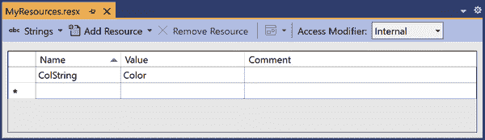

# 第十二章：程序集

到目前为止，在本书中，我使用术语*组件*来描述库或可执行文件。现在是时候更仔细地看看这究竟意味着什么了。在.NET 中，软件组件的部署单位称为*程序集*，通常是一个*.dll*或*.exe*文件。由于每个类型不仅由其名称和命名空间标识，还由其包含的程序集标识，程序集对类型系统是一个重要的方面。由于`internal`可访问性限定符在程序集级别工作，程序集提供了一种比单个类型更大尺度的封装。

运行时提供了一个*程序集加载器*，它会自动查找并加载程序需要的程序集。为了确保加载器能够找到正确的组件，程序集有结构化的名称，包括版本信息，并且可以选择性地包含一个全局唯一的元素，以防止歧义。

Visual Studio 的“创建新项目”对话框中的大多数 C#项目类型以及通过`dotnet new`命令行可用的大多数项目模板都会生成一个单独的程序集作为它们的主要输出。当你构建一个项目时，通常也会将额外的文件放在输出文件夹中，例如任何你的代码依赖但未内置到.NET 运行时中的程序集的副本，以及应用程序需要的其他文件。（例如，网站项目通常需要生成 CSS 和脚本文件，除了服务器端代码。）但通常会有一个特定的程序集作为项目的构建目标，其中包含所有项目定义的类型以及这些类型包含的代码。

# 程序集的解剖学

程序集使用 Win32 可移植可执行文件（PE）格式，这与现代 Windows 版本中的可执行文件（EXE）和动态链接库（DLL）使用的格式相同。¹ 它的“可移植性”体现在同一基本文件格式在不同 CPU 架构上的使用。非.NET PE 文件通常是特定于架构的，但.NET 程序集通常不是。即使在 Linux 或 macOS 上运行.NET，它仍然使用这种基于 Windows 的格式——大多数.NET 程序集可以在所有支持的操作系统上运行，因此我们在所有地方都使用相同的文件格式。

C# 编译器生成的输出是一个扩展名为 *.dll* 或 *.exe* 的程序集。理解 PE 文件格式的工具会将 .NET 程序集识别为有效但相对单调的 PE 文件。CLR 实质上将 PE 文件用作包含 .NET 特定数据格式的容器，所以对于经典的 Win32 工具来说，C# DLL 不会显示为导出任何 API。请记住，C# 编译为一种二进制中间语言（IL），这种语言不能直接执行。Windows 中用于加载和运行可执行文件或 DLL 的正常机制无法处理 IL，因为只有 CLR 能够运行它。类似地，.NET 定义了自己的格式来编码元数据，并不使用 PE 格式的原生能力来导出入口点或导入其他 DLL 的服务。

###### 注意

.NET SDK 中的提前编译（AoT）工具可以在构建过程后期向你的程序集添加本机可执行代码，但是对于 *Ready to Run* 程序集（这些 AoT 工具的输出称为），即使是嵌入的本机代码也是在 CLR 控制下加载和执行的，并且只能由托管代码直接访问。

在大多数情况下，你不会创建扩展名为 *.exe* 的 .NET 程序集。即使是生成直接可运行输出的项目类型（例如控制台或 WPF 应用程序），它们的主要输出也是一个 *.dll*。它们也会生成一个可执行文件，但不是 .NET 程序集。它只是一个引导程序，启动运行时，然后加载和执行你的应用程序的主程序集。默认情况下，引导程序的类型取决于你构建的操作系统，例如在 Windows 上构建时，你将得到一个 Windows 的 *.exe* 引导程序，而在 Linux 上则会得到一个 ELF 格式的可执行文件。²（唯一的例外是当你针对 .NET Framework 时。由于它仅支持 Windows，因此不需要为不同操作系统生成不同的引导程序，因此这些项目将生成一个扩展名为 *.exe* 的 .NET 程序集，并包含引导程序。）

## .NET 元数据

除了包含编译的 IL 外，程序集还包含 *元数据*，它提供了所定义的所有类型（无论是公共的还是私有的）的完整描述。CLR 需要完全了解代码使用的所有类型，以便能够理解 IL 并将其转换为可运行的代码——IL 的二进制格式经常引用包含程序集的元数据，并且没有元数据 IL 是无意义的。反射 API，即 第十三章 的主题，使元数据中的信息可用于你的代码。

## 资源

你可以在 DLL 中与代码和元数据一起嵌入二进制资源。例如，客户端应用程序可以这样做来处理位图。要嵌入文件，可以将其添加到项目中，在解决方案资源管理器中选择它，然后使用属性面板将其构建操作设置为嵌入的资源。这样会将整个文件的副本嵌入到组件中。在运行时提取资源时，可以使用 `Assembly` 类的 `GetManifestResourceStream` 方法，该方法是反射 API 的一部分，详见 第十三章。然而，在实践中，通常不会直接使用这个功能——大多数应用程序通过本地化机制使用嵌入资源，我将在本章后面描述。

因此，总结来说，一个程序集包含了描述其定义的所有类型的全面元数据集合；它保存了所有这些类型方法的 IL，并且可以选择性地嵌入任意数量的二进制流。这通常被打包成一个单独的 PE 文件。然而，这并不总是故事的全部。

## 多文件程序集

老式（但仍受支持的）仅限 Windows 的 .NET Framework 允许一个程序集跨多个文件。你可以将代码和元数据分割到多个 *模块* 中，并且还可以将逻辑上嵌入到程序集中的某些二进制流放置在单独的文件中。这个特性很少被使用，并且 .NET Core 及其后续版本（包括当前版本的 .NET）不支持它。然而，有必要了解它，因为一些后果仍然存在。特别是，反射 API 的设计的某些部分（见 第十三章）在不了解这个特性的情况下是没有意义的。

在多文件程序集中，总是有一个代表程序集的主文件。这将是一个 PE 文件，并包含元数据的一个特定元素，称为 *程序集清单*。这不应与大多数可执行文件包含的 Win32 风格清单混淆。程序集清单只是对程序集内容的描述，包括任何外部模块或其他外部文件的列表；在多模块程序集中，清单描述了哪些类型定义在哪些文件中。当编写直接使用程序集中类型的代码时，通常不需要关心它是否跨多个模块，因为运行时会检查清单并自动加载所需的模块。多模块通常只对使用反射检查组件结构的代码是一个问题。

## 其他 PE 特性

尽管 C# 不使用经典的 Win32 机制来表示代码或在 EXE 和 DLL 中导出 API，但程序集仍然可以使用 PE 格式的几个老式特性。

### Win32 风格资源

.NET 定义了自己的二进制资源嵌入机制，并在此基础上构建了本地化 API，因此在大多数情况下，它不使用 PE 文件格式固有的嵌入资源支持。并没有什么阻止你将经典的 Win32 风格资源放入 .NET 组件中——C# 编译器提供了各种命令行开关来实现这一点。然而，从你的应用程序中运行时访问这些资源没有 .NET API，这就是为什么你通常会使用 .NET 自己的资源系统。但也有一些例外情况。

Windows 期望在可执行文件中找到某些资源。例如，它定义了一种将版本信息作为非托管资源嵌入的方法。C# 程序集通常会这样做，但你不需要显式定义版本资源。编译器可以为你生成一个，就像我在 “Version” 中展示的那样。这确保了如果最终用户在 Windows 文件资源管理器中查看你的程序集属性，他们将能够看到版本号。（按照惯例，.NET 程序集通常包含这种 Win32 风格的版本信息，无论它们是否仅针对 Windows 或可以在任何平台上运行。）

Windows *.exe* 文件通常包含两个额外的 Win32 资源。你可能希望为你的应用程序定义一个自定义图标，以控制它在任务栏或 Windows 文件资源管理器中的显示方式。这需要你以 Win32 的方式嵌入图标，因为文件资源管理器不知道如何提取 .NET 资源。你可以通过在你的 *.csproj* 文件中添加一个 `<ApplicationIcon>` 属性来实现这一点。如果你使用 Visual Studio，它提供了一种通过项目属性页来设置这一点的方式。另外，如果你正在编写经典的 Windows 桌面应用程序或控制台应用程序（无论是否使用 .NET 编写），它应该提供一个应用程序清单。没有这个清单，Windows 将假定你的应用程序是在 2006 年之前编写的³，并会修改或禁用某些向后兼容性功能。如果你正在编写一个桌面应用程序并且希望它通过某些 Microsoft 认证要求，那么这种清单也必须存在并作为 Win32 资源嵌入。默认情况下，.NET SDK 会添加一个具有默认设置的清单，但如果需要自定义（例如，因为你正在编写一个需要以提升权限运行的控制台应用程序），你可以在你的 *.csproj* 文件中指定一个具有 `<ApplicationManifest>` 属性的清单（或者再次通过 Visual Studio 的项目属性页）。

请记住，在.NET 和.NET Core 中，主要的程序集是一个*.dll*，即使是用于 Windows 桌面应用程序，当你目标是 Windows 时，构建过程也会生成一个单独的*.exe*文件，它启动.NET 运行时，然后加载该程序集。在 Windows 看来，这个引导程序就是你的应用程序，因此图标和清单资源将最终出现在这个引导程序集中。但如果你的目标是.NET Framework，就不会有单独的引导程序，因此这些资源最终会出现在主要的程序集中。

### 控制台与 GUI

Windows 对控制台应用程序和 Windows 应用程序进行了区分。准确地说，PE 格式要求*.exe*文件指定一个*子系统*，在 Windows NT 早期的日子里，这使得可以使用多个操作系统*子系统*，例如早期版本包括 POSIX 子系统。因此，如今的 PE 文件只针对三个子系统之一，其中之一用于内核模式设备驱动程序。今天使用的两个用户模式选项在 Windows 图形用户界面(GUI)和 Windows 控制台应用程序之间进行选择。主要区别在于当运行后者时 Windows 将显示控制台窗口（或者如果从命令提示符运行它，则只使用现有的控制台窗口），但 Windows GUI 应用程序不会获得控制台窗口。

你可以通过在项目文件中设置`<OutputType>`属性为`Exe`或`WinExe`来在这些子系统之间进行选择，或者在 Visual Studio 中你可以在项目属性的“输出类型”下拉列表中进行选择。（输出类型默认为`Library`，或者在 Visual Studio 的 UI 中为“类库”。这会构建一个 DLL，但由于子系统是在进程启动时确定的，因此 DLL 是否目标是 Windows 控制台或 Windows GUI 子系统是没有区别的。`Library`设置总是针对前者。）如果你的目标是.NET Framework，这个子系统设置将应用于作为你的应用程序主要程序集构建的*.exe*文件，而对于较新版本的.NET，则会应用于引导程序*.exe*。（碰巧的是，它也会应用于引导程序加载的主程序集*.dll*，但这不会产生影响，因为子系统是根据启动进程的*.exe*确定的。）

# 类型标识

作为一名 C#开发者，你通常会首先接触到的是程序集（assemblies）构成类型标识的一部分这一事实。当你编写一个类时，它将成为一个程序集的一部分。当你使用来自运行时库或其他库的类型时，你的项目需要引用包含该类型的程序集才能使用它。

当使用系统类型时，这并不总是显而易见的。构建系统会自动添加对各种运行时库程序集的引用，因此大多数情况下，您在使用运行时库类型之前不需要添加引用，并且由于通常不会在源代码中明确引用类型的程序集，因此很难立即意识到程序集是确定类型所需的必要部分。但尽管在代码中并没有明确指定，程序集必须作为类型身份的一部分，因为没有任何东西会阻止您或其他任何人定义与现有类型同名的新类型。例如，您可以在项目中定义一个名为`System.String`的类。这是一个不好的主意，编译器会警告您这样会引入歧义，但不会阻止您这样做。尽管您的类将具有与内置字符串类型完全相同的完全限定名称，编译器和运行时仍然可以区分这些类型。

每当您使用一个类型时，无论是通过显式名称（例如在变量或参数声明中）还是通过表达式隐式使用，C#编译器都确切地知道您所引用的类型，这意味着它知道哪个程序集定义了该类型。因此，它能够区分.NET 内置的`System.String`和您自己组件中不明智定义的`System.String`。C#的作用域规则意味着对`System.String`的显式引用将标识出您在自己项目中定义的类型，因为局部类型有效地隐藏了外部程序集中同名的类型。如果使用`string`关键字，那总是指向内置类型。当您使用字符串字面量或调用返回字符串的 API 时，也将使用内置类型。示例 12-1 展示了这一点——它定义了自己的`System.String`，然后使用了一个显示传递给它的参数的静态类型和程序集名称的通用方法。（这使用了反射 API，详见第十三章。）

##### 示例 12-1\. 一个字符串是什么类型？

```cs
using System;

// Never do this!
namespace System
{
    public class String
    {
    }
}

class Program
{
    static void Main(string[] args)
    {
        System.String? s = null;
        ShowStaticTypeNameAndAssembly(s);
        string? s2 = null;
        ShowStaticTypeNameAndAssembly(s2);
        ShowStaticTypeNameAndAssembly("String literal");
        ShowStaticTypeNameAndAssembly(Environment.OSVersion.VersionString);
    }

    static void ShowStaticTypeNameAndAssembly<T>(T item)
    {
        Type t = typeof(T);
        Console.WriteLine(
            $"Type: {t.FullName}. Assembly {t.Assembly.FullName}.");
    }
}
```

在本示例中的`Main`方法尝试了我刚刚描述的每种处理字符串的方法，并写出了以下内容：

```cs
Type: System.String. Assembly TypeIdentity, Version=1.0.0.0, Culture=neutral,
 PublicKeyToken=null.
Type: System.String. Assembly System.Private.CoreLib, Version=6.0.0.0,
 Culture=neutral, PublicKeyToken=7cec85d7bea7798e.
Type: System.String. Assembly System.Private.CoreLib, Version=6.0.0.0,
 Culture=neutral, PublicKeyToken=7cec85d7bea7798e.
Type: System.String. Assembly System.Private.CoreLib, Version=6.0.0.0,
 Culture=neutral, PublicKeyToken=7cec85d7bea7798e.
```

明确使用 `System.String` 最终导致了我的类型，并且其余部分都使用了系统定义的字符串类型。这表明 C# 编译器能够处理具有相同名称的多个类型。这也显示了 IL 能够进行区分。IL 的二进制格式确保对类型的每个引用都标识了包含程序集。但仅仅因为你可以创建和使用多个同名类型，并不意味着你应该这样做。因为在 C# 中通常不会显式命名包含程序集，所以通过定义自己的 `System.String` 类来引入无意义的冲突是一个特别糟糕的主意。（恰好，在必要时你可以解决这种冲突——详见边栏 “外部别名” ——但最好避免这样做。）

顺便说一句，如果你在 .NET Framework 上运行 示例 12-1，你会看到 `mscorlib` 而不是 `System.Private.CoreLib`。.NET Core 改变了许多运行库类型所在的程序集。你可能会想知道这如何与 .NET Standard 兼容，它使你能够编写一个单独的 DLL，在 .NET Framework、.NET Core 和 .NET 上都可以运行。一个 .NET Standard 组件如何能正确识别在不同目标上位于不同程序集中的类型呢？答案是 .NET 具有一种*类型转发*特性，其中对一个程序集中类型的引用可以在运行时重定向到其他程序集中。（类型转发器只是描述真实类型定义所在位置的一个程序集级别属性。属性是 第十四章 的主题。）.NET Standard 组件既不引用 `mscorlib` 也不引用 `System.Private.CoreLib` ——它们的构建就好像运行库类型定义在一个名为 `netstandard` 的程序集中一样。每个 .NET 运行时都提供了一个 `netstandard` 实现，在运行时将转发到相应的类型。事实上，即使是直接为 .NET Core 或 .NET 构建的代码，最终也会使用类型转发。如果你检查编译输出，你会发现它期望大多数运行库类型在名为 `System.Runtime` 的程序集中定义，并且仅通过类型转发才能使用 `System.Private.CoreLib` 中的类型。

如果在同一名称下有多个类型是个坏主意，那为什么 .NET 一开始就允许这种可能性呢？事实上，支持名称冲突并不是目标；这只是 .NET 将程序集作为类型的一部分的副作用。程序集需要成为类型定义的一部分，这样 CLR 在你首次使用该类型的功能时就能知道要加载哪个程序集。

# 加载程序集

当我说构建系统自动向目标框架添加所有可用的运行库组件的引用时，你可能会感到惊讶。也许你会想知道如何在效率名义上删除其中一些。就运行时开销而言，你无需担心。C# 编译器会有效地忽略你的项目从未使用过的内置程序集的任何引用，因此不会加载你不需要的 DLL 的风险。然而，删除对未构建为 .NET 的未使用组件的引用是值得的——这样在部署应用程序时可以避免复制不需要的 DLL，毕竟不必使部署变得比必要时更大。但对于已作为 .NET 的一部分安装的未使用 DLL 的引用则毫无成本。

即使在编译时 C# 没有剥离未使用的引用，也不会存在加载未使用的 DLL 的风险。CLR 不会在应用程序首次需要它们之前加载程序集。大多数应用程序在每次执行时并不会涵盖所有可能的代码路径，因此你的应用程序中有相当大部分的代码可能并不会运行。你的程序甚至可能在完成工作时留下整个未使用的类——也许这些类只在出现异常错误条件时才会参与。如果你只在这类方法内部使用某个程序集，那么这个程序集就不会被加载。

CLR 对于决定“使用”特定程序集有一些自主权。如果一个方法包含任何引用特定类型的代码（例如声明该类型的变量或包含隐式使用该类型的表达式），那么当该方法首次运行时 CLR 可能会认为该类型已被使用，即使你并未真正使用它。参见 示例 12-2。

##### 示例 12-2\. 类型加载和条件执行

```cs
static IComparer<string> GetComparer(bool useStandardOrdering)
{
    if (useStandardOrdering)
    {
        return StringComparer.CurrentCulture;
    }
    else
    {
        return new MyCustomComparer();
    }
}
```

根据其参数不同，此函数会返回运行库提供的`StringComparer`对象，或构造一个类型为`MyCustom​Com⁠parer`的新对象。`StringComparer`类型在与核心类型（如`int`和`string`）相同的程序集中定义，因此在我们的程序启动时已加载。但假设另一类型`MyCustomComparer`定义在与我的应用程序分离的名为`ComparerLib`的程序集中。显然，如果以`false`作为参数调用此`GetComparer`方法，CLR 将需要在未加载时加载`ComparerLib`。但更令人惊讶的是，即使参数为`true`，CLR 也可能在首次调用此方法时加载`ComparerLib`。为了能够 JIT 编译此`GetComparer`方法，CLR 需要访问`MyCustomComparer`类型定义，因为它需要检查该类型确实有一个无参数构造函数。（显然，如果如此，Example 12-2 将无法编译，但可能的情况是该代码针对的是与运行时不同版本的`ComparerLib`。）JIT 编译器的操作是实现细节，因此并未完全记录，且可能因版本而异，但似乎是逐个方法操作。因此，仅调用此方法很可能足以触发`ComparerLib`程序集的加载。

这引出了.NET 如何找到程序集的问题。如果程序集可以作为运行方法的结果隐式加载，我们未必有机会告诉运行时在哪里找到它们。因此，.NET 有一种机制来处理这个问题。

## 程序集解析

当运行时需要加载一个程序集时，它会经历一个称为*程序集解析*的过程。在某些情况下，你会告诉.NET 加载特定的程序集（例如，当你首次运行一个应用程序时），但大部分是隐式加载的。具体的机制取决于几个因素：你是否针对.NET/.NET Core 或旧版.NET Framework，以及如果是前者，你的应用程序是否是*自包含*的。

.NET（及其前身 .NET Core）支持应用程序的两种部署选项：*自包含* 和 *依赖于框架*。当你发布一个自包含的应用程序时，它会包括运行时和运行时库的完整副本。示例 12-3 显示了以这种方式构建应用程序的命令行——如果你从包含 *.csproj* 文件的文件夹运行此命令，它将编译项目，然后生成一个 *publish* 文件夹，其中包含编译代码和适当版本 .NET 的完整副本。（版本将取决于项目配置的目标框架。通常，项目文件会指定主要和次要版本，例如 `net6.0`，然后 SDK 将复制安装在您的计算机上的最新修补版本。可用版本将由您安装的 .NET SDK 版本决定。）`-r` 开关指定要构建的平台和处理器架构。Linux 的 CLR 与 Windows 的不同，而 macOS 的则又不同。此外，对于每个支持的操作系统，都有适用于多个 CPU 架构的 .NET 运行时可用。所有三个操作系统都支持 64 位 Intel 和 64 位 ARM。Windows 和 Linux 还额外获取面向 32 位 Intel 架构 CPU 和 32 位 ARM CPU 的 .NET 运行时。包含本地可执行二进制代码的 .NET 运行时部分在每种情况下都不同，因此当您要求自包含部署时，构建系统需要知道要复制哪一个。`-r` 开关使用称为 *Runtime Identifier*（RID）的东西来指定这一点。示例 12-3 选择了适用于运行 Windows 的 64 位 Intel 架构 CPU 的运行时。（RID 可能更详细，以指示您的应用程序具有最低版本要求。例如，第一部分可以是 `win10` 而不仅仅是 `win`；对于 macOS，我们可以使用 `osx-x64`，但我们可以更具体，例如 `osx.10.15-x64`。）

##### 示例 12-3\. 发布自包含应用程序

```cs
dotnet publish -c Release -r win-x64 --self-contained true
```

当你以这种方式构建时，程序集解析变得非常简单，因为所有内容——你的应用程序自身的程序集、你依赖的任何外部库、所有内置于 .NET 中的系统程序集以及 CLR 本身——都会结束在一个文件夹中。（在撰写本文时，对于 .NET 6.0 的目标架构的一个简单的“Hello, World!”控制台应用程序，总计约为 68 MB 左右。）

自包含部署有两个主要优点。首先，在目标机器上不需要安装 .NET——应用程序可以直接运行，因为它包含自己的 .NET 副本。其次，您知道确切运行的 .NET 版本和所有 DLL 的版本。微软非常努力确保向后兼容性与新版本，但有时可能会发生破坏性更改，如果在更新 .NET 后发现应用程序停止工作，自包含部署可能是一个出路。通过自包含部署，除非应用程序指示 CLR 在其他地方查找，否则一切都将从应用程序文件夹加载，包括所有内置到 .NET 的程序集。

但是，如果您不想将整个 .NET 复制到生成的输出中呢？应用程序的默认构建行为是创建一个依赖框架的可执行文件。（有一个称为*依赖框架部署*的变体，几乎相同，只是省略了启动器可执行文件。要运行依赖框架部署，您需要使用`dotnet`命令行工具启动运行时，然后运行您的应用程序。这样做的好处是完全与平台无关；依赖框架可执行部署中的启动器始终特定于操作系统。但这样做不太方便——您不能在没有`dotnet`工具的情况下运行生成的输出。）在这种情况下，您的代码依赖于机器上已安装合适版本的 .NET。生成的输出将包含您自己的应用程序程序集，并可能包含您的应用程序依赖的程序集，但不会包含任何内置到 .NET 的库。

依赖框架应用程序必然使用比自包含应用程序更复杂的解析机制。当这样的应用程序启动时，它首先确定要运行的 .NET 版本。这不一定是您的应用程序构建的版本，并且有各种选项可以配置确切选择的版本。默认情况下，如果可用相同的`*Major*.*Minor*`版本，将使用该版本。例如，如果为 .NET Core 5.0 构建的依赖框架应用程序在安装了 .NET Core 版本为 `3.1.20`、`5.0.11` 和 `6.0.0` 的机器上运行，则会运行在 `5.0.11` 上。在找不到这样的匹配的情况下，但是有一个主要版本号匹配的情况下，通常会向前滚动到那个版本；例如，如果应用程序目标为 3.0，而机器上只有 `3.1.20`，则会在 `3.1.20` 上运行。也可以通过配置显式请求运行高于应用程序构建的主要版本号的更高版本号（例如，为 3.1 构建但在 6.0 上运行），但是只有通过配置显式请求才能做到这一点。

所选的运行时版本不仅选择 CLR，还包括构成内置于.NET 中的运行时库部分的程序集。你通常可以在 Windows 的*C:\Program Files\dotnet\shared\Micro⁠soft.NET​Core.App\*文件夹中找到所有已安装的运行时版本，在 macOS 上为*/usr/local/share/dotnet/shared/Microsoft​.NET⁠Core.App*，在 Linux 上为*/usr/share/dotnet/shared/Microsoft.NETCore.App*，其子文件夹基于版本命名，比如*6.0.0*。（你不应依赖这些路径——文件在未来版本的.NET 中可能会移动。）程序集解析过程将查找这个特定版本的文件夹，这就是框架相关应用程序如何使用内置的.NET 程序集。

如果你在这些文件夹里查找，你可能会注意到*shared*下面的其他文件夹，比如*Microsoft.AspNetCore.App*。事实证明，这种机制不仅适用于内置于.NET 中的运行时库——也可以安装整个框架的程序集。.NET 应用程序声明它们使用特定的应用程序框架。（构建工具会自动在构建输出中生成一个名为*YourApp.runtimeconfig.json*的文件，声明你正在使用的框架。控制台应用程序指定`Microsoft.NETCore.App`，而 Web 应用程序则指定`Microsoft.AspNetCore.App`。）这使得针对特定 Microsoft 框架的应用程序不必包含所有框架 DLL 的完整副本，即使该框架并非.NET 本身的一部分。

如果你安装了纯粹的.NET 运行时，你将只会得到`Microsoft.NETCore.App`，而没有任何应用程序框架。因此，如果以默认方式构建的应用程序目标框架是如 ASP.NET Core 或 WPF 等，它们将无法运行，因为这假定这些框架将预安装在目标机器上，而程序集解析过程将无法找到特定框架组件。.NET SDK 会安装这些额外的框架组件，因此在开发机器上你不会遇到这个问题，但在部署时可能会遇到。你可以告诉构建工具包含框架的组件，但这通常是不必要的。如果在公共云服务（如 Azure）上运行你的应用程序，这些服务通常会预安装相关的框架组件，因此实际上你通常只会在自己配置服务器或部署桌面应用程序时遇到这种情况。对于这些情况，微软提供了包含 Web 或桌面框架组件的.NET 运行时安装程序。

*dotnet* 安装文件夹中的*shared* 文件夹不是你应该自行修改的目录。它仅用于微软自己的框架。但是，如果你愿意，可以安装额外的系统范围组件，因为.NET 还支持称为*运行时包存储*的东西。这是一个额外的目录，结构与刚才描述的*shared* 文件夹类似。你可以使用 `dotnet store` 命令构建一个合适的目录布局，如果设置了 `DOTNET_SHARED_STORE` 环境变量，CLR 将在程序集解析时查找其中的内容。这使你能够像使用微软的框架一样进行操作：你可以构建依赖于一组组件的应用程序，而无需将它们包含在构建输出中，只要你已经安排在目标机器上预安装这些组件。

除了在这两个位置查找常见的框架之外，CLR 在程序自己的目录中进行程序集解析时，也会进行查找，就像对于自包含应用程序一样。此外，CLR 还有一些机制可以进行更新的启用。例如，在 Windows 上，微软可以通过 Windows 更新向 .NET 组件推送关键更新。

但总体来说，面向框架依赖型应用程序的程序集解析的基本过程是，隐式程序集加载会从你的应用程序目录或安装在机器上的共享组件集合中进行。这对于运行在较旧的 .NET Framework 上的应用程序也是适用的，尽管机制略有不同。它有一种称为*全局程序集缓存*（GAC）的东西，它有效地结合了.NET 中两个共享存储提供的功能。这种方式不太灵活，因为存储位置是固定的；.NET 使用环境变量开放了为不同应用程序提供不同共享存储的可能性。

## 显式加载

尽管 CLR 可以自动加载程序集，你也可以显式加载它们。例如，如果你正在创建一个支持插件的应用程序，在开发过程中你可能不知道在运行时会加载哪些组件。插件系统的整个重点在于它是可扩展的，因此你可能希望加载特定文件夹中的所有 DLL 文件。（你需要使用反射来发现和利用这些 DLL 中的类型，正如第十三章所描述的。）

###### 警告

在某些场景下，动态加载受到限制。例如，使用 UWP 构建的应用程序并从微软商店安装的应用程序只能运行作为应用程序一部分提供的组件。这是因为微软对这些商店应用程序运行各种测试，旨在避免安全和稳定性问题，为此他们需要访问你应用程序的所有代码。下载和运行外部代码的能力将会打破这些检查。

如果您知道程序集的完整路径，加载它非常简单：您可以调用`Assembly`类的静态`LoadFrom`方法，并传递文件的路径。路径可以是相对于当前目录的，也可以是绝对的。这个静态方法返回`Assembly`类的一个实例，它是反射 API 的一部分。它提供了发现和使用程序集定义的类型的方式。

偶尔，您可能希望显式加载一个组件（例如，通过反射使用它），而不想指定路径。例如，您可能希望从运行时库中加载特定的程序集。永远不要硬编码系统组件的位置 —— 它们往往会从一个 .NET 版本移动到下一个版本。如果您的项目引用了相关程序集并且知道它定义的类型的名称，您可以写`typeof(TheType).Assembly`。但如果这不是一个选择，您应该使用`Assembly.Load`方法，并传递程序集的名称。

`Assembly.Load`使用的是与隐式触发加载完全相同的机制。因此，您可以引用安装在应用程序旁边的组件或系统组件。无论哪种情况，您都应该指定一个完整的名称，其中必须包含名称和版本信息，例如，`ComparerLib, Version=1.0.0.0, Cul⁠ture=neutral, PublicKeyToken=null`。

.NET Framework 版本的 CLR 记得使用`LoadFrom`加载了哪些程序集。如果以这种方式加载的程序集触发了隐式加载其他程序集，CLR 将搜索从该程序集加载的位置。这意味着，如果您的应用程序将插件放在一个 CLR 通常不会查找的单独文件夹中，那么这些插件可以在同一插件文件夹中安装它们依赖的其他组件。CLR 将能够在没有进一步调用`LoadFrom`的情况下找到它们，尽管它通常不会在那个文件夹中查找触发的加载。然而，.NET 和 .NET Core 不支持这种行为。它们提供了支持插件场景的不同机制。

## 使用 AssemblyLoadContext 进行隔离和插件化

.NET Core 引入了一种称为`AssemblyLoadContext`的类型。它允许在单个应用程序内部的程序集组之间实现一定程度的隔离。⁴ 这解决了在支持插件模型的应用程序中可能出现的问题。

如果一个插件依赖于主机应用程序也使用的某些组件，但每个组件想要不同的版本，如果使用上一节描述的简单机制可能会导致问题。通常，.NET 运行时会*统一*这些引用，只加载单个版本。在这种情况下，如果共享组件中的类型是插件接口的一部分，这正是你需要的：如果一个应用程序要求插件实现某些依赖于`Newtonsoft.Json`库的接口类型，重要的是应用程序和插件都同意正在使用的库的版本。

但是，统一可能会对用作实现细节而不是应用程序与其插件之间 API 的组件造成问题。如果主机应用程序在内部使用`Microsoft.Extensions.Logging`的 v3.1 版本，而插件使用相同组件的 v6.0 版本，没有必要在运行时将其统一为单个版本选择——如果应用程序和插件各自使用它们需要的版本，这不会有任何问题。统一可能会引起问题：强制插件使用 v3.1 将导致运行时异常，如果它尝试使用只存在于 v6.0 中的功能。强制应用程序使用 v6.0 也可能会导致问题，因为主要版本号更改通常意味着引入了破坏性更改。

为了避免这类问题，你可以引入自定义的程序集加载上下文。你可以编写一个从`AssemblyLoadContext`派生的类，每个实例化的上下文都由.NET 运行时创建，支持加载与应用程序可能已加载的不同版本的程序集。通过重载`Load`方法，你可以定义所需的确切策略，就像示例 12-4 中展示的那样。

##### 示例 12-4\. 一个用于插件的自定义`AssemblyLoadContext`

```cs
using System.Reflection;
using System.Runtime.Loader;

namespace HostApp;

public class PlugInLoadContext : AssemblyLoadContext
{
    private readonly AssemblyDependencyResolver _resolver;
    private readonly ICollection<string> _plugInApiAssemblyNames;

    public PlugInLoadContext(
        string pluginPath,
        ICollection<string> plugInApiAssemblies)
    {
        _resolver = new AssemblyDependencyResolver(pluginPath);
        _plugInApiAssemblyNames = plugInApiAssemblies;
    }

    protected override Assembly Load(AssemblyName assemblyName)
    {
        if (!_plugInApiAssemblyNames.Contains(assemblyName.Name!))
        {
            string? assemblyPath = _resolver.ResolveAssemblyToPath(assemblyName);
            if (assemblyPath != null)
            {
                return LoadFromAssemblyPath(assemblyPath);
            }
        }

        return AssemblyLoadContext.Default.LoadFromAssemblyName(
            assemblyName);
    }
}
```

这段代码需要插件 DLL 的位置，以及任何特殊程序集的名称列表，插件需要与主机应用程序使用相同版本的程序集（例如定义插件接口中使用的类型的接口）。您不需要包含作为.NET 本身一部分的程序集——即使您使用自定义加载上下文，这些程序集也始终是统一的。运行时将在每次在此上下文中加载程序集时调用此类的`Load`方法。此代码检查正在加载的程序集是否是那些必须对插件和主机应用程序通用的特殊程序集之一。如果不是，则在插件文件夹中查找插件是否提供了该程序集的自己版本。在不使用插件文件夹中的程序集的情况下（要么因为插件没有提供特定的程序集，要么因为它是特殊的程序集之一），此上下文将延迟至`AssemblyLoadContext.Default`，这意味着应用程序主机和插件在这些情况下使用相同的程序集。示例 12-5 展示了此用法。

##### 示例 12-5\. 使用插件加载上下文

```cs
Assembly[] plugInApiAssemblies =
{
    typeof(IPlugIn).Assembly,
    typeof(JsonReader).Assembly
};
var plugInAssemblyNames = new HashSet<string>(
    plugInApiAssemblies.Select(a => a.GetName().Name!));

var ctx = new PlugInLoadContext(plugInDllPath, plugInAssemblyNames);
Assembly plugInAssembly = ctx.LoadFromAssemblyPath(plugInDllPath);
```

此处构建了插件和应用程序必须共享的程序集列表，并将它们的名称与插件 DLL 的路径一起传递到插件上下文中。任何插件依赖的 DLL 并且被复制到与插件相同的文件夹中的 DLL 将被加载，除非它们在该列表中，在这种情况下，插件将使用与主机应用程序本身相同的程序集。

# 程序集名称

程序集名称是结构化的。它们总是包含一个*简单名称*，这是您通常用来引用 DLL 的名称，例如*MyLibrary*或*System.Runtime*。这通常与文件名相同，但没有扩展名。从技术上讲，这并不是必须的，⁵，但是程序集解析机制假定它是。程序集名称始终包括版本号。还有一些可选组件，包括*公钥标记*，一个十六进制数字字符串，使得可以为程序集指定唯一名称。

## 强名称

如果程序集的名称包含公钥标记，则称为*强名称*。Microsoft 建议任何针对.NET Framework 并发布供共享使用的.NET 组件（例如通过 NuGet 提供）应具有强名称。但是，如果您正在编写仅在.NET Core 或.NET 上运行的新组件，则强命名没有任何好处，因为这些较新的运行时基本上忽略公钥标记。

由于强命名的目的是使名称唯一，您可能会想知道为什么程序集不简单地使用全局唯一标识符（GUID）。答案是，从历史上看，强名称还承担了另一个任务：它们旨在提供一定程度的保证，即程序集未被篡改。早期的.NET 版本在运行时检查强命名程序集是否被篡改，但由于这些检查带来了相当大的运行时开销，通常几乎没有好处，因此这些检查已被移除。微软的文档现在明确建议不将强名称视为安全功能。但是，为了理解和使用强名称，您需要了解它们最初的工作方式。

正如术语所示，程序集名称的公钥标记与密码学有关。它是公钥的 64 位哈希的十六进制表示。要求强名称的程序集包含生成哈希的完整公钥的副本。程序集文件格式还提供了用相应私钥生成的数字签名空间。

强名称的唯一性依赖于密钥生成系统使用密码学安全的随机数生成器，以及两个人生成具有相同公钥标记的两个密钥对的机会非常小。程序集未被篡改的保证来自于强命名程序集必须被签名，只有拥有私钥的人才能生成有效的签名。任何在签名后修改程序集的尝试都将使签名无效。

###### 注意

强名称相关联的签名与 Windows 中较早的代码签名机制 Authenticode 独立。它们具有不同的目的。Authenticode 提供可追溯性，因为公钥包含在证书中，告诉您代码的来源。而强名称的公钥标记仅仅是一个数字，所以除非您碰巧知道谁拥有该标记，否则它不会告诉您任何信息。Authenticode 允许您询问：“这个组件来自哪里？”而公钥标记允许您说：“这就是我想要的组件。”一个单独的.NET 组件通常同时使用这两种机制。

如果一个程序集的私钥变为公共知识，任何人都可以生成具有相应密钥标记的看似有效的程序集。一些开源项目故意发布两个密钥，以便任何人都可以从源代码构建组件。这完全放弃了密钥标记可能提供的任何安全性，但这没关系，因为微软现在建议我们不把强名称视为安全功能。发布你的强命名私钥的做法认识到，即使没有真实性的保证，拥有一个唯一的名称也是有用的。.NET Core（因此.NET）更进一步，使组件可以拥有强名称而无需使用私钥。为了与微软采用开源开发的做法一致，这意味着你现在可以构建和使用具有相同强名称的自己版本的微软编写的组件，尽管微软并未发布其私钥。请参阅下一个侧边栏，["强名称密钥和公共签名"](https://wiki.example.org/strong_name_keys_and_public_signing)，了解如何处理密钥的信息。

微软在运行时库中的大多数程序集上使用相同的标记。（微软的许多组织生产.NET 组件，因此该标记仅用于.NET 的组件，而不适用于整个微软。）这里是`mscorlib`的完整名称，这是一个系统程序集，提供了诸如`System.String`等各种核心类型的定义：

```cs
mscorlib, Version=4.0.0.0, Culture=neutral, PublicKeyToken=b77a5c561934e089
```

顺便说一下，在撰写本文时，这是即使在最新的.NET 版本中也是正确的名称。`Version`是`4.0.0.0`，即使.NET Framework 现在是 v4.8，.NET 是 6.0 版。（在.NET 和.NET Core 中，`mscorlib`只包含类型转发器，因为相关类型大多数已移至`System.Private.CoreLib`。虽然这些类型的真正家园现在是版本`6.0.0.0`，但`mscorlib`的版本号仍然相同。）程序集版本号具有技术上的重要意义，因此微软并不总是随着市场版本号更新库组件名称中的版本号 —— 这些版本号甚至在主要版本号上也不一定匹配。例如，.NET 3.5 版的`mscorlib`版本号为`2.0.0.0`。

尽管公共密钥令牌是程序集名称的可选部分，版本是强制的。

## 版本

所有的程序集名称都包含一个四部分的版本号。当一个程序集名称被表示为一个字符串（例如，当你将其作为参数传递给`Assembly.Load`时），版本号由四个用点分隔的十进制整数组成（例如，`4.0.0.0`）。IL 用于程序集名称和引用的二进制格式限制了这些数字的范围 —— 每个部分必须适合于一个 16 位无符号整数（即`ushort`），而版本部分中允许的最大值实际上比适合的最大值小 1，因此最高合法版本号是`65534.65534.65534.65534`。

每个版本号的四个部分都有名称。从左到右，它们是*主版本*、*次版本*、*构建*和*修订*。然而，这些名称没有特定的意义。一些开发人员使用某些约定，但没有任何检查或强制执行。一个常见的约定是，公共 API 的任何更改都需要更改主版本或次版本号，而可能会破坏现有代码的更改应该涉及主版本号的更改。（市场营销是进行主版本更改的另一个流行原因。）如果更新不打算对行为进行任何可见更改（除非是修复 bug），则更改构建号就足够了。修订号可以用来区分你认为是针对同一源构建但不是同时构建的两个组件。另外，有些人将版本号与源代码控制中的分支联系起来，因此仅更改修订号可能表示对长期停止获得主要更新的版本应用的修补程序。然而，你可以自由地制定自己的含义。就 CLR 而言，你真正能做的有趣事情只有一个，那就是将其与其他版本号进行比较——它们要么匹配，要么其中一个比另一个更高。

###### 注意

NuGet 包也有版本号，并且这些版本号不需要以任何方式与程序集版本连接。许多包作者按照约定使它们相似，但这并非普遍规则。NuGet *确实* 将包版本号的组件视为具有特定意义：它采用了广泛使用的*语义化版本*规则。这种规则使用由三个部分组成的版本号，分别称为主版本、次版本和修订版本。

运行时库程序集名称中的版本号忽略了我刚才描述的所有约定。在四个主要更新中，大多数组件的版本号都是相同的（`2.0.0.0`）。随着 .NET 4.0 的推出，所有东西都变成了`4.0.0.0`，这在撰写本文时仍然是 .NET Framework（4.8 版本）的最新版本。.NET Core 3.1 也使用 4 作为其大多数运行时库组件的主版本。在 .NET 6.0 中，许多这些组件现在的主版本号都是 6，但正如你在它的 `mscorlib` 副本中看到的那样，并非普遍适用。

通常，你通过在*.csproj*文件的`<PropertyGroup>`中添加一个`<Version>`元素来指定版本号。（Visual Studio 也为此提供了一个 UI：如果你打开项目的属性页面，其“Package”部分允许你配置各种与命名相关的设置。“Package version”字段设置版本号。）构建系统以两种方式使用这个版本号：它在程序集上设置版本号，但如果你为项目生成 NuGet 包，则默认情况下也会将此相同的版本号用于包，并且由于 NuGet 版本号有三部分，你通常只在这里指定三个数字，程序集版本的第四部分将默认为零。（如果你真的想指定所有四位数，请参阅如何分别设置程序集和 NuGet 版本的文档。）

通过程序集级别的属性，构建系统告诉编译器在程序集名称中使用哪个版本号。我将在第十四章更详细地描述属性，但这个属性相当直接。如果你想找到它，构建系统通常会在项目的*obj*文件夹的子文件夹中生成一个名为*ProjectName.AssemblyInfo.cs*的文件。其中包含各种描述程序集详细信息的属性，包括一个`AssemblyVersion`属性，例如在示例 12-6 中所示。

##### 示例 12-6\. 指定程序集的版本

```cs
[assembly: System.Reflection.AssemblyVersion("1.0.0.0")]
```

C#编译器对此属性提供特殊处理——它不像大多数属性那样盲目应用它。它解析版本号并将其嵌入到.NET 元数据格式所需的方式中。它还检查字符串是否符合预期格式，并检查数字是否在允许的范围内。

顺便说一下，组成程序集名称一部分的版本与使用标准的 Win32 机制嵌入版本存储的版本是不同的。大多数 .NET 文件包含这两种版本。默认情况下，构建系统将使用 `<Version>` 设置两者，但文件版本更频繁地更改是很常见的。这在 .NET Framework 中特别重要，因为一次只能安装一个主要版本的 .NET Framework —— 如果一台计算机安装了 .NET Framework 4.7.2，你安装了 .NET Framework 4.8，那么将替换版本 4.7.2。（.NET 和 .NET Core 不会这样做 —— 你可以在单台计算机上并排安装任意数量的版本。）这种原地更新与微软倾向于在各版本中保持程序集版本相同结合在一起，可能会使确定安装了哪个版本变得困难，此时文件版本变得重要。在安装了 .NET Framework 4.0 sp1 的计算机上，其 *mscorlib.dll* 的 Win32 版本号是 `4.0.30319.239`，但如果安装了 .NET 4.8，这将变为 `4.8.4420.0`，但程序集版本仍保持为 `4.0.0.0`。（随着发布服务包和其他更新，最后一部分将不断上升。）

默认情况下，构建系统将同时使用 `<Version>` 设置程序集和 Windows 文件版本，但如果你想分别设置文件版本，可以在项目文件中添加 `<FileVersion>`。（Visual Studio 的项目属性包部分也允许你设置这个。）在内部，这与另一个属性一起工作，编译器会特别处理，`AssemblyFileVersion`。它会导致编译器在文件中嵌入一个 Win32 版本资源，因此这是用户在 Windows Explorer 中右键单击程序集时看到的版本号。

这个文件版本通常是放置标识构建来源的版本号的更合适的地方，而不是放置在程序集名称中的版本号。后者实际上是支持的 API 版本的声明，任何设计为完全向后兼容的更新可能应该保持不变，只改变文件版本。

## 版本号和程序集加载

由于版本号是程序集名称（因此是其标识）的一部分，它们也最终是类型标识的一部分。`mscorlib` 中 `System.String` 在版本 `2.0.0.0` 的不是与版本 `4.0.0.0` 的相同类型。

处理程序集版本号在.NET Core 中有所改变。在.NET Framework 中，当你通过名称加载一个强命名程序集（无论是隐式地使用它定义的类型还是显式地使用`Assembly.Load`），CLR 要求版本号必须完全匹配。⁶ .NET Core 对此进行了放宽，因此如果磁盘上的版本号等于或高于请求的版本号，它将使用它。这一变化背后有两个因素。首先，.NET 开发生态系统已经开始依赖 NuGet（在.NET 存在的第一个十年中甚至不存在），这意味着依赖于大量外部组件变得越来越普遍。其次，变化的速度增加了——在早期，我们通常需要等待多年才能看到.NET 组件的新版本发布。（安全补丁和其他错误修复可能会更频繁地出现，但新功能往往会缓慢地以大块的形式作为整个运行时、框架和开发工具更新的一部分出现。）但如今，一个应用程序在一个月内没有某个组件的版本发生变化是很少见的。.NET Framework 的严格版本策略现在看起来并不实用。（事实上，构建系统的某些部分专门负责浏览您的 NuGet 依赖项，计算出您正在使用的每个组件的具体版本，并自动生成包含大量版本替换规则的配置文件，告诉 CLR 使用这些版本，而不管任何单个程序集说它想要的版本是什么。因此，即使您面向.NET Framework，构建系统默认情况下也会有效地禁用严格版本控制。）

另一个变化是，.NET Framework 仅对强命名程序集考虑程序集版本。.NET Core 和.NET 检查磁盘上程序集的版本号是否等于或大于所需版本，而不管目标程序集是否强命名。

## 文化

到目前为止，我们已经看到程序集名称包括简单名称、版本号，以及可选的公钥标记。它们还有一个*文化*组件。（文化代表语言和一组约定，如货币、拼写变体和日期格式。）这不是可选的，尽管最常见的值是默认值：`neutral`，表示程序集不包含特定于文化的代码或数据。程序集的文化通常仅在包含特定于文化资源的程序集上设置为其他值。程序集名称的文化旨在支持资源（如图像和字符串）的本地化。为了说明这一点，我需要解释使用它的本地化机制。

所有程序集都可以包含嵌入的二进制流。（当然，你也可以在这些流中放置文本。你只需选择合适的编码。）反射 API 中的 `Assembly` 类提供了直接处理这些流的方法，但更常见的是使用 `System.Resources` 命名空间中的 `ResourceManager` 类。这比直接处理原始二进制流方便得多，因为 `ResourceManager` 定义了一个容器格式，允许单个流容纳任意数量的字符串、图像、声音文件和其他二进制项目，并且 Visual Studio 内置了编辑器以处理这种容器格式。我在本节中提到这一切的原因是，`ResourceManager` 还提供本地化支持，而程序集名称的文化特性是其机制的一部分。为了演示这是如何工作的，我将通过一个快速示例来向你展示。

使用 `ResourceManager` 的最简单方式是向项目中添加一个 *.resx* 格式的资源文件。（这不是运行时使用的格式。它是一种 XML 格式，会被编译成 `ResourceManager` 所需的二进制格式。在大多数源代码控制系统中，使用文本比使用二进制更容易。如果你的编辑器不支持该格式，则也可以使用这些文件。）要从 Visual Studio 的“添加新项”对话框中添加一个此类文件，请选择“Visual C#→通用”类别，然后选择“资源文件”。我将其命名为 *MyResources.resx*。Visual Studio 将显示其资源编辑器，以字符串编辑模式打开，正如图 12-1 所示。你可以看到，我定义了一个名为 `ColString` 的字符串，其值为 `Color`。



###### 图 12-1\. 字符串模式下的资源文件编辑器

我可以在运行时检索此值。构建系统为你添加的每个 *.resx* 文件生成一个包装类，每个定义的资源都有一个静态属性。这使得查找字符串资源变得非常简单，正如示例 12-7 所示。

##### 示例 12-7\. 使用包装类检索资源

```cs
string colText = MyResources.ColString;
```

包装类隐藏了细节，通常这很方便。但在这种情况下，细节是我演示资源文件的全部原因，因此我展示了如何直接使用 `ResourceManager`，如示例 12-8 所示。我包含了整个文件的源代码，因为命名空间在这里很重要——构建工具会在嵌入资源流的名称前加上项目的默认命名空间，所以我要求使用 `ResourceExample.MyResources` 而不仅仅是 `MyResources`。（如果我将资源放在子文件夹中，工具也会在资源流名称中包含该文件夹的名称。）

##### 示例 12-8\. 在运行时检索资源

```cs
using System.Resources;

namespace ResourceExample;

class Program
{
    static void Main(string[] args)
    {
        `var` `rm` `=` `new` `ResourceManager``(`
            `"ResourceExample.MyResources"``,` `typeof``(``Program``)``.``Assembly``)``;`
        `string` `colText` `=` `rm``.``GetString``(``"ColString"``)``!``;`
        Console.WriteLine("And now in " + colText);
    }
}
```

到目前为止，这只是一个比较冗长的方法来获取字符串`"Color"`。然而，既然我们牵涉到了`ResourceManager`，我可以定义一些本地化资源了。作为英国人，我对拼写单词*color*的正确方式有强烈的看法。它们与奥莱利的编辑政策不一致，无论如何，我乐意为我的主要读者群（主要是美国人）适应我的工作。但一个程序可以做得更好——它应该能够为不同的受众提供不同的拼写方式。（更进一步，它应该能够在某些英语不是主要语言的国家完全改变语言。）事实上，我的程序已经包含了支持单词*color*本地化拼写所需的所有代码。我只需提供替代文本即可。

我可以通过添加一个精心选择的第二个资源文件来完成这个任务：*MyResources.en-GB.resx*。这个名字几乎与原始文件名相同，只是在*.resx*扩展名之前多了一个*.en-GB*。这个简称代表英国英语，虽然在政治上有点不敏感，但却是我所在地文化的标准化名称。（用于美国英语的文化名称是*en-US*。）在项目中添加了这样一个文件之后，我可以像之前那样添加一个名为`ColString`的字符串条目，但这次的值是正确的（我所在位置的值⁷），即`Colour`。如果你在配置了英国区域设置的计算机上运行应用程序，它将使用英国拼写。你的计算机很可能没有配置这个区域设置，所以如果你想尝试这个功能，你可以在示例 12-8 中的`Main`方法的开头添加示例 12-9 中的代码，强制.NET 在查找资源时使用英国文化。

##### 示例 12-9\. 强制使用非默认文化

```cs
Thread.CurrentThread.CurrentUICulture =
    new System.Globalization.CultureInfo("en-GB");
```

这与程序集有什么关系？如果你查看编译输出，你会看到除了通常的可执行文件和相关的调试文件外，构建过程还创建了一个名为*en-GB*的子目录，其中包含一个名为*ResourceExample.resources.dll*的程序集文件。（*ResourceExample*是我的项目名称。如果你创建了一个名为*SomethingElse*的项目，你会看到*SomethingElse.resources.dll*。）该程序集的名称看起来像这样：

```cs
ResourceExample.resources, Version=1.0.0.0, Culture=en-GB, PublicKeyToken=null
```

版本号和公钥标记将与主项目相匹配——在我的示例中，我保留了默认版本号，并且没有为我的程序集命名。但请注意`Culture`。我没有使用通常的`neutral`值，而是使用了`en-GB`，这与我添加的第二个资源文件的文件名中指定的文化字符串相同。如果你添加了更多带有其他文化名称的资源文件，你将会得到一个包含每种指定文化的专用程序集的文件夹。这些被称为*卫星资源程序集*。

当您首次请求`ResourceManager`的资源时，它将查找一个具有与线程当前 UI 文化相同文化的卫星资源装配体。因此，它会尝试使用几段前显示的名称加载一个装配体。如果找不到，它会尝试一个更通用的文化名称——如果找不到`en-GB`资源，它将尝试寻找一个名为`en`的文化，表示没有指定特定地区的英语语言。只有当两者都找不到（或者找到匹配的装配体，但它们不包含所查找的资源）时，它才会退回到主装配体中的中性资源。

当指定非中性文化时，CLR 的装配体加载器会查找不同的位置。它会查找一个以该文化命名的子目录。这就是为什么构建过程将我的卫星资源装配体放置在一个*en-GB*文件夹中的原因。

为特定文化搜索资源会产生一些运行时成本。这些成本并不大，但如果您正在编写一个永远不会本地化的应用程序，您可能希望避免为您不使用的功能付出代价。然而，您可能仍希望使用`ResourceManager`——它比直接使用装配体清单资源流更方便地嵌入资源。避免这些成本的方法是告诉.NET，直接构建到您的主装配体中的资源适合特定文化。您可以使用示例 12-10 中显示的装配体级属性来实现这一点。

##### 示例 12-10\. 指定内置资源的文化

```cs
[assembly: NeutralResourcesLanguage("en-US")]
```

当带有该属性的应用程序在通常的美国区域设置的计算机上运行时，`ResourceManager`将不会尝试搜索资源。它将直接寻找编译到您的主装配体中的资源。

# 保护

在第三章中，我描述了可以应用于类型及其成员的一些可访问性限定符，例如`private`或`public`。在第六章中，我展示了在使用继承时可用的一些附加机制。快速回顾这些功能是值得的，因为装配体发挥了作用。

同样在第三章，我介绍了`internal`关键字，并说具有此可访问性的类和方法仅在*组件*内部可用，这是一个稍微模糊的术语，因为我还没有介绍装配体。现在已经清楚了什么是装配体，我可以安全地说`internal`关键字的更精确描述是指示成员或类型仅对同一装配体中的代码可访问。⁸ 同样，`protected internal`成员可供派生类型的代码访问，也可供同一装配体中定义的代码访问，而`protected private`保护级别更为严格，使成员仅对位于同一装配体中定义的派生类型中的代码可用。

# 目标框架和 .NET Standard

在构建每个程序集时，您需要做出的一个决定是选择目标框架或框架。每个 *.csproj* 文件都会有一个 `<TargetFramework>` 元素指示目标，或者一个包含框架列表的 `<TargetFrameworks>` 元素。特定的目标由 *目标框架代号*（TFM）指示。例如，`netcoreapp3.1` 标识 .NET Core 3.1，然后随着 .NET 5.0 命名规范的变化，我们有 `net5.0` 和 `net6.0` 分别用于 .NET 5.0 和 .NET 6.0。对于 .NET Framework 4.6.2、4.7.2 和 4.8，TFMs 分别是 `net462`、`net472` 和 `net48`。当列出多个目标框架时，在构建时将会得到多个程序集，每个程序集位于以 TFM 命名的自己的子文件夹中。SDK 会有效地多次构建项目。

如果您需要为每个目标平台提供不同的代码（也许是因为只能在更新的目标版本上实现某些功能），您可能需要使用条件编译（在 “编译符号” 中描述）。但在同一份代码适用于所有目标的情况下，将代码构建到单个目标，如 .NET Standard，可能是有意义的。正如我在 第一章 中描述的那样，各个版本的 .NET Standard 定义了跨多个 .NET 版本可用的 .NET 运行时库的共同子集。我说过，如果您需要同时面向 .NET（或 .NET Core）和 .NET Framework，今天的最佳选择通常是 .NET Standard 2.0（其 TFM 是 `netstandard2.0`）。然而，了解其他选项也是值得的，特别是如果您希望将组件提供给尽可能广泛的受众。

在 NuGet 上发布的 .NET 库可能会决定以它们能够支持的最低 .NET Standard 版本为目标，以确保最广泛的覆盖范围。从版本 1.1 到 1.6，逐步增加了更多功能，作为支持更小范围目标的交换条件。（例如，如果你想在 .NET Framework 上使用一个 .NET Standard 1.3 组件，需要 .NET Framework 4.6 或更高版本；而目标为 .NET Standard 1.4 需要 .NET Framework 4.61 或更高版本。）.NET Standard 2.0 是一个更大的进步，标志着 .NET Standard 进化的重要里程碑：根据微软目前的计划，这将是能在 .NET Framework 上运行的最高版本号。从 .NET Framework 4.7.2 开始的版本完全支持它，但 .NET Standard 2.1 将不会在任何现在或未来的 .NET Framework 版本上运行。它将在 .NET Core 3.0、3.1 以及 .NET 5.0 及以后版本上运行。Mono v6.4 及更高版本也支持它。但这是经典 .NET Framework 的终结。实际上，目前 .NET Standard 2.0 是组件作者当前流行的选择，因为它使组件能够在所有最近发布的 .NET 版本上运行，同时提供广泛的功能集。

所有这些都导致了一定程度的混乱，你可能会高兴地知道，.NET 6.0 带来的统一简化了事情。如果你不需要支持 .NET Framework，可以直接目标 .NET 6.0，无需考虑 .NET Standard。Mono 可以运行针对 .NET 6.0 的组件，而 .NET NativeAot 也计划支持它，因此目标 .NET 6.0 将覆盖大多数运行时。

对于 C# 开发人员，这一切意味着什么？如果你正在编写的代码永远不会在特定项目之外使用，通常会直接目标最新版本的 .NET，除非你需要一些它不提供的特定于 Windows 的功能，此时你可能会目标 .NET Framework。无论哪种方式，你都可以使用任何目标 .NET Standard 的 NuGet 包，包括 v2.0（这意味着 NuGet 上的绝大多数内容对你都是可用的）。

如果您正在编写计划共享的库，并且希望您的组件可以提供给尽可能广泛的受众，那么您应该针对 .NET Standard 进行开发，除非您绝对需要某个特定运行时中独有的功能。.NET Standard 2.0 是一个合理的选择——通过降低版本，您可以扩大库的受众范围，但是今天，支持 .NET Standard 2.0 的 .NET 版本已经广泛可用，所以只有在需要支持仍在使用旧 .NET Framework 的开发人员时，才会考虑针对旧版本进行目标定位。（微软在其大多数 NuGet 库中都这样做，但您并不一定要将自己与支持旧版本的同一体系绑定在一起。）微软提供了一个有用的指南，说明各种 .NET 实现版本支持各种 [.NET Standard 版本](https://oreil.ly/ok1ay)。如果您想使用某些新特性（例如第十八章 中描述的节省内存的类型），可能需要针对更近期的 .NET Standard 版本进行目标定位，目前的最新版本是 2.1，但请注意，这将排除在 .NET Framework 上运行。在那种情况下，您最好直接将目标设定为 .NET Core 3.1 或更高版本的 .NET，因为 .NET Standard 在新统一的后 .NET Framework 世界中提供的功能有限。无论如何，开发工具将确保您只使用您声明支持的 .NET 或 .NET Standard 版本中可用的 API。

# 总结

程序集是一个可部署的单元，几乎总是一个单独的文件，通常使用 *.dll* 或 *.exe* 扩展名。它是类型和代码的容器。每种类型都属于且仅属于一个程序集，而该程序集形成了类型的一部分标识——如果它们在不同的程序集中定义，.NET 运行时可以区分相同命名空间中具有相同名称的两种类型。程序集有一个复合名称，包括简单的文本名称、一个四部分的版本号、一个文化字符串，以及可选的公钥标记。带有公钥标记的程序集被称为*强命名程序集*，使它们具有全局唯一的名称。程序集可以与使用它们的应用程序一起部署，也可以存储在机器范围的存储库中。（在 .NET Framework 中，该存储库是全局程序集缓存，必须强命名才能使用。.NET 和 .NET Core 提供了内置程序集的共享副本，根据您如何安装这些更新的运行时，它们也可能具有共享的框架副本，如 ASP.NET Core 和 WPF。您还可以选择设置一个单独的运行时包存储库，其中包含其他共享程序集，以避免将它们包含在应用程序文件夹中。）

运行时可以根据需要自动加载程序集，通常是在第一次运行包含某些依赖于相关程序集中定义类型的代码的方法时发生。如果需要，你也可以显式加载程序集。

正如我之前提到的，每个程序集都包含详细的元数据描述其包含的类型。在下一章中，我将展示如何在运行时访问这些元数据。

¹ 在此，我广义上使用*现代*一词——Windows NT 于 1993 年引入了 PE 支持。

² 通过适当的构建设置，无论你在哪个操作系统上构建，都可以生成所有支持目标的引导程序。

³ 这是 Windows Vista 发布的年份。应用程序清单在此之前就存在，但这是 Windows 首次将其缺失视为传统代码的标志。

⁴ 这在.NET Framework 或.NET Standard 中不可用。在.NET Framework 中通常使用*应用程序域*进行隔离，这是一个不支持.NET 或.NET Core 的旧机制。

⁵ 如果你使用`Assembly.LoadFrom`，CLR 并不关心文件名是否与简单名称匹配。

⁶ 可以配置 CLR 以替换特定的不同版本，但即使如此，加载的程序集也必须与配置指定的确切版本匹配。

⁷ 英格兰，霍夫。

⁸ 内部项目也适用于*友元程序集*，这意味着任何在`InternalsVisibleTo`属性中引用的程序集，如第十四章所述。
