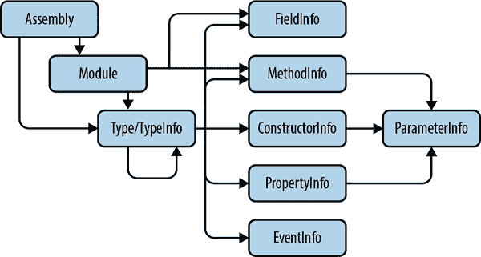
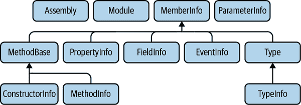

# 第十三章：反射

CLR 对我们程序定义和使用的类型了如指掌。它要求所有程序集提供详细的元数据，描述每个类型的每个成员，包括私有实现细节。它依赖于此信息来执行关键功能，如 JIT 编译和垃圾回收。然而，它不会将这些知识私藏起来。*反射* API 授予访问这些详细类型信息的权限，使得您的代码可以发现运行时能够看到的一切。此外，您还可以使用反射来实现一些事情。例如，代表方法的反射对象不仅描述方法的名称和签名，还允许您调用该方法。您甚至可以进一步，在运行时生成代码。

反射在可扩展框架中特别有用，因为它们可以使用它来根据代码结构在运行时调整其行为。例如，Visual Studio 的属性面板使用反射来发现组件提供的公共属性，因此，如果您编写一个可以出现在设计表面上的组件（如 UI 元素），您无需采取任何特殊措施使其属性可供编辑——Visual Studio 将自动找到它们。

###### 注意

许多基于反射的框架可以自动发现它们需要了解的内容，同时允许组件显式地丰富这些信息。例如，尽管您无需采取任何特殊措施来支持在“属性”面板中进行编辑，但如果您希望，您可以自定义分类、描述和编辑机制。这通常通过*属性*来实现，它们是第十四章的主题。

# 反射类型

反射 API 定义了`System.Reflection`命名空间中的各种类。这些类具有与程序集和类型系统工作方式相对应的结构关系。例如，类型的包含程序集是其标识的一部分，因此代表类型的反射类（`Type`¹）具有一个`Assembly`属性，返回其包含的`Assembly`对象。而且您可以在这两个方向上导航这种关系——您可以从`Assembly`类的`DefinedTypes`属性中发现程序集中的所有类型。可以通过加载插件 DLL 来扩展的应用程序通常会使用这种方法来查找每个插件提供的类型。图 13-1 展示了与.NET 类型对应的反射类型、它们的成员以及包含它们的组件。箭头表示包含关系。（与程序集和类型一样，这些关系也都是可导航的。）



###### 图 13-1\. 反射包含层次

图 13-2 展示了这些类型的继承层次结构。其中还显示了几个额外的抽象类型，如`MemberInfo`和`MethodBase`，它们被各种反射类共享，这些类具有一定的共同点。例如，构造函数和方法都有参数列表，而检查这些内容的机制则由它们共享的基类`MethodBase`提供。类型的所有成员都具有某些共同的特征，比如可访问性，因此反射中表示类型成员的对象都是`MemberInfo`派生的。



###### 图 13-2\. 反射继承层次结构

## 程序集

`Assembly`类可可预测地表示单个程序集。如果你正在编写插件系统或其他需要加载用户提供的 DLL 并使用它们的框架（例如单元测试运行器），`Assembly`类型将是你的起点。正如第十二章所示，静态`Assembly.Load`方法接受一个程序集名称，并返回该程序集的对象。（如果必要，该方法将加载程序集，但如果已加载，则只返回相关`Assembly`对象的引用。）但还有其他获取此类对象的方式。

`Assembly`类定义了三个上下文相关的静态方法，每个方法都返回一个`Assembly`对象。`GetEntryAssembly`方法返回表示包含程序`Main`方法的 EXE 文件的对象。`GetExecutingAssembly`方法返回包含调用它的方法的程序集。`GetCallingAssembly`方法上溯堆栈一级，并返回调用调用`GetCallingAssembly`的方法的程序集。

###### 注意

JIT（即时编译器）的优化有时会在使用`GetExecutingAssembly`和`GetCallingAssembly`方法时产生意外的结果。方法内联和尾调用优化都可能导致这些方法返回比预期更深一层的堆栈帧的程序集。你可以通过为方法添加`MethodImpl​Attribute`并传递`MethodImpl​Options`枚举中的`NoInlining`标志来防止内联优化。（有关属性的描述，请参见第十四章。）目前没有明确的方法来禁用尾调用优化，但只有在特定方法调用是方法返回前的最后一件事时才会应用这些优化。

`GetCallingAssembly` 在诊断日志记录中很有用，因为它提供了调用你方法的代码的信息。`GetExecutingAssembly` 方法则不太有用：你可能已经知道代码将在哪个程序集中，因为你是编写代码的开发者。尽管如此，获取你正在编写的组件的 `Assembly` 对象可能仍然有用，但也有其他方法。下一节介绍的 `Type` 对象提供了一个 `Assembly` 属性。示例 13-1 使用这种方法通过包含类获取 `Assembly`。根据经验，这种方法似乎更快，这并不完全令人惊讶，因为它的工作量更少——这两种技术都需要检索反射对象，但其中一种还必须检查堆栈。

##### 示例 13-1\. 通过 `Type` 获得自己的 `Assembly`

```cs
class Program
{
    static void Main()
    {
        `Assembly` `me` `=` `typeof``(``Program``)``.``Assembly``;`
        Console.WriteLine(me.FullName);
    }
}
```

如果想从磁盘上的特定位置使用一个程序集，可以使用 第十二章 中描述的 `LoadFrom` 方法。或者，可以使用 `System​.Reflec⁠tion.MetadataLoadContext` NuGet 包的 `MetadataLoadContext` 类。这种方法加载程序集的方式使你可以检查其类型信息，但不会执行程序集中的任何代码，也不会自动加载它依赖的任何程序集。如果你正在编写一个工具来显示或处理关于组件的信息，但不想运行其代码，那么这是加载程序集的适当方式。有几个理由可以避免使用传统方式加载程序集来处理此类工具。加载程序集并检查其类型有时可能触发该程序集中的代码执行（如静态构造函数）。另外，如果仅用于反射目的加载程序集，则处理器架构并不重要，因此你可以将仅支持 32 位的 DLL 加载到 64 位进程中，或者在 x86 进程中检查 ARM-only 程序集。

从任何上述机制获取了一个 `Assembly` 后，可以发现它的各种信息。例如，`FullName` 属性提供显示名称。或者你可以调用 `GetName`，它返回一个 `AssemblyName` 对象，轻松地以编程方式访问程序集名称的所有组件。

要获取特定 `Assembly` 依赖的其他所有 `Assembly` 列表，可以调用 `GetReferencedAssemblies`。如果你在自己编写的程序集上调用此方法，它不一定会返回在 Visual Studio 解决方案资源管理器中“依赖项”节点中看到的所有程序集，因为 C# 编译器会剔除未使用的引用。

程序集包含类型，因此你可以通过调用 `Assembly` 对象的 `GetType` 方法找到表示这些类型的 `Type` 对象，传递你需要的类型的名称，包括其命名空间。如果未找到该类型，这将返回 `null`，除非你调用其中一个额外接受 `bool` 参数的重载版本 —— 使用这些，如果未找到类型，传递 `true` 将产生异常。还有一个重载版本，接受两个 `bool` 参数，其中第二个允许你传递 `true` 来请求大小写不敏感搜索。所有这些方法将返回 `public` 或 `internal` 类型。你还可以请求一个嵌套类型，通过指定包含类型的名称，然后是一个 `+` 符号，然后是嵌套类型名称。 Example 13-2 获取了一个名为 `Inside` 的类型的 `Type` 对象，该类型嵌套在命名空间为 `MyLib` 的类型 `ContainingType` 内部。即使嵌套类型是私有的，这也能正常工作。

##### 示例 13-2\. 从程序集获取嵌套类型

```cs
Type? nt = someAssembly.GetType("MyLib.ContainingType+Inside");
```

`Assembly` 类还提供了 `DefinedTypes` 属性，返回一个集合，包含程序集定义的每个类型（顶层或嵌套）的 `TypeInfo` 对象，以及 `ExportedTypes`，仅返回公共类型，它返回 `Type` 对象而不是完整的 `TypeInfo` 对象。（“Type 和 TypeInfo” 中描述了 `TypeInfo` 和 `Type` 的区别。）这也包括任何公共的嵌套类型。它不包括位于公共类型内部的 `protected` 类型，这也许有点令人惊讶，因为这些类型虽然只能被派生自包含类型的类访问，但却可以从程序集外部访问。

除了返回类型外，`Assembly` 还可以使用 `CreateInstance` 方法创建它们的新实例。如果你只传递类型的完全限定名称作为字符串，这将创建一个实例，前提是该类型是公共的并且具有无参数构造函数。还有一个重载版本，让你可以处理非公共类型和需要参数的构造函数的类型；但是，这个使用起来更加复杂，因为它还接受指定类型名称是否不区分大小写的参数，以及定义用于不区分大小写比较的 `CultureInfo` 对象的参数 —— 不同的国家对这种比较有不同的看法。它还有用于控制更高级场景的参数。然而，对于大多数情况，你可以传递 `null`，正如 Example 13-3 所示。

##### 示例 13-3\. 动态构造

```cs
object? o = asm.CreateInstance(
    "MyApp.WithConstructor",
    false,
    BindingFlags.Public | BindingFlags.Instance,
    null,
    new object[] { "Constructor argument" },
    null,
    null);
```

在 `asm` 引用的程序集中，创建一个名为 `WithConstructor` 的类型的实例，该类型位于 `MyApp` 命名空间中。`false` 参数指示我们要在名称上进行精确匹配，而不是不区分大小写的比较。`BindingFlags` 指示我们正在寻找公共实例构造函数。（参见侧边栏 “Bind⁠ing​Flags”。）第一个 `null` 参数是你可以传递 `Binder` 对象的位置，它允许你在提供的参数与所需参数的类型不完全匹配时自定义行为。通过省略此参数，我表明我希望我提供的参数完全匹配。（如果它们不匹配，我会得到一个异常。）`object[]` 参数包含我想要传递给构造函数的参数列表——在本例中是一个字符串。倒数第二个 `null` 是我将要传递的地方，如果我使用不区分大小写的比较或数字类型与字符串之间的自动转换，但由于我都不使用，我可以省略它。最后一个参数曾支持已被弃用的场景，因此应始终为 `null`。

## 模块

图 13-1 显示 `Assembly` 作为包含 `Module` 对象的容器。.NET Framework 支持将一个程序集的内容分割到多个文件（*模块*）中，但这个很少使用的特性在 .NET Core 或 .NET 中不被支持。在大多数情况下，你可以忽略 `Module` 类型——你通常可以使用反射 API 中的其他类型完成所有需要的操作。唯一的例外是，运行时生成代码的 API 需要你标识哪个模块应包含生成的代码，即使你只创建一个模块。（.NET 的运行时生成代码的 API 超出了本书的范围。）

`Module` 类提供另外一个服务：令人惊讶的是，它定义了 `GetField`、`GetFields`、`GetMethod` 和 `GetMethods` 属性。这些属性提供对全局作用域的方法和字段的访问。在 C# 中你从未见过这些，因为该语言要求所有字段和方法都必须在类型内定义，但 CLR 允许全局作用域的方法和字段存在，所以反射 API 必须能够呈现它们。这些通过 `Module` 暴露出来，而不是 `Assembly`，因此即使在现代 .NET 的每个程序集一个模块的世界中，你也只能通过 `Module` 类访问它们。你可以从 `Assembly` 对象的 `Modules` 属性中检索它们，或者你可以使用从 `MemberInfo` 派生的以下部分中描述的任何 API 类型。(图 13-2 显示了哪些类型这样做。) 这定义了一个 `Module` 属性，返回定义了相关成员的 `Module`。

## MemberInfo

像本节描述的所有类一样，`MemberInfo`是抽象的。但与其余类不同的是，它不对应类型系统中的一个特定功能。它是一个共享的基类，为所有表示可以成为其他类型成员的项目的类型提供通用功能。因此，它是`ConstructorInfo`、`MethodInfo`、`FieldInfo`、`PropertyInfo`、`EventInfo`和`Type`的基类，因为所有这些都可以成为其他类型的成员。实际上，在 C#中，除了`Type`，所有这些都*必须*是某些其他类型的成员（尽管，正如您刚刚在前一节中看到的，某些语言允许方法和字段被作用域到模块而不是类型）。

`MemberInfo`定义了所有类型成员都必须具有的常见属性。当然，有一个`Name`属性，还有一个`DeclaringType`属性，它引用项目所在类型的`Type`对象；对于非嵌套类型和模块范围的方法和字段，这将返回`null`。`MemberInfo`还定义了一个`Module`属性，它引用包含模块，无论所讨论的项目是模块范围的还是类型的成员。

除了`DeclaringType`之外，`MemberInfo`还定义了一个`ReflectedType`，表示从中检索`MemberInfo`的类型。这些通常是相同的，但在涉及继承时可能会不同。示例 13-4 显示了区别。

##### 示例 13-4\. `DeclaringType`与`ReflectedType`

```cs
class Base
{
    public void Foo()
    {
    }
}

class Derived : Base
{
}

class Program
{
    static void Main(string[] args)
    {
        MemberInfo bf = typeof(Base).GetMethod("Foo")!;
        MemberInfo df = typeof(Derived).GetMethod("Foo")!;

        Console.WriteLine("Base    Declaring: {0}, Reflected: {1}",
                          bf.DeclaringType, bf.ReflectedType);
        Console.WriteLine("Derived Declaring: {0}, Reflected: {1}",
                          df.DeclaringType, df.ReflectedType);
    }
}
```

获取`Base.Foo`和`Derived.Foo`方法的`MethodInfo`。（`MethodInfo`派生自`MemberInfo`。）这只是描述同一方法的不同方式—`Derived`没有定义自己的`Foo`，所以它继承了`Base`定义的方法。程序产生以下输出：

```cs
Base    Declaring: Base, Reflected: Base
Derived Declaring: Base, Reflected: Derived
```

通过`Base`类的`Type`对象检索`Foo`信息时，`DeclaringType`和`ReflectedType`都显然是`Base`。然而，当我们通过`Derived`类型检索`Foo`方法的信息时，`DeclaringType`告诉我们该方法由`Base`定义，而`ReflectedType`告诉我们我们通过`Derived`类型获取了此方法。

###### 警告

因为`MemberInfo`记住了您从哪种类型检索它，所以比较两个`MemberInfo`对象并不是检测它们是否引用相同事物的可靠方法。在示例 13-4 中使用`==`运算符或它们的`Equals`方法比较`bf`和`df`会返回`false`，尽管它们都引用`Base.Foo`。如果您不知道`ReflectedType`属性，您可能不会预期到这种行为。

令人稍感惊讶的是，`MemberInfo` 并不提供描述其可见性的任何信息。这可能看起来很奇怪，因为在 C# 中，所有对应于从 `MemberInfo` 派生的类型的构造函数、方法或属性的结构都可以加上 `public`、`private` 等修饰符。反射 API 确实提供了这些信息，但不是通过 `MemberInfo` 基类。这是因为 CLR 对某些成员类型的可见性处理方式与 C# 展示的方式略有不同。从 CLR 的角度来看，属性和事件并没有自己的访问性。相反，它们的访问性是在单个方法的级别上管理的。这使得属性的`get`和`set`可以具有不同的访问级别，事件的访问器也是如此。当然，如果我们希望的话，我们可以在 C# 中独立地控制属性访问器的访问级别。C# 误导我们的地方在于，它让我们为整个属性指定一个单一的访问级别。但这只是设置两个访问器为相同级别的一种简写。令人困惑的是，它让我们为属性指定访问级别，然后为其中一个成员指定不同的访问级别，就像示例 13-5 中那样。

##### 示例 13-5\. 属性访问器的访问性

```cs
public int Count
{
    get;
    private set;
}
```

这有点误导性，因为尽管看起来如此，`public` 访问性并不适用于整个属性。这个属性级别的访问性只是告诉编译器在未指定访问级别的访问器时该使用什么。C# 的第一个版本要求属性访问器都具有相同的访问级别，因此为整个属性指定访问级别是有道理的。（对于事件仍然有类似的限制。）但这是一个任意的限制——CLR 一直允许每个访问器具有不同的访问级别。现在的 C# 支持这一点，但由于历史原因，利用这一点的语法看起来是不对称的。从 CLR 的角度来看，示例 13-5 只是指定`get public`和`set private`。示例 13-6 可能更好地表示实际发生的情况。

##### 示例 13-6\. CLR 如何看待属性的访问性

```cs
// Won't compile but arguably should
int Count
{
    public get;
    private set;
}
```

但是我们不能这样写，因为 C# 要求更显眼的两个访问器之一的可访问性在属性级别声明。这样做使得当两个属性具有相同的可访问性时语法更简单，但当它们不同时会显得有些奇怪。此外，在 示例 13-5 中（即编译器实际支持的语法）看起来我们应该能够在三个地方指定可访问性：属性和两个访问器。CLR 不支持这样做，所以如果你试图为两个访问器指定可访问性，编译器会报错。因此，属性或事件本身没有可访问性。（想象一下如果有的话——如果一个属性具有 `public` 可访问性，但其 `get` 是 `internal`，而 `set` 是 `private`，那会是什么意思？）因此，并非从 `MemberInfo` 派生的所有内容都具有特定的可访问性，因此反射 API 提供了表示类层次结构中更深层次的可访问性的属性。

## 类型和 TypeInfo

`Type` 类表示特定的类型。它比本章中的任何其他类都更广泛使用，这就是为什么它单独位于 `System` 命名空间中，而其他类都定义在 `System.Reflection` 中的原因。它是最容易获取的，因为 C# 专门为此设计了一个操作符：`typeof`。我已经在几个示例中展示过了，但是 示例 13-7 单独展示了它。正如您所见，您可以使用内置名称，例如 `string`，或普通类型名称，例如 `IDisposable`。您还可以包括命名空间，但是当类型的命名空间在范围内时，这并不是必需的。

##### 示例 13-7\. 使用 `typeof` 获取 `Type`

```cs
Type stringType = typeof(string);
Type disposableType = typeof(IDisposable);
```

此外，正如我在 第六章 中提到的，`System.Object` 类型（或者在 C# 中我们通常写为 `object`）提供了一个 `GetType` 实例方法，不接受任何参数。您可以在任何引用类型变量上调用它，以检索该变量引用的对象的类型。这可能不会与变量本身的类型相同，因为变量可能引用派生类型的实例。您还可以在任何值类型变量上调用此方法，由于值类型不支持继承，它将始终返回变量静态类型的 `Type` 对象。

因此，您所需要的只是一个对象、一个值或一个类型标识符（例如 `string`），获取一个 `Type` 对象就非常简单。而且，`Type` 对象可以来自许多其他地方。

除了`Type`之外，我们还有`TypeInfo`。这在早期的.NET Core 版本中引入，旨在使`Type`仅作为轻量级标识符，并且`TypeInfo`作为反射类型的机制。这与.NET Framework 中`Type`一直以来的工作方式不同，后者同时扮演着这两个角色。这种双重角色可以说是一个错误，因为如果你只需要一个标识符，那么`Type`就显得不必要地笨重。最初，.NET Core 被构想为与.NET Framework 有着完全独立的存在，不需要严格的兼容性，因此看似提供了修复历史设计问题的机会。然而，一旦微软决定.NET Core 将成为所有未来版本的.NET 的基础，就有必要将其重新调整为.NET Framework 一直工作的方式。然而，到了这个时候，.NET Framework 也引入了`TypeInfo`，一段时间内，新的类型级别反射功能被添加到其中，而不是`Type`，以最小化与.NET Core 1 的不兼容性。.NET Core 2.0 重新与.NET Framework 对齐，但这意味着`Type`和`TypeInfo`之间的功能拆分现在只是添加时的结果。`TypeInfo`包含在其引入和决定恢复旧方式之间的短暂时期内添加的成员。在你有一个`Type`但你需要使用特定于`TypeInfo`的功能的情况下，你可以通过调用`GetTypeInfo`从一个`Type`获取它。

正如你已经看到的，你可以从一个`Assembly`中检索`Type`对象，无论是按名称还是作为一个全面的列表。派生自`MemberInfo`的反射类型也通过`DeclaringType`提供了对其包含类型的引用。（`Type`派生自`MemberInfo`，因此当处理嵌套类型时，这个属性也是相关的。）

你还可以调用`Type`类自己的静态`GetType`方法。如果你只传递了一个命名空间限定的字符串，它将在名为`mscorlib`的系统程序集中搜索命名的类型，并且还会在你调用该方法的程序集中搜索。然而，你可以传递一个*程序集限定名称*，它结合了程序集名称和类型名称。这种形式的名称以命名空间限定的类型名称开头，后跟逗号和程序集名称。例如，这是.NET Framework 4.8 中`System.String`类的程序集限定名称（分成两行以适应本书）：

```cs
System.String, mscorlib, Version=4.0.0.0, Culture=neutral,
 PublicKeyToken=b77a5c561934e089
```

你可以通过`Type.Assembly​Quali⁠fiedName`属性发现类型的程序集限定名称。请注意，这不总是与您要求的相匹配。如果你将前述类型名称传递给.NET 6.0 中的`Type.GetType`，它将起作用，但如果你然后询问返回的`Type`其`AssemblyQualifiedName`，它将返回这个而不是：

```cs
System.String, System.Private.CoreLib, Version=6.0.0.0, Culture=neutral,
 PublicKeyToken=7cec85d7bea7798e
```

当您传递第一个字符串或只传递`System.String`时仍然有效，这是因为`mscorlib`仍然存在以支持向后兼容性。我在前一章节中描述了这一点，但总结起来，在.NET Framework 中，`mscorlib`程序集包含运行时库的核心类型，但在.NET Core 和.NET 5.0 或更高版本中，代码已经迁移到其他位置。`mscorlib`仍然存在，但它只包含类型转发条目，指示每个类现在位于哪个程序集中。例如，它将`System.String`转发到其新位置，即在撰写本文时位于`System.Private.CoreLib`程序集中。

除了标准的`MemberInfo`属性（例如`Module`和`Name`）之外，`Type`和`TypeInfo`类还添加了各种自己的属性。继承的`Name`属性包含未经修饰的名称，因此`Type`添加了一个`Namespace`属性。所有类型都作用于一个程序集，因此`Type`定义了一个`Assembly`属性。（当然，您可以通过`Module.Assembly`获取它，但使用`Assembly`属性更为方便。）它还定义了一个`BaseType`属性，尽管对于某些类型（例如非派生接口和`System.Object`类的类型对象），该属性将为`null`。

由于`Type`可以表示各种类型，因此有一些属性可以用来确定确切的类型：`IsArray`、`IsClass`、`IsEnum`、`IsInterface`、`IsPointer`和`IsValueType`。（在互操作场景中，您还可以获取非.NET 类型的`Type`对象，因此还有一个`IsCOMObject`属性。）如果它表示一个类，有一些属性可以告诉您更多关于您所拥有的类的信息：`IsAbstract`、`IsSealed`和`IsNested`。最后一个属性不仅适用于类，还适用于值类型。

`Type` 还定义了许多属性，提供关于类型可见性的信息。对于非嵌套类型，`IsPublic`告诉您它是`public`还是`internal`，但对于嵌套类型，情况更为复杂。`IsNestedAssembly`表示内部嵌套类型，而`IsNestedPublic`和`IsNestedPrivate`表示`public`和`private`的嵌套类型。CLR 不使用传统的 C 家族`protected`术语，而是使用*family*术语，因此我们有`IsNestedFamily`代表`protected`，`IsNestedFamOR​As⁠sem`代表`protected internal`，以及`IsNestedFamANDAssem`代表`protected private`。

###### 注意

没有`IsRecord`属性。在运行时看来，记录类型是类或结构。记录是 C#类型系统的一个特性，但不是.NET 运行时类型系统（CTS）的一部分。反射是运行时特性，因此它呈现了 CTS 的视角。

`TypeInfo`类还提供了一些方法来发现相关的反射对象。（本段中的属性都是在`TypeInfo`上定义的，而不是`Type`。如前所述，这只是定义时间的偶然。）这些大多数方法都有两种形式：一种是您需要指定特定类型所有项目的完整列表，另一种是您已知要查找的项目名称。例如，我们有`DeclaredConstructors`、`DeclaredEvents`、`DeclaredFields`、`DeclaredMethods`、`DeclaredNestedTypes`和`DeclaredProperties`及其对应的`GetDeclaredConstructor`、`GetDeclaredEvent`、`GetDeclaredField`、`GetDeclaredMethod`、`GetDeclaredNestedType`和`GetDeclaredProperty`。

`Type`类允许您发现类型兼容性关系。您可以通过调用类型的`IsSubclassOf`方法来询问一个类型是否派生自另一个类型。继承不是一个类型可能与不同类型的引用兼容的唯一原因——一个类型为接口的变量可以引用任何实现该接口的类型的实例，而不管其基类是什么。因此，`Type`类还提供了一个更通用的方法，称为`IsAssignableFrom`，如 Example 13-8 所示，它告诉您是否存在隐式引用转换。

##### Example 13-8\. 测试类型兼容性

```cs
Type stringType = typeof(string);
Type objectType = typeof(object);
Console.WriteLine(stringType.IsAssignableFrom(objectType));
Console.WriteLine(objectType.IsAssignableFrom(stringType));
```

这显示`False`，然后是`True`，因为您无法将类型为`object`的实例的引用赋给类型为`string`的变量，但您可以将类型为`string`的实例的引用赋给类型为`object`的变量。

除了告诉您有关类型及其与其他类型的关系的信息之外，`Type`类还提供了在运行时使用类型成员的能力。它定义了一个`InvokeMember`方法，其确切含义取决于您调用的成员类型——例如，它可以意味着调用方法，或者获取或设置属性或字段。由于某些成员类型支持多种调用方式（例如获取和设置），您需要指定您想要的特定操作。Example 13-9 使用`InvokeMember`来调用由其名称（`member`字符串参数）标识的方法，该方法在动态实例化的类型实例上。这说明了反射如何用于处理在运行时才知道其标识的类型和成员。

##### Example 13-9\. 使用`InvokeMember`调用方法

```cs
public static object? CreateAndInvokeMethod(
  string typeName, string member, params object[] args)
{
    Type t = Type.GetType(typeName)
        ?? throw new ArgumentException(
            $"Type {typeName} not found", nameof(typeName));
    object instance = Activator.CreateInstance(t)!;
    return t.InvokeMember(
      member,
      BindingFlags.Instance | BindingFlags.Public | BindingFlags.InvokeMethod,
      null,
      instance,
      args);
}
```

这个示例首先创建了指定类型的一个实例，这里采用了与我之前展示的`Assembly.CreateInstance`稍有不同的动态创建方法。这里我使用`Type.GetType`来查找类型，然后使用了一个我之前未提及的类`Activator`。这个类的作用是在运行时创建具有已确定类型的新对象实例。它的功能在某种程度上与`Assembly.CreateInstance`有重叠，但在这种情况下，这是从`Type`到该类型的新实例的最便捷方式。然后我使用了`Type`对象的`InvokeMember`来调用指定的方法。与示例 13-3 一样，我不得不指定绑定标志以指示我要查找的成员的类型，以及如何处理它们——这里我要调用一个方法（而不是设置属性值）。`null`参数就像示例 13-3 一样，如果我想支持方法参数类型的自动强制转换，我会在这里指定一个`Binder`。

### 泛型类型

.NET 对泛型的支持使得`Type`类的角色变得更加复杂。除了表示普通的非泛型类型外，`Type`还可以表示泛型类型的特定实例（例如，`List<int>`），还可以表示未绑定的泛型类型（例如，`List<>`，尽管在除了一个非常特定的场景外，这是一个非法的类型标识符）。示例 13-10 展示了如何获取这两种类型的`Type`对象。

##### 示例 13-10\. 泛型类型的`Type`对象

```cs
Type bound = typeof(List<int>);
Type unbound = typeof(List<>);
```

`typeof`运算符是在 C# 中唯一可以使用未绑定泛型类型标识符的地方——在所有其他上下文中，如果不提供类型参数，这将是一个错误。顺便说一下，如果类型有多个类型参数，你必须提供逗号，例如，`typeof(Dictionary<,>)`。这是为了避免当有多个同名泛型类型，只有类型参数数量（也称为*泛型的度*）不同时的歧义——例如，`typeof(Func<,>)`与`typeof(Func<,,,>)`。你不能指定部分绑定的泛型类型。例如，`typeof(Dictionary<string,>)`将无法编译通过。

你可以通过`IsGenericType`属性来判断一个`Type`对象是否引用一个泛型类型——对于来自示例 13-10 的`bound`和`unbound`，该属性都将返回`true`。你还可以通过`IsGenericTypeDefinition`属性来确定是否提供了类型参数，对于`bound`和`unbound`，它分别返回`false`和`true`。如果你有一个已绑定的泛型类型，并且想获取其构造的未绑定类型，你可以使用`GetGenericType​Defini⁠tion`方法——在`bound`上调用该方法将返回与`unbound`引用的相同类型对象。

给定一个 `Type` 对象，其 `IsGenericTypeDefinition` 属性返回 `true`，你可以通过调用 `MakeGenericType` 方法构造该类型的新的绑定版本，传递一个 `Type` 对象的数组，每个类型参数一个。

如果你有一个泛型类型，可以从 `GenericTypeArguments` 属性中检索其类型参数。或许令人惊讶的是，即使对于未绑定的类型，这也适用，尽管其行为与绑定类型不同。如果你从 示例 13-10 的 `bound` 获取 `GenericTypeArguments`，它将返回一个包含单个 `Type` 对象的数组，该对象与 `typeof(int)` 返回的对象相同。如果你从 `unbound.GenericTypeArguments` 获取，你将得到一个包含单个 `Type` 对象的数组，但这次它将是一个不代表特定类型的 `Type` 对象 —— 其 `IsGenericParameter` 属性将为 `true`，表明这代表一个占位符。在这种情况下，其名称将是 `T`。一般来说，名称将对应于泛型类型选择的任何占位符名称。例如，使用 `typeof(Dictionary<,>)`，你将分别得到两个名为 `TKey` 和 `TValue` 的 `Type` 对象。如果你使用反射 API 查找泛型类型的成员，你将遇到类似的泛型参数占位符类型。例如，如果你检索未绑定的 `List<>` 类型的 `Add` 方法的 `MethodInfo`，你将发现它接受一个名为 `T` 的类型参数，其 `IsGenericParameter` 属性返回 `true`。

当一个 `Type` 对象表示一个未绑定的泛型参数时，你可以通过其 `GenericParameterAttributes` 方法了解该参数是协变的、逆变的（或两者都不是）。

## MethodBase, ConstructorInfo, and MethodInfo

构造函数和方法在很多方面都有很大的共同之处。这两种成员都具有相同的可访问性选项，它们都有参数列表，并且它们都可以包含代码。因此，`MethodInfo` 和 `ConstructorInfo` 反射类型共享一个基类，即 `MethodBase`，该类定义了处理这些共同方面的属性和方法。

要获取 `MethodInfo` 或 `ConstructorInfo`，除了使用我之前提到的 `Type` 类属性之外，还可以调用 `MethodBase` 类的静态 `GetCurrentMethod` 方法。这将检查调用代码，看它是构造函数还是普通方法，并相应地返回 `MethodInfo` 或 `ConstructorInfo`。

除了从 `MemberInfo` 继承的成员之外，`MethodBase` 还定义了指定成员可访问性的属性。这些与我之前为类型描述的概念类似，但名称略有不同，因为与 `Type` 不同，`MethodBase` 并未定义区分嵌套和非嵌套成员的可访问性属性。因此，对于 `public`、`private`、`internal`、`protected`、`protected internal` 和 `protected private`，在 `MethodBase` 中我们找到了 `IsPublic`、`IsPrivate`、`IsAssembly`、`IsFamily`、`IsFamilyOrAssembly` 和 `IsFamilyAndAssembly`。

除了与可访问性相关的属性之外，`MethodBase` 还定义了一些属性，用于告知方法的各个方面，例如 `IsStatic`、`IsAbstract`、`IsVirtual`、`IsFinal` 和 `IsConstructor`。

还有处理泛型方法的属性。`IsGenericMethod` 和 `IsGenericMethodDefinition` 是方法级别的等价物，对应于类型级别的 `IsGenericType` 和 `IsGenericTypeDefinition` 属性。与 `Type` 类似，有一个 `GetGenericMethodDefinition` 方法用于从绑定的泛型方法获取未绑定的泛型方法，以及一个 `MakeGenericMethod` 方法用于从未绑定的泛型方法生成绑定的泛型方法。您可以通过调用 `GetGenericArguments` 获取类型参数，并且与泛型类型一样，当在绑定方法上调用时，它将返回具体类型；而在未绑定方法上调用时，则返回占位符类型。

您可以通过调用 `GetMethodBody` 检查方法的实现。这将返回一个 `MethodBody` 对象，该对象提供对 IL（作为字节数组）以及方法使用的局部变量定义的访问权限。

`MethodInfo` 类从 `MethodBase` 派生，仅表示方法（而不是构造函数）。它添加了一个 `ReturnType` 属性，该属性提供一个 `Type` 对象，指示方法的返回类型。（有一个特殊的系统类型 `System.Void`，其 `Type` 对象在方法返回空时使用。）

`ConstructorInfo` 类并未添加任何除了从 `MethodBase` 继承的属性以外的属性。但它确实定义了两个只读的静态字段：`ConstructorName` 和 `TypeConstructorName`。它们分别包含字符串 `".ctor"` 和 `".cctor"`，这些是在 `ConstructorInfo` 对象的 `Name` 属性中找到的值，用于实例和静态构造函数。就 CLR 而言，这些是真实的名称——尽管在 C#中构造函数看起来与其包含的类型同名，但这只在您的 C#源文件中成立，在运行时则不是。

您可以通过调用 `Invoke` 方法来调用由 `MethodInfo` 或 `ConstructorInfo` 表示的方法或构造函数。这与 `Type.InvokeMember` 做相同的事情——示例 13-9 使用它来调用方法。但是，因为 `Invoke` 专门用于处理方法和构造函数，因此使用起来更简单。对于 `ConstructorInfo`，您只需传递一个参数数组。对于 `MethodInfo`，您还需要传递要调用方法的对象，或者如果要调用静态方法，则为 `null`。示例 13-11 执行与 示例 13-9 相同的任务，但使用 `MethodInfo`。

##### 示例 13-11\. 调用方法

```cs
public static object? CreateAndInvokeMethod(
  string typeName, string member, params object[] args)
{
    Type t = Type.GetType(typeName)
        ?? throw new ArgumentException(
            $"Type {typeName} not found", nameof(typeName));
    object instance = Activator.CreateInstance(t)!;
    `MethodInfo` `m` `=` `t``.``GetMethod``(``member``)`
        ?? throw new ArgumentException(
            $"Method {member} not found", nameof(member));
    `return` `m``.``Invoke``(``instance``,` `args``)``;`
}
```

对于方法或构造函数，您可以调用 `GetParameters` 方法，该方法返回表示方法参数的 `ParameterInfo` 对象数组。

## `ParameterInfo`

`ParameterInfo` 类表示方法或构造函数的参数。其 `ParameterType` 和 `Name` 属性提供了查看方法签名时的基本信息。它还定义了一个 `Member` 属性，该属性指回该参数所属的方法或构造函数。`HasDefaultValue` 属性将告诉您参数是否是可选的；如果是，`DefaultValue` 将提供在省略参数时使用的值。

如果您正在处理由非绑定泛型类型定义的成员，或者使用非绑定泛型方法，请注意 `ParameterInfo` 的 `ParameterType` 可能指的是泛型类型参数，而不是真实类型。这也适用于反射对象的 `Type` 对象，描述了接下来三个部分中所述的对象。

## `FieldInfo`

`FieldInfo` 表示类型中的一个字段。通常使用 `Type` 对象的 `GetField` 或 `GetFields` 方法获取它，或者如果您使用的是支持全局字段的语言编写的代码，可以从包含的 `Module` 中检索这些字段。

`FieldInfo` 定义了一组表示可访问性的属性。这些属性看起来与 `MethodBase` 定义的属性非常相似。此外，还有 `FieldType` 属性，表示字段可以包含的类型。 （正如在非绑定泛型类型中所属成员一样，这可能是指类型参数而不是特定类型。）还有一些属性提供有关字段的进一步信息，包括 `IsStatic`、`IsInitOnly` 和 `IsLiteral`。这些属性分别对应于 C# 中的 `static`、`readonly` 和 `const`。 （表示枚举类型中的值的字段也将从 `IsLiteral` 返回 `true`。）

`FieldInfo` 定义了 `GetValue` 和 `SetValue` 方法，让您可以读取和写入字段的值。这些方法接受一个参数，指定要使用的实例，或者如果字段是静态的，则为 `null`。与 `MethodBase` 类的 `Invoke` 方法一样，这些方法并不会执行 `Type` 类的 `InvokeMember` 所不能做的事情，但通常更为方便。

## `PropertyInfo`

`PropertyInfo`类型表示一个属性。可以通过包含的`Type`对象的`GetProperty`或`GetProperties`方法获取这些属性。如前所述，`PropertyInfo`不定义任何可访问性属性，因为可访问性是在单独的获取和设置方法级别确定的。可以使用`GetGetMethod`和`GetSetMethod`方法获取这些方法，这两者都返回`MethodInfo`对象。

就像`FieldInfo`一样，`PropertyInfo`类定义了`GetValue`和`SetValue`方法，用于读取和写入值。属性允许带参数——例如，C#索引器就是带参数的属性。因此，有多个接受参数数组的`GetValue`和`SetValue`的重载方法。此外，还有一个`GetIndexParameters`方法，返回一个`ParameterInfo`对象数组，表示使用属性所需的参数。通过`PropertyType`属性可以获取属性的类型。

## EventInfo

事件由`EventInfo`对象表示，这些对象由`Type`类的`GetEvent`和`GetEvents`方法返回。与`PropertyInfo`类似，这些对象没有可访问性属性，因为事件的添加和移除方法分别定义了它们自己的可访问性。可以使用`GetAddMethod`和`GetRemoveMethod`获取这些方法，这两者都返回`MethodInfo`。`EventInfo`定义了一个`EventHandlerType`，返回事件处理程序需要提供的委托类型。

可以通过调用`AddEventHandler`和`Remove​EventHandler`方法附加和移除处理程序。与所有其他动态调用一样，这些方法只是`Type`类的`InvokeMember`方法的更便捷的替代品。

# 反射上下文

.NET 拥有一种称为*反射上下文*的功能。这些使得反射能够提供类型系统的虚拟化视图。通过编写自定义反射上下文，您可以修改类型的外观——可以使类型看起来具有额外的属性，或者可以增加成员和参数似乎提供的属性集。（第十四章将描述属性。）

反射上下文非常有用，因为它们使得可能编写基于反射驱动的框架，使得各个类型可以自定义它们的处理方式，而不需要强制每个类型提供显式支持。在.NET 4.5 之前，这是通过各种临时系统处理的。例如，考虑 Visual Studio 中的属性面板。这可以自动显示任何.NET 对象定义的公共属性，这些对象最终出现在设计表面（例如，您编写的任何 UI 组件）。即使对于不提供任何显式处理的组件，自动编辑支持也非常好，但组件应有机会在设计时自定义其行为。

因为属性面板早于.NET 4.5，它使用了一种临时解决方案之一：`TypeDescriptor`类。这是反射的一个封装，允许任何类通过实现`ICustomTypeDescriptor`来增强其设计时行为，使类能够定制其用于编辑的属性集，并控制它们的展示方式，甚至提供自定义的编辑 UI。这种方法灵活，但它的缺点是将设计时代码与运行时代码耦合在一起——使用这种模型的组件不能轻易地在没有提供设计时代码的情况下进行发布。因此，Visual Studio 引入了自己的虚拟化机制来分离这两者。

为了避免每个框架都定义自己的虚拟化系统，自定义的反射上下文直接将虚拟化功能添加到反射 API 中。如果您想编写能够使用反射提供的类型信息但也支持设计时增强或修改该信息的代码，现在不再需要使用某种包装层。您可以使用本章前面描述的通常的反射类型，但现在可以要求反射为您提供这些类型的不同实现，提供不同的虚拟化视图。

你可以通过编写自定义的反射上下文来实现这一点，描述你希望如何修改反射提供的视图。示例 13-12 展示了一个特别无聊的类型，随后是一个自定义的反射上下文，使该类型看起来像有一个属性。

##### 示例 13-12\. 一个简单类型，通过反射上下文增强

```cs
class NotVeryInteresting
{
}

class MyReflectionContext : CustomReflectionContext
{
    protected override IEnumerable<PropertyInfo> AddProperties(Type type)
    {
        if (type == typeof(NotVeryInteresting))
        {
            var fakeProp = CreateProperty(
                MapType(typeof(string).GetTypeInfo()),
                "FakeProperty",
                o => "FakeValue",
                (o, v) => Console.WriteLine($"Setting value: {v}"));

            return new[] { fakeProp };
        }
        else
        {
            return base.AddProperties(type);
        }
    }
}
```

直接使用反射 API 的代码将直接看到`NotVeryInteresting`类型，它没有任何属性。然而，我们可以通过`MyReflectionContext`映射该类型，就像示例 13-13 所示的那样。

##### 示例 13-13\. 使用自定义的反射上下文

```cs
var ctx = new MyReflectionContext();
TypeInfo mappedType = ctx.MapType(typeof(NotVeryInteresting).GetTypeInfo());

foreach (PropertyInfo prop in mappedType.DeclaredProperties)
{
    Console.WriteLine($"{prop.Name} ({prop.PropertyType.Name})");
}
```

变量`mappedType`保存了映射后的类型的引用。它看起来仍然像是普通的反射`TypeInfo`对象，我们可以通过`DeclaredProperties`以通常的方式迭代其属性，但因为我们通过自定义的反射上下文映射了类型，所以看到的是修改后的版本。这段代码的输出将显示该类型似乎定义了一个名为`FakeProperty`的`string`类型属性。

# 概要

反射 API 使得能够编写其行为基于其所处理的类型结构的代码成为可能。这可能涉及根据对象提供的属性来决定在 UI 网格中显示哪些值，或者根据特定类型选择定义的成员来修改框架的行为。例如，ASP.NET Core Web 框架的部分将检测您的代码是否使用同步或异步编程技术，并相应地进行调整。这些技术需要能够在运行时检查代码，这正是反射所实现的。类型系统所需程序集中的所有信息都可以通过我们的代码访问。此外，通过编写自定义反射上下文，可以通过虚拟视图呈现这些信息，从而使得定制反射驱动代码的行为成为可能。

代码检查类型结构以驱动其行为的需要通常需要额外的信息。例如，`System.Text.Json` 命名空间包含在第十五章中描述的类型，可以在 .NET 对象和 JSON 文档之间进行转换。这些依赖于反射，但是通过在*属性*形式中提供额外信息，你可以更精确地控制其目的。这些将是下一章的主题。

¹ 基于后面讨论的历史原因，部分功能的子集在名为 `TypeInfo` 的派生类型中。但是基类 `Type` 类是你经常遇到的类型。
