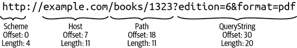
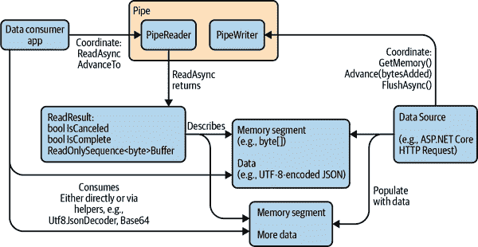

# 第十八章。内存效率

正如第七章所述，CLR 能够通过其垃圾收集器（GC）执行自动内存管理。这样做是有代价的：当 CPU 在进行垃圾收集时，就停止了它更有生产力的工作。在笔记本电脑和手机上，GC 工作会耗尽电池的电量。在云计算环境中，您可能根据消耗支付 CPU 时间，因此 CPU 额外工作直接对应增加的成本。更微妙的是，在具有多个核心的计算机上，如果 GC 花费太多时间，可能会显著降低吞吐量，因为许多核心可能会因为等待 GC 完成而被阻塞。

在许多情况下，这些影响可能不会造成明显问题。然而，当某些类型的程序承受重载时，GC 成本可能主导整体执行时间。特别是，如果您编写的代码执行相对简单但高度重复的处理，GC 开销可能会对吞吐量产生重大影响。

举个例子，微软早期版本的 ASP.NET Core Web 服务器框架经常因为 GC 开销而遇到硬性限制。为了让.NET 应用程序突破这些障碍，C#引入了各种功能，可以大幅减少分配数量。分配减少意味着 GC 需要回收的内存块减少，因此直接转化为较低的 GC 开销。当 ASP.NET Core 首次大量使用这些功能时，性能在各方面都有所提升，但对于最简单的性能基准测试，即*明文*（TechEmpower Web 性能测试套件的一部分），此版本的请求处理速率提高了超过 25%。

在某些专业场景中，差异可能更加显著。例如，2019 年，我参与了一个项目，该项目处理宽带提供商网络设备的诊断信息（以 RADIUS 数据包形式）。采用本章描述的技术，我们系统中单个 CPU 核心处理消息的速率从约 300,000 个/秒提高到约 7,000,000 个/秒。

当然，这是有代价的：这些高效的 GC 技术会显著增加你的代码复杂性。而且收益并不总是那么大——尽管第一个能够使用这些特性的 ASP.NET Core 版本在所有基准测试中都比上一个版本有所改进，但只有最简单的显示出了 25%的提升，大多数只有较为适度的改进。实际的改进将取决于你的工作负载的特性，对于一些应用程序，你可能会发现应用这些技术并没有带来可测量的改进。因此，在你考虑使用它们之前，你应该使用性能监控工具来找出你的代码在 GC 中花费了多少时间。如果只有几个百分点，那么你可能无法实现数量级的改进。但是，如果测试表明有显著改进的空间，下一步就是询问这一章中的技术是否有助于改进。因此，让我们首先探讨这些新技术如何帮助你减少 GC 开销。

# （不要）复制那个

减少 GC 开销的方法是在堆上分配更少的内存。而最重要的减少分配技术是避免复制数据。例如，考虑 URL *http://example.com/books/1323?edition=6&format=pdf*。这里有几个感兴趣的元素，比如协议（`http`）、主机名（`example.com`）或查询字符串。后者有其自己的结构：它是一系列名称/值对。在.NET 中处理 URL 的明显方法是使用`System.Uri`类型，如示例 18-1 所示。

##### 示例 18-1\. 解构 URL

```cs
var uri = new Uri("http://example.com/books/1323?edition=6&format=pdf");
Console.WriteLine(uri.Scheme);
Console.WriteLine(uri.Host);
Console.WriteLine(uri.AbsolutePath);
Console.WriteLine(uri.Query);
```

它会生成以下输出：

```cs
http
example.com
/books/1323
?edition=6&format=pdf
```

这很方便，但通过获取这四个属性的值，我们不得不让`Uri`除了原始的字符串外，还提供了四个`string`对象。你可以想象一个聪明的`Uri`实现，识别某些标准的`Scheme`值，比如`http`，并且总是返回相同的字符串实例，而不是分配新的实例，但对于所有其他部分来说，它很可能必须在堆上分配新的字符串。

还有另一种方法。与其为每个部分创建新的`string`对象，我们可以利用这样一个事实，即我们想要的所有信息已经包含在包含整个 URL 的字符串中。没有必要将每个部分复制到新的字符串中，我们可以仅仅跟踪字符串中相关部分的位置和长度。我们不再需要为每个部分创建一个字符串，而只需两个数字。并且由于我们可以使用值类型表示数字（例如`int`或对于非常长的字符串，`long`），除了包含完整 URL 的单个字符串外，我们不需要在堆上再创建额外的对象。例如，协议（`http`）位于位置 0，并且长度为 4。图 18-1 显示了每个元素在字符串中的偏移和位置。



###### 图 18-1\. URL 子字符串

这种方法是有效的，但我们已经可以看到通过这种方式工作的第一个问题：它有些笨拙。与使用一个方便的 `string` 对象来表示 `Host` 不同，后者在调试器中易于理解和检查，我们现在有一对数字，作为开发人员，我们现在必须记住它们指向的哪个字符串。这并不是什么高深的科学，但它使我们稍微难以理解我们的代码，并且更容易引入错误。但有一个回报：与五个字符串（原始 URL 和四个属性）相比，我们只有一个字符串。如果您正在尝试每秒处理数百万事件，这可能很容易值得付出这种努力。

显然，这种技术也适用于更细粒度的结构。偏移量和位置 `(25, 4)` 定位了这个 URL 中的文本 `1323`。我们可能希望将其解析为一个 `int`。但在这一点上，我们遇到了这种工作方式的第二个问题：在 .NET 库中并不广泛支持这种方式。将文本解析为 `int` 的常规方式是使用 `int` 类型的静态 `Parse` 或 `TryParse` 方法。不幸的是，这些方法不提供接受字符串中位置或偏移量的重载。它们要求字符串仅包含要解析的数字。这意味着你最终会编写类似于 Example 18-2 的代码。

##### Example 18-2\. 使用 `Substring` 打破了这个练习的初衷

```cs
string uriString = "http://example.com/books/1323?edition=6&format=pdf";
int id = int.Parse(uriString.Substring(25, 4));
```

这种方法是有效的，但通过使用 `Substring` 从我们的 (偏移量，长度) 表示回到 `int.Parse` 需要的普通 `string`，我们分配了一个新的 `string`。这个练习的整个目的是减少分配，所以这看起来并不像是进步。一个解决方案可能是微软要检查整个 .NET API 表面，添加接受偏移量和长度参数的重载，无论我们想在其他中间部分工作的情况是什么（例如子字符串，就像这个例子中一样，或者可能是数组的子范围）。事实上，已经有这样的例子了：用于处理字节流的 `Stream` API 具有各种方法，这些方法接受一个 `byte[]` 数组，还有偏移量和长度参数，以确切地指示您要处理的数组的哪一部分。

然而，这种技术还有一个问题：它对数据所在的容器类型不够灵活。微软可以为 `int.Parse` 添加一个重载，接受一个 `string`、一个偏移量和一个长度，但它只能解析 `string` 内的数据。如果数据恰好在 `char[]` 中呢？在这种情况下，你必须先将其转换为 `string`，到那时我们又回到了额外的分配上。或者说，所有想支持这种方法的 API 都需要多个重载来支持所有人可能想使用的容器，每个容器可能需要不同的基本方法实现。

更微妙的是，如果你目前的数据存储在 CLR 堆之外的内存中呢？当涉及到通过网络接受请求的服务器性能时，这尤其重要（例如，Web 服务器）。有时无法安排网络卡接收到的数据直接传送到 .NET 的堆内存中。另外，一些进程间通信的形式涉及安排操作系统将特定区域的内存映射到两个不同进程的地址空间中。.NET 堆是进程本地的，不能使用这样的内存。

C# 一直支持通过 *unsafe code* 使用外部内存，这支持类似于 C 和 C++ 语言中的指针的原始未管理指针。然而，这些指针存在一些问题。首先，它们会在我们可以就地解析数据的世界中，增加另一项所有重载都需要支持的条目。其次，使用指针的代码不能通过 .NET 的类型安全验证规则。这意味着可能会产生某些在 C# 中通常不可能的编程错误。这也可能意味着在某些情况下代码将不被允许运行，因为失去类型安全将使未安全代码绕过某些安全约束。

总结起来，通过使用偏移量和长度以及对包含字符串或数组的引用或对内存的未管理指针，始终可以在 .NET 中减少分配和复制，但在这些方面还有相当大的改进空间：

+   便利性

+   .NET API 的广泛支持

+   对以下内容的统一、安全处理：

    +   字符串

    +   数组

    +   未管理内存

.NET 提供了一个类型，解决了这三点问题：`Span<T>`。 (请参见下一侧边栏，“跨语言和运行时版本的支持”，了解本章描述的特性与 C# 语言和 .NET 运行时版本之间的关系。)

# 使用 Span<T> 表示顺序元素

`System.Span<T>` 值类型表示内存中连续存储的类型为 `T` 的元素序列。这些元素可以存在于数组、字符串、在堆栈帧中分配的托管内存块或非托管内存中。让我们看看 `Span<T>` 如何处理前一节中列出的每个要求。

`Span<T>` 封装了三件事：指向包含内存的指针或引用（例如 `string` 或数组）、数据在该内存中的位置和其长度。¹ 要访问 span 的内容，您使用它的方式几乎与数组相同，正如示例 18-3 所示。这使得它比定义几个 `int` 变量并记住它们所引用的内容等临时技术更加方便使用。

##### 示例 18-3\. 迭代 `Span<int>`

```cs
static int SumSpan(ReadOnlySpan<int> span)
{
    int sum = 0;
    for (int i = 0; i < span.Length; ++i)
    {
        sum += span[i];
    }
    return sum;
}
```

由于 `Span<T>` 知道自己的长度，其索引器检查索引是否在范围内，就像内置数组类型一样。如果你运行在 .NET Core 或 .NET 上，性能与使用内置数组非常相似。这包括检测某些循环模式的优化，例如 CLR 将识别前面的代码作为遍历整个内容的循环，从而生成在每次循环时不需要检查索引是否在范围内的代码。在某些情况下，它甚至能够生成使用某些 CPU 提供的矢量指令加速循环的代码。（在 .NET Framework 上，`Span<T>` 比数组稍慢一些，因为它的 CLR 不包括 .NET Core 中支持 `Span<T>` 添加的优化。）

您可能已经注意到示例 18-3 中的方法接受 `ReadOnlySpan<T>`。这是 `Span<T>` 的近亲，并且有一个隐式转换，使您可以将任何 `Span<T>` 传递给接受 `ReadOnlySpan<T>` 的方法。只读形式清楚地声明方法只会从 span 中读取，而不会写入它。（这是通过只读形式的索引器只提供 `get` 访问器而不提供 `set` 来强制执行的。）

###### 提示

每当你编写一个处理 span 但不意味着修改它的方法时，应使用`ReadOnlySpan<T>`。

支持的各种容器到 `Span<T>`（以及到 `ReadOnlySpan<T>`）都有隐式转换。这使得示例 18-4 可以将数组传递给 `SumSpan` 方法。

##### 示例 18-4\. 将 `int[]` 作为 `ReadOnlySpan<int>` 传递

```cs
Console.WriteLine(SumSpan(new int[] { 1, 2, 3 }));
```

当然，在这里我们已经在堆上分配了一个数组，所以这个特定示例违背了使用 spans 的初衷，但如果你已经有一个数组在手，这是一个有用的技巧。`Span<T>` 也可以与在堆栈上分配的数组一起使用，正如示例 18-5 所示。(`stackalloc` 关键字允许您在当前堆栈帧上分配内存中创建数组。)

##### 示例 18-5\. 将堆栈分配的数组作为`ReadOnlySpan<int>`传递

```cs
Span<int> numbers = stackalloc int[] { 1, 2, 3 };
Console.WriteLine(SumSpan(numbers));
```

通常，C#不会允许您在未标记为`unsafe`的代码之外使用`stackalloc`。该关键字在当前方法的堆栈帧上分配内存，并且不会创建真正的数组对象。数组是引用类型，因此必须存在于 GC 堆上。`stackalloc`表达式产生指针类型，因为它生成没有通常的.NET 对象头的普通内存。在这种情况下，它将是一个`int*`。您只能在不安全代码块中直接使用指针类型。然而，如果您将`stackalloc`表达式产生的指针直接分配给一个 span，则编译器将对此规则进行例外处理。这是允许的，因为 span 施加了边界检查，防止了通常会使指针不安全的未检测到的越界访问错误。此外，`Span<T>`和`ReadOnlySpan<T>`都被定义为`ref struct`类型，正如“仅堆栈”所描述的，这意味着它们不能超出其包含的堆栈帧。这保证了在仍然存在对它的未解除引用时，包含堆栈分配内存的堆栈帧不会消失。(.NET 的类型安全验证规则包括对 spans 的特殊处理。)

我之前提到过 span 既可以引用字符串也可以引用数组。然而，我们不能将`string`传递给此`SumSpan`的简单原因是它要求元素类型为`int`的 span，而`string`是一系列`char`值。`int`和`char`具有不同的大小——它们分别占用 4 和 2 个字节。虽然两者之间存在隐式转换（意味着您可以将`char`值分配给`int`变量，从而得到`char`的 Unicode 值），但这并不意味着`ReadOnlySpan<char>`隐式兼容于`ReadOnlySpan<int>`。²请记住，spans 的整个目的是它们提供了对数据块的视图，而无需复制或修改该数据；由于`int`和`char`具有不同的大小，将`char[]`转换为`int[]`数组会使其大小加倍。但是，如果我们编写一个接受`ReadOnlySpan<char>`的方法，我们将能够将`string`、`char[]`数组、`stackalloc char[]`或类型为`char*`的未管理指针传递给它（因为在这些对象的内存表示中特定字符跨度的方式是相同的）。

###### 注意

由于在.NET 中字符串是不可变的，因此无法将`string`转换为`Span<char>`。您只能将其转换为`ReadOnlySpan<char>`。

我们从前一节中检查了两个要求：`Span<T>`比临时存储偏移和长度更容易使用，并且使得能够编写一个可以处理数组、字符串、堆栈或非托管内存中数据的单个方法成为可能。这留下了我们的最后一个要求：在整个.NET 运行时库中的广泛支持。正如示例 18-6 所示，现在已经在`int.Parse`中支持，使我们能够解决示例 18-2 中显示的问题。

##### 示例 18-6。使用`Span<char>`解析字符串中的整数

```cs
string uriString = "http://example.com/books/1323?edition=6&format=pdf";
int id = int.Parse(uriString.AsSpan(25, 4));
```

`Span<T>`是一种相对较新的类型（它在 2018 年被引入；.NET 自 2002 年以来已存在），因此尽管.NET 运行时库现在广泛支持它，但许多第三方库尚未支持，也许永远不会支持。然而，自引入以来，它的支持越来越广泛，情况只会变得更好。

## 实用方法

除了类似数组的索引器和`Length`属性外，`Span<T>`还提供了一些有用的方法。`Clear`和`Fill`方法提供了初始化 span 中所有元素的便捷方式，可以将它们初始化为元素类型的默认值或特定值。显然，这些方法在`ReadOnlySpan<T>`上不可用。

有时候，您可能会遇到这样的情况：您有一个跨度（span），需要将其内容传递给需要数组的方法。显然，在这种情况下，无法避免分配，但如果确实需要这样做，可以使用`ToArray`方法。

Span（普通和只读）还提供了一个`TryCopyTo`方法，其参数是相同元素类型的（非只读）span。这允许您在 span 之间复制数据。该方法处理源和目标 span 引用同一容器内重叠范围的情况。正如`Try`所示，此方法可能失败：如果目标 span 太小，则此方法返回`false`。

## 仅堆栈

`Span<T>`和`ReadOnlySpan<T>`类型都声明为`ref struct`。这意味着它们不仅是值类型，还是只能存在于栈上的值类型。因此你不能在`class`中拥有 span 类型的字段，也不能在不是`ref struct`的任何`struct`中拥有它们。这也施加了一些潜在更令人惊讶的限制。例如，这意味着你不能在`async`方法中的变量中使用 span。（这些方法将所有它们的变量存储为字段在隐藏类型中，使得它们可以在堆上存在，因为异步方法经常需要超出它们原始的栈帧的生存期。事实上，这些方法甚至可以切换到完全不同的栈，因为随着执行的进展，异步方法可以在不同的线程上运行。）出于类似的原因，使用 span 在匿名函数和迭代器方法中也有限制。你可以在局部方法中使用它们，甚至可以在外部方法中声明一个`ref struct`变量并从嵌套方法中使用它，但有一个限制：你不能创建一个引用该局部方法的委托，因为这会导致编译器将共享变量移到一个存在于堆上的对象中。（详见第九章了解详情。）

这种限制对于.NET 能够提供类似数组的性能、类型安全性以及与多个不同容器一起工作的灵活性是必要的。对于这种只能在栈上使用的限制有问题的情况，我们有`Memory<T>`类型。

# 使用 Memory<T>表示顺序元素

`Memory<T>`类型及其对应的`ReadOnlyMemory<T>`类型代表了与`Span<T>`和`ReadOnlySpan<T>`相同的基本概念：这些类型提供了对类型为`T`的连续元素序列的统一视图，这些元素可以位于数组、非托管内存，或者如果元素类型是`char`的话，是一个`string`。但与 span 不同的是，这些类型不是`ref struct`类型，因此可以在任何地方使用。缺点是这意味着它们不能提供与 spans 相同的高性能。（这也意味着你不能创建一个指向`stackalloc`内存的`Memory<T>`。）

可以将 `Memory<T>` 转换为 `Span<T>`，同样地，可以将 `ReadOnlyMemory<T>` 转换为 `ReadOnlySpan<T>`，只要你处于允许使用 span 的上下文中（例如，在普通方法中但不是异步方法）。转换为 span 是有成本的。这个成本不是巨大的，但显著高于访问 span 中单个元素的成本。（特别是，使 span 变得有吸引力的许多优化仅在重复使用相同 span 时才会生效。）因此，如果你要在循环中读取或写入 `Memory<T>` 中的元素，应该在循环外执行一次到 `Span<T>` 的转换，而不是每次循环都执行。如果完全可以使用 spans 工作，就应该这样做，因为它们提供了最佳的性能。（如果你不关心性能，那么这不适合你！）

# `ReadOnlySequence<T>`

到目前为止，在本章中我们看到的类型都表示内存中的连续块。不幸的是，数据并不总是以最方便的形式呈现给我们。例如，在处理许多并发请求的繁忙服务器上，请求正在进行时的网络消息经常变得交错——如果特定请求足够大而需要分成两个网络数据包，那么在接收到第一个数据包但尚未接收到第二个数据包之前，其他不相关请求的一个或多个数据包可能已经到达。因此，当我们来处理请求的内容时，它可能分布在内存的两个不同块中。由于 Span 和 Memory 值只能表示连续的元素范围，.NET 提供了另一种类型，`ReadOnlySequence`，用于表示在概念上是单一序列但已分成多个范围的数据。

###### 注意

不存在相应的 `Sequence<T>`。与 spans 和 memory 不同，这种特定的抽象仅以只读形式存在。这是因为作为读者需要处理碎片化的数据是很常见的，你不能控制数据的位置，但如果你是在生成数据，你更可能能够控制数据的位置。

现在我们已经看到了处理数据时最小化分配数量的主要类型，让我们看看如何将它们结合起来处理大量数据。要协调这种处理，我们需要看看另一个特性：管道。

# 使用管道处理数据流

本章讨论的所有内容都旨在实现对大量数据的安全高效处理。到目前为止，我们看到的所有类型都代表已经在内存中的信息。我们还需要考虑如何首先将数据加载到内存中。前一节已经暗示这可能有些混乱。数据往往会被分割成块，但这并不一定是为了方便处理数据的代码而设计的，因为它可能是通过网络传输或从磁盘读取。如果我们要实现由`Span<T>`及其相关类型带来的性能优势，我们需要密切关注首次将数据加载到内存中的工作以及这个数据获取过程如何与处理数据的代码配合工作。即使您只打算编写消费数据的代码——也许您依赖于像 ASP.NET Core 这样的框架将数据加载到内存中——了解这个过程的工作原理也是很重要的。

`System.Io.Pipelines` NuGet 包在同名命名空间中定义了一组类型，提供了一个高性能的系统，用于从某些将数据分割为不便大小块的源加载数据，并将该数据传递给希望能够使用跨度在原地处理它的代码。图 18-2 展示了基于管道的流程的主要参与者。

其核心是`Pipe`类。它提供了两个属性：`Writer`和`Reader`。第一个返回一个`PipeWriter`，用于将数据加载到内存中的代码中（通常不需要特定于应用程序。例如，在 Web 应用程序中，可以让 ASP.NET Core 代表您控制写入操作）。`Reader`属性的类型可预测地是`PipeReader`，这很可能是您的代码与之交互的部分。



###### 图 18-2\. 管道概述

从管道读取数据的基本过程如下。首先，调用`PipeReader.ReadAsync`。这会返回一个任务³，因为如果尚无可用数据，则需要等待数据源向写入器提供数据。一旦数据可用，任务将提供一个`ReadResult`对象。这个对象提供一个`ReadOnlySequence<T>`，它将可用数据呈现为一个或多个`ReadOnlySpan<T>`值。跨度的数量取决于数据的分片情况。如果数据方便地位于内存中的一个位置，那么将只有一个跨度，但是使用读取器的代码需要能够处理更多跨度。您的代码应该尽可能处理尽可能多的可用数据。处理完毕后，调用读取器的`AdvanceTo`方法，告诉它您的代码已经处理了多少数据。然后，如果`ReadResult.IsComplete`属性为 false，则从调用`ReadAsync`开始再次重复这些步骤。

其中一个重要细节是，我们可以告诉`PipeReader`我们无法处理它给出的所有内容。这通常是因为信息被切成了几部分，我们需要查看下一个块的一部分才能完全处理当前块中的所有内容。例如，一个大到需要在几个网络数据包中分割的 JSON 消息可能会以不方便的位置分割。因此，您可能会发现第一个块看起来像这样：

```cs
{"property1":"value1","prope
```

第二个块可能是这样的：

```cs
rty2":42}
```

实际上，这些块会更大，但这说明了基本问题：`PipeReader`返回的块可能会横跨重要特征的中间部分。使用大多数.NET API 时，您通常不必处理这种混乱，因为一切都已经被清理和重新组合，但为此付出的代价是分配新字符串来保存重新组合的结果。如果要避免这些分配，则必须处理这些挑战。

处理这个问题有几种方法。一种方法是，读取数据的代码保持足够的状态，能够在序列的任何点停止，并稍后重新启动。因此，处理这个 JSON 的代码可能选择记住它正在处理一个对象的中间部分，并且正在处理一个属性，其名称以 `prope` 开头。但 `PipeReader` 提供了另一种选择。处理这些示例的代码可以通过调用 `AdvanceTo` 报告，它已经消耗了直到第一个逗号的所有内容。如果这样做，`Pipe` 将记住我们尚未完成这个第一个块，当下一个 `ReadAsync` 调用完成时，`ReadResult.Buffer` 中的 `ReadOnlySequence<T>` 将包含至少两个 spans：第一个 span 将指向与上次相同的内存块，但现在其偏移量将设置为上次到达的位置—该第一个 span 将指向第一个块末尾的 `"prope` 文本。然后第二个 span 将指向第二块的文本。

这种第二种方法的优势在于，处理数据的代码在调用 `ReadAsync` 时不需要记住太多状态，因为它知道一旦下一个块到达，它可以回头看之前未处理的数据，此时它应该能够理解它。

在实践中，这个特定的例子相当容易处理，因为运行时库中有一个叫做 `Utf8JsonReader` 的类型，它可以处理围绕块边界的所有棘手细节。让我们看一个例子。

## 在 ASP.NET Core 中处理 JSON

假设您正在开发一个需要处理包含 JSON 的 HTTP 请求的 Web 服务。这是一个非常常见的场景。例子 18-7 展示了在 ASP.NET Core 中处理这种情况的典型方式。这相当直接，但它没有使用本章讨论的低分配机制中的任何一个，因此这迫使 ASP.NET Core 为每个请求分配多个对象。

##### 例子 18-7\. 处理 HTTP 请求中的 JSON

```cs
[HttpPost]
[Route("/jobs/create")]
public void CreateJob([FromBody] JobDescription requestBody)
{
    switch (requestBody.JobCategory)
    {
        case "arduous":
            CreateArduousJob(requestBody.DepartmentId);
            break;

        case "tedious":
            CreateTediousJob(requestBody.DepartmentId);
            break;
    }
}

public record JobDescription(int DepartmentId, string JobCategory);
```

在我们讨论如何改变它之前，对于不熟悉 ASP.NET Core 的读者，我会快速解释这个例子中发生了什么。`CreateJob` 方法被标注了属性，告诉 ASP.NET Core 这将处理 URL 路径为 `/jobs/create` 的 HTTP POST 请求。方法参数上的 `[FromBody]` 属性指示我们期望请求体中包含符合 `JobDescription` 类型描述的数据。ASP.NET Core 可以配置处理各种数据格式，但默认情况下，它会期望 JSON 格式。

因此，这个例子告诉 ASP.NET Core，对于每个 POST 请求到 `/jobs/create`，它应该构造一个 `JobDescription` 对象，并从传入请求体中的 JSON 的同名属性中填充其 `Dep⁠art⁠ment​Id` 和 `JobCategory`。

换句话说，我们要求 ASP.NET Core 为每个请求分配两个对象——`Job​Des⁠cri⁠pti⁠on` 和一个 `string`——每个对象都包含传入请求主体中的信息的副本。（另一个属性 `DepartmentId` 是一个 `int`，因为它是值类型，所以存在于 `Job​Des⁠crip⁠tion` 对象内。）对于大多数应用程序来说，这是可以接受的——在处理单个 web 请求过程中分配几个对象通常不是什么问题。然而，在更复杂的请求的更现实的示例中，我们可能需要处理更多的属性，如果您需要处理大量请求，为每个属性复制数据到 `string` 中可能会导致额外的 GC 工作，从而成为性能问题。

示例 18-8 展示了我们如何使用本章前几节描述的各种功能来避免这些分配。这使得代码变得更加复杂，演示了为什么只有在已经确定 GC 开销足够高，开发额外工作可以通过性能改进来证明其正当性的情况下，才应该应用这些技术。

##### 示例 18-8\. 处理 JSON 而不进行分配

```cs
private static readonly byte[] Utf8TextJobCategory =
    Encoding.UTF8.GetBytes("JobCategory");
private static readonly byte[] Utf8TextDepartmentId =
    Encoding.UTF8.GetBytes("DepartmentId");
private static readonly byte[] Utf8TextArduous = Encoding.UTF8.GetBytes("arduous");
private static readonly byte[] Utf8TextTedious = Encoding.UTF8.GetBytes("tedious");

[HttpPost]
[Route("/jobs/create")]
public async ValueTask CreateJobFrugalAsync()
{
    bool inDepartmentIdProperty = false;
    bool inJobCategoryProperty = false;
    int? departmentId = null;
    bool? isArduous = null;

    PipeReader reader = this.Request.BodyReader;
    JsonReaderState jsonState = default;
    while (true)
    {
        ReadResult result = await reader.ReadAsync().ConfigureAwait(false);
        jsonState = ProcessBuffer(
            result,
            jsonState,
            out SequencePosition position);

        if (departmentId.HasValue && isArduous.HasValue)
        {
            if (isArduous.Value)
            {
                CreateArduousJob(departmentId.Value);
            }
            else
            {
                CreateTediousJob(departmentId.Value);
            }

            return;
        }

        reader.AdvanceTo(position);

        if (result.IsCompleted)
        {
            break;
        }
    }

    JsonReaderState ProcessBuffer(
        in ReadResult result,
        in JsonReaderState jsonState,
        out SequencePosition position)
    {
        // This is a ref struct, so this has no GC overhead
        var r = new Utf8JsonReader(result.Buffer, result.IsCompleted, jsonState);

        while (r.Read())
        {
            if (inDepartmentIdProperty)
            {
                if (r.TokenType == JsonTokenType.Number)
                {
                    if (r.TryGetInt32(out int v))
                    {
                        departmentId = v;
                    }
                }
            }
            else if (inJobCategoryProperty)
            {
                if (r.TokenType == JsonTokenType.String)
                {
                    if (r.ValueSpan.SequenceEqual(Utf8TextArduous))
                    {
                        isArduous = true;
                    }
                    else if (r.ValueSpan.SequenceEqual(Utf8TextTedious))
                    {
                        isArduous = false;
                    }
                }
            }

            inDepartmentIdProperty = false;
            inJobCategoryProperty = false;

            if (r.TokenType == JsonTokenType.PropertyName)
            {
                if (r.ValueSpan.SequenceEqual(Utf8TextJobCategory))
                {
                    inJobCategoryProperty = true;
                }
                else if (r.ValueSpan.SequenceEqual(Utf8TextDepartmentId))
                {
                    inDepartmentIdProperty = true;
                }
            }
        }

        position = r.Position;
        return r.CurrentState;
    }
}
```

不使用 `[FromBody]` 属性定义参数，该方法直接使用 `this.Request.BodyReader` 属性。在 ASP.NET Core MVC 控制器类中，`this.Request` 返回表示正在处理的请求的对象。此属性的类型是 `PipeReader`，是 `Pipe` 的消费端。ASP.NET Core 创建管道并管理数据生成端，将传入请求的数据提供给关联的 `PipeWriter`。

正如属性名所示，这个特定的 `PipeReader` 使我们能够读取 HTTP 请求体的内容。通过这种方式读取数据，我们使 ASP.NET Core 能够直接将请求体在原地呈现给我们：我们的代码将能够直接从计算机网络卡接收到的内存中的数据读取。（换句话说，没有复制，也没有额外的 GC 开销。）

`CreateJobFrugalAsync` 中的 `while` 循环执行与读取 `PipeReader` 数据的任何代码相同的过程：调用 `ReadAsync`，处理返回的数据，然后调用 `AdvanceTo` 来告知 `PipeReader` 它能够处理多少数据。然后我们检查 `ReadAsync` 返回的 `ReadResult` 的 `IsComplete` 属性，如果为 `false`，则再次循环一次。

示例 18-8 使用 `Utf8JsonReader` 类型来读取数据。正如其名称所示，它直接处理 UTF-8 编码的文本。这一点单独就能带来显著的性能提升：JSON 消息通常使用这种编码发送，但 .NET 字符串使用 UTF-16。因此，简单的 示例 18-7 强制 ASP.NET 将任何字符串从 UTF-8 转换为 UTF-16。另一方面，我们失去了一些灵活性。简单且较慢的方法有一个好处，即能够适应更多格式的传入请求：如果客户端选择以其他格式发送其请求，如 UTF-16 或 UCS-32，甚至是非 Unicode 编码如 ISO-8859-1，我们的处理程序都可以处理，因为 ASP.NET Core 可以为我们进行字符串转换。但由于 示例 18-8 直接使用客户端传输数据的形式与仅理解 UTF-8 的类型一起工作，我们为了更高的性能而牺牲了这种灵活性。

`Utf8JsonReader` 能够处理棘手的分块问题——如果一个传入的请求因为太大而被分割成多个内存缓冲区，`Utf8JsonReader` 能够处理。在遇到不合适的分割时，它会处理它能处理的部分，然后通过其 `CurrentState` 返回的 `JsonReaderState` 值会报告一个 `Position`，指示第一个未处理的字符。我们将其传递给 `PipeReader.AdvanceTo`。下一次调用 `PipeReader.ReadAsync` 仅在有更多数据时返回，但其 `ReadResult.Buffer` 还将包括之前未消耗的数据。

类似于在读取数据时内部使用的 `ReadOnlySpan<T>` 类型，`Utf8JsonReader` 是一个 `ref struct` 类型，意味着它不能存在于堆上。这意味着它不能在 `async` 方法中使用，因为 `async` 方法将所有本地变量存储在堆上。这就是为什么这个示例有一个单独的方法 `ProcessBuffer`。外部的 `CreateJobFrugalAsync` 方法必须是 `async` 的，因为 `PipeReader` 类型的流式特性意味着它的 `ReadAsync` 方法要求我们使用 `await`。但 `Utf8JsonReader` 不能在 `async` 方法中使用，所以我们最终不得不在两个方法之间拆分我们的逻辑。

###### 注意

当将管道处理分为外部 `async` 读取循环和内部方法时，为了使用 `ref struct` 类型，将内部方法作为本地方法会很方便，就像 示例 18-8 中所做的那样。这使得它可以访问在外部方法中声明的变量。你可能会想知道这是否会导致隐藏的额外分配——为了使这种方式的变量共享成为可能，编译器会生成一个类型，将共享变量存储在该类型的字段中，而不是传统的基于堆栈的变量。对于 lambda 和其他匿名方法，这种类型确实会导致额外的分配，因为它需要是一个基于堆的类型，以便能够比父方法更长久地存在。然而，对于本地方法，编译器使用 `struct` 来保存共享变量，并通过引用传递给内部方法，从而避免任何额外的分配。这是可能的，因为编译器可以确定本地方法的所有调用都会在外部方法返回之前返回。

当使用 `Utf8JsonReader` 时，我们的代码必须准备好按照内容到达的任意顺序接收数据。我们不能编写试图按照对我们方便的顺序读取属性的代码，因为那样会依赖于某种方式将这些属性及其值保存在内存中（如果试图依赖于返回底层数据以按需检索特定属性，可能会发现想要的属性位于早期不再可用的数据块中）。这违背了最小化分配内存的整体目标。如果你想避免分配内存，你的代码需要足够灵活，能够处理出现的任何顺序的属性。

因此，`ProcessBuffer` 中的代码在 示例 18-8 中只是依次查看每个 JSON 元素，并确定它是否感兴趣。这意味着在查找特定属性值时，我们必须注意 `PropertyName` 元素，然后记住这是我们最后看到的内容，以便知道如何处理后续的 `Number` 或 `String` 元素，其中包含值。

这段代码的一个显著奇特特性是它检查特定字符串的方式。它需要识别感兴趣的属性（例如这个例子中的 `JobCategory` 和 `DepartmentId`）。但我们不能简单地使用正常的字符串比较。虽然可以将属性名和字符串值作为 .NET 字符串检索出来，但这样做会破坏使用 `Utf8JsonReader` 的主要目的：如果获取一个 `string`，CLR 必须在堆上为该字符串分配空间，并最终必须对内存进行垃圾回收。（在这个例子中，每个可接受的输入字符串都是事先已知的。在某些情况下，会有用户提供的字符串，你需要对其进行进一步处理，而在这些情况下，你可能只需接受分配实际 `string` 的成本。）因此，我们最终进行二进制比较。请注意，我们完全使用 UTF-8 编码，而不是 .NET 的 `string` 类型所使用的 UTF-16 编码。（各种静态字段，如 `Utf8TextJobCategory` 和 `Utf8TextDepartmentId`，都是通过 `System.Text` 命名空间的 `Encoding.UTF8` 创建的字节数组。）这是因为所有这些代码直接针对请求通过网络到达时的有效载荷的形式进行操作，以避免不必要的复制。

# 总结

将数据拆分为组成部分的 API 可以非常方便地使用，但这种便利性是有代价的。每当我们想要将某些子元素表示为字符串或子对象时，我们都会在 GC 堆上分配另一个对象。这些分配的累积成本（以及一旦它们不再使用时恢复内存的相应工作）在一些对性能非常敏感的应用程序中可能会造成损害。它们在云应用程序或高体积数据处理中也可能很显著，因为您可能会根据您执行的处理工作量来付费——减少 CPU 或内存使用量可能对成本产生非常重要的影响。

`Span<T>` 类型及本章讨论的相关类型使得可以直接在内存中处理数据。这通常需要更复杂的代码，但在回报能够证明工作成本值得的情况下，这些特性使得 C# 能够解决以前速度太慢而无法解决的一类问题。

感谢您阅读本书，并祝贺您成功完成。希望您享受使用 C#，并祝您在未来的项目中取得成功。

¹ .NET Core 和 .NET 并不分开存储指针和偏移量：相反，一个 span 直接指向感兴趣的数据。为了确保 .NET Framework 上可用的 `Span<T>` 正确处理 GC，它需要单独维护指针，因为其 CLR 没有支持 span 的相同修改。

² 话虽如此，可以显式执行这种转换——`MemoryMarshal` 类提供了方法，可以接受一个类型的 span 并返回另一个 span，该 span 提供对相同底层内存的视图，解释为包含不同元素类型的内存。但在这种情况下，这种转换可能不太有用：将 `ReadOnlySpan<char>` 转换为 `ReadOnlySpan<int>` 将产生一个元素数量减半的 span，其中每个 `int` 包含相邻 `char` 值的对。

³ 这是一个 `ValueTask<ReadResult>`，因为这个练习的目的是尽量减少分配。`ValueTask<T>` 在 第十六章 中有描述。
