# 1 了解 Unity

本章涵盖

+   为什么 Unity 是一个很好的选择

+   操作 Unity 编辑器

+   在 Unity 中进行编程

如果你和我一样，你很久以前就有开发视频游戏的念头。但从玩游戏到制作游戏是一个很大的跳跃。多年来出现了许多游戏开发工具，我们将讨论其中最新且最强大的工具之一。

*Unity* 是一个用于创建针对各种平台的游戏的专业级游戏引擎。它不仅是一个每天被成千上万的资深游戏开发者使用的专业开发工具，也是新手游戏开发者最易于接触的现代工具之一。直到最近，游戏开发的新手从一开始就会面临许多令人望而却步的障碍，但 Unity 使得学习这些技能变得容易。

因为你在阅读这本书，所以你很可能对计算机技术感兴趣，并且已经使用其他工具开发过游戏，或者构建过其他类型的软件，例如桌面应用程序或网站。创建一个视频游戏与编写任何其他类型的软件在本质上并没有太大的区别；它主要是一个程度上的差异。例如，视频游戏比大多数网站更具交互性，因此涉及不同类型的代码，但创建两者所涉及的技术和流程是相似的。

如果你已经在学习游戏开发的道路上克服了第一个障碍，即学习了软件编程的基础知识，那么你的下一步就是选择一些游戏开发工具，并将你的编程知识转化为游戏领域。Unity 是一个非常适合工作的游戏开发环境选择。

关于术语的警告

本书是关于在 Unity 中进行编程的，因此主要对程序员感兴趣。尽管许多其他资源讨论了游戏开发和 Unity 的不同方面，但在这本书中，编程是重点。

顺便提一下，请注意，在游戏开发的背景下，“开发者”这个词可能有陌生的含义：“开发者”在像网络开发这样的学科中是“程序员”的同义词，但在游戏开发中，“开发者”通常指任何参与游戏工作的人，而“程序员”是其中的一个特定角色。其他类型的游戏开发者是艺术家和设计师，但本书专注于编程。

首先，前往 [www.unity.com](http://www.unity.com) 了解更多关于该软件的信息。尽管 Unity 最初的重点是 3D 游戏，但 Unity 在 2D 游戏方面也表现出色，本书涵盖了这两者。实际上，即使是在 3D 项目中演示，许多主题（如保存数据、播放音频等）也适用于两者。第 1.2 节将指导你作为新手安装 Unity，但首先让我们讨论选择这个工具的具体原因。

## 1.1 为什么 Unity 如此出色？

让我们更仔细地看看本章开头的描述：Unity 是一个用于创建针对各种平台的游戏的专业质量游戏引擎。这是对简单直接的问题“什么是 Unity？”的一个相当直接的回答。但这个答案究竟意味着什么，为什么 Unity 如此出色？

### 1.1.1 Unity 的优势和优点

游戏引擎提供了许多适用于许多游戏的特性。使用特定引擎实现的游戏将获得所有这些特性，同时添加特定于该游戏的定制艺术资源和游戏代码。Unity 拥有物理模拟、法线贴图、屏幕空间环境遮挡（SSAO）、动态阴影……等等。许多游戏引擎都吹嘘这样的特性，但 Unity 在类似前沿的游戏开发工具中具有两个主要优势：极其高效的工作流程和高度跨平台支持。

视觉工作流程是一种相当独特的设计，与大多数其他游戏开发环境不同。其他游戏开发工具通常是由多个不同部分组成的复杂混合体，必须进行整理，或者可能是一个需要你设置自己的集成开发环境（IDE）、构建链等编程库，而 Unity 的开发工作流程则由一个复杂的视觉编辑器支撑。

编辑器用于布置游戏中的场景，并将艺术资源和代码结合成交互式对象。这个编辑器的优点在于它能够快速高效地构建专业质量的游戏，为开发者提供工具，使他们能够极其高效地工作，同时仍然使用视频游戏领域中最先进的技术列表。

注意：大多数其他拥有中心视觉编辑器的游戏开发工具也伴随着有限的和不灵活的脚本支持，但 Unity 并没有这个缺点。尽管为 Unity 创建的一切最终都要通过视觉编辑器进行，但这个核心界面可以用来将项目链接到在 Unity 游戏引擎中运行的定制代码。经验丰富的程序员不应该轻视这个开发环境，错误地认为它是一个具有有限编程能力的点击式游戏创建器！

编辑器特别有助于进行快速迭代，通过原型设计和测试的循环来精炼游戏。你可以在编辑器中调整对象，甚至在游戏运行时移动它们。此外，Unity 允许你通过编写脚本来自定义编辑器本身，这些脚本可以向界面添加新功能和菜单。

除了编辑器显著的生产力优势外，Unity 工具集的另一个主要优势是高度跨平台支持。Unity 不仅在部署目标方面是多平台的（你可以部署到 PC、网页、移动设备或游戏机），而且在开发工具方面也是多平台的（你可以在 Microsoft Windows 或 Apple macOS 上开发游戏）。这种平台无关性在很大程度上是因为 Unity 最初是仅限 Mac 的软件，后来才移植到 Windows。第一个版本于 2005 年发布，最初只支持 Mac，但几个月内 Unity 就更新了，使其也能在 Windows 上运行。

后续版本逐渐增加了更多的部署平台，例如 2006 年的跨平台网页播放器、2008 年的 iPhone、2010 年的 Android，甚至像 Xbox 和 PlayStation 这样的游戏机。最近，Unity 还增加了对 WebGL 的部署，这是网页浏览器中图形的新框架，甚至支持扩展现实（XR）平台，如 Oculus 和 VIVE——包括虚拟现实（VR）和增强现实（AR）。很少有游戏引擎支持像 Unity 那样多的部署目标，也没有哪个引擎能让跨平台部署如此简单。

除了这些主要优势外，第三个更微妙的好处来自于构建游戏对象所使用的模块化组件系统。在组件系统中，*组件* 是功能包的组合，对象是通过组件的集合构建起来的，而不是作为严格的类层次结构。组件系统是一种不同的（通常更灵活的）面向对象编程（OOP）方法，它通过组合而不是继承来构建游戏对象。图 1.1 展示了一个示例比较。

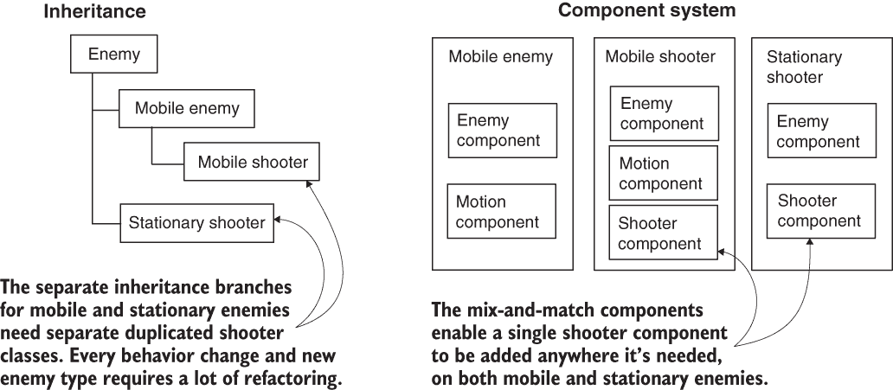

图 1.1 继承与组合

在组件系统中，对象存在于一个扁平的层次结构中，不同的对象有不同的组件集合。相比之下，继承结构中的不同对象位于树的完全不同的分支上。组件排列促进了快速原型设计，因为你可以快速混合和匹配组件，而无需在对象更改时重构继承链。

虽然如果你没有自定义组件系统，可以编写代码来实现，但 Unity 已经有一个强大的组件系统，并且这个系统甚至与可视化编辑器集成。你不仅可以在代码中操作组件，还可以在可视化编辑器中附加和分离组件。同时，你不仅限于通过组合构建对象；你仍然可以选择在代码中使用继承，包括基于继承的所有最佳实践设计模式。

### 1.1.2 需要注意的缺点

Unity 有许多优点，使其成为开发游戏的一个很好的选择，我强烈推荐它，但如果不提及它的弱点，我会感到疏忽。特别是，视觉编辑器和复杂编码的结合，尽管与 Unity 的组件系统非常有效，但却是非同寻常的，可能会造成困难。在复杂的场景中，你可能会失去对场景中哪些对象附加了特定组件的跟踪。Unity 确实提供了一个用于查找附加脚本的搜索功能，但它可能更健壮；有时你仍然会遇到需要手动检查场景中的所有内容以找到脚本链接的情况。这种情况并不常见，但一旦发生，可能会很繁琐。

另一个可能会让有经验的程序员感到惊讶和沮丧的缺点是，链接外部代码库可能很困难。实际上，Unity 的旧版本根本不支持外部代码库，因此它们必须手动复制到每个项目中。现在 Unity 带有包管理器，库（或*包*）是从一个中央共享位置引用的。这些包对于 Unity 本身提供的可选功能（Unity 不会自动包含每个项目中不需要的功能）工作得很好，未来的章节偶尔会要求你安装用于高级字体处理等功能的包。然而，创建自己的包可能很复杂，这使得在多个项目中共享代码变得尴尬。你可能发现直接在项目之间手动复制代码并处理未来的版本不匹配要简单一些，但这并不是一个理想的权衡。

注意：过去，与版本控制系统（如 Git 或 Subversion）一起工作一直是 Unity 的一个显著弱点，但较新版本的 Unity 运行良好。你可能会发现过时的资料告诉你 Unity 不支持版本控制，但新的资料会描述一个项目中哪些文件和文件夹需要放入仓库，哪些不需要。要开始，请阅读 Unity 的文档([`mng.bz/BbhD`](http://mng.bz/BbhD))或查看 GitHub 维护的.gitignore 文件([`mng.bz/g7nl`](http://mng.bz/g7nl))。

第三个弱点与有时令人眼花缭乱的选项数组有关。Unity 为某些功能提供了多种方法，但并不总是清楚你应该使用哪种方法。在某种程度上，这种情况对于正在积极开发中的工具来说是不可避免的，但仍然会给用户带来困惑和不适。这种演化的混乱可能会让 Unity 的老手也感到困惑，因此 Unity 的新手肯定会时不时地遇到困惑。本书突出了这些功能并提供指导。

例如，第七章解释了如何为 Unity 游戏开发用户界面（UI）。嗯，Unity 实际上有*三个* UI 系统（这些系统在[` mng.bz/r60X`](http://mng.bz/r60X)上进行了比较），因为随着系统的不断开发，它们在改进其前辈。本书涵盖了第二个 UI 系统（Unity UI，或 uGUI），因为它仍然比不完整的第三个 UI 系统（UI Toolkit）更受欢迎，但几年内 UI Toolkit 成熟到生产就绪阶段，我也不会感到惊讶。在此期间，新来者可能难以决定 UI 方法。

### 1.1.3 使用 Unity 构建的示例游戏

你已经听说过 Unity 的优缺点，但你可能仍然需要证明其开发工具可以提供一流的结果。访问 Unity 画廊[`unity.com/case-study`](https://unity.com/case-study)，查看使用 Unity 开发的不断更新的游戏和模拟列表。本节探讨了几个游戏，展示了多个类型和部署平台。所有游戏名称均为各自游戏公司的商标，截图也归这些公司所有，版权所有。

桌面（Windows，Mac，Linux）和控制台（PlayStation，Xbox，Switch）

由于 Unity 编辑器运行在相同的平台上，部署到 Windows 或 Mac 通常是目标平台中最直接的选择。同时，在 Unity 中开发的控制台游戏也经常在 PC 上发布，这得益于 Unity 的简单跨平台部署。以下是一些不同类型的桌面和控制台游戏的例子：

+   *Fall Guys*（图 1.2），由 Mediatonic（Mediatonic Limited 的商标）开发的一款混乱的 3D 动作游戏

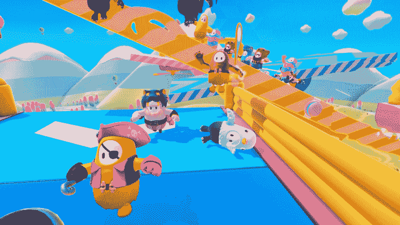

图 1.2 *Fall Guys*

+   *Cuphead*（图 1.3），由 Studio MDHR 开发的一款 2D 平台游戏


图 1.3 *Cuphead*

移动端（iOS 和 Android）

Unity 还可以将游戏部署到移动平台，如 iOS（iPhone 和 iPad）和 Android（手机和平板电脑）。以下是一些不同类型的移动游戏的例子：

+   *Monument Valley 2*（图 1.4），由 ustwo 开发的一款解谜游戏


图 1.4 *Monument Valley 2*

+   *Guns of Boom*（图 1.5），由 Game Insight 开发的一款第一人称射击游戏

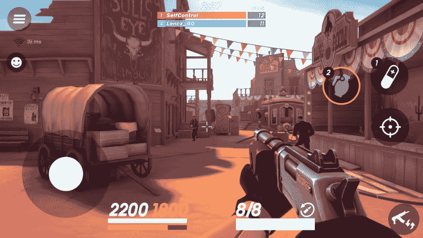

图 1.5 *Guns of Boom*

+   *Animation Throwdown*（图 1.6），由 Kongregate 开发的一款收藏卡牌游戏

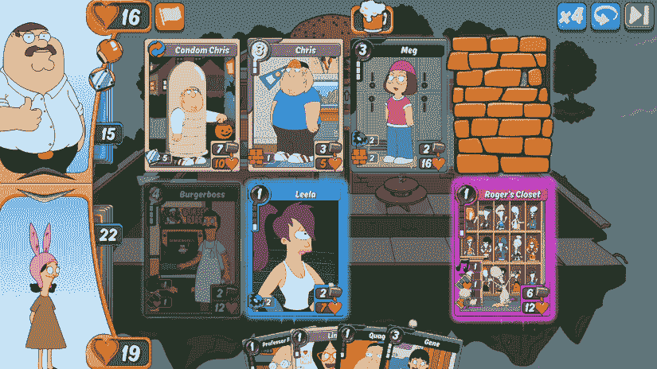

图 1.6 *Animation Throwdown*

虚拟现实（Oculus，VIVE，PlayStation VR）

Unity 甚至可以将游戏部署到 XR 平台，包括虚拟现实头戴设备。以下是一些不同类型的 VR 游戏的例子：

+   *Beat Saber*（图 1.7），由 Beat Games 开发的一款节奏游戏

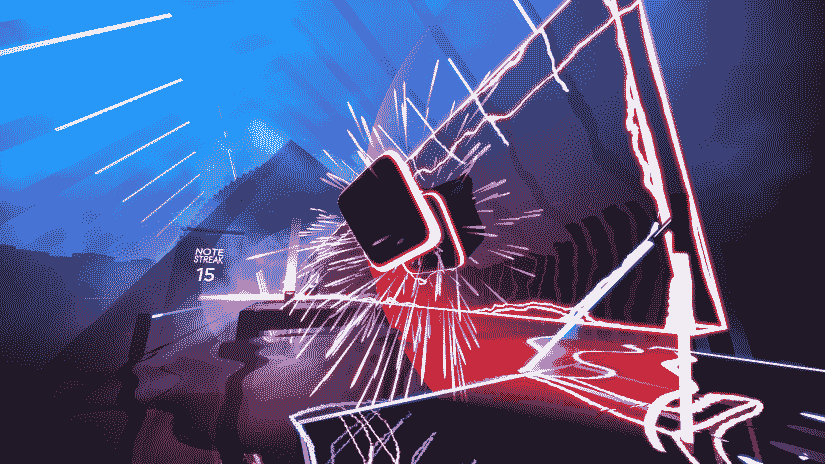

图 1.7 *Beat Saber*

+   *I Expect You to Die*（图 1.8），由 Schell Games 开发的一款逃脱解谜游戏

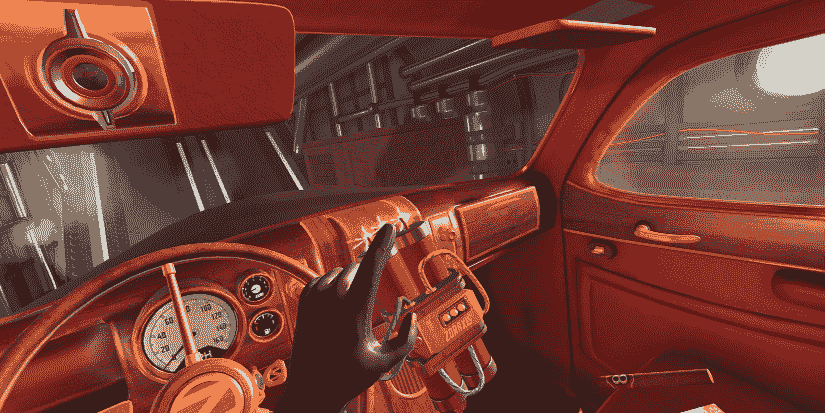

图 1.8 *我期待你死去*

如这些示例所示，Unity 的优势确实可以转化为商业品质的游戏。但即使 Unity 在其他游戏开发工具上具有显著优势，新来者也可能误解编程在开发过程中的作用。

Unity 常常被描绘为无需编程即可使用的一系列功能，这是一个误导性的观点，它不会教人们他们需要知道的内容，以便制作商业游戏。虽然确实可以在不涉及程序员的情况下使用预存组件构建相当复杂的原型（这本身就是一个相当大的成就），但要从一个有趣的原型过渡到一个准备发布的精良游戏，则需要严格的编程。

## 1.2 如何使用 Unity

前一节详细讨论了 Unity 视觉编辑器的生产力优势，所以让我们来看看界面是什么样的，以及它是如何操作的。如果你还没有这样做，请访问 [www.unity.com](https://unity.com/) 并点击“开始使用”来下载程序。在这里，你可以看到提供的各种订阅计划的概述。本书中的所有内容在免费版本中都可以使用，所以选择“个人”选项卡，然后点击免费个人版下面的按钮。Unity 的付费版本主要区别在于商业许可条款，而不是底层功能。

网站为新用户和回访用户提供了不同的下载。区别仅仅在于新用户的下载将启动一个软件向导，引导用户进入入门教程，而回访用户的下载将直接进入主应用程序，没有任何介绍。所以即使你是 Unity 的新手，也请下载回访用户的版本并跳过入门内容（毕竟，它与本书的内容重复）。

实际上，你会下载一个轻量级的安装管理器，而不是主要的 Unity 应用程序。这个管理应用程序被称为 *Unity Hub*，它的存在是为了简化同时安装和使用多个 Unity 版本。如图 1.9 所示，当你启动 Unity Hub 时，安装编辑器将是第一件事。安装默认推荐的版本；本书使用 Unity 2020.3.12（截至本书写作时的当前默认版本）。如果你以后想安装额外的 Unity 版本（比默认版本更新的版本），请点击 Unity Hub 侧菜单中的“安装”。

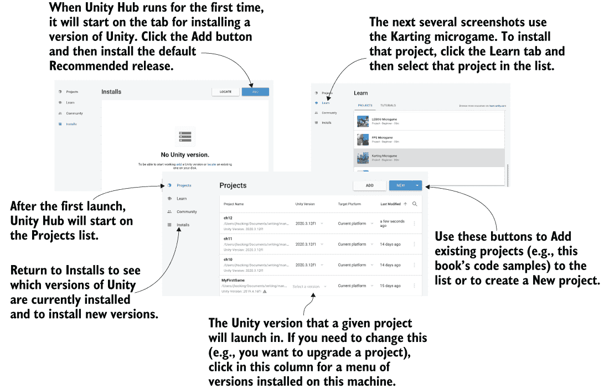

图 1.9 Unity Hub 首次启动与后续启动对比

提示：到您阅读这本书的时候，可能已经发布了更新的 Unity 版本。高级功能可能会发生变化，甚至界面的外观也可能不同，但本书涵盖的基本概念仍然适用。本书中的解释通常仍然适用于当前的任何 Unity 未来版本。

警告：项目会记住它们是在哪个 Unity 版本中创建的，如果您尝试在另一个版本中打开它们，将会发出警告。有时这并不重要（例如，如果在此书样本下载打开时出现警告，请忽略它），但有时您不希望在一个错误的版本中打开项目。

从安装编辑器继续，转到“学习”标签页以下载第一个项目。选择任何项目进行浏览（您无论如何也不会做太多），但请注意图 1.10 显示了 Karting。Unity 将下载并启动所选项目。您可能会看到一个关于导入文件以设置新项目的警告消息；请意识到导入可能需要几分钟。

一旦新项目最终加载完成，选择“加载场景”以关闭初始弹出窗口。如果文件浏览器底部的编辑器中尚未打开，请导航到 Assets/Karting/Scenes/，双击 MainScene（场景文件有 Unity 立方体图标）。您应该看到一个类似于图 1.10 的屏幕。

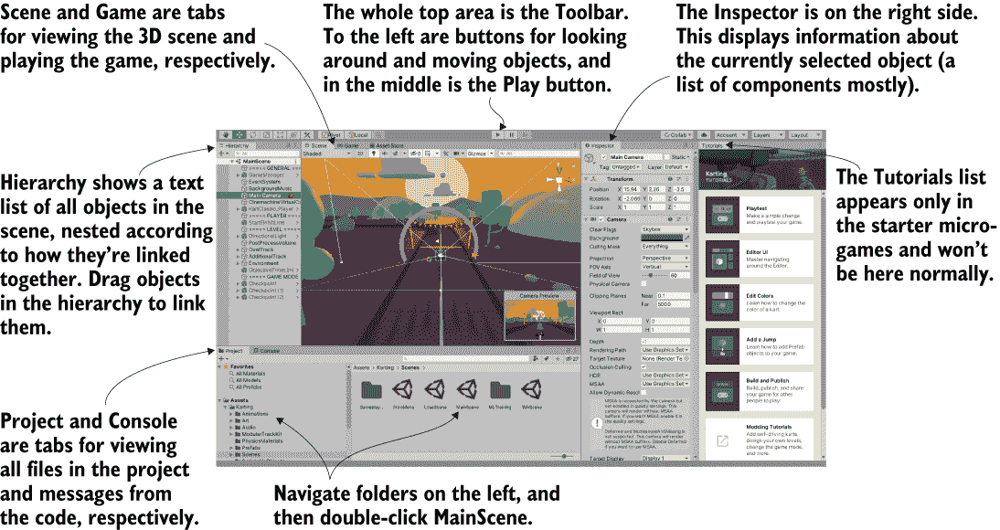

图 1.10 Unity 界面部分

Unity 的界面分为几个部分：场景标签页、游戏标签页、工具栏、层次结构标签页、检查器、项目标签页和控制台标签页。每个部分都有不同的用途，但所有部分对于游戏制作的生命周期都是至关重要的：

+   您可以在项目标签页中浏览所有文件。

+   您可以使用场景标签页来定位当前场景中的对象。

+   工具栏包含用于处理场景的控制。

+   您可以在层次结构标签页中拖放对象关系。

+   检查器列出了所选对象的信息，包括链接的代码。

+   您可以在游戏视图中测试播放，同时查看控制台标签页中的错误输出。

这是 Unity 中的默认布局；所有视图都在标签页中，可以移动或调整大小，停靠在屏幕的不同位置。稍后，您可以尝试自定义布局，但现在，默认布局是了解所有视图功能的最佳方式。

### 1.2.1 场景视图、游戏视图和工具栏

界面最显著的部分是中间的*场景视图*。在这里，您可以查看游戏世界的外观并移动对象。场景中的网格对象以网格（稍后定义）的形式出现。您还可以看到场景中的其他对象，它们由图标和彩色线条表示：摄像机、灯光、音频源、碰撞区域等等。请注意，您在这里看到的视图与运行中的游戏视图不同——您可以随意在场景中环顾四周，而无需受限于游戏的视图。

定义：*网格对象*是空间中的视觉对象。3D 图形中的视觉效果由许多连接的线条和形状构成——因此得名*网格*。

*游戏视图*不是屏幕的独立部分，而是一个位于场景旁边的另一个标签（在视图的左上角寻找标签）。界面上有几个地方有多个这样的标签；如果您点击不同的标签，视图将替换为新活动的标签。当游戏运行时，您在这个视图中看到的是游戏。每次运行游戏时无需手动切换标签，因为当游戏开始时，视图会自动切换到游戏视图。

小贴士：当游戏运行时，您可以切换回场景视图，允许您检查运行场景中的对象。这种能力在游戏运行时查看正在发生的事情时非常有用，并且是一个在大多数游戏引擎中不可用的有用调试工具。

说到运行游戏，只需点击场景视图正上方的播放按钮就这么简单。界面的整个顶部部分被称为*工具栏*，播放按钮位于正中央。图 1.11 将完整的编辑器界面拆分，只显示顶部的工具栏以及位于其下的场景/游戏标签。

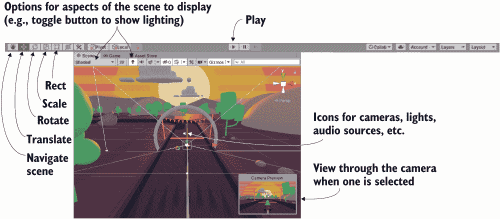

图 1.11 编辑器截图裁剪以显示工具栏、场景和游戏视图

工具栏的左侧是场景导航和变换对象的按钮——用于环顾场景和移动对象。我建议您花时间练习这些，因为它们是您在 Unity 视觉编辑器中将要做的最重要的活动之二。（它们如此重要，以至于在接下来的部分中会有它们自己的章节。）

工具栏的右侧是布局和图层下拉菜单的位置。如前所述，Unity 界面的布局是灵活的，因此布局菜单允许您切换布局。至于图层菜单，那是目前可以忽略的高级功能（图层将在未来的章节中介绍）。

### 1.2.2 鼠标和键盘

场景导航主要使用鼠标完成，同时使用一些修改键来改变鼠标的操作。三种主要的导航操作是移动、环绕和缩放。具体的鼠标移动取决于你使用的鼠标，并在附录 A 中描述。这三种移动涉及在按住 Alt（或 Mac 上的 Option）和 Ctrl（Mac 上的 Command）组合键的同时点击和拖动。花几分钟在场景中移动，以了解移动、环绕和缩放的作用。

提示：尽管 Unity 可以使用单键或双键鼠标，但我强烈推荐使用三键鼠标（是的，三键鼠标在 Mac 上也能正常工作）。

对象的变换也是通过三种主要操作完成的，三种场景导航操作与三种变换相对应：平移、旋转和缩放（图 1.12 展示了在立方体上的变换）。

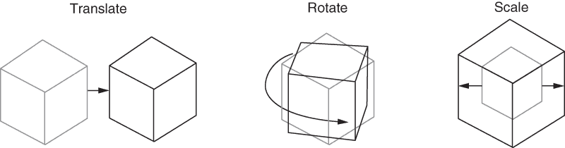

图 1.12 应用三个变换：平移、旋转和缩放。（较浅的线条是变换前的对象状态。）

当你在场景中选择一个对象时，你可以将其移动（在数学上准确的技术术语是 *平移*），旋转它，并调整其大小。将场景导航操作联系起来，移动对应于摄像机的平移，环绕对应于旋转，缩放对应于缩放。除了工具栏上的按钮外，你可以通过按键盘上的 W、E 或 R 来切换这些功能。当你激活变换时，你会注意到一组彩色箭头或圆圈出现在场景中的对象上；这是变换工具，你可以点击并拖动这个工具来应用变换。

第四个工具位于变换按钮旁边。称为 *矩形工具*，它专为 2D 图形设计。这个工具结合了移动、旋转和缩放。同样，第五个按钮用于结合移动、旋转和缩放的工具，用于 3D 对象。我个人更喜欢分别操作三个变换，但你可能会觉得组合工具更方便。

Unity 还有一系列键盘快捷键，用于加快各种任务的速度。请参阅附录 A 了解它们。有了这些，接下来我们将介绍界面的其他部分！

### 1.2.3 层次视图和检查器面板

观察屏幕的任一边，你会在左侧看到层次标签，在右侧看到检查器标签（见图 1.13）。*层次*列出了场景中每个对象的名称，并根据场景中的层次链接关系将名称嵌套在一起。基本上，这是一种通过名称选择对象而不是在场景视图中搜索并点击对象的方法。层次链接关系将对象组合在一起，就像文件夹一样，允许你将整个组作为一个整体移动。

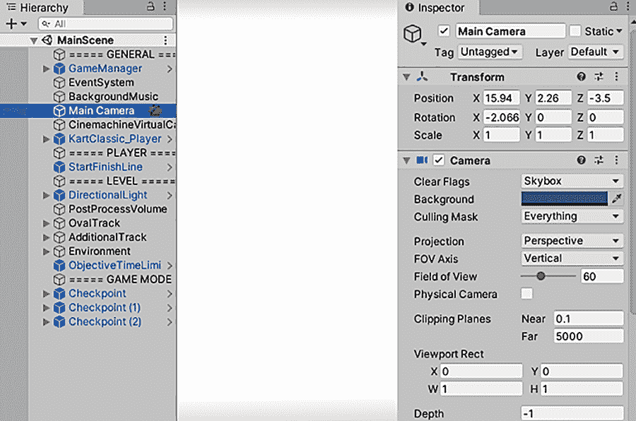

图 1.13 编辑器截图裁剪以显示层次结构和检查器标签页

*检查器* 显示关于当前选中对象的信息。选择一个对象，检查器就会填充有关该对象的信息。显示的信息基本上是组件列表，你甚至可以给对象附加或移除组件。所有游戏对象至少有一个组件，即变换组件，所以你总会看到至少有关位置和旋转的信息在检查器中。通常，对象在这里会列出几个组件，包括附加到它们上的脚本。

### 1.2.4 项目和控制台标签页

在屏幕底部，你会看到项目视图和控制台（见图 1.14）。与场景和游戏一样，这些不是屏幕的两个独立部分，而是你可以切换的标签页。

*项目* 显示项目中的所有资源（艺术、代码等）。具体来说，在视图的左侧是项目目录的列表；当你选择一个目录时，视图的右侧会显示该目录中的单个文件。项目中的目录列表类似于层次结构中的列表视图，但层次结构显示场景中的对象；项目显示可能不在任何特定场景中包含的文件（包括场景文件——当你保存场景时，它会在项目中显示出来！）。

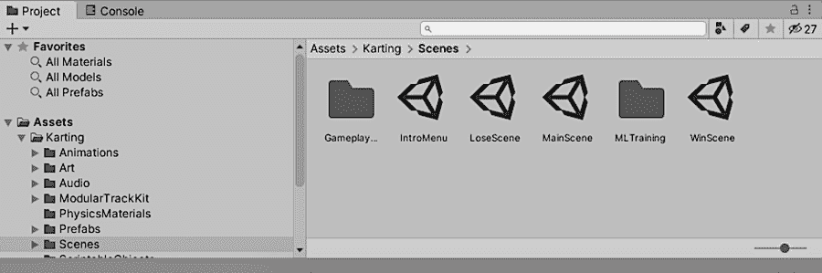

图 1.14 编辑器截图裁剪以显示项目和控制台标签页

TIP 项目视图反映了磁盘上的资源目录，但通常，你不应该通过在操作系统的文件资源管理器中直接访问资源文件夹来移动或删除文件。如果你在项目视图中执行这些操作，Unity 将与该文件夹保持同步。

*控制台* 标签页是代码消息出现的地方。其中一些消息将是故意放置的调试输出，但 Unity 如果在脚本中遇到问题，也会发出错误消息。

## 1.3 使用 Unity 编程入门

现在我们来看看在 Unity 中编程的过程是如何工作的。虽然可以在视觉编辑器中布置艺术资源，但你需要编写代码来控制它们并使游戏交互。Unity 中的复杂编程使用 C# 作为编程语言来完成。

启动 Unity 并创建一个新项目：在 Unity Hub 中选择“新建”，或者在 Unity 已运行时选择“文件”>“新建项目”。为项目输入一个名称，保留默认的 3D 模板（后续章节将介绍 2D），然后选择你想要保存项目的地方。Unity 项目只是一个包含各种资源和设置文件的目录，所以你可以将项目保存在电脑上的任何位置。点击“创建”，然后 Unity 将暂时消失，以设置项目目录。

或者，您可以打开第一章的示例项目。我强烈建议您在一个新项目中尝试遵循即将到来的说明，然后在检查您的作品之后查看完成的示例，但这完全取决于您。在 Unity Hub 中选择“添加”以将下载的项目文件夹添加到列表中，然后单击列表中的项目。

警告：如果您打开的是本书的示例项目而不是创建一个新项目，Unity 可能会显示以下消息：“重建库，因为找不到资产数据库！”这指的是项目的库文件夹；该文件夹包含 Unity 生成并在工作期间使用的文件，但在分发这些文件时不是必需的。

当 Unity 再次出现时，您将看到一个空白项目。接下来，让我们讨论程序如何在 Unity 中执行。

### 1.3.1 在 Unity 中运行代码：脚本组件

Unity 中的所有代码执行都是从与场景中的对象链接的代码文件开始的。最终，这种代码执行是之前描述的组件系统的一部分；游戏对象是由组件集合构建的，而这个集合可以包括执行脚本的脚本。

注意：Unity 将代码文件称为*脚本*，使用的是在浏览器中运行 JavaScript 时最常见的*脚本*定义：代码在 Unity 游戏引擎中执行，而不是作为其自己的可执行文件运行的编译代码。但不要混淆，因为许多人将这个词定义为不同的含义；例如，*脚本*通常指的是短小、自包含的实用程序。Unity 中的脚本更类似于单个 OOP 类，并且附加到场景中对象的脚本是对象实例。

如您从描述中可能推测到的，在 Unity 中，脚本*是*组件——请注意，不是所有脚本，只有继承自 MonoBehaviour 的脚本，MonoBehaviour 是脚本组件的基类。MonoBehaviour 定义了将组件附加到游戏对象的无形基础，并且（如列表 1.1 所示）从它继承提供了一些自动运行的方法，您可以实现这些方法。这些方法包括 Start()，当对象变为活动状态时调用一次（通常是在带有该对象的场景加载后立即调用），以及 Update()，它每帧都会被调用。当您将这些代码放入这些预定义方法中时，您的代码就会被运行。

定义：*帧*是循环游戏代码的单个周期。几乎所有视频游戏（不仅是在 Unity 中，而且在一般视频游戏中）都是围绕核心游戏循环构建的，其中代码在游戏运行时循环执行。每个周期包括绘制屏幕——因此得名*帧*（就像电影的一系列静态帧）。

列表 1.1 基本脚本组件的代码模板

```
using System.Collections;                    ❶
using System.Collections.Generic;
using UnityEngine;
public class HelloWorld : MonoBehaviour {    ❷
    void Start() {
        // do something once                 ❸
    }

    void Update() {
        // do something every frame          ❹
    }
}
```

❶ 包含 Unity 和.NET/Mono 类的命名空间。

❷ 继承的语法

❸ 在此处放置只运行一次的代码。

❹ 在此处放置每帧运行的代码。

当你创建一个新的 C#脚本时，文件包含的内容是这样的：定义一个有效 Unity 组件的最小样板代码。Unity 在应用程序的深处藏有一个脚本模板，当你创建一个新的脚本时，Unity 会复制这个模板并将类重命名为与文件名匹配（在我的例子中是 HelloWorld.cs）。Unity 还为 Start()和 Update()提供了空壳，因为这两个是最常见的调用自定义代码的地方。

要创建一个脚本，从创建菜单中选择 C#脚本，你可以通过在资产菜单下（注意资产和游戏对象都有创建的列表，但它们是不同的菜单）或通过在项目视图中右键单击来访问它。为新脚本输入一个名称，例如 HelloWorld。如本章后面所述（见图 1.16），你会点击并拖动这个脚本文件到场景中的对象上。双击脚本，它将自动在另一个程序中打开以进行编辑，如下一节所述。

### 1.3.2 使用 Visual Studio，内置的 IDE

编程并不是在 Unity 中完成的，而是代码作为独立的文件存在，你需要将这些文件指向 Unity。脚本文件可以在 Unity 中创建，但你仍然需要使用文本编辑器或 IDE 来编写那些最初为空的文件。Unity 附带 Microsoft Visual Studio，这是一个 C#的 IDE（图 1.15 展示了其外观）。你可以访问[`visualstudio.microsoft.com`](https://visualstudio.microsoft.com/)了解更多关于这个软件的信息。

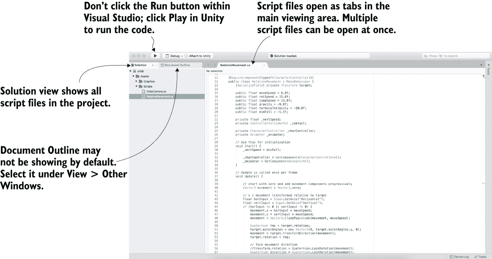

图 1.15 Visual Studio 界面的一部分

注意：如果 Unity 打开的不是 Visual Studio，你可能需要切换外部工具首选项。前往首选项 > 外部工具 > 外部脚本编辑器以选择一个 IDE。

注意：Visual Studio 将文件组织成称为“解决方案”的分组。Unity 自动生成一个包含所有脚本文件的解决方案，所以你通常不需要担心这一点。

可用的 Visual Studio 版本有很多（许多程序员更喜欢 Visual Studio Code），或者你可以使用来自不同公司的 IDE，如 JetBrains Rider。切换到不同的 IDE 就像在 Unity 的首选项中转到外部工具一样简单。我通常使用 Visual Studio for Mac，但你可以使用不同的 IDE，并且不会遇到任何问题来跟随这本书的内容。在本章介绍之后，我不会再谈论 IDE。

总要记住，尽管代码是在 Visual Studio 中编写的，但代码并不是在那里运行的。IDE 基本上是一个高级的文本编辑器，代码是在你点击 Unity 中的播放时运行的。

### 1.3.3 打印到控制台：Hello World！

好吧，你已经在项目中有一个空脚本了，但你还需要一个场景中的对象来附加脚本。回想一下图 1.1 描述的组件系统；脚本是一个组件，因此它需要被设置为对象上的组件之一。

选择 GameObject > 创建空对象，一个空 GameObject 将出现在层次列表中。现在将脚本从项目视图拖动到层次视图，并将其放在空 GameObject 上。如图 1.16 所示，Unity 将突出显示放置脚本的合法位置，并将脚本放在 GameObject 上会将其附加到该对象。

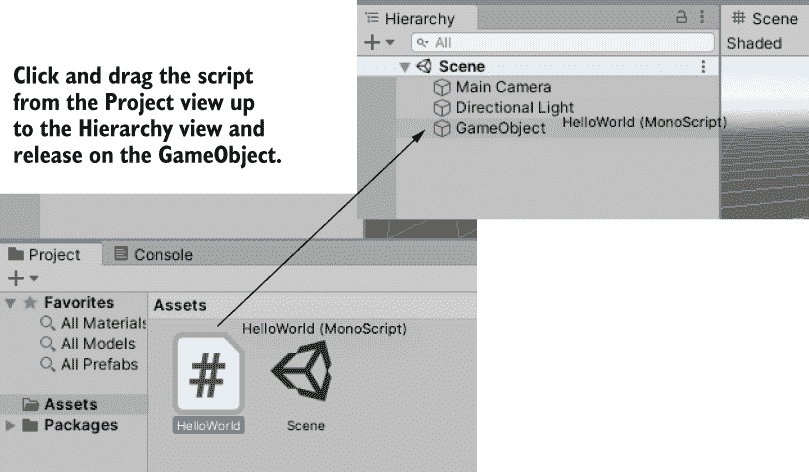

图 1.16 如何将脚本链接到 GameObject

为了验证脚本是否已附加到对象，选择 GameObject 并查看检查器视图。你应该看到列出了两个组件：Transform 组件，这是所有对象都有的基本位置/旋转/缩放组件，且不能被移除，在其下方是你的脚本。

备注：最终，这种从一处拖动对象并将其放置到另一处的动作将变得习以为常。在 Unity 中，许多链接（不仅限于将脚本附加到对象）都是通过将对象拖放到彼此上方来创建的。

当脚本链接到对象时，你将看到如图 1.17 所示的内容，脚本在检查器中显示为一个组件。现在脚本将在你播放场景时执行，尽管目前还没有发生任何事情，因为你还没有编写任何代码。让我们接下来做这件事！

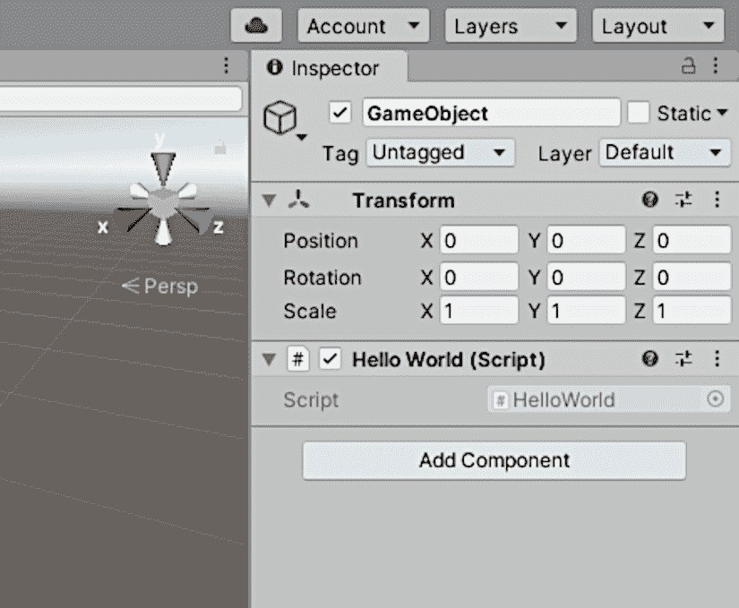

图 1.17 在检查器中显示的链接脚本

双击脚本以打开它并返回到列表 1.1。在学习新的编程环境时，最经典的做法是让它打印出“Hello World!”文本，因此请在以下列表中的 Start() 方法内添加该行。

列表 1.2 添加控制台消息

```
...
void Start() {
    Debug.Log("Hello World!");    ❶
}
...
```

❶ 在此处添加日志命令。

Debug.Log() 命令会在 Unity 的控制台视图中打印一条消息。同时，该行代码会放入 Start() 方法中，因为，如前所述，该方法会在对象变为活动状态时立即被调用。点击编辑器中的播放后，Start() 将被调用一次。一旦添加了日志命令，保存脚本，点击 Unity 中的播放，并切换到控制台视图。你会看到“Hello World!”消息出现。恭喜你——你已经编写了你的第一个 Unity 脚本！当然，代码将在后面的章节中变得更加复杂，但这是一个重要的第一步。

警告：始终记得在调整脚本后保存文件！一个相当常见的错误是在调整代码后立即点击 Unity 中的播放而不保存，导致游戏仍然使用你调整之前的代码。

“Hello World!” 简要步骤

让我们重申并总结一下上一页的步骤：

1.  创建一个新的项目。

1.  创建一个新的 C# 脚本。

1.  创建一个空 GameObject。

1.  将脚本拖放到对象上。

1.  将日志命令添加到脚本中。

1.  点击播放！

现在是保存场景的时候了；这将创建一个带有 Unity 图标的.unity 文件。场景文件是当前游戏中加载的所有内容的快照，这样你可以在以后重新加载这个场景。保存这个场景可能几乎看起来不值得，因为它如此简单（一个空的 GameObject）——但如果你不保存场景，当你退出 Unity 后回到项目时，你会发现它又是空的。

脚本中的错误

要查看 Unity 如何指示错误，故意在 HelloWorld 脚本中输入一个拼写错误。例如，如果你输入了一个多余的括号符号，错误信息将在控制台标签页中显示一个红色的错误图标。

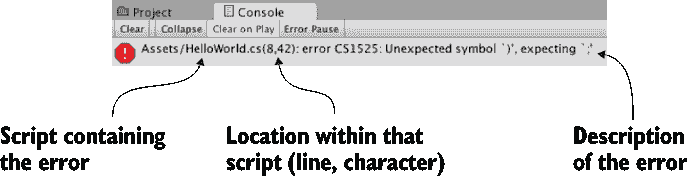

控制台标签页中显示的脚本错误

习惯于阅读这些错误信息，因为这将是你解决代码中问题的主要方式。注意信息的结构：它首先指出哪个文件有错误，然后显示该文件中的行号，最后提供发生错误的描述。

### 摘要

+   Unity 是一个多平台开发工具。

+   Unity 的视觉编辑器有几个部分协同工作。

+   脚本作为组件附加到对象上。

+   使用 Visual Studio 在脚本中编写代码。
