# 2 构建一个让你置身于 3D 空间的演示

本章节涵盖

+   理解 3D 坐标空间

+   在场景中放置玩家

+   编写移动物体的脚本

+   实现 FPS 控制

第一章以传统的“Hello World！”介绍了一种新的编程工具；现在，是时候深入一个非平凡的 Unity 项目了，一个具有交互性和图形的项目。你将把物体放入场景，并编写代码使玩家能够在场景中行走。基本上，这将是一个没有怪物的*《Doom》*（类似于图 2.1 中的描绘）。Unity 中的视觉编辑器使新用户能够立即开始组装一个 3D 原型，而无需先编写大量的模板代码（例如初始化 3D 视图或建立渲染循环）。

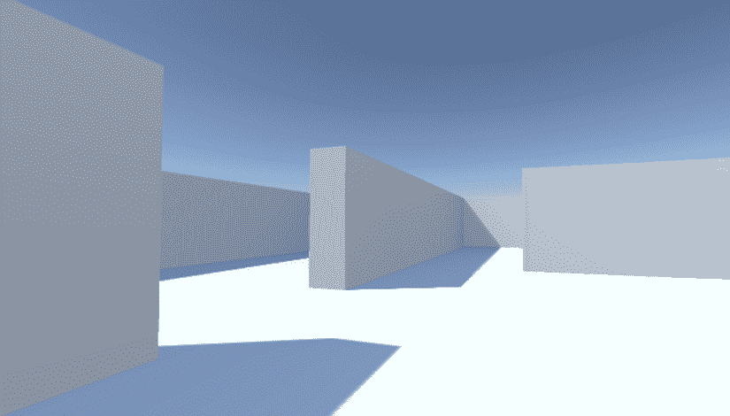

图 2.1 3D 演示的截图（基本上，*《Doom》*没有怪物）

很有诱惑力立即在 Unity 中开始构建场景，尤其是这样一个（在概念上！）简单的项目。但是，在开始之前暂停并规划你要做什么总是一个好主意，而且现在这一点尤为重要，因为你对这个过程还不太熟悉。

注意，每个章节的项目都可以从本书的网站上下载（[`mng.bz/VBY5`](http://mng.bz/VBY5)）。首先在 Unity 中打开项目，然后打开主场景（通常只命名为 Scene）以运行和检查。在你学习的过程中，我建议你自己输入所有代码，并将下载的样本仅作为参考使用。

## 2.1 在开始之前...

Unity 使新手容易开始，但在你构建完整的场景之前，让我们先过一下几个要点。即使在与 Unity 这样灵活的工具一起工作时，你也需要有一个明确的目标感。你还需要掌握 3D 坐标如何运作，否则你一尝试在场景中定位物体就会迷失方向。

### 2.1.1 规划项目

在开始编写任何代码之前，你总是想要停下来问问自己，“我在这里要构建什么？”游戏设计是一个巨大的主题，有大量令人印象深刻的大型书籍专注于如何设计游戏。幸运的是，为了我们的目的，你只需要在心中有一个关于这个简单演示的简要概述，就可以开发一个基本的学习项目。这些初始项目本身设计不会太复杂，以免分散你学习编程概念。在你掌握了游戏开发的基本原理之后，你可以（并且应该！）担心更高级的设计问题。

对于这个第一个项目，你将构建一个基本的单人第一人称射击（FPS）场景。我们将创建一个房间供玩家导航，玩家将从他们的角色视角看到世界，并且可以通过使用鼠标和键盘来控制角色。现在可以移除完整游戏的所有有趣复杂性，以便专注于核心机制：在 3D 空间中移动。图 2.2 展示了这个项目的路线图，列出了我在脑海中构建的清单：

1.  设置房间：创建地板、外墙和内墙。

1.  放置灯光和相机。

1.  创建玩家对象（包括在顶部附加相机）。

1.  编写移动脚本：用鼠标旋转，用键盘移动。

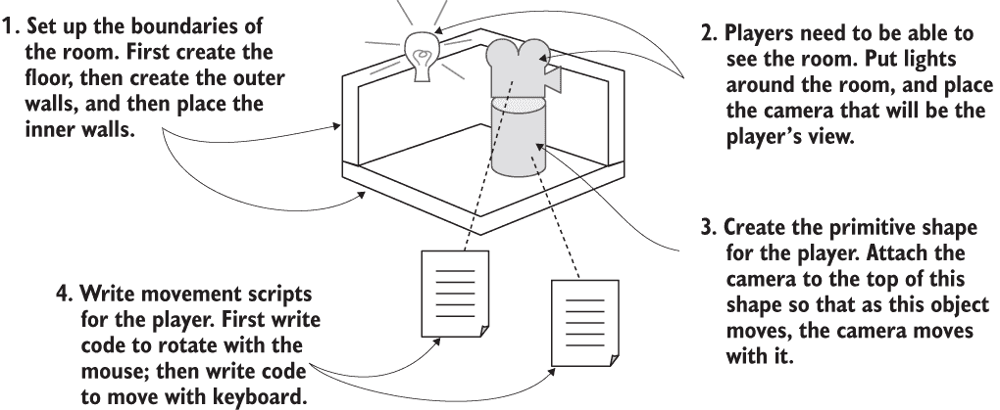

图 2.2 3D 演示的路线图

不要被这个路线图中的所有内容吓倒！听起来这个章节有很多步骤，但 Unity 会让它们变得简单。接下来关于移动脚本的章节之所以内容广泛，仅仅是因为我们将逐行分析，以便你能够详细理解所有概念。

这个项目是一个第一人称演示，为了保持艺术要求简单；因为你看不到自己，所以“你”可以是一个顶部带有相机的圆柱形！现在你需要理解 3D 坐标是如何工作的，这样在视觉编辑器中放置所有内容就会变得容易。

### 2.1.2 理解 3D 坐标空间

如果你思考一下我们刚开始的简单计划，它有三个方面：一个房间、一个视野和控件。所有这些项目都依赖于你理解如何在 3D 计算机模拟中表示位置和运动。如果你是 3D 图形的新手，你可能还不知道这些内容。

所有这些最终都归结为表示空间中点的数字，这些数字与空间相关联的方式是通过坐标轴。如果你回想起数学课，你可能见过并使用过 x 轴和 y 轴（见图 2.3）来为页面上的点分配坐标。这被称为*笛卡尔坐标系*。

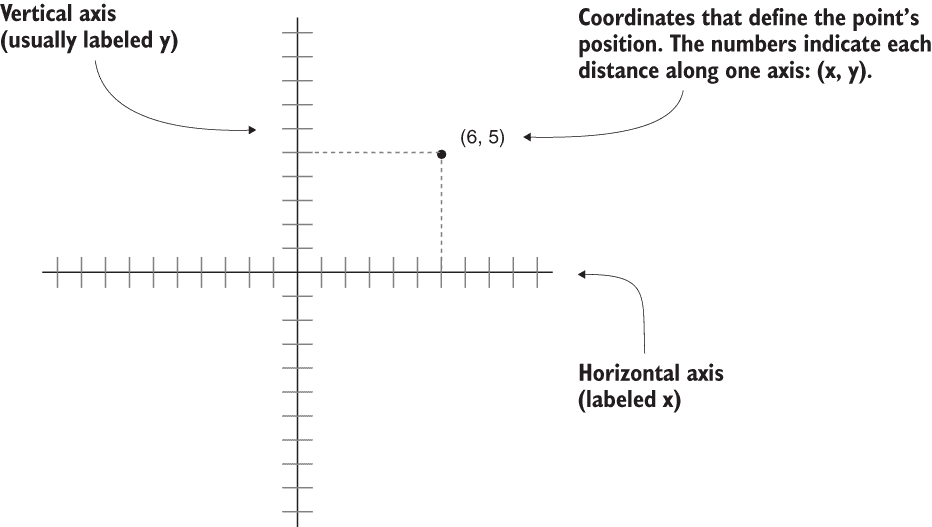

图 2.3 x 轴和 y 轴上的坐标定义了一个 2D 点。

两个轴提供了 2D 坐标，所有点都在同一平面上。三个轴用于定义 3D 空间。因为 x 轴沿着页面水平方向，y 轴沿着页面垂直方向，所以我们现在想象一个垂直于 x 轴和 y 轴的第三轴，从页面中直插出来。图 2.4 展示了 3D 坐标空间的 x 轴、y 轴和 z 轴。场景中所有具有特定位置的对象都将具有 x 轴、y 轴和 z 坐标：玩家的位置、墙的位置等等。

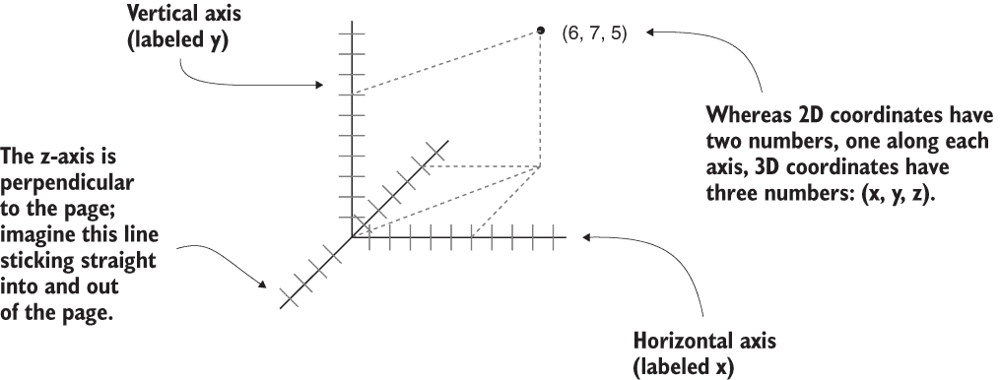

图 2.4 x 轴、y 轴和 z 轴上的坐标定义了一个 3D 点。

在 Unity 的场景视图中，你可以看到这三个轴被显示出来。在检查器中，你可以输入定位对象所需的三个数字。你不仅会使用这三个数字坐标编写代码来定位对象，还会定义沿着每个轴的移动距离。

左手系与右手系坐标

每个轴的正负方向是任意的，无论轴指向哪个方向，坐标仍然有效。你只需要在给定的 3D 图形工具（动画工具、游戏开发工具等）中保持一致性。

但在几乎所有情况下，x 轴向右延伸，y 轴向上延伸；不同工具之间的区别在于 z 轴是进入页面还是从页面出来。这两个方向被称为*左手系*或*右手系*；如图所示，如果你将大拇指沿着 x 轴方向，食指沿着 y 轴方向，那么中指就会指向 z 轴。

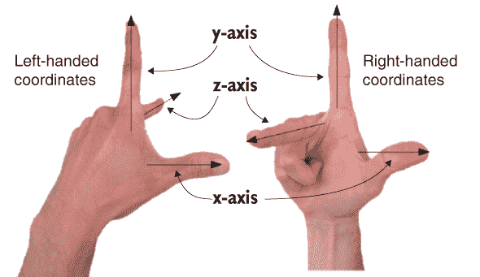

左手系和右手系的 z 轴指向不同的方向。

Unity 使用左手坐标系，许多 3D 艺术应用程序也是如此。许多其他工具使用右手坐标系（例如 OpenGL），所以如果你看到不同的坐标方向，不要感到困惑。

现在你已经为这个项目制定了计划，并且知道如何使用坐标在 3D 空间中定位对象，是时候开始构建场景了。

## 2.2 开始项目：在场景中放置对象

让我们在场景中创建和放置对象。首先，你将设置所有静态场景——地板和墙壁。然后你将在场景周围放置灯光，并定位摄像机。最后，你将创建玩家对象，即你将附加脚本以在场景中四处走动的对象。图 2.5 显示了所有对象放置就绪的编辑器外观。

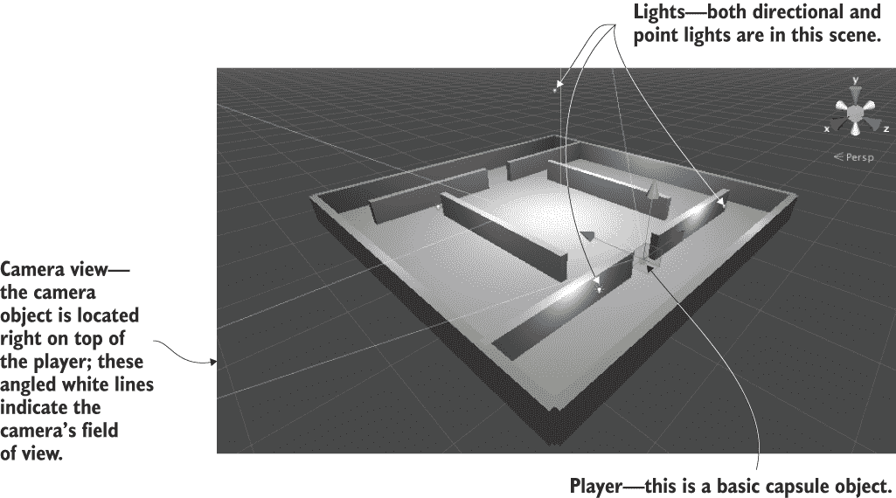

图 2.5 编辑器中的场景，包含地板、墙壁、灯光、摄像机和玩家

第一章展示了如何在 Unity 中创建新项目，所以你现在将这样做。在 Unity Hub 中选择“新建”（或编辑器中的“文件 > 新建项目”），然后在弹出的窗口中命名你的新项目。场景一开始几乎是空的，首先创建的对象是最明显的。

### 2.2.1 景观：地板、外墙和内墙

在屏幕顶部选择 GameObject 菜单，然后悬停在 3D Object 上以查看下拉菜单。选择 Cube 以在场景中创建一个新的立方体对象（稍后我们将使用其他形状，如 Sphere 和 Capsule）。调整这个对象的位置和缩放，以及它的名称，以创建地板。图 2.6 显示了检查器中地板应设置哪些值（它最初只是一个立方体，在你将其拉伸之前）。

注意 您可以将位置数值视为您想要的任何单位，只要在整个场景中保持一致即可。最常见的单位是米，我通常选择米，但有时我也使用英尺，甚至见过其他人决定使用英寸！

重复相同的步骤来创建房间的外墙。每次都可以创建新的立方体，或者您可以通过使用标准快捷键复制并粘贴现有对象。移动、旋转和缩放墙壁以在楼面周围形成边界。尝试不同的数字（例如，缩放为 1、4、50）或使用第 1.2.2 节中介绍的变换工具（记住，在 3D 空间中移动和旋转的数学术语是 *变换*）。

小贴士 回想一下第一章中的导航控制，以从不同角度查看场景或放大以获得鸟瞰视图。如果您在场景中迷路了，请按 F 键重置当前选中对象的视图。


图 2.6 楼面检查器视图

一旦外墙就位，创建内墙以进行导航。将内墙放置在您喜欢的位置；想法是在编写移动代码后创建走廊和障碍物。墙壁最终具有的确切变换值将取决于您如何旋转和缩放立方体以适应，以及对象在层次视图中的链接方式。如果您需要从示例中复制有效值，请下载示例项目并参考那里的墙壁。

小贴士 在层次视图中将对象拖到彼此上方以建立链接。带有附加对象的物体被称为 *父对象*；附加到父对象的对象被称为 *子对象*。当父对象移动（或旋转或缩放）时，子对象会与其一起变换。

定义 *根* 对象（与父对象和子对象的概念密切相关）是位于层次结构底部且本身没有父对象的对象。因此，所有根对象都是父对象，但并非所有父对象都是根对象。

您还可以创建空的游戏对象来组织场景。从游戏对象菜单中选择创建空对象。通过将可见对象链接到根对象，可以折叠其层次列表。例如，在图 2.7 中，墙壁都是空根对象（命名为 Building）的子对象，这样层次列表看起来就会很整齐。

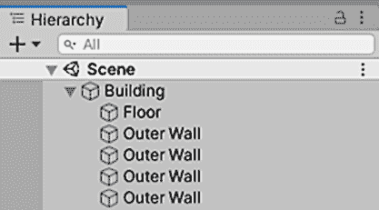

图 2.7 展示墙壁和楼面组织在空对象下的层次视图

在将任何子对象链接到它之前，请确保将空根对象（位置和旋转设置为 0, 0, 0，缩放设置为 1, 1, 1）的变换选项重置，以避免子对象位置出现任何异常。

什么是 GameObject？

所有场景对象都是 GameObject 类的实例，类似于所有脚本组件都继承自 MonoBehaviour 类的方式。当空对象被实际命名为 GameObject 时，这一事实更为明确，但无论对象被命名为 Floor、Camera 还是 Player，这一事实仍然是真实的。

GameObject 实际上是一系列组件的容器。GameObject 的主要目的是为 MonoBehaviour 提供一些可以附加的东西。物体在场景中的确切位置取决于已经添加到该 GameObject 的哪些组件。立方体对象有 Cube 组件，球体对象有 Sphere 组件，依此类推。

如果您还没有保存更改的场景，请记住保存。现在场景中有一个房间，但我们仍然需要设置灯光。让我们接下来处理这个问题。

### 2.2.2 光源和相机

通常，你使用方向光和一系列点光源来照亮 3D 场景。从一个方向光开始。场景默认情况下可能已经有一个了，如果没有，可以通过选择 GameObject > Light 并选择方向光来创建一个。

光源类型

你可以创建几种类型的光源，这些光源由它们如何以及在哪里投射光线来定义。三种主要类型是点光源、聚光灯和方向光源。

在*点光源*中，所有光线都从一个点发出并向所有方向投射，就像现实世界中的灯泡一样。光线在近距离更亮，因为光线是聚集在一起的。

在*聚光灯*中，所有光线都从一个点发出，但只在一个有限的锥体中投射。当前项目中没有使用聚光灯，但这些灯光通常用于突出显示关卡的一部分。

在*方向光*中，所有光线都是平行的并且均匀投射，以相同的方式照亮场景中的所有物体。这就像现实世界中的太阳一样。

方向光的位子不会影响从它发出的光，只会影响光源面对的方向，所以从技术上讲，你可以在场景的任何地方放置那个光。我建议将方向光放置在房间上方较高的位置，这样它就会直观地感觉像太阳，而且在你操作场景的其他部分时不会碍事。旋转这个光并观察它对房间的影响；我建议在 x 轴和 y 轴上稍微旋转以获得良好的效果。

当你在检查器中查看时，你会看到一个强度设置（见图 2.8）。正如其名所示，该设置控制光的亮度。如果这是唯一的光源，它就必须更亮，但由于你还会添加许多点光源，这个方向光可以相当暗——例如，0.6 强度。此光还应略带黄色调，就像太阳一样，而其他光源将是白色的。

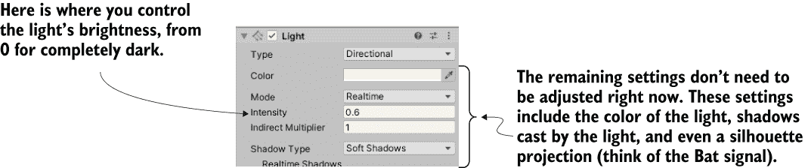

图 2.8 检查器中的方向光设置

对于点光源，使用相同的菜单创建几个，并将它们放置在房间周围的暗处，以确保所有墙壁都被照亮。你不希望太多，因为如果游戏中有许多光源，性能可能会下降。在每个角落放置一个应该就足够了（我建议将它们提升到墙壁的顶部），再加上一个放置在场景上方较高的位置（例如，Y 位置为 18），以给房间中的光线增加多样性。

注意，点光源在 Inspector 中添加了一个 Range 设置（见图 2.9）。这控制了光能达到多远；而方向性光源在整个场景中均匀地投射光线，点光源在物体较近时更亮。靠近地板的点光源应该有大约 18 的范围，但放置在较高位置的光源应该有大约 40 的范围以照亮整个房间。将靠近地板的光源强度设置为 0.8，而较高的光源则通过强度 0.4 减少额外光线以填充空间。

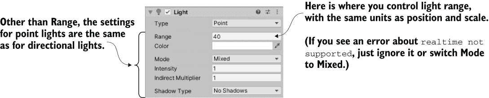

图 2.9 Inspector 中的点光源设置

玩家需要看到场景的另一种对象是相机，但“空”场景自带了一个主相机，所以你会使用它。如果你需要创建新的相机（例如，用于多人游戏中的分屏视图），Camera 是同一 GameObject 菜单中的另一个选择，就像 Cube 和 Lights 一样。我们将相机定位在玩家的顶部周围，以便看起来是通过玩家的眼睛看到的。

### 2.2.3 玩家的碰撞器和视点

对于这个项目，用一个简单的原始形状来表示玩家就足够了。在 GameObject 菜单中（记住，将鼠标悬停在 3D Object 上以展开菜单），点击 Capsule。Unity 创建了一个两端圆润的圆柱形形状；这个原始形状将代表玩家。将此对象定位在 y 轴上的 1.1 处（对象高度的一半，再加上一点以避免与地板重叠）。你可以将对象沿 x 轴和 z 轴移动到任何你喜欢的地方，只要它在房间内且不接触任何墙壁。将对象命名为 Player。

在 Inspector 中，你会注意到这个对象被分配了一个胶囊碰撞器。对于一个胶囊对象来说，这是一个合理的默认选择，就像立方体对象默认有盒子碰撞器一样。但这个特定的对象将是玩家，因此需要比大多数对象稍微不同类型的组件。通过点击该组件右上角的菜单图标（如图 2.10 所示）来移除胶囊碰撞器；这将显示一个包括移除组件选项的菜单。碰撞器是一个围绕对象的绿色网格，因此删除胶囊碰撞器后，你会看到绿色网格消失。

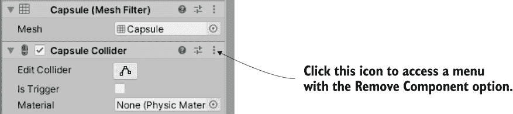

图 2.10 在 Inspector 中移除组件

我们将不为这个对象分配胶囊碰撞器，而是分配一个 *角色控制器*。在检查器的底部有一个标有“添加组件”的按钮；点击该按钮以打开可以添加的组件菜单。在菜单的物理部分，您将找到角色控制器；选择该选项。正如其名称所示，此组件将允许对象像角色一样行为。

您需要完成最后一步来设置玩家对象：附加相机。如前文 2.2.1 节所述，对象可以在层次结构视图中相互拖动。将相机对象拖动到玩家胶囊上，以将相机附加到玩家。现在调整相机位置，使其看起来像玩家的眼睛（我建议位置为 0, 0.5, 0）。如有必要，将相机的旋转重置为 0, 0, 0（如果已经旋转了胶囊，这将不适用）。

您已经创建了此场景所需的所有对象。剩下的是编写代码来移动玩家对象。

## 2.3 使事物移动：应用变换的脚本

要让玩家在场景中行走，您将编写附加到玩家的移动脚本。记住，组件是添加到对象的功能模块，而脚本是一种组件。最终，这些脚本将响应键盘和鼠标输入，但首先您将使玩家原地旋转。

这个简单的开始将教会您如何在代码中应用变换。记住，三个变换是平移、旋转和缩放；旋转对象意味着改变旋转。但关于这个任务，除了“这涉及到旋转”之外，还有更多需要了解的。

### 2.3.1 可视化运动的编程方式

对象动画（如使其旋转）归结为每帧移动一小量，帧不断播放。单独的变换会立即应用，而不是在一段时间内可见地移动。但重复应用变换会使对象看起来像一系列静止的图画在翻书一样可见地移动。图 2.11 说明了这是如何工作的。

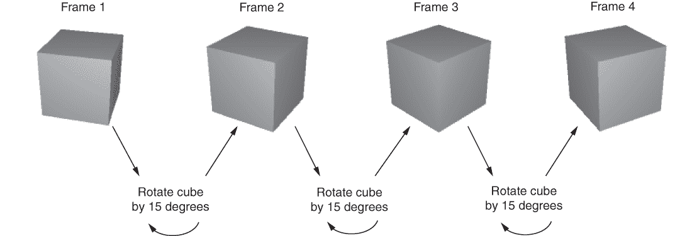

图 2.11 运动的外观：在静止图片之间转换的循环过程

记住，脚本组件有一个 Update() 方法，该方法每帧运行一次。要旋转立方体，请在 Update() 内添加旋转立方体一小量的代码。此代码将每帧重复运行。听起来很简单，对吧？

### 2.3.2 编写代码以实现图示

现在，让我们将刚刚讨论的概念付诸实践。创建一个新的 C# 脚本（记住，从“资产”菜单打开“创建”子菜单），命名为 Spin，并编写以下代码（在输入后不要忘记保存文件！）。

列表 2.1 使对象旋转

```
using System.Collections;
using System.Collections.Generic;
using UnityEngine;                       ❶

public class Spin : MonoBehaviour {
    public float speed = 3.0f;           ❷

    void Update() {
        transform.Rotate(0, speed, 0);   ❸
    }
}
```

❶ 将 Unity 的类拉入此脚本。

❷ 声明一个用于旋转速度的公共变量。

❸ 将旋转命令放在这里，使其每帧运行。

要将脚本组件添加到玩家对象，从项目视图拖动脚本并将其拖放到层次结构视图中的 Player 上。现在点击播放，你会看到视图旋转；你已经编写了使对象移动的代码！这段代码基本上是新的脚本模板加上两行新添加的代码，所以让我们看看这两行代码做了什么。

首先，我们在类定义的顶部添加了速度变量（数字后面的 f 告诉计算机将其视为浮点值；否则，C# 将十进制数字视为双精度浮点数）。旋转速度被定义为变量而不是常量，因为 Unity 在脚本组件中对公共变量做了一些方便的处理，如下面的提示所述。

提示：公共变量在 Inspector 中暴露，以便在将组件添加到游戏对象后调整组件的值。这被称为 *序列化* 值，因为 Unity 保存了变量的修改状态。

图 2.12 展示了在选中 Player 对象时，Inspector 中组件的外观。你可以输入一个新的数字，然后脚本将使用该值而不是代码中定义的默认值。这是一种方便的方法，可以在视觉编辑器中调整不同对象的组件设置，而不是硬编码每个值。

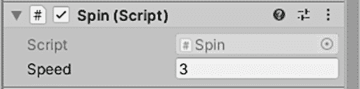

图 2.12 Inspector 显示脚本中声明的公共变量

从列表 2.1 中检查的第二行是 Rotate() 方法。它在 Update() 内部，因此命令会每帧运行。Rotate() 是 Transform 类的一个方法，因此通过该对象的 transform 组件（如大多数面向对象的语言，如果你只输入 transform，则隐含 this.transform）使用点符号调用。transform 每帧旋转速度度数，从而产生平滑的旋转运动。但为什么 Rotate() 的参数被列为 (0, speed, 0) 而不是，比如说，(speed, 0, 0)？

回想一下，在三维空间中存在三个轴，分别标记为 x、y 和 z。理解这些轴与位置和运动的关系相对直观，但这些轴也可以用来描述旋转。航空学以类似的方式描述旋转，因此处理三维图形的程序员经常使用从航空学借来的术语：俯仰、偏航和滚转。图 2.13 展示了这些术语的含义：*俯仰*是围绕 x 轴的旋转，*偏航*是围绕 y 轴的旋转，而*滚转*是围绕 z 轴的旋转。

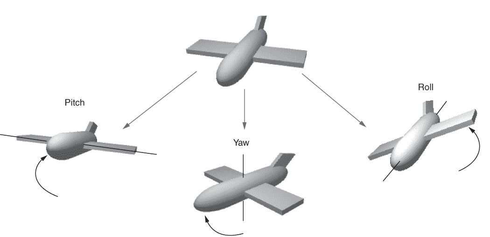

图 2.13 飞机俯仰、偏航和滚转旋转的示意图

既然我们可以描述围绕 x、y 和 z 轴的旋转，这意味着 Rotate()方法的三个参数是 X、Y 和 Z 旋转。因为我们想让玩家只围绕侧面旋转，而不是上下倾斜，所以应该只给出 Y 旋转的数值，而 X 和 Z 旋转为 0。

希望你能猜到如果你将参数更改为(speed, 0, 0)并播放场景会发生什么。现在就试试！接下来，你需要理解关于旋转和 3D 坐标轴的另一个微妙之处，体现在 Rotate()方法的可选第四个参数中。

### 2.3.3 理解局部与全局坐标空间

默认情况下，Rotate()方法作用于局部坐标。你可以使用的另一种坐标是全局坐标。你通过使用可选的第四个参数并写入 Space.Self 或 Space.World 来告诉方法是否使用局部或全局坐标，如下所示：Rotate(0, speed, 0, Space.World)。

参考第 2.1.2 节中关于 3D 坐标空间的解释，并思考这些问题：原点(0, 0, 0)在哪里？x 轴指向哪个方向？坐标系本身可以移动吗？

结果表明，每个对象都有自己的原点，以及三个轴的方向，这个坐标系随着对象移动。这被称为*局部坐标*。整个 3D 场景也有自己的原点和三个轴的方向，这个坐标系永远不会移动。这被称为*全局坐标*。因此，当你指定局部或全局给 Rotate()方法时，你是在告诉它围绕哪个对象的 x、y 和 z 轴旋转（见图 2.14）。

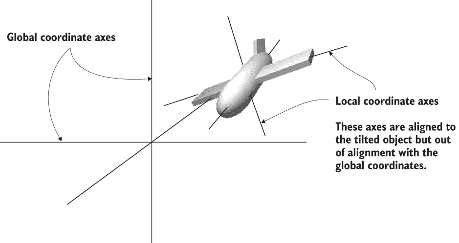

图 2.14 局部与全局坐标轴

如果你刚开始接触 3D 图形，这个概念可能会让你感到困惑。不同的轴在图 2.14 中有所表示（注意平面的“左”方向与世界的“左”方向是不同的），但理解局部和全局最简单的方法是通过一个例子。

选择玩家对象，然后稍微倾斜一下（比如 X 旋转的 30 度）。这将使局部坐标发生变化，使得局部和全局旋转看起来不同。现在尝试运行带有和没有添加 Space.World 到参数中的 Spin 脚本。如果你觉得难以可视化正在发生的事情，尝试从玩家对象中移除旋转组件，并代替旋转一个放置在玩家前面的倾斜的立方体。当你将命令设置为局部或全局坐标时，你会看到物体围绕不同的轴旋转。

## 2.4 用于环顾四周的脚本组件：MouseLook

现在，你将使旋转响应鼠标输入（即，此脚本附加到的对象的旋转，在这种情况下将是玩家）。你将通过几个步骤来完成，逐步为角色添加新的移动能力。首先，玩家将只能左右旋转，然后玩家将只能上下旋转。最终，玩家将能够向所有方向看（同时水平垂直旋转），这种行为被称为 *鼠标查看*。

由于我们将使用三种类型的旋转行为（水平、垂直和两者），你将首先编写支持所有三种行为的框架。创建一个新的 C#脚本，命名为 MouseLook，并编写以下代码。

列表 2.2 带有枚举旋转设置的 MouseLook 框架

```
using System.Collections;
using System.Collections.Generic;
using UnityEngine;

public class MouseLook : MonoBehaviour {
  public enum RotationAxes {                             ❶
    MouseXAndY = 0,
    MouseX = 1,
    MouseY = 2
  }
  public RotationAxes axes = RotationAxes.MouseXAndY;    ❷

  void Update() {
    if (axes == RotationAxes.MouseX) {
      // horizontal rotation here                        ❸
    }
    else if (axes == RotationAxes.MouseY) {
      // vertical rotation here                          ❹
    }
    else {
      // both horizontal and vertical rotation here      ❺
    }
  }
}
```

❶ 定义一个枚举数据结构，将名称与设置关联起来。

❷ 在 Unity 的编辑器中声明一个公共变量来设置。

❸ 仅在此处放置水平旋转的代码。

❹ 仅在此处放置垂直旋转的代码。

❺ 在这里放置水平和垂直旋转的代码。

注意，在 MouseLook 脚本中使用枚举来选择水平或垂直旋转。定义枚举数据结构允许你通过名称设置值，而不是输入数字并试图记住每个数字的含义（0 是水平旋转吗？是 1 吗？）。如果你声明一个类型为该枚举的公共变量，它将在检查器中显示为下拉菜单（见图 2.15），这对于选择设置非常有用。

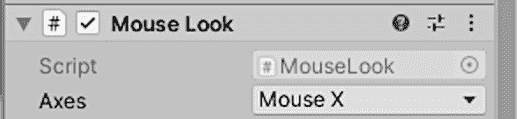

图 2.15 检查器显示公共枚举变量为下拉菜单。

移除旋转组件（与之前移除玩家胶囊的方式相同，使用右上角的菜单），然后将此新脚本附加到玩家对象上。使用检查器中的轴下拉菜单切换旋转方向。在设置好水平/垂直旋转设置后，你可以为条件语句的每个分支填写代码。

警告：在更改此轴的菜单设置之前，请确保停止游戏。Unity 允许你在游戏过程中编辑检查器（以测试设置更改），但在停止游戏后，它会撤销更改。

命名空间

*命名空间* 是一个可选的编程结构，用于在项目中组织代码。因为命名空间不是强制的，所以它们被省略了，既包括 Unity 创建的脚本文件，也包括这本书的示例项目。实际上，如果你还不熟悉命名空间，你可能希望暂时跳过这个讨论。

尽管这本书的示例代码没有使用命名空间，但你应该强烈考虑在自己的项目中使用它们，因为这样会在大型代码库中建立更清晰的组织结构。命名空间包含相关的类和接口，将类放入命名空间可以解决命名冲突的问题。如果两个类在不同的命名空间中，它们可以拥有相同的名称。

要将一个类放入命名空间中，将其放在大括号内，如下所示：

```
using System.Collections;
using System.Collections.Generic;
using UnityEngine;

namespace UnityInAction {

  public class MouseLook : MonoBehaviour {
    ...
  }
}
```

要在其他代码（例如，使用下一节中引入的 GetComponent 语句）中访问该类，要么其他代码也必须在同一命名空间中，或者你需要在代码中添加一个如 using UnityInAction; 的语句。并且命名空间不会干扰脚本组件，所以你仍然可以在 Unity 的编辑器中无障碍地使用该类。

### 2.4.1 跟随鼠标移动的水平旋转

第一个也是最简单的分支是用于水平旋转。首先，编写与列表 2.1 中相同的旋转命令，使对象旋转。别忘了声明一个用于旋转速度的公共变量；在 axes 之后但在 Update() 之前声明新变量，并将其命名为 sensitivityHor，因为在你涉及多个旋转之后，speed 这个名字太泛了。这次将变量的值增加到 9，因为接下来的几个列表中的代码需要更大的值。调整后的代码应如下所示。

列表 2.3 水平旋转，尚未响应鼠标

```
...
*public RotationAxes axes = RotationAxes.MouseXAndY;*    ❶
public float sensitivityHor = 9.0f;                    ❷

*void Update() {
  if (axes == RotationAxes.MouseX) {*
    transform.Rotate(0, sensitivityHor, 0);            ❸
  *}*
...
```

❶ 已在脚本中斜体化的代码；这里展示是为了参考。

❷ 声明一个用于旋转速度的变量。

❸ 将 Rotate 命令放在这里，以便每帧运行。

将 MouseLook 组件的 Axes 菜单设置为水平旋转并播放脚本；视图将像之前一样旋转。下一步是使旋转响应鼠标移动，因此让我们介绍一个新的方法：Input.GetAxis()。Input 类有一系列用于处理输入设备（如鼠标）的方法，GetAxis() 方法返回与鼠标移动相关的数字（正 1 到 -1，取决于移动方向）。GetAxis() 方法接受所需轴的名称作为参数，水平轴称为 Mouse X。

如果将旋转速度乘以轴值，旋转将响应鼠标移动。速度将根据鼠标移动进行缩放，缩小到零甚至反向。现在，Rotate 命令看起来如下所示。

列表 2.4 调整后的 Rotate 命令以响应鼠标

```
...
transform.Rotate(0, Input.GetAxis("Mouse X") * sensitivityHor, 0);   ❶
...
```

❶ 注意使用 GetAxis() 获取鼠标输入。

警告：确保在 Mouse X 中输入一个空格。此命令的轴名称由 Unity 定义，而不是我们代码中的轴名称。为此轴输入 MouseX 是一个常见的错误。

点击播放，然后移动鼠标。当你从一侧移动鼠标到另一侧时，视图将从一侧旋转到另一侧。这非常酷！下一步是将旋转改为垂直而不是水平。

### 2.4.2 带限制的垂直旋转

对于水平旋转，我们一直使用 Rotate()方法，但对于垂直旋转，我们将采取不同的方法。虽然该方法适用于应用变换，但它也有些不灵活。它只适用于无限制地增加旋转，这对于水平旋转来说是可行的，但垂直旋转需要限制视图可以倾斜的上限和下限。此列表显示了 MouseLook 的垂直旋转代码；代码的详细解释将立即跟随。

列表 2.5 MouseLook 的垂直旋转

```
...
public float sensitivityHor = 9.0f;
public float sensitivityVert = 9.0f;                                         ❶

public float minimumVert = -45.0f;
public float maximumVert = 45.0f;

private float verticalRot = 0;                                               ❷

void Update() {
  if (axes == RotationAxes.MouseX) {
    transform.Rotate(0, Input.GetAxis("Mouse X") * sensitivityHor, 0);
  }
  else if (axes == RotationAxes.MouseY) {
    verticalRot -= Input.GetAxis("Mouse Y") * sensitivityVert;               ❸
    verticalRot = Mathf.Clamp(verticalRot, minimumVert, maximumVert);        ❹

    float horizontalRot = transform.localEulerAngles.y;                      ❺

    transform.localEulerAngles = new Vector3(verticalRot, horizontalRot, 0); ❻
  }
...
```

❶ 声明用于垂直旋转的变量。

❷ 声明一个用于垂直角度的私有变量。

❸ 根据鼠标移动来增加垂直角度。

❹ 将垂直角度限制在最小和最大限制之间。

❺ 保持相同的 Y 角度（即，没有水平旋转）。

❻ 从存储的旋转值创建一个新的向量。

将 MouseLook 组件的 Axes 菜单设置为垂直旋转并播放新脚本。现在，当你上下移动鼠标时，视图不会左右旋转，而是会上下倾斜。倾斜会在上下极限处停止。

此代码引入了几个需要解释的新概念。首先，这次我们没有使用 Rotate()方法，因此需要一个变量来存储旋转角度（这个变量在这里称为 verticalRot，并记住垂直旋转是围绕 x 轴进行的）。Rotate()方法增加当前旋转，而此代码直接设置旋转角度。这区别于说“将角度增加 5”和“将角度设置为 30”。我们仍然需要增加旋转角度，这就是为什么代码中有 -= 运算符：从旋转角度中减去一个值，而不是将角度设置为那个值。不使用 Rotate()，我们可以以各种方式操作旋转角度，而不仅仅是增加它。旋转值乘以 Input.GetAxis()，就像水平旋转的代码一样，但现在我们请求 Mouse Y，因为那是鼠标的垂直轴。

在下一行进一步操作旋转角度。我们使用 Mathf.Clamp()来保持旋转角度在最小和最大限制之间。这些限制是在代码中较早声明的公共变量，并确保视图只能倾斜 45 度上下。Clamp()方法不仅限于旋转，但通常对于保持数字变量在限制之间非常有用。为了看看会发生什么，尝试注释掉 Clamp()行；现在倾斜不会在上下极限处停止，甚至允许你完全颠倒旋转！显然，颠倒观看世界是不理想的，这就是为什么有这些限制。

因为 transform 的角度属性是一个 Vector3，我们需要创建一个新的 Vector3，将旋转角度传递给构造函数。Rotate()方法为我们自动化了这个过程，增加旋转角度然后创建一个新的向量。

**定义** 一个**向量**是存储在一起作为一个单元的多个数字。例如，一个 Vector3 是三个数字（标记为 x、y、z）。

**警告** 我们需要创建一个新的 Vector3 而不是在变换中更改现有向量的值，因为这些值对于变换来说是只读的。这是一个常见的错误，可能会让你陷入困境。

欧拉角与四元数

你可能想知道为什么属性被称为 localEulerAngles 而不是 localRotation。首先，你需要了解四元数。

**四元数**是另一种表示旋转的数学结构。它们与欧拉角不同，欧拉角是我们一直采用的 x、y、z 轴方法的名字。还记得关于俯仰、偏航和滚转的整个讨论吗？嗯，那种表示旋转的方法使用的是欧拉角。四元数是……不同的。解释四元数很难，因为它们是高等数学中一个晦涩的方面，涉及通过四个维度的运动。要获得详细解释，请尝试访问 Cprogramming.com 网站上的“使用四元数执行 3D 旋转”（[` mng.bz/xX0B`](https://shortener.manning.com/xX0B)）。

解释为什么使用四元数来表示旋转要容易一些：在旋转值之间进行插值（通过一系列中间值逐渐从一个值变为另一个值）在使用四元数时看起来更平滑、更自然。

回到最初的问题，我们使用 localEulerAngles，因为 localRotation 是一个四元数，而不是欧拉角。Unity 还提供了一个欧拉角属性，使操作旋转更容易理解；欧拉角属性会自动转换为四元数值。Unity 在幕后处理更复杂的数学，所以你不必担心自己处理。

需要更多的代码来设置 MouseLook 的一个旋转：同时进行水平和垂直旋转。

### 2.4.3 同时进行水平和垂直旋转

这段最后的代码也不会使用 Rotate()，原因相同：垂直旋转角度在增加后会被限制在一定的范围内。这意味着现在需要直接计算水平旋转。记住，Rotate()是自动增加旋转角度的过程，如下所示。

列表 2.6 水平和垂直 MouseLook

```
...
else {
  verticalRot -= Input.GetAxis("Mouse Y") * sensitivityVert;
  verticalRot = Mathf.Clamp(verticalRot, minimumVert, maximumVert);

  float delta = Input.GetAxis("Mouse X") * sensitivityHor;        ❶
  float horizontalRot = transform.localEulerAngles.y + delta;     ❷

  transform.localEulerAngles = new Vector3(verticalRot, horizontalRot, 0);
}
...
```

❶ delta 是旋转改变的量。

❷ 通过 delta 增加旋转角度。

前几行，处理 verticalRot 的，与列表 2.5 中的完全相同。记住，围绕对象的 x 轴旋转是垂直旋转。因为水平旋转不再使用 Rotate()方法处理，这就是 delta 和 horizontalRot 行所做的事情。“Delta”是表示**改变量**的常见数学术语，因此我们的 delta 计算是旋转应该改变的数量。然后，将这个改变量加到当前的旋转角度上，以得到期望的新旋转角度。

最后，使用这两个角度（垂直和水平）创建一个新的向量，并将其分配给变换组件的角度属性。

禁止玩家进行物理旋转

尽管这对当前项目来说还不是很重要，但大多数现代第一人称射击游戏都使用一个复杂的物理模拟，影响场景中的所有对象。这个模拟导致对象弹跳和滚动。尽管这种行为对大多数对象来说看起来和效果都很好，但玩家的旋转需要完全由鼠标控制，而不受物理模拟的影响。

因此，鼠标输入脚本通常会在玩家的 Rigidbody 上设置 freezeRotation 属性。将此 Start()方法添加到 MouseLook 脚本中：

```
...
void Start() {
    Rigidbody body = GetComponent<Rigidbody>();
    if (body != null) {                          ❶
        body.freezeRotation = true;
    }
}
```

❶ 此组件可能尚未添加，请检查它是否存在。

（Rigidbody 是对象可以拥有的附加组件。物理模拟作用于 Rigidbody 组件，并操纵它们所附加的对象。）

如果你在我们讨论的各种更改和添加的地方感到困惑，这个列表包含了完整的最终脚本。或者，下载示例项目。

列表 2.7 完成的 MouseLook 脚本

```
using System.Collections;
using System.Collections.Generic;
using UnityEngine;

public class MouseLook : MonoBehaviour {
  public enum RotationAxes {
    MouseXAndY = 0,
    MouseX = 1,
    MouseY = 2
  }
  public RotationAxes axes = RotationAxes.MouseXAndY;

  public float sensitivityHor = 9.0f;
  public float sensitivityVert = 9.0f;

  public float minimumVert = -45.0f;
  public float maximumVert = 45.0f;

  private float verticalRot = 0;

  void Start() {
    Rigidbody body = GetComponent<Rigidbody>();
    if (body != null) {
        body.freezeRotation = true;
    }
  }

  void Update() {
    if (axes == RotationAxes.MouseX) {
      transform.Rotate(0, Input.GetAxis("Mouse X") * sensitivityHor, 0);
    }
    else if (axes == RotationAxes.MouseY) {
      verticalRot -= Input.GetAxis("Mouse Y") * sensitivityVert;
      verticalRot = Mathf.Clamp(verticalRot, minimumVert, maximumVert);

      float horizontalRot = transform.localEulerAngles.y;

      transform.localEulerAngles = new Vector3(verticalRot, horizontalRot, 0);
    }
    else {
      verticalRot -= Input.GetAxis("Mouse Y") * sensitivityVert;
      verticalRot = Mathf.Clamp(verticalRot, minimumVert, maximumVert);

      float delta = Input.GetAxis("Mouse X") * sensitivityHor;
      float horizontalRot = transform.localEulerAngles.y + delta;

      transform.localEulerAngles = new Vector3(verticalRot, horizontalRot, 0);
    }
  }
}
```

当你设置轴菜单并运行新代码时，你可以在移动鼠标的同时向所有方向张望。太棒了！但你仍然被困在一个地方，就像被安装在炮塔上一样四处张望。下一步是移动到场景中。

## 2.5 键盘输入组件：第一人称控制

根据鼠标输入四处张望是第一人称控制的重要部分，但你只完成了一半。玩家还需要根据键盘输入进行移动。让我们编写一个键盘控制组件来补充鼠标控制组件；创建一个新的 C#脚本名为 FPSInput 并将其附加到玩家（与 MouseLook 脚本一起）。目前，将 MouseLook 组件设置为仅水平旋转。

提示：这里解释的键盘和鼠标控制被分成单独的脚本。你不必以这种方式结构化代码，可以将所有内容打包到一个玩家控制脚本中。但组件系统（如 Unity 中的系统）在功能被分成几个较小的组件时，通常是最灵活的，因此也最有用。

你在上一节中编写的代码只影响了旋转，但现在我们将改变对象的位置。参考列表 2.1；将其输入 FPSInput，但将 Rotate()改为 Translate()。当你点击播放时，视图会向上滑动而不是旋转。

尝试更改参数值以查看运动如何改变（特别是尝试交换前两个数字）。在尝试了一段时间后，你可以继续添加键盘输入。

列表 2.8 列表 2.1 中的旋转代码，经过一些小的修改

```
using System.Collections;
using System.Collections.Generic;
using UnityEngine;

public class FPSInput : MonoBehaviour {
  public float speed = 6.0f;                 ❶

  void Update() {
    transform.Translate(0, speed, 0);        ❷
  }
}
```

❶ 初始时可能会太快，但稍后会进行修正。

❷ 将 Rotate()改为 Translate()。

### 2.5.1 响应按键

根据按键移动的代码与根据鼠标旋转的代码类似。同样使用 GetAxis()方法，并且以类似的方式使用。这个列表演示了如何使用它。

列表 2.9 根据按键进行位置移动

```
...
void Update() {
  float deltaX = Input.GetAxis("Horizontal") * speed;    ❶
  float deltaZ = Input.GetAxis("Vertical") * speed;
  transform.Translate(deltaX, 0, deltaZ);
}
...
```

❶ 水平和垂直是键盘映射的间接名称。

与之前一样，GetAxis()值乘以速度来确定移动量。之前，请求的轴总是“鼠标某个东西”，现在我们传递水平或垂直。这些名称是 Unity 中输入设置的抽象；如果你在项目设置下的编辑菜单中查看，然后在输入管理器下查看，你会找到一个抽象输入名称列表以及映射到这些名称的确切控制。左右箭头键和字母 A 和 D 都映射到水平，而上下箭头键和字母 W 和 S 都映射到垂直。

注意，移动值应用于 x 和 z 坐标。正如你可能在使用 Translate()方法进行实验时注意到的，x 坐标在左右移动，而 z 坐标向前和向后移动。

输入新的移动代码后，你应该可以通过按箭头键或 W、A、S、D 字母键来移动，这是大多数 FPS 游戏中的标准。移动脚本几乎完成了，但我们还有一些调整需要讨论。

### 2.5.2 设置与电脑速度无关的移动速率

目前还不明显，因为你只是在你的电脑上运行代码，但如果你在不同的机器上运行代码，它们的运行速度会不同。这是因为一些电脑可以比其他电脑更快地处理代码和图形。目前，玩家在不同电脑上的移动速度会不同，因为移动代码与电脑的速度相关联。这被称为*帧率依赖性*，因为移动代码依赖于游戏的帧率。

想象你在两台电脑上运行这个演示，一台每秒 30 帧（fps），另一台每秒 60 帧。这意味着第二台电脑上的 Update()会被调用两次，每次应用相同的速度值 6。在 30fps 下，移动速度将是每秒 180 单位，而在 60fps 下的移动将是每秒 360 单位。对于大多数游戏来说，这种速度变化的移动是不好的消息。

解决方案是调整移动代码，使其*不依赖于帧率*。这种移动速度不依赖于游戏的帧率。实现这一点的方法是在每个帧率上不应用相同的速度值。相反，根据电脑的运行速度，将速度值放大或缩小。这是通过将速度值乘以另一个称为 deltaTime 的值来实现的。

列表 2.10 使用 deltaTime 实现帧率无关的移动

```
...
void Update() {
  float deltaX = Input.GetAxis("Horizontal") * speed;
  float deltaZ = Input.GetAxis("Vertical") * speed;
  transform.Translate(deltaX * Time.deltaTime, 0, deltaZ * Time.deltaTime);
}
...
```

这只是一个简单的更改。Time 类具有用于计时的属性和方法，其中一个属性是 deltaTime。我们知道*delta*意味着变化量，所以这意味着 deltaTime 是时间的变化量。具体来说，deltaTime 是帧之间的时间量。帧之间的时间量在不同帧率下会有所不同（例如，30 fps 的 deltaTime 为 1/30 秒），所以将速度值乘以 deltaTime 将根据不同的计算机调整速度值。

现在所有计算机上的移动速度都将相同。但移动脚本仍然没有完成。当你四处移动时，你可以穿过墙壁，所以我们需要进一步调整代码以防止这种情况。

### 2.5.3 为碰撞检测移动 CharacterController

直接更改对象的变换不应用碰撞检测，因此角色会穿过墙壁。为了应用碰撞检测，我们想要做的是使用 CharacterController，这是一个使对象移动更像游戏中的角色的组件，包括与墙壁碰撞。回想一下，在我们设置玩家时，我们附加了一个 CharacterController，所以现在我们将使用 FPSInput 中的移动代码来使用该组件。

列表 2.11 替换 Transform 移动 CharacterController

```
...
private CharacterController charController;                ❶

void Start() {
  charController = GetComponent<CharacterController>();    ❷
}

void Update() {
  float deltaX = Input.GetAxis("Horizontal") * speed;
  float deltaZ = Input.GetAxis("Vertical") * speed;
  Vector3 movement = new Vector3(deltaX, 0, deltaZ);
  movement = Vector3.ClampMagnitude(movement, speed);      ❸

  movement *= Time.deltaTime;
  movement = transform.TransformDirection(movement);       ❹
  charController.Move(movement);                           ❺
}
...
```

❶ 参考 CharacterController 的变量

❷ 访问同一对象上附加的其他组件。

❸ 将对角线移动限制为与沿轴移动相同的速度。

❹ 将移动向量从局部坐标转换为全局坐标。

❺ 告诉 CharacterController 按该向量移动。

这段代码片段介绍了几个新概念。首先需要指出的是，用于引用 CharacterController 的变量。这个变量创建了对对象的本地引用（代码对象，即不要与场景对象混淆）；多个脚本可以引用这个 CharacterController 实例。

这个变量最初是空的，所以在你可以使用引用之前，你需要为它分配一个对象。这就是 GetComponent()发挥作用的地方；该方法返回附加到同一 GameObject 上的其他组件。而不是在括号内传递参数，你使用 C#语法在尖括号<>内定义类型。

一旦你有了 CharacterController 的引用，你就可以在控制器上调用 Move()方法。向该方法传递一个向量，类似于鼠标旋转代码使用向量作为旋转值的方式。同样，类似于限制旋转值的方式，使用 Vector3.ClampMagnitude()来限制向量的长度到移动速度。使用限制是因为，否则，对角线移动的长度将大于沿轴直接移动的长度（想象一下直角三角形的边和斜边）。

但这里的移动向量有一个棘手的地方，这与局部和全局有关，正如我们之前在讨论旋转时提到的。我们将创建一个向量，其值用于向左移动，比如说。但这实际上是 *玩家* 的左侧，然而，这可能与 *世界* 的左侧完全不同——也就是说，我们在这里讨论的是局部空间中的左侧，而不是全局空间。

我们需要将定义在全局空间中的移动向量传递给 Move() 方法，因此我们需要将局部空间向量转换为全局空间向量。这个转换过程涉及复杂的数学计算，但幸运的是，Unity 已经为我们处理了这些数学问题，我们只需调用 TransformDirection() 方法即可，嗯，转换方向。

在这个上下文中，*变换* 的定义是指从一个坐标系转换到另一个坐标系（如果你不记得坐标系是什么，请参考第 2.3.3 节）。不要与其他变换的定义混淆，包括 Transform 组件和对象在场景中移动的动作。这是一个有点过载的术语，因为所有这些含义都指代同一个基本概念。

现在测试移动代码。如果你还没有这样做，将 MouseLook 组件设置为水平和垂直旋转。你可以完全环顾场景，并通过使用键盘控制来在场景中飞行。如果你想让玩家在场景中飞行，这非常棒，但如果你想让玩家行走而不是飞行怎么办？

### 2.5.4 调整组件以实现行走而不是飞行

现在碰撞检测已经生效，脚本可以包含重力，玩家将保持在地板上。声明一个重力变量，并使用该值作为 y 轴。

列表 2.12 向移动代码添加重力

```
...
public float gravity = -9.8f;
...
void Update() {
  ...
  movement = Vector3.ClampMagnitude(movement, speed);

  movement.y = gravity;             ❶

  movement *= Time.deltaTime;
  ...
```

❶ 使用重力值而不是仅仅 0。

现在玩家有一个恒定的向下力，但它并不总是指向正下方，因为玩家对象可以随着鼠标上下倾斜。幸运的是，我们需要的所有东西都已经就位，所以我们只需要对玩家上组件的设置进行一些小的调整。首先，将玩家对象上的 MouseLook 组件设置为仅水平旋转。将 MouseLook 组件添加到相机对象上，并将该设置为仅垂直旋转。没错；你将有两个对象响应鼠标！

因为玩家对象现在只进行水平旋转，所以重力向下的力不再倾斜。相机对象是玩家对象的子对象（记得我们在 Hierarchy 视图中做的那件事吗？），所以尽管相机垂直旋转独立于玩家，但相机在水平方向上与玩家一起旋转。

精炼完成的脚本

使用 RequireComponent 属性来确保脚本需要的其他组件也被附加。有时其他组件是可选的（也就是说，代码中会说，“如果这个其他组件也被附加，那么……”），但有时你希望其他组件是强制性的。将 RequireComponent 添加到脚本的顶部以强制依赖，并在括号内提供所需的组件作为参数。

同样，如果你将 AddComponentMenu 属性添加到你的脚本顶部，那么该脚本将被添加到 Unity 编辑器的组件菜单中。告诉属性你想要添加的菜单项的名称，然后当你点击检查器底部的添加组件时，可以选择脚本。方便！同时添加了这两个属性的脚本看起来可能像这样：

```
using System.Collections;
using System.Collections.Generic;
using UnityEngine;

[RequireComponent(typeof(CharacterController))]
[AddComponentMenu("Control Script/FPS Input")]
public class FPSInput : MonoBehaviour {
...
```

列表 2.13 显示了完整的完成脚本。除了对玩家上组件设置的微小调整外，玩家可以在房间里四处走动。即使应用了重力变量，你仍然可以通过在检查器中将重力设置为 0 来使用此脚本进行飞行移动。

列表 2.13 完成的 FPSInput 脚本

```
using System.Collections;
using System.Collections.Generic;
using UnityEngine;

[RequireComponent(typeof(CharacterController))]
[AddComponentMenu("Control Script/FPS Input")]
public class FPSInput : MonoBehaviour {
  public float speed = 6.0f;
  public float gravity = -9.8f;

  private CharacterController charController;

  void Start() {
    charController = GetComponent<CharacterController>();
  }

  void Update() {
    float deltaX = Input.GetAxis("Horizontal") * speed;
    float deltaZ = Input.GetAxis("Vertical") * speed;
    Vector3 movement = new Vector3(deltaX, 0, deltaZ);
    movement = Vector3.ClampMagnitude(movement, speed);

    movement.y = gravity;

    movement *= Time.deltaTime;
    movement = transform.TransformDirection(movement);
    charController.Move(movement);
  }
}
```

恭喜你构建了这个 3D 项目！在本章中，我们涵盖了大量的内容，现在你对如何在 Unity 中编写移动代码已经非常熟悉。尽管这个第一个演示很令人兴奋，但它离成为一个完整的游戏还差得很远。毕竟，项目计划将这个描述为一个基本的 FPS 场景，如果你不能射击，那射击游戏又是什么呢？所以，为这一章的项目给自己一个应得的掌声，然后准备下一步。

## 摘要

+   3D 坐标空间由 x、y 和 z 轴定义。

+   房间中的物体和灯光设置场景。

+   第一人称场景中的玩家本质上是一个摄像头。

+   移动代码在每个帧中重复应用小的变换。

+   FPS 控制包括鼠标旋转和键盘移动。
