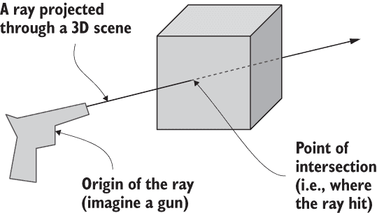
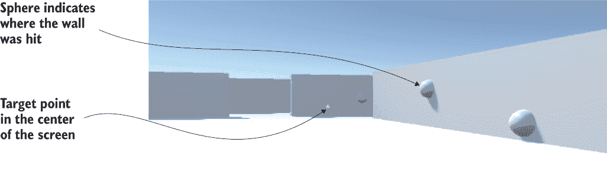
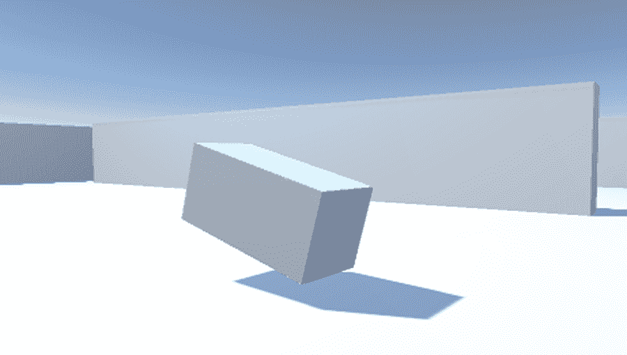
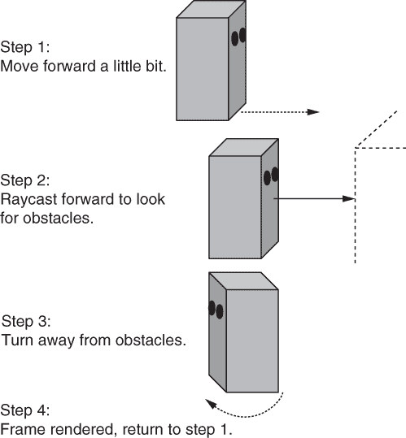
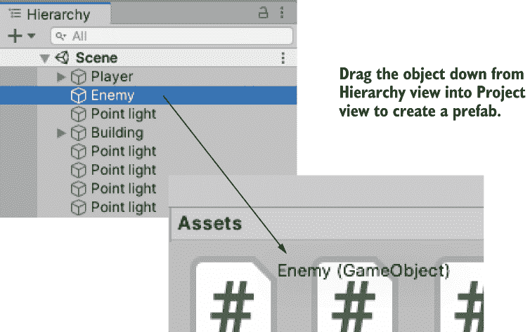
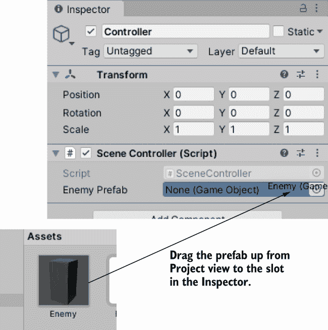
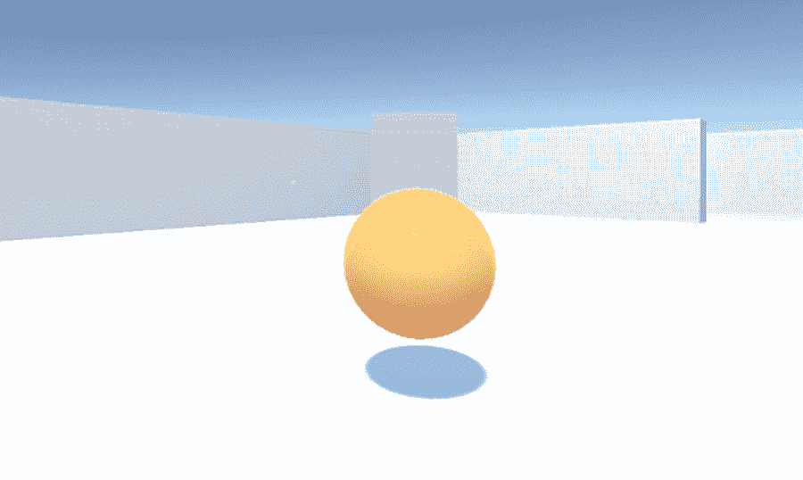
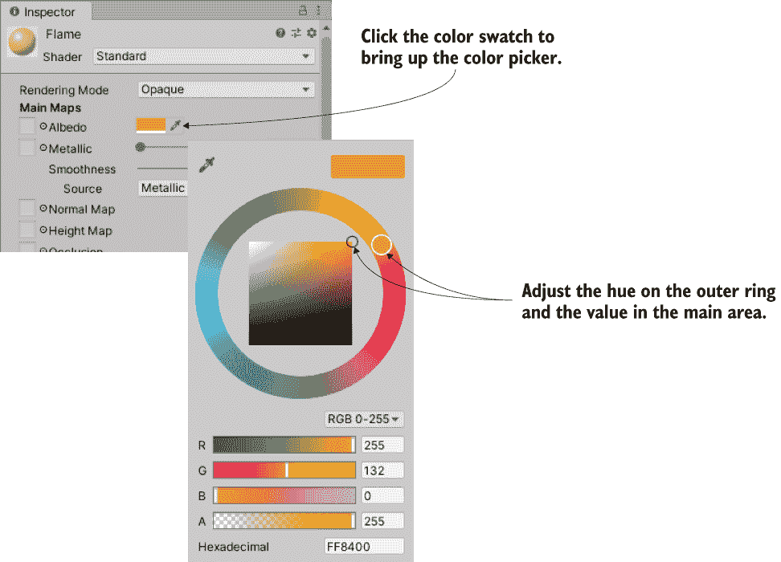
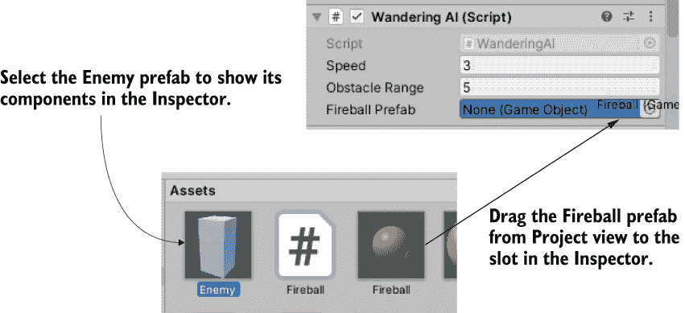
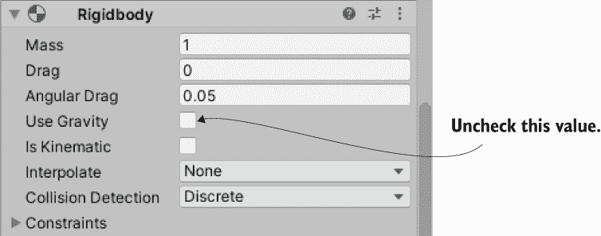

# 3 向 3D 游戏添加敌人和弹丸

本章涵盖

+   对准和射击，包括玩家和敌人的射击

+   检测并响应击中

+   制作四处游荡的敌人

+   在场景中生成新对象

上一章中的移动演示相当酷，但仍然不是一个真正的游戏。让我们将这个移动演示变成一个第一人称射击游戏。如果你现在考虑我们还需要什么，归结起来就是射击的能力和射击的目标。

首先，我们将编写脚本，使玩家能够向场景中的对象射击。然后，我们将构建敌人来填充场景，包括四处游荡和被击中时做出反应的代码。最后，我们将使敌人能够反击，向玩家发射火球。第二章中的任何脚本都不需要更改；相反，我们将向项目中添加脚本——处理额外功能的脚本。

我选择第一人称射击游戏作为这个项目的几个原因之一。一个简单的原因是 FPS 游戏很受欢迎：人们喜欢射击游戏，所以让我们做一个射击游戏。一个更微妙的原因与你会学到的技术有关；这个项目是学习 3D 模拟中几个基本概念的好方法。例如，射击游戏是教授光线投射的绝佳方式。稍后我们将深入了解这是什么，但就现在而言，你需要知道的是，它是一个在 3D 模拟中许多任务中非常有用的概念。尽管光线投射在许多情况下都很有用，但使用光线投射对于射击来说最直观。

创建游荡的目标进行射击为我们提供了一个很好的理由来探索计算机控制角色的代码，以及使用发送消息和生成对象的技巧。实际上，这种游荡行为是光线投射有价值的另一个地方，所以我们将在学习射击后立即查看技术的另一种应用。同样，在这个项目中展示的消息发送方法在其他地方也很有用。在未来的章节中，你将看到这些技术的其他应用，甚至在这个项目中我们也会探讨不同的情境。

最终，我们将一次添加一个新功能来处理这个项目，游戏在每一步都是可玩的，但同时也总感觉下一部分还有缺失的部分要工作。这个路线图将步骤分解成小而可理解的变化，每次只添加一个新功能：

1.  编写代码使玩家能够向场景中射击。

1.  创建对击中做出反应的静态目标。

1.  让目标四处游荡。

1.  自动生成游荡的目标。

1.  允许目标/敌人向玩家发射火球。

注意：本章的项目假设你已经有一个可以在此基础上构建的第一人称移动演示。我们在第二章中创建了一个移动演示，但如果你直接跳到了这一章，你需要下载第二章的示例文件。

## 3.1 通过射线投射射击

在 3D 演示中引入的第一个新功能是射击。环顾四周和移动对于第一人称射击游戏当然是关键功能，但直到玩家可以影响模拟并应用他们的技能之前，这还不是一款游戏。在 3D 游戏中，射击可以通过几种方法实现，其中最重要的方法之一是射线投射。

### 3.1.1 什么是射线投射？

如其名所示，*射线投射* 是将射线投射到场景中。清楚了吗？好吧，那么射线究竟是什么？

定义：*射线* 是场景中从某一点出发并沿特定方向延伸的想象或不可见线。

在射线投射中，你创建一个射线，然后确定它与什么相交。图 3.1 阐述了这一概念。考虑当你从枪中发射子弹时会发生什么：子弹从枪的位置开始，然后沿直线向前飞行，直到击中某个物体。射线与子弹的路径类似，射线投射与发射子弹并查看它击中了什么类似。



图 3.1 射线是一个想象中的线，射线投射是找到这条线与什么相交。

如你所想，射线投射背后的数学通常很复杂。不仅计算一条线与 3D 平面的交点很棘手，而且你还需要对场景中所有网格对象的全部多边形都这样做（记住，*网格对象* 是由许多连接的线和形状构成的 3D 可视化）。幸运的是，Unity 处理了射线投射背后的困难数学，但你仍然需要担心更高级的问题，比如射线从哪里投射以及为什么。

在这个项目中，对于后一个问题（为什么）的答案是模拟子弹射入场景。对于第一人称射击游戏，射线通常从摄像机位置开始，然后穿过摄像机视场的中心。换句话说，你正在检查摄像机正前方的物体；Unity 提供了使这项任务变得简单的命令。让我们看看这些命令。

### 3.1.2 使用 ScreenPointToRay 命令进行射击

你将通过投射从摄像机开始并延伸到视场中心的射线来实现射击。Unity 提供了 ScreenPointToRay() 方法来执行此操作。

图 3.2 展示了调用此方法时发生的情况。它创建了一个从摄像头开始并投射到角度的射线，通过给定的屏幕坐标。通常，鼠标位置坐标用于 *鼠标拾取*（选择鼠标下的对象），但对于第一人称射击，使用屏幕中心。一旦有了射线，就可以将其传递给 Physics.Raycast() 方法，使用该射线进行射线投射。


图 3.2 ScreenPointToRay() 方法从摄像头通过给定的屏幕坐标投射射线。

让我们编写使用我们刚才讨论的方法的代码。在 Unity 中，创建一个新的 C# 脚本，命名为 RayShooter，将其附加到摄像头（而不是玩家对象），然后在此列表中编写代码。

列表 3.1 将附加到摄像头的 RayShooter 脚本

```
using System.Collections;
using System.Collections.Generic;
using UnityEngine;

public class RayShooter : MonoBehaviour {
  private Camera cam;

  void Start() {
    cam = GetComponent<Camera>();                                          ❶
  }

  void Update() {
    if (Input.GetMouseButtonDown(0)) {                                     ❷
      Vector3 point = new Vector3(cam.pixelWidth/2, cam.pixelHeight/2, 0); ❸
      Ray ray = cam.ScreenPointToRay(point);                               ❹
      RaycastHit hit;
      if (Physics.Raycast(ray, out hit)) {                                 ❺
        Debug.Log("Hit " + hit.point);                                     ❻
      }
    }
  }
}
```

❶ 访问附加到同一对象的其他组件。

❷ 响应左（第一个）鼠标按钮。

❸ 屏幕的中间是其宽度和高度的一半。

❹ 使用 ScreenPointToRay() 在该位置创建射线。

❺ 射线投射将信息填充到引用变量中。

❻ 获取射线击中的坐标。

在此代码列表中，你应该注意几个要点。首先，在 Start() 中检索了 Camera 组件，就像上一章中的 CharacterController 一样。然后，将剩余的代码放在 Update() 中，因为它需要反复检查鼠标，而不是只检查一次。Input.GetMouseButtonDown() 方法返回 true 或 false，取决于鼠标是否被点击，因此将此命令放在条件语句中意味着只有当鼠标被点击时，包含的代码才会运行。你希望在玩家点击鼠标时射击，因此对鼠标按钮进行了条件检查。

创建了一个向量来定义射线的屏幕坐标（记住向量是一组相关数字存储在一起）。摄像头的 pixelWidth 和 pixelHeight 值给出了屏幕的大小，所以将这些值除以二就得到了屏幕中心。尽管屏幕坐标是二维的，只有水平和垂直分量，没有深度，但创建了一个 Vector3，因为 ScreenPointToRay() 需要这种数据类型（可能是因为计算射线涉及到 3D 向量的算术）。使用这组坐标调用了 ScreenPointToRay()，结果得到一个 Ray 对象（一个代码对象，而不是游戏对象；两者有时可能会混淆）。

然后，射线被传递到 Raycast() 方法，但传递的不仅仅是这个对象。还有一个 RaycastHit 数据结构；RaycastHit 是关于射线交点的信息集合，包括交点发生的位置和被交对象。C# 语法中的 out 确保在命令中操作的数据结构与命令外存在的对象是相同的，而不是在不同函数作用域中的分离副本。

在设置好这些参数后，Physics.Raycast() 方法可以执行其工作。此方法检查给定射线的交点，填充关于交点的数据，并在射线击中任何物体时返回 true。因为返回的是一个布尔值，所以这个方法可以被放入条件检查中，就像你之前使用的 Input.GetMouseButtonDown() 一样。

目前，代码会发出一个控制台消息来指示何时发生交点。这个控制台消息显示了射线击中的点的 3D 坐标（我们在第二章讨论的 x、y、z 值）。但可能很难可视化射线击中的确切位置；同样，也可能很难确定屏幕中心的位置（射线射击通过的位置）。让我们添加视觉指示器来解决这两个问题。

### 3.1.3 添加瞄准和击中的视觉指示器

我们下一步是添加两种视觉指示器：屏幕中心的瞄准点和场景中射线击中的标记。对于第一人称射击游戏，后者通常是弹孔，但现在你将在该位置放置一个空白球体（并在 1 秒后使用协程移除球体）。图 3.3 显示了你将看到的内容。

定义 *协程* 是一种处理随时间增量执行的任务的方式。相比之下，大多数函数会让程序等待它们完成。

首先，让我们添加指示器来标记射线击中的位置。列表 3.2 显示了添加此功能后的脚本。在场景中四处走动，射击；看到球体指示器非常有趣！



图 3.3 在添加瞄准和击中视觉指示器后重复射击

列表 3.2 添加了球体指示器的 RayShooter 脚本

```
using System.Collections;
using System.Collections.Generic;
using UnityEngine;

public class RayShooter : MonoBehaviour {
  private Camera cam;

  void Start() {
    cam = GetComponent<Camera>();
  }

  void Update() {                                             ❶
    if (Input.GetMouseButtonDown(0)) {
      Vector3 point = new Vector3(cam.pixelWidth/2, cam.pixelHeight/2, 0);
      Ray ray = cam.ScreenPointToRay(point);
      RaycastHit hit;
      if (Physics.Raycast(ray, out hit)) {
        StartCoroutine(SphereIndicator(hit.point));           ❷
      }
    }
  }

  private IEnumerator SphereIndicator(Vector3 pos) {          ❸
    GameObject sphere = GameObject.CreatePrimitive(PrimitiveType.Sphere);
    sphere.transform.position = pos;

    yield return new WaitForSeconds(1);                       ❹

    Destroy(sphere);                                          ❺
  }
}
```

❶ 此函数主要与列表 3.1 中的射线投射代码相同。

❷ 在击中时启动一个协程。

❸ 协程使用 IEnumerator 函数。

❹ yield 关键字告诉协程在哪里暂停。

❺ 删除此 GameObject 并清除其内存。

新的方法是 SphereIndicator()，以及在现有的 Update() 方法中的一行修改。此方法在场景中的某个点创建一个球体，然后在第二秒后移除该球体。从射线投射代码中调用 SphereIndicator() 确保会有视觉指示器显示射线击中的确切位置。此函数使用 IEnumerator 定义，该类型与协程的概念相关联。

从技术上讲，协程不是异步的（异步操作不会停止其他代码的运行；想想在网站脚本的下载图像），但通过巧妙地使用枚举器，Unity 使协程的行为类似于异步函数。协程的秘密在于 yield 关键字；该关键字使协程暂时暂停，将程序流程交回，并在下一帧从该点继续。这样，协程似乎在程序的背景中运行，通过部分运行然后返回到程序其余部分的重复循环。

如其名所示，StartCoroutine()使协程开始运行。一旦协程开始，它就会一直运行直到函数完成；在运行过程中会暂停。注意一个微妙但重要的点，即传递给 StartCoroutine()的方法名后有括号：这种语法意味着你正在调用该函数，而不是传递其名称。被调用的函数会一直运行，直到遇到 yield 命令，此时函数会暂停。

SphereIndicator() 在特定位置创建一个球体，暂停以等待 yield 语句，然后在协程恢复后销毁球体。暂停的长度由 yield 返回的值控制。在协程中有几种类型的返回值可以工作，但最直接的是返回要等待的具体时间长度。返回 WaitForSeconds(1)会使协程暂停 1 秒。创建一个球体，暂停 1 秒，然后销毁球体：这个序列设置了一个临时的视觉指示器。

列表 3.2 给了你标记射线击中位置的指示器。但你还需要在屏幕中央有一个瞄准点。

列表 3.3 瞄准视觉指示器

```
...
void Start() {
  cam = GetComponent<Camera>();

  Cursor.lockState = CursorLockMode.Locked;          ❶
  Cursor.visible = false;                            ❶
}

void OnGUI() {
  int size = 12;                                     ❷
  float posX = cam.pixelWidth/2 - size/4;
  float posY = cam.pixelHeight/2 - size/2;
  GUI.Label(new Rect(posX, posY, size, size), "*");  ❸
}
...
```

❶ 将鼠标光标隐藏在屏幕中央。

❷ 这只是这个字体的大致大小。

❸ GUI.Label()命令在屏幕上显示文本。

RayShooter 类中已添加了一种新的方法，称为 OnGUI()。Unity 自带了一个基本的和更高级的 UI 系统。由于基本系统有很多限制，我们将在未来的章节中构建一个更灵活的高级 UI，但到目前为止，使用基本 UI 在屏幕中央显示一个点要容易得多。与 Start()和 Update()类似，每个 MonoBehaviour 都会自动响应 OnGUI()方法。该函数在 3D 场景渲染后每帧运行一次，导致在 OnGUI()期间绘制的所有内容都显示在 3D 场景之上（想象在风景画上贴上贴纸）。

定义 *渲染* 是计算机绘制 3D 场景像素的动作。尽管场景是用 x、y 和 z 坐标定义的，但你在显示器上实际看到的是彩色像素的二维网格。为了显示 3D 场景，计算机需要计算二维网格中所有像素的颜色；运行该算法被称为 *渲染*。

在 OnGUI()内部，代码定义了显示的 2D 坐标（稍微调整以考虑标签的大小），然后调用 GUI.Label()。该方法显示一个文本标签。因为传递给标签的字符串是一个星号(*)，所以你会在屏幕中央看到这个字符。现在在我们的初生 FPS 游戏中瞄准要容易得多！

列表 3.3 还将光标设置添加到 Start()方法中。所发生的一切只是设置了光标可见性和锁定状态的值。如果你省略光标值，脚本仍然可以完美工作，但这些设置使得第一人称控制工作得更加顺畅。鼠标光标将保持在屏幕中央，为了避免视图杂乱，光标将变为不可见，并且只有在按下 Esc 键时才会重新出现。

警告：始终记住，你可以按 Esc 键解锁鼠标光标，以便将其从游戏视图的中间移开。当鼠标光标被锁定时，无法点击播放按钮并停止游戏。

这就完成了第一人称射击代码……好吧，至少完成了交互的玩家端，但我们仍然需要处理目标。

## 3.2 编写响应式目标脚本

能够射击固然很好，但截至目前，玩家没有任何东西可以射击。我们将创建一个目标物体，并给它一个响应被击中的脚本。或者更确切地说，我们将稍微修改射击代码，以便在击中目标时通知目标，然后目标上的脚本会在收到通知时做出反应。

### 3.2.1 确定被击中的物体

首先，你需要创建一个新的射击目标。创建一个新的立方体对象（GameObject > 3D Object > Cube），然后将 Y 缩放设置为 2，将 X 和 Z 保持为 1。将新物体放置在 0, 1, 0 的位置，使其位于房间中央的地板上，并将物体命名为 Enemy。

创建一个名为 ReactiveTarget 的新脚本，并将其附加到新创建的盒子。很快，你将为这个脚本编写代码，但现在先让它保持默认设置；你提前创建这个脚本文件，因为下一个代码列表需要它存在才能编译。

返回 RayShooter 并按照以下列表修改射线投射代码。运行新代码并射击新目标；调试信息将出现在控制台而不是场景中的球体指示器。

列表 3.4 检测目标物体是否被击中

```
...
if (Physics.Raycast(ray, out hit)) {
  GameObject hitObject = hit.transform.gameObject;                   ❶
  ReactiveTarget target = hitObject.GetComponent<ReactiveTarget>();
  if (target != null) {                                              ❷
    Debug.Log("Target hit");
  } else {
    StartCoroutine(SphereIndicator(hit.point));
  }
}
...
```

❶ 检索射线击中的物体。

❷ 检查物体上的 ReactiveTarget 组件。

注意，你从 RaycastHit 中检索物体，就像检索球体指示器的坐标一样。技术上，击中信息并不返回被击中的游戏对象；它指示被击中的 Transform 组件。然后你可以通过 transform 属性访问 gameObject。

然后，你使用 GetComponent()方法在对象上检查它是否是反应性目标（即是否附加了 ReactiveTarget 脚本）。正如你之前看到的，该方法返回附加到 GameObject 上的特定类型的组件。如果没有附加该类型的组件，GetComponent()不会返回任何内容。你检查是否返回了 null，并在每种情况下运行不同的代码。

如果被击中的物体是反应性目标，代码将发出调试信息而不是启动球体指示器的协程。现在让我们通知目标物体它被击中，以便它能够做出反应。

### 3.2.2 通知目标它被击中

代码中只需要一行更改，如下所示。

列表 3.5 向目标对象发送消息

```
...
if (target != null) {
  target.ReactToHit();        ❶
} else {
  StartCoroutine(SphereIndicator(hit.point));
}
...
```

❶ 调用目标的方法而不是仅仅发出调试信息。

现在，射击代码调用目标的方法，因此让我们编写那个目标方法。在 ReactiveTarget 脚本中，编写下一列表中的代码。当你射击目标物体时，目标物体会倾倒并消失；参见图 3.4。

列表 3.6 当被击中时死亡的 ReactiveTarget 脚本

```
using System.Collections;
using System.Collections.Generic;
using UnityEngine;

public class ReactiveTarget : MonoBehaviour {

  public void ReactToHit() {                ❶
    StartCoroutine(Die());
  }

  private IEnumerator Die() {               ❷
    this.transform.Rotate(-75, 0, 0);

    yield return new WaitForSeconds(1.5f);

    Destroy(this.gameObject);               ❸
  }
}
```

❶ 被射击脚本调用的方法

❷ 推倒敌人，等待 1.5 秒，然后摧毁敌人。

❸ 一个脚本可以销毁自己（就像它可以销毁一个单独的对象一样）。

这段代码的大部分内容你应该已经从之前的脚本中熟悉了，所以我们只会简要地介绍它。首先，你定义 ReactToHit()方法，因为这是射击脚本中调用的方法名。这个方法启动一个与之前球体指示器代码相似的协程；主要区别在于它操作的是这个脚本的对象，而不是创建一个单独的对象。像 this.gameObject 这样的表达式指的是这个脚本附加到的 GameObject（this 关键字是可选的，因此代码可以不带有任何内容地引用 gameObject）。

协程函数的第一行使物体倾倒。正如在第二章中讨论的那样，旋转可以定义为围绕每个坐标轴 x、y 和 z 的角度。因为我们不希望物体左右旋转，所以将 Y 和 Z 设置为 0，并给 X 旋转分配一个角度。



图 3.4 目标物体被击中后倾倒

注意：变换是即时应用的，但你可能更喜欢看到物体倾倒时的移动。一旦你开始寻找这本书之外的更高级主题，你可能想查找*tweens*，这是一种用于使物体在一段时间内平滑移动的系统。

方法中的第二行使用了协程至关重要的 yield 关键字，暂停函数在此处并返回在恢复之前需要等待的秒数。最后，游戏对象在函数的最后一行销毁自己。Destroy(this.gameObject)在等待时间后调用，就像代码在之前调用 Destroy(sphere)一样。

警告：务必在 this.gameObject 上调用 Destroy()，而不是简单地调用 this！不要混淆这两个；this 仅指代此脚本组件，而 this.gameObject 指代脚本附加到的对象。

目标现在对被射击做出反应——太好了！但它自己不做任何事情，所以让我们添加更多行为，使这个目标成为一个合适的敌人角色。

## 3.3 基本游荡型 AI

一个静态目标并不特别有趣，所以让我们编写代码让敌人四处游荡。游荡的代码几乎是人工智能（AI）或计算机控制实体的最简单例子。在这种情况下，实体是游戏中的敌人，但它也可能是现实世界中的机器人，或者是一个下棋的声音，例如。

### 3.3.1 绘制基本 AI 的工作原理图

存在多种 AI 实现方法（实际上，AI 是计算机科学家研究的主要领域）。就我们的目的而言，我们将坚持使用一种简单的方法。随着你变得更加熟练，你的游戏变得更加复杂，你可能想要探索各种 AI 实现方法。

图 3.5 展示了基本过程。在每一帧中，AI 代码将扫描其环境以确定是否需要做出反应。如果出现障碍物，敌人会转向面对不同的方向。无论敌人是否需要转向，它都会始终稳步前进。因此，敌人会在房间内来回弹跳，始终前进并转向以避开墙壁。



图 3.5 基本 AI：前进和避开障碍物的循环过程

代码看起来相当熟悉，因为它通过使用与移动玩家前进相同的命令来推动敌人前进。AI 代码也将使用射线投射，类似于射击，但应用在不同的上下文中。

### 3.3.2 使用射线投射“看到”障碍物

正如你在本章引言中看到的，射线投射是 3D 模拟中用于多个任务的技术。一个容易理解的任务是射击，但射线投射还可以用于另一个任务，即扫描场景。鉴于扫描场景是 AI 代码中的一步，这意味着射线投射被用于 AI 代码中。

之前，你创建了一个从摄像机出发的射线，因为玩家就是从那里看的。这次，你将创建一个从敌人出发的射线。第一个射线从屏幕中心射出，但这次射线将在角色前方射出；图 3.6 展示了这一点。然后，就像射击代码使用 RaycastHit 信息来确定是否击中了什么以及在哪里一样，AI 代码将使用 RaycastHit 信息来确定敌人前方是否有物体，如果有，距离有多远。


图 3.6 使用射线投射“看到”障碍物

射线追踪用于射击和用于 AI 的射线追踪之间的一个区别是射线的半径。对于射击，射线被视为无限薄的，但对于 AI，射线将被视为具有很大的横截面积。从代码的角度来看，这意味着使用 SphereCast()方法而不是 Raycast()方法。这种差异的原因是子弹很小，而检查角色前方是否有障碍物需要我们考虑角色的宽度。

创建一个新的脚本名为 WanderingAI，将其附加到目标对象（与 ReactiveTarget 脚本一起），并编写下一列表中的代码。现在播放场景，你应该看到敌人正在房间内徘徊；你仍然可以射击目标，它将以与之前相同的方式做出反应。

列表 3.7 基本 WanderingAI 脚本

```
using System.Collections;
using System.Collections.Generic;
using UnityEngine;

public class WanderingAI : MonoBehaviour {
  public float speed = 3.0f;                                   ❶
  public float obstacleRange = 5.0f;

  void Update() {
    transform.Translate(0, 0, speed * Time.deltaTime);         ❷

    Ray ray = new Ray(transform.position, transform.forward);  ❸
    RaycastHit hit;
    if (Physics.SphereCast(ray, 0.75f, out hit)) {             ❹
      if (hit.distance < obstacleRange) {
        float angle = Random.Range(-110, 110);                 ❺
        transform.Rotate(0, angle, 0);
      }
    }
  }
}
```

❶ 移动速度和反应障碍物的距离的值

❷ 每一帧都持续向前移动，无论转向与否。

❸ 与角色在同一位置且指向同一方向的射线

❹ 在射线周围进行圆形体积的射线追踪。

❺ 向一个半随机的新方向转向。

此列表添加了几个变量来表示移动速度和 AI 对障碍物做出反应的距离。然后，在 Update()方法中添加 transform.Translate()以实现持续向前移动（包括使用 deltaTime 进行帧率无关的运动）。在 Update()中，你还会看到与之前射击脚本非常相似的射线追踪代码；再次，这里使用相同的射线追踪技术来观察而不是射击。射线是通过使用敌人的位置和方向创建的，而不是使用相机。

如前所述，射线追踪计算是通过 Physics.SphereCast()方法完成的。此方法使用半径参数来确定要检测射线周围多远处的交点，但在其他所有方面，它与 Physics.Raycast()方法完全相同。这种相似性包括命令如何填充击中信息，如何检查交点，以及如何使用距离属性确保只有在敌人接近障碍物时才做出反应（而不是房间对面的墙壁）。

当敌人前方有障碍物时，代码会以半随机的方式旋转角色到一个新的方向。我说“半随机”是因为这些值被限制在这个情况下有意义的最大和最小值。具体来说，我们使用了 Unity 提供的 Random.Range()方法来获取一个在约束之间的随机值。在这种情况下，约束略超过一个精确的左转或右转，允许角色足够地转向以避开障碍物。

### 3.3.3 跟踪角色的状态

当前行为的一个奇怪之处在于，敌人被击中后倒下后仍然继续向前移动。这是因为，目前，Translate()方法每帧都会运行，无论发生什么。让我们对代码进行一些小的调整，以跟踪角色是否存活——或者用另一种（更技术性的）方式来说，我们想要跟踪角色的存活状态。

让代码跟踪并针对对象的当前状态做出不同的响应是编程许多领域的常见代码模式，而不仅仅是 AI。这种方法的更复杂实现被称为*状态机*，甚至可能是*有限状态机*。

定义：一个*有限状态机*（FSM）是一种代码结构，其中跟踪对象的当前状态，状态之间存在明确的转换，并且代码根据状态的不同而表现不同。

我们不会实现完整的 FSM，但也不是巧合，*FSM*的缩写经常出现在 AI 讨论中。完整的 FSM 会有许多状态，对应于复杂 AI 应用的各种行为，但在这个基本的 AI 中，我们只需要跟踪角色是否存活。接下来的列表在脚本顶部添加了一个布尔值 isAlive，并且代码需要偶尔对该值进行条件检查。有了这些检查，只有当敌人存活时，移动代码才会运行。

列表 3.8 添加了存活状态的 WanderingAI 脚本

```
...
private bool isAlive;                                  ❶

void Start() {
  isAlive = true;                                      ❷
}

void Update() {
  if (isAlive) {                                       ❸
    transform.Translate(0, 0, speed * Time.deltaTime);
    ...
  }
}

public void SetAlive(bool alive) {                     ❹
  isAlive = alive;
}
...
```

❶ 跟踪敌人是否存活的布尔值

❷ 初始化该值。

❸ 只有当角色存活时才移动。

❹ 公共方法，允许外部代码影响“存活”状态

ReactiveTarget 脚本现在可以告诉 WanderingAI 脚本敌人是否存活。

列表 3.9 ReactiveTarget 在死亡时通知 WanderingAI

```
...
public void ReactToHit() {
    WanderingAI behavior = GetComponent<WanderingAI>();
    if (behavior != null) {                              ❶
        behavior.SetAlive(false);
    }
    StartCoroutine(Die());
}
...
```

❶ 检查这个角色是否有 WanderingAI 脚本；可能没有。

AI 代码结构

本章中的 AI 代码包含在一个单独的类中，这样学习和理解它就变得简单直接。这种代码结构对于简单的 AI 需求来说非常合适，所以不要担心你做错了什么，或者更复杂的代码结构是绝对必要的。对于更复杂的 AI 需求（例如具有多种高度智能角色的游戏），更健壮的代码结构可以帮助促进 AI 的开发。

正如第一章中关于组合与继承的例子所暗示的，有时你可能想要将 AI 的某些部分拆分到单独的脚本中。这样做将使你能够混合和匹配组件，为每个角色生成独特的行为。考虑一下你角色之间的相似性和差异性，这些差异将指导你设计代码架构。例如，如果你的游戏中有一些敌人会冲向玩家移动，而另一些则会在阴影中潜行，你可能想要将移动（Locomotion）作为一个独立的组件。然后你可以为 LocomotionCharge 和 LocomotionSlink 创建脚本，并在不同的敌人上使用不同的移动组件。

你想要的精确 AI 代码结构取决于你特定游戏的设计；没有一种正确的方法来做这件事。Unity 使设计这种灵活的代码架构变得容易。

## 3.4 生成敌人预制件

目前场景中只有一个敌人，当它死亡时，场景为空。让我们让游戏生成敌人，以便每当敌人死亡时，就会有一个新的敌人出现。在 Unity 中，这可以通过使用预制件轻松完成。

### 3.4.1 什么是预制件？

预制件是一种灵活的方法来视觉化定义交互对象。简而言之，一个*预制件*是一个完全 fleshed-out 游戏对象（已附加并设置好组件），它并不存在于任何特定的场景中，而是作为一个可以复制到任何场景的资产。

这种复制可以手动完成，以确保敌人对象（或其他预制件）在每一个场景中都是相同的。更重要的是，预制件也可以从代码中生成；你可以通过在脚本中使用命令将对象的副本放置到场景中，而不仅仅是通过在视觉编辑器中手动操作。

定义：*资产*是任何在项目视图中出现的文件；这些可以是 2D 图像、3D 模型、代码文件、场景等等。我在第一章中简要提到了这个术语，但直到现在才强调它。

预制件的副本称为*实例*，类似于*实例*指的是从类中创建的特定代码对象。尽量保持术语的一致性：*预制件*指的是存在于任何场景之外的游戏对象；*实例*指的是放置在场景中的对象的副本。

定义：与面向对象术语类似，*实例化*是指创建一个实例的动作。

### 3.4.2 创建敌人预制件

要创建预制件，首先在场景中创建一个将成为预制件的对象。因为我们的敌人对象将成为预制件，所以我们已经完成了第一步。现在我们只需将对象从层次结构视图拖动下来，并将其放入项目视图中；这将自动将该对象保存为预制件（见图 3.7）。



图 3.7 从层次结构拖动对象到项目以创建预制件。

在层次结构视图中，原始对象的名称将变为蓝色，以表示它现在已链接到预制件。我们实际上不再需要场景中的对象（我们将生成预制件，而不是使用场景中已经存在的实例），所以现在删除敌人对象。如果你想进一步编辑预制件，只需在项目视图中双击预制件以打开它，然后点击层次结构视图左上角的返回箭头再次关闭它。

WARNING 自从 Unity 的早期版本以来，处理预制件的接口已经得到了很大的改进，但编辑预制件仍然可能引起混淆。例如，当你双击一个预制件后，你实际上并不在任何一个场景中，所以当你完成编辑预制件后，记得在层次结构视图中点击返回箭头。此外，如果你嵌套预制件（即一个预制件包含其他预制件），使用它们可能会变得令人困惑。

现在我们有了实际要生成到场景中的预制件对象，所以让我们编写代码来创建预制件的实例。

### 3.4.3 从不可见的 SceneController 实例化

尽管预制件本身在场景中不存在，但必须有一个对象存在于场景中，以便敌人生成代码可以附加到它。我们将创建一个空的游戏对象并将脚本附加到该对象，但该对象在场景中是不可见的。

TIP 在 Unity 开发中，使用空 GameObject 来附加脚本组件是一种常见的模式。这个技巧用于抽象任务，这些任务不适用于场景中的任何特定对象。Unity 脚本旨在附加到可见对象，但并非每个任务都适合这种方式。

选择 GameObject > 创建空对象，将新对象重命名为 Controller，并确保其位置为 0, 0, 0。（技术上，位置并不重要，因为对象是不可见的，但如果你将来要将任何对象作为其父对象，将其放置在原点会使生活更简单。）创建一个名为 SceneController 的脚本。

列表 3.10 SceneController 生成敌人预制件

```
using System.Collections;
using System.Collections.Generic;
using UnityEngine;

public class SceneController : MonoBehaviour {
  [SerializeField] GameObject enemyPrefab;                  ❶
  private GameObject enemy;                                 ❷

  void Update() {

    if (enemy == null) {                                    ❸
      enemy = Instantiate(enemyPrefab) as GameObject;       ❹
      enemy.transform.position = new Vector3(0, 1, 0);
      float angle = Random.Range(0, 360);
      enemy.transform.Rotate(0, angle, 0);
    }
  }
}
```

❶ 用于链接到预制件对象的序列化变量

❷ 用于跟踪场景中敌人实例的私有变量

❸ 仅当场景中不存在其他敌人时才生成新的敌人。

❹ 复制预制件对象的函数

将此脚本附加到控制器对象，然后在检查器中你会看到一个敌人预制件的变量槽位。这与公共变量类似，但有一个重要的区别。

小贴士：为了在 Unity 编辑器中引用对象，我建议用 SerializeField 装饰变量，而不是将它们声明为 public。如第二章所述，public 变量会出现在检查器中（换句话说，它们会被 Unity 序列化），所以大多数教程和示例代码都会使用 public 变量来序列化所有值。但是，这些变量也可以被其他脚本修改（毕竟，它们是 public 变量），而 SerializeField 属性允许你保持变量私有。C#默认将变量设置为 private，除非明确将其设置为 public，这在大多数情况下更好，因为你想在检查器中公开该变量，但不想让其他脚本更改其值。

警告：在版本 2019.4 之前，Unity 存在一个 bug，即 SerializeField 会导致编译器发出警告，指出该字段未初始化。如果你遇到这个 bug，脚本仍然可以正常工作，所以技术上你可以忽略这些警告或者通过在这些字段中添加= null 来消除它们。

将预制体资产从项目拖动到空变量槽位。当鼠标靠近时，你应该会看到槽位高亮显示，以指示可以在此处链接对象（见图 3.8）。一旦敌人预制体被链接到 SceneController 脚本，播放场景以查看代码的实际效果。敌人将像之前一样出现在房间中央，但现在如果你射击敌人，它将被一个新的敌人替换。这比只有一个永远消失的敌人要好得多！



图 3.8 将敌人预制体链接到脚本的预制体槽位。

小贴士：将对象拖放到检查器的变量槽位中的这种方法是许多脚本中常见的一种实用技巧。在这里，我们将预制体链接到脚本，但你也可以链接场景中的对象，甚至可以链接到特定的组件（而不是整个 GameObject）。在未来的章节中，我们将经常使用这种技巧。

这个脚本的核心理法是 Instantiate()方法，所以请注意那行代码。当我们实例化预制体时，就在场景中创建了一个副本。默认情况下，Instantiate()返回一个通用的 Object 类型的新对象，但 Object 直接使用相当无用的，我们需要将其处理为 GameObject。在 C#中，使用 as 关键字进行类型转换，将一个类型的代码对象转换为另一个类型（使用语法 original-object as new-type）。

实例化的对象存储在 enemy 中，这是 GameObject 类的一个私有变量。（保持预制体和预制体实例之间的区别清晰：enemyPrefab 存储预制体；enemy 存储实例。）检查存储对象的 if 语句确保 Instantiate() 只在 enemy 为空（或用代码员的话说 null）时调用。变量一开始是空的，所以实例化代码在会话一开始就运行了一次。然后，Instantiate() 返回的对象存储在 enemy 中，这样实例化代码就不会再次运行。

因为敌人被射击后会自我销毁，这会导致敌人变量清空并再次运行 Instantiate()。这样，敌人就始终存在于场景中。

销毁 GameObject 和内存管理

当一个对象自我销毁时，现有的引用变为 null 是有些意外的。在像 C# 这样的内存管理编程语言中，通常你不能直接销毁对象；你只能解除引用，这样它们就可以自动销毁。在 Unity 中这仍然成立，但 GameObject 在幕后处理的方式使得它们看起来是直接被销毁的。

要在场景中显示对象，Unity 必须引用其场景图中的所有对象。因此，即使你在代码中移除了对 GameObject 的所有引用，这个场景图引用仍然会阻止对象被自动销毁。正因为如此，Unity 提供了 Destroy() 方法来告诉游戏引擎，“从场景图中移除此对象。”作为幕后功能的一部分，Unity 还重载了 == 操作符，在检查 null 时返回 true。技术上，该对象仍然存在于内存中，但它可能已经不再存在，所以 Unity 让它看起来像 null。你可以通过在销毁的对象上调用 GetInstanceID() 来确认这一点。

注意，Unity 的开发者已经考虑过将这种行为更改为更标准的内存管理。如果他们这样做，这个生成代码也需要相应地更改，可能需要将 (enemy==null) 检查与一个新的参数（如 (enemy.isDestroyed)）交换。

（如果大部分讨论对你来说都是希腊语，那么就不用担心；这是一个针对对这些晦涩细节感兴趣的人的旁征博引的技术讨论。）

## 3.5 通过实例化对象进行射击

好吧，让我们给敌人添加一些更多的功能。就像我们对玩家所做的那样，首先我们让它们移动——现在让我们让它们射击！正如我在介绍射线投射时提到的，那只是实现射击的一种方法。另一种方法涉及实例化预制体，所以让我们采用这种方法来让敌人射击。本节的目标是在游戏时看到图 3.9。



图 3.9 敌人向玩家射击火球。

### 3.5.1 创建投射物预制体

这次，射击将涉及场景中的弹体。使用射线投射进行射击基本上是瞬时的，鼠标点击的瞬间就会记录击中。但这次敌人将发射飞球穿过空气。诚然，它们会移动得相当快，但不是瞬间的，这给了玩家躲避的机会。我们不会使用射线投射来检测击中，而是使用碰撞检测（与防止移动玩家穿过墙壁的相同碰撞系统）。

代码将以与敌人相同的方式生成飞球：通过实例化一个预制体。正如前一小节所述，创建预制体的第一步是在场景中创建一个将成为预制体的对象，因此让我们创建一个飞球。

首先，选择“游戏对象”>“3D 对象”>“球体”。将新对象重命名为 Fireball。现在创建一个新的脚本，也称为 Fireball，并将其附加到该对象上。我们将在该脚本中编写代码，但暂时将其保留为默认设置，同时我们处理火球对象的几个其他部分。为了使其看起来像火球而不是一个灰色的球体，我们将给对象一个明亮的橙色。表面属性，如颜色，是通过材料控制的。

**定义** 一种**材料**是一组信息，它定义了任何 3D 对象（该材料附加到的对象）的表面属性。这些表面属性可以包括颜色、光泽度，甚至细微的粗糙度。

选择“资产”>“创建”>“材料”。将新材料命名为火焰并将其拖放到场景中的对象上。在项目视图中选择材料，以便在检查器中查看材料的属性。如图 3.10 所示，单击标签为 Albedo 的颜色块（这是一个技术术语，指的是表面的主要颜色）。单击它将在自己的窗口中弹出一个颜色选择器；滑动彩虹色的环和主要选择区域以将颜色设置为橙色。



图 3.10 设置材料的颜色

我们还将使材料变得更亮，使其看起来更像火焰。调整 Emission 值（检查器中的其他属性之一）。复选框默认关闭，因此请将其打开以使材料变亮。

现在，您可以通过将对象从层次结构拖动到项目来将火球对象转换为预制体，就像您处理敌人预制体时做的那样。与敌人一样，我们现在只需要预制体，因此请删除层次结构中的实例。太好了——我们有一个新的预制体可以用作弹体！接下来是编写使用该弹体射击的代码。

### 3.5.2 射击弹体并与目标碰撞

让我们对敌人进行调整，以便发射火球。因为识别玩家的代码需要一个新的脚本（就像识别目标的代码需要 ReactiveTarget 一样），首先创建一个新的脚本，并将其命名为 PlayerCharacter。将此脚本附加到场景中的玩家对象上。现在打开 WanderingAI，并将此列表中的代码添加进去。

列表 3.11 为发射火球添加的 WanderingAI 修改

```
...
[SerializeField] GameObject fireballPrefab;                    ❶
private GameObject fireball;
...
if (Physics.SphereCast(ray, 0.75f, out hit)) {
  GameObject hitObject = hit.transform.gameObject;
  if (hitObject.GetComponent<PlayerCharacter>()) {             ❷
    if (fireball == null) {                                    ❸
      fireball = Instantiate(fireballPrefab) as GameObject;    ❹
      fireball.transform.position =
        transform.TransformPoint(Vector3.forward * 1.5f);      ❺
      fireball.transform.rotation = transform.rotation;
    }
  }
  else if (hit.distance < obstacleRange) {
    float angle = Random.Range(-110, 110);
    transform.Rotate(0, angle, 0);
  }
}
...
```

❶ 在任何方法之前添加这两个字段，就像在 SceneController 中一样。

❷ 玩家被检测的方式与 RayShooter 中的目标对象相同。

❸ 与 SceneController 相同的空 GameObject 逻辑

❹ Instantiate()方法在这里与 SceneController 中的用法相同。

❺ 将火球放置在敌人前方，并指向相同的方向。

你会注意到，这个列表中的所有注释都指的是之前脚本中类似（或相同）的部分。之前的代码列表显示了发射火球所需的所有内容；现在我们正在将代码的片段混合和重新组合以适应新的上下文。

就像在 SceneController 中一样，你需要在脚本顶部添加两个 GameObject 字段：一个序列化变量用于链接预制件，一个私有变量用于跟踪代码创建的实例。在执行射线投射后，代码会检查被击中的对象上的 PlayerCharacter；这与射击代码检查被击中的对象上的 ReactiveTarget 的方式相同。当场景中还没有火球时，实例化火球的代码与实例化敌人的代码类似。不过，这次放置实例的位置是在敌人前方，并指向相同的方向。

一旦所有新的代码都到位，当你选择敌人预制件时，检查器中会出现一个新的 Fireball Prefab 槽位，就像 Scene-Controller 组件中的敌人预制件槽位一样。在项目视图中单击敌人预制件（双击实际上打开预制件，但只需单击一次即可选择它），检查器将显示该对象的组件，就像你在场景中选择了对象一样。尽管在编辑预制件时，关于界面不灵活的警告通常适用，但界面使得在不打开预制件的情况下调整预制件上的组件变得容易，这正是我们所做的。如图 3.11 所示，将 Fireball 预制件从项目拖动到检查器中的 Fireball Prefab 槽位（再次，就像你处理 SceneController 一样）。



图 3.11 将火球预制件链接到脚本的预制件槽位。

现在当玩家直接在敌人前方时，敌人将会向玩家开火……嗯，尝试开火。明亮的橙色球体出现在敌人前方，但只是静静地在那里，因为我们还没有为其编写脚本。现在让我们来做这件事。

列表 3.12 反应碰撞的火球脚本

```
using System.Collections;
using System.Collections.Generic;
using UnityEngine;

public class Fireball : MonoBehaviour {
  public float speed = 10.0f;
  public int damage = 1;

  void Update() {
    transform.Translate(0, 0, speed * Time.deltaTime);              ❶
  }

  void OnTriggerEnter(Collider other) {                             ❷
    PlayerCharacter player = other.GetComponent<PlayerCharacter>();
    if (player != null) {                                           ❸
      Debug.Log("Player hit");
    }
    Destroy(this.gameObject);
  }
}
```

❶ 向其面向的方向前进。

❷ 当另一个对象与此触发器碰撞时调用

❸ 检查其他对象是否为 PlayerCharacter。

这段代码的关键新部分是 OnTriggerEnter() 方法，当对象发生碰撞时（例如与墙壁或玩家碰撞）会自动调用。目前，这段代码还不能完全工作；如果你运行它，火球会由于 Translate() 行而向前飞行，但触发器不会运行，通过销毁当前火球来排队生成新的火球。还需要对火球对象上的组件进行一些其他调整。第一个更改是将碰撞器设置为触发器。要调整这一点，请转到检查器并点击 Sphere Collider 组件中的 Is Trigger 复选框。

**提示** 设置为触发器的碰撞器组件仍然会响应接触/重叠其他对象，但将不再阻止其他对象物理上穿过。

火球还需要一个 Rigidbody 组件，这是 Unity 中物理系统使用的组件。通过给火球添加 Rigidbody 组件，你可以确保物理系统能够为该对象注册碰撞触发器。在检查器的底部点击添加组件，并选择 Physics > Rigidbody。在添加的组件中，取消选择 Use Gravity（见图 3.12），这样火球就不会被重力拉下。



图 3.12 在 Rigidbody 组件中关闭重力。

现在开始游戏，当火球击中物体时，火球会被销毁。因为火球发射代码在场景中没有火球时运行，敌人会向玩家发射更多的火球。现在只剩下最后一件事要做：让玩家对被击中做出反应。

### 3.5.3 玩家受伤

之前，你创建了一个 PlayerCharacter 脚本，但留空了。现在，你将编写代码让玩家对被击中做出反应。

列表 3.13 可受伤害的玩家

```
using System.Collections;
using System.Collections.Generic;
using UnityEngine;

public class PlayerCharacter : MonoBehaviour {
  private int health;

  void Start() {
    health = 5;                           ❶
  }

  public void Hurt(int damage) {
    health -= damage;                     ❷
    Debug.Log($"Health: {health}");       ❸
  }
}
```

❶ 初始化健康值。

❷ 减少玩家的健康值。

❸ 使用字符串插值构造消息。

列表定义了一个玩家的健康字段，并按命令减少健康值。在后面的章节中，我们将介绍文本显示，以在屏幕上显示信息，但到目前为止，我们只能通过调试消息来显示有关玩家健康的信息。

**定义** 字符串插值是一种将代码的评估（例如，变量的值）插入到字符串中的机制。包括 C# 在内的几种编程语言支持字符串插值。例如，看看列表 3.13 中的健康信息。

现在，你需要回到火球脚本中调用玩家的 Hurt() 方法。将火球脚本中的调试行替换为 player.Hurt(damage)，以告知玩家他们被击中。这就是我们需要的最后一部分代码！

哇！这一章内容相当紧凑，引入了大量的代码。将前一章与这一章结合起来，你现在已经拥有了第一人称射击游戏的大部分功能。

## 摘要

+   射线是投射到场景中的想象中的线。

+   光线投射操作对射击和感知障碍物都很有用。

+   使角色四处游荡涉及到基本的 AI。

+   通过实例化预制件来创建新对象。

+   协程用于在时间上分散函数。
