# 4 为你的游戏开发图形

本章涵盖

+   理解游戏开发中使用的艺术资产

+   通过白盒构建原型关卡

+   在 Unity 中使用 2D 图像

+   导入自定义 3D 模型

+   制作粒子效果

我们主要关注的是游戏的功能，而不是游戏的外观。这并非偶然——这本书主要关于在 Unity 中编程游戏。然而，了解如何处理和改进视觉效果同样重要。在我们回到书籍主要关注编码游戏各个部分之前，让我们花一章的篇幅学习游戏艺术，这样你的项目就不会总是以只有空白盒子四处滑动而告终。

游戏中的所有视觉内容都是由艺术资产组成的。但那究竟意味着什么呢？

## 4.1 理解艺术资产

*艺术资产*是游戏使用的单个视觉信息单元（通常是一个文件）。这个总称适用于所有视觉内容：图像文件是艺术资产，3D 模型是艺术资产，等等。实际上，艺术资产只是资产的一种特定类型，你已了解到它是游戏使用的任何文件（如脚本）——因此 Unity 中的主要资产文件夹。表 4.1 描述了构建游戏时使用的五种主要艺术资产类型。

表 4.1 艺术资产类型

| 艺术资产类型 | 定义 |
| --- | --- |
| 2D 图像 | 平面图片。为了进行现实世界的类比，2D 图像就像绘画和照片。 |
| 3D 模型 | 3D 虚拟对象（几乎是网格对象的同义词）。为了进行现实世界的类比，3D 模型就像雕塑。 |
| 材质 | 定义附着在材质上的任何对象表面属性的信息包。这些表面属性可以包括颜色、光泽度，甚至细微的粗糙度。 |
| 动画 | 定义相关对象运动的信包。这些是在事先创建的详细运动序列，而不是在实时计算位置代码。 |
| 粒子系统 | 一种有序的机制，用于创建和控制大量小移动对象。许多视觉效果，如火焰、烟雾或喷水，都是通过这种方式创建的。 |

为新游戏创建艺术通常从 2D 图像或 3D 模型开始，因为那些资产构成了其他一切的基础。正如名称所暗示的，*2D 图像*是 2D 图形的基础，而*3D 模型*是 3D 图形的基础。具体来说，2D 图像是平面图片。即使你对游戏艺术没有先前的了解，你也可能已经从网站上的图形中熟悉了 2D 图像；另一方面，3D 模型可能需要为新来者定义。

**定义**一个**模型**是一个 3D 虚拟对象。第一章介绍了术语**网格对象**，而**3D 模型**实际上是一个同义词。这两个术语经常互换使用，但**网格对象**严格指 3D 对象的几何形状（连接的线和形状），而**模型**则稍微模糊一些，通常包括对象的其它属性。

列表中接下来的两种资源类型是**材质**和**动画**。与 2D 图像和 3D 模型不同，材质和动画在独立状态下不执行任何操作，并且对于新手来说理解起来更困难。2D 图像和 3D 模型可以通过现实世界的类比来理解：前者是绘画，后者是雕塑。材质和动画与现实世界没有直接的联系。相反，两者都是抽象的信息包，叠加在 3D 模型之上。实际上，材质在第三章中已经以基本的形式被介绍过了。

**定义**一个**材质**是定义它所附加的任何对象表面属性（如颜色、光泽等）的信息包。分别定义表面属性使得多个对象可以共享一个材质（例如，所有的城堡墙壁）。

继续使用艺术类比，你可以将材质视为雕塑所用的媒介（如粘土、黄铜、大理石等）。同样，动画也是附加到可见对象上的一个抽象信息层。

**定义**一个**动画**是定义相关对象运动的信息包。因为这些运动可以独立于对象本身定义，所以它们可以以混合匹配的方式与多个对象一起使用。

具体来说，想象一个角色四处走动的场景。角色的整体位置由游戏代码处理（例如，你在第二章中编写的移动脚本）。但脚部触地、手臂摆动和臀部旋转的详细动作是一个正在回放的动画序列；这个动画序列是一个艺术资源。

为了帮助您理解动画和 3D 模型之间的关系，让我们用一个木偶戏的类比：3D 模型是木偶，动画师是操纵木偶移动的木偶师，而动画是木偶动作的记录。这样定义的运动是在事先创建的，通常是小规模的运动，不会改变对象的整体定位。这与之前章节中在代码中执行的大型规模运动形成对比。

表 4.1 中的最后一种艺术资源是粒子系统。**粒子系统**对于创建视觉效果，如火焰、烟雾或喷水效果非常有用。

**定义**一个**粒子系统**是创建和控制大量移动对象的有序机制。这些移动对象通常是小的——因此得名**粒子**——但不必总是这样。

粒子（受粒子系统控制的单个对象）可以是任何你选择的网格对象。但为了大多数效果，粒子将是一个显示图片的方形（例如火焰火花或烟雾）。

创建游戏艺术的大部分工作是在外部软件中完成的，而不是在 Unity 本身中。材质和粒子系统是在 Unity 中创建的，但其他艺术资产是使用外部软件创建的。有关外部工具的更多信息，请参阅附录 B；用于创建 3D 模型和动画的多种艺术应用程序被使用。在外部工具中创建的 3D 模型然后被保存为 Unity 导入的艺术资产。我在附录 C 中解释如何建模时使用 Blender（从[www.blender.org](https://www.blender.org/)下载），但这仅仅是因为 Blender 是开源的，因此所有读者都可以使用。

注意：本章的项目下载中包含一个名为*scratch*的文件夹。尽管该文件夹与 Unity 项目位于同一位置，但它不是 Unity 项目的一部分；那里是我放置额外外部文件的地方。

在完成本章的项目时，你将看到大多数这些类型的艺术资产示例（动画目前较为复杂，将在本书后面的章节中讨论）。你将构建一个使用 2D 图像、3D 模型、材质和粒子系统的场景。在某些情况下，你将引入已经存在的艺术资产并学习如何将它们导入 Unity，但在其他时候（尤其是粒子系统），你将在 Unity 内部从头创建艺术资产。

本章仅对游戏艺术创作进行了初步探讨。因为本书侧重于 Unity 编程，对艺术学科的广泛覆盖将减少本书所能涵盖的内容。创建游戏艺术是一个庞大的主题，本身就能填满几本书。在大多数情况下，游戏程序员需要与专注于该领域的游戏艺术家合作。尽管如此，对于游戏程序员来说，了解 Unity 如何与艺术资产协同工作以及可能甚至创建自己的粗略替代品（通常称为*程序员艺术*）是非常有用的。

注意：本章没有直接要求使用前几章的项目。但你会想要有类似于第二章中的移动脚本，这样你就可以在构建的场景中四处走动。如有必要，你可以从项目下载中获取玩家对象和脚本。同样，本章结束时将移动与之前章节中创建的对象相似的对象。

## 4.2 构建基本 3D 场景：白盒建模

我们将要讨论的第一个内容创建主题是**白盒化**。这个过程通常是计算机上构建关卡的第一步（在纸上设计关卡之后）。正如其名所示，你用空白几何形状（白色盒子）遮挡场景的墙壁。查看表 4.1 中的艺术资产列表，这种空白场景是最基本的 3D 模型，它提供了一个基础，可以在其上显示 2D 图像。

如果你回想起第二章中创建的原始场景，那基本上就是白盒化（你只是还没有学到这个术语）。本节的一些内容将是第二章开头所做工作的重复，但这次我们会更快地覆盖这个过程，并讨论更多新术语。

**注意** 另一个经常使用的术语是**灰盒化**。它的意思相同。我倾向于使用**白盒化**，因为这是我首先学到的术语，但其他人使用灰盒化，这也是可以接受的。实际使用的颜色无论如何都会有所不同，就像蓝图不一定是蓝色一样。

### 4.2.1 白盒化解释

使用空白几何形状遮挡场景有几个作用。首先，这个过程使你能够快速构建一个草图，这个草图会随着时间的推移逐步完善。这个活动与关卡设计密切相关，或者说是关卡设计师的工作。

**定义** 关卡设计是规划和创建游戏场景（或关卡）的学科。**关卡设计师**是关卡设计的实践者。

随着游戏开发团队规模的扩大和团队成员的专业化，一个常见的关卡构建工作流程是关卡设计师通过白盒化创建关卡的第一版。这个粗糙的关卡随后交给艺术团队进行视觉润色。但在小型团队中，即使同一个人既设计关卡又为游戏创建艺术，这种先进行白盒化然后润色视觉的工作流程通常效果最好。毕竟，你必须从某个地方开始，而白盒化提供了一个清晰的基础，可以在此基础上构建视觉元素。

白盒化的第二个作用是关卡可以快速达到可玩状态。这个关卡可能还没有完成（实际上，白盒化后的关卡离完成还**很远**），但这个粗糙版本是功能性的，可以支持游戏玩法。至少，玩家可以在场景中四处走动（想想第二章中的演示）。这样，你可以在投入大量时间和精力进行详细工作之前，测试以确保关卡组合得很好（例如，房间的大小是否适合这个游戏？）。如果有什么问题（比如说你意识到空间需要更大），在白盒化阶段进行更改和重新测试要容易得多。

此外，能够玩到正在建造中的关卡是一种巨大的士气提升。不要低估这个好处：为场景制作所有视觉元素可能需要花费大量时间，而且不得不长时间等待才能在游戏中体验任何这些工作，这可能会开始感觉像是一场苦役。白箱建造立即构建一个完整的（如果有些原始）关卡，然后随着游戏的不断改进，玩这个游戏会变得非常兴奋。

好吧，现在你理解了为什么关卡从白箱开始。现在让我们来构建一个关卡吧！

### 4.2.2 为关卡绘制平面图

在计算机上构建关卡的过程与在纸上设计关卡的过程相似。我们不会深入讨论关卡设计；正如第二章关于游戏设计所述，关卡设计（它是游戏设计的一个子集）是一个庞大的学科，可以单独填满一本书。为了我们的目的，我们将绘制一个基本关卡，计划中涉及的设计很少，以便我们有一个目标去努力。

图 4.1 是四个房间通过一个中央走廊连接的简单布局的俯视图。现在我们需要的计划就是这个：一些分隔的区域和内部墙壁来放置。在一个真正的游戏中，你的计划会更加广泛，包括敌人、物品等。

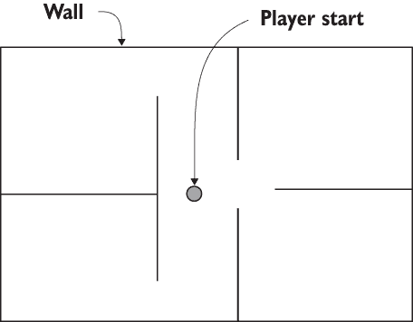

图 4.1 关卡平面图：四个房间和一个中央走廊

你可以通过构建这个平面图来练习白箱建造，或者你也可以自己绘制一个简单的关卡来练习这一步骤。对于这个练习来说，房间布局的具体细节并不重要。对我们来说，重要的是要绘制一个平面图，这样我们才能继续下一步。

### 4.2.3 按照计划布置原语

根据绘制的平面图构建白箱关卡涉及定位和缩放许多空白盒子，使其成为图中的墙壁。如 2.2.1 节所述，选择 GameObject > 3D Object > Cube 来创建一个空白盒子，你可以根据需要定位和缩放它。

在 Unity 中进行更高级别的关卡编辑

在本章介绍的工作流程中，关卡首先使用原语进行初步布局，然后在外部 3D 艺术工具中构建最终关卡几何形状。然而，Unity 还提供了 ProBuilder，这是一个更强大的关卡编辑工具。你仍然可以选择使用它来为在外部 3D 艺术工具中详细化的关卡进行初步布局，但 ProBuilder 甚至可以成为你唯一的关卡设计工具。

打开包管理器窗口（选择 Window > Package Manager），在 Unity 注册表中搜索 ProBuilder。一旦安装了该包，它就会像 Unity 网站上描述的那样运行（[`unity.com/features/probuilder`](https://unity.com/features/probuilder)）。

同时，编辑关卡的不同方法被称为*构造实体几何学*（CSG）。在该方法中，你使用称为刷子的形状，从初始原型到最终关卡几何形状的所有内容都在 Unity 中构建。有关更多信息，请访问实时 CSG（[`realtimecsg.com`](https://realtimecsg.com)）。

第一个对象将是场景的地板。在检查器中，重命名对象并将其降低到-0.5 Y，以考虑盒子的自身高度（图 4.2 展示了这一点）。然后沿 x 轴和 z 轴拉伸对象。

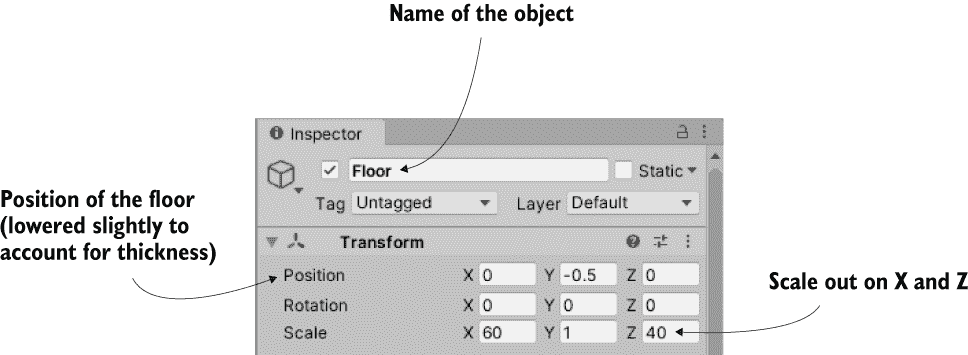

图 4.2 检查器视图中的盒子已定位并缩放以适应地板

重复这些步骤以创建场景的墙壁。你可能想要通过将墙壁设置为公共基对象的子对象来清理层次结构视图（记住，将根对象定位在 0, 0, 0，然后在层次结构中将其拖动到上面），但这不是必需的。此外，在场景周围放置一些简单的灯光，以便你可以看到它；参照第二章，通过在 GameObject 菜单的 Light 子菜单中选择灯光来创建灯光。完成白盒化后，关卡应该看起来像图 4.3 所示。

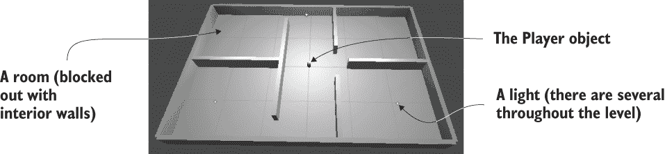

图 4.3 图 4.1 中地板平面图的白盒关卡

设置玩家对象或相机以移动（使用角色控制器和移动脚本创建玩家；如果需要完整说明，请参阅第二章）。现在你可以绕着原始场景走动，体验你的工作并对其进行测试。这就是白盒化的方法！很简单——但现在你只有空白几何形状，所以让我们用墙上的图片来装饰几何形状。

将白盒几何形状导出到外部艺术工具

在为关卡添加视觉效果时，大部分工作都是在外部 3D 艺术应用程序（如 Blender）中完成的。因此，你可能希望在艺术工具中保留白盒几何形状以供参考。默认情况下，Unity 中没有导出 Unity 内部布局的原始形状的选项，但 Unity 提供了一个可选包（称为 FBX Exporter），该包将此功能添加到编辑器中。

打开包管理器并搜索 FBX Exporter。这是一个预览包，因此你需要在包管理器窗口的高级菜单中选择显示预览包。安装该包后，它将按照 Unity 文档中的描述运行（[`mng.bz/AOYW`](http://mng.bz/AOYW)）。

偶然的是，对于使用 ProBuilder 制作的关卡，你不需要这个包，因为之前提到的这个高级关卡编辑工具已经包含了模型导出功能。

## 4.3 使用 2D 图像纹理化场景

到目前为止，关卡只是一个粗略的草图。它是可玩的，但很明显，场景的视觉效果还需要做更多的工作。提高关卡外观的下一步是应用纹理。

定义 *纹理* 是指用于增强 3D 图形的 2D 图像。这就是该术语的全部含义；不要混淆，认为纹理的任何用途都是该术语定义的一部分。无论图像如何使用，它仍然被称为纹理。

备注 *纹理* 通常既用作动词也用作名词。除了名词定义外，该词还描述了在 3D 图形中使用 2D 图像的动作。

纹理在 3D 图形中有多种用途，但最直接的使用是将它们显示在 3D 模型的表面上。在本章的后面部分，我们将讨论这对于更复杂模型的工作方式，但对于我们的白盒级别，2D 图像将充当覆盖墙壁的壁纸（见图 4.4）。

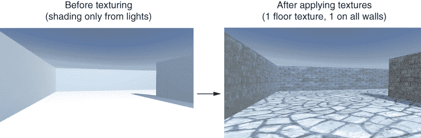

图 4.4 比较纹理前后级别

如图 4.4 所示的比较可知，纹理将原本明显不真实的数字结构变成了砖墙。纹理的其他用途包括用于切割形状的蒙版和用于使表面凹凸不平的法线贴图。稍后，你可能需要查阅附录 D 中提到的资源中关于纹理的更多信息。

### 4.3.1 选择文件格式

可用于保存 2D 图像的文件格式有很多，那么你应该使用哪一种呢？Unity 支持使用许多文件格式，因此你可以选择表 4.2 中显示的任何一种。

表 4.2 Unity 支持的 2D 图像文件格式

| 文件类型 | 优点和缺点 |
| --- | --- |
| PNG | 常用于网络。无损压缩；具有 alpha 通道。 |
| JPG | 常用于网络。有损压缩；无 alpha 通道。 |
| GIF | 常用于网络。有损压缩；无 alpha 通道。（技术上，损失并非来自压缩；而是当图像转换为 8 位时数据丢失。最终，这导致相同的结果。） |
| BMP | Windows 上的默认图像格式。无压缩；无 alpha 通道。 |
| TGA | 常用于 3D 图形；在其他地方则较为罕见。无或有损压缩；具有 alpha 通道。 |
| TIFF | 常用于数字摄影和出版。无或有损压缩；无 alpha 通道。 |
| PICT | 旧 Mac 上的默认图像格式。有损压缩；无 alpha 通道。 |
| PSD | Adobe Photoshop 的原生文件格式。无压缩；具有 alpha 通道。使用此文件格式的最主要原因可能是直接使用 Photoshop 文件的优势。 |

定义 *alpha 通道* 用于在图像中存储透明度信息。可见颜色包含三个信息通道：红色、绿色和蓝色。Alpha 是一个额外的信息通道，虽然不可见，但控制图像的透明度。

虽然 Unity 可以接受表 4.2 中显示的任何图像类型导入并用作纹理，但这些文件格式在它们支持的功能上差异很大。对于作为纹理导入的 2D 图像，有两个因素特别重要：图像是如何压缩的，以及它是否有 alpha 通道？

Alpha 通道是一个简单的考虑因素。由于 alpha 通道在 3D 图形中经常使用，因此具有 alpha 通道的图像更受欢迎。

图像压缩是一个稍微复杂一些的考虑因素，但归结起来就是“有损压缩是坏事。”既不压缩又无损压缩都能保持图像质量，而有损压缩在减小文件大小的过程中会降低图像质量（因此得名*有损*）。

在这两个考虑因素之间，我推荐的 Unity 纹理文件格式是 PNG 和 TGA。在 PNG 广泛用于互联网之前，Targas（TGA）曾是纹理 3D 图形的首选文件格式。如今，PNG 在技术上几乎相当，但更广泛地使用，因为它在网页和纹理中都很实用。

PSD 也是 Unity 纹理的常用推荐格式，因为它是一个高级文件格式，而且方便的是，你在 Photoshop 中工作的同一个文件也可以在 Unity 中使用。但我倾向于将工作文件与导出到 Unity 的“完成”文件分开（这种思维方式稍后还会在 3D 模型中使用）。

结果是，我在示例项目中提供的所有图像都是 PNG 格式，我也建议你使用该文件格式。做出这个决定后，是时候将一些图像导入 Unity 并将其应用到空白场景中了。

### 4.3.2 导入图像文件

让我们开始创建和准备我们将要使用的纹理。用于纹理级别的图像通常是可平铺的，这样它们就可以在地板等大面积上重复使用。

定义：一个*可平铺*的图像（有时也称为*无缝平铺*）是一个当并排放置时，相对边缘相匹配的图像。这样，图像可以重复使用，而重复之间没有任何可见的接缝。3D 纹理的概念就像网页上的壁纸。

你可以通过多种方式获取可平铺的图像，包括通过操纵照片甚至手工绘制。这些技术的教程和解释可以在许多书籍和网站上找到，但我们现在不想陷入其中。相反，让我们从提供此类图像目录的许多网站之一中获取一些可平铺的图像。

我从[www.textures.com](https://www.textures.com/)（见图 4.5）获取了一些图像，用于应用到该级别的墙壁和地板上。找到一些你认为适合地板和墙壁的图像；我选择了 BrickRound0067 和 BrickLargeBare0032。

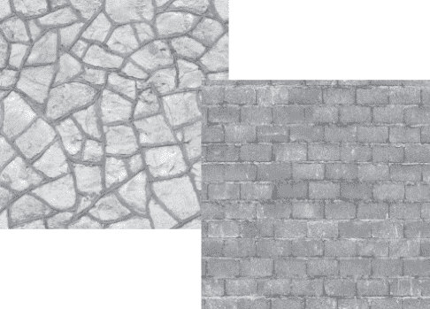

图 4.5 从 Textures.com 获取的无缝拼接的石头和砖块图像

下载你想要的图像，并准备将它们用作纹理。技术上，你可以直接使用下载的图像，但它们并不理想用作纹理。尽管它们当然是可以平铺的（你使用这些图像的重要原因），但它们的大小不正确，文件格式也不正确。

纹理的大小（以像素为单位）应该是 2 的幂。出于技术效率的考虑，图形芯片喜欢处理大小为 2^N 的纹理：4、8、16、32、64、128、256、512、1024、2048（下一个数字是 4096，但到那时图像太大，无法用作纹理）。在你的图像编辑器（Photoshop、GIMP 或任何其他编辑器；参考附录 B），将下载的图像缩放到 256 × 256 像素，并保存为 PNG 格式。

现在，将文件从计算机中的位置拖动到 Unity 的项目视图中。这将把文件复制到你的 Unity 项目中（见图 4.6），此时它们被导入为纹理，可以在 3D 场景中使用。如果拖动文件会显得尴尬，你可以在项目上右键单击并选择“导入新资源”来访问文件选择器。

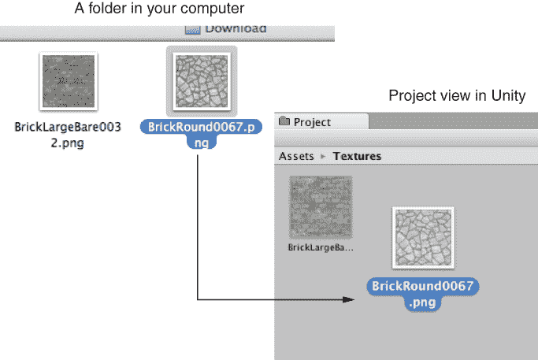

图 4.6 将图像从 Unity 外部拖动到项目视图中以导入它们。

TIP 当你的项目开始变得更加复杂时，将你的资源组织到单独的文件夹中可能是一个好主意。在项目视图中，为脚本和纹理创建文件夹，然后将资源移动到相应的文件夹中。只需将文件拖动到新文件夹即可。

WARNING Unity 在文件夹名称中响应几个关键字，并以特殊方式处理这些特殊文件夹的内容。这些关键字是 Resources、Plugins、Editor 和 Gizmos。本书后面将介绍一些特殊文件夹的功能，但到目前为止，请避免使用这些单词命名任何文件夹。

现在，图像已导入 Unity 作为纹理，准备使用。但我们如何将纹理应用到场景中的对象上呢？

### 4.3.3 应用图像

技术上，纹理不是直接应用到几何体上的。相反，纹理可以是材质的一部分，而材质则应用到几何体上。正如引言中解释的那样，材质是一组定义表面属性的信息；这些信息可以包括要显示在表面的纹理。这种间接性很重要，因为相同的纹理可以与多个材质一起使用。话虽如此，通常每个纹理都对应不同的材质，因此为了方便，Unity 允许你将纹理拖放到对象上，然后它会自动创建一个新的材质。

如果你将纹理从项目视图拖动到场景中的对象上，Unity 将创建一个新的材质并将其应用到对象上。图 4.7 说明了这个操作。现在尝试使用地板的纹理来做这个操作。

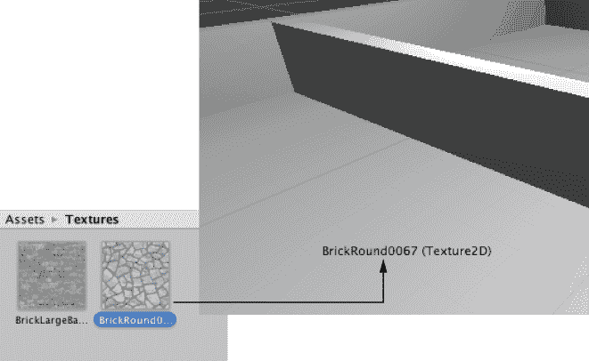

图 4.7 应用纹理的一种方法是将它们从项目拖动到场景对象上。

除了这种方便的自动创建材质的方法之外，创建材质的“正确”方法是选择 Assets > Create > Material；新资产将出现在项目视图中。现在选择材质以在检查器中显示其属性（你将看到类似于图 4.8 的内容），并将纹理拖动到主纹理槽中；这个设置被称为 Albedo（这是基础颜色的技术术语），纹理槽是标签左侧的方形。同时，将材质从项目拖动到场景中的对象上以应用材质。现在尝试使用墙壁纹理执行这些步骤：创建一个新的材质，将墙壁纹理拖动到这个材质中，并将材质拖动到场景中的墙壁上。

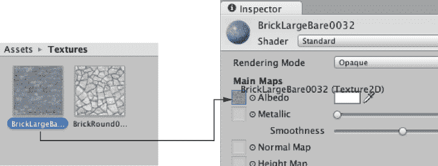

图 4.8 选择一个材质以在检查器中查看它，然后拖动纹理到材质属性中。

你现在应该看到石头和砖块图像出现在地板和墙壁对象表面，但这些图像看起来相当拉伸和模糊。单个图像被拉伸以覆盖整个地板。相反，你希望图像在地板表面上重复几次。

你可以通过使用材质的平铺属性来设置这种外观。在项目中选择材质，然后在检查器中更改平铺数字（每个方向都有单独的 X 和 Y 值用于平铺）。确保你正在设置主贴图的平铺，而不是次级贴图（此材质可选地使用次级纹理贴图以实现高级效果）。默认平铺是 1（这意味着没有平铺，图像被拉伸覆盖整个表面）；将数字更改为类似 8 的值，看看场景中会发生什么。将两个材质中的数字都更改为看起来不错的平铺。

注意：像这样调整平铺属性仅适用于纹理化白箱几何体。在一个精良的游戏中，地板和墙壁将使用更复杂的艺术工具构建，这包括设置它们的纹理。

太棒了——现在场景的地板和墙壁上已经应用了纹理！你还可以将纹理应用到场景的天空。让我们看看这个过程。

## 4.4 使用纹理图像生成天空视觉效果

砖石纹理为墙壁和地板提供了更加自然的外观。然而，目前天空是空白的，看起来不自然；我们还想让天空看起来更真实。完成这项任务最常见的方法是使用天空的图片进行一种特殊的纹理处理。

### 4.4.1 什么是天空盒？

默认情况下，相机的背景颜色是深蓝色。通常，这种颜色会填充视图中的任何空白区域（例如，这个场景的墙壁上方），但可以将天空的图片渲染为背景。这就是天空盒的作用所在。

**定义** 一个 *天空盒* 是围绕相机的一个立方体，每个面都贴有天空的图片。无论相机朝向哪个方向，它都在看天空的图片。

正确实现天空盒可能有些棘手；图 4.9 展示了天空盒是如何工作的示意图。为了使天空盒看起来像远处的背景，需要使用渲染技巧。幸运的是，Unity 已经为你处理了所有这些。


图 4.9 天空盒的示意图

新场景已经预置了一个简单的默认天空盒。这就是为什么天空从浅蓝到深蓝有渐变，而不是一个平坦的深蓝色。打开照明窗口（窗口 > 渲染 > 照明），切换到环境标签，然后注意第一个设置是天空盒材质。此窗口有多个与 Unity 的高级照明系统相关的设置面板，但到目前为止，我们只关心第一个设置。

就像之前提到的砖块纹理一样，天空盒图片可以从各种网站上获取。搜索 *skybox textures* 或从本书的示例项目中获取。例如，我从 Heiko Irrgang 在 [`93i.de/`](https://93i.de/) 获取了 TropicalSunnyDay 天空盒图片集。一旦将这个天空盒应用到场景中，你将看到类似于图 4.10 的效果。


图 4.10 带有天空背景图片的场景

与其他纹理一样，天空盒图片首先被分配给一个材质，然后在场景中使用。让我们看看如何创建一个新的天空盒材质。

### 4.4.2 创建新的天空盒材质

首先，创建一个新的材质（像往常一样，可以右键点击并选择创建，或者从资产菜单中选择创建），然后选择该材质以在检查器中查看其设置。接下来，你需要更改此材质使用的着色器。材质设置的顶部有一个着色器菜单（见图 4.11）。在 4.3 节中，我们基本上忽略了此菜单，因为默认设置对大多数标准纹理化来说已经足够好，但天空盒需要特殊的着色器。

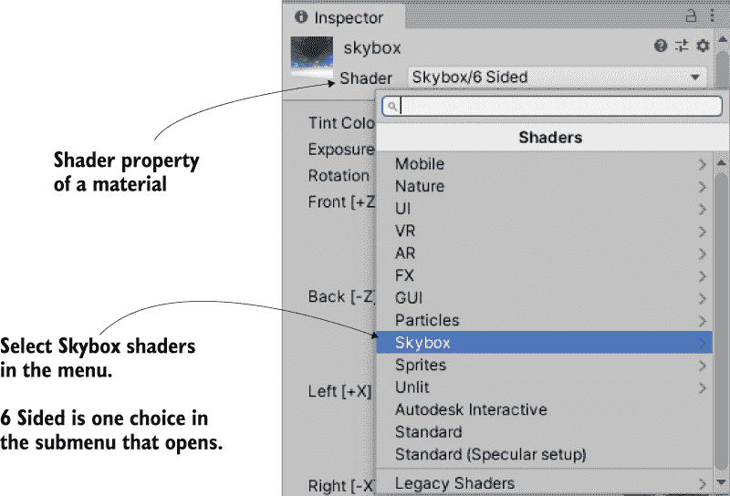

图 4.11 可用着色器的下拉菜单

**定义** 一个 *着色器* 是一个简短的程序，它概述了绘制表面的指令，包括是否使用任何纹理。计算机使用这些指令在渲染图像时计算像素。最常见的着色器会根据光线将材质的颜色变暗，但着色器也可以用于各种视觉效果。

每个材质都有一个控制它的着色器（你可以将材质视为着色器的一个实例）。新材质默认设置为标准着色器。此着色器显示材质的颜色（包括纹理），并在表面应用光线和阴影。

对于天空盒，Unity 有一个不同的着色器。单击菜单以查看下拉列表（见图 4.11）中所有可用的着色器。选择天空盒部分，并在子菜单中选择 6 面。使用此着色器后，材质现在有六个大纹理槽（而不是标准着色器中只有的小反照率纹理槽）。这六个纹理槽对应于立方体的六个面，因此这些图像应该在边缘处匹配以看起来无缝。例如，图 4.12 显示了晴朗天空盒的图像。

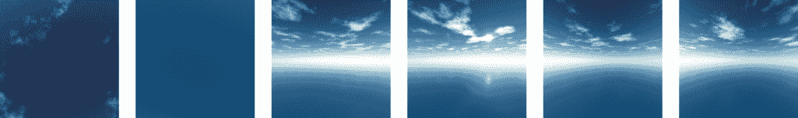

图 4.12 天空盒侧面的六个图像

以与您导入砖块纹理相同的方式将天空盒图像导入 Unity：将文件拖动到项目视图或右键单击项目并选择导入新资产。我们需要更改一个细微的导入设置；单击导入的纹理以在检查器中查看其属性，并将包裹模式设置（如图 4.13 所示）从重复更改为限制。完成时不要忘记单击应用。通常，纹理可以在表面上重复平铺，为了看起来无缝，图像的相对边缘会混合在一起。但这种边缘混合会在图像相遇的天空处产生微弱的线条，因此限制设置（类似于第二章中的限制()函数）将限制纹理的边界并消除这种混合。

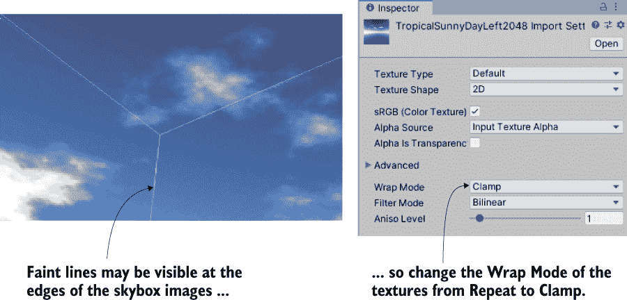

图 4.13 通过调整包裹模式来调整正确的微弱边缘线。

现在，您可以将这些图像拖动到天空盒材质的纹理槽中。图像名称对应于要分配给它们的纹理槽（例如左侧或前方）。一旦所有六个纹理都连接起来，您就可以使用这种新材料作为场景的天空盒。再次打开照明窗口，并将此新材料设置为天空盒槽；要么将材质拖到该槽中，要么单击小圆圈图标以打开文件选择器。现在单击播放以查看新的天空盒。

TIP 默认情况下，Unity 将在编辑器的场景视图中显示天空盒（或至少其主要颜色）。在编辑对象时，您可能会发现这种颜色分散注意力，因此您可以切换天空盒的开启或关闭。在场景视图面板的顶部有按钮可以控制可见内容；查找效果按钮以切换天空盒的开启或关闭。

哇哦——您已经学会了如何为场景创建天空视觉效果！天空盒是一种优雅的方式来创建环绕玩家的广阔氛围的幻觉。在您的关卡中润色视觉效果的下一步是创建更复杂的 3D 模型。

## 4.5 使用自定义 3D 模型

在前面的章节中，我们讨论了将纹理应用到关卡的大平面墙壁和地板上。那么更详细的对象怎么办？如果你想在房间里放置有趣的家具怎么办？你可以通过在外部 3D 艺术应用程序中构建 3D 模型来实现这一点。回想一下本章引言中的定义：3D 模型是游戏中的网格对象（三维形状）。好吧，你将导入一个简单长椅的 3D 网格。

广泛用于建模 3D 对象的应用程序包括 Autodesk Maya 和 Autodesk 3ds Max。这两个都是昂贵的商业工具，因此本章的示例使用开源应用程序 Blender。示例下载包括一个可用的.blend 文件；图 4.14 展示了 Blender 中的长椅模型。如果你对学习如何建模自己的对象感兴趣，你将在附录 C 中找到一个关于在 Blender 中建模这个长椅的练习。

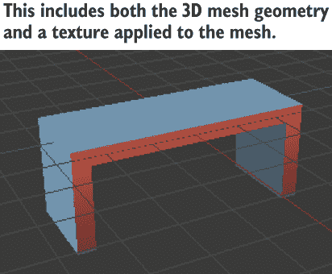

图 4.14 Blender 中的长椅模型

除了你自己或你合作的艺术家创建的定制模型外，许多 3D 模型可以从游戏艺术网站上下载。3D 模型的一个很好的资源是 Unity Asset Store，在 Unity 内部或[`assetstore.unity.com`](https://assetstore.unity.com)都可以访问。

### 4.5.1 选择哪种文件格式？

在你获得外部艺术工具制作的模型后，你需要从该软件导出资产。就像 2D 图像一样，在导出 3D 模型时，有多种文件格式可供你使用，这些文件类型各有优缺点。表 4.3 列出了 Unity 支持的 3D 文件格式。

表 4.3 Unity 支持的 3D 模型文件格式

| 文件类型 | 优点和缺点 |
| --- | --- |
| FBX | 网格和动画；当可用时，推荐选项。 |
| COLLADA (DAE) | 网格和动画；当 FBX 不可用时，另一个不错的选择。 |
| OBJ | 仅网格；这是一个文本格式，因此有时在互联网上流传输时很有用。 |
| 3DS | 仅网格；一个相当古老且原始的模型格式。 |
| DXF | 仅网格；一个相当古老且原始的模型格式。 |
| Maya | 通过 FBX 工作；需要安装此应用程序。 |
| 3ds Max | 通过 FBX 工作；需要安装此应用程序。 |
| Blender | 通过 FBX 工作；需要安装此应用程序。 |

选择选项归结为文件是否支持动画。因为 COLLADA 和 FBX 是唯一两个包含动画数据的选项，所以这两个选项是选择的对象。当它可用时（并非所有 3D 工具都有导出选项），FBX 导出通常效果最佳，但如果你在没有 FBX 导出的工具上使用，COLLLADA 也效果不错。在我们的案例中，Blender 支持 FBX 导出，因此我们将使用该文件格式。

glTF 文件格式

虽然 FBX 是具有内置支持的最好 3D 格式，但你可能更愿意在 Unity 中使用 glTF 文件。这种较新的 3D 文件格式在当今越来越受欢迎。glTF 规范由 Khronos Group 开发，他们是 COLLADA 背后的同一群人，并且他们在[`github.com/KhronosGroup/UnityGLTF`](https://github.com/KhronosGroup/UnityGLTF)维护了一个 Unity 插件。

个人而言，我发现他们的 glTF 插件难以操控，更倾向于使用由名为 Siccity 的用户制作的 GLTFUtility 包，可在[`github.com/Siccity/GLTFUtility`](https://github.com/Siccity/GLTFUtility)找到。

注意，表 4.3 的底部列出了几个 3D 艺术应用程序。Unity 允许您直接将那些应用程序的文件拖放到您的项目中。这个功能看起来很方便，但也有一些注意事项。

首先，Unity 不会直接加载那些应用程序文件；相反，它在幕后导出模型并加载那个导出的文件。因为模型无论如何都会被导出为 FBX，所以最好显式执行这一步骤。此外，这个导出需要您安装相关的应用程序。如果您计划在多台计算机之间共享文件（例如，一个开发团队合作），这个要求会变得很麻烦。我不建议在 Unity 中直接使用 3D 艺术应用程序文件。

### 4.5.2 导出和导入模型

好了，现在是时候从 Blender 中导出模型，然后将其导入到 Unity 中。首先，在 Blender 中打开长椅，然后选择文件 > 导出 > FBX。一旦文件保存，以相同的方式将其导入 Unity，就像导入图片一样。将 FBX 文件从计算机拖到 Unity 的项目视图中，或者在项目上右键单击并选择导入新资产。3D 模型将被复制到 Unity 项目中，并显示出来，准备放入场景中。

注意：示例下载包含 .blend 文件，以便您可以练习从 Blender 中导出 FBX 文件。即使您最终没有建模，您可能也需要将下载的模型转换为 Unity 接受的格式。如果您想跳过所有涉及 Blender 的步骤，请使用提供的 FBX 文件。

您应该立即更改一些导入设置。首先，Unity 默认导入的模型规模非常小（参考图 4.15，它显示了您在选择模型时在检查器中看到的内容）；将缩放因子更改为 50 以部分抵消 0.01 单位的转换。您还可能想点击生成碰撞体复选框，但这不是必需的；如果没有碰撞体，您可以穿过长椅。然后，切换到导入设置中的动画选项卡，并取消选择导入动画（此模型没有动画）。在做出这些更改后，在底部点击应用。

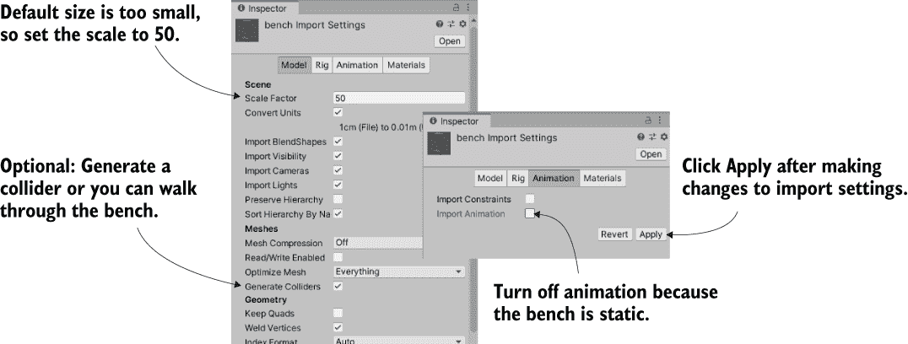

图 4.15 调整 3D 模型的导入设置。

这样就处理好了导入的网格。现在轮到纹理了。以与之前为墙壁导入砖块相同的方式导入长椅纹理（图 4.16 中的图像）：将图像文件从本项目的初始文件夹拖到 Unity 的项目视图中，或者在项目中右键单击并选择导入新资产。图像看起来有些奇怪，图像的不同部分出现在长椅的不同部分；模型的纹理坐标被编辑以定义这种图像到网格的映射。

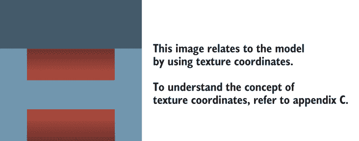

图 4.16 长椅纹理的 2D 图像

**定义** 纹理坐标是每个顶点的一组额外值，用于将多边形分配到纹理图像的区域。把它想象成包装纸；3D 模型是被包装的盒子，纹理是包装纸，而纹理坐标代表盒子上包装纸将放置的点。

**注意** 即使你不想建模长椅，你可能也想阅读附录 C 中关于纹理坐标的详细解释。纹理坐标（以及像*UVs*和*mapping*这样的其他相关术语）在游戏编程时可能很有用。

当 Unity 导入 FBX 文件时，它也会生成一个与 Blender 中材质设置相同的材质。如果 Blender 中使用的图像文件已经被导入 Unity，生成的材质将自动链接到该纹理。如果自动链接不正确，或者你需要使用不同的纹理图像，那么你可以提取模型的材质进行进一步编辑。参考图 4.15；在材质选项卡下，你应该找到一个标有提取材质的按钮。现在你可以选择材质资产，然后将图像拖到 Albedo，就像你为砖墙所做的那样。

新材质通常太亮，所以你可能想将平滑度设置降低到 0（更平滑的表面更亮）。最后，调整好所有需要调整的设置后，你可以将长椅放入场景中。从项目视图中拖动模型并将其放置在级别的某个房间中；当你拖动鼠标时，你应该能在场景中看到它。一旦将长椅放置到位，你应该能看到类似于图 4.17 的样子。恭喜你——你已经为级别创建了一个纹理模型！

**注意** 我们不会在本章中这样做，但通常，你还会用在外部工具中创建的模型替换白盒几何形状。新的几何形状可能看起来几乎相同，但你将拥有更多的灵活性来控制纹理。

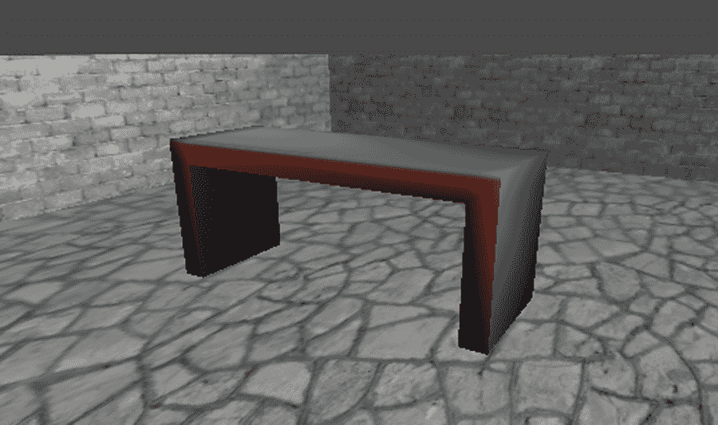

图 4.17 级别中导入的长椅

使用 Mecanim 动画角色

您创建的模型是静态的，放置后保持静止。您也可以在 Blender 中动画化，然后在 Unity 中播放动画。创建 3D 动画的过程既漫长又复杂，但这不是一本关于动画的书，所以我们不会在这里讨论这个话题。正如已经提到的建模，许多现有资源可以帮助您学习更多关于 3D 动画的知识。但请注意：这是一个*巨大的*话题。*动画师*是游戏开发中的一个专门角色，这也是有原因的。

Unity 有一个称为 Mecanim 的复杂系统，用于管理模型上的动画。特殊的名称 Mecanim 标识了作为旧动画系统的替代品添加到 Unity 中的较新、更先进的动画系统。旧的系统仍然存在，被称为遗留动画。但在 Unity 的下一个版本中，它可能会被淘汰，届时 Mecanim 将成为*唯一的*动画系统。

尽管我们在这个章节中没有处理任何动画，但我们在未来的章节中将在角色上播放动画。

## 4.6 通过粒子系统创建效果

除了 2D 图像和 3D 模型之外，游戏艺术家创建的剩余视觉内容类型是粒子系统。本章引言中的定义解释说，粒子系统是创建和控制大量移动对象的有序机制。粒子系统对于创建如火焰、烟雾或喷水等视觉效果非常有用。图 4.18 中的火焰效果就是使用粒子系统创建的。

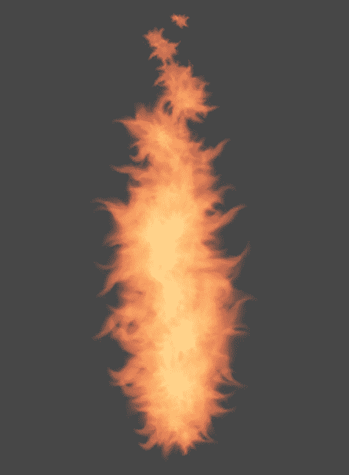

图 4.18 使用粒子系统创建的火焰效果

与大多数其他艺术资产在外部工具中创建并导入项目不同，粒子系统是在 Unity 内部创建的。Unity 提供了灵活且强大的工具来创建粒子效果。

注意：与 Mecanim 动画系统的情况类似，Unity 曾经有一个旧的遗留粒子系统，并为新的系统起了一个特殊名称，Shuriken。到目前为止，遗留粒子系统已经被淘汰，因此不再需要单独的名称。

首先，创建一个新的粒子系统并观察默认效果播放。从 GameObject 菜单中选择 Effects > Particle System，您将看到基本白色烟雾球从新对象向上喷射。或者更确切地说，当您选择对象时，您会看到粒子向上喷射。当您选择粒子系统时，粒子播放面板显示在屏幕角落，并指示已过去的时间（见图 4.19）。

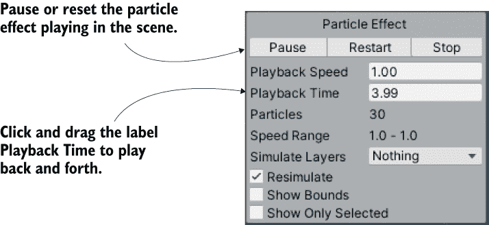

图 4.19 粒子系统的播放面板

默认效果看起来已经很漂亮了，但让我们来看看您可以用来自定义效果的参数。

### 4.6.1 调整默认效果的参数

图 4.20 显示了粒子系统的所有设置列表。我们不会逐个查看列表中的每个设置；相反，我们将关注那些与制作火焰效果相关的设置。一旦你理解了几个设置的工作原理，其余的应该相当容易理解。实际上，每个设置的标签都是一个完整的信息面板。最初，只有第一个信息面板是展开的；其余的面板都是折叠的。点击设置的标签以展开该信息面板。

提示：许多设置由检查器底部的曲线控制。这条曲线表示值随时间的变化：图表的左侧表示粒子首次出现的时间，右侧表示粒子消失的时间，底部是 0 的值，顶部是最大值。在图表周围拖动点，或双击或右击曲线以插入新点。

根据图 4.20 中的指示调整粒子系统的参数，它看起来会更像一团火焰。

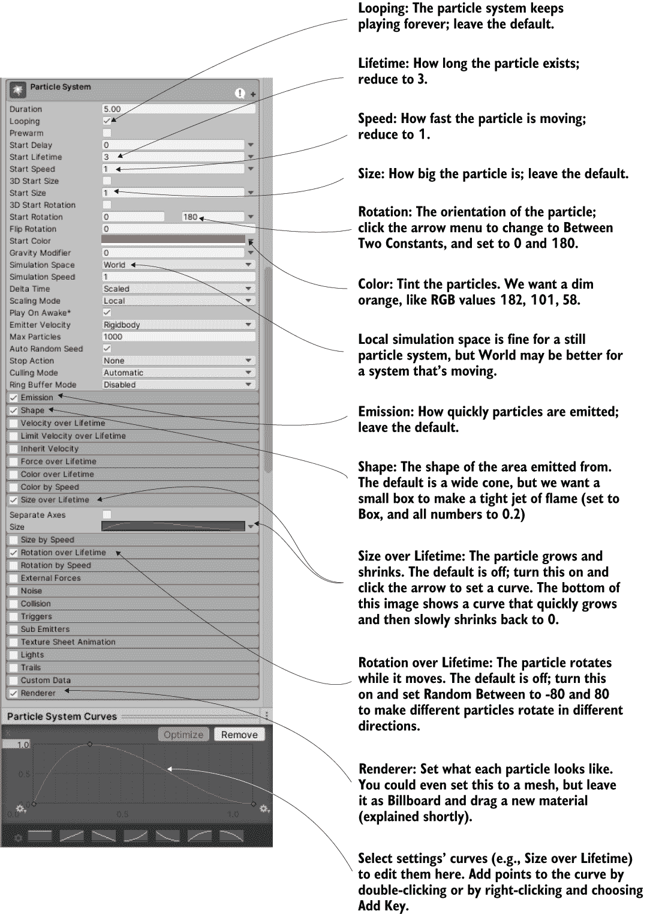

图 4.20 检查器显示粒子系统的设置（突出显示火焰效果的设置）。

### 4.6.2 为火焰应用新的纹理

现在粒子系统看起来更像一团火焰，但效果仍然需要粒子看起来像火焰，而不是白色的团块。这需要将一个新的图像导入到 Unity 中。图 4.21 展示了我所绘制的图像；我画了一个橙色的小点，并使用涂抹工具绘制出火焰的触须（然后我用黄色绘制了同样的东西）。

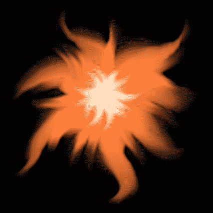

图 4.21 用于火焰粒子的图像

无论你使用示例项目中的这个图像，绘制自己的图像，还是下载一个类似的图像，你都需要将图像文件导入到 Unity 中。如前所述，将图像文件拖动到项目视图中，或者选择“资产”>“导入新资产”。

就像 3D 模型一样，纹理不是直接应用于粒子系统的。你将纹理添加到材质中，然后将该材质应用于粒子系统。创建一个新的材质，然后选择它以在检查器中查看其属性。将火焰图像从项目拖动到纹理槽中。这样就将火焰纹理链接到火焰材质，因此现在你想要将材质应用于粒子系统。图 4.22 显示了如何进行此操作：选择粒子系统，在设置底部展开渲染器，然后将材质拖动到材质槽中。

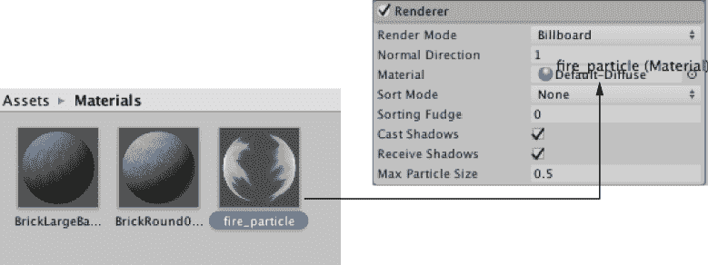

图 4.22 将材质分配给粒子系统。

就像为天空盒材质所做的，你需要更改粒子材质的着色器。在材质设置中靠近顶部的着色器菜单处单击，以查看可用的着色器列表。对于粒子材质，除了标准默认设置外，还需要在“粒子”子菜单下的着色器之一。如图 4.23 所示，在这种情况下，我们想要标准非光照。现在将材质的渲染模式切换到加性。这将使粒子看起来像雾蒙蒙的，并使场景变亮，就像火光一样。

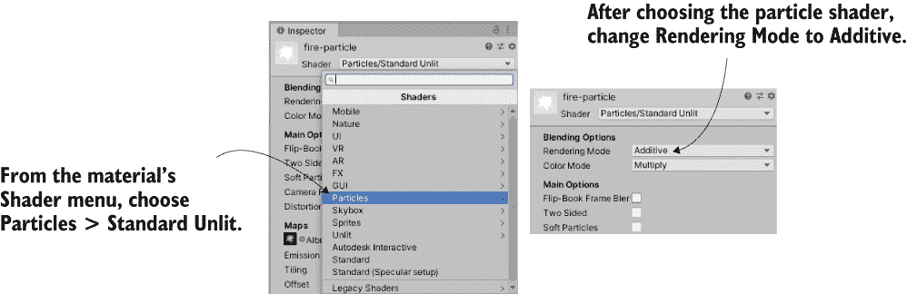

图 4.23 设置火粒子材质的着色器

定义：*加性*是一种着色器效果，它将粒子的颜色添加到其后面的颜色上，而不是替换像素。这使得像素变得更亮，使得粒子上的黑色变得不可见。这些着色器与 Photoshop 中加性图层效果具有相同的视觉效果。

警告：更改此着色器可能会导致 Unity 发出需要应用到系统的警告。在检查器底部单击“应用到系统”按钮。

将火材质分配给火粒子效果后，现在看起来就像图 4.18 所示。这看起来像一股相当逼真的火焰，但效果不仅仅在静止时才起作用。接下来，让我们将其附加到一个移动的对象上。

### 4.6.3 将粒子效果附加到 3D 对象

创建一个球体（记住，GameObject > 3D Object > Sphere）。创建一个新的脚本，命名为 BackAndForth，并将其附加到新球体上。

列表 4.1 沿直线路径移动对象

```
using System.Collections;
using System.Collections.Generic;
using UnityEngine;

public class BackAndForth : MonoBehaviour {
    public float speed = 3.0f;
    public float maxZ = 16.0f;                    ❶
    public float minZ = -16.0f;

    private int direction = 1;                    ❷

    void Update() {
        transform.Translate(0, 0, direction * speed * Time.deltaTime);

        bool bounced = false;
        if (transform.position.z > maxZ || transform.position.z < minZ) {
            direction = -direction;               ❸
            bounced = true;
        }
        if (bounced) {                            ❹
            transform.Translate(0, 0, direction * speed * Time.deltaTime);
        }
    }
}
```

❶ 这些是对象移动之间的位置。

❷ 对象当前正在向哪个方向移动？

❸ 切换方向来回。

❹ 如果对象改变了方向，则在新的方向上应用第二个移动。

运行此脚本，球体将在该级别的中央走廊来回滑动。现在你可以将粒子系统设置为球体的子对象，火光将随球体移动。就像该级别的墙壁一样，在层次结构视图中，将粒子对象拖动到球体对象上。

警告：通常在将对象设置为另一个对象的子对象后，需要重置对象的位置。例如，我们希望粒子系统位于 0, 0, 0（这是相对于父对象的）。Unity 将保留对象在链接为子对象之前的位置。

现在粒子系统会随球体移动。然而，火光并没有随着移动而偏转，这看起来很不自然。这是因为，默认情况下，粒子只在粒子系统的局部空间中正确移动。为了完成燃烧的球体，在粒子系统设置中找到“模拟空间”（位于图 4.20 顶部的面板中）并将它从局部切换到世界。

注意：在这个脚本中，对象在一条直线上来回移动，但视频游戏通常有对象在复杂的路径上移动。Unity 提供了对复杂导航和路径的支持；请参阅[`docs.unity3d.com/Manual/Navigation.html`](https://docs.unity3d.com/Manual/Navigation.html)了解相关信息。

我相信，到这个时候，你一定迫不及待地想应用自己的想法，并为这个示例游戏添加更多内容。你应该这么做——你可以创建更多的艺术资产，或者甚至通过引入第三章中开发的射击机制来测试你的技能。在下一章中，我们将转换到不同的游戏类型，并从一个新的游戏开始。即使未来的章节将切换到其他游戏类型，这些前四章中的所有内容仍然适用并且有用。

## 摘要

+   *艺术资产*是指所有单个图形的术语。

+   白盒是关卡设计师用来勾勒空间的有用第一步。

+   纹理是显示在 3D 模型表面的二维图像。

+   3D 模型是在 Unity 之外创建的，并以 FBX 文件的形式导入。

+   粒子系统用于创建许多视觉效果（如火焰、烟雾、水等）。
