# 5 使用 Unity 的 2D 功能构建记忆游戏

本章涵盖

+   在 Unity 中显示 2D 图形

+   使对象可点击

+   以编程方式加载新图像

+   使用 UI 文本维护和显示状态

+   加载关卡和重新开始游戏

到目前为止，我们一直在处理 3D 图形，但你也可以在 Unity 中使用 2D 图形。因此，在本章中，你将构建一个 2D 游戏。你将开发经典的儿童游戏记忆：你将显示一组卡片背面，当点击时显示卡片正面，并计分。这些机制涵盖了你在 Unity 中开发 2D 游戏所需了解的基本知识。

尽管 Unity 最初是作为 3D 游戏的工具而诞生的，但它也常用于 2D 游戏。自 2013 年 4.3 版本以来，Unity 已经内置了 2D 图形支持，但在此之前，2D 游戏已经在 Unity 中开发（特别是利用 Unity 跨平台特性的移动游戏）。在 Unity 的早期版本中，游戏开发者需要第三方框架在 Unity 的 3D 场景中模拟 2D 图形。最终，核心编辑器和游戏引擎被修改以包含 2D 图形，本章将介绍这一功能。

Unity 中的 2D 工作流程与开发 3D 游戏的工作流程大致相同：导入艺术资产，将它们拖入场景，并编写脚本将其附加到对象上。2D 图形中的主要艺术资产称为*精灵*。

定义*精灵*是直接显示在屏幕上的 2D 图像，与显示在 3D 模型表面上的图像（即*纹理*）相对。

你可以将 2D 图像导入 Unity 作为精灵，就像你可以将图像导入为纹理一样（参见第四章）。技术上，这些精灵将是 3D 空间中的对象，但它们将是所有面向垂直于 z 轴的平面。因为它们都将朝向同一方向，你可以将相机直接对准精灵，玩家将能够仅沿 x 轴和 y 轴（在二维中）辨别它们的移动。

在第二章中，我们讨论了坐标轴：有三个维度增加了垂直于你已熟悉的 x 轴和 y 轴的 z 轴。二维只是那些 x 轴和 y 轴（这就是你在数学课上老师所谈论的！）。

## 5.1 为 2D 图形设置一切

你将创建经典的记忆游戏。对于那些不熟悉这个游戏的人来说，一系列卡片被倒扣分发。每张卡片都有一个位于其他地方的匹配卡片，但玩家只能看到卡片的背面。玩家可以一次翻两张卡片，试图找到匹配的卡片；如果选中的两张卡片不匹配，它们将翻转回来，然后玩家可以再次猜测。

图 5.1 展示了我们将要构建的游戏的草图；将其与第二章中的路线图图进行比较。这次的草图精确地描述了玩家将看到的内容（而我们的 3D 场景草图描述了玩家周围的空间以及摄像机移动的位置，以便玩家可以看到）。现在您知道了您将要构建的内容，是时候开始工作了！

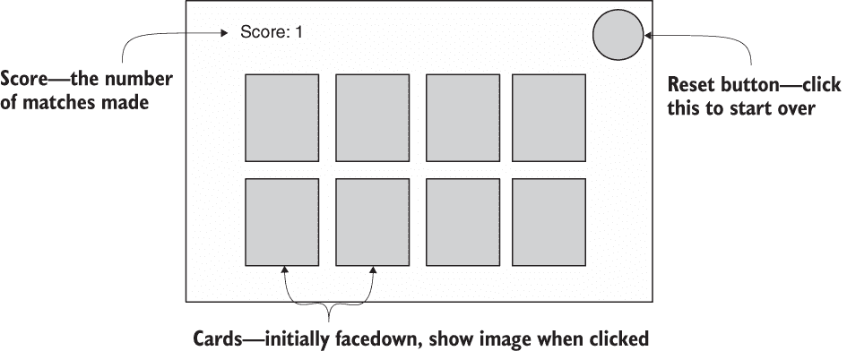

图 5.1 记忆游戏外观的草图

### 5.1.1 准备项目

第一步是收集并显示游戏所需的图形。与之前构建 3D 示例的方式类似，您想要通过组合游戏运行所需的最小图形集来开始新游戏，然后在该部分就绪后，您可以开始编程功能。

这意味着您需要创建图 5.1 中所示的所有内容：隐藏卡的背面、翻面时的卡片正面系列、一个角上的得分显示和一个对角上的重置按钮。我们还需要屏幕的背景，所以总的来说，我们的艺术需求汇总为图 5.2。

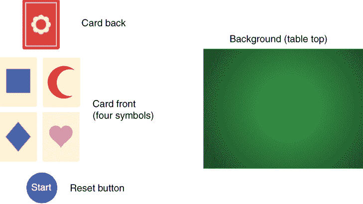

图 5.2 记忆游戏所需的艺术资产

提示：与以往一样，包括所有必要的艺术资产在内的项目完整版本可以从 [`mng.bz/VBY5`](http://mng.bz/VBY5)，本书的网站上下载。您可以从那里复制图片用于您自己的项目。

收集所需的图像，然后在 Unity 中创建一个新项目。在出现的“新建项目”窗口中，您会注意到项目模板（如图 5.3 所示），它允许您在 2D 和 3D 模式之间切换。在前几章中，我们处理了 3D 图形，因为那是默认值，所以我们没有关注这个设置。然而，在本章中，您在创建新项目时将想要选择 2D 模板。

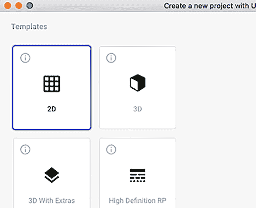

图 5.3 使用这些按钮以 2D 或 3D 模式创建新项目。

在为本章创建的新项目并设置为 2D 后，我们可以开始将我们的图像放入场景中。

2D 编辑模式与 2D 场景视图

新项目的 2D/3D 设置调整了 Unity 编辑器内的两个设置，如果您愿意，以后可以手动调整这两个设置。这两个设置是 2D 编辑模式和 2D 场景视图。2D 场景视图控制场景在 Unity 中的显示方式；切换场景视图顶部的 2D 按钮。

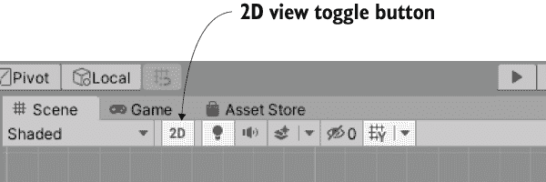

2D 场景视图切换

您可以通过打开编辑菜单并从项目设置下拉列表中选择编辑来设置 2D 编辑模式。在这些设置中，您将看到默认行为模式设置，可以选择 3D 或 2D。

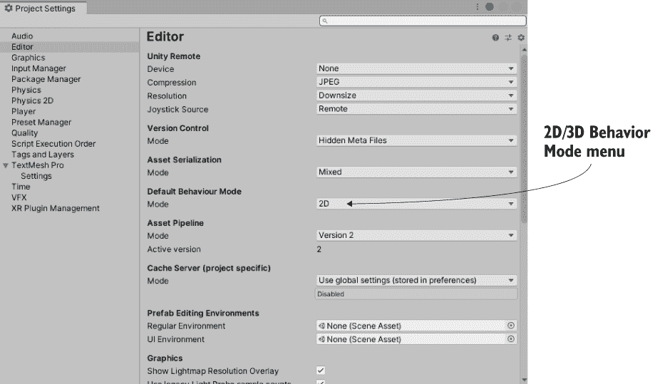

编辑 > 项目设置 > 编辑中的默认行为模式设置

将编辑器设置为 2D 模式会导致导入的图像被设置为精灵。正如你在第四章中看到的，图像通常导入为纹理，但在检查器中很容易切换。只需选择资产以查看其设置，并在做出任何更改后记得点击应用。

2D 编辑器模式还会导致新场景缺少默认的 3D 照明设置；这种照明对 2D 场景没有害处，但不是必需的。如果你需要手动删除它，请删除新场景附带的方向光，并在照明窗口中关闭天空盒（点击小圆圈图标用于文件选择器，并从列表中选择无）。

### 5.1.2 显示 2D 图像（又称精灵）

将所有图像文件拖入项目视图以导入它们，确保图像被导入为精灵而不是纹理。（如果编辑器设置为 2D，这是自动的。选择一个资产以在检查器中查看其导入设置。）现在将 table_top 精灵（我们的背景图像）从项目视图拖到空场景中。与网格对象一样，在检查器中有一个用于精灵的变换组件；输入 0, 0, 5 以定位背景图像。

注意：另一个需要注意的导入设置是每单位像素。因为 Unity 之前是一个 3D 引擎，后来添加了 2D 图形，所以 Unity 中的一个单位不一定等于图像中的一个像素。你可以将每单位像素设置设置为 1:1，但我建议将其保留为默认的 100:1（因为 1:1 时物理引擎无法正常工作，默认设置更适合与其他代码的兼容性）。

创建打包的精灵图集

虽然在这个项目中我们将使用单独的图像，但你可以在单个图像中排列多个精灵。当动画的多个帧组合成一个图像时，这个图像通常被称为*精灵表*，但将多个图像组合成一个的更通用术语是*图集*。

动画精灵在 2D 游戏中很常见，我们将在下一章实现它们。多个帧可以作为多个图像导入，但游戏通常将所有动画帧排列在精灵表中。基本上，所有单独的帧都显示在一个大图像上的网格中。

除了将动画帧保持在一起，精灵图集也常用于静态图像。这是因为图集可以通过两种方式优化精灵的性能：通过紧密打包以减少图像中的浪费空间，以及通过减少视频卡的绘制调用（每次加载新图像都会让视频卡做更多的工作）。

可以使用外部工具如 TexturePacker（见附录 B）创建精灵图集，这种方法肯定可行。但 Unity 包括精灵打包功能，可以自动打包多个精灵。要使用此功能，请在编辑器设置中启用 Sprite Packer（选择编辑 > 项目设置并将模式切换到始终启用）。现在你可以创建包含单个精灵的 Sprite Atlas 资源。有关更多信息，请参阅 Unity 的文档[`mng.bz/ZxOZ`](http://mng.bz/ZxOZ)。

X 和 Y 位置上的 0 是直接的（这个精灵将填充整个屏幕，所以你希望它在中心），但 Z 位置上的 5 可能看起来有些奇怪。对于 2D 图形，难道不是只有 X 和 Y 才重要吗？嗯，X 和 Y 是唯一影响对象在 2D 屏幕上定位的值，但 Z 值对于堆叠对象仍然很重要。

Z 值较低的位置更靠近相机，因此 Z 值较低的精灵会显示在其他精灵的上方（参见图 5.4）。因此，背景精灵应该具有最高的 Z 值。你将背景设置为正 Z 位置，然后给其他所有东西一个 0 或负 Z 位置。

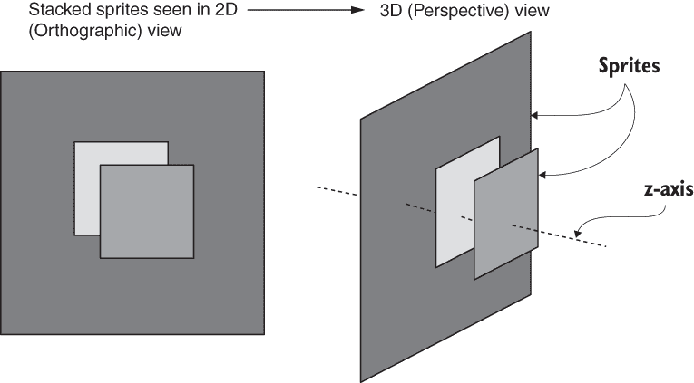

图 5.4 精灵沿 z 轴堆叠

由于前面提到的每单位像素设置，其他精灵将以最多两位小数的值定位。100:1 的比率意味着图像中的 100 像素是 Unity 中的 1 个单位；换句话说，1 像素是 0.01 个单位。但在你将更多精灵放入场景之前，让我们为这个游戏设置相机。

### 5.1.3 将相机切换到 2D 模式

现在我们来调整场景中主相机的设置。你可能认为由于场景视图设置为 2D，你在 Unity 中看到的内容就是你将在游戏中看到的内容。然而，有些不太直观的是，情况并非如此。

警告：场景视图是否设置为 2D 与运行游戏中的相机视图无关。

结果表明，无论场景视图是否设置为 2D 模式，游戏中的相机都是独立设置的。这在许多情况下都很有用，这样你就可以切换场景视图回 3D 模式来在场景中处理某些效果。这种脱节确实意味着你在 Unity 中看到的内容不一定是你将在游戏中看到的内容，而且对于初学者来说很容易忘记这一点。

需要调整的最重要相机设置是投影。由于你是在 2D 模式下创建的新项目，所以相机投影可能已经是正确的，但了解这一点并再次检查仍然很重要。在层次结构中选择相机以在检查器中显示其设置，然后查找投影设置（见图 5.5）。对于 3D 图形，设置应该是透视，但对于 2D 图形，相机投影应该是正交的。

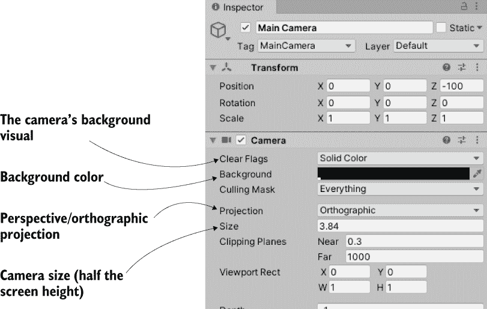

图 5.5 调整 2D 图形的相机设置

定义：**正交投影**是指没有明显透视的平面摄像机视图。这与透视摄像机视图相反，在透视摄像机视图中，较近的物体看起来更大，线条会退入远方。

虽然投影模式是 2D 图形最重要的摄像机设置，但我们还有其他一些设置需要调整。接下来，我们将查看位于投影下的尺寸。摄像机的正交尺寸决定了从屏幕中心到屏幕顶部的摄像机视图大小。换句话说，将尺寸设置为所需屏幕像素尺寸的一半。如果你后来将部署游戏的分辨率设置为相同的像素尺寸，你将获得像素完美的图形。

定义：**像素完美**意味着屏幕上的一个像素对应图像中的一个像素（否则，显卡在放大以适应屏幕时会使图像略微模糊）。

假设你想要一个像素完美的 1024 × 768 屏幕。这意味着摄像机的高度应该是 384 像素。除以 100（因为像素到单位的缩放比例），你得到 3.84 作为摄像机大小。同样，这个数学是 SCREEN_SIZE / 2 / 100f（f 代表浮点数，而不是整数值）。鉴于背景图像是 1024 × 768（选择资产以检查其尺寸），那么显然这个 3.84 的值就是我们想要的摄像机值。

在检查器中需要进行的剩余调整是摄像机的背景颜色和 Z 位置。如前所述，对于精灵来说，较高的 Z 位置意味着更远离场景。因此，摄像机应该有一个相当低的 Z 位置；将摄像机的位置设置为 0, 0, -100。接下来，确保摄像机的清除标志设置为实色而不是天空盒；此设置确定摄像机背景。摄像机的背景颜色可能是黑色；默认颜色是蓝色，如果屏幕宽度大于背景图像（这很可能是情况），那么这种颜色看起来会很奇怪。点击背景旁边的颜色块，并将颜色选择器设置为黑色。

现在将场景保存为“场景”并点击播放。你会看到游戏视图充满了我们的桌面精灵。正如你所看到的，到达这个点并不完全直接（再次强调，这是因为 Unity 是一个最近才添加了 2D 图形的 3D 游戏引擎）。但是桌面是完全空的，所以我们的下一步是在桌子上放一张卡片。

## 5.2 构建卡片对象并使其对点击做出反应

现在所有图像都已导入并准备好使用，让我们构建构成游戏核心的卡片对象。在《记忆》游戏中，所有卡片最初都是面朝下的，只有在选择一对卡片翻转时才会临时面朝上。为了实现这一功能，你需要创建由多个堆叠在一起的精灵组成的对象。然后，你将编写代码，使得卡片在鼠标点击时显示出来。

### 5.2.1 使用精灵构建对象

将一张卡片图片拖入场景。使用一张卡片正面，因为你会在上边添加一张卡片背面来隐藏图片。技术上，现在的位置并不重要，但最终会很重要，所以你可以将卡片定位在-3, 1, 0。现在将卡片背面精灵拖入场景。将这个新的精灵设置为之前卡片精灵的子对象（记住，在层次结构中，将子对象拖到父对象上），然后将其位置设置为 0, 0, -0.1（请注意，这个位置是相对于父对象的，这意味着“在 X 和 Y 上保持相同，但在 Z 上更靠近。”）

注意：在这个设置中，卡片背面和正面是单独的对象。这使得图形设置更简单，显示“正面”就像关闭“背面”一样简单。然而，由于 Unity 即使在看起来是 2D 的场景中也总是 3D 的，你可以制作一个可以翻转的 3D 卡片。这会使得设置更复杂，但可能对某些图形效果有优势。没有一种正确的方法来实现这些事情，只是不同的利弊需要权衡。

提示：与我们在 3D 中使用的移动、旋转和缩放工具不同，在 2D 模式下，我们使用一个称为*矩形工具*的单个操作工具。在 2D 模式下，此工具会自动选择，或者你可以点击 Unity 左上角的控制按钮中的第五个按钮。使用此工具时，点击并拖动对象可以在二维空间内执行所有三个操作（移动/旋转/缩放）。

如图 5.6 所示，卡片背面就位后，图形就准备好了一个可以揭示的响应式卡片。

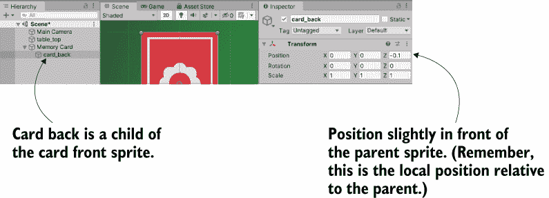

图 5.6 卡片背面精灵的层次链接和位置

### 5.2.2 鼠标输入代码

为了响应玩家点击，卡片精灵需要有一个碰撞器组件。新的精灵默认没有碰撞器，所以不能被点击。你将把一个碰撞器附加到根卡片对象上，而不是卡片背面，这样只有卡片正面而不是卡片背面会接收到鼠标点击。

要做到这一点，请在层次结构中选择根卡片对象（不要在场景中点击卡片，因为卡片背面在最上面，你会选择那个部分）。然后点击检查器中的添加组件按钮。选择物理 2D（不是物理，因为该系统是用于 3D 物理的，这是一个 2D 游戏），然后选择一个盒子碰撞器。

除了碰撞器之外，卡片还需要一个脚本来对玩家的点击做出反应，所以让我们编写一些代码。创建一个新的脚本名为 MemoryCard，并将其附加到根卡片对象上（再次，不是卡片背面）。下面的列表显示了当点击时使卡片发出调试消息的代码。

列表 5.1 点击时发出调试消息

```
dusing System.Collections;
using System.Collections.Generic;
using UnityEngine;

public class MemoryCard : MonoBehaviour {
    public void OnMouseDown() {            ❶
        Debug.Log("testing 1 2 3");        ❷
    }
}
```

❶ 当对象被点击时，会调用该函数。

❷ 目前只需向控制台发出一个测试消息。

提示：如果你还没有这个习惯，将你的资产组织到单独的文件夹中可能是个好主意。为脚本创建文件夹，并在项目视图中拖动文件。请小心避免 Unity 响应的特殊文件夹名称：Resources、Plugins、Editor 和 Gizmos。在本书的后面部分，我们将介绍这些特殊文件夹的一些功能，但现在避免使用这些单词命名任何文件夹。

很好——现在我们可以点击卡片了！就像 Update()一样，OnMouseDown()是 MonoBehaviour 提供的另一个函数，这次是在对象被点击时响应。玩玩游戏，并观察控制台中的消息。但这只是为了测试而打印到控制台；我们希望卡片被*揭示*。

### 5.2.3 点击时揭示卡片

重新编写代码以匹配此列表（代码现在还不能运行，但不用担心）。

列表 5.2 当点击卡片时隐藏背面的脚本

```
using System.Collections;
using System.Collections.Generic;
using UnityEngine;

public class MemoryCard : MonoBehaviour {
    [SerializeField] GameObject cardBack;       ❶

    public void OnMouseDown() {
        if (cardBack.activeSelf) {              ❷
            cardBack.SetActive(false);          ❸
        }
    }
}
```

❶ 在检查器中出现的变量

❷ 仅当对象当前处于活动/可见状态时运行禁用代码。

❸ 将对象设置为非活动/不可见。

我们在脚本中添加了两个关键功能：对场景中对象的引用，以及 SetActive()方法，该方法可以禁用该对象。第一部分，对场景中对象的引用，与我们之前章节中做的是类似的：将变量标记为序列化，然后将对象从层次结构拖动到检查器中的变量上。设置好对象引用后，代码现在将影响场景中的对象。

代码中的第二个关键添加是 SetActive 命令。此命令将使任何 GameObject 失效，使其不可见。如果我们现在将场景中的 card_back 拖动到检查器中此脚本的变量，那么在游戏中点击卡片时，卡片背面将消失；隐藏卡片背面将揭示卡片正面；我们为记忆游戏完成了另一个重要的任务！但仍然只有一张卡片，所以现在让我们创建一堆卡片。

提示：当脚本有一个序列化变量时忘记拖动对象，这是一个相当常见的错误，因此识别控制台标签中的错误信息是有用的。使用尚未设置的序列化变量的代码将抛出空引用错误。实际上，每当代码尝试使用尚未设置的变量时，无论是否为序列化变量，都会抛出空引用错误。

## 5.3 显示各种卡片图像

我们已经编写了一个卡片对象，它最初显示卡片背面，但在点击时揭示自己。那是一张单独的卡片，但游戏需要一个完整的卡片网格，大多数卡片上有不同的图像。我们将通过使用之前章节中看到的一些概念以及一些你之前没有见过的概念来实现卡片网格。第三章介绍了使用不可见的 SceneController 组件和实例化对象副本的概念。这次 SceneController 将为不同的卡片应用不同的图像。

### 5.3.1 以编程方式加载图像

我们正在创建的游戏有四张卡牌图像。桌上的所有八张卡牌（每种符号两张）将通过克隆相同的原始图像来创建，所以所有卡牌最初都将有相同的符号。我们将在脚本中更改卡牌上的图像，通过程序加载不同的图像。

为了检查图像如何被程序化分配，让我们编写简单的测试代码（稍后将被替换）来演示这个技术。首先，将此代码添加到 MemoryCard 脚本中。

列表 5.3 用于演示更改精灵图像的测试代码

```
...
[SerializeField] Sprite image;                         ❶
void Start() {
    GetComponent<SpriteRenderer>().sprite = image;     ❷
}
...
```

❶ 引用将要加载的精灵资源

❷ 设置这个 SpriteRenderer 组件的精灵。

保存此脚本后，新的图像变量将出现在检查器中，因为它已被设置为序列化。从项目视图中拖动一个精灵（选择一张卡牌图像，而不是场景中已有的图像）到图像槽中。现在运行场景，你将看到卡牌上的新图像。

理解这段代码的关键是了解 SpriteRenderer 组件。你会在图 5.7 中注意到，卡牌背面对象只有两个组件：场景中所有对象的标准 Transform 组件和一个新组件，称为 SpriteRenderer。这个组件使 GameObject 成为一个精灵对象，并确定将显示哪个精灵资源。注意，组件中的第一个属性被称为 sprite，并链接到项目视图中的一个精灵；该属性可以在代码中操作，这正是这个脚本所做的。

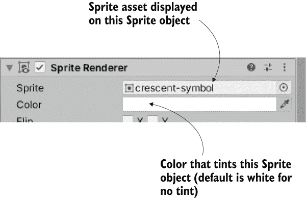

图 5.7 场景中的一个精灵对象附带了 SpriteRenderer 组件。

就像在前面章节中处理 CharacterController 和自定义脚本一样，GetComponent()方法返回同一对象上的其他组件，因此我们用它来引用 SpriteRenderer 对象。SpriteRenderer 的精灵属性可以被设置为任何精灵资源，所以这段代码将这个属性设置为顶部声明的 Sprite 变量（我们在编辑器中用精灵资源填充了它）。

好吧，这并不太难！但这只是一个单独的图像。我们有四张图像要使用，所以现在删除列表 5.3 中的新代码（它只是演示了技术的工作原理），为下一部分做准备。

### 5.3.2 从不可见的 SceneController 设置图像

记得在第三章中，我们在场景中创建了一个不可见对象来控制对象的生成。在这里，我们也将采取同样的方法，使用一个不可见对象来控制与场景中任何特定对象无关的更抽象的特征。

首先，创建一个空的游戏对象（记住，选择 GameObject > 创建空）。然后在项目视图中创建一个新的脚本，命名为 SceneController，并将此脚本资产拖到控制器游戏对象上。在编写新脚本中的代码之前，将下一列表的内容添加到 MemoryCard 脚本中，而不是列表 5.3 中看到的内容。

列表 5.4 MemoryCard 中的新公共方法

```
...
[SerializeField] SceneController controller;

private int _id;
public int Id {
    get {return _id;}                                ❶
}

public void SetCard(int id, Sprite image) {          ❷
    _id = id;
    GetComponent<SpriteRenderer>().sprite = image;   ❸
}
...
```

❶ 添加了获取函数（在 C#和 Java 等语言中常见的习语）

❷ 其他脚本可以使用以向此对象传递新精灵的公共方法

❸ 与删除的代码演示中相同的 SpriteRenderer 代码行

与之前的列表相比，主要的变化是我们现在在 SetCard()中设置精灵图像，而不是在 Start()中设置。因为这是一个接受精灵作为参数的公共方法，你可以从其他脚本中调用此函数并设置此对象上的图像。请注意，SetCard()还接受一个 ID 号作为参数，并且代码会存储该数字。尽管我们目前不需要 ID，但很快我们将编写比较卡片以进行匹配的代码，而这个比较将依赖于卡片的 ID。

备注：根据你过去使用的编程语言，你可能不熟悉*获取器*和*设置器*的概念。简而言之，它们是在你尝试访问与它们关联的属性时运行的函数（例如，检索 card.Id 的值）。使用获取器和设置器有多种原因，但在此情况下，Id 属性是只读的，因为我们有一个只获取值而不设置的函数。

最后，请注意代码中有一个用于控制器的变量。即使当 SceneController 开始克隆卡片对象以填充场景时，卡片对象也需要一个指向控制器的引用来调用其公共方法。通常情况下，当代码在场景中引用对象时，请将 Unity 编辑器中的控制器对象拖动到检查器中的序列化变量槽中。对于这个单独的卡片，只需这样做一次，之后的所有副本都将具有该引用。现在，在 MemoryCard 中添加了额外的代码，请在 SceneController 中编写此代码。

列表 5.5 Memory 游戏的 SceneController 第一次尝试

```
using System.Collections;
using System.Collections.Generic;
using UnityEngine;

public class SceneController : MonoBehaviour {
    [SerializeField] MemoryCard originalCard;        ❶
    [SerializeField] Sprite[] images;                ❷

    void Start() {
        int id = Random.Range(0, images.Length);
        originalCard.SetCard(id, images[id]);        ❸
    }
}
```

❶ 场景中卡片的引用

❷ 用于引用精灵资源的数组

❸ 调用我们添加到 MemoryCard 中的公共方法。

目前，这是一个简短的代码片段，用于演示从 SceneController 操作卡片的原理。其中大部分应该你已经很熟悉（例如，在 Unity 的编辑器中，将卡片对象拖动到检查器中的序列化变量槽中），但图像数组是新的。如图 5.8 所示，在检查器中你可以设置元素的数量。将数组长度输入为 4，然后将卡片图像的精灵拖放到数组槽中。现在这些精灵可以像任何其他对象引用一样在数组中访问。

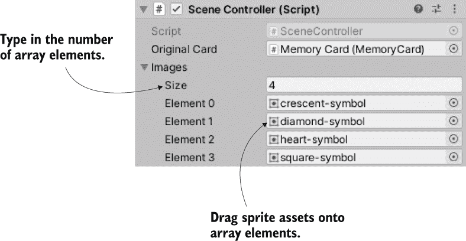

图 5.8 填充好的精灵数组

顺便提一下，我们在第三章中使用了 Random.Range()方法，所以希望你能回忆起来。那里确切的边界值并不重要，但这次需要注意的是，最小值是包含的，可能被返回，而返回值总是低于最大值。

点击播放以运行此新代码。每次运行场景时，你都会看到不同的图像被应用到露出的卡片上。下一步是创建一个完整的卡片网格，而不仅仅是单张卡片。

### 5.3.3 实例化卡片网格

SceneController 已经引用了卡片对象，因此现在你将使用 Instantiate()方法（参见下一列表）多次克隆对象，就像我们在第三章中生成对象时做的那样。

列表 5.6 克隆卡片八次并在网格中定位

```
using System.Collections;
using System.Collections.Generic;
using UnityEngine;

public class SceneController : MonoBehaviour {
  public const int gridRows = 2;                           ❶
  public const int gridCols = 4;                           ❶
  public const float offsetX = 2f;                         ❶
  public const float offsetY = 2.5f;                       ❶

  [SerializeField] MemoryCard originalCard;
  [SerializeField] Sprite[] images;

  void Start() {
    Vector3 startPos = originalCard.transform.position;    ❷

    for (int i = 0; i < gridCols; i++) {
      for (int j = 0; j < gridRows; j++) {                 ❸
        MemoryCard card;                                   ❹
        if (i == 0 && j == 0) {
          card = originalCard;
        } else {
          card = Instantiate(originalCard) as MemoryCard;
        }

        int id = Random.Range(0, images.Length);
        card.SetCard(id, images[id]);

        float posX = (offsetX * i) + startPos.x;
        float posY = -(offsetY * j) + startPos.y;
        card.transform.position = new Vector3(posX, posY, startPos.z); 
                                                           ❺
      }
    }
  }
}
```

❶ 确定网格空间数量和放置距离的值

❷ 第一张卡片的定位；所有其他卡片都将从这个位置偏移。

❸ 使用嵌套循环定义网格的列和行

❹ 原始卡片或副本的容器引用

❺ 对于 2D 图形，只需要偏移 X 和 Y；保持 Z 不变。

尽管这个脚本比之前的列表长得多，但解释起来并不多，因为大部分新增的都是直接的变量声明和数学运算。这段代码中最奇怪的部分可能是以 if (i == 0 && j == 0)开始的 if/else 语句。这个条件要么使用原始卡片对象作为第一个网格槽，要么克隆卡片对象用于所有其他网格槽。因为原始卡片已经在场景中存在，如果你在循环的每次迭代中都复制卡片，你会在场景中多出一张卡片。然后，根据循环的迭代次数，通过偏移来定位卡片。

提示：就像移动 3D 对象一样，2D 对象可以通过在 Update()中重复增加 transform.position 来实现平滑的移动。但是，正如你在移动第一人称玩家时看到的，当直接调整 transform.position 时，不会应用碰撞检测。因此，下一章的代码将通过调整 rigidbody2D.velocity 来移动精灵。

现在运行代码，将创建一个包含八张卡片的网格（如图 5.9 所示）。准备卡片网格的最后一个步骤是将它们组织成对，而不是保持随机。


图 5.9 当你点击它们时显示的八张卡片网格

### 5.3.4 洗牌卡片

我们不会让每一张卡片都是随机的，而是定义一个包含所有卡片 ID（数字 0 到 3 各两次，每张卡片一对）的数组，然后对这个数组进行洗牌。在设置卡片时，我们将使用这个卡片 ID 数组，而不是让每个卡片都是随机的。

列表 5.7 从洗牌列表放置卡片

```
...
void Start() {                                            ❶
   Vector3 startPos = originalCard.transform.position;

   int[] numbers = {0, 0, 1, 1, 2, 2, 3, 3};              ❷
   numbers = ShuffleArray(numbers);                       ❸

   for (int i = 0; i < gridCols; i++) {
      for (int j = 0; j < gridRows; j++) {
        MemoryCard card;
        if (i == 0 && j == 0) {
          card = originalCard;
        } else {
          card = Instantiate(originalCard) as MemoryCard;
        }

        int index = j * gridCols + i;
        int id = numbers[index];                          ❹
        card.SetCard(id, images[id]);

        float posX = (offsetX * i) + startPos.x;
        float posY = -(offsetY * j) + startPos.y;
        card.transform.position = new Vector3(posX, posY, startPos.z);
      }
   }
}

private int[] ShuffleArray(int[] numbers) {               ❺
   int[] newArray = numbers.Clone() as int[];
   for (int i = 0; i < newArray.Length; i++ ) {
      int tmp = newArray[i];
      int r = Random.Range(i, newArray.Length);
      newArray[i] = newArray[r];
      newArray[r] = tmp;
   }
   return newArray;
}
...
```

❶ 这部分列表主要是为了显示新增内容的位置。

❷ 声明一个整数数组，包含所有四个卡片精灵的 ID 对。

❸ 调用一个函数来洗牌数组的元素。

❹ 从洗牌后的列表中检索 ID，而不是随机数。

❺ Knuth 洗牌算法的实现

现在，当你点击“播放”时，卡片网格将是一个随机排列的混合，恰好揭示每种卡片的图像各两张。卡片数组通过 *Knuth*（也称为 *Fisher-Yates*）洗牌算法进行处理，这是一种简单而有效的洗牌数组元素的方法。此算法遍历数组，并将数组的每个元素与另一个随机选择的数组位置交换。

你可以点击所有牌来揭示它们，但记忆游戏应该是成对进行的。我们需要更多的代码。

## 5.4 制作和计分匹配

制作一个完全功能的记忆游戏的最后一步是检查匹配。尽管我们现在有一个在点击时揭示的卡片网格，但各种卡片在没有任何方式影响彼此。在记忆游戏中，每次揭示一对牌时，我们都应该检查揭示的牌是否匹配。

这种抽象逻辑——检查匹配并相应地做出反应——要求牌在点击时通知 SceneController。这需要 SceneController 中显示的添加。

列表 5.8 SceneController，必须跟踪已揭示的牌

```
...
private MemoryCard firstRevealed;
private MemoryCard secondRevealed;

public bool canReveal {
    get {return secondRevealed == null;}     ❶
}
...
public void CardRevealed(MemoryCard card) {
    // initially empty
}
...
```

❶ 返回 false 的 getter 函数，如果已揭示第二张牌

The CardRevealed() 方法将稍后填充；我们现在需要空的框架，以便在 MemoryCard 中引用而不会出现编译错误。注意，我们再次有一个只读的 getter，这次用于确定是否可以揭示另一张牌。玩家只有在两张牌尚未揭示的情况下才能揭示另一张牌。

我们还需要修改 MemoryCard 以调用（目前为空的）方法，以便在点击牌时通知 SceneController。根据此列表修改 MemoryCard 中的代码。

列表 5.9 揭示牌的 MemoryCard 修改

```
...
public void OnMouseDown() {
   if (cardBack.activeSelf && controller.canReveal) {     ❶
      cardBack.SetActive(false);
      controller.CardRevealed(this);                      ❷
   }
}

public void Unreveal() {                                  ❸
   cardBack.SetActive(true);
}
...
```

❶ 检查控制器的 canReveal 属性，以确保一次只揭示两张牌。

❷ 当这张牌被揭示时通知控制器。

❸ 一个公共方法，以便 SceneController 可以再次隐藏卡片（通过将 card_back 重新打开）

如果你在 CardRevealed() 中放入一个调试语句来测试对象之间的通信，你会在点击卡片时看到测试消息出现。让我们首先处理一个已揭示的对。

### 5.4.1 存储和比较已揭示的牌

卡片对象被传递到 CardRevealed() 中，所以让我们开始跟踪已揭示的卡片。

列表 5.10 在 SceneController 中跟踪已揭示的牌

```
...
public void CardRevealed(MemoryCard card) {
  if (firstRevealed == null) {                                         ❶
    firstRevealed = card;
  } else {
    secondRevealed = card;
    Debug.Log("Match? " + (firstRevealed.Id == secondRevealed.Id));    ❷
  }
}
...
```

❶ 根据第一个变量是否已被占用，将牌对象存储在两个牌变量之一中。

❷ 比较两张已揭示的牌的 ID。

列表将揭示的牌存储在两个牌变量之一中，具体取决于第一个变量是否已被占用。如果第一个变量为空，则填充它；如果它已被占用，则填充第二个变量并检查牌 ID 是否匹配。调试语句在控制台打印出 true 或 false。

目前，代码不会对匹配做出响应——它只会检查它们。现在让我们编写响应程序。

### 5.4.2 隐藏不匹配的牌

我们将再次使用协程，因为对不匹配牌的反应应该暂停，以便玩家可以看到牌。请参阅第三章以获取协程的完整解释；简而言之，使用协程将允许我们在检查匹配之前暂停。此列表显示了更多要添加到 SceneController 中的代码。

列表 5.11 SceneController 得分或隐藏未匹配的匹配

```
...
private int score = 0;                            ❶
...
public void CardRevealed(MemoryCard card) {
  if (firstRevealed == null) {
    firstRevealed = card;
  } else {
    secondRevealed = card;
    StartCoroutine(CheckMatch());                 ❷
  }
}

private IEnumerator CheckMatch() {
  if (firstRevealed.Id == secondRevealed.Id) {
    score++;                                      ❸
    Debug.Log($"Score: {score}");                 ❹
  }
  else {
    yield return new WaitForSeconds(.5f);

    firstRevealed.Unreveal();                     ❺
    secondRevealed.Unreveal();
  }

  firstRevealed = null;                           ❻
  secondRevealed = null;
}
...
```

❶ 在 SceneController 顶部附近添加到列表中

❷ 在此函数中，唯一更改的行是当两张牌都显示时调用协程

❸ 如果显示的牌具有匹配的 ID，则增加分数。

❹ 使用字符串插值构造消息。

❺ 如果牌不匹配，则不显示牌。

❻ 无论是否匹配，都要清除变量。

首先，添加一个分数值来跟踪。然后，当第二张牌显示时，启动一个协程来检查匹配。这个协程有两个代码路径，取决于牌是否匹配。如果匹配，协程不会暂停；跳过 yield 命令。如果不匹配，协程会在调用 Unreveal()并再次隐藏两张牌之前暂停半秒钟。最后，无论是否匹配，存储牌的变量都会被置为 null，为揭示更多牌铺平道路。

当你玩游戏时，不匹配的牌会在隐藏之前短暂显示。当你得分匹配时，会显示调试信息，但我们希望分数以屏幕上的标签形式显示。

### 5.4.3 分数文本显示

在游戏中，向玩家展示信息是 UI（用户界面）存在的一半原因（另一半是接收玩家的输入。UI 按钮将在下一节讨论）。

定义 *UI* 代表 *用户界面*。另一个与之密切相关的术语是 *GUI*，或 *图形用户界面*，它指的是界面的视觉部分，如文本和按钮，这也是很多人在说 UI 时所指的。

Unity 有多种创建文本显示的方法，但使用 TextMeshPro 包是最佳方法。这个高级文本系统是由外部开发的，后来被 Unity 收购。

TextMeshPro 可能已经安装（在创建新项目时，Unity 会安装几个常用包），如果没有，则必须在包管理器中安装它。从菜单中选择 Window > Package Manager 打开该窗口，然后滚动到左侧列表中的 TextMeshPro，如图 5.10 所示。选择该包，然后点击安装按钮。

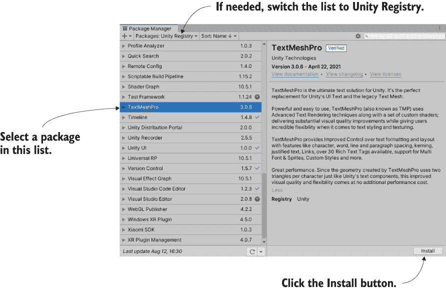

图 5.10 通过包管理器安装 TextMeshPro

安装了该包后，您可以通过访问 GameObject 菜单并选择 3D Object > Text - TextMeshPro 在场景中创建一个 TextMeshPro 对象。由于这是 TextMeshPro 在本项目中首次使用，TMP Importer 窗口将自动出现。点击导入 TMP Essentials 按钮，在所需资源下载完成后，文本对象将出现在场景中。

注意 3D 文本可能听起来与 2D 游戏不兼容，但别忘了，这实际上是一个看起来平面的 3D 场景，因为它是通过正交相机看到的。这意味着如果我们想的话，我们可以将 3D 对象放入 2D 游戏中——它们将以平面视角显示。

警告 TextMeshPro 也列在 GameObject > UI 下。后面的章节将介绍 Unity 的 UI 系统，您将在那些章节中使用那个其他 GameObject。不要混淆这两个版本；虽然两者都是 TextMeshPro 对象，但我们在这个章节中并没有使用 Unity 的高级 UI 系统。

选择新的文本对象以查看其设置在检查器中。将此对象定位在 -2.3, 3.1, -10；即向左 230 像素和向上 310 像素，将其放置在左上角并靠近相机，以便它能够覆盖其他游戏对象。此外，由于新文本一开始很大，因此将宽度减小到 5 和高度减小到 1。

滚动到 TextMeshPro 设置。我们可以以无数种方式自定义文本，但现在我们将保留大多数默认设置。图 5.11 显示我们将更改的设置，您可以在 Unity 文档中了解它们的所有信息（[`mng.bz/RqQP`](https://shortener.manning.com/RqQP)）。

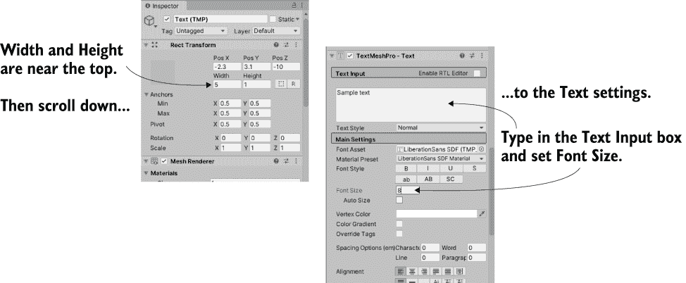

图 5.11 此文本对象的检查器设置

在大文本输入框中输入 Score: 并将字体大小减小到 8。在游戏中操作这个文本对象只需要在得分代码中进行少量调整。

列表 5.12 在文本对象上显示得分

```
...
using TMPro;         ❶
...
[SerializeField] TMP_Text scoreLabel;
...
private IEnumerator CheckMatch() {
  if (firstRevealed.Id == secondRevealed.Id) {
     score++;
     scoreLabel.text = $"Score: {score}";
  }
...
```

❶ 包含 TextMeshPro 代码。

如您所见，文本是对象的属性，您可以将其设置为新的字符串。将得分变量放入字符串中，以显示该值。

将场景中的文本对象拖到 SceneController 中您添加的 scoreLabel 变量上，然后点击播放。现在，当您玩游戏并制作匹配时，应该会看到得分显示。太棒了——游戏工作啦！

## 5.5 重启按钮

到目前为止，记忆游戏已经完全可用。您可以玩游戏，所有基本功能都已就绪。但这个可玩的核心仍然缺少玩家在完成的游戏中期望或需要的整体功能。例如，目前您只能玩一次游戏；您需要退出并重新启动才能再次玩游戏。让我们在屏幕上添加一个控制按钮，以便玩家可以在不退出的情况下重新开始游戏。

这个功能可以分为两个任务：创建一个 UI 按钮，并在点击该按钮时重置游戏。图 5.12 显示了带有开始按钮的游戏外观。

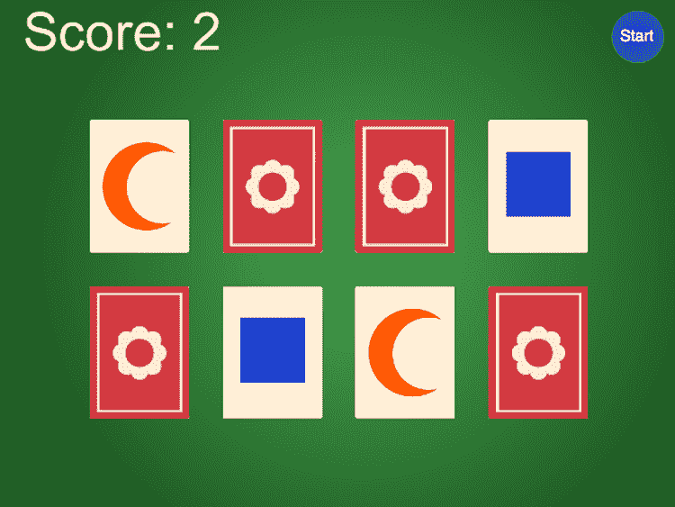

图 5.12 完整的记忆游戏屏幕，包括开始按钮

顺便说一下，这两个任务并不特定于 2D 游戏。所有游戏都需要 UI 按钮，所有游戏都需要重置的能力。我们将讨论这两个主题，以完善本章内容。

### 5.5.1 通过 SendMessage 编程 UIButton 组件

首先，通过从项目视图拖动按钮精灵到场景中。给它一个位置如 4.5, 3.25, -10；这样会将按钮放置在右上角（即向右 450 像素，向上 325 像素）并使其靠近相机，以便它能够显示在其他游戏对象之上。因为我们希望能够点击这个对象，所以给它一个碰撞器（就像卡片对象一样，选择添加组件 > 物理引擎 2D > 矩形碰撞器 2D）。

注意：正如前节所述，Unity 提供了多种创建 UI 显示的方式，包括在 Unity 后续版本中引入的高级 UI 系统。现在，我们将使用标准显示对象构建单个按钮。未来的章节将教你关于高级 UI 功能；2D 和 3D 游戏的 UI 理想上应该使用该系统构建。

现在创建一个新的脚本名为 UIButton 并将其分配给按钮对象。

列表 5.13 创建通用和可重用 UI 按钮的代码

```
using System.Collections;
using System.Collections.Generic;
using UnityEngine;

public class UIButton : MonoBehaviour {
  [SerializeField] GameObject targetObject;                    ❶
  [SerializeField] string targetMessage;
  public Color highlightColor = Color.cyan;

  public void OnMouseEnter() {
    SpriteRenderer sprite = GetComponent<SpriteRenderer>();
    if (sprite != null) {
      sprite.color = highlightColor;                           ❷
    }
  }
  public void OnMouseExit() {
    SpriteRenderer sprite = GetComponent<SpriteRenderer>();
    if (sprite != null) {
      sprite.color = Color.white;
    }
  }

  public void OnMouseDown() {
    transform.localScale = new Vector3(1.1f, 1.1f, 1.1f);      ❸
  }
  public void OnMouseUp() {
    transform.localScale = Vector3.one;
    if (targetObject != null) {
      targetObject.SendMessage(targetMessage);                 ❹
    }
  }
}
```

❶ 引用目标对象以通知点击事件。

❷ 当鼠标悬停在按钮上时，为按钮着色。

❸ 当按钮被点击时，按钮的大小会略微弹出。

❹ 当按钮被点击时，向目标对象发送消息。

这段代码的大部分内容都发生在一系列的 OnMouseSomething 函数中。就像 Start() 和 Update() 一样，这些是一系列自动对所有脚本组件在 Unity 中可用的函数。MouseDown 在第 5.2.2 节中已经提到，但其他这些函数也会在对象有碰撞器的情况下响应鼠标交互。MouseEnter 和 MouseExit 是一对事件，用于在鼠标光标悬停在对象上：当鼠标光标第一次移动到对象上时，MouseEnter 触发，而当鼠标光标移开时，MouseExit 触发。同样，MouseDown 和 MouseUp 是一对用于点击鼠标的事件。当鼠标按钮被物理按下时，MouseDown 触发，而当鼠标按钮释放时，MouseUp 触发。

你可以看到，当鼠标悬停在精灵上时，代码会着色精灵，当点击时，会缩放精灵。在这两种情况下，你可以看到变化（颜色或缩放）发生在鼠标交互开始时，当鼠标交互结束时，属性会返回默认值（白色或缩放 1）。对于缩放，代码使用所有 GameObject 都有的标准变换组件。然而，对于着色，代码使用精灵对象具有的 SpriteRenderer 组件；精灵被设置为在 Unity 编辑器中通过公共变量定义的颜色。

除了将比例恢复到 1 之外，当鼠标释放时还会调用 SendMessage()。SendMessage()会调用该 GameObject 所有组件中给定名称的函数。在这里，消息的目标对象以及要发送的消息都由序列化变量定义。这样，同一个 UIButton 组件可以用于所有类型的按钮，不同按钮的目标对象在检查器中设置为不同的对象。

通常，在强类型语言如 C#中进行面向对象编程时，你需要知道目标对象类型才能与该对象通信（例如，调用对象的公共方法，如调用 targetObject.SendMessage()）。但 UI 元素的脚本可能有多种目标类型，因此 Unity 提供了 SendMessage()方法，即使你不知道目标对象的确切类型，也可以与目标对象通信特定的消息。

警告：使用 SendMessage()比调用已知类型的公共方法对 CPU 效率更低（即使用 object.SendMessage("Method")与 component.Method()相比），因此只有在使代码更易于理解和操作的情况下才使用 SendMessage()。一般来说，只有在许多不同类型的对象可能接收消息的情况下才会如此。在这种情况下，继承或接口的不灵活性将阻碍游戏开发过程并抑制实验。

编写完此代码后，将按钮检查器中的公共变量连接起来。高亮颜色可以设置为任何你喜欢的颜色（尽管默认的青色在蓝色按钮上看起来相当不错）。同时，将 SceneController 对象放入目标对象槽中，然后输入 Restart 作为消息。

如果你现在玩游戏，右上角的复位按钮会根据鼠标颜色变化，并在点击时产生轻微的视觉弹出效果。但是，当你点击按钮时，会发出错误消息；在控制台中，你会看到一个关于没有接收器用于重启消息的错误。那是因为我们还没有在 SceneController 中编写 Restart()方法，所以让我们添加它。

### 5.5.2 从 SceneController 调用 LoadScene

按钮中的 SendMessage()方法试图在 SceneController 中调用 Restart()，所以现在让我们添加它。

列表 5.14 重新加载级别的 SceneController 代码

```
...
using UnityEngine.SceneManagement;      ❶
...
public void Restart() {
   SceneManager.LoadScene("Scene");     ❷
}
...
```

❶ 包含 SceneManagement 代码。

❷ 如果你的场景有不同的名称，请更改此字符串中的名称。

你可以看到 Restart()所做的唯一一件事就是调用 LoadScene()方法。该方法加载一个已保存的场景资产（当你点击 Unity 中的保存场景时创建的文件）。将你想加载的场景名称传递给该方法。在我的情况下，场景以 Scene 名称保存，但如果你使用了不同的名称，请将那个名称传递给该方法。

点击播放按钮查看会发生什么。翻开几张牌并完成一些匹配。如果你然后点击重置按钮，游戏将重新开始，所有牌都隐藏起来，得分为 0。太好了，这正是我们想要的！

如名称 LoadScene()所示，这个方法可以加载不同的场景。但场景加载时究竟会发生什么，为什么这会重置游戏？发生的情况是，当前级别（场景中的所有对象，以及因此附加到这些对象的所有脚本）的内容都会从内存中清除，然后加载新场景的所有内容。因为新场景是当前场景（在这种情况下）的保存资产，所以所有内容都会从内存中清除，然后从头开始重新加载。

小贴士：你可以在加载关卡时标记特定的对象，以排除默认内存清除。Unity 提供了 DontDestroyOnLoad()方法来在多个场景中保持对象的存在。你将在后面的章节中使用这个方法在代码架构的部分。

另一个游戏成功完成！嗯，*完成*这个词是相对的；你总是可以添加更多功能，但所有初始计划中的内容都已经完成。这个二维游戏中的许多概念也适用于三维游戏，特别是检查游戏状态和加载关卡。是时候再次转换方向，离开这个记忆游戏，转向新的项目。

### 摘要

+   在 Unity 中使用正交相机显示二维图形。

+   为了像素级的图形，相机的尺寸应该是屏幕高度的一半。

+   点击精灵之前，你需要首先为它们分配二维碰撞器。

+   可以通过编程方式加载精灵的新图像。

+   可以使用 3D 文本对象创建 UI 文本。

+   加载关卡会重置场景。
