# 6 创建基本 2D 平台游戏

本章涵盖

+   持续移动精灵

+   播放精灵图集动画

+   使用 2D 物理（碰撞、重力）

+   实现侧滚动游戏的相机控制

让我们创建一个新的游戏，继续学习 Unity 的 2D 功能。第五章介绍了基本概念，所以本章将在这些基础上创建一个更复杂的游戏。具体来说，你将构建一个 2D 平台游戏的核心功能。也称为*平台游戏机*，这种常见的 2D 动作游戏以经典游戏如*超级马里奥兄弟*最为知名：从侧面观看的角色在平台上奔跑和跳跃，视图滚动以跟随。图 6.1 显示了最终结果。

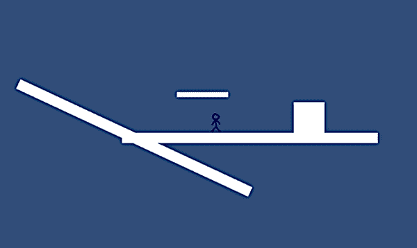

图 6.1 本章的最终产品

本项目将教授如何左右移动玩家、播放精灵动画以及添加跳跃能力等概念。我们还将介绍平台游戏中常见的几个特殊功能，如单向地板和移动平台。从这个外壳到完整游戏的过程基本上意味着反复重复这些概念。

要开始，请像上一章一样在 2D 模式下创建一个新项目：从 Unity Hub 中选择新建，或从文件菜单中选择新建项目；然后在出现的窗口中选择 2D。在新项目中，创建两个文件夹，分别命名为 Sprites 和 Scripts，以包含各种资源。你可以调整相机，就像第五章中那样，但现在只需将大小减少到 4。这个项目不需要完美的相机设置，尽管你可能需要调整大小以制作一个准备发布的精良游戏。

小贴士：屏幕中央的相机图标可能会碍事，因此您可以使用 Gizmos 菜单将其隐藏。在场景视图的顶部有一个 Gizmos 的标签。该术语指的是编辑器中的抽象形状和图标。点击 Gizmos，然后点击旁边的 Camera 图标，即可看到一个按字母顺序排列的列表。

现在保存空场景（当然，在您工作时定期点击保存），以在这个项目中创建场景资产。目前一切都是空的，所以第一步将是引入艺术资产。

## 6.1 设置图形

在您能够编程 2D 平台游戏的功能之前，您需要将图像导入到项目中（记住，2D 游戏中的图像被称为*精灵*而不是*纹理*），然后将这些精灵放置到场景中。这个游戏将是 2D 平台游戏的外壳，玩家控制的字符在一个基本且大部分为空的场景中奔跑，所以您只需要几个用于平台的精灵和用于玩家的精灵。让我们分别介绍每个，因为尽管这个例子中的图像很简单，但其中涉及一些不明显的考虑因素。

### 6.1.1 放置场景

简而言之，你需要一个单独的空白白色图像来使用。一个名为 blank.png 的图像包含在本章的示例项目中；下载示例项目，并从那里复制 blank.png。然后将 PNG 拖入新项目的 Sprites 文件夹中，并在检查器中确保导入设置表明它是一个精灵而不是纹理（对于 2D 项目应该是自动的，但值得再次检查）。

你现在所做的是本质上与第四章中的白盒化相同，但是在 2D 而不是 3D 中。2D 中的白盒化使用精灵而不是网格，但保持了为玩家阻挡空白地板和墙壁的活动。

要放置地板对象，将空白精灵拖动到场景中，如图 6.2 所示（大约位置 0.15, -1.27, 0），将缩放设置为 50, 2, 1，并将其名称更改为 Floor。然后拖入另一个空白精灵，将其缩放设置为 6, 6, 1，将其放置在右侧的地板上（大约位置 2, -0.63, 0），并将其命名为 Block。

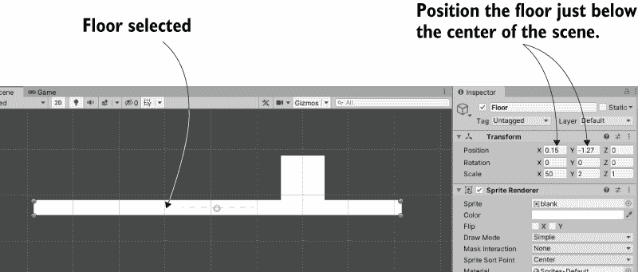

图 6.2 地板平台放置

足够简单；现在地板和方块已经完成。你还需要另一个对象，即玩家的角色。

### 6.1.2 导入精灵图集

你需要的唯一其他艺术资产是玩家的精灵，因此也从示例项目中复制 stickman.png。但与空白图像不同，这个 PNG 是一系列单独的精灵组合成的一个图像。如图 6.3 所示，stickman 图像是两个动画的帧：站立空闲和行走循环。

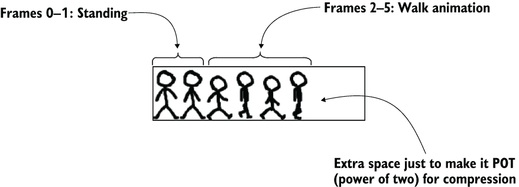

图 6.3 Stickman 精灵图集——一行六帧

我们不会详细介绍如何动画化，但可以说*空闲*和*循环*是游戏开发者常用的术语。空闲指的是在无所事事时的微妙动作，而循环则是一个持续循环的动画。

如第五章所述，一个图像文件可能是一系列精灵图像打包在一起，而不仅仅是一个精灵。当多个精灵图像是动画的帧时，这样的图像被称为*精灵图集*。在 Unity 中，作为多个精灵导入的图像在项目视图中仍然作为一个单一资产出现，但如果点击资产上的箭头，它将展开并显示所有单个精灵图像。图 6.4 显示了它的样子。

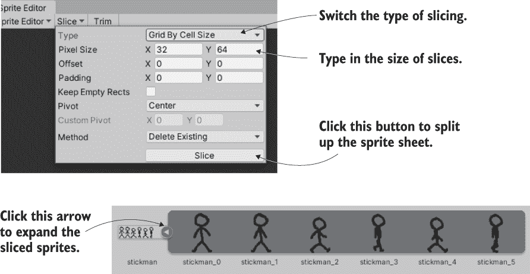

图 6.4 将精灵图集切割成单独的帧

将 stickman.png 拖入 Sprites 文件夹以导入图像，但这次在检查器中更改许多导入设置。选择精灵资产，将精灵模式设置为多个，然后点击精灵编辑器打开该窗口。在窗口的左上角点击切片，将类型设置为按单元格大小网格（如图 6.4 所示），使用大小 32, 64（这是精灵图集中每个帧的大小），然后点击切片以查看帧被分割。现在关闭精灵编辑器窗口，并点击应用以保留更改。

注意：Sprite 编辑器窗口需要 2D Sprite 包。创建新的 2D 项目应该会自动安装该包，但如果未安装，请打开“窗口”>“包管理器”，并在窗口左侧的列表中查找 2D Sprite。选择该包，然后点击“安装”按钮。

警告：如果窗口太小，Sprite 编辑器窗口顶部的按钮会被隐藏。如果您看不到“切片”按钮，请尝试拖动窗口的角落来调整大小。

现在精灵资产已被拆分，所以点击箭头展开帧。将一个（可能是第一个）棍子人精灵拖入场景，将其放置在地板中间，并命名为 Player。在那里，玩家对象已经出现在场景中！

## 6.2 移动玩家左右

现在图形设置好了，让我们开始编写玩家的移动代码。首先，场景中的玩家实体需要一些额外的组件，以便我们控制。如前几章简要提到的，Unity 中的物理模拟作用于具有特殊 Rigidbody 组件的对象，您希望物理（特别是碰撞和重力）作用于角色。

同时，角色还需要一个 Collider 组件来定义其碰撞检测的边界。这些组件之间的区别微妙但很重要：Collider 定义了物理作用的对象形状，而 Rigidbody 告诉物理模拟哪些对象要作用。

注意：这些组件被保留为独立（尽管它们密切相关），因为许多不需要物理模拟的对象确实需要与其他受物理作用的对象发生碰撞。

另一个需要注意的微妙之处是，Unity 为 2D 游戏有一个独立的物理系统，而不是 3D 物理。因此，在本章中，您将使用来自 Physics 2D 部分的组件，而不是列表中的常规 Physics 部分。

在场景中选择 Player。在检查器中，点击“添加组件”，然后选择“Physics 2D”>“Rigidbody 2D”，如图 6.5 所示。然后再次点击“添加组件”以添加“Physics 2D”>“Box Collider 2D”。Rigidbody 需要一些微调，因此在检查器中将碰撞检测设置为连续，开启“约束”>“冻结旋转 Z”（通常，物理模拟在移动对象时会尝试旋转对象，但游戏中的角色不像普通对象那样表现），并将重力比例减少到 0（您稍后会重置此设置，但现在您不希望有重力）。玩家实体现在已准备好控制移动的脚本。

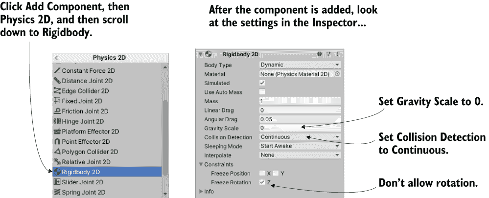

图 6.5 添加和调整 Rigidbody 2D 组件

### 6.2.1 编写键盘控制

首先，你需要让玩家左右移动；在平台游戏中，垂直移动也很重要，但你可以稍后再处理。在 Scripts 文件夹中创建一个名为 PlatformerPlayer 的 C# 脚本，然后将它拖放到场景中的 Player 对象上。打开脚本并从下面的列表中写入代码。

列表 6.1 使用箭头键移动的 PlatformerPlayer 脚本

```
using System.Collections;
using System.Collections.Generic;
using UnityEngine;

public class PlatformerPlayer : MonoBehaviour {
  public float speed = 4.5f;

  private Rigidbody2D body;

  void Start() {
    body = GetComponent<Rigidbody2D>();                        ❶
  }

  void Update() {
    float deltaX = Input.GetAxis("Horizontal") * speed;
    Vector2 movement = new Vector2(deltaX, body.velocity.y);   ❷
    body.velocity = movement;
  }
}
```

❶ 需要将这个其他组件附加到这个 GameObject 上

❷ 仅设置水平移动；保留现有的垂直移动。

编写代码后，点击播放，你可以使用箭头键来移动玩家。这段代码与前面章节中的移动代码相当相似，主要区别在于它作用于 Rigidbody2D 而不是 CharacterController。CharacterController 用于 3D 游戏中，所以对于 2D 游戏，你使用 Rigidbody 组件。请注意，移动是应用于 Rigidbody 的速度，而不是像位置这样的东西。

NOTE 这段代码不需要使用 delta time。在前面章节中，我们需要考虑帧之间的时间来达到帧率无关的移动，但在这个章节中我们不需要这样做。在这里，我们正在调整速度，速度本身是帧率无关的，而不是位置。在前面章节中，我们直接调整位置。

TIP 默认情况下，Unity 会为箭头键输入应用一点加速度。但对于平台游戏来说，这可能会感觉有点迟缓。为了获得更快的控制，将水平输入的灵敏度（Sensitivity）和重力（Gravity）增加到 6。要找到这些设置，请选择 Edit > Project Settings > Input Manager；你将看到一个长长的列表，但水平输入是第一个部分。

太棒了——这个项目在水平移动方面已经完成了大部分！你只需要解决碰撞检测问题。

### 6.2.2 与方块碰撞

如你所注意到的，玩家现在可以直接穿过方块。地板和方块上没有碰撞器，所以玩家可以穿过它们。为了解决这个问题，将 Box Collider 2D 添加到 Floor 和 Block 上：在场景中选择每个对象，在检查器中点击 Add Component，然后选择 Physics 2D > Box Collider 2D。

这就是你需要做的全部！现在点击播放，玩家将无法穿过方块。与第二章中移动玩家一样，如果你直接调整了玩家的位置，碰撞检测将不会工作。但如果你将移动应用于玩家的物理组件，Unity 的内置碰撞检测就可以工作。换句话说，移动 Transform.position 会忽略碰撞检测，所以在这里你是在移动脚本中操作 Rigidbody2D.velocity。

将碰撞器添加到更复杂的艺术作品中可能稍微有点困难，但坦白说，在那个情况下并不难很多。即使艺术作品不是精确的矩形，你可能仍然想使用盒子碰撞器，并大致包围场景中障碍物的形状。或者，你也可以尝试其他碰撞器形状，包括任意的自定义多边形形状。图 6.6 说明了如何与奇形怪状的对象的多边形碰撞器一起工作。

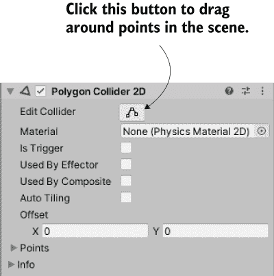

图 6.6 使用编辑碰撞器按钮编辑多边形碰撞器的形状。

无论如何，碰撞检测现在正在工作，所以下一步是让玩家在移动时进行动画。

## 6.3 播放精灵的动画

当 stickman.png 被导入时，它被分割成多个帧以进行动画。现在让我们*播放*这个动画，这样玩家就不会滑动，而是看起来像在行走。

### 6.3.1 解释 Mecanim 动画系统

如第四章简要提到的，Unity 中的动画系统称为*Mecanim*。它设计得可以让你直观地为一个角色设置复杂的动画网络，然后用最少的代码来控制这些动画。该系统对 3D 角色最有用（因此，我们将在未来的章节中更详细地介绍它），但对 2D 角色也很有用。

动画系统的核心由两种类型的资产组成：*动画*剪辑和*动画器*控制器。注意*动画*与*动画器*的区别：剪辑是播放的单独动画循环，而控制器是控制何时播放动画的网络。这个网络是一个*状态机*图，图中的状态是可能播放的不同动画。控制器根据它观察到的条件在状态之间切换，并在每个状态下播放不同的动画。

当你将 2D 动画拖入场景时，Unity 会自动创建这两种类型的资产。也就是说，当你将动画的帧拖入场景时，Unity 会自动使用这些帧创建一个动画剪辑和一个动画控制器。如图 6.7 所示，展开精灵资产的所有帧，选择帧 0-1，将它们拖入场景，并在确认窗口中键入 stickman_idle 名称。

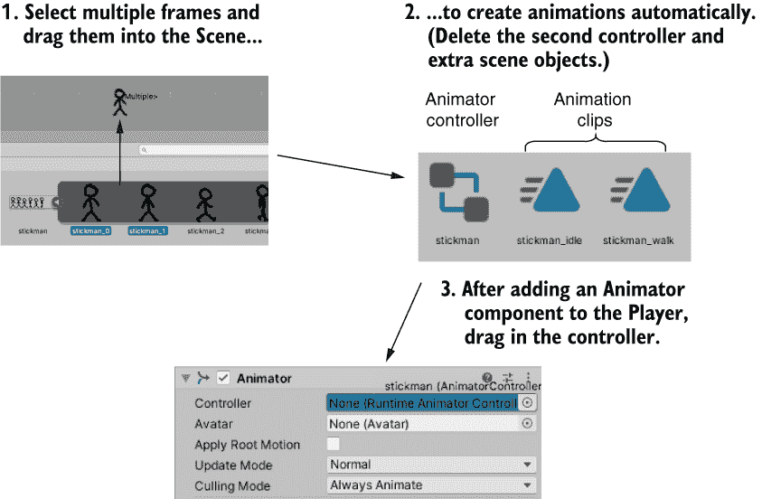

图 6.7 在动画组件中使用精灵图帧的步骤

将框架拖入场景视图的动作在资产视图中创建了两个东西：一个名为 stickman_idle 的剪辑和一个名为 stickman_0 的控制器。这个动作还在场景中创建了一个名为 stickman_0 的对象，但你不需要它，所以删除它。将控制器 stickman 重命名为不带后缀的名称。太好了——你创建了角色的空闲动画！

现在重复此过程以进行行走动画。选择帧 2-5，将它们拖入场景，并将动画命名为 stickman_walk。这次，删除场景中的 stickman_2 和新控制器；只需要一个动画控制器来控制两个动画剪辑，因此保留旧的一个并删除 stickman_2 和新创建的一个。

要将控制器应用于您的玩家角色，在场景中选择 Player，然后单击 Add Component 以选择 Miscellaneous > Animator。如图 6.7 所示，将 stickman 控制器拖入检查器中的控制器槽。选择 Player 后，打开 Window > Animation > Animator（如图 6.8 所示）。Animator 窗口中的动画显示为块，称为 *状态*，控制器在运行时在这些状态之间切换。这个特定的控制器已经包含空闲状态，但您需要添加一个行走状态；将 stickman_walk 动画剪辑从 Assets 拖入 Animator 窗口。

默认情况下，空闲动画会播放得太快。要降低空闲速度，选择空闲动画状态，并在右侧面板中将 Speed 设置为 0.2。此更改后，动画已全部设置好，以进行下一步操作。

### 6.3.2 从代码中触发动画

现在，您已经在动画控制器中设置了动画状态，您可以在这些状态之间切换以播放不同的动画。如前所述，状态机根据它所监视的条件来切换状态。在 Unity 的动画控制器中，这些条件被称为 *参数*，因此让我们添加一个。图 6.8 指出了相关控件：选择 Parameters 选项卡，并单击 + 按钮以显示参数类型菜单。添加一个名为 speed 的浮点参数。

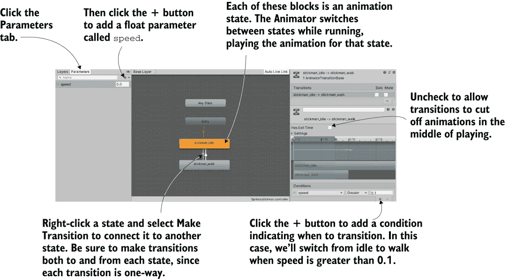

图 6.8 动画窗口，显示动画状态和转换

接下来，您需要根据该参数在动画状态之间进行切换。右键单击 stickman_idle 并选择 Make Transition；这将开始从空闲状态拖出箭头。单击 stickman_walk 以连接到该状态，由于转换是单向的，因此也右键单击 stickman_walk 以返回该状态。

现在选择从空闲状态到转换（您可以直接单击箭头），取消选中 Has Exit Time，并在底部单击 + 以添加条件（如图 6.8 所示）。将条件设置为速度 Greater（大于）0.1，以便在满足该条件时状态将进行转换。现在再次为 walk-to-idle 转换执行此操作：选择从 walk 的转换，取消选中 Has Exit Time，添加条件，并将条件设置为速度 Less（小于）0.1。

最后，PlatformerPlayer 脚本可以操作动画控制器，如本列表所示。

列表 6.2 在移动过程中触发动画

```
...
private Animator anim;
...
void Start() {
  body = GetComponent<Rigidbody2D>();                              ❶
  anim = GetComponent<Animator>();
}

void Update() {
  ...
  anim.SetFloat("speed", Mathf.Abs(deltaX));                       ❷
  if (!Mathf.Approximately(deltaX, 0)) {                           ❸
    transform.localScale = new Vector3(Mathf.Sign(deltaX), 1, 1);  ❹
  }
}
...
```

❶ 现有代码以帮助显示新代码的位置

❷ 即使速度为负，速度也大于零。

❸ 浮点数并不总是精确的，因此请使用 Approximately() 进行比较。

❹ 移动时，将比例设置为正或负 1 以面向右或左。

哇，控制动画的代码几乎没多少！大部分工作都是由 Mecanim 处理的，只需要很少的代码来操作动画。玩玩游戏，四处移动，观察玩家精灵的动画。这个游戏真的进展得很快，所以接下来进行下一步！

## 6.4 添加跳跃能力

玩家可以来回移动，但还没有进行垂直移动。垂直移动（包括从边缘掉落和跳到更高的平台）是平台游戏的一个重要部分，所以让我们接下来实现它。

### 6.4.1 从重力中掉落

有些反直觉，在玩家能够跳跃之前，它需要重力来与之对抗。正如你可能记得的，你之前将玩家的 Rigidbody 的重力比例设置为 0。这样做是为了让玩家不会因为重力而掉落。现在，将其改回 1：在场景中选择 Player 对象，在检查器中找到 Rigidbody，然后在重力比例中输入 1。

现在重力正在影响玩家，但（假设你已经向地板对象添加了 Box Collider）地板正在支撑他们。从地板的边缘走开，掉入虚无。默认情况下，重力对玩家的影响相对较弱，所以你将想要增加其影响的大小。物理模拟包括一个全局重力设置，你可以在编辑菜单中调整它。具体来说，选择编辑 > 项目设置 > 物理设置 2D。如图 6.9 所示，在各个控制和设置的上端，你应该看到重力 Y；将其更改为 -40。

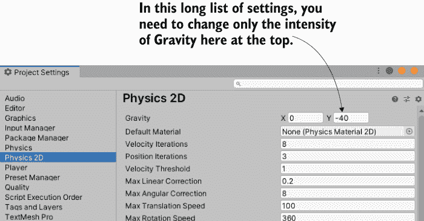

图 6.9 物理设置中的重力强度

你可能已经注意到一个微妙的问题：下落的角色会粘在地板的一侧。为了看到这个问题，从平台边缘走开，然后立即反向移动回到平台。哎呀，不太好！幸运的是，Unity 使得修复这个问题变得很容易。只需将 Physics 2D > Platform Effector 2D 组件添加到 Block 和 Floor 上。这个效应用户场景中的对象表现得更像平台游戏中的平台。图 6.10 指出了两个需要调整的设置：在碰撞器上设置 Used By Effector，并在效应用户上关闭 Use One Way（我们将使用这个后者的设置来处理其他平台，但现在不这么做）。

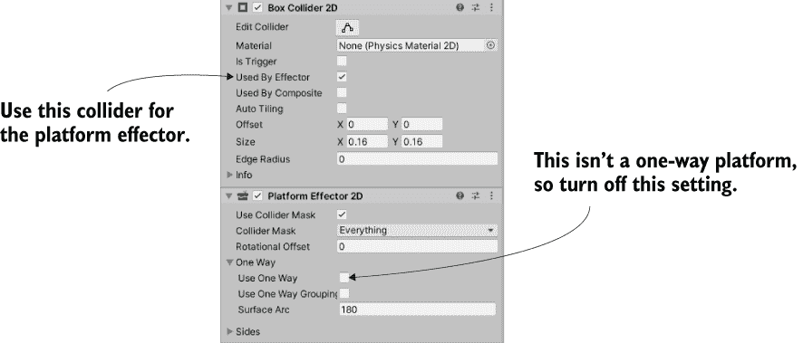

图 6.10 检查器中的碰撞器和效应用户设置

这样就处理了垂直运动的下落部分，但你仍然需要处理上升部分。

### 6.4.2 应用向上的冲量

下一个需要的行为是跳跃。当玩家点击跳跃按钮（我们将使用空格键）时，会应用一个向上的冲击。虽然你的代码直接改变了水平移动的速度，但你将保持垂直速度不变，以便重力可以发挥作用。相反，除了重力之外，物体还可以受到其他力的作用，所以你会添加一个向上的力。将此代码添加到 PlatformerPlayer 脚本中。

列表 6.3 按下空格键时跳跃

```
...
public float jumpForce = 12.0f;
...
body.velocity = movement;                                       ❶

if (Input.GetKeyDown(KeyCode.Space)) {                          ❷
  body.AddForce(Vector2.up * jumpForce, ForceMode2D.Impulse);
}
...
```

❶ 现有代码以帮助显示新代码的位置

❷ 仅当按下空格键时才添加力。

重要的行是 AddForce() 命令。代码向 Rigidbody 添加向上的力，并以脉冲模式执行。*脉冲*是一种突然的冲击，与持续施加的力相对。因此，当按下空格键时，此代码会施加一个突然向上的冲击。

同时，重力继续影响跳跃的玩家，当玩家跳跃时形成了一个漂亮的弧线。然而，你可能已经注意到另一个问题，让我们来解决这个问题。

### 6.4.3 检测地面

跳跃控制有一个微妙的问题：玩家可以在空中跳跃！如果玩家已经在空中（无论是由于跳跃还是由于下落），按下空格键会施加向上的力，但不应这样做。相反，跳跃控制应该只在玩家在地面上时工作。因此，你需要检测玩家是否在地面上。

列表 6.4 检查玩家是否在地面上

```
...
private BoxCollider2D box;
...
box = GetComponent<BoxCollider2D>();                        ❶
...
body.velocity = movement;

Vector3 max = box.bounds.max;
Vector3 min = box.bounds.min;
Vector2 corner1 = new Vector2(max.x, min.y - .1f);          ❷
Vector2 corner2 = new Vector2(min.x, min.y - .2f);          ❷
Collider2D hit = Physics2D.OverlapArea(corner1, corner2);

bool grounded = false;
if (hit != null) {                                          ❸
  grounded = true;
}

if (grounded && Input.GetKeyDown(KeyCode.Space)) {          ❹
...
```

❶ 让这个组件使用玩家的碰撞体作为一个检查区域。

❷ 检查碰撞体的最小 Y 值以下。

❸ 如果检测到玩家下方有碰撞体 . . .

❹ . . . 将“接地”条件添加到跳跃条件中。

在此代码到位后，玩家不能再空中跳跃。此脚本添加的修改检查玩家下方的碰撞体，并在跳跃的条件语句中考虑它们。具体来说，代码首先获取玩家的碰撞框边界，然后在玩家下方相同宽度的区域内寻找重叠的碰撞体。该检查的结果存储在 grounded 变量中，并在条件语句中使用。

## 6.5 平台游戏附加功能

到目前为止，玩家移动的最关键方面，即行走和跳跃，已经实现。让我们通过向玩家周围的环境添加新功能来完善这个平台游戏演示。

使用瓦片地图设计关卡

对于我们的项目，地板和平台是空白、白色的矩形。一个完成的游戏应该有更漂亮的图形，但一个与关卡大小相当的图像对于电脑来说处理起来会太大。解决这个问题的最常见方法是使用瓦片地图。简单来说，这是一种通过许多小块瓦片图像构建一个较大、组合图像的技术。这张图片展示了瓦片地图的一个示例。


瓦片地图

注意，地图由在整个地图中重复的小块组成。这样，没有单个图像非常大，但整个屏幕可以用自定义艺术作品覆盖。在 Unity 中，可以通过在“窗口”>“包管理器”中查找 2D 瓦片地图编辑器来找到官方的瓦片地图系统。

您可以在 Unity 文档中找到详细信息（[`docs.unity3d.com/Manual/class-Tilemap.html`](https://docs.unity3d.com/Manual/class-Tilemap.html)）。或者，您可以使用像 SuperTiled2Unity ([www.seanba.com/supertiled2unity](https://seanba.com/supertiled2unity)) 这样的外部库，它导入在 Tiled 中创建的瓦片图，Tiled 是一个流行的（且免费）瓦片图编辑器。

### 6.5.1 不寻常的地面：斜坡和一维平台

目前，这个演示有正常的、可以站立的地面。然而，平台游戏中使用了许多有趣的平台类型，所以让我们实现一些其他选项。您将创建的第一个不寻常的地面是一个斜坡。复制 Floor 对象，将复制的旋转设置为 0, 0, -25，将其移动到左侧（大约 -3.47, -1.27, 0），并将其命名为 Slope。参考图 6.1 来查看其外观。

如果现在开始玩，玩家在移动时可以正确地上下滑动，但在空闲时由于重力会慢慢滑动。为了解决这个问题，让我们在玩家既站在地面上又空闲时关闭重力。幸运的是，您已经检测到地面，因此可以在新代码中重用它。实际上，只需要一行新代码。

列表 6.5 在地面上站立时关闭重力

```
...
body.gravityScale = (grounded && Mathf.Approximately(deltaX, 0)) ? 0 : 1;  ❶
if (grounded && Input.GetKeyDown(KeyCode.Space)) {                         ❷
...
```

❶ 检查在地面上且未移动的状态。

❷ 用于帮助显示新代码位置的现有代码

通过对移动代码的调整，您的玩家角色可以正确地导航斜坡。接下来，一维平台是平台游戏中常见的另一种不寻常的地面。我指的是你可以跳过但仍然可以站立的平台；玩家在正常完全实体的平台底部撞头。

因为它们在平台游戏中相当常见，Unity 提供了一维平台的功能。如您所回忆的，当您之前添加 Platform Effector 组件时，一维设置是关闭的。现在将其打开！要创建一个新的平台，复制 Floor 对象，将其缩放为 10, 1, 1，放置在地板上方，位置约为 -1.68, 0.11, 0，并将对象命名为 Platform。哦，别忘了在 Platform Effector 组件中打开 Use One Way。

玩家从平台下方跳过，但在从上方下来时站在上面。我们有一个可能需要解决的问题，如图 6.11 所示。Unity 可能会显示平台精灵在玩家精灵之上（为了更容易看到这一点，可以将跳跃力设置为 7 进行测试），但您可能希望玩家在上方。您可以像在第五章中做的那样调整玩家的 Z 位置，但这次您将调整其他内容以展示另一种选项。精灵渲染器有一个排序顺序，可以用来控制哪些精灵出现在上方。在玩家的 Sprite Renderer 组件中将 Order in Layer 设置为 1。

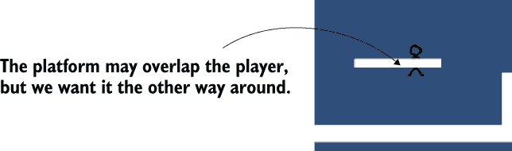

图 6.11 平台精灵与玩家精灵重叠

这样就处理了斜坡地板和单向平台。我将介绍另一种不寻常的地板，但实现起来要复杂得多。

### 6.5.2 实现移动平台

平台游戏中最常见的第三种不寻常的地板是移动平台。实现它需要一个新的脚本来控制平台本身，以及更改玩家移动脚本来处理移动平台。你将编写一个脚本，它接受两个位置，即起点和终点，并使平台在这两者之间弹跳。首先，创建一个新的 C# 脚本，命名为 MovingPlatform，并在其中编写此代码。

列表 6.6 用于移动地板的 MovingPlatform 脚本

```
using System.Collections;
using System.Collections.Generic;
using UnityEngine;

public class MovingPlatform : MonoBehaviour {
  public Vector3 finishPos = Vector3.zero;           ❶
  public float speed = 0.5f;

  private Vector3 startPos;
  private float trackPercent = 0;                    ❷
  private int direction = 1;                         ❸

  void Start() {
    startPos = transform.position;                   ❹
  }

  void Update() {
    trackPercent += direction * speed * Time.deltaTime;
    float x = (finishPos.x - startPos.x) * trackPercent + startPos.x;
    float y = (finishPos.y - startPos.y) * trackPercent + startPos.y;
    transform.position = new Vector3(x, y, startPos.z);

    if ((direction == 1 && trackPercent > .9f) ||
    (direction == -1 && trackPercent < .1f)) {       ❺
      direction *= -1;
    }
  }
}
```

❶ 移动的位置

❷ 从起点到终点的“轨道”上的距离

❸ 当前移动方向

❹ 场景中的放置是移动的起始位置

❺ 在起点和终点改变方向。

绘制自定义 gizmos

你将要编写的代码大多数是用于运行游戏，但 Unity 脚本也可以影响 Unity 的 *编辑器*。Unity 常被忽视的功能之一是添加新菜单和窗口的能力。你的脚本也可以在场景视图中绘制自定义辅助图像；这类辅助图像被称为 *gizmos*。

你已经熟悉像显示碰撞器的绿色盒子这样的 gizmos。这些是内置在 Unity 中的，但你也可以在脚本中绘制自己的 gizmos。例如，绘制显示平台移动路径的线可能很有用，如这里所示。

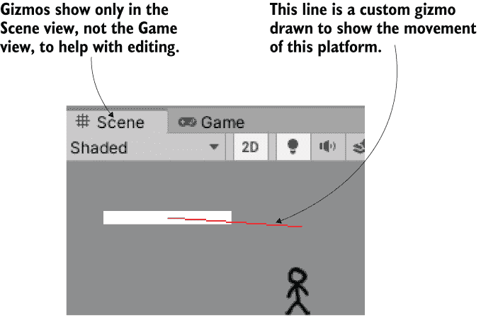

自定义 gizmo

绘制该线的代码很简单。通常，当你编写影响 Unity 编辑界面的代码时，你需要在顶部添加 using UnityEditor;（因为大多数编辑器函数都位于该命名空间中），但在这个例子中，你甚至不需要这样做。将此方法添加到 MovingPlatform 脚本中：

```
...
void OnDrawGizmos() { 
  Gizmos.color = Color.red;
  Gizmos.DrawLine(transform.position, finishPos);
}
...
```

你需要了解一些关于此代码的知识。一是所有这些都在一个名为 OnDrawGizmos() 的方法中发生。像 Start() 或 Update() 一样，OnDrawGizmos() 是 Unity 识别的另一个方法名。在方法内部有两行代码：一行设置绘图颜色，另一行告诉 Unity 从平台的位置绘制到终点位置。

类似的命令也用于其他 gizmo 形状。DrawLine() 通过使用起点和终点来定义一条线，但类似的命令 DrawRay() 用于在给定方向上绘制一条线。这对于可视化来自 AI 角色的射线非常有用。

Gizmos 默认情况下仅在场景视图中可见，但请注意，游戏视图中顶部有一个 Gizmos 按钮。哦，尽管这个项目是一个 2D 游戏，但在 3D 游戏中绘制自定义 gizmos 的工作方式也是一样的。

将此脚本拖放到平台对象上。太棒了——当你播放场景时，平台会左右移动！现在你需要调整玩家的移动脚本，以便将玩家附加到移动平台上。以下是需要进行的更改。

列表 6.7 在 PlatformerPlayer 中处理移动平台

```
...
  body.AddForce(Vector2.up * jumpForce, ForceMode2D.Impulse);
}

MovingPlatform platform = null;
if (hit != null) {
  platform = hit.GetComponent<MovingPlatform>();    ❶
}
if (platform != null) {                             ❷
  transform.parent = platform.transform;
} else {
  transform.parent = null;
}

anim.SetFloat("speed", Mathf.Abs(deltaX));          ❸
...
```

❶ 检查玩家下方的平台是否为移动平台。

❷ 要么将平台附加到平台上，要么清除 transform.parent。

❸ 现有代码以帮助显示新代码的位置

现在玩家在跳上平台后会随着平台移动。这个变化主要归结于将玩家作为平台的子对象；记住，当你设置父对象时，子对象会随着父对象移动。列表 6.7 使用 GetComponent()检查检测到的地面是否为移动平台。如果是，则将该平台设置为玩家的父对象；否则，玩家将脱离任何父对象。

然而，有一个大问题：玩家继承了平台的缩放，导致缩放异常。这可以通过反缩放（将玩家缩放以抵消平台缩放）来修复。

列表 6.8 纠正玩家缩放

```
...
  anim.SetFloat("speed", Mathf.Abs(deltaX));

  Vector3 pScale = Vector3.one;                      ❶
  if (platform != null) {
    pScale = platform.transform.localScale;
  }
  if (!Mathf.Approximately(deltaX, 0)) {
    transform.localScale = new Vector3(
    Mathf.Sign(deltaX) / pScale.x, 1/pScale.y, 1);   ❷
  }
}
...
```

❶ 如果不在移动平台上，则默认缩放为 1

❷ 用新代码替换现有的缩放。

反缩放的数学很简单：将玩家设置为 1 除以平台的缩放。然后，当玩家的缩放乘以平台的缩放时，剩下的缩放为 1。这个代码的唯一难点是乘以移动值的符号；如你之前所回忆的，玩家根据移动方向翻转。

这样，移动平台就完全实现了。这个平台游戏演示只需要最后的润色。

### 6.5.3 摄像机控制

将摄像机移动是您将添加到这个 2D 平台游戏的最后一个功能。创建一个名为 FollowCam 的脚本，将其拖放到摄像机上，然后在其中编写以下内容。

列表 6.9 FollowCam 脚本以跟随玩家移动

```
using System.Collections;
using System.Collections.Generic;
using UnityEngine;

public class FollowCam : MonoBehaviour {
  public Transform target;

  void LateUpdate() {
    transform.position = new Vector3(
    target.position.x, target.position.y, transform.position.z);  ❶
  }
}
```

❶ 在改变 X 和 Y 的同时保留 Z 位置。

编写完代码后，将玩家对象拖动到检查器中脚本的目标槽位。播放场景，摄像机就会移动，将玩家保持在屏幕中心。你可以看到代码将目标对象的位子应用到摄像机上，并且你将玩家设置为目标对象。注意，方法名是 LateUpdate()而不是 Update()；这是 Unity 识别的另一个名称。LateUpdate()也会在每一帧执行，但它发生在每一帧的 Update()之后。

摄像机始终与玩家**精确**同步移动，这有点令人不快。在大多数平台游戏中，摄像机都有各种微妙但复杂的动作，随着玩家的移动，突出显示不同部分的游戏级别。实际上，平台游戏的摄像机控制是一个令人惊讶的深入话题；尝试搜索“平台游戏摄像机”并查看所有结果。然而，在这种情况下，你只是要让摄像机的移动更平滑，不那么令人不快；这个列表进行了相应的调整。

列表 6.10 平滑摄像机移动

```
...
public float smoothTime = 0.2f;

private Vector3 velocity = Vector3.zero;
...
void LateUpdate() {
  Vector3 targetPosition = new Vector3(
  target.position.x, target.position.y, transform.position.z);   ❶

  transform.position = Vector3.SmoothDamp(transform.position,
  targetPosition, ref velocity, smoothTime);                     ❷
}
...
```

❶ 在改变 X 和 Y 的同时保留 Z 位置。

❷ 从当前位置平滑过渡到目标位置

主要的改动是调用了一个名为 SmoothDamp()的函数；其他改动（如添加时间和速度变量）都是为了支持这个函数。这是一个 Unity 提供的函数，用于使值平滑过渡到新值。在这种情况下，这些值是摄像机和目标的位置。

现在摄像机与玩家移动得更加平滑。你实现了玩家的移动、几种平台类型，现在又实现了摄像机控制。看起来这一章的项目已经完成了！

## 概述

+   图集是处理 2D 动画的常见方式。

+   游戏中的角色不会像现实世界中的物体那样行为，因此你必须相应地调整它们的物理属性。

+   Rigidbody 对象可以通过施加力或直接设置它们的速度来控制。

+   2D 游戏中的关卡通常使用瓦片图来构建。

+   一个简单的脚本可以使摄像机平滑地跟随玩家。
