# 7 将 GUI 添加到游戏中

本章涵盖

+   比较旧的和新的 GUI 系统

+   为界面创建画布

+   使用锚点定位 UI 元素

+   向 UI 添加交互性（按钮、滑块等）

+   从 UI 广播和监听事件

在本章中，你将为 3D 游戏构建一个 2D 界面显示。到目前为止，我们在构建第一人称演示时一直专注于虚拟场景本身。但每个游戏都需要除了游戏发生的虚拟场景之外的抽象交互和信息显示。这对所有游戏都适用，无论是 2D 还是 3D，第一人称射击游戏还是益智游戏。因此，尽管本章中的技术将用于 3D 游戏，但它们也适用于 2D 游戏。

这些抽象交互显示被称为**UI**，或者更具体地说，**GUI**。GUI（代表图形用户界面）指的是界面的视觉部分，如文本和按钮（见图 7.1）。技术上，UI 包括非图形控件，如键盘或游戏手柄，但人们通常在提到“用户界面”时指的是图形部分。

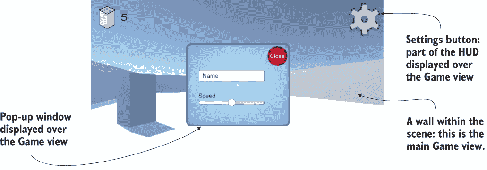

图 7.1 为游戏创建的 GUI

虽然任何软件都需要某种形式的 UI 以便用户控制它，但游戏通常以与其他软件略有不同的方式使用它们的 GUI。例如，在一个网站上，GUI 基本上**就是**网站（从视觉表现的角度来看）。然而，在游戏中，文本和按钮通常是游戏视图上的额外叠加，这是一种称为**抬头显示** (*HUD*) 的显示方式。

**定义** 一个**抬头显示** (*HUD*) 将图形叠加在世界的视图之上。HUD 的概念起源于军用飞机——其目的是让飞行员能够在不低头的情况下看到关键信息。同样，叠加在游戏视图上的 GUI 被称为 HUD。

本章展示了如何使用 Unity 中的 UI 工具构建游戏的 HUD。正如你在第五章中看到的，Unity 提供了多种创建 UI 显示的方式。本章演示了取代 Unity 最初 UI 系统的先进 UI 系统。我还讨论了之前的 UI 系统以及新系统的优势。

要了解 Unity 中的 UI 工具，你将在第三章的 FPS 项目基础上进行构建。本章的项目涉及以下步骤：

1.  规划界面

1.  在显示上放置 UI 元素

1.  编程与 UI 元素之间的交互

1.  使 GUI 对场景中的事件做出响应

1.  使场景对 GUI 上的操作做出响应

复制第三章的项目并打开副本以开始本章的工作。像往常一样，你需要的艺术资源在样本下载中。设置好这些文件后，你就可以开始构建游戏的 UI 了。

注意：本章中的所有示例都是基于第三章创建的 FPS 游戏。但本章的内容在很大程度上独立于那个基础项目；我们只是在现有的游戏演示上添加了一个图形界面。尽管我建议你下载第三章的项目，但你完全可以使用你喜欢的任何游戏演示。

## 7.1 在你开始编写代码之前...

要开始构建 HUD，你首先需要了解 UI 系统的工作方式。Unity 提供了多种构建游戏 HUD 的方法，因此我们需要了解这些系统是如何工作的。然后我们可以简要规划 UI 并准备我们需要的艺术资源。

### 7.1.1 立即模式 GUI 还是高级 2D 界面？

从其第一个版本开始，Unity 就附带了一个立即模式 GUI 系统。立即模式系统使得在屏幕上放置可点击的按钮变得容易。列表 7.1 展示了执行此操作的代码：只需将此脚本附加到场景中的任何对象上。

定义 *立即模式* 指的是每帧明确发出绘制命令——而不是一次性定义所有视觉元素，然后对于每一帧，系统知道要绘制什么，而不需要你再次告诉它。后一种方法称为 *保留模式*。

作为立即模式 UI 的另一个示例，回忆一下第三章中显示的目标光标。这个 GUI 系统完全基于代码，没有在 Unity 的编辑器中做任何工作。

列表 7.1 使用立即模式 GUI 的按钮示例

```
using System.Collections;
using System.Collections.Generic;
using UnityEngine;

public class BasicUI : MonoBehaviour {
   void OnGUI() {                                          ❶
      if (GUI.Button(new Rect(10, 10, 40, 20), "Test")) {  ❷
         Debug.Log("Test button");
      }
   }
}
```

❶ 每渲染完其他所有内容后每帧调用的函数

❷ 参数：位置 X，位置 Y，宽度，高度，文本标签

列表中代码的核心是 OnGUI() 方法。与 Start() 和 Update() 类似，每个 MonoBehaviour 都会自动响应 OnGUI()。该函数在 3D 场景渲染后每帧运行，提供了一个放置 GUI 绘图命令的位置。此代码绘制了一个按钮；请注意，按钮的命令每帧执行（即在立即模式风格中）。按钮命令用于条件语句中，当按钮被点击时作出响应。

由于立即模式 GUI 使得以最小的努力在屏幕上放置几个按钮变得容易，我们有时会在未来的章节中使用它作为示例。但默认按钮是那个系统中唯一容易创建的东西，因此 Unity 的较新版本现在有一个基于编辑器中布局的 2D 图形的新界面系统。这个较新的界面系统需要更多的工作来设置，但你可能会希望在完成的游戏中使用它，因为它会产生更精致的结果。

较新的 UI 系统在保留模式下工作，因此图形只布局一次，然后每帧绘制，而不需要不断重新定义。在这个系统中，UI 的图形放置在 Unity 的编辑器中。这比立即模式 UI 提供两个优势：（1）你可以在放置 UI 元素时看到 UI 的外观，并且（2）这个系统使得使用自己的图像自定义 UI 变得简单直接。

注意：第一章提到 Unity 有三个 UI 系统（这些系统在[`mng.bz/205X`](https://shortener.manning.com/205X)进行了比较），因为相继开发的系统在先前的系统基础上进行了改进。本书涵盖了第二个 UI 系统（Unity UI，或 uGUI），因为它仍然比不完整的第三个 UI 系统（UI Toolkit）更受欢迎。

要使用此系统，你需要导入图像并将对象拖动到场景中。接下来，让我们规划这个 UI 的外观。

### 7.1.2 规划布局

大多数游戏的 HUD 由一些重复的 UI 控制组成。因此，这个项目不需要非常复杂，你就可以学习如何构建游戏的 UI。你将在屏幕角落的主游戏视图上方放置一个得分显示和一个设置按钮（见图 7.2）。设置按钮将弹出一个包含文本字段和滑块的弹出窗口。

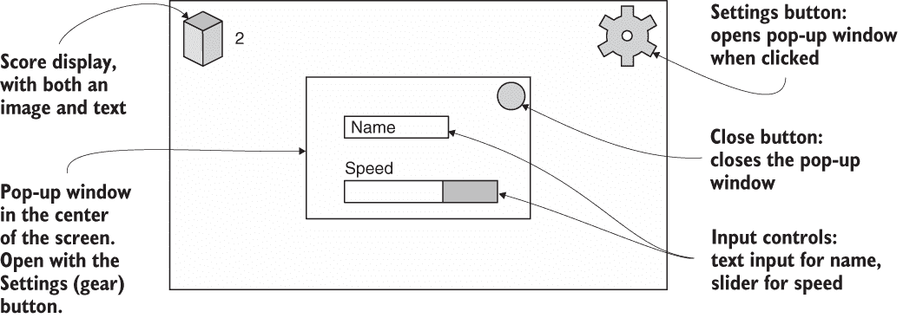

图 7.2 计划的 GUI

在这个例子中，这些输入控制将用于设置玩家的名字和移动速度，但最终这些 UI 元素可以控制与你的游戏相关的任何设置。嗯，这个计划相当简单！下一步是引入所需的图像。

### 7.1.3 导入 UI 图像

这个 UI 需要一些图像来显示按钮等元素。UI 是由第五章中的图形等 2D 图像构建的，所以你将遵循相同的两个步骤：

1.  导入图像（如果需要，设置为精灵）。

1.  将精灵拖动到场景中。

要完成这些步骤，首先将图像拖动到项目视图中以导入它们。然后，在检查器中，将它们的纹理类型设置更改为精灵（2D 和 UI）。

警告：在 3D 项目中，纹理类型设置默认为纹理，在 2D 项目中默认为精灵。如果你想在 3D 项目中使用精灵，你需要手动调整此设置。

从样本下载中获取所有必要的图像（见图 7.3），然后将它们导入到你的项目中。确保所有导入的资产都设置为精灵；你可能需要调整导入后显示的设置中的纹理类型。

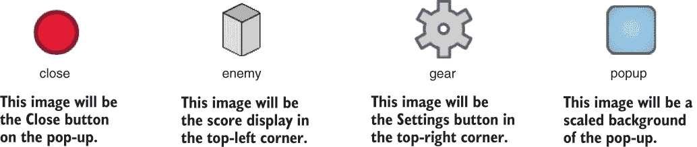

图 7.3 本章项目所需的图像

这些精灵包括你将创建的按钮、得分显示和弹出窗口。现在图像已经导入，让我们将这些图形放到屏幕上。

## 7.2 设置 GUI 显示

艺术资产与我们第五章使用的 2D 精灵相同，但我们将以不同的方式使用这些资产。Unity 提供了特殊工具，可以将图像作为显示在 3D 场景上而不是场景一部分的 HUD。在定位 UI 元素时使用了一些特殊技巧，因为可能需要在不同的屏幕上显示的显示需求。

### 7.2.1 为界面创建画布

UI 系统工作方式的最基本且不明显的一个方面是，所有图像都必须附加到画布对象。

提示：Canvas 是 Unity 渲染游戏 UI 的一种特殊对象。

打开游戏对象菜单，查看你可以创建的对象；在 UI 类别中，选择画布。画布对象将出现在场景中（可能将对象重命名为 HUD 画布会更清晰）。此对象代表整个屏幕范围，与 3D 场景相比非常大，因为它将屏幕上的一个像素缩放到场景中的一个单位。

警告：当你创建画布对象时，也会自动创建一个事件系统对象。该对象用于 UI 交互，但你可以忽略它。

切换到 2D 视图模式（参见图 7.4），然后在层次结构中双击画布以缩放并完全查看它。当整个项目是 2D 时，2D 视图模式是自动的，但在 3D 项目中，必须单击此切换按钮来在 UI 和主场景之间切换。要返回查看 3D 场景，关闭 2D 视图模式，然后双击建筑以缩放到该对象。

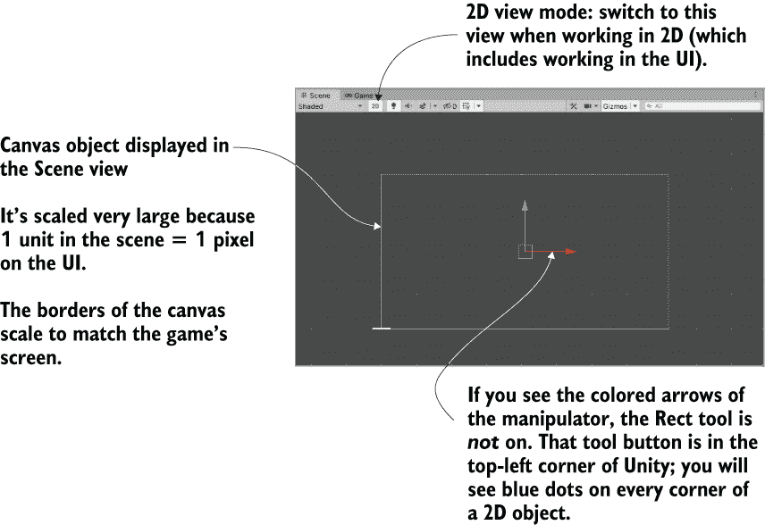

图 7.4 场景视图中一个空白的画布对象

提示：不要忘记第四章中的这个提示：场景视图面板顶部有按钮可以控制可见内容，所以请查看那里以找到效果按钮来关闭天空盒。

画布有一些你可以调整的设置。第一个是渲染模式选项。将其保留在默认设置（屏幕空间—叠加），但你应该知道三个可能设置的含义：

+   *屏幕空间 —叠加* —将 UI 作为 2D 图形渲染在相机视图之上。（这是默认设置。）

+   *屏幕空间 —相机* —也在相机视图中渲染 UI，但 UI 元素可以旋转以产生透视效果。

+   *世界空间* —将画布对象放置在场景中，就像 UI 是 3D 场景的一部分。

除了初始默认设置之外，其他两种模式有时可能对特定效果有用，但稍微复杂一些。

另一个重要的设置是像素完美。此设置会导致渲染微妙地调整图像的位置，使它们始终完美清晰（与在像素之间定位时模糊它们相反）。请选择该复选框。现在 HUD 画布已设置好，但仍然是空的，需要精灵。

### 7.2.2 按钮、图像和文本标签

画布对象定义了一个用于显示 UI 的区域，但它仍然需要精灵来显示。参考图 7.2 中的 UI 原型，你会看到左上角有一个方块/敌人的图像，旁边显示分数的文字，右上角有一个齿轮形状的按钮。因此，GameObject 菜单的 UI 部分包含创建图像、文本或按钮的选项。创建每种类型的一个，但在适用的情况下使用 TextMeshPro 版本。也就是说，选择 GameObject > UI > Image，然后 Text - TextMeshPro，然后 Button - TextMeshPro。

注意：正如第五章所述，你需要安装 TextMeshPro 包，所以如果 UI 对象的菜单中没有显示 TextMeshPro 版本，请转到 Window > Package Manager。当你第一次创建 TextMeshPro 对象时，TMP Importer 窗口将自动出现。点击导入 TMP Essentials 按钮。

要正确显示，UI 元素需要是画布对象的子对象。Unity 会自动完成这项工作，但请记住，就像通常一样，你可以拖动对象在 Hierarchy 视图中进行父子链接（见图 7.5）。

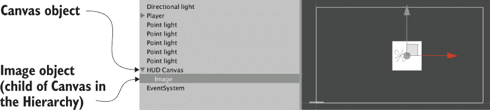

图 7.5 Hierarchy 视图中链接了图像的画布

画布内的对象可以为了定位目的相互关联，就像场景中的任何其他对象一样。例如，你应该将文本对象拖到图像上，以便文本随图像移动。默认按钮对象也有一个文本对象作为其子对象，但这个项目的按钮不需要文本标签，所以删除默认的文本对象。

大致将 UI 元素放置到它们的角落。在下一节中，我们将使位置精确；现在，只需拖动对象直到它们大致到位。点击并拖动图像对象到画布的左上角；按钮放在右上角。

提示：正如第五章所述，你在 2D 模式下使用矩形工具。我将其描述为一种包含所有三个变换（移动、旋转和缩放）的单个操作工具。这些操作在 3D 中必须是单独的工具，但在 2D 中它们是组合的，因为这样少了一个要考虑的维度。在 2D 模式下，此工具会自动选择，或者你可以点击 Unity 左上角附近的按钮。

目前，图像是空的。如果你选择一个 UI 对象并查看检查器，你应该在图像组件的顶部附近看到一个源图像槽。如图 7.6 所示，从项目视图中拖动精灵（记住，不是纹理！）以将图像分配给对象。将敌人精灵分配给图像对象，将齿轮精灵分配给按钮对象（在分配精灵后点击设置原生大小以正确调整图像对象的大小）。

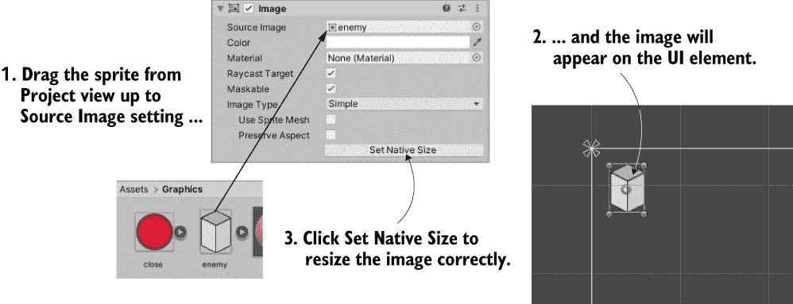

图 7.6 将 2D 精灵分配给 UI 元素的 Image 属性。

这样就处理了敌图像和齿轮按钮的外观。至于文本对象，检查器有一系列设置（见图 7.7）。首先，在大的文本输入框中输入一个单独的数字；此文本稍后将会被覆盖，但它很有用，因为它看起来像编辑器内的分数显示。文本大小不正确，所以将字体大小更改为 24。然后点击第一个字体样式按钮以加粗，并将顶点颜色更改为黑色。您还希望将此标签设置为左对齐和中间垂直对齐。目前，其余设置可以保留为默认值。

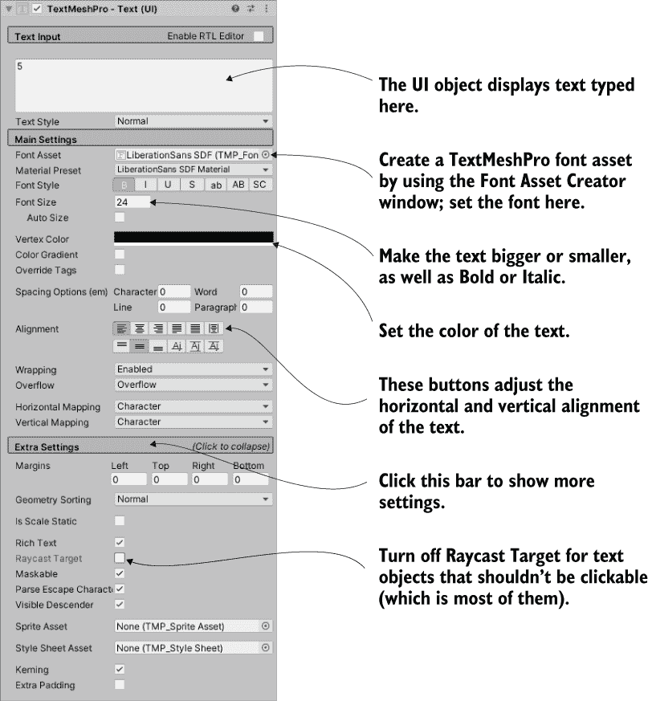

图 7.7 UI 文本对象的设置

注意：我们尚未涉及的最常见调整属性是字体。要使用 TextMeshPro 的 TrueType 字体，首先将字体导入 Unity，然后选择 Window > TextMeshPro > Font Asset Creator。

现在已经将精灵分配给 UI 图像，并且设置了分数文本，您可以点击播放来查看 3D 游戏顶部的 HUD。Unity 编辑器中显示的画布显示了屏幕的边界，UI 元素在图 7.8 所示的位置绘制到屏幕上。

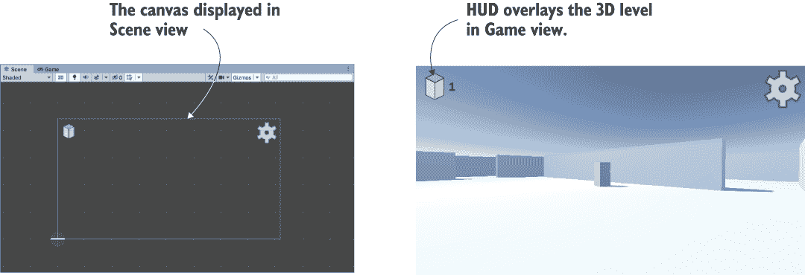

图 7.8 在编辑器中看到的 GUI（左侧）和游戏播放时的 GUI（右侧）

太好了，您已经创建了一个带有 2D 图像覆盖 3D 游戏的 HUD！还有一个更复杂的视觉设置需要处理：相对于画布定位 UI 元素。

### 7.2.3 控制 UI 元素的位置

所有 UI 对象都有一个锚点，在编辑器中以 X 形状显示（见图 7.9）。锚点是一种灵活的方式来定位 UI 上的对象。


图 7.9 图像对象的锚点

定义：对象的**锚点**是对象连接到画布或屏幕的点。该对象的位置是相对于锚点测量的。

位置是像“x 轴上的 50 像素”这样的值。但这留下了一个问题：50 像素是从哪里开始的？这就是锚点发挥作用的地方。锚点的目的是保持对象相对于锚点的位置不变，而锚点则相对于画布移动。锚点被定义为类似于“屏幕中心”的东西，然后锚点将保持居中，即使屏幕大小发生变化。同样，将锚点设置为屏幕的右侧将保持对象相对于右侧的位置不变，即使屏幕大小发生变化（例如，如果游戏在不同的显示器上播放）。

理解我所谈论的内容最简单的方法是看到它在实际操作中的表现。选择图像对象，然后查看检查器。锚点设置将直接出现在变换组件下方（见图 7.10）。默认情况下，UI 元素锚点设置为居中，但您需要将此图像的锚点设置为左上角；图 7.10 展示了如何通过使用锚点预设进行调整。

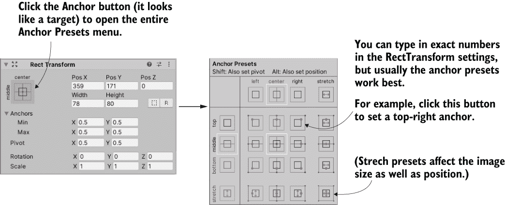

图 7.10 如何调整锚点设置

也要改变齿轮按钮的锚点。将此对象设置为右上角；点击右上角的锚点预设。现在尝试左右缩放窗口：点击并拖动游戏的视图边缘。多亏了锚点，UI 对象会保持在它们的角落，而画布改变大小。如图 7.11 所示，这些 UI 元素现在固定在位置，而屏幕移动。

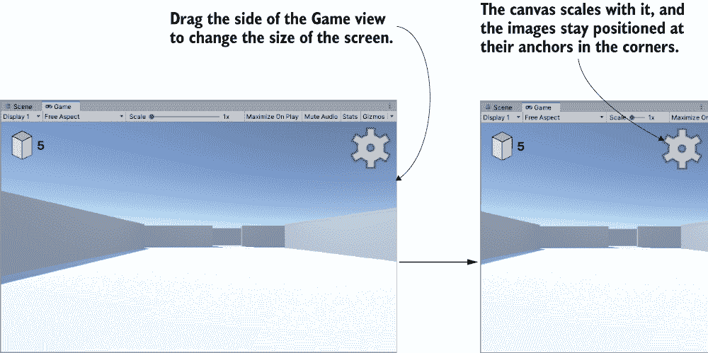

图 7.11 当屏幕改变大小时，锚点保持在原位。

TIP 锚点可以调整缩放和位置。我们在这章中不会探讨这个功能，但图像的每个角落都可以锚定到屏幕的不同角落。在图 7.11 中，图像的大小没有改变，但我们可以调整锚点，使得当屏幕改变大小时，图像也会随之拉伸。

所有的视觉设置都已经完成，现在是时候编程交互性了。

## 7.3 在 UI 中编程交互性

在你可以与 UI 交互之前，你需要有一个鼠标光标。如你所回忆，我们在 RayShooter 代码的 Start()方法中调整了光标设置。这些设置锁定并隐藏鼠标光标，这对于 FPS 游戏中的控制是有效的，但会干扰使用 UI。从 RayShooter 中删除这些行，以便你可以点击 HUD。

当你打开 RayShooter 时，你也可以确保在交互 GUI 时不要射击。这是相应的代码。

列表 7.2 在 RayShooter 代码中添加 GUI 检查

```
using UnityEngine.EventSystems;                      ❶
...
void Update() {
   *if (Input.GetMouseButtonDown(0) &&*                ❷
!EventSystem.current.IsPointerOverGameObject()) {    ❸
   *Vector3 point = new Vector3(
      camera.pixelWidth/2, camera.pixelHeight/2, 0);*
   ...
```

❶ 包含 UI 系统代码框架。

❷ 斜体代码已经在脚本中；此处显示仅供参考。

❸ 检查是否使用了 GUI。

现在你可以玩游戏并点击按钮，尽管它目前还没有任何功能。你可以观察按钮在鼠标悬停和点击时的着色变化。这种鼠标悬停和点击行为是每个按钮的默认着色，可以更改，但默认设置目前看起来很好。你可以加快默认的淡入淡出行为；淡入淡出持续时间是按钮组件中的一个设置，所以尝试将其减小到 0.01，看看按钮如何变化。

TIP 有时候，UI 的默认交互控制也会干扰游戏。还记得与画布一起自动创建的事件系统对象吗？该对象控制 UI 交互控制，默认情况下它使用箭头键与 GUI 交互。你可能需要关闭箭头键以避免意外与 GUI 交互：为此，在 EventSystem 的设置中取消选中“发送导航事件”复选框。

但点击按钮时没有发生其他任何事情，因为你还没有将其链接到任何代码。让我们在下一部分处理这个问题。

### 7.3.1 编程不可见的 UIController

通常，UI 交互是通过一系列标准步骤编程的，这些步骤对所有 UI 元素都是相同的：

1.  在场景中创建一个 UI 对象（上一节中创建的按钮）。

1.  编写一个在操作 UI 时调用的脚本。

1.  将该脚本附加到场景中的对象。

1.  将 UI 元素（如按钮）链接到具有该脚本的对象。

要遵循这些步骤，首先我们需要创建一个控制器对象以将其链接到按钮。创建一个名为 UIController 的脚本，并将其拖放到场景中的控制器对象上。

列表 7.3 用于编程按钮的 UIController 脚本

```
using System.Collections;
using System.Collections.Generic;
using UnityEngine;
using TMPro;                                    ❶

public class UIController : MonoBehaviour {
   [SerializeField] TMP_Text scoreLabel;        ❷

   void Update() {
      scoreLabel.text = Time.realtimeSinceStartup.ToString();
   }

   public void OnOpenSettings() {               ❸
      Debug.Log("open settings");
   }
}
```

❶ 导入 TextMeshPro 代码框架。

❷ 在场景中引用文本对象以设置文本属性。

❸ 由设置按钮调用的方法

TIP 你可能想知道为什么我们需要为 SceneController 和 UIController 使用单独的对象。确实，这个场景非常简单，你可以有一个控制器同时处理 3D 场景和 UI。然而，随着游戏的复杂化，将 3D 场景和 UI 作为独立的模块，间接通信将变得越来越有用。这一概念不仅适用于游戏，也适用于软件的通用性：软件工程师将这一原则称为*关注点分离*。

现在将对象拖到组件槽位以连接它们。将得分标签（我们之前创建的文本对象）拖到 UIController 文本槽位。UIController 中的代码设置了该标签上显示的文本。目前，该代码显示一个计时器以测试文本显示；这将被后来更改为得分。

接下来，向按钮添加一个 OnClick 条目以拖动控制器对象。选择按钮以在检查器中查看其设置。在底部附近，你应该看到一个 OnClick 面板；最初该面板是空的，但你可以点击+按钮添加一个条目（如图 7.12 所示）。每个条目定义了一个当按钮被点击时调用的单个函数；列表中有一个对象槽位和一个用于调用函数的菜单。将控制器对象拖到对象槽位，然后在菜单中查找 UIController；在该部分选择 OnOpenSettings()。

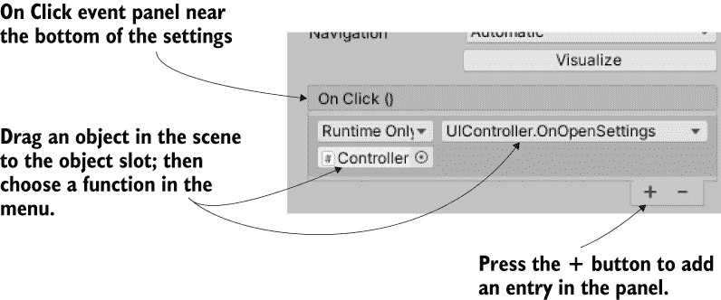

图 7.12 按钮设置底部的 OnClick 面板

响应其他鼠标事件

OnClick 是按钮组件暴露的唯一事件，但 UI 元素可以响应多个交互。要超越默认交互，请使用 EventTrigger 组件。

向按钮对象添加一个新组件，并查找组件菜单的事件部分。从菜单中选择 EventTrigger。尽管按钮的 OnClick 只响应完整的点击（鼠标按钮按下然后释放），但让我们尝试响应鼠标按钮按下但不释放的情况。执行与 OnClick 相同的步骤，但响应不同的事件。首先向 UIController 添加另一个方法：

```
...
public void OnPointerDown() {
   Debug.Log("pointer down");
}
...
```

现在点击“添加新事件类型”以向事件触发器组件添加一个新类型。选择“指针按下”作为事件。这将为此事件创建一个空面板，就像“OnClick”一样。点击“+”按钮添加事件列表，将控制器对象拖到这个条目中，并在菜单中选择“OnPointerDown()”。就这样！

玩游戏并点击按钮，在控制台输出调试信息。再次强调，当前代码是随机输出以测试按钮的功能。我们想要打开一个设置弹窗，所以接下来让我们创建那个弹窗窗口。

### 7.3.2 创建弹窗窗口

UI 有一个按钮可以打开弹窗窗口，但目前还没有弹窗。那将是一个新的图像对象，以及一些附加到该对象上的控件（如按钮和滑块）。第一步是创建一个新的图像，所以选择“游戏对象”>“UI”>“图像”。就像之前一样，新的图像在检查器中有一个名为“源图像”的槽位。将精灵拖到该槽位以设置此图像。这次，使用名为“popup”的精灵。

通常，精灵会拉伸到整个图像对象上；这是分数和齿轮图像的工作方式，你点击“设置原生大小”按钮来调整对象的大小以匹配图像的大小。这是图像对象的默认行为，但弹窗将使用分割图像。

定义 一个*分割图像*被分割成九个部分，这些部分相对于彼此有不同的缩放比例。通过将图像的边缘与中间部分分别缩放，你可以确保图像可以缩放到任何你想要的大小，并且保持其清晰、锐利的边缘。在其他开发工具中，这类图像的名称中通常有“9”字样（如 9-slice、9-patch、scale-9），以表示图像的九个部分。

正如你在图 7.13 中看到的，图像组件有一个“图像类型”设置。此设置默认为“简单”，这是之前正确的图像类型。但对于弹窗，应将“图像类型”设置为“分割”。Unity 可能会显示一个错误，抱怨图像没有边框，所以我们将稍后纠正这一点。

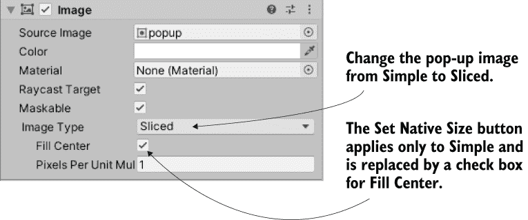

图 7.13 图像组件的设置，包括图像类型

错误发生是因为弹窗精灵还没有定义九个边框部分。为了设置这些部分，首先在项目视图中选择弹窗精灵。在检查器中，你应该能看到精灵编辑器按钮（见图 7.14）；点击该按钮，精灵编辑器窗口将出现。

警告 如第六章所述，精灵编辑器窗口需要 2D 精灵包。创建 2D 项目可能会自动安装该包，但针对此项目，您需要打开“窗口”>“包管理器”，并在窗口左侧的列表中查找“2D 精灵”。选择该包，然后点击“安装”按钮。

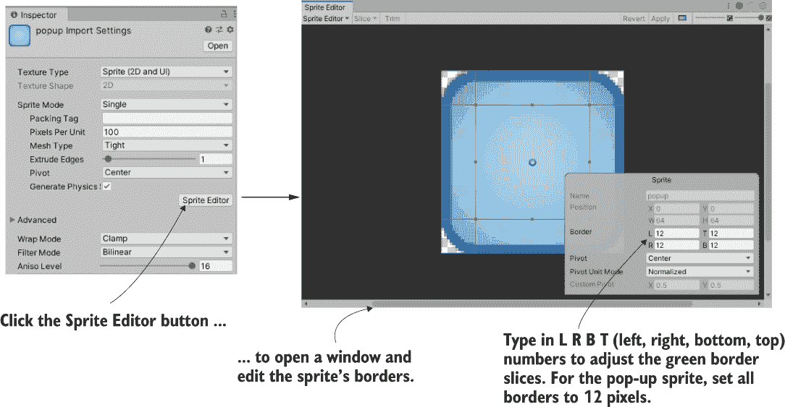

图 7.14 检查器中的精灵编辑器按钮和弹窗窗口

在精灵编辑器中，你可以看到表示图像如何切片的绿色线条。最初，图像不会有任何边框（所有边框设置均为 0）。将所有四边的边框宽度增加到 12，这将导致图 7.14 中显示的边框。因为所有四边（左、右、下和上）的边框都设置为 12 像素宽，边框线将相交成九个部分。关闭编辑器窗口并应用更改。

现在精灵已经定义了九个部分，切片图像将正常工作（并且图像组件设置将显示填充中心；确保该设置是开启的）。点击并拖动图像角落的蓝色指示器以缩放它（如果你看不到任何缩放指示器，请切换到第五章中描述的矩形工具）。边框部分将保持其大小，而中心部分将缩放。

由于边框部分保持其大小，切片图像可以缩放到任何大小，并且仍然具有清晰的边缘。这对于 UI 元素来说非常完美——不同的窗口可能有不同的大小，但应该看起来相同。对于这个弹出窗口，输入宽度为 250 和高度为 200，使其看起来像图 7.15（此外，将其居中对齐在位置 0, 0, 0）。

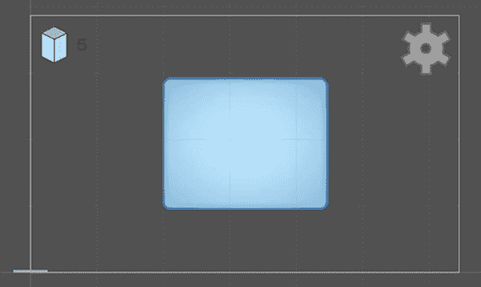

图 7.15 将切片图像缩放到弹出窗口的尺寸

提示：UI 图像堆叠的方式由它们在层次结构视图中的顺序决定。在层次结构列表中，将弹出窗口对象拖放到其他 UI 对象之上（当然，始终附着在画布上）。现在在场景视图中移动弹出窗口；你可以看到图像如何重叠弹出窗口。最后，将弹出窗口拖放到画布层次结构的底部，以便它显示在所有其他内容之上。

弹出窗口对象已设置好，因此为它编写一些代码。创建一个名为 SettingsPopup 的脚本，并将其拖放到弹出窗口对象上。

列表 7.4 弹出窗口对象的 SettingsPopup 脚本

```
using System.Collections;
using System.Collections.Generic;
using UnityEngine;

public class SettingsPopup : MonoBehaviour {
   public void Open() {
      gameObject.SetActive(true);             ❶
   }
   public void Close() {
      gameObject.SetActive(false);            ❷
   }
}
```

❶ 打开对象以打开窗口。

❷ 使此对象失效以关闭窗口。

接下来，打开 UIController 进行一些调整。

列表 7.5 调整 UIController 以处理弹出窗口

```
...
[SerializeField] SettingsPopup settingsPopup;
void Start() {
   settingsPopup.Close();          ❶
}
...
public void OnOpenSettings() {
   settingsPopup.Open();           ❷
}
...
```

❶ 游戏开始时关闭弹出窗口。

❷ 将调试文本替换为弹出窗口的方法。

此代码为弹出窗口对象添加了一个槽位，因此将弹出窗口拖放到 UIController。当你玩游戏时，弹出窗口将最初关闭，当你点击设置按钮时，它将打开。

目前，没有方法可以再次关闭它，所以给弹出窗口添加一个按钮。步骤与之前创建按钮时基本相同：选择 GameObject > UI > Button - TextMeshPro，将新按钮放置在弹出窗口的右上角，将关闭精灵拖动到这个 UI 元素的 Source Image 属性，然后点击 Set Native Size 以正确调整图像大小。与之前的按钮不同，我们想要这个文本标签，因此选择文本对象，在文本字段中输入“关闭”，将字体大小调整为 14，并将顶点颜色设置为白色。在 Hierarchy 视图中，将此按钮拖动到弹出对象上，使其成为弹出窗口的子对象。最后，为了增加细节，调整按钮过渡效果，将淡入持续时间设置为 0.01，并将正常颜色设置为 210, 210, 210, 255。

要使按钮关闭弹出窗口，需要添加一个 OnClick 条目；在按钮的 OnClick 面板上点击+按钮，将弹出窗口拖动到对象槽中，并从函数列表中选择 SettingsPopup > Close()。现在开始游戏，这个按钮将关闭弹出窗口。

弹出窗口已添加到 HUD 中。不过，窗口目前是空的，所以让我们向它添加控件。

### 7.3.3 使用滑块和输入字段设置值

与我们之前创建的按钮一样，向设置弹出窗口添加控件涉及两个主要步骤。您创建附加到画布的 UI 元素，并将这些对象链接到脚本。我们需要的是文本字段和滑块控件，以及一个静态文本标签来标识滑块。选择 GameObject > UI > InputField - TextMeshPro 创建文本字段，GameObject > UI > Slider 创建滑块对象，以及 GameObject > UI > Text - TextMeshPro 创建文本标签对象（见图 7.16）。

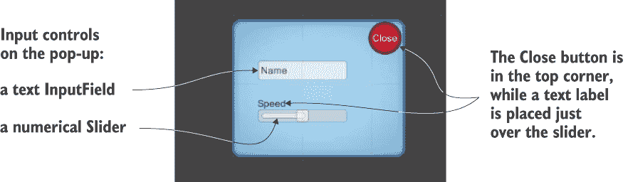

图 7.16 添加到弹出窗口的输入控件

通过在 Hierarchy 视图中拖动并将它们放置如图所示的位置，使所有三个对象成为弹出窗口的子对象，并使它们在弹出窗口的中间对齐。为了给滑块创建标签，将文本对象设置为“Speed”，并将其颜色设置为黑色。输入字段用于输入文本，大文本框中的内容在玩家输入其他内容之前显示；将此值设置为“Name”。您可以保留“内容类型”和“行类型”选项的默认设置；如果需要，可以使用“内容类型”来限制输入为仅字母或仅数字，而可以使用“行类型”从单行文本切换到多行文本。

警告：如果文本标签覆盖了滑块，您将无法点击滑块。在 Hierarchy 中将文本对象移到滑块上方，或者最好关闭 Raycast Target 设置（如图 7.7 所示展开额外设置），这样鼠标点击将忽略此对象。

警告：在这个示例中，你可能应该将输入字段保留在默认大小，但如果你决定缩小它，只减小宽度，不要减小高度。如果你将高度设置为小于 30，那么文本将无法显示。

至于滑块本身，在组件检查器的底部出现了一些设置。默认情况下，最小值设置为 0；保留它。默认情况下，最大值设置为 1，但在这个示例中将其设置为 2。同样，值和整数都可以保留在默认值；值控制滑块的起始值，整数将其限制为 0、1、2 而不是小数值（我们不希望有这种限制）。

所有对象都处理完毕。现在你需要编写与对象链接的代码；将以下列表中的方法添加到 SettingsPopup。

列表 7.6 弹出窗口的输入控件设置方法

```
...
public void OnSubmitName(string name) {        ❶
   Debug.Log(name);
}
public void OnSpeedValue(float speed) {        ❷
   Debug.Log($"Speed: {speed}");               ❸
}
...
```

❶ 当用户在输入字段中输入时触发

❷ 当用户调整滑块时触发

❸ 使用字符串插值构建消息

太好了！我们有了控件使用的方法。现在选择输入对象，在设置的最下面你会看到一个 On End Edit 面板；这里列出的事件是在用户完成输入时触发的。向这个面板添加一个条目，将弹出窗口拖到对象槽中，并在函数列表中选择 SettingsPopup.OnSubmitName()。

警告：务必在 End Edit 面板的上部选择函数，动态字符串，而不是下部，静态参数。OnSubmitName()函数出现在两个部分中，但在静态参数下选择它将只发送之前定义的单个字符串；*动态字符串*指的是在输入字段中输入的任何值。

对于滑块，遵循相同的步骤：在组件设置的最后部分（在这种情况下，面板是 OnValueChanged）查找事件面板，点击+添加一个条目，将设置弹出窗口拖入，并在动态值函数列表中选择 SettingsPopup.OnSpeedValue()。

现在两个输入控件都已连接到弹出窗口脚本中的代码。玩游戏，当你移动滑块或输入后按 Enter 键时，观察控制台。

通过使用 PlayerPrefs 在游戏之间保存设置

Unity 中可用于保存持久数据的几种方法，其中最简单的一种叫做 PlayerPrefs。Unity 提供了一种抽象的方式（也就是说，你不必担心细节），可以保存少量信息，这些信息在所有平台上（具有不同的文件系统）都有效。PlayerPrefs 对于大量数据来说并不太有用（在未来的章节中，我们将使用其他方法来保存游戏进度），但它非常适合保存设置。

PlayerPrefs 提供了简单的命令来获取和设置命名值（它的工作方式类似于哈希表或字典）。例如，您可以通过在 SettingsPopup 脚本的 OnSpeedValue() 方法中添加行 PlayerPrefs.SetFloat("speed", speed); 来保存速度设置。该方法将浮点值保存在名为 speed 的值中。

类似地，您可能希望将滑块初始化为保存的值。将以下代码添加到 SettingsPopup：

```
using UnityEngine.UI;       ❶
...
[SerializeField] Slider speedSlider;
void Start() {
   speedSlider.value = PlayerPrefs.GetFloat("speed", 1);
}
...
```

❶ 导入 UI 代码框架。

注意，获取命令既有要获取的值，也有默认值，以防速度之前未保存。

尽管控制生成调试输出，但它们仍然不影响游戏。使 HUD 影响游戏（反之亦然）是本章最后部分的主题。

## 7.4 通过响应事件更新游戏

到目前为止，HUD 和主游戏一直在相互忽视，但它们应该相互通信。这可以通过脚本引用来实现，就像您为其他类型的对象间通信所做的那样，但这种方法会有很大的缺点。特别是，这样做会将场景和 HUD 紧密耦合；您希望它们相对独立，这样您就可以自由地编辑游戏，而不用担心破坏了 HUD。

为了让 UI 警告场景中的动作，我们将使用广播信使系统。图 7.17 展示了该事件消息系统的工作原理：脚本可以注册以监听事件，其他代码可以广播事件，监听器将收到广播消息的警报。让我们回顾一下消息系统以实现这一点。

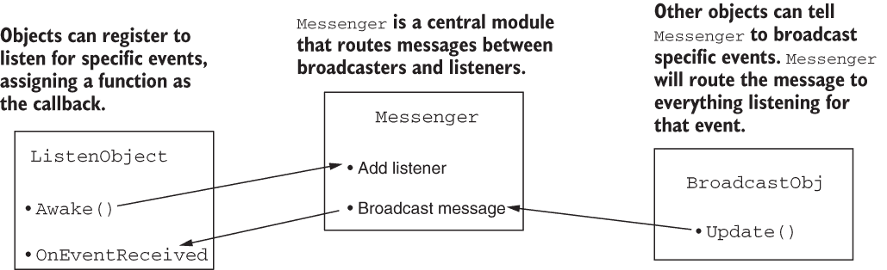

图 7.17 我们将实现的广播事件系统图

提示 C# 确实有一个内置的事件处理系统，所以您可能会想知道为什么我们不使用它。嗯，内置的事件系统强制执行目标消息，而我们需要的是广播信使系统。目标系统要求代码确切知道消息的来源；广播可以来自任何地方。

### 7.4.1 集成事件系统

为了让 UI 警告场景中的动作，我们将使用广播信使系统。尽管 Unity 没有内置此功能，但您可以下载一个用于此目的的好代码库。此信使系统非常适合以解耦的方式将事件传达给程序的其他部分。当某些代码广播消息时，该代码不需要了解任何关于监听器的信息，这允许在切换或添加对象时具有很大的灵活性。

创建一个名为 Messenger 的脚本，并将代码粘贴到 [`github.com/jhocking/from-unity-wiki/blob/main/Messenger.cs`](https://github.com/jhocking/from-unity-wiki/blob/main/Messenger.cs)。然后，您还需要创建一个名为 GameEvent 的脚本，并用列表 7.7 中的代码填充它。

列表 7.7 与 Messenger 一起使用的 GameEvent 脚本

```
public static class GameEvent {
   public const string ENEMY_HIT = "ENEMY_HIT";
   public const string SPEED_CHANGED = "SPEED_CHANGED";
}
```

此脚本定义了一些事件消息的常量；这样组织消息更加有序，你也不必到处记住并输入消息字符串。

现在事件消息系统已经准备好使用，让我们开始使用它。首先，我们将从场景与 HUD 进行通信，然后我们将进行相反方向的通信。

### 7.4.2 从场景广播和监听事件

到目前为止，分数显示已经显示了一个计时器来测试文本显示功能。但我们要显示被击中敌人的数量，所以让我们修改 UIController 中的代码。首先，删除整个 Update()方法，因为那是测试代码。当敌人死亡时，它将发出一个事件，所以下面的列表使 UIController 监听该事件。

列表 7.8 向 UIController 添加事件监听器

```
...
private int score;

void OnEnable() {
   Messenger.AddListener(GameEvent.ENEMY_HIT, OnEnemyHit);     ❶
}
void OnDisable() {
   Messenger.RemoveListener(GameEvent.ENEMY_HIT, OnEnemyHit);  ❷
}

void Start() {
   score = 0;
   scoreLabel.text = score.ToString();                         ❸

   settingsPopup.Close();
}

private void OnEnemyHit() {
   score += 1;                                                 ❹
   scoreLabel.text = score.ToString();
}
...
```

❶ 声明哪个方法响应 ENEMY_HIT 事件。

❷ 当对象被停用时，移除监听器以避免错误。

❸ 将分数初始化为 0。

❹ 在事件响应中增加分数。

首先注意 OnEnable()和 OnDisable()方法。与 Start()和 Update()类似，每个 MonoBehaviour 对象在激活或停用时都会自动响应。在 OnEnable()/OnDisable()中添加和删除监听器。这个监听器是广播消息系统的一部分，当接收到该消息时调用 OnEnemyHit()。OnEnemyHit()增加分数并将该值放入分数显示中。

事件监听器在 UI 代码中设置，所以现在每当敌人被击中时，我们需要广播该消息。响应击中的代码在 RayShooter 中，所以按照以下方式发出消息。

列表 7.9 从 RayShooter 广播事件消息

```
...
if (target != null) {
   target.ReactToHit();
   Messenger.Broadcast(GameEvent.ENEMY_HIT);    ❶
} else {
...
```

❶ 将消息广播添加到击中响应

在添加该消息后玩游戏，并观察在射击敌人时分数显示的变化。你应该会看到每次击中时计数都会增加。这涵盖了从 3D 游戏向 2D 界面发送消息，但我们还想要一个相反方向的例子。

### 7.4.3 从 HUD 广播和监听事件

在上一节中，场景广播了一个事件，并被 HUD 接收。以类似的方式，UI 控件可以广播一个消息，玩家和敌人都可以监听。这样，设置弹出窗口就可以影响游戏设置。打开 WanderingAI 并添加以下代码。

列表 7.10 向 WanderingAI 添加事件监听器

```
...
public const float baseSpeed = 3.0f;          ❶
...
void OnEnable() {
   Messenger<float>.AddListener(GameEvent.SPEED_CHANGED, OnSpeedChanged);
}
void OnDisable() {
   Messenger<float>.RemoveListener(GameEvent.SPEED_CHANGED, OnSpeedChanged);
}
...
private void OnSpeedChanged(float value) {    ❷
   speed = baseSpeed * value;
}
...
```

❶ 被速度设置调整的基本速度

❷ 在监听器中声明的用于事件 SPEED_CHANGED 的方法

OnEnable()和 OnDisable()也会在这里分别添加和删除事件监听器，但这次方法有了一个值。这个值用于设置游荡 AI 的速度。

提示：上一节中的代码使用了通用事件，但此消息系统也可以在消息中传递一个值。在监听器中支持一个值就像添加一个类型定义一样简单；注意监听器命令中添加的<float>。

现在在 FPSInput 中做出相同的更改以影响玩家的速度。下一列表中的代码几乎与列表 7.10 中的相同，只是玩家的 baseSpeed 有不同的数值。

列表 7.11 添加到 FPSInput 的事件监听器

```
...
public const float baseSpeed = 6.0f;     ❶
...
void OnEnable() {
   Messenger<float>.AddListener(GameEvent.SPEED_CHANGED, OnSpeedChanged);
}
void OnDisable() {
   Messenger<float>.RemoveListener(GameEvent.SPEED_CHANGED, OnSpeedChanged);
}
...
private void OnSpeedChanged(float value) {
   speed = baseSpeed * value;
}
...
```

❶ 这个值是从列表 7.10 中改变的。

最后，根据滑块广播 SettingsPopup 中的速度值。

列表 7.12 SettingsPopup 的广播消息

```
public void OnSpeedValue(float speed) {
   Messenger<float>.Broadcast(GameEvent.SPEED_CHANGED, speed);     ❶
   ...
```

❶ 将滑块值作为<float>事件发送。

现在当你调整滑块时，敌人和玩家的速度都会改变。点击播放并尝试一下！

练习：改变产生敌人的速度

目前，只有场景中已有的敌人速度值会被更新，而新产生的敌人不会以正确的速度设置创建。我将把它留给你作为练习，去思考如何设置新产生敌人的速度。这里有一个提示：给 SceneController 添加一个 SPEED_CHANGED 监听器，因为敌人就是从那里产生的。

你现在知道如何使用 Unity 提供的新 UI 工具构建图形界面。这项知识将在所有未来的项目中派上用场，即使我们在探索不同的游戏类型时也是如此。

## 概述

+   Unity 既有即时模式的 GUI 系统，也有基于 2D 精灵的新系统。

+   使用 2D 精灵构建 GUI 需要场景中有一个画布对象。

+   UI 元素可以被锚定到可调整画布上的相对位置。

+   将 Active 属性设置为打开或关闭 UI 元素。

+   解耦的消息系统是广播界面和场景之间事件的好方法。
