# 8 创建第三人称 3D 游戏：玩家移动和动画

本章涵盖

+   在场景中添加实时阴影

+   使摄像机围绕其目标旋转

+   使用 lerp 算法平滑地改变旋转

+   处理跳跃、边缘和斜坡的地面检测

+   为逼真的角色应用和控制动画

在本章中，你将创建另一个 3D 游戏，但这次你将进入一个新的游戏类型。在第二章中，你为第一人称游戏构建了一个移动演示。现在你将编写另一个移动演示，但这次将涉及第三人称移动。最重要的区别是摄像机相对于玩家的位置：在第一人称视角中，玩家通过他们的角色视角看到，而在第三人称视角中，摄像机放置在角色*外部*。这种视角可能对你来说很熟悉，比如在冒险游戏中，如长寿的*塞尔达传说*系列或较新的*无主之地*系列。（如果你想看到第一人称和第三人称视角的比较，请跳转到图 8.3。）

本章的项目是我们将在本书中构建的更具视觉吸引力的原型之一。图 8.1 显示了场景的构建方式。将其与我们在第二章中创建的第一人称场景图（图 2.2）进行比较。

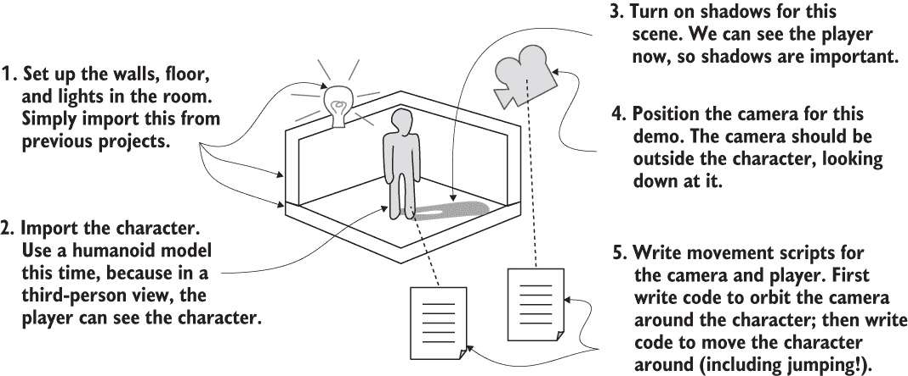

图 8.1 第三人称移动演示路线图

你可以看到房间构建是相同的，脚本的使用也大致相同。但玩家的外观以及摄像机的放置在每个情况下都不同。再次强调，将这定义为第三人称视角的是摄像机位于玩家角色外部，并朝向该角色。你将使用一个看起来像人类角色的模型（而不是原始的胶囊），因为现在玩家实际上可以看到自己。

回想一下，在第四章中讨论的两种艺术资产类型是 3D 模型和动画。如前几章所述，术语*3D 模型*几乎等同于*网格对象*；3D 模型是由顶点和多边形定义的静态形状（即网格几何）。对于人类角色，这种网格几何被塑造成头部、手臂、腿部等等（见图 8.2）。

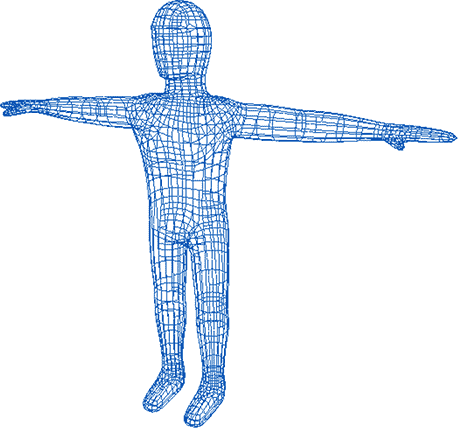

图 8.2 本章中我们将使用的模型的线框视图

如往常一样，我们将关注路线图中的最后一步：在场景中编程对象。以下是我们行动计划的重述：

1.  将角色模型导入场景。

1.  实现摄像机控制以观察角色。

1.  编写一个脚本，使玩家能够在地面上四处奔跑。

1.  将跳跃能力添加到移动脚本中。

1.  根据模型的活动播放动画。

要修改它，请从第二章复制项目，或者创建一个新的 Unity 项目（确保设置为 3D，而不是第五章中的 2D 项目）并将第二章项目中的场景文件复制过来。无论哪种方式，也要从本章下载中获取刮擦文件夹，以获取我们将使用的角色模型。

注意：您将在第二章的围墙区域内构建本章的项目。您将保留墙壁和灯光，但替换玩家和所有脚本。如果您需要示例文件，请从该章节下载。

假设您是从第二章的完整项目（动作演示，不是后来的项目）开始的，让我们删除本章不需要的所有内容。首先，在层次列表中从玩家对象断开摄像机的连接（将摄像机对象从玩家对象拖离）。现在删除玩家对象；如果您没有先断开摄像机的连接，那么它也会被删除，但您想要的只是删除玩家胶囊并留下摄像机。或者，如果您不小心删除了摄像机，可以通过选择 GameObject > Camera 创建一个新的摄像机对象。

也要删除所有脚本（这涉及到从摄像机中移除脚本组件并在项目视图中删除文件），只留下墙壁、地板和灯光。

## 8.1 调整第三视角的摄像机视图

在您编写代码使玩家移动之前，您需要将一个角色放入场景中并设置摄像机以观察该角色。您将导入一个无脸的人形模型作为玩家角色，然后将摄像机放在上方以角度向下观察玩家。图 8.3 比较了场景在第一视角下的样子和场景在第三视角下的样子（将在本章中添加一些大块，您将在本章中添加）。您已经准备好了场景，所以现在您将把一个角色模型放入场景中。

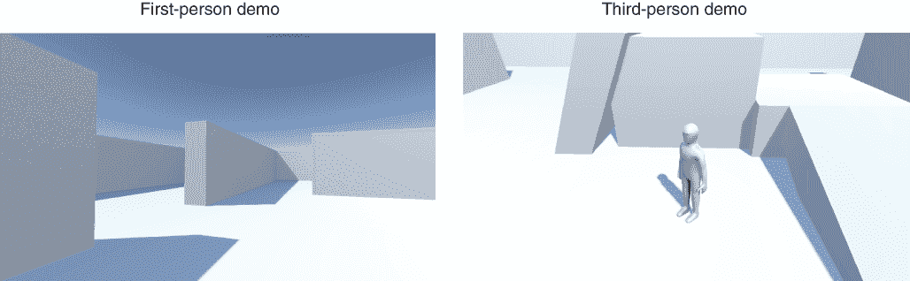

图 8.3 首视角和第三视角的并排比较

### 8.1.1 导入一个角色进行观察

本章下载的刮擦文件夹包含模型和纹理。正如您从第四章回忆的那样，FBX 是模型，TGA 是纹理。将 FBX 文件导入到项目中：要么将文件拖动到项目视图中，要么在项目视图中右键单击并选择导入新资产。

然后在检查器中调整模型的导入设置。在本章的后面部分，您将调整导入的动画，但到目前为止，您只需要在模型和材质选项卡中进行几个调整。首先，转到模型选项卡并将缩放因子值更改为 10（以部分抵消单位转换值 0.01），以便模型的大小是正确的。

下方一点，您会找到法线选项（见图 8.4）。此设置控制光照和阴影在模型上的显示，使用一个称为“法线”的 3D 数学概念。

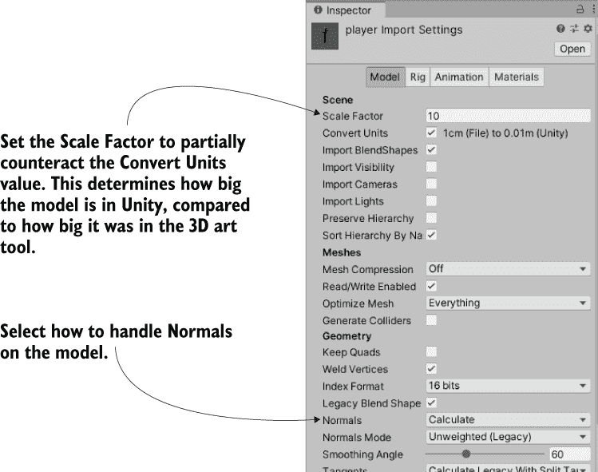

图 8.4 角色模型的导入设置

**定义** 法线是伸出多边形的方向向量，告诉计算机多边形面向哪个方向。这个面向方向用于光照计算。

法线默认设置为导入，这将使用导入的网格几何体中定义的法线。但这个特定的模型没有正确定义的法线，并且会对光线产生奇怪的反应。相反，将设置更改为计算，这样 Unity 将为每个多边形的面向方向计算一个向量。一旦调整了这些设置，请点击检查器中的应用按钮。

接下来，将 TGA 文件导入到项目中（以便将该图像指定为玩家材质的纹理）。转到材质选项卡，点击提取材质按钮。提取到您觉得合适的任何位置；然后选择出现的材质，将纹理图像拖动到检查器中的 Albedo 纹理槽中。一旦应用了纹理，您不会在模型的颜色上看到明显的改变（此纹理图像主要是白色），但画入纹理中的阴影将改善模型的外观。

应用纹理后，将玩家模型从项目视图拖动到场景中。将角色定位在 0, 1.1, 0，这样它就会位于房间的中心并抬起站在地板上。我们在场景中有一个第三人称角色！

**注意** 导入的角色手臂直直地伸出两侧，而不是更自然的下垂姿势。这是因为还没有应用动画；这种手臂伸出的位置被称为*T-pose*，标准是动画角色在动画之前默认为 T-pose。

### 8.1.2 向场景添加阴影

在我们继续之前，我想简单解释一下角色投射的阴影。在现实世界中，我们理所当然地认为会有阴影，但在游戏的虚拟世界中并不保证有阴影。幸运的是，Unity 可以处理这个细节，并且默认场景中的默认灯光已经打开了阴影。

在您的场景中选择方向光，然后在检查器中查找阴影类型选项。该设置（图 8.5）对于默认灯光已经是软阴影，但请注意菜单还有一个无阴影选项。

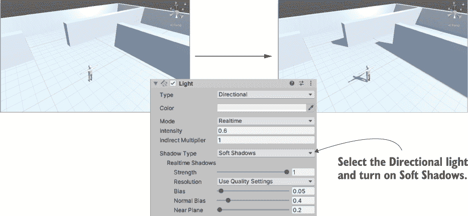

图 8.5 从方向光投射阴影前后的效果

这就是在这个项目中设置阴影所需做的全部工作，但您还应该了解关于游戏阴影的更多内容。在场景中计算阴影是计算机图形中特别耗时的一部分，因此游戏通常会采取各种捷径来伪造以实现所需的视觉效果。

从角色投射出的阴影被称为*实时阴影*，因为阴影是在游戏运行时计算的，并且随着移动对象移动。一个完美的真实照明设置将使所有对象都能实时投射和接收阴影，但为了使阴影计算足够快，实时阴影的外观可能比较原始，而且游戏甚至可能限制哪些灯光可以投射阴影。注意，在这个场景中只有方向光在投射阴影。

在游戏中处理阴影的另一种常见方法是使用一种称为*光照贴图*的技术。

定义：*光照贴图*是应用于级别几何形状的纹理，其中阴影的图像被烘焙到纹理图像中。

定义：将阴影绘制到模型纹理上称为*烘焙阴影*。

由于这些图像是在游戏运行之前生成的（而不是在游戏运行时），它们可以非常精致和逼真。缺点是，由于阴影是在游戏运行之前生成的，它们不会移动。因此，光照贴图非常适合用于静态级别的几何形状，但不适合像角色这样的动态对象。光照贴图是自动生成的，而不是手工绘制。计算机计算场景中的灯光如何照亮级别，同时在角落中逐渐积累微妙的黑暗。

是否使用实时阴影或光照贴图并不是一个非此即彼的选择。你可以设置灯光的剔除遮罩属性，以便仅对某些对象使用实时阴影，这样你就可以为场景中的其他对象使用更高品质的光照贴图。同样，尽管你几乎总是希望主要角色投射阴影，但有时你不想让角色接收阴影；所有网格对象（无论是网格渲染器还是着色网格渲染器组件）都有投射和接收阴影的设置。图 8.6 显示了当你选择地板时这些设置的外观。


图 8.6 检查器中的投射阴影和接收阴影设置

定义：*剔除*是一个通用的术语，用于移除不需要的东西。这个词在计算机图形学中的许多上下文中都会出现，但在这个情况下，*剔除遮罩*是你想要从阴影投射中移除的对象集合。

好的，现在你已经了解了如何将阴影应用到你的场景中的基础知识。照明和着色一个级别本身就是一个很大的话题（关于级别编辑的书籍通常会花费多个章节来讨论光照贴图），但在这里我们将限制自己只在一个灯光上开启实时阴影。有了这个，让我们将注意力转向相机。

### 8.1.3 围绕玩家角色旋转相机

在第一人称演示中，相机在 Hierarchy 视图中链接到玩家对象，以便它们一起旋转。然而，在第三人称移动中，玩家角色将独立于相机面向不同的方向。因此，这次你不想在 Hierarchy 视图中将相机拖到玩家角色上。相反，相机的代码将随着角色的移动而移动其位置，但将独立于角色旋转。

首先，将相机放置到你想要的位置，相对于玩家；我选择了位置 0, 3.5, -3.75 以将相机放置在角色上方和后方（如果需要，重置旋转到 0, 0, 0）。然后创建一个名为 OrbitCamera 的脚本，并编写列表 8.1 中的代码。将脚本组件附加到相机上，然后将玩家角色拖动到脚本的“目标”槽中。现在你可以播放场景以查看相机代码的实际效果。

列表 8.1 旋转并观察目标的相机脚本

```
using System.Collections;
using System.Collections.Generic;
using UnityEngine;

public class OrbitCamera : MonoBehaviour {
    [SerializeField] Transform target;                              ❶

    public float rotSpeed = 1.5f;

    private float rotY;
    private Vector3 offset;

    void Start() {
        rotY = transform.eulerAngles.y;
        offset = target.position - transform.position;              ❷
    }

    void LateUpdate() {
        float horInput = Input.GetAxis("Horizontal");
        if (!Mathf.Approximately(horInput, 0)) {                    ❸
            rotY += horInput * rotSpeed;
        } else {
            rotY += Input.GetAxis("Mouse X") * rotSpeed * 3;        ❹
        }

        Quaternion rotation = Quaternion.Euler(0, rotY, 0);
        transform.position = target.position - (rotation * offset); ❺
        transform.LookAt(target);                                   ❻
    }
}
```

❶ 序列化引用要围绕旋转的对象

❷ 存储相机和目标之间的起始位置偏移。

❸ 可以使用箭头键缓慢旋转相机 . . .

❹ . . . 或者快速旋转鼠标。

❺ 维持起始偏移，根据相机的旋转进行偏移。

❻ 无论相机相对于目标的位置如何，始终面向目标。

在阅读列表时，注意目标的序列化变量。代码需要知道围绕哪个对象旋转相机，因此这个变量被序列化以在 Unity 编辑器中显示，并使玩家角色与其链接。接下来的几个变量是旋转值，它们的使用方式与第二章中的相机控制代码相同。

声明了一个偏移值；在 Start() 中设置偏移以存储相机和目标之间的位置差异。这样，在脚本运行期间可以保持相机的相对位置。换句话说，无论相机如何旋转，它都会保持在角色初始距离的位置。代码的其余部分位于 LateUpdate() 函数内。

提示：记住，LateUpdate() 是由 Mono-Behaviour 提供的另一种方法，它与 Update() 类似；它是在每一帧运行的方法。正如其名称所暗示的，区别在于 LateUpdate() 在 Update() 在所有对象上运行之后对所有对象进行调用。这样，你可以确保相机在目标移动之后更新。

首先，代码根据输入控制增加旋转值。此代码查看两个输入控制——水平箭头键和水平鼠标移动——因此使用条件语句在它们之间切换。代码检查是否按下了水平箭头键；如果是，则使用该输入，如果不是，则检查鼠标。通过分别检查两个输入，代码可以为每种输入类型以不同的速度旋转。

接下来，代码根据目标位置和旋转值定位相机。transform.position 这一行可能是这段代码中最大的“啊哈！”时刻，因为它提供了你之前没有见过的关键数学。将位置向量乘以四元数会导致根据该旋转进行偏移的位置（注意旋转角度是通过使用 Quaternion.Euler 转换为四元数的）。然后，这个旋转的位置向量被添加为从角色位置到计算相机位置的偏移。图 8.7 说明了计算的步骤，并详细解释了这一相当概念密集的代码行。

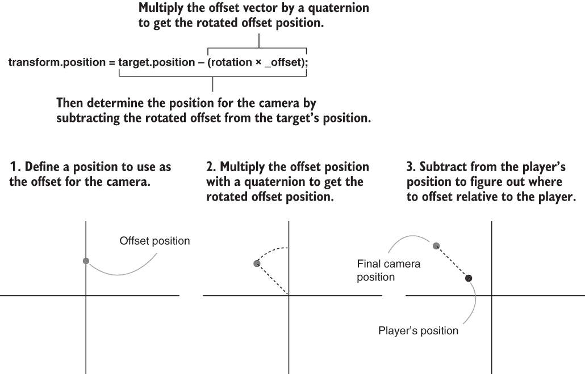

图 8.7 计算相机位置的步骤

注意：你们中数学更敏锐的人可能会想，“嗯，第二章中提到的在坐标系之间转换的事情……我难道不能在这里也做吗？”是的，你可以通过使用旋转坐标系来转换偏移位置以获得旋转的偏移，但这需要首先设置旋转坐标系，而且不经过这一步会更直接。

最后，代码使用 LookAt()方法将相机指向目标；这个函数将一个对象（不仅仅是相机）指向另一个对象。之前计算出的旋转值被用来在目标周围定位相机，但在那一步中，相机只是定位而没有旋转。因此，如果没有最后的 LookAt()行，相机位置将围绕角色旋转，但并不一定指向它。试着注释掉那一行，看看会发生什么。

Cinemachine

我们刚刚编写了一个用于控制相机的自定义脚本。然而，Unity 还提供了 Cinemachine，一套用于高级相机控制的工具。对于本章中简单的相机行为来说，这个包可能有些过度，但对于许多项目来说，Cinemachine 非常值得尝试。

打开包管理器窗口（窗口 > 包管理器），在 Unity 注册表中搜索 Cinemachine。更多信息请参阅[`mng.bz/PXvP`](http://mng.bz/PXvP)。

相机有自己的围绕玩家角色旋转的脚本；接下来是移动角色的代码。

## 8.2 编程相机相对移动控制

现在角色模型已经导入 Unity，并且你已经编写了控制相机视图的代码，现在是时候编写在场景中移动角色的控制代码了。让我们编写相机相对控制，当按下箭头键时，将角色移动到各个方向，并旋转角色以面对这些不同的方向。

“相机相对”是什么意思？

*相机相对*这一概念有点不明显，但理解它至关重要。这与前几章中提到的局部与全局的区别类似：“左”指向不同的方向，当你指的是“局部对象的左侧”或“整个世界的左侧”时。以类似的方式，当你“将角色向左移动”时，你是指向角色的左侧，还是屏幕的左侧？

在第一人称游戏中，相机位于角色内部并与角色一起移动，因此不存在角色左侧与相机左侧的区别。然而，第三人称视角将相机放置在角色外部，因此相机的左侧可能与角色的左侧指向不同的方向。例如，如果相机面向角色的前方，方向实际上是相反的。因此，你必须决定在你的特定游戏和控制设置中你想发生什么。

虽然游戏有时会采取相反的方式，但大多数第三人称游戏使它们的控制与相机相关。当玩家按下左键时，角色移动到屏幕的左侧，而不是角色的左侧。随着时间的推移和通过尝试不同的控制方案进行实验，游戏设计师已经发现，当“左”意味着“屏幕的左侧”（这并非巧合，也是玩家的左侧）时，玩家发现控制更直观且更容易理解。

实现相机相对控制涉及两个主要步骤：首先将玩家角色旋转到面向控制方向，然后移动角色。接下来，让我们编写这两个步骤的代码。

### 8.2.1 将角色旋转到面向移动方向

首先，你需要编写代码使角色面向箭头键的方向。创建一个名为 RelativeMovement 的 C#脚本，使用列表 8.2 中的代码。将此脚本拖放到玩家角色上，然后将相机链接到脚本的 target 属性（就像你将角色链接到相机脚本的 target 一样）。现在，当你按下控制键时，角色将面向不同的方向，面向相对于相机的方向；当你没有按下任何箭头键时（即使用鼠标旋转时），角色将保持静止。

列表 8.2 相对于相机旋转角色

```
using System.Collections;
using System.Collections.Generic;
using UnityEngine;

public class RelativeMovement : MonoBehaviour {
    [SerializeField] Transform target;                               ❶

    void Update() {
        Vector3 movement = Vector3.zero;                             ❷

        float horInput = Input.GetAxis("Horizontal");
        float vertInput = Input.GetAxis("Vertical");
        if (horInput != 0 || vertInput != 0) {                       ❸

            Vector3 right = target.right;
            Vector3 forward = Vector3.Cross(right, Vector3.up);      ❹
            movement = (right * horInput) + (forward * vertInput);   ❺

            transform.rotation = Quaternion.LookRotation(movement);  ❻
        }
    }
}
```

❶ 此脚本需要一个相对于该对象移动的引用。

❷ 从向量（0，0，0）开始，并逐步添加移动分量。

❶ 仅在按下箭头键时处理移动。

❸ 通过使用目标右方向的叉积来计算玩家的前进方向。

❹ 将每个方向上的输入相加，以获得组合移动向量。

❺ LookRotation()计算一个指向该方向的四元数。

这个列表与列表 8.1 以相同的方式开始，有一个用于目标的序列化变量。就像之前的脚本需要一个指向它将围绕其旋转的对象的引用一样，这个脚本需要一个指向它将相对于其移动的对象的引用。然后我们到达 Update()函数。函数的第一行声明了一个值为 0、0、0 的 Vector3 变量。剩余的代码将在玩家按下任何按钮时替换此向量，但如果没有输入，有一个默认值是很重要的。

接下来，检查输入控制，就像你在之前的脚本中做的那样。这里设置了在场景中水平移动的 X 和 Z 值。记住，Input.GetAxis()在没有按键被按下时返回 0，当按键被按下时，它在 1 和-1 之间变化；将此值放入移动向量中，将移动设置为该轴的正方向或负方向（x 轴是左右，z 轴是前后）。

接下来的几行代码计算相对于摄像机的移动向量。具体来说，我们需要确定移动的侧向和前方方向。侧向方向很容易；目标变换有一个名为 right 的属性，这将指向摄像机的右方，因为摄像机被设置为目标对象。前方方向更复杂，因为摄像机向前和向下倾斜进入地面，但我们希望角色在垂直于地面的方向上移动。这个前方方向可以使用叉积来确定。

定义：**叉积**是一种可以对两个向量进行的数学运算。简而言之，两个向量的叉积是一个指向两个输入向量垂直方向的新向量。考虑一下 3D 坐标轴：z 轴垂直于 x 轴和 y 轴。不要将叉积与点积混淆；点积（在章节后面解释）是另一种但也很常见的向量数学运算。

在这种情况下，两个输入向量是右方向和上方向。记住，我们已经确定了摄像机的右方向。同时，Vector3 有几个用于常见方向的快捷属性，包括从地面直指上方的方向。这个向量垂直于这两个点，并且与地面垂直对齐。

将每个方向上的输入相加以获得组合移动向量。最后一行代码通过使用 Quaternion.LookRotation()将 Vector3 转换为四元数，并将该值赋值，将移动方向应用于角色。现在尝试运行游戏，看看会发生什么！

使用 lerp（线性插值）平滑旋转

目前，角色的旋转会瞬间切换到不同方向，但如果角色能够平滑旋转会更好。你可以使用一种称为*lerp*的数学运算来实现这一点。首先将此变量添加到脚本中：

```
public float rotSpeed = 15.0f;
```

然后将列表 8.2 末尾现有的 transform.rotation 行替换为以下代码：

```
      ...
      Quaternion direction = Quaternion.LookRotation(movement);
      transform.rotation = Quaternion.Lerp(transform.rotation,
          direction, rotSpeed * Time.deltaTime);
    }
  }
}
```

现在，不再直接将 LookRotation()的值用于旋转，而是间接地将其作为旋转的目标方向。Quaternion.Lerp()方法在当前旋转和目标旋转之间平滑地变化。

从一个值平滑地变化到另一个值的术语是插值；您可以在任何类型的两个值之间进行插值，而不仅仅是旋转值。*Lerp*是*线性插值*的准缩写，Unity 还提供了用于向量和 float 值的 lerp 方法（用于插值位置、颜色或任何其他内容）。四元数也有一个与之密切相关的插值替代方法，称为*slerp*（用于*球面线性插值*）。对于较慢的转向，slerp 旋转可能看起来比 lerp 更好。

顺便提一下，这段代码以某种非传统的方式使用了 Lerp()函数。通常，第三个值会随时间变化，但在这里我们保持第三个值不变，而改变第一个值。在传统用法中，起始点和终点是固定的，但在这里我们保持将起始点逐渐靠近终点，从而实现对该终点的平滑插值。这种非传统用法在 Unity Answers 网站上有所解释（[`answers.unity.com/answers/730798/view.html`](http://answers.unity.com/answers/730798/view.html)）。

目前，角色在原地旋转而不移动；在下一节中，您将添加代码以使角色在场景中移动。

注意：由于侧向移动使用与环绕相机相同的键盘控制，当移动方向指向侧面时，角色会缓慢旋转。在这个项目中，这种控制的双重使用是期望的行为。

### 8.2.2 向该方向前进

如您从第二章回忆起来，为了在场景中移动玩家，您需要向玩家对象添加一个角色控制器组件。选择玩家，然后选择组件 > 物理 > 角色控制器。在检查器中，您应该略微减小控制器的半径到 0.4，但除此之外，默认设置对这个角色模型来说都是合适的。以下是 RelativeMovement 脚本中您需要添加的内容。

列表 8.3 添加代码以更改玩家的位置

```
using System.Collections;
using System.Collections.Generic;
using UnityEngine;

[RequireComponent(typeof(CharacterController))]                   ❶
public class RelativeMovement : MonoBehaviour {
...
public float moveSpeed = 6.0f;

private CharacterController charController;

void Start() {
    charController = GetComponent<CharacterController>();         ❷
}

    void Update() {
        ...
          movement = (right * horInput) + (forward * vertInput);
          movement *= moveSpeed;                                  ❸
          movement = Vector3.ClampMagnitude(movement, moveSpeed); ❹
          ...
        }

        movement *= Time.deltaTime;                              ❺
        charController.Move(movement);
    }
}
```

❶ 周围的行是放置 RequireComponent()方法的上下文。

❷ 在前面的章节中看到过的模式，用于访问其他组件。

❸ 面向方向的大小为 1，所以需要与期望的速度值相乘。

❹ 将对角线移动限制在与轴上移动相同的速度。

❺ 总是乘以 deltaTime 来使移动不受帧率的影响。

如果现在您玩游戏，您将看到角色（处于 T 形姿势）在场景中移动。几乎整个列表都是您已经见过的代码，所以我会简要地回顾一下。

首先，代码顶部有一个 RequireComponent 属性。正如第二章中解释的那样，RequireComponent 将强制 Unity 确保 GameObject 具有命令中传入的类型组件。这一行是可选的；你不必要求它，但没有这个组件，脚本将会有错误。

接下来，声明一个移动值，然后获取这个脚本的字符控制器引用。如你从前面的章节中回忆的那样，GetComponent() 返回附加到给定对象的其它组件，如果搜索的对象没有明确定义，则假定是 this.gameObject.GetComponent()（与这个脚本相同的对象）。

移动值仍然基于输入控制分配，但现在你也考虑了移动速度。将所有移动轴乘以移动速度，然后使用 Vector3.ClampMagnitude() 限制向量的幅度为移动速度。限制是必要的，因为否则，对角线移动的幅度将大于沿轴直接移动的幅度（想象一下直角三角形的边和斜边）。

最后，在最后，你将移动值乘以 deltaTime 以获得与帧率无关的移动（回想一下，*与帧率无关*意味着角色在不同帧率的计算机上以相同的速度移动）。将移动值传递给 CharacterController.Move() 以进行移动。

这处理了所有水平移动。接下来，让我们处理垂直移动。

## 8.3 实现跳跃动作

在上一节中，你编写了使角色在地面周围跑动的代码。在章节介绍中，我也提到了使角色跳跃，所以现在让我们来做这个。大多数第三人称游戏都有跳跃的控制。即使它们没有，它们几乎总是有角色从边缘掉落时的垂直移动。我们的代码将处理跳跃和坠落。具体来说，此代码将始终有重力将玩家向下拉，但在玩家跳跃时偶尔会施加向上的冲击。

在编写此代码之前，让我们在场景中添加一些凸起的平台。游戏目前没有任何可以跳跃或坠落的地方！创建更多几个立方体对象，然后修改它们的位子和缩放，为玩家提供可以跳跃的平台。在示例项目中，我添加了两个立方体，并使用了以下设置：位置 5, 0.75, 5 和缩放 4, 1.5, 4；位置 1, 1.5, 5.5，和缩放 4, 3, 4。图 8.8 显示了凸起的平台。

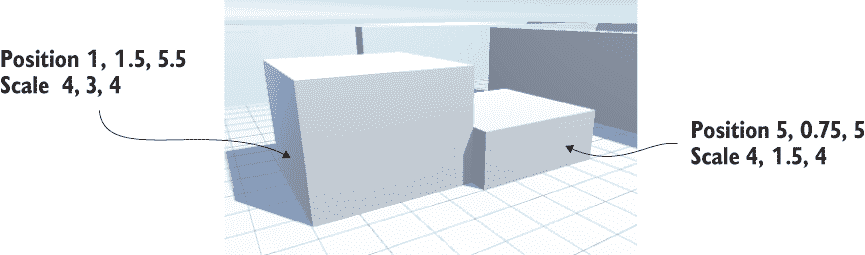

图 8.8 在稀疏的场景中添加的几个凸起的平台

### 8.3.1 应用垂直速度和加速度

如在列出 8.2 中的 RelativeMovement 脚本首次编写时所述，移动值是在单独的步骤中计算的，并逐步添加到移动向量中。此列表将垂直移动添加到现有的向量中。

列表 8.4 向 RelativeMovement 脚本添加垂直移动

```
...
public float jumpSpeed = 15.0f;
public float gravity = -9.8f;
public float terminalVelocity = -10.0f;
public float minFall = -1.5f;

private float vertSpeed;
...
void Start() {
    vertSpeed = minFall;                             ❶
    ...
}

    void Update() {
        ...
        if (charController.isGrounded) {             ❷
            if (Input.GetButtonDown("Jump")) {       ❸
                vertSpeed = jumpSpeed;
            } else {
                vertSpeed = minFall;
            }
        } else {                                     ❹
            vertSpeed += gravity * 5 * Time.deltaTime;
            if (vertSpeed < terminalVelocity) {
                vertSpeed = terminalVelocity;
            }
        }
        movement.y = vertSpeed;

        movement *= Time.deltaTime;                  ❺
        charController.Move(movement);
    }
}
```

❶ 在现有函数的开始处将垂直速度初始化为最小下落速度。

❷ CharacterController 具有 isGrounded 属性，用于检查控制器是否在地面上。

❸ 在地面上时响应跳跃按钮。

❹ 如果不在地面上，则应用重力，直到达到终端速度。

❺ 这段代码是现有的代码，仅用于参考新代码放置的位置。

如同往常，你首先在脚本顶部添加几个新变量以存储各种移动值，并正确初始化这些值。然后，跳到水平移动的大 if 语句之后，在那里添加另一个大 if 语句以处理垂直移动。具体来说，代码将检查角色是否在地面上，因为在这种情况下垂直速度的调整会有所不同。CharacterController 包括 isGrounded 属性，用于检查角色是否在地面上；如果角色控制器在上一帧与任何物体发生碰撞，则此值将为 true。

如果角色在地面上，垂直速度值（私有变量 vertSpeed）应该重置为 0。角色在地面上时不会下落，因此其垂直速度为 0；如果角色随后从边缘跳下，你会得到一个自然、流畅的动作，因为下落速度将从 0 开始加速。

注意：垂直速度并不是**完全**为 0；你将值设置为 minFall，即轻微的下移，这样角色在水平移动时始终会向下压地面。在起伏不平的地形上上下移动时需要一些向下的力。

如果按下跳跃按钮，则此地面速度值会有例外。在这种情况下，垂直速度应设置为较高的数值。if 语句检查 GetButtonDown()，这是一个新的输入函数，其工作方式与 GetAxis()类似，返回指定输入控制的状态。并且与水平和垂直输入轴类似，分配给跳跃的确切键可以通过转到“编辑”>“项目设置”下的输入管理器设置来定义（默认键分配是空格键，即空格键）。

回到更大的 if 条件，如果角色不在地面上，那么垂直速度应该由重力不断减少。请注意，此代码不是简单地设置速度值，而是递减它；这样，它不是恒定的速度，而是一种向下加速度，从而产生逼真的下落运动。跳跃将呈现自然弧线，因为角色的向上速度逐渐减少到 0，然后开始下落。

最后，代码确保下落速度不超过终端速度。请注意，运算符是小于而不是大于，因为向下是负速度值。然后，在大 if 语句之后，将计算出的垂直速度分配给移动向量的 y 轴。

而这就是实现真实垂直运动所需的所有内容！当角色不在地面上时，通过应用恒定的向下加速度，并在角色在地面上时适当地调整速度，代码就能创建出良好的下落行为。但这所有的一切都取决于正确检测地面，并且仍然存在一个微妙的错误需要修复。

### 8.3.2 修改地面检测以处理边缘和斜坡

如前节所述，CharacterController 的 isGrounded 属性指示角色控制器的底部在上一个帧中是否与任何物体发生了碰撞。尽管这种方法在大多数情况下都能检测到地面，但你可能会注意到，当角色离开边缘时，角色似乎在空中漂浮。

这是因为角色的碰撞区域是一个周围的胶囊（当你选择角色对象时可以看到它），当玩家离开平台的边缘时，这个胶囊的底部仍然会接触地面。图 8.9 展示了这个问题。这根本不行！

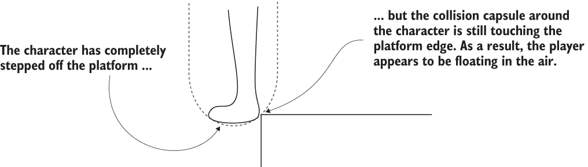

图 8.9 展示了角色控制器胶囊接触平台边缘的示意图

同样，如果角色站在斜坡上，当前的地面检测将导致问题行为。现在尝试一下，通过在升高平台对面创建一个斜坡块来测试。创建一个新的立方体对象，并将其变换值设置为位置-1.5, 1.5, 5，旋转 0, 0, -25，缩放 1, 4, 4。

如果你从地面跳到斜坡上，你会发现你可以从斜坡中间跳起，从而上升到顶部。这是因为斜坡以斜角接触胶囊的底部，而代码目前将任何底部的碰撞都视为坚实的立足点。再次强调，这不行；角色应该滑回底部，而不是有一个坚实的立足点可以跳起。

注意：只在陡峭的斜坡上希望角色滑回底部。在浅斜坡上，例如不平整的地面上，你希望玩家不受影响地跑动。如果你想测试，可以通过创建一个立方体并将其设置为位置 5.25, 0.25, 0.25，旋转 0, 90, 75，缩放 1, 6, 3 来制作一个浅坡。

所有这些问题都有相同的根本原因：检查角色底部的碰撞并不是确定角色是否在地面的好方法。相反，让我们使用射线投射来检测地面。在第三章中，AI 使用射线投射来检测其前方的障碍物；让我们使用相同的方法来检测角色下方的表面。从玩家的位置向下发射一条射线。如果它刚好在角色脚下检测到碰撞，则玩家是站在地面上的。

这引入了一种新的情况来处理：当射线投射没有检测到角色下方的地面，但角色控制器正在与地面发生碰撞时。如图 8.9 所示，当角色从边缘走开时，胶囊仍然与平台发生碰撞。图 8.10 向图中添加了射线投射，以显示现在会发生什么：射线没有击中平台，但胶囊确实接触到了边缘。代码需要处理这种特殊情况。

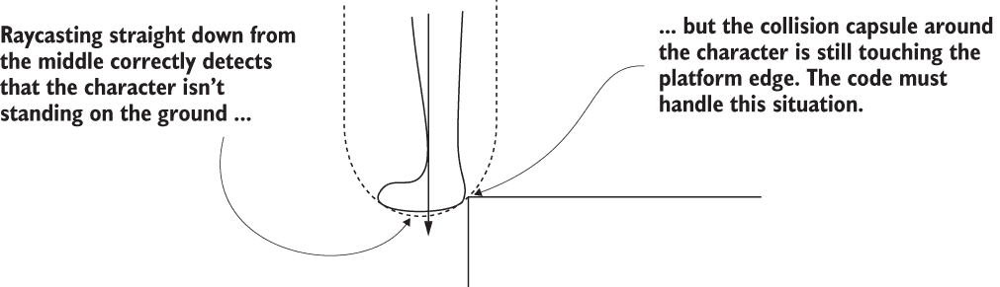

图 8.10 从边缘迈出时向下射线投射的示意图

在这种情况下，代码应该使角色从边缘滑落。角色仍然会下落（因为它没有站在地面上），但它也会从碰撞点推开（因为它需要将胶囊从它撞击的平台移开）。因此，代码将检测与角色控制器的碰撞，并通过轻微推开对这些碰撞做出响应。此列表调整了垂直移动，包括我们刚刚讨论的所有内容。

列表 8.5 使用射线投射检测地面

```
...
private ControllerColliderHit contact;                                     ❶
...
        bool hitGround = false;
        RaycastHit hit;
        if (vertSpeed < 0 &&                                               ❷
            Physics.Raycast(transform.position, Vector3.down, out hit)) {
            float check =                                                  ❸
                (charController.height + charController.radius) / 1.9f;
            hitGround = hit.distance <= check;
        }

        if (hitGround) {                                                   ❹
            if (Input.GetButtonDown("Jump")) {
                vertSpeed = jumpSpeed;
            } else {
                vertSpeed = minFall;
            }
        } else {
            vertSpeed += gravity * 5 * Time.deltaTime;
            if (vertSpeed < terminalVelocity) {
                vertSpeed = terminalVelocity;
            }

            if (charController.isGrounded) {                               ❺
                if (Vector3.Dot(movement, contact.normal) < 0) {           ❻
                    movement = contact.normal * moveSpeed;
                } else {
                    movement += contact.normal * moveSpeed;
                }
            }
        }
        movement.y = vertSpeed;

        movement *= Time.deltaTime;
        charController.Move(movement);
    }

    void OnControllerColliderHit(ControllerColliderHit hit) {              ❼
        contact = hit;
    }
}
```

❶ 需要在函数之间存储碰撞数据

❷ 检查玩家是否正在下落。

❸ 检查的距离（略微超出胶囊底部）

❹ 不要使用 isGrounded，检查射线投射的结果。

❸ 射线投射没有检测到地面，但胶囊接触到了地面。

❹ 根据角色是否面向接触点，做出轻微不同的响应。

❷ 在检测到碰撞时将碰撞数据存储在回调中。

此列表包含与上一个列表中大部分相同的代码；新代码穿插在现有的移动脚本中，此列表需要现有代码作为上下文。第一行在 RelativeMovement 脚本顶部添加了一个新变量。此变量用于存储函数之间碰撞的数据。

接下来的几行执行射线投射。此代码也位于水平移动下方，但在垂直移动的 if 语句之前。实际的 Physics.Raycast()调用应该从之前的章节中熟悉，但这次的具体参数不同。尽管投射射线的位置相同（角色的位置），但这次的方向将是向下而不是向前。然后，你检查射线击中某物时的距离；如果击中的距离是角色脚的距离，那么角色就站在地面上，因此将 hitGround 设置为 true。

**警告**：计算检查距离的方式并不明显，所以让我们详细说明一下。首先，取角色控制器的高度（即没有圆滑端的高度）然后加上圆滑端。将这个值除以二，因为光线是从角色的中间投射出去的（也就是说，已经下落了一半）以得到角色底部的距离。但你需要检查角色底部稍远的地方，以考虑到光线投射中的微小误差，所以用 1.9 而不是 2 来除，以得到稍微过远的距离。

在完成这个光线投射后，在垂直移动的 if 语句中使用 hitGround 而不是 isGrounded。大部分的垂直移动代码将保持不变，但需要添加代码来处理当角色控制器与地面碰撞，即使玩家不在地面上（即玩家从平台边缘走开）的情况。我们已经添加了一个新的 isGrounded 条件，但请注意，它嵌套在 hitGround 条件中，所以只有当 hitGround 没有检测到地面时才会检查 isGrounded。

碰撞数据包括一个 normal 属性（再次强调，法线向量表示某物面向的方向）它告诉我们从碰撞点移动的方向。但有一个棘手的问题是，你希望根据玩家已经移动的方向，以不同的方式处理从接触点推开。当之前的水平移动是朝向平台时，你想要替换那个移动，以便角色不会继续朝错误的方向移动；但当面对边缘时，你想要将之前的水平移动添加到之前，以保持远离边缘的前进动量。可以使用点积确定移动向量相对于碰撞点的方向。

**定义**：点积是可以在两个向量上进行的另一种数学运算。两个向量的点积范围在*N*和*-N*之间（*N*由输入向量的模长决定）。正*N*表示它们指向完全相同的方向，而*-N*表示它们指向完全相反的方向。不要混淆点积和叉积；叉积是另一种不同的但也很常见的向量数学运算。

Vector3 包含一个 Dot()函数，用于计算两个给定向量的点积。如果你计算移动向量与碰撞法线的点积，当两个方向相互远离时，将返回一个负数，而当移动和碰撞方向相同时，将返回一个正数。

列表 8.5 的末尾添加了一个新的方法到脚本中。在之前的代码中，你正在检查碰撞法线，但这个信息是从哪里来的？实际上，与角色控制器的碰撞是通过 MonoBehaviour 提供的名为 OnControllerColliderHit()的回调函数报告的；为了在脚本的其他地方响应碰撞数据，这些数据必须存储在外部变量中。这就是这个方法在这里所做的一切：将碰撞数据存储在接触点中，以便在 Update()方法中使用这些数据。

现在平台边缘和斜坡上的错误已经得到纠正。你可以通过跨过边缘和跳上陡峭的斜坡来测试它。这个动作演示几乎完成了。角色在场景中移动正确，所以只剩下最后一件事：将角色从 T 形姿势中动画化出来。

## 8.4 在玩家角色上设置动画

除了由网格几何形状定义的更复杂的形状之外，人类角色还需要动画。在第四章中，你了解到动画是一组定义相关 3D 对象运动的信息包。我给出的具体例子是一个角色四处走动，而你现在要做的事情正是如此！

角色将在场景中奔跑，所以你需要分配一些使手臂和腿部来回摆动的动画。图 8.11 显示了当角色在场景中移动时播放动画的游戏外观。

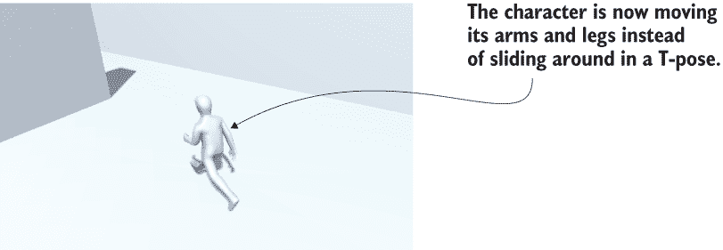

图 8.11 播放奔跑动画的角色在场景中移动

理解 3D 动画的一个好类比是木偶戏：3D 模型是木偶，动画师是木偶师，动画是木偶动作的记录。动画可以通过几种方法创建；现代游戏中大多数角色动画（当然，这一章中角色的所有动画）都使用一种称为**骨骼动画**的技术。

**定义** 在**骨骼动画**中，在模型内部设置了一系列骨骼，然后在动画过程中移动这些骨骼。当骨骼移动时，与该骨骼相连的模型表面也会随之移动。

正如其名所示，当模拟角色内部的骨骼时（图 8.12 说明了这一点），骨骼动画最直观，但骨骼是一个有用的抽象概念，任何时候你想让模型弯曲和伸展，同时仍然保持其动作的明确结构（例如，波浪般摆动的触手）时，都可以使用它。尽管骨骼移动是刚性的，但骨骼周围的模型表面可以弯曲和伸展。

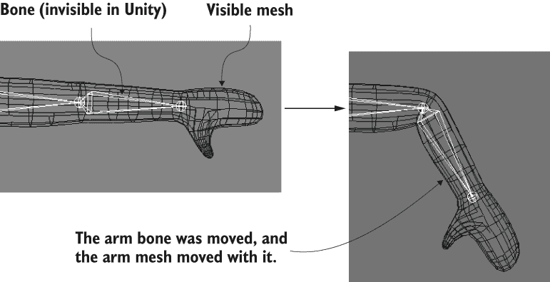

图 8.12 人类角色的骨骼动画

实现图 8.11 所示的结果涉及几个步骤：首先，在导入的文件中定义动画剪辑，然后设置控制器来播放这些动画剪辑，最后将动画控制器集成到你的代码中。角色模型上的动画将根据你将要编写的运动脚本进行回放。

当然，在执行任何这些步骤之前，你需要做的第一件事是开启动画系统。在项目视图中选择玩家模型，然后在检查器中查看其导入设置。选择动画选项卡，并确保已勾选导入动画。然后转到绑定选项卡，将动画类型从通用切换到人类（这是一个人类角色，自然）。请注意，最后一个菜单项还有一个遗留设置；通用和人类都是 Mecanim 框架内的设置。

解释 Unity 的 Mecanim 动画系统

Unity 拥有用于管理模型动画的复杂系统，称为 Mecanim。你在第六章中介绍了这个动画系统，但提到我们将在稍后进行更详细的介绍，因此本章的一些内容将是对之前解释的回顾，现在将重点关注 3D 动画而不是 2D 动画。

名称 *Mecanim* 指的是添加到 Unity 中的较新、更先进的动画系统，作为对旧动画系统的替代。旧系统仍然存在，被称为遗留动画，但在 Unity 的未来版本中可能会逐步淘汰，届时 Mecanim 将成为唯一的动画系统。

虽然你将要使用的所有动画都包含在我们角色模型的同一 FBX 文件中，但 Mecanim 方法的一个主要优点是你可以将来自其他 FBX 文件的动画应用到角色上。例如，所有的人类敌人可以共享一组单一的动画。这具有多个优点，包括保持所有数据组织有序（模型可以放在一个文件夹中，而动画可以放在另一个文件夹中）以及节省为每个单独的角色制作动画的时间。

点击检查器底部的应用按钮，将这些设置锁定到导入的模型上，然后继续定义动画剪辑。

警告：你可能会在控制台中看到一个警告（不是错误），内容为“转换警告：spine3 在人类变换之间”。这个特定的警告并不是一个担忧的原因；它表明导入的模型中的骨骼超出了 Mecanim 预期的骨骼范围。

### 8.4.1 在导入的模型中定义动画剪辑

为我们的角色设置动画的第一步是定义将要播放的各种动画剪辑。如果你考虑一个逼真的角色，不同的动作会在不同的时间发生：有时玩家在跑动，有时玩家在平台上跳跃，有时角色只是站立着，手臂下垂。每个动作都是一个独立的剪辑，可以单独播放。

通常，导入的动画是一个单一的长时间线，可以被切割成更短的独立动画。要分割动画片段，首先在检查器中选择动画选项卡。你会看到一个片段面板，如图 8.13 所示；这个面板列出了所有定义的动画片段，最初是一个导入的片段。你会注意到列表底部的+和-按钮；你使用这些按钮在列表中添加和删除片段。最终，你需要为这个角色添加四个片段，所以在你工作时根据需要添加和删除片段。

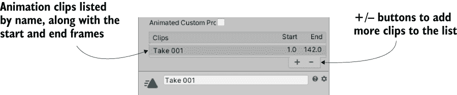

图 8.13 动画设置中的片段列表

当你选择一个片段时，关于该片段的信息（如图 8.14 所示）将出现在列表下方区域。该信息区域顶部显示该片段的名称，你可以输入一个新的名称。将第一个片段命名为空闲。为这个动画片段定义开始和结束帧；这允许你从较长的导入动画中切出一段。空闲动画从总时间线的第 3 帧到第 141 帧，因此输入这些数字作为开始和结束。接下来是循环设置。

**定义** *循环* 指的是反复播放的录制。一个循环动画片段是指当播放达到结束时，会从开始处再次播放。


图 8.14 选择动画片段的信息

空闲动画是循环的，因此选择循环时间和循环姿态。顺便说一句，绿色指示点告诉你片段开始处的姿态与结束处的姿态是否匹配以实现正确的循环；当姿态有些不匹配时，指示器变为黄色，当开始和结束姿态完全不同时，指示器变为红色。

在循环设置下方是一系列与根变换相关的设置。单词*根*在骨骼动画中的含义与在 Unity 中连接的层次结构中的含义相同：根对象是所有其他对象连接的基础对象。因此，*动画根*可以被认为是角色的基础，其他所有东西都是相对于这个基础移动的。

可以使用一些设置来设置这个基础，并且你可能想在处理自己的动画时在这里进行实验。然而，就我们的目的而言，三个基于菜单应该设置为身体方向、质心、质心，按此顺序。

现在点击应用，你已经为你的角色添加了一个空闲动画片段。为另外两个片段做同样的操作：行走从第 144 帧开始到第 169 帧结束，跑步从第 171 帧开始到第 190 帧结束。所有其他设置都应该与空闲相同，因为它们也是动画循环。

第四个动画剪辑是跳跃，这个剪辑的设置略有不同。首先，这不是一个循环，而是一个静态姿势，所以不要选择循环时间。将开始和结束设置为 190.5 和 191；这是一个单帧姿势，但 Unity 要求开始和结束必须不同。由于这些棘手的数字，下面的动画预览可能看起来不太对，但在游戏中这个姿势看起来会很好。点击应用以确认新的动画剪辑，然后继续下一步：创建动画控制器。

### 8.4.2 为这些动画创建动画控制器

下一步是为这个角色创建动画控制器。这一步允许我们设置动画状态并创建这些状态之间的转换。在不同的动画状态下播放不同的动画剪辑，然后我们的脚本将导致控制器在动画状态之间切换。

这可能看起来像是一个奇怪的间接步骤——在我们的代码和实际播放动画之间放置控制器的抽象。你可能熟悉可以直接从你的代码中播放动画的系统；确实，旧的 Legacy 动画系统正是以这种方式工作的，使用如 Play("idle")这样的调用。但这种间接性使我们能够在模型之间共享动画，而不仅仅是能够播放这个模型内部的动画。在本章中，我们不会利用这个功能，但请记住，当你在较大的项目中工作时，这可能很有帮助。你可以从多个来源获取你的动画，包括多个动画师，或者你可以从在线商店（如 Unity 资源商店）购买单个动画。

首先创建一个新的动画控制器资产（资源 > 创建 > 动画控制器——不是动画，这是一种不同类型的资源）。在项目视图中，你会看到一个带有有趣线条网络的图标（见图 8.15）；将此资源重命名为 player。选择场景中的角色，你会注意到这个对象有一个名为 Animator 的组件；任何可以动画化的模型都有这个组件，除了变换组件和您添加的其他组件。Animator 组件有一个控制器槽，用于链接特定的动画控制器，因此拖放你的新控制器资产（并确保取消选中应用根运动）。

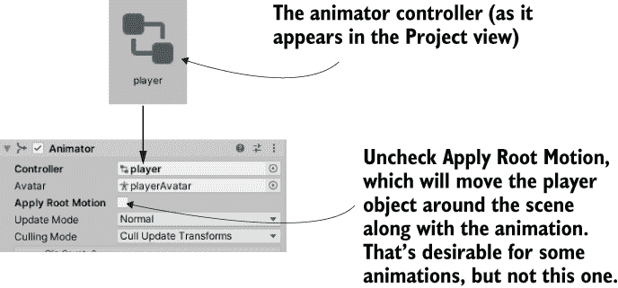

图 8.15 动画控制器和动画组件

动画控制器是一个由连接的节点组成的树（因此该资产上的图标），您可以通过打开动画视图来查看和操作它。这是一个视图，就像场景或项目视图（如图 8.16 所示）一样，但这个视图默认情况下是关闭的。选择“窗口”>“动画”，然后从菜单中选择“动画控制器”（注意不要与动画窗口混淆；那是一个与动画控制器分开的选择）。这里显示的节点网络是当前选定的动画控制器（或所选角色的动画控制器）。

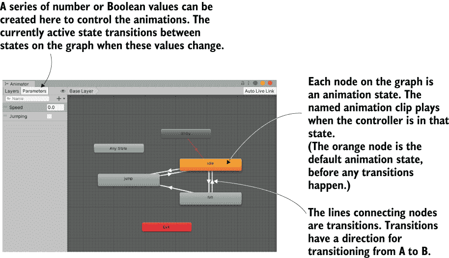

图 8.16 带有完成动画控制器的动画视图

提示：请记住，您可以在 Unity 中移动选项卡并将它们停靠在任何您喜欢的地方以组织界面。我喜欢将动画控制器停靠在场景和游戏选项卡旁边。

初始时，我们只有两个默认节点，一个是“入口”，另一个是“任何状态”。您不会使用“任何状态”节点。相反，您将拖入动画剪辑以创建新的节点。在项目视图中，单击模型资产旁边的箭头以展开该资产并查看它包含的内容。该资产的内容中包含您定义的动画剪辑（见图 8.17），因此将这些剪辑拖入动画视图。不要担心行走动画（这可能对其他项目有用）并拖入空闲、跑步和跳跃。

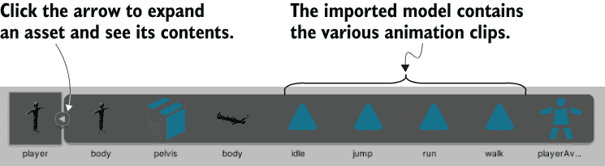

图 8.17 项目视图中的展开模型资产

右键单击“空闲”节点并选择“设置为层默认状态”。该节点将变为橙色，而其他节点保持灰色；默认动画状态是在游戏做出任何更改之前节点网络开始的地方。您需要用表示动画状态之间转换的线条将节点连接起来；右键单击一个节点并选择“创建转换”以开始拖动一个可以点击另一个节点以连接的箭头。按照图 8.16 中显示的图案连接节点（确保大多数节点在两个方向上都有转换，但不要从跳跃转换到跑步）。这些转换线决定了动画状态如何相互连接，并控制游戏中的状态变化。

过渡依赖于一组控制值，因此让我们创建这些参数。在左上角是参数选项卡（如图 8.16 所示）；单击它以查看一个带有+按钮的面板，用于添加参数。添加一个名为 Speed 的浮点数和一个名为 Jumping 的布尔值。这些值将由我们的代码调整，并将触发动画状态之间的转换。单击转换线以在检查器中查看它们的设置（见图 8.18）。

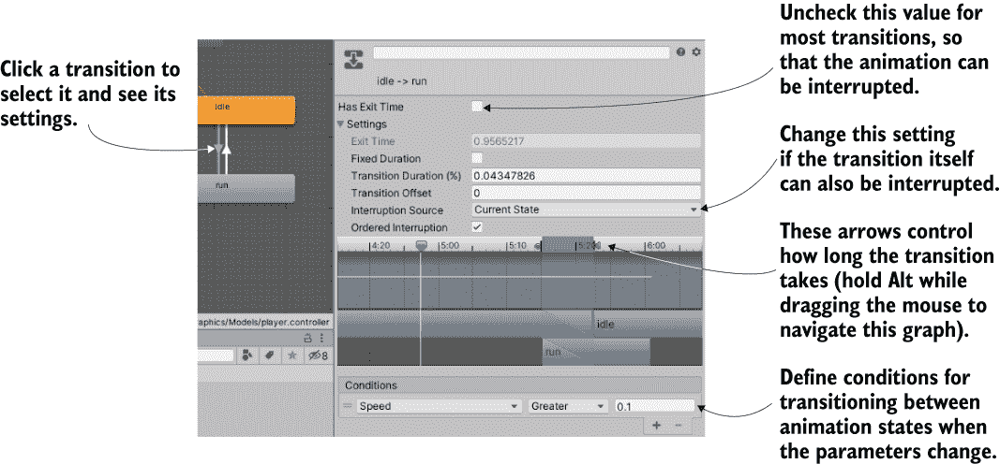

图 8.18 检查器中的过渡设置

这里是你调整参数变化时动画状态如何变化的地方。例如，单击空闲到奔跑转换以调整该转换的条件。在条件下，添加一个并设置为速度，大于，0.1。关闭具有退出时间（这将强制播放整个动画，而不是在转换发生时立即中断）。然后，单击设置标签旁边的箭头以查看整个菜单；其他转换应该能够中断此转换，因此将中断源菜单从无更改为当前状态。对表 8.1 中的所有转换重复此操作。

表 8.1 此动画控制器中所有转换的条件

| 转换 | 条件 | 中断 |
| --- | --- | --- |
| 空闲到奔跑 | 速度大于 0.1 | 当前状态 |
| 奔跑到空闲 | 速度小于 0.1 | 无 |
| 空闲到跳跃 | 跳跃为真 | 无 |
| 奔跑到跳跃 | 跳跃为真 | 无 |
| 跳跃到空闲 | 跳跃为假 | 无 |

除了这些基于菜单的设置外，还有一个复杂的视觉界面，如图 8.18 所示，位于条件设置之上。此图允许你直观地调整转换的时间长度。默认的转换时间对于空闲和奔跑之间的转换看起来都很好，但所有跳跃到和从跳跃的转换都应该更短，以便角色能够更快地跳到跳跃动画。图表的阴影区域表示转换所需的时间；要查看更多细节，请按住 Alt 并左键单击（或在 Mac 上按住 Option 并左键单击）图表以在其上平移，并按住 Alt 并右键单击以缩放（这些是 Scene 视图中导航的相同控件）。使用阴影区域顶部的箭头将其缩小到所有三个跳跃转换都低于 4 毫秒。

最后，你可以通过逐个选择动画节点并调整转换顺序来完善动画网络。检查器将显示所有到和从该节点的转换列表；你可以拖动列表中的项目（它们的拖动手柄位于左侧的图标）来重新排序它们。确保空闲和奔跑节点上的跳跃转换都位于顶部，以便跳跃转换具有比其他转换更高的优先级。

当你查看这些设置时，你也可以更改播放速度，如果动画看起来太慢（奔跑在 1.5 倍速时看起来更好）。动画控制器已设置，因此现在你可以从移动脚本中操作动画。

### 8.4.3 编写操作动画器的代码

最后，你将在 RelativeMovement 脚本中添加方法。如前所述，设置动画状态的大部分工作是在动画控制器中完成的；只需要少量代码就可以操作一个丰富且流畅的动画系统，如这里所示。

列表 8.6 在动画组件中设置值

```
...
private Animator animator;
...
animator = GetComponent<Animator>();                         ❶
...
        animator.SetFloat("Speed", movement.sqrMagnitude);   ❷

        if (hitGround) {
            if (Input.GetButtonDown("Jump")) {
                vertSpeed = jumpSpeed;
            } else {
                vertSpeed = minFall;
                animator.SetBool("Jumping", false);
            }
        } else {
            vertSpeed += gravity * 5 * Time.deltaTime;
            if (vertSpeed < terminalVelocity) {
                vertSpeed = terminalVelocity;
            }
            if (contact != null ) {                          ❸
                animator.SetBool("Jumping", true);
            }

            if (charController.isGrounded) {
                if (Vector3.Dot(movement, contact.normal) < 0) {
                    movement = contact.normal * moveSpeed;
                } else {
                    movement += contact.normal * moveSpeed;
                }
            }
        }
...
```

❶ 在 Start() 函数内添加

❷ 在水平移动的整个 if 语句下方

❸ 不要在关卡开始时立即触发此值。

再次强调，列表中的大部分内容与之前的列表重复；动画代码是一些散布在现有移动脚本中的几行。挑选出动画器行，以找到需要在代码中添加的内容。

脚本需要引用 Animator 组件，然后代码在动画器上设置值（可以是浮点数或布尔值）。唯一稍微不那么明显的一小段代码是在设置跳跃布尔值之前的条件（contact != null）。这个条件防止动画器在游戏开始时播放跳跃动画。尽管角色在技术上会短暂地落下，但直到角色第一次接触地面之前，不会生成任何碰撞数据。

就这样！现在我们有一个很好的第三人称移动演示，带有相机相对控制和角色动画播放。

## 摘要

+   第三人称视角意味着相机在角色周围移动，而不是在角色内部移动。

+   模拟阴影，如实时阴影和光照贴图，可以提升图形效果。

+   控制可以相对于相机，而不是相对于角色。

+   你可以通过向下发射射线来提高 Unity 的地形检测。

+   使用 Unity 的动画控制器设置复杂的动画，可以产生逼真的角色。
