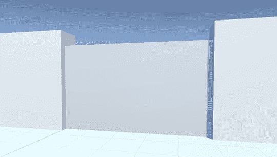
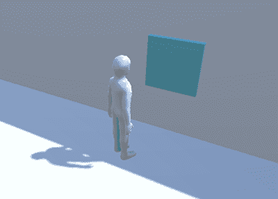
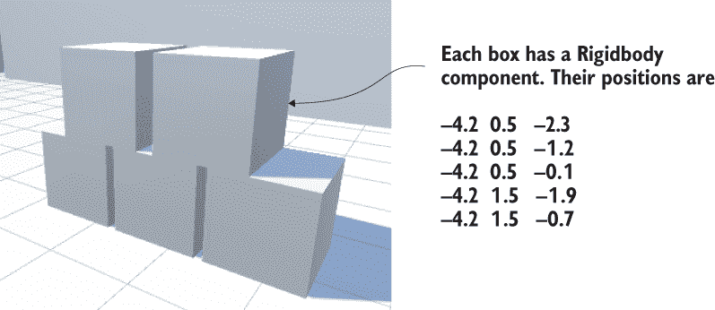
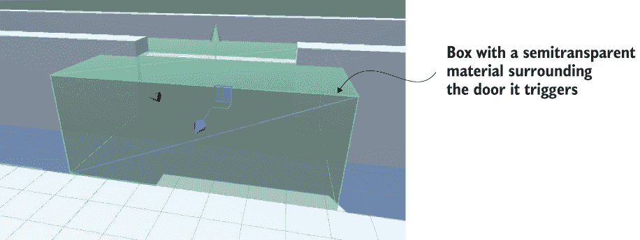
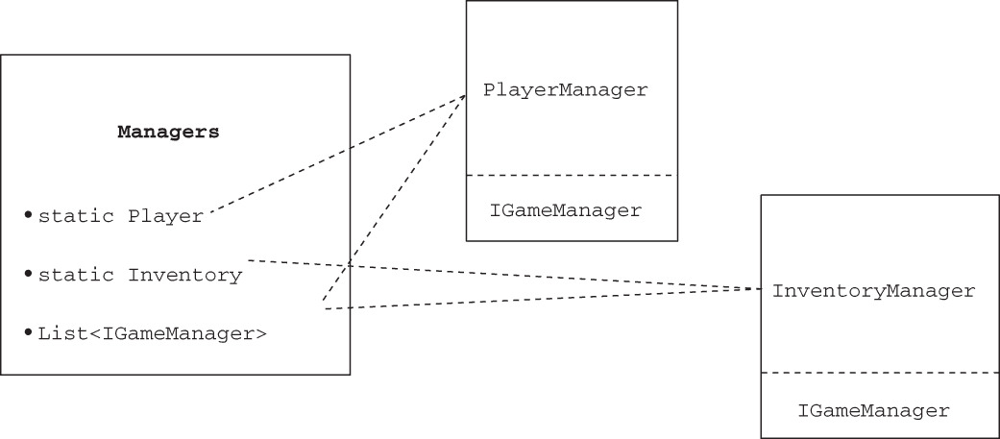
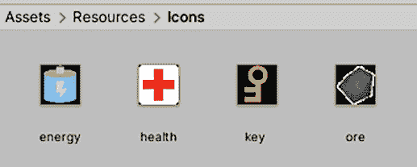
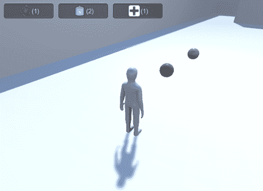

# 9 在游戏中添加交互式设备和物品

本章涵盖

+   编程玩家可以打开的门

+   启用物理模拟，使一摞箱子散开

+   构建玩家存储在他们的库存中的可收集物品

+   使用代码管理游戏状态，例如库存数据

+   配备和使用库存物品

实现功能性物品是我们接下来要关注的话题。前几章涵盖了完整游戏的各种元素：移动、敌人、用户界面等。但我们的项目缺乏与其他东西交互的内容，也没有多少游戏状态。在本章中，你将学习如何创建像门这样的功能性设备。

我们还将讨论收集物品，这涉及到与关卡中的对象交互以及跟踪游戏状态。游戏通常需要跟踪状态，如玩家的当前统计数据、完成目标进度等。玩家的库存就是这类状态的例子，因此你将构建一个代码架构来跟踪玩家收集的物品。到本章结束时，你将构建一个真正感觉像游戏的动态空间！

我们将首先探索（如门）由玩家按键操作的操作设备。之后，你将编写代码以检测玩家与关卡中的对象发生碰撞，从而实现推动物体或收集库存物品等交互。然后，你将设置一个健壮的模型-视图-控制器（MVC）风格的代码架构来管理收集的库存数据。最后，你将编写接口以利用库存进行游戏玩法，例如需要钥匙才能打开门。

警告：前几章相对独立，技术上不需要早期章节的项目，但这次一些代码列表对第八章的脚本进行了编辑。如果你直接跳到本章，请下载第八章的示例项目以在此基础上构建。

示例项目将在关卡上随机分布这些设备和物品。一个精心打磨的游戏会在物品放置上有很多精心设计，但我们不需要精心规划一个只测试功能的关卡。然而，尽管对象的放置不需要计划，章节开头列出的项目符号却概述了我们实施事物的顺序。通常，解释会逐步构建代码，但如果你想在同一个地方看到所有完成的代码，你可以下载示例项目。

## 9.1 创建门和其他设备

虽然游戏中的层级主要由静态墙壁和景观组成，但它们通常也包含许多功能设备。我指的是玩家可以与之交互和操作的对象——比如可以打开的灯或开始旋转的扇子。具体的设备可以有很多种，通常只受限于你的想象力，但几乎所有这些设备都使用相同类型的代码来让玩家激活设备。在本章中，你将实现几个示例，然后你应该能够将相同的代码适应到各种其他设备上。

### 9.1.1 通过按键打开和关闭的门

你将要编写的第一种设备是能够打开和关闭的门，你将从一个通过按键操作门开始。游戏中可以有大量的设备，以及操作这些设备的方法。我们最终会看看一些变体，但门是游戏中最常见的交互式设备，使用物品通过按键操作是最直接的方法来开始。

场景中有几个地方墙壁之间存在缝隙，所以放置一个新的对象来阻挡缝隙。我创建了一个新的立方体对象，并将其变换设置为位置 2.5, 1.5, 17 和缩放 5, 3, 0.5，创建了图 9.1 中显示的门。



图 9.1 门对象嵌入到墙的缝隙中

创建一个 C#脚本，命名为 DoorOpenDevice，并将其放置在门对象上。这段代码将使对象作为一个门来操作。

列表 9.1 命令打开和关闭门的脚本

```
using System.Collections;
using System.Collections.Generic;
using UnityEngine;

public class DoorOpenDevice : MonoBehaviour {
   [SerializeField] Vector3 dPos;                 ❶

   private bool open;                             ❷

   public void Operate() {
      if (open) {                                 ❸
         Vector3 pos = transform.position - dPos;
         transform.position = pos;
      } else {
         Vector3 pos = transform.position + dPos;
         transform.position = pos;
      }
      open = !open;
   }
}
```

❶ 当门打开时偏移的位置量

❷ 用于跟踪门开启状态的布尔值

❸ 根据门的开启状态打开或关闭门。

第一个变量定义了门打开时应用的偏移量。门打开时会移动这个量，关闭时则会减去这个量。第二个变量是一个私有的布尔值，用于跟踪门是打开还是关闭。在 Operate()方法中，对象的变换被设置为新的位置，根据门是否已经打开，添加或减去偏移量；然后打开状态被切换开或关。

与其他序列化变量一样，dPos 出现在检查器中。但这是一个 Vector3 值，所以我们有三个输入框，都在一个变量名下。输入门打开时的相对位置；我决定让门滑动打开，所以偏移量是 0, -2.9, 0（因为门对象的高度为 3，向下移动 2.9 后，门的一小部分会露出地板）。

注意：变换是即时应用的，但你可能更喜欢在门打开时看到移动。如第三章所述，你可以使用 tween 使对象在一段时间内平滑移动。在不同的上下文中，“tween”这个词有不同的含义，但在游戏编程中，它指的是导致对象移动的代码命令；附录 D 提到了 Unity 的 tweening 系统。

其他代码需要调用 Operate()来使门打开和关闭（单个函数调用处理两种情况）。你还没有在玩家上放置那个其他脚本，所以编写这个脚本是下一步。

### 9.1.2 在开门前检查距离和朝向

创建一个新的脚本，并将其命名为 DeviceOperator。这个列表实现了一个控制键，用于操作附近的设备。

列表 9.2 玩家设备控制键

```
using System.Collections;
using System.Collections.Generic;
using UnityEngine;

public class DeviceOperator : MonoBehaviour {
  public float radius = 1.5f;                                    ❶

  void Update() {
    if (Input.GetKeyDown(KeyCode.C)) {                           ❷
      Collider[] hitColliders =
            Physics.OverlapSphere(transform.position, radius);   ❸
      foreach (Collider hitCollider in hitColliders) {
        hitCollider.SendMessage("Operate",
            SendMessageOptions.DontRequireReceiver);             ❹
      }
    }
  }
}
```

❶ 激活设备时玩家距离多远

❷ 当按下指定的键时做出响应。

❸ OverlapSphere()返回一个附近对象的列表。

❹ SendMessage()试图调用指定的函数，而不考虑目标类型。

列表中的大部分内容应该看起来很熟悉，但中心有一个关键的新方法。首先，确定操作设备距离的值。然后，在 Update()函数中，查找键盘输入。就像 RelativeMovement 脚本使用 GetButtonDown()和项目输入设置中的一个按钮一样，这次你将使用 GetKeyDown()来获取特定字母键的输入。

现在我们来到了关键的新方法：OverlapSphere()。这个方法返回一个数组，包含所有位于给定位置一定距离内的对象。通过传入玩家的位置和半径变量，这个方法可以检测到玩家附近的全部对象。你可以根据这个列表进行不同的操作（比如你可能想要引爆一个炸弹并施加爆炸力），但在这个情况下，你想要尝试在所有附近的对象上调用 Operate()方法。

那个方法是通过 SendMessage()而不是典型的点符号调用的，这种做法你也在之前的章节中看到过 UI 按钮的使用。就像之前那样，你使用 SendMessage()是因为你不知道目标对象的精确类型，而这个命令适用于所有 GameObject。但这次你将传递 DontRequireReceiver 选项给这个方法。这是因为 OverlapSphere()返回的大多数对象不会有 Operate()方法；通常，如果对象没有接收消息，SendMessage()会打印一个错误信息，但在这个情况下，错误信息会分散注意力，因为你已经知道大多数对象会忽略这个消息。

一旦代码编写完成，你可以将这个脚本附加到玩家对象上。现在你可以通过站在门附近并按下一个键来打开和关闭门。

你可以修复一个小细节。目前，玩家面向哪个方向无关紧要，只要玩家足够近即可。但你也可以调整脚本，使其仅操作玩家面向的设备，让我们这么做。回想第八章，你可以计算点积来检查面向。这是一个在两个向量上进行的数学运算，返回介于 *-N* 和 *N* 之间的范围，其中 *N* 表示它们指向完全相同的方向，而 *-N* 表示它们指向完全相反的方向。嗯，当向量归一化时，*N* 为 1，结果是一个从 -1 到 1 的易于处理的范围。

定义 当一个向量被 *归一化* 时，结果将继续指向同一方向，但其长度（也称为其 *大小*）将被调整为 1。许多数学运算最适合使用归一化向量，因此 Unity 提供了返回归一化向量的属性。

这里是 DeviceOperator 脚本中的新代码。

列表 9.3 调整 DeviceOperator 以仅操作玩家面向的设备

```
...
foreach (Collider hitCollider in hitColliders) {
   Vector3 hitPosition = hitCollider.transform.position;
   hitPosition.y = transform.position.y;                                ❶

   Vector3 direction = hitPosition - transform.position;
   if (Vector3.Dot(transform.forward, direction.normalized) > .5f) {    ❷
      hitCollider.SendMessage("Operate",
            SendMessageOptions.DontRequireReceiver);
   }
}
...
```

❶ 垂直校正以确保方向不会指向上下

❷ 仅在面向正确方向时发送消息。

要使用点积，你首先确定要检查的方向。那将是玩家到物体的方向；通过从物体的位置减去玩家的位置（垂直位置已校正，因此方向将是水平的而不是指向降低的门）来制作一个方向向量。然后使用 Vector3.Dot() 函数调用该方向向量和玩家的前方方向。当点积接近 1（具体来说，此代码检查它是否大于 0.5）时，两个向量几乎指向同一方向。

进行此调整后，当玩家背对门时，门不会打开和关闭，即使玩家很近。并且这种操作设备的方法可以用于任何类型的设备。为了展示这种灵活性，让我们创建另一个示例设备。

### 9.1.3 操作颜色变化的显示器

我们已经创建了一个可以打开和关闭的门，但相同的设备操作逻辑可以用于任何类型的设备。你将创建另一个以相同方式操作的设备；这次，你将在墙上创建一个颜色变化的显示器。

创建一个新的立方体，并将其放置在墙壁的一侧几乎伸出墙壁的位置。例如，我选择了位置 10.9，1.5，-5。现在创建一个新的脚本，命名为 ColorChangeDevice，并将其（列表 9.4）附加到墙壁显示器上。走到墙壁显示器前，按下与门相同的“操作”键；你应该看到显示器颜色改变，如图 9.2 所示。



图 9.2 嵌入墙中的颜色变化显示器

列表 9.4 改变颜色的设备脚本

```
using System.Collections;
using System.Collections.Generic;
using UnityEngine;

public class ColorChangeDevice : MonoBehaviour {
   public void Operate() {                                  ❶
      Color random = new Color(Random.Range(0f,1f),
            Random.Range(0f,1f), Random.Range(0f,1f));      ❷
      GetComponent<Renderer>().material.color = random;     ❸
   }
}
```

❶ 声明一个与门脚本具有相同名称的方法。

❷ 这些数字是介于 0 到 1 之间的 RGB 值。

❸ 颜色设置在附加到对象上的材质中。

首先，声明与门脚本使用的相同函数名。Operate 是设备操作脚本使用的函数名，所以你需要使用这个名字来触发它。在这个函数内部，代码将随机颜色分配给对象的材质（记住，颜色不是对象的属性，而是对象有一个材质，而这个材质可以有颜色）。

注意：尽管颜色是通过红色、蓝色和绿色组件定义的，这与大多数计算机图形的标准一致，但 Unity 的 Color 对象中的值在 0 到 1 之间变化，而不是在大多数地方（包括 Unity 的颜色选择器 UI）常见的 0 到 255。

好吧，我们已经介绍了一种与游戏中的设备交互的方法，甚至实现了一些设备来演示。与物品交互的另一种方法是碰撞它们，所以让我们来看看这一点。

## 9.2 通过碰撞物体与物体交互

在上一节中，设备是通过玩家的键盘输入来操作的，但这并不是玩家与关卡中的物品交互的唯一方式。另一种直接的方法是响应与玩家的碰撞。Unity 通过在游戏引擎中内置碰撞检测和物理为你处理大部分工作。Unity 会为你检测碰撞，但你仍然需要编程对象以做出响应。

我们将介绍三种对游戏有用的碰撞响应：

+   推开并倒下

+   触发关卡中的设备

+   联系时消失（用于物品拾取）

### 9.2.1 与启用了物理的障碍物碰撞

首先，你需要创建一堆盒子，然后当玩家撞到它时使这堆盒子倒塌。尽管涉及的物理计算很复杂，但 Unity 已经内置了所有这些，并将以逼真的方式散布盒子。

默认情况下，Unity 不会使用其物理模拟来移动对象。可以通过向对象添加 Rigidbody 组件来启用此功能。这个概念首次在第三章中讨论，因为敌人的火球也需要一个 Rigidbody 组件。正如我在那一章中解释的，Unity 的物理系统只会对具有 Rigidbody 组件的对象起作用。通过点击添加组件并进入物理（不是物理 2D！）菜单来查找 Rigidbody。

创建一个新的立方体对象，然后向其添加一个 Rigidbody 组件。创建几个这样的立方体并将它们整齐地堆叠起来。例如，在示例下载中，我创建了五个盒子并将它们堆叠成两层（见图 9.3）。



图 9.3 要碰撞的五层盒子堆

现在箱子已经准备好对物理力做出反应。为了让玩家对箱子施加力量，将以下列表中所示的小修改添加到玩家上的 RelativeMovement 脚本（这是第八章中编写的脚本之一）中。

列表 9.5 向 RelativeMovement 脚本添加物理力

```
...
public float pushForce = 3.0f;                            ❶
...
void OnControllerColliderHit(ControllerColliderHit hit) {
   contact = hit;

   Rigidbody body = hit.collider.attachedRigidbody;       ❷
   if (body != null && !body.isKinematic) {
      body.velocity = hit.moveDirection * pushForce;      ❸
   }
}
...
```

❶ 要应用的力量大小

❷ 检查碰撞的物体是否具有 Rigidbody 以接收物理力。

❸ 将速度应用于物理体。

这段代码没有太多需要解释的：每当玩家与某个物体碰撞时，检查碰撞的物体是否具有 Rigidbody 组件。如果是，则向该 Rigidbody 应用速度。

玩游戏并撞向箱子堆；你应该看到它们真实地散开。这就是你需要在场景中的箱子堆上激活物理模拟所需要做的全部！Unity 内置了物理模拟，所以你不需要编写很多代码。这种模拟可以使物体在碰撞响应时移动，但另一种可能的响应是触发事件，所以让我们使用这些触发事件来控制门。

### 9.2.2 使用触发对象操作门

之前，门是通过按键操作的。这次它将在角色与场景中的另一个物体碰撞时打开和关闭。

创建另一个门并将其放置在另一个墙缝中（我复制了之前的门并将新门移动到 -2.5, 1.5, -17）。现在创建一个新的立方体作为触发对象，并选择碰撞器的“Is Trigger”复选框（这一步骤在第三章制作火球时已说明）。此外，将触发对象设置为“Ignore Raycast”层；检查器的右上角有一个“Layer”菜单。最后，你应该关闭此对象的“Cast Shadows”（记住，当你选择对象时，这个设置在“Mesh Renderer”下）。 

警告：这些微小的步骤很容易被忽略但很重要：要使用对象作为触发器，请确保启用“Is Trigger”。在检查器中，寻找 Collider 组件中的复选框。此外，将层更改为“Ignore Raycast”，这样触发对象就不会出现在射线投射中。

注意：在第三章介绍触发对象时，该对象需要添加 Rigidbody 组件。这次触发不需要 Rigidbody 组件，因为触发对象将响应玩家（与之前碰撞墙壁的情况不同）。为了触发器能够工作，触发器或进入触发器的对象需要启用 Unity 的物理系统；Rigidbody 组件满足这一要求，但玩家的角色控制器也是如此。

将触发对象的位置和缩放调整到既包括门又围绕门周围的一个区域；我使用了位置 -2.5, 1.5, -17（与门相同）和缩放 7.5, 3, 6。此外，你可能还想将半透明材质分配给对象，以便你可以从视觉上区分触发体积和固体对象。通过使用 Assets 菜单创建一个新的材质，并在项目视图中选择该新材质。查看检查器，顶部设置是渲染模式（当前设置为默认值不透明）；在此菜单中选择透明。

现在点击 Albedo 颜色样本以打开颜色选择器窗口。在窗口的主要部分选择绿色，并使用底部的滑块降低 alpha 值。将此材质从项目拖动到对象上；图 9.4 显示了带有此材质的触发器。



图 9.4 围绕门的触发体积

定义 *触发器* 通常被称为 *体积* 而不是对象，以概念上区分固体对象和可以穿过的对象。

现在玩游戏，你可以自由地穿过触发体积。Unity 仍然会检测到与对象的碰撞，但这些碰撞不再影响玩家的移动。要响应碰撞，你需要编写代码。具体来说，你希望这个触发器控制门。创建一个新的脚本，命名为 DeviceTrigger。

列表 9.6 控制设备的触发器代码

```
using System.Collections;
using System.Collections.Generic;
using UnityEngine;

public class DeviceTrigger : MonoBehaviour {
   [SerializeField] GameObject[] targets;       ❶

   void OnTriggerEnter(Collider other) {        ❷
      foreach (GameObject target in targets) {
         target.SendMessage("Activate");
      }
   }

   void OnTriggerExit(Collider other) {         ❸
      foreach (GameObject target in targets) {
         target.SendMessage("Deactivate");
      }
   }
}
```

❶ 此触发器将激活的目标对象列表

❷ 当另一个对象进入触发体积时，调用 OnTriggerEnter() ...

❸ ... whereas OnTriggerExit() 被调用时，一个对象离开触发体积。

此列表定义了触发器的目标对象数组；尽管大多数时候它将是一个只有一个对象的列表，但可能有一个触发器控制多个设备。遍历目标数组，向所有目标发送消息。这个循环发生在 OnTriggerEnter() 和 OnTriggerExit() 方法内部。这些函数在另一个对象首次进入和退出触发体积时被调用一次（而不是在对象在触发体积内部时反复调用）。

注意，现在发送的消息与之前不同；现在你需要在门上定义 Activate() 和 Deactivate() 函数。将下一列表中的代码添加到 DoorOpenDevice 脚本中。

列表 9.7 将激活和去激活函数添加到 DoorOpenDevice 脚本中

```
...
public void Activate() {
   if (!open) {                                 ❶
      Vector3 pos = transform.position + dPos;
      transform.position = pos;
      open = true;
   }
}
public void Deactivate() {
   if (open) {                                  ❷
      Vector3 pos = transform.position - dPos;
      transform.position = pos;
      open = false;
   }
}
...
```

❶ 仅当门未打开时才打开门。

❷ 仅当门未关闭时才关闭门。

新的 Activate() 和 Deactivate() 方法与早期的 Operate() 方法几乎相同，区别在于现在有单独的函数来打开和关闭门，而不是只有一个函数处理这两种情况。

在放置了所有必要的代码后，你现在可以使用触发体积来打开和关闭门。将设备触发器脚本放在触发体积上，然后将门链接到该脚本的“目标”属性；在检查器中，首先设置数组的大小，然后将对象从层次结构视图拖动到目标数组的槽位中。因为你只想用这个触发器控制一个门，所以在数组的“大小”字段中输入 1，然后将那个门拖入目标槽位。

完成所有这些后，玩游戏并观察当玩家走向和远离门时门会发生什么。当玩家进入和离开触发体积时，门会自动打开和关闭。

这也是将交互性引入关卡的另一种极好的方法！但这种方法不仅适用于像门这样的设备；你还可以使用这种方法来制作可收集物品。

练习：在 2D 平台游戏中实现触发设备

在本章中，你已经在 3D 游戏中实现了触发器，但要在 2D 游戏中做同样的事情逻辑几乎完全相同；你只需对 2D 碰撞体做出反应，使用`OnTrigger2D`。作为一个练习，回到第六章的 2D 平台游戏，并在那个平台游戏中实现触发体积和设备。

### 9.2.3 在关卡中收集散落的物品

许多游戏包括玩家可以捡起的物品。这些物品包括装备、健康包和增强效果。与物品碰撞以捡起它们的基本机制很简单；大多数复杂的事情发生在捡起物品之后，但我们会稍后讨论这一点。

创建一个球体对象，并将其放置在场景中一个开阔区域腰部高度的位置。使对象变小（例如缩放 0.5, 0.5, 0.5），但除此之外，按照你处理大型触发体积的方式准备它。在碰撞器中选择“是触发器”设置，将对象设置为忽略射线投射层，然后创建一个新的材质，给对象一个独特的颜色。因为对象覆盖面积不大，所以不需要使其半透明，所以这次不要降低 alpha 滑块。此外，如第八章所述，有设置可以移除由此对象产生的阴影；是否使用阴影是一个判断问题，但对于像这样的小型拾取物品，我更喜欢将其关闭。

现在场景中的对象已经准备好了，创建一个新的脚本并将其附加到该对象上。将脚本命名为 CollectibleItem。

列表 9.8：与玩家接触时使项目删除自身的脚本

```
using System.Collections;
using System.Collections.Generic;
using UnityEngine;

public class CollectibleItem : MonoBehaviour {
   [SerializeField] string itemName;            ❶

   void OnTriggerEnter(Collider other) {
      Debug.Log($"Item collected: {itemName}");
      Destroy(this.gameObject);
   }
}
```

❶ 在检查器中输入此物品的名称。

这个脚本非常简短且简单。给项目一个名称值，以便不同的项目可以出现在场景中。`OnTriggerEnter()`会销毁自身。同时，还会在控制台打印一条调试信息；最终它将被有用的代码所取代。

警告 确保调用 this.gameObject 上的 Destroy()而不是 this！不要混淆这两个；这仅指代此脚本组件，而 this.gameObject 指的是脚本附加到的对象。

在 Unity 中，你添加到代码中的变量应该在 Inspector 中可见。输入一个名称来标识此物品；我选择了“能量”作为我的第一个物品。然后复制几次物品并更改副本的名称；我还创建了矿石、健康和钥匙（这些名称必须是确切的，因为它们将在后面的代码中使用）。此外，为每个物品创建单独的材料，以赋予它们不同的颜色：我使用了浅蓝色能量、深灰色矿石、粉色健康和黄色钥匙。

小贴士 与我们在这里所做的不一样，在更复杂的游戏中，物品通常有一个用于查找更多数据的标识符。例如，一个物品可能被分配 ID 301，而 ID 301 与某个显示名称、图像、描述等相关联。

现在制作物品的预制体，这样你就可以在整个关卡中克隆它们。在第三章中，我解释了将对象从 Hierarchy 视图拖拽到 Project 视图会将该对象转换为预制体；为所有四个物品都这样做。

备注 对象的名称将在 Hierarchy 列表中变为蓝色；蓝色名称表示预制体的实例。右键单击预制体实例，选择 Select Prefab，然后选择该对象是其实例的预制体。

将预制体的实例拖拽出来，并将物品放置在关卡的可开放区域；甚至可以拖拽出同一物品的多个副本进行测试。玩游戏并遇到物品来收集它们。这相当不错，但目前在收集物品时没有任何动作发生。你将开始跟踪收集到的物品；为此，你需要设置库存代码结构。

## 9.3 管理库存数据和游戏状态

现在你已经编写了收集物品的功能，你需要为游戏库存设置背景数据管理器（类似于网络编码模式）。你将要编写的代码将与许多网络应用程序背后的 MVC 架构相似。这些数据管理器的优势在于将数据存储与屏幕上显示的对象解耦，这使得实验和迭代开发更加容易。即使数据和/或显示很复杂，应用程序某一部分的更改也不会影响其他部分。

话虽如此，不同游戏之间的这些结构差异很大，因为并非每个游戏都有相同的数据管理需求。例如，角色扮演游戏会有较高的数据管理需求，因此你可能想要实现类似于 MVC 架构的东西。然而，解谜游戏的数据管理需求很少，因此构建一个复杂的解耦数据管理器结构将是过度设计。相反，游戏状态可以在场景特定的控制器对象中跟踪（实际上，我们就是这样在前几章处理游戏状态的）。

在这个项目中，你需要管理玩家的库存。让我们设置所需的代码结构。

### 9.3.1 设置玩家和库存管理器

这里的基本思路是将所有数据管理分成独立的、定义良好的模块，每个模块负责其自身的责任区域。你将创建独立的模块来维护玩家状态（如玩家的健康）并在 InventoryManager 中维护库存列表。这些数据管理器将类似于 MVC 中的*模型*；*控制器*是大多数场景中的一个不可见对象（在这里不需要，但回想一下前几章中的 SceneController），而场景的其余部分则类似于*视图*。

更高级别的*管理器管理器*将跟踪所有独立的模块。除了保持所有管理器的列表外，这个高级管理器还将控制各种管理器的生命周期——特别是初始化它们。游戏中的所有其他脚本都可以通过主管理器访问这些集中化的模块。具体来说，其他代码可以使用主管理器中的静态属性来连接到所需的特定模块。

访问集中化共享模块的设计模式

经过多年的发展，出现了各种设计模式来解决将程序的一部分连接到程序中共享的集中化模块的问题。例如，Singleton 模式在原始的“四人帮”设计模式书中被确立。

但这种模式已经不被许多软件工程师所青睐，因此他们使用替代模式，如服务定位器和依赖注入。在我的代码中，我使用了一种介于静态变量简单性和服务定位器灵活性之间的折中方案。

这种设计使得代码易于使用，同时也允许替换不同的模块。例如，通过使用单例模式请求 InventoryManager 将始终引用同一个类，因此将你的代码紧密耦合到该类；相反，通过服务定位器请求 Inventory 则提供了返回 InventoryManager 或 DifferentInventoryManager 的选择。有时能够在不同版本的同一模块之间切换（例如在不同平台上部署游戏）是非常方便的。

为了使主管理器以一致的方式引用其他模块，这些模块都必须继承自一个共同的基类。你将通过接口来实现这一点；许多编程语言（包括 C#）允许你定义一种蓝图，其他类需要遵循。PlayerManager 和 InventoryManager 都将实现一个通用接口（在本例中称为 IGameManager），然后主管理器对象可以将 PlayerManager 和 InventoryManager 都视为 IGameManager 类型。图 9.5 展示了我所描述的设置。



图 9.5 各种模块及其关系的图解

顺便说一下，虽然我一直在谈论的所有代码架构都由存在于背景中的无形模块组成，但 Unity 仍然需要将脚本链接到场景中的对象才能运行代码。就像你在之前的项目中为场景特定的控制器所做的那样，你将创建一个空 GameObject 来将这些数据管理者链接到。

### 9.3.2 编程游戏管理者

好吧，这就解释了你将要做的所有概念背后的内容；现在是时候编写代码了。首先，创建一个名为 IGameManager 的新脚本。

列表 9.9 数据管理者将实现的基接口

```
public interface IGameManager {
   ManagerStatus status {get;}     ❶

   void Startup();
}
```

❶ 这是一个你需要定义的枚举。

嗯，这个文件里几乎没有代码。注意，它甚至没有从 MonoBehaviour 继承；一个接口本身并不能做什么，它只是用来对其他类施加结构。这个接口声明了一个属性（一个有 getter 函数的变量）和一个方法；任何实现这个接口的类都需要实现这两个。状态属性告诉其他代码这个模块是否已经完成了初始化。Startup() 的目的是处理管理器的初始化，所以初始化任务在那里发生，并且函数设置管理器的状态。

注意，属性的类型是 ManagerStatus。那是一个你还没有编写的枚举，所以创建 ManagerStatus 脚本。

列表 9.10 ManagerStatus：IGameManager 状态的可能状态

```
public enum ManagerStatus {
   Shutdown,
   Initializing,
   Started
}
```

这又是一个几乎没有代码的文件。这次，你正在列出管理者可能处于的状态，从而确保状态属性始终是这些列出的值之一。

现在 IGameManager 已经编写好了，你可以在其他脚本中实现它。列表 9.11 和 9.12 包含了 InventoryManager 和 PlayerManager 的代码。

列表 9.11 InventoryManager

```
using System.Collections;
using System.Collections.Generic;
using UnityEngine;

public class InventoryManager : MonoBehaviour, IGameManager {
   public ManagerStatus status {get; private set;}            ❶

   public void Startup() {
      Debug.Log("Inventory manager starting...");             ❷
      status = ManagerStatus.Started;                         ❸
   }
}
```

❶ 属性可以在任何地方读取，但只能在脚本内部设置。

❷ 长时间运行的启动任务放在这里。

❸ 对于长时间任务，使用状态 Initializing。

列表 9.12 PlayerManager

```
using System.Collections;
using System.Collections.Generic;
using UnityEngine;

public class PlayerManager : MonoBehaviour, IGameManager {    ❶
   public ManagerStatus status {get; private set;}

   public int health {get; private set;}
   public int maxHealth {get; private set;}

   public void Startup() {
      Debug.Log("Player manager starting...");

      health = 50;                                            ❷
      maxHealth = 100;                                        ❷

      status = ManagerStatus.Started;
   }

   public void ChangeHealth(int value) {                      ❸
      health += value;
      if (health > maxHealth) {
         health = maxHealth;
      } else if (health < 0) {
         health = 0;
      }

      Debug.Log($"Health: {health}/{maxHealth}");
   }
}
```

❶ 它们都继承了一个类并实现了一个接口。

❷ 这些值可以用保存的数据初始化。

❸ 其他脚本不能直接设置健康值，但可以调用这个函数。

目前，InventoryManager 是一个空壳，稍后将被填充，而 PlayerManager 拥有这个项目所需的所有功能。这两个管理者都继承自 MonoBehaviour 类并实现了 IGameManager 接口。这意味着管理者获得了 MonoBehaviour 的所有功能，同时还需要实现 IGameManager 施加的结构。IGameManager 的结构是一个属性和一个方法，因此管理者定义了这两件事。

状态属性被定义为可以从任何地方读取状态（获取器是公共的），但只能在脚本内部设置（设置器是私有的）。接口中的方法是 Startup()，因此两个管理器都定义了该函数。在两个管理器中，初始化立即完成（库存管理器目前什么也不做，而玩家管理器设置了一些值），因此状态被设置为 Started。但数据模块可能在其初始化过程中有长时间运行的任务（例如加载保存的数据），在这种情况下，Startup() 将启动这些任务并将管理器的状态设置为 Initializing。在那些任务完成后，将状态更改为 Started。

太好了！我们终于准备好使用主管理者将一切联系在一起了。创建一个额外的脚本，并将其命名为 Managers。

列表 9.13 管理器中的管理者！

```
using System.Collections;
using System.Collections.Generic;
using UnityEngine;

[RequireComponent(typeof(PlayerManager))]                       ❶
[RequireComponent(typeof(InventoryManager))]

public class Managers : MonoBehaviour {
   public static PlayerManager Player {get; private set;}       ❷
   public static InventoryManager Inventory {get; private set;}

   private List<IGameManager> startSequence;                    ❸

   void Awake() {
      Player = GetComponent<PlayerManager>();
      Inventory = GetComponent<InventoryManager>();

      startSequence = new List<IGameManager>();
      startSequence.Add(Player);
      startSequence.Add(Inventory);

      StartCoroutine(StartupManagers());                        ❹
   }

   private IEnumerator StartupManagers() {
      foreach (IGameManager manager in startSequence) {
         manager.Startup();
      }

      yield return null;

      int numModules = startSequence.Count;
      int numReady = 0;

      while (numReady < numModules) {                           ❺
         int lastReady = numReady;
         numReady = 0;

         foreach (IGameManager manager in startSequence) {
            if (manager.status == ManagerStatus.Started) {
               numReady++;
            }
         }

         if (numReady > lastReady)
            Debug.Log($"Progress: {numReady}/{numModules}");
         yield return null;                                     ❻
      }

      Debug.Log("All managers started up");
   }
}
```

❶ 确保各种管理器存在。

❷ 其他代码用来访问管理器的静态属性

❸ 启动序列期间循环遍历的管理器列表

❹ 异步启动启动序列。

❺ 继续循环，直到所有管理器都已启动。

❻ 在再次检查之前暂停一帧。

此模式的最重要的部分是顶部的静态属性。这些属性使其他脚本可以使用 Managers.Player 或 Managers.Inventory 这样的语法来访问各个模块。这些属性最初是空的，但它们在代码在 Awake() 方法中运行时立即被填充。

TIP 就像 Start() 和 Update() 一样，Awake 也是由 MonoBehaviour 自动提供的方法之一。它与 Start() 类似，在代码首次运行时只运行一次。但在 Unity 的代码执行序列中，Awake() 比 Start() 运行得更早，允许执行必须在其他任何代码模块之前运行的初始化任务。

Awake() 方法还列出了启动序列，然后启动协程以启动所有管理器。具体来说，该函数创建一个列表，然后使用 List.Add() 向其中添加管理器。

DEFINITION List 是由 C# 提供的集合数据结构。List 对象类似于数组：它们使用特定类型声明，并按顺序存储一系列条目。但列表在创建后可以改变大小，而数组是在静态大小创建的，之后无法更改。

因为所有管理器都实现了 IGameManager 接口，所以这段代码可以将它们全部列出为该类型，并可以调用每个定义的 Startup() 方法。启动序列作为协程运行，以便它将异步执行，同时游戏的其他部分也在进行（例如，启动屏幕上的进度条动画）。

启动函数首先遍历整个管理器列表，并对每个管理器调用 Startup()。然后它进入一个循环，不断检查管理器是否已启动，并且只有在它们全部启动后才会继续。一旦所有管理器都已启动，启动函数最终会通知我们这一事实，然后最终完成。

TIP 你之前编写的管理器初始化如此简单，无需等待，但通常这种基于协程的启动序列可以优雅地处理长时间运行的异步启动任务，如加载数据。

现在所有代码结构都已编写。回到 Unity，创建一个新的空 GameObject；像往常一样，将这些空代码对象放置在 0, 0, 0 位置，并给对象一个描述性的名称，如 Game Managers。将 Managers、PlayerManager 和 InventoryManager 脚本组件附加到这个新对象上。

当你现在玩游戏时，场景中不应该出现任何可见的变化，但在控制台中，你应该看到一系列记录启动序列进度的消息。假设管理器启动正确，现在是时候开始编写库存管理器了。

### 9.3.3 在集合对象中存储库存：列表与字典

收集的物品列表也可以存储为列表对象。此列表将物品列表添加到 InventoryManager。

列表 9.14 向 InventoryManager 添加物品

```
...
private List<string> items;

public void Startup() {
   Debug.Log("Inventory manager starting...");

   items = new List<string>();         ❶

   status = ManagerStatus.Started;
}

private void DisplayItems() {          ❷
   string itemDisplay = "Items: ";
   foreach (string item in items) {
      itemDisplay += item + " ";
   }
   Debug.Log(itemDisplay);
}

public void AddItem(string name) {     ❸
   items.Add(name);

   DisplayItems();
}
...
```

❶ 初始化空物品列表。

❷ 打印当前库存的控制台消息。

❸ 其他脚本不能直接操作物品列表，但可以调用此方法。

此列表为 InventoryManager 增加了两个关键功能：一个用于存储物品的列表对象和一个公共方法 AddItem()，其他代码可以调用。此函数将物品添加到列表中，然后将其打印到控制台。现在让我们在 CollectibleItem 脚本中稍作调整，以调用新的 AddItem() 方法。

列表 9.15 在 CollectibleItem 中使用新的 InventoryManager

```
...
void OnTriggerEnter(Collider other) {
   Managers.Inventory.AddItem(itemName);
   Destroy(this.gameObject);
}
...
```

现在你四处收集物品时，你应该在控制台消息中看到你的库存增长。这非常酷，但它也暴露了列表数据结构的一个限制：当你收集相同类型的多个物品（例如收集第二个健康物品）时，你会看到两个副本都被列出，而不是将同一类型的所有物品聚合在一起（参见图 9.6）。根据你的游戏，你可能希望库存单独跟踪每个物品，但在大多数游戏中，库存应该聚合相同物品的多个副本。使用列表可以实现这一点，但使用字典更自然、更高效。


图 9.6 列出多个相同物品的多次控制台消息

DEFINITION 字典是 C# 提供的另一种集合数据结构。字典中的条目通过标识符（或键）访问，而不是通过列表中的位置。这与哈希表类似，但更灵活，因为键可以是任何类型（例如，“返回此 GameObject 的条目”）。

将 InventoryManager 中的代码更改为使用字典而不是列表。用此列表中的代码替换列表 9.14 中的所有内容。

列表 9.16 InventoryManager 中的物品字典

```
...
private Dictionary<string, int> items;        ❶

public void Startup() {
   Debug.Log("Inventory manager starting...");

   items = new Dictionary<string, int>();

   status = ManagerStatus.Started;
}

private void DisplayItems() {
   string itemDisplay = "Items: ";
   foreach (KeyValuePair<string, int> item in items) {
      itemDisplay += item.Key + "(" + item.Value + ") ";
   }
   Debug.Log(itemDisplay);
}

public void AddItem(string name) {
   if (items.ContainsKey(name)) {             ❷
      items[name] += 1;
   } else {
      items[name] = 1;
   }

   DisplayItems();
}
...
```

❶ Dictionary 使用两种类型声明：键和值。

❷ 在输入新数据之前检查现有条目。

总体来说，这段代码看起来和之前一样，但存在一些微妙的不同之处。如果你还不熟悉 Dictionary 数据结构，请注意，这个是使用两种类型声明的。与只声明一个类型（即将被列出的值的类型）的 List 不同，Dictionary 声明了键的类型（即标识符的类型）和值的类型。

AddItem()方法中存在一些额外的逻辑。之前，每个物品都是追加到 List 中的，但现在你需要检查字典是否已经包含该物品；这就是 ContainsKey()方法的作用。如果是一个新条目，那么计数将从 1 开始，但如果条目已经存在，那么将增加存储的值。尝试使用新代码，你会看到库存消息中每个物品都有一个聚合计数（参见图 9.7）。


图 9.7 带有相同物品多次聚合的控制台消息

哇，终于，收集到的物品现在被管理在玩家的库存中了！这可能看起来处理一个相对简单的问题需要很多代码，如果这就是整个目的，那么，是的，这将是过度设计的。然而，这个复杂的代码架构的目的是将所有数据保存在独立的灵活模块中，当游戏变得更加复杂时，这是一种有用的模式。例如，现在你可以编写 UI 显示，而代码的各个部分将更容易处理。

## 9.4 使用和装备项目的库存 UI

在游戏中，你的库存中的物品可以以多种方式使用，但所有这些用途都首先依赖于某种库存 UI，以便玩家可以看到他们收集到的物品。然后，当库存被展示给玩家时，你可以通过允许玩家点击他们的物品来将交互性编程到 UI 中。再次强调，你将编写几个特定的示例（装备钥匙和消耗生命药包），然后你应该能够将此代码适应到其他类型的物品。

注意：如第七章所述，Unity 既有较老的即时模式 GUI，也有较新的基于精灵的 UI 系统。在本章中，我们将使用即时模式 GUI，因为该系统实现起来更快，需要设置的工作更少；对于练习来说，设置工作越少越好。虽然基于精灵的 UI 系统更精致，但对于实际游戏，你可能会想要一个更精致的界面。

### 9.4.1 在 UI 中显示库存项目

要在 UI 显示中展示项目，你首先需要向 InventoryManager 添加几个额外的方法。目前，项目列表是私有的，只能在管理器内部访问。要显示列表，必须提供公共方法来访问数据。向 InventoryManager 添加以下列表中的两个方法。

列表 9.17 向 InventoryManager 添加数据访问方法

```
...
public List<string> GetItemList() {                      ❶
   List<string> list = new List<string>(items.Keys);
   return list;
}

public int GetItemCount(string name) {                   ❷
   if (items.ContainsKey(name)) {
      return items[name];
   }
   return 0;
}
...
```

❶ 返回所有字典键的列表

❷ 返回库存中该项目的数量

GetItemList() 方法返回库存中的项目列表。你可能正在想，“等等，我们不是刚刚花费了大量努力将库存从列表中转换过来吗？”现在的不同之处在于列表中每种项目只会出现一次。例如，如果库存中有两个急救包，那么列表中仍然只会出现一次“健康”这个词。这是因为列表是从字典的键创建的，而不是从每个单独的项目创建的。

GetItemCount() 方法返回给定项目在库存中的数量。例如，调用 GetItemCount("health") 来询问，“库存中有多少个急救包？”这样，UI 可以显示每个项目的数量，同时显示每个项目。

在 InventoryManager 中添加了这些方法后，你可以创建 UI 显示。让我们在屏幕顶部水平显示所有项目。项目将通过图标显示，因此你需要将这些图像导入到项目中。如果这些资产在名为 Resources 的文件夹中，Unity 会以特殊方式处理这些资产。

TIP 将资产放入 Resources 文件夹可以通过使用 Resources.Load() 方法在代码中加载。否则，资产只能通过 Unity 的编辑器放置在场景中。

图 9.8 显示了四个图标图像，以及显示这些图像放置位置的目录结构。创建一个名为 Resources 的文件夹，然后在其中创建一个名为 Icons 的文件夹。



图 9.8 将设备图标图像资产放置在 Resources 文件夹中的图像

图标都已设置好，因此创建一个新的空 GameObject 命名为 Controller，然后给它分配一个新的脚本名为 BasicUI。

列表 9.18 基本 UI 显示库存

```
using System.Collections;
using System.Collections.Generic;
using UnityEngine;

public class BasicUI : MonoBehaviour {
   void OnGUI() {
      int posX = 10;
      int posY = 10;
      int width = 100;
      int height = 30;
      int buffer = 10;

      List<string> itemList = Managers.Inventory.GetItemList();
      if (itemList.Count == 0) {                                        ❶
         GUI.Box(new Rect(posX, posY, width, height), "No Items");
      }
      foreach (string item in itemList) {
         int count = Managers.Inventory.GetItemCount(item);
         Texture2D image = Resources.Load<Texture2D>($"Icons/{item}");  ❷
         GUI.Box(new Rect(posX, posY, width, height),
                 new GUIContent($"({count})", image));
         posX += width+buffer;                                          ❸
      }
   }
}
```

❶ 如果库存为空，显示一条消息。

❷ 方法从 Resources 文件夹加载资产。

❸ 在循环中每次都向侧面移动。

此列表显示收集的项目在水平行中（见图 9.9），同时显示收集的数量。如第三章所述，每个 MonoBehaviour 都会自动响应 OnGUI() 方法。该函数在 3D 场景渲染后立即每帧运行。



图 9.9 库存 UI 显示

在 OnGUI() 函数内部，首先定义一些用于定位 UI 元素的位置值。当你遍历所有项目时，这些值会增加，以便在行中定位 UI 元素。具体绘制的 UI 元素是 GUI.Box；这些是非交互式显示，在框内显示文本和图像。

Resources.Load() 方法用于从 Resources 文件夹加载资产。这是一种通过名称加载资产的好方法；注意，项目的名称作为参数传递。你必须指定要加载的类型。否则，该方法的返回值是一个泛型对象。

UI 显示了已经收集到的物品。现在你可以使用这些物品了。

### 9.4.2 将钥匙装备用于锁着的门

让我们回顾几个使用库存物品的例子，这样你就可以推广到任何你想要的物品类型。第一个例子涉及装备一个打开门的钥匙。

目前，DeviceTrigger 脚本没有注意到你的物品（因为该脚本是在库存代码之前编写的）。此列表显示了如何调整该脚本。

列表 9.19 在 DeviceTrigger 中要求钥匙

```
...
public bool requireKey;

void OnTriggerEnter(Collider other) {
   if (requireKey && Managers.Inventory.equippedItem != "key") {
      return;
   }
...
```

如您所见，所需的所有内容只是一个新的公共变量和查找已装备钥匙的条件。requireKey 布尔值在检查器中作为复选框出现，这样您就可以要求某些触发器提供钥匙，而其他则不要求。OnTriggerEnter() 函数开始处的条件检查 InventoryManager 中的已装备钥匙；这需要您将下一列表中的代码添加到 InventoryManager 中。

列表 9.20 InventoryManager 的装备代码

```
...
public string equippedItem {get; private set;}
...
public bool EquipItem(string name) {
   if (items.ContainsKey(name) && equippedItem != name) {   ❶
      equippedItem = name;
      Debug.Log($"Equipped {name}");
      return true;
   }

   equippedItem = null;
   Debug.Log("Unequipped");
   return false;
}
...
```

❶ 检查库存中是否有该物品，并且该物品尚未装备。

在顶部，添加一个由其他代码检查的 equippedItem 属性。然后添加公共 EquipItem() 方法，允许其他代码更改装备的物品。如果该物品尚未装备，则该方法会装备该物品，如果该物品已装备，则 *解除装备*。

最后，为了让玩家能够装备物品，将此功能添加到 UI 中。此列表为此目的添加了一行按钮。

列表 9.21 向 BasicUI 添加装备功能

```
...
      *foreach (string item in itemList) {*                      ❶
         ...
         *posX += width+buffer;
      }*

      string equipped = Managers.Inventory.equippedItem;
      if (equipped != null) {                                  ❷
        posX = Screen.width - (width+buffer);
        Texture2D image = Resources.Load($"Icons/{equipped}") as Texture2D;
        GUI.Box(new Rect(posX, posY, width, height),
                new GUIContent("Equipped", image));
      }

      posX = 10;
      posY += height+buffer;

      foreach (string item in itemList) {                      ❸
         if (GUI.Button(new Rect(posX, posY, width, height),
                  $"Equip {item}")) {                          ❹
            Managers.Inventory.EquipItem(item);
         }
         posX += width+buffer;
      }
   }
}
```

❶ 已在脚本中 italicized 的代码，此处仅供参考。

❷ 显示当前装备的物品。

❸ 遍历所有物品以创建按钮。

❹ 如果按钮被点击，则运行包含的代码。

GUI.Box() 再次用于显示装备的物品。但该元素是不可交互的，因此使用 GUI.Button() 绘制装备按钮行。该方法创建一个按钮，当点击时执行 if 语句内的代码。

在所有必要的代码就绪后，在 DeviceTrigger 中选择 requireKey 选项，然后玩游戏。尝试在装备钥匙之前进入触发体积；没有任何事情发生。现在收集一个钥匙并点击按钮来装备它。进入触发体积会打开门。

为了好玩，你可以在位置 -11, 5, -14 放一个钥匙，以添加一个简单的游戏挑战，看看你是否能想出如何到达钥匙。无论你是否尝试这样做，让我们继续使用健康包。

### 9.4.3 通过消耗健康包恢复玩家的生命值

使用物品恢复玩家生命值是另一个普遍有用的例子。这需要两个代码更改：InventoryManager 中的一个新方法和一个 UI 中的新按钮（分别见列表 9.22 和 9.23）。

列表 9.22 InventoryManager 中的新方法

```
...
public bool ConsumeItem(string name) {
   if (items.ContainsKey(name)) {         ❶
      items[name]--;
      if (items[name] == 0) {             ❷
         items.Remove(name);

      }
   } else {                               ❸
      Debug.Log($"Cannot consume {name}");
      return false;
   }

   DisplayItems();
   return true;
}
...
```

❶ 检查物品是否在库存中。

❷ 如果计数变为 0，则删除条目。

❸ 如果该物品不在库存中时的响应

列表 9.23 向 BasicUI 添加健康物品

```
...
      *foreach (string item in itemList) {*                              ❶
         *if (GUI.Button(new Rect(posX, posY, width, height),
                  $"Equip {item}")) {
            Managers.Inventory.EquipItem(item);
         }*

         if (item == "health") {                                       ❷
            if (GUI.Button(new Rect(posX, posY + height+buffer, width,
                        height), "Use Health")) {                      ❸
               Managers.Inventory.ConsumeItem("health");
               Managers.Player.ChangeHealth(25);
            }
         }

         posX += width+buffer;
      }
   }
}
```

❶ 斜体代码已经在脚本中，这里展示以供参考。

❷ 新代码的开始

❸ 如果按钮被点击，则运行包含的代码。

新的 ConsumeItem() 方法基本上是 AddItem() 的逆操作。它会检查库存中的物品，如果找到该物品，则递减。它对一些棘手的情况有响应，例如如果物品计数递减到 0。UI 代码调用这个新的库存方法，并调用 PlayerManager 从一开始就有的 ChangeHealth() 方法。

如果你收集一些健康物品并使用它们，你会在控制台中看到健康信息出现。就这样——展示了如何使用库存物品的多个示例！

## 摘要

+   可以使用按键和碰撞触发器来操作设备。

+   启用了物理的对象可以响应碰撞力或触发体积。

+   复杂的游戏状态通过可以全局访问的特殊对象进行管理。

+   对象集合可以组织在列表或字典数据结构中。

+   跟踪物品的装备状态可以用来影响游戏的其它部分。
