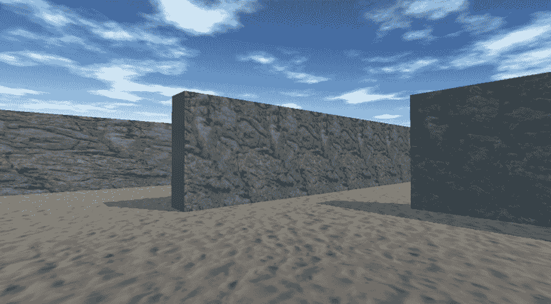
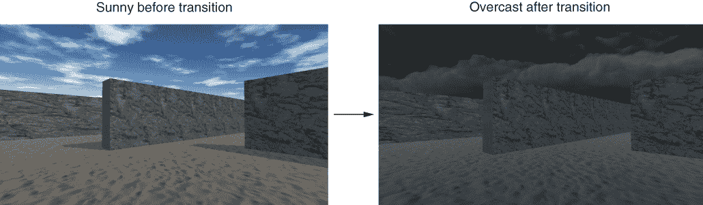
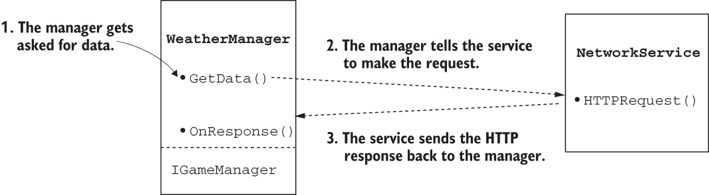
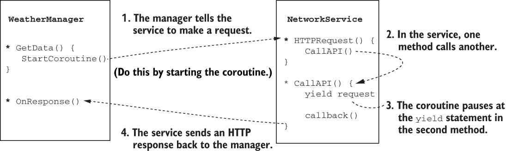
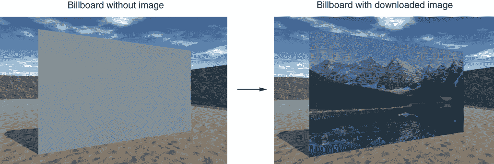
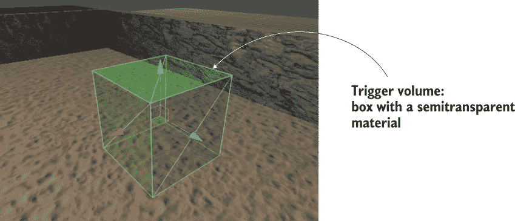

# 10 将你的游戏连接到互联网

本章涵盖了

+   为天空生成动态视觉效果

+   使用协程进行网络请求下载数据

+   解析常见的数据格式，如 XML 和 JSON

+   显示从互联网下载的图片

+   向 Web 服务器发送数据

在本章中，你将学习如何通过网络发送和接收数据。前几章中构建的项目代表了各种游戏类型，但所有这些都局限于玩家的机器上。对于所有类型的游戏来说，连接到互联网并交换数据变得越来越重要。

许多游戏几乎完全在互联网上进行，与玩家社区的持续连接；这类游戏被称为大型多人在线（MMO），最广为人知的是 MMO 角色扮演游戏（MMORPG）。即使游戏不需要这种持续的连接，现代视频游戏通常也包含将分数报告给全球高分榜或记录分析以帮助改进游戏的功能。Unity 提供了对这种网络的支持，因此我们将介绍这些功能。

Unity 支持多种网络通信方法，因为不同的方法更适合不同的需求。本章涵盖了最通用的互联网通信方式：发出 HTTP 请求。

什么是 HTTP 请求？

我假设大多数读者都知道什么是 HTTP 请求，但这里有一个快速入门，以防万一：超文本传输协议（HTTP）是一种用于向 Web 服务器发送请求并接收响应的通信协议。当你点击网页上的链接时，你的浏览器（客户端）会向特定地址发送请求，然后该服务器会响应新的页面。HTTP 请求可以设置为各种方法，特别是 GET 或 POST，以检索或发送数据。

HTTP 请求是可靠的，这也是为什么互联网的大部分内容都是围绕它们构建的。请求本身以及处理此类请求的基础设施都设计得非常健壮，能够处理网络中广泛的各种故障。

作为一种良好的比较，想象一下现代单页 Web 应用是如何工作的（与基于服务器端生成网页的老式 Web 开发相对）。在一个围绕 HTTP 请求构建的在线游戏中，Unity 中开发的项目本质上是一个厚客户端，以 Ajax 风格与服务器通信。然而，这种方法的熟悉性可能会误导经验丰富的 Web 开发者。视频游戏通常比 Web 应用有更严格的表现要求，这些差异可能会影响设计决策。

警告：Web 应用和视频游戏之间的时间尺度可能差异很大。对于更新网站来说，半秒钟可能看起来很短，但在高强度的动作游戏中，暂停哪怕是一小部分时间都可能让人难以忍受。*快*的概念绝对与情境相关。

在线游戏通常连接到专门为该游戏设计的服务器。然而，出于学习目的，我们将连接到一些免费可用的互联网数据源，包括可以下载的天气数据和图像。本章的最后部分要求你设置一个自定义的 Web 服务器；由于这个要求，该部分是可选的，尽管我会解释一种使用开源软件的简单方法来做这件事。

本章的计划是回顾 HTTP 请求的多种用途，以便你可以在 Unity 中了解它们是如何工作的：

+   设置户外场景（特别是，构建可以响应天气数据的天空）

+   编写代码从互联网请求天气数据

+   解析响应并根据数据修改场景

+   从互联网下载并显示图像

+   向你的服务器（在这种情况下，是天气状况日志）发送数据

你在本章项目中使用的实际游戏关系不大。本章中的一切都将向现有项目添加新的脚本，而不会修改任何现有代码。对于示例代码，我使用了第二章中的移动演示，主要是为了在修改后能够以第一人称视角看到天空。

本章的项目与游戏玩法没有直接关联，但显然对于你创建的大多数游戏，你希望网络与游戏玩法相关联（例如，根据服务器的响应生成敌人）。接下来是第一步！

## 10.1 创建户外场景

由于我们将下载天气数据，我们首先设置一个户外区域，在那里天气将可见。其中最棘手的部分将是天空，但首先让我们花点时间将看起来像户外的纹理应用到关卡几何形状上。

就像在第四章中一样，我从[www.textures.com](https://www.textures.com/)获取了一些图像，用于应用到关卡墙壁和地板上。记住将下载的图像的大小更改为 2 的幂，例如 256 × 256。

然后将图像导入 Unity 项目，创建材质，并将图像分配给材质（即，将一个图像拖动到材质的纹理槽中）。将材质拖放到场景中的墙壁或地板上，并在材质中增加平铺（尝试一个或两个方向上的数字，如 8 或 9），这样图像就不会以难看的方式拉伸。一旦地面和墙壁处理完毕，就轮到处理天空了。

### 10.1.1 通过使用天空盒生成天空视觉效果

首先，像第四章中那样导入天空盒图像。再次，我从[www.93i.de/](https://93i.de/)获取了天空盒图像，但这次我除了 TropicalSunnyDay（在这个项目中天空将更加复杂）之外，还得到了 DarkStormy。只需从书籍的示例项目中获取它们或从其他地方下载天空盒图像。将这些纹理导入 Unity，并（如第四章中所述）将它们的 Wrap Mode 设置为 Clamp。

现在创建一个新的材质来用于这个天空盒。在这个材质的设置顶部，点击着色器菜单以查看所有可用着色器的下拉列表。向下移动到天空盒部分，并在子菜单中选择 6-Sided。使用这个着色器后，材质现在有六个纹理槽（而不是标准着色器中只有的小 Albedo 纹理槽）。

将 SunnyDay 天空盒图像拖动到新材质的纹理槽中。图像的名称对应于分配给它们的纹理槽（顶部、前面等）。一旦所有六个纹理都链接好了，你就可以使用这个新材质作为场景的天空盒。

通过打开照明窗口（窗口 > 渲染 > 照明）来分配这个天空盒材质。切换到环境选项卡，并将你的天空盒材质分配到窗口顶部的天空盒槽中（可以拖动材质到槽中，或者点击槽旁边的圆形按钮）。点击播放，你应该能看到类似于图 10.1 的效果。



图 10.1 带有天空背景图片的场景

太好了，现在你有一个户外场景了！天空盒是一种优雅的方式来创建围绕玩家的广阔氛围的幻觉。但 Unity 内置的天空盒着色器确实有一个显著的限制：图像永远不会改变，导致天空看起来完全静止。我们将通过创建一个新的自定义着色器来解决这个问题。

### 10.1.2 通过代码设置受控的大气环境

TropicalSunnyDay 集中的图像在晴天看起来很棒，但如果我们想从晴天过渡到多云天气呢？这将需要一个包含多云天空图片的第二组天空图像，因此我们需要一个新的天空盒着色器。

正如第四章所述，着色器是一个包含如何渲染图像的指令的简短程序。这意味着你可以编写新的着色器，实际上也是如此。我们将创建一个新的着色器，它接受两组天空盒图像并在它们之间进行转换。为此目的从[`github.com/jhocking/from-unity-wiki/blob/main/SkyboxBlended.shader`](https://github.com/jhocking/from-unity-wiki/blob/main/SkyboxBlended.shader)获取着色器。

在 Unity 中创建一个新的着色器脚本：就像创建一个新的 C#脚本一样，但选择标准表面着色器。将资产命名为 SkyboxBlended，然后双击着色器以打开脚本。从该网页复制代码并将其粘贴到着色器脚本中。顶行是 Shader "Skybox/Blended"，这告诉 Unity 将新的着色器添加到 Skybox 类别下的着色器列表中（与常规天空盒相同的类别）。

注意：我们现在不会详细讲解着色器程序的所有细节。着色器编程是一个相当高级的计算机图形学话题，因此超出了本书的范围。您可以在阅读完本书后查找相关信息；如果是这样，可以从 Unity 手册开始，网址为[`mng.bz/wQzQ`](http://mng.bz/wQzQ)。

现在您可以设置材质为 Skybox Blended 着色器。再次，选择材质，然后在材质设置的最顶部查找着色器菜单。现在有 12 个纹理槽位，分为两组，每组六张图像。与前一样，将 TropicalSunnyDay 图像分配给前六个纹理；对于剩余的纹理，使用 DarkStormy 天空盒图像集。

这个新的着色器还在设置的最顶部添加了一个混合滑块。混合值控制您想要显示每套天空盒图像的多少；当您调整滑块从一侧到另一侧时，天空盒会从晴朗过渡到多云。您可以通过调整滑块并玩游戏来测试，但在游戏运行时手动调整天空并不十分有帮助，所以让我们编写代码来过渡天空。

在场景中创建一个空对象并命名为 Controller。创建一个新的脚本并命名为 WeatherController。将此脚本拖放到空对象上，然后在脚本中编写以下代码。

列表 10.1 WeatherController 脚本从晴朗过渡到多云

```
using System.Collections;
using System.Collections.Generic;
using UnityEngine;

public class WeatherController : MonoBehaviour {
   [SerializeField] Material sky;                  ❶
   [SerializeField] Light sun;

   private float fullIntensity;

   private float cloudValue = 0f;

   void Start() {
      fullIntensity = sun.intensity;               ❷
   }

   void Update() {
      SetOvercast(cloudValue);
      cloudValue += .005f;                         ❸
   }

   private void SetOvercast(float value) {         ❹
      sky.SetFloat("_Blend", value);
      sun.intensity = fullIntensity - (fullIntensity * value);
   }
}
```

❶ 在项目视图中参考材质，而不仅仅是场景中的对象。

❷ 灯光的初始强度被认为是“全强度”。

❸ 每帧增加值以实现连续过渡。

❹ 调整材质的混合值和灯光的强度。

我会在代码中指出来几个要点，但关键的新方法是 SetFloat()，它几乎出现在底部。到那时为止的所有内容都应该相当熟悉，但那一个是新的。该方法在材质上设置一个数值。该方法的第一参数定义了具体是哪个值。在这种情况下，材质有一个名为 _Blend（注意代码中的材质属性以下划线开头）的属性。

至于其余的代码，我们定义了一些变量，包括材质和灯光。对于材质，您想要引用我们刚刚创建的混合天空盒材质，但灯光呢？这是为了让场景在从晴朗变为多云时也会变暗；随着混合值的增加，我们将降低灯光。场景中的方向光作为主光，为各个地方提供照明。将材质和灯光拖放到检查器中的变量上。

备注：Unity 的高级照明系统会考虑天空盒以实现逼真的效果。但这种方法与不断变化的天空盒不兼容，因此你可能想要冻结照明设置。在照明窗口中，你可以关闭底部的自动生成复选框；然后设置将仅在点击按钮时更新。将天空盒的混合设置为中间以获得平均外观，然后点击生成按钮（位于自动复选框旁边）以手动烘焙光照贴图（光照信息已保存到一个以场景命名的新文件夹中）。

当脚本开始运行时，它会初始化光线的强度。脚本将存储起始值，并将其视为全强度。这个全强度将在脚本中稍后用于调暗光线。

然后代码在每一帧增加一个值，并使用该值来调整天空。具体来说，它每帧调用一次 SetOvercast()，该函数封装了对场景进行的多次调整。我已经解释了 SetFloat() 的作用，所以我们将不再重复，最后一行调整了光线的强度。

现在播放场景以观看代码的运行。你会看到图 10.2 中的描述：在几秒钟内，你会看到场景从晴朗的一天过渡到黑暗和多云。



图 10.2：场景从晴朗到多云的过渡前后对比

警告：Unity 的一个意想不到的怪癖是，材质上的混合变化是永久的。当游戏停止运行时，Unity 会重置场景中的对象，但直接从项目视图链接的资产（如天空盒材质）会永久更改。这仅在 Unity 的编辑器内发生（更改不会在游戏部署到编辑器外后传递），因此如果你忘记这一点，可能会导致令人沮丧的错误。

观看场景从晴朗变为多云的过渡非常酷。但这只是为实际目标所做的设置：让游戏中的天气与真实世界的天气条件同步。为此，我们需要开始从互联网下载天气数据。

## 10.2 从互联网服务下载天气数据

现在我们已经设置了户外场景，我们可以编写代码来下载天气数据并根据这些数据修改场景。这个任务将很好地展示如何通过使用 HTTP 请求来检索数据。许多网络服务提供天气数据；一个详尽的列表发布在 ProgrammableWeb ([www.programmableweb.com](https://www.programmableweb.com))。我选择了 OpenWeather；代码示例使用了其 API（应用程序编程接口，一种使用代码命令而不是图形界面来访问其服务的方式），API 位于 [`openweathermap.org/api`](http://openweathermap.org/api)。

定义：*网络服务*，或*网络 API*，是指连接到互联网并在请求时返回数据的服务器。网络 API 和网站之间没有技术上的区别；网站是一个返回网页数据的网络服务，浏览器将 HTML 数据解释为可见文档。

注意：网络服务通常需要您注册，即使是免费服务。例如，如果您访问 OpenWeather 的 API 页面，它有获取 API 密钥的说明，这是一个您将粘贴到请求中的值。

您将要编写的代码将围绕第九章中相同的 Managers 架构。这次，您将有一个从管理者的中心管理者初始化的 WeatherManager 类。WeatherManager 将负责检索和存储天气数据，但要做到这一点，它需要能够与互联网通信。

为了实现这一点，您将创建一个名为 NetworkService 的实用程序类来处理连接到互联网和制作 HTTP 请求的细节。然后，WeatherManager 可以告诉 NetworkService 进行这些请求并返回响应。图 10.3 显示了这种代码结构将如何运行。



图 10.3 网络代码的结构

为了实现这一点，显然 WeatherManager 将需要访问 NetworkService 对象。您将通过在 Managers 中创建对象并在初始化时将 NetworkService 对象注入到各个管理者来解决此问题。这样，不仅 WeatherManager 将拥有对 NetworkService 的引用，您以后创建的任何其他管理者也将拥有。

要从第九章开始引入 Managers 的代码架构，首先复制 ManagerStatus 和 IGameManager（记住 IGameManager 是所有管理者必须实现的接口，而 ManagerStatus 是 IGameManager 使用的枚举）。您需要稍微修改 IGameManager 以适应新的 NetworkService 类，因此创建一个新的脚本名为 NetworkService（删除 :MonoBehaviour 并暂时将其留空；您稍后会填写它）然后调整 IGameManager。

列表 10.2 调整 IGameManager 以包含 NetworkService

```
public interface IGameManager {
   ManagerStatus status {get;}

   void Startup(NetworkService service);     ❶
}
```

❶ 启动函数现在接受一个参数：注入的对象。

接下来，让我们创建 WeatherManager 来实现这个稍微调整过的接口。创建一个新的 C# 脚本。

列表 10.3 WeatherManager 的初始脚本

```
using System.Collections;
using System.Collections.Generic;
using UnityEngine;

public class WeatherManager : MonoBehaviour, IGameManager {
   public ManagerStatus status {get; private set;}

   // Add cloud value here (listing 10.8)
   private NetworkService network;

   public void Startup(NetworkService service) {
      Debug.Log("Weather manager starting...");

      network = service;       ❶

      status = ManagerStatus.Started;
   }
}
```

❶ 存储注入的 NetworkService 对象。

这个 WeatherManager 的初始版本实际上并没有做任何事情。目前，该类实现了 IGameManager 所需的最小量：从接口声明状态属性并实现 Startup() 函数。您将在接下来的几节中填充这个空框架。最后，复制第九章的 Managers 并调整它以启动 WeatherManager。

列表 10.4 调整后的 Managers 以初始化 WeatherManager

```
using System.Collections;
using System.Collections.Generic;
using UnityEngine;

[RequireComponent(typeof(WeatherManager))]                  ❶

public class Managers : MonoBehaviour {
   public static WeatherManager Weather {get; private set;}

   private List<IGameManager> startSequence;

   void Awake() {
      Weather = GetComponent<WeatherManager>();

      startSequence = new List<IGameManager>();
      startSequence.Add(Weather);

      StartCoroutine(StartupManagers());
   }

   private IEnumerator StartupManagers() {
      NetworkService network = new NetworkService();        ❷

      foreach (IGameManager manager in startSequence) {
         manager.Startup(network);                          ❸
      }

      yield return null;

      int numModules = startSequence.Count;
      int numReady = 0;

      while (numReady < numModules) {
         int lastReady = numReady;
         numReady = 0;

         foreach (IGameManager manager in startSequence) {
            if (manager.status == ManagerStatus.Started) {
               numReady++;
            }
         }

         if (numReady > lastReady)
            Debug.Log($"Progress: {numReady}/{numModules}");

         yield return null;
      }

      Debug.Log("All managers started up");
   }
}
```

❶ 需要新的管理者而不是玩家和库存。

❷ 实例化 NetworkService 以注入所有管理器。

❸ 在启动时将网络服务传递给管理器。

这就是 Manager 代码架构所需的所有代码。正如你在前面的章节中所做的那样，在场景中创建游戏管理器对象，然后将 Manager 和 WeatherManager 附加到空对象上。即使管理器目前还没有做任何事情，你可以在设置正确时在控制台中看到启动消息。

哇，我们有很多样板代码要处理！现在我们可以继续编写网络代码。

### 10.2.1 使用协程请求 HTTP 数据

NetworkService 目前是一个空脚本，所以你可以在其中编写代码来制作 HTTP 请求。你需要了解的主要类是 UnityWebRequest。Unity 提供了 UnityWebRequest 类来与互联网通信。使用 URL 实例化请求对象将向该 URL 发送请求。

协程可以与 UnityWebRequest 类一起工作，等待请求完成。协程在第三章中介绍，我们使用它们来暂停代码一段时间。回想一下那里的解释：协程是似乎在程序后台运行的特殊函数，在运行部分并返回到程序其余部分的循环中。当与 StartCoroutine()方法一起使用时，yield 关键字使协程暂时暂停，将程序流程交回，并在下一帧从该点继续。

在第三章中，WaitForSeconds()协程产生的 yield，这是一个使函数暂停特定秒数的对象。在发送请求时产生协程将暂停函数，直到网络请求完成。这里的程序流程类似于在 Web 应用程序中制作异步 Ajax 调用：首先发送请求，然后继续执行程序的其余部分，过一段时间后收到响应。

那是理论部分；现在让我们编写代码

好的，让我们在我们的代码中实现这些功能。首先打开 NetworkService 脚本，并将默认模板替换为这个列表的内容。

列表 10.5 在 NetworkService 中制作 HTTP 请求

```
using System;
using System.Collections;
using System.Collections.Generic;
using UnityEngine;
using UnityEngine.Networking;

public class NetworkService {
   private const string xmlApi =                                             ❶
"http://api.openweathermap.org/data/2.5/weather?q=Chicago,
➥ us&mode=xml&appid=APIKEY";

   private IEnumerator CallAPI(string url, Action<string> callback) {
      using (UnityWebRequest request = UnityWebRequest.Get(url)) {           ❷

         yield return request.SendWebRequest();                              ❸

         if (request.result == UnityWebRequest.Result.ConnectionError) {     ❹
            Debug.LogError($"network problem: {request.error}");             ❹
         } else if (request.result == UnityWebRequest.Result.ProtocolError) {❹
            Debug.LogError($"response error: {request.responseCode}");
         } else {
            callback(request.downloadHandler.text);                          ❺
         }
      }
   }

   public IEnumerator GetWeatherXML(Action<string> callback) {
      return CallAPI(xmlApi, callback);                                      ❻
   }
}
```

❶ 发送请求的 URL

❷ 在 GET 模式下创建 UnityWebRequest 对象。

❸ 下载时暂停。

❹ 检查响应中的错误。

❺ 可以像原始函数一样调用委托。

❻ 通过相互调用的协程方法产生级联。

警告：Action 类型（在“理解回调如何工作”中解释）包含在 System 命名空间中；注意脚本顶部的附加 using 语句。不要忘记这个细节！

记住之前解释的代码设计：WeatherManager 将告诉 NetworkService 去获取数据。所有这些代码实际上还没有运行；你正在设置稍后将被 WeatherManager 调用的代码。为了探索这个代码列表，让我们从底部开始，逐步向上。

编写相互级联的协程方法

GetWeatherXML() 是一个协程方法，外部代码可以使用它来告诉 NetworkService 发起一个 HTTP 请求。请注意，这个函数的返回类型是 IEnumerator；在协程中使用的函数必须声明为 IEnumerator 类型。

起初，GetWeatherXML() 没有使用 yield 语句可能看起来有些奇怪。协程通过 yield 语句暂停，这意味着每个协程必须在某个地方产生。结果是，yield 可以通过多个方法级联。如果初始的协程方法本身调用了另一个方法，并且那个方法在中间部分产生了，那么协程将在那个第二个方法内部暂停，并在那里恢复。因此，CallAPI() 中的 yield 语句暂停了在 GetWeatherXML() 中启动的协程；图 10.4 展示了这段代码的流程。



图 10.4 网络协程的工作方式

下一个可能让人头疼的是 Action 类型的回调参数。

理解回调的工作原理

当协程启动时，方法会带有一个名为 callback 的参数被调用，并且 callback 是 Action 类型。但什么是 Action？

**定义** Action 类型是一个委托（C# 有几种处理委托的方法，但这种方法是最简单的）。委托是对其他方法/函数的引用。它们允许你将函数（或者更确切地说，函数的指针）存储在变量中，并将该函数作为参数传递给另一个函数。

如果你不太熟悉委托的概念，请意识到它们允许你传递函数，就像传递数字和字符串一样。没有委托，你不能传递函数以供稍后调用——你只能立即直接调用函数。有了委托，你可以告诉代码稍后要调用的其他方法。这对于许多用途都很有用，特别是实现回调函数。

**定义** *回调* 是一个用于向调用对象返回信息的函数。对象 A 可以告诉对象 B 关于 A 中的一个方法。B 可以稍后调用 A 的方法以将信息返回给 A。

例如，在这种情况下，回调用于在等待 HTTP 请求完成后将响应数据返回。在 CallAPI() 中，代码首先发起一个 HTTP 请求，然后等待直到请求完成，最后使用 callback() 发送响应。

注意 Action 关键字使用的 <> 语法；尖括号中写出的类型声明了符合此 Action 所需的参数。换句话说，这个 Action 所指向的函数必须接受与声明类型匹配的参数。在这种情况下，参数是一个字符串，因此回调方法必须具有如下签名：

```
MethodName(string value)
```

在看到实际操作之后，回调的概念可能更容易理解，你将在列表 10.6 中看到它；这个初始解释是为了让你在看到额外的代码时能识别出正在发生的事情。

列表 10.5 的其余部分相当直接。请求对象在 using 语句内部创建，以便在完成该对象后清理对象的内存。条件检查 HTTP 响应中的错误。有两种类型的错误：请求可能因为网络连接不良而失败，或者返回的响应可能包含错误代码。声明了一个具有请求 URL 的 const 值。（顺便说一句，你应该在末尾替换 APIKEY 为你的 OpenWeather API 密钥。）

利用网络代码

这就完成了 NetworkService 中的代码。现在让我们在 WeatherManager 中使用 NetworkService。

列表 10.6 调整 WeatherManager 以使用 NetworkService

```
...
public void Startup(NetworkService service) {
   Debug.Log("Weather manager starting...");

   network = service;
   StartCoroutine(network.GetWeatherXML(OnXMLDataLoaded));  ❶

   status = ManagerStatus.Initializing;                     ❷
}

public void OnXMLDataLoaded(string data) {                  ❸
   Debug.Log(data);

   status = ManagerStatus.Started;
}
...
```

❶ 开始从互联网加载数据。

❷ 将状态从“Started”改为“Initializing”。

❸ 数据加载后的回调方法

在这个管理器中对代码进行了三项主要更改：启动一个协程从互联网下载数据，设置不同的启动状态，并定义一个回调方法以接收响应。

启动协程很简单。协程背后的大多数复杂性都由 NetworkService 处理，所以在这里你只需要调用 StartCoroutine()即可。然后你设置一个不同的启动状态，因为管理器还没有完成初始化；在启动完成之前，它需要从互联网接收数据。

警告：始终使用 StartCoroutine()启动网络方法；不要正常调用函数。这很容易忘记，因为在外部协程中创建请求对象不会生成任何编译器错误。

当你调用 StartCoroutine()方法时，你需要调用作为参数使用的方法。也就是说，实际上输入括号—()—，而不仅仅是函数名。在这种情况下，协程方法需要一个回调函数作为其一个参数，所以让我们定义这个函数。我们将使用 OnXMLDataLoaded()作为回调；注意，这个方法有一个字符串参数，这与 NetworkService 中的 Action<string>声明相匹配。回调函数目前并不做很多事情；调试行只是将接收到的数据打印到控制台以验证数据是否正确接收。然后函数的最后一行将管理器的启动状态改为表示它已经完全启动。

点击播放以运行代码。假设你有稳定的互联网连接，你应该会在控制台看到一些数据出现。这些数据只是一个长字符串，但字符串是以一种我们可以利用的特定方式格式化的。

### 10.2.2 解析 XML

存在为长字符串的数据通常包含在字符串中嵌入的信息片段。你通过解析字符串来提取这些信息片段。

定义 *解析* 意味着分析一块数据并将其划分为单独的信息部分。

为了解析字符串，它需要以允许你（或者更确切地说，解析器代码）识别单独部分的方式格式化。在互联网上传输数据时，常用几种标准格式；最常见的一种标准格式是 *XML*。

定义 *XML* 代表 *可扩展标记语言*。它是一套用于以结构化方式编码文档的规则，类似于 HTML 网页。

幸运的是，Unity（或者更确切地说，Unity 中内置的代码框架 Mono）提供了解析 XML 的功能。我们请求的天气数据格式为 XML，因此我们将在 WeatherManager 中添加代码来解析响应并提取云量。将 URL 输入到网页浏览器中查看响应数据；那里有很多内容，但我们只对包含类似<clouds value="40" name="scattered clouds"/>的节点感兴趣。

除了添加解析 XML 的代码外，我们还将使用第七章中使用的相同信使系统。这是因为一旦下载并解析了天气数据，我们仍然需要通知场景。创建一个名为 Messenger 的脚本，并将[`github.com/jhocking/from-unity-wiki/blob/main/Messenger.cs`](https://github.com/jhocking/from-unity-wiki/blob/main/Messenger.cs)中的代码粘贴进去。

然后你需要创建一个名为 GameEvent 的脚本。如第七章所述，这个信使系统非常适合以解耦的方式将事件传达给程序的其余部分。

列表 10.7 GameEvent 代码

```
public static class GameEvent {
   public const string WEATHER_UPDATED = "WEATHER_UPDATED";
}
```

一旦信使系统就位，调整 WeatherManager。

列表 10.8 在 WeatherManager 中解析 XML

```
using System;
using System.Xml;                                      ❶
...
public float cloudValue {get; private set;}            ❷
...
public void OnXMLDataLoaded(string data) {
   XmlDocument doc = new XmlDocument();
   doc.LoadXml(data);                                  ❸
   XmlNode root = doc.DocumentElement;

   XmlNode node = root.SelectSingleNode("clouds");     ❹
   string value = node.Attributes["value"].Value;
   cloudValue = Convert.ToInt32(value) / 100f;         ❺
   Debug.Log($"Value: {cloudValue}");

   Messenger.Broadcast(GameEvent.WEATHER_UPDATED);     ❻

   status = ManagerStatus.Started;
}
...
```

❶ 确保添加所需的 using 语句。

❷ 云量在内部修改，但在其他地方只读。

❸ 将 XML 解析为可搜索的结构。

❹ 从数据中提取单个节点。

❺ 将值转换为 0-1 浮点数。

❻ 向其他脚本广播消息。

你可以看到，最重要的更改是在 OnXMLDataLoaded()内部进行的。之前，该方法只是将数据记录到控制台以验证数据是否正确通过。这个列表添加了大量代码来解析 XML。

首先创建一个新的空 XML 文档；这是一个空容器，你可以用解析的 XML 结构填充它。下一行将数据字符串解析为 XML 文档包含的结构。然后我们从 XML 树的根开始，以便在后续代码中一切都可以向上搜索树。

在这一点上，你可以在 XML 结构中搜索节点以提取个别信息。在这种情况下，<clouds> 是我们唯一感兴趣的节点。在 XML 文档中找到该节点，然后从该节点中提取值属性。这些数据定义了云值为 0-100 的整数，但我们需要它作为 0-1 的浮点数，以便稍后调整场景。将此转换为代码中添加的简单数学运算。

最后，在从完整数据中提取出云量值之后，广播一条消息，表明天气数据已更新。目前，没有任何东西在监听这条消息，但广播者不需要了解任何关于监听者的信息（实际上，这就是解耦消息系统的全部意义）。稍后，我们将向场景中添加一个监听器。

太好了——我们已经编写了解析 XML 数据的代码！但在我们将此值应用于可见场景之前，我想介绍一下另一种数据传输的选项。

### 10.2.3 解析 JSON

在继续进行项目中的下一步之前，让我们探索一种用于传输数据的替代格式。XML 是互联网上传输数据的一种常见格式；另一种常见的是 *JSON*。

**定义** *JSON* 代表 *JavaScript 对象表示法*。与 XML 的目的相似，JSON 被设计成一种轻量级的替代方案。尽管 JSON 的语法最初来源于 JavaScript，但该格式并非特定于任何一种语言，并且可以轻松地与各种编程语言一起使用。

与 XML 不同，Mono 并未附带该格式的解析器。幸运的是，有大量的优秀 JSON 解析器可供选择。Unity 本身提供了一个 JsonUtility 类，而外部开发的选项包括 Newtonsoft 的 Json.NET。我通常在我的游戏中使用 Json.NET，因为 Newtonsoft 的库在 Unity 之外的全 .NET 生态系统中被广泛使用。它可以使用 Unity 的新包管理器系统安装，这也是它在示例项目中安装的方式。

**警告** Json.NET 实际上已经被 Unity 打包多次，本书使用的是 jilleJr 的包。然而，最近 Unity 将 Json.NET 打包为 com.unity.nuget.newtonsoft-json，并将其用作其他包的依赖项。因此，如果您安装了那些其他包之一（例如版本控制），那么您项目中已经包含了 Json.NET，再次尝试安装 Json.NET 将会导致错误。最简单的方法是在项目视图中展开（位于 Assets 下方）的 Packages 文件夹，并查找 Newtonsoft Json。

在 [`mng.bz/7l4y`](https://shortener.manning.com/7l4y) 的 GitHub 页面上有多个部分介绍如何安装，其中“通过纯 UPM 安装”解释了我们需要的步骤。正如在第一章中提到的，Unity 包管理器（UPM）与 Unity 自身制作的包一起使用最为简便。然而，UPM 正在越来越多地被外部包作者支持；例如，在第四章中提到的 glTF 包就是以这种方式安装的。虽然由 Unity 制作的包列在包管理器窗口中，并可以从那里选择，但外部创建的包需要通过调整清单文本文件来安装。

如 GitHub 页面所述，导航到您计算机上的 Unity 项目文件夹，打开其中的 Packages 文件夹，然后以任何文本编辑器打开 manifest.json。GitHub 上的安装文档列出了要粘贴到包清单中的所有文本，所以这样做。安装包始终涉及在依赖项块中添加条目；此外，一些包（例如，这个 JSON 库）还将具有作用域注册表供您添加。返回 Unity，新包的下载将需要一段时间。

现在，您可以使用这个库来解析 JSON 数据。我们一直从 OpenWeather API 获取 XML 数据，但正如所发生的那样，OpenWeather 还可以以 JSON 格式发送相同的数据。为此，修改 NetworkService 以请求 JSON。

列表 10.9 将 NetworkService 请求从 XML 更改为 JSON

```
...
private const string jsonApi =       ❶
"http://api.openweathermap.org/data/2.5/weather?q=Chicago,us&appid=APIKEY";
...
public IEnumerator GetWeatherJSON(Action<string> callback) {
    return CallAPI(jsonApi, callback);
}
...
```

❶ 这次 URL 略有不同。

这基本上与下载 XML 数据的代码相同，只是 URL 略有不同。此请求返回的数据具有相同的值，但格式不同。这次我们正在寻找一个类似"clouds":{"all":40}的块。

这次不需要太多额外的代码。那是因为我们为请求设置了代码，将其分解为单独的函数，所以每个后续的 HTTP 请求都很容易添加。太棒了！现在让我们修改 WeatherManager 以请求 JSON 数据而不是 XML。

列表 10.10 修改 WeatherManager 以请求 JSON

```
...
using Newtonsoft.Json.Linq;                                   ❶
...
public void Startup(NetworkService service) {
   Debug.Log("Weather manager starting...");

   network = service;
   StartCoroutine(network.GetWeatherJSON(OnJSONDataLoaded));  ❷

   status = ManagerStatus.Initializing;
}
...
public void OnJSONDataLoaded(string data) {
   JObject root = JObject.Parse(data);                        ❸

   JToken clouds = root["clouds"];                            ❹
   cloudValue = (float)clouds["all"] / 100f;                  ❹
   Debug.Log($"Value: {cloudValue}");                         ❹

   Messenger.Broadcast(GameEvent.WEATHER_UPDATED);            ❹

   status = ManagerStatus.Started;
}
...
```

❶ 一定要添加所需的 using 语句。

❷ 网络请求已更改

❸ 而不是 XML 容器，解析为 JSON 对象。

❹ 语法已更改，但此代码仍在执行相同的事情。

如您所见，处理 JSON 的代码与处理 XML 的代码类似。唯一的真正区别是数据被解析为 JSON 对象而不是 XML 文档容器。

注意 Json.NET 提供了多种解析数据的方法，这里使用的替代方法被称为 *JSON Linq*。这种替代方法不需要太多的设置，这对于像这样的小示例来说很方便。然而，主要方法需要首先创建一个新的类，其字段与 JSON 数据的结构相对应。然后使用命令 JsonConvert.DeserializeObject 通过填充这个类来使用数据。

定义 *反序列化* 几乎与 *解析* 具有相同的意思，只是暗示从数据中创建了一个代码对象。这是 *序列化* 的逆过程，意味着将代码对象编码成可以传输和存储的形式，例如 JSON 字符串。

除了不同的语法外，所有步骤都是相同的。从数据块中提取值（由于某种原因，这个值一直被称为 all，但这只是 API 的一个怪癖），进行一些简单的数学运算将值转换为 0-1 浮点数，并广播一个更新消息。完成这些后，就是将值应用到可见场景中的时候了。

### 10.2.4 基于天气数据影响场景

无论数据格式如何，一旦从响应数据中提取出云量值，我们就可以在 WeatherController 的 SetOvercast()方法中使用该值。无论是 XML 还是 JSON，数据字符串最终都会解析成一系列单词和数字。SetOvercast()方法接受一个数字作为参数。在第 9.1.2 节中，我们使用了每帧递增的数字，但我们可以同样容易地使用天气 API 返回的数字。以下是修改后的完整 WeatherController 脚本。

列表 10.11 响应下载天气数据的 WeatherController

```
using System.Collections;
using System.Collections.Generic;
using UnityEngine;

public class WeatherController : MonoBehaviour {
   [SerializeField] Material sky;
   [SerializeField] Light sun;

   private float fullIntensity;

   void OnEnable() {                                                      ❶
      Messenger.AddListener(GameEvent.WEATHER_UPDATED, OnWeatherUpdated);
   }
   void OnDisable() {
      Messenger.RemoveListener(GameEvent.WEATHER_UPDATED, OnWeatherUpdated);
   }

   void Start() {
      fullIntensity = sun.intensity;
   }

   private void OnWeatherUpdated() {
      SetOvercast(Managers.Weather.cloudValue);                           ❷
   }

   private void SetOvercast(float value) {
      sky.SetFloat("_Blend", value);
      sun.intensity = fullIntensity - (fullIntensity * value);
   }
}
```

❶ 添加/移除事件监听器。

❷ 使用 WeatherManager 中的云量值。

注意，这些变化不仅仅是添加；一些测试代码被移除了。具体来说，我们移除了每帧递增的本地云量值；我们不再需要它，因为我们将从 WeatherManager 使用值。

在 OnEnable()/OnDisable()中添加和移除监听器（这些是当对象开启或关闭时 MonoBehaviour 调用的函数）。这个监听器是广播消息系统的一部分，当接收到该消息时调用 OnWeatherUpdated()。OnWeatherUpdated()从 WeatherManager 获取云量值，并使用该值调用 SetOvercast()。这样，场景的外观就由下载的天气数据控制。

现在运行场景，你会看到天空根据天气数据中的云量进行更新。你可能看到请求天气信息需要花费一些时间；在实际游戏中，你可能希望在天空更新之前，将场景隐藏在加载屏幕后面。

超越 HTTP 的游戏网络

HTTP 请求是健壮和可靠的，但请求和接收响应之间的延迟对于许多游戏来说太慢了。因此，HTTP 请求是向服务器发送相对较慢的消息（如回合制游戏中的移动或任何游戏的得分提交）的好方法，但像多人 FPS 这样的东西需要不同的网络方法。

这些方法涉及各种通信技术，以及补偿延迟的技术。Unity 为多人游戏提供了一个 API，称为 MLAPI，但其他选项还包括 Mirror 或 Photon。

网络动作游戏的尖端技术是一个复杂的话题，超出了本书的范围。你可以自己查找更多信息，从 Unity 多人网络网站开始（[`docs-multiplayer.unity3d.com/`](https://docs-multiplayer.unity3d.com/))。

现在你已经知道如何从互联网获取数值和字符串数据，让我们用图像来做同样的事情。

## 10.3 添加网络广告牌

虽然来自 Web API 的响应几乎总是以 XML 或 JSON 格式化的文本字符串，但互联网上传输的其他类型的数据也很多。除了文本数据外，最常见的数据请求类型是图像。UnityWebRequest 对象也可以用来下载图像。

你将通过创建一个显示从互联网下载的图像的广告牌来学习这个任务。你需要编写两个步骤：下载要显示的图像并将该图像应用于广告牌对象。作为第三个步骤，你将改进代码，以便图像可以存储以用于多个广告牌。

### 10.3.1 从互联网加载图像

首先，让我们编写下载图像的代码。你将下载一些公共领域的风景摄影（见图 10.5）进行测试。下载的图像在广告牌上尚不可见；我将在下一节中展示一个显示图像的脚本，但在那之前，让我们先放置检索图像的代码。


图 10.5 加拿大班夫国家公园的 Moraine 湖图像

下载图像的代码架构与下载数据的架构非常相似。一个新的管理模块（称为 ImagesManager）将负责要显示的下载图像。再次强调，连接到互联网和发送 HTTP 请求的细节将由 NetworkService 处理，而 ImagesManager 将调用 NetworkService 为其下载图像。

代码的第一个新增部分是在 NetworkService 中。此列表将图像下载添加到该脚本中。

列表 10.12 在 NetworkService 中下载图像

```
...
private const string webImage =                                           ❶
"http://upload.wikimedia.org/wikipedia/commons/c/c5/Moraine_Lake_17092005.jpg";
...
public IEnumerator DownloadImage(Action<Texture2D> callback) {            ❷
    UnityWebRequest request = UnityWebRequestTexture.GetTexture(webImage);
    yield return request.SendWebRequest();
    callback(DownloadHandlerTexture.GetContent(request));                 ❸
}
...
```

❶ 将此 const 放置在顶部附近，与其他 URL 一起。

❷ 此回调接收一个 Texture2D 而不是字符串。

❸ 使用 DownloadHandler 实用程序检索下载的图像。

下载图像的代码几乎与下载数据的代码相同。主要区别在于回调方法的类型；注意这次回调接收一个 Texture2D 而不是字符串。这是因为你正在发送相关的响应：你之前下载的是数据字符串——现在你正在下载图像。此列表包含 ImagesManager 的新代码。创建一个新的脚本并输入此代码。

列表 10.13 创建 ImagesManager 以检索和存储图像

```
using System;
using System.Collections;
using System.Collections.Generic;
using UnityEngine;

public class ImagesManager : MonoBehaviour, IGameManager {
   public ManagerStatus status {get; private set;}

   private NetworkService network;

   private Texture2D webImage;                           ❶

   public void Startup(NetworkService service) {
      Debug.Log("Images manager starting...");

      network = service;

      status = ManagerStatus.Started;
   }

   public void GetWebImage(Action<Texture2D> callback) {
      if (webImage == null) {                            ❷
         StartCoroutine(network.DownloadImage(callback));
      }
      else {
         callback(webImage);                             ❸
      }
   }
}
```

❶ 存储下载图像的变量

❷ 检查图像是否已存储。

❸ 如果有已存储的图像，立即调用回调（不下载）。

这段代码中最有趣的部分是 GetWebImage()；此脚本中的其他所有内容都由实现管理接口的标准属性和方法组成。当调用 GetWebImage()时，它将通过回调函数返回网络图像。首先，它会检查 webImage 是否已经存储了图像。如果没有，它将调用网络调用以下载图像。如果 webImage 已经存储了图像，GetWebImage()将发送回存储的图像（而不是重新下载图像）。

注意：目前，下载的图像从未被存储，这意味着 webImage 始终为空。当 webImage 为*非空*时指定要执行的操作的代码已经就绪，因此你将在以下部分调整代码以存储该图像。这个调整在一个单独的部分中，因为它涉及一些复杂的代码技巧。

当然，就像所有管理模块一样，ImagesManager 需要添加到 Managers 中，以下列表详细说明了添加的内容。

列表 10.14 将新管理器添加到 Managers

```
...
[RequireComponent(typeof(ImagesManager))]
...
public static ImagesManager Images {get; private set;}
...
void Awake() {
   Weather = GetComponent<WeatherManager>();
   Images = GetComponent<ImagesManager>();

   startSequence = new List<IGameManager>();
   startSequence.Add(Weather);
   startSequence.Add(Images);

   StartCoroutine(StartupManagers());
}
...
```

与我们设置 WeatherManager 的方式不同，ImagesManager 中的 GetWebImage()在启动时不会自动调用。相反，代码会等待被调用；这将在下一节中发生。

### 10.3.2 在广告牌上显示图像

你刚刚编写的 ImagesManager 在未被调用之前不会做任何事情，因此现在我们将创建一个广告牌对象，该对象将调用 ImagesManager 中的方法。首先创建一个新的立方体，然后将其放置在场景中间，大约在位置 0, 1.5, -5 和缩放 5, 3, 0.5（见图 10.6）。



图 10.6 显示下载图像前后的广告牌对象

你将创建一个操作方式与第九章中提到的颜色变化监视器类似的设备。复制 DeviceOperator 脚本并将其放在玩家上。你可能还记得，当按下 C 键时，该脚本将操作附近的设备。同时创建一个名为 WebLoadingBillboard 的广告牌设备脚本，将其放在广告牌对象上，并输入以下代码。

列表 10.15 WebLoadingBillboard 设备脚本

```
using System.Collections;
using System.Collections.Generic;
using UnityEngine;

public class WebLoadingBillboard : MonoBehaviour {
   public void Operate() {
      Managers.Images.GetWebImage(OnWebImage);                ❶
   }

   private void OnWebImage(Texture2D image) {
      GetComponent<Renderer>().material.mainTexture = image;  ❷
   }
}
```

❶ 调用 ImagesManager 中的方法。

❷ 将下载的图像应用到回调中的材质。

这段代码主要做两件事：当设备被操作时，它会调用 ImagesManager.GetWebImage()，并将回调函数中的图像应用到材质上。纹理应用于材质，因此你可以更改广告牌上材质的纹理。图 10.6 显示了游戏运行后广告牌的外观。

AssetBundles：如何下载其他类型的资产

使用 UnityWebRequest 下载图像相对简单，但其他类型的资产，如网格对象和预制件呢？UnityWebRequest 有文本和图像的属性，但其他资产要复杂一些。

Unity 可以通过一种称为 AssetBundles 的机制下载任何类型的资产。简而言之，你首先将资产打包成一个包，然后 Unity 在下载包后可以提取资产。创建和下载 AssetBundles 的详细内容超出了本书的范围；如果你想了解更多，请从阅读 Unity 手册开始，网址为[`mng.bz/m1X2`](http://mng.bz/m1X2)和[`mng.bz/5Zn1`](http://mng.bz/5Zn1)。

太好了，下载的图像已经显示在广告牌上了！但这段代码还可以进一步优化以支持多个广告牌。让我们接下来解决这个优化问题。

### 10.3.3 为重用缓存下载的图像

如第 10.3.1 节所述，ImagesManager 还未存储下载的图像。这意味着图像将多次为多个广告牌重新下载。这是低效的，因为每次都是相同的图像。为了解决这个问题，我们将调整 ImagesManager 以缓存已下载的图像。

定义 *缓存* 意味着在本地存储。最常见（但不仅限于此！）的上下文涉及从互联网下载的文件，例如图像。

关键在于在 ImagesManager 中提供一个回调函数，首先保存图像，然后调用来自 WebLoadingBillboard 的回调。这比当前直接使用来自 WebLoadingBillboard 的回调要复杂（因为代码在提前并不知道来自 WebLoadingBillboard 的回调将是什么）。换句话说，我们无法在 ImagesManager 中编写一个调用 WebLoadingBillboard 中特定方法的方法，因为我们还不知道那个特定方法是什么。解决这个难题的方法是使用 Lambda 函数。

定义 *Lambda 函数*（也称为 *匿名函数*）是一个没有名称的函数。这些函数通常在其他函数内部动态创建。

Lambda 函数是多种编程语言中支持的一种复杂代码特性，包括 C#。通过在 ImagesManager 中使用 Lambda 函数作为回调，代码可以动态地使用从 WebLoadingBillboard 传入的方法来创建回调函数。你不需要提前知道要调用哪个方法，因为这个 Lambda 函数在提前并不存在！这个列表展示了如何在 ImagesManager 中实现这种巫术。

列表 10.16 ImagesManager 中回调的 Lambda 函数

```
using System;
...
public void GetWebImage(Action<Texture2D> callback) {
   if (webImage == null) {
      StartCoroutine(network.DownloadImage((Texture2D image) => {
         webImage = image;       ❶
         callback(webImage);     ❷
      }));
   }
   else {
      callback(webImage);
   }
}
...
```

❶ 保存下载的图像。

❷ 在 Lambda 函数中使用回调而不是直接发送到 NetworkService。

主要变化在于传递给 NetworkService.DownloadImage() 的函数。之前，代码是通过传递来自 WebLoadingBillboard 的相同回调方法。然而，在变化之后，发送给 NetworkService 的回调是一个现场声明的单独的 Lambda 函数，它调用了来自 WebLoadingBillboard 的方法。请注意声明 Lambda 函数的语法：() => {}。

将回调作为一个单独的函数，使得除了调用 WebLoadingBillboard 中的方法之外，Lambda 函数还可以存储下载的图像的本地副本。因此，GetWebImage() 只需在第一次下载图像；所有后续调用都将使用本地存储的图像。

由于这种优化适用于后续调用，因此只有在多个广告牌上才会注意到效果。让我们复制广告牌对象，以便在场景中有一个第二个广告牌。选择广告牌对象，点击复制（在编辑菜单下或右键单击），并将复制品移动过来（例如，将 X 位置更改为 18）。

现在开始游戏并观察会发生什么。当你操作第一个广告牌时，图像从互联网下载时会出现明显的暂停。但当你走到第二个广告牌前，图像会立即出现，因为它们已经下载完毕。

这是对下载图像的重要优化（这就是为什么默认情况下网络浏览器会缓存图像的原因）。还有一个主要的网络任务需要完成：将数据发送回服务器。

## 10.4 将数据发布到 Web 服务器

我们已经讨论了多个下载数据的例子，但我们仍然需要看到发送数据的例子。本节确实需要你有一个服务器来发送请求，所以这一节是可选的。但是，很容易下载开源软件来设置服务器进行测试。

我推荐使用 XAMPP 作为测试服务器。访问[www.apachefriends.org](https://www.apachefriends.org)下载 XAMPP（在 macOS 上需要将.bz2 重命名为.dmg）并遵循安装说明。一旦安装并启动服务器，你可以使用地址 http://localhost/访问 XAMPP 的 htdocs 文件夹，就像访问互联网上的服务器一样。一旦 XAMPP 启动并运行，在 htdocs 中创建一个名为 uia 的文件夹；这就是你将放置服务器端脚本的地方。

无论你使用 XAMPP 还是你自己的现有 Web 服务器，实际的任务是在玩家达到场景中的检查点时将天气数据发送到服务器。这个检查点将是一个触发体积，就像第九章中的门触发器一样。你需要创建一个新的立方体对象，将其放置在场景的一侧，将碰撞器设置为触发器，并应用与第九章中相同的半透明材质（记住，设置材质的渲染模式）。图 10.7 显示了应用了绿色半透明材质的检查点对象。



图 10.7 触发数据发送的检查点对象

现在触发对象已经在场景中，让我们编写它调用的代码。

### 10.4.1 跟踪当前天气：发送 POST 请求

由检查点对象调用的代码将通过几个脚本级联。与下载数据的代码一样，发送数据的代码将涉及 WeatherManager 告诉 NetworkService 发起请求，而 NetworkService 处理 HTTP 通信的细节。这显示了你需要对 NetworkService 进行的调整。

列表 10.17 调整 NetworkService 以发送数据

```
...
private const string localApi = "http://localhost/uia/api.php";       ❶
...
private IEnumerator CallAPI(string url, WWWForm form, Action<string> callback) {                                                      ❷
   using (UnityWebRequest request = (form == null) ?
      UnityWebRequest.Get(url) : UnityWebRequest.Post(url, form)) {   ❸

      yield return request.SendWebRequest();

      if (request.result == UnityWebRequest.Result.ConnectionError) {
         Debug.LogError($"network problem: {request.error}");
      } else if (request.result == UnityWebRequest.Result.ProtocolError) {
         Debug.LogError($"response error: {request.responseCode}");
      } else {
         callback(request.downloadHandler.text);
      }
   }
}

public IEnumerator GetWeatherXML(Action<string> callback) {
   return CallAPI(xmlApi, null, callback);                            ❹
}
public IEnumerator GetWeatherJSON(Action<string> callback) {
   return CallAPI(jsonApi, null, callback);
}

public IEnumerator LogWeather(string name, float cloudValue, Action<string> callback) {
   WWWForm form = new WWWForm();                                      ❺
   form.AddField("message", name);
   form.AddField("cloud_value", cloudValue.ToString());
   form.AddField("timestamp", DateTime.UtcNow.Ticks.ToString());      ❻

   return CallAPI(localApi, form, callback);
}
...
```

❶ 服务器端脚本的地址；如有需要，请更改此地址。

❷ 向 CallAPI()参数添加了参数

❸ 要么使用 WWWForm 进行 POST，要么不使用 GET

❹ 由于参数更改而修改的调用

❺ 定义一个带有要发送的值的表单。

❻ 与云量一起发送时间戳。

首先，注意 CallAPI() 有一个新参数。这是一个 WWWForm 对象，是一系列与 HTTP 请求一起发送的值。代码中的一个条件使用 WWWForm 对象的存在来改变创建的请求。通常我们想要发送一个 GET 请求，但 WWWForm 会将其改为 POST 请求以发送数据。代码中的所有其他更改都是对那个核心更改的反应（例如，由于 CallAPI() 参数而修改 GetWeather() 代码）。以下是你需要在 WeatherManager 中添加的代码。

列表 10.18 向 WeatherManager 添加代码以发送数据

```
...
public void LogWeather(string name) {
   StartCoroutine(network.LogWeather(name, cloudValue, OnLogged));
}
private void OnLogged(string response) {
   Debug.Log(response);
}
...
```

最后，通过在场景中的触发体积上添加一个检查点脚本来使用此代码。创建一个名为 CheckpointTrigger 的脚本，将其放在触发体积上，并输入下一个列表的内容。

列表 10.19 触发体积的 CheckpointTrigger 脚本

```
using System.Collections;
using System.Collections.Generic;
using UnityEngine;

public class CheckpointTrigger : MonoBehaviour {
   public string identifier;

   private bool triggered;                      ❶

   void OnTriggerEnter(Collider other) {
      if (triggered) {return;}

      Managers.Weather.LogWeather(identifier);  ❷
      triggered = true;
   }
}
```

❶ 跟踪检查点是否已经被触发。

❷ 调用以发送数据。

在检查器中会出现一个标识符槽位；可以将其命名为 checkpoint1。运行代码，当你进入检查点时，将会发送数据。但是，响应将指示一个错误，因为没有在服务器上放置脚本来接收请求。这是本节中的最后一步。

### 10.4.2 PHP 服务器端代码

服务器需要有一个脚本来接收从游戏发送过来的数据。编写服务器脚本超出了本书的范围，所以这里不会详细介绍。我们只需快速编写一个 PHP 脚本，因为这是最简单的方法。在 htdocs（或你的 web 服务器所在位置）中创建一个文本文件，并将其命名为 api.php（列表 10.20）。

列表 10.20 用 PHP 编写的服务器脚本，用于接收我们的数据

```
<?php 

$message = $_POST['message'];                                     ❶
$cloudiness = $_POST['cloud_value'];
$timestamp = $_POST['timestamp'];
$combined = $message." cloudiness=".$cloudiness." time=".$timestamp."\n";

$filename = "data.txt";                                           ❷
file_put_contents($filename, $combined, FILE_APPEND | LOCK_EX);   ❸

echo "Logged";

?>
```

❶ 将请求数据提取到变量中。

❷ 定义要写入的文件名。

❸ 写入文件。

注意，此脚本将接收到的数据写入 data.txt，因此你还需要在服务器上放置一个同名文本文件。一旦 api.php 就位，你将在触发游戏中的检查点时看到天气日志出现在 data.txt 中。太棒了！

### 摘要

+   天空盒是为渲染在其他所有内容之后的天空视觉效果而设计的。

+   Unity 提供了 UnityWebRequest 来下载数据。

+   常见的数据格式，如 XML 和 JSON，可以轻松解析。

+   材料可以显示从互联网下载的图片。

+   UnityWebRequest 还可以将数据发布到网络服务器。
