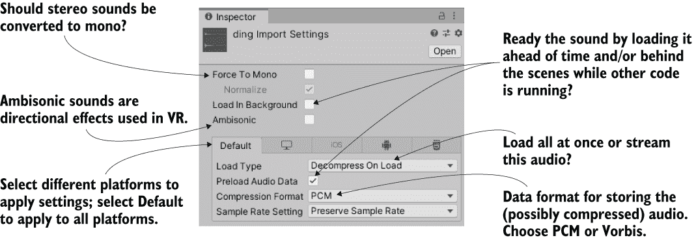
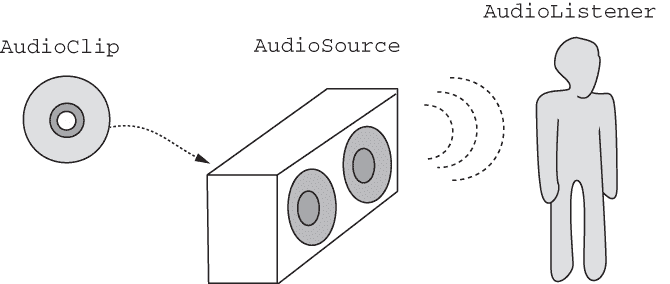
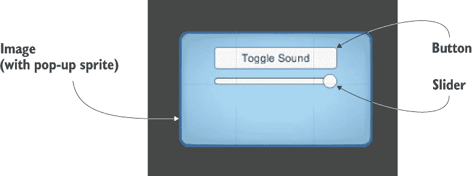
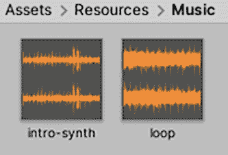

# 11 播放音频：音效和音乐

本章涵盖

+   导入和播放各种音效的音频剪辑

+   使用 2D 声音进行 UI 和场景中的 3D 声音

+   调节播放时所有声音的音量

+   在游戏进行时播放背景音乐

+   在不同的背景曲调之间淡入淡出

虽然在视频游戏的内容中图形通常受到最多的关注，但音频同样重要。大多数游戏都会播放背景音乐和音效。因此，Unity 提供了音频功能，以便你可以在游戏中添加音效和音乐。Unity 可以导入和播放多种音频文件格式，调整声音的音量，甚至可以处理场景中特定位置播放的声音。

注意：2D 和 3D 游戏中的音频处理方式相同。尽管本章的示例项目是一个 3D 游戏，但我们所做的一切同样适用于 2D 游戏。

本章首先从音效而不是音乐开始。*音效*是与游戏中的动作（如玩家开火时播放的枪声）一起播放的短剪辑，而音乐的音频剪辑则更长（通常持续几分钟），播放并不直接与游戏中的事件相关联。最终，两者都归结为同一种音频文件和播放代码，但音乐的声音文件通常比音效的短剪辑大得多（实际上，音乐文件往往是游戏中最大的文件！）这一点值得单独介绍。

本章的完整路线图将是将一个没有声音的游戏进行以下操作：

1.  导入音效的音频文件。

1.  为敌人和射击播放音效。

1.  编程一个音频管理器来控制音量。

1.  优化音乐的加载。

1.  分别控制音乐音量和音效，包括交叉淡入淡出曲目。

注意：在本章中，我们将在现有的游戏演示基础上简单地添加音频功能。本章中的所有示例都是基于第三章中创建的 FPS 构建的，你可以下载那个示例项目，但你也可以使用你喜欢的任何游戏演示。

一旦你将现有的游戏演示复制用于本章，你就可以着手第一步：导入音效。

## 11.1 导入音效

在你能够播放任何声音之前，显然你需要将声音文件导入到你的 Unity 项目中。首先，你将收集所需文件格式的声音剪辑，然后你将把文件带入 Unity 并调整它们以适应你的需求。

### 11.1.1 支持的文件格式

就像你在第四章中看到的艺术资源一样，Unity 支持多种音频格式，各有优缺点。表 11.1 列出了 Unity 支持的音频文件格式。

区分音频文件的主要考虑因素是应用的压缩方式。压缩可以减小文件的大小，但这是通过从文件中丢弃一些信息来实现的。音频压缩非常巧妙，只丢弃最不重要的信息，这样压缩后的声音仍然听起来不错。

表 11.1 Unity 支持的音频文件格式

| 文件类型 | 优点和缺点 |
| --- | --- |
| WAV | Windows 上的默认音频格式。未压缩声音文件。 |
| AIF | Mac 上的默认音频格式。未压缩声音文件。 |
| MP3 | 压缩声音文件；为了获得更小的文件，牺牲了一部分质量。 |
| OGG | 压缩声音文件；为了获得更小的文件，牺牲了一部分质量。 |
| MOD | 音乐跟踪文件格式。一种高效的数字音乐。 |
| XM | 音乐跟踪文件格式。一种高效的数字音乐。 |

然而，压缩会导致少量质量的损失，因此当声音剪辑较短且不会成为大文件时，你应该选择未压缩的音频。较长的声音剪辑（尤其是音乐）应使用压缩音频，否则音频剪辑会过大。尽管如此，Unity 在这个决定上增加了一个小细节。

TIP 尽管音乐应该在最终的游戏中压缩，但 Unity 可以在导入文件后压缩音频。在 Unity 中开发游戏时，你通常希望即使对于较长的音乐，也使用未压缩的文件格式，而不是导入压缩音频。

由于 Unity 会在导入音频后对其进行压缩，因此你应该始终选择 WAV 或 AIF 文件格式。你可能需要根据短声音效果和较长的音乐（特别是告诉 Unity 何时应用压缩）调整不同的导入设置，但原始文件始终应该是未压缩的。

数字音频的工作原理

通常，音频文件存储的是当声音播放时在扬声器中产生的波形。声音是一系列通过空气传播的波，不同的声音是通过不同大小和频率的声音波产生的。音频文件通过在短时间间隔内重复采样这些波，并保存每个样本的波形状态来记录这些波。

采样频率更高的录音可以得到更准确的随时间变化的记录——变化之间的间隔更小。但更频繁的采样意味着需要保存更多的数据，从而导致文件更大。压缩声音文件通过多种技巧来减小文件大小，包括在听众听不到的声音频率上丢弃数据。

音乐跟踪器是一种特殊的序列软件，用于创作音乐。与传统音频文件存储原始声波波形不同，序列软件存储的更像是乐谱：跟踪文件是一系列音符，每个音符都存储了强度和音高等信息。这些“音符”由小波形组成，但由于在序列中重复使用相同的音符，因此存储的数据总量减少。以这种方式创作的音乐可以很高效，但这是一种相当专业的音频类型。

创建声音文件有多种方法（附录 B 提到了 Audacity 等工具，可以从麦克风录制声音），但为了我们的目的，我们将从众多免费声音网站之一下载声音。我们将使用从[www.freesound.org](https://freesound.org/)下载的 WAV 格式剪辑。

警告：“免费”的声音提供在多种许可方案下，所以请确保你允许以你打算的方式使用声音剪辑。例如，许多免费声音仅限非商业用途。

样本项目使用以下公共领域声音效果（当然，你也可以选择下载自己的声音；查找旁边列出的 0 许可）： 

+   “thump” by hy96

+   “ding” by Daphne_in_Wonderland

+   “swish bamboo pole” by ra_gun

+   “fireplace” by leosalom

一旦你有了游戏中要使用的声音文件，下一步就是将声音导入到 Unity 中。

### 11.1.2 导入音频文件

在收集了一些音频文件之后，你需要将它们导入到 Unity 中。就像在第四章中处理艺术资产一样，在使用游戏之前，你必须将音频资产导入到项目中。

导入文件的操作很简单，与其他资产相同：将文件从电脑上的位置拖动到 Unity 中的项目视图中（在 Unity 中创建一个名为 Sound FX 的文件夹以将文件拖入）。嗯，这很简单！但就像其他资产一样，这些音频文件也有导入设置（如图 11.1 所示）可以在检查器中进行调整。



图 11.1 音频文件导入设置

不要勾选“强制单声道”选项。这指的是单声道与立体声声音。通常，声音是以立体声录制的，文件中有两个波形，一个用于左耳/扬声器，一个用于右耳。为了节省文件大小，你可能想要将音频信息减半，以便将相同的波形发送到两个扬声器，而不是分别发送到左右扬声器。（当单声道关闭时，仅当单声道打开时才应用的归一化设置会变灰。）

在“强制转换为单声道”下方，你会看到“在后台加载”和“预加载音频数据”的复选框。预加载设置与平衡回放性能和内存使用有关；预加载音频将在声音等待使用时消耗内存，但可以避免等待加载。因此，你不想预加载长音频剪辑，但对于这种短声音效果，可以将其打开。

同时，在后台加载音频将允许程序在音频加载时继续运行；这对于长音乐剪辑来说通常是个好主意，这样程序就不会冻结。但这也意味着音频不会立即开始播放。通常，对于短声音剪辑，你希望关闭此设置，以确保它们在播放之前完全加载。因为导入的剪辑是短声音效果，你应该取消选中“在后台加载”。

最后，最重要的设置是加载类型和压缩格式。压缩格式控制存储的音频数据的格式。如前所述，音乐应该被压缩，所以在这种情况下选择 Vorbis（这是一个压缩音频格式的名称）。短声音剪辑不需要压缩，因此对于这些剪辑选择 PCM（脉冲编码调制，原始采样声音波的术语）。第三个设置，ADPCM，是 PCM 的一种变体，偶尔会产生略微更好的音质。

加载类型控制计算机如何加载文件中的数据。由于计算机的内存有限，而音频文件可能很大，有时你希望音频在流式传输到内存时播放，从而节省计算机不需要加载整个文件。但以这种方式流式传输音频时需要一些计算开销，因此当音频首先加载到内存中时，音频播放速度最快。即使如此，你也可以选择加载的音频数据是压缩形式还是解压缩以实现更快的回放。因为这些声音剪辑很短，它们不需要流式传输，可以设置为“加载时解压缩”。

最后一个选项是采样率设置；将其保留为“保留采样率”，这样 Unity 就不会更改导入文件中的样本。到此为止，声音效果都已导入并准备好使用。

## 11.2 播放声音效果

现在你已经将声音文件添加到项目中，你自然会想要播放这些声音。触发声音效果的代码并不难理解，但 Unity 中的音频系统确实有多个部分必须协同工作。

### 11.2.1 解释所涉及的内容：音频剪辑 vs. 源 vs. 听众

尽管您可能认为播放声音只是告诉 Unity 播放哪个剪辑这么简单，但结果是您必须定义三个部分才能在 Unity 中播放声音：AudioClip、AudioSource 和 AudioListener。将声音系统分解成多个组件的原因与 Unity 对 3D 声音的支持有关：不同的组件告诉 Unity 位置信息，Unity 使用这些信息来操纵 3D 声音。

2D 与 3D 声音

游戏中的声音可以是 2D 或 3D。2D 声音是您已经熟悉的：标准音频正常播放。2D 声音的称呼主要意味着**不是 3D 声音**。

3D 声音是针对 3D 模拟的，可能您并不熟悉；这些是在模拟中有特定位置的声音。它们的音量和音调受监听者移动的影响。例如，在远处触发的一个声音效果会听起来很微弱。

Unity 支持这两种音频，您决定音频源应该播放 2D 声音还是 3D 声音。像音乐这样的东西应该是 2D 声音，但使用 3D 声音为大多数声音效果创建场景中的沉浸式音频。

作为一个类比，想象一下现实世界中的一个房间。房间里有立体声音响在播放 CD。如果一个人走进房间，他会清楚地听到声音。当他离开房间时，他会听得更不清楚，最终完全听不到。同样，如果我们把立体声音响在房间里移动，他会听到音乐随着移动而改变音量。如图 11.2 所示，在这个类比中，CD 是一个 AudioClip，立体声音响是一个 AudioSource，而那个人是 AudioListener。



图 11.2 Unity 音频系统中您所控制的三个要素

三个部分中的第一个是**音频剪辑**。这是我们之前章节中导入的声音文件。这些原始波形数据是音频系统所做一切的基础，但音频剪辑本身并不做任何事情。

下一种对象是**音频源**。这是播放音频剪辑的对象。这是对音频系统实际所做事情的一种抽象，但它是一种有用的抽象，使得 3D 声音更容易理解。从特定音频源播放的 3D 声音位于该音频源的位置；2D 声音也必须从音频源播放，但位置并不重要。

Unity 音频系统中涉及的第三种对象是**音频监听器**。正如其名所示，这是接收从音频源投射出的声音的对象。这是在音频系统所做事情之上的一种抽象（显然，实际的监听者是游戏玩家！），但——就像音频源的位置给出了声音投射的位置一样——音频监听器的位置给出了声音被听到的位置。

使用音频混音器进行高级声音控制

*音频混合器*是控制 Unity 中音频的高级替代方法。而不是直接播放音频剪辑，音频混合器允许你处理音频信号并对你的剪辑应用各种效果。在 Unity 的文档中了解更多关于音频混合器的信息。例如，你可以观看 Unity 教程视频：[`mng.bz/Mlp3`](http://mng.bz/Mlp3)。

虽然音频剪辑和音频源组件都需要分配，但当你创建一个新场景时，默认相机上已经有一个音频监听器组件。通常，你希望 3D 声音能够对观众的方位做出反应。

### 11.2.2 分配循环声音

好吧，现在让我们在 Unity 中设置我们的第一个声音！音频剪辑已经导入，默认相机有一个音频监听器组件，所以我们只需要分配一个音频源组件。我们将把噼啪声放在敌人预制体上，即四处游荡的敌人角色。

注意：因为敌人听起来像是在着火，你可能想给它一个粒子系统，让它看起来像是在着火。你可以通过将粒子对象制作成预制体，然后从资产菜单中选择导出包，来复制第四章中创建的粒子系统。或者，你也可以在这里重新执行第四章的步骤（首先双击敌人预制体以打开它进行编辑，而不是编辑场景）来从头创建一个新的粒子对象。

通常，你需要将预制体打开到场景中才能编辑它，但只需将组件添加到对象上就可以完成，而无需双击预制体来打开它。选择敌人预制体，使其属性出现在检查器中。现在添加一个新的组件：选择音频 > 音频源。一个音频源组件将出现在检查器中。

告诉音频源要播放哪个声音剪辑。将一个音频文件从项目视图拖动到检查器中的音频剪辑槽；我们将使用这个示例的“壁炉”声音效果（参见图 11.3）。


图 11.3 音频源组件的设置

在设置中向下滚动一点，并选择播放于唤醒和循环（当然，确保没有勾选静音）。播放于唤醒告诉音频源在场景开始时立即开始播放（在下一节中，你将学习如何在场景运行时手动触发声音）。循环告诉音频源在播放结束后持续播放，重复音频剪辑。

你希望这个音频源能够投射 3D 声音。如前所述，3D 声音在场景中有一个独特的位置。音频源的这个方面是通过空间混合设置进行调整的，这是一个从 2D 到 3D 的滑块。为此音频源将其设置为 3D。

现在播放游戏并确保你的扬声器已打开。你可以听到从敌人那里传来的噼啪声，如果你移动远离，声音会变得微弱，因为你使用了 3D 音频源。

### 11.2.3 从代码中触发音效

将 AudioSource 组件设置为自动播放对于一些循环音效很有用，但对于大多数音效，你将希望通过代码命令来触发音效。这种方法仍然需要一个 AudioSource 组件，但现在音频源只有在程序告诉它时才会播放音剪辑，而不是始终自动播放。

将 AudioSource 组件添加到玩家对象（不是相机对象）。你不需要链接特定的音频剪辑，因为音频剪辑将在代码中定义。你可以关闭 Play On Awake，因为来自此源的声音将在代码中触发。此外，将空间混合调整到 3D，因为此声音位于场景中。现在，在处理射击的脚本 RayShooter 中添加下一列表中的添加内容。

列表 11.1 在 RayShooter 脚本中添加的音效

```
...
[SerializeField] AudioSource soundSource;
[SerializeField] AudioClip hitWallSound;          ❶
[SerializeField] AudioClip hitEnemySound;         ❶
...

if (target != null) {                             ❷
    target.ReactToHit();
    soundSource.PlayOneShot(hitEnemySound);       ❸
} else {
    StartCoroutine(SphereIndicator(hit.point));
    soundSource.PlayOneShot(hitWallSound);        ❹
}
...
```

❶ 引用你想要播放的两个声音文件

❷ 如果目标不为空，则玩家击中了敌人，所以……

❸ ……调用 PlayOneShot() 来播放击中敌人的声音，或者……

❹ ……如果玩家未击中，则调用 PlayOneShot() 来播放击中墙壁的声音。

新的代码在脚本顶部包含几个序列化变量。将玩家对象（具有 AudioSource 组件的对象）拖动到检查器中的 soundSource 槽。然后将要播放的音频剪辑拖动到音槽；“swish”用于击中墙壁，“ding”用于击中敌人。

添加的其他两行是 PlayOneShot() 方法。PlayOneShot() 会使音频源播放指定的音频剪辑。将这些方法添加到目标条件内部，以便在击中各种对象时播放声音。

注意：你可以在 AudioSource 中设置剪辑并调用 Play() 来播放剪辑。但是，多个声音会相互切断，所以我们使用了 PlayOneShot()。用以下代码替换 PlayOneShot() 并快速射击以查看（或者说，听到）问题：soundSource.clip=hitEnemySound; soundSource.Play();。

好吧，玩玩游戏，四处射击。你现在游戏中已经有了几个音效。这些基本步骤可以用来添加各种音效。然而，一个健壮的游戏音效系统需要的不仅仅是零散的声音；至少，所有游戏都应该提供音量控制。你将通过一个中央音频模块来实现这个控制功能。

## 11.3 使用音频控制界面

继续前几章中建立的代码架构，你将创建一个 AudioManager。回想一下，Managers 对象有一个用于游戏的各种代码模块的主列表，例如玩家库存的管理器。这次，你将创建一个音频管理器并将其添加到列表中。这个中央音频模块将允许你调节游戏中的音量，甚至可以静音。最初，你将只关注音效，但在后面的章节中，你将扩展 AudioManager 以处理音乐。

### 11.3.1 设置中央 AudioManager

设置 AudioManager 的第一步是放置 Managers 代码框架。从第十章的项目中复制 IGameManager、ManagerStatus 和 NetworkService；我们不会更改它们。（记住，IGameManager 是所有管理器必须实现的接口，而 ManagerStatus 是 IGameManager 使用的枚举。NetworkService 提供对互联网的调用，在本章中不会使用。）

注意：Unity 可能会发出警告，因为 NetworkService 已分配但未使用。您可以忽略 Unity 的警告；我们希望启用代码框架以访问互联网，尽管在本章中我们不使用该功能。

同时复制 Managers 文件，该文件将针对新的 AudioManager 进行调整。现在先保持原样（或者如果编译错误让您感到疯狂，可以注释掉错误部分！）创建一个新的脚本名为 AudioManager，Manager 代码可以引用它。

列表 11.2 AudioManager 的骨架代码

```
using System.Collections;
using System.Collections.Generic;
using UnityEngine;

public class AudioManager : MonoBehaviour, IGameManager {
   public ManagerStatus status {get; private set;}

   private NetworkService network;

   // Add volume controls here (listing 11.4)

   public void Startup(NetworkService service) {
      Debug.Log("Audio manager starting...");

      network = service;

      // Initialize music sources here (listing 11.11)   ❶

      status = ManagerStatus.Started;                    ❷
   }
}
```

❶ 任何长时间运行的启动任务放在这里。

❷ 如果有长时间运行的启动任务，将状态设置为初始化。

这段初始代码看起来像前几章的管理器；这是 IGameManager 所需的最小实现量。现在可以调整 Manager 脚本以使用新的管理器。

列表 11.3 使用 AudioManager 调整的 Managers 脚本

```
using System.Collections;
using System.Collections.Generic;
using UnityEngine;

[RequireComponent(typeof(AudioManager))]

public class Managers : MonoBehaviour {
   public static AudioManager Audio {get; private set;}

   private List<IGameManager> startSequence;

   void Awake() {
      Audio = GetComponent<AudioManager>();     ❶

      startSequence = new List<IGameManager>();
      startSequence.Add(Audio);

      StartCoroutine(StartupManagers());
   }

   private IEnumerator StartupManagers() {
      NetworkService network = new NetworkService();

      foreach (IGameManager manager in startSequence) {
         manager.Startup(network);
      }

      yield return null;

      int numModules = startSequence.Count;
      int numReady = 0;

      while (numReady < numModules) {
         int lastReady = numReady;
         numReady = 0;

         foreach (IGameManager manager in startSequence) {
            if (manager.status == ManagerStatus.Started) {
               numReady++;
            }
         }

         if (numReady > lastReady)
            Debug.Log($"Progress: {numReady}/{numModules}");

         yield return null;
      }

      Debug.Log("All managers started up");
   }
}
```

❶ 在此项目中仅列出 AudioManager，而不是 PlayerManager 等。

如前几章所述，在场景中创建 Game Managers 对象，然后将两个 Managers 和 AudioManager 都附加到空对象上。玩游戏将在控制台显示管理器的启动消息，但音频管理器目前还没有任何操作。

### 11.3.2 音量控制 UI

在设置好基本的 AudioManager 后，现在是时候给它添加音量控制功能了。这些音量控制方法将被 UI 显示用于静音音效或调整音量。

您将使用第七章中重点介绍的 UI 工具。具体来说，您将创建一个带有按钮和滑块的弹出窗口来控制音量设置（见图 11.4）。我将列出涉及的步骤而不深入细节；如果您需要复习，请参考第七章。如果需要，在开始之前安装 TextMeshPro 和 2D Sprite 包（请参考第五章和第六章），然后：

1.  将 popup.png 导入为精灵（设置纹理类型为精灵）。

1.  在精灵编辑器中，在所有边设置 12 像素的边框（记得应用更改）。

1.  在场景中创建一个画布（GameObject > UI > Canvas）。

1.  为画布开启像素完美设置。

1.  （可选）将对象命名为 HUD Canvas 并切换到 2D 视图模式。

1.  创建一个与该画布连接的图像（GameObject > UI > Image）。

1.  将新对象命名为设置弹出窗口。

1.  将弹出精灵分配给图像的源图像。

1.  将图像类型设置为 Sliced 并开启填充中心。

1.  将弹出图像定位在 0, 0 以居中。

1.  将弹出图像缩放为 250 宽度和 150 高度。

1.  创建一个按钮（GameObject > UI > Button - TextMeshPro）。

1.  将按钮拖到弹出窗口中（在层次结构中拖动）。

1.  将按钮放置在 0, 40 位置。

1.  扩展按钮的层次结构以选择其文本标签。

1.  将文本更改为切换声音。

1.  创建一个滑块（GameObject > UI > Slider）。

1.  将滑块拖到弹出窗口中，并放置在 0, 15 位置。

1.  将滑块的值（检查器底部的值）设置为 1。



图 11.4 静音和音量控制的 UI 显示

这些就是创建设置弹出窗口的所有步骤！现在弹出窗口已经创建，让我们编写与之协同工作的代码。这将涉及弹出窗口对象上的脚本以及弹出窗口脚本调用的音量控制功能。首先，根据此列表调整 AudioManager 中的代码。

列表 11.4 添加到 AudioManager 的音量控制

```
...
public float soundVolume {                      ❶
   get {return AudioListener.volume;}           ❷
   set {AudioListener.volume = value;}          ❷
}

public bool soundMute {                         ❸
   get {return AudioListener.pause;}
   set {AudioListener.pause = value;}
}

*public void Startup(NetworkService service) {*   ❹
   *Debug.Log("Audio manager starting...");

   network = service;*

   soundVolume = 1f;                            ❺

   *status = ManagerStatus.Started;
}*
...
```

❶ 具有 getter 和 setter 的音量属性

❷ 使用 AudioListener 实现 getter/setter。

❸ 为静音添加一个类似的属性。

❹ 已在脚本中添加斜体代码，此处仅供参考。

❺ 初始化值（0 到 1 范围；1 为全音量）。

已为 AudioManager 添加了 soundVolume 和 soundMute 属性。对于这两个属性，get 和 set 函数都是通过在 AudioListener 上使用全局值来实现的。AudioListener 类可以调节所有 AudioListener 实例接收到的所有声音的音量。设置 AudioManager 的 soundVolume 属性与在 AudioListener 上设置音量具有相同的效果。这里的优势在于封装：所有与音频相关的事情都在一个管理器中处理，无需管理器外部的代码了解实现的细节。

在将那些方法添加到 AudioManager 后，你现在可以编写一个弹出窗口的脚本。创建一个名为 SettingsPopup 的脚本，并添加此列表的内容。

列表 11.5 用于调整音量的 SettingsPopup 脚本

```
using System.Collections;
using System.Collections.Generic;
using UnityEngine;

public class SettingsPopup : MonoBehaviour {

   public void OnSoundToggle() {                            ❶
      Managers.Audio.soundMute = !Managers.Audio.soundMute;
   }

   public void OnSoundValue(float volume) {                 ❷
      Managers.Audio.soundVolume = volume;
   }
}
```

❶ 按钮将切换 AudioManager 的静音属性。

❷ 滑块将调整 AudioManager 的音量属性。

此脚本有两个影响 AudioManager 属性的方法：OnSoundToggle() 设置 soundMute 属性，而 OnSoundValue() 设置 soundVolume 属性。像往常一样，通过将脚本拖到 UI 中的 Settings Popup 对象上链接 SettingsPopup 脚本。

然后，为了从按钮和滑块中调用函数，将弹出窗口对象链接到那些控件中的交互事件。在按钮的检查器中，寻找标有 On Click 的面板。点击 + 按钮向此事件添加一个新条目。将 Settings Popup 拖到新条目中的对象槽位，然后在菜单中查找 SettingsPopup；选择 OnSoundToggle() 以使按钮调用该函数。

现在选择滑块并链接一个函数，就像您处理按钮时做的那样。首先在滑块设置的面板中查找交互事件；在这种情况下，面板被称为 OnValueChanged。点击 + 按钮添加一个新条目，然后将设置弹出窗口拖到对象槽位。在函数菜单中，找到 SettingsPopup 脚本，然后选择动态浮点下的 OnSoundValue()。

警告：请记住选择动态浮点函数下的功能，而不是静态参数！尽管该方法出现在列表的两个部分中，但在后一种情况下，它将只接收预先输入的一个值。

设置控制现在正在工作，但我们还需要解决一个脚本问题——弹出窗口目前总是覆盖整个屏幕。一个简单的解决方案是使弹出窗口仅在您按下 M 键时打开。创建一个新的脚本名为 UIController，将其链接到场景中的控制器对象，并编写以下代码。

列表 11.6 UIController 切换设置弹出窗口

```
using System.Collections;
using System.Collections.Generic;
using UnityEngine;

public class UIController : MonoBehaviour {
   [SerializeField] SettingsPopup popup;                 ❶

   void Start() {
      popup.gameObject.SetActive(false);                 ❷
   }

   void Update() {
      if (Input.GetKeyDown(KeyCode.M)) {                 ❸
         bool isShowing = popup.gameObject.activeSelf;
         popup.gameObject.SetActive(!isShowing);

         if (isShowing) {
            Cursor.lockState = CursorLockMode.Locked;    ❹
            Cursor.visible = false;                      ❹
         } else {                                        ❹
            Cursor.lockState = CursorLockMode.None;      ❹
            Cursor.visible = true;                       ❹
         }
      }
   }
}
```

❶ 引用场景中的弹出对象

❷ 初始化隐藏的弹出窗口

❸ 使用 M 键切换弹出窗口

❹ 同时切换光标和弹出窗口

要连接此对象引用，将设置弹出窗口拖到脚本上的槽位。现在播放并尝试更改滑块（记得通过按 M 键激活 UI）并在射击时听声音效果；您会听到声音效果根据滑块改变音量。

### 11.3.3 播放 UI 声音

现在，您将向 AudioManager 添加另一个功能，以便在按钮被点击时 UI 可以播放声音。这项任务比最初看起来更复杂，因为 Unity 需要一个 AudioSource。当场景中的对象发出声音效果时，很明显应该将 AudioSource 附加在哪里。但 UI 声音效果不是场景的一部分，因此您将为 AudioManager 设置一个特殊的 AudioSource，以便在没有其他音频源时使用。

创建一个新的空 GameObject 并将其附加为主游戏管理器对象的子对象；这个新对象将使用 AudioManager 的 AudioSource，因此将新对象命名为 Audio。向此对象添加一个 AudioSource 组件（这次保留 Spatial Blend 设置为 2D，因为 UI 在场景中没有特定的位置），然后添加以下代码以在 AudioManager 中使用此源。

列表 11.7 在 AudioManager 中播放声音效果

```
...
[SerializeField] AudioSource soundSource;     ❶
...
public void PlaySound(AudioClip clip) {       ❷
    soundSource.PlayOneShot(clip);
}
...
```

❶ 在检查器中的变量槽位引用新的音频源

❷ 播放没有其他来源的声音。

在管理器的检查器中会出现一个新的变量槽位；将 Audio 对象拖到这个槽位上。现在修改弹出脚本（如下所示）以添加 UI 声音效果。

列表 11.8 向 SettingsPopup 添加声音效果

```
...
[SerializeField] AudioClip sound;                           ❶
...
public void OnSoundToggle() {
   Managers.Audio.soundMute = !Managers.Audio.soundMute;
   Managers.Audio.PlaySound(sound);                         ❷
}
...
```

❶ 引用声音片段的检查器槽位

❷ 当按钮被点击时播放声音效果。

将 UI 音效拖到变量槽中；我使用了 2D 音效“thump。”当你点击 UI 按钮时，该音效会同时播放（当然，如果声音没有被静音的话！）尽管 UI 本身没有音频源，但 AudioManager 有一个播放音效的音频源。

太好了，我们已经设置好了所有的音效！现在让我们把注意力转向音乐。

## 11.4 添加背景音乐

你将向游戏中添加背景音乐，你将通过向 AudioManager 添加音乐来实现这一点。如章节引言中所述，音乐剪辑在本质上与音效没有区别。数字音频通过波形工作的方式相同，播放音频的命令也大致相同。主要区别是音频的长度，但这种差异会引发许多后果。

首先，音乐曲目往往会在计算机上消耗大量内存，并且必须优化这种内存消耗。你必须注意两个内存问题区域：在需要之前将音乐加载到内存中，以及加载时消耗过多内存。

使用第九章中介绍的 Resources.Load()命令优化音乐加载的时间。正如你所学的，这个命令允许你按名称加载资源。尽管这确实是一个方便的功能，但这不是从 Resources 文件夹加载资源的唯一原因。另一个关键考虑因素是延迟加载：通常，Unity 在场景加载时立即加载场景中的所有资源，但来自 Resources 的资源只有在代码手动获取它们时才会加载。在这种情况下，我们想要**懒加载**音乐音频剪辑。否则，即使音乐没有被使用，它也可能消耗大量内存。

**定义** 使用**懒加载**，文件不是提前加载，而是在需要时才延迟加载。通常，如果数据在使用前提前加载，响应速度会更快（例如，声音会立即播放），但懒加载可以在响应性不是很重要的情况下节省大量内存。

第二个内存考虑因素是通过从光盘流式传输音乐来处理的。如第 11.1.2 节所述，流式传输音频可以防止计算机需要一次性加载整个文件。加载风格是导入音频剪辑检查器中的一个设置。最终，播放背景音乐需要几个步骤，包括覆盖这些内存优化步骤。

### 11.4.1 播放音乐循环

播放音乐的过程涉及与 UI 音效相同的步骤序列（背景音乐也是场景内没有源的 2D 声音），因此我们将再次走完所有这些步骤：

1.  导入音频剪辑。

1.  为 AudioManager 设置 AudioSource。

1.  编写代码在 AudioManager 中播放音频剪辑。

1.  将音乐控件添加到用户界面中。

每个步骤都将略微修改以适应音乐而不是音效。让我们看看第一步。

第 1 步：导入音频剪辑

通过下载或录制曲目来获取一些音乐。对于示例项目，我去了[www.freesound.org](https://freesound.org/)并下载了以下公共领域的音乐循环：

+   “loop” by Xythe/Ville Nousiainen

+   “Intro Synth” by noirenex

将文件拖入 Unity 以导入它们，然后在检查器中调整它们的导入设置。如前所述，音乐音频剪辑通常具有与音效音频剪辑不同的设置。首先，音频格式应设置为 Vorbis，用于压缩音频。记住，压缩音频将具有显著较小的文件大小。压缩也会稍微降低音频质量，但对于较长的音乐剪辑来说，这种轻微的降级是可以接受的折衷方案；在出现的滑块中将质量设置为 50%。

接下来要调整的下一个导入设置是加载类型。同样，音乐应从光盘流式传输，而不是完全加载。从加载类型菜单中选择流式传输。同样，打开后台加载，这样在音乐加载时游戏不会暂停或减慢。

即使调整了所有导入设置，资产文件也必须移动到正确的位置才能正确加载。记住，Resources.Load()命令要求资产在 Resources 文件夹中。创建一个名为 Resources 的新文件夹，在该文件夹内创建一个名为 Music 的文件夹，并将音频文件拖入 Music 文件夹（见图 11.5）。这样就完成了第 1 步。



图 11.5 音乐音频剪辑放置在 Resources 文件夹内

第 2 步：为 AudioManager 设置 AudioSource

第 2 步是创建一个新的 AudioSource 以播放音乐。创建另一个空的 GameObject，将此对象命名为 Music 1（而不是 Music，因为我们将在本章后面添加 Music 2），并将其作为 Audio 对象的子对象。

将音频源组件添加到 Music 1，然后调整组件中的设置。取消选择“唤醒时播放”，但这次打开循环选项；而音效通常只播放一次，音乐则反复循环播放。将空间混合设置保留在 2D，因为音乐在场景中没有特定的位置。

您可能还想降低优先级值。对于音效，这个值并不重要，所以我们将其保留在默认的 128。但对于音乐，您可能希望降低这个值，所以我将音乐源设置为 60。这个值告诉 Unity 在分层多个声音时哪些声音最重要；有些反直觉，较低的值具有更高的优先级。当同时播放太多声音时，音频系统将开始丢弃声音；通过使音乐比音效具有更高的优先级，您确保当太多音效同时触发时，音乐仍然会播放。

第 3 步：编写代码在 AudioManager 中播放音频剪辑

音乐音频源已经设置好了，所以将以下条目添加到 AudioManager。

列表 11.9 在 AudioManager 中播放音乐

```
...
[SerializeField] AudioSource music1Source;

[SerializeField] string introBGMusic;                ❶
[SerializeField] string levelBGMusic;                ❶
...
public void PlayIntroMusic() {                       ❷
   PlayMusic(Resources.Load($"Music/{introBGMusic}") as AudioClip);
}
public void PlayLevelMusic() {                       ❸
   PlayMusic(Resources.Load($"Music/{levelBGMusic}") as AudioClip);
}

private void PlayMusic(AudioClip clip) {             ❹
   music1Source.clip = clip;
   music1Source.Play();
}

public void StopMusic() {
   music1Source.Stop();
}
...
```

❶ 在这些字符串中写入音乐名称。

❷ 从资源中加载开场音乐。

❸ 从资源中加载主音乐。

❹ 通过设置 AudioSource.clip 来播放音乐。

如往常一样，当你选择 Game Managers 对象时，新的序列化变量将在检查器中可见。将 Music 1 拖入音频源槽中。然后在两个字符串变量中输入音乐文件的名称：intro-synth 和 loop。

添加的其余代码调用加载和播放音乐的命令（或者在最后添加的方法中，停止音乐）。Resources.Load()命令从资源文件夹中加载命名的资产（考虑到文件被放置在资源文件夹内的 Music 子文件夹中）。该命令返回一个通用对象，但可以通过使用 as 关键字将该对象转换为更具体的类型（在这种情况下，是 AudioClip）。

加载的音频剪辑随后传递到 PlayMusic()方法。此函数将剪辑设置在 AudioSource 中，然后调用 Play()。正如我之前解释的，使用 PlayOneShot()实现音效更好，但将剪辑设置在 AudioSource 中是音乐的一个更稳健的方法，允许你停止或暂停正在播放的音乐。

第 4 步：向 UI 添加音乐控制

AudioManager 中的新音乐播放方法除非在其他地方被调用，否则不会做任何事情。让我们添加更多按钮到音频 UI，当点击时将播放不同的音乐。以下是步骤再次列出，附带少量解释（如有需要，请参阅第七章）：

1.  将弹出窗口的宽度更改为 350（以容纳更多按钮）。

1.  创建一个新的 UI 按钮并将其附加到弹出窗口。

1.  将按钮的宽度设置为 100，位置为 0, -20。

1.  展开按钮的层级以选择文本标签，并将其设置为 Level Music。

1.  重复这些步骤两次，以创建两个额外的按钮。

1.  将一个放置在-105, -20 的位置，另一个放置在 105, -20 的位置（这样它们会出现在两侧）。

1.  将第一个文本标签更改为 Intro Music，最后一个文本标签更改为 No Music。

现在弹出窗口有三个按钮用于播放不同的音乐。在 SettingsPopup 中编写一个方法，该方法将与每个按钮相关联。

列表 11.10 向 SettingsPopup 添加音乐控制

```
...
public void OnPlayMusic(int selector) {      ❶
   Managers.Audio.PlaySound(sound);

   switch (selector) {                       ❷
      case 1:
         Managers.Audio.PlayIntroMusic();
         break;
      case 2:
         Managers.Audio.PlayLevelMusic();
         break;
      default:
         Managers.Audio.StopMusic();
         break;
   }
}
...
```

❶ 此方法从按钮获取一个数字参数。

❷ 为每个按钮调用 AudioManager 中的不同音乐函数。

注意这次函数接受一个 int 参数；通常，按钮方法没有参数，只是通过按钮触发。在这种情况下，我们需要区分三个按钮，因此每个按钮将发送不同的数字。

按照典型的步骤将按钮连接到这段代码：在检查器中的 OnClick 面板中添加一个条目，将弹出窗口拖到对象槽中，并从菜单中选择适当的函数。这次，显示了一个用于输入数字的文本框，因为 OnPlayMusic()需要一个数字作为参数。输入 1 表示开场音乐，2 表示关卡音乐，其他任何内容表示没有音乐（我选择了 0）。OnMusic()中的 switch 语句根据数字播放开场音乐或关卡音乐，如果数字不是 1 或 2，则默认停止音乐。

当你在游戏播放时点击音乐按钮，你会听到音乐。太好了！代码正在从 Resources 文件夹中加载音频剪辑。音乐播放效率很高，尽管我们仍然需要添加两个细节：单独的音乐音量控制和在更改音乐时的淡入淡出。

### 11.4.2 单独控制音乐音量

游戏已经有了音量控制，目前这也影响了音乐。不过，大多数游戏都有单独的音效和音乐音量控制，所以让我们现在解决这个问题。

第一步是告诉音乐 AudioSource 忽略 AudioListener 上的设置。我们希望全局 AudioListener 的音量和静音设置继续影响所有音效，但我们不希望这个音量应用于音乐。列表 11.10 包含了告诉音乐源忽略 AudioListener 音量的代码。接下来的列表还添加了音乐音量和静音控制，所以将其添加到 AudioManager。

列表 11.11 在 AudioManager 中单独控制音乐音量

```
...
private float _musicVolume;                         ❶
public float musicVolume {
   get {
      return _musicVolume;
   }
   set {
      _musicVolume = value;

      if (music1Source != null) {                   ❷
         music1Source.volume = _musicVolume;
      }
   }
}
...
public bool musicMute {
   get {
      if (music1Source != null) {
         return music1Source.mute;
      }
      return false;                                 ❸
   }
   set {
      if (music1Source != null) {
         music1Source.mute = value;
      }
   }
}

*public void Startup(NetworkService service) {*       ❹
   *Debug.Log("Audio manager starting...");

   network = service;*       

   music1Source.ignoreListenerVolume = true;        ❺
   music1Source.ignoreListenerPause = true;         ❺

   *soundVolume = 1f;*
   musicVolume = 1f;

   *status = ManagerStatus.Started;*                  ❹
*}*                                                   ❹
...
```

❶ 私有变量，不会直接访问，只能通过属性的 getter 访问

❷ 直接调整 AudioSource 的音量。

❸ 如果 AudioSource 缺失时的默认值

❹ 已在脚本中使用的斜体代码，此处展示以供参考。

❺ 这些属性告诉 AudioSource 忽略 AudioListener 的音量。

这段代码的关键是意识到你可以直接调整 AudioSource 的音量，即使这个音频源正在忽略在 AudioListener 中定义的全局音量。音量和静音属性都用于操作单个音乐源。

Startup()方法将 ignoreListenerVolume 和 ignoreListenerPause 都设置为开启，初始化音乐源。正如其名称所暗示的，这些属性导致音频源忽略 AudioListener 上的全局音量设置。

你可以点击“播放”现在来验证音乐不再受现有音量控制的影响。让我们为音乐音量添加第二个 UI 控制；首先调整 SettingsPopup。

列表 11.12 在 SettingsPopup 中的音乐音量控制

```
...
public void OnMusicToggle() {
   Managers.Audio.musicMute = !Managers.Audio.musicMute;    ❶
   Managers.Audio.PlaySound(sound);
}

public void OnMusicValue(float volume) {
   Managers.Audio.musicVolume = volume;                     ❷
}
...
```

❶ 重复静音控制，但使用 musicMute。

❷ 重复音量控制，但使用 musicVolume。

这段代码不需要太多解释——它主要是重复声音音量控制。显然，使用的 AudioManager 属性已经从 soundMute/soundVolume 更改为 musicMute/musicVolume。

在编辑器中，创建一个按钮和滑块，就像你之前做的那样。以下步骤再次列出：

1.  将弹出窗口的高度更改为 225（以容纳更多控件）。

1.  创建一个 UI 按钮。

1.  将按钮作为父级添加到弹出窗口中。

1.  将按钮定位在 0, -60。

1.  展开按钮的层次结构以选择其文本标签。

1.  将文本更改为切换音乐。

1.  创建一个滑块（来自相同的 UI 菜单）。

1.  将滑块作为父级添加到弹出窗口中，并将其定位在 0, -85。

1.  将滑块的值（在检查器的底部）设置为 1。

将这些 UI 控件链接到 SettingsPopup 中的代码。在 UI 元素的设置中找到 OnClick/OnValueChanged 面板，点击+按钮添加条目，将弹出对象拖到对象槽中，并从菜单中选择函数。您需要选择的函数是 Dynamic Float 部分中的 OnMusicToggle()和 OnMusicValue()。

运行此代码，你会看到控件分别影响音效和音乐。这已经很复杂了，但还有一个细节需要润色：音乐轨道之间的交叉淡入淡出。

### 11.4.3 在歌曲之间淡入淡出

作为最后的润色，让我们让 AudioManager 在不同的背景曲调之间淡入淡出。目前，音乐轨道之间的切换相当刺耳，声音突然切断并切换到新轨道。我们可以通过让上一个轨道的音量迅速减少，同时新轨道的音量从 0 迅速上升来平滑这个过渡。这是一段简单但巧妙的代码，结合了你刚才看到的音量控制方法，以及一个协程来随时间逐步改变音量。

列表 11.13 向 AudioManager 添加了许多位，但大多数都围绕一个简单的概念：既然我们现在有两个独立的音频源，我们将在不同的音频源上播放不同的音乐轨道，并逐步增加一个源的音量，同时同时降低另一个源的音量。（如往常一样，斜体代码已经在脚本中，这里显示以供参考。）

列表 11.13 在 AudioManager 中实现音乐之间的交叉淡入淡出

```
...
[SerializeField] AudioSource music2Source;            ❶

private AudioSource activeMusic;                      ❷
private AudioSource inactiveMusic;

public float crossFadeRate = 1.5f;
private bool crossFading;                             ❸
...
public float musicVolume {
   ...
   set {
      _musicVolume = value;

      if (music1Source != null && !crossFading) {
         music1Source.volume = _musicVolume;
         music2Source.volume = _musicVolume;          ❹
      }
   }
}
...
public bool musicMute {
   ...
   set {
      if (music1Source != null) {
         music1Source.mute = value;
         music2Source.mute = value;
      }
   }
}

*public void Startup(NetworkService service) {
   Debug.Log("Audio manager starting...");

   network = service;

   music1Source.ignoreListenerVolume = true;*
   music2Source.ignoreListenerVolume = true;
   *music1Source.ignoreListenerPause = true;*
   music2Source.ignoreListenerPause = true;

   *soundVolume = 1f;
   musicVolume = 1f;*

   activeMusic = music1Source;                        ❺
   inactiveMusic = music2Source;

   *status = ManagerStatus.Started;
}*
...
private void PlayMusic(AudioClip clip) {
   if (crossFading) {return;}
   StartCoroutine(CrossFadeMusic(clip));              ❻
}
private IEnumerator CrossFadeMusic(AudioClip clip) {
   crossFading = true;

   inactiveMusic.clip = clip;
   inactiveMusic.volume = 0;
   inactiveMusic.Play();

   float scaledRate = crossFadeRate * musicVolume;
   while (activeMusic.volume > 0) {
      activeMusic.volume -= scaledRate * Time.deltaTime;
      inactiveMusic.volume += scaledRate * Time.deltaTime;

      yield return null;                              ❼
   }

   AudioSource temp = activeMusic;                    ❽

   activeMusic = inactiveMusic;
   activeMusic.volume = musicVolume;

   inactiveMusic = temp;
   inactiveMusic.Stop();

   crossFading = false;
}

public void StopMusic() {
   activeMusic.Stop();
   inactiveMusic.Stop();
}
...
```

❶ 第二个 AudioSource（也要保留第一个）

❷ 跟踪哪个源是活动的，哪个是未活动的。

❸ 在交叉淡入淡出发生时避免错误的切换

❹ 调整两个音乐源的音量。

❺ 将一个初始化为活动的 AudioSource。

❻ 在更改音乐时调用协程。

❼ Yield 语句暂停一帧。

❽ 在交换活动和未活动时使用的临时变量

第一个添加是为第二个音乐源创建的变量。在保留第一个 AudioSource 对象的同时，复制该对象（确保设置相同——选择 Loop），然后将新对象拖到这个检查器槽中。代码还定义了 activeMusic 和 inactiveMusic 这两个 AudioSource 变量，但这些都是代码内部使用的私有变量，不在检查器中暴露。具体来说，这些变量定义了在任何给定时间哪个音频源被认为是活动的或未活动的。

现在代码在播放新音乐时会调用一个协程。这个协程在保持旧音乐在旧 AudioSource 上播放的同时，将新音乐设置在新的 AudioSource 上播放。然后，协程逐渐增加新音乐的音量，同时逐渐减少旧音乐的音量。一旦交叉淡入淡出完成（即音量完全交换），函数会交换哪个音频源被认为是活动状态和无效状态。

太好了！我们已经完成了游戏音频系统的背景音乐。

高级游戏音频插件，适用于 FMOD 和 Wwise

Unity 中的音频系统由 FMOD 提供支持，这是一个流行的音频编程库。Unity 集成了 FMOD 的许多功能，但更高级的音频功能可以通过 FMOD Studio 访问，该插件可在[www.fmod.com/unity/](https://www.fmod.com/unity/)获取。或者，Wwise 是另一个音频系统，它也提供了一个 Unity 插件：[`mng.bz/6mvD`](http://mng.bz/6mvD)。

本章中的示例坚持使用 Unity 内置的功能，因为核心功能构成了游戏音频系统最重要的功能。大多数游戏开发者通过这些核心功能就能很好地满足他们的音频需求，但这些插件对于那些希望使游戏音频更加复杂的人来说是有用的。

## 摘要

+   音效应该是未压缩的音频，音乐应该是压缩的，但两者都使用 WAV 格式，因为 Unity 会对导入的音频应用压缩。

+   音频剪辑可以是始终播放相同的 2D 声音，或者是对听众位置做出反应的 3D 声音。

+   使用 Unity 的 AudioListener 可以轻松全局调整音效的音量。

+   你可以为播放音乐的各个音频源设置音量。

+   你可以通过设置各个音频源的音量来淡入淡出背景音乐。
