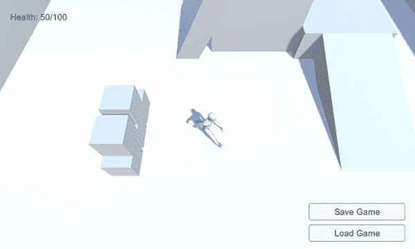
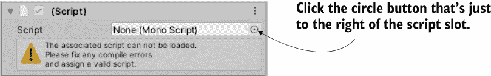
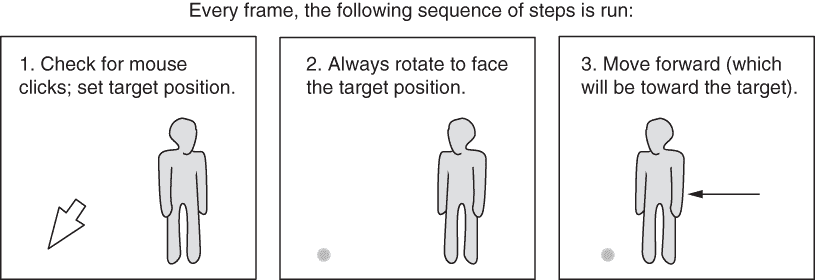
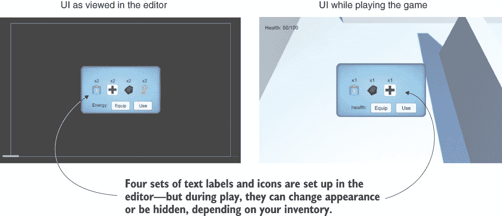
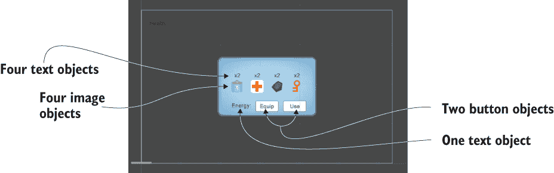
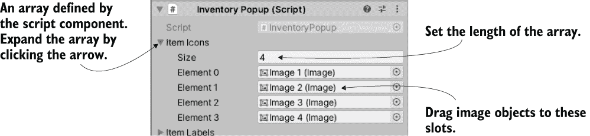
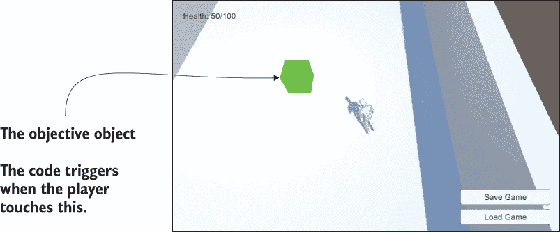

# 12 将部分组合成一个完整的游戏

本章涵盖

+   从其他项目组装对象和代码

+   编程点按控制

+   从旧 UI 系统升级到新系统

+   根据目标加载新关卡

+   设置胜负条件

+   保存和加载玩家的进度

本章的项目将把之前章节中的所有内容串联起来。大多数章节都相当独立，我们没有从头到尾审视整个游戏。我将带你了解如何将分别引入的各个部分组合起来，以便你知道如何从所有这些部分构建一个完整的游戏。

我还将讨论游戏的整体结构，包括切换关卡和结束游戏（当你死亡时显示“游戏结束”，达到出口时显示“成功”）。我还会向你展示如何保存游戏，因为随着游戏规模的扩大，保存玩家的进度变得越来越重要。

警告：本章的大部分内容使用了在之前章节中已详细解释的任务，所以我会快速地通过这些步骤。如果某些步骤让你感到困惑，请参考相关章节（例如，关于 UI 的第七章）以获得更详细的解释。

本章的项目是一个动作角色扮演游戏（RPG）的演示。在这类游戏中，摄像机放置得较高，并且向下锐利地观察（见图 12.1），角色通过点击鼠标到你想要去的地方来控制。你可能熟悉《暗黑破坏神》这款游戏，它就是这样一款动作 RPG。我将切换到另一个游戏类型，以便在本书结束前再塞进一个类型！



图 12.1 顶视图截图

完整来说，本章的项目将是迄今为止最大的游戏。它将具有以下功能：

+   顶视图和点击移动

+   点击设备以操作它们的能力

+   可以收集的散落物品

+   在 UI 窗口中显示的库存

+   在关卡中游荡的敌人

+   保存游戏并恢复进度的能力

+   必须按顺序完成的三个关卡

哇，要包含的内容很多；幸好这几乎是最后一章了！

## 12.1 通过重新利用项目构建动作 RPG

我们将通过在第九章的项目基础上构建来开发动作 RPG 演示。复制该项目的文件夹，并在 Unity 中打开副本以开始工作。或者，如果你直接跳到了这一章，请下载第九章的示例项目以在此基础上构建。

我们基于第九章的项目进行构建的原因是，它离本章的目标最近，因此需要最少的修改（与其他项目相比）。最终，我们将从几个章节中汇集资源，所以从技术上讲，这并不比我们从那些项目开始并从第九章中提取资源有太大不同。

这里是第九章项目中包含内容的回顾：

+   已经设置好动画控制器的角色

+   一个跟随角色周围的三人称摄像机

+   一个有地板、墙壁和斜坡的水平面

+   灯光和阴影都已放置

+   可操作设备，包括颜色变化的显示器

+   可收集的库存物品

+   后端管理器代码框架

这个功能丰富的列表涵盖了 RPG 示例中的相当一部分动作，但我们可能需要修改或添加更多。

### 12.1.1 从多个项目中组装资源和代码

前两项修改将是更新管理框架并引入计算机控制的敌人。对于前一个任务，回想一下在第十章中进行了框架的更新，这意味着这些更新不在第九章的项目中。对于后一个任务，回想一下你在第三章中编写了一个敌人。

更新管理框架

更新管理器是一个相当简单的任务，所以我们首先把它解决掉。在第十章中修改了 IGameManager 接口。

列表 12.1 调整后的 IGameManager

```
public interface IGameManager {
   ManagerStatus status {get;}

   void Startup(NetworkService service);
}
```

列表中的代码添加了对 NetworkService 的引用，因此也务必复制额外的脚本；从第十章项目中的位置拖拽文件（记住，Unity 项目是磁盘上的一个文件夹，所以从那里获取文件），并将其放入新项目中。现在修改 Managers 以适应更改后的接口。

列表 12.2 在 Managers 脚本中修改一些代码

```
...
private IEnumerator StartupManagers() {             ❶
   NetworkService network = new NetworkService();

   foreach (IGameManager manager in startSequence) {
      manager.Startup(network);
   }
   ...
```

❶ 该方法的调整在开头。

最后，调整 InventoryManager 和 PlayerManager 以反映更改后的接口。下面的列表显示了修改后的 InventoryManager 代码；PlayerManager 需要相同的代码修改，但名称不同。

列表 12.3 调整 InventoryManager 以反映 IGameManager

```
...
private NetworkService network;

public void Startup(NetworkService service) {
   Debug.Log("Inventory manager starting...");    ❶

   network = service;

   items = new Dictionary<string, int>();
   ...
```

❶ 在两个管理器中执行相同的调整，但更改名称

一旦所有的微小代码更改都完成，一切仍然应该像以前一样工作。这次更新应该无痕进行，游戏仍然会按原样运行。那次调整很简单，但下一次会更难。

将 AI 敌人迁移过来

除了第十章中的 NetworkServices 调整外，你还需要第三章中的 AI 敌人。实现敌人角色涉及大量的脚本和艺术资源，因此你需要导入所有这些资源。

首先，复制这些脚本（记住，WanderingAI 和 ReactiveTarget 是 AI 敌人的行为，Fireball 是发射的弹丸，敌人攻击 PlayerCharacter 组件，SceneController 负责生成敌人）：

+   PlayerCharacter

+   SceneController

+   WanderingAI

+   ReactiveTarget

+   Fireball

同样，通过拖拽这些文件来获取火焰材质、火球预制体和敌人预制体。如果你是从第十一章而不是第三章获取的敌人，你可能还需要添加的火焰粒子材质。

在复制所有必需的资产后，资产之间的链接可能会断开，因此你需要将断开的资产中引用的对象重新链接，以便它们能够工作。特别是，检查所有预制体上的脚本，因为它们可能已经断开连接。例如，敌人预制体在检查器中缺少两个脚本，所以点击图 12.2 中指示的圆形按钮，从脚本列表中选择 WanderingAI 和 ReactiveTarget。同样，检查火球预制体，并在需要时重新链接该脚本。一旦你处理完脚本，检查材质和纹理的链接。



图 12.2 将脚本链接到组件

现在将 SceneController 添加到控制器对象中，并将敌人预制体拖到检查器中该组件的敌人槽位。你可能需要将火球预制体拖到敌人的脚本组件上（选择敌人预制体，并在检查器中查看 WanderingAI）。此外，将 PlayerCharacter 附加到玩家对象上，以便敌人攻击玩家。

玩游戏，你会看到敌人四处游荡。敌人向玩家发射火球，尽管它们造成的伤害不大；选择火球预制体，并将其伤害值设置为 10。

注意：目前，敌人并不擅长追踪和击中玩家。在这种情况下，我会首先给敌人一个更宽的视野（使用第九章中的点积方法）。最终，你将在游戏打磨上花费大量时间，这包括迭代敌人的行为。虽然打磨游戏以使其更有趣对于游戏的发布至关重要，但这本书中不会涉及这一部分。

另一个问题是你编写第三章中的代码时，玩家的健康值是一个临时的添加，是为了测试而编写的。现在游戏有了 PlayerManager，所以根据下面的列表修改 PlayerCharacter，以便与该管理器中的健康值一起工作。

列表 12.4 调整 PlayerCharacter 以使用 PlayerManager 中的健康值

```
using System.Collections;
using System.Collections.Generic;
using UnityEngine;

public class PlayerCharacter : MonoBehaviour {
   public void Hurt(int damage) {
      Managers.Player.ChangeHealth(-damage);    ❶
   }
}
```

❶ 使用 PlayerManager 中的值而不是 PlayerCharacter 中的变量。

在这个阶段，你已经有一个游戏演示，其中的角色是由多个先前项目中的部件组装而成的。场景中增加了一个敌人角色，使得游戏更具威胁性。但是控制方式和视角仍然是来自第三人称移动演示，所以让我们为动作角色扮演游戏实现点按控制。

### 12.1.2 编程点按控制：移动和设备

这个演示需要一个俯视图和鼠标控制玩家的移动（参考图 12.1）。目前，摄像头响应鼠标，而玩家响应键盘（如第八章中编程的那样），这与本章中你想要的效果相反。此外，你将修改颜色变化的显示器，以便通过点击来操作设备。在这两种情况下，现有的代码与所需的代码并不相去甚远；你将对移动和设备脚本进行调整。

设置场景的俯视图

首先，将相机提升到 8 Y 以定位它进行俯视图。你还将调整 OrbitCamera 以从相机中移除鼠标控制，并仅使用箭头键。

列表 12.5 调整 OrbitCamera 以移除鼠标控制

```
...
void LateUpdate() {
   rotY -= Input.GetAxis("Horizontal") * rotSpeed;      ❶
   Quaternion rotation = Quaternion.Euler(0, rotY, 0);
   transform.position = target.position - (rotation * offset);
   transform.LookAt(target);
}
...
```

❶ 反转之前的方向。

相机的近/远裁剪平面

当你在调整相机时，我想指出近/远裁剪平面。这些设置之前从未出现过，因为默认值是合适的，但在未来的项目中你可能需要调整这些设置。

如果你需要调整这些值，在场景中选择相机，并在检查器中查找裁剪平面部分；近和远都是你在这里输入的数字。这些值定义了多边形渲染的近和远边界。比近裁剪面更近或比远裁剪面更远的多边形不会被绘制。

你希望近/远裁剪平面尽可能靠近，同时仍然足够远，以便渲染场景中的所有内容。当这些平面相距太远（近裁剪面太近，或远裁剪面太远）时，渲染算法就再也无法判断哪个多边形更近。这导致了一种称为*z-fighting*（在 z 轴上）的典型渲染错误，其中多边形在彼此之上闪烁。

当相机被抬得更高时，你在玩游戏时的视角将是俯视图。然而，目前移动控制仍然使用键盘，所以让我们编写一个脚本来实现点按移动。

编写移动代码

这个代码的一般思路是自动将玩家移动到其目标位置（如图 12.3 所示）。这个位置是通过在场景中点击来设置的。这样，移动玩家的代码不是直接对鼠标做出反应，而是通过点击间接控制玩家的移动。



图 12.3 点和点击控制的工作原理

备注：此移动算法对 AI 角色也很有用。而不是使用鼠标点击，目标位置可以是在角色跟随的路径上。

为了实现这一点，创建一个新的脚本名为 PointClickMovement，并替换玩家上的 RelativeMovement 组件。通过粘贴 RelativeMovement 的全部内容开始编写 PointClickMovement（因为你仍然需要大部分脚本来处理下落和动画）。然后，根据此列表调整代码。

列表 12.6 PointClickMovement 脚本中的新移动代码

```
...
public class PointClickMovement : MonoBehaviour {                     ❶
...
public float deceleration = 25.0f;
public float targetBuffer = 1.5f;

private float curSpeed = 0f;
private Vector3? targetPos;                                           ❷
...
void Update() {
   Vector3 movement = Vector3.zero;

   if (Input.GetMouseButton(0)) {                                     ❸
      Ray ray = Camera.main.ScreenPointToRay(Input.mousePosition);    ❹
      RaycastHit mouseHit;
      if (Physics.Raycast(ray, out mouseHit)) {
         targetPos = mouseHit.point;                                  ❺
         curSpeed = moveSpeed;
      }
   }

   if (targetPos != null) {                                           ❻
      if (curSpeed > moveSpeed * .5f) {                               ❼
         Vector3 adjustedPos = new Vector3(targetPos.Value.x, 
            transform.position.y, targetPos.Value.z);
         Quaternion targetRot = Quaternion.LookRotation(
            adjustedPos - transform.position);
         transform.rotation = Quaternion.Slerp(transform.rotation, 
            targetRot, rotSpeed * Time.deltaTime);
     }

     movement = curSpeed * Vector3.forward;
     movement = transform.TransformDirection(movement);

     if (Vector3.Distance(targetPos.Value, transform.position) < 
     ➥ targetBuffer) {
         curSpeed -= deceleration * Time.deltaTime;                   ❽
         if (curSpeed <= 0) {
            targetPos = null;
         }
      }
   }
   animator.SetFloat("Speed", movement.sqrMagnitude);                 ❾
   ...
```

❶ 在粘贴脚本后更正名称。

❷ 使用?符号将此值定义为“可空的”。

❸ 当鼠标点击时设置目标位置。

❹ 在鼠标位置进行射线投射。

❺ 将目标设置为被击中的位置。

❻ 如果设置了目标位置，则移动。

❼ 只有在快速移动时才朝向目标旋转。

❽ 当接近目标时减速至 0。

❾ 从这里向下，一切保持不变。

几乎在 Update()方法开始时的所有内容都被删除了，因为那段代码处理键盘移动。注意，新代码有两个主要的条件语句：一个在鼠标点击时运行，另一个在设置目标时运行。

提示：*可空值*是此脚本中使用的有用的编程技巧。注意，目标位置值被定义为 Vector3?而不是 Vector3；这是 C#声明可空值的语法。某些值类型（如 Vector3）通常不能设置为 null，但您可能会遇到需要 null 状态表示“未设置值”的情况。在这种情况下，您可以将其设置为可空值，允许您将值设置为 null，然后通过键入 targetPos.Value 来访问底层的 Vector3（或任何其他）。

当鼠标点击时，根据鼠标点击的位置设置目标。这是射线投射的另一个很好的用途：确定场景中鼠标光标下的哪个点。目标位置被设置为鼠标击中的位置。

关于第二个条件，首先旋转以面对目标。Quaternion.Slerp()以平滑的方式旋转以面对目标，而不是立即切换到那个旋转；在减速时（否则，当玩家到达目标时，玩家可能会以奇怪的方式旋转）仅当速度超过一半时旋转，以锁定旋转。然后，将玩家的前向方向从本地坐标转换为全局坐标（以向前移动）。最后，检查玩家和目标之间的距离：如果玩家几乎到达目标，则减少移动速度，并通过移除目标位置最终结束移动。

练习：关闭跳跃控制

目前，这个脚本仍然有来自 RelativeMovement 的跳跃控制。当按下空格键时，玩家仍然会跳跃，但在点对点移动中不应该有跳跃按钮。这里有一个提示：调整'if (hitGround)'条件分支内的代码。

这通过使用鼠标控制来处理玩家的移动。玩一下游戏来测试它。接下来，让我们让设备在点击时操作。

使用 A*和 NavMesh 进行路径查找

我们刚才编写的移动代码将玩家直接引导到目标。然而，游戏中的角色通常必须绕过障碍物找到路径，而不是直线移动。绕过障碍物导航角色被称为路径查找。因为这在游戏中是一个非常常见的情况，Unity 提供了一个内置的路径查找解决方案，称为 NavMesh。更多信息请参阅以下链接：

+   [`mng.bz/o8Mr`](http://mng.bz/o8Mr)

+   [`mng.bz/nryg`](https://shortener.manning.com/nryg)

同时，尽管 NavMesh 是免费的并且工作良好，但许多开发者更喜欢从[`arongranberg.com/astar/`](https://arongranberg.com/astar/)提供的 A*路径查找项目。

使用鼠标操作设备

在第九章（以及在此处，直到我们调整代码），设备是通过按键来操作的。相反，它们应该在点击时操作。为此，你首先将创建一个所有设备都将继承的基础脚本；基础脚本将包含鼠标控制，设备将继承它。创建一个新的脚本名为 BaseDevice，并编写以下列表中所示的代码。

列表 12.7 当点击时操作的 BaseDevice 脚本

```
using System.Collections;
using System.Collections.Generic;
using UnityEngine;

public class BaseDevice : MonoBehaviour {
   public float radius = 3.5f;

   void OnMouseUp() {                                                ❶
      Transform player = GameObject.FindWithTag("Player").transform;
      Vector3 playerPosition = player.position;

      playerPosition.y = transform.position.y;                       ❷
      if (Vector3.Distance(transform.position, playerPosition) < radius) {
         Vector3 direction = transform.position - playerPosition;
         if (Vector3.Dot(player.forward, direction) > .5f) {
            Operate();                                               ❸
         }
      }
   }

   public virtual void Operate() {                                   ❹
      // behavior of the specific device
   }
}
```

❶ 点击时运行的函数

❷ 垂直位置的修正

❸ 如果玩家附近且面向，则调用 Operate()。

❹ virtual 标记一个可以被继承覆盖的方法。

大部分代码发生在 OnMouseDown 中，因为当对象被点击时，MonoBehaviour 会调用该方法。首先，它检查玩家（带有垂直位置修正，就像第九章中那样）的距离，然后使用点积来判断玩家是否面向设备。Operate()是一个空壳，由继承此脚本的设备来填充。

注意：此代码在场景中查找带有 Player 标签的对象，因此请将此标签分配给玩家对象。标签位于检查器顶部的下拉菜单中；你还可以定义自定义标签，但默认情况下已定义了几个标签，包括 Player。选择玩家对象进行编辑，然后选择 Player 标签。

现在 BaseDevice 已经编程，你可以修改 ColorChangeDevice 使其继承该脚本。这是新的代码。

列表 12.8 调整 ColorChangeDevice 以从 BaseDevice 继承

```
using System.Collections;
using System.Collections.Generic;
using UnityEngine;

public class ColorChangeDevice : BaseDevice {            ❶
   public override void Operate() {                      ❷
      Color random = new Color(Random.Range(0f,1f), 
         Random.Range(0f,1f), Random.Range(0f,1f));
      GetComponent<Renderer>().material.color = random;
   }
}
```

❶ 从 MonoBehaviour 继承 BaseDevice。

❷ 从基类重写此方法。

因为这个脚本继承自 BaseDevice 而不是 MonoBehaviour，所以它获得了鼠标控制功能。然后它重写了空的 Operate()方法来编程颜色变化行为。

将相同的更改（从 MonoBehaviour 继承 BaseDevice 并添加对 Operate 方法的覆盖）应用到 DoorOpenDevice。现在这些设备在被点击时会操作。同时移除玩家的 DeviceOperator 脚本组件，因为该脚本通过按键来操作设备。

这个新的设备输入带来了运动控制的问题：目前，运动目标在鼠标点击时设置，但你不想在点击设备时设置运动目标。你可以通过使用层来修复这个问题；类似于在玩家上设置标签的方式，对象可以被设置为不同的层，代码可以检查这一点。调整 PointClickMovement 以检查对象的层。

列表 12.9 在 PointClickMovement 中调整鼠标点击代码

```
...
Ray ray = Camera.main.ScreenPointToRay(Input.mousePosition);
RaycastHit mouseHit;
if (Physics.Raycast(ray, out mouseHit)) {
   GameObject hitObject = mouseHit.transform.gameObject;      ❶
   if (hitObject.layer == LayerMask.NameToLayer("Ground")) {  ❶
      targetPos = mouseHit.point;
      curSpeed = moveSpeed;
   }
}
...
```

❶ 添加的代码；其余为参考。

此列表在鼠标点击代码中添加了一个条件，以查看点击的对象是否在地面层。图层（就像标签一样）是检查器顶部的下拉菜单；点击它以查看选项。同样，默认情况下已经定义了几个图层。你想创建一个新的图层，所以请在菜单中选择编辑图层。在空图层槽中输入“地面”（可能是槽 8；代码中的 NameToLayer()函数将名称转换为图层编号，这样你就可以使用名称而不是数字）。

现在地面层已经被添加到菜单中，将地面对象设置为地面层——这意味着建筑物的地板，以及玩家可以行走的斜坡和平台。选择这些对象，然后在图层菜单中选择地面。

玩游戏时，点击颜色变化的监视器不会移动。太好了，点按控制已经完成！从以前的项目中引入这个项目的另一件事是 UI。

### 12.1.3 用新界面替换旧 GUI

第九章使用了 Unity 的旧即时模式 GUI，因为这种方法更容易编写代码。但第九章的 UI 看起来没有第七章的好，所以让我们引入那个界面系统。新的 UI 比旧的 GUI 更具有视觉上的精致；图 12.4 显示了你要创建的界面。



图 12.4 本章项目 UI

首先，你需要设置 UI 图形。一旦 UI 图像都已经在场景中，你就可以将脚本附加到 UI 对象上。我将列出涉及到的步骤，但不会深入细节；如果你需要复习，请参考第七章。如果需要，在开始之前安装 TextMeshPro 和 2D Sprite 包（请参考第五章和第六章），然后：

1.  将 popup.png 作为精灵导入（选择纹理类型）。

1.  在精灵编辑器中，为所有边设置 12 像素的边框（记得应用更改）。

1.  在场景中创建一个画布（GameObject > UI > Canvas）。

1.  选择画布的像素完美设置。

1.  （可选）将对象命名为 HUD Canvas 并切换到 2D 视图模式。

1.  创建一个与该画布连接的文本对象（GameObject > UI > Text - TextMeshPro）。

1.  将文本对象的锚点设置为左上角，并将对象的位置设置为 120, -50。

1.  将标签的顶点颜色设置为黑色，字体大小设置为 16，并输入文本“健康：”。

1.  创建一个与该画布连接的图像（GameObject > UI > Image）。

1.  将新对象命名为“库存弹出窗口”。

1.  将弹出精灵分配给图像的源图像。

1.  将图像类型设置为切片并选择填充中心。

1.  将弹出图像定位在 0, 0 处，并将弹出图像的宽度缩放为 250，高度缩放为 150。

注意：回想一下如何在 3D 场景和 2D 界面之间切换视图：切换 2D 视图模式并双击 Canvas 或 Building 来放大该对象。

现在，你已经在角落里有了健康标签，在中心有一个大型的蓝色弹出窗口。在我们深入 UI 功能之前，先编程这些部分。界面代码将使用第七章中相同的消息传递系统，所以复制消息传递脚本。然后创建一个 GameEvent 脚本。

列表 12.10 使用此消息传递系统的 GameEvent 脚本

```
public static class GameEvent {
   public const string HEALTH_UPDATED = "HEALTH_UPDATED";
}
```

目前只定义了一个事件；在本章的其余部分，你将添加几个更多的事件。从 PlayerManager 广播此事件。

列表 12.11 从 PlayerManager 广播健康事件

```
...
public void ChangeHealth(int value) {
   health += value;
   if (health > maxHealth) {
      health = maxHealth;
   } else if (health < 0) {
      health = 0;
   }

   Messenger.Broadcast(GameEvent.HEALTH_UPDATED);     ❶
}
...
```

❶ 在此函数的末尾添加一行。

每次 ChangeHealth()完成后，事件都会广播，以通知程序其他部分健康已经改变。你想要根据此事件调整健康标签，所以创建一个 UIController 脚本。

列表 12.12 处理界面的 UIController 脚本

```
using System.Collections;
using System.Collections.Generic;
using UnityEngine;
using TMPro;

public class UIController : MonoBehaviour {
   [SerializeField] TMP_Text healthLabel;                  ❶
   [SerializeField] InventoryPopup popup;

   void OnEnable() {                                       ❷
      Messenger.AddListener(GameEvent.HEALTH_UPDATED, OnHealthUpdated);
   }
   void OnDisable() {
      Messenger.RemoveListener(GameEvent.HEALTH_UPDATED, OnHealthUpdated);
   }

   void Start() {
      OnHealthUpdated();                                   ❸

      popup.gameObject.SetActive(false);                   ❹
   }

   void Update() {
      if (Input.GetKeyDown(KeyCode.M)) {                   ❺
         bool isShowing = popup.gameObject.activeSelf;
         popup.gameObject.SetActive(!isShowing);
         popup.Refresh();
      }
   }

   private void OnHealthUpdated() {                        ❻
      string message = $"Health: {Managers.Player.health}/{Managers.Player.maxHealth}";
      healthLabel.text = message;
   }
}
```

❶ 在场景中引用 UI 对象。

❷ 设置健康更新事件的监听器。

❸ 在启动时手动调用函数。

❹ 在启动时手动初始化弹出窗口为隐藏状态。

❺ 使用 M 键切换弹出窗口。

❻ 事件监听器调用函数以更新健康标签。

从控制器对象中删除 BasicUI，并将此新脚本附加到画布上（特别是不要附加到控制器对象，该对象现在应该只有 SceneController）。此外，创建一个 InventoryPopup 脚本（现在添加一个空的 public Refresh()方法；其余将在以后填写），并将其附加到库存弹出窗口对象上。现在你可以将弹出窗口拖到 Canvas 对象的 UIController 组件中的参考槽位（然后对健康标签做同样的操作）。

当你受伤或使用健康包时，健康标签会改变，按下 M 键切换弹出窗口。最后需要调整的一个细节是，点击弹出窗口目前会导致玩家移动；与设备一样，当 UI 被点击时，你不想设置目标位置。调整 PointClickMovement。

列表 12.13 在 PointClickMovement 中检查 UI

```
using UnityEngine.EventSystems;
...
void Update() {
   Vector3 movement = Vector3.zero;
   if (Input.GetMouseButton(0) && !EventSystem.current.IsPointerOverGameObject()) {
   ...
```

注意，条件检查鼠标是否在 UI 上。这样，界面的整体结构就完成了，现在让我们专门处理库存弹出窗口。

实现库存弹出窗口

弹出窗口目前是空的，但它应该显示玩家的库存（如图 12.5 所示）。以下步骤将创建 UI 对象：

1.  创建四个图像并将它们作为弹出窗口的父级（即，在层次结构中拖动对象）。

1.  创建四个文本标签并将它们作为弹出窗口的父级。

1.  将所有图像定位在 Y 轴 0 处，并将 X 值设置为-75、-25、25 和 75。

1.  将文本标签定位在 Y 轴 45 处，并将 X 值设置为-75、-25、25 和 75。

1.  将文本（不是锚点！）设置为居中对齐，垂直对齐为底部，高度为 60。

1.  为所有文本标签输入 x2，设置顶点颜色为黑色，字体大小为 16。

1.  在资源中，将所有库存图标设置为 Sprite（而不是纹理）。

1.  将这些精灵拖到图像对象的源图像槽位（也设置原始大小）。

1.  添加另一个文本标签和两个按钮，所有这些都在弹出窗口中作为父级。

1.  将此文本标签定位在-140，-45 处，使用右对齐和中间垂直对齐。

1.  在此标签的文本中键入“能量：”，将顶点颜色设置为黑色，并将字体大小设置为 14。

1.  将两个按钮的宽度都设置为 60。对于位置，将 Y 设置为-50，X 设置为 0 或 70。

1.  在层次结构中展开两个按钮，并在一个按钮上键入“装备”，在另一个按钮上键入“使用”。



图 12.5 库存 UI 图

这些是库存弹出窗口的视觉元素；接下来是代码。将以下内容写入 InventoryPopup 脚本。

列 12.14 InventoryPopup 的完整脚本

```
using System.Collections;
using System.Collections.Generic;
using UnityEngine;
using UnityEngine.UI;
using UnityEngine.EventSystems;
using TMPro;

public class InventoryPopup : MonoBehaviour {
   [SerializeField] Image[] itemIcons;                                  ❶
   [SerializeField] TMP_Text[] itemLabels;                              ❶

   [SerializeField] TMP_Text curItemLabel;
   [SerializeField] Button equipButton;
   [SerializeField] Button useButton;

   private string curItem;

   public void Refresh() {
      List<string> itemList = Managers.Inventory.GetItemList();

      int len = itemIcons.Length;
      for (int i = 0; i < len; i++) {
         if (i < itemList.Count) {                                      ❷
            itemIcons[i].gameObject.SetActive(true);
            itemLabels[i].gameObject.SetActive(true);

            string item = itemList[i];

            Sprite sprite = Resources.Load<Sprite>($"Icons/{item}");    ❸
            itemIcons[i].sprite = sprite;
            itemIcons[i].SetNativeSize();                               ❹

            int count = Managers.Inventory.GetItemCount(item);
            string message = $"x{count}";
            if (item == Managers.Inventory.equippedItem) {
               message = "Equipped\n" + message;                        ❺
            }
            itemLabels[i].text = message;

            EventTrigger.Entry entry = new EventTrigger.Entry();
            entry.eventID = EventTriggerType.PointerClick;              ❻
            entry.callback.AddListener((BaseEventData data) => {
               OnItem(item);                                            ❼
            });

            EventTrigger trigger = itemIcons[i].GetComponent<EventTrigger>();
            trigger.triggers.Clear();                                   ❽
            trigger.triggers.Add(entry);                                ❾
         }
         else {
            itemIcons[i].gameObject.SetActive(false);                   ❿
            itemLabels[i].gameObject.SetActive(false);                  ❿
         }
      }

      if (!itemList.Contains(curItem)) {
         curItem = null;
      }
      if (curItem == null) {                                            ⓫
         curItemLabel.gameObject.SetActive(false);
         equipButton.gameObject.SetActive(false);
         useButton.gameObject.SetActive(false);
      }
      else {                                                            ⓬
         curItemLabel.gameObject.SetActive(true);
         equipButton.gameObject.SetActive(true);
         if (curItem == "health") {                                     ⓭
            useButton.gameObject.SetActive(true);
         } else {
            useButton.gameObject.SetActive(false);
         }

         curItemLabel.text = $"{curItem}:";
      }
   }

   public void OnItem(string item) {                                    ⓮
      curItem = item;
      Refresh();                                                        ⓯
   }

   public void OnEquip() {
      Managers.Inventory.EquipItem(curItem);
      Refresh();
   }

   public void OnUse() {
      Managers.Inventory.ConsumeItem(curItem);
      if (curItem == "health") {
         Managers.Player.ChangeHealth(25);
      }
      Refresh();
   }
}
```

❶ 用于引用四个图像和文本标签的数组

❷ 在遍历所有 UI 图像时检查库存列表。

❸ 从资源加载精灵。

❹ 将图像调整到精灵的原始大小。

❺ 标签可能除了物品计数外还会说“装备”。

❻ 启用点击图标。

❼ Lambda 函数针对每个项目触发不同的操作

❽ 清除听众以从干净石板刷新。

❾ 将此监听器函数添加到 EventTrigger。

❿ 如果没有要显示的物品，则隐藏此图像/文本。

⓫ 如果没有选择物品，则隐藏按钮。

⓬ 显示当前选中的物品。

⓭ 只使用按钮用于健康物品。

⓮ 由鼠标点击监听器调用的函数

⓯ 在做出更改后刷新库存显示。

呼，这是一个很长的脚本！有了这个程序，现在是时候将界面中的所有内容链接起来。弹出窗口对象上的脚本组件现在有各种对象引用，包括两个数组；展开两个数组并将长度设置为 4（见图 12.6）。将四个图像拖到图标数组中，将四个文本标签拖到标签数组中。



图 12.6 检查器中显示的数组

注意：如果您不确定哪个对象被拖到了哪里（它们看起来都一样），请点击检查器中的槽位，以在层次结构视图中突出显示该对象。

类似地，组件中的槽位引用弹出窗口底部的文本标签和按钮。在链接这些对象后，您将为两个按钮添加 OnClick 监听器。将这些事件链接到弹出窗口对象，并选择适当的 OnEquip()或 OnUse()。

最后，将事件触发器组件添加到所有四个物品图像上。InventoryPopup 脚本会修改每个图标的该组件，所以它们最好有这个组件！您可以在“添加组件”>“事件”下找到 EventTrigger。（通过点击组件右上角的齿轮按钮，复制/粘贴组件可能更方便，从一个对象中选择复制组件，然后在另一个对象上粘贴为新组件。）添加此组件，但不要分配事件监听器，因为那是在 InventoryPopup 代码中完成的。

这样就完成了库存用户界面！玩玩游戏，看看当你收集物品和点击按钮时库存弹出窗口如何响应。我们现在已经完成了从以前的项目中组装部件；接下来，我将解释如何从这个起点构建一个更庞大的游戏。

## 12.2 开发整体游戏结构

现在你已经有一个功能齐全的动作角色扮演游戏演示，我们将构建这个游戏的整体结构。我的意思是，游戏通过多个关卡的整体流程，通过击败关卡来推进游戏。我们从第九章的项目中得到了一个单一关卡，但本章的路线图指定了三个关卡。

做这件事将进一步解耦场景和 Managers 后端，因此你需要广播关于经理的消息（就像 PlayerManager 广播健康更新一样）。创建一个名为 StartupEvent 的新脚本（列表 12.15）；在单独的脚本中定义这些事件，因为这些事件与可重用的 Managers 系统相关，而 GameEvent 是特定于游戏的。

列表 12.15 StartupEvent 脚本

```
public static class StartupEvent {
   public const string MANAGERS_STARTED = "MANAGERS_STARTED";
   public const string MANAGERS_PROGRESS = "MANAGERS_PROGRESS";
}
```

现在是时候开始调整经理们了，包括广播这些新事件！

### 12.2.1 控制任务流程和多个关卡

目前，项目只有一个场景，游戏经理对象就在那个场景中。问题是每个场景都会有一组自己的游戏经理，而你希望有一个所有场景共享的单个游戏经理集合。为了做到这一点，你将创建一个单独的启动场景，初始化经理，然后与其他游戏场景共享该对象。

我们还需要一个新的经理来处理游戏进度。创建一个名为 MissionManager 的新脚本。

列表 12.16 创建 MissionManager

```
using System.Collections;
using System.Collections.Generic;
using UnityEngine;
using UnityEngine.SceneManagement;

public class MissionManager : MonoBehaviour, IGameManager {
   public ManagerStatus status {get; private set;}

   public int curLevel {get; private set;}
   public int maxLevel {get; private set;}

   private NetworkService network;

   public void Startup(NetworkService service) {
      Debug.Log("Mission manager starting...");

      network = service;

      curLevel = 0;
      maxLevel = 1;

      status = ManagerStatus.Started;
   }

   public void GoToNext() {
      if (curLevel < maxLevel) {          ❶
         curLevel++;
         string name = $"Level{curLevel}";
         Debug.Log($"Loading {name}");
         SceneManager.LoadScene(name);    ❷
      } else {
         Debug.Log("Last level");
      }
   }
}
```

❶ 检查是否达到最后一个关卡。

❷ Unity 加载场景的命令

在这个列表中，大部分内容都很正常，但请注意结尾附近的 LoadScene() 方法。尽管我之前提到过这个方法（在第五章中），但现在它更为重要。这是 Unity 加载场景文件的方法；在第五章中，你用它来重新加载游戏中的一个场景，但你可以通过传递场景文件名来加载任何场景。

将此脚本附加到场景中的游戏经理对象。同时将新组件添加到经理脚本中。

列表 12.17 向经理脚本添加新组件

```
...
[RequireComponent(typeof(MissionManager))]

public class Managers : MonoBehaviour {
   public static PlayerManager Player {get; private set;}
   public static InventoryManager Inventory {get; private set;}
   public static MissionManager Mission {get; private set;}
   ...
   void Awake() {
      DontDestroyOnLoad(gameObject);                                ❶

      Player = GetComponent<PlayerManager>();
      Inventory = GetComponent<InventoryManager>();
      Mission = GetComponent<MissionManager>();

      startSequence = new List<IGameManager>();
      startSequence.Add(Player);
      startSequence.Add(Inventory);
      startSequence.Add(Mission);

      StartCoroutine(StartupManagers());
   }

   private IEnumerator StartupManagers() {
      ...
        if (numReady > lastReady) {
          Debug.Log($"Progress: {numReady}/{numModules}");
          Messenger<int, int>.Broadcast(
            StartupEvent.MANAGERS_PROGRESS, numReady, numModules);  ❷
        }

        yield return null;
      }

      Debug.Log("All managers started up");
      Messenger.Broadcast(StartupEvent.MANAGERS_STARTED);           ❸
   }
   ...
```

❶ Unity 在场景间持久化对象的命令

❷ 带有与事件相关数据的启动事件广播。

❸ 无参数的启动事件广播。

这段代码的大部分内容你应该已经很熟悉了（添加 MissionManager 就像添加其他经理一样），但有两部分是新的。一个是发送两个整数值的事件；你之前已经看到了无参数的通用事件和只有一个数字的消息，但你可以用相同的语法发送任意数量的值。

另一段新代码是 DontDestroyOnLoad() 方法。这是 Unity 提供的一种在场景之间持久化对象的方法。通常，当加载新场景时，场景中的所有对象都会被清除，但通过在对象上使用 DontDestroyOnLoad()，您可以确保该对象在新场景中仍然存在。

分离启动和级别场景

由于游戏管理人员对象将在所有场景中持续存在，您必须将管理人员与游戏各个级别分开。在项目视图中，复制场景文件（编辑 > 复制）然后适当地重命名两个文件：一个为 Startup，另一个为 Level1。打开 Level1 并删除游戏管理人员对象（它将由 Startup 提供）。打开 Startup 并删除除了游戏管理人员、控制器、主摄像机、HUD 画布和 EventSystem 之外的所有内容。通过移除 OrbitCamera 组件并更改 Clear Flags 菜单从 Skybox 到 Solid Color 来调整摄像机。从控制器上移除脚本组件，并删除附加到 Canvas 的 UI 对象（健康标签和库存弹出窗口）。

当前 UI 是空的，因此创建一个新的滑动条（见图 12.7）然后关闭其交互设置。控制器对象不再有任何脚本组件，因此创建一个新的 StartupController 脚本（列表 12.18）并将其附加到控制器对象上。


图 12.7 移除了所有不必要的元素的 Startup 场景

列表 12.18 新的 StartupController 脚本

```
using System.Collections;
using System.Collections.Generic;
using UnityEngine;
using UnityEngine.UI;

public class StartupController : MonoBehaviour {
   [SerializeField] Slider progressBar;

   void OnEnable() {
      Messenger<int, int>.AddListener(StartupEvent.MANAGERS_PROGRESS, 
         OnManagersProgress);
      Messenger.AddListener(StartupEvent.MANAGERS_STARTED, 
         OnManagersStarted);
   }
   void OnDisable() {
      Messenger<int, int>.RemoveListener(StartupEvent.MANAGERS_PROGRESS, 
         OnManagersProgress);
      Messenger.RemoveListener(StartupEvent.MANAGERS_STARTED, 
         OnManagersStarted);
   }

   private void OnManagersProgress(int numReady, int numModules) {
      float progress = (float)numReady / numModules;
      progressBar.value = progress;                  ❶
   }

   private void OnManagersStarted() {
      Managers.Mission.GoToNext();                   ❷
   }
}
```

❶ 更新滑动条以显示加载进度。

❷ 在管理人员开始后加载下一场景。

接下来，将滑动条对象链接到检查器中的槽位。在准备阶段要做的最后一件事是将两个场景添加到构建设置中。构建应用程序将是下一章的主题，所以现在选择文件 > 构建设置以查看和调整场景列表。点击添加打开场景按钮将场景添加到列表中（加载两个场景并为每个场景执行此操作）。

备注：您需要将场景添加到构建设置中，以便它们可以被加载。如果不这样做，Unity 将不知道有哪些场景可用。您在第五章中不需要这样做，因为您实际上并没有切换级别——您只是重新加载了当前场景。

现在，您可以通过从 Startup 场景点击播放来启动游戏。游戏管理人员对象将在两个场景中共享。

警告：由于管理人员在启动场景中加载，您始终需要从该场景启动游戏。您可能记得在点击播放之前总是打开该场景，但此编辑器脚本将在您点击播放时自动切换到设置的场景：[`github.com/jhocking/from-unity-wiki/blob/main/SceneAutoLoader.cs`](https://github.com/jhocking/from-unity-wiki/blob/main/SceneAutoLoader.cs)。

提示：默认情况下，当关卡加载时，照明系统会重新生成光照贴图。但这仅在您正在编辑关卡时有效；当游戏运行时加载关卡时，不会生成光照贴图。就像在第十章中做的那样，您可以在照明窗口（窗口 > 渲染 > 照明）中关闭自动照明，然后点击按钮手动烘焙光照贴图（记住，不要触摸创建的照明数据）。

这种结构变化处理了不同场景之间游戏管理器的共享，但你仍然在关卡内没有任何成功或失败条件。

### 12.2.2 通过达到出口完成关卡

为了处理关卡完成，您需要在场景中放置一个玩家可以触摸的对象，并且该对象将在玩家达到目标时通知 MissionManager。这将涉及 UI 对关卡完成消息的响应，因此向 GameEvent 添加另一个条目。

列表 12.19 将“关卡完成”添加到 GameEvent

```
public static class GameEvent {
   public const string HEALTH_UPDATED = "HEALTH_UPDATED";
   public const string LEVEL_COMPLETE = "LEVEL_COMPLETE";
}
```

现在向 MissionManager 添加一个新方法，以跟踪任务目标和广播新的事件消息。

列表 12.20 MissionManager 中的目标方法

```
...
public void ReachObjective() {
   // could have logic to handle multiple objectives
   Messenger.Broadcast(GameEvent.LEVEL_COMPLETE);
}
...
```

调整 UIController 脚本以响应该事件。

列表 12.21 UIController 中的新事件监听器

```
...
[SerializeField] TMP_Text levelEnding;
...
void OnEnable() {
   Messenger.AddListener(GameEvent.HEALTH_UPDATED, OnHealthUpdated);
   Messenger.AddListener(GameEvent.LEVEL_COMPLETE, OnLevelComplete);
}
void OnDisable() {
   Messenger.RemoveListener(GameEvent.HEALTH_UPDATED, OnHealthUpdated);
   Messenger.RemoveListener(GameEvent.LEVEL_COMPLETE, OnLevelComplete);
}
...
void Start() {
   OnHealthUpdated();

   levelEnding.gameObject.SetActive(false);
   popup.gameObject.SetActive(false);
}
...
private void OnLevelComplete() {
   StartCoroutine(CompleteLevel());
}
private IEnumerator CompleteLevel() {
   levelEnding.gameObject.SetActive(true);
   levelEnding.text = "Level Complete!";

   yield return new WaitForSeconds(2);      ❶

   Managers.Mission.GoToNext();
}
...
```

❶ 显示消息两秒钟后进入下一关卡。

您会注意到这个列表有一个对文本标签的引用。打开 Level1 场景进行编辑，并创建一个新的 UI 文本对象。这个标签将是一个显示在屏幕中间的关卡完成消息。将宽度设置为 240，高度设置为 60，对齐和垂直对齐都设置为居中，顶点颜色设置为黑色，字体大小设置为 22。在文本区域中键入 Level Complete!，然后将此文本对象链接到 UIController 的 levelEnding 引用。

最后，我们将创建一个玩家触摸以完成关卡的对象（图 12.8 展示了目标的外观）。这将与可收集物品类似：它需要一个材质和脚本，您将使整个对象成为一个预制件。



图 12.8 玩家触摸以完成关卡的目标对象

在位置 18, 1, 0 处创建一个立方体对象。选择 Box Collider 的“Is Trigger”选项，在 Mesh Renderer 中关闭 Cast 和 Receive Shadows，并将对象设置为 Ignore Raycast 层。创建一个名为 objective 的新材质；使其呈现亮绿色，并将着色器设置为 Unlit > Color 以获得平坦、明亮的视觉效果。接下来，创建 ObjectiveTrigger 脚本，并将其附加到立方体对象上。

列表 12.22 ObjectiveTrigger 代码，用于放置目标对象

```
using System.Collections;
using System.Collections.Generic;
using UnityEngine;

public class ObjectiveTrigger : MonoBehaviour {
   void OnTriggerEnter(Collider other) {
      Managers.Mission.ReachObjective();       ❶
   }
}
```

❶ 调用 MissionManager 中的新目标方法。

将此对象从 Hierarchy 拖到 Project 视图中，将其转换为预制件；在未来的关卡中，您可以将预制件放入场景中。现在玩游戏并达到目标。当您通关关卡时，会显示完成消息。接下来，让我们有一个失败消息来显示您失败的情况。

### 12.2.3 被敌人捕获时失去关卡

失败条件是玩家生命耗尽（因为敌人攻击）。首先，在 GameEvent 中添加另一个条目：

```
public const string LEVEL_FAILED = "LEVEL_FAILED";
```

现在调整 PlayerManager，当玩家的生命值降至 0 时广播此消息。

列表 12.23 从 PlayerManager 广播等级失败

```
...
public void Startup(NetworkService service) {
   Debug.Log("Player manager starting...");

   network = service;

   UpdateData(50, 100);              ❶

   status = ManagerStatus.Started;
}

public void UpdateData(int health, int maxHealth) {
   this.health = health;
   this.maxHealth = maxHealth;
}

public void ChangeHealth(int value) {
   health += value;
   if (health > maxHealth) {
      health = maxHealth;
   } else if (health < 0) {
      health = 0;
   }

   if (health == 0) {
      Messenger.Broadcast(GameEvent.LEVEL_FAILED);
   }
   Messenger.Broadcast(GameEvent.HEALTH_UPDATED);
}

public void Respawn() {              ❷
   UpdateData(50, 100);
}
...
```

❶ 调用更新方法而不是直接设置变量。

❷ 重置玩家到初始状态。

为 MissionManager 添加一个用于重启等级的方法。

列表 12.24 可以重启当前等级的 MissionManager

```
...
public void RestartCurrent() {
   string name = $"Level{curLevel}";
   Debug.Log($"Loading {name}");
   SceneManager.LoadScene(name);
}
...
```

在此基础上，向 UIController 添加另一个事件监听器。

列表 12.25 在 UIController 中响应失败等级

```
...
Messenger.AddListener(GameEvent.LEVEL_FAILED, OnLevelFailed);
...
Messenger.RemoveListener(GameEvent.LEVEL_FAILED, OnLevelFailed);
...
private void OnLevelFailed() {
   StartCoroutine(FailLevel());
}
private IEnumerator FailLevel() {
   levelEnding.gameObject.SetActive(true);
   levelEnding.text = "Level Failed";         ❶

   yield return new WaitForSeconds(2);

   Managers.Player.Respawn();
   Managers.Mission.RestartCurrent();         ❷
}
...
```

❶ 重复使用相同的文本标签，但设置不同的消息。

❷ 在两秒暂停后重启当前等级。

玩游戏并让敌人射击你几次；等级失败消息将出现。干得好——玩家现在可以完成和失败等级了！在此基础上，游戏必须跟踪玩家的进度。

## 12.3 处理玩家在游戏中的进度

目前，单个等级独立运行，没有任何与整体游戏的关系。你将添加两个使游戏进度感觉更完整的东西：保存玩家的进度和检测游戏（不仅仅是等级）是否完成。

### 12.3.1 保存和加载玩家的进度

保存和加载游戏是大多数游戏的重要部分。Unity 和 Mono 提供了可用于此目的的 I/O 功能。不过，在开始使用之前，你必须为 MissionManager 和 InventoryManager 添加 UpdateData() 方法。该方法将像在 PlayerManager 中那样工作，并允许管理器外部的代码更新管理器内的数据。列表 12.26 和列表 12.27 展示了更改后的管理者。

列表 12.26 MissionManager 中的 UpdateData() 方法

```
...
public void Startup(NetworkService service) {
   Debug.Log("Mission manager starting...");

   network = service;

   UpdateData(0, 1);       ❶

   status = ManagerStatus.Started;
}

public void UpdateData(int curLevel, int maxLevel) {
   this.curLevel = curLevel;
   this.maxLevel = maxLevel;
}
...
```

❶ 通过使用新方法修改此行。

列表 12.27 InventoryManager 中的 UpdateData() 方法

```
...
public void Startup(NetworkService service) {
   Debug.Log("Inventory manager starting...");

   network = service;

   UpdateData(new Dictionary<string, int>());     ❶

   status = ManagerStatus.Started;
}

public void UpdateData(Dictionary<string, int> items) {
   this.items = items;
}

public Dictionary<string, int> GetData() {        ❷
   return items;
}
...
```

❶ 初始化一个空列表。

❷ 需要获取保存游戏代码的访问数据的方法。

现在各个管理者都拥有了 UpdateData() 方法，数据可以从新的代码模块中保存。保存数据将涉及一个称为 *序列化* 数据的过程。

定义 *序列化* 意味着将一批数据编码成可以存储的形式。

你将以二进制数据保存游戏，但请注意，C# 也完全能够保存文本文件。例如，在第十章中你处理过的 JSON 字符串就是作为文本序列化的数据。前面的章节使用了 PlayerPrefs，但在这个项目中，你将保存本地文件；PlayerPrefs 仅用于保存少量值，如设置，而不是整个游戏。创建 DataManager 脚本（列表 12.28）。

警告 在网页游戏中无法直接访问文件系统。这是网页浏览器的安全特性。为了保存网页游戏的数据，你可能需要编写下一章中描述的插件，或者将数据发送到你的服务器。

列表 12.28 DataManager 的新脚本

```
using System.Collections;
using System.Collections.Generic;
using System.Runtime.Serialization.Formatters.Binary;
using System.IO;
using UnityEngine;

public class DataManager : MonoBehaviour, IGameManager {
   public ManagerStatus status {get; private set;}

   private string filename;

   private NetworkService network;

   public void Startup(NetworkService service) {
      Debug.Log("Data manager starting...");

      network = service;

      filename = Path.Combine(
            Application.persistentDataPath, "game.dat");          ❶

      status = ManagerStatus.Started;
   }

   public void SaveGameState() {
      Dictionary<string, object> gamestate =
         new Dictionary<string, object>();                        ❷
      gamestate.Add("inventory", Managers.Inventory.GetData());
      gamestate.Add("health", Managers.Player.health);
      gamestate.Add("maxHealth", Managers.Player.maxHealth);
      gamestate.Add("curLevel", Managers.Mission.curLevel);
      gamestate.Add("maxLevel", Managers.Mission.maxLevel);

      using (FileStream stream = File.Create(filename)) {         ❸
         BinaryFormatter formatter = new BinaryFormatter();
         formatter.Serialize(stream, gamestate);                  ❹
      }
   }

   public void LoadGameState() {
      if (!File.Exists(filename)) {                               ❺
         Debug.Log("No saved game");
         return;
      }

      Dictionary<string, object> gamestate;                       ❻

      using (FileStream stream = File.Open(filename, FileMode.Open)) {
         BinaryFormatter formatter = new BinaryFormatter();
         gamestate = formatter.Deserialize(stream) as Dictionary<string, 
         ➥ object>;
      }

      Managers.Inventory.UpdateData((Dictionary<string, 
      ➥ int>)gamestate["inventory"]);                            ❼
      Managers.Player.UpdateData((int)gamestate["health"], 
      ➥ (int)gamestate["maxHealth"]);
      Managers.Mission.UpdateData((int)gamestate["curLevel"], 
      ➥ (int)gamestate["maxLevel"]);
      Managers.Mission.RestartCurrent();
   }
}
```

❶ 构建游戏.dat 文件的全路径。

❷ 将要序列化的字典

❸ 在文件路径创建一个文件。

❹ 将字典序列化为创建的文件的内容。

❺ 只有在文件存在的情况下才继续加载。

❻ 将加载的数据放入的字典

❼ 使用反序列化数据更新管理器。

在 Startup() 中，使用 Application.persistentDataPath 构建完整的文件路径，这是 Unity 提供用于存储数据的位置。确切的文件路径在不同平台上有所不同，但 Unity 通过这个静态变量在后面抽象化它。File.Create() 方法将创建一个二进制文件；如果你想创建一个文本文件，请调用 File.CreateText()。

警告：在构建文件路径时，不同计算机平台上的路径分隔符不同。C# 有 Path.DirectorySeparatorChar 来处理这个问题。

打开 Startup 场景以找到游戏管理器。将 DataManager 脚本组件添加到游戏管理器对象中，然后将新管理器添加到 Managers 脚本中。

列表 12.29 将 DataManager 添加到管理器中

```
...
[RequireComponent(typeof(DataManager))]
...
public static DataManager Data {get; private set;}
...
void Awake() {
   DontDestroyOnLoad(gameObject);

   Data = GetComponent<DataManager>();
   Player = GetComponent<PlayerManager>();
   Inventory = GetComponent<InventoryManager>();
   Mission = GetComponent<MissionManager>();

   startSequence = new List<IGameManager>();     ❶
   startSequence.Add(Player);
   startSequence.Add(Inventory);
   startSequence.Add(Mission);
   startSequence.Add(Data);

   StartCoroutine(StartupManagers());
}
...
```

❶ 管理器以这个顺序启动。

警告：因为 DataManager 使用其他管理器（以更新它们），你应该确保其他管理器在启动序列中出现的顺序更靠前。

最后，在 Level1 中，添加按钮以使用 DataManager 中的函数（如图 12.9 所示的按钮）。创建两个按钮，它们是 HUD Canvas 的父级（不在库存弹出窗口中）。将它们命名为（设置附加的文本对象）Save Game 和 Load Game，将锚点按钮设置为右下角，并将它们定位在 -100,65 和 -100,30。


图 12.9 屏幕右下角的保存和加载按钮

这些按钮将链接到 UIController 中的函数，因此需要编写这些方法。

列表 12.30 UIController 中的保存和加载方法

```
...
public void SaveGame() {
   Managers.Data.SaveGameState();
}

public void LoadGame() {
   Managers.Data.LoadGameState();
}
...
```

将这些函数链接到按钮的 OnClick 监听器（在 OnClick 设置中添加一个列表，拖入 UIController 对象，并从菜单中选择函数）。现在玩游戏，捡起一些物品，使用健康包来增加你的健康，然后保存游戏。重新启动游戏并检查你的库存以验证它是否为空。点击加载；你现在有了你保存游戏时拥有的健康和物品！

### 12.3.2 通过完成三个关卡来击败游戏

如我们所保存的玩家进度所示，这个游戏可以有多个关卡，而不仅仅是测试的那个关卡。为了正确处理多个关卡，游戏必须检测到单个关卡以及整个游戏的完成。首先，添加另一个 GameEvent：

```
public const string GAME_COMPLETE = "GAME_COMPLETE";
```

现在修改 MissionManager，在最后一关之后广播该消息。

列表 12.31 从 MissionManager 广播游戏完成

```
...
public void GoToNext() {
   ...
   } else {
      Debug.Log("Last level");
      Messenger.Broadcast(GameEvent.GAME_COMPLETE);
   }
}
```

在 UIController 中响应该消息。

列表 12.32 向 UIController 添加事件监听器

```
...
Messenger.AddListener(GameEvent.GAME_COMPLETE, OnGameComplete);
...
Messenger.RemoveListener(GameEvent.GAME_COMPLETE, OnGameComplete);
...
private void OnGameComplete() {
   levelEnding.gameObject.SetActive(true);
   levelEnding.text = "You Finished the Game!";
}
...
```

尝试完成关卡以查看发生了什么：将玩家移动到关卡目标以完成关卡，就像以前一样。你首先会看到关卡完成的提示，但几秒钟后，它会变成完成游戏的提示。

添加更多级别

到目前为止，你可以添加任意数量的额外级别，并且 MissionManager 将监视最后一个级别。在这一章中，你将做的最后一件事是为项目添加几个更多级别，以展示游戏通过多个级别的发展。

将 Level1 场景文件复制两次，确保名称为 Level2 和 Level3，并将新级别添加到构建设置中（以便在游戏过程中加载；记得生成光照）。修改每个场景，以便你能区分级别；你可以自由地重新排列场景的大部分内容，但你必须保留几个基本游戏元素：标记为 Player 的玩家对象、设置为 Ground 层的地板对象以及目标对象、Controller、HUD 画布和 EventSystem。

构建共享的 HUD

UI 与级别一起被复制，导致有三个相同的 UI 设置。这对于这个小型学习项目来说是可以的，但对于具有许多级别的精炼游戏来说可能会很麻烦。相反，你应该将 UI 移动到一个中央位置，该位置在级别之间共享。

就像你在启动场景中做的那样，你可以将 UI（包括 HUD 画布和 EventSystem）放在一个单独的场景中，除了加载级别外还要加载。然而，与启动场景不同的是，你可能希望比简单地使用 DontDestroyOnLoad()函数更细致地控制 UI 的加载。该函数会导致对象在所有场景中持续存在，但游戏的每个场景中的 UI 并不相同。例如，游戏的起始菜单场景通常与所有级别的 UI 不同。

Unity 使用增量场景加载模式来解决此问题。以这种方式加载的场景是添加到已加载的内容上，而不是替换它。例如，修改此项目的代码以使用共享 UI 场景，只需在 MissionManager 中的每个标准 LoadScene()调用后立即添加一行代码如 SceneManager.LoadScene("HUDScene", LoadSceneMode.Additive)；即可。关于这种可选场景加载模式的文档，请参阅[`mng.bz/v4GJ`](http://mng.bz/v4GJ)。

你还需要调整 MissionManager 以加载新级别。通过将 UpdateData(0, 1)调用更改为 UpdateData(0, 3)来将 maxLevel 更改为 3。现在玩游戏，你最初将开始于 Level1；达到级别目标后，你将进入下一个级别！顺便说一句，你还可以在后面的级别中保存，以查看游戏将恢复该进度。

你现在已经知道了如何创建一个包含多个级别的完整游戏。接下来的明显任务就是最后一章：让你的游戏进入玩家的手中。

练习：将音频集成到完整游戏中

第十一章全部是关于在 Unity 中实现音频。我没有解释如何将这部分内容整合到本章的项目中，但到现在你应该已经理解了如何操作。我鼓励你通过将上一章的音频功能整合到本章的项目中来练习你的技能。这里有一个提示：更改键来切换音频设置弹出窗口，以免干扰库存弹出窗口。

## 摘要

+   Unity 使得在不同游戏类型的项目中重用资产和代码变得容易。

+   另一个使用射线投射的绝佳用途是确定玩家在场景中的点击位置。

+   Unity 提供了简单的方法来加载关卡并在关卡之间持久化某些对象。

+   你根据游戏中的各种事件来通过关卡。

+   你可以使用 C# 中的 I/O 方法在 Application .persistentDataPath 存储数据。
