# 13 将你的游戏部署到玩家的设备

本章涵盖

+   为各种平台构建应用程序包

+   分配构建设置，如应用图标或名称

+   与网页游戏页面交互

+   为移动平台上的应用程序开发插件

在本书中，你已经学会了如何在 Unity 中编程各种游戏，但到目前为止，关键的最后一步一直缺失：将这些游戏部署给玩家。除非游戏可以在 Unity 编辑器之外运行，否则除了开发者之外，对任何人来说都毫无兴趣。Unity 在最后一步中表现出色，能够为大量的游戏平台构建应用程序。最后一章将介绍如何为这些不同的平台构建游戏。

当我提到“为平台构建”时，我指的是生成将在该平台上运行的应用程序包。在每个平台（Windows、iOS 等）上，构建的应用程序的确切形式不同，但一旦生成了可执行文件，该应用程序包就可以在没有 Unity 的情况下播放，并且可以分发给玩家。单个 Unity 项目可以部署到任何平台，而无需为每个平台重新制作。

这种“一次构建，到处部署”的能力适用于你游戏中绝大多数功能，但并非所有功能。我估计在 Unity 中编写的 95%的代码（例如，本书中到目前为止我们几乎做的一切）都是平台无关的，并且可以在所有平台上正常工作。但一些特定任务在不同平台上有所不同，所以我们将讨论这些特定平台的发展领域。

Unity 能够为以下平台构建应用程序：

+   Windows PC

+   macOS

+   Linux

+   WebGL

+   Android

+   iOS

+   tvOS

+   Oculus VR

+   VIVE VR

+   Windows 混合现实

+   Microsoft HoloLens

+   Magic Leap

此外，通过联系平台所有者以获取访问权限，Unity 甚至可以为像这样的游戏机构建：

+   Xbox One

+   Xbox Series X

+   PlayStation 4

+   PlayStation 5

+   Nintendo Switch

呼吁，这个完整的列表真的很长！坦白说，这几乎有点滑稽地长，远远超过了大多数其他游戏开发工具支持的平台。本章特别关注列出的前六个平台，因为这些平台对大多数探索 Unity 的人来说是最感兴趣的，但请记住你有多少选择。

要查看所有这些平台，请打开构建设置窗口。这就是你在上一章中用来添加要加载的场景的窗口；要访问它，请选择文件 > 构建设置。在第十二章中，你只关心顶部的列表，但现在你想要注意底部的按钮（见图 13.1）。你会注意到列表占用了很多空间；当前活动的平台由 Unity 图标指示。

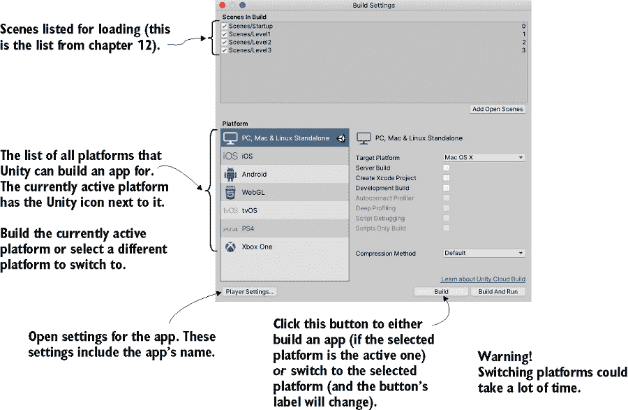

图 13.1 构建设置窗口

注意：在安装 Unity 时，Unity Hub 会询问你想要哪些导出模块，并且你只能构建所选的模块。如果你后来想要安装最初未选择的模块，请转到 Unity Hub 中的安装，点击你想要修改的 Unity 版本的三点，然后在菜单中选择添加模块。

在此窗口的底部还有玩家设置和构建/切换平台按钮。点击玩家设置可以查看检查器中应用程序的设置，例如应用程序的名称和图标。另一个按钮的标签会根据你在平台列表中选择的平台而变化。如果你已经选择了活动平台，点击构建将启动构建过程。对于任何其他平台，点击切换平台将使其成为 Unity 当前正在处理的活跃平台。

警告：在大型项目中，切换平台通常需要相当长的时间才能完成；请确保你已经准备好等待。这是因为 Unity 会以针对每个平台最优化的方式重新压缩所有资产（如纹理）。

提示：构建并运行与构建做同样的事情，但它会自动运行构建的应用程序。我通常想手动完成这部分，所以我很少使用构建并运行。

当你点击构建时，首先出现的是一个文件选择器，这样你就可以告诉 Unity 在哪里生成应用程序包。一旦你选择了文件位置，构建过程就开始了。Unity 为当前活动的平台创建一个可执行的应用程序包。让我们回顾一下最流行的平台的构建过程：桌面、网页和移动。

## 13.1 首先为桌面构建：Windows、Mac 和 Linux

当初学习如何构建 Unity 游戏时，最简单的地方是将游戏部署到桌面计算机——Windows PC、macOS 或 Linux。因为 Unity 在桌面计算机上运行，这意味着你将为正在使用的计算机构建应用程序。

注意：在本节中，打开任何项目进行工作。说真的，任何 Unity 项目都可以。实际上，我强烈建议在每个部分使用不同的项目，以强调 Unity 可以构建任何平台上的任何项目！

### 13.1.1 构建应用程序

首先选择文件 > 构建设置以打开构建设置窗口。默认情况下，当前平台将设置为 PC、Mac 和 Linux，但如果不是当前设置，请从列表中选择正确的平台并点击切换平台。

在窗口的右侧，你会注意到目标平台菜单。这个菜单允许你选择 Windows PC、macOS 和 Linux。在左侧的列表中，这三个平台被视为一个平台，但实际上它们是非常不同的平台，所以请选择正确的平台。

一旦你选择了桌面平台，点击构建。如前所述，会弹出一个文件对话框，允许你选择构建的应用程序将去哪里。然后开始构建过程；对于大型项目，这可能需要一段时间，但对于你一直在制作的微型演示，构建过程应该很快。

自定义构建后脚本

尽管基本构建过程在大多数情况下都能正常工作，但您可能希望在构建游戏时每次都执行一系列步骤（例如，将帮助文件移动到与应用程序相同的目录）。您可以通过编写在构建过程完成后执行的脚本轻松自动化此类任务。

首先，在项目视图中创建一个新的文件夹，并将其命名为 Editor；任何影响 Unity 编辑器（包括构建过程）的脚本都必须放在名为 Editor 的文件夹中。在该文件夹中创建一个名为 TestPostBuild 的新脚本，并在其中编写以下代码：

```
using UnityEngine;
using UnityEditor;
using UnityEditor.Callbacks;

public static class TestPostBuild {

   [PostProcessBuild]
   public static void OnPostprocessBuild(BuildTarget target, string 
   ➥ pathToBuiltProject) {
      Debug.Log($"build location: {pathToBuiltProject}");
   }
}
```

[PostProcessBuild]指令告诉脚本运行紧随其后的函数。该函数将接收构建应用程序的位置；然后您可以使用 C#提供的各种文件系统命令使用该位置。

应用程序将出现在您选择的地点；双击它以运行，就像任何其他程序一样。恭喜，这很简单！构建应用程序非常简单，但过程可以通过多种方式自定义；让我们看看如何调整构建过程。

提示：在 Windows 上使用 Alt-F4 或在 Mac 上使用 Cmd-Q 退出全屏游戏。完成的游戏应该有一个调用 Application.Quit()的按钮。

### 13.1.2 调整玩家设置：设置游戏名称和图标

返回构建设置窗口，但这次点击玩家设置而不是构建。在检查器中会出现一个巨大的设置列表（见图 13.2）；这些设置控制构建应用程序的多个方面。

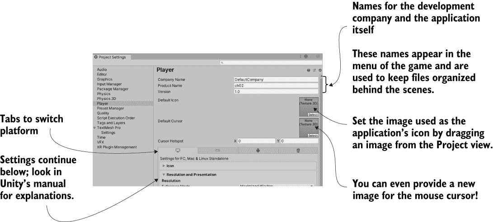

图 13.2 检查器中显示的玩家设置

由于设置众多，您可能需要查阅 Unity 的手册。相关文档页面是[`mng.bz/4Koa`](https://shortener.manning.com/4Koa)。

顶部的前几个设置最容易理解：公司名称、产品名称、版本和默认图标。为前三个输入值：公司名称是您的开发工作室名称，产品名称是这款特定游戏的名称，版本是随着游戏更新而增加的数字标识。然后从项目视图（如果需要，将图像导入到项目中）拖动一个图像，将其设置为图标；当应用程序构建时，此图像将作为应用程序的图标出现。

自定义应用程序的图标和名称对于使其看起来完整很重要。另一种自定义构建应用程序行为的有用方法是使用平台相关代码。

### 13.1.3 平台相关编译

默认情况下，您编写的所有代码将在所有平台上以相同的方式运行。但 Unity 提供了编译器指令（称为*平台定义*），这些指令会导致不同的代码在不同的平台上运行。您可以在手册中找到平台定义的完整列表，手册地址是[`mng.bz/Qq4w`](https://shortener.manning.com/Qq4w)。

如该页面所示，每个 Unity 支持的平台都有可用的指令，允许你在每个平台上运行不同的代码。通常，你的大部分代码不需要在平台指令内，但偶尔代码的某些小部分需要在不同的平台上以不同的方式运行。例如，某些代码组件仅在单个平台上存在，因此你需要在这些命令周围有平台编译器指令。以下列表显示了如何编写此类代码。

列表 13.1 PlatformTest 脚本展示如何编写平台相关代码

```
using System.Collections;
using System.Collections.Generic;
using UnityEngine;

public class PlatformTest : MonoBehaviour {
   void OnGUI() {
#if UNITY_EDITOR                                                   ❶
      GUI.Label(new Rect(10, 10, 200, 20), "Running in Editor");
#elif UNITY_STANDALONE                                             ❷
      GUI.Label(new Rect(10, 10, 200, 20), "Running on Desktop");
#else
      GUI.Label(new Rect(10, 10, 200, 20), "Running on other platform");
#endif
   }
}
```

❶ 此部分仅在编辑器内运行。

❷ 仅在桌面/独立应用程序中

创建一个名为 PlatformTest 的脚本，并将此列表中的代码写入其中。将此脚本附加到场景中的对象（任何对象都可以用于测试），屏幕左上角将出现一条小消息。当你使用 Unity 编辑器播放游戏时，消息将显示为在编辑器中运行，但如果你构建游戏并运行构建的应用程序，消息将显示为在桌面上运行。每种情况下都在运行不同的代码！

对于这个测试，你使用了将所有桌面平台视为一个平台的平台定义，但如该文档页面所示，Windows、Mac 和 Linux 都有单独的平台定义。实际上，Unity 支持的所有平台都有平台定义，这样你就可以在每个平台上运行不同的代码。让我们继续下一个重要的平台：网页。

质量设置

构建的应用程序还受位于编辑菜单下的项目设置的影响。特别是，最终应用程序的视觉质量可以在那里进行调整。转到编辑菜单中的项目设置以打开该窗口，然后从左侧菜单中选择质量。

质量设置显示在窗口的右侧，最重要的设置是顶部的一排复选框网格。Unity 可以针对的不同平台以图标形式列在顶部，可能的质量设置沿侧面列出。为该平台可用的质量设置已勾选，正在使用的设置复选框高亮显示为绿色。大多数情况下，这些设置默认为非常低，但如果东西看起来不好，你可以将其更改为超高质量；如果你点击平台列下的向下箭头，将出现一个弹出菜单。

这个 UI 既有复选框又有默认菜单，这似乎有点多余，但就是这样。不同的平台通常有不同的图形能力，因此 Unity 允许你为不同的构建目标设置不同的质量级别（例如，桌面上的最高质量，移动设备上的较低质量）。

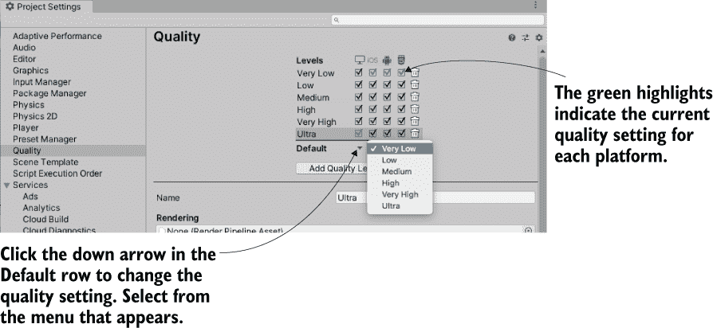

检查器中的质量设置网格

## 13.2 为网页构建

虽然桌面平台是构建的基本目标，但对于 Unity 游戏，另一个重要的平台是网页。部署到网页上的游戏在网页浏览器中运行，因此可以通过互联网进行游戏。

Unity Web Player 与 HTML5/WebGL 对比

最初，Unity 必须以在自定义浏览器插件中播放的形式部署网页构建。这长期以来一直是必要的，因为 3D 图形并未内置到网页浏览器中。然而，最终，大多数浏览器都采用了 WebGL，这是网页上 3D 图形的标准。技术上，WebGL 与 HTML5 是分开的，但这两个术语是相关的，并且在谈论网页上的 3D 时经常可以互换使用。

对于版本 5，Unity 将 WebGL 添加到了构建平台列表中，而在几个版本之后，浏览器插件被取消，使得 WebGL 成为网页构建的唯一途径。部分原因是 Unity（公司）内部做出的战略决策推动了 Unity 网页构建的这些变化。但这些变化也受到了浏览器制造商的推动，他们正在远离自定义插件，并拥抱 HTML5/WebGL 作为开发交互式网页应用（包括游戏）的方式。

### 13.2.1 在网页中嵌入游戏构建

打开一个不同的项目（再次强调，这是为了强调任何项目都可以使用），然后打开构建设置窗口。将平台切换到 WebGL，然后点击构建按钮。文件选择器将出现；为此应用程序输入名称 WebTest，如果需要，更改到一个安全的位置（不在 Unity 项目内的位置）。

构建过程现在将创建一个包含 index.html 网页的文件夹，以及包含所有游戏代码和其他资源的子文件夹。打开这个网页，游戏应该嵌入到原本空白的页面中间。您需要从 Web 服务器上运行游戏，而不是简单地打开 index.html 作为本地文件。就像第十章中提到的那样，如果您已经有了网站，可以使用现有的 Web 服务器，或者您可以在 http://localhost/ 上使用类似 XAMPP 的工具进行测试。

注意：您可能需要调整您的 Web 服务器设置，以正确处理 WebGL 构建中的压缩存档。Unity 的手册（[`mng.bz/XreG`](https://shortener.manning.com/XreG)）解释了这些服务器设置，但如果您由于某种原因无法调整这些设置（例如，游戏将位于您无法配置的第三方网站上），您也可以告诉 Unity 在构建中包含一个解压缩器。在 WebGL 播放器设置的发布设置部分开启解压缩器回退。此设置默认关闭，因为浏览器的解压缩更好。但请注意，当此设置开启时，您可能不会注意到服务器配置不当。

这个网页没有什么特别之处；它只是一个用来测试你的游戏的示例。你可以自定义该页面的代码，甚至提供你自己的网页（稍后讨论）。最重要的自定义之一是启用 Unity 和浏览器之间的通信，所以让我们接下来看看这一点。

### 13.2.2 与浏览器中的 JavaScript 通信

Unity 网页游戏可以与浏览器（或者更确切地说，与浏览器中运行的 JavaScript）通信，这些消息可以双向传递：从 Unity 到浏览器，以及从浏览器到 Unity。要向浏览器发送消息，你需要在代码库中编写 JavaScript 代码，然后 Unity 有特殊的命令来使用该库中的函数。

同时，对于来自浏览器的消息，浏览器中的 JavaScript 通过名称识别一个对象，然后 Unity 将消息传递到场景中命名的对象。因此，你必须有一个在场景中的对象，它将接收来自浏览器的通信。

为了演示这些任务，在 Unity 中创建一个名为 WebTestObject 的新脚本。同时，在活动场景中创建一个名为 JSListener 的空对象（场景中的对象必须具有该确切名称，因为这是列表 13.4 中 JavaScript 代码使用的名称）。将新脚本附加到该对象，然后编写此列表中的代码。

列表 13.2 测试与浏览器通信的 WebTestObject 脚本

```
using System.Runtime.InteropServices;
using UnityEngine;

public class WebTestObject : MonoBehaviour {
   private string message;

   [DllImport("__Internal")]                            ❶
   private static extern void ShowAlert(string msg);

   void Start() {
      message = "No message yet";
   }

   void Update() {
      if (Input.GetMouseButtonDown(0)) {                ❷
         ShowAlert("Hello out there!");
      }
   }

   void OnGUI() {
      GUI.Label(new Rect(10, 10, 200, 20), message);    ❸
   }

   public void RespondToBrowser(string message) {       ❹
      this.message = message;
   }
}
```

❶ 从 JS 库导入函数。

❷ 在鼠标点击时调用导入的函数。

❸ 在屏幕左上角显示消息。

❹ 浏览器调用的函数

主要的新功能是 DllImport 命令。它将 JavaScript 库中的一个函数导入到 C#代码中使用。这显然意味着你*有*一个 JavaScript 库，所以接下来编写它。

首先创建一个特殊的文件夹来包含它：创建一个名为 Plugins 的文件夹，并在其中创建一个名为 WebGL 的文件夹。现在在 WebGL 文件夹中放置一个名为 WebTest 的文件，扩展名为 jslib（因此为 WebTest.jslib）；最简单的方法是在 Unity 外创建一个文本文件，重命名它，然后将文件拖入。Unity 会识别该文件为 JavaScript 库，因此在该文件中编写此代码。

列表 13.3 WebTest JavaScript 库

```
mergeInto(LibraryManager.library, {

   ShowAlert: function(msg) {                ❶
      window.alert(Pointer_stringify(msg));
   },

});
```

❶ 从 C#导入并调用的函数

jslib 文件包含一个包含函数的 JavaScript 对象以及将自定义对象合并到 Unity 库管理器的命令。请注意，编写的函数除了标准的 JavaScript 命令外还包括 Pointer_stringify()；当从 Unity 传递字符串时，它会被转换为一个数字标识符，因此 Unity 提供该函数来查找指向的字符串。

现在再次为网页构建，以查看新代码的实际效果。当你在网页的 Unity 游戏部分内点击时，Unity 中的 WebTestObject 会调用 JavaScript 代码中的函数；尝试点击几次，你会在浏览器中看到一个警告框出现！

注意：Unity 还提供了 Application.ExternalEval() 来在浏览器中运行代码；ExternalEval 运行任意的 JavaScript 片段，而不是调用定义好的函数。这种方法已被弃用，应避免使用，但有时它的简单性很有用，比如使用 Application.ExternalEval("location.reload();") 来重新加载页面。

好的，你已经测试了从 Unity 游戏到网页中 JavaScript 的通信，但网页也可以向 Unity 发送消息，所以我们也来做这个。这会涉及到页面上的新代码和按钮；幸运的是，Unity 提供了一种简单的方式来自定义网页。具体来说，Unity 在构建到 WebGL 时会填充一个网页 *模板*，你可以选择一个自定义模板而不是默认模板。

默认模板可以在 Unity 安装文件夹中找到（在 Windows 上通常是 C:\Program Files\Unity\Editor\Data，在 Mac 上通常是 /Applications/Unity/Editor），位于 /WebGLSupport/BuildTools/WebGLTemplates 下。在文本编辑器中打开一个模板页面，你会看到模板主要是标准的 HTML 和 JavaScript，还有一些 Unity 替换为生成信息的特殊标签。虽然最好让 Unity 的内置模板保持原样，但它们（尤其是 *最小* 的一个）可以作为构建你自己的良好基础。你将把最小模板网页复制到你创建的自定义模板中。

在 Unity 的项目视图中，在 Assets 下的直接位置创建一个名为 WebGLTemplates 的文件夹（没有空格）；这是自定义模板存放的地方。现在在这个文件夹内创建一个名为 WebTest 的子文件夹；这个文件夹用于你的新模板。在这里放入一个 index.html 文件（你可以从最小模板中复制网页），在文本编辑器中打开它，并写入以下代码。

列表 13.4 WebGL 模板以启用浏览器-Unity 通信

```
<!DOCTYPE html>
<html lang="en-us">
  <head>
    <meta charset="utf-8">
    <meta http-equiv="Content-Type" content="text/html; charset=utf-8">
    <title>Unity WebGL Player | {{{ PRODUCT_NAME }}}</title>
    <style>body { background-color: #333; }</style>                            ❶
  </head>
  <body style="text-align: center">
    <canvas id="unity-canvas" width={{{ WIDTH }}} height={{{ HEIGHT }}} style="width: {{{ WIDTH }}}px; height: {{{ HEIGHT }}}px; background: {{{ BACKGROUND_FILENAME ? 'url(\'Build/' + BACKGROUND_FILENAME.replace(/'/g, '%27') + '\') center / cover' : BACKGROUND_COLOR }}}"></canvas>
    <br><input type="button" value="Send to Unity" onclick="SendToUnity();" /> ❷

    <script src="Build/{{{ LOADER_FILENAME }}}"></script>
    <script>
      var unityInstance = null;

      createUnityInstance(document.querySelector("#unity-canvas"), {
        dataUrl: "Build/{{{ DATA_FILENAME }}}",
        frameworkUrl: "Build/{{{ FRAMEWORK_FILENAME }}}",
        codeUrl: "Build/{{{ CODE_FILENAME }}}",
#if MEMORY_FILENAME
        memoryUrl: "Build/{{{ MEMORY_FILENAME }}}",
#endif
#if SYMBOLS_FILENAME
        symbolsUrl: "Build/{{{ SYMBOLS_FILENAME }}}",
#endif
        streamingAssetsUrl: "StreamingAssets",
        companyName: "{{{ COMPANY_NAME }}}",
        productName: "{{{ PRODUCT_NAME }}}",
        productVersion: "{{{ PRODUCT_VERSION }}}",
      }).then((createdInstance) => {
        unityInstance = createdInstance;
      });

      function SendToUnity() {
        unityInstance.SendMessage("JSListener",                                ❸
          "RespondToBrowser", "Hello from the browser!");
      }
    </script>
  </body>
</html>
```

❶ 将页面改为深色而不是白色

❷ 调用 JavaScript 函数的按钮

❸ SendMessage() 指向 Unity 中的命名对象。

如果你复制了最小模板，你会看到列表 13.4 只是在那里添加了几行。两个重要的新增内容是脚本标签中的一个函数和页面上的一个输入按钮；添加的样式改变了页面的颜色，使其更容易看到嵌入的游戏。按钮的 HTML 标签链接到一个 JavaScript 函数，该函数在 Unity 实例上调用 SendMessage()。这种方法在 Unity 中调用一个命名对象的函数；第一个参数是对象的名称，第二个参数是方法的名称，第三个参数是在调用方法时传递的字符串。

你已经制作了自定义模板，但你还必须告诉 Unity 使用这个模板而不是默认模板。再次打开 Player Settings（记住，在 Build Settings 窗口中点击 Player Settings）并找到网页设置中的 WebGL Template（如图 13.3 所示）。你会看到当前选择的是默认，但 WebTest（你创建的模板文件夹）也在列表中；点击它。

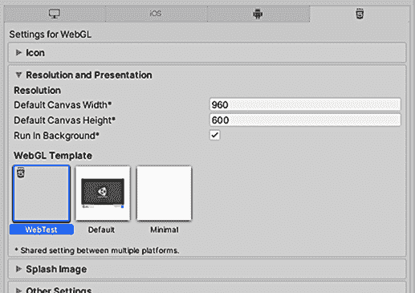

图 13.3 WebGL 模板设置

在选择了自定义模板后，再次构建到 WebGL。打开生成的网页，这次页面的底部有一个按钮。点击按钮，你将在 Unity 中看到显示的更改消息！

这就完成了 Web 构建的浏览器通信。接下来是构建应用程序的下一个重要平台（或者更确切地说，是一组平台）：移动。

## 13.3 为移动构建：iOS 和 Android

移动应用是 Unity 的重要构建目标之一。我的直观印象（完全非科学的）是，大多数使用 Unity 创建的商业游戏都是移动游戏。

**定义** *移动* 是手持计算设备的一个类别。这个分类最初始于智能手机，但现在也包括平板电脑。最广泛使用的两个移动计算平台是 iOS（来自苹果）和 Android（来自谷歌）。

为移动应用设置构建过程比桌面或 Web 构建更复杂，因此这是一个可选的部分——可选的意思是，你可以阅读它，但实际上不需要遵循步骤。我仍然会像你正在一起工作一样写，但你需要购买 iOS 的开发者许可证并安装所有 Android 的开发者工具。

**警告** 移动设备经历了如此快速的变化，以至于在你看这篇文档的时候，确切的构建过程可能略有不同。高级概念可能仍然正确，但你应该查看在线的最新文档，以获取执行命令和按钮的详细说明。首先，这里有一些来自苹果([`developer .apple.com/documentation/xcode`](https://developer.apple.com/documentation/xcode))和谷歌([`developer.android .com/studio/build`](https://developer.android.com/studio/build))的文档页面。

触摸输入

移动设备上的输入方式与桌面或 Web 不同。移动输入是通过触摸屏幕完成的，而不是通过鼠标和键盘。Unity 具有处理触摸的输入功能，包括像 Input.touchCount 和 Input.GetTouch()这样的代码。

你可能想使用这些命令在移动设备上编写特定平台的代码。然而，以这种方式处理输入可能会很麻烦，因此有代码框架可供简化触摸输入的使用。例如，在 Unity 的 Asset Store 上搜索 Fingers 或 Lean Touch。

好吧，把这些注意事项放一边，我将解释 iOS 和 Android 的整体构建过程。记住，这些平台偶尔会改变构建过程的细节。

### 13.3.1 设置构建工具

移动设备都与你在其上开发的计算机分开，这种分离使得构建和部署到设备的过程稍微复杂一些。在点击构建之前，你需要设置各种专用工具。

设置 iOS 构建工具

从高层次来看，在 iOS 上部署 Unity 游戏的过程首先需要从 Unity 构建一个 Xcode 项目，然后使用 Xcode 将该 Xcode 项目构建成一个 iOS 应用程序包（IPA）。Unity 无法直接构建最终的 IPA，因为所有 iOS 应用都必须通过苹果的构建工具。这意味着您需要安装 Xcode（苹果的编程 IDE），包括 iOS SDK。

**警告** 部署 iOS 游戏时，您必须在 Mac 上工作——Xcode 仅在 macOS 上运行。在 Unity 内部开发游戏可以在 Windows 或 Mac 上进行，但构建 iOS 应用必须在 Mac 上进行。

从苹果的网站上获取 Xcode，在开发者部分：[`developer.apple.com/xcode/`](https://developer.apple.com/xcode/).

**注意** 您需要成为苹果开发者计划成员才能在 App Store 上销售您的 iOS 游戏。苹果的开发者计划费用为 99 美元/年；在 [`developer.apple.com/programs/`](https://developer.apple.com/programs/) 注册。

Xcode 安装完成后，启动它并打开首选项以添加您的开发者账户。当 Xcode 在构建应用程序时访问您的账户时，您需要登录。

现在，回到 Unity 并切换到 iOS。您需要调整 iOS 应用的播放器设置（记住，打开构建设置并点击播放器设置）。您应该已经在播放器设置的 iOS 选项卡上，但如果需要，请点击带有 iOS 图标的选项卡。向下滚动到其他设置，然后查找识别。Bundle Identifier 需要调整，以便苹果能够正确识别应用程序。

**注意** iOS 称之为 Bundle Identifier，而 Android 称之为 Package Name，但在两个平台上命名方式相同。标识符应遵循任何代码包的相同约定：所有小写，形式为 com.companyname.productname。

另一个适用于 iOS 和 Android 的重要设置是版本（这是应用程序的版本号）。大多数超出该范围的设置都是平台特定的；例如，iOS 添加了一个额外的构建号，与主要版本号分开。还有一个脚本后端设置；过去总是使用 Mono，但较新的 IL2CPP 后端支持 iOS 更新，如 64 位二进制文件。

**注意** iOS 从 Unity 构建的版本既不支持真实设备（iPhone 和 iPad）也不支持 iOS 模拟器。默认情况下，iOS 从 Unity 构建的版本仅在真实设备上工作，但您可以通过在播放器设置中向下滚动到目标 SDK 来切换到为模拟器构建。实际上，我从未这样做过，因为我的所有“在真实设备之外”的测试工作都是在 Unity 本身完成的，如果我要进行 iOS 构建，那么我想要在真正的手机上运行它。

现在，在构建设置窗口中点击构建。选择构建文件的存储位置，这将在此位置生成一个 Xcode 项目；您可能想要点击按钮创建一个新文件夹，然后选择该新创建的文件夹。

生成的结果的 Xcode 项目可以修改（简单的修改可以是构建脚本的一部分）。无论如何，打开 Xcode 项目；构建文件夹中有许多文件，但双击 .xcodeproj 文件（它有一个蓝图图标）。Xcode 将以加载此项目的方式打开。Unity 已经处理了项目中所需的大部分设置，但你确实需要调整正在使用的配置文件。

iOS 配置文件

在 iOS 开发的所有方面中，配置文件是最不寻常的。简而言之，这些是用于身份验证和授权的文件。苹果严格控制哪些应用程序可以在哪些设备上运行；提交给苹果进行审核的应用程序使用特殊的配置文件，允许它们通过 App Store 运行，而开发中的应用程序使用特定于注册设备的配置文件。

你需要将你的 iPhone 的 UDID（一个特定于你的设备的 ID）和应用程序的 ID（Unity 中的包标识符）添加到苹果 iOS 开发者网站上的你的账户中。有关此过程的完整说明，请访问 [`developer.apple.com/support/code-signing/`](https://developer.apple.com/support/code-signing/)。

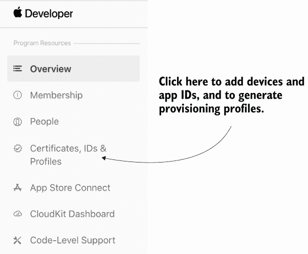

在 iOS 开发中心如何管理配置文件

Xcode 将尝试自动设置签名配置文件，这就是为什么你之前在“首选项”中添加了你的账户。在 Xcode 左侧的项目列表中选择你的应用程序，与所选项目相关的几个选项卡将出现。点击“签名与能力”选项卡，然后点击“团队”菜单以选择注册在苹果开发者计划中的团队（见图 13.4）。如果出于某种原因你不想让 Xcode 自动管理签名，可以在构建设置选项卡中向下滚动到“签名”手动调整配置文件。

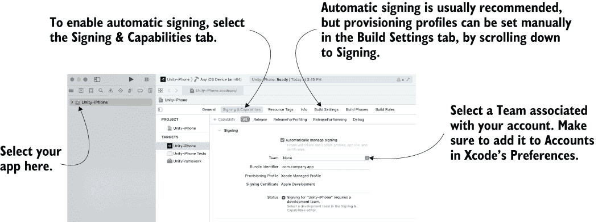

图 13.4 Xcode 中的配置/签名设置

一旦设置了配置文件，你就可以构建应用程序了。从“产品”菜单中选择运行或归档。产品菜单有很多选项，包括诱人的“构建”名称，但对我们来说，有用的两个选项是运行和归档。构建生成可执行文件，但不为 iOS 打包，而运行和归档正是这样做的：

+   运行将在通过 USB 线缆连接到计算机的 iPhone 上测试应用程序。

+   归档将创建一个应用程序包，可以发送到其他注册的设备（无论是发布还是通过苹果所说的*临时分发*进行测试）。

归档不会直接创建应用程序包，而是在原始代码文件和 IPA 之间的中间阶段创建一个包。创建的归档将列在 Xcode 的 Organizer 窗口中；在那个窗口中，选择生成的归档，然后在右侧点击分发应用程序。点击后，您将被询问是否要在商店或临时分发应用程序。

如果您选择临时分发，您将得到一个 IPA 文件，可以发送给测试人员。您可以直接发送文件让他们通过 iTunes 安装，但设置一个网站来处理分发和安装测试构建会更方便。或者，对于已上传到商店但尚未提交的构建，可以使用 TestFlight ([`developer.apple.com/testflight/`](https://developer.apple.com/testflight/))。

设置 Android 构建工具

与 iOS 应用不同，Unity 可以直接生成最终的 Android 应用程序（无论是 APK，即 Android 应用包，还是 AAB，即 Android 应用包），这需要将 Unity 指向 Android SDK，其中包含必要的编译器。您可以选择在 Unity 中安装 Android SDK 以及 Android 构建模块，或者从 Android Studio 内部安装它，并在 Unity 的首选项中指向该文件位置（见图 13.5）。您可以从[`developer.android.com/studio`](https://developer.android.com/studio)下载 Android 构建工具。


图 13.5 Unity 首选项设置以指向 Android SDK

在 Unity 的首选项中设置 Android SDK 后，您需要指定与应用程序标识符，就像您为 iOS 所做的那样。您将在玩家设置中找到包名；将其设置为 com.companyname.productname（如之前设置 iOS 的包标识符时所述）。然后点击构建以开始过程。与所有构建一样，Unity 将首先询问文件保存位置。然后它将在该位置创建一个 APK 文件。

现在您有了应用程序包，必须在设备上安装它。您可以通过从网络（如 Google Drive 这样的云存储对这一目的很有用）下载文件或将文件通过连接到计算机的 USB 电缆（这种方法被称为*侧载*）传输到 Android 手机上，将 APK 文件安装到 Android 手机上。通过 USB 传输文件的具体细节因设备而异，但一旦文件到达那里，就可以使用文件管理器应用程序安装文件。我不知道为什么文件管理器没有内置到 Android 中，但您可以从 Google Play Store 免费安装一个。在文件管理器中导航到您的 APK 文件，然后安装应用程序。

Android 构建的 APK 与 AAB

自从 Android 诞生以来，应用程序都是以 APK（Android 应用程序包）文件的形式进行分发的。然而，谷歌已经支持 AAB（Android 应用包，一种替代的应用文件格式）有一段时间了，并且已经开始要求将此格式用于提交到 Play Store 的应用程序。应用包允许 Play Store 生成一个专为特定用户下载的小型应用程序包，而不是将每个设备的支持都嵌入到单个应用程序包中，从而生成更小的文件。

Unity 在构建设置窗口中支持这两种格式。当您选择 Android 平台时，查找“构建应用包”复选框；对于 APK，请取消选中该复选框，或者对于 AAB，请选中该复选框。通常在测试时构建 APK 文件会更好（因为它们更容易在测试设备上安装），然后为最终版本提交到 Play Store 构建 AAB。

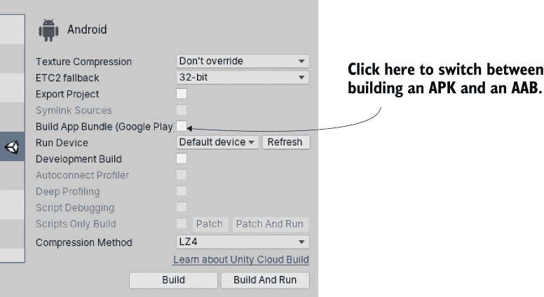

在 APK 和 AAB 之间切换 Android 构建的位置

如您所见，Android 的基本构建过程比 iOS 的构建过程简单得多。不幸的是，自定义构建和实现插件的流程比 iOS 复杂；您将在稍后了解如何操作。但在那之前，让我们先谈谈纹理压缩。

### 13.3.2 纹理压缩

资产可能会消耗大量内存，这尤其包括纹理。为了减少它们的文件大小，您可以通过各种方式压缩资产，每种方法都有其优缺点。由于这些优缺点，您可能需要调整 Unity 压缩纹理的方式。

在移动设备上管理纹理压缩是至关重要的，尽管从技术上讲，其他平台也经常压缩纹理。但您不必对其他平台的压缩那么关注，原因有很多——最主要的原因是平台在技术上更加成熟。在移动设备上，您需要更加关注纹理压缩，因为设备对这一细节更加敏感。

Unity 会自动为您压缩纹理。在大多数开发工具中，您需要自己压缩图像，但在 Unity 中，您通常导入未压缩的图像，然后在图像的导入设置中应用图像压缩（见图 13.6）。

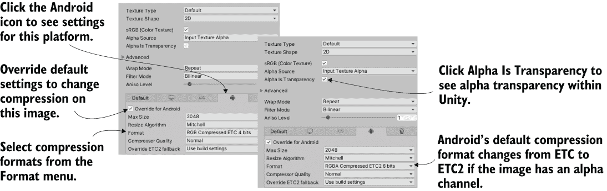

图 13.6 检查器中的纹理压缩设置

压缩设置在不同平台上有所不同，因此当您切换平台时，Unity 会重新压缩图像。最初，设置是默认值，您可能需要根据特定图像和特定平台进行调整。特别是，在 Android 上对图像压缩更为复杂。这主要是因为 Android 设备的碎片化：由于所有 iOS 设备都使用相当相同的视频硬件，iOS 应用可以针对其图形芯片（GPU）进行纹理压缩优化。Android 应用没有享受相同的硬件一致性，因此它们的纹理压缩必须针对最低的共同点。

更具体地说，所有 iOS 设备都使用（或者更确切地说，曾经使用，并且仍然与 PowerVR GPU 保持兼容性）PowerVR GPU。因此，iOS 应用可以在所有 iOS 设备上使用优化的 PowerVR 纹理压缩（PVRTC），或者甚至使用自 iPhone 6 版本以来所有 iPhone 都支持的较新的 ASTC 格式。一些 Android 设备也使用 PowerVR 芯片，但它们同样频繁地使用来自高通的 Adreno 芯片、ARM 的 Mali GPU 或其他选项。因此，Android 应用通常依赖于爱立信纹理压缩（ETC），这是一种所有 Android 设备都支持的更通用的压缩算法。Unity 默认为具有 alpha 通道的纹理使用 ETC2（更先进的第二个版本），因为原始 ETC 压缩格式没有 alpha 通道，但请注意，较旧的 Android 设备可能不支持 ETC2。

这种默认设置在大多数情况下效果相当不错，但如果您需要调整纹理的压缩，请调整图 13.6 中显示的设置。点击 Android 图标标签页以覆盖该平台的默认设置，然后使用格式菜单选择特定的压缩格式。特别是，您可能会发现某些关键图像需要解压缩；尽管它们的文件大小会大得多，但图像质量会更好。只要您压缩大多数纹理，并且仅在特定情况下选择不压缩，增加的文件大小可能不会太糟糕。在讨论了这一点之后，移动开发的最后一个主题是开发本地插件。

### 13.3.3 开发插件

Unity 内置了大量的功能，但这些功能主要限于所有平台都通用的功能。利用特定平台的工具包（例如 Android 上的 Play Game Services）通常需要为 Unity 添加插件。

TIP 在 iOS 和 Android 特定功能方面，有多种预制的移动插件可供使用；附录 D 列出了几个获取移动插件的地方。这些插件以这里描述的方式运行，但插件代码已经为您准备好了。

与移动插件通信的过程与与浏览器的通信过程类似。在 Unity 的那一侧，特殊的命令调用插件中的函数。在插件那一侧，插件可以使用 SendMessage() 向 Unity 场景中的对象发送消息。在不同的平台上，具体的代码可能不同，但基本思想始终相同。

警告：就像初始构建过程一样，移动原生开发的过程往往会频繁变化——不是过程的一端，而是原生代码部分。我会从高层次上介绍这些内容，但你应该在网上查找最新的文档。

两个平台的插件都在 Unity 中的同一位置。如果需要，在项目视图中创建一个名为 Plugins 的文件夹；然后在 Plugins 中为 Android 和 iOS 各创建一个文件夹。一旦它们被放入 Unity 中，插件文件也有针对它们应用的平台的设置。通常，Unity 会自动处理这些设置（iOS 插件设置为 iOS，Android 插件设置为 Android 等），但如果需要，请在检查器中查找这些设置。

iOS 插件

插件实际上只是被 Unity 调用的原生代码。首先，在 Unity 中创建一个脚本以处理原生代码；将这个脚本命名为 TestPlugin（参见下一列表）。

列表 13.5 调用 iOS 原生代码的 TestPlugin 脚本

```
using System;
using System.Collections;
using System.Runtime.InteropServices;
using UnityEngine;

public class TestPlugin : MonoBehaviour {
   private static TestPlugin _instance;

   public static void Initialize() {                    ❶
      if (_instance != null) {
         Debug.Log("TestPlugin instance was found. Already initialized");
         return;
      }
      Debug.Log("TestPlugin instance not found. Initializing...");

      GameObject owner = new GameObject("TestPlugin_instance");
      _instance = owner.AddComponent<TestPlugin>();
      DontDestroyOnLoad(_instance);
   }

   #region iOS                                          ❷
   [DllImport("__Internal")]                            ❸
   private static extern float _TestNumber();           ❸

   [DllImport("__Internal")]
   private static extern string _TestString(string test);
   #endregion iOS

   public static float TestNumber() {
      float val = 0f;
      if (Application.platform == RuntimePlatform.IPhonePlayer)
         val = _TestNumber();                           ❹
      return val;
   }

   public static string TestString(string test) {
      string val = "";
      if (Application.platform == RuntimePlatform.IPhonePlayer)
         val = _TestString(test);
      return val;
   }
}
```

❶ 对象是在这个静态函数中创建的，因此你不必在编辑器中创建它。

❷ 标识代码段落的标签；标签本身并不做任何事情。

❸ 参考 iOS 代码中的函数。

❹ 如果平台是 IPhonePlayer，则调用此函数。

首先，请注意静态 Initialize() 函数在场景中创建了一个永久对象，这样你就不必在编辑器中手动创建它。你之前没有看到过从头创建对象的代码，因为使用预制体在大多数情况下要简单得多，但在这个例子中，在代码中创建对象更干净（这样你就可以使用插件脚本而无需编辑场景）。

这里进行的主要魔法涉及 DllImport 和 static extern 命令。这些命令告诉 Unity 连接到你提供的原生代码中的函数。然后你可以在这段脚本的函数中使用这些引用的函数（同时检查代码是否在 iPhone/iOS 上运行）。

接下来，你将使用这些插件函数来测试它们。创建一个新的脚本名为 MobileTestObject，在场景中创建一个空对象，然后将脚本附加到该对象上。

列表 13.6 从 MobileTestObject 使用插件

```
using System.Collections;
using System.Collections.Generic;
using UnityEngine;

public class MobileTestObject : MonoBehaviour {
   private string message;

   void Awake() {
      TestPlugin.Initialize();                            ❶
   }

   // Use this for initialization
   void Start() {
      message = "START: " + TestPlugin.TestString("ThIs Is A tEsT");
   }

   // Update is called once per frame
   void Update() {

      // Make sure the user touched the screen
      if (Input.touchCount==0){return;}

      Touch touch = Input.GetTouch(0);                    ❷
      if (touch.phase == TouchPhase.Began) {
         message = "TOUCH: " + TestPlugin.TestNumber();
      }
   }

   void OnGUI() {
      GUI.Label(new Rect(10, 10, 200, 20), message);      ❸
   }
}
```

❶ 在开始时初始化插件。

❷ 响应触摸输入。

❸ 在屏幕角落显示一条消息。

列表中的脚本初始化插件对象，然后根据触摸输入调用插件方法。一旦在设备上运行，你会在屏幕角落看到测试信息在每次点击屏幕时改变。

最后要做的就是编写 TestPlugin 引用的原生代码。iOS 设备上的代码使用 Objective C 和/或 C（或 Swift，但我们不会使用该语言），因此你需要一个.h 头文件和一个.mm 实现文件。如前所述，它们需要放在项目视图中的 Plugins/iOS/文件夹中。在 TestPlugin.h 和 TestPlugin.mm 中创建它们；在.h 文件中，编写此代码。

列表 13.7 iOS 代码的 TestPlugin.h 头文件

```
#import <Foundation/Foundation.h>

@interface TestObject : NSObject {
NSString* status;
}

@end
```

寻找关于 iOS 编程的解释来了解这个头文件的作用；解释 iOS 编程超出了本书的范围。将此列表中的代码写入.mm 文件。

列表 13.8 TestPlugin.mm 实现

```
#import "TestPlugin.h"

@implementation TestObject
@end

NSString* CreateNSString (const char* string)
{
if (string)
return [NSString stringWithUTF8String: string];
else
return [NSString stringWithUTF8String: ""];
}

char* MakeStringCopy (const char* string)
{
if (string == NULL)
return NULL;

char* res = (char*)malloc(strlen(string) + 1);
strcpy(res, string);
return res;
}

extern "C" {
    const char* _TestString(const char* string) {
        NSString* oldString = CreateNSString(string);
        NSString* newString = [oldString lowercaseString];
        return MakeStringCopy([newString UTF8String]);
    }

    float _TestNumber() {
        return (arc4random() % 100)/100.0f;
    }
}
```

再次，对这个代码的详细解释略超出了本书的范围。注意，许多字符串函数都是为了将 Unity 对字符串数据的表示转换为原生代码。

TIP 本示例仅在一个方向上进行通信，即从 Unity 到插件。但原生代码也可以通过使用 UnitySendMessage()方法与 Unity 进行通信。你可以向场景中的命名对象发送消息；在初始化过程中，插件创建了 TestPlugin_instance 以发送消息。

在原生代码就绪后，你可以构建 iOS 应用并在设备上进行测试。角落的消息最初将全部为小写；然后点击屏幕，观察显示的数字。非常酷！

更多信息，请访问[`docs.unity3d.com/Manual/PluginsForIOS.html`](https://docs.unity3d.com/Manual/PluginsForIOS.html)。这是创建 iOS 插件的方法，那么让我们也看看 Android。

Android 插件

要创建 Android 插件，Unity 方面的操作几乎完全相同。你根本不需要修改 MobileTestObject。在 TestPlugin 中添加这里显示的添加项。

列表 13.9 修改 TestPlugin 以使用 Android 插件

```
...
   #region iOS
   [DllImport("__Internal")]
   private static extern float _TestNumber();

   [DllImport("__Internal")]
   private static extern string _TestString(string test);
   #endregion iOS

#if UNITY_ANDROID
   private static Exception _pluginError;
   private static AndroidJavaClass _pluginClass;                  ❶
   private static AndroidJavaClass GetPluginClass() {             ❶
      if (_pluginClass == null && _pluginError == null) {         ❶
         AndroidJNI.AttachCurrentThread();
         try {
            _pluginClass = new AndroidJavaClass("com.testcompany.testplugin.TestPlugin");   ❷
         } catch (Exception e) {
            _pluginError = e;
         }
      }
      return _pluginClass;
   }

   private static AndroidJavaObject _unityActivity;
   private static AndroidJavaObject GetUnityActivity() {
      if (_unityActivity == null) {
         AndroidJavaClass unityPlayer = new AndroidJavaClass("com.unity3d.player.UnityPlayer");          ❸
         _unityActivity = unityPlayer.GetStatic<AndroidJavaObject>("currentActivity");
      }
      return _unityActivity;
   }
#endif

   public static float TestNumber() {
      float val = 0f;
      if (Application.platform == RuntimePlatform.IPhonePlayer)
         val = _TestNumber();
#if UNITY_ANDROID
      if (!Application.isEditor && _pluginError == null)
         val = GetPluginClass().CallStatic<int>("getNumber");     ❹
#endif
      return val;
   }

   public static string TestString(string test) {
      string val = "";
      if (Application.platform == RuntimePlatform.IPhonePlayer)
         val = _TestString(test);
#if UNITY_ANDROID
      if (!Application.isEditor && _pluginError == null)
         val = GetPluginClass().CallStatic<string>("getString", test);
#endif
      return val;
   }
}
```

❶ Unity 提供的 AndroidJNI 功能

❷ 你编写的类的名称；根据需要更改此名称。

❸ Unity 为 Android 应用创建一个 Activity。

❹ 调用.plugin 中的函数

你会注意到大部分添加都是在 UNITY_ANDROID 平台定义内部发生的。正如本章前面所解释的，这些编译器指令使得代码仅适用于某些平台，在其他平台上被省略。而 iOS 代码没有做任何会在其他平台上出错的事情（它不会做任何事情，但也不会引起错误），Android 插件的代码只有在 Unity 设置为 Android 平台时才会编译。

特别注意对 AndroidJNI 的调用。这是 Unity 连接到原生 Android 的系统。另一个可能令人困惑的词是 Activity；在 Android 应用中，Activity 是一个应用进程。Unity 游戏是 Android 应用的一个 Activity，因此插件代码需要访问该 Activity，以便在需要时传递它。

最后，你需要原生 Android 代码。iOS 代码是用 Objective C 和 C 等语言编写的，而 Android 是用 Java（或 Kotlin，但我们将使用 Java）编写的。但你不能简单地提供插件的原始 Java 代码；插件必须是从 Java 代码打包的 JAR。在这里，Android 编程的细节超出了 Unity 介绍的范畴，但我们将简要介绍基础知识。首先，如果你在下载 Android SDK 时没有这样做，你应该安装 Android Studio。

图 13.7 展示了在 Android Studio 中设置插件项目的步骤（包含来自版本 4.2.1 的截图）：

1.  通过在启动窗口中选择或在文件 > 新建 > 新建项目下进行操作来创建一个新项目。

1.  在出现的“新建项目”窗口中，选择无活动模板（因为这是一个插件，而不是独立的 Android 应用程序）并点击下一步。

1.  现在将其命名为 TestPluginProj；对于这个测试，最小 SDK 版本不重要，但请记住项目位置，因为稍后你需要找到它。点击完成以创建新项目，如果需要加载，请再次点击完成以关闭窗口。

1.  一旦出现编辑视图，选择文件 > 新建 > 新模块以添加库。

1.  选择 Android 库，命名为 testplugin，将包名改为 com.testcompany.testplugin，然后点击完成。

1.  在添加了该模块后，选择构建 > 选择构建变体；在打开的面板中，点击 TestPluginProj.testplugin 的活动构建变体并选择发布。

1.  现在在项目面板的上方展开 testplugin > java，右键单击 com.testcompany.testplugin，并选择新建 > Java 类。

1.  打开一个小窗口以配置新类，因此输入名称 TestPlugin 并按 Enter。

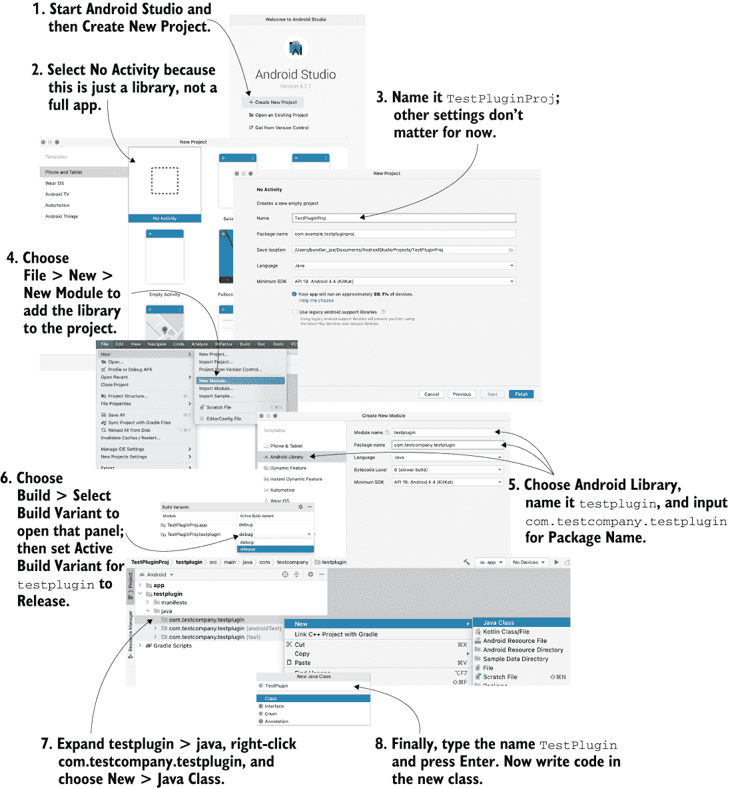

图 13.7 设置 Android Studio 以构建插件

TestPlugin 目前为空，所以可以在其中编写插件函数。列表 13.10 展示了插件的 Java 代码。

列表 13.10 编译成 JAR 的 TestPlugin.java

```
package com.testcompany.testplugin;

public class TestPlugin {
   private static int number = 0;

   public static int getNumber() {
      number++;
      return number;
   }

   public static String getString(String message) {
      return message.toLowerCase();
   }
}
```

好的，现在你可以将此代码打包成一个 JAR（或者更确切地说是一个包含 JAR 的 Android 存档文件）。在顶部菜单中，选择构建 > 生成项目。一旦构建完成，转到你的电脑上的项目，在 <*项目位置*>/testplugin/build/outputs/aar/ 中找到 testplugin-release.aar。将存档文件拖到 Unity 的 Android 插件文件夹中导入。

Android 的清单和资源文件夹

对于这个简单的测试插件来说，这不是必需的，但 Android 插件通常必须编辑清单文件。所有 Android 应用程序都受一个名为 AndroidManifest.xml 的主要配置文件控制；如果你没有提供，Unity 会创建一个基本的清单文件，但你也可以手动提供一个，将其放在 Plugins/Android/ 与插件一起。

Unity 在运行时会向项目中添加一个 Temp 文件夹，当构建 Android 应用程序时，Unity 会将生成的清单文件放在那里（StagingArea/UnityManifest.xml）。将此文件复制出来进行手动编辑；本章的代码下载包括一个示例清单文件。

同样，有一个名为*res*的文件夹，你可以将自定义图标等资源放在那里。要用自己的资源替换这个生成的文件夹，你可以在 Android 插件文件夹中创建一个 res 文件夹。

在 Plugins/Android 的存档文件中构建游戏，并将其安装到设备上，每次你点击屏幕时，消息都会改变。同样，像 iOS 插件一样，Android 插件可以使用 UnityPlayer.UnitySendMessage()与场景中的对象通信。Java 代码需要导入 Unity 的 Android Player 库，该库位于 Unity 安装文件夹中（在 Windows 上通常是 C:\Program Files\ Unity\Editor\Data，在 Mac 上通常是/Applications/Unity/Editor），路径为/PlaybackEngines/AndroidPlayer/Variations/mono/Release/Classes/classes.jar。

我知道我在开发 Android 库时省略了很多内容，但这是因为这个过程既复杂又经常变化。如果你足够高级，可以开发 Android 游戏的插件，你将不得不在 Android 的开发者网站上查找文档，并参考 Unity 的文档，请参阅[`mng.bz/yJKG`](http://mng.bz/yJKG)。

## 13.4 开发 XR（包括 VR 和 AR）

注意：缩写*XR*代表*扩展现实*，这个术语包括*虚拟现实*（VR）和*增强现实*（AR）。VR 指的是将用户完全沉浸在合成环境中，而 AR 指的是向自然环境添加计算机图形，但两者都属于调节用户周围环境的技术的范畴。

XR 是本章最后讨论的“平台”。“平台”这个词加了引号，因为 XR 在构建应用程序时并不被视为一个独立平台。相反，XR 支持来自可以添加到相关构建平台（如桌面 VR 或移动 AR）的插件包。让我们先了解一下这是如何工作的，首先是 VR，然后是 AR。

### 13.4.1 支持虚拟现实头戴式设备

目前市场上主要的 VR 设备有 Oculus Quest、HTC VIVE、Valve Index 和 PlayStation VR。忽略 PlayStation VR（因为这本书不涵盖控制台开发），所有其他设备都是通过添加 VR SDK 到 Unity 的 PC 构建目标，或者（在 Oculus Quest 的情况下）到 Android 中支持的。

有多种这样的 SDK 可供选择，通过 Unity 的包管理器进行分发。例如，浏览 Unity 注册表以找到 Oculus XR 或 Windows XR 等选项。同时，Unity 开发者还提供了一个有吸引力的选项，即 XR 交互工具包，但这个包稍微难找一些。因为这个包还不被认为完整（尽管在 AR 支持方面大部分不完整；VR 支持相当稳固），它被视为预览包。默认情况下，标记为*预览*的包不会显示，但你可以通过调整包管理器窗口的设置来显示预览包（见图 13.8）。


图 13.8 如何在包管理器中查看预览包

安装 XR 包后，你必须在项目设置中启用它（记住，那是编辑 > 项目设置）在 XR 插件管理下（如图 13.9 所示）。


图 13.9 在项目设置中管理 XR 插件

注意：XR 插件管理*本身*是一个包，尽管它应该与你选择的任何其他 XR 包一起安装。如果那些设置没有出现，你可能需要手动安装该包。

我们不会介绍任何特定 VR 设备的代码，因为可供选择的选择太多。相反，我鼓励你访问相关 XR 插件的文档：

+   XR 交互工具包: [`mng.bz/Mv67`](http://mng.bz/Mv67)

+   Oculus XR: [`mng.bz/aZjz`](http://mng.bz/aZjz)

+   Windows XR: [`mng.bz/g16l`](http://mng.bz/g16l)

+   OpenXR: [`mng.bz/ePNz`](http://mng.bz/ePNz)

然而，我们将实现一个简单的示例来帮助解释 AR。

### 13.4.2 移动增强现实 AR 基础库

与 VR 不同，增强现实不一定意味着需要头戴式显示器（HMD）。当然，*可以*涉及 HMD，Unity 支持 HoloLens 和 Magic Leap 等设备。然而，AR 也可以通过手机实现，有时被称为*手持增强现实*。

苹果和谷歌分别为 iOS 和 Android 平台上的手持增强现实提供了 SDK。苹果的 SDK 称为 ARKit，而谷歌提供 ARCore。然而，这些库是特定于这些平台的，因此 Unity 提供了一个名为*AR 基础库*的跨平台包装器。作为开发者，重要的是要理解你实际上是在 ARKit 或 ARCore 的底层工作，但你编写的代码是针对 AR 基础库的 API。

首先，创建一个新的 Unity 项目。在这个新项目中，进入包管理器并安装 AR 基础库，同时根据你正在为哪个移动平台开发，安装 ARKit XR 或 ARCore XR（或两者都安装！）。然后，在 XR 插件管理中启用 ARKit 或 ARCore（如图 13.9 所示）。

注意：ARKit 的面部跟踪部分有一个与 ARKit 其余部分分开的包。这是因为苹果会拒绝提交包含面部跟踪代码但实际并未进行面部 AR 的应用。因此，如果您不进行面部 AR，请仅安装主要的 ARKit XR 插件包；如果您进行面部 AR，请安装两个包。

ARKit 和 ARCore 在 iOS 和 Android 平台上都有要求，必须在玩家设置中满足（见图 13.10a 和 b）。在 Android 上，首先从图形 API 列表中移除 Vulkan（选择 Vulkan，然后点击减号按钮），然后向下滚动并将最小 API 级别更改为 24。在 iOS 上，将最小 iOS 版本设置为 11，确保架构设置为 ARM64，打开需要 ARKit 设置，并输入相机使用描述（例如，用于 AR 的相机）。

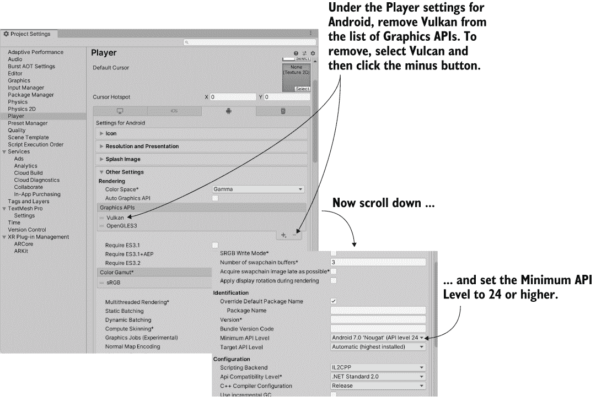

图 13.10a 调整 Android 设置以支持 AR

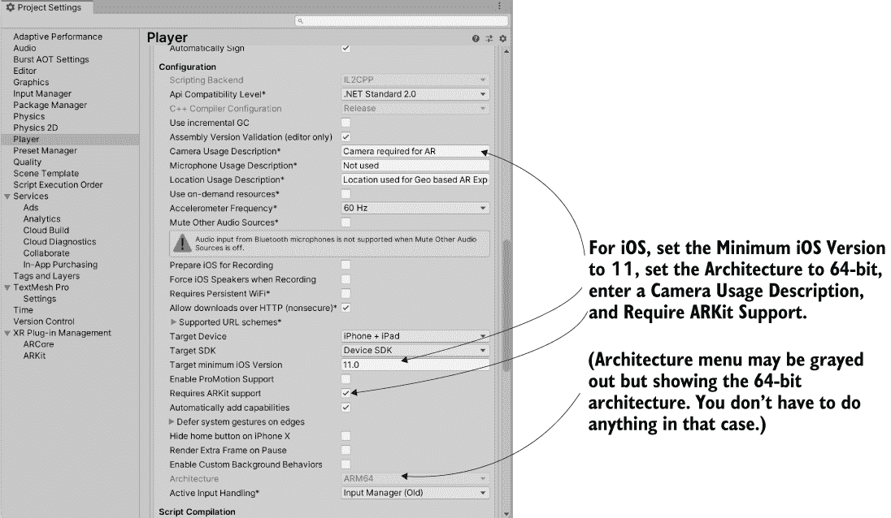

图 13.10b 调整 iOS 设置以支持 AR

ARKit 需要这些 iOS 设置才能运行，ARCore 需要这些 Android 设置。在玩家设置中进行了所有必要的调整后，接下来设置场景中需要的各种对象。如图 13.11 所示，步骤如下：

1.  从 GameObject 菜单中选择 XR > AR Session。

1.  选择 GameObject > XR > AR Session Origin。

1.  选择 GameObject > XR > AR 默认平面。

1.  删除主摄像头（因为会话原点已经包含了一个用于 AR 的摄像头设置）。

1.  创建一个空的 GameObject 并将其命名为 Controllers。

接下来，创建一个新的 C# 脚本，命名为 PlaneTrackingController，并将列表 13.11 写入其中。

列表 13.11 使用 AR Foundation 的 PlaneTrackingController 脚本

```
using System.Collections;
using System.Collections.Generic;
using UnityEngine;
using UnityEngine.XR.ARFoundation;
using UnityEngine.XR.ARSubsystems;

public class PlaneTrackingController : MonoBehaviour {
    [SerializeField] ARSessionOrigin arOrigin = null;
    [SerializeField] GameObject planePrefab = null;                        ❶

    private ARPlaneManager planeManager;

    void Start() {
        planeManager = arOrigin.gameObject.AddComponent<ARPlaneManager>(); ❷
        planeManager.detectionMode = PlaneDetectionMode.Horizontal;
        planeManager.planePrefab = planePrefab;
    }
}
```

❶ 这应该是来自 XR 对象的平面预制件，而不仅仅是任何游戏对象。

❷ 也可以在编辑器中添加此组件，但我们将通过代码添加。

此脚本向会话原点添加了一个名为 ARPlaneManager 的组件，并为平面管理器分配了一些设置，包括用于可视化检测到的平面的对象。此组件可以在编辑器中添加，但通过代码添加提供了更多控制 AR 的灵活性。

将此脚本拖到 Controllers 对象上，将其链接为组件。现在（如图 13.11 所示），将 AR Session Origin 和 AR Default Plane 拖到检查器中的组件槽位。

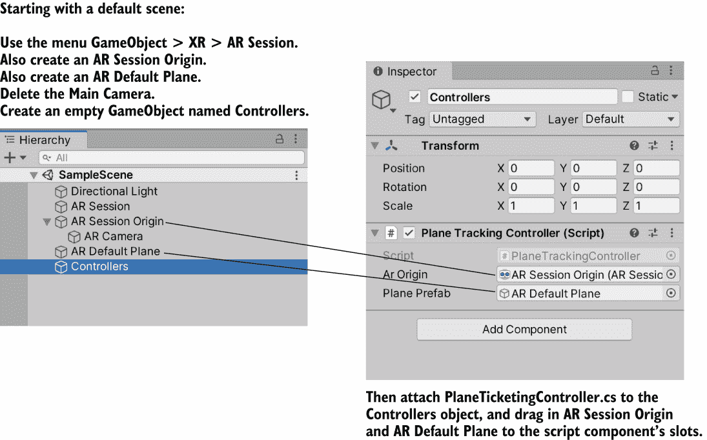

图 13.11 简单 AR 场景中设置对象

一切准备就绪后，构建移动应用以查看平面跟踪功能。由于 PlaneTrackingController 使用 AR Foundation（而不是 ARKit 或 ARCore），项目应该能在 iOS 和 Android 上运行。一旦应用在您的设备上运行，您应该会在移动摄像头时看到类似于图 13.12 的内容。


图 13.12 AR 平面检测动作图

太好了，环境中的平面正在被检测到！然而，目前除了计算机检测到表面之外，没有其他动作。也就是说，没有东西被放置在检测到的表面上。AR Foundation 提供了几个有用的功能，不仅仅是平面跟踪，另一个有用的功能是对检测到的 AR 表面进行射线投射。按照列表 13.12 添加进行 AR 射线投射的代码。

列表 13.12 向 PlaneTrackingController 添加射线投射

```
...
    private ARPlaneManager planeManager;
    private ARRaycastManager raycastManager;                         ❶
    private GameObject prim;
...
    void Start() {
        prim = GameObject.CreatePrimitive(PrimitiveType.Cube);       ❷
        prim.SetActive(false);

        raycastManager = arOrigin.gameObject.AddComponent<ARRaycastManager>();

        planeManager = arOrigin.gameObject.AddComponent<ARPlaneManager>();
        ...
    }

    void Update() {
        if (Input.GetMouseButtonDown(0)) {
            var hits = new List<ARRaycastHit>();
            if (raycastManager.Raycast(Input.mousePosition, hits,    ❸
                  TrackableType.PlaneWithinPolygon)) {
                prim.SetActive(true);
                prim.transform.localScale = new Vector3(.1f, .1f, .1f);

                var pose = hits[0].pose;
                prim.transform.localPosition = pose.position;
                prim.transform.localRotation = pose.rotation;
            }
        }
    }
...
```

❶ 在现有管理器下方添加新字段。

❷ 创建一个要放置在检测到的表面上的对象。

❸ 在用户输入时调用 Raycast 方法。

再次将应用程序部署到您的移动设备上。这次，点击检测到的平面，应该会出现一个立方体，就像图 13.13 所示。这样，你就可以在你的真实环境中放置虚拟对象。

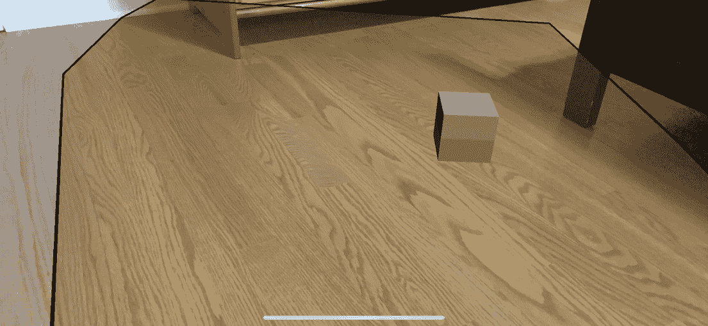

图 13.13 放置在跟踪平面上的立方体

这个例子仅涉及 AR Foundation 的基础知识。对于更深入的使用，请参考 Unity 的手册（[`mng.bz/p9aG`](http://mng.bz/p9aG)）以及 Unity 在 GitHub 上的示例项目（[`mng.bz/YwpN`](http://mng.bz/YwpN)）。

Unity 作为库

通常，Unity 项目作为自包含的应用程序部署，这种配置对于游戏来说非常合理。然而，Unity 越来越多地被用于非游戏 XR 开发，这些用户可能希望将他们的 Unity 项目与外部应用程序集成。

因此，Unity 现在能够将项目作为库部署，以便在更大的应用程序中使用。Unity 作为库的功能支持 iOS 和 Android，使移动开发者能够将增强现实内容（由 AR Foundation 提供）添加到他们的应用程序中。更多信息，请点击以下链接：

+   [`unity.com/features/unity-as-a-library`](https://unity.com/features/unity-as-a-library)

+   [`mng.bz/OQnn`](https://shortener.manning.com/OQnn)

恭喜，你已经到达了终点！

恭喜，你现在知道了在大多数主要平台上部署 Unity 游戏的步骤。所有平台的基本构建过程都很简单（只需一个按钮），但在各种平台上自定义应用程序可能会变得复杂。现在你准备好出去构建自己的游戏了！

## 摘要

+   Unity 可以为包括桌面计算机、移动设备和网站在内的各种平台构建可执行应用程序。

+   可以将大量设置应用于构建，包括像应用程序图标和显示名称这样的细节。

+   网页游戏可以与其嵌入的网页交互，从而允许各种有趣的网页应用程序。

+   Unity 支持自定义插件以扩展其功能。
