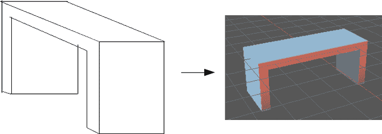
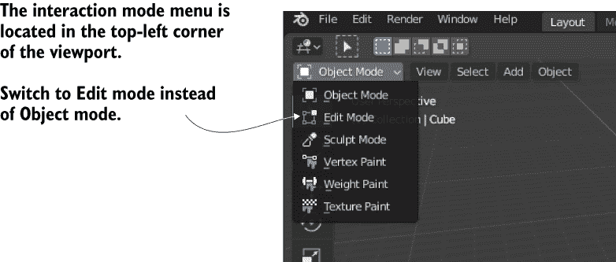
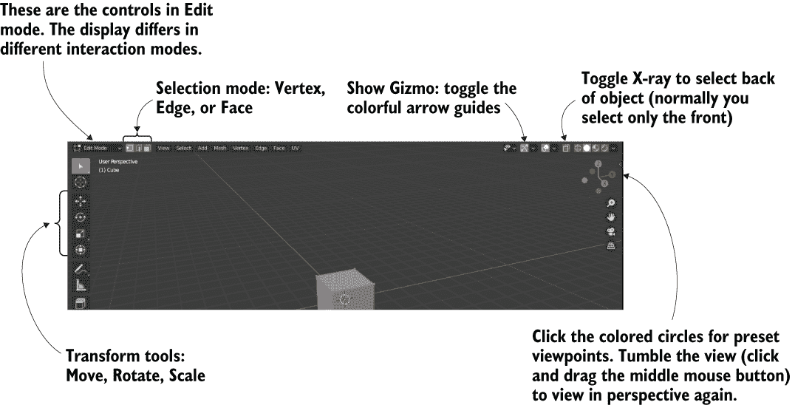
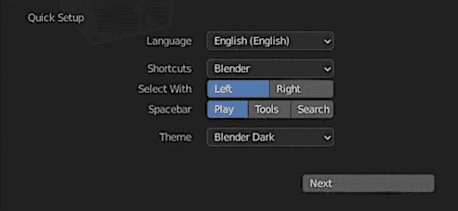
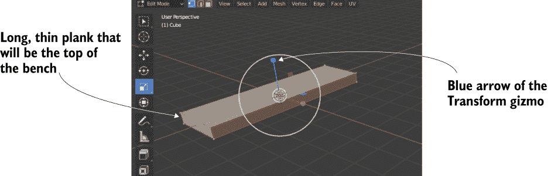
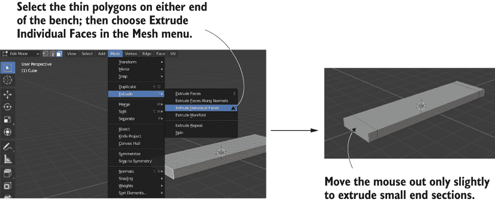
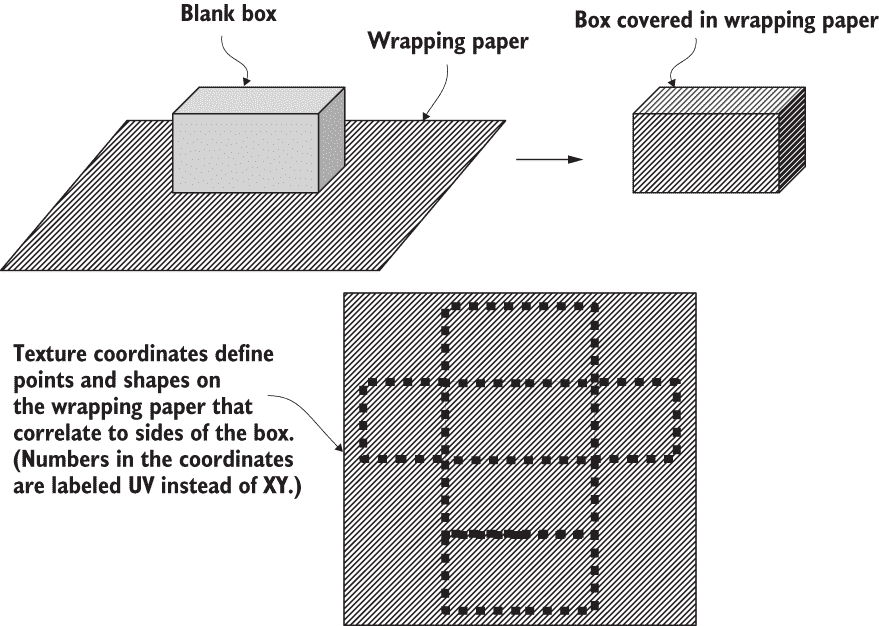
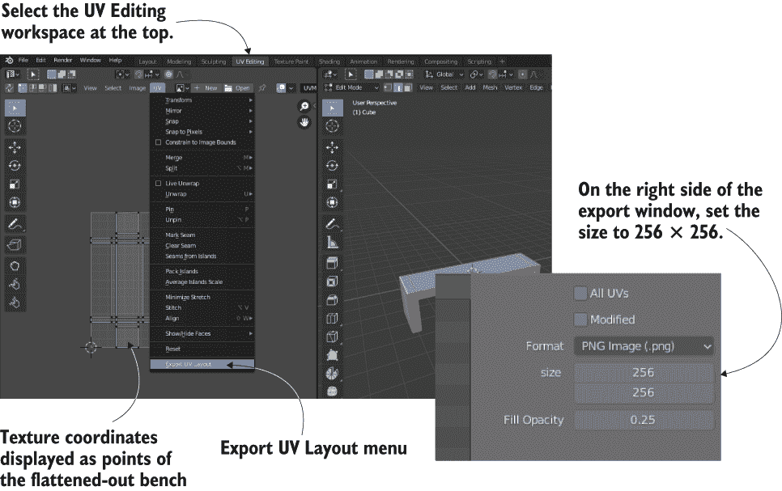
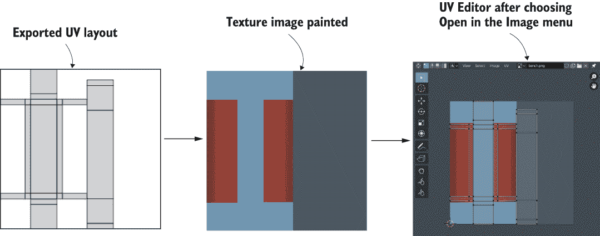
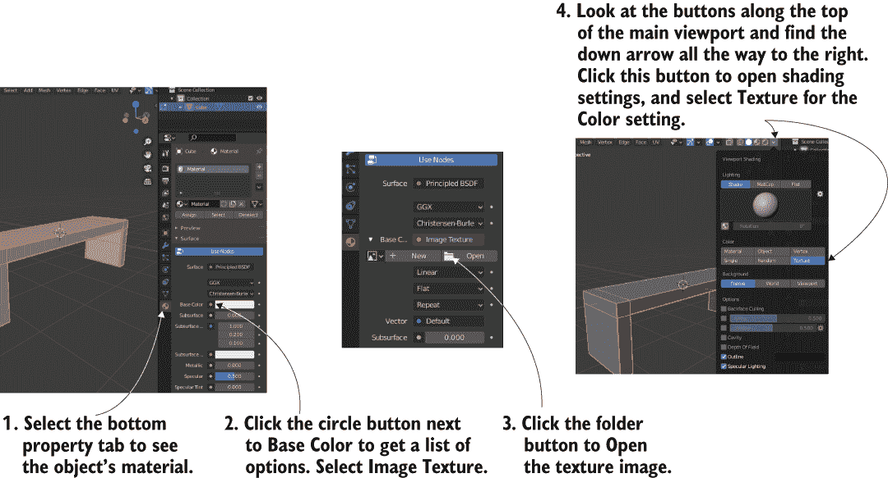

# 附录 C. 在 Blender 中建模长椅

在第二章和第四章中，我们探讨了创建带有大型平坦墙壁和地板的水平面。但更详细的对象怎么办？如果你想在房间里放置有趣的家具怎么办？你可以通过在外部 3D 艺术应用程序中构建 3D 模型来实现这一点。回想一下第四章引言中的定义：3D 模型是游戏中的网格对象（3D 形状）。在本附录中，我将向你展示如何创建一个简单的长椅网格对象（图 C.1）。

图 C.1 你将要建模的简单长椅的示意图。

尽管附录 B 列出了几个 3D 艺术工具，但我们将使用 Blender 进行此练习，因为它开源，因此所有读者都可以访问。你将在 Blender 中创建一个网格对象，并将其导出为与 Unity 兼容的艺术资产。

提示：建模是一个很大的主题，但我们将只介绍一些建模功能，这将允许你创建长椅。如果你想在本章之后继续学习更多关于建模的知识，请查看许多关于该主题的书籍和教程（首先，查看[www.blender.org](https://www.blender.org/)的学习资源）。

警告：我使用了 Blender 2.91，因此解释和截图来自该软件版本。Blender 的新版本频繁发布，按钮位置或命令名称可能会有所变化。

## C.1 构建网格几何形状

启动 Blender 并点击启动屏幕外的任何位置以关闭它；初始默认屏幕看起来像图 C.2，场景中间有一个立方体。使用鼠标中键来操纵相机视图：点击并拖动以旋转，按住 Shift 并点击拖动以平移，按住 Ctrl 并点击拖动以缩放。左键单击相机以选择它，按住 Shift 同时单击灯光以选择它，然后按 X 键删除两者。

图 C.2 Blender 中的初始默认屏幕

Blender 从对象模式开始，正如其名称所暗示的，它使你能够操纵整个对象，在场景中移动它们。要详细编辑单个网格对象，你必须选择它并切换到编辑模式；图 C.3 显示了您使用的菜单。

图 C.3 从对象模式切换到编辑模式的菜单

警告：Blender 界面的许多部分都是上下文相关的，这个菜单就是其中之一。菜单项根据所选对象而变化，无论是网格、相机还是其他对象。

当你第一次切换到编辑模式时，Blender 设置为顶点选择模式，但按钮允许你在顶点、边和面选择模式之间切换（参见图 C.4）。不同的选择模式允许你选择不同的网格元素。

图 C.4 视口侧面的控件

Blender 中的基本鼠标和键盘快捷键

图 C.4 中还包括了变换工具。与 Unity 一样，变换有移动、旋转和缩放。在视口的右上角有一个按钮可以切换显示 Gizmo（场景中的箭头）的开和关；我建议保持 Gizmo 开启，因为否则你只能通过键盘快捷键来访问变换工具。Blender 的键盘快捷键很难使用，这也是 Blender 的 UI 有坏名声的主要原因。

Blender 过去也经常使用非常非标准的鼠标功能。尽管使用中间鼠标按钮来操纵摄像机总是有道理的，但在场景中选择元素通常使用的是右键鼠标（在大多数应用程序中，左键鼠标用于选择）。现在左键点击是默认的选择方式，但正是这种旧功能使得启动 Blender 时的启动画面显示了此设置（在第一次启动后，在编辑 > 首选项中可以访问此设置）：

Blender 鼠标设置

类似地，选择框选择和取消选择过去也很奇怪，尽管现在你只需点击并拖动或点击空白区域即可。顺便说一句，如果你已经选择了某些东西，可以按住 Shift 键来添加到选择中，只需按下 A 键（代表全部）即可选择所有内容。

定义 *网格元素* 是构成网格几何形状的顶点、边和面——换句话说，就是单个角落点、连接点的线条以及填充在连接线条之间的形状。

这些是使用 Blender 的基本控制方法，因此现在我们将看到一些用于编辑模型的函数。首先，将立方体缩放成长条形。选择模型上的每个顶点（务必也选择面向远离物体的侧面的顶点；按 A 键选择全部）然后切换到缩放工具。点击并拖动蓝色臂向下缩放，然后点击并拖动绿色箭头向侧面扩展（见图 C.5）。

图 C.5 网格拉伸成长条形

切换到面选择模式（使用图 C.4 中指示的按钮）并选择长条的两端。你可以单独点击面，记得在添加到选择时按住 Shift 键。现在点击视口顶部的网格菜单，选择拉伸 > 拉伸单个面（见图 C.6）。当你移动鼠标时，你会看到长条两端的额外部分被添加；稍微移动它们，然后左键点击以确认。使这个额外部分只有长凳腿的宽度，给自己留一点额外的几何形状来工作。

图 C.6 在网格菜单中，使用拉伸单个面来拉出额外的部分。

定义*拉伸*通过具有所选面形状的横截面推出新的几何形状。不同的拉伸命令定义了在多个元素被选中时应该做什么：拉伸单个面将每个面视为一个单独的部分进行拉伸，而标准的拉伸面命令将整个选择视为一个单独的部分。

现在看看板子的底部，并选择每端的两个薄面。再次使用“拉伸单个面”命令向下拉出长椅的腿（参见图 C.7）。

图 C.7 选择长椅下方的薄面并向下拉出腿。

形状已经完成！但在将模型导出到 Unity 之前，你需要注意对模型进行纹理处理。

## C.2 纹理映射模型

3D 模型可以在其表面显示 2D 图像（称为*纹理*）。对于像墙壁这样的大而平的表面，2D 图像如何与 3D 表面相关联是直观的：只需将图像拉伸到平坦的表面上即可。但是，对于像长椅侧面这样的不规则形状表面呢？这就是理解纹理坐标概念变得重要的地方。

*纹理坐标*定义了纹理的哪些部分与网格的哪些部分相关联。这些坐标将网格元素分配到纹理的各个区域。想象一下包装纸（见图 C.8）；3D 模型是被包装的盒子，纹理是包装纸，而纹理坐标代表盒子上的点，包装纸将放在这些点上。纹理坐标定义了 2D 图像上的点和形状；这些形状与网格上的多边形相关联，图像的这一部分就出现在网格的这一部分上。

图 C.8 包装纸很好地说明了纹理坐标的工作原理。

小贴士：纹理坐标的另一个名称是*UV 坐标*。这是因为纹理坐标是使用字母 U 和 V 定义的，就像 3D 模型上的坐标是使用 X、Y 和 Z 定义的一样。

将一个事物的一部分与另一个事物的一部分相关联的技术术语是*映射*——因此，创建纹理坐标的过程被称为*纹理映射*。从包装纸的类比中，这个过程还有另一个名字，即*展开*。还有更多术语是通过混合其他术语创建的，例如*UV 展开*；围绕纹理映射存在许多本质上同义的术语，所以尽量不要混淆。

传统上，纹理映射的过程非常复杂，但幸运的是，Blender 提供了使过程变得相当简单的工具。首先你在模型上定义接缝；如果你进一步思考围绕一个盒子（或者更好的是，考虑相反的方向，展开一个盒子），你会意识到当展开到二维时，3D 形状的每个部分并不都能保持无缝。在 3D 形状中，侧面分开的地方将需要接缝。Blender 允许你选择边缘并将它们声明为接缝。

切换到边缘选择模式（见图 C.4 中的按钮）并选择长椅底部的边缘。现在选择边缘 > 标记接缝（见图 C.9）。这告诉 Blender 为了纹理映射的目的将长椅底部分开。对长椅的侧面也做同样的事情，但不要完全分开侧面。相反，只对接缝沿着长椅腿的边缘进行接缝处理；这样，侧面将保持与长椅相连，同时像翅膀一样展开。

图 C.9 长椅底部和腿部的接缝边缘

一旦所有接缝都被标记，运行纹理展开命令。首先，选择整个网格（只需按 A 键选择所有内容，或者使用框选，别忘了选择面向远离物体的那一侧）。接下来，选择 UV > 展开以创建纹理坐标。但在这个视图中你无法看到纹理坐标；Blender 默认以场景的 3D 视图显示。切换到 UV 编辑工作区以查看纹理坐标，使用屏幕顶部的工具栏标签（见图 C.10）。

图 C.10 切换到 UV 编辑，然后导出 UV 布局。

现在，你可以看到纹理坐标了。你可以看到长椅的多边形被平铺、分离和展开，这些都是根据你标记的接缝进行的。要绘制纹理，你必须在你图像编辑程序中看到这些 UV 坐标。再次参考图 C.10，在纹理坐标视图中 UV 菜单下选择导出 UV 布局；将图像保存为 bench.png（这个名称将在稍后导入 Unity 时使用），大小为 256。

在你的图像编辑器中打开这张图片，并为纹理的各个部分绘制颜色。为不同的 UV 绘制不同的颜色将把不同的颜色放在那些面上。例如，图 C.11 显示了在 UV 布局顶部展开的长椅底部较暗的蓝色，以及长椅侧面的红色。现在可以将图像带回到 Blender 中为模型添加纹理；选择图像 > 打开。

图 C.11 在导出的 UV 上绘制颜色，然后将纹理带入 Blender。

即使在 UV 编辑视图中打开了纹理图像，你仍然无法在 3D 视图中看到模型上的纹理。这需要额外的几个步骤：将图像分配给对象的材质，然后在视图中打开纹理（见图 C.12）。现在你可以看到应用了纹理的完成后的长椅了！

图 C.12 将图像设置在对象的材质上以在模型上查看纹理。

现在保存模型。Blender 会使用 Blender 的原生文件格式（.blend 扩展名）保存文件。在原生文件格式下工作，以确保 Blender 的所有功能都能正确保留，但稍后你将不得不将模型导出为不同的文件格式（第四章推荐 FBX 格式）以导入到 Unity 中。请注意，纹理图像不会保存在模型文件中；保存的是对图像的引用，但你仍然需要被引用的图像文件。
